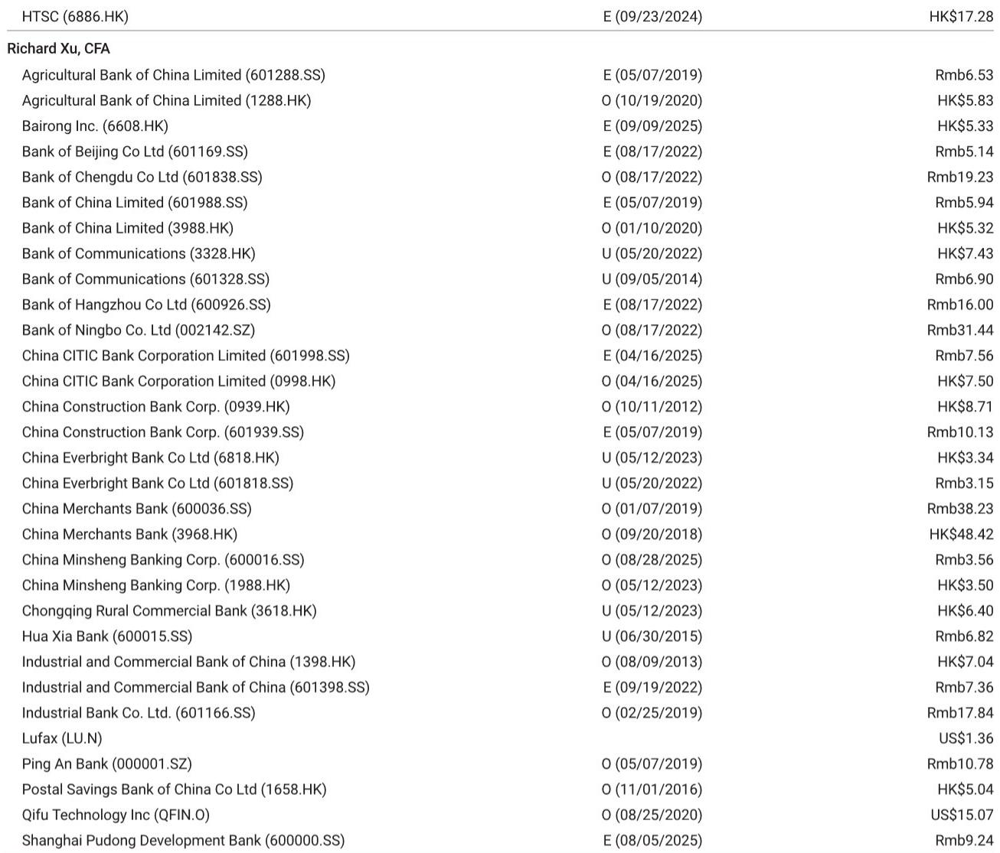
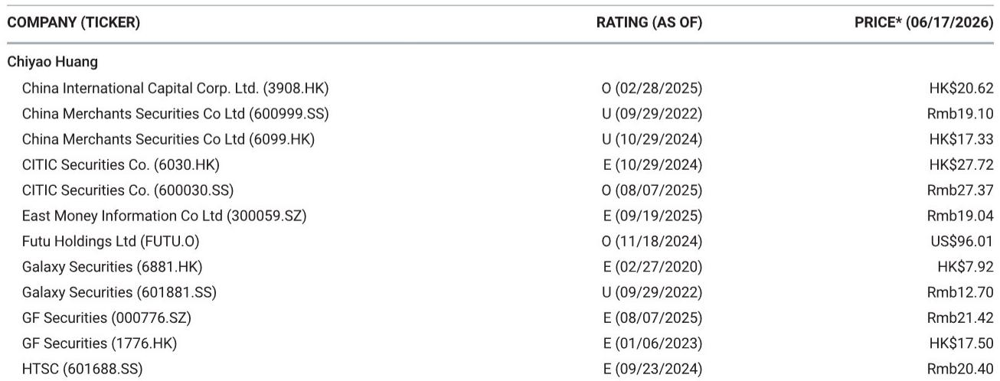
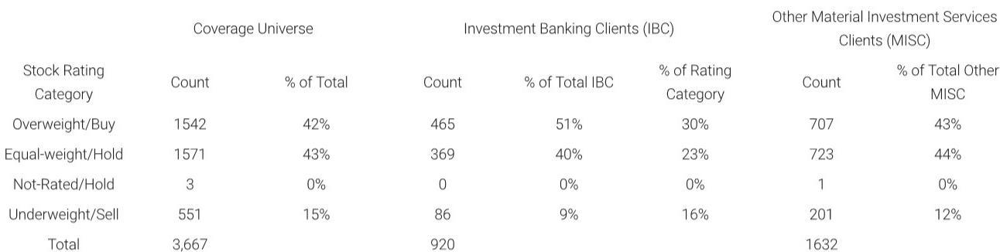

# 摩根斯坦利：2026陆家嘴论坛的真正信号不是开放，而是金融业增长逻辑的重新定价

市场对2026年陆家嘴论坛的关注，大多集中在“进一步开放”这个关键词上。新的QDII额度、简化ODI流程、跨境贸易外汇结算试点——这些政策细节确实被密集释放。但摩根斯坦利这份研报试图传达的判断，远比“开放”二字复杂。

这份报告的核心主张是：陆家嘴论坛传递的，不是简单的政策宽松信号，而是一套关于中国金融业增长质量的重新定义框架。开放是手段，但风险控制和高质量发展才是目的。两者并非对立，而是构成了一个更精细的政策组合——这意味着金融机构的估值逻辑，需要从“规模增长”切换到“质量定价”。

为什么这个判断重要？因为过去几个月，市场对跨境资本流动收紧的担忧在累积。香港市场和中概股的波动，部分源于这种不确定感。摩根斯坦利在5月底的两份报告中已经试图缓解这种担忧，而本次论坛的政策信号，则是对市场预期的直接回应。但报告同时明确指出，开放不等于放松监管——银行业的理性信贷增长、保险业的费用管控、资本市场的有序IPO机制，这些才是论坛真正的结构性信号。

以下五个层次，拆解这份报告的真正含义。

## 1. 开放政策的信号意义大于实质：它缓解的不是资本流出，而是政策不确定性溢价

摩根斯坦利报告明确将论坛的开放信号与5月以来的市场担忧联系起来。PBOC和SAFE在论坛上宣布的几项具体政策——新的QDII额度、简化ODI、外债外汇管理优化、上海跨境贸易外汇结算试点——在报告中被描述为“支持人民币全球化和拓宽而非限制跨境资本流动”。

但仔细看，这些政策本身并非颠覆性的。QDII额度增加是渐进式操作，上海试点是局部推进。真正重要的是信号本身：政策制定者有意向市场表明，金融开放的长期方向没有改变。这一点，对于过去几个月因各种传闻而承压的跨境资本流动预期，是一个明确的纠偏。

这意味着什么？对于投资中国金融资产的全球投资者而言，真正被降低的不是资本流动的实际摩擦成本，而是政策不确定性溢价。后者对资产定价的影响，往往比前者更大。当市场不再需要为“会不会突然收紧”而支付风险溢价时，估值中枢的重估就有了基础。

但报告同时提醒，这种信号效应能否持续，取决于后续政策的执行节奏和力度。这里有一个尚未完全回答的问题：开放政策是否会因为宏观审慎考虑而出现阶段性调整？报告没有给出确定性答案，而是通过强调“风险控制”和“高质量增长”的并行表述，暗示政策框架已经内置了这种平衡。

## 2. 银行业的核心叙事已从“增速”转向“质量”：理性信贷增长成为新常态意味着什么

报告中最具结构性的判断，来自PBOC关于信贷增长的表述：更慢但更高质量的贷款增长可能成为新常态。摩根斯坦利将其描述为“与我们对理性信贷增长的看法一致”。

这句话的潜台词值得深挖。过去几年，中国银行业的估值逻辑在很大程度上依赖于规模扩张——贷款增速、资产规模增长、市场份额变化。当“理性信贷增长”成为政策导向时，银行之间的竞争将从“谁放贷更快”转向“谁放贷更好”。这意味着：

第一，资产质量而非规模增速，将成为银行股定价的核心变量。那些在信贷审批和风险管理上有优势的银行，其估值溢价将扩大。第二，息差收窄的压力可能会被更严格的信贷纪律部分对冲——如果银行不再为争夺市场份额而压低利率，净息差的下行斜率可能趋缓。第三，系统性风险的降低，本身就是估值提升的因素——当政策明确为信贷增长设置“质量门槛”时，市场对银行体系尾部风险的定价会下降。

报告还提到PBOC正在设立针对非银行金融机构的流动性支持工具，以防止系统性风险。这进一步强化了“质量优先”的政策导向：增长可以慢，但不能出风险。

## 3. 保险业的监管信号直指费用竞争：这对财产险的综合成本率是实质性利好

报告对保险业的判断相对简洁但明确：NAFR继续强调纠正无序竞争和严格执行费用规则，这将有利于财产险公司的综合成本率（CoR）。

这个判断的背后，是中国财产险市场长期存在的结构性痛点——费用竞争导致承保利润被侵蚀。监管层在过去两年持续推动费用管控，但执行效果因公司而异。陆家嘴论坛上重申这一立场，意味着监管决心没有松动。

对于投资者而言，这意味着什么？财产险公司的盈利改善，可能不再依赖于保费增长，而是依赖于费用率的下降。那些在渠道管理和费用控制上已经领先的公司，将享受监管红利。而那些依靠高费用获取市场份额的公司，将面临更大的调整压力。

这里需要指出的是，报告没有展开讨论寿险板块。寿险的负债成本管理和投资端压力，同样是行业的关键变量。监管信号对寿险的影响，可能需要从更长的利率和资产配置周期来理解。这是我们后续可以深入探讨的方向。

## 4. 资本市场改革更注重“效率”而非“数量”：灵活的IPO机制和产品创新是结构性变化

CSRC在论坛上宣布的几项改革——修改上市规则、加速推出储架注册机制、推出主动管理ETF和商业地产REITs试点——在摩根斯坦利的解读中，核心是“更灵活但也更有纪律的IPO机制”。

储架注册机制的意义在于，它允许发行人根据市场条件灵活选择发行窗口，而不是在审批通过后必须在限定期限内完成发行。这降低了发行人的时间成本，也减少了市场因集中发行而承受的供给压力。对于券商而言，这意味着投行业务的模式可能从“项目导向”转向“持续服务导向”，承销能力的价值将重新定义。

主动管理ETF和商业地产REITs试点，则指向产品端的多元化。这些创新产品的推出，有助于拓宽资本市场的深度和广度，为投资者提供更多风险收益特征的选择。对于资产管理公司而言，产品创新能力将成为竞争壁垒。

但报告也隐含了一个问题：这些改革能否真正提升资本市场的融资效率和定价效率？储架注册机制的实际效果，取决于发行人的使用意愿和市场的承接能力。REITs试点的推进速度，取决于底层资产的合规性和税务安排。这些执行层面的细节，报告没有深入展开，但它们是判断改革实际影响的关键。

## 5. 报告尚未完全回答的关键问题：开放与监管之间的动态平衡如何在实际操作中维持

这是整份报告最值得追问的问题。

摩根斯坦利在报告中同时强调了两条线：一条是开放，包括QDII额度、ODI简化、跨境结算试点；另一条是监管，包括理性信贷、费用管控、有序IPO。这两条线在逻辑上并不矛盾，但在实际操作中，如何维持动态平衡？

例如，当跨境资本流动出现大幅波动时，开放政策是否会遭遇阶段性调整？当信贷质量压力上升时，理性增长的要求是否会进一步收紧，从而对经济产生抑制效应？当资本市场改革推进时，监管层如何平衡创新与风险？

报告没有给出明确的答案，而是通过“风险控制、适当监管和高质量增长”这一表述，暗示政策框架本身已经包含了这种平衡机制。但对于投资者而言，真正的挑战在于：如何在政策信号的短期波动中，识别出长期的结构性方向。

这里的观察框架可以是：关注政策执行中的“一致性”而非“力度”。如果开放政策和监管政策在方向上保持一致——开放服务于高质量增长，监管服务于风险控制——那么短期波动只是噪音。但如果两者出现方向性背离，就需要重新审视判断。

这正是我们可以在社群中持续讨论的问题：如何通过跟踪政策执行细节，提前识别这种平衡的变化？

---

陆家嘴论坛的政策信号，本质上是在回答一个问题：中国金融业的未来增长，应该靠什么驱动？摩根斯坦利的答案是：不是靠规模扩张，而是靠质量提升。开放是手段，风险控制是底线，高质量增长是目标。这三者构成的政策框架，意味着金融机构的竞争逻辑和估值逻辑正在发生根本性变化。

但框架的确立只是第一步。政策的执行力度、市场参与者的适应速度、外部环境的变化，都会影响这个框架的实际效果。这些未解问题，正是我们继续追踪和讨论的方向。

欢迎来星球微信群里继续讨论：如何从政策细节中提前识别行业格局的变化，以及哪些金融机构更有可能在“质量定价”的新逻辑下受益。

Personal reading notes and learning share only. Not investment advice.

