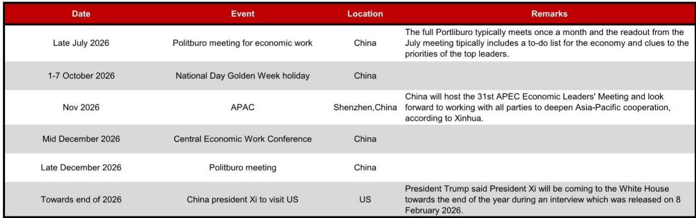
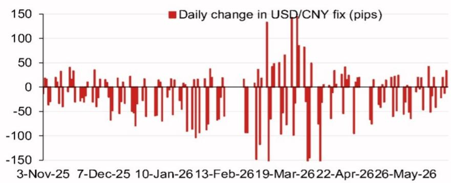
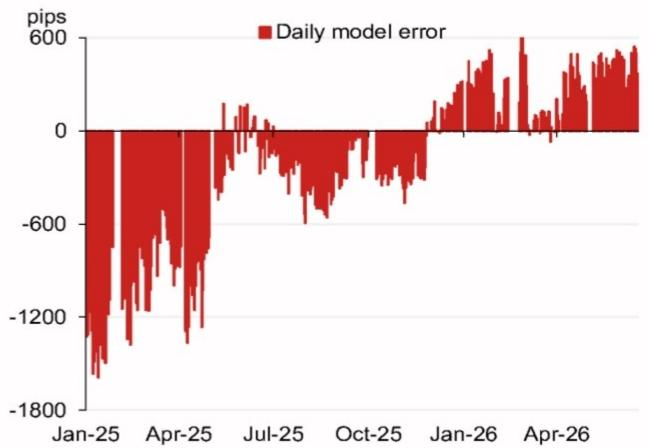

# NOM：人民币中间价模型正在发出一个被市场忽视的定价信号

人民币汇率中间价的每日设定，长期以来被市场视为一个政策信号灯。大多数投资者关注的是中间价本身的方向——是升值还是贬值，以及它与前一交易日收盘价的偏离幅度。但NOM最新发布的USD/CNY定盘价模型报告揭示了一个更精细的维度：模型内部各货币的贡献权重和逆周期因子的调整幅度，正在传递一个关于央行汇率管理策略变化的信号。这个信号比中间价的方向更重要，因为它指向的是政策框架的微调，而非一次性干预。

这份报告的核心判断是：市场对人民币汇率定价的理解，仍停留在“央行是否容忍贬值”的二元框架中，而忽略了中间价形成机制内部结构的持续变化。真正重要的不是中间价定在哪个数字，而是这个数字如何被计算出来。

## 1. 模型预测与官方定盘价的偏离，正在暴露政策意图的微妙变化

NOM模型给出的最新预测值是6.7745，较前一交易日下降385个基点。如果考虑逆周期因子调整，预测值为6.7965，较前一交易日下降165个基点。这两个数字本身并不惊人——人民币中间价在6.7-6.8区间波动已是常态。真正值得关注的是模型误差的趋势。

报告中的模型误差图显示，自2025年中的低点以来，模型误差（即模型预测与官方定盘价之间的差值）已经从接近零的水平扩大至约600个基点的正值区间。这意味着，官方定盘价系统性地高于模型预测值——换言之，央行在中间价设定中持续加入了比模型预期更强的“抗贬值”力量。

这个趋势不是偶然的。它表明，央行并非简单地维持中间价稳定，而是在主动压缩贬值空间。当模型预测中间价应该更低（即人民币更强）时，官方定盘价却更高（即人民币更弱），这恰恰说明央行的操作方向与市场预期相反——它在抑制升值，而非阻止贬值。这一点对很多持有“央行在放任贬值”观点的投资者来说，是一个重要的认知修正。

## 2. 欧元和日元成为中间价变动的主要贡献者，折射出人民币定价的全球维度正在重新定义

报告中最具洞察力的部分，是图1中展示的隔夜变动贡献权重。在影响模型预测变动的四大货币中，欧元贡献了35.5个基点，日元贡献了18.8个基点，韩元和英镑紧随其后。这个权重分布并非随机。

欧元和日元在CFETS人民币汇率指数中的权重分别为约18%和15%，但它们在中间价模型中的贡献占比远高于这一比例。这意味着，央行在设定中间价时，对欧元和日元隔夜变动的反应系数正在上升。这背后有两个可能的解释：一是央行在主动增加人民币对一篮子货币的锚定，而非仅盯住美元；二是央行在利用欧元和日元的波动来对冲美元单向变动的影响。

对于企业财务总监和跨境投资者来说，这个变化意味着：过去只需要关注美元/人民币汇率，现在需要同时关注欧元/美元和美元/日元的联动关系。人民币汇率的决定因素正在从“中美双边关系”向“全球货币体系”扩展。

## 3. 逆周期因子正在从“防御工具”转变为“主动管理工具”，其使用频率和幅度都在变化

逆周期因子是央行用来平滑中间价波动、防止单边预期的工具。过去几年，市场习惯了将其视为一种“应急手段”——只有在汇率出现剧烈波动时才会被激活。但这份报告的数据暗示，逆周期因子的使用已经变得更加常规化和精细化。

模型预测与考虑逆周期因子后的预测值之间的差值，从385个基点缩小到165个基点，意味着逆周期因子实际上抵消了约220个基点的模型变动。这个幅度不大不小，既不是完全放任市场，也不是强力干预。它传递的信号是：央行希望中间价保持稳定，但不愿意让市场认为它在进行大规模干预。

这种“润物细无声”的操作风格，可能是未来人民币汇率管理的新常态。对于交易员而言，这意味着不能再用“是否突破某个点位”来判断央行态度，而需要更细致地观察中间价形成机制中的参数变化。

## 4. 报告尚未完全回答的关键问题：模型误差的持续扩大是否意味着央行容忍了更大的定价偏离？

模型误差从接近零扩大到600个基点，是这份报告中最引人注目的数据点之一。但报告没有完全解释这个误差扩大的原因。一种可能是模型本身存在系统性的预测偏差，另一种可能是央行在有意扩大中间价与模型预测之间的差距。

如果是前者，那么模型需要重新校准，误差扩大本身不构成政策信号。但如果是后者，这意味着央行正在主动调整中间价形成机制，可能是为了在特定事件（如APEC会议、美国大选后的政策调整、年底的中美领导人会晤）前预留政策空间。

报告中的事件日历表列出了2026年下半年多个关键时点：7月底的政治局会议、10月的国庆黄金周、11月中国主办的APEC会议、12月的中央经济工作会议，以及年底可能的中美领导人会晤。这些事件构成了一个密集的政策窗口期。央行可能在利用当前相对平稳的市场环境，逐步调整中间价定价机制，为未来可能出现的波动做准备。

## 5. 对投资者的观察框架：从“中间价方向”转向“中间价形成机制”

基于这份报告，投资者可以建立一个更立体的观察框架。不再只是问“中间价是升是贬”，而是问四个问题：

第一，模型预测值与官方定盘价的偏离幅度在扩大还是缩小？这反映了央行的干预意愿。

第二，逆周期因子的调整方向是什么？是放大还是缩小模型变动？这揭示了央行的主动管理倾向。

第三，各货币的贡献权重是否在变化？欧元和日元的权重上升是否持续？这指向人民币定价的全球化程度。

第四，模型误差的趋势是否与政策事件日历相关？误差扩大是否发生在重要会议前？这可以帮助判断央行的政策节奏。

这个框架的价值在于，它让投资者从被动接受中间价，转向主动解读中间价背后的政策逻辑。对于持有人民币资产或涉及跨境贸易的企业来说，这种解读能力直接关系到汇率风险管理的有效性。

## 6. 一个尚未被定价的风险：如果模型误差持续扩大，市场可能会重新评估央行的汇率政策可信度

模型误差的持续扩大，如果被市场解读为央行在“操纵”中间价，可能会引发对央行汇率政策独立性的质疑。目前市场对此关注度不高，因为误差绝对值仍然在可接受范围内。但如果误差继续扩大，或者持续时间超过一个季度，情况可能发生变化。

届时，市场可能会开始定价一个“央行失去对中间价控制权”的风险，或者反过来，定价一个“央行将被迫一次性调整中间价”的风险。这两种情景对人民币资产的影响方向是相反的，但都意味着波动性的上升。

报告没有直接讨论这个风险，但从模型误差的历史走势来看，类似规模的误差在2025年初也曾出现，随后市场经历了一轮人民币贬值压力。历史不会简单重复，但这个模式值得警惕。

---

以上分析只是NOM这份报告的一部分。报告中还包含了对逆周期因子调整幅度的详细量化、各货币贡献权重的历史变化、以及模型误差与政策事件之间的时间关联等更多数据和分析。这些内容对于理解人民币汇率定价的底层逻辑至关重要，但限于篇幅无法在此展开。

如果你希望看到完整的报告解读和原始数据图表，欢迎加入我们的知识星球和微信群，那里会有更深入的讨论。我们会在社群中继续拆解这份报告的模型细节，并讨论如何将模型误差信号转化为具体的交易和风险管理策略。

Personal reading notes and learning share only. Not investment advice.

