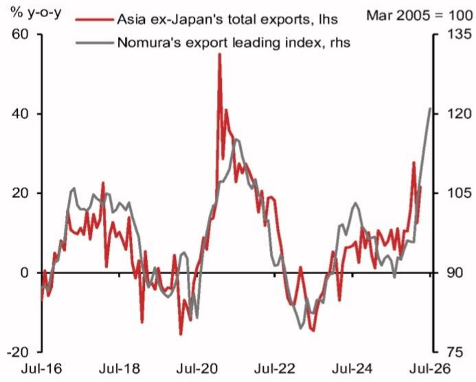

# NOM：亚洲出口的超级周期并非只有AI，一个被低估的转折点正在浮现

市场对亚洲出口的讨论，大多集中在AI驱动的半导体和电子产业链上。但NOM最新发布的一份图表报告，揭示了一个更重要的信号：一个领先指标已经飙升至16年新高，而驱动因素正在从单一的技术周期，向一个更宽广、更可持续的复苏切换。

这份报告的核心判断是：亚洲出口的超级增长周期远未结束，但市场可能低估了其结构性扩围的潜力。真正值得关注的，不是AI需求还能多强，而是当供应链扰动消退、全球资本品需求回升时，哪些国家、哪些行业能承接这轮“扩围”的增量。

## 1. 一个历史级信号：NELI指数升至16年高位，预示的不只是短期繁荣

NOM亚洲出口领先指数（NELI）在7月攀升至121，这是自2006年以来的最高水平。该指数由九个分项组成，领先实际出口数据约三个月，且历史上准确预测了亚洲出口的每一次重大拐点。

这个数字意味着什么？它暗示亚洲（除日本外）的出口增长动能将在三季度延续，甚至可能进一步加速。更重要的是，NELI的上升正在变得更加“广泛”——不仅科技相关指标强劲，整体制造业和中国需求也出现了改善迹象。

这并非一个孤立的短期脉冲。NELI的构成决定了它能够过滤掉基数效应的干扰，反映的是出口增长的潜在动量。当这样一个领先指标创下16年纪录，其对资产定价的启示是：以出口为导向的经济体（如韩国、台湾、越南、马来西亚）的宏观基本面，可能在未来几个季度持续超预期。

## 2. 科技周期仍是主力，但真正的变量在于“非科技”的接力

报告明确指出，AI技术周期一直是亚洲出口的主要引擎。这一点市场已有充分定价。但NOM报告的关键增量，在于指出了另一个正在成形的驱动因素：霍尔木兹海峡的重新开放。

这一点值得仔细拆解。霍尔木兹海峡的通行恢复，将缓解全球供应链压力。虽然正常化过程可能需要数月，但方向是明确的。这意味着什么？它意味着全球不确定性下降，企业资本开支意愿回升。而资本品需求——即机器、设备、工业零部件——是亚洲出口中一个体量巨大、但对供应链风险极度敏感的部分。

当供应链扰动缓解，企业从“保供应”转向“扩产能”，资本品需求将成为亚洲出口增长的新引擎。这轮扩围将超越科技行业，惠及工业、机械、化工等更广泛的领域。报告认为，这将支持亚洲出口周期的进一步拓宽。

## 3. 市场可能低估的，是“供应链正常化”对出口结构的影响

当前市场对亚洲出口的叙事，高度集中于AI芯片、服务器和相关零组件的出货量。这没有问题，但可能过于狭窄。NOM报告提出的逻辑是：供应链压力的缓解，将释放被压抑的资本品需求，而这部分需求对亚洲出口的拉动，可能比市场预期的更为显著。

从历史经验看，亚洲出口的超级周期往往由科技需求启动，但随后会扩散到更广泛的制造业。2017-2018年的全球贸易复苏就是一个典型例子。当时，半导体周期率先复苏，随后资本品和消费品出口同步跟进，形成了全面的繁荣。

当前的信号显示，类似的结构性扩散可能正在发生。NELI的“广度”提升，正是这一过程的早期证据。投资者需要关注的，不是AI需求是否见顶，而是非科技行业的出口动能能否持续改善。如果答案是肯定的，那么当前对亚洲出口的定价可能仍然偏保守。

## 4. 报告尚未完全回答的关键问题：中国需求改善的可持续性

NOM报告提到“中国需求出现改善迹象”，但并未对此展开详细论证。这恰恰是当前框架中最大的不确定点。

中国作为亚洲最大的最终需求市场和中间品贸易枢纽，其内需的强弱直接影响整个区域的出口链条。NELI中包含的中国相关指标，是否反映了政策刺激的短期效应，还是结构性复苏的开端？这一点报告的图表数据可以给出方向，但无法提供确定性答案。

此外，报告没有讨论的是，如果中国需求改善主要来自库存回补而非终端消费，那么其对亚洲出口的拉动可能会在几个季度后衰减。这个假设的验证，将直接决定这轮出口周期的斜率。

## 5. 一个需要持续跟踪的观察框架：从“广度”到“深度”

基于这份报告，投资者可以建立一个更系统的观察框架。核心是跟踪两个维度的变化：

第一是“广度”。NELI的九个分项中，有多少个在同步改善？如果改善范围从科技扩散到制造业、资本品，那么出口复苏的可持续性将显著增强。反之，如果只有科技指标一枝独秀，那么市场对亚洲出口的乐观情绪可能需要重新审视。

第二是“深度”。供应链正常化带来的资本品需求回升，其量级有多大？这可以通过跟踪韩国、日本、德国的机械订单数据，以及全球PMI中的资本品新订单分项来判断。如果这些指标在未来1-2个季度持续走强，那么亚洲出口的超级周期将获得第二个引擎。

NOM的这份报告，本质上是在提醒市场：不要把目光只盯住AI。亚洲出口的下一波机会，可能来自于一个更传统、更宏大的逻辑——全球商业周期的重启。

然而，报告也留下了几个悬而未决的问题：霍尔木兹海峡正常化的具体时间表如何？中国需求的改善能否持续？资本品需求的回升，是否会因利率环境而受到抑制？这些问题，恰恰是理解这轮周期最终高度的关键。

欢迎来星球微信群里继续讨论。我们将持续追踪NELI指数的月度变化，以及资本品需求、中国进口等关键指标的后续数据。在群里，我们可以结合原始报告的完整图表，对每一个分项的边际变化做更细致的拆解，并讨论这些信号对不同市场、不同资产的定价含义。

Personal reading notes and learning share only. Not investment advice.

