This material is neither intended to be distributed to Mainland China investors nor to provide securities investment consultancy services within the territory of Mainland China. This material or any portion hereof may not be reprinted, sold or redistributed without the written consent of JPM.

## China Consumer

Cheap but unloved – stay selective while waiting for the earnings floor

## China Consumer

Jessie Xu AC

Phone: +852 2800-8590

E-mail: jessie.j.xu@JPM.com

JPM Securities (Asia Pacific) Limited/ JPM Broking (Hong Kong) Limited

See the end pages of this presentation for analyst certification and important disclosures, including non-US analyst disclosures.

## Key thesis

China Consumer Top Picks: (1) Nongfu (OW): strong brand momentum and margin buffer; (2) Anta (OW): well-executed multi-brand portfolio and overseas upside; (3) Guming (OW): continued runway for network growth and improving brand equity.

Earnings revisions YTD: 2026 consensus EPS is down 9% for Staples and 7% for Discretionary. 80% of our coverage is down YTD, led by Baijiu, beauty, etc. Winners on revisions are fewer but real: Guming, Laopu, Li Ning, and Nongfu. “Full pricing” of cost pressure may not show up until late 2026.  
What if the Iran conflict ended now? Packaging and industrial inputs (e.g. PE/PET) are up 15-40% vs the 2025 average. JPM China Economics team forecasts PPI at 3.5%/3.9%/3.5% in 2-4Q26 and CPI at 1.3%/1.4%/1.1%, widening the CPI-PPI gap to -2.9pp. In this tape, Baijiu and beer look more insulated (less cut-throat competition), while beverages are more exposed. Pricing power matters: Moutai, major brewers, and Haitian should be better positioned to pass costs through.  
Alpha comes from operator quality, not beta. Demand may stay headline-noisy, but the real story is the split underneath. Operator quality – not broad category beta – should be the primary source of alpha. Based on our scoring across fundamentals (demand/supply/pricing/margins), returns (dividends), and valuation, sportswear, pop toys, and white appliances stand out over the next 3-5 years. In our coverage, we like Anta, Pop Mart, and Midea.  
Catalysts to watch and strategy: Cost inflation hitting from 3Q26 is a headwind for beverages. Mid-Autumn Festival and October Golden Week are key read-throughs for baijiu and gold/jewelry.

Positioning: add FMD after June (Guming, Luckin, Chagee); avoid beverages (especially crowded dividend trades) in 3Q26. Comps get friendlier over time: Moutai (N) from 3Q26, FMD and Pop Mart (N) from 4Q26, and beverages from 2Q27.

## Focus Charts

Earnings revisions and share price performance

<table><tr><td rowspan="2">Company name</td><td rowspan="2">Sub-sector</td><td rowspan="2">BBG Ticker</td><td rowspan="2">Price (LC)</td><td rowspan="2">Mkt Cap (USDmn)</td><td colspan="2">Net profit YoY</td><td>NP CAGR</td><td colspan="3">FY26 sales revisions</td><td colspan="3">FY26 NP revisions</td><td colspan="3">Share performance</td></tr><tr><td>2026E</td><td>2027E</td><td>25-27E</td><td>1Q26</td><td>2QTD</td><td>YTD</td><td>1Q26</td><td>2QTD</td><td>YTD</td><td>1M</td><td>3M</td><td>YTD</td></tr><tr><td colspan="17">China/HK SAR Staples</td></tr><tr><td>Moutai - A</td><td>Baijiu</td><td>600519 CH</td><td>1240.0</td><td>229,024</td><td>4.1%</td><td>6.6%</td><td>5.4%</td><td>-2%</td><td>-6%</td><td>-8%</td><td>-2%</td><td>-10%</td><td>-11%</td><td>-6%</td><td>-16%</td><td>-10%</td></tr><tr><td>Wuliangye - A</td><td>Baijiu</td><td>000858 CH</td><td>77.5</td><td>44,440</td><td>126.3%</td><td>9.1%</td><td>57.2%</td><td>-5%</td><td>-20%</td><td>-24%</td><td>-5%</td><td>-20%</td><td>-24%</td><td>-9%</td><td>-25%</td><td>-27%</td></tr><tr><td>Luzhou Laojiao - A</td><td>Baijiu</td><td>000568 CH</td><td>82.9</td><td>18,037</td><td>-4.6%</td><td>8.8%</td><td>1.8%</td><td>-3%</td><td>-11%</td><td>-14%</td><td>-4%</td><td>-12%</td><td>-16%</td><td>-8%</td><td>-22%</td><td>-29%</td></tr><tr><td>Yanghe - A</td><td>Baijiu</td><td>002304 CH</td><td>42.1</td><td>9,366</td><td>29.4%</td><td>15.6%</td><td>22.3%</td><td>-3%</td><td>-10%</td><td>-13%</td><td>-12%</td><td>-23%</td><td>-32%</td><td>-7%</td><td>-18%</td><td>-31%</td></tr><tr><td>Budweiser APAC</td><td>Beer</td><td>1876 HK</td><td>6.7</td><td>11,238</td><td>20.5%</td><td>9.5%</td><td>14.9%</td><td>-3%</td><td>-1%</td><td>-4%</td><td>-15%</td><td>-4%</td><td>-18%</td><td>-12%</td><td>-9%</td><td>-12%</td></tr><tr><td>CRB</td><td>Beer</td><td>291 HK</td><td>22.1</td><td>9,157</td><td>51.7%</td><td>6.4%</td><td>27.0%</td><td>-2%</td><td>-1%</td><td>-3%</td><td>-2%</td><td>-1%</td><td>-3%</td><td>-16%</td><td>-14%</td><td>-16%</td></tr><tr><td>Tsingtao - A</td><td>Beer</td><td>600600 CH</td><td>56.1</td><td>9,796</td><td>9.2%</td><td>5.3%</td><td>7.2%</td><td>-1%</td><td>0%</td><td>-1%</td><td>-2%</td><td>-1%</td><td>-3%</td><td>-9%</td><td>-11%</td><td>-8%</td></tr><tr><td>Tsingtao - H</td><td>Beer</td><td>168 HK</td><td>46.9</td><td>9,796</td><td>9.2%</td><td>5.3%</td><td>7.2%</td><td>-1%</td><td>0%</td><td>-1%</td><td>-2%</td><td>-1%</td><td>-3%</td><td>-8%</td><td>-5%</td><td>-4%</td></tr><tr><td>Nongfu Spring</td><td>Beverage</td><td>9633 HK</td><td>42.8</td><td>61,365</td><td>13.0%</td><td>12.8%</td><td>12.9%</td><td>5%</td><td>0%</td><td>5%</td><td>4%</td><td>0%</td><td>4%</td><td>0%</td><td>-1%</td><td>-9%</td></tr><tr><td>Eastroc - A</td><td>Beverage</td><td>605499 CH</td><td>125.4</td><td>13,402</td><td>31.5%</td><td>18.5%</td><td>24.9%</td><td>0%</td><td>-1%</td><td>-1%</td><td>-1%</td><td>-2%</td><td>-4%</td><td>-12%</td><td>-30%</td><td>-39%</td></tr><tr><td>CR Beverage</td><td>Beverage</td><td>2460 HK</td><td>7.6</td><td>2,314</td><td>12.0%</td><td>16.0%</td><td>14.0%</td><td>-6%</td><td>-2%</td><td>-8%</td><td>-20%</td><td>-8%</td><td>-26%</td><td>-7%</td><td>-21%</td><td>-25%</td></tr><tr><td>Mixue Group</td><td>FMD</td><td>2097 HK</td><td>253.8</td><td>12,294</td><td>7.5%</td><td>13.2%</td><td>10.3%</td><td>0%</td><td>0%</td><td>0%</td><td>-4%</td><td>-1%</td><td>-5%</td><td>-3%</td><td>-26%</td><td>-38%</td></tr><tr><td>Luckin Coffee</td><td>FMD</td><td>LKNCY US</td><td>30.7</td><td>8,786</td><td>34.1%</td><td>26.0%</td><td>30.0%</td><td>0%</td><td>2%</td><td>1%</td><td>-7%</td><td>1%</td><td>-7%</td><td>-3%</td><td>-10%</td><td>-8%</td></tr><tr><td>Guming</td><td>FMD</td><td>1364 HK</td><td>21.2</td><td>6,446</td><td>23.5%</td><td>20.5%</td><td>22.0%</td><td>12%</td><td>2%</td><td>14%</td><td>20%</td><td>3%</td><td>24%</td><td>-6%</td><td>-27%</td><td>-14%</td></tr><tr><td>Chagee</td><td>FMD</td><td>CHA US</td><td>11.5</td><td>2,198</td><td>51.0%</td><td>9.3%</td><td>28.4%</td><td>-2%</td><td>-10%</td><td>-12%</td><td>-4%</td><td>-19%</td><td>-23%</td><td>13%</td><td>5%</td><td>-1%</td></tr><tr><td>WH Group</td><td>Meat</td><td>288 HK</td><td>8.9</td><td>14,538</td><td>-2.4%</td><td>2.2%</td><td>-0.1%</td><td>-1%</td><td>0%</td><td>0%</td><td>0%</td><td>1%</td><td>1%</td><td>-5%</td><td>-8%</td><td>2%</td></tr><tr><td>Yum China</td><td>QSR &amp; Condiment</td><td>YUMC US</td><td>43.3</td><td>15,032</td><td>-1.9%</td><td>8.8%</td><td>3.3%</td><td>0%</td><td>-1%</td><td>0%</td><td>0%</td><td>-1%</td><td>-1%</td><td>-5%</td><td>-18%</td><td>-9%</td></tr><tr><td>Haitian - A</td><td>QSR &amp; Condiment</td><td>603288 CH</td><td>33.3</td><td>28,489</td><td>14.0%</td><td>10.6%</td><td>12.3%</td><td>1%</td><td>0%</td><td>1%</td><td>0%</td><td>0%</td><td>1%</td><td>-8%</td><td>-14%</td><td>-9%</td></tr><tr><td>Yili - A</td><td>Dairy</td><td>600887 CH</td><td>24.7</td><td>23,056</td><td>5.2%</td><td>8.1%</td><td>6.6%</td><td>0%</td><td>0%</td><td>-1%</td><td>-1%</td><td>2%</td><td>0%</td><td>-10%</td><td>-8%</td><td>-14%</td></tr><tr><td>Mengniu</td><td>Dairy</td><td>2319 HK</td><td>15.8</td><td>7,816</td><td>144.7%</td><td>10.9%</td><td>64.7%</td><td>0%</td><td>0%</td><td>1%</td><td>-7%</td><td>0%</td><td>-7%</td><td>-9%</td><td>-5%</td><td>6%</td></tr><tr><td>Feihe</td><td>Dairy</td><td>6186 HK</td><td>3.0</td><td>3,417</td><td>4.7%</td><td>6.7%</td><td>5.7%</td><td>-6%</td><td>-2%</td><td>-8%</td><td>-17%</td><td>-6%</td><td>-22%</td><td>-6%</td><td>-22%</td><td>-25%</td></tr><tr><td>Simple average</td><td></td><td></td><td></td><td></td><td>27.9%</td><td>11.3%</td><td>18.3%</td><td>-1%</td><td>-2%</td><td>-3%</td><td>-2%</td><td>-7%</td><td>-9%</td><td>-7%</td><td>-15%</td><td>-13%</td></tr><tr><td colspan="17">China/HK SAR Discretionary</td></tr><tr><td>Midea - A</td><td>Home app</td><td>000333 CH</td><td>79.2</td><td>88,779</td><td>6.7%</td><td>8.4%</td><td>7.5%</td><td>1%</td><td>0%</td><td>0%</td><td>0%</td><td>-3%</td><td>-3%</td><td>-4%</td><td>3%</td><td>1%</td></tr><tr><td>Haier - H</td><td>Home app</td><td>6690 HK</td><td>21.0</td><td>27,170</td><td>1.7%</td><td>8.7%</td><td>5.2%</td><td>-2%</td><td>-2%</td><td>-4%</td><td>-8%</td><td>-6%</td><td>-13%</td><td>2%</td><td>-16%</td><td>-14%</td></tr><tr><td>Haier - A</td><td>Home app</td><td>600690 CH</td><td>20.5</td><td>27,170</td><td>1.7%</td><td>8.7%</td><td>5.2%</td><td>-2%</td><td>-2%</td><td>-4%</td><td>-8%</td><td>-6%</td><td>-13%</td><td>-3%</td><td>-18%</td><td>-21%</td></tr><tr><td>Gree - A</td><td>Home app</td><td>000651 CH</td><td>37.2</td><td>30,745</td><td>0.1%</td><td>3.4%</td><td>1.7%</td><td>-1%</td><td>-3%</td><td>-3%</td><td>-2%</td><td>-5%</td><td>-6%</td><td>-6%</td><td>-5%</td><td>-8%</td></tr><tr><td>Ecovac - A</td><td>Home app</td><td>603486 CH</td><td>53.3</td><td>4,558</td><td>26.8%</td><td>18.1%</td><td>22.4%</td><td>-2%</td><td>0%</td><td>-1%</td><td>-4%</td><td>-4%</td><td>-8%</td><td>-22%</td><td>-16%</td><td>-34%</td></tr><tr><td>Supor - A</td><td>Home app</td><td>002032 CH</td><td>41.7</td><td>4,926</td><td>7.8%</td><td>6.7%</td><td>7.2%</td><td>-1%</td><td>-1%</td><td>-2%</td><td>-3%</td><td>-2%</td><td>-5%</td><td>-13%</td><td>-7%</td><td>-5%</td></tr><tr><td>Robam - A</td><td>Home app</td><td>002508 CH</td><td>15.6</td><td>2,181</td><td>16.6%</td><td>6.3%</td><td>11.4%</td><td>-2%</td><td>-8%</td><td>-10%</td><td>-3%</td><td>-16%</td><td>-18%</td><td>-11%</td><td>-25%</td><td>-19%</td></tr><tr><td>Bosideng</td><td>Apparel</td><td>3998 HK</td><td>4.1</td><td>6,083</td><td>20.3%</td><td>1.4%</td><td>10.5%</td><td>-3%</td><td>-1%</td><td>-4%</td><td>-4%</td><td>-1%</td><td>-6%</td><td>-2%</td><td>0%</td><td>-9%</td></tr><tr><td>HLA Corp - A</td><td>Apparel</td><td>600398 CH</td><td>5.7</td><td>4,023</td><td>4.8%</td><td>8.8%</td><td>6.8%</td><td>0%</td><td>-1%</td><td>0%</td><td>-4%</td><td>-6%</td><td>-10%</td><td>-4%</td><td>-9%</td><td>-6%</td></tr><tr><td>Semir - A</td><td>Apparel</td><td>002563 CH</td><td>5.2</td><td>2,078</td><td>16.1%</td><td>10.9%</td><td>13.5%</td><td>0%</td><td>-2%</td><td>-2%</td><td>0%</td><td>-8%</td><td>-8%</td><td>-9%</td><td>-6%</td><td>-4%</td></tr><tr><td>Peacebird - A</td><td>Apparel</td><td>603877 CH</td><td>13.0</td><td>907</td><td>58.0%</td><td>23.2%</td><td>39.5%</td><td>0%</td><td>-7%</td><td>-7%</td><td>-7%</td><td>-7%</td><td>-13%</td><td>-5%</td><td>-13%</td><td>-10%</td></tr><tr><td>Botanee - A</td><td>Beauty</td><td>300957 CH</td><td>33.6</td><td>2,102</td><td>23.6%</td><td>16.3%</td><td>19.9%</td><td>-1%</td><td>0%</td><td>-1%</td><td>-3%</td><td>4%</td><td>1%</td><td>-14%</td><td>-20%</td><td>-15%</td></tr><tr><td>Proya - A</td><td>Beauty</td><td>603605 CH</td><td>66.0</td><td>3,861</td><td>9.8%</td><td>9.9%</td><td>9.8%</td><td>-3%</td><td>-6%</td><td>-9%</td><td>-4%</td><td>-7%</td><td>-11%</td><td>17%</td><td>-2%</td><td>-4%</td></tr><tr><td>Jahwa - A</td><td>Beauty</td><td>600315 CH</td><td>18.1</td><td>1,801</td><td>149.4%</td><td>29.1%</td><td>79.5%</td><td>1%</td><td>-1%</td><td>0%</td><td>-13%</td><td>-10%</td><td>-22%</td><td>-2%</td><td>-17%</td><td>-19%</td></tr><tr><td>Marubi - A</td><td>Beauty</td><td>603983 CH</td><td>21.8</td><td>1,289</td><td>45.4%</td><td>19.5%</td><td>31.8%</td><td>-1%</td><td>-11%</td><td>-12%</td><td>-3%</td><td>-25%</td><td>-27%</td><td>-12%</td><td>-21%</td><td>-34%</td></tr><tr><td>Chicmax</td><td>Beauty</td><td>2145 HK</td><td>31.6</td><td>1,641</td><td>18.5%</td><td>20.9%</td><td>19.7%</td><td>4%</td><td>0%</td><td>4%</td><td>-2%</td><td>-2%</td><td>-5%</td><td>-23%</td><td>-48%</td><td>-57%</td></tr><tr><td>CTG Duty Free - A</td><td>Duty-free shop</td><td>601888 CH</td><td>56.8</td><td>17,257</td><td>42.1%</td><td>18.0%</td><td>29.5%</td><td>0%</td><td>-4%</td><td>-3%</td><td>3%</td><td>2%</td><td>5%</td><td>-2%</td><td>-24%</td><td>-40%</td></tr><tr><td>Pop Mart</td><td>IP merchandise</td><td>9992 HK</td><td>171.3</td><td>29,110</td><td>13.3%</td><td>16.9%</td><td>15.1%</td><td>-7%</td><td>-6%</td><td>-13%</td><td>-9%</td><td>-10%</td><td>-18%</td><td>14%</td><td>-23%</td><td>-9%</td></tr><tr><td>Miniso - ADR</td><td>IP merchandise</td><td>MNSO US</td><td>12.2</td><td>3,763</td><td>162.9%</td><td>13.5%</td><td>72.8%</td><td>0%</td><td>0%</td><td>1%</td><td>-1%</td><td>-11%</td><td>-12%</td><td>-15%</td><td>-29%</td><td>-35%</td></tr><tr><td>Miniso - H</td><td>IP merchandise</td><td>9896 HK</td><td>24.1</td><td>3,813</td><td>162.9%</td><td>13.5%</td><td>72.8%</td><td>0%</td><td>0%</td><td>1%</td><td>-1%</td><td>-11%</td><td>-12%</td><td>-14%</td><td>-30%</td><td>-34%</td></tr><tr><td>Chow Tai Fook^</td><td>Jewelry</td><td>1929 HK</td><td>12.6</td><td>15,811</td><td>39.3%</td><td>-0.7%</td><td>17.6%</td><td>-8%</td><td>-3%</td><td>-11%</td><td>1%</td><td>-1%</td><td>0%</td><td>14%</td><td>7%</td><td>1%</td></tr><tr><td>Laopu Gold</td><td>Jewelry</td><td>6181 HK</td><td>452.0</td><td>10,194</td><td>70.8%</td><td>20.6%</td><td>43.5%</td><td>16%</td><td>5%</td><td>23%</td><td>17%</td><td>6%</td><td>25%</td><td>-17%</td><td>-33%</td><td>-27%</td></tr><tr><td>Lao Feng Xiang - A</td><td>Jewelry</td><td>600612 CH</td><td>34.9</td><td>2,264</td><td>-10.1%</td><td>7.5%</td><td>-1.7%</td><td>2%</td><td>-9%</td><td>-7%</td><td>0%</td><td>-11%</td><td>-11%</td><td>-6%</td><td>-18%</td><td>-22%</td></tr><tr><td>Anta</td><td>Sportswear</td><td>2020 HK</td><td>72.1</td><td>25,730</td><td>6.9%</td><td>9.1%</td><td>8.0%</td><td>0%</td><td>1%</td><td>1%</td><td>-4%</td><td>1%</td><td>-4%</td><td>-5%</td><td>-8%</td><td>-10%</td></tr><tr><td>Li Ning</td><td>Sportswear</td><td>2331 HK</td><td>16.6</td><td>5,465</td><td>-8.2%</td><td>12.6%</td><td>1.7%</td><td>4%</td><td>1%</td><td>4%</td><td>7%</td><td>1%</td><td>8%</td><td>-10%</td><td>-18%</td><td>-11%</td></tr><tr><td>Xtep</td><td>Sportswear</td><td>1368 HK</td><td>4.1</td><td>1,472</td><td>-6.5%</td><td>13.4%</td><td>3.0%</td><td>-2%</td><td>-2%</td><td>-4%</td><td>-7%</td><td>-9%</td><td>-16%</td><td>-2%</td><td>-18%</td><td>-23%</td></tr><tr><td>Shenzhen</td><td>Textiles</td><td>2313 HK</td><td>42.7</td><td>8,181</td><td>3.5%</td><td>10.2%</td><td>6.8%</td><td>-2%</td><td>-5%</td><td>-8%</td><td>-6%</td><td>-12%</td><td>-17%</td><td>-7%</td><td>-23%</td><td>-30%</td></tr><tr><td>Luolai - A</td><td>Textiles</td><td>002293 CH</td><td>10.1</td><td>1,242</td><td>12.8%</td><td>12.6%</td><td>12.7%</td><td>0%</td><td>0%</td><td>0%</td><td>1%</td><td>1%</td><td>2%</td><td>-9%</td><td>0%</td><td>-2%</td></tr><tr><td>Luthai - A</td><td>Textiles</td><td>000726 CH</td><td>5.8</td><td>633</td><td>28.0%</td><td>11.0%</td><td>19.2%</td><td>-4%</td><td>-9%</td><td>-13%</td><td>-2%</td><td>-10%</td><td>-12%</td><td>-6%</td><td>-22%</td><td>-19%</td></tr><tr><td>Best Pacific</td><td>Textiles</td><td>2111 HK</td><td>2.5</td><td>337</td><td>-1.2%</td><td>12.1%</td><td>5.2%</td><td>-5%</td><td>-1%</td><td>-5%</td><td>-11%</td><td>-5%</td><td>-15%</td><td>-9%</td><td>-19%</td><td>-22%</td></tr></table>

Note: ^ refers to year end in Mar.

## Focus Charts

China/HK consumer staples valuation  
Trading at 16x forward P/E, 1.5 STD below 10-year mean  
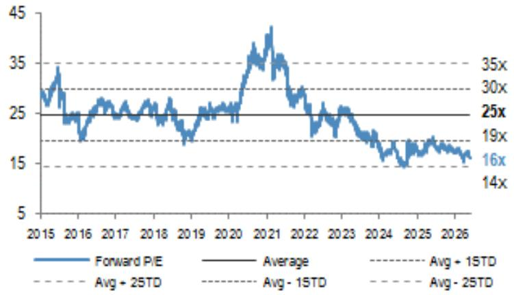

line chart

| Year | Forward P/E | Average | Avg - 1STD | Avg + 1STD | Avg - 2STD |
|------|-------------|---------|------------|------------|------------|
| 2015 | ~28x        | ~25x    | ~25x       | ~25x       | ~25x       |
| 2016 | ~25x        | ~25x    | ~25x       | ~25x       | ~25x       |
| 2017 | ~26x        | ~25x    | ~25x       | ~25x       | ~25x       |
| 2018 | ~25x        | ~25x    | ~25x       | ~25x       | ~25x       |
| 2019 | ~24x        | ~25x    | ~25x       | ~25x       | ~25x       |
| 2020 | ~26x        | ~25x    | ~25x       | ~25x       | ~25x       |
| 2021 | ~38x        | ~25x    | ~25x       | ~25x       | ~25x       |
| 2022 | ~30x        | ~25x    | ~25x       | ~25x       | ~25x       |
| 2023 | ~28x        | ~25x    | ~25x       | ~25x       | ~25x       |
| 2024 | ~18x        | ~25x    | ~25x       | ~25x       | ~25x       |
| 2025 | ~16x        | ~25x    | ~25x       | ~25x       | ~25x       |
| 2026 | ~16x        | ~25x    | ~25x       | ~25x       | ~25x       |

Source: Bloomberg Finance L.P. and JPM.

China/HK consumer discretionary valuation  
Trading at 13x forward P/E, 1.5 STD below 10-year mean  
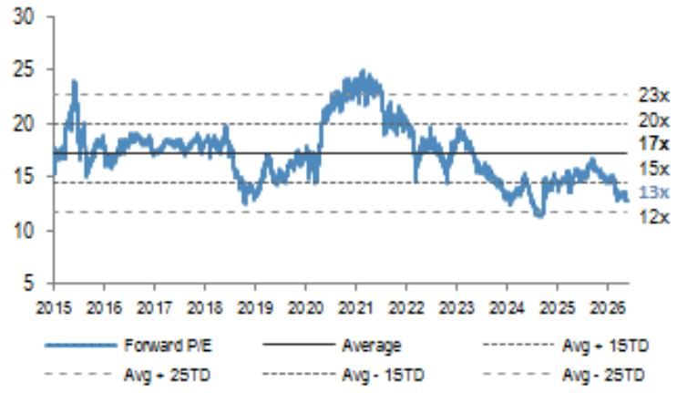

line chart

| Year | Forward P/E | Average | Avg + 1STD | Avg - 1STD | Avg - 2STD |
|------|-------------|---------|------------|------------|------------|
| 2015 | ~18x        | 17x     | ~17x       | ~15x       | ~12x       |
| 2016 | ~19x        | 17x     | ~17x       | ~15x       | ~12x       |
| 2017 | ~18x        | 17x     | ~17x       | ~15x       | ~12x       |
| 2018 | ~19x        | 17x     | ~17x       | ~15x       | ~12x       |
| 2019 | ~13x        | 17x     | ~17x       | ~15x       | ~12x       |
| 2020 | ~18x        | 17x     | ~17x       | ~15x       | ~12x       |
| 2021 | ~24x        | 17x     | ~17x       | ~15x       | ~12x       |
| 2022 | ~20x        | 17x     | ~17x       | ~15x       | ~12x       |
| 2023 | ~19x        | 17x     | ~17x       | ~15x       | ~12x       |
| 2024 | ~13x        | 17x     | ~17x       | ~15x       | ~12x       |
| 2025 | ~15x        | 17x     | ~17x       | ~15x       | ~12x       |
| 2026 | ~13x        | 17x     | ~17x       | ~15x       | ~12x       |

Source: Bloomberg Finance L.P. and JPM.

## Current P/E multiple vs 10Y range

Beverage, beer, condiments, catering, sportswear, beauty, jewelry are trading in the bottom decile of their respective 10Y valuation ranges  
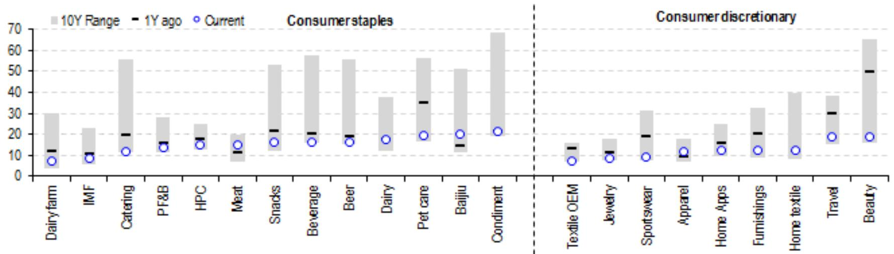

bar chart

| Category | Consumer staples - Current | Consumer staples - 1Y ago | Consumer staples - 10Y Range | Consumer discretionary - Current | Consumer discretionary - 1Y ago | Consumer discretionary - 10Y ago |
| --- | --- | --- | --- | --- | --- | --- |
| Dairy farm | 7 | 12 | 30 | 7 | 12 | 30 |
| IMF | 8 | 11 | 22 | 8 | 11 | 22 |
| Catering | 12 | 20 | 55 | 12 | 20 | 55 |
| PF&B | 14 | 17 | 28 | 14 | 17 | 28 |
| HPC | 15 | 18 | 25 | 15 | 18 | 25 |
| Meat | 16 | 19 | 20 | 16 | 19 | 20 |
| Snacks | 17 | 21 | 52 | 17 | 21 | 52 |
| Beverage | 16 | 20 | 57 | 16 | 20 | 57 |
| Beer | 16 | 19 | 55 | 16 | 19 | 55 |
| Dairy | 18 | 22 | 37 | 18 | 22 | 37 |
| Pet care | 20 | 35 | 56 | 20 | 35 | 56 |
| Baidu | 20 | 14 | 50 | 20 | 14 | 50 |
| Condiment | 22 | — | 68 | — | — | — |
| Textile OEM | — | — | — | — | — | — |
| Jewelry | — | — | — | — | — | — |
| Sportswear | — | — | — | — | — | — |
| Apparel | — | — | — | — | — | — |
| Home Apps | — | — | — | — | — | — |
| Furnishings | — | — | — | — | — | — |
| Home textile | — | — | — | — | — | — |
| Travel | — | — | — | — | — | — |
| Beauty | — | — | — | — | — | — |
| [Unlabeled] | [Unlabeled] | [Unlabeled] | [Unlabeled] | [Unlabeled] | [Unlabeled] | [Unlabeled] |
| [Unlabeled] | [Unlabeled] | [Unlabeled] | [Unlabeled] | [Unlabeled] | [Unlabeled] | [Unlabeled] |
| [Unlabeled] | [Unlabeled] | [Unlabeled] | [Unlabeled] | [Unlabeled] | [Unlabeled] | [Unlabeled] (Consumer discretionary) |
| [Unlabeled] | [Unlabeled] | [Unlabeled] | [Unlabeled] | [Unlabeled] | [Unlabeled] | [Unlabeled] (Consumer discretionary) |
| [Unlabeled] | [Unlabeled] | [Unlabeled] | [Unlabeled] | [Unlabeled] | [Unlabeled] | [Unranging from ~5 to ~65] |
| [Unlabeled] | [Unlabeled] | [Unlabeled] | [Unlabeled] | [Unlabeled] | [Unlabeled] | [Unlabeled] (Consumer discretionary) |
| [Unlabeled] | [Unlabeled] | [Unlabeled] | [Unlabeled] | [Unlabeled] | [Unlabeled] | [Unnll specified from ~5 to ~65] |
| [Unlabeled] | [Unlabeled] | [Unlabeled] | [Unlabeled] | [Unlabeled] | [Unlabeled] | [Unlabeled] (Consumer discretionary) |

Source: Bloomberg Finance L.P. and JPM.

## Sector View Updates

Specialty retail – more than just a craze. The surging demand for pop toys is not a passing fad but represents long-term structural growth, in our view. Our TAM analysis, using both population and GDP benchmarks, suggests a potential store count of 1,000-3,000 for Pop Mart, implying 76% to 4x upside from the current base (630 stores at end-2025), and a 5-year revenue CAGR of 12%-40%.  
- Bubble & Brew – who is still running? Divergence is emerging in expansion: Luckin and Guming to grow store counts by approx. 31% and 51% through 2027, while Mixue (mainly Lucky Cup) should decelerate as network saturation sets in. Boundaries between coffee, tea and bakery are blurring. Price competition has eased in 2026 YTD, with players pivoting from aggressive discounting toward higher-ASP product launches.  
- RTD beverage – demand thriving while competition intensifying. Sports drink is the fastest-growing category within China's soft drinks market, 14.7% CAGR in 2019-25 and 11% through 2030E. Competition is intensifying, with Danone (OW, covered by Celine Pannuti), Eastroc, Nongfu Spring, and Chi Forest (not covered) competing head-to-head (market shares of 13-19% each). Cost pressure from PET price sensitivity remains a key theme into 2H26, with Nongfu positioned as the most resilient player (30% NPM in 2025).  
Baijiu – the dawn is not far off; Moutai DTC under the spotlight. The baijiu sector's prosperity is shaped by three overlapping cycles – macro (including property), supply-demand (pricing), and policy – and the industry is approaching the late stages of its downturn and the early innings of recovery. Property prices in tier-1 cities are showing tentative signs of stabilization. Moutai's DTC reform successfully expands its customer base to mass-market while wholesale prices have stabilized above Rmb1,600.  
- Beer – embracing new channels. China's beer market has entered volume maturity, with the growth algorithm decisively shifting to premiumization and a structural channel migration from on-trade to off-trade. CR Beer is best positioned with 70% off-trade mix. An early and hot summer could act as catalysts.

Valuation – China consumer staples

<table><tr><td rowspan="2">Company</td><td rowspan="2">BBG ticker</td><td rowspan="2">Rating</td><td rowspan="2">MCap USDmn</td><td rowspan="2">Avg TO USDmn</td><td rowspan="2">Price (LC)</td><td rowspan="2">EPS cagr 25-27e</td><td colspan="2">P/E (x)</td><td colspan="2">PEG(x)</td><td colspan="2">EV/EBITDA(x)</td><td colspan="2">Div yield (%)</td><td colspan="5">Share performance</td></tr><tr><td>2026E</td><td>2027E</td><td>2026E</td><td>2027E</td><td>2026E</td><td>2027E</td><td>2026E</td><td>2027E</td><td>1D</td><td>5D</td><td>1M</td><td>3M</td><td>YTD</td></tr><tr><td colspan="20">Baijiu</td></tr><tr><td>Kweichow Moutai</td><td>600519 CH</td><td>N</td><td>229,044</td><td>822</td><td>1,240</td><td>5%</td><td>18.1</td><td>17.0</td><td>4.3</td><td>2.6</td><td>12.7</td><td>11.9</td><td>4.3</td><td>4.6</td><td>0%</td><td>-3%</td><td>-6%</td><td>-16%</td><td>-10%</td></tr><tr><td>Wuliangye</td><td>000858 CH</td><td>UW</td><td>44,444</td><td>319</td><td>77.49</td><td>55%</td><td>15.0</td><td>13.9</td><td>0.1</td><td>1.7</td><td>7.2</td><td>6.5</td><td>6.1</td><td>5.9</td><td>0%</td><td>-3%</td><td>-9%</td><td>-25%</td><td>-27%</td></tr><tr><td>Luzhou Laojiao</td><td>000568 CH</td><td>N</td><td>18,039</td><td>164</td><td>82.94</td><td>1%</td><td>11.8</td><td>11.1</td><td>n.m.</td><td>1.7</td><td>6.8</td><td>6.3</td><td>6.2</td><td>6.5</td><td>0%</td><td>-3%</td><td>-8%</td><td>-22%</td><td>-29%</td></tr><tr><td>Fen Wine</td><td>600809 CH</td><td>NC</td><td>21,217</td><td>149</td><td>117.70</td><td>2%</td><td>12.1</td><td>11.3</td><td>n.m.</td><td>1.7</td><td>8.3</td><td>7.7</td><td>5.3</td><td>5.7</td><td>0%</td><td>-2%</td><td>-9%</td><td>-26%</td><td>-31%</td></tr><tr><td>Yanghe</td><td>002304 CH</td><td>UW</td><td>9,367</td><td>51</td><td>42.08</td><td>21%</td><td>21.9</td><td>19.1</td><td>0.8</td><td>1.3</td><td>9.7</td><td>8.5</td><td>6.1</td><td>5.6</td><td>0%</td><td>-3%</td><td>-7%</td><td>-18%</td><td>-31%</td></tr><tr><td colspan="7">Simple average</td><td>15.8</td><td>14.5</td><td>1.7</td><td>1.8</td><td>8.9</td><td>8.2</td><td>5.6</td><td>5.7</td><td></td><td></td><td></td><td></td><td></td></tr><tr><td colspan="7">Market cap weighted average</td><td>17.1</td><td>15.9</td><td>3.1</td><td>2.3</td><td>11.2</td><td>10.5</td><td>4.8</td><td>5.0</td><td></td><td></td><td></td><td></td><td></td></tr><tr><td colspan="20">Beer</td></tr><tr><td>CR Beer</td><td>291 HK</td><td>OW</td><td>9,066</td><td>36</td><td>21.90</td><td>27%</td><td>10.6</td><td>9.9</td><td>0.2</td><td>1.3</td><td>5.9</td><td>5.6</td><td>5.7</td><td>6.4</td><td>-1%</td><td>-7%</td><td>-16%</td><td>-14%</td><td>-16%</td></tr><tr><td>Budweiser</td><td>1876 HK</td><td>N</td><td>11,238</td><td>14</td><td>6.65</td><td>18%</td><td>17.7</td><td>16.0</td><td>0.7</td><td>1.5</td><td>5.4</td><td>5.1</td><td>6.6</td><td>6.8</td><td>0%</td><td>-5%</td><td>-12%</td><td>-9%</td><td>-12%</td></tr><tr><td>Tsingtao Brewery - A</td><td>600600 CH</td><td>N</td><td>9,797</td><td>47</td><td>56.10</td><td>7%</td><td>15.9</td><td>15.1</td><td>1.7</td><td>2.9</td><td>6.2</td><td>5.9</td><td>4.4</td><td>4.6</td><td>0%</td><td>-8%</td><td>-9%</td><td>-11%</td><td>-8%</td></tr><tr><td>Tsingtao Brewery - H</td><td>168 HK</td><td>OW</td><td>9,797</td><td>23</td><td>46.88</td><td>4%</td><td>11.4</td><td>11.6</td><td>1.1</td><td>n.m.</td><td>6.4</td><td>6.0</td><td>6.1</td><td>6.5</td><td>0%</td><td>-5%</td><td>-8%</td><td>-5%</td><td>-4%</td></tr><tr><td colspan="7">Simple average</td><td>13.9</td><td>13.1</td><td>0.9</td><td>1.9</td><td>5.9</td><td>5.6</td><td>5.7</td><td>6.1</td><td></td><td></td><td></td><td></td><td></td></tr><tr><td colspan="7">Market cap weighted average</td><td>14.1</td><td>13.3</td><td>0.9</td><td>1.4</td><td>5.9</td><td>5.6</td><td>5.7</td><td>6.1</td><td></td><td></td><td></td><td></td><td></td></tr><tr><td colspan="20">F&amp;B, Dairy</td></tr><tr><td>Want Want</td><td>151 HK</td><td>NC</td><td>6,084</td><td>5</td><td>4.04</td><td>0%</td><td>10.1</td><td>9.6</td><td>n.m.</td><td>1.6</td><td>5.6</td><td>5.3</td><td>5.0</td><td>5.5</td><td>0%</td><td>-3%</td><td>-3%</td><td>-16%</td><td>-13%</td></tr><tr><td>Tingyi</td><td>322 HK</td><td>NC</td><td>7,381</td><td>20</td><td>10.26</td><td>5%</td><td>11.1</td><td>10.4</td><td>2.9</td><td>1.5</td><td>5.7</td><td>5.5</td><td>8.9</td><td>9.4</td><td>0%</td><td>-2%</td><td>-12%</td><td>-17%</td><td>-9%</td></tr><tr><td>Uni-President</td><td>220 HK</td><td>NC</td><td>3,930</td><td>8</td><td>7.13</td><td>9%</td><td>11.9</td><td>11.2</td><td>1.2</td><td>1.6</td><td>5.8</td><td>5.4</td><td>8.3</td><td>8.8</td><td>0%</td><td>-2%</td><td>-9%</td><td>-9%</td><td>-12%</td></tr><tr><td>WH Group</td><td>288 HK</td><td>OW</td><td>14,539</td><td>37</td><td>8.88</td><td>3%</td><td>9.0</td><td>8.7</td><td>4.6</td><td>2.2</td><td>5.4</td><td>5.2</td><td>6.2</td><td>6.5</td><td>0%</td><td>1%</td><td>-5%</td><td>-8%</td><td>2%</td></tr><tr><td>Yili</td><td>600887 CH</td><td>OW</td><td>23,058</td><td>199</td><td>24.67</td><td>7%</td><td>12.7</td><td>11.7</td><td>2.5</td><td>1.4</td><td>11.1</td><td>10.5</td><td>5.8</td><td>6.5</td><td>0%</td><td>-4%</td><td>-10%</td><td>-8%</td><td>-14%</td></tr><tr><td>Mengniu</td><td>2319 HK</td><td>OW</td><td>7,816</td><td>45</td><td>15.80</td><td>65%</td><td>10.8</td><td>9.7</td><td>0.1</td><td>0.9</td><td>6.2</td><td>5.9</td><td>4.5</td><td>5.0</td><td>0%</td><td>-4%</td><td>-9%</td><td>-5%</td><td>6%</td></tr><tr><td>Feihe</td><td>6186 HK</td><td>OW</td><td>3,406</td><td>12</td><td>3.03</td><td>7%</td><td>9.9</td><td>9.2</td><td>1.7</td><td>1.2</td><td>4.4</td><td>4.3</td><td>8.3</td><td>7.8</td><td>0%</td><td>-4%</td><td>-6%</td><td>-23%</td><td>-25%</td></tr><tr><td colspan="7">Simple average</td><td>10.8</td><td>10.1</td><td>2.2</td><td>1.5</td><td>6.3</td><td>6.0</td><td>6.7</td><td>7.1</td><td></td><td></td><td></td><td></td><td></td></tr><tr><td colspan="7">Market cap weighted average</td><td>11.1</td><td>10.3</td><td>2.4</td><td>1.6</td><td>7.5</td><td>7.1</td><td>6.3</td><td>6.8</td><td></td><td></td><td></td><td></td><td></td></tr><tr><td colspan="20">Beverage</td></tr><tr><td>Nongfu Spring</td><td>9633 HK</td><td>OW</td><td>61,109</td><td>38</td><td>42.58</td><td>13%</td><td>23.1</td><td>20.5</td><td>1.7</td><td>1.6</td><td>15.1</td><td>13.4</td><td>2.9</td><td>3.3</td><td>0%</td><td>0%</td><td>-1%</td><td>-2%</td><td>-9%</td></tr><tr><td>Eastroc Beverage -A</td><td>605499 CH</td><td>N</td><td>13,401</td><td>98</td><td>125.39</td><td>22%</td><td>16.1</td><td>13.6</td><td>0.7</td><td>0.7</td><td>10.5</td><td>9.0</td><td>3.4</td><td>3.8</td><td>0%</td><td>-6%</td><td>-12%</td><td>-30%</td><td>-39%</td></tr><tr><td>Eastroc Beverage -H</td><td>9980 HK</td><td>OW</td><td>13,401</td><td>13</td><td>118.00</td><td>22%</td><td>13.1</td><td>11.0</td><td>0.5</td><td>0.6</td><td>9.0</td><td>7.7</td><td>3.1</td><td>3.5</td><td>0%</td><td>-10%</td><td>-29%</td><td>-29%</td><td></td></tr><tr><td>CR Beverage</td><td>2460 HK</td><td>N</td><td>2,289</td><td>4</td><td>7.48</td><td>14%</td><td>0.7</td><td>0.6</td><td>0.1</td><td>0.0</td><td>4.7</td><td>4.1</td><td>2.9</td><td>3.4</td><td>-1%</td><td>-7%</td><td>-8%</td><td>-22%</td><td>-26%</td></tr><tr><td colspan="7">Simple average</td><td>13.3</td><td>11.4</td><td>0.7</td><td>0.7</td><td>9.8</td><td>8.6</td><td>3.1</td><td>3.5</td><td></td><td></td><td></td><td></td><td></td></tr><tr><td colspan="7">Market cap weighted average</td><td>20.0</td><td>17.6</td><td>1.3</td><td>1.3</td><td>13.2</td><td>11.7</td><td>3.0</td><td>3.4</td><td></td><td></td><td></td><td></td><td></td></tr><tr><td colspan="20">Restaurants</td></tr><tr><td>Yum China</td><td>YUMC US</td><td>OW</td><td>15,032</td><td>73</td><td>43.28</td><td>10%</td><td>14.9</td><td>13.5</td><td>1.5</td><td>1.3</td><td>7.7</td><td>7.0</td><td>2.7</td><td>3.0</td><td>-1%</td><td>-1%</td><td>-5%</td><td>-18%</td><td>-9%</td></tr><tr><td>Haidilao</td><td>6862 HK</td><td>NC</td><td>8,294</td><td>40</td><td>11.66</td><td>9%</td><td>12.2</td><td>11.1</td><td>1.5</td><td>1.1</td><td>6.5</td><td>6.1</td><td>6.7</td><td>7.3</td><td>0%</td><td>-5%</td><td>-18%</td><td>-29%</td><td>-18%</td></tr><tr><td>Xiaocaiyuan</td><td>999 HK</td><td>NC</td><td>1,032</td><td>2</td><td>6.90</td><td>1%</td><td>11.1</td><td>9.5</td><td>n.m.</td><td>0.6</td><td>4.9</td><td>4.4</td><td>5.5</td><td>6.2</td><td>1%</td><td>5%</td><td>3%</td><td>-14%</td><td>-27%</td></tr><tr><td colspan="7">Simple average</td><td>12.7</td><td>11.3</td><td>1.5</td><td>1.0</td><td>6.4</td><td>5.8</td><td>5.0</td><td>5.5</td><td></td><td></td><td></td><td></td><td></td></tr><tr><td colspan="7">Market cap weighted average</td><td>13.8</td><td>12.5</td><td>1.4</td><td>1.2</td><td>7.2</td><td>6.6</td><td>4.2</td><td>4.6</td><td></td><td></td><td></td><td></td><td></td></tr><tr><td colspan="20">FMD</td></tr><tr><td>Mixue</td><td>2097 HK</td><td>UW</td><td>12,208</td><td>23</td><td>252.00</td><td>10%</td><td>12.9</td><td>11.4</td><td>1.8</td><td>0.9</td><td>7.8</td><td>6.9</td><td>0.9</td><td>1.6</td><td>-1%</td><td>-8%</td><td>-4%</td><td>-26%</td><td>-39%</td></tr><tr><td>Luckin</td><td>LKNCY US</td><td>OW</td><td>8,786</td><td>63</td><td>30.69</td><td>19%</td><td>15.3</td><td>13.1</td><td>0.7</td><td>0.8</td><td>6.3</td><td>5.0</td><td>0.0</td><td>2.2</td><td>-1%</td><td>1%</td><td>-3%</td><td>-10%</td><td>-8%</td></tr><tr><td>Guming</td><td>1364 HK</td><td>OW</td><td>6,446</td><td>20</td><td>21.24</td><td>38%</td><td>13.1</td><td>10.8</td><td>0.2</td><td>0.5</td><td>10.6</td><td>8.8</td><td>3.1</td><td>4.2</td><td>0%</td><td>-4%</td><td>-6%</td><td>-27%</td><td>-14%</td></tr><tr><td>Chagee</td><td>CHA US</td><td>OW</td><td>2,198</td><td>9</td><td>11.52</td><td>22%</td><td>8.1</td><td>7.5</td><td>0.2</td><td>1.0</td><td>4.9</td><td>4.4</td><td>4.7</td><td>6.6</td><td>0%</td><td>-2%</td><td>13%</td><td>5%</td><td>-1%</td></tr><tr><td>Baicha Baidao</td><td>2555 HK</td><td>NC</td><td>916</td><td>2</td><td>4.86</td><td>17%</td><td>6.8</td><td>6.0</td><td>0.3</td><td>0.5</td><td>2.7</td><td>2.4</td><td>10.0</td><td>11.4</td><td>0%</td><td>-3%</td><td>-12%</td><td>-17%</td><td>-26%</td></tr><tr><td>Auntea Jenny</td><td>2589 HK</td><td>NC</td><td>2,014</td><td>4</td><td>150.00</td><td>17%</td><td>22.9</td><td>19.9</td><td>1.2</td><td>1.4</td><td>13.8</td><td>12.1</td><td>2.0</td><td>1.7</td><td>1%</td><td>1%</td><td>-5%</td><td>90%</td><td>75%</td></tr><tr><td colspan="7">Simple average</td><td>13.2</td><td>11.5</td><td>0.7</td><td>0.8</td><td>7.7</td><td>6.6</td><td>3.5</td><td>4.6</td><td></td><td></td><td></td><td></td><td></td></tr><tr><td colspan="7">Market cap weighted average</td><td>13.7</td><td>11.8</td><td>1.0</td><td>0.8</td><td>8.0</td><td>6.8</td><td>1.7</td><td>2.9</td><td></td><td></td><td></td><td></td><td></td></tr><tr><td colspan="20">Snack-chains</td></tr><tr><td>BusyMing</td><td>1768 HK</td><td>NC</td><td>9,463</td><td>19</td><td>340.40</td><td>32%</td><td>17.7</td><td>14.2</td><td>0.4</td><td>0.6</td><td>11.7</td><td>9.4</td><td>1.3</td><td>1.6</td><td>0%</td><td>-10%</td><td>-20%</td><td>-17%</td><td></td></tr><tr><td>Wanchen</td><td>300972 CH</td><td>NC</td><td>5,200</td><td>60</td><td>178.35</td><td>56%</td><td>13.9</td><td>10.8</td><td>0.2</td><td>0.4</td><td>6.1</td><td>5.1</td><td>1.6</td><td>2.2</td><td>0%</td><td>-3%</td><td>-20%</td><td>-9%</td><td>-11%</td></tr><tr><td colspan="7">Simple average</td><td>15.8</td><td>12.5</td><td>0.3</td><td>0.5</td><td>8.9</td><td>7.2</td><td>1.4</td><td>1.9</td><td></td><td></td><td></td><td></td><td></td></tr><tr><td colspan="7">Market cap weighted average</td><td>16.3</td><td>13.0</td><td>0.3</td><td>0.5</td><td>9.7</td><td>7.8</td><td>1.4</td><td>1.8</td><td></td><td></td><td></td><td></td><td></td></tr></table>

Note: Revenue, EPS CAGR and valuation multiples based on Bloomberg consensus. Prices as of 17 Jun 2026 market close. NC: Not covered. Past performance is not an indicator of future results. Source: Bloomberg Finance L.P., JPM estimates.

Valuation – China consumer discretionary

<table><tr><td rowspan="2">Company</td><td rowspan="2">BBG ticker</td><td rowspan="2">Rating</td><td rowspan="2">MCap USDmn</td><td rowspan="2">Avg TO USDmn</td><td rowspan="2">Price (LC)</td><td rowspan="2">EPS cagr 25-27e</td><td colspan="2">P/E (x)</td><td colspan="2">PEG(x)</td><td colspan="2">EV/EBITDA(x)</td><td colspan="2">Div yield (%)</td><td colspan="5">Share performance</td></tr><tr><td>2026E</td><td>2027E</td><td>2026E</td><td>2027E</td><td>2026E</td><td>2027E</td><td>2026E</td><td>2027E</td><td>1D</td><td>5D</td><td>1M</td><td>3M</td><td>YTD</td></tr><tr><td colspan="20">Lifestyle retail</td></tr><tr><td>Pop Mart</td><td>9992 HK</td><td>N</td><td>28,125</td><td>449</td><td>165.50</td><td>15%</td><td>13.2</td><td>11.3</td><td>0.9</td><td>0.7</td><td>8.7</td><td>7.5</td><td>1.9</td><td>2.2</td><td>-3%</td><td>-7%</td><td>10%</td><td>-25%</td><td>-12%</td></tr><tr><td>MINISO - ADR</td><td>MNSO US</td><td>OW</td><td>3,763</td><td>11</td><td>12.15</td><td>71%</td><td>8.3</td><td>7.4</td><td>0.1</td><td>0.6</td><td>5.7</td><td>5.3</td><td>6.1</td><td>8.7</td><td>-1%</td><td>-8%</td><td>-15%</td><td>-29%</td><td>-35%</td></tr><tr><td>MINISO - H</td><td>9896 HK</td><td>OW</td><td>3,794</td><td>17</td><td>24.00</td><td>71%</td><td>8.4</td><td>7.5</td><td>0.1</td><td>0.6</td><td>5.7</td><td>5.3</td><td>6.0</td><td>8.6</td><td>0%</td><td>-6%</td><td>-14%</td><td>-30%</td><td>-34%</td></tr><tr><td>Bloks</td><td>325 HK</td><td>NC</td><td>1,534</td><td>7</td><td>48.52</td><td>27%</td><td>12.8</td><td>10.0</td><td>0.5</td><td>0.4</td><td>7.6</td><td>5.9</td><td>0.5</td><td>1.0</td><td>0%</td><td>-10%</td><td>-14%</td><td>-24%</td><td>-28%</td></tr><tr><td>Simple average</td><td></td><td></td><td></td><td></td><td></td><td></td><td>10.7</td><td>9.0</td><td>0.4</td><td>0.6</td><td>6.9</td><td>6.0</td><td>3.6</td><td>5.1</td><td></td><td></td><td></td><td></td><td></td></tr><tr><td>Market cap weighted average</td><td></td><td></td><td></td><td></td><td></td><td></td><td>12.2</td><td>10.4</td><td>0.7</td><td>0.6</td><td>8.1</td><td>7.0</td><td>2.7</td><td>3.5</td><td></td><td></td><td></td><td></td><td></td></tr><tr><td colspan="20">Home appliance</td></tr><tr><td>Midea</td><td>000333 CH</td><td>OW</td><td>88,625</td><td>371</td><td>79.22</td><td>8%</td><td>12.8</td><td>11.8</td><td>1.8</td><td>1.4</td><td>10.3</td><td>9.5</td><td>5.6</td><td>6.0</td><td>0%</td><td>-7%</td><td>-4%</td><td>3%</td><td>1%</td></tr><tr><td>Haier Smart Home - A</td><td>600690 CH</td><td>OW</td><td>27,026</td><td>156</td><td>20.49</td><td>5%</td><td>9.5</td><td>8.7</td><td>4.5</td><td>1.0</td><td>6.7</td><td>6.2</td><td>5.9</td><td>6.6</td><td>0%</td><td>-3%</td><td>-3%</td><td>-18%</td><td>-21%</td></tr><tr><td>Haier Smart Home - H</td><td>6690 HK</td><td>OW</td><td>27,027</td><td>51</td><td>20.60</td><td>6%</td><td>8.3</td><td>7.4</td><td>7.0</td><td>0.7</td><td>6.9</td><td>6.4</td><td>6.7</td><td>7.8</td><td>-2%</td><td>-4%</td><td>0%</td><td>-18%</td><td>-15%</td></tr><tr><td>Gree</td><td>000651 CH</td><td>N</td><td>30,748</td><td>229</td><td>37.15</td><td>44%</td><td>7.1</td><td>6.8</td><td>0.1</td><td>1.8</td><td>4.1</td><td>3.9</td><td>7.8</td><td>8.0</td><td>0%</td><td>-4%</td><td>-6%</td><td>-5%</td><td>-8%</td></tr><tr><td>Hisense</td><td>000921 CH</td><td>NC</td><td>5,280</td><td>37</td><td>27.88</td><td>16%</td><td>11.6</td><td>10.6</td><td>0.5</td><td>1.2</td><td>5.3</td><td>4.8</td><td>4.6</td><td>5.0</td><td>0%</td><td>-5%</td><td>16%</td><td>21%</td><td>12%</td></tr><tr><td>Robam</td><td>002508 CH</td><td>N</td><td>2,181</td><td>20</td><td>15.62</td><td>12%</td><td>10.5</td><td>10.0</td><td>0.6</td><td>2.2</td><td>7.1</td><td>6.6</td><td>5.8</td><td>6.1</td><td>0%</td><td>-5%</td><td>-11%</td><td>-25%</td><td>-19%</td></tr><tr><td>Joyoung</td><td>002242 CH</td><td>NC</td><td>950</td><td>18</td><td>8.43</td><td>217%</td><td>28.2</td><td>24.4</td><td>0.0</td><td>1.5</td><td>27.5</td><td>21.1</td><td>2.2</td><td>2.5</td><td>0%</td><td>0%</td><td>-20%</td><td>-20%</td><td>-19%</td></tr><tr><td>Ecovacs Robotics</td><td>603486 CH</td><td>UW</td><td>4,559</td><td>65</td><td>53.32</td><td>22%</td><td>14.6</td><td>12.4</td><td>0.5</td><td>0.7</td><td>9.6</td><td>8.2</td><td>2.0</td><td>2.3</td><td>0%</td><td>-4%</td><td>-22%</td><td>-16%</td><td>-34%</td></tr><tr><td>Simple average</td><td></td><td></td><td></td><td></td><td></td><td></td><td>12.7</td><td>11.3</td><td>1.7</td><td>1.2</td><td>9.5</td><td>8.1</td><td>4.6</td><td>5.1</td><td></td><td></td><td></td><td></td><td></td></tr><tr><td>Market cap weighted average</td><td></td><td></td><td></td><td></td><td></td><td></td><td>10.8</td><td>9.9</td><td>2.5</td><td>1.2</td><td>8.1</td><td>7.5</td><td>5.9</td><td>6.4</td><td></td><td></td><td></td><td></td><td></td></tr><tr><td colspan="20">Sportswear brand and retailer</td></tr><tr><td>ANTA</td><td>2020 HK</td><td>OW</td><td>25,517</td><td>97</td><td>71.50</td><td>8%</td><td>12.0</td><td>11.0</td><td>1.7</td><td>1.2</td><td>6.7</td><td>6.2</td><td>4.0</td><td>4.5</td><td>-1%</td><td>-4%</td><td>-6%</td><td>-9%</td><td>-11%</td></tr><tr><td>Li Ning</td><td>2331 HK</td><td>OW</td><td>5,390</td><td>49</td><td>16.34</td><td>2%</td><td>11.9</td><td>10.5</td><td>n.m.</td><td>0.8</td><td>4.1</td><td>3.7</td><td>4.2</td><td>4.7</td><td>-1%</td><td>-7%</td><td>-12%</td><td>-19%</td><td>-12%</td></tr><tr><td>Xtep</td><td>1368 HK</td><td>OW</td><td>1,475</td><td>7</td><td>4.12</td><td>3%</td><td>7.9</td><td>6.9</td><td>n.m.</td><td>0.5</td><td>4.0</td><td>3.5</td><td>6.8</td><td>8.6</td><td>0%</td><td>-5%</td><td>-2%</td><td>-18%</td><td>-22%</td></tr><tr><td>361 Degrees</td><td>1361 HK</td><td>NC</td><td>1,225</td><td>5</td><td>4.43</td><td>11%</td><td>5.4</td><td>4.9</td><td>0.4</td><td>0.5</td><td>2.5</td><td>2.2</td><td>8.8</td><td>9.8</td><td>0%</td><td>-8%</td><td>-13%</td><td>-17%</td><td>-27%</td></tr><tr><td>Topsports</td><td>6110 HK</td><td>NC</td><td>2,105</td><td>5</td><td>2.66</td><td>-3%</td><td>11.2</td><td>10.9</td><td>n.m.</td><td>4.5</td><td>5.8</td><td>6.3</td><td>9.3</td><td>11.1</td><td>0%</td><td>-1%</td><td>-9%</td><td>-10%</td><td>-9%</td></tr><tr><td>Simple average</td><td></td><td></td><td></td><td></td><td></td><td></td><td>9.7</td><td>8.9</td><td>1.1</td><td>1.5</td><td>4.6</td><td>4.4</td><td>6.6</td><td>7.7</td><td></td><td></td><td></td><td></td><td></td></tr><tr><td>Market cap weighted average</td><td></td><td></td><td></td><td></td><td></td><td></td><td>11.6</td><td>10.6</td><td>1.2</td><td>1.3</td><td>6.0</td><td>5.5</td><td>4.6</td><td>5.3</td><td></td><td></td><td></td><td></td><td></td></tr><tr><td colspan="20">Apparel &amp; footwear OEM</td></tr><tr><td>Shenzhou</td><td>2313 HK</td><td>OW</td><td>8,135</td><td>48</td><td>42.42</td><td>7%</td><td>9.1</td><td>8.3</td><td>2.2</td><td>0.9</td><td>5.2</td><td>4.7</td><td>6.7</td><td>7.4</td><td>-1%</td><td>-1%</td><td>-7%</td><td>-23%</td><td>-31%</td></tr><tr><td>Huali</td><td>300979 CH</td><td>NC</td><td>5,456</td><td>17</td><td>31.64</td><td>10%</td><td>10.9</td><td>9.3</td><td>3.5</td><td>0.5</td><td>6.1</td><td>5.3</td><td>5.9</td><td>7.0</td><td>0%</td><td>-4%</td><td>-17%</td><td>-33%</td><td>-37%</td></tr><tr><td>Best Pacific</td><td>2111 HK</td><td>OW</td><td>338</td><td>0</td><td>2.55</td><td>8%</td><td>4.6</td><td>4.1</td><td>1.3</td><td>0.3</td><td>3.6</td><td>3.2</td><td>11.8</td><td>13.7</td><td>0%</td><td>-3%</td><td>-9%</td><td>-18%</td><td>-22%</td></tr><tr><td>Bosideng</td><td>3998 HK</td><td>OW</td><td>6,039</td><td>15</td><td>4.05</td><td>8%</td><td>10.6</td><td>9.6</td><td>2.0</td><td>1.0</td><td>5.5</td><td>5.1</td><td>7.8</td><td>8.5</td><td>-1%</td><td>-3%</td><td>-3%</td><td>-1%</td><td>-9%</td></tr><tr><td>Eclat</td><td>1476 TT</td><td>N</td><td>2,892</td><td>15</td><td>333.00</td><td>16%</td><td>13.3</td><td>12.2</td><td>0.5</td><td>1.4</td><td>8.4</td><td>7.7</td><td>5.3</td><td>5.9</td><td>3%</td><td>-3%</td><td>2%</td><td>-15%</td><td>-13%</td></tr><tr><td>Makalot</td><td>1477 TT</td><td>OW</td><td>1,710</td><td>14</td><td>219.00</td><td>11%</td><td>13.5</td><td>12.4</td><td>1.1</td><td>1.4</td><td>9.0</td><td>8.3</td><td>6.8</td><td>7.3</td><td>1%</td><td>-3%</td><td>3%</td><td>-26%</td><td>-24%</td></tr><tr><td>Simple average</td><td></td><td></td><td></td><td></td><td></td><td></td><td>10.3</td><td>9.3</td><td>1.8</td><td>0.9</td><td>6.3</td><td>5.7</td><td>7.4</td><td>8.3</td><td></td><td></td><td></td><td></td><td></td></tr><tr><td>Market cap weighted average</td><td></td><td></td><td></td><td></td><td></td><td></td><td>10.6</td><td>9.5</td><td>2.1</td><td>0.9</td><td>6.1</td><td>5.5</td><td>6.7</td><td>7.5</td><td></td><td></td><td></td><td></td><td></td></tr><tr><td colspan="20">Beauty</td></tr><tr><td>Imeik</td><td>300896 CH</td><td>NC</td><td>4,065</td><td>62</td><td>90.92</td><td>16%</td><td>19.6</td><td>17.4</td><td>1.0</td><td>1.4</td><td>14.9</td><td>13.1</td><td>2.5</td><td>2.7</td><td>0%</td><td>-2%</td><td>-16%</td><td>-35%</td><td>-36%</td></tr><tr><td>Proya</td><td>603605 CH</td><td>OW</td><td>3,861</td><td>46</td><td>65.99</td><td>10%</td><td>15.8</td><td>14.4</td><td>1.6</td><td>1.5</td><td>10.4</td><td>9.5</td><td>2.3</td><td>2.5</td><td>0%</td><td>4%</td><td>17%</td><td>-2%</td><td>-4%</td></tr><tr><td>Giant Biogene</td><td>2367 HK</td><td>NC</td><td>3,523</td><td>37</td><td>26.00</td><td>7%</td><td>12.1</td><td>11.0</td><td>2.7</td><td>1.1</td><td>6.7</td><td>6.0</td><td>4.6</td><td>5.6</td><td>1%</td><td>-3%</td><td>-5%</td><td>-17%</td><td>-20%</td></tr><tr><td>Yunnan Botanee</td><td>300957 CH</td><td>OW</td><td>2,102</td><td>34</td><td>33.58</td><td>20%</td><td>22.4</td><td>19.3</td><td>1.0</td><td>1.2</td><td>11.7</td><td>10.1</td><td>1.9</td><td>2.2</td><td>0%</td><td>2%</td><td>-14%</td><td>-20%</td><td>-15%</td></tr><tr><td>Bloomage</td><td>688363 CH</td><td>NC</td><td>2,555</td><td>23</td><td>35.90</td><td>48%</td><td>39.1</td><td>30.5</td><td>0.6</td><td>1.1</td><td>20.3</td><td>17.6</td><td>0.6</td><td>0.8</td><td>0%</td><td>3%</td><td>-9%</td><td>-20%</td><td>-18%</td></tr><tr><td>Mao Geping</td><td>1318 HK</td><td>OW</td><td>3,472</td><td>19</td><td>55.50</td><td>28%</td><td>15.1</td><td>12.0</td><td>0.5</td><td>0.5</td><td>9.5</td><td>7.6</td><td>2.3</td><td>2.9</td><td>-2%</td><td>-6%</td><td>-6%</td><td>-31%</td><td>-32%</td></tr><tr><td>Simple average</td><td></td><td></td><td></td><td></td><td></td><td></td><td>20.7</td><td>17.4</td><td>1.2</td><td>1.1</td><td>12.2</td><td>10.6</td><td>2.4</td><td>2.8</td><td></td><td></td><td></td><td></td><td></td></tr><tr><td>Market cap weighted average</td><td></td><td></td><td></td><td></td><td></td><td></td><td>19.6</td><td>16.6</td><td>1.3</td><td>1.1</td><td>11.9</td><td>10.4</td><td>2.5</td><td>2.9</td><td></td><td></td><td></td><td></td><td></td></tr><tr><td colspan="20">Jewelry / luxury</td></tr><tr><td>Chow Tai Fook</td><td>1929 HK</td><td>OW</td><td>15,685</td><td>29</td><td>10.86</td><td>33%</td><td>14.1</td><td>11.8</td><td>0.3</td><td>0.6</td><td>8.5</td><td>9.1</td><td>5.8</td><td>6.0</td><td>-1%</td><td>12%</td><td>14%</td><td>6%</td><td>1%</td></tr><tr><td>Laopu Gold</td><td>6181 HK</td><td>OW</td><td>10,154</td><td>96</td><td>487.40</td><td>41%</td><td>8.3</td><td>6.9</td><td>0.1</td><td>0.4</td><td>6.5</td><td>5.5</td><td>7.7</td><td>8.8</td><td>0%</td><td>2%</td><td>-17%</td><td>-33%</td><td>-27%</td></tr><tr><td>Lao Feng Xiang</td><td>600612 CH</td><td>UW</td><td>2,264</td><td>14</td><td>35.42</td><td>-1%</td><td>11.1</td><td>10.3</td><td>n.m.</td><td>1.3</td><td>4.4</td><td>4.2</td><td>3.1</td><td>3.3</td><td>0%</td><td>1%</td><td>-6%</td><td>-18%</td><td>-22%</td></tr><tr><td>Luk Fook</td><td>590 HK</td><td>NC</td><td>1,734</td><td>5</td><td>20.90</td><td>59%</td><td>8.0</td><td>7.3</td><td>0.1</td><td>0.7</td><td>5.8</td><td>5.6</td><td>6.8</td><td>7.6</td><td>0%</td><td>8%</td><td>7%</td><td>-12%</td><td>-2%</td></tr><tr><td>Simple average</td><td></td><td></td><td></td><td></td><td></td><td></td><td>10.4</td><td>9.1</td><td>0.2</td><td>0.7</td><td>6.3</td><td>6.1</td><td>5.8</td><td>6.4</td><td></td><td></td><td></td><td></td><td></td></tr><tr><td>Market cap weighted average</td><td></td><td></td><td></td><td></td><td></td><td></td><td>11.5</td><td>9.8</td><td>0.2</td><td>0.6</td><td>7.3</td><td>7.3</td><td>6.3</td><td>6.8</td><td></td><td></td><td></td><td></td><td></td></tr></table>

Note: Revenue, EPS CAGR and valuation multiples based on Bloomberg consensus. Prices as of 17 Jun 2026 market close. NC: Not covered. Past performance is not an indicator of future results. Source: Bloomberg Finance L.P., JPM estimates.

# RTD Beverages – Sports drinks shine, but cost pressure bites

## Sports drinks under the spotlight; competition intensifying

Sports drinks are projected to grow at a 2025–30E CAGR of 10.9%, more than double the overall soft drinks market growth of 4.0%. Revenue momentum has visibly inflected since 2023, with YoY growth accelerating to approximately 15%, signaling that the category has entered a new phase of expansion.

Sports drinks under the spotlight and are set to outperform other categories in the next five years

<table><tr><td rowspan="2"></td><td colspan="2">Retail value (2025)</td><td colspan="2">CAGR</td></tr><tr><td>Rmb bn</td><td>US$ bn</td><td>2019-25</td><td>2025-30e</td></tr><tr><td>Bottled Water</td><td>252</td><td>34.3</td><td>3.5%</td><td>4.1%</td></tr><tr><td>RTD Tea</td><td>154</td><td>18.9</td><td>4.0%</td><td>6.1%</td></tr><tr><td>Carbonates</td><td>117</td><td>17.9</td><td>4.0%</td><td>0.4%</td></tr><tr><td>Juice</td><td>84</td><td>10.8</td><td>-0.5%</td><td>2.6%</td></tr><tr><td>Energy Drinks</td><td>63</td><td>8.6</td><td>4.8%</td><td>3.7%</td></tr><tr><td>Sports Drinks</td><td>27</td><td>2.9</td><td>14.7%</td><td>10.9%</td></tr><tr><td>Others</td><td>15</td><td>2.6</td><td>-4.9%</td><td>-2.2%</td></tr><tr><td>Soft Drinks</td><td>713</td><td>96</td><td>3.3%</td><td>4.0%</td></tr></table>

Source: Euromonitor, JPM estimates.

Eastroc sports beverage outperformed peers with significant market share gains in the past 3 years  
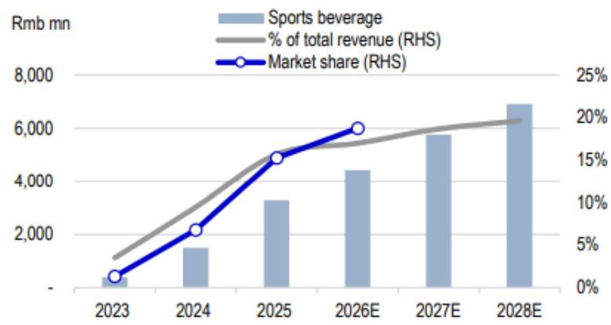

bar-line hybrid chart

| Year | Sports beverage (Rmb mn) | % of total revenue (RHS) (%) | Market share (RHS) (%) |
| :--- | :--- | :--- | :--- |
| 2023 | 500 | 4 | 1 |
| 2024 | 1500 | 10 | 7 |
| 2025 | 3200 | 16 | 15 |
| 2026E | 4400 | 17 | 20 |
| 2027E | 5800 | 19 | 19 |
| 2028E | 7000 | 20 | 21 |

Source: Company data, Euromonitor, JPM estimates.

Sports drinks momentum picking up from 2023  
Sports drink revenue (Rmb bn) and % of total revenue.  
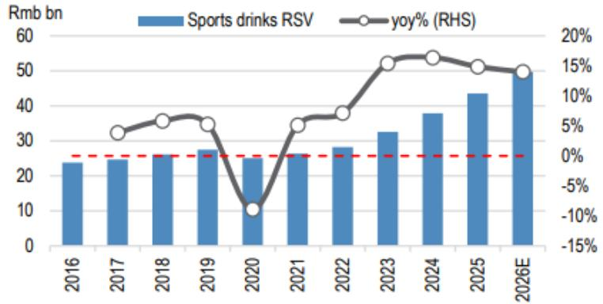

bar-line hybrid chart

| Year   | Sports drinks RSV (Rmb bn) | yoy% (RHS) |
| ------ | -------------------------- | ---------- |
| 2016   | 24                         | -          |
| 2017   | 25                         | 5%         |
| 2018   | 26                         | 7%         |
| 2019   | 27                         | 6%         |
| 2020   | 25                         | -10%       |
| 2021   | 26                         | 5%         |
| 2022   | 28                         | 7%         |
| 2023   | 33                         | 15%        |
| 2024   | 38                         | 16%        |
| 2025   | 44                         | 15%        |
| 2026E  | 50                         | 14%        |

Source: JPM estimates, Company data.

Nongfu promoting new product Electrolyte Water in 2026, aiming to capture more market share  
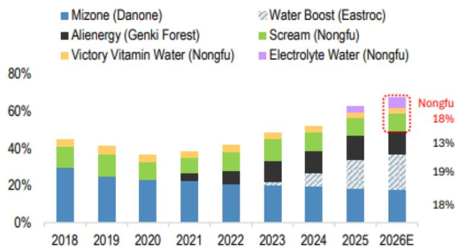

stacked bar chart

| Year | Mizone (Danone) (%) | Water Boost (Eastroc) (%) | Alienergy (Genki Forest) (%) | Scream (Nongfu) (%) | Victory Vitamin Water (Nongfu) (%) | Electrolyte Water (Nongfu) (%) |
|---|---|---|---|---|---|---|
| 2018 | 29 | 0 | 0 | 10 | 5 | 0 |
| 2019 | 24 | 0 | 0 | 10 | 5 | 0 |
| 2020 | 22 | 0 | 5 | 8 | 3 | 0 |
| 2021 | 22 | 0 | 5 | 8 | 3 | 0 |
| 2022 | 20 | 0 | 7 | 10 | 4 | 0 |
| 2023 | 19 | 13 | 13 | 13 | 4 | 0 |
| 2024 | 18 | 13 | 14 | 13 | 4 | 0 |
| 2025 | 17 | 17 | 15 | 13 | 4 | 3 |
| 2026E | 16 | 17 | 15 | 13 | 4 | 5 |
Nongfu
18%

Source: Euromonitor, JPM estimates.

## RTD Beverages – Sports drinks shine, but cost pressure bites

## Sports drinks under the spotlight; competition intensifying

This attractive growth profile has drawn aggressive participation from major players.

- Eastroc's "Water Boost" has been the standout performer, scaling its sports beverage revenue from near zero in 2023 to an estimated Rmb 8bn by 2028E, with market share rising rapidly towards $20\%$ .  
Nongfu Spring launched new Electrolyte Water product in 2026, aiming to capture incremental share alongside its existing Scream and Victory Vitamin Water lines, bringing its combined portfolio share to approximately 18% by 2026E.

The market was once dominated by Mizone (Danone), but is now rapidly fragmenting as domestic challengers deploy new products, refreshed packaging, and gamified promotions (e.g., QR-code lotteries and coupon mechanics) to drive trial and repeat purchases.

Sports drinks - new products and new looks from the major players – Eastroc, Nongfu, Alienergy (Chi Forest)

Eastroc "Water Boost"  
Scan QR code to win Rmb 0.3 / 1 / 2 / 3 coupon per bottle  
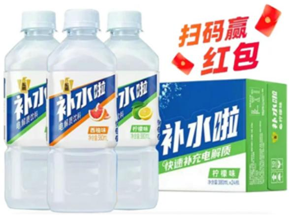

text_image

补水啦
电解质饮料
西柚糖
柠檬糖
柠檬酸
7水啦
柠檬酸
柠檬酸
7水啦
快速补充电解质
柠檬味
净含量: 350ml·L/kg
扫码赢
红包

Nongfu Electrolyte beverage  
Scan QR code to win lottery: One-yuan special offer, red pocket of Rmb 0.5 / 1 / 2 / 66 / 666  
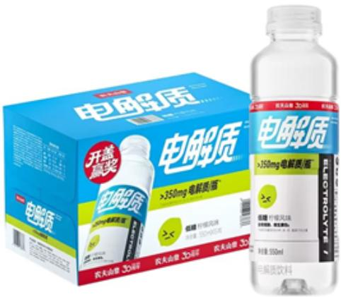

text_image

电解质
开盖
赢奖
电解质
>350mg电解质/瓶
农夫油墨 30毫升
农夫油墨 32毫升
农夫油墨 30毫升
电解质
>350mg电解质/瓶
电极
电解质
利量:150ml
电极饮料

Chi Forest Alienergy  
Scan QR code to win Rmb 0.3 / 1 / 2 / 4 coupon per bottle  
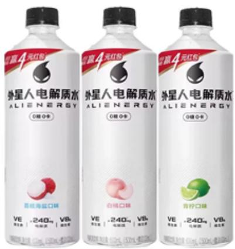

text_image

外星人电解质水
ALIENERGY
0.0克
外星人电解质水
ALIENERGY
0.0克
外星人电解质水
ALIENERGY
0.0克
青柠口味
VE -240g VE
白橘口味
VE -240g VE
青柠口味
VE -240g VE
白橘口味
VE -240g VE

Source: Company Taobao shops.

## RTD Beverages – Sports drinks shine, but cost pressure bites

## Cost pressure a major theme into 2H26; Nongfu most resilient

Our sensitivity test shows that for every $10\%$ PET price increase, Nongfu / Eastroc / CR Beverage's gross profit will be impacted by $1\% / 3\% / 4\%$ , net earnings will be cut by $3\% / 8\% / 21\%$ and net margin will decline by 0.8pp / 1.5pp / 1.9pp on an annualized basis.  
Currently, the PET is priced c.40% higher vs 2025 average levels. Most RTD beverage companies have locked in PET supply and prices through 2Q26, and hence will need to renew contracts relatively soon.

EPS sensitivity to PET price hike

<table><tr><td>2026E</td><td>Nongfu</td><td>Eastroc</td><td>CR Bev</td></tr><tr><td>Gross margin</td><td>58.3%</td><td>43.7%</td><td>44.5%</td></tr><tr><td>PET as % of COGS</td><td>20%</td><td>28%</td><td>36%</td></tr><tr><td>Net margin</td><td>28.4%</td><td>19.3%</td><td>9.4%</td></tr><tr><td colspan="4">Downside per 10% PET price hike:</td></tr><tr><td>Gross profit</td><td>-1%</td><td>-3%</td><td>-4%</td></tr><tr><td>Net profit</td><td>-3%</td><td>-8%</td><td>-21%</td></tr><tr><td>Net margin</td><td>-0.8%</td><td>-1.5%</td><td>-1.9%</td></tr></table>

Source: JPM estimates.

PET price is about 40% higher than 2025 levels  
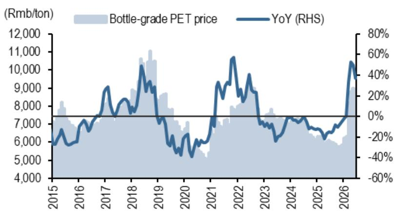

line chart

| Year | Bottle-grade PET price (Rmb/ton) | YoY (%) |
|------|----------------------------------|---------|
| 2015 | ~7,500                           | ~-10%   |
| 2016 | ~8,000                           | ~-15%   |
| 2017 | ~9,000                           | ~-10%   |
| 2018 | ~10,500                          | ~-5%    |
| 2019 | ~9,500                           | ~-15%   |
| 2020 | ~5,500                           | ~-40%   |
| 2021 | ~7,500                           | ~-10%   |
| 2022 | ~10,500                          | ~-5%    |
| 2023 | ~8,500                           | ~-15%   |
| 2024 | ~7,500                           | ~-10%   |
| 2025 | ~6,500                           | ~-15%   |
| 2026 | ~9,500                           | ~-10%   |

Source: Bloomberg Finance L.P.

## RTD Beverages – Sports drinks shine, but cost pressure bites

Key operating metrics and key financials comparison – Beverage players

<table><tr><td rowspan="2">Rmb mn</td><td colspan="4">Nongfu</td><td colspan="4">Eastroc</td><td colspan="4">China Resources Beverage</td></tr><tr><td>2024A</td><td>2025A</td><td>2026e</td><td>2027e</td><td>2024A</td><td>2025A</td><td>2026e</td><td>2027e</td><td>2024A</td><td>2025A</td><td>2026e</td><td>2027e</td></tr><tr><td>Growth Driver</td><td></td><td></td><td></td><td></td><td></td><td></td><td></td><td></td><td></td><td></td><td></td><td></td></tr><tr><td>Revenue</td><td>42,896</td><td>52,553</td><td>59,199</td><td>65,499</td><td>15,839</td><td>20,875</td><td>26,073</td><td>30,844</td><td>13,521</td><td>11,002</td><td>11,881</td><td>12,622</td></tr><tr><td>Water</td><td>15,952</td><td>18,709</td><td>20,606</td><td>22,253</td><td>-</td><td>-</td><td>-</td><td>-</td><td>12,124</td><td>9,504</td><td>10,090</td><td>10,563</td></tr><tr><td>Tea</td><td>16,745</td><td>21,596</td><td>24,835</td><td>28,064</td><td>1,023</td><td>1,986</td><td>3,743</td><td>5,040</td><td>1,397</td><td>1,499</td><td>1,791</td><td>2,060</td></tr><tr><td>Juice</td><td>4,085</td><td>5,176</td><td>5,797</td><td>6,551</td><td>-</td><td>-</td><td>-</td><td>-</td><td>-</td><td>-</td><td>-</td><td>-</td></tr><tr><td>Functional drinks</td><td>4,932</td><td>5,762</td><td>6,454</td><td>7,035</td><td>13,304</td><td>15,599</td><td>17,885</td><td>20,031</td><td>-</td><td>-</td><td>-</td><td>-</td></tr><tr><td>Others</td><td>1,182</td><td>1,309</td><td>1,506</td><td>1,596</td><td>1,512</td><td>3,290</td><td>4,444</td><td>5,773</td><td>-</td><td>-</td><td>-</td><td>-</td></tr><tr><td>Revenue mix</td><td></td><td></td><td></td><td></td><td></td><td></td><td></td><td></td><td></td><td></td><td></td><td></td></tr><tr><td>Water</td><td>37%</td><td>36%</td><td>35%</td><td>34%</td><td>-</td><td>-</td><td>-</td><td>-</td><td>90%</td><td>86%</td><td>85%</td><td>84%</td></tr><tr><td>Tea</td><td>39%</td><td>41%</td><td>42%</td><td>43%</td><td>6%</td><td>10%</td><td>14%</td><td>16%</td><td>10%</td><td>14%</td><td>15%</td><td>16%</td></tr><tr><td>Juice</td><td>10%</td><td>10%</td><td>10%</td><td>10%</td><td>-</td><td>-</td><td>-</td><td>-</td><td>-</td><td>-</td><td>-</td><td>-</td></tr><tr><td>Functional drinks</td><td>11%</td><td>11%</td><td>11%</td><td>11%</td><td>84%</td><td>75%</td><td>69%</td><td>65%</td><td>-</td><td>-</td><td>-</td><td>-</td></tr><tr><td>Others</td><td>3%</td><td>2%</td><td>3%</td><td>2%</td><td>10%</td><td>16%</td><td>17%</td><td>19%</td><td>-</td><td>-</td><td>-</td><td>-</td></tr><tr><td>Revenue yoy (%)</td><td>0.5%</td><td>22.5%</td><td>12.6%</td><td>10.6%</td><td>40.6%</td><td>31.8%</td><td>24.9%</td><td>18.3%</td><td>0.0%</td><td>-18.6%</td><td>8.0%</td><td>6.2%</td></tr><tr><td>Water</td><td>-21.3%</td><td>17.3%</td><td>10.1%</td><td>8.0%</td><td>-</td><td>-</td><td>-</td><td>-</td><td>-2.6%</td><td>-21.6%</td><td>6.2%</td><td>4.7%</td></tr><tr><td>Tea</td><td>32.3%</td><td>29.0%</td><td>15.0%</td><td>13.0%</td><td>96.7%</td><td>94.1%</td><td>88.5%</td><td>34.6%</td><td>30.8%</td><td>7.3%</td><td>19.5%</td><td>15.0%</td></tr><tr><td>Juice</td><td>15.6%</td><td>26.7%</td><td>12.0%</td><td>13.0%</td><td>-</td><td>-</td><td>-</td><td>-</td><td>-</td><td>-</td><td>-</td><td>-</td></tr><tr><td>Functional drinks</td><td>0.6%</td><td>16.8%</td><td>12.0%</td><td>9.0%</td><td>28.7%</td><td>17.3%</td><td>14.7%</td><td>12.0%</td><td>-</td><td>-</td><td>-</td><td>-</td></tr><tr><td>Others</td><td>-9.8%</td><td>10.8%</td><td>15.0%</td><td>6.0%</td><td>272.0%</td><td>117.6%</td><td>35.1%</td><td>29.9%</td><td>-</td><td>-</td><td>-</td><td>-</td></tr><tr><td>Margin profile</td><td></td><td></td><td></td><td></td><td></td><td></td><td></td><td></td><td></td><td></td><td></td><td></td></tr><tr><td>Gross profit</td><td>24,916</td><td>31,808</td><td>34,528</td><td>38,644</td><td>7,097</td><td>9,374</td><td>11,386</td><td>13,483</td><td>6,397</td><td>5,025</td><td>5,286</td><td>5,674</td></tr><tr><td>Gross margin (%)</td><td>58.1%</td><td>60.5%</td><td>58.3%</td><td>59.0%</td><td>44.8%</td><td>44.9%</td><td>43.7%</td><td>43.7%</td><td>47.3%</td><td>45.7%</td><td>44.5%</td><td>44.9%</td></tr><tr><td>Operating Expenses</td><td></td><td></td><td></td><td></td><td></td><td></td><td></td><td></td><td></td><td></td><td></td><td></td></tr><tr><td>Total Opex</td><td>(11,136)</td><td>(12,253)</td><td>(13,802)</td><td>(15,271)</td><td>(3,169)</td><td>(4,048)</td><td>(5,027)</td><td>(5,885)</td><td>(4,407)</td><td>(4,194)</td><td>(4,182)</td><td>(4,367)</td></tr><tr><td>Selling &amp; distribution expenses</td><td>(9,173)</td><td>(9,800)</td><td>(11,040)</td><td>(12,215)</td><td>(2,681)</td><td>(3,405)</td><td>(4,250)</td><td>(4,997)</td><td>(4,058)</td><td>(3,779)</td><td>(3,754)</td><td>(3,913)</td></tr><tr><td>Admin &amp; R&amp;D</td><td>(1,962)</td><td>(2,452)</td><td>(2,762)</td><td>(3,056)</td><td>(488)</td><td>(643)</td><td>(777)</td><td>(889)</td><td>(349)</td><td>(415)</td><td>(428)</td><td>(454)</td></tr><tr><td>Total Opex % of revenue</td><td>-26.0%</td><td>-23.3%</td><td>-23.3%</td><td>-23.3%</td><td>-20.0%</td><td>-19.4%</td><td>-19.3%</td><td>-19.1%</td><td>-32.6%</td><td>-38.1%</td><td>-35.2%</td><td>-34.6%</td></tr><tr><td>Selling &amp; distribution expenses</td><td>-21.4%</td><td>-18.6%</td><td>-18.6%</td><td>-18.6%</td><td>-16.9%</td><td>-16.3%</td><td>-16.3%</td><td>-16.2%</td><td>-30.0%</td><td>-34.3%</td><td>-31.6%</td><td>-31.0%</td></tr><tr><td>Admin &amp; R&amp;D</td><td>-4.6%</td><td>-4.7%</td><td>-4.7%</td><td>-4.7%</td><td>-3.1%</td><td>-3.1%</td><td>-3.0%</td><td>-2.9%</td><td>-2.6%</td><td>-3.8%</td><td>-3.6%</td><td>-3.6%</td></tr><tr><td>Core EBIT</td><td>13,780</td><td>19,556</td><td>20,726</td><td>23,373</td><td>3,768</td><td>5,107</td><td>6,085</td><td>7,274</td><td>1,990</td><td>831</td><td>1,104</td><td>1,307</td></tr><tr><td>EBIT yoy (%)</td><td>-1.3%</td><td>41.9%</td><td>6.0%</td><td>12.8%</td><td>60.2%</td><td>35.5%</td><td>19.2%</td><td>19.5%</td><td>25.4%</td><td>-58.2%</td><td>32.8%</td><td>18.3%</td></tr><tr><td>EBIT margin (%)</td><td>32.1%</td><td>37.2%</td><td>35.0%</td><td>35.7%</td><td>23.8%</td><td>24.5%</td><td>23.3%</td><td>23.6%</td><td>14.7%</td><td>7.6%</td><td>9.3%</td><td>10.4%</td></tr></table>

Source: JPM estimates, Company data.

## Bubble & Brew – After the tide recedes, who is still running?

## After the tide retreats

After fast growth in 2025, we observe a clear divergence in store expansion trajectories among China's leading beverage chains heading into 2026-2027: Luckin and Guming to remain in aggressive growth mode, with store counts up $31\%$ and $51\%$ in 2025-27E. Chagee, with the highest AOV at Rmb18.3, is also set to grow its footprint by $15\%$ over the same period, albeit from a smaller base.  
Lucky Cup and Mixue will enter a phase of meaningful deceleration. Lucky Cup's net store count is expected to remain essentially flat, while Mixue's expansion moderates to +17%, from 7k-8k annual net openings in 2023-2024 to well below 5k by 2026-27E. This slowdown likely reflects network saturation at the lower price tier (AOVs of Rmb 8.1 and Rmb 7.3 for Lucky Cup and Mixue) after years of hyper-expansion.

We expect Luckin and Guming to further grow store count by c.30-50% in the next two years  
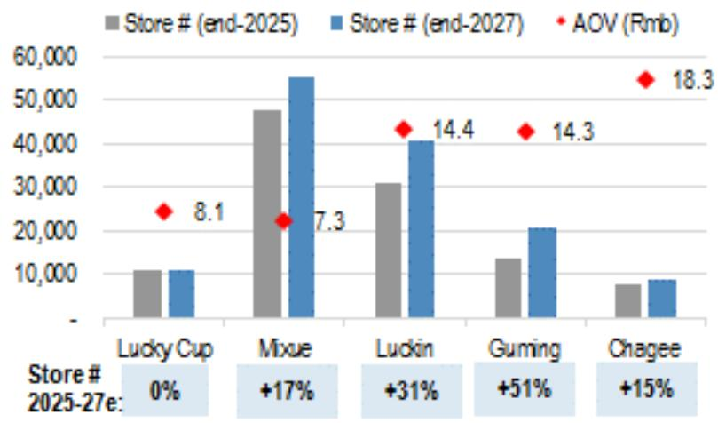

bar-line hybrid

| Event | Store # (end-2025) | Store # (end-2027) | AOV (Rmb) |
| :--- | :--- | :--- | :--- |
| Lucky Cup | 10,000 | 10,000 | 8.1 |
| Mixue | 48,000 | 55,000 | 7.3 |
| Luckin | 30,000 | 40,000 | 14.4 |
| Guming | 13,000 | 20,000 | 14.3 |
| Chagee | 7,000 | 8,000 | 18.3 |
Store # 2025-27e: 0%; Store # 2025-27e: +17%; Store # 2025-27e: +31%; Store # 2025-27e: +51%; Store # 2025-27e: +15%.

Source: JPM estimates, Company data.

While Lucky Cup, Mixue and Chagee to slow down store expansion  
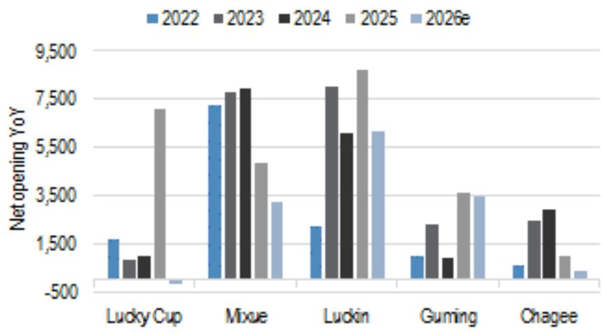

bar chart

| Game | 2022 | 2023 | 2024 | 2025 | 2026e |
|---|---|---|---|---|---|
| Lucky Cup | 1,500 | -1,000 | -1,000 | 7,000 | -300 |
| Mixue | 7,000 | 7,800 | 8,000 | 4,000 | 4,000 |
| Luckin | 1,600 | 8,000 | 5,800 | 9,200 | 6,000 |
| Guring | 1,000 | 1,700 | 1,100 | 3,500 | 3,500 |
| Chagee | -150 | 2,200 | 3,500 | 1,200 | -150 |

Source: JPM estimates, Company data.

## Bubble & Brew – After the tide recedes, who is still running?

## Blurring boundaries: How category convergence is reshaping the landscape

## Argument 1:

## Coffee penetration remains in early innings, offering a long runway for tea brands crossing over

We forecast a 14% CAGR of China’s total coffee consumption through 2040, reaching 145bn cups. Implied per capita consumption of 108 cups would represent only 26% of South Korea's current level of 416 cups (2024). The vast whitespace explains why tea-centric brands such as Guming and Mixue are actively adding coffee to their menus – they can leverage existing store networks to capture incremental demand in an under-penetrated category without significant capital outlay.

We forecast China's total coffee consumption to grow at a $14\%$ CAGR from 2026 to 2040 ...  
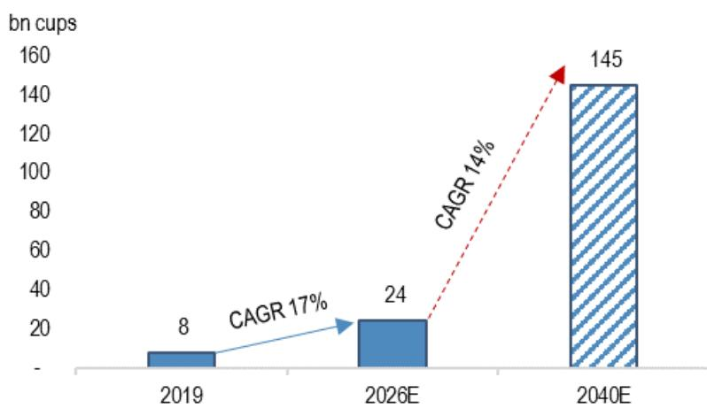

bar chart

| Year | Value (bn cups) |
| :--- | :--- |
| 2019 | 8 |
| 2026E | 24 |
| 2040E | 145 |
CAGR 17% from 2019 to 2026E, CAGR 14% from 2026E to 2040E

Source: Customs data, Ministry of Agriculture of China, JPM.

... with per capita consumption reaching 108 cups by 2040, only equivalent to $26\%$ of South Korea's level in 2024  
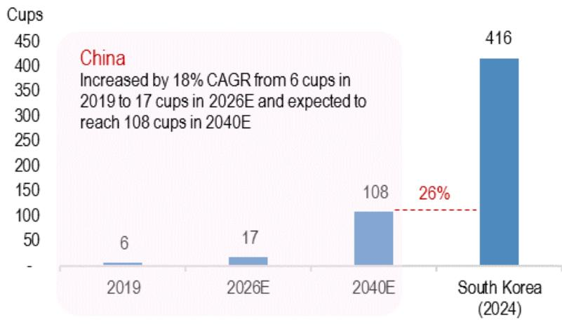

bar chart

| Year | China (Cups) |
| :--- | :--- |
| 2019 | 6 |
| 2026E | 17 |
| 2040E | 108 |
| South Korea (2024) | 416 |
China: Increased by 18% CAGR from 6 cups in 2019 to 17 cups in 2026E and expected to reach 108 cups in 2040E

Source: Customs data, Ministry of Agriculture of China, Korea Times, JPM.

## Bubble & Brew – After the tide recedes, who is still running?

## Argument 2:

## Differentiated networks and staggered peak hours enable multi-category coexistence

Store count vs average ticket size – tea brand  
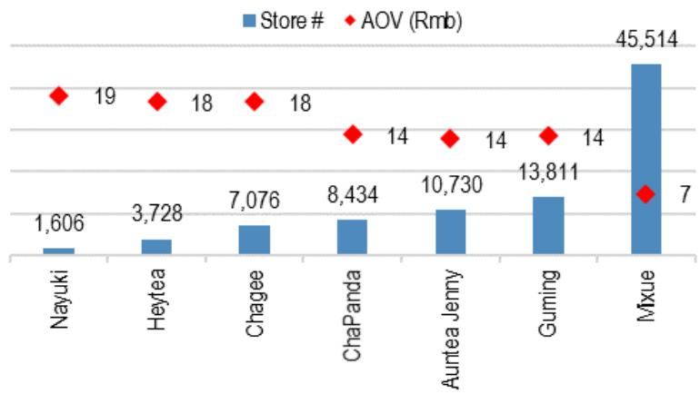

bar-line hybrid

| Store # | Store # | AOV (Rmb) |
| :--- | :--- | :--- |
| Nayuki | 1,606 | 19 |
| Heytea | 3,728 | 18 |
| Chagee | 7,076 | 18 |
| ChaPanda | 8,434 | 14 |
| Auntea Jenny | 10,730 | 14 |
| Guming | 13,811 | 14 |
| Mixue | 45,514 | 7 |

Store count vs average ticket size – coffee brands  
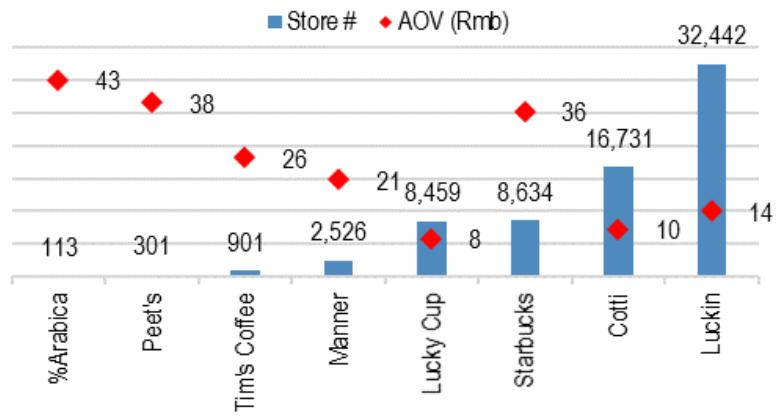

bar-line hybrid

| Brand | Store # | AOV (Rmb) |
| :--- | :--- | :--- |
| %Arabica | 113 | 43 |
| Peet's | 301 | 38 |
| Tim's Coffee | 901 | 26 |
| Manner | 2,526 | 21 |
| Lucky Cup | 8,459 | 8 |
| Starbucks | 8,634 | 36 |
| Cotti | 16,731 | 10 |
| Luckin | 32,442 | 14 |

Store distribution by city tier – tea brand  
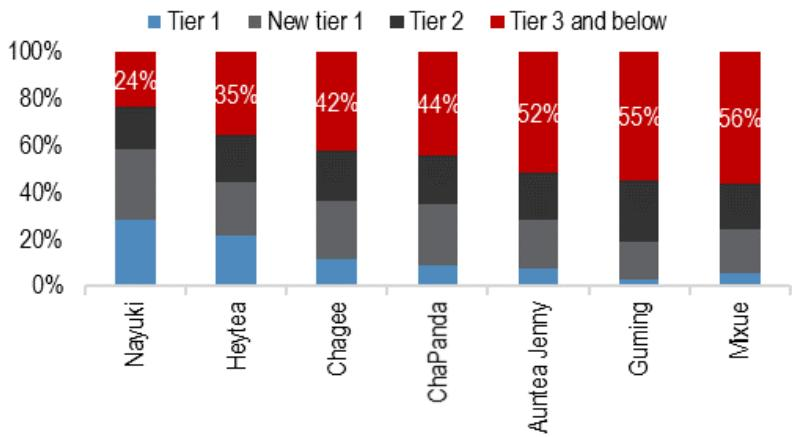

stacked bar chart

| Company | Tier 1 (%) | New tier 1 (%) | Tier 2 (%) | Tier 3 and below (%) |
| :--- | :--- | :--- | :--- | :--- |
| Nayuki | 28 | 30 | 15 | 24 |
| Heytea | 21 | 22 | 20 | 35 |
| Chagee | 12 | 26 | 23 | 42 |
| ChaPanda | 9 | 27 | 21 | 44 |
| Auntea Jenny | 7 | 24 | 25 | 52 |
| Guming | 3 | 16 | 26 | 55 |
| Mixue | 5 | 18 | 20 | 56 |

Store distribution by city tier – coffee brand  
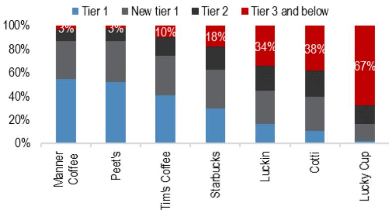

stacked bar chart

| Brand | Tier 1 (%) | New tier 1 (%) | Tier 2 (%) | Tier 3 and below (%) |
| :--- | :--- | :--- | :--- | :--- |
| Manner Coffee | 54 | 27 | 8 | 3 |
| Peet's | 51 | 30 | 9 | 3 |
| Tim's Coffee | 41 | 26 | 14 | 10 |
| Starbucks | 29 | 30 | 14 | 18 |
| Luckin | 17 | 25 | 18 | 34 |
| Cotti | 10 | 26 | 20 | 38 |
| Lucky Cup | 2 | 12 | 12 | 67 |

Note: As of end-May 2026.  
Source: Zhaimen, JPM.

## Bubble & Brew – After the tide recedes, who is still running?

## Argument 2:

## Differentiated networks and staggered peak hours enable multi-category coexistence

Leading players branching into new categories to smooth out peak/low hour and enhance store productivity

<table><tr><td rowspan="2"></td><td rowspan="2">Brand perception</td><td colspan="2">Network ----&gt;</td><td colspan="4">Product offerings ----&gt;</td><td colspan="2">Operating hour ----&gt;</td></tr><tr><td colspan="2">City tier</td><td>Core categories</td><td>New category 1</td><td>New category 2</td><td>New category 3</td><td>Peak hour</td><td>Increasing</td></tr><tr><td>Mixue</td><td>Value-for-money</td><td>Low-tier</td><td>-</td><td>Ice cream, tea</td><td>Snacks</td><td>Coffee</td><td></td><td>After lunch</td><td>Morning</td></tr><tr><td>Luckin</td><td>Affordable coffee</td><td>High-tier</td><td>Low-tier</td><td>Coffee</td><td>Non-coffee bev</td><td>Snacks</td><td>RTD bev</td><td>Morning</td><td>PM session</td></tr><tr><td>Guming</td><td>Value-for-money</td><td>Low-tier</td><td>-</td><td>Fruit tea</td><td>Coffee</td><td>Desserts</td><td>HPP Juice</td><td>After lunch</td><td>Morning</td></tr><tr><td>Chagee</td><td>Premium</td><td>High-tier</td><td>Low-tier</td><td>Tea latte</td><td>Bubble tea</td><td>Ice cream</td><td></td><td>After lunch</td><td>Morning</td></tr><tr><td>KFC / K Coffee</td><td>Fast food</td><td>National</td><td>Low-tier</td><td>Meal</td><td>Coffee</td><td>Light meal</td><td>Night snack</td><td>Lunch/dinner</td><td>Morning + late night</td></tr><tr><td>Lucky Cup</td><td>Value-for-money</td><td>Low-tier</td><td>-</td><td>Coffee</td><td>Non-coffee bev</td><td></td><td></td><td>Morning</td><td>PM session</td></tr></table>

Source: Company data, JPM.

## Competition and ASP: better than feared

## High ASP new products from Gaming, Mixue, Lucky Cup

Guming  
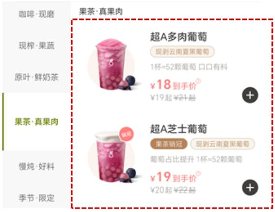

text_image

咖啡·现磨
果茶·真果肉
现榨·果蔬
原叶·鲜奶茶
超A多肉葡萄
现剩云南夏黑葡萄
1杯=52颗葡萄 口口有料
¥18到手价⑤
¥19起 ¥24起
果茶·真果肉
超A芝士葡萄
果茶销冠 现剩云南夏黑葡萄
慢炖·好料
葡萄占比提升 1杯=52颗葡萄
¥19到手价⑤
¥20起 ¥22起
季节·限定

Mixue  
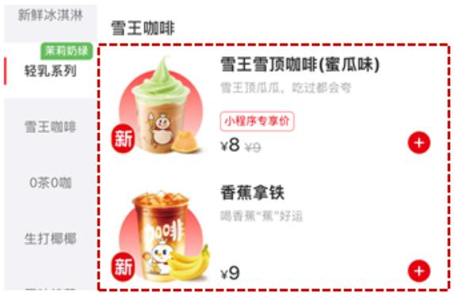

text_image

新鲜冰淇淋
茉莉奶绿
轻乳系列
雪王咖啡
雪王雪顶咖啡(蜜瓜味)
雪王顶瓜瓜, 吃过都会夸
小程序专享价
¥8 ¥9
0茶0咖
生打椰椰
新
香蕉拿铁
喝香蕉“蕉”好运
¥9
+

Lucky Cup  
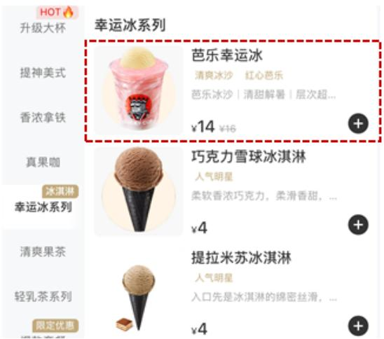

text_image

HOT
升级大杯
提神美式
香浓拿铁
真果咖
冰淇淋
幸运冰系列
轻乳茶系列
限定优惠
幸运冰系列
芭乐幸运冰
清爽冰沙 红心芭乐
芭乐冰沙 | 清甜解暑 | 层次超...
¥14 ¥16
巧克力雪球冰淇淋
人气明星
柔软香浓巧克力，柔滑香甜，
¥4
提拉米苏冰淇淋
人气明星
入口先是冰淇淋的绵密丝滑，...
¥4

Source: Company mini programs.

## Bubble & Brew – After the tide recedes, who is still running?

Key operating metrics and key financials comparison – FMD players

<table><tr><td rowspan="2">Rmb mn</td><td colspan="4">Luckin</td><td colspan="4">Guming</td><td colspan="4">Mixue</td><td colspan="4">Chagee</td></tr><tr><td>2024</td><td>2025</td><td>2026e</td><td>2027e</td><td>2024</td><td>2025</td><td>2026e</td><td>2027e</td><td>2024</td><td>2025</td><td>2026e</td><td>2027e</td><td>2024</td><td>2025</td><td>2026e</td><td>2027e</td></tr><tr><td>Store network</td><td></td><td></td><td></td><td></td><td></td><td></td><td></td><td></td><td></td><td></td><td></td><td></td><td></td><td></td><td></td><td></td></tr><tr><td>Total store #</td><td>22,340</td><td>31,048</td><td>37,196</td><td>40,696</td><td>9,914</td><td>13,554</td><td>17,054</td><td>20,454</td><td>46,479</td><td>59,823</td><td>63,323</td><td>68,823</td><td>6,440</td><td>7,453</td><td>7,853</td><td>8,583</td></tr><tr><td>YoY%</td><td>37%</td><td>39%</td><td>20%</td><td>9%</td><td>10%</td><td>37%</td><td>26%</td><td>20%</td><td>24%</td><td>29%</td><td>6%</td><td>9%</td><td>83%</td><td>16%</td><td>5%</td><td>9%</td></tr><tr><td>Franchise store #</td><td>7,749</td><td>10,814</td><td>13,229</td><td>14,804</td><td>9,907</td><td>13,546</td><td>17,045</td><td>20,444</td><td>46,462</td><td>59,785</td><td>63,285</td><td>68,785</td><td>6,271</td><td>6,838</td><td>6,913</td><td>7,613</td></tr><tr><td>Directly-operated store #</td><td>14,591</td><td>20,234</td><td>23,967</td><td>25,892</td><td>7</td><td>8</td><td>9</td><td>10</td><td>17</td><td>38</td><td>38</td><td>38</td><td>169</td><td>615</td><td>940</td><td>970</td></tr><tr><td>Net open YoY</td><td>6,092</td><td>8,708</td><td>6,148</td><td>3,500</td><td>913</td><td>3,640</td><td>3,500</td><td>3,400</td><td>8,914</td><td>13,344</td><td>3,500</td><td>5,500</td><td>2,929</td><td>1,013</td><td>400</td><td>730</td></tr><tr><td>Franchise store #</td><td>2,129</td><td>3,065</td><td>2,415</td><td>1,575</td><td>912</td><td>3,639</td><td>3,499</td><td>3,399</td><td>8,946</td><td>13,323</td><td>3,500</td><td>5,500</td><td>2,799</td><td>567</td><td>75</td><td>700</td></tr><tr><td>Directly-operated store #</td><td>3,963</td><td>5,643</td><td>3,733</td><td>1,925</td><td>1</td><td>1</td><td>1</td><td>1</td><td>-32</td><td>21</td><td>0</td><td>0</td><td>130</td><td>446</td><td>325</td><td>30</td></tr><tr><td>Store-level operating metrics</td><td></td><td></td><td></td><td></td><td></td><td></td><td></td><td></td><td></td><td></td><td></td><td></td><td></td><td></td><td></td><td></td></tr><tr><td>Avg daily cups sold</td><td>421</td><td>423</td><td>406</td><td>402</td><td>384</td><td>456</td><td>447</td><td>438</td><td>590</td><td>627</td><td>574</td><td>572</td><td>837</td><td>521</td><td>469</td><td>469</td></tr><tr><td>YoY%</td><td>-1%</td><td>0%</td><td>-4%</td><td>-1%</td><td>-8%</td><td>19%</td><td>-2%</td><td>-2%</td><td>-3%</td><td>6%</td><td>-8%</td><td>0%</td><td>5%</td><td>-38%</td><td>-10%</td><td>0%</td></tr><tr><td>ASP per cup (Rmb)</td><td>13.2</td><td>13.5</td><td>13.5</td><td>13.4</td><td>16.9</td><td>17.1</td><td>16.8</td><td>16.6</td><td>6.4</td><td>6.4</td><td>6.6</td><td>6.5</td><td>20.4</td><td>21.8</td><td>21.8</td><td>21.8</td></tr><tr><td>YoY%</td><td>-7%</td><td>2%</td><td>0%</td><td>-1%</td><td>4%</td><td>1%</td><td>-2%</td><td>-1%</td><td>0%</td><td>-1%</td><td>3%</td><td>-1%</td><td>1%</td><td>7%</td><td>0%</td><td>0%</td></tr><tr><td>Daily GMV (Rmb)</td><td>5,545</td><td>5,703</td><td>5,477</td><td>5,368</td><td>6,500</td><td>7,800</td><td>7,529</td><td>7,268</td><td>3,799</td><td>3,985</td><td>3,777</td><td>3,723</td><td>17,057</td><td>11,386</td><td>10,247</td><td>10,247</td></tr><tr><td>YoY%</td><td>-8%</td><td>3%</td><td>-4%</td><td>-2%</td><td>-4%</td><td>20%</td><td>-3%</td><td>-3%</td><td>-4%</td><td>5%</td><td>-5%</td><td>-1%</td><td>6%</td><td>-33%</td><td>-10%</td><td>0%</td></tr><tr><td>SSSG</td><td>-16.7%</td><td>7.5%</td><td></td><td></td><td>-1.5%</td><td>20.0%</td><td></td><td></td><td>not disclosed</td><td></td><td></td><td></td><td>2.7%</td><td>-23.8%</td><td></td><td></td></tr><tr><td>Revenue breakdown</td><td></td><td></td><td></td><td></td><td></td><td></td><td></td><td></td><td></td><td></td><td></td><td></td><td></td><td></td><td></td><td></td></tr><tr><td>Total revenue</td><td>34,475</td><td>49,288</td><td>60,172</td><td>66,836</td><td>8,791</td><td>12,914</td><td>16,312</td><td>19,103</td><td>24,829</td><td>33,560</td><td>36,878</td><td>39,134</td><td>12,406</td><td>12,907</td><td>13,837</td><td>15,404</td></tr><tr><td>- Sales of goods</td><td>5,539</td><td>6,959</td><td>8,739</td><td>10,040</td><td>6,563</td><td>9,320</td><td>12,138</td><td>14,604</td><td>23,452</td><td>31,439</td><td>34,532</td><td>36,618</td><td>9,891</td><td>10,083</td><td>8,990</td><td>9,497</td></tr><tr><td>- Sales of equipment</td><td>588</td><td>861</td><td>612</td><td>399</td><td>465</td><td>949</td><td>971</td><td>902</td><td>756</td><td>1,327</td><td>1,393</td><td>1,421</td><td>898</td><td>357</td><td>47</td><td>441</td></tr><tr><td>- Franchise management</td><td>1,618</td><td>3,773</td><td>4,877</td><td>5,604</td><td>1,750</td><td>2,628</td><td>3,187</td><td>3,582</td><td>620</td><td>794</td><td>953</td><td>1,096</td><td>843</td><td>977</td><td>967</td><td>1,021</td></tr><tr><td>- Revenue from direct-operated stores</td><td>26,730</td><td>37,694</td><td>45,944</td><td>50,793</td><td>14</td><td>16</td><td>16</td><td>15</td><td>-</td><td>-</td><td>-</td><td>-</td><td>773</td><td>1,490</td><td>3,833</td><td>4,444</td></tr><tr><td>YoY change</td><td>38%</td><td>43%</td><td>22%</td><td>11%</td><td>15%</td><td>47%</td><td>26%</td><td>17%</td><td>22%</td><td>35%</td><td>10%</td><td>6%</td><td>167%</td><td>4%</td><td>7%</td><td>11%</td></tr><tr><td>- Sales of goods</td><td>33%</td><td>26%</td><td>26%</td><td>15%</td><td>14%</td><td>42%</td><td>30%</td><td>20%</td><td>22%</td><td>34%</td><td>10%</td><td>6%</td><td>176%</td><td>2%</td><td>-11%</td><td>6%</td></tr><tr><td>- Sales of equipment</td><td>-33%</td><td>46%</td><td>-29%</td><td>-35%</td><td>27%</td><td>104%</td><td>2%</td><td>-7%</td><td>3%</td><td>75%</td><td>5%</td><td>2%</td><td>59%</td><td>-50%</td><td>-87%</td><td>833%</td></tr><tr><td>- Franchise management</td><td>36%</td><td>133%</td><td>29%</td><td>15%</td><td>15%</td><td>50%</td><td>21%</td><td>12%</td><td>53%</td><td>28%</td><td>20%</td><td>15%</td><td>240%</td><td>16%</td><td>-1%</td><td>6%</td></tr><tr><td>- Revenue from direct-operated stores</td><td>43%</td><td>41%</td><td>22%</td><td>11%</td><td>16%</td><td>15%</td><td>-3%</td><td>-3%</td><td>-</td><td>-</td><td>-</td><td>-</td><td>217%</td><td>93%</td><td>157%</td><td>16%</td></tr><tr><td>% of total</td><td></td><td></td><td></td><td></td><td></td><td></td><td></td><td></td><td></td><td></td><td></td><td></td><td></td><td></td><td></td><td></td></tr><tr><td>- Sales of goods</td><td>16%</td><td>14%</td><td>15%</td><td>15%</td><td>75%</td><td>72%</td><td>74%</td><td>76%</td><td>94%</td><td>94%</td><td>94%</td><td>94%</td><td>80%</td><td>78%</td><td>65%</td><td>62%</td></tr><tr><td>- Sales of equipment</td><td>2%</td><td>2%</td><td>1%</td><td>1%</td><td>5%</td><td>7%</td><td>6%</td><td>5%</td><td>3%</td><td>4%</td><td>4%</td><td>4%</td><td>7%</td><td>3%</td><td>0%</td><td>3%</td></tr><tr><td>- Franchise management</td><td>5%</td><td>8%</td><td>8%</td><td>8%</td><td>20%</td><td>20%</td><td>20%</td><td>19%</td><td>2%</td><td>2%</td><td>3%</td><td>3%</td><td>7%</td><td>8%</td><td>7%</td><td>7%</td></tr><tr><td>- Revenue from direct-operated stores</td><td>78%</td><td>76%</td><td>76%</td><td>76%</td><td>0%</td><td>0%</td><td>0%</td><td>0%</td><td>-</td><td>-</td><td>-</td><td>-</td><td>6%</td><td>12%</td><td>28%</td><td>29%</td></tr><tr><td>Margin profile</td><td></td><td></td><td></td><td></td><td></td><td></td><td></td><td></td><td></td><td></td><td></td><td></td><td></td><td></td><td></td><td></td></tr><tr><td>Gross margin</td><td>59.1%</td><td>61.9%</td><td>61.1%</td><td>60.7%</td><td>30.6%</td><td>33.0%</td><td>33.0%</td><td>33.0%</td><td>32.5%</td><td>31.1%</td><td>30.0%</td><td>30.0%</td><td>49.6%</td><td>53.5%</td><td>55.5%</td><td>55.5%</td></tr><tr><td>- yoy chg</td><td>2.9%</td><td>2.7%</td><td>-0.8%</td><td>-0.4%</td><td>-0.7%</td><td>2.4%</td><td>0.0%</td><td>0.0%</td><td>2.9%</td><td>-1.3%</td><td>-1.1%</td><td>0.0%</td><td>4.8%</td><td>3.9%</td><td>2.0%</td><td>0.0%</td></tr><tr><td>Total Opex</td><td>7,162</td><td>12,531</td><td>13,187</td><td>13,995</td><td>1,023</td><td>1,291</td><td>1,631</td><td>1,910</td><td>2,459</td><td>3,220</td><td>3,512</td><td>3,688</td><td>2,222</td><td>3,813</td><td>2,986</td><td>3,215</td></tr><tr><td>Selling &amp; distribution expenses</td><td>4,741</td><td>9,474</td><td>5,234</td><td>5,975</td><td>479</td><td>703</td><td>888</td><td>1,040</td><td>1,599</td><td>2,037</td><td>2,213</td><td>2,309</td><td>1,109</td><td>1,363</td><td>1,266</td><td>1,407</td></tr><tr><td>Admin expenses</td><td>2,420</td><td>3,057</td><td>7,952</td><td>8,020</td><td>311</td><td>365</td><td>461</td><td>540</td><td>755</td><td>1,082</td><td>1,188</td><td>1,261</td><td>1,113</td><td>2,450</td><td>1,720</td><td>1,808</td></tr><tr><td>R&amp;D expenses</td><td></td><td></td><td></td><td></td><td>233</td><td>223</td><td>282</td><td>330</td><td>105</td><td>101</td><td>111</td><td>118</td><td></td><td></td><td></td><td></td></tr><tr><td>Total Opex as % of revenue</td><td>21%</td><td>25%</td><td>22%</td><td>21%</td><td>12%</td><td>10%</td><td>10%</td><td>10%</td><td>10%</td><td>10%</td><td>10%</td><td>9%</td><td>18%</td><td>30%</td><td>22%</td><td>21%</td></tr><tr><td>Selling &amp; distribution expenses</td><td>14%</td><td>19%</td><td>9%</td><td>9%</td><td>5%</td><td>5%</td><td>5%</td><td>5%</td><td>6%</td><td>6%</td><td>6%</td><td>6%</td><td>9%</td><td>11%</td><td>9%</td><td>9%</td></tr><tr><td>Admin expenses</td><td>7%</td><td>6%</td><td>13%</td><td>12%</td><td>4%</td><td>3%</td><td>3%</td><td>3%</td><td>3%</td><td>3%</td><td>3%</td><td>3%</td><td>9%</td><td>19%</td><td>12%</td><td>12%</td></tr><tr><td>R&amp;D expenses</td><td></td><td></td><td></td><td></td><td>3%</td><td>2%</td><td>2%</td><td>2%</td><td>0%</td><td>0%</td><td>0%</td><td>0%</td><td></td><td></td><td></td><td></td></tr><tr><td>Core EBIT</td><td>3,570</td><td>5,073</td><td>5,908</td><td>7,385</td><td>1,664</td><td>2,971</td><td>3,753</td><td>4,395</td><td>5,601</td><td>7,232</td><td>7,551</td><td>8,052</td><td>2,887</td><td>1,347</td><td>1,689</td><td>1,892</td></tr><tr><td>YoY%</td><td>18%</td><td>42%</td><td>16%</td><td>25%</td><td>5%</td><td>79%</td><td>26%</td><td>17%</td><td>41%</td><td>29%</td><td>4%</td><td>7%</td><td>169%</td><td>-53%</td><td>25%</td><td>12%</td></tr><tr><td>EBIT margin</td><td>10.4%</td><td>10.3%</td><td>9.8%</td><td>11.0%</td><td>18.9%</td><td>23.0%</td><td>23.0%</td><td>23.0%</td><td>22.6%</td><td>21.5%</td><td>20.5%</td><td>20.6%</td><td>23.3%</td><td>10.4%</td><td>12.2%</td><td>12.3%</td></tr><tr><td>- yoy chg</td><td>-1.8%</td><td>-0.1%</td><td>-0.5%</td><td>1.2%</td><td>-1.7%</td><td>4.1%</td><td>0.0%</td><td>0.0%</td><td>2.9%</td><td>-1.0%</td><td>-1.1%</td><td>0.1%</td><td>0.1%</td><td>-12.8%</td><td>1.8%</td><td>0.1%</td></tr><tr><td>Adjusted net profit</td><td>3,311</td><td>4,196</td><td>5,167</td><td>6,183</td><td>1,552</td><td>2,706</td><td>3,404</td><td>3,981</td><td>4,519</td><td>6,037</td><td>6,151</td><td>6,561</td><td>2,517</td><td>1,895</td><td>1,842</td><td>2,003</td></tr><tr><td>YoY%</td><td>4%</td><td>27%</td><td>23%</td><td>20%</td><td>8%</td><td>74%</td><td>26%</td><td>17%</td><td>41%</td><td>34%</td><td>2%</td><td>7%</td><td>174%</td><td>-25%</td><td>-3%</td><td>9%</td></tr><tr><td>Net margin</td><td>9.6%</td><td>8.5%</td><td>8.6%</td><td>9.3%</td><td>17.6%</td><td>21.0%</td><td>20.9%</td><td>20.8%</td><td>18.2%</td><td>18.0%</td><td>16.7%</td><td>16.8%</td><td>20.3%</td><td>14.7%</td><td>13.3%</td><td>13.0%</td></tr><tr><td>- yoy chg</td><td>-3.1%</td><td>-1.1%</td><td>0.1%</td><td>0.7%</td><td>-1.1%</td><td>3.3%</td><td>-0.1%</td><td>0.0%</td><td>2.4%</td><td>-0.2%</td><td>-1.3%</td><td>0.1%</td><td>0.5%</td><td>-5.6%</td><td>-1.4%</td><td>-0.3%</td></tr></table>

Source: Company data, JPM estimates.

## Beer – Right side of the channel migration

■ Premiumization: Still playing out, but the pace is moderating  
■ Channel mix: The structural shift from on-trade to off-trade

Total beer volume in China has been stabilizing at 40-45bn liters per annum after Covid  
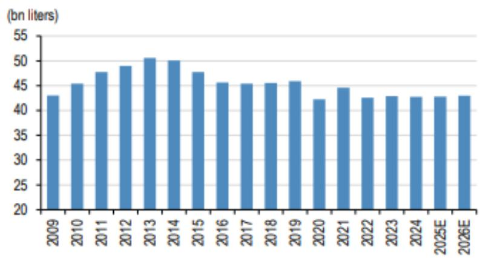

bar chart

| Year | Value (bn liters) |
| :--- | :--- |
| 2009 | 43 |
| 2010 | 45.5 |
| 2011 | 47.8 |
| 2012 | 49.0 |
| 2013 | 50.5 |
| 2014 | 50.2 |
| 2015 | 47.5 |
| 2016 | 45.5 |
| 2017 | 45.3 |
| 2018 | 45.6 |
| 2019 | 46.0 |
| 2020 | 42.0 |
| 2021 | 44.5 |
| 2022 | 42.5 |
| 2023 | 43.0 |
| 2024 | 42.8 |
| 2025E | 43.0 |
| 2026E | 43.0 |

Source: Euromonitor.

Premium and mid-priced beers are taking more share from economy  
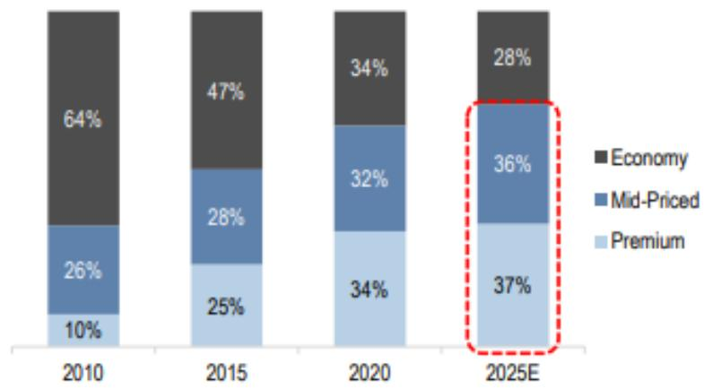

stacked bar chart

| Year | Economy (%) | Mid-Priced (%) | Premium (%) |
| :--- | :--- | :--- | :--- |
| 2010 | 64 | 26 | 10 |
| 2015 | 47 | 28 | 25 |
| 2020 | 34 | 32 | 34 |
| 2025E | 28 | 36 | 37 |

Source: Euromonitor.

China's on-trade mix is still higher than other countries but has been declining from 2025  
On-trade as % of total volume  
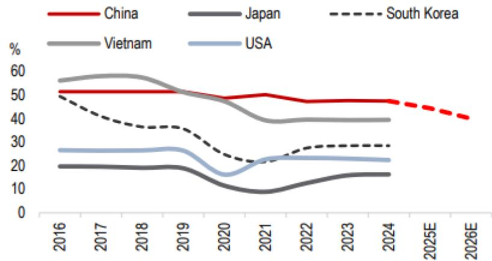

line chart

| Year   | China | Japan | South Korea | Vietnam | USA  |
|--------|-------|-------|-------------|---------|------|
| 2016   | 50    | 20    | 50          | 55      | 25   |
| 2017   | 50    | 20    | 45          | 55      | 25   |
| 2018   | 50    | 20    | 40          | 55      | 25   |
| 2019   | 50    | 20    | 35          | 50      | 25   |
| 2020   | 50    | 15    | 30          | 45      | 20   |
| 2021   | 50    | 10    | 25          | 40      | 25   |
| 2022   | 48    | 15    | 28          | 40      | 25   |
| 2023   | 48    | 18    | 30          | 40      | 25   |
| 2024   | 48    | 18    | 30          | 40      | 25   |
| 2025E  | 48    | 18    | 30          | 40      | 25   |
| 2026E  | 45    | 18    | 30          | 40      | 25   |

Source: Euromonitor, JPM estimates.

Off-trade scenario is becoming more important and CR Beer has relatively higher mix than Bud China and Tsingtao  
2025 volume breakdown by channel  
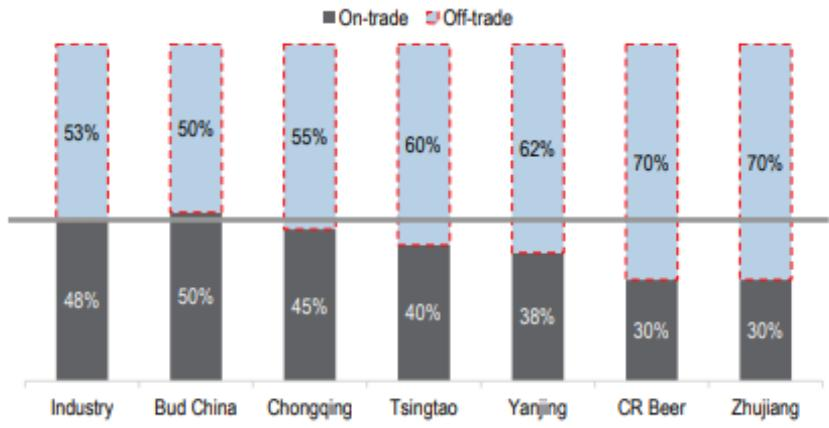

stacked bar chart

| Company | On-trade (%) | Off-trade (%) |
| :--- | :--- | :--- |
| Industry | 48 | 53 |
| Bud China | 50 | 50 |
| Chongqing | 45 | 55 |
| Tsingtao | 40 | 60 |
| Yanjing | 38 | 62 |
| CR Beer | 30 | 70 |
| Zhujiang | 30 | 70 |

Source: Company data.

## Beer – Right side of the channel migration

## YTD performance: Diverging trajectories among the big three

The channel migration has produced differentiated performance among the major brewers YTD. All three brewers are converging on a common playbook: optimizing product portfolios, extending strength in their respective advantaged segments, and building capabilities for the off-trade channel.

Bud China, historically over-indexed to nightlife and high-end dining channels, has been undergoing a strategic pivot since 2025 - refocusing on the Rmb 6–8 price band with core SKUs including Classic Budweiser, Hoegaarden, and Corona, while accelerating the recovery of Harbin Beer. This transition has come at a cost: organic sales declined 11% in 2025 and remained negative at around -4% in 1Q26.  
CR Beer continues to deliver steady, positive momentum, leveraging its structural advantage in off-trade channels (70% off-trade mix - the highest among major players). The company is driving growth through its core brands - Brave the World, Pure Draft, Marrs Green - and the premium Heineken series. Sales grew \~1% in 1Q26 and accelerated to \~2% from April onward, with volume growth of 2–3%, reflecting continued progress on premiumization upgrades.  
Tsingtao, with a higher on-trade skew (60% on-trade / 40% off-trade), is navigating the channel shift by centering its strategy on Draft Beer as the hero SKU, targeting the Rmb 6–8 and Rmb 8+ craft segments, and expanding 1-liter formats tailored to family and home-banquet occasions. April sales grew 2.4% with volume up 3–4%, indicating that its product structure optimization and format innovation are gaining traction.

Cost resilience: Beer margins better insulated than RTD beverages; YTD beer cost index only up 3.9%

## Baijiu – Approaching the trough

## Where are we in the cycle?

The baijiu sector's prosperity is shaped by the convergence of three overlapping cycles:

1) Macro cycle; 2) Supply-demand and pricing cycle; 3) Policy cycle.

## Macro cycle: Baijiu growth decoupling from a slowing economy

Industry revenue grew at a rapid pace in 2005-2012 - buoyed by double-digit GDP growth and a fixed asset investment boom. As China's structural growth rate has decelerated, baijiu industry revenue growth has also downshifted, turning negative in 2025 at around -18% yoy.  
With fixed asset investment growth now hovering in the low single digits and GDP growth stabilizing around 4–5%, the macro tailwinds that once propelled the industry have largely dissipated. We expect industry revenue to begin stabilizing in 2026E, though the recovery trajectory will be more muted than in prior cycles given the structurally lower growth backdrop.

China Baijiu sector revenue growth vs. GDP and FAI  
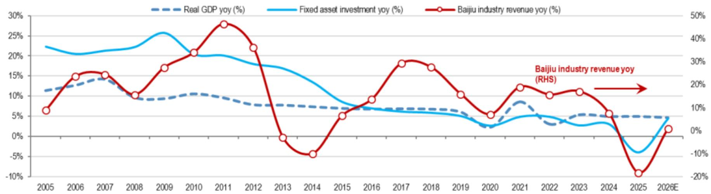

line chart

| Year | Real GDP yoy (%) | Fixed asset investment yoy (%) | Baijiu industry revenue yoy (%) |
|------|------------------|----------------------------------|-----------------------------------|
| 2005 | ~11%             | ~22%                             | ~6%                               |
| 2006 | ~13%             | ~21%                             | ~15%                              |
| 2007 | ~14%             | ~21%                             | ~15%                              |
| 2008 | ~9%              | ~22%                             | ~10%                              |
| 2009 | ~10%             | ~25%                             | ~17%                              |
| 2010 | ~10%             | ~20%                             | ~21%                              |
| 2011 | ~9%              | ~20%                             | ~28%                              |
| 2012 | ~8%              | ~18%                             | ~22%                              |
| 2013 | ~7%              | ~16%                             | ~0%                               |
| 2014 | ~7%              | ~14%                             | ~-5%                              |
| 2015 | ~7%              | ~10%                             | ~5%                               |
| 2016 | ~7%              | ~8%                              | ~9%                               |
| 2017 | ~7%              | ~7%                              | ~18%                              |
| 2018 | ~7%              | ~6%                              | ~17%                              |
| 2019 | ~6%              | ~5%                              | ~10%                              |
| 2020 | ~3%              | ~3%                              | ~5%                               |
| 2021 | ~8%              | ~5%                              | ~12%                              |
| 2022 | ~4%              | ~4%                              | ~10%                              |
| 2023 | ~5%              | ~3%                              | ~11%                              |
| 2024 | ~5%              | ~3%                              | ~6%                               |
| 2025E| ~5%              | ~-3%                             | ~-18%                             |
| 2026E| ~5%              | ~4%                              | ~2%                               |

Source: NBS, Company data, JPM estimates.

## Baijiu – Approaching the trough

## Where are we in the cycle?

## Household balance sheets recovering: Property prices showing early signs of stabilization

JPM forecasts that tier-1 city home prices will see a soft form of stabilization in 2026 (average -1% to 0% YoY). Beyond tier-1 cities, the broader national picture remains more cautious but is approaching a floor.  
For baijiu, household balance sheet repair should begin to alleviate the wealth destruction effect that has weighed on high-end consumption and banquet spending over the past two years.

## Supply-demand & policy cycle: Mapping 2024-to-date downcycle against 2012-16

In the prior cycle, the trigger was a sudden policy shock, sending industry revenue into decline for seven consecutive quarters before an inflection in 2H15. The current cycle, began with a more gradual deterioration, and the “alcohol ban (禁酒令)” arrived in 2Q25 added further downward pressure.  
If the 2012–2016 playbook is any guide, the industry may face several more quarters of contraction before bottoming. However, the current downcycle entered its demand weakness phase earlier, suggesting the industry may already be further along in its adjustment process than headline revenue declines imply.

China Baijiu sector revenue growth vs. GDP and FAI  
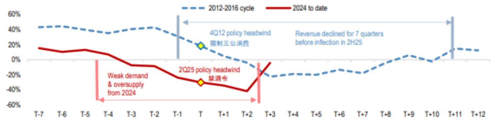

line chart

| Period | 2012-2016 cycle (%) | 2024 to date (%) |
|---|---|---|
| T-7 | ~45 | ~18 |
| T-6 | ~43 | ~15 |
| T-5 | ~40 | ~16 |
| T-4 | ~38 | ~12 |
| T-3 | ~42 | ~-5 |
| T-2 | ~45 | ~-8 |
| T-1 | ~35 | ~-20 |
| T | ~20 | ~-30 |
| T+1 | ~-5 | -35 |
| T+2 | ~-10 | ~-45 |
| T+3 | ~-20 | ~-5 |
| T+4 | ~-25 | - |
| T+5 | ~-25 | - |
| T+6 | ~-20 | - |
| T+7 | ~-25 | - |
| T+8 | ~-10 | - |
| T+9 | ~5 | - |
| T+10 | ~-5 | - |
| T+11 | ~15 | - |
| T+12 | ~10 | - |
The chart includes annotations: 'Weak demand & oversupply from 2024' (T-4), '4Q12 policy headwind,限制三公消费' (T), '2Q25 policy headwind,禁酒令' (T+2), and 'Revenue declined for 7 quarters before inflection in 2H25'. The red line is labeled '2024 to date'.

# Baijiu – Approaching the trough

Where are we in the cycle?

## Our assessment: Approaching the trough, but recovery will be gradual

Synthesizing across all three cycles, we believe the baijiu sector is in the early innings of recovery.

- On the macro front, GDP growth has stabilized and property prices are showing tentative signs of bottoming – laying the groundwork for a gradual recovery in household wealth confidence.  
On the supply-demand and policy front, the industry has already absorbed five quarters of revenue decline and the incremental policy shock of the alcohol ban; if the 2012–2016 analog holds, the trough may arrive within the next two to three quarters.

However, unlike the V-shaped recovery of 2016–2017, we expect the rebound to be more L-shaped - constrained by structurally softer GDP growth, a still-fragile property market outside tier-1 cities, and a more cautious consumer mindset. The setup favors patient positioning in quality names with pricing power and DTC optionality, rather than aggressive cyclical bets on a sharp snapback.

## Baijiu – Approaching the trough

DTC Reform: the next big thing, led by Moutai

## A paradigm shift in distribution: From wholesale dependence to direct-to-consumer

The market has responded positively to each of Moutai's DTC reform milestones.  
- Investors are increasingly pricing in the structural benefits of DTC – namely, greater pricing transparency, reduced channel speculation, and a more direct relationship with end consumers.

Moutai's YTD share performance and key events of the DTC  
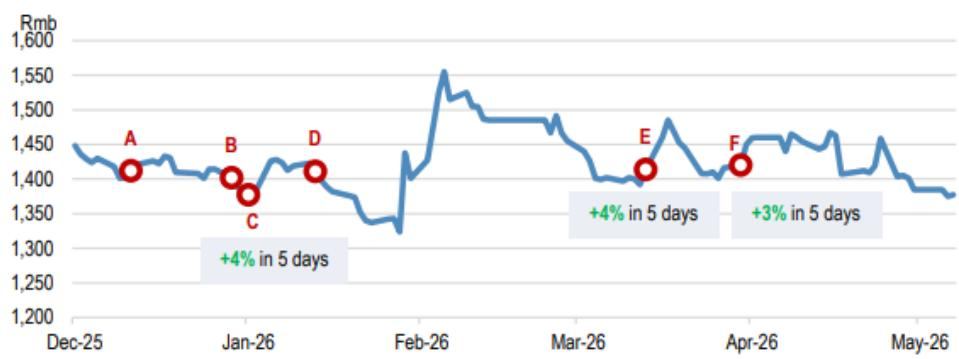

line chart

| Month   | Value |
|---------|-------|
| Dec-25  | 1,400 |
| Jan-26  | 1,400 |
| Feb-26  | 1,350 |
| Mar-26  | 1,400 |
| Apr-26  | 1,400 |
| May-26  | 1,380 |

Source: Bloomberg Finance L.P., JPM..

Moutai – key events of the DTC reform since late-2025

<table><tr><td></td><td>Date</td><td>Event</td></tr><tr><td>A</td><td>11-Dec-25</td><td>Moutai held a distributor meeting and announced measures to support distributors&#x27; confidence. Moutai plans to cut 2026 distribution quota of non-standard Moutai: Caiyou Zhenpin / Zodiac / 15 years / 1L by 100% / 50% / 30% / 30%.</td></tr><tr><td>B</td><td>28-Dec-25</td><td>Moutai held its annual distributor meeting and aimed to implement market-oriented reforms:(1) Market-based pricing strategy.(2) DTC transformation; expanding customer base.(3) Better service: simplify online purchase, deepen cooperation with distributors with reasonable profit sharing.</td></tr><tr><td>C</td><td>1-Jan-26</td><td>Feitian Moutai 53%vol 500ml debut on DTC channel iMoutai.</td></tr><tr><td>D</td><td>13-Jan-26</td><td>Announced more detailed market-oriented reforms:(1) Transitioning from traditional &quot;direct sales + distribution&quot; to &quot;direct sales + distribution + consignment&quot; model.(2) Market-oriented pricing system: announced retail prices of several SKUs on iMoutai, including Feitian Moutai 53%vol 500ml (2026 edition) at Rmb1,499.</td></tr><tr><td>E</td><td>13-Mar-26</td><td>Introduced consignment model for non-standard Moutai products, including Moutai 15 years, Jingpin, Zodiac (Classic/Gift-pack), Guyue Feitian, and special SKUs for Feitian53%vol (1L/200ml/100ml/50ml). Distributors need to submit an application and pay a deposit, and all the products must be sold via i-Moutai at official retail prices, and distributors will receive a 5% sales commission.</td></tr><tr><td>F</td><td>30-Mar-26</td><td>Announced a raise in the ex-factory price of Feitian Moutai 53%vol 500ml (2026) from Rmb1,169 to Rmb1,269, and DTC retail price from Rmb1,499 to Rmb1,539, effective 31 Mar 2026.</td></tr></table>

Source: Company data, JPM..

## Baijiu – Approaching the trough

## DTC Reform: the next big thing, led by Moutai

■ Channel check takeaways: DTC gaining traction with mass-market consumers.  
■ Wholesale price outlook: Downside limited, de-financialization complete.  
The de-financialization of Feitian Moutai pricing is a positive read-through for the broader sector.

Distribution price of case-packed vs single-bottle Feitian Moutai  
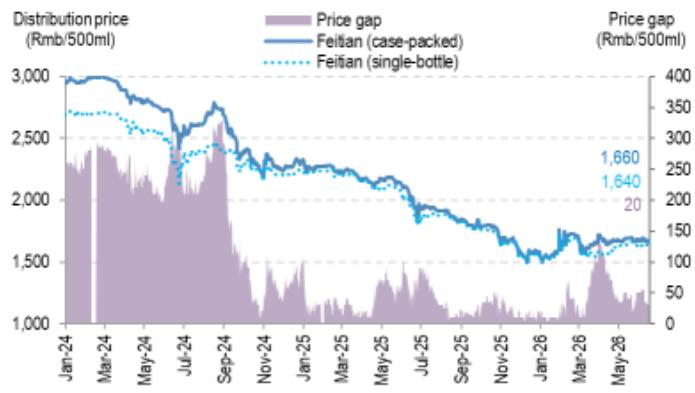

line chart

| Date   | Price gap (Rmb/500ml) |
|--------|------------------------|
| May-26 | 1,660                  |
| May-26 | 1,640                  |
| May-26 | 20                     |

Distribution price of 100ml Feitian vs 500ml Feitian  
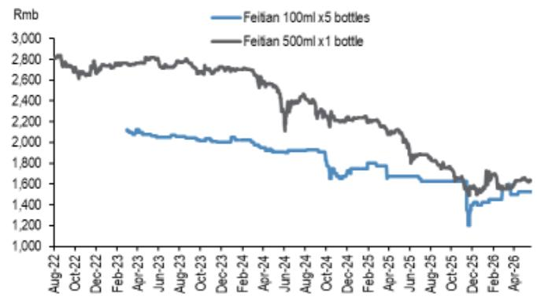

line chart

| Date    | Feitian 100ml x5 bottles | Feitian 500ml x1 bottle |
|---------|--------------------------|-------------------------|
| Aug-22  | ~2,800                   | ~2,800                  |
| Oct-22  | ~2,700                   | ~2,750                  |
| Dec-22  | ~2,650                   | ~2,700                  |
| Feb-23  | ~2,600                   | ~2,650                  |
| Apr-23  | ~2,550                   | ~2,600                  |
| Jun-23  | ~2,500                   | ~2,550                  |
| Aug-23  | ~2,450                   | ~2,500                  |
| Oct-23  | ~2,400                   | ~2,450                  |
| Dec-23  | ~2,350                   | ~2,400                  |
| Feb-24  | ~2,300                   | ~2,350                  |
| Apr-24  | ~2,250                   | ~2,300                  |
| Jun-24  | ~2,100                   | ~2,100                  |
| Aug-24  | ~1,900                   | ~1,900                  |
| Oct-24  | ~1,700                   | ~1,700                  |
| Dec-24  | ~1,650                   | ~1,650                  |
| Feb-25  | ~1,600                   | ~1,600                  |
| Apr-25  | ~1,550                   | ~1,550                  |
| Jun-25  | ~1,500                   | ~1,500                  |
| Aug-25  | ~1,450                   | ~1,450                  |
| Oct-25  | ~1,400                   | ~1,400                  |
| Dec-25  | ~1,300                   | ~1,300                  |
| Feb-26  | ~1,450                   | ~1,450                  |
| Apr-26  | ~1,500                   | ~1,500                  |

Distribution prices of key brands in the Rmb600-1k price range

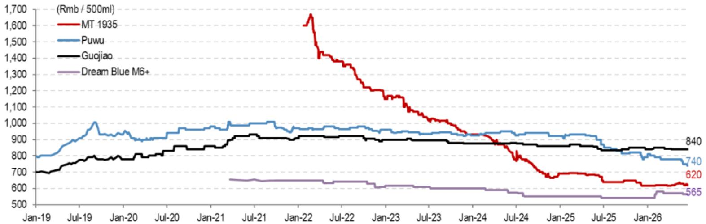

line chart

| Date    | MT 1935 | Puwu | Guojiao | Dream Blue M6+ |
|---------|---------|------|---------|----------------|
| Jan-26  | 620     | 740  | 840     | 565            |

Note: Latest data as of 17 Jun 2026.

## Nongfu (OW): Market share gain momentum intact

Nongfu – Key assumptions and operating metrics

<table><tr><td>FYE Dec 31 (Rmb mn)</td><td>2023</td><td>2024</td><td>2025</td><td>2026E</td><td>2027E</td><td>2028E</td></tr><tr><td>Total revenue</td><td>42,667</td><td>42,896</td><td>52,553</td><td>59,199</td><td>65,499</td><td>71,357</td></tr><tr><td>YoY</td><td>28%</td><td>1%</td><td>23%</td><td>13%</td><td>11%</td><td>9%</td></tr><tr><td>Gross Profit</td><td>25,407</td><td>24,916</td><td>31,808</td><td>34,528</td><td>38,644</td><td>42,101</td></tr><tr><td>Gross margin</td><td>59.5%</td><td>58.1%</td><td>60.5%</td><td>58.3%</td><td>59.0%</td><td>59.0%</td></tr><tr><td>SG&amp;A</td><td>(11,446)</td><td>(11,136)</td><td>(12,253)</td><td>(13,802)</td><td>(15,271)</td><td>(16,637)</td></tr><tr><td>Selling and distribution expense</td><td>(9,284)</td><td>(9,173)</td><td>(9,800)</td><td>(11,040)</td><td>(12,215)</td><td>(13,307)</td></tr><tr><td>Administrative expenses</td><td>(2,162)</td><td>(1,962)</td><td>(2,452)</td><td>(2,762)</td><td>(3,056)</td><td>(3,330)</td></tr><tr><td>Core operating profit</td><td>13,960</td><td>13,780</td><td>19,556</td><td>20,726</td><td>23,373</td><td>25,464</td></tr><tr><td>Core operating margin</td><td>32.7%</td><td>32.1%</td><td>37.2%</td><td>35.0%</td><td>35.7%</td><td>35.7%</td></tr><tr><td>Profit before tax</td><td>15,688</td><td>15,788</td><td>20,918</td><td>22,187</td><td>25,074</td><td>27,412</td></tr><tr><td>Income tax expense</td><td>(3,609)</td><td>(3,665)</td><td>(5,049)</td><td>(5,356)</td><td>(6,053)</td><td>(6,617)</td></tr><tr><td>Profit after tax</td><td>12,079</td><td>12,123</td><td>15,868</td><td>16,831</td><td>19,022</td><td>20,795</td></tr><tr><td>Reported net profit</td><td>12,079</td><td>12,123</td><td>15,868</td><td>16,831</td><td>19,022</td><td>20,795</td></tr><tr><td>YoY</td><td>42%</td><td>0%</td><td>31%</td><td>6%</td><td>13%</td><td>9%</td></tr><tr><td>Net margin</td><td>28.3%</td><td>28.3%</td><td>30.2%</td><td>28.4%</td><td>29.0%</td><td>29.1%</td></tr><tr><td>Core net income</td><td>12,073</td><td>12,083</td><td>16,236</td><td>16,831</td><td>19,022</td><td>20,795</td></tr><tr><td>YoY</td><td>46%</td><td>0%</td><td>34%</td><td>4%</td><td>13%</td><td>9%</td></tr><tr><td>Core net margin</td><td>28.3%</td><td>28.2%</td><td>30.9%</td><td>28.4%</td><td>29.0%</td><td>29.1%</td></tr><tr><td>EPS, diluted (core)</td><td>1.07</td><td>1.07</td><td>1.44</td><td>1.50</td><td>1.69</td><td>1.85</td></tr><tr><td>YoY</td><td>46%</td><td>0%</td><td>34%</td><td>4%</td><td>13%</td><td>9%</td></tr></table>

<table><tr><td>25-28E CAGR</td><td>1H24</td><td>2H24</td><td>1H25</td><td>2H25</td></tr><tr><td rowspan="2">11%</td><td>22,173</td><td>20,723</td><td>25,622</td><td>26,931</td></tr><tr><td>8%</td><td>-7%</td><td>16%</td><td>30%</td></tr><tr><td rowspan="5">10%</td><td>13,033</td><td>11,883</td><td>15,457</td><td>16,352</td></tr><tr><td>58.8%</td><td>57.3%</td><td>60.3%</td><td>60.7%</td></tr><tr><td>(5,885)</td><td>(5,251)</td><td>(6,078)</td><td>(6,174)</td></tr><tr><td>(4,971)</td><td>(4,202)</td><td>(5,011)</td><td>(4,790)</td></tr><tr><td>(913)</td><td>(1,049)</td><td>(1,068)</td><td>(1,384)</td></tr><tr><td rowspan="8">9%</td><td>7,148</td><td>6,632</td><td>9,378</td><td>10,178</td></tr><tr><td>32.2%</td><td>32.0%</td><td>36.6%</td><td>37.8%</td></tr><tr><td>8,142</td><td>7,645</td><td>10,034</td><td>10,884</td></tr><tr><td>(1,903)</td><td>(1,762)</td><td>(2,411)</td><td>(2,638)</td></tr><tr><td>6,240</td><td>5,884</td><td>7,622</td><td>8,246</td></tr><tr><td>6,240</td><td>5,884</td><td>7,622</td><td>8,246</td></tr><tr><td>8%</td><td>-7%</td><td>22%</td><td>40%</td></tr><tr><td>28.1%</td><td>28.4%</td><td>29.7%</td><td>30.6%</td></tr><tr><td rowspan="3">9%</td><td>6,220</td><td>5,863</td><td>7,714</td><td>8,523</td></tr><tr><td>10%</td><td>-9%</td><td>24%</td><td>45%</td></tr><tr><td>28.1%</td><td>28.3%</td><td>30.1%</td><td>31.6%</td></tr><tr><td>9%</td><td>0.55</td><td>0.52</td><td>0.69</td><td>0.76</td></tr></table>

<table><tr><td>FYE Dec 31 (Rmb mn)</td><td>2023</td><td>2024</td><td>2025</td><td>2026E</td><td>2027E</td><td>2028E</td></tr><tr><td colspan="7">Revenues</td></tr><tr><td>- Packaged drinking water</td><td>20,262</td><td>15,952</td><td>18,709</td><td>20,606</td><td>22,253</td><td>23,596</td></tr><tr><td>- Tea beverage</td><td>12,659</td><td>16,745</td><td>21,596</td><td>24,835</td><td>28,064</td><td>31,151</td></tr><tr><td>- Functional beverage</td><td>4,902</td><td>4,932</td><td>5,762</td><td>6,454</td><td>7,035</td><td>7,597</td></tr><tr><td>- Juice beverage</td><td>3,534</td><td>4,085</td><td>5,176</td><td>5,797</td><td>6,551</td><td>7,337</td></tr><tr><td>- Other products</td><td>1,311</td><td>1,182</td><td>1,309</td><td>1,506</td><td>1,596</td><td>1,676</td></tr><tr><td>Total</td><td>42,667</td><td>42,896</td><td>52,553</td><td>59,199</td><td>65,499</td><td>71,357</td></tr><tr><td colspan="7">YoY</td></tr><tr><td>- Packaged drinking water</td><td>10.9%</td><td>-21.3%</td><td>17.3%</td><td>10.1%</td><td>8.0%</td><td>6.0%</td></tr><tr><td>- Tea beverage</td><td>83.3%</td><td>32.3%</td><td>29.0%</td><td>15.0%</td><td>13.0%</td><td>11.0%</td></tr><tr><td>- Functional beverage</td><td>27.7%</td><td>0.6%</td><td>16.8%</td><td>12.0%</td><td>9.0%</td><td>8.0%</td></tr><tr><td>- Juice beverage</td><td>22.7%</td><td>15.6%</td><td>26.7%</td><td>12.0%</td><td>13.0%</td><td>12.0%</td></tr><tr><td>- Other products</td><td>-3.2%</td><td>-9.8%</td><td>10.8%</td><td>15.0%</td><td>6.0%</td><td>5.0%</td></tr><tr><td>Total</td><td>28.4%</td><td>0.5%</td><td>22.5%</td><td>12.6%</td><td>10.6%</td><td>8.9%</td></tr><tr><td colspan="7">% of total</td></tr><tr><td>- Packaged drinking water</td><td>47%</td><td>37%</td><td>36%</td><td>35%</td><td>34%</td><td>33%</td></tr><tr><td>- Tea beverage</td><td>30%</td><td>39%</td><td>41%</td><td>42%</td><td>43%</td><td>44%</td></tr><tr><td>- Functional beverage</td><td>11%</td><td>11%</td><td>11%</td><td>11%</td><td>11%</td><td>11%</td></tr><tr><td>- Juice beverage</td><td>8%</td><td>10%</td><td>10%</td><td>10%</td><td>10%</td><td>10%</td></tr><tr><td>- Other products</td><td>3%</td><td>3%</td><td>2%</td><td>3%</td><td>2%</td><td>2%</td></tr></table>

<table><tr><td>25-28E CAGR</td><td>1H24</td><td>2H24</td><td>1H25</td><td>2H25</td></tr><tr><td>8%</td><td>8,531</td><td>7,421</td><td>9,443</td><td>9,266</td></tr><tr><td>13%</td><td>8,430</td><td>8,315</td><td>10,089</td><td>11,507</td></tr><tr><td>10%</td><td>2,550</td><td>2,382</td><td>2,898</td><td>2,864</td></tr><tr><td>12%</td><td>2,114</td><td>1,971</td><td>2,564</td><td>2,612</td></tr><tr><td>9%</td><td>548</td><td>634</td><td>629</td><td>680</td></tr><tr><td>11%</td><td>22,173</td><td>20,723</td><td>25,622</td><td>26,931</td></tr><tr><td></td><td>-18.3%</td><td>-24.4%</td><td>10.7%</td><td>24.9%</td></tr><tr><td></td><td>59.5%</td><td>12.8%</td><td>19.7%</td><td>38.4%</td></tr><tr><td></td><td>3.8%</td><td>-2.6%</td><td>13.6%</td><td>20.3%</td></tr><tr><td></td><td>25.4%</td><td>6.7%</td><td>21.3%</td><td>32.5%</td></tr><tr><td></td><td>-7.2%</td><td>-12.0%</td><td>14.8%</td><td>7.3%</td></tr><tr><td></td><td>8.4%</td><td>-6.7%</td><td>15.6%</td><td>30.0%</td></tr><tr><td></td><td>38%</td><td>36%</td><td>37%</td><td>34%</td></tr><tr><td></td><td>38%</td><td>40%</td><td>39%</td><td>43%</td></tr><tr><td></td><td>12%</td><td>11%</td><td>11%</td><td>11%</td></tr><tr><td></td><td>10%</td><td>10%</td><td>10%</td><td>10%</td></tr><tr><td></td><td>2%</td><td>3%</td><td>2%</td><td>3%</td></tr></table>

Source: Company data, JPM estimates.

## Nongfu (OW): Market share gain momentum intact

Nongfu – Consensus EBIT revisions  
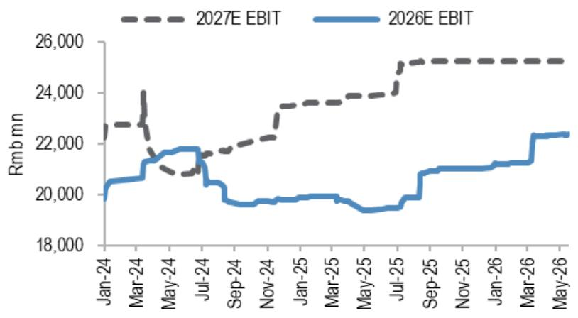

line chart

| Month   | 2026E EBIT (Rmb mn) | 2027E EBIT (Rmb mn) |
|---------|---------------------|---------------------|
| Jan-24  | ~20,000             | ~23,000             |
| Mar-24  | ~21,000             | ~24,000             |
| May-24  | ~21,500             | ~21,500             |
| Jul-24  | ~20,500             | ~21,000             |
| Sep-24  | ~19,500             | ~21,500             |
| Nov-24  | ~19,500             | ~22,500             |
| Jan-25  | ~19,500             | ~23,500             |
| Mar-25  | ~19,500             | ~23,500             |
| May-25  | ~19,500             | ~24,000             |
| Jul-25  | ~19,500             | ~25,000             |
| Sep-25  | ~21,000             | ~25,500             |
| Nov-25  | ~21,500             | ~25,500             |
| Jan-26  | ~21,500             | ~25,500             |
| Mar-26  | ~22,500             | ~25,500             |
| May-26  | ~23,000             | ~25,500             |

Source: Bloomberg Finance L.P. estimates.

Nongfu – Share price vs consensus forward EPS  
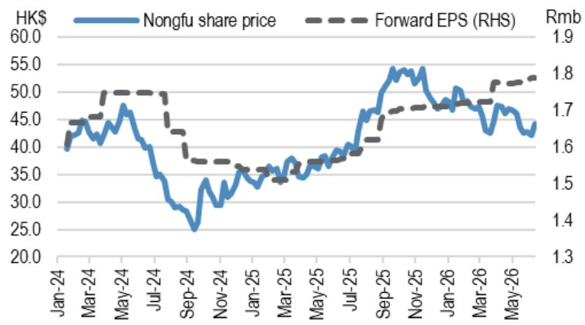

line chart

| Date   | Nongfu share price | Forward EPS (RHS) |
|--------|--------------------|-------------------|
| Jan-24 | 40.0               | 1.7               |
| Mar-24 | 45.0               | 1.8               |
| May-24 | 48.0               | 1.8               |
| Jul-24 | 35.0               | 1.7               |
| Sep-24 | 25.0               | 1.6               |
| Nov-24 | 30.0               | 1.6               |
| Jan-25 | 35.0               | 1.6               |
| Mar-25 | 38.0               | 1.6               |
| May-25 | 40.0               | 1.7               |
| Jul-25 | 45.0               | 1.7               |
| Sep-25 | 55.0               | 1.8               |
| Nov-25 | 50.0               | 1.8               |
| Jan-26 | 48.0               | 1.8               |
| Mar-26 | 45.0               | 1.8               |
| May-26 | 43.0               | 1.8               |

Source: Bloomberg Finance L.P.

Nongfu 12-month rolling P/E  
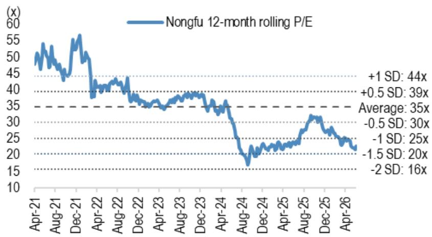

line chart

| Date    | P/E     |
|---------|---------|
| Apr-21  | ~50x    |
| Aug-21  | ~45x    |
| Dec-21  | ~55x    |
| Apr-22  | ~40x    |
| Aug-22  | ~45x    |
| Dec-22  | ~38x    |
| Apr-23  | ~35x    |
| Aug-23  | ~38x    |
| Dec-23  | ~35x    |
| Apr-24  | ~30x    |
| Aug-24  | ~18x    |
| Dec-24  | ~20x    |
| Apr-25  | ~25x    |
| Aug-25  | ~30x    |
| Dec-25  | ~25x    |
| Apr-26  | ~20x    |

Source: JPM, Bloomberg Finance L.P.

Nongfu 12-month rolling P/E band chart  
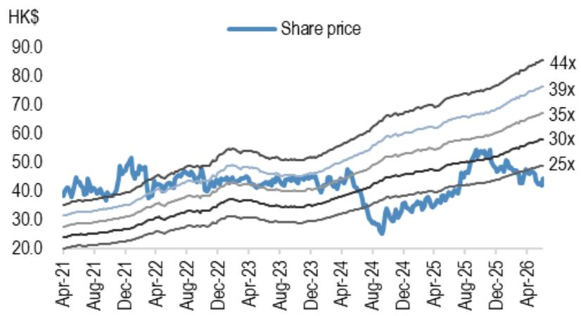

line chart

| Date    | Share price (25x) | Share price (30x) | Share price (35x) | Share price (39x) | Share price (44x) |
|---------|-------------------|-------------------|-------------------|-------------------|-------------------|
| Apr-21  | ~20               | ~25               | ~30               | ~35               | ~40               |
| Aug-21  | ~25               | ~30               | ~35               | ~40               | ~45               |
| Dec-21  | ~30               | ~35               | ~40               | ~45               | ~50               |
| Apr-22  | ~35               | ~40               | ~45               | ~50               | ~55               |
| Aug-22  | ~40               | ~45               | ~50               | ~55               | ~60               |
| Dec-22  | ~45               | ~50               | ~55               | ~60               | ~65               |
| Apr-23  | ~50               | ~55               | ~60               | ~65               | ~70               |
| Aug-23  | ~55               | ~60               | ~65               | ~70               | ~75               |
| Dec-23  | ~60               | ~65               | ~70               | ~75               | ~80               |
| Apr-24  | ~65               | ~70               | ~75               | ~80               | ~85               |
| Aug-24  | ~70               | ~75               | ~80               | ~85               | ~90               |
| Dec-24  | ~75               | ~80               | ~85               | ~90               | ~95               |
| Apr-25  | ~80               | ~85               | ~90               | ~95               | ~100              |
| Aug-25  | ~85               | ~90               | ~95               | ~100              | ~105              |
| Dec-25  | ~90               | ~95               | ~100              | ~105              | ~110              |
| Apr-26  | ~95               | ~100              | ~105              | ~110              | ~115              |

Source: JPM, Bloomberg Finance L.P.

## Eastroc: Key debates on growth momentum and margin resilience persist

Eastroc – Key assumptions and operating metrics

<table><tr><td>FYE 31-Dec (Rmb mn)</td><td>2023</td><td>2024</td><td>2025</td><td>2026E</td><td>2027E</td><td>2028E</td></tr><tr><td>Revenue</td><td>11,263</td><td>15,839</td><td>20,875</td><td>26,073</td><td>30,844</td><td>35,223</td></tr><tr><td>- Energy beverage</td><td>10,336</td><td>13,304</td><td>15,599</td><td>17,885</td><td>20,031</td><td>22,034</td></tr><tr><td>- Sports beverage</td><td>394</td><td>1,495</td><td>3,274</td><td>4,428</td><td>5,756</td><td>6,907</td></tr><tr><td>- Other beverage</td><td>520</td><td>1,023</td><td>1,986</td><td>3,743</td><td>5,040</td><td>6,265</td></tr><tr><td>YoY</td><td>32%</td><td>41%</td><td>32%</td><td>25%</td><td>18%</td><td>14%</td></tr><tr><td>- Energy beverage</td><td>26%</td><td>29%</td><td>17%</td><td>15%</td><td>13%</td><td>10%</td></tr><tr><td>- Sports beverage</td><td></td><td>279%</td><td>119%</td><td>35%</td><td>30%</td><td>20%</td></tr><tr><td>- Other beverage</td><td>63%</td><td>97%</td><td>94%</td><td>89%</td><td>35%</td><td>24%</td></tr><tr><td>% of total</td><td></td><td></td><td></td><td></td><td></td><td></td></tr><tr><td>- Energy beverage</td><td>92%</td><td>84%</td><td>75%</td><td>69%</td><td>65%</td><td>63%</td></tr><tr><td>- Sports beverage</td><td>4%</td><td>9%</td><td>16%</td><td>17%</td><td>19%</td><td>20%</td></tr><tr><td>- Other beverage</td><td>5%</td><td>6%</td><td>10%</td><td>14%</td><td>16%</td><td>18%</td></tr><tr><td>Gross profit</td><td>4,851</td><td>7,097</td><td>9,374</td><td>11,386</td><td>13,483</td><td>15,520</td></tr><tr><td>Gross margin</td><td>43%</td><td>45%</td><td>45%</td><td>44%</td><td>44%</td><td>44%</td></tr><tr><td>- Energy beverage</td><td>45.4%</td><td>48.3%</td><td>50.8%</td><td>50.8%</td><td>51.7%</td><td>52.6%</td></tr><tr><td>- Sports beverage</td><td>23.2%</td><td>29.7%</td><td>34.8%</td><td>35.0%</td><td>36.0%</td><td>37.0%</td></tr><tr><td>- Other beverage</td><td>12.0%</td><td>22.3%</td><td>15.5%</td><td>20.0%</td><td>21.0%</td><td>22.0%</td></tr><tr><td>Core operating profit</td><td>2,351</td><td>3,768</td><td>5,107</td><td>6,085</td><td>7,274</td><td>8,500</td></tr><tr><td>YoY</td><td>34%</td><td>60%</td><td>36%</td><td>19%</td><td>20%</td><td>17%</td></tr><tr><td>Core operating margin</td><td>21%</td><td>24%</td><td>24%</td><td>23%</td><td>24%</td><td>24%</td></tr><tr><td>Net income</td><td>2,040</td><td>3,327</td><td>4,415</td><td>5,085</td><td>6,178</td><td>7,140</td></tr><tr><td>YoY</td><td>42%</td><td>63%</td><td>33%</td><td>15%</td><td>21%</td><td>16%</td></tr><tr><td>Net margin</td><td>18%</td><td>21%</td><td>21%</td><td>20%</td><td>20%</td><td>20%</td></tr><tr><td>Core net income</td><td>1,870</td><td>3,262</td><td>4,184</td><td>5,028</td><td>6,178</td><td>7,140</td></tr><tr><td>YoY</td><td>38%</td><td>74%</td><td>28%</td><td>20%</td><td>23%</td><td>16%</td></tr><tr><td>Core net margin</td><td>17%</td><td>21%</td><td>20%</td><td>19%</td><td>20%</td><td>20%</td></tr><tr><td>Core EPS - diluted</td><td>2.77</td><td>4.83</td><td>6.19</td><td>6.89</td><td>8.41</td><td>9.73</td></tr><tr><td>YoY</td><td>38%</td><td>74%</td><td>28%</td><td>11%</td><td>22%</td><td>16%</td></tr></table>

<table><tr><td>25-28E CAGR</td><td>1Q25</td><td>2Q25</td><td>3Q25</td><td>4Q25</td><td>1Q26</td></tr><tr><td>19%</td><td>4,848</td><td>5,889</td><td>6,107</td><td>4,031</td><td>5,888</td></tr><tr><td>12%</td><td>3,901</td><td>4,460</td><td>4,203</td><td>3,036</td><td>4,412</td></tr><tr><td>28%</td><td>570</td><td>923</td><td>1,354</td><td>427</td><td>645</td></tr><tr><td>47%</td><td>375</td><td>503</td><td>547</td><td>561</td><td>826</td></tr><tr><td></td><td>39%</td><td>34%</td><td>30%</td><td>23%</td><td>21%</td></tr><tr><td></td><td>26%</td><td>19%</td><td>15%</td><td>9%</td><td>13%</td></tr><tr><td></td><td>261%</td><td>190%</td><td>84%</td><td>50%</td><td>13%</td></tr><tr><td></td><td>73%</td><td>60%</td><td>95%</td><td>181%</td><td>120%</td></tr><tr><td></td><td>80%</td><td>76%</td><td>69%</td><td>75%</td><td>75%</td></tr><tr><td></td><td>12%</td><td>16%</td><td>22%</td><td>11%</td><td>11%</td></tr><tr><td></td><td>8%</td><td>9%</td><td>9%</td><td>14%</td><td>14%</td></tr><tr><td>18%</td><td>2,156</td><td>2,691</td><td>2,761</td><td>1,766</td><td>2,761</td></tr><tr><td></td><td>44%</td><td>46%</td><td>45%</td><td>44%</td><td>47%</td></tr><tr><td>19%</td><td>1,163</td><td>1,602</td><td>1,593</td><td>749</td><td>1,497</td></tr><tr><td></td><td>57%</td><td>30%</td><td>40%</td><td>15%</td><td>29%</td></tr><tr><td></td><td>24%</td><td>27%</td><td>26%</td><td>19%</td><td>25%</td></tr><tr><td>17%</td><td>980</td><td>1,394</td><td>1,387</td><td>654</td><td>1,257</td></tr><tr><td></td><td>48%</td><td>31%</td><td>42%</td><td>6%</td><td>28%</td></tr><tr><td></td><td>20%</td><td>24%</td><td>23%</td><td>16%</td><td>21%</td></tr><tr><td>20%</td><td>959</td><td>1,311</td><td>1,270</td><td>644</td><td>1,200</td></tr><tr><td></td><td>54%</td><td>21%</td><td>33%</td><td>8%</td><td>25%</td></tr><tr><td></td><td>20%</td><td>22%</td><td>21%</td><td>16%</td><td>20%</td></tr><tr><td>16%</td><td>1.42</td><td>1.94</td><td>1.88</td><td>0.95</td><td>1.73</td></tr><tr><td></td><td>54%</td><td>21%</td><td>33%</td><td>8%</td><td>22%</td></tr></table>

Source: Company data, JPM estimates.

## Eastroc: Key debates on growth momentum and margin resilience persist

Eastroc (A) - Consensus EBIT revisions  
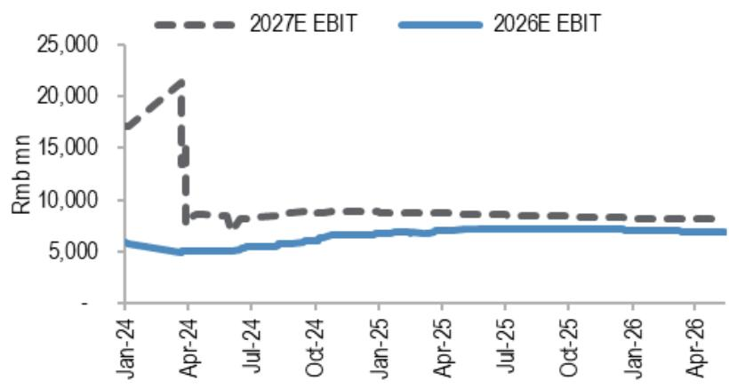

line chart

| Month   | 2027E EBIT | 2026E EBIT |
|---------|------------|------------|
| Jan-24  | ~17,000    | ~5,500     |
| Apr-24  | ~9,000     | ~5,000     |
| Jul-24  | ~8,500     | ~5,500     |
| Oct-24  | ~8,500     | ~6,000     |
| Jan-25  | ~8,500     | ~6,500     |
| Apr-25  | ~8,500     | ~6,500     |
| Jul-25  | ~8,500     | ~6,500     |
| Oct-25  | ~8,500     | ~6,500     |
| Jan-26  | ~8,500     | ~6,500     |
| Apr-26  | ~8,500     | ~6,500     |

Source: Bloomberg Finance L.P. estimates.

Eastroc (A) - Share price vs consensus forward EPS  
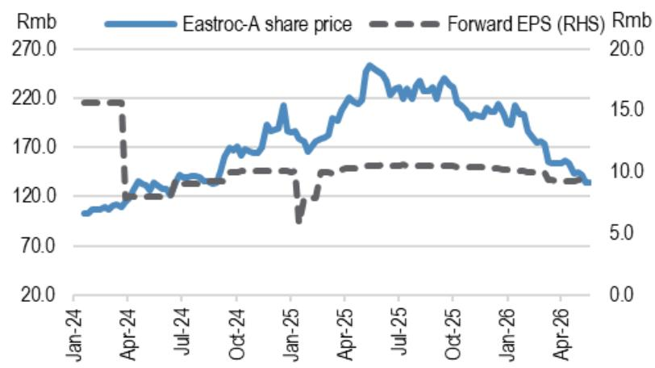

line chart

| Date   | Eastroc-A share price | Forward EPS (RHS) |
|--------|----------------------|-------------------|
| Jan-24 | 100.0                | 15.0              |
| Apr-24 | 120.0                | 10.0              |
| Jul-24 | 130.0                | 10.0              |
| Oct-24 | 170.0                | 10.0              |
| Jan-25 | 180.0                | 5.0               |
| Apr-25 | 230.0                | 10.0              |
| Jul-25 | 220.0                | 10.0              |
| Oct-25 | 210.0                | 10.0              |
| Jan-26 | 190.0                | 10.0              |
| Apr-26 | 130.0                | 10.0              |

Source: Bloomberg Finance L.P.

Eastroc (A) 12-month rolling P/E  
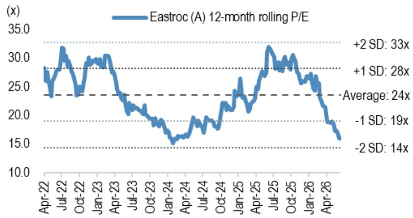

line chart

| Date    | Value |
|---------|-------|
| Apr-22  | 28.0x |
| Jul-22  | 32.0x |
| Oct-22  | 24.0x |
| Jan-23  | 30.0x |
| Apr-23  | 28.0x |
| Jul-23  | 24.0x |
| Oct-23  | 20.0x |
| Jan-24  | 15.0x |
| Apr-24  | 18.0x |
| Jul-24  | 20.0x |
| Oct-24  | 24.0x |
| Jan-25  | 26.0x |
| Apr-25  | 32.0x |
| Jul-25  | 30.0x |
| Oct-25  | 28.0x |
| Jan-26  | 26.0x |
| Apr-26  | 15.0x |

Source: JPM, Bloomberg Finance L.P.

Eastroc (A) 12-month rolling P/E band chart  
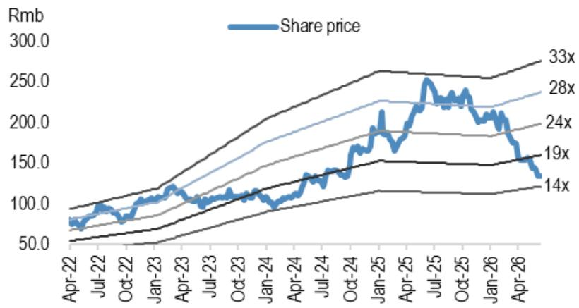

line chart

| Date    | Share price (Rmb) |
|---------|-------------------|
| Apr-22  | ~70.0             |
| Jul-22  | ~80.0             |
| Oct-22  | ~90.0             |
| Jan-23  | ~100.0            |
| Apr-23  | ~110.0            |
| Jul-23  | ~120.0            |
| Oct-23  | ~130.0            |
| Jan-24  | ~140.0            |
| Apr-24  | ~150.0            |
| Jul-24  | ~160.0            |
| Oct-24  | ~170.0            |
| Jan-25  | ~180.0            |
| Apr-25  | ~190.0            |
| Jul-25  | ~200.0            |
| Oct-25  | ~210.0            |
| Jan-26  | ~220.0            |
| Apr-26  | ~230.0            |

Source: JPM, Bloomberg Finance L.P.

## CR Beverage (N): Margin recovery remains key

CR Beverage – Key assumptions and operating metrics

<table><tr><td>FYE 31-Dec (Rmb mn)</td><td>2023</td><td>2024</td><td>2025</td><td>2026E</td><td>2027E</td><td>2028E</td><td>25-28E CAGR</td><td>1H24</td><td>2H24</td><td>1H25</td><td>2H25</td></tr><tr><td colspan="12">Revenues</td></tr><tr><td>- Packaged drinking water products</td><td>12,447</td><td>12,124</td><td>9,504</td><td>10,090</td><td>10,563</td><td>11,060</td><td>5%</td><td>6,829</td><td>5,295</td><td>5,251</td><td>4,253</td></tr><tr><td>- Beverage products</td><td>1,068</td><td>1,397</td><td>1,499</td><td>1,791</td><td>2,060</td><td>2,369</td><td>16%</td><td>787</td><td>610</td><td>955</td><td>544</td></tr><tr><td>Total</td><td>13,515</td><td>13,521</td><td>11,002</td><td>11,881</td><td>12,622</td><td>13,429</td><td>7%</td><td>7,616</td><td>5,905</td><td>6,206</td><td>4,797</td></tr><tr><td colspan="12">YoY</td></tr><tr><td>- Packaged drinking water products</td><td>5%</td><td>-3%</td><td>-22%</td><td>6%</td><td>5%</td><td>5%</td><td></td><td>3%</td><td>-9%</td><td>-23%</td><td>-20%</td></tr><tr><td>- Beverage products</td><td>49%</td><td>31%</td><td>7%</td><td>20%</td><td>15%</td><td>15%</td><td></td><td>40%</td><td>20%</td><td>21%</td><td>-11%</td></tr><tr><td>Total</td><td>7%</td><td>0.0%</td><td>-18.6%</td><td>8.0%</td><td>6.2%</td><td>6.4%</td><td></td><td>6%</td><td>-6%</td><td>-19%</td><td>-19%</td></tr><tr><td colspan="12">% of total</td></tr><tr><td>- Packaged drinking water products</td><td>92%</td><td>90%</td><td>86%</td><td>85%</td><td>84%</td><td>82%</td><td></td><td>90%</td><td>90%</td><td>85%</td><td>89%</td></tr><tr><td>- Beverage products</td><td>8%</td><td>10%</td><td>14%</td><td>15%</td><td>16%</td><td>18%</td><td></td><td>10%</td><td>10%</td><td>15%</td><td>11%</td></tr><tr><td colspan="12">Key financial metrics (Rmb mn)</td></tr><tr><td>Total revenue</td><td>13,515</td><td>13,521</td><td>11,002</td><td>11,881</td><td>12,622</td><td>13,429</td><td>7%</td><td>7,616</td><td>5,905</td><td>6,206</td><td>4,797</td></tr><tr><td>YoY</td><td>7%</td><td>0%</td><td>-19%</td><td>8%</td><td>6%</td><td>6%</td><td></td><td>6%</td><td>-6%</td><td>-19%</td><td>-19%</td></tr><tr><td>Gross Profit</td><td>6,035</td><td>6,397</td><td>5,025</td><td>5,286</td><td>5,674</td><td>6,098</td><td>7%</td><td>3,753</td><td>2,645</td><td>2,896</td><td>2,129</td></tr><tr><td>YoY</td><td>15%</td><td>6%</td><td>-21%</td><td>5%</td><td>7%</td><td>7%</td><td></td><td></td><td></td><td>-23%</td><td>-19%</td></tr><tr><td>Gross margin</td><td>44.7%</td><td>47.3%</td><td>45.7%</td><td>44.5%</td><td>44.9%</td><td>45.4%</td><td></td><td>49.3%</td><td>44.8%</td><td>46.7%</td><td>44.4%</td></tr><tr><td>Core operating profit</td><td>1,587</td><td>1,990</td><td>831</td><td>1,104</td><td>1,307</td><td>1,452</td><td>20%</td><td>1,499</td><td>490</td><td>853</td><td>(21)</td></tr><tr><td>YoY</td><td>48.7%</td><td>25.4%</td><td>-58.2%</td><td>32.8%</td><td>18.3%</td><td>11.1%</td><td></td><td></td><td></td><td>-43.1%</td><td>-104.3%</td></tr><tr><td>Core OP margin</td><td>11.7%</td><td>14.7%</td><td>7.6%</td><td>9.3%</td><td>10.4%</td><td>10.8%</td><td></td><td>19.7%</td><td>8.3%</td><td>13.7%</td><td>-0.4%</td></tr><tr><td>Reported net income</td><td>1,329</td><td>1,637</td><td>985</td><td>1,115</td><td>1,284</td><td>1,416</td><td>13%</td><td>1,128</td><td>509</td><td>805</td><td>180</td></tr><tr><td>YoY</td><td>34%</td><td>23%</td><td>-40%</td><td>13%</td><td>15%</td><td>10%</td><td></td><td></td><td></td><td>-29%</td><td>-65%</td></tr><tr><td>Net margin, reported</td><td>9.8%</td><td>12.1%</td><td>9.0%</td><td>9.4%</td><td>10.2%</td><td>10.5%</td><td></td><td>14.8%</td><td>8.6%</td><td>13.0%</td><td>3.8%</td></tr><tr><td>EPS (Rmb)</td><td>0.66</td><td>0.79</td><td>0.41</td><td>0.46</td><td>0.54</td><td>0.59</td><td>13%</td><td></td><td></td><td></td><td></td></tr><tr><td>YoY</td><td>34%</td><td>19%</td><td>-48%</td><td>13%</td><td>15%</td><td>10%</td><td></td><td></td><td></td><td></td><td></td></tr></table>

Source: Company data, JPM estimates.

## CR Beverage (N): Margin recovery remains key

CR Beverage - Consensus EBIT revisions  
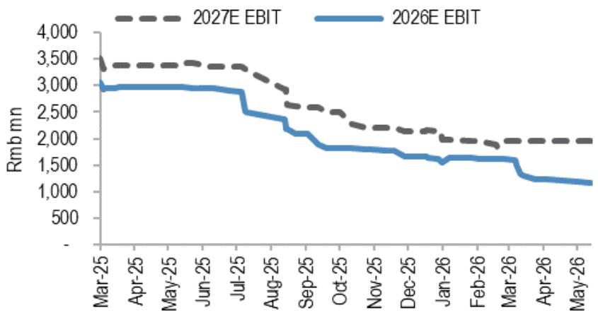

line chart

| Month    | 2026E EBIT (Rmb mn) | 2027E EBIT (Rmb mn) |
| -------- | ------------------- | ------------------- |
| Mar-25   | 3000                | 3500                |
| Apr-25   | 3000                | 3400                |
| May-25   | 3000                | 3400                |
| Jun-25   | 3000                | 3400                |
| Jul-25   | 2800                | 3300                |
| Aug-25   | 2500                | 3100                |
| Sep-25   | 2200                | 2900                |
| Oct-25   | 1900                | 2700                |
| Nov-25   | 1800                | 2500                |
| Dec-25   | 1700                | 2300                |
| Jan-26   | 1600                | 2100                |
| Feb-26   | 1600                | 2000                |
| Mar-26   | 1500                | 1900                |
| Apr-26   | 1300                | 1900                |
| May-26   | 1200                | 1900                |

Source: Bloomberg Finance L.P. estimates.

CR Beverage - Share price vs consensus forward EPS  
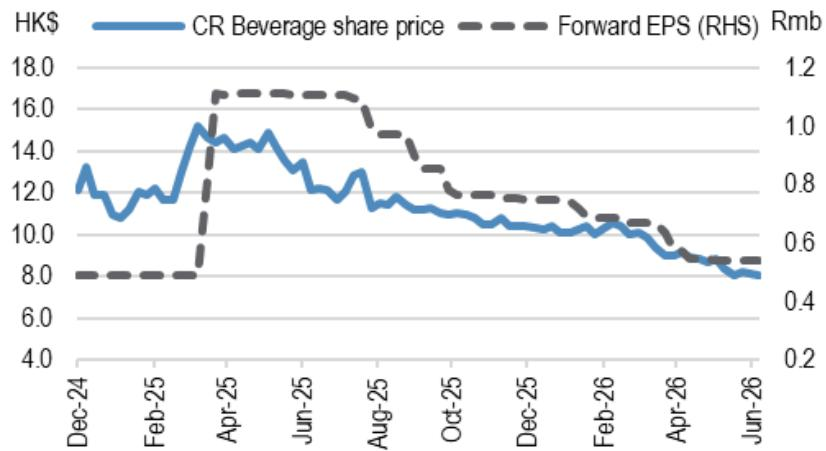

line chart

| Date   | CR Beverage share price | Forward EPS (RHS) |
|--------|--------------------------|-------------------|
| Dec-24 | 13.0                     | 0.8               |
| Feb-25 | 11.0                     | 0.8               |
| Apr-25 | 15.0                     | 1.2               |
| Jun-25 | 14.0                     | 1.2               |
| Aug-25 | 13.0                     | 1.0               |
| Oct-25 | 11.0                     | 0.8               |
| Dec-25 | 10.0                     | 0.8               |
| Feb-26 | 9.0                      | 0.7               |
| Apr-26 | 8.0                      | 0.6               |
| Jun-26 | 7.0                      | 0.5               |

Source: Bloomberg Finance L.P.

CR Beverage 12-month rolling P/E  
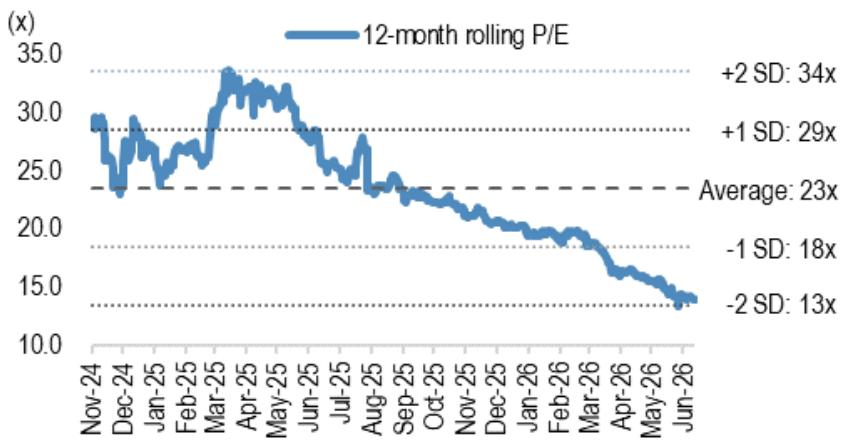

line chart

| Date    | 12-month rolling P/E |
|---------|----------------------|
| Nov-24  | ~30.0                |
| Dec-24  | ~23.0                |
| Jan-25  | ~28.0                |
| Feb-25  | ~27.0                |
| Mar-25  | ~34.0                |
| Apr-25  | ~33.0                |
| May-25  | ~31.0                |
| Jun-25  | ~28.0                |
| Jul-25  | ~24.0                |
| Aug-25  | ~28.0                |
| Sep-25  | ~23.0                |
| Oct-25  | ~22.0                |
| Nov-25  | ~21.0                |
| Dec-25  | ~20.0                |
| Jan-26  | ~19.0                |
| Feb-26  | ~18.0                |
| Mar-26  | ~17.0                |
| Apr-26  | ~16.0                |
| May-26  | ~15.0                |
| Jun-26  | ~13.0                |

Source: JPM, Bloomberg Finance L.P.

CR Beverage 12-month rolling P/E band chart  
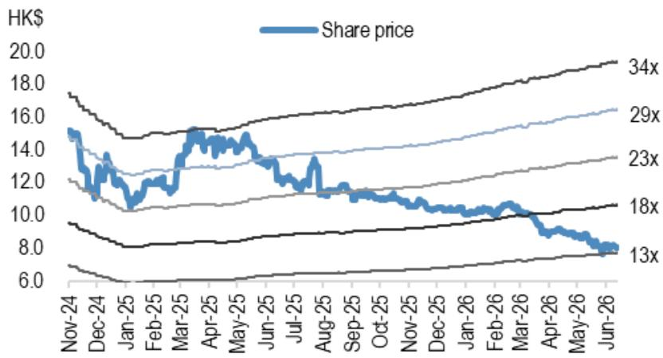

line chart

| Date    | Share price (HK$) |
|---------|-------------------|
| Nov-24  | 15.0              |
| Dec-24  | 13.0              |
| Jan-25  | 10.0              |
| Feb-25  | 12.0              |
| Mar-25  | 15.0              |
| Apr-25  | 14.0              |
| May-25  | 13.0              |
| Jun-25  | 12.0              |
| Jul-25  | 11.0              |
| Aug-25  | 13.0              |
| Sep-25  | 11.0              |
| Oct-25  | 10.0              |
| Nov-25  | 9.0               |
| Dec-25  | 8.0               |
| Jan-26  | 7.0               |
| Feb-26  | 6.0               |
| Mar-26  | 7.0               |
| Apr-26  | 8.0               |
| May-26  | 9.0               |
| Jun-26  | 8.0               |

Source: JPM, Bloomberg Finance L.P.

# Luckin Coffee (OW): 1Q26 a solid start; margin recovery on track

Luckin – Key assumptions and operating metrics

<table><tr><td>FYE Dec 31 (Rmb mn)</td><td>2023</td><td>2024</td><td>2025</td><td>2026E</td><td>2027E</td><td>2028E</td></tr><tr><td colspan="7">Store count</td></tr><tr><td>Total number of stores</td><td>16,248</td><td>22,340</td><td>31,048</td><td>37,196</td><td>40,696</td><td>44,196</td></tr><tr><td>Self-operated stores</td><td>10,628</td><td>14,591</td><td>20,234</td><td>23,967</td><td>25,892</td><td>27,817</td></tr><tr><td>Partnership stores</td><td>5,620</td><td>7,749</td><td>10,814</td><td>13,229</td><td>14,804</td><td>16,379</td></tr><tr><td>China</td><td>16,218</td><td>22,289</td><td>30,888</td><td>36,956</td><td>40,376</td><td>43,796</td></tr><tr><td>Overseas</td><td>30</td><td>51</td><td>160</td><td>240</td><td>320</td><td>400</td></tr><tr><td>Total net addition</td><td>8,034</td><td>6,092</td><td>8,708</td><td>6,148</td><td>3,500</td><td>3,500</td></tr><tr><td>Self-operated stores</td><td>4,976</td><td>3,963</td><td>5,643</td><td>3,733</td><td>1,925</td><td>1,925</td></tr><tr><td>Partnership stores</td><td>3,058</td><td>2,129</td><td>3,065</td><td>2,415</td><td>1,575</td><td>1,575</td></tr><tr><td>China</td><td>8,004</td><td>6,071</td><td>8,599</td><td>6,068</td><td>3,420</td><td>3,420</td></tr><tr><td>Overseas</td><td>30</td><td>21</td><td>109</td><td>80</td><td>80</td><td>80</td></tr><tr><td colspan="7">Single store drivers</td></tr><tr><td>Self-operated stores</td><td></td><td></td><td></td><td></td><td></td><td></td></tr><tr><td>Average daily cups sold</td><td>426</td><td>421</td><td>423</td><td>406</td><td>402</td><td>398</td></tr><tr><td>YoY</td><td>19.5%</td><td>-1.1%</td><td>0.5%</td><td>-4.1%</td><td>-1.0%</td><td>-1.0%</td></tr><tr><td>ASP per cup (Rmb)</td><td>14.1</td><td>13.2</td><td>13.5</td><td>13.5</td><td>13.4</td><td>13.3</td></tr><tr><td>YoY</td><td>-5.6%</td><td>-6.8%</td><td>2.3%</td><td>0.2%</td><td>-1.0%</td><td>-0.5%</td></tr><tr><td>Daily GMV (Rmb)</td><td>6,018</td><td>5,545</td><td>5,703</td><td>5,477</td><td>5,368</td><td>5,288</td></tr><tr><td>YoY</td><td>12.8%</td><td>-7.9%</td><td>2.8%</td><td>-3.9%</td><td>-2.0%</td><td>-1.5%</td></tr><tr><td>Store-level OP margin</td><td>22.2%</td><td>18.9%</td><td>17.8%</td><td></td><td></td><td></td></tr><tr><td>Group non-GAAP OP margin</td><td>13.1%</td><td>11.4%</td><td>11.5%</td><td>11.6%</td><td>12.7%</td><td>13.7%</td></tr><tr><td colspan="7">Financials</td></tr><tr><td>Total net revenue</td><td>24,903</td><td>34,475</td><td>49,288</td><td>60,172</td><td>66,836</td><td>71,439</td></tr><tr><td>YoY</td><td>87%</td><td>38%</td><td>43%</td><td>22%</td><td>11%</td><td>7%</td></tr><tr><td>Gross profit</td><td>14,011</td><td>20,392</td><td>30,505</td><td>36,773</td><td>40,593</td><td>43,355</td></tr><tr><td>YoY</td><td>73%</td><td>46%</td><td>50%</td><td>21%</td><td>10%</td><td>7%</td></tr><tr><td>Gross margin</td><td>56.3%</td><td>59.1%</td><td>61.9%</td><td>61.1%</td><td>60.7%</td><td>60.7%</td></tr><tr><td>Operating income</td><td>3,026</td><td>3,570</td><td>5,073</td><td>5,908</td><td>7,385</td><td>8,659</td></tr><tr><td>YoY</td><td>162%</td><td>18%</td><td>42%</td><td>16%</td><td>25%</td><td>17%</td></tr><tr><td>Operating margin</td><td>12.2%</td><td>10.4%</td><td>10.3%</td><td>9.8%</td><td>11.0%</td><td>12.1%</td></tr><tr><td>Reported net profit</td><td>2,848</td><td>2,956</td><td>3,600</td><td>4,069</td><td>5,083</td><td>6,011</td></tr><tr><td>YoY</td><td>483%</td><td>4%</td><td>22%</td><td>13%</td><td>25%</td><td>18%</td></tr><tr><td>Net margin</td><td>11.4%</td><td>8.6%</td><td>7.3%</td><td>6.8%</td><td>7.6%</td><td>8.4%</td></tr><tr><td>Non-GAAP net profit</td><td>3,174</td><td>3,311</td><td>4,196</td><td>5,167</td><td>6,183</td><td>7,111</td></tr><tr><td>YoY</td><td>203%</td><td>4%</td><td>27%</td><td>23%</td><td>20%</td><td>15%</td></tr><tr><td>Non-GAAP net margin</td><td>12.7%</td><td>9.6%</td><td>8.5%</td><td>8.6%</td><td>9.3%</td><td>10.0%</td></tr><tr><td>Non-GAAP EPADS, diluted</td><td>10.03</td><td>10.39</td><td>13.07</td><td>15.95</td><td>19.09</td><td>21.95</td></tr></table>

<table><tr><td>25-28E CAGR</td><td>1Q25</td><td>2Q25</td><td>3Q25</td><td>4Q25</td><td>1Q26</td><td>2Q26E</td><td>3Q26E</td><td>4Q26E</td></tr><tr><td>12%</td><td>24,097</td><td>26,206</td><td>29,214</td><td>31,048</td><td>33,596</td><td>35,196</td><td>36,296</td><td>37,196</td></tr><tr><td>11%</td><td>15,598</td><td>16,968</td><td>18,882</td><td>20,234</td><td>21,807</td><td>22,767</td><td>23,427</td><td>23,967</td></tr><tr><td>15%</td><td>8,499</td><td>9,238</td><td>10,332</td><td>10,814</td><td>11,789</td><td>12,429</td><td>12,869</td><td>13,229</td></tr><tr><td></td><td>24,032</td><td>26,117</td><td>29,096</td><td>30,888</td><td>33,419</td><td>0</td><td>0</td><td>0</td></tr><tr><td></td><td>65</td><td>89</td><td>118</td><td>160</td><td>177</td><td>0</td><td>0</td><td>0</td></tr><tr><td></td><td>1,757</td><td>2,109</td><td>3,008</td><td>1,834</td><td>2,548</td><td>1,600</td><td>1,100</td><td>900</td></tr><tr><td></td><td>1,007</td><td>1,370</td><td>1,914</td><td>1,352</td><td>1,573</td><td>960</td><td>660</td><td>540</td></tr><tr><td></td><td>750</td><td>739</td><td>1,094</td><td>482</td><td>975</td><td>640</td><td>440</td><td>360</td></tr><tr><td></td><td>1,743</td><td>2,085</td><td>2,979</td><td>1,792</td><td>2,531</td><td>0</td><td>0</td><td>0</td></tr><tr><td></td><td>14</td><td>24</td><td>29</td><td>42</td><td>17</td><td>0</td><td>0</td><td>0</td></tr><tr><td></td><td>356</td><td>455</td><td>495</td><td>399</td><td>336</td><td>414</td><td>451</td><td>387</td></tr><tr><td></td><td>6.4%</td><td>9.5%</td><td>7.6%</td><td>-4.7%</td><td>-5.7%</td><td>-9.0%</td><td>-9.0%</td><td>-3.0%</td></tr><tr><td></td><td>13.4</td><td>13.6</td><td>13.6</td><td>13.3</td><td>13.5</td><td>13.6</td><td>13.6</td><td>13.3</td></tr><tr><td></td><td>1.7%</td><td>3.0%</td><td>3.4%</td><td>1.0%</td><td>1.0%</td><td>0.0%</td><td>0.0%</td><td>0.0%</td></tr><tr><td></td><td>4,770</td><td>6,166</td><td>6,719</td><td>5,306</td><td>4,542</td><td>5,611</td><td>6,114</td><td>5,147</td></tr><tr><td></td><td>8.2%</td><td>12.9%</td><td>11.2%</td><td>-3.8%</td><td>-4.8%</td><td>-9.0%</td><td>-9.0%</td><td>-3.0%</td></tr><tr><td></td><td>17.1%</td><td>21.0%</td><td>17.5%</td><td>15.0%</td><td>13.6%</td><td></td><td></td><td></td></tr><tr><td></td><td>9.7%</td><td>15.0%</td><td>12.6%</td><td>7.5%</td><td>7.5%</td><td>12.6%</td><td>14.7%</td><td>10.5%</td></tr><tr><td>13%</td><td>8,865</td><td>12,359</td><td>15,287</td><td>12,777</td><td>11,995</td><td>15,372</td><td>17,637</td><td>15,168</td></tr><tr><td></td><td>41%</td><td>47%</td><td>50%</td><td>33%</td><td>35%</td><td>24%</td><td>15%</td><td>19%</td></tr><tr><td>12%</td><td>5,290</td><td>7,758</td><td>9,747</td><td>7,669</td><td>7,142</td><td>9,500</td><td>11,111</td><td>9,021</td></tr><tr><td></td><td>59%</td><td>54%</td><td>56%</td><td>33%</td><td>35%</td><td>22%</td><td>14%</td><td>18%</td></tr><tr><td></td><td>59.7%</td><td>62.8%</td><td>63.8%</td><td>60.0%</td><td>59.5%</td><td>61.8%</td><td>63.0%</td><td>59.5%</td></tr><tr><td>20%</td><td>735</td><td>1,700</td><td>1,777</td><td>821</td><td>716</td><td>1,633</td><td>2,280</td><td>1,279</td></tr><tr><td></td><td>-1233%</td><td>62%</td><td>13%</td><td>-18%</td><td>-3%</td><td>-4%</td><td>28%</td><td>56%</td></tr><tr><td></td><td>8.3%</td><td>13.8%</td><td>11.6%</td><td>6.4%</td><td>6.0%</td><td>10.6%</td><td>12.9%</td><td>8.4%</td></tr><tr><td>19%</td><td>524</td><td>1,250</td><td>1,278</td><td>518</td><td>506</td><td>1,110</td><td>1,537</td><td>916</td></tr><tr><td></td><td>-731%</td><td>44%</td><td>-3%</td><td>-39%</td><td>-3%</td><td>-11%</td><td>20%</td><td>77%</td></tr><tr><td></td><td>5.9%</td><td>10.1%</td><td>8.4%</td><td>4.1%</td><td>4.2%</td><td>7.2%</td><td>8.7%</td><td>6.0%</td></tr><tr><td>19%</td><td>648</td><td>1,399</td><td>1,421</td><td>699</td><td>686</td><td>1,416</td><td>1,842</td><td>1,222</td></tr><tr><td></td><td></td><td>44%</td><td>1%</td><td>-25%</td><td>6%</td><td>1%</td><td>30%</td><td>75%</td></tr><tr><td></td><td>7.3%</td><td>11.3%</td><td>9.3%</td><td>5.5%</td><td>5.7%</td><td>9.2%</td><td>10.4%</td><td>8.1%</td></tr><tr><td>19%</td><td>2.02</td><td>4.36</td><td>4.40</td><td>2.18</td><td>2.12</td><td>4.37</td><td>5.69</td><td>3.77</td></tr></table>

Source: Company data, JPM estimates.

## Luckin Coffee (OW): 1Q26 a solid start; margin recovery on track

Luckin - Consensus EBIT revisions  
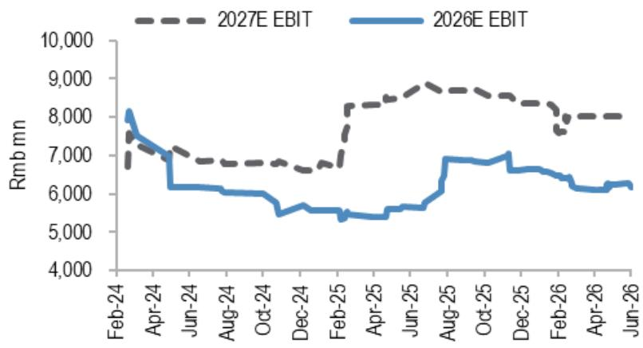

line chart

| Month    | 2026E EBIT | 2027E EBIT |
| -------- | ---------- | ---------- |
| Feb-24   | 8000       | 7500       |
| Apr-24   | 7000       | 7000       |
| Jun-24   | 6500       | 6800       |
| Aug-24   | 6300       | 6700       |
| Oct-24   | 6100       | 6600       |
| Dec-24   | 5800       | 6500       |
| Feb-25   | 5500       | 6800       |
| Apr-25   | 5700       | 8500       |
| Jun-25   | 6000       | 8800       |
| Aug-25   | 7000       | 8700       |
| Oct-25   | 7200       | 8600       |
| Dec-25   | 6800       | 8500       |
| Feb-26   | 6500       | 7800       |
| Apr-26   | 6300       | 8000       |
| Jun-26   | 6200       | 8000       |

Source: Bloomberg Finance L.P. estimates.

Luckin - Share price vs consensus forward EPS  
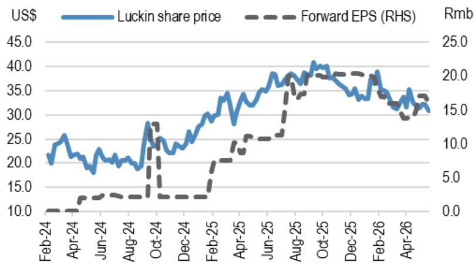

line chart

| Date    | Luckin share price | Forward EPS (RHS) |
|---------|--------------------|-------------------|
| Feb-24  | ~20                | ~1.0              |
| Apr-24  | ~25                | ~1.5              |
| Jun-24  | ~20                | ~2.0              |
| Aug-24  | ~18                | ~3.0              |
| Oct-24  | ~28                | ~15.0             |
| Dec-24  | ~25                | ~15.0             |
| Feb-25  | ~30                | ~18.0             |
| Apr-25  | ~35                | ~20.0             |
| Jun-25  | ~38                | ~22.0             |
| Aug-25  | ~40                | ~25.0             |
| Oct-25  | ~40                | ~28.0             |
| Dec-25  | ~38                | ~28.0             |
| Feb-26  | ~35                | ~25.0             |
| Apr-26  | ~30                | ~15.0             |

Source: Bloomberg Finance L.P.

Luckin 12-month rolling P/E  
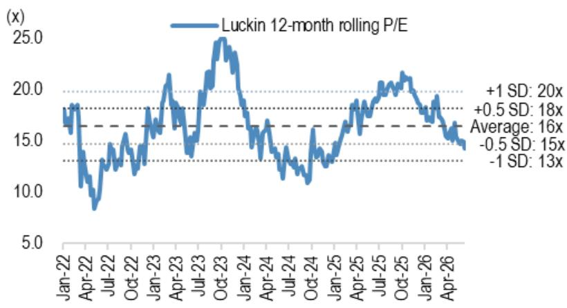

line chart

| Date    | Value |
|---------|-------|
| Jan-22  | 18.0x |
| Apr-22  | 8.0x  |
| Jul-22  | 14.0x |
| Oct-22  | 16.0x |
| Jan-23  | 18.0x |
| Apr-23  | 21.0x |
| Jul-23  | 19.0x |
| Oct-23  | 25.0x |
| Jan-24  | 17.0x |
| Apr-24  | 15.0x |
| Jul-24  | 13.0x |
| Oct-24  | 16.0x |
| Jan-25  | 18.0x |
| Apr-25  | 20.0x |
| Jul-25  | 21.0x |
| Oct-25  | 19.0x |
| Jan-26  | 17.0x |
| Apr-26  | 15.0x |

Source: JPM, Bloomberg Finance L.P.

Luckin 12-month rolling P/E band chart  
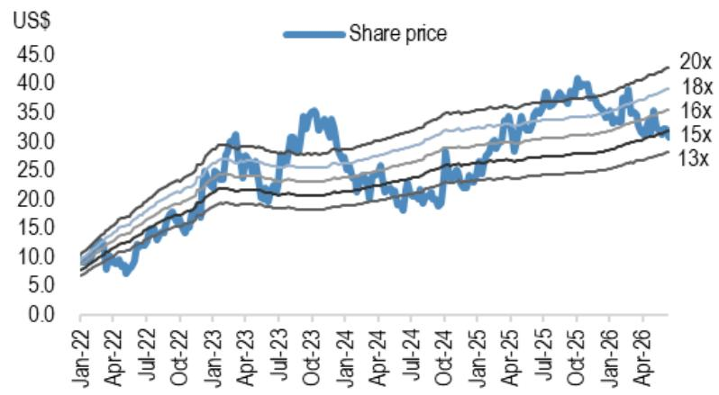

line chart

| Date   | Share price (US$) |
|--------|-------------------|
| Jan-22 | ~7.0              |
| Apr-22 | ~9.0              |
| Jul-22 | ~12.0             |
| Oct-22 | ~15.0             |
| Jan-23 | ~20.0             |
| Apr-23 | ~25.0             |
| Jul-23 | ~28.0             |
| Oct-23 | ~35.0             |
| Jan-24 | ~25.0             |
| Apr-24 | ~20.0             |
| Jul-24 | ~25.0             |
| Oct-24 | ~30.0             |
| Jan-25 | ~35.0             |
| Apr-25 | ~38.0             |
| Jul-25 | ~40.0             |
| Oct-25 | ~42.0             |
| Jan-26 | ~38.0             |
| Apr-26 | ~35.0             |

Source: JPM, Bloomberg Finance L.P.

# Chagee (OW): 1Q26 signals a gradual recovery

Chagee – Key assumptions and operating metrics

<table><tr><td>FYE Dec 31 (Rmb mn)</td><td>2023</td><td>2024</td><td>2025</td><td>2026E</td><td>2027E</td><td>2028E</td></tr><tr><td colspan="7">Teahouse #</td></tr><tr><td>Total stores</td><td>3,511</td><td>6,440</td><td>7,453</td><td>7,853</td><td>8,583</td><td>9,103</td></tr><tr><td>Franchised</td><td>3,472</td><td>6,271</td><td>6,838</td><td>6,913</td><td>7,613</td><td>8,113</td></tr><tr><td>Company-owned</td><td>39</td><td>169</td><td>615</td><td>940</td><td>970</td><td>990</td></tr><tr><td>China</td><td>3,416</td><td>6,284</td><td>7,108</td><td>7,308</td><td>7,838</td><td>8,158</td></tr><tr><td>Overseas</td><td>95</td><td>156</td><td>345</td><td>545</td><td>745</td><td>945</td></tr><tr><td colspan="7">Net change YoY</td></tr><tr><td>Total stores</td><td>2,424</td><td>2,929</td><td>1,013</td><td>400</td><td>730</td><td>520</td></tr><tr><td>Franchised</td><td>2,415</td><td>2,799</td><td>567</td><td>75</td><td>700</td><td>500</td></tr><tr><td>Company-owned</td><td>9</td><td>130</td><td>446</td><td>325</td><td>30</td><td>20</td></tr><tr><td>China</td><td>2,392</td><td>2,868</td><td>824</td><td>200</td><td>530</td><td>320</td></tr><tr><td>Overseas</td><td>32</td><td>61</td><td>189</td><td>200</td><td>200</td><td>200</td></tr><tr><td colspan="7">Key metrics</td></tr><tr><td>SSSG</td><td>94.9%</td><td>2.7%</td><td></td><td></td><td></td><td></td></tr><tr><td>China</td><td></td><td></td><td></td><td></td><td></td><td></td></tr><tr><td>Overseas</td><td>24.5%</td><td>46.9%</td><td></td><td></td><td></td><td></td></tr><tr><td>China avg monthly GMV / store (Rmb k)</td><td>483</td><td>512</td><td></td><td></td><td></td><td></td></tr><tr><td>YoY</td><td>171.9%</td><td>6.0%</td><td></td><td></td><td></td><td></td></tr><tr><td>Average daily cups sold per teahouse</td><td>800</td><td>837</td><td>521</td><td>469</td><td>469</td><td>469</td></tr><tr><td>YoY</td><td>167%</td><td>5%</td><td>-38%</td><td>-10%</td><td>0%</td><td>0%</td></tr><tr><td>Implied ASP per cup (Rmb)</td><td>20.1</td><td>20.4</td><td>21.8</td><td>21.8</td><td>21.8</td><td>21.8</td></tr><tr><td>YoY</td><td>2%</td><td>1%</td><td>7%</td><td>0%</td><td>0%</td><td>0%</td></tr></table>

<table><tr><td>FYE Dec 31 (Rmb mn)</td><td>2023</td><td>2024</td><td>2025</td><td>2026E</td><td>2027E</td><td>2028E</td></tr><tr><td>Net revenue</td><td>4,640</td><td>12,406</td><td>12,907</td><td>13,837</td><td>15,404</td><td>16,400</td></tr><tr><td>YoY</td><td>844%</td><td>167%</td><td>4%</td><td>7%</td><td>11%</td><td>6%</td></tr><tr><td>Cost of materials, storage and logistics</td><td>(2,562)</td><td>(6,257)</td><td>(6,001)</td><td>(6,157)</td><td>(6,855)</td><td>(7,462)</td></tr><tr><td>Gross profit</td><td>2,078</td><td>6,149</td><td>6,906</td><td>7,680</td><td>8,549</td><td>8,938</td></tr><tr><td>YoY change</td><td>1005%</td><td>196%</td><td>12%</td><td>11%</td><td>11%</td><td>5%</td></tr><tr><td>Gross margin</td><td>45%</td><td>50%</td><td>54%</td><td>56%</td><td>56%</td><td>55%</td></tr><tr><td>Operating income</td><td>1,074</td><td>2,887</td><td>1,347</td><td>1,689</td><td>1,892</td><td>2,075</td></tr><tr><td>YoY change</td><td></td><td>169%</td><td>-53%</td><td>25%</td><td>12%</td><td>10%</td></tr><tr><td>Operating margin</td><td>23%</td><td>23%</td><td>10%</td><td>12%</td><td>12%</td><td>13%</td></tr><tr><td>Reported net profit</td><td>801</td><td>2,516</td><td>1,171</td><td>1,542</td><td>1,703</td><td>1,856</td></tr><tr><td>YoY change</td><td></td><td>214%</td><td>-53%</td><td>32%</td><td>10%</td><td>9%</td></tr><tr><td>Net margin</td><td>17%</td><td>20%</td><td>9%</td><td>11%</td><td>11%</td><td>11%</td></tr><tr><td>Non-GAAP net profit</td><td>917</td><td>2,517</td><td>1,895</td><td>1,842</td><td>2,003</td><td>2,056</td></tr><tr><td>YoY change</td><td></td><td>174%</td><td>-25%</td><td>-3%</td><td>9%</td><td>3%</td></tr><tr><td>Non-GAAP net margin</td><td>20%</td><td>20%</td><td>15%</td><td>13%</td><td>13%</td><td>13%</td></tr></table>

<table><tr><td>25-28E CAGR</td><td>1Q25</td><td>2Q25</td><td>3Q25</td><td>4Q25</td><td>1Q26</td><td>2Q26E</td><td>3Q26E</td><td>4Q26E</td></tr><tr><td></td><td></td><td></td><td></td><td></td><td></td><td></td><td></td><td></td></tr><tr><td>7%</td><td>6,681</td><td>7,038</td><td>7,338</td><td>7,453</td><td>7,531</td><td>7,631</td><td>7,731</td><td>7,853</td></tr><tr><td>6%</td><td>6,490</td><td>6,799</td><td>6,971</td><td>6,838</td><td>6,741</td><td>6,791</td><td>6,841</td><td>6,913</td></tr><tr><td>17%</td><td>191</td><td>239</td><td>367</td><td>615</td><td>790</td><td>840</td><td>890</td><td>940</td></tr><tr><td>5%</td><td>6,512</td><td>6,830</td><td>7,076</td><td>7,108</td><td>7,157</td><td>7,207</td><td>7,257</td><td>7,308</td></tr><tr><td>40%</td><td>169</td><td>208</td><td>262</td><td>345</td><td>374</td><td>424</td><td>474</td><td>545</td></tr><tr><td></td><td>241</td><td>357</td><td>300</td><td>115</td><td>78</td><td>100</td><td>100</td><td>122</td></tr><tr><td></td><td>219</td><td>309</td><td>172</td><td>(133)</td><td>(97)</td><td>50</td><td>50</td><td>72</td></tr><tr><td></td><td>22</td><td>48</td><td>128</td><td>248</td><td>175</td><td>50</td><td>50</td><td>50</td></tr><tr><td></td><td>228</td><td>318</td><td>246</td><td>32</td><td>49</td><td>50</td><td>50</td><td>51</td></tr><tr><td></td><td>13</td><td>39</td><td>54</td><td>83</td><td>29</td><td>50</td><td>50</td><td>71</td></tr><tr><td></td><td>-18.9%</td><td>-23.0%</td><td>-27.8%</td><td>-25.5%</td><td>-16.0%</td><td></td><td></td><td></td></tr><tr><td></td><td>-19.1%</td><td>-23.1%</td><td>-27.9%</td><td>-25.5%</td><td>-16.1%</td><td></td><td></td><td></td></tr><tr><td></td><td>-8.4%</td><td>-18.1%</td><td>-23.4%</td><td>-25.5%</td><td>-12.0%</td><td></td><td></td><td></td></tr><tr><td></td><td>432</td><td>404</td><td>379</td><td>337</td><td>356</td><td></td><td></td><td></td></tr><tr><td></td><td>-21.3%</td><td>-24.8%</td><td>-28.3%</td><td>-26.0%</td><td>-17.6%</td><td></td><td></td><td></td></tr></table>

<table><tr><td>25-28E CAGR</td><td>1Q25</td><td>2Q25</td><td>3Q25</td><td>4Q25</td><td>1Q26</td><td>2Q26E</td><td>3Q26E</td><td>4Q26E</td></tr><tr><td rowspan="3">8%</td><td>3,393</td><td>3,332</td><td>3,208</td><td>2,974</td><td>3,546</td><td>3,568</td><td>3,564</td><td>3,160</td></tr><tr><td>35%</td><td>10%</td><td>-9%</td><td>-11%</td><td>5%</td><td>7%</td><td>11%</td><td>6%</td></tr><tr><td>(1,590)</td><td>(1,537)</td><td>(1,482)</td><td>(1,393)</td><td>(1,574)</td><td>(1,584)</td><td>(1,582)</td><td>(1,417)</td></tr><tr><td rowspan="3">9%</td><td>1,802</td><td>1,795</td><td>1,727</td><td>1,582</td><td>1,972</td><td>1,983</td><td>1,981</td><td>1,743</td></tr><tr><td>51%</td><td>23%</td><td>-3%</td><td>-8%</td><td>9%</td><td>10%</td><td>15%</td><td>10%</td></tr><tr><td>53%</td><td>54%</td><td>54%</td><td>53%</td><td>56%</td><td>56%</td><td>56%</td><td>55%</td></tr><tr><td rowspan="3">15%</td><td>821</td><td>108</td><td>454</td><td>(36)</td><td>547</td><td>485</td><td>360</td><td>297</td></tr><tr><td>16%</td><td>-86%</td><td>-43%</td><td>-106%</td><td>-33%</td><td>351%</td><td>-21%</td><td></td></tr><tr><td>24%</td><td>3%</td><td>14%</td><td>-1%</td><td>15%</td><td>14%</td><td>10%</td><td>9%</td></tr><tr><td rowspan="3">17%</td><td>679</td><td>70</td><td>394</td><td>29</td><td>450</td><td>387</td><td>291</td><td>414</td></tr><tr><td>14%</td><td>-89%</td><td>-38%</td><td>-96%</td><td>-34%</td><td>456%</td><td>-26%</td><td></td></tr><tr><td>20%</td><td>2%</td><td>12%</td><td>1%</td><td>13%</td><td>11%</td><td>8%</td><td>13%</td></tr><tr><td rowspan="3">3%</td><td>679</td><td>622</td><td>499</td><td>95</td><td>509</td><td>467</td><td>371</td><td>495</td></tr><tr><td>14%</td><td>0%</td><td>-22%</td><td>-85%</td><td>-25%</td><td>-25%</td><td>-26%</td><td>423%</td></tr><tr><td>20%</td><td>19%</td><td>16%</td><td>3%</td><td>14%</td><td>13%</td><td>10%</td><td>16%</td></tr></table>

Source: Company data, JPM estimates.

## Chagee (OW): 1Q26 signals a gradual recovery

Chagee - Consensus EBIT revisions  
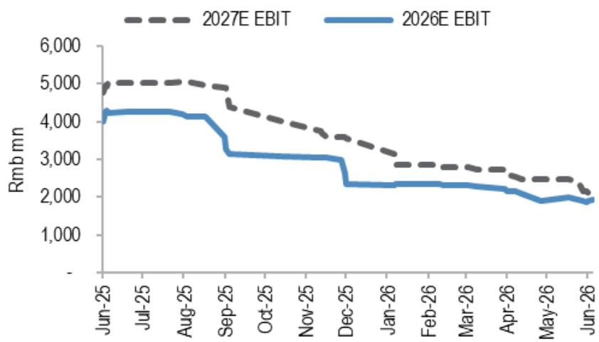

line chart

| Month   | 2026E EBIT | 2027E EBIT |
|---------|------------|------------|
| Jun-25  | 4200       | 5000       |
| Jul-25  | 4100       | 5000       |
| Aug-25  | 4100       | 5000       |
| Sep-25  | 3100       | 4800       |
| Oct-25  | 3000       | 4500       |
| Nov-25  | 3000       | 4200       |
| Dec-25  | 2300       | 3800       |
| Jan-26  | 2300       | 3500       |
| Feb-26  | 2300       | 3300       |
| Mar-26  | 2300       | 3100       |
| Apr-26  | 2100       | 2900       |
| May-26  | 1900       | 2700       |
| Jun-26  | 1900       | 2500       |

Source: Bloomberg Finance L.P. estimates.

Chagee - Share price vs consensus forward EPS  
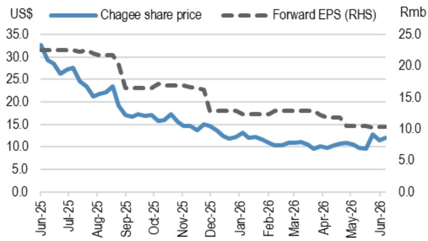

line chart

| Date   | Chagee share price | Forward EPS (RHS) |
|--------|--------------------|-------------------|
| Jun-25 | 32.0               | 24.0              |
| Jul-25 | 28.0               | 23.0              |
| Aug-25 | 22.0               | 21.0              |
| Sep-25 | 17.0               | 18.0              |
| Oct-25 | 16.0               | 17.0              |
| Nov-25 | 15.0               | 16.0              |
| Dec-25 | 14.0               | 15.0              |
| Jan-26 | 13.0               | 14.0              |
| Feb-26 | 12.0               | 13.0              |
| Mar-26 | 11.0               | 12.0              |
| Apr-26 | 10.0               | 11.0              |
| May-26 | 9.0                | 10.0              |
| Jun-26 | 11.0               | 9.0               |

Source: Bloomberg Finance L.P.

Chagee 12-month rolling P/E  
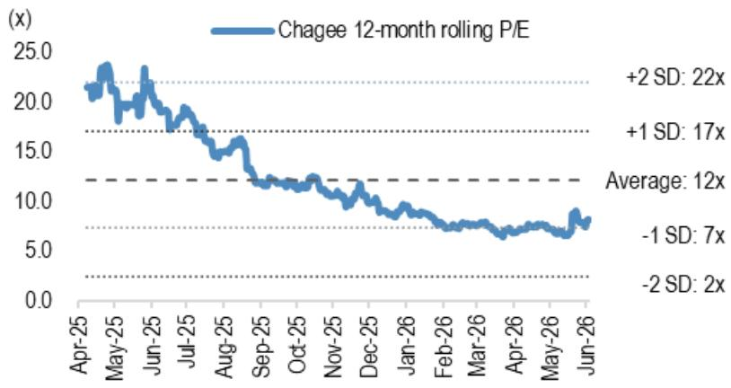

line chart

| Date    | Chagee 12-month rolling P/E |
|---------|-----------------------------|
| Apr-25  | ~22.0x                      |
| May-25  | ~24.0x                      |
| Jun-25  | ~23.0x                      |
| Jul-25  | ~19.0x                      |
| Aug-25  | ~16.0x                      |
| Sep-25  | ~13.0x                      |
| Oct-25  | ~12.0x                      |
| Nov-25  | ~11.0x                      |
| Dec-25  | ~10.0x                      |
| Jan-26  | ~9.0x                       |
| Feb-26  | ~8.0x                       |
| Mar-26  | ~7.0x                       |
| Apr-26  | ~7.0x                       |
| May-26  | ~8.0x                       |
| Jun-26  | ~9.0x                       |

Source: JPM, Bloomberg Finance L.P.

Chagee 12-month rolling P/E band chart  
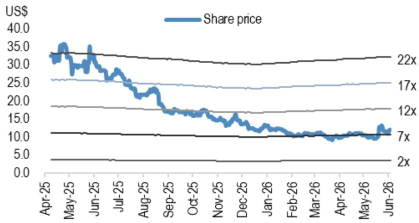

line chart

| Date   | Share price |
|--------|-------------|
| Apr-25 | 35.0        |
| May-25 | 30.0        |
| Jun-25 | 25.0        |
| Jul-25 | 20.0        |
| Aug-25 | 15.0        |
| Sep-25 | 10.0        |
| Oct-25 | 10.0        |
| Nov-25 | 10.0        |
| Dec-25 | 10.0        |
| Jan-26 | 10.0        |
| Feb-26 | 10.0        |
| Mar-26 | 10.0        |
| Apr-26 | 10.0        |
| May-26 | 10.0        |
| Jun-26 | 10.0        |

Source: JPM, Bloomberg Finance L.P.

# Guming (OW): Alpha generator

Guming – Key assumptions and operating metrics

<table><tr><td>FYE 31-Dec (Rmb mn)</td><td>2022</td><td>2023</td><td>2024</td><td>2025</td><td>2026E</td><td>2027E</td><td>2028E</td><td>25-28E CAGR</td><td>1H24</td><td>2H24</td><td>1H25</td><td>2H25</td></tr><tr><td>Total GMV</td><td>14,004</td><td>19,214</td><td>22,397</td><td>32,732</td><td>42,286</td><td>50,021</td><td>57,748</td><td>21%</td><td>10,484</td><td>11,913</td><td>14,094</td><td>18,638</td></tr><tr><td>YoY %</td><td>32%</td><td>37%</td><td>17%</td><td>46%</td><td>29%</td><td>18%</td><td>15%</td><td></td><td></td><td></td><td>34%</td><td>56%</td></tr><tr><td>Per-store daily GMV (Rmb k)</td><td>6.2</td><td>6.8</td><td>6.5</td><td>7.8</td><td>7.5</td><td>7.3</td><td>7.1</td><td>-3%</td><td>6.2</td><td>6.7</td><td>7.6</td><td>8.4</td></tr><tr><td>YoY %</td><td>3%</td><td>10%</td><td>-4%</td><td>20%</td><td>-3%</td><td>-3%</td><td>-2%</td><td></td><td></td><td></td><td>23%</td><td>25%</td></tr><tr><td>Per-store daily cups sold</td><td>385</td><td>417</td><td>384</td><td>456</td><td>447</td><td>438</td><td>429</td><td>-2%</td><td>374</td><td>387</td><td>439</td><td>495</td></tr><tr><td>YoY %</td><td>0%</td><td>8%</td><td>-8%</td><td>19%</td><td>-2%</td><td>-2%</td><td>-2%</td><td></td><td></td><td></td><td>17%</td><td>28%</td></tr><tr><td>ASP (Rmb/cup)</td><td>16.1</td><td>16.3</td><td>16.9</td><td>17.1</td><td>16.8</td><td>16.6</td><td>16.5</td><td>-1%</td><td>16.6</td><td>17.3</td><td>17.3</td><td>16.9</td></tr><tr><td>YoY %</td><td>3%</td><td>1%</td><td>4%</td><td>1%</td><td>-2%</td><td>-1%</td><td>-1%</td><td></td><td></td><td></td><td>4%</td><td>-2%</td></tr><tr><td>Total store count</td><td>6,669</td><td>9,001</td><td>9,914</td><td>13,554</td><td>17,054</td><td>20,454</td><td>23,954</td><td>21%</td><td>9,516</td><td>9,914</td><td>11,179</td><td>13,554</td></tr><tr><td>YoY %</td><td>17%</td><td>35%</td><td>10%</td><td>37%</td><td>26%</td><td>20%</td><td>17%</td><td></td><td></td><td></td><td>17%</td><td>37%</td></tr><tr><td>Net store increase</td><td>975</td><td>2,332</td><td>913</td><td>3,640</td><td>3,500</td><td>3,400</td><td>3,500</td><td></td><td>515</td><td>398</td><td>1,265</td><td>2,375</td></tr><tr><td>Total revenue</td><td>5,559</td><td>7,676</td><td>8,791</td><td>12,914</td><td>16,312</td><td>19,103</td><td>21,845</td><td>19%</td><td>4,009</td><td>4,782</td><td>5,663</td><td>7,251</td></tr><tr><td>YoY %</td><td>27%</td><td>38%</td><td>15%</td><td>47%</td><td>26%</td><td>17%</td><td>14%</td><td></td><td></td><td></td><td>41%</td><td>52%</td></tr><tr><td>Gross margin</td><td>28.1%</td><td>31.3%</td><td>30.6%</td><td>33.0%</td><td>33.0%</td><td>33.0%</td><td>33.0%</td><td></td><td>31.6%</td><td>29.7%</td><td>31.5%</td><td>34.2%</td></tr><tr><td>Core operating profit</td><td>989</td><td>1,585</td><td>1,664</td><td>2,971</td><td>3,753</td><td>4,395</td><td>5,026</td><td>19%</td><td>792</td><td>872</td><td>1,175</td><td>1,796</td></tr><tr><td>YoY %</td><td>5%</td><td>60%</td><td>5%</td><td>79%</td><td>26%</td><td>17%</td><td>14%</td><td></td><td></td><td></td><td>48%</td><td>106%</td></tr><tr><td>Core operating margin</td><td>17.8%</td><td>20.7%</td><td>18.9%</td><td>23.0%</td><td>23.0%</td><td>23.0%</td><td>23.0%</td><td></td><td>19.7%</td><td>18.2%</td><td>20.8%</td><td>24.8%</td></tr><tr><td>Reported net profit</td><td>367</td><td>1,080</td><td>1,479</td><td>3,109</td><td>3,304</td><td>3,881</td><td>4,430</td><td>13%</td><td>734</td><td>745</td><td>1,625</td><td>1,484</td></tr><tr><td>YoY %</td><td>1720%</td><td>194%</td><td>37%</td><td>110%</td><td>6%</td><td>17%</td><td>14%</td><td></td><td></td><td></td><td>122%</td><td>99%</td></tr><tr><td>Reported net margin</td><td>6.6%</td><td>14.1%</td><td>16.8%</td><td>24.1%</td><td>20.3%</td><td>20.3%</td><td>20.3%</td><td></td><td>18.3%</td><td>15.6%</td><td>28.7%</td><td>20.5%</td></tr><tr><td>Adj. net profit</td><td>783</td><td>1,442</td><td>1,552</td><td>2,706</td><td>3,404</td><td>3,981</td><td>4,543</td><td>19%</td><td>756</td><td>795</td><td>1,135</td><td>1,572</td></tr><tr><td>YoY %</td><td>2%</td><td>84%</td><td>8%</td><td>74%</td><td>26%</td><td>17%</td><td>14%</td><td></td><td></td><td></td><td>50%</td><td>98%</td></tr><tr><td>Adj. net margin</td><td>14.1%</td><td>18.8%</td><td>17.6%</td><td>21.0%</td><td>20.9%</td><td>20.8%</td><td>20.8%</td><td></td><td>18.9%</td><td>16.6%</td><td>20.0%</td><td>21.7%</td></tr><tr><td>Adj. EPS - diluted (Rmb)</td><td></td><td>0.70</td><td>0.75</td><td>1.15</td><td>1.45</td><td>1.69</td><td>1.93</td><td>19%</td><td>0.40</td><td>0.38</td><td>0.49</td><td>0.67</td></tr><tr><td>YoY %</td><td></td><td></td><td>7%</td><td>54%</td><td>26%</td><td>17%</td><td>14%</td><td></td><td></td><td></td><td>22%</td><td>75%</td></tr></table>

Source: Company data, JPM estimates.

## Guming (OW): Alpha generator

Guming - Consensus EBIT revisions  
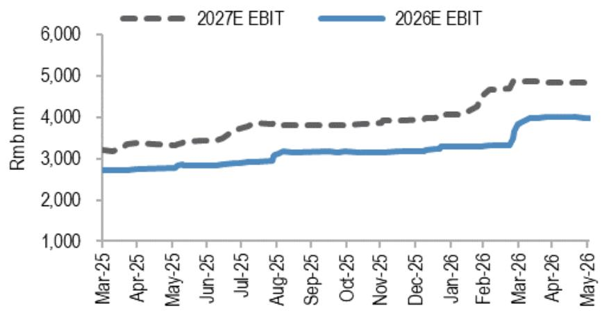

line chart

| Month   | 2027E EBIT | 2026E EBIT |
|---------|------------|------------|
| Mar-25  | 3200       | 2700       |
| Apr-25  | 3300       | 2750       |
| May-25  | 3350       | 2800       |
| Jun-25  | 3400       | 2850       |
| Jul-25  | 3500       | 2900       |
| Aug-25  | 3600       | 3000       |
| Sep-25  | 3700       | 3100       |
| Oct-25  | 3750       | 3150       |
| Nov-25  | 3800       | 3200       |
| Dec-25  | 3850       | 3250       |
| Jan-26  | 3900       | 3300       |
| Feb-26  | 4500       | 3350       |
| Mar-26  | 4800       | 3400       |
| Apr-26  | 4850       | 4000       |
| May-26  | 4850       | 4000       |

Source: Bloomberg Finance L.P. estimates.

Guming - Share price vs consensus forward EPS  
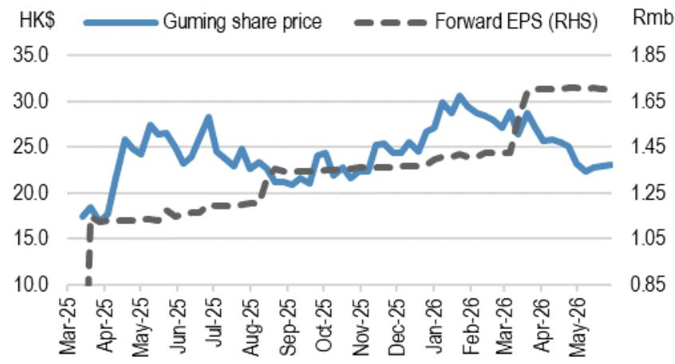

line chart

| Month   | Guming share price (HK$) | Forward EPS (Rmb) |
|---------|---------------------------|-------------------|
| Mar-25  | 17.0                      | 1.05              |
| Apr-25  | 18.0                      | 1.10              |
| May-25  | 27.0                      | 1.15              |
| Jun-25  | 24.0                      | 1.20              |
| Jul-25  | 28.0                      | 1.25              |
| Aug-25  | 23.0                      | 1.30              |
| Sep-25  | 21.0                      | 1.35              |
| Oct-25  | 24.0                      | 1.40              |
| Nov-25  | 22.0                      | 1.45              |
| Dec-25  | 25.0                      | 1.50              |
| Jan-26  | 30.0                      | 1.55              |
| Feb-26  | 29.0                      | 1.60              |
| Mar-26  | 28.0                      | 1.65              |
| Apr-26  | 26.0                      | 1.70              |
| May-26  | 23.0                      | 1.75              |

Source: Bloomberg Finance L.P.

Guming 12-month rolling P/E  
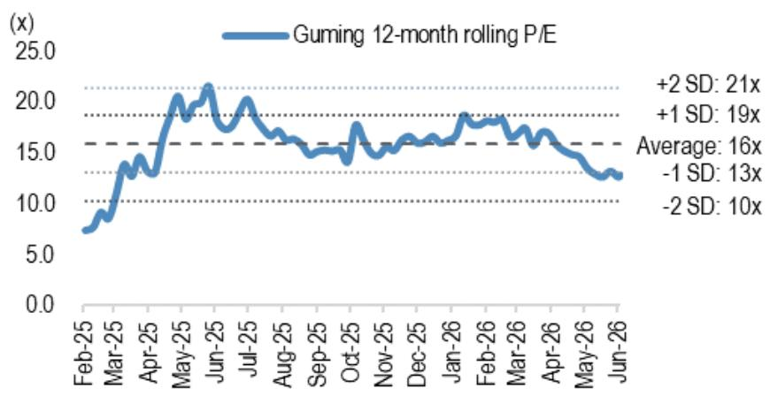

line chart

| Date    | Value |
|---------|-------|
| Feb-25  | ~7.5x |
| Mar-25  | ~14.0x|
| Apr-25  | ~18.0x|
| May-25  | ~21.0x|
| Jun-25  | ~20.0x|
| Jul-25  | ~18.0x|
| Aug-25  | ~16.0x|
| Sep-25  | ~15.0x|
| Oct-25  | ~14.0x|
| Nov-25  | ~16.0x|
| Dec-25  | ~17.0x|
| Jan-26  | ~19.0x|
| Feb-26  | ~18.0x|
| Mar-26  | ~17.0x|
| Apr-26  | ~16.0x|
| May-26  | ~14.0x|
| Jun-26  | ~13.0x|

Source: JPM, Bloomberg Finance L.P.

Guming 12-month rolling P/E band chart  
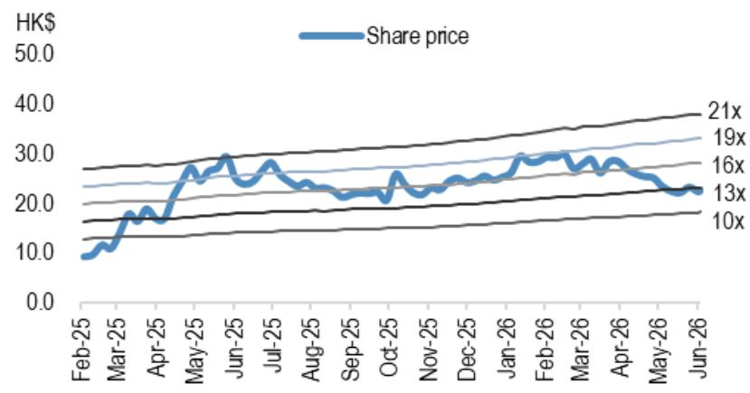

line chart

| Date   | Share price |
|--------|-------------|
| Feb-25 | 10.0        |
| Mar-25 | 18.0        |
| Apr-25 | 25.0        |
| May-25 | 28.0        |
| Jun-25 | 30.0        |
| Jul-25 | 27.0        |
| Aug-25 | 24.0        |
| Sep-25 | 22.0        |
| Oct-25 | 25.0        |
| Nov-25 | 23.0        |
| Dec-25 | 24.0        |
| Jan-26 | 26.0        |
| Feb-26 | 28.0        |
| Mar-26 | 27.0        |
| Apr-26 | 25.0        |
| May-26 | 23.0        |
| Jun-26 | 22.0        |

Source: JPM, Bloomberg Finance L.P.

## Mixue (UW): Recalibrating for lower growth

Mixue – Key assumptions and operating metrics

<table><tr><td>FYE 31-Dec (Rmb mn)</td><td>2023</td><td>2024</td><td>2025</td><td>2026E</td><td>2027E</td><td>2028E</td><td>25-28E CAGR</td><td>1H24</td><td>2H24</td><td>1H25</td><td>2H25</td></tr><tr><td>Total store count (k)</td><td>37,565</td><td>46,479</td><td>59,823</td><td>63,323</td><td>68,823</td><td>73,123</td><td>7%</td><td>43,218</td><td>46,479</td><td>53,014</td><td>59,823</td></tr><tr><td>Mainland China</td><td>33,234</td><td>41,584</td><td>55,356</td><td>58,656</td><td>63,356</td><td>66,856</td><td>6%</td><td>38,613</td><td>41,584</td><td>48,281</td><td>55,356</td></tr><tr><td>Mixue</td><td>30,334</td><td>37,684</td><td>42,982</td><td>45,982</td><td>49,982</td><td>52,982</td><td>7%</td><td>35,413</td><td>37,684</td><td>41,181</td><td>42,982</td></tr><tr><td>Lucky Cup</td><td>2,900</td><td>3,900</td><td>11,000</td><td>10,800</td><td>11,000</td><td>11,200</td><td>1%</td><td>3,200</td><td>3,900</td><td>7,100</td><td>11,000</td></tr><tr><td>FULU</td><td></td><td></td><td>1,374</td><td>1,874</td><td>2,374</td><td>2,674</td><td>25%</td><td></td><td></td><td></td><td>1,374</td></tr><tr><td>Overseas</td><td>4,331</td><td>4,895</td><td>4,467</td><td>4,667</td><td>5,467</td><td>6,267</td><td>12%</td><td>4,605</td><td>4,895</td><td>4,733</td><td>4,467</td></tr><tr><td>YoY change</td><td>30%</td><td>24%</td><td>29%</td><td>6%</td><td>9%</td><td>6%</td><td></td><td></td><td>8%</td><td>14%</td><td>13%</td></tr><tr><td>Mainland China</td><td>22%</td><td>25%</td><td>33%</td><td>6%</td><td>8%</td><td>6%</td><td></td><td></td><td>8%</td><td>16%</td><td>15%</td></tr><tr><td>Mixue</td><td></td><td>24%</td><td>14%</td><td>7%</td><td>9%</td><td>6%</td><td></td><td></td><td>6%</td><td>9%</td><td>4%</td></tr><tr><td>Lucky Cup</td><td></td><td>34%</td><td>182%</td><td>-2%</td><td>2%</td><td>2%</td><td></td><td></td><td>22%</td><td>82%</td><td>55%</td></tr><tr><td>Overseas</td><td>141%</td><td>13%</td><td>-9%</td><td>4%</td><td>17%</td><td>15%</td><td></td><td></td><td>6%</td><td>-3%</td><td>-6%</td></tr><tr><td>Net opening (k)</td><td>8,582</td><td>8,914</td><td>13,344</td><td>3,500</td><td>5,500</td><td>4,300</td><td></td><td>43,218</td><td>3,261</td><td>6,535</td><td>6,809</td></tr><tr><td>Mainland China</td><td>6,046</td><td>8,350</td><td>13,772</td><td>3,300</td><td>4,700</td><td>3,500</td><td></td><td>38,613</td><td>2,971</td><td>6,697</td><td>7,075</td></tr><tr><td>Mixue</td><td></td><td>7,350</td><td>5,298</td><td>3,000</td><td>4,000</td><td>3,000</td><td></td><td>35,413</td><td>2,271</td><td>3,497</td><td>1,801</td></tr><tr><td>Lucky Cup</td><td></td><td>1,000</td><td>7,100</td><td>-200</td><td>200</td><td>200</td><td></td><td>3,200</td><td>700</td><td>3,200</td><td>3,900</td></tr><tr><td>FULU</td><td></td><td></td><td>1,374</td><td>500</td><td>500</td><td>300</td><td></td><td></td><td></td><td></td><td>1,374</td></tr><tr><td>Overseas</td><td>2,536</td><td>564</td><td>-428</td><td>200</td><td>800</td><td>800</td><td></td><td>4,605</td><td>290</td><td>-162</td><td>-266</td></tr><tr><td>ASP (Rmb)</td><td>6.5</td><td>6.4</td><td>6.4</td><td>6.6</td><td>6.5</td><td>6.4</td><td>0%</td><td></td><td></td><td></td><td></td></tr><tr><td>YoY change</td><td>-1%</td><td>0%</td><td>-1%</td><td>3%</td><td>-1%</td><td>-1%</td><td></td><td></td><td></td><td></td><td></td></tr><tr><td>No. of cups sold per day per store</td><td>609</td><td>590</td><td>627</td><td>574</td><td>572</td><td>571</td><td>-3%</td><td></td><td></td><td></td><td></td></tr><tr><td>YoY change</td><td>16%</td><td>-3%</td><td>6%</td><td>-8%</td><td>0%</td><td>0%</td><td></td><td></td><td></td><td></td><td></td></tr><tr><td colspan="12">Key financial metrics (Rmb mn)</td></tr><tr><td>Total revenue</td><td>20,302</td><td>24,829</td><td>33,560</td><td>36,878</td><td>39,134</td><td>41,520</td><td>7%</td><td>10,677</td><td>14,152</td><td>14,875</td><td>18,685</td></tr><tr><td>YoY change</td><td>50%</td><td>22%</td><td>35%</td><td>10%</td><td>6%</td><td>6%</td><td></td><td></td><td></td><td>39%</td><td>32%</td></tr><tr><td>Gross profit</td><td>5,999</td><td>8,060</td><td>10,452</td><td>11,063</td><td>11,740</td><td>12,456</td><td>6%</td><td>3,403</td><td>4,658</td><td>4,706</td><td>5,745</td></tr><tr><td>YoY change</td><td>56%</td><td>34%</td><td>30%</td><td>6%</td><td>6%</td><td>6%</td><td></td><td></td><td></td><td>38%</td><td>23%</td></tr><tr><td>Gross margin</td><td>29.5%</td><td>32.5%</td><td>31.1%</td><td>30.0%</td><td>30.0%</td><td>30.0%</td><td></td><td>31.9%</td><td>32.9%</td><td>31.6%</td><td>30.7%</td></tr><tr><td>Operating profit</td><td>3,985</td><td>5,601</td><td>7,232</td><td>7,551</td><td>8,052</td><td>8,543</td><td>6%</td><td>2,431</td><td>3,169</td><td>3,314</td><td>3,918</td></tr><tr><td>YoY change</td><td>57%</td><td>41%</td><td>29%</td><td>4%</td><td>7%</td><td>6%</td><td></td><td></td><td></td><td>36%</td><td>24%</td></tr><tr><td>Operating margin</td><td>19.6%</td><td>22.6%</td><td>21.5%</td><td>20.5%</td><td>20.6%</td><td>20.6%</td><td></td><td>22.8%</td><td>22.4%</td><td>22.3%</td><td>21.0%</td></tr><tr><td>Reported net profit</td><td>3,137</td><td>4,437</td><td>5,887</td><td>6,131</td><td>6,542</td><td>6,953</td><td>6%</td><td>1,884</td><td>2,552</td><td>2,693</td><td>3,194</td></tr><tr><td>YoY change</td><td>57%</td><td>41%</td><td>33%</td><td>4%</td><td>7%</td><td>6%</td><td></td><td></td><td></td><td>43%</td><td>25%</td></tr><tr><td>Net margin</td><td>15.5%</td><td>17.9%</td><td>17.5%</td><td>16.6%</td><td>16.7%</td><td>16.7%</td><td></td><td>17.6%</td><td>18.0%</td><td>18.1%</td><td>17.1%</td></tr><tr><td>Adjusted net profit</td><td>3,207</td><td>4,519</td><td>6,037</td><td>6,151</td><td>6,561</td><td>6,972</td><td>5%</td><td>1,906</td><td>2,612</td><td>2,708</td><td>3,328</td></tr><tr><td>YoY change</td><td>58%</td><td>41%</td><td>34%</td><td>2%</td><td>7%</td><td>6%</td><td></td><td></td><td></td><td>42%</td><td>27%</td></tr><tr><td>Adj. net margin</td><td>15.8%</td><td>18.2%</td><td>18.0%</td><td>16.7%</td><td>16.8%</td><td>16.8%</td><td></td><td>17.9%</td><td>18.5%</td><td>18.2%</td><td>17.8%</td></tr></table>

Source: Company data, JPM estimates.

## Mixue (UW): Recalibrating for lower growth

Mixue - Consensus EBIT revisions  
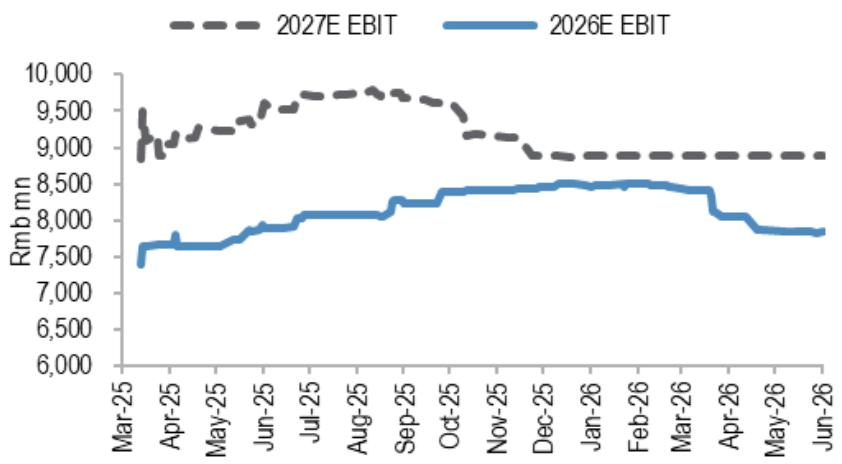

line chart

| Month   | 2026E EBIT | 2027E EBIT |
|---------|------------|------------|
| Mar-25  | 7400       | 9500       |
| Apr-25  | 7600       | 9000       |
| May-25  | 7650       | 9100       |
| Jun-25  | 7800       | 9300       |
| Jul-25  | 8000       | 9500       |
| Aug-25  | 8100       | 9600       |
| Sep-25  | 8300       | 9700       |
| Oct-25  | 8400       | 9600       |
| Nov-25  | 8450       | 9400       |
| Dec-25  | 8500       | 9100       |
| Jan-26  | 8550       | 8900       |
| Feb-26  | 8550       | 8900       |
| Mar-26  | 8500       | 8900       |
| Apr-26  | 8100       | 8900       |
| May-26  | 7900       | 8900       |
| Jun-26  | 7850       | 8900       |

Source: Bloomberg Finance L.P. estimates.

Mixue - Share price vs consensus forward EPS  
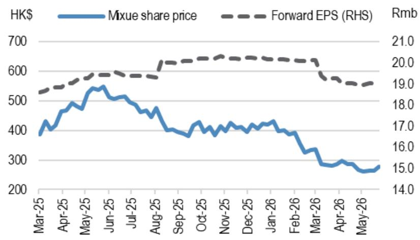

line chart

| Month   | Mixue share price | Forward EPS (RHS) |
|---------|-------------------|-------------------|
| Mar-25  | 400               | 18.5              |
| Apr-25  | 450               | 19.0              |
| May-25  | 500               | 19.5              |
| Jun-25  | 550               | 20.0              |
| Jul-25  | 500               | 19.5              |
| Aug-25  | 450               | 19.0              |
| Sep-25  | 400               | 18.5              |
| Oct-25  | 380               | 18.0              |
| Nov-25  | 400               | 17.5              |
| Dec-25  | 420               | 17.0              |
| Jan-26  | 410               | 16.5              |
| Feb-26  | 380               | 16.0              |
| Mar-26  | 350               | 15.5              |
| Apr-26  | 300               | 15.0              |
| May-26  | 280               | 14.5              |

Source: Bloomberg Finance L.P.

Mixue 12-month rolling P/E  
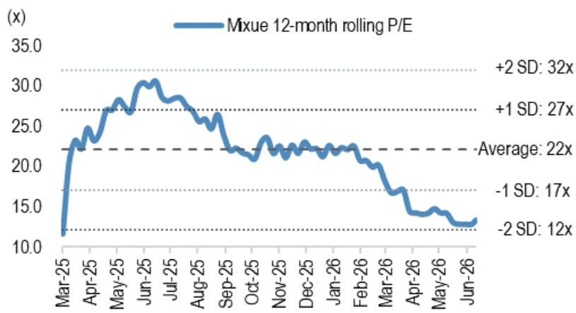

line chart

| Date    | P/E     |
|---------|---------|
| Mar-25  | 12.0x   |
| Apr-25  | 24.0x   |
| May-25  | 28.0x   |
| Jun-25  | 30.0x   |
| Jul-25  | 29.0x   |
| Aug-25  | 26.0x   |
| Sep-25  | 23.0x   |
| Oct-25  | 21.0x   |
| Nov-25  | 23.0x   |
| Dec-25  | 22.0x   |
| Jan-26  | 23.0x   |
| Feb-26  | 21.0x   |
| Mar-26  | 17.0x   |
| Apr-26  | 14.0x   |
| May-26  | 13.0x   |
| Jun-26  | 12.0x   |

Source: JPM, Bloomberg Finance L.P.

Mixue 12-month rolling P/E band chart  
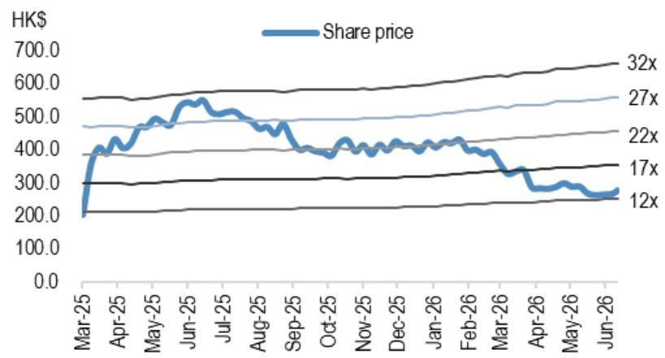

line chart

| Date   | Share price |
|--------|-------------|
| Mar-25 | 200.0       |
| Apr-25 | 400.0       |
| May-25 | 450.0       |
| Jun-25 | 500.0       |
| Jul-25 | 550.0       |
| Aug-25 | 500.0       |
| Sep-25 | 450.0       |
| Oct-25 | 400.0       |
| Nov-25 | 380.0       |
| Dec-25 | 390.0       |
| Jan-26 | 400.0       |
| Feb-26 | 350.0       |
| Mar-26 | 300.0       |
| Apr-26 | 280.0       |
| May-26 | 270.0       |
| Jun-26 | 260.0       |

Source: JPM, Bloomberg Finance L.P.

## Pop Mart (N): Moat intact, timing nuanced

Pop Mart – 2-year base case, bull case and bear case scenario analysis

<table><tr><td rowspan="2">FYE Dec 31 (Rmb mn)</td><td colspan="7">Base case (JPMe)</td><td colspan="3">Bull case</td><td colspan="3">Bear case</td></tr><tr><td>2025</td><td>1Q26</td><td>2Q26E</td><td>3Q26E</td><td>4Q26E</td><td>2026E</td><td>2027E</td><td>2025</td><td>2026E</td><td>2027E</td><td>2025</td><td>2026E</td><td>2027E</td></tr><tr><td>Total revenue</td><td>37,120</td><td>9,707</td><td>9,625</td><td>10,144</td><td>11,121</td><td>40,598</td><td>45,657</td><td>37,120</td><td>42,572</td><td>50,288</td><td>37,120</td><td>36,821</td><td>40,109</td></tr><tr><td>YoY</td><td>185%</td><td>76%</td><td>15%</td><td>-17%</td><td>1%</td><td>9%</td><td>12%</td><td>185%</td><td>15%</td><td>18%</td><td>185%</td><td>-1%</td><td>9%</td></tr><tr><td>* China PRC</td><td>20,852</td><td>6,610</td><td>6,440</td><td>6,633</td><td>6,954</td><td>26,636</td><td>28,836</td><td>20,852</td><td>27,107</td><td>31,173</td><td>20,852</td><td>25,022</td><td>27,524</td></tr><tr><td>YoY</td><td>135%</td><td>103%</td><td>28%</td><td>-1%</td><td>18%</td><td>28%</td><td>8%</td><td>135%</td><td>30%</td><td>15%</td><td>135%</td><td>20%</td><td>10%</td></tr><tr><td>* Overseas</td><td>16,268</td><td>3,098</td><td>3,186</td><td>3,511</td><td>4,167</td><td>13,961</td><td>16,821</td><td>16,268</td><td>15,465</td><td>19,114</td><td>16,268</td><td>11,799</td><td>12,584</td></tr><tr><td>YoY</td><td>292%</td><td>38%</td><td>-5%</td><td>-36%</td><td>-19%</td><td>-14%</td><td>20%</td><td>292%</td><td>-5%</td><td>24%</td><td>292%</td><td>-27%</td><td>7%</td></tr><tr><td>- Asia Pacific</td><td>8,011</td><td>1,578</td><td>1,595</td><td>1,787</td><td>2,101</td><td>7,060</td><td>7,866</td><td>8,011</td><td>8,011</td><td>9,213</td><td>8,011</td><td>6,409</td><td>6,729</td></tr><tr><td>YoY</td><td>158%</td><td>25%</td><td>0%</td><td>-31%</td><td>-19%</td><td>-12%</td><td>11%</td><td>158%</td><td>0%</td><td>15%</td><td>158%</td><td>-20%</td><td>5%</td></tr><tr><td>- Americas</td><td>6,806</td><td>1,240</td><td>1,267</td><td>1,368</td><td>1,577</td><td>5,453</td><td>6,733</td><td>6,806</td><td>5,785</td><td>7,232</td><td>6,806</td><td>4,084</td><td>4,288</td></tr><tr><td>YoY</td><td>748%</td><td>55%</td><td>-13%</td><td>-41%</td><td>-29%</td><td>-20%</td><td>23%</td><td>748%</td><td>-15%</td><td>25%</td><td>748%</td><td>-40%</td><td>5%</td></tr><tr><td>- Europe and others</td><td>1,451</td><td>280</td><td>323</td><td>356</td><td>489</td><td>1,448</td><td>2,221</td><td>1,451</td><td>1,669</td><td>2,670</td><td>1,451</td><td>1,306</td><td>1,567</td></tr><tr><td>YoY</td><td>506%</td><td>60%</td><td>7%</td><td>-41%</td><td>31%</td><td>0%</td><td>53%</td><td>506%</td><td>15%</td><td>60%</td><td>506%</td><td>-10%</td><td>20%</td></tr><tr><td>Gross profit</td><td>26,765</td><td></td><td></td><td></td><td></td><td>27,873</td><td>31,609</td><td>26,765</td><td>29,375</td><td>35,201</td><td>26,765</td><td>24,670</td><td>26,873</td></tr><tr><td>Gross margin</td><td>72.1%</td><td></td><td></td><td></td><td></td><td>68.7%</td><td>69.2%</td><td>72.1%</td><td>69.0%</td><td>70.0%</td><td>72.1%</td><td>67.0%</td><td>67.0%</td></tr><tr><td>Gross margin yoy</td><td>5.3%</td><td></td><td></td><td></td><td></td><td>-3.4%</td><td>0.6%</td><td>5.3%</td><td>-3.1%</td><td>1.0%</td><td>5.3%</td><td>-5.1%</td><td>0.0%</td></tr><tr><td>D&amp;S cost</td><td>(8,082)</td><td></td><td></td><td></td><td></td><td>(9,865)</td><td>(11,095)</td><td>(8,082)</td><td>(9,366)</td><td>(10,560)</td><td>(8,082)</td><td>(9,205)</td><td>(9,626)</td></tr><tr><td>% of revenue</td><td>21.8%</td><td></td><td></td><td></td><td></td><td>24.3%</td><td>24.3%</td><td>21.8%</td><td>22.0%</td><td>21.0%</td><td>21.8%</td><td>25.0%</td><td>24.0%</td></tr><tr><td>G&amp;A cost</td><td>(1,770)</td><td></td><td></td><td></td><td></td><td>(2,192)</td><td>(2,465)</td><td>(1,770)</td><td>(2,043)</td><td>(2,414)</td><td>(1,770)</td><td>(2,025)</td><td>(2,086)</td></tr><tr><td>% of revenue</td><td>4.8%</td><td></td><td></td><td></td><td></td><td>5.4%</td><td>5.4%</td><td>4.8%</td><td>4.8%</td><td>4.8%</td><td>4.8%</td><td>5.5%</td><td>5.2%</td></tr><tr><td>EBIT</td><td>16,890</td><td></td><td></td><td></td><td></td><td>15,979</td><td>18,233</td><td>16,890</td><td>18,129</td><td>22,412</td><td>16,890</td><td>13,603</td><td>15,345</td></tr><tr><td>YoY</td><td>307%</td><td></td><td></td><td></td><td></td><td>-5%</td><td>14%</td><td>307%</td><td>7%</td><td>24%</td><td>307%</td><td>-19%</td><td>13%</td></tr><tr><td>EBIT margin</td><td>45.5%</td><td></td><td></td><td></td><td></td><td>39.4%</td><td>39.9%</td><td>45.5%</td><td>42.6%</td><td>44.6%</td><td>45.5%</td><td>36.9%</td><td>38.3%</td></tr><tr><td>EBIT margin yoy</td><td>13.6%</td><td></td><td></td><td></td><td></td><td>-6.1%</td><td>0.6%</td><td>13.6%</td><td>3.2%</td><td>2.0%</td><td>13.6%</td><td>-5.6%</td><td>1.3%</td></tr><tr><td>Profit before tax</td><td>17,037</td><td></td><td></td><td></td><td></td><td>16,065</td><td>18,297</td><td>17,037</td><td>18,215</td><td>22,475</td><td>17,037</td><td>13,689</td><td>15,409</td></tr><tr><td>Net profit</td><td>12,776</td><td></td><td></td><td></td><td></td><td>12,047</td><td>13,721</td><td>12,776</td><td>13,659</td><td>16,854</td><td>12,776</td><td>10,265</td><td>11,555</td></tr><tr><td>Net margin</td><td>34.4%</td><td></td><td></td><td></td><td></td><td>29.7%</td><td>30.1%</td><td>34.4%</td><td>32.1%</td><td>33.5%</td><td>34.4%</td><td>27.9%</td><td>28.8%</td></tr><tr><td>Net profit (adjusted)</td><td>12,847</td><td></td><td></td><td></td><td></td><td>12,119</td><td>13,792</td><td>12,847</td><td>13,731</td><td>16,926</td><td>12,847</td><td>10,337</td><td>11,627</td></tr><tr><td>YoY</td><td>299%</td><td></td><td></td><td></td><td></td><td>-6%</td><td>14%</td><td>299%</td><td>7%</td><td>23%</td><td>299%</td><td>-20%</td><td>12%</td></tr><tr><td>Adj net margin</td><td>34.6%</td><td></td><td></td><td></td><td></td><td>29.9%</td><td>30.2%</td><td>34.6%</td><td>32.3%</td><td>33.7%</td><td>34.6%</td><td>28.1%</td><td>29.0%</td></tr><tr><td>Adj net margin yoy</td><td>9.9%</td><td></td><td></td><td></td><td></td><td>-4.8%</td><td>0.4%</td><td>9.9%</td><td>2.4%</td><td>1.4%</td><td>9.9%</td><td>-4.2%</td><td>0.9%</td></tr><tr><td>2025-27E Earnings CAGR</td><td></td><td></td><td></td><td></td><td></td><td>Base case</td><td>4%</td><td></td><td>Bull case</td><td>15%</td><td></td><td>Bear case</td><td>-5%</td></tr><tr><td>Trading P/E multiple</td><td></td><td></td><td></td><td></td><td></td><td>16x</td><td>14x</td><td></td><td>14x</td><td>12x</td><td></td><td>19x</td><td>17x</td></tr><tr><td>Target P/E multiple</td><td></td><td></td><td></td><td></td><td></td><td>14x</td><td>14x</td><td></td><td>18x</td><td>18x</td><td></td><td>12x</td><td>12x</td></tr><tr><td>Fair value (HK$)</td><td></td><td></td><td></td><td></td><td></td><td>$145</td><td>$165</td><td></td><td>$210</td><td>$260</td><td></td><td>$106</td><td>$120</td></tr><tr><td>Implied up/(down)side</td><td></td><td></td><td></td><td></td><td></td><td>-15%</td><td>-3%</td><td></td><td>23%</td><td>52%</td><td></td><td>-38%</td><td>-30%</td></tr></table>

Note: Price as of 17 Jun 2026.  
Source: Company data, JPM estimates.

## Pop Mart (N): Moat intact, timing nuanced

Channel mix is more balanced in China, while online channels overshot in the Americas – needs to be addressed in 2026  
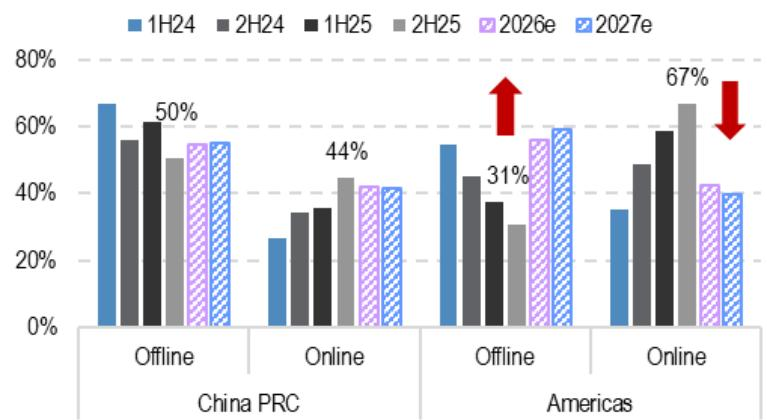

Overseas monthly revenue per store should normalize from 2026 after surge in 2025  
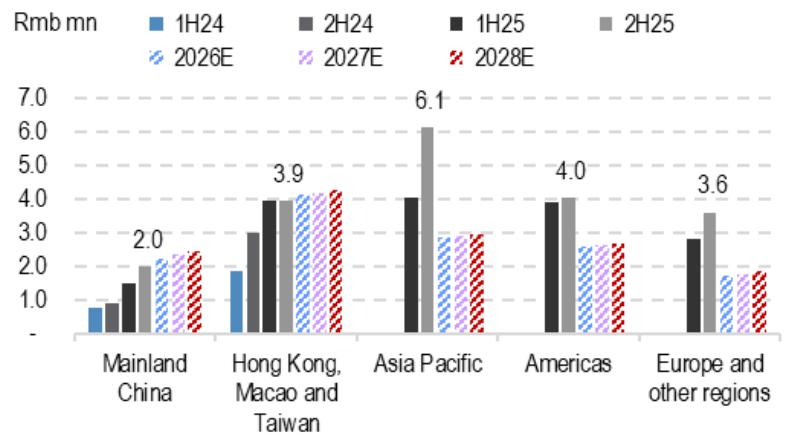

bar chart

| Region | 1H24 (Rmb mn) | 2H24 (Rmb mn) | 1H25 (Rmb mn) | 2H25 (Rmb mn) | 2026E (Rmb mn) | 2027E (Rmb mn) | 2028E (Rmb mn) |
| :--- | :--- | :--- | :--- | :--- | :--- | :--- | :--- |
| Mainland China | 0.8 | 1.0 | 1.5 | 2.0 | 2.1 | 2.3 | 2.4 |
| Hong Kong, Macao and Taiwan | 1.9 | 3.0 | 4.0 | 3.9 | 4.1 | 4.2 | 4.3 |
| Asia Pacific | - | - | 4.0 | 6.1 | 2.8 | 2.9 | 3.0 |
| Americas | - | - | 3.9 | 4.0 | 2.5 | 2.6 | 2.7 |
| Europe and other regions | - | - | 2.8 | 3.6 | 1.7 | 1.8 | 1.9 |

We expect overseas and China revenue to sequentially improve in the next few quarters...  
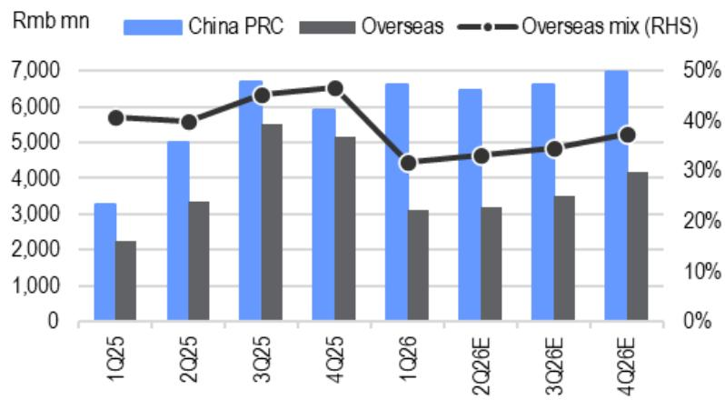

bar-line hybrid chart

| Quarter | China PRC (Rmb mn) | Overseas (Rmb mn) | Overseas mix (RHS) (%) |
| :--- | :--- | :--- | :--- |
| 1Q25 | 3300 | 2200 | 40 |
| 2Q25 | 5000 | 3300 | 38 |
| 3Q25 | 6700 | 5400 | 45 |
| 4Q25 | 6000 | 5100 | 46 |
| 1Q26 | 6600 | 3100 | 33 |
| 2Q26E | 6500 | 3200 | 35 |
| 3Q26E | 6600 | 3500 | 36 |
| 4Q26E | 7000 | 4100 | 38 |

...and yoy growth to stabilize in 4Q26, after a double-digit yoy sales decline in 3Q26 on a tough base  
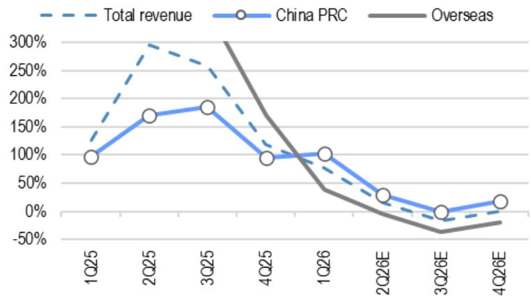

line chart

| Quarter | Total revenue | China PRC | Overseas |
| ------- | ------------- | --------- | -------- |
| 1Q25    | 100%          | 100%      | 100%     |
| 2Q25    | 300%          | 170%      | 300%     |
| 3Q25    | 250%          | 180%      | 300%     |
| 4Q25    | 100%          | 90%       | 170%     |
| 1Q26    | 100%          | 100%      | 40%      |
| 2Q26E   | 30%           | 30%       | -10%     |
| 3Q26E   | -10%          | -10%      | -40%     |
| 4Q26E   | 10%           | 20%       | -20%     |

## Pop Mart (N): Moat intact, timing nuanced

Quarterly revenue by channels

<table><tr><td>FYE Dec 31 (Rmb mn)</td><td>1Q25</td><td>2Q25</td><td>3Q25</td><td>4Q25</td><td>1Q26</td><td>2Q26E</td><td>3Q26E</td><td>4Q26E</td></tr><tr><td colspan="9">Revenue YoY (JPMe)</td></tr><tr><td>Total revenue</td><td>126%</td><td>295%</td><td>257%</td><td>118%</td><td>76%</td><td>15%</td><td>-17%</td><td>1%</td></tr><tr><td>China PRC</td><td>96%</td><td>170%</td><td>185%</td><td>95%</td><td>103%</td><td>28%</td><td>-1%</td><td>18%</td></tr><tr><td>Overseas</td><td>475%</td><td>410%</td><td>360%</td><td>171%</td><td>38%</td><td>-5%</td><td>-36%</td><td>-19%</td></tr><tr><td>- Asia Pacific</td><td>345%</td><td>210%</td><td>170%</td><td>90%</td><td>25%</td><td>0%</td><td>-31%</td><td>-19%</td></tr><tr><td>- Americas</td><td>895%</td><td>1337%</td><td>1265%</td><td>392%</td><td>55%</td><td>-13%</td><td>-41%</td><td>-29%</td></tr><tr><td>- Europe and others</td><td>600%</td><td>610%</td><td>735%</td><td>273%</td><td>60%</td><td>7%</td><td>-41%</td><td>31%</td></tr><tr><td colspan="9">Revenue QoQ (JPMe)</td></tr><tr><td>Total revenue</td><td>9%</td><td>52%</td><td>45%</td><td>-9%</td><td>-12%</td><td>-1%</td><td>5%</td><td>10%</td></tr><tr><td>China</td><td>8%</td><td>54%</td><td>33%</td><td>-12%</td><td>12%</td><td>-3%</td><td>3%</td><td>5%</td></tr><tr><td>Overseas</td><td>17%</td><td>50%</td><td>64%</td><td>-6%</td><td>-40%</td><td>3%</td><td>10%</td><td>19%</td></tr><tr><td>- Asia Pacific</td><td>-7%</td><td>26%</td><td>62%</td><td>0%</td><td>-39%</td><td>1%</td><td>12%</td><td>18%</td></tr><tr><td>- Americas</td><td>78%</td><td>83%</td><td>59%</td><td>-5%</td><td>-44%</td><td>2%</td><td>8%</td><td>15%</td></tr><tr><td>- Europe and others</td><td>75%</td><td>73%</td><td>99%</td><td>-38%</td><td>-25%</td><td>16%</td><td>10%</td><td>37%</td></tr></table>

Pop Mart has proven its capability in the commercialization of artist IPs, with revenue scale of Molly, Skullpanda and Dimoo reaching historical high in Pop Mart's hands  
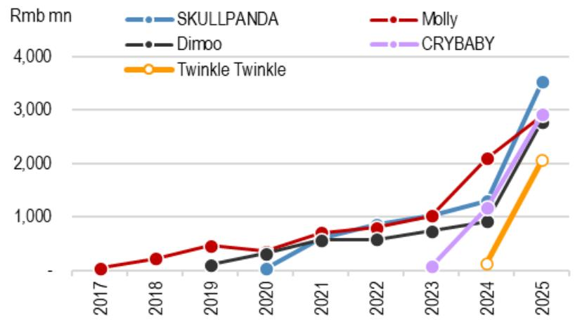

line chart

| Year | SKULLPANDA | Molly | Dimoo | CRYBABY | Twinkle Twinkle |
|------|------------|-------|-------|---------|-----------------|
| 2017 | -          | -     | -     | -       | -               |
| 2018 | -          | -     | -     | -       | -               |
| 2019 | -          | -     | -     | -       | -               |
| 2020 | -          | -     | -     | -       | -               |
| 2021 | -          | -     | -     | -       | -               |
| 2022 | -          | -     | -     | -       | -               |
| 2023 | -          | -     | -     | -       | -               |
| 2024 | -          | -     | -     | -       | -               |
| 2025 | 3500       | 3000  | 2800  | 3000    | 2000            |

While China operating margin will be relatively stable, overseas operating margin will decline to 31% in 2026E from 49% in 2025, and gradually improve afterwards  
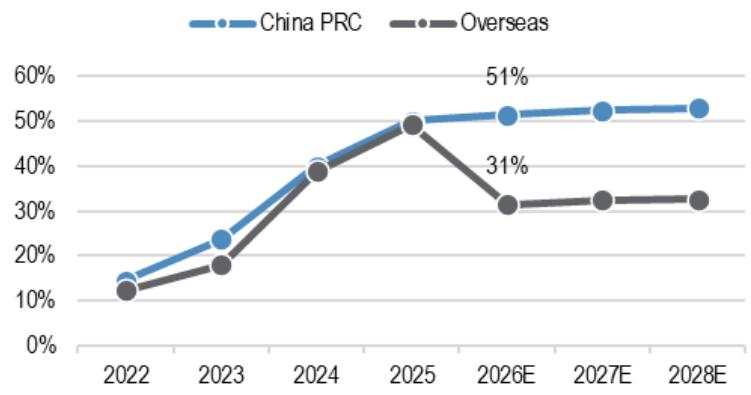

line chart

| Year | China PRC (%) | Overseas (%) |
|---|---|---|
| 2022 | 14 | 12 |
| 2023 | 24 | 18 |
| 2024 | 40 | 39 |
| 2025 | 50 | 49 |
| 2026E | 51 | 31 |
| 2027E | 52 | 32 |
| 2028E | 53 | 32 |

We expect 20% and 23% revenue CAGRs from non-Labubu IPs in China and overseas markets in 2025-28E  
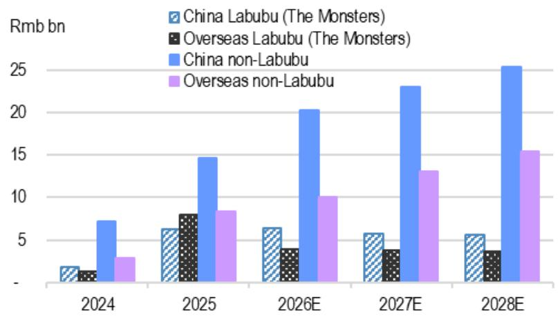

bar chart

| Year | China Labubu (The Monsters) (Rmb bn) | Overseas Labubu (The Monsters) (Rmb bn) | China non-Labubu (Rmb bn) | Overseas non-Labubu (Rmb bn) |
| :--- | :--- | :--- | :--- | :--- |
| 2024 | 2 | 1.5 | 7 | 3 |
| 2025 | 6 | 8 | 14.5 | 8.3 |
| 2026E | 6.3 | 4 | 20.3 | 10 |
| 2027E | 5.7 | 3.9 | 23.1 | 13 |
| 2028E | 5.6 | 3.7 | 25.4 | 15.4 |

JPM

## Pop Mart (N): Moat intact, timing nuanced

Pop Mart – Key assumptions and operating metrics

<table><tr><td>FYE Dec 31 (Rmb mn)</td><td>2024</td><td>2025</td><td>2026E</td><td>2027E</td><td>2028E</td></tr><tr><td colspan="6">Store count</td></tr><tr><td>Retail store</td><td>531</td><td>630</td><td>744</td><td>817</td><td>889</td></tr><tr><td>Mainland China</td><td>401</td><td>410</td><td>430</td><td>440</td><td>450</td></tr><tr><td>Hong Kong, Macao and Taiwan</td><td>30</td><td>35</td><td>39</td><td>42</td><td>44</td></tr><tr><td>Overseas</td><td>100</td><td>185</td><td>275</td><td>335</td><td>395</td></tr><tr><td colspan="6">Net opening</td></tr><tr><td>Retail store</td><td>98</td><td>99</td><td>114</td><td>73</td><td>72</td></tr><tr><td>Mainland China</td><td>38</td><td>9</td><td>20</td><td>10</td><td>10</td></tr><tr><td>Hong Kong, Macao and Taiwan</td><td>30</td><td>5</td><td>4</td><td>3</td><td>2</td></tr><tr><td>Overseas</td><td>30</td><td>85</td><td>90</td><td>60</td><td>60</td></tr><tr><td colspan="6">Revenue by Region</td></tr><tr><td>The PRC</td><td>8,886</td><td>20,852</td><td>26,636</td><td>28,836</td><td>30,939</td></tr><tr><td>Overseas</td><td>4,151</td><td>16,268</td><td>13,961</td><td>16,821</td><td>19,063</td></tr><tr><td>Asia Pacific</td><td>3,110</td><td>8,011</td><td>7,060</td><td>7,866</td><td>8,478</td></tr><tr><td>Americas</td><td>802</td><td>6,806</td><td>5,453</td><td>6,733</td><td>7,604</td></tr><tr><td>Europe and other regions</td><td>239</td><td>1,451</td><td>1,448</td><td>2,221</td><td>2,981</td></tr><tr><td>Total</td><td>13,038</td><td>37,120</td><td>40,598</td><td>45,657</td><td>50,002</td></tr><tr><td colspan="6">YoY change</td></tr><tr><td>The PRC</td><td></td><td>135%</td><td>28%</td><td>8%</td><td>7%</td></tr><tr><td>Overseas</td><td></td><td>292%</td><td>-14%</td><td>20%</td><td>13%</td></tr><tr><td>Asia Pacific</td><td></td><td>158%</td><td>-12%</td><td>11%</td><td>8%</td></tr><tr><td>Americas</td><td></td><td>748%</td><td>-20%</td><td>23%</td><td>13%</td></tr><tr><td>Europe and other regions</td><td></td><td>506%</td><td>0%</td><td>53%</td><td>34%</td></tr><tr><td>Total</td><td></td><td>185%</td><td>9%</td><td>12%</td><td>10%</td></tr></table>

<table><tr><td>26-28E CAGR</td><td>1H25</td><td>2H25</td><td>1H26E</td><td>2H26E</td></tr><tr><td rowspan="4">9%</td><td>571</td><td>630</td><td>681</td><td>744</td></tr><tr><td>409</td><td>410</td><td>420</td><td>430</td></tr><tr><td>34</td><td>35</td><td>37</td><td>39</td></tr><tr><td>128</td><td>185</td><td>224</td><td>275</td></tr><tr><td rowspan="4"></td><td>40</td><td>59</td><td>51</td><td>63</td></tr><tr><td>8</td><td>1</td><td>10</td><td>10</td></tr><tr><td>4</td><td>1</td><td>2</td><td>2</td></tr><tr><td>28</td><td>57</td><td>39</td><td>51</td></tr><tr><td>8%</td><td>8,283</td><td>12,569</td><td>13,049</td><td>13,587</td></tr><tr><td rowspan="4">17%</td><td>5,593</td><td>10,675</td><td>6,283</td><td>7,678</td></tr><tr><td>2,851</td><td>5,160</td><td>3,173</td><td>3,887</td></tr><tr><td>2,265</td><td>4,541</td><td>2,507</td><td>2,946</td></tr><tr><td>478</td><td>973</td><td>603</td><td>845</td></tr><tr><td>11%</td><td>13,876</td><td>23,244</td><td>19,332</td><td>21,265</td></tr><tr><td rowspan="6"></td><td>135%</td><td>134%</td><td>58%</td><td>8%</td></tr><tr><td>434%</td><td>244%</td><td>12%</td><td>-28%</td></tr><tr><td>258%</td><td>123%</td><td>11%</td><td>-25%</td></tr><tr><td>1142%</td><td>633%</td><td>11%</td><td>-35%</td></tr><tr><td>607%</td><td>467%</td><td>26%</td><td>-13%</td></tr><tr><td>204%</td><td>174%</td><td>39%</td><td>-9%</td></tr></table>

<table><tr><td>FYE Dec 31 (Rmb mn)</td><td>2024</td><td>2025</td><td>2026E</td><td>2027E</td><td>2028E</td></tr><tr><td>Total revenue</td><td>13,038</td><td>37,120</td><td>40,598</td><td>45,657</td><td>50,002</td></tr><tr><td>YoY %</td><td>107%</td><td>185%</td><td>9%</td><td>12%</td><td>10%</td></tr><tr><td>Gross margin</td><td>66.8%</td><td>72.1%</td><td>68.7%</td><td>69.2%</td><td>69.4%</td></tr><tr><td>Operating profit</td><td>4,154</td><td>16,890</td><td>15,979</td><td>18,233</td><td>20,057</td></tr><tr><td>YoY %</td><td>238%</td><td>307%</td><td>-5%</td><td>14%</td><td>10%</td></tr><tr><td>Operating margin</td><td>31.9%</td><td>45.5%</td><td>39.4%</td><td>39.9%</td><td>40.1%</td></tr><tr><td>Reported net profit</td><td>3,125</td><td>12,776</td><td>12,047</td><td>13,721</td><td>15,141</td></tr><tr><td>YoY %</td><td>189%</td><td>309%</td><td>-6%</td><td>14%</td><td>10%</td></tr><tr><td>Rerported net margin</td><td>24.0%</td><td>34.4%</td><td>29.7%</td><td>30.1%</td><td>30.3%</td></tr><tr><td>Adj. net profit</td><td>3,220</td><td>12,847</td><td>12,119</td><td>13,792</td><td>15,212</td></tr><tr><td>YoY %</td><td>172%</td><td>299%</td><td>-6%</td><td>14%</td><td>10%</td></tr><tr><td>Adj. net margin</td><td>24.7%</td><td>34.6%</td><td>29.9%</td><td>30.2%</td><td>30.4%</td></tr><tr><td>Adj. EPS - basic (Rmb)</td><td>2.43</td><td>9.66</td><td>9.02</td><td>10.27</td><td>11.33</td></tr><tr><td>YoY %</td><td>174%</td><td>298%</td><td>-7%</td><td>14%</td><td>10%</td></tr></table>

<table><tr><td>26-28E CAGR</td><td>1H25</td><td>2H25</td><td>1H26E</td><td>2H26E</td></tr><tr><td>11%</td><td>13,876</td><td>23,244</td><td>19,332</td><td>21,265</td></tr><tr><td></td><td>204%</td><td>174%</td><td>39%</td><td>-9%</td></tr><tr><td></td><td>70.3%</td><td>73.2%</td><td>68.7%</td><td>68.7%</td></tr><tr><td>12%</td><td>6,044</td><td>10,847</td><td>7,456</td><td>8,523</td></tr><tr><td></td><td>437%</td><td>258%</td><td>23%</td><td>-21%</td></tr><tr><td></td><td>43.6%</td><td>46.7%</td><td>38.6%</td><td>40.1%</td></tr><tr><td>12%</td><td>4,574</td><td>8,201</td><td>5,623</td><td>6,424</td></tr><tr><td></td><td>396%</td><td>272%</td><td>23%</td><td>-22%</td></tr><tr><td></td><td>33.0%</td><td>35.3%</td><td>29.1%</td><td>30.2%</td></tr><tr><td>12%</td><td>4,602</td><td>8,245</td><td>5,659</td><td>6,460</td></tr><tr><td></td><td>372%</td><td>267%</td><td>23%</td><td>-22%</td></tr><tr><td></td><td>33.2%</td><td>35.5%</td><td>29.3%</td><td>30.4%</td></tr><tr><td>12%</td><td>3.46</td><td>6.20</td><td>4.21</td><td>4.81</td></tr><tr><td></td><td>371%</td><td>271%</td><td>22%</td><td>-22%</td></tr></table>

Source: Company data, JPM estimates.

## Pop Mart (N): Moat intact, timing nuanced

Pop Mart - Consensus EBIT revisions  
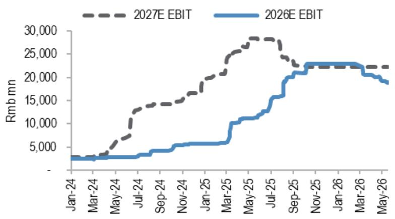

line chart

| Month    | 2027E EBIT | 2026E EBIT |
| -------- | ---------- | ---------- |
| Jan-24   | ~3,000     | ~3,000     |
| Mar-24   | ~3,500     | ~3,500     |
| May-24   | ~8,000     | ~4,000     |
| Jul-24   | ~13,000    | ~4,500     |
| Sep-24   | ~14,000    | ~5,500     |
| Nov-24   | ~16,000    | ~6,000     |
| Jan-25   | ~18,000    | ~6,500     |
| Mar-25   | ~22,000    | ~10,000    |
| May-25   | ~28,000    | ~12,000    |
| Jul-25   | ~29,000    | ~15,000    |
| Sep-25   | ~24,000    | ~21,000    |
| Nov-25   | ~23,000    | ~23,000    |
| Jan-26   | ~23,000    | ~23,000    |
| Mar-26   | ~23,000    | ~23,000    |
| May-26   | ~23,000    | ~19,500    |

Source: Bloomberg Finance L.P. estimates.

Pop Mart - Share price vs consensus forward EPS  
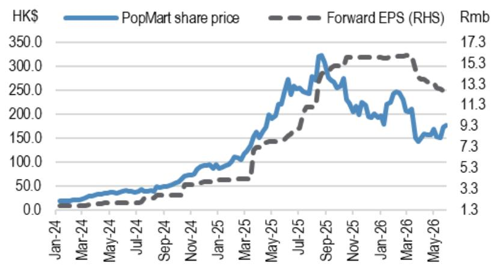

line chart

| Date   | PopMart share price | Forward EPS (RHS) |
|--------|---------------------|-------------------|
| Jan-24 | ~10                 | ~1.3              |
| Mar-24 | ~20                 | ~2.5              |
| May-24 | ~30                 | ~3.3              |
| Jul-24 | ~40                 | ~4.5              |
| Sep-24 | ~60                 | ~5.3              |
| Nov-24 | ~80                 | ~6.5              |
| Jan-25 | ~100                | ~7.3              |
| Mar-25 | ~150                | ~8.5              |
| May-25 | ~200                | ~10.0             |
| Jul-25 | ~250                | ~12.0             |
| Sep-25 | ~300                | ~15.0             |
| Nov-25 | ~250                | ~17.3             |
| Jan-26 | ~200                | ~17.3             |
| Mar-26 | ~150                | ~15.3             |
| May-26 | ~170                | ~13.3             |

Source: Bloomberg Finance L.P.

Pop Mart 12-month rolling P/E  
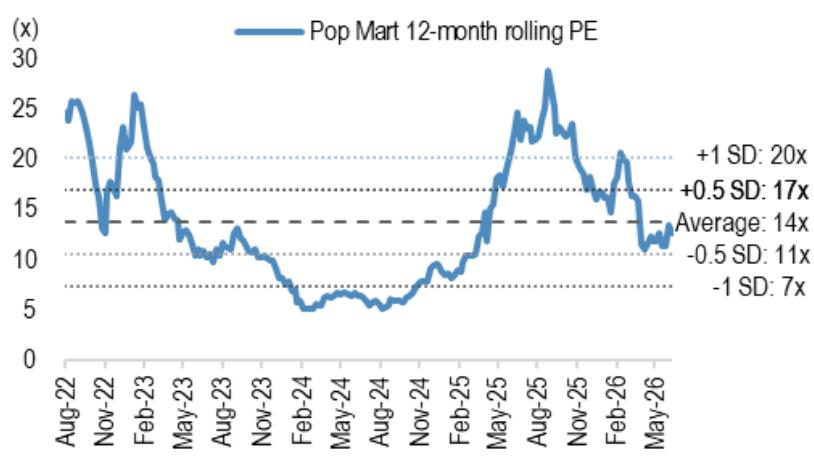

line chart

| Date    | Value |
|---------|-------|
| Aug-22  | 25.0x |
| Nov-22  | 13.0x |
| Feb-23  | 26.0x |
| May-23  | 14.0x |
| Aug-23  | 11.0x |
| Nov-23  | 9.0x  |
| Feb-24  | 5.0x  |
| May-24  | 6.0x  |
| Aug-24  | 5.0x  |
| Nov-24  | 8.0x  |
| Feb-25  | 15.0x |
| May-25  | 24.0x |
| Aug-25  | 29.0x |
| Nov-25  | 18.0x |
| Feb-26  | 15.0x |
| May-26  | 11.0x |

Source: JPM, Bloomberg Finance L.P.

Pop Mart 12-month rolling P/E band chart  
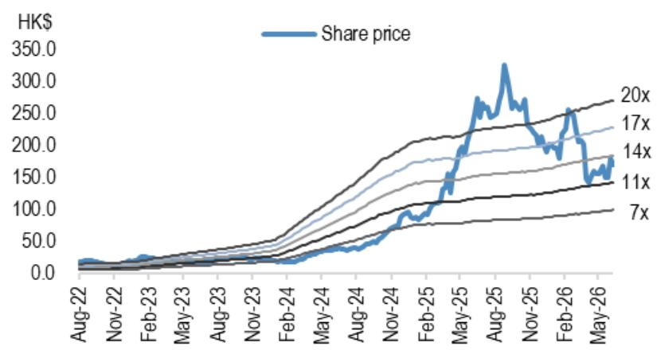

line chart

| Date    | Share price (HK$) |
|---------|-------------------|
| Aug-22  | ~10               |
| Nov-22  | ~15               |
| Feb-23  | ~20               |
| May-23  | ~30               |
| Aug-23  | ~40               |
| Nov-23  | ~50               |
| Feb-24  | ~60               |
| May-24  | ~80               |
| Aug-24  | ~100              |
| Nov-24  | ~120              |
| Feb-25  | ~150              |
| May-25  | ~200              |
| Aug-25  | ~300              |
| Nov-25  | ~250              |
| Feb-26  | ~200              |
| May-26  | ~150              |

Source: JPM, Bloomberg Finance L.P.

## Pop Mart (N): Moat intact, timing nuanced

Pop Mart SOTP-based stress valuation test: 15x target 2026E P/E on China business (17% CAGR) and 8x on overseas business (trough valuation for cyclicals) implies a fair value of HK\$140; China alone = HK\$124

<table><tr><td>FYE Dec 31 (Rmb mn)</td><td>2024</td><td>2025</td><td>2026E</td><td>2027E</td><td>2028E</td><td>25-28E CAGR</td></tr><tr><td>Revenue</td><td>13,038</td><td>37,120</td><td>40,598</td><td>45,657</td><td>50,002</td><td>10%</td></tr><tr><td>China PRC</td><td>8,886</td><td>20,852</td><td>26,636</td><td>28,836</td><td>30,939</td><td>14%</td></tr><tr><td>Overseas</td><td>4,151</td><td>16,268</td><td>13,961</td><td>16,821</td><td>19,063</td><td>5%</td></tr><tr><td>* Asia Pacific</td><td>3,110</td><td>8,011</td><td>7,060</td><td>7,866</td><td>8,478</td><td>2%</td></tr><tr><td>* Americas</td><td>802</td><td>6,806</td><td>5,453</td><td>6,733</td><td>7,604</td><td>4%</td></tr><tr><td>* Europe and other regions</td><td>239</td><td>1,451</td><td>1,448</td><td>2,221</td><td>2,981</td><td>27%</td></tr><tr><td>NPM estimates</td><td>24.7%</td><td>34.6%</td><td>29.9%</td><td>30.2%</td><td>30.4%</td><td></td></tr><tr><td>China PRC</td><td>24.7%</td><td>35.0%</td><td>36.3%</td><td>37.3%</td><td>37.8%</td><td></td></tr><tr><td>Overseas</td><td>24.7%</td><td>34.1%</td><td>17.6%</td><td>18.1%</td><td>18.5%</td><td></td></tr><tr><td>* Asia Pacific</td><td>24.7%</td><td>34.0%</td><td>17.3%</td><td>18.2%</td><td>18.5%</td><td></td></tr><tr><td>* Americas</td><td>25.0%</td><td>34.0%</td><td>15.3%</td><td>16.2%</td><td>16.5%</td><td></td></tr><tr><td>* Europe and other regions</td><td>23.7%</td><td>35.2%</td><td>27.7%</td><td>23.4%</td><td>23.7%</td><td></td></tr><tr><td>Estimated core net profit</td><td>3,220</td><td>12,847</td><td>12,119</td><td>13,792</td><td>15,212</td><td>6%</td></tr><tr><td>China PRC</td><td>2,195</td><td>7,298</td><td>9,664</td><td>10,750</td><td>11,689</td><td>17%</td></tr><tr><td>Overseas</td><td>1,025</td><td>5,549</td><td>2,455</td><td>3,042</td><td>3,523</td><td>-14%</td></tr><tr><td>* Asia Pacific</td><td>768</td><td>2,724</td><td>1,220</td><td>1,432</td><td>1,565</td><td>-17%</td></tr><tr><td>* Americas</td><td>201</td><td>2,314</td><td>834</td><td>1,091</td><td>1,251</td><td>-19%</td></tr><tr><td>* Europe and other regions</td><td>57</td><td>511</td><td>401</td><td>519</td><td>708</td><td>11%</td></tr><tr><td>Target PE multiple (x)</td><td></td><td>12.0</td><td>13.6</td><td>13.5</td><td></td><td></td></tr><tr><td>China PRC</td><td></td><td>15</td><td>15</td><td>15</td><td></td><td></td></tr><tr><td>Overseas</td><td></td><td>8</td><td>8</td><td>8</td><td></td><td></td></tr><tr><td>Fair Value (Rmb mn)</td><td></td><td>153,865</td><td>164,596</td><td>185,590</td><td></td><td></td></tr><tr><td>China PRC</td><td></td><td>109,472</td><td>144,959</td><td>161,255</td><td></td><td></td></tr><tr><td>Overseas</td><td></td><td>44,394</td><td>19,637</td><td>24,335</td><td></td><td></td></tr><tr><td>* Asia Pacific</td><td></td><td>21,790</td><td>9,763</td><td>11,454</td><td></td><td></td></tr><tr><td>* Americas</td><td></td><td>18,513</td><td>6,668</td><td>8,727</td><td></td><td></td></tr><tr><td>* Europe and other regions</td><td></td><td>4,091</td><td>3,205</td><td>4,154</td><td></td><td></td></tr><tr><td>Fair Value per share (HK$)</td><td></td><td>130</td><td>140</td><td>160</td><td></td><td></td></tr><tr><td>China PRC</td><td></td><td>94</td><td>124</td><td>138</td><td></td><td></td></tr><tr><td>Overseas</td><td></td><td>37.9</td><td>16.8</td><td>20.8</td><td></td><td></td></tr><tr><td>* Asia Pacific</td><td></td><td>18.6</td><td>8.3</td><td>9.8</td><td></td><td></td></tr><tr><td>* Americas</td><td></td><td>15.8</td><td>5.7</td><td>7.5</td><td></td><td></td></tr><tr><td>* Europe and other regions</td><td></td><td>3.5</td><td>2.7</td><td>3.5</td><td></td><td></td></tr></table>

Note: Red text refers to JPMe. Our Jun-27 PT of HK\$165 is based on 14x target 2027E P/E. Risks to Rating and Price Target: Key upside risks include: successful launches of new super IP, expansion of licensing business, category expansion, and faster recovery of overseas business. Key downside risks: include delays or

## Miniso – ADR/H (OW): Parkification drives the next growth wave

Miniso – Key assumptions and operating metrics

<table><tr><td>FYE Dec 31 (Rmb mn)</td><td>2024</td><td>2025</td><td>2026E</td><td>2027E</td><td>2028E</td></tr><tr><td>Total store count</td><td>7,780</td><td>8,485</td><td>9,015</td><td>9,495</td><td>9,925</td></tr><tr><td>Miniso</td><td>7,504</td><td>8,151</td><td>8,621</td><td>9,041</td><td>9,411</td></tr><tr><td>China</td><td>4,386</td><td>4,568</td><td>4,688</td><td>4,808</td><td>4,928</td></tr><tr><td>Overseas</td><td>3,118</td><td>3,583</td><td>3,933</td><td>4,233</td><td>4,483</td></tr><tr><td>Top Toy</td><td>276</td><td>334</td><td>394</td><td>454</td><td>514</td></tr><tr><td>Net opening</td><td>1,219</td><td>705</td><td>530</td><td>480</td><td>430</td></tr><tr><td>Miniso</td><td>1,091</td><td>647</td><td>470</td><td>420</td><td>370</td></tr><tr><td>China</td><td>460</td><td>182</td><td>120</td><td>120</td><td>120</td></tr><tr><td>Overseas</td><td>631</td><td>465</td><td>350</td><td>300</td><td>250</td></tr><tr><td>Top Toy</td><td>128</td><td>58</td><td>60</td><td>60</td><td>60</td></tr><tr><td>Revenue by brand</td><td>16,994</td><td>21,444</td><td>25,606</td><td>29,443</td><td>33,458</td></tr><tr><td>Miniso</td><td>16,003</td><td>19,525</td><td>22,745</td><td>25,711</td><td>28,772</td></tr><tr><td>Top Toy</td><td>983</td><td>1,916</td><td>2,858</td><td>3,728</td><td>4,681</td></tr><tr><td>YoY change</td><td>23%</td><td>26%</td><td>19%</td><td>15%</td><td>14%</td></tr><tr><td>Miniso</td><td>22%</td><td>22%</td><td>16%</td><td>13%</td><td>12%</td></tr><tr><td>Top Toy</td><td>45%</td><td>95%</td><td>49%</td><td>30%</td><td>26%</td></tr></table>

<table><tr><td>FYE Dec 31 (Rmb mn)</td><td>2024</td><td>2025</td><td>2026E</td><td>2027E</td><td>2028E</td></tr><tr><td>Total revenue</td><td>16,994</td><td>21,444</td><td>25,606</td><td>29,443</td><td>33,458</td></tr><tr><td>YoY %</td><td>23%</td><td>26%</td><td>19%</td><td>15%</td><td>14%</td></tr><tr><td>Gross margin</td><td>44.9%</td><td>45.0%</td><td>44.5%</td><td>44.3%</td><td>44.4%</td></tr><tr><td>Adj. operating profit</td><td>3,394</td><td>3,665</td><td>3,884</td><td>4,461</td><td>5,014</td></tr><tr><td>YoY %</td><td>18%</td><td>8%</td><td>6%</td><td>15%</td><td>12%</td></tr><tr><td>Adj. operating margin</td><td>20.0%</td><td>17.1%</td><td>15.2%</td><td>15.2%</td><td>15.0%</td></tr><tr><td>Reported net profit</td><td>2,618</td><td>1,205</td><td>3,011</td><td>3,177</td><td>3,648</td></tr><tr><td>YoY %</td><td>16%</td><td>-54%</td><td>150%</td><td>6%</td><td>15%</td></tr><tr><td>Rerported net margin</td><td>15.4%</td><td>5.6%</td><td>11.8%</td><td>10.8%</td><td>10.9%</td></tr><tr><td>Adj. net profit</td><td>2,714</td><td>2,892</td><td>2,832</td><td>3,406</td><td>3,792</td></tr><tr><td>YoY %</td><td>16%</td><td>7%</td><td>-2%</td><td>20%</td><td>11%</td></tr><tr><td>Adj. net margin</td><td>16.0%</td><td>13.5%</td><td>11.1%</td><td>11.6%</td><td>11.3%</td></tr><tr><td>Adj. EPADS - basic (Rmb)</td><td>8.78</td><td>9.45</td><td>8.35</td><td>11.01</td><td>12.26</td></tr><tr><td>YoY %</td><td>16%</td><td>8%</td><td>-12%</td><td>32%</td><td>11%</td></tr></table>

<table><tr><td>25-28E CAGR</td><td>1Q25</td><td>2Q25</td><td>3Q25</td><td>4Q25</td><td>1Q26</td></tr><tr><td>5%</td><td>7,768</td><td>7,905</td><td>8,138</td><td>8,485</td><td>8,565</td></tr><tr><td>5%</td><td>7,488</td><td>7,612</td><td>7,831</td><td>8,151</td><td>8,210</td></tr><tr><td>3%</td><td>4,275</td><td>4,305</td><td>4,407</td><td>4,568</td><td>4,593</td></tr><tr><td>8%</td><td>3,213</td><td>3,307</td><td>3,424</td><td>3,583</td><td>3,617</td></tr><tr><td>15%</td><td>280</td><td>293</td><td>307</td><td>334</td><td>355</td></tr><tr><td></td><td>(12)</td><td>137</td><td>233</td><td>347</td><td>80</td></tr><tr><td></td><td>(16)</td><td>124</td><td>219</td><td>320</td><td>59</td></tr><tr><td></td><td>(111)</td><td>30</td><td>102</td><td>161</td><td>25</td></tr><tr><td></td><td>95</td><td>94</td><td>117</td><td>159</td><td>34</td></tr><tr><td></td><td>4</td><td>13</td><td>14</td><td>27</td><td>21</td></tr><tr><td>16%</td><td>4,427</td><td>4,966</td><td>5,797</td><td>6,254</td><td>5,688</td></tr><tr><td>14%</td><td>4,086</td><td>4,563</td><td>5,221</td><td>5,654</td><td>5,173</td></tr><tr><td>35%</td><td>340</td><td>402</td><td>575</td><td>599</td><td>514</td></tr><tr><td></td><td>19%</td><td>23%</td><td>28%</td><td>33%</td><td>28%</td></tr><tr><td></td><td>17%</td><td>20%</td><td>23%</td><td>28%</td><td>27%</td></tr><tr><td></td><td>59%</td><td>87%</td><td>111%</td><td>112%</td><td>51%</td></tr></table>

<table><tr><td>25-28E CAGR</td><td>1Q25</td><td>2Q25</td><td>3Q25</td><td>4Q25</td><td>1Q26</td></tr><tr><td rowspan="3">16%</td><td>4,427</td><td>4,966</td><td>5,797</td><td>6,254</td><td>5,688</td></tr><tr><td>19%</td><td>23%</td><td>28%</td><td>33%</td><td>28%</td></tr><tr><td>44.2%</td><td>44.3%</td><td>44.7%</td><td>46.4%</td><td>43.3%</td></tr><tr><td rowspan="3">11%</td><td>733</td><td>839</td><td>1,040</td><td>1,053</td><td>838</td></tr><tr><td>-5%</td><td>7%</td><td>18%</td><td>10%</td><td>14%</td></tr><tr><td>16.6%</td><td>16.9%</td><td>17.9%</td><td>16.8%</td><td>14.7%</td></tr><tr><td rowspan="3">45%</td><td>416</td><td>490</td><td>441</td><td>(142)</td><td>1,251</td></tr><tr><td>-29%</td><td>-17%</td><td>-31%</td><td>-118%</td><td>200%</td></tr><tr><td>9.4%</td><td>9.9%</td><td>7.6%</td><td>-2.3%</td><td>22.0%</td></tr><tr><td rowspan="3">9%</td><td>586</td><td>679</td><td>784</td><td>844</td><td>633</td></tr><tr><td>-4%</td><td>9%</td><td>16%</td><td>5%</td><td>8%</td></tr><tr><td>13.2%</td><td>13.7%</td><td>13.5%</td><td>13.5%</td><td>11.1%</td></tr><tr><td rowspan="2">9%</td><td>1.92</td><td>2.24</td><td>2.48</td><td>2.80</td><td>1.80</td></tr><tr><td>-2%</td><td>12%</td><td>13%</td><td>9%</td><td>-6%</td></tr></table>

Source: Company data, JPM estimates.

## Miniso – ADR/H (OW): Parkification drives the next growth wave

Miniso (ADR) - Consensus EBIT revisions  
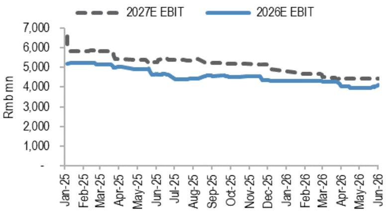

line chart

| Month   | 2027E EBIT | 2026E EBIT |
|---------|------------|------------|
| Jan-25  | 6,500      | 5,200      |
| Feb-25  | 6,000      | 5,100      |
| Mar-25  | 5,800      | 5,000      |
| Apr-25  | 5,500      | 4,900      |
| May-25  | 5,300      | 4,800      |
| Jun-25  | 5,200      | 4,700      |
| Jul-25  | 5,100      | 4,600      |
| Aug-25  | 5,000      | 4,500      |
| Sep-25  | 4.900      | 4,400      |
| Oct-25  | 4.800      | 4,300      |
| Nov-25  | 4.700      | 4,200      |
| Dec-25  | 4.600      | 4,100      |
| Jan-26  | 4.500      | 4,000      |
| Feb-26  | 4.400      | 3.900      |
| Mar-26  | 4.300      | 3.800      |
| Apr-26  | 4.200      | 3.700      |
| May-26  | 4.100      | 3.600      |
| Jun-26  | 4.000      | 3.500      |

Source: Bloomberg Finance L.P. estimates.

Miniso (ADR) - Share price vs consensus forward EPS  
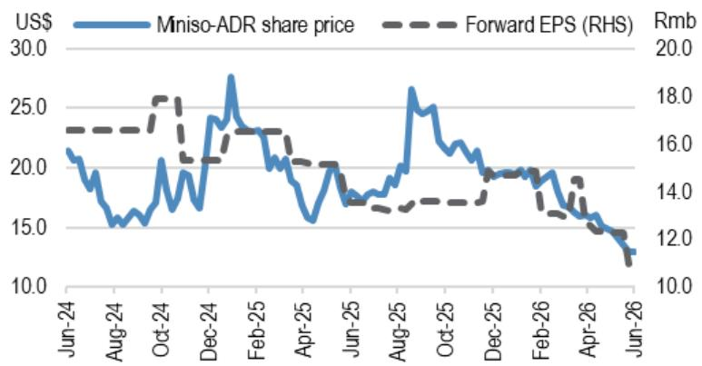

line chart

| Date   | Miniso-ADR share price | Forward EPS (Rmb) |
|--------|------------------------|-------------------|
| Jun-24 | ~21.0                  | ~16.0             |
| Aug-24 | ~15.0                  | ~16.0             |
| Oct-24 | ~20.0                  | ~16.0             |
| Dec-24 | ~27.0                  | ~16.0             |
| Feb-25 | ~23.0                  | ~16.0             |
| Apr-25 | ~15.0                  | ~14.0             |
| Jun-25 | ~17.0                  | ~14.0             |
| Aug-25 | ~27.0                  | ~14.0             |
| Oct-25 | ~23.0                  | ~14.0             |
| Dec-25 | ~19.0                  | ~14.0             |
| Feb-26 | ~19.0                  | ~14.0             |
| Apr-26 | ~15.0                  | ~14.0             |
| Jun-26 | ~12.0                  | ~12.0             |

Source: Bloomberg Finance L.P.

Miniso (ADR) 12-month rolling P/E  
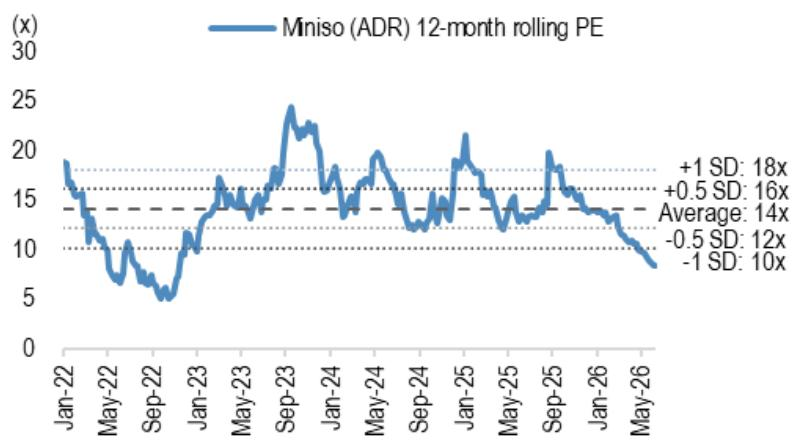

line chart

| Date    | Miniso (ADR) 12-month rolling PE |
|---------|----------------------------------|
| Jan-22  | ~18x                             |
| May-22  | ~10x                             |
| Sep-22  | ~5x                              |
| Jan-23  | ~15x                             |
| May-23  | ~17x                             |
| Sep-23  | ~25x                             |
| Jan-24  | ~15x                             |
| May-24  | ~18x                             |
| Sep-24  | ~15x                             |
| Jan-25  | ~20x                             |
| May-25  | ~15x                             |
| Sep-25  | ~20x                             |
| Jan-26  | ~15x                             |
| May-26  | ~10x                             |

Source: JPM, Bloomberg Finance L.P.

Miniso (ADR) 12-month rolling P/E band chart  
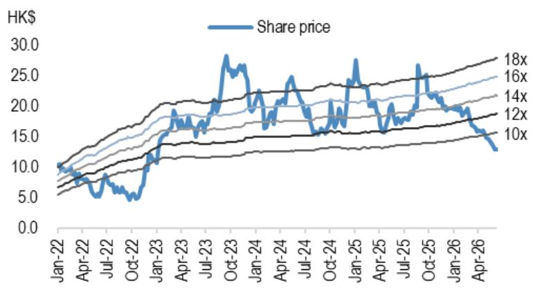

line chart

| Date   | Share price | 10x  | 12x  | 14x  | 16x  | 18x  |
|--------|-------------|------|------|------|------|------|
| Jan-22 | ~10.0       | ~7.0 | ~8.0 | ~9.0 | ~10.0| ~11.0|
| Apr-22 | ~8.0        | ~6.0 | ~7.0 | ~8.0 | ~9.0 | ~10.0|
| Jul-22 | ~6.0        | ~5.0 | ~6.0 | ~7.0 | ~8.0 | ~9.0 |
| Oct-22 | ~5.0        | ~4.0 | ~5.0 | ~6.0 | ~7.0 | ~8.0 |
| Jan-23 | ~15.0       | ~10.0| ~11.0| ~12.0| ~13.0| ~14.0|
| Apr-23 | ~18.0       | ~12.0| ~13.0| ~14.0| ~15.0| ~16.0|
| Jul-23 | ~20.0       | ~14.0| ~15.0| ~16.0| ~17.0| ~18.0|
| Oct-23 | ~28.0       | ~16.0| ~17.0| ~18.0| ~19.0| ~20.0|
| Jan-24 | ~25.0       | ~15.0| ~16.0| ~17.0| ~18.0| ~19.0|
| Apr-24 | ~22.0       | ~14.0| ~15.0| ~16.0| ~17.0| ~18.0|
| Jul-24 | ~24.0       | ~15.0| ~16.0| ~17.0| ~18.0| ~19.0|
| Oct-24 | ~26.0       | ~16.0| ~17.0| ~18.0| ~19.0| ~20.0|
| Jan-25 | ~28.0       | ~17.0| ~18.0| ~19.0| ~20.0| ~21.0|
| Apr-25 | ~25.0       | ~16.0| ~17.0| ~18.0| ~19.0| ~20.0|
| Jul-25 | ~27.0       | ~17.0| ~18.0| ~19.0| ~20.0| ~21.0|
| Oct-25 | ~26.0       | ~16.0| ~17.0| ~18.0| ~19.0| ~20.0|
| Jan-26 | ~24.0       | ~15.0| ~16.0| ~17.0| ~18.0| ~19.0|
| Apr-26 | ~13.0       | ~13.0| ~14.0| ~15.0| ~16.0| ~17.0|

Source: JPM, Bloomberg Finance L.P.

## CR Beer (OW): Right side of the channel migration

CR Beer – Key operating and financial metrics

<table><tr><td>P&amp;L (Rmb mn, FYE Dec 31)</td><td>2022</td><td>2023</td><td>2024</td><td>1H25</td><td>2H25</td><td>2025</td><td>2026E</td><td>2027E</td><td>2028E</td></tr><tr><td>Total revenue</td><td>35,263</td><td>38,932</td><td>38,635</td><td>23,942</td><td>14,043</td><td>37,985</td><td>39,506</td><td>40,752</td><td>42,209</td></tr><tr><td>- Beer</td><td></td><td>36,865</td><td>36,486</td><td>23,161</td><td>13,328</td><td>36,489</td><td>38,052</td><td>39,269</td><td>40,652</td></tr><tr><td>- Baijiu</td><td></td><td>2,067</td><td>2,149</td><td>781</td><td>715</td><td>1,496</td><td>1,454</td><td>1,483</td><td>1,557</td></tr><tr><td>Total revenue yoy (%)</td><td>5.6%</td><td>10.4%</td><td>-0.8%</td><td>0.8%</td><td>-5.7%</td><td>-1.7%</td><td>4.0%</td><td>3.2%</td><td>3.6%</td></tr><tr><td>- Beer revenue yoy (%)</td><td>5.6%</td><td>4.5%</td><td>-1.0%</td><td>2.6%</td><td>-4.3%</td><td>0.0%</td><td>4.3%</td><td>3.2%</td><td>3.5%</td></tr><tr><td>* Beer volume</td><td>0.4%</td><td>0.5%</td><td>-2.5%</td><td>2.2%</td><td>0.4%</td><td>1.4%</td><td>0.9%</td><td>1.1%</td><td>1.3%</td></tr><tr><td>-- Sub-premium +</td><td>12.6%</td><td>18.9%</td><td>4.3%</td><td>6.1%</td><td>5.3%</td><td>5.7%</td><td>7.0%</td><td>7.8%</td><td>7.9%</td></tr><tr><td>-- Mid-end</td><td>-1.7%</td><td>-1.6%</td><td>-3.1%</td><td>1.7%</td><td>-1.2%</td><td>0.4%</td><td>-0.4%</td><td>1.0%</td><td>1.0%</td></tr><tr><td>-- Low-end</td><td>-2.4%</td><td>-5.3%</td><td>-5.4%</td><td>0.5%</td><td>-1.2%</td><td>-0.2%</td><td>-1.6%</td><td>-3.0%</td><td>-3.0%</td></tr><tr><td>* Beer ASP</td><td>5.2%</td><td>4.0%</td><td>1.5%</td><td>0.4%</td><td>-4.6%</td><td>-1.4%</td><td>3.3%</td><td>2.1%</td><td>2.2%</td></tr><tr><td>- Baijiu revenue yoy (%)</td><td></td><td></td><td>4.0%</td><td>-33.7%</td><td>-26.4%</td><td>-30.4%</td><td>-2.8%</td><td>2.0%</td><td>5.0%</td></tr><tr><td>Gross profit</td><td>13,561</td><td>16,103</td><td>16,475</td><td>11,704</td><td>4,656</td><td>16,360</td><td>17,097</td><td>17,932</td><td>18,728</td></tr><tr><td>- Beer</td><td></td><td>14,802</td><td>15,004</td><td>11,178</td><td>4,320</td><td>15,498</td><td>16,151</td><td>16,924</td><td>17,670</td></tr><tr><td>- Baijiu</td><td></td><td>1,301</td><td>1,471</td><td>526</td><td>336</td><td>862</td><td>946</td><td>1,008</td><td>1,059</td></tr><tr><td>Gross margin (%)</td><td>38.5%</td><td>41.4%</td><td>42.6%</td><td>48.9%</td><td>33.2%</td><td>43.1%</td><td>43.3%</td><td>44.0%</td><td>44.4%</td></tr><tr><td>- Beer</td><td></td><td>40.2%</td><td>41.1%</td><td>48.3%</td><td>32.4%</td><td>42.5%</td><td>42.4%</td><td>43.1%</td><td>43.5%</td></tr><tr><td>- Baijiu</td><td></td><td>62.9%</td><td>68.5%</td><td>67.3%</td><td>47.0%</td><td>57.6%</td><td>65.1%</td><td>68.0%</td><td>68.0%</td></tr><tr><td>SG&amp;A</td><td>(10,070)</td><td>(11,427)</td><td>(11,681)</td><td>(5,556)</td><td>(5,331)</td><td>(10,887)</td><td>(10,707)</td><td>(10,814)</td><td>(11,183)</td></tr><tr><td>SG&amp;A as % of sales</td><td>-28.6%</td><td>-29.4%</td><td>-30.2%</td><td>-23.2%</td><td>-38.0%</td><td>-28.7%</td><td>-27.1%</td><td>-26.5%</td><td>-26.5%</td></tr><tr><td>EBIT (IFRS)</td><td>5,227</td><td>6,961</td><td>6,574</td><td>7,691</td><td>(2,416)</td><td>5,275</td><td>7,930</td><td>8,677</td><td>9,147</td></tr><tr><td>- EBIT yoy growth (%)</td><td>-12.8%</td><td>33.2%</td><td>-5.6%</td><td>20.8%</td><td>-1272.8%</td><td>-19.8%</td><td>50.3%</td><td>9.4%</td><td>5.4%</td></tr><tr><td>- EBIT margin (%)</td><td>14.8%</td><td>17.9%</td><td>17.0%</td><td>32.1%</td><td>-17.2%</td><td>13.9%</td><td>20.1%</td><td>21.3%</td><td>21.7%</td></tr><tr><td>Adj EBIT (IFRS ex-special items) *</td><td>5,462</td><td>7,102</td><td>6,344</td><td>7,105</td><td>348</td><td>7,453</td><td>8,065</td><td>8,814</td><td>9,286</td></tr><tr><td>- Beer</td><td></td><td>7,030</td><td>6,277</td><td>7,276</td><td>678</td><td>7,954</td><td>8,287</td><td>8,795</td><td>9,266</td></tr><tr><td>- Baijiu</td><td></td><td>130</td><td>116</td><td>(152)</td><td>(325)</td><td>(477)</td><td>(194)</td><td>45</td><td>46</td></tr><tr><td>- Unallocated corporate exp</td><td></td><td>(58)</td><td>(49)</td><td>(19)</td><td>(5)</td><td>(24)</td><td>(28)</td><td>(26)</td><td>(26)</td></tr><tr><td>Adj EBIT yoy (%) - cur. year vs last year</td><td>17.4%</td><td>30.0%</td><td>2.9%</td><td>11.3%</td><td>56.1%</td><td>12.8%</td><td>8.8%</td><td>9.3%</td><td>5.4%</td></tr><tr><td>- Beer</td><td></td><td>27.5%</td><td>2.0%</td><td>14.0%</td><td>340.3%</td><td>21.7%</td><td>4.7%</td><td>6.1%</td><td>5.4%</td></tr><tr><td>- Baijiu</td><td></td><td></td><td>72.1%</td><td>-416.7%</td><td>-545.2%</td><td>-494.2%</td><td>59.3%</td><td>-122.9%</td><td>2.3%</td></tr><tr><td>Adj EBIT margin (%)</td><td>15.5%</td><td>18.2%</td><td>16.4%</td><td>29.7%</td><td>2.5%</td><td>19.6%</td><td>20.4%</td><td>21.6%</td><td>22.0%</td></tr><tr><td>- Beer</td><td>0.0%</td><td>19.1%</td><td>17.2%</td><td>31.4%</td><td>5.1%</td><td>21.8%</td><td>21.8%</td><td>22.4%</td><td>22.8%</td></tr><tr><td>- Baijiu</td><td>0.0%</td><td>6.3%</td><td>5.4%</td><td>-19.5%</td><td>-45.5%</td><td>-31.9%</td><td>-13.4%</td><td>3.0%</td><td>2.9%</td></tr><tr><td>Net Profit attributable to shareholders</td><td>4,344</td><td>5,153</td><td>4,739</td><td>5,789</td><td>(2,418)</td><td>3,371</td><td>5,979</td><td>6,505</td><td>6,893</td></tr><tr><td>- Beer</td><td>4,344</td><td>4,961</td><td>4,697</td><td>5,856</td><td>626</td><td>6,482</td><td>6,067</td><td>6,494</td><td>6,883</td></tr><tr><td>- Baijiu</td><td></td><td>192</td><td>42</td><td>(67)</td><td>(3,044)</td><td>(3,111)</td><td>(89)</td><td>10</td><td>11</td></tr><tr><td>Net profit yoy growth (%)</td><td>-5.3%</td><td>18.6%</td><td>-8.0%</td><td>23.0%</td><td>-7211.8%</td><td>-28.9%</td><td>77.4%</td><td>8.8%</td><td>6.0%</td></tr><tr><td>Net margin (%)</td><td>12.3%</td><td>13.2%</td><td>12.3%</td><td>24.2%</td><td>-17.2%</td><td>8.9%</td><td>15.1%</td><td>16.0%</td><td>16.3%</td></tr><tr><td>- Beer</td><td></td><td>13.5%</td><td>12.9%</td><td>25.3%</td><td>4.7%</td><td>17.8%</td><td>15.9%</td><td>16.5%</td><td>16.9%</td></tr><tr><td>- Baijiu</td><td></td><td>9.3%</td><td>1.9%</td><td>-8.6%</td><td>-425.8%</td><td>-208.0%</td><td>-6.1%</td><td>0.7%</td><td>0.7%</td></tr><tr><td>Adjusted net earnings (ex-impairment)</td><td>4,520</td><td>5,257</td><td>4,570</td><td>5,789</td><td>459</td><td>6,248</td><td>5,979</td><td>6,505</td><td>6,893</td></tr><tr><td>Adj NP yoy (%)</td><td>26.2%</td><td>16.3%</td><td>-0.9%</td><td>22.7%</td><td>-408.1%</td><td>36.7%</td><td>-4.3%</td><td>8.8%</td><td>6.0%</td></tr><tr><td>Adj net margin (%)</td><td>12.8%</td><td>13.5%</td><td>11.8%</td><td>24.2%</td><td>3.3%</td><td>16.4%</td><td>15.1%</td><td>16.0%</td><td>16.3%</td></tr><tr><td>Dividend payout (% on reported NP)</td><td>40%</td><td>59%</td><td>52%</td><td></td><td></td><td>53%</td><td>65%</td><td>70%</td><td>70%</td></tr><tr><td>Dividend yield (%)</td><td></td><td></td><td></td><td></td><td></td><td>5%</td><td>5.6%</td><td>6.5%</td><td>6.9%</td></tr></table>

Source: Company data, JPM estimates.

## CR Beer (OW): Right side of the channel migration

CR Beer - Consensus EBIT revisions  
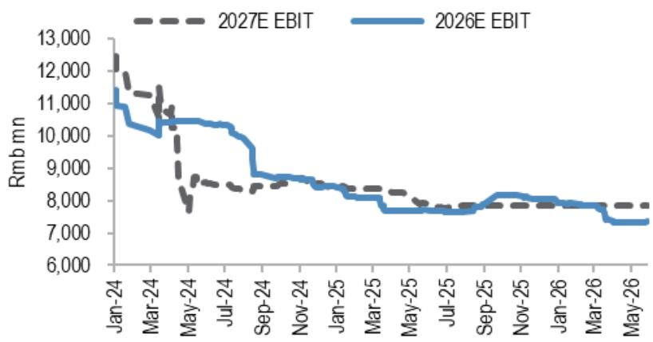

line chart

| Month   | 2026E EBIT | 2027E EBIT |
|---------|------------|------------|
| Jan-24  | 11,500     | 12,500     |
| Mar-24  | 10,500     | 11,500     |
| May-24  | 10,500     | 8,500      |
| Jul-24  | 10,500     | 8,500      |
| Sep-24  | 9,000      | 8,500      |
| Nov-24  | 8,500      | 8,500      |
| Jan-25  | 8,500      | 8,500      |
| Mar-25  | 8,000      | 8,500      |
| May-25  | 7,500      | 8,500      |
| Jul-25  | 7,500      | 8,500      |
| Sep-25  | 8,000      | 8,500      |
| Nov-25  | 8,000      | 8,500      |
| Jan-26  | 8,000      | 8,500      |
| Mar-26  | 7,500      | 8,500      |
| May-26  | 7,500      | 8,500      |

Source: Bloomberg Finance L.P. estimates.

CR Beer - Share price vs consensus forward EPS  
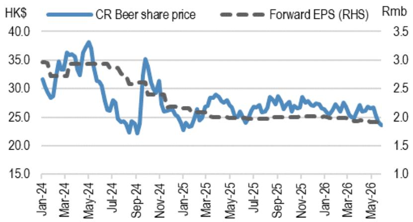

line chart

| Month   | CR Beer share price | Forward EPS (RHS) |
|---------|---------------------|-------------------|
| Jan-24  | ~31.0               | ~3.0              |
| Mar-24  | ~35.0               | ~2.9              |
| May-24  | ~38.0               | ~2.8              |
| Jul-24  | ~28.0               | ~2.7              |
| Sep-24  | ~22.0               | ~2.6              |
| Nov-24  | ~35.0               | ~2.5              |
| Jan-25  | ~26.0               | ~2.4              |
| Mar-25  | ~28.0               | ~2.3              |
| May-25  | ~25.0               | ~2.2              |
| Jul-25  | ~27.0               | ~2.1              |
| Sep-25  | ~28.0               | ~2.0              |
| Nov-25  | ~27.0               | ~1.9              |
| Jan-26  | ~26.0               | ~1.8              |
| Mar-26  | ~27.0               | ~1.7              |
| May-26  | ~24.0               | ~1.6              |

Source: Bloomberg Finance L.P.

CR Beer 12-month rolling P/E  
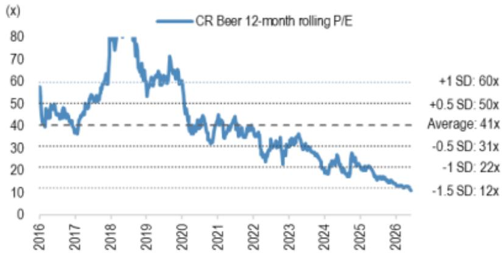

line chart

| Year | CR Beer 12-month rolling P/E |
|------|------------------------------|
| 2016 | ~55x                         |
| 2017 | ~40x                         |
| 2018 | ~80x                         |
| 2019 | ~70x                         |
| 2020 | ~40x                         |
| 2021 | ~35x                         |
| 2022 | ~30x                         |
| 2023 | ~35x                         |
| 2024 | ~25x                         |
| 2025 | ~20x                         |
| 2026 | ~15x                         |

Source: JPM, Bloomberg Finance L.P.

CR Beer 12-month rolling P/E band chart  
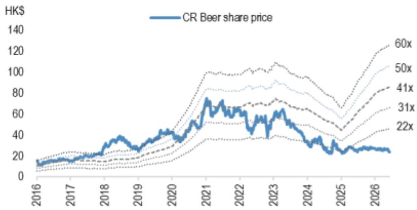

line chart

| Year | CR Beer share price |
|------|---------------------|
| 2016 | ~10                 |
| 2017 | ~15                 |
| 2018 | ~25                 |
| 2019 | ~35                 |
| 2020 | ~45                 |
| 2021 | ~70                 |
| 2022 | ~65                 |
| 2023 | ~60                 |
| 2024 | ~40                 |
| 2025 | ~30                 |
| 2026 | ~25                 |

Source: JPM, Bloomberg Finance L.P.

## Bud APAC: Channel migration and early recovery in a shifting landscape

BUD APAC- Key operating and financial metrics

<table><tr><td>P&amp;L, US$ mn</td><td>2022</td><td>2023</td><td>2024</td><td>1Q25</td><td>2Q25</td><td>3Q25</td><td>4Q25</td><td>2025</td><td>2026E</td><td>2027E</td><td>2028E</td></tr><tr><td>Sales volume (&#x27;000 HL)</td><td>88,491</td><td>92,767</td><td>84,811</td><td>19,741</td><td>23,887</td><td>22,512</td><td>13,518</td><td>79,658</td><td>81,237</td><td>82,515</td><td>83,460</td></tr><tr><td>- APAC East</td><td>11,573</td><td>11,539</td><td>11,960</td><td>2,860</td><td>2,846</td><td>3,393</td><td>2,712</td><td>11,811</td><td>11,796</td><td>12,032</td><td>12,273</td></tr><tr><td>- APAC West</td><td>76,918</td><td>81,228</td><td>72,851</td><td>16,881</td><td>21,041</td><td>19,119</td><td>10,806</td><td>67,847</td><td>69,441</td><td>70,482</td><td>71,187</td></tr><tr><td>Volume yoy (%, organic)</td><td>0.7%</td><td>4.6%</td><td>-8.8%</td><td>-6.1%</td><td>-6.2%</td><td>-8.6%</td><td>-0.7%</td><td>-6.0%</td><td>2.0%</td><td>1.6%</td><td>1.1%</td></tr><tr><td>- APAC East</td><td>8.9%</td><td>-0.3%</td><td>3.6%</td><td>11.9%</td><td>-10.4%</td><td>-0.6%</td><td>-3.7%</td><td>-1.3%</td><td>-0.1%</td><td>2.0%</td><td>2.0%</td></tr><tr><td>- APAC West</td><td>-0.4%</td><td>5.3%</td><td>-10.6%</td><td>-8.6%</td><td>-5.6%</td><td>-9.9%</td><td>0.1%</td><td>-6.7%</td><td>2.4%</td><td>1.5%</td><td>1.0%</td></tr><tr><td>ASP yoy (%, organic)</td><td>1.7%</td><td>6.2%</td><td>2.0%</td><td>-1.5%</td><td>2.4%</td><td>0.1%</td><td>-3.5%</td><td>-0.2%</td><td>0.1%</td><td>1.4%</td><td>1.8%</td></tr><tr><td>- APAC East</td><td>6.1%</td><td>1.5%</td><td>8.7%</td><td>-0.2%</td><td>2.2%</td><td>4.5%</td><td>3.2%</td><td>2.5%</td><td>3.0%</td><td>2.5%</td><td>2.5%</td></tr><tr><td>- APAC West</td><td>-0.1%</td><td>7.7%</td><td>-0.9%</td><td>-3.4%</td><td>3.0%</td><td>-2.4%</td><td>-5.7%</td><td>-1.5%</td><td>-0.5%</td><td>1.0%</td><td>1.5%</td></tr><tr><td>Revenue ($ mn)</td><td>6,478</td><td>6,856</td><td>6,246</td><td>1,461</td><td>1,675</td><td>1,555</td><td>1,073</td><td>5,764</td><td>6,018</td><td>6,197</td><td>6,381</td></tr><tr><td>- APAC East</td><td>1,251</td><td>1,243</td><td>1,352</td><td>295</td><td>319</td><td>392</td><td>304</td><td>1,310</td><td>1,351</td><td>1,413</td><td>1,477</td></tr><tr><td>- APAC West</td><td>5,227</td><td>5,613</td><td>4,894</td><td>1,166</td><td>1,356</td><td>1,163</td><td>769</td><td>4,454</td><td>4,667</td><td>4,784</td><td>4,904</td></tr><tr><td>Revenue yoy (%, organic)</td><td>2.4%</td><td>11.1%</td><td>-7.0%</td><td>-7.5%</td><td>-3.9%</td><td>-8.4%</td><td>-4.2%</td><td>-6.1%</td><td>2.1%</td><td>3.0%</td><td>3.0%</td></tr><tr><td>- APAC East</td><td>15.5%</td><td>1.2%</td><td>12.7%</td><td>11.7%</td><td>-8.4%</td><td>3.9%</td><td>-0.6%</td><td>1.3%</td><td>2.9%</td><td>4.5%</td><td>4.5%</td></tr><tr><td>- APAC West</td><td>-0.6%</td><td>13.4%</td><td>-11.4%</td><td>-11.7%</td><td>-2.7%</td><td>-12.0%</td><td>-5.6%</td><td>-8.2%</td><td>1.8%</td><td>2.5%</td><td>2.5%</td></tr><tr><td>Gross margin (%)</td><td>50.0%</td><td>50.4%</td><td>50.4%</td><td>51.0%</td><td>51.8%</td><td>51.4%</td><td>44.3%</td><td>50.1%</td><td>50.3%</td><td>50.5%</td><td>50.8%</td></tr><tr><td>- APAC East</td><td>58.0%</td><td>56.4%</td><td>60.0%</td><td>55.6%</td><td>62.6%</td><td>62.6%</td><td>60.2%</td><td>60.5%</td><td>62.0%</td><td>62.6%</td><td>63.1%</td></tr><tr><td>- APAC West</td><td>48.1%</td><td>49.0%</td><td>47.7%</td><td>49.9%</td><td>49.3%</td><td>47.6%</td><td>38.0%</td><td>47.0%</td><td>46.9%</td><td>47.0%</td><td>47.1%</td></tr><tr><td>SG&amp;A/sales (%)</td><td>-32.7%</td><td>-32.0%</td><td>-33.6%</td><td>-30.0%</td><td>-32.0%</td><td>-35.1%</td><td>-43.4%</td><td>-34.5%</td><td>-35.2%</td><td>-34.9%</td><td>-34.5%</td></tr><tr><td>- APAC East</td><td>-37.0%</td><td>-37.0%</td><td>-36.1%</td><td>-35.5%</td><td>-41.3%</td><td>-36.0%</td><td>-36.0%</td><td>-37.2%</td><td>-36.8%</td><td>-36.6%</td><td>-36.4%</td></tr><tr><td>- APAC West</td><td>-31.7%</td><td>-30.8%</td><td>-32.9%</td><td>-28.6%</td><td>-29.8%</td><td>-34.8%</td><td>-46.3%</td><td>-33.7%</td><td>-34.8%</td><td>-34.3%</td><td>-33.9%</td></tr><tr><td>EBITDA ($ mn)</td><td>1,932</td><td>2,023</td><td>1,807</td><td>485</td><td>498</td><td>438</td><td>167</td><td>1,588</td><td>1,606</td><td>1,685</td><td>1,769</td></tr><tr><td>- APAC East</td><td>346</td><td>323</td><td>403</td><td>96</td><td>80</td><td>122</td><td>82</td><td>379</td><td>407</td><td>434</td><td>462</td></tr><tr><td>- APAC West</td><td>1,587</td><td>1,700</td><td>1,405</td><td>389</td><td>418</td><td>316</td><td>86</td><td>1,209</td><td>1,199</td><td>1,252</td><td>1,306</td></tr><tr><td>EBITDA yoy (%, organic)</td><td>-5.2%</td><td>10.8%</td><td>-6.3%</td><td>-11.2%</td><td>-4.5%</td><td>-6.9%</td><td>-24.7%</td><td>-9.8%</td><td>-0.2%</td><td>4.7%</td><td>4.8%</td></tr><tr><td>- APAC East</td><td>23.9%</td><td>-10.1%</td><td>33.2%</td><td>24.4%</td><td>-26.5%</td><td>8.7%</td><td>-5.9%</td><td>-1.2%</td><td>7.1%</td><td>6.6%</td><td>6.6%</td></tr><tr><td>- APAC West</td><td>-10.6%</td><td>15.7%</td><td>-14.0%</td><td>-17.6%</td><td>1.4%</td><td>-11.9%</td><td>-40.0%</td><td>-12.4%</td><td>-2.6%</td><td>4.0%</td><td>4.2%</td></tr><tr><td>EBITDA margin (%)</td><td>29.8%</td><td>29.5%</td><td>28.9%</td><td>33.2%</td><td>29.7%</td><td>28.2%</td><td>15.6%</td><td>27.6%</td><td>26.7%</td><td>27.2%</td><td>27.7%</td></tr><tr><td>- APAC East</td><td>29.2%</td><td>26.0%</td><td>30.0%</td><td>32.5%</td><td>25.1%</td><td>31.1%</td><td>29.9%</td><td>29.7%</td><td>30.1%</td><td>30.7%</td><td>31.3%</td></tr><tr><td>- APAC West</td><td>30.0%</td><td>30.3%</td><td>28.6%</td><td>33.4%</td><td>30.8%</td><td>27.2%</td><td>9.9%</td><td>26.9%</td><td>25.7%</td><td>26.2%</td><td>26.6%</td></tr><tr><td>EBIT yoy (%)</td><td>-11.6%</td><td>8.6%</td><td>-15.3%</td><td>-18.9%</td><td>-5.4%</td><td>-9.2%</td><td>-69.6%</td><td>-15.0%</td><td>0.6%</td><td>7.1%</td><td>7.0%</td></tr><tr><td>Net profit</td><td>913</td><td>852</td><td>726</td><td>234</td><td>175</td><td>185</td><td>(105)</td><td>489</td><td>638</td><td>693</td><td>747</td></tr><tr><td>NP yoy (%)</td><td>-3.9%</td><td>-6.7%</td><td>-14.8%</td><td>-18.5%</td><td>-31.1%</td><td>-8.0%</td><td>-556.3%</td><td>-32.6%</td><td>30.5%</td><td>8.6%</td><td>7.7%</td></tr><tr><td>Net margin</td><td>14.1%</td><td>12.4%</td><td>11.6%</td><td>16.0%</td><td>10.4%</td><td>11.9%</td><td>-9.8%</td><td>8.5%</td><td>10.6%</td><td>11.2%</td><td>11.7%</td></tr><tr><td>OpCF</td><td>1,577</td><td>1,811</td><td>1,134</td><td></td><td></td><td></td><td></td><td>951</td><td>1,356</td><td>1,426</td><td>1,456</td></tr><tr><td>Capex</td><td>(494)</td><td>(498)</td><td>(379)</td><td></td><td></td><td></td><td></td><td>(307)</td><td>(396)</td><td>(406)</td><td>(415)</td></tr><tr><td>Dividend declared</td><td>501</td><td>701</td><td>750</td><td></td><td></td><td></td><td></td><td>750</td><td>750</td><td>750</td><td>750</td></tr><tr><td>Dividend payout (%)</td><td>55%</td><td>82%</td><td>103%</td><td></td><td></td><td></td><td></td><td>153%</td><td>117%</td><td>108%</td><td>100%</td></tr><tr><td>Dividend yield (on current price)</td><td></td><td></td><td></td><td></td><td></td><td></td><td></td><td>6.3%</td><td>6.3%</td><td>6.3%</td><td>6.3%</td></tr></table>

Source: Company data, JPM estimates.

## Bud APAC: Channel migration and early recovery in a shifting landscape

BUD APAC - Consensus EBIT revisions  
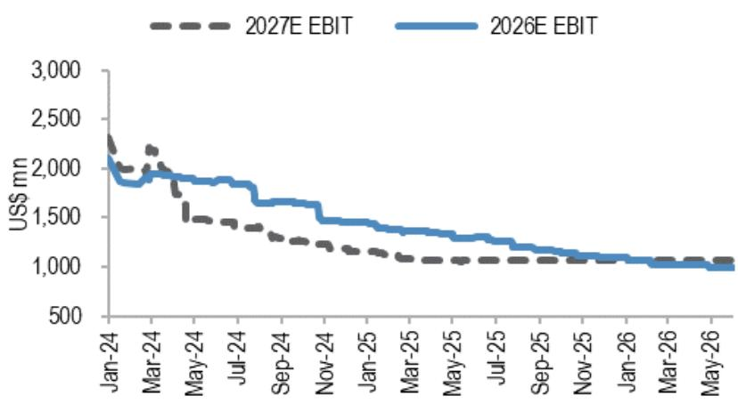

line chart

| Month    | 2027E EBIT | 2026E EBIT |
| -------- | ---------- | ---------- |
| Jan-24   | ~2300      | ~2100      |
| Mar-24   | ~2000      | ~1950      |
| May-24   | ~1500      | ~1850      |
| Jul-24   | ~1400      | ~1800      |
| Sep-24   | ~1300      | ~1700      |
| Nov-24   | ~1200      | ~1600      |
| Jan-25   | ~1150      | ~1550      |
| Mar-25   | ~1100      | ~1500      |
| May-25   | ~1050      | ~1450      |
| Jul-25   | ~1050      | ~1400      |
| Sep-25   | ~1050      | ~1350      |
| Nov-25   | ~1050      | ~1300      |
| Jan-26   | ~1050      | ~1250      |
| Mar-26   | ~1050      | ~1200      |
| May-26   | ~1050      | ~1150      |

Source: Bloomberg Finance L.P. estimates.

BUD APAC - Share price vs consensus forward EPS  
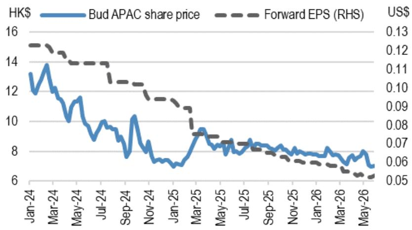

line chart

| Date   | Bud APAC share price | Forward EPS (RHS) |
|--------|---------------------|-------------------|
| Jan-24 | 13.0                | 0.13              |
| Mar-24 | 14.0                | 0.12              |
| May-24 | 11.0                | 0.11              |
| Jul-24 | 9.0                 | 0.10              |
| Sep-24 | 8.0                 | 0.09              |
| Nov-24 | 7.0                 | 0.08              |
| Jan-25 | 7.5                 | 0.07              |
| Mar-25 | 9.0                 | 0.06              |
| May-25 | 8.5                 | 0.05              |
| Jul-25 | 8.0                 | 0.06              |
| Sep-25 | 7.5                 | 0.07              |
| Nov-25 | 7.0                 | 0.08              |
| Jan-26 | 7.5                 | 0.09              |
| Mar-26 | 7.0                 | 0.10              |
| May-26 | 6.5                 | 0.11              |

Source: Bloomberg Finance L.P.

BUD APAC 12-month rolling P/E  
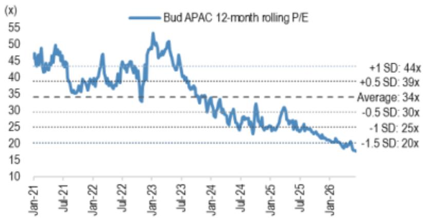

line chart

| Date    | Value |
|---------|-------|
| Jan-21  | 44x   |
| Jul-21  | 39x   |
| Jan-22  | 34x   |
| Jul-22  | 30x   |
| Jan-23  | 25x   |
| Jul-23  | 20x   |
| Jan-24  | 15x   |
| Jul-24  | 10x   |
| Jan-25  | 5x    |
| Jul-25  | 0.5x  |
| Jan-26  | 0.5x  |

Source: JPM, Bloomberg Finance L.P.

BUD APAC 12-month rolling P/E band chart  
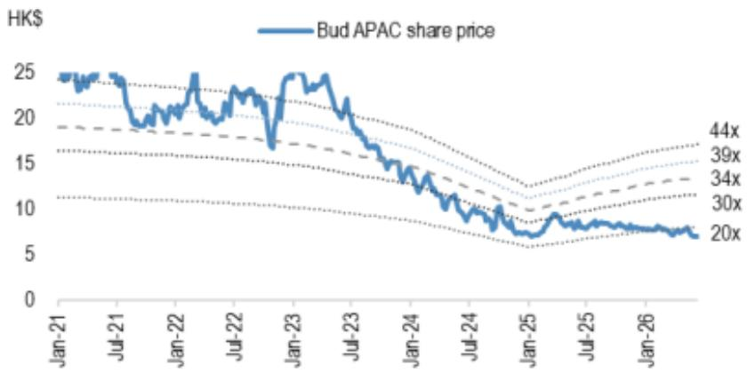

line chart

| Date   | Bud APAC share price |
|--------|---------------------|
| Jan-21 | 25                  |
| Jul-21 | 24                  |
| Jan-22 | 23                  |
| Jul-22 | 22                  |
| Jan-23 | 25                  |
| Jul-23 | 20                  |
| Jan-24 | 15                  |
| Jul-24 | 10                  |
| Jan-25 | 8                   |
| Jul-25 | 7                   |
| Jan-26 | 7                   |

Source: JPM, Bloomberg Finance L.P.

## Tsingtao Brewery: Margin expansion on track

Tsingtao– Key operating and financial metrics

<table><tr><td>P&amp;L (Rmb mn, FYE Dec 31)</td><td>2022</td><td>2023</td><td>2024</td><td>1Q25</td><td>2Q25</td><td>3Q25</td><td>4Q25</td><td>2025</td><td>2026E</td><td>2027E</td><td>2028E</td></tr><tr><td>Sales volume (mn L)</td><td>8,072</td><td>8,007</td><td>7,538</td><td>2,261</td><td>2,471</td><td>2,162</td><td>754</td><td>7,648</td><td>7,628</td><td>7,682</td><td>7,746</td></tr><tr><td>- Core brand (Tsingtao)</td><td>4,440</td><td>4,560</td><td>4,340</td><td>1,375</td><td>1,338</td><td>1,277</td><td>504</td><td>4,494</td><td>4,607</td><td>4,752</td><td>4,903</td></tr><tr><td>- Secondary brand (Laoshan)</td><td>3,632</td><td>3,447</td><td>3,198</td><td>886</td><td>1,133</td><td>885</td><td>250</td><td>3,154</td><td>3,021</td><td>2,930</td><td>2,842</td></tr><tr><td>Sales volume yoy (%)</td><td>1.8%</td><td>-0.8%</td><td>-5.9%</td><td>3.5%</td><td>1.0%</td><td>0.3%</td><td>0.1%</td><td>1.5%</td><td>-0.3%</td><td>0.7%</td><td>0.8%</td></tr><tr><td>- Core brand</td><td>2.6%</td><td>2.7%</td><td>-4.8%</td><td>4.0%</td><td>3.9%</td><td>4.2%</td><td>-0.2%</td><td>3.5%</td><td>2.5%</td><td>3.1%</td><td>3.2%</td></tr><tr><td>- Secondary brand</td><td>0.9%</td><td>-5.1%</td><td>-7.2%</td><td>2.8%</td><td>-2.2%</td><td>-4.8%</td><td>0.8%</td><td>-1.4%</td><td>-4.2%</td><td>-3.0%</td><td>-3.0%</td></tr><tr><td>ASP (Rmb/KL)</td><td>3,927</td><td>4,172</td><td>4,189</td><td>4,559</td><td>4,009</td><td>4,031</td><td>3,846</td><td>4,162</td><td>4,234</td><td>4,319</td><td>4,406</td></tr><tr><td>- Core brand</td><td>4,824</td><td>5,102</td><td>5,088</td><td></td><td></td><td></td><td></td><td>4,980</td><td>5,105</td><td>5,232</td><td>5,363</td></tr><tr><td>- Secondary brand</td><td>2,831</td><td>2,943</td><td>2,969</td><td></td><td></td><td></td><td></td><td>2,996</td><td>2,996</td><td>2,996</td><td>2,996</td></tr><tr><td>Price/mix growth (%)</td><td>4.9%</td><td>6.2%</td><td>0.4%</td><td>-0.7%</td><td>0.1%</td><td>-0.5%</td><td>-4.1%</td><td>-0.7%</td><td>1.7%</td><td>2.0%</td><td>2.0%</td></tr><tr><td>- Core brand</td><td>5.5%</td><td>5.8%</td><td>-0.3%</td><td></td><td></td><td></td><td></td><td>-2.1%</td><td>2.5%</td><td>2.5%</td><td>2.5%</td></tr><tr><td>- Secondary brand</td><td>3.2%</td><td>4.0%</td><td>0.9%</td><td></td><td></td><td></td><td></td><td>0.9%</td><td>0.0%</td><td>0.0%</td><td>0.0%</td></tr><tr><td>Gross sales</td><td>32,172</td><td>33,937</td><td>32,138</td><td>10,446</td><td>10,046</td><td>8,876</td><td>3,107</td><td>32,473</td><td>32,781</td><td>33,661</td><td>34,607</td></tr><tr><td>- Beer</td><td>31,697</td><td>33,406</td><td>31,579</td><td>10,307</td><td>9,907</td><td>8,716</td><td>2,900</td><td>31,830</td><td>32,301</td><td>33,181</td><td>34,127</td></tr><tr><td>* Core brand</td><td>21,417</td><td>23,263</td><td>22,083</td><td></td><td></td><td></td><td></td><td>22,382</td><td>23,519</td><td>24,863</td><td>26,298</td></tr><tr><td>* Secondary brand</td><td>10,280</td><td>10,143</td><td>9,495</td><td></td><td></td><td></td><td></td><td>9,448</td><td>9,050</td><td>8,778</td><td>8,515</td></tr><tr><td>- Other business</td><td>474</td><td>531</td><td>559</td><td>139</td><td>139</td><td>160</td><td>207</td><td>644</td><td>480</td><td>480</td><td>480</td></tr><tr><td>Gross sales yoy (%)</td><td>6.6%</td><td>5.5%</td><td>-5.3%</td><td>2.9%</td><td>1.3%</td><td>-0.2%</td><td>-2.3%</td><td>1.0%</td><td>0.9%</td><td>2.7%</td><td>2.8%</td></tr><tr><td>- Beer</td><td>6.8%</td><td>5.4%</td><td>-5.5%</td><td>2.8%</td><td>1.1%</td><td>-0.2%</td><td>-3.9%</td><td>0.8%</td><td>1.5%</td><td>2.7%</td><td>2.9%</td></tr><tr><td>* Core brand</td><td>8.2%</td><td>8.6%</td><td>-5.1%</td><td></td><td></td><td></td><td></td><td>1.4%</td><td>5.1%</td><td>5.7%</td><td>5.8%</td></tr><tr><td>* Secondary brand</td><td>4.1%</td><td>-1.3%</td><td>-6.4%</td><td></td><td></td><td></td><td></td><td>-0.5%</td><td>-4.2%</td><td>-3.0%</td><td>-3.0%</td></tr><tr><td>Gross margin (%)</td><td>31.8%</td><td>34.0%</td><td>35.6%</td><td>37.9%</td><td>41.4%</td><td>39.0%</td><td>16.7%</td><td>37.3%</td><td>37.9%</td><td>38.0%</td><td>38.1%</td></tr><tr><td>* Core brand</td><td>39.5%</td><td>40.5%</td><td>42.1%</td><td></td><td></td><td></td><td></td><td>42.9%</td><td>45.7%</td><td>45.7%</td><td>45.7%</td></tr><tr><td>* Secondary brand</td><td>15.0%</td><td>18.1%</td><td>19.5%</td><td></td><td></td><td></td><td></td><td>23.2%</td><td>15.8%</td><td>13.6%</td><td>10.2%</td></tr><tr><td>GP margin chg (bps)</td><td>30</td><td>220</td><td>150</td><td>120</td><td>310</td><td>150</td><td>(120)</td><td>170</td><td>60</td><td>20</td><td>-</td></tr><tr><td>SG&amp;A / net sales (%)</td><td>-19.3%</td><td>-20.1%</td><td>-20.5%</td><td>-16.9%</td><td>-13.5%</td><td>-18.6%</td><td>-58.1%</td><td>-20.2%</td><td>-19.9%</td><td>-19.5%</td><td>-19.2%</td></tr><tr><td>Adjusted EBIT</td><td>4,270</td><td>4,975</td><td>4,994</td><td>2,144</td><td>2,692</td><td>1,770</td><td>(1,063)</td><td>5,543</td><td>5,843</td><td>6,177</td><td>6,441</td></tr><tr><td>- EBIT yoy (%)</td><td>22.3%</td><td>16.5%</td><td>0.4%</td><td>11.3%</td><td>7.7%</td><td>8.0%</td><td>0.7%</td><td>11.0%</td><td>5.4%</td><td>5.7%</td><td>4.3%</td></tr><tr><td>- EBIT margin (%)</td><td>14.3%</td><td>15.8%</td><td>16.8%</td><td>21.8%</td><td>29.0%</td><td>21.5%</td><td>-37.9%</td><td>18.4%</td><td>19.2%</td><td>19.8%</td><td>20.1%</td></tr><tr><td>- EBIT margin chg (bps)</td><td>180</td><td>140</td><td>100</td><td>170</td><td>180</td><td>160</td><td>-30</td><td>170</td><td>80</td><td>60</td><td>30</td></tr><tr><td>Adjusted EBITDA</td><td>5,396</td><td>6,157</td><td>6,235</td><td>2,468</td><td>3,015</td><td>2,097</td><td>(735)</td><td>6,845</td><td>7,197</td><td>7,529</td><td>7,791</td></tr><tr><td>- EBITDA yoy (%)</td><td>16.4%</td><td>14.1%</td><td>1.3%</td><td>10.3%</td><td>7.3%</td><td>7.7%</td><td>3.5%</td><td>9.8%</td><td>5.2%</td><td>4.6%</td><td>3.5%</td></tr><tr><td>- EBITDA margin (%)</td><td>18.1%</td><td>19.5%</td><td>20.9%</td><td>25.1%</td><td>32.5%</td><td>25.5%</td><td>-26.2%</td><td>22.7%</td><td>23.7%</td><td>24.1%</td><td>24.3%</td></tr><tr><td>- EBITDA margin chg (bps)</td><td>150</td><td>140</td><td>140</td><td>170</td><td>190</td><td>190</td><td>50</td><td>180</td><td>90</td><td>40</td><td>20</td></tr><tr><td>PBT</td><td>5,006</td><td>5,746</td><td>5,881</td><td>2,307</td><td>2,956</td><td>1,910</td><td>(883)</td><td>6,291</td><td>6,486</td><td>6,880</td><td>7,161</td></tr><tr><td>Net profit</td><td>3,711</td><td>4,268</td><td>4,345</td><td>1,710</td><td>2,194</td><td>1,370</td><td>(686)</td><td>4,588</td><td>4,810</td><td>5,134</td><td>5,363</td></tr><tr><td>- NP yoy (%)</td><td>17.6%</td><td>15.0%</td><td>1.8%</td><td>7.1%</td><td>7.3%</td><td>1.6%</td><td>-6.4%</td><td>5.6%</td><td>4.8%</td><td>6.7%</td><td>4.4%</td></tr><tr><td>- NP margin (%)</td><td>12.5%</td><td>13.5%</td><td>14.6%</td><td>17.4%</td><td>23.6%</td><td>16.7%</td><td>-24.5%</td><td>15.2%</td><td>15.8%</td><td>16.4%</td><td>16.7%</td></tr></table>

Source: Company data, JPM estimates.

## Tsingtao Brewery: Margin expansion on track

Tsingtao (A) - Consensus EBIT revisions  
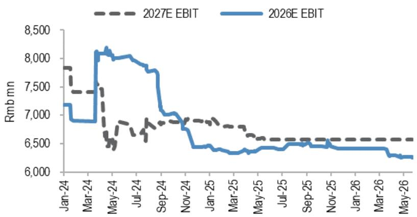

line chart

| Month    | 2026E EBIT | 2027E EBIT |
| -------- | ---------- | ---------- |
| Jan-24   | 7200       | 7800       |
| Mar-24   | 8100       | 7400       |
| May-24   | 8000       | 6500       |
| Jul-24   | 7900       | 6800       |
| Sep-24   | 7000       | 6900       |
| Nov-24   | 6500       | 6900       |
| Jan-25   | 6400       | 6800       |
| Mar-25   | 6300       | 6700       |
| May-25   | 6400       | 6600       |
| Jul-25   | 6500       | 6500       |
| Sep-25   | 6400       | 6500       |
| Nov-25   | 6300       | 6500       |
| Jan-26   | 6300       | 6500       |
| Mar-26   | 6300       | 6500       |
| May-26   | 6200       | 6500       |

Source: Bloomberg Finance L.P. estimates.

Tsingtao (A) - Share price vs consensus forward EPS  
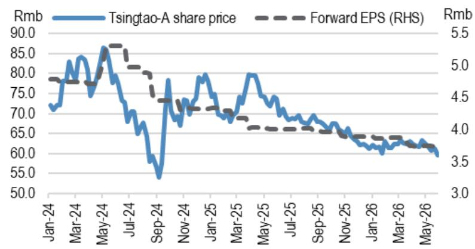

line chart

| Date   | Tsingtao-A share price | Forward EPS (RHS) |
|--------|------------------------|-------------------|
| Jan-24 | 72.0                   | 4.8               |
| Mar-24 | 85.0                   | 4.9               |
| May-24 | 87.0                   | 5.1               |
| Jul-24 | 70.0                   | 4.9               |
| Sep-24 | 55.0                   | 4.5               |
| Nov-24 | 78.0                   | 4.3               |
| Jan-25 | 70.0                   | 4.2               |
| Mar-25 | 78.0                   | 4.1               |
| May-25 | 75.0                   | 4.0               |
| Jul-25 | 70.0                   | 3.9               |
| Sep-25 | 68.0                   | 3.8               |
| Nov-25 | 65.0                   | 3.7               |
| Jan-26 | 62.0                   | 3.6               |
| Mar-26 | 60.0                   | 3.5               |
| May-26 | 58.0                   | 3.4               |

Source: Bloomberg Finance L.P.

Tsingtao (A) 12-month rolling P/E  
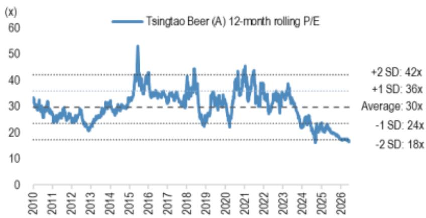

line chart

| Year | Tsingtao Beer (A) 12-month rolling P/E |
|------|----------------------------------------|
| 2010 | ~30                                    |
| 2011 | ~28                                    |
| 2012 | ~25                                    |
| 2013 | ~20                                    |
| 2014 | ~25                                    |
| 2015 | ~35                                    |
| 2016 | ~55                                    |
| 2017 | ~35                                    |
| 2018 | ~45                                    |
| 2019 | ~30                                    |
| 2020 | ~25                                    |
| 2021 | ~45                                    |
| 2022 | ~35                                    |
| 2023 | ~30                                    |
| 2024 | ~25                                    |
| 2025 | ~18                                    |
| 2026 | ~15                                    |

Source: JPM, Bloomberg Finance L.P.

Tsingtao (A) 12-month rolling P/E band chart  
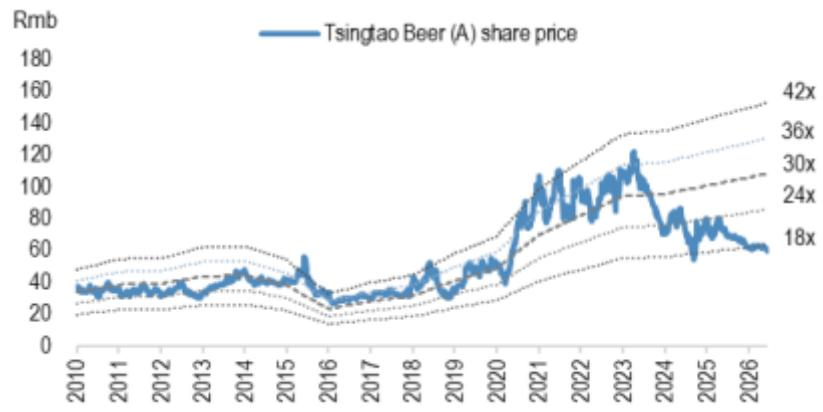

line chart

| Year | Tsingtao Beer (A) share price |
|------|-------------------------------|
| 2010 | ~35                           |
| 2011 | ~38                           |
| 2012 | ~40                           |
| 2013 | ~42                           |
| 2014 | ~45                           |
| 2015 | ~50                           |
| 2016 | ~30                           |
| 2017 | ~35                           |
| 2018 | ~45                           |
| 2019 | ~55                           |
| 2020 | ~70                           |
| 2021 | ~90                           |
| 2022 | ~105                          |
| 2023 | ~120                          |
| 2024 | ~80                           |
| 2025 | ~60                           |
| 2026 | ~55                           |

Source: JPM, Bloomberg Finance L.P.

# Moutai: DTC reform anchors early recovery; patience & catalysts needed

Moutai – Key operating and financial metrics

<table><tr><td>P&amp;L, FYE Dec 31 (Rmb mn)</td><td>2022</td><td>2023</td><td>2024</td><td>1Q25</td><td>2Q25</td><td>3Q25</td><td>4Q25</td><td>2025</td><td>2026E</td><td>2027E</td><td>2028E</td></tr><tr><td>Gross sales (including Fin Sub)</td><td>127,554</td><td>150,560</td><td>174,144</td><td>51,443</td><td>39,650</td><td>39,810</td><td>41,150</td><td>172,054</td><td>173,704</td><td>184,865</td><td>195,819</td></tr><tr><td>- yoy growth</td><td>16.5%</td><td>18.0%</td><td>15.7%</td><td>10.7%</td><td>7.3%</td><td>0.3%</td><td>-19.3%</td><td>-1.2%</td><td>1.0%</td><td>6.4%</td><td>5.9%</td></tr><tr><td>Gross sales (ex Fin Sub)</td><td>124,100</td><td>147,694</td><td>170,899</td><td>50,601</td><td>38,788</td><td>39,064</td><td>40,384</td><td>168,838</td><td>170,412</td><td>181,314</td><td>191,884</td></tr><tr><td>- Premium liquor</td><td>107,834</td><td>126,589</td><td>145,928</td><td>43,557</td><td>32,032</td><td>34,924</td><td>35,986</td><td>146,500</td><td>153,092</td><td>162,400</td><td>171,524</td></tr><tr><td>- Series liquor</td><td>15,939</td><td>20,630</td><td>24,684</td><td>7,022</td><td>6,740</td><td>4,122</td><td>4,390</td><td>22,275</td><td>17,250</td><td>18,837</td><td>20,276</td></tr><tr><td>- Others (Moutai Hotel &amp; Moutai ice cream)</td><td>328</td><td>475</td><td>287</td><td>21</td><td>16</td><td>19</td><td>8</td><td>64</td><td>70</td><td>77</td><td>85</td></tr><tr><td>Gross sales yoy (%)</td><td>16.9%</td><td>19.0%</td><td>15.7%</td><td>10.5%</td><td>7.3%</td><td>0.6%</td><td>-19.4%</td><td>-1.2%</td><td>0.9%</td><td>6.4%</td><td>5.8%</td></tr><tr><td>- Premium liquor</td><td>15.4%</td><td>17.4%</td><td>15.3%</td><td>9.7%</td><td>11.0%</td><td>7.3%</td><td>-19.7%</td><td>0.4%</td><td>4.5%</td><td>6.1%</td><td>5.6%</td></tr><tr><td>- Series liquor</td><td>26.5%</td><td>29.4%</td><td>19.7%</td><td>18.3%</td><td>-6.5%</td><td>-34.0%</td><td>-17.0%</td><td>-9.8%</td><td>-22.6%</td><td>9.2%</td><td>7.6%</td></tr><tr><td>Sales volume yoy (%)</td><td>2.6%</td><td>7.5%</td><td>13.7%</td><td></td><td></td><td></td><td></td><td>2.1%</td><td>0.1%</td><td>4.8%</td><td>4.4%</td></tr><tr><td>- Premium liquor</td><td>4.5%</td><td>11.1%</td><td>10.2%</td><td></td><td></td><td></td><td></td><td>0.7%</td><td>10.0%</td><td>4.0%</td><td>4.0%</td></tr><tr><td>- Series liquor (incl 1935)</td><td>0.3%</td><td>2.9%</td><td>18.5%</td><td></td><td></td><td></td><td></td><td>3.9%</td><td>-12.0%</td><td>6.0%</td><td>5.0%</td></tr><tr><td>ASP yoy (%)</td><td>13.7%</td><td>10.7%</td><td>1.9%</td><td></td><td></td><td></td><td></td><td>-3.1%</td><td>0.8%</td><td>1.5%</td><td>1.4%</td></tr><tr><td>- Premium liquor</td><td>10.4%</td><td>5.7%</td><td>4.6%</td><td></td><td></td><td></td><td></td><td>-0.3%</td><td>-5.0%</td><td>2.0%</td><td>1.6%</td></tr><tr><td>- Series liquor</td><td>26.1%</td><td>25.7%</td><td>1.0%</td><td></td><td></td><td></td><td></td><td>-13.1%</td><td>-12.0%</td><td>3.0%</td><td>2.5%</td></tr><tr><td>Direct sales channel:</td><td></td><td></td><td></td><td></td><td></td><td></td><td></td><td></td><td></td><td></td><td></td></tr><tr><td>- % of total revenue</td><td>39.9%</td><td>45.7%</td><td>43.9%</td><td></td><td></td><td></td><td></td><td>50.1%</td><td>56.4%</td><td>57.2%</td><td>56.2%</td></tr><tr><td>- % of total volume</td><td>16.4%</td><td>21.3%</td><td>21.9%</td><td></td><td></td><td></td><td></td><td>25.0%</td><td>33.5%</td><td>33.7%</td><td>33.2%</td></tr><tr><td>Net sales</td><td>105,604</td><td>125,459</td><td>143,973</td><td>43,436</td><td>32,011</td><td>32,361</td><td>33,676</td><td>141,484</td><td>142,803</td><td>151,940</td><td>160,798</td></tr><tr><td>Net sales yoy (%)</td><td>16.2%</td><td>18.8%</td><td>14.8%</td><td>12.6%</td><td>7.2%</td><td>-0.2%</td><td>-21.9%</td><td>-1.7%</td><td>0.9%</td><td>6.4%</td><td>5.8%</td></tr><tr><td>COGS</td><td>(10,093)</td><td>(11,867)</td><td>(13,789)</td><td>(4,061)</td><td>(3,716)</td><td>(3,406)</td><td>(3,708)</td><td>(14,892)</td><td>(17,044)</td><td>(18,212)</td><td>(19,331)</td></tr><tr><td>Gross profit</td><td>95,511</td><td>113,592</td><td>130,184</td><td>39,375</td><td>28,295</td><td>28,955</td><td>29,968</td><td>126,592</td><td>125,759</td><td>133,727</td><td>141,466</td></tr><tr><td>- Gross margin (% net sales)</td><td>90.4%</td><td>90.5%</td><td>90.4%</td><td>90.6%</td><td>88.4%</td><td>89.5%</td><td>89.0%</td><td>89.5%</td><td>88.1%</td><td>88.0%</td><td>88.0%</td></tr><tr><td>- Gross margin (% of gross sales)</td><td>91.9%</td><td>92.0%</td><td>91.9%</td><td>92.0%</td><td>90.4%</td><td>91.3%</td><td>90.8%</td><td>91.2%</td><td>90.0%</td><td>90.0%</td><td>89.9%</td></tr><tr><td>SG&amp;A</td><td>(12,445)</td><td>(14,535)</td><td>(15,173)</td><td>(3,442)</td><td>(3,587)</td><td>(3,066)</td><td>(5,669)</td><td>(15,764)</td><td>(14,285)</td><td>(14,743)</td><td>(15,602)</td></tr><tr><td>SG&amp;A / net sales (%)</td><td>-11.8%</td><td>-11.6%</td><td>-10.5%</td><td>-7.9%</td><td>-11.2%</td><td>-9.5%</td><td>-16.8%</td><td>-11.1%</td><td>-10.0%</td><td>-9.7%</td><td>-9.7%</td></tr><tr><td>SG&amp;A / gross sales (%)</td><td>-10.0%</td><td>-9.8%</td><td>-8.9%</td><td>-6.8%</td><td>-9.2%</td><td>-7.8%</td><td>-14.0%</td><td>-9.3%</td><td>-8.4%</td><td>-8.1%</td><td>-8.1%</td></tr><tr><td>Operating profits</td><td>83,065</td><td>99,057</td><td>115,010</td><td>35,933</td><td>24,707</td><td>25,888</td><td>24,299</td><td>110,828</td><td>111,475</td><td>118,984</td><td>125,864</td></tr><tr><td>- OP yoy (%)</td><td>17.6%</td><td>19.3%</td><td>16.1%</td><td>12.4%</td><td>6.6%</td><td>2.1%</td><td>-29.6%</td><td>-3.6%</td><td>0.6%</td><td>6.7%</td><td>5.8%</td></tr><tr><td>- OP margin (% of net sales)</td><td>78.7%</td><td>79.0%</td><td>79.9%</td><td>82.7%</td><td>77.2%</td><td>80.0%</td><td>72.2%</td><td>78.3%</td><td>78.1%</td><td>78.3%</td><td>78.3%</td></tr><tr><td>- OP margin (% of gross sales)</td><td>66.9%</td><td>67.1%</td><td>67.3%</td><td>71.0%</td><td>63.7%</td><td>66.3%</td><td>60.2%</td><td>65.6%</td><td>65.4%</td><td>65.6%</td><td>65.6%</td></tr><tr><td>Profit before tax</td><td>87,701</td><td>103,663</td><td>119,639</td><td>37,031</td><td>25,747</td><td>26,625</td><td>25,352</td><td>114,755</td><td>115,646</td><td>123,644</td><td>131,058</td></tr><tr><td>Net profits</td><td>62,716</td><td>74,734</td><td>86,228</td><td>26,847</td><td>18,555</td><td>19,224</td><td>17,693</td><td>82,320</td><td>82,963</td><td>88,701</td><td>94,020</td></tr><tr><td>- NP yoy (%)</td><td>19.6%</td><td>19.2%</td><td>15.4%</td><td>11.6%</td><td>5.2%</td><td>0.5%</td><td>-30.3%</td><td>-4.5%</td><td>0.8%</td><td>6.9%</td><td>6.0%</td></tr><tr><td>- NP margin (% of net sales)</td><td>59.4%</td><td>59.6%</td><td>59.9%</td><td>61.8%</td><td>58.0%</td><td>59.4%</td><td>52.5%</td><td>58.2%</td><td>58.1%</td><td>58.4%</td><td>58.5%</td></tr><tr><td>- NP margin (% of gross sales)</td><td>50.5%</td><td>50.6%</td><td>50.5%</td><td>53.1%</td><td>47.8%</td><td>49.2%</td><td>43.8%</td><td>48.8%</td><td>48.7%</td><td>48.9%</td><td>49.0%</td></tr><tr><td>Cash flow quality:</td><td></td><td></td><td></td><td></td><td></td><td></td><td></td><td></td><td></td><td></td><td></td></tr><tr><td>Cash sales</td><td>140,692</td><td>163,700</td><td>182,645</td><td>56,144</td><td>38,943</td><td>43,705</td><td>45,199</td><td>183,990</td><td></td><td></td><td></td></tr><tr><td>- yoy growth (%)</td><td>17.9%</td><td>16.4%</td><td>11.6%</td><td>21.4%</td><td>-4.6%</td><td>2.6%</td><td>-14.7%</td><td>0.7%</td><td></td><td></td><td></td></tr><tr><td>Deferred revenue (&quot;customer advance&quot;)</td><td>15,472</td><td>14,126</td><td>9,592</td><td>8,788</td><td>5,507</td><td>7,749</td><td>8,007</td><td>8,007</td><td></td><td></td><td></td></tr><tr><td>- yoy growth (%)</td><td>21.6%</td><td>-8.7%</td><td>-32.1%</td><td>-7.7%</td><td>-44.9%</td><td>-22.0%</td><td>-16.5%</td><td>-16.5%</td><td></td><td></td><td></td></tr></table>

## Moutai: DTC reform anchors early recovery; patience & catalysts needed

Moutai - Consensus EBIT revisions  
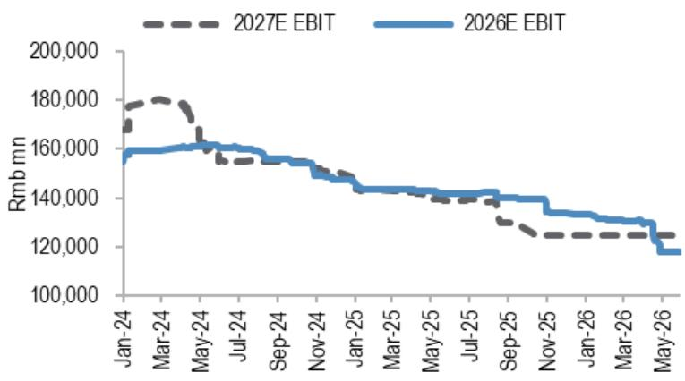

line chart

| Month    | 2027E EBIT | 2026E EBIT |
| -------- | ---------- | ---------- |
| Jan-24   | 180,000    | 160,000    |
| Mar-24   | 180,000    | 160,000    |
| May-24   | 160,000    | 160,000    |
| Jul-24   | 155,000    | 155,000    |
| Sep-24   | 150,000    | 150,000    |
| Nov-24   | 145,000    | 145,000    |
| Jan-25   | 140,000    | 140,000    |
| Mar-25   | 135,000    | 135,000    |
| May-25   | 135,000    | 135,000    |
| Jul-25   | 135,000    | 135,000    |
| Sep-25   | 135,000    | 135,000    |
| Nov-25   | 135,000    | 135,000    |
| Jan-26   | 135,000    | 135,000    |
| Mar-26   | 135,000    | 135,000    |
| May-26   | 135,000    | 135,000    |

Source: Bloomberg Finance L.P. estimates.

Moutai - Share price vs consensus forward EPS  
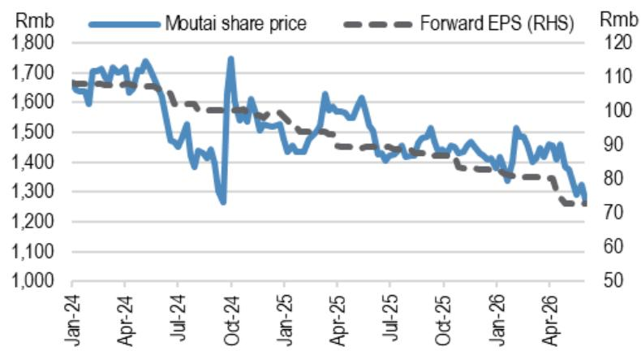

line chart

| Date   | Moutai share price | Forward EPS (RHS) |
|--------|--------------------|-------------------|
| Jan-24 | 1,650              | 110               |
| Apr-24 | 1,750              | 105               |
| Jul-24 | 1,500              | 100               |
| Oct-24 | 1,250              | 95                |
| Jan-25 | 1,550              | 90                |
| Apr-25 | 1,600              | 85                |
| Jul-25 | 1,450              | 80                |
| Oct-25 | 1,500              | 75                |
| Jan-26 | 1,350              | 70                |
| Apr-26 | 1,250              | 65                |

Source: Bloomberg Finance L.P.

Moutai 12-month rolling P/E  
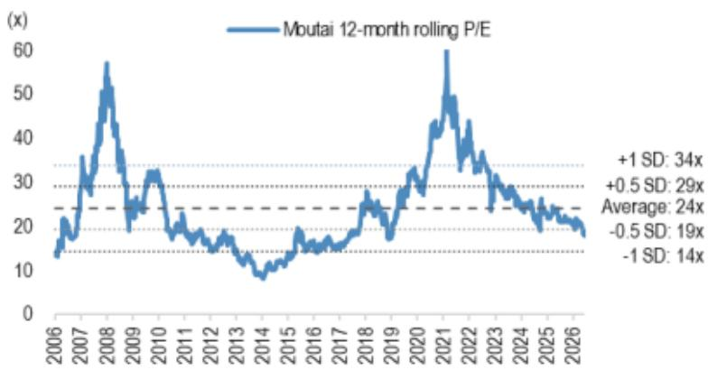

line chart

| Year | Moutai 12-month rolling P/E |
|------|-----------------------------|
| 2006 | ~15x                        |
| 2007 | ~35x                        |
| 2008 | ~58x                        |
| 2009 | ~25x                        |
| 2010 | ~32x                        |
| 2011 | ~20x                        |
| 2012 | ~18x                        |
| 2013 | ~15x                        |
| 2014 | ~10x                        |
| 2015 | ~15x                        |
| 2016 | ~18x                        |
| 2017 | ~20x                        |
| 2018 | ~25x                        |
| 2019 | ~30x                        |
| 2020 | ~35x                        |
| 2021 | ~60x                        |
| 2022 | ~45x                        |
| 2023 | ~35x                        |
| 2024 | ~30x                        |
| 2025 | ~25x                        |
| 2026 | ~20x                        |

Source: JPM, Bloomberg Finance L.P.

Moutai 12-month rolling P/E band chart  
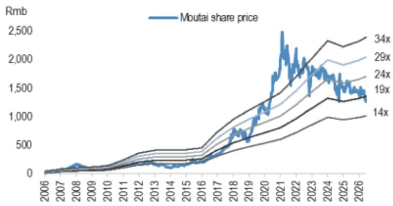

line chart

| Year | Moutai share price |
|------|---------------------|
| 2026 | 14x                 |
| 2025 | 19x                 |
| 2024 | 24x                 |
| 2023 | 29x                 |
| 2022 | 34x                 |

Source: JPM, Bloomberg Finance L.P.

# Wuliangye: “Accounting error” corrected, trust needs to be rebuilt

## Wuliangye's accounting error correction and our reading

P&L and balance sheet items were restated, while cash flow statement was not restated

<table><tr><td rowspan="2">P&amp;L, FYE Dec 31 (Rmb mn)</td><td colspan="5">Restated</td><td colspan="4">Previously</td><td colspan="4">Change</td><td colspan="4">Change %</td></tr><tr><td>1Q25</td><td>2Q25</td><td>3Q25</td><td>9M25</td><td>FY25</td><td>1Q25</td><td>2Q25</td><td>3Q25</td><td>9M25</td><td>1Q25</td><td>2Q25</td><td>3Q25</td><td>9M25</td><td>1Q25</td><td>2Q25</td><td>3Q25</td><td>9M25</td></tr><tr><td>Gross sales</td><td>17,086</td><td>6,424</td><td>7,128</td><td>30,638</td><td>40,529</td><td>36,940</td><td>15,831</td><td>8,174</td><td>60,945</td><td>(19,855)</td><td>(9,406)</td><td>(1,047)</td><td>(30,308)</td><td>-54%</td><td>-59%</td><td>-13%</td><td>-50%</td></tr><tr><td>Net sales</td><td>11,681</td><td>3,978</td><td>5,863</td><td>21,521</td><td>29,490</td><td>31,535</td><td>13,384</td><td>6,910</td><td>51,829</td><td>(19,855)</td><td>(9,406)</td><td>(1,047)</td><td>(30,308)</td><td>-63%</td><td>-70%</td><td>-15%</td><td>-58%</td></tr><tr><td>COGS</td><td>(3,576)</td><td>(1,628)</td><td>(2,234)</td><td>(7,437)</td><td>(9,102)</td><td>(8,222)</td><td>(4,006)</td><td>(3,054)</td><td>(15,282)</td><td></td><td></td><td></td><td></td><td>-57%</td><td>-59%</td><td>-27%</td><td>-51%</td></tr><tr><td>Gross profit</td><td>8,105</td><td>2,350</td><td>3,630</td><td>14,084</td><td>20,388</td><td>23,313</td><td>9,378</td><td>3,856</td><td>36,547</td><td>(15,209)</td><td>(7,028)</td><td>(227)</td><td>(22,463)</td><td>-65%</td><td>-75%</td><td>-6%</td><td>-61%</td></tr><tr><td>- Gross margin (% of net sales)</td><td>69.4%</td><td>59.1%</td><td>61.9%</td><td>65.4%</td><td>69.1%</td><td>73.9%</td><td>70.1%</td><td>55.8%</td><td>70.5%</td><td></td><td></td><td></td><td></td><td></td><td></td><td></td><td></td></tr><tr><td>SG&amp;A</td><td>(2,641)</td><td>(2,781)</td><td>(1,929)</td><td>(7,351)</td><td>(11,174)</td><td>(3,554)</td><td>(3,764)</td><td>(1,929)</td><td>(9,248)</td><td>914</td><td>983</td><td>0</td><td>1,897</td><td>-26%</td><td>-26%</td><td>0%</td><td>-21%</td></tr><tr><td>Operating profits</td><td>5,464</td><td>(431)</td><td>1,700</td><td>6,733</td><td>9,214</td><td>19,759</td><td>5,613</td><td>1,927</td><td>27,300</td><td>(14,295)</td><td>(6,045)</td><td>(227)</td><td>(20,567)</td><td>-72%</td><td>-108%</td><td>-12%</td><td>-75%</td></tr><tr><td>Income tax expense</td><td>(1,489)</td><td>(9)</td><td>(584)</td><td>(2,083)</td><td>(2,882)</td><td>(5,063)</td><td>(1,521)</td><td>(641)</td><td>(7,224)</td><td>3,574</td><td>1,511</td><td>57</td><td>5,142</td><td>-71%</td><td>-99%</td><td>-9%</td><td>-71%</td></tr><tr><td>Minus: Minority interest</td><td>230</td><td>26</td><td>56</td><td>312</td><td>363</td><td>508</td><td>136</td><td>57</td><td>701</td><td>(277)</td><td>(109)</td><td>(1)</td><td>(388)</td><td>-55%</td><td>-81%</td><td>-2%</td><td>-55%</td></tr><tr><td>Net profits</td><td>4,416</td><td>208</td><td>1,851</td><td>6,475</td><td>8,954</td><td>14,860</td><td>4,632</td><td>2,019</td><td>21,511</td><td>(10,444)</td><td>(4,424)</td><td>(169)</td><td>(15,037)</td><td>-70%</td><td>-96%</td><td>-8%</td><td>-70%</td></tr><tr><td>- Net margin (% of net sales)</td><td>37.8%</td><td>5.2%</td><td>31.6%</td><td>30.1%</td><td>30.4%</td><td>47.1%</td><td>34.6%</td><td>29.2%</td><td>41.5%</td><td></td><td></td><td></td><td></td><td></td><td></td><td></td><td></td></tr></table>

<table><tr><td rowspan="2">BS, as of Dec 31 (Rmb mn)</td><td colspan="5">Restated</td><td colspan="4">Previously</td><td colspan="4">Change</td><td colspan="4">Chg%</td></tr><tr><td>1Q25</td><td>2Q25</td><td>3Q25</td><td>9M25</td><td>FY25</td><td>1Q25</td><td>2Q25</td><td>3Q25</td><td>9M25</td><td>1Q25</td><td>2Q25</td><td>3Q25</td><td>9M25</td><td>1Q25</td><td>2Q25</td><td>3Q25</td><td>9M25</td></tr><tr><td>Current assets</td><td>178,844</td><td>178,499</td><td>166,127</td><td>166,127</td><td>164,752</td><td>175,463</td><td>170,504</td><td>157,724</td><td>157,724</td><td>3,381</td><td>7,995</td><td>8,403</td><td>8,403</td><td>2%</td><td>5%</td><td>5%</td><td>5%</td></tr><tr><td>Other current assets</td><td>3,499</td><td>8,187</td><td>8,547</td><td>8,547</td><td>7,968</td><td>118</td><td>191</td><td>144</td><td>144</td><td>3,381</td><td>7,995</td><td>8,403</td><td>8,403</td><td>2860%</td><td>4177%</td><td>5833%</td><td>5833%</td></tr><tr><td>* Input VAT to be deducted</td><td></td><td></td><td></td><td></td><td>135</td><td></td><td></td><td></td><td></td><td></td><td></td><td></td><td></td><td></td><td></td><td></td><td></td></tr><tr><td>* Prepaid VAT and corp income tax</td><td></td><td></td><td></td><td></td><td>2,926</td><td></td><td></td><td></td><td></td><td></td><td></td><td></td><td></td><td></td><td></td><td></td><td></td></tr><tr><td>* Supervised goods 监管商品</td><td></td><td></td><td></td><td></td><td>4,907</td><td></td><td></td><td></td><td></td><td></td><td></td><td></td><td></td><td></td><td></td><td></td><td></td></tr><tr><td>Non-current assets</td><td>23,606</td><td>24,481</td><td>25,054</td><td>25,054</td><td>25,233</td><td>22,517</td><td>22,911</td><td>23,349</td><td>23,349</td><td>1,089</td><td>1,570</td><td>1,705</td><td>1,705</td><td>5%</td><td>7%</td><td>7%</td><td>7%</td></tr><tr><td>Deferred income tax assets</td><td>4,165</td><td>4,720</td><td>4,901</td><td>4,901</td><td>4,813</td><td>3,076</td><td>3,150</td><td>3,196</td><td>3,196</td><td>1,089</td><td>1,570</td><td>1,705</td><td>1,705</td><td>35%</td><td>50%</td><td>53%</td><td>53%</td></tr><tr><td>Total assets</td><td>202,450</td><td>202,981</td><td>191,181</td><td>191,181</td><td>189,984</td><td>197,980</td><td>193,415</td><td>181,073</td><td>181,073</td><td>4,470</td><td>9,565</td><td>10,108</td><td>10,108</td><td>2%</td><td>5%</td><td>6%</td><td>6%</td></tr><tr><td>Current liabilities</td><td>60,683</td><td>73,497</td><td>59,906</td><td>59,906</td><td>67,352</td><td>45,492</td><td>48,677</td><td>34,373</td><td>34,373</td><td>15,191</td><td>24,820</td><td>25,533</td><td>25,533</td><td>33%</td><td>51%</td><td>74%</td><td>74%</td></tr><tr><td>Tax payable</td><td>5,683</td><td>3,931</td><td>1,544</td><td>1,544</td><td>2,093</td><td>8,168</td><td>4,540</td><td>1,556</td><td>1,556</td><td>(2,485)</td><td>(609)</td><td>(12)</td><td>(12)</td><td>-30%</td><td>-13%</td><td>-1%</td><td>-1%</td></tr><tr><td>Other payable</td><td>10,616</td><td>17,009</td><td>7,449</td><td>7,449</td><td>10,186</td><td>11,530</td><td>18,905</td><td>9,346</td><td>9,346</td><td>(914)</td><td>(1,897)</td><td>(1,897)</td><td>(1,897)</td><td>-8%</td><td>-10%</td><td>-20%</td><td>-20%</td></tr><tr><td>Other current liabilities</td><td>19,093</td><td>27,326</td><td>27,827</td><td>27,827</td><td>27,029</td><td>504</td><td>423</td><td>386</td><td>386</td><td>18,589</td><td>26,903</td><td>27,442</td><td>27,442</td><td>2048%</td><td>3378%</td><td>3636%</td><td>3636%</td></tr><tr><td>* Output tax to be transferred</td><td></td><td></td><td></td><td></td><td>714</td><td></td><td></td><td></td><td></td><td></td><td></td><td></td><td></td><td></td><td></td><td></td><td></td></tr><tr><td>* Payables for supervised goods 应付监管商品款项</td><td></td><td></td><td></td><td></td><td>26,315</td><td></td><td></td><td></td><td></td><td></td><td></td><td></td><td></td><td></td><td></td><td></td><td></td></tr><tr><td>Total liabilities</td><td>61,408</td><td>74,104</td><td>60,406</td><td>60,406</td><td>67,804</td><td>46,217</td><td>49,284</td><td>34,873</td><td>34,873</td><td>15,191</td><td>24,820</td><td>25,533</td><td>25,533</td><td>33%</td><td>50%</td><td>73%</td><td>73%</td></tr><tr><td>Ownership equity</td><td>137,702</td><td>125,608</td><td>127,459</td><td>127,459</td><td>119,932</td><td>148,146</td><td>140,476</td><td>142,496</td><td>142,496</td><td>(10,444)</td><td>(14,868)</td><td>(15,037)</td><td>(15,037)</td><td>-7%</td><td>-11%</td><td>-11%</td><td>-11%</td></tr><tr><td>Retained earning</td><td>92,073</td><td>79,980</td><td>81,830</td><td>81,830</td><td>70,419</td><td>102,517</td><td>94,848</td><td>96,867</td><td>96,867</td><td>(10,444)</td><td>(14,868)</td><td>(15,037)</td><td>(15,037)</td><td>-10%</td><td>-16%</td><td>-16%</td><td>-16%</td></tr><tr><td>Minority interest</td><td>3,340</td><td>3,268</td><td>3,317</td><td>3,317</td><td>2,248</td><td>3,617</td><td>3,655</td><td>3,705</td><td>3,705</td><td>(277)</td><td>(387)</td><td>(388)</td><td>(388)</td><td>-8%</td><td>-11%</td><td>-10%</td><td>-10%</td></tr><tr><td>Shareholder equity</td><td>141,041</td><td>128,876</td><td>130,776</td><td>130,776</td><td>122,181</td><td>151,763</td><td>144,131</td><td>146,200</td><td>146,200</td><td>(10,721)</td><td>(15,255)</td><td>(15,425)</td><td>(15,425)</td><td>-7%</td><td>-11%</td><td>-11%</td><td>-11%</td></tr></table>

\* Supervised goods 监管商品  
\* Payables for supervised goods 应付监管商品款项  
\* Net payables  
\* Deducted net sales  
Revenue was recognized, but the goods are still sitting in the company's warehouse (valued at production cost)  
Payment was received but goods were not shipped, so revenue cannot be recognized (valued at ex-factory price)  
Revenue reversed for the portion where goods have not been shipped

## Wuliangye: “Accounting error” corrected, trust needs to be rebuilt

Wuliangye – Key operating and financial metrics

<table><tr><td>P&amp;L, FYE Dec 31 (Rmb mn)</td><td>2022</td><td>2023</td><td>2024</td><td>1Q25</td><td>2Q25</td><td>3Q25</td><td>4Q25</td><td>2025</td><td>2026E</td><td>2027E</td><td>2028E</td></tr><tr><td>Gross sales</td><td>73,969</td><td>83,272</td><td>89,175</td><td>17,086</td><td>6,424</td><td>7,128</td><td>9,891</td><td>40,529</td><td>54,418</td><td>57,456</td><td>60,486</td></tr><tr><td>- Premium liquor</td><td>55,335</td><td>62,804</td><td>67,875</td><td></td><td></td><td></td><td></td><td>27,936</td><td>40,878</td><td>43,435</td><td>45,967</td></tr><tr><td>- Series liquor</td><td>12,227</td><td>13,643</td><td>15,251</td><td></td><td></td><td></td><td></td><td>9,168</td><td>10,286</td><td>10,702</td><td>11,134</td></tr><tr><td>- Other business</td><td>6,406</td><td>6,825</td><td>6,048</td><td></td><td></td><td></td><td></td><td>3,425</td><td>3,253</td><td>3,318</td><td>3,385</td></tr><tr><td>Gross sales yoy (%)</td><td>11.7%</td><td>12.6%</td><td>7.1%</td><td>-50.9%</td><td>-59.4%</td><td>-58.7%</td><td>-53.5%</td><td>-54.6%</td><td>34.3%</td><td>5.6%</td><td>5.3%</td></tr><tr><td>- Premium liquor</td><td>12.7%</td><td>13.5%</td><td>8.1%</td><td></td><td></td><td></td><td></td><td>-58.8%</td><td>46.3%</td><td>6.3%</td><td>5.8%</td></tr><tr><td>- Series liquor</td><td>-3.1%</td><td>11.6%</td><td>11.8%</td><td></td><td></td><td></td><td></td><td>-39.9%</td><td>12.2%</td><td>4.0%</td><td>4.0%</td></tr><tr><td>Sales volume yoy (%)</td><td>-30.0%</td><td>25.1%</td><td>1.8%</td><td></td><td></td><td></td><td></td><td>-30.3%</td><td>14.5%</td><td>2.6%</td><td>2.6%</td></tr><tr><td>- Premium liquor</td><td>12.2%</td><td>18.0%</td><td>7.1%</td><td></td><td></td><td></td><td></td><td>-53.0%</td><td>36.0%</td><td>5.0%</td><td>5.0%</td></tr><tr><td>- Series liquor</td><td>-38.1%</td><td>27.6%</td><td>0.1%</td><td></td><td></td><td></td><td></td><td>-22.5%</td><td>10.0%</td><td>2.0%</td><td>2.0%</td></tr><tr><td>ASP yoy (%)</td><td>56.5%</td><td>-9.6%</td><td>6.8%</td><td></td><td></td><td></td><td></td><td>-36.0%</td><td>20.5%</td><td>3.1%</td><td>2.8%</td></tr><tr><td>- Premium liquor</td><td>0.4%</td><td>-3.8%</td><td>0.9%</td><td></td><td></td><td></td><td></td><td>-12.4%</td><td>7.6%</td><td>1.2%</td><td>0.8%</td></tr><tr><td>- Series liquor</td><td>56.6%</td><td>-12.6%</td><td>11.7%</td><td></td><td></td><td></td><td></td><td>-22.5%</td><td>2.0%</td><td>2.0%</td><td>2.0%</td></tr><tr><td>Net sales</td><td>63,220</td><td>70,740</td><td>76,134</td><td>11,681</td><td>3,978</td><td>5,863</td><td>7,969</td><td>29,490</td><td>46,410</td><td>48,986</td><td>51,556</td></tr><tr><td>Net sales yoy (%)</td><td>12.1%</td><td>11.9%</td><td>7.6%</td><td>-61.0%</td><td>-70.5%</td><td>-60.1%</td><td>-55.6%</td><td>-61.3%</td><td>57.4%</td><td>5.6%</td><td>5.2%</td></tr><tr><td>COGS</td><td>(18,178)</td><td>(20,157)</td><td>(20,461)</td><td>(3,576)</td><td>(1,628)</td><td>(2,234)</td><td>(4,339)</td><td>(9,102)</td><td>(12,851)</td><td>(13,235)</td><td>(13,810)</td></tr><tr><td>Gross profit</td><td>45,041</td><td>50,583</td><td>55,673</td><td>8,105</td><td>2,350</td><td>3,630</td><td>3,630</td><td>20,388</td><td>33,558</td><td>35,751</td><td>37,746</td></tr><tr><td>- Gross margin (% of net sales)</td><td>71.2%</td><td>71.5%</td><td>73.1%</td><td>69.4%</td><td>59.1%</td><td>61.9%</td><td>45.5%</td><td>69.1%</td><td>72.3%</td><td>73.0%</td><td>73.2%</td></tr><tr><td>- Gross margin (% of gross sales)</td><td>75.4%</td><td>75.8%</td><td>77.1%</td><td>79.1%</td><td>74.7%</td><td>68.7%</td><td>56.1%</td><td>77.5%</td><td>76.4%</td><td>77.0%</td><td>77.2%</td></tr><tr><td>SG&amp;A</td><td>(10,148)</td><td>(11,438)</td><td>(14,653)</td><td>(2,641)</td><td>(2,781)</td><td>(1,929)</td><td>(3,823)</td><td>(11,174)</td><td>(13,981)</td><td>(11,892)</td><td>(11,020)</td></tr><tr><td>SG&amp;A / net sales (%)</td><td>-16.1%</td><td>-16.2%</td><td>-19.2%</td><td>-22.6%</td><td>-69.9%</td><td>-32.9%</td><td>-48.0%</td><td>-37.9%</td><td>-30.1%</td><td>-24.3%</td><td>-21.4%</td></tr><tr><td>SG&amp;A / gross sales (%)</td><td>-13.7%</td><td>-13.7%</td><td>-16.4%</td><td>-15.5%</td><td>-43.3%</td><td>-27.1%</td><td>-38.7%</td><td>-27.6%</td><td>-25.7%</td><td>-20.7%</td><td>-18.2%</td></tr><tr><td>Operating profits</td><td>34,893</td><td>39,146</td><td>41,020</td><td>5,464</td><td>(431)</td><td>1,700</td><td>(194)</td><td>9,214</td><td>19,577</td><td>23,860</td><td>26,726</td></tr><tr><td>- OP yoy (%)</td><td>14.3%</td><td>12.2%</td><td>4.8%</td><td>-70.8%</td><td>-107.1%</td><td>-77.0%</td><td>-102.2%</td><td>-77.5%</td><td>112.5%</td><td>21.9%</td><td>12.0%</td></tr><tr><td>- OP margin (% of net sales)</td><td>55.2%</td><td>55.3%</td><td>53.9%</td><td>46.8%</td><td>-10.8%</td><td>29.0%</td><td>-2.4%</td><td>31.2%</td><td>42.2%</td><td>48.7%</td><td>51.8%</td></tr><tr><td>- OP margin (% of gross sales)</td><td>47.2%</td><td>47.0%</td><td>46.0%</td><td>32.0%</td><td>-6.7%</td><td>23.9%</td><td>-2.0%</td><td>22.7%</td><td>36.0%</td><td>41.5%</td><td>44.2%</td></tr><tr><td>PBT</td><td>37,104</td><td>41,913</td><td>44,163</td><td>6,136</td><td>243</td><td>2,491</td><td>655</td><td>12,199</td><td>22,260</td><td>26,456</td><td>29,357</td></tr><tr><td>Net profits</td><td>26,691</td><td>30,211</td><td>31,853</td><td>4,416</td><td>208</td><td>1,851</td><td>(194)</td><td>8,954</td><td>16,087</td><td>19,120</td><td>21,217</td></tr><tr><td>- NP yoy (%)</td><td>14.2%</td><td>13.2%</td><td>5.4%</td><td>-68.6%</td><td>-95.9%</td><td>-68.5%</td><td>-102.8%</td><td>-71.9%</td><td>79.7%</td><td>18.9%</td><td>11.0%</td></tr><tr><td>- Net margin (% of net sales)</td><td>42.2%</td><td>42.7%</td><td>41.8%</td><td>37.8%</td><td>5.2%</td><td>31.6%</td><td>-2.4%</td><td>30.4%</td><td>34.7%</td><td>39.0%</td><td>41.2%</td></tr><tr><td>- NP margin (% of gross sales)</td><td>36.1%</td><td>36.3%</td><td>35.7%</td><td>25.8%</td><td>3.2%</td><td>26.0%</td><td>-2.0%</td><td>22.1%</td><td>29.6%</td><td>33.3%</td><td>35.1%</td></tr><tr><td>Cash flow quality:</td><td></td><td></td><td></td><td></td><td></td><td></td><td></td><td></td><td></td><td></td><td></td></tr><tr><td>Cash sales yoy (%)</td><td>1%</td><td>29%</td><td>-3%</td><td>76%</td><td>12%</td><td>-75%</td><td>128%</td><td>-10%</td><td></td><td></td><td></td></tr><tr><td>OpCF yoy (%)</td><td>-9%</td><td>71%</td><td>-19%</td><td>n.m.</td><td>18%</td><td>-118%</td><td>-65%</td><td>-12%</td><td></td><td></td><td></td></tr><tr><td>A/R yoy (%)</td><td>14%</td><td>-51%</td><td>39%</td><td>-31%</td><td>-80%</td><td>-56%</td><td>-52%</td><td>-52%</td><td></td><td></td><td></td></tr><tr><td>Customer advance yoy (%)</td><td>-5%</td><td>-44%</td><td>70%</td><td>101%</td><td>23%</td><td>31%</td><td>15%</td><td>15%</td><td></td><td></td><td></td></tr><tr><td>Dividend payout</td><td>55.0%</td><td>60.0%</td><td>70.0%</td><td></td><td></td><td></td><td></td><td>223.5%</td><td>124.3%</td><td>104.6%</td><td>94.3%</td></tr><tr><td>Dividend yield</td><td></td><td></td><td></td><td></td><td></td><td></td><td></td><td>0.0%</td><td>6.6%</td><td>6.6%</td><td>6.6%</td></tr><tr><td>ROE</td><td>25.1%</td><td>24.8%</td><td>24.2%</td><td></td><td></td><td></td><td></td><td>7.1%</td><td>13.6%</td><td>16.5%</td><td>18.3%</td></tr><tr><td>Net cash/equity</td><td>81.0%</td><td>89.1%</td><td>95.6%</td><td></td><td></td><td></td><td></td><td>105.9%</td><td>101.5%</td><td>101.9%</td><td>103.3%</td></tr></table>

Source: Company data, JPM estimates.

## Wuliangye: “Accounting error” corrected, trust needs to be rebuilt

Wuliangye - Consensus EBIT revisions  
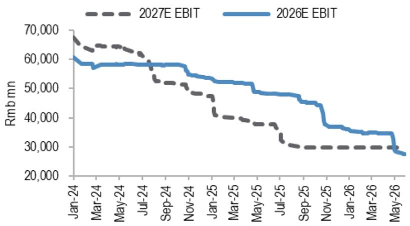

line chart

| Month   | 2027E EBIT | 2026E EBIT |
|---------|------------|------------|
| Jan-24  | 68,000     | 60,000     |
| Mar-24  | 65,000     | 58,000     |
| May-24  | 63,000     | 58,000     |
| Jul-24  | 60,000     | 58,000     |
| Sep-24  | 55,000     | 58,000     |
| Nov-24  | 50,000     | 55,000     |
| Jan-25  | 45,000     | 52,000     |
| Mar-25  | 40,000     | 50,000     |
| May-25  | 35,000     | 48,000     |
| Jul-25  | 30,000     | 45,000     |
| Sep-25  | 30,000     | 42,000     |
| Nov-25  | 30,000     | 38,000     |
| Jan-26  | 30,000     | 35,000     |
| Mar-26  | 30,000     | 33,000     |
| May-26  | 30,000     | 31,000     |

Source: Bloomberg Finance L.P. estimates.

Wuliangye - Share price vs consensus forward EPS  
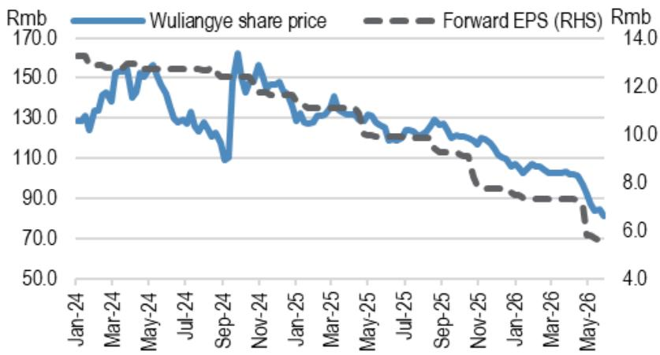

line chart

| Date   | Wuliangye share price | Forward EPS (RHS) |
|--------|------------------------|-------------------|
| Jan-24 | 130.0                  | 14.0              |
| Mar-24 | 150.0                  | 13.5              |
| May-24 | 160.0                  | 13.0              |
| Jul-24 | 130.0                  | 12.5              |
| Sep-24 | 110.0                  | 12.0              |
| Nov-24 | 170.0                  | 11.5              |
| Jan-25 | 150.0                  | 11.0              |
| Mar-25 | 130.0                  | 10.5              |
| May-25 | 120.0                  | 10.0              |
| Jul-25 | 115.0                  | 9.5               |
| Sep-25 | 125.0                  | 9.0               |
| Nov-25 | 115.0                  | 8.5               |
| Jan-26 | 105.0                  | 8.0               |
| Mar-26 | 95.0                   | 7.5               |
| May-26 | 80.0                   | 7.0               |

Source: Bloomberg Finance L.P.

Wuliangye 12-month rolling P/E  
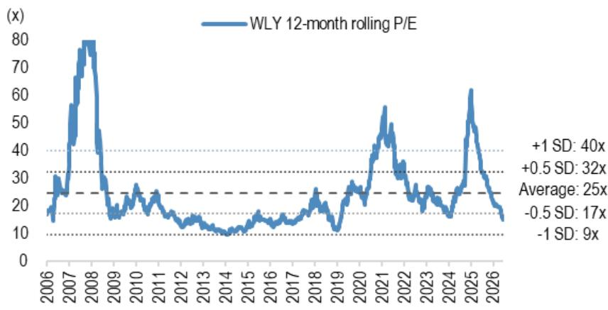

line chart

| Year | WLY 12-month rolling P/E |
|------|--------------------------|
| 2006 | ~15                      |
| 2007 | ~30                      |
| 2008 | ~80                      |
| 2009 | ~15                      |
| 2010 | ~25                      |
| 2011 | ~20                      |
| 2012 | ~15                      |
| 2013 | ~10                      |
| 2014 | ~10                      |
| 2015 | ~15                      |
| 2016 | ~15                      |
| 2017 | ~20                      |
| 2018 | ~25                      |
| 2019 | ~15                      |
| 2020 | ~30                      |
| 2021 | ~55                      |
| 2022 | ~35                      |
| 2023 | ~25                      |
| 2024 | ~15                      |
| 2025 | ~60                      |
| 2026 | ~15                      |

Source: JPM, Bloomberg Finance L.P.

Wuliangye 12-month rolling P/E band chart  
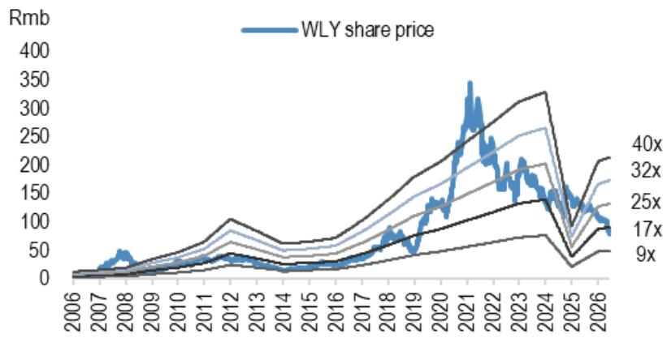

line chart

| Year | WLY share price |
|------|-----------------|
| 2026 | 9x              |
| 2025 | 17x             |
| 2024 | 25x             |
| 2023 | 32x             |
| 2022 | 40x             |

Source: JPM, Bloomberg Finance L.P.

## Luzhou Laojiao (UW): Mid-end strength meets sector uncertainty

Luzhou Laojiao – Key operating and financial metrics

<table><tr><td>P&amp;L (Rmb mn, FYE Dec 31)</td><td>2022</td><td>2023</td><td>2024</td><td>1Q25</td><td>2Q25</td><td>3Q25</td><td>4Q25</td><td>2025</td><td>2026E</td><td>2027E</td><td>2028E</td></tr><tr><td>Gross sales</td><td>25,124</td><td>30,233</td><td>31,196</td><td>9,352</td><td>7,102</td><td>6,674</td><td>2,604</td><td>25,731</td><td>23,851</td><td>24,722</td><td>26,127</td></tr><tr><td>- Premium liquor / Guojiao</td><td>16,229</td><td>20,611</td><td>20,817</td><td>6,157</td><td>4,730</td><td>4,472</td><td>1,711</td><td>17,070</td><td>17,619</td><td>18,361</td><td>19,569</td></tr><tr><td>- Mid-end liquor / Tequ</td><td>5,904</td><td>6,231</td><td>6,768</td><td>2,228</td><td>1,932</td><td>1,530</td><td>208</td><td>5,898</td><td>3,524</td><td>3,647</td><td>3,812</td></tr><tr><td>- Economy liquor</td><td>2,634</td><td>3,236</td><td>3,467</td><td>950</td><td>400</td><td>638</td><td>650</td><td>2,638</td><td>2,593</td><td>2,593</td><td>2,618</td></tr><tr><td>- Others</td><td>357</td><td>156</td><td>144</td><td>17</td><td>39</td><td>34</td><td>35</td><td>125</td><td>115</td><td>121</td><td>127</td></tr><tr><td>Gross sales yoy (%)</td><td>21.7%</td><td>20.3%</td><td>3.2%</td><td>1.8%</td><td>-8.0%</td><td>-9.8%</td><td>-62.2%</td><td>-17.5%</td><td>-7.3%</td><td>3.7%</td><td>5.7%</td></tr><tr><td>- Premium liquor</td><td>18.0%</td><td>27.0%</td><td>1.0%</td><td>1.7%</td><td>-10.5%</td><td>-10.0%</td><td>-62.0%</td><td>-18.0%</td><td>3.2%</td><td>4.2%</td><td>6.6%</td></tr><tr><td>- Mid-end liquor</td><td>27.1%</td><td>5.5%</td><td>8.6%</td><td>1.7%</td><td>14.9%</td><td>-9.0%</td><td>-82.9%</td><td>-12.9%</td><td>-40.3%</td><td>3.5%</td><td>4.5%</td></tr><tr><td>- Economy liquor</td><td>30.5%</td><td>22.9%</td><td>7.2%</td><td>8.0%</td><td>-46.4%</td><td>-9.0%</td><td>-43.0%</td><td>-23.9%</td><td>-1.7%</td><td>0.0%</td><td>1.0%</td></tr><tr><td>Sales volume yoy (%)</td><td>10.7%</td><td>11.7%</td><td>7.8%</td><td></td><td></td><td></td><td></td><td>-17.0%</td><td>-13.7%</td><td>1.5%</td><td>2.3%</td></tr><tr><td>- Premium liquor</td><td>16.0%</td><td>22.0%</td><td>3.0%</td><td></td><td></td><td></td><td></td><td>3.0%</td><td>-16.0%</td><td>4.0%</td><td>4.0%</td></tr><tr><td>- Mid-end liquor</td><td>17.3%</td><td>-7.8%</td><td>21.0%</td><td></td><td></td><td></td><td></td><td>-21.2%</td><td>-20.0%</td><td>3.5%</td><td>4.0%</td></tr><tr><td>- Economy liquor</td><td>6.5%</td><td>19.6%</td><td>3.5%</td><td></td><td></td><td></td><td></td><td>-19.7%</td><td>-10.0%</td><td>0.0%</td><td>1.0%</td></tr><tr><td>ASP yoy (%)</td><td>9.5%</td><td>8.7%</td><td>-4.2%</td><td></td><td></td><td></td><td></td><td>-0.6%</td><td>7.4%</td><td>2.1%</td><td>3.4%</td></tr><tr><td>- Premium liquor</td><td>1.7%</td><td>4.1%</td><td>-1.9%</td><td></td><td></td><td></td><td></td><td>-2.2%</td><td>0.0%</td><td>0.2%</td><td>2.5%</td></tr><tr><td>- Mid-end liquor</td><td>8.4%</td><td>14.5%</td><td>-10.2%</td><td></td><td></td><td></td><td></td><td>-10.2%</td><td>-8.0%</td><td>0.0%</td><td>0.5%</td></tr><tr><td>- Economy liquor</td><td>22.5%</td><td>2.7%</td><td>3.5%</td><td></td><td></td><td></td><td></td><td>3.5%</td><td>0.0%</td><td>0.0%</td><td>0.0%</td></tr><tr><td colspan="12"></td></tr><tr><td>Net sales</td><td>21,600</td><td>26,100</td><td>26,442</td><td>8,262</td><td>6,009</td><td>6,056</td><td>1,476</td><td>21,803</td><td>20,210</td><td>20,948</td><td>22,139</td></tr><tr><td>Net sales yoy (%)</td><td>21.5%</td><td>20.8%</td><td>1.3%</td><td>2.7%</td><td>-11.8%</td><td>-9.7%</td><td>-69.7%</td><td>-17.5%</td><td>-7.3%</td><td>3.7%</td><td>5.7%</td></tr><tr><td>COGS</td><td>(3,370)</td><td>(3,537)</td><td>(3,888)</td><td>(1,262)</td><td>(862)</td><td>(856)</td><td>(461)</td><td>(3,442)</td><td>(3,451)</td><td>(3,477)</td><td>(3,583)</td></tr><tr><td>Gross profit</td><td>18,230</td><td>22,563</td><td>22,554</td><td>7,001</td><td>5,146</td><td>5,200</td><td>1,015</td><td>18,362</td><td>16,760</td><td>17,471</td><td>18,556</td></tr><tr><td>- GP margin (% of net sales)</td><td>84.4%</td><td>86.4%</td><td>85.3%</td><td>84.7%</td><td>85.6%</td><td>85.9%</td><td>68.7%</td><td>84.2%</td><td>82.9%</td><td>83.4%</td><td>83.8%</td></tr><tr><td>- GP margin (% of gross sales)</td><td>86.6%</td><td>88.3%</td><td>87.5%</td><td>86.5%</td><td>87.9%</td><td>87.2%</td><td>82.3%</td><td>86.6%</td><td>85.5%</td><td>85.9%</td><td>86.3%</td></tr><tr><td>SG&amp;A</td><td>(4,817)</td><td>(5,340)</td><td>(4,900)</td><td>(993)</td><td>(1,038)</td><td>(1,198)</td><td>(1,187)</td><td>(4,415)</td><td>(3,965)</td><td>(4,043)</td><td>(4,100)</td></tr><tr><td>SG&amp;A / net sales (%)</td><td>-22.3%</td><td>-20.5%</td><td>-18.5%</td><td>-12.0%</td><td>-17.3%</td><td>-19.8%</td><td>-80.4%</td><td>-20.3%</td><td>-19.6%</td><td>-19.3%</td><td>-18.5%</td></tr><tr><td>SG&amp;A / gross sales (%)</td><td>-19.2%</td><td>-17.7%</td><td>-15.7%</td><td>-10.6%</td><td>-14.6%</td><td>-17.9%</td><td>-45.6%</td><td>-17.2%</td><td>-16.6%</td><td>-16.4%</td><td>-15.7%</td></tr><tr><td>Operating profits</td><td>13,413</td><td>17,223</td><td>17,654</td><td>6,008</td><td>4,108</td><td>4,002</td><td>(172)</td><td>13,946</td><td>12,794</td><td>13,428</td><td>14,455</td></tr><tr><td>- OP yoy growth (%)</td><td>33.7%</td><td>28.4%</td><td>2.5%</td><td>0.2%</td><td>-13.0%</td><td>-13.5%</td><td>-107.5%</td><td>-21.0%</td><td>-8.3%</td><td>5.0%</td><td>7.7%</td></tr><tr><td>- OP margin (% of net sales)</td><td>62.1%</td><td>66.0%</td><td>66.8%</td><td>72.7%</td><td>68.4%</td><td>66.1%</td><td>-11.7%</td><td>64.0%</td><td>63.3%</td><td>64.1%</td><td>65.3%</td></tr><tr><td>- OP margin (% of gross sales)</td><td>53.4%</td><td>57.0%</td><td>56.6%</td><td>64.2%</td><td>57.9%</td><td>60.0%</td><td>-6.6%</td><td>54.2%</td><td>53.6%</td><td>54.3%</td><td>55.3%</td></tr><tr><td>PBT</td><td>13,855</td><td>17,806</td><td>18,205</td><td>6,130</td><td>4,281</td><td>4,177</td><td>66</td><td>14,654</td><td>13,314</td><td>13,944</td><td>15,058</td></tr><tr><td colspan="12"></td></tr><tr><td>Net profit</td><td>10,365</td><td>13,246</td><td>13,473</td><td>4,593</td><td>3,070</td><td>3,099</td><td>68</td><td>10,831</td><td>9,902</td><td>10,370</td><td>11,199</td></tr><tr><td>- NP yoy growth (%)</td><td>30.3%</td><td>27.8%</td><td>1.7%</td><td>0.4%</td><td>-11.1%</td><td>-13.1%</td><td>-96.4%</td><td>-19.6%</td><td>-8.6%</td><td>4.7%</td><td>8.0%</td></tr><tr><td>- Net margin (% of net sales)</td><td>48.0%</td><td>50.8%</td><td>51.0%</td><td>55.6%</td><td>51.1%</td><td>51.2%</td><td>4.6%</td><td>49.7%</td><td>49.0%</td><td>49.5%</td><td>50.6%</td></tr><tr><td>- Net margin (% of gross sales)</td><td>41.3%</td><td>43.8%</td><td>43.2%</td><td>49.1%</td><td>43.2%</td><td>46.4%</td><td>2.6%</td><td>42.1%</td><td>41.5%</td><td>41.9%</td><td>42.9%</td></tr><tr><td colspan="12">Cash flow quality:</td></tr><tr><td>Cash sales yoy (%)</td><td>15%</td><td>22%</td><td>27%</td><td>-7%</td><td>-15%</td><td>-2%</td><td>-84%</td><td>-31%</td><td></td><td></td><td></td></tr><tr><td>OpCF yoy (%)</td><td>7%</td><td>29%</td><td>80%</td><td>-24%</td><td>-29%</td><td>-11%</td><td>-140%</td><td>-63%</td><td></td><td></td><td></td></tr><tr><td>A/R yoy (%)</td><td>-4%</td><td>30%</td><td>-70%</td><td>-77%</td><td>-65%</td><td>-73%</td><td>-19%</td><td>-19%</td><td></td><td></td><td></td></tr><tr><td>Customer advance yoy (%)</td><td>-27%</td><td>4%</td><td>49%</td><td>21%</td><td>51%</td><td>45%</td><td>-15%</td><td>-15%</td><td></td><td></td><td></td></tr><tr><td>Dividend payout</td><td>60.0%</td><td>60.0%</td><td>65.0%</td><td></td><td></td><td></td><td></td><td>60.0%</td><td>75.0%</td><td>75.0%</td><td>75.0%</td></tr><tr><td>Dividend yield</td><td></td><td></td><td></td><td></td><td></td><td></td><td></td><td></td><td>6.1%</td><td>6.4%</td><td>6.9%</td></tr><tr><td>ROE</td><td>33.3%</td><td>35.0%</td><td>30.4%</td><td></td><td></td><td></td><td></td><td>22.3%</td><td>19.2%</td><td>19.0%</td><td>19.4%</td></tr><tr><td>Net gearing</td><td>-33.6%</td><td>-34.7%</td><td>-50.7%</td><td></td><td></td><td></td><td></td><td>-41.5%</td><td>-43.7%</td><td>-48.4%</td><td>-53.2%</td></tr></table>

Source: Company data, JPM estimates.

## Luzhou Laojiao (UW): Mid-end strength meets sector uncertainty

Laojiao - Consensus EBIT revisions  
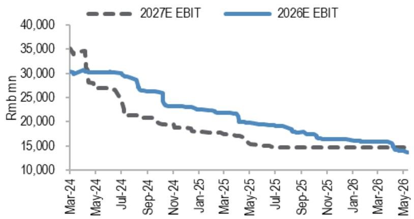

line chart

| Date    | 2027E EBIT | 2026E EBIT |
|---------|------------|------------|
| Mar-24  | 35,000     | 30,000     |
| May-24  | 30,000     | 31,000     |
| Jul-24  | 25,000     | 30,000     |
| Sep-24  | 20,000     | 28,000     |
| Nov-24  | 18,000     | 25,000     |
| Jan-25  | 17,000     | 23,000     |
| Mar-25  | 16,000     | 21,000     |
| May-25  | 15,000     | 19,000     |
| Jul-25  | 15,000     | 18,000     |
| Sep-25  | 15,000     | 17,000     |
| Nov-25  | 15,000     | 16,000     |
| Jan-26  | 15,000     | 15,500     |
| Mar-26  | 15,000     | 15,000     |
| May-26  | 14,500     | 14,500     |

Source: Bloomberg Finance L.P. estimates.

Laojiao - Share price vs consensus forward EPS  
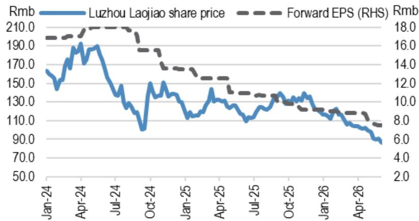

line chart

| Date   | Luzhou Laojiao share price | Forward EPS (RHS) |
|--------|----------------------------|-------------------|
| Jan-24 | 150.0                      | 18.0              |
| Apr-24 | 190.0                      | 18.0              |
| Jul-24 | 130.0                      | 16.0              |
| Oct-24 | 100.0                      | 14.0              |
| Jan-25 | 110.0                      | 12.0              |
| Apr-25 | 130.0                      | 10.0              |
| Jul-25 | 110.0                      | 8.0               |
| Oct-25 | 130.0                      | 6.0               |
| Jan-26 | 110.0                      | 4.0               |
| Apr-26 | 90.0                       | 2.0               |

Source: Bloomberg Finance L.P.

Laojiao 12-month rolling P/E  
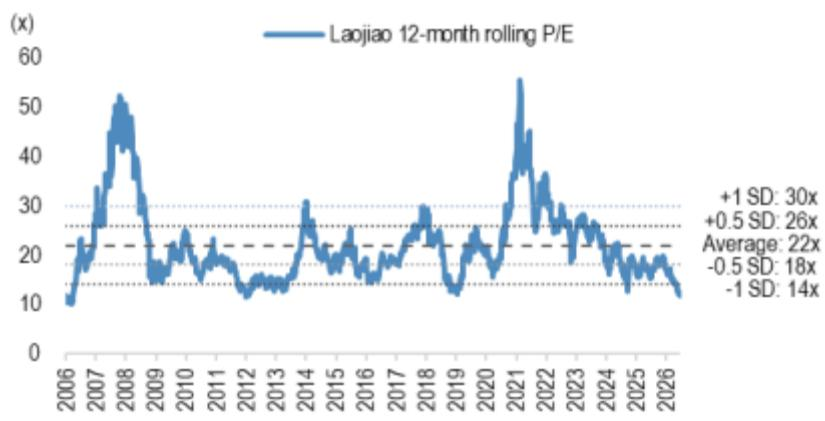

line chart

| Year | Value |
|------|-------|
| 2006 | ~10x  |
| 2007 | ~35x  |
| 2008 | ~50x  |
| 2009 | ~15x  |
| 2010 | ~20x  |
| 2011 | ~18x  |
| 2012 | ~15x  |
| 2013 | ~18x  |
| 2014 | ~30x  |
| 2015 | ~25x  |
| 2016 | ~20x  |
| 2017 | ~25x  |
| 2018 | ~30x  |
| 2019 | ~15x  |
| 2020 | ~25x  |
| 2021 | ~55x  |
| 2022 | ~35x  |
| 2023 | ~25x  |
| 2024 | ~20x  |
| 2025 | ~15x  |
| 2026 | ~14x  |

Source: JPM, Bloomberg Finance L.P.

Laojiao 12-month rolling P/E band chart  
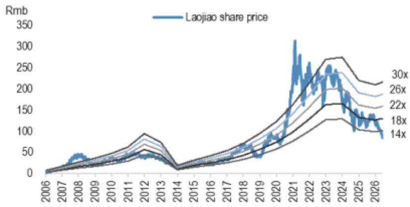

line chart

| Year | Laojiao share price |
|------|---------------------|
| 2026 | 14x                 |
| 2025 | 18x                 |
| 2024 | 22x                 |
| 2023 | 26x                 |
| 2022 | 30x                 |

Source: JPM, Bloomberg Finance L.P.

## Yanghe (UW): Inventory overhang and weak recovery limit upside

Yanghe – Key operating and financial metrics

<table><tr><td>P&amp;L, FYE Dec 31 (Rmb mn)</td><td>2022</td><td>2023</td><td>2024</td><td>1Q25</td><td>2Q25</td><td>3Q25</td><td>4Q25</td><td>2025</td><td>2026E</td><td>2027E</td><td>2028E</td></tr><tr><td>Gross revenue</td><td>30,105</td><td>33,126</td><td>28,876</td><td>11,066</td><td>3,729</td><td>3,295</td><td>1,121</td><td>19,211</td><td>15,973</td><td>16,959</td><td>17,857</td></tr><tr><td>- Mid/high-end liquor</td><td>26,227</td><td>28,539</td><td>24,317</td><td></td><td></td><td></td><td></td><td>16,542</td><td>14,061</td><td>14,905</td><td>15,650</td></tr><tr><td>- Economy liquor</td><td>3,273</td><td>3,950</td><td>3,931</td><td></td><td></td><td></td><td></td><td>2,234</td><td>1,564</td><td>1,689</td><td>1,824</td></tr><tr><td>- Others</td><td>605</td><td>637</td><td>628</td><td></td><td></td><td></td><td></td><td>435</td><td>348</td><td>365</td><td>383</td></tr><tr><td>Gross revenue yoy (%)</td><td>18.8%</td><td>10.0%</td><td>-12.8%</td><td>-31.9%</td><td>-43.7%</td><td>-29.0%</td><td>-17.6%</td><td>-33.5%</td><td>-16.9%</td><td>6.2%</td><td>5.3%</td></tr><tr><td>- Mid/high-end liquor</td><td>21.9%</td><td>8.8%</td><td>-14.8%</td><td></td><td></td><td></td><td></td><td>-32.0%</td><td>-15.0%</td><td>6.0%</td><td>5.0%</td></tr><tr><td>- Economy liquor</td><td>5.0%</td><td>20.7%</td><td>-0.5%</td><td></td><td></td><td></td><td></td><td>-43.2%</td><td>-30.0%</td><td>8.0%</td><td>8.0%</td></tr><tr><td>Sales volume yoy (%)</td><td>6.2%</td><td>-14.9%</td><td>-16.3%</td><td></td><td></td><td></td><td></td><td>-26.0%</td><td>-10.0%</td><td>0.0%</td><td>5.0%</td></tr><tr><td>ASP yoy (%)</td><td>13.1%</td><td>29.8%</td><td>3.9%</td><td></td><td></td><td></td><td></td><td>-10.1%</td><td>-7.5%</td><td>6.2%</td><td>0.3%</td></tr><tr><td>Net revenue</td><td>25,717</td><td>27,857</td><td>24,050</td><td>9,333</td><td>3,047</td><td>2,643</td><td>770</td><td>15,793</td><td>13,212</td><td>14,111</td><td>14,858</td></tr><tr><td>Net revenue yoy (%)</td><td>21.3%</td><td>8.3%</td><td>-13.7%</td><td>-31.6%</td><td>-47.5%</td><td>-30.7%</td><td>-0.8%</td><td>-34.3%</td><td>-16.3%</td><td>6.8%</td><td>5.3%</td></tr><tr><td>COGS</td><td>(7,646)</td><td>(8,200)</td><td>(7,751)</td><td>(2,701)</td><td>(995)</td><td>(1,531)</td><td>(228)</td><td>(5,456)</td><td>(4,783)</td><td>(4,945)</td><td>(5,042)</td></tr><tr><td>Gross profit</td><td>18,071</td><td>19,657</td><td>16,299</td><td>6,632</td><td>2,052</td><td>1,112</td><td>542</td><td>10,338</td><td>8,429</td><td>9,166</td><td>9,816</td></tr><tr><td>- Gross margin (% of net revenue)</td><td>70.3%</td><td>70.6%</td><td>67.8%</td><td>71.1%</td><td>67.3%</td><td>42.1%</td><td>70.4%</td><td>65.5%</td><td>63.8%</td><td>65.0%</td><td>66.1%</td></tr><tr><td>- Gross margin (% of gross revenue)</td><td>74.6%</td><td>75.2%</td><td>73.2%</td><td>75.6%</td><td>73.3%</td><td>53.5%</td><td>79.6%</td><td>71.6%</td><td>70.1%</td><td>70.8%</td><td>71.8%</td></tr><tr><td>SG&amp;A expense</td><td>(6,368)</td><td>(7,436)</td><td>(7,546)</td><td>(1,874)</td><td>(1,213)</td><td>(1,708)</td><td>(2,346)</td><td>(7,140)</td><td>(5,988)</td><td>(6,254)</td><td>(6,288)</td></tr><tr><td>SG&amp;A / net revenue (%)</td><td>-24.8%</td><td>-26.7%</td><td>-31.4%</td><td>-20.1%</td><td>-39.8%</td><td>-64.6%</td><td>-304.5%</td><td>-45.2%</td><td>-45.3%</td><td>-44.3%</td><td>-42.3%</td></tr><tr><td>SG&amp;A / gross revenue (%)</td><td>-21.2%</td><td>-22.4%</td><td>-26.1%</td><td>-16.9%</td><td>-32.5%</td><td>-51.8%</td><td>-209.3%</td><td>-37.2%</td><td>-37.5%</td><td>-36.9%</td><td>-35.2%</td></tr><tr><td>Operating profits</td><td>11,703</td><td>12,221</td><td>8,753</td><td>4,758</td><td>840</td><td>(596)</td><td>(1,804)</td><td>3,198</td><td>2,441</td><td>2,912</td><td>3,528</td></tr><tr><td>- OP yoy (%)</td><td>25.6%</td><td>4.4%</td><td>-28.4%</td><td>-39.7%</td><td>-64.0%</td><td>-226.4%</td><td>-7.0%</td><td>-63.5%</td><td>-23.7%</td><td>19.3%</td><td>21.2%</td></tr><tr><td>- OP margin (% of net revenue)</td><td>45.5%</td><td>43.9%</td><td>36.4%</td><td>51.0%</td><td>27.6%</td><td>-22.6%</td><td>-234.1%</td><td>20.2%</td><td>18.5%</td><td>20.6%</td><td>23.7%</td></tr><tr><td>- OP margin (% of gross revenue)</td><td>38.9%</td><td>36.9%</td><td>30.3%</td><td>43.0%</td><td>22.5%</td><td>-18.1%</td><td>-160.9%</td><td>16.6%</td><td>15.3%</td><td>17.2%</td><td>19.8%</td></tr><tr><td>PBT</td><td>12,503</td><td>13,218</td><td>9,143</td><td>4,841</td><td>1,087</td><td>(429)</td><td>(2,036)</td><td>3,464</td><td>3,019</td><td>3,528</td><td>4,190</td></tr><tr><td>- PBT yoy (%)</td><td>25.7%</td><td>5.7%</td><td>-30.8%</td><td>-40.1%</td><td>-57.3%</td><td>-151.4%</td><td>-12.1%</td><td>-62.1%</td><td>-12.8%</td><td>16.8%</td><td>18.8%</td></tr><tr><td>- PBT margin (% of net revenue)</td><td>48.6%</td><td>47.4%</td><td>38.0%</td><td>51.9%</td><td>35.7%</td><td>-16.2%</td><td>-264.2%</td><td>21.9%</td><td>22.9%</td><td>25.0%</td><td>28.2%</td></tr><tr><td>Net profits</td><td>9,378</td><td>10,016</td><td>6,673</td><td>3,637</td><td>707</td><td>(369)</td><td>(1,769)</td><td>2,206</td><td>2,279</td><td>2,661</td><td>3,157</td></tr><tr><td>- NP yoy (%)</td><td>24.9%</td><td>6.8%</td><td>-33.4%</td><td>-39.9%</td><td>-62.7%</td><td>-158.4%</td><td>7.2%</td><td>-66.9%</td><td>3.3%</td><td>16.7%</td><td>18.7%</td></tr><tr><td>- Net margin (% of net revenue)</td><td>36.5%</td><td>36.0%</td><td>27.7%</td><td>39.0%</td><td>23.2%</td><td>-13.9%</td><td>-229.6%</td><td>14.0%</td><td>17.3%</td><td>18.9%</td><td>21.3%</td></tr><tr><td>- Net margin (% of gross revenue)</td><td>31.2%</td><td>30.2%</td><td>23.1%</td><td>32.9%</td><td>18.9%</td><td>-11.2%</td><td>-157.8%</td><td>11.5%</td><td>14.3%</td><td>15.7%</td><td>17.7%</td></tr><tr><td colspan="12">Cash flow quality:</td></tr><tr><td>Cash sales</td><td>30,888</td><td>34,854</td><td>30,814</td><td>9,805</td><td>2,573</td><td>4,660</td><td>7,718</td><td>19,412</td><td></td><td></td><td></td></tr><tr><td>- yoy growth (%)</td><td>-16.1%</td><td>12.8%</td><td>-11.6%</td><td>-24.0%</td><td>-47.5%</td><td>-27.4%</td><td>17.3%</td><td>-37.0%</td><td></td><td></td><td></td></tr><tr><td>Account &amp; notes receivable</td><td>1,194</td><td>792</td><td>1,513</td><td>529</td><td>833</td><td>358</td><td>190</td><td>190</td><td></td><td></td><td></td></tr><tr><td>- yoy growth (%)</td><td>34.5%</td><td>-33.7%</td><td>91.2%</td><td>-43.3%</td><td>-10.1%</td><td>-22.7%</td><td>-87.4%</td><td>-87.4%</td><td></td><td></td><td></td></tr><tr><td>Deferred revenue</td><td>13,742</td><td>11,105</td><td>10,344</td><td>7,024</td><td>5,878</td><td>6,424</td><td>7,529</td><td>7,529</td><td></td><td></td><td></td></tr><tr><td>- yoy growth (%)</td><td>-13.1%</td><td>-19.2%</td><td>-6.9%</td><td>20.8%</td><td>49.3%</td><td>29.4%</td><td>-27.2%</td><td>-27.2%</td><td></td><td></td><td></td></tr></table>

Source: Company data, JPM estimates.

## Yanghe (UW): Inventory overhang and weak recovery limit upside

Yanghe - Consensus EBIT revisions  
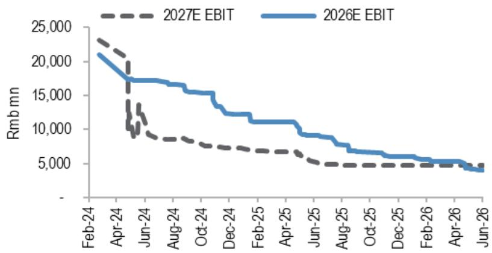

line chart

| Month    | 2027E EBIT | 2026E EBIT |
| -------- | ---------- | ---------- |
| Feb-24   | 23,000     | 21,000     |
| Apr-24   | 18,000     | 17,000     |
| Jun-24   | 9,000      | 16,000     |
| Aug-24   | 8,000      | 15,000     |
| Oct-24   | 7,500      | 14,000     |
| Dec-24   | 7,000      | 12,000     |
| Feb-25   | 6,500      | 11,000     |
| Apr-25   | 6,000      | 10,500     |
| Jun-25   | 5,500      | 9,500      |
| Aug-25   | 5,000      | 8,500      |
| Oct-25   | 5,000      | 7,500      |
| Dec-25   | 5,000      | 7,000      |
| Feb-26   | 5,000      | 6,500      |
| Apr-26   | 5,000      | 6,000      |
| Jun-26   | 5,000      | 5,500      |

Source: Bloomberg Finance L.P. estimates.

Yanghe - Share price vs consensus forward EPS  
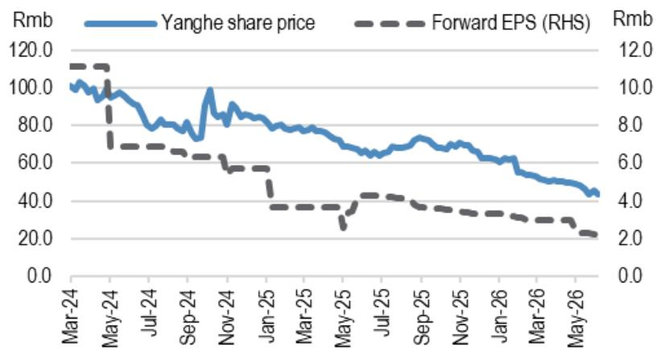

line chart

| Date   | Yanghe share price | Forward EPS (RHS) |
|--------|--------------------|-------------------|
| Mar-24 | 100.0              | 12.0              |
| May-24 | 95.0               | 8.0               |
| Jul-24 | 85.0               | 6.0               |
| Sep-24 | 75.0               | 5.0               |
| Nov-24 | 95.0               | 4.0               |
| Jan-25 | 85.0               | 3.0               |
| Mar-25 | 75.0               | 2.0               |
| May-25 | 65.0               | 3.0               |
| Jul-25 | 70.0               | 4.0               |
| Sep-25 | 65.0               | 3.5               |
| Nov-25 | 60.0               | 3.0               |
| Jan-26 | 55.0               | 2.5               |
| Mar-26 | 50.0               | 2.0               |
| May-26 | 45.0               | 1.5               |

Source: Bloomberg Finance L.P.

Yanghe 12-month rolling P/E  
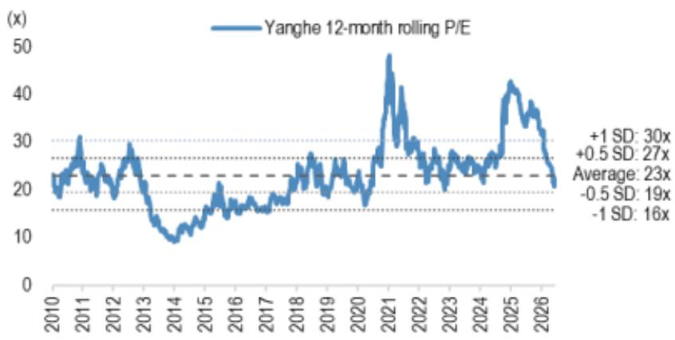

line chart

| Year | Yanghe 12-month rolling P/E |
|------|-----------------------------|
| 2010 | ~20                         |
| 2011 | ~30                         |
| 2012 | ~25                         |
| 2013 | ~30                         |
| 2014 | ~10                         |
| 2015 | ~15                         |
| 2016 | ~18                         |
| 2017 | ~16                         |
| 2018 | ~20                         |
| 2019 | ~25                         |
| 2020 | ~20                         |
| 2021 | ~50                         |
| 2022 | ~30                         |
| 2023 | ~25                         |
| 2024 | ~30                         |
| 2025 | ~40                         |
| 2026 | ~25                         |

Source: JPM, Bloomberg Finance L.P.

Yanghe 12-month rolling P/E band chart  
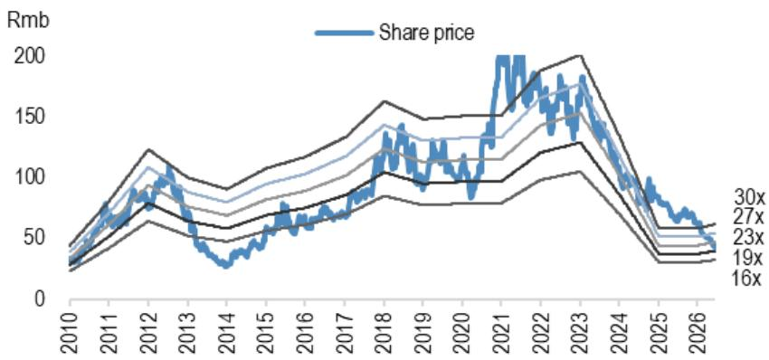

line chart

| Year | Share price | 16x  | 19x  | 23x  | 27x  | 30x  |
|------|-------------|------|------|------|------|------|
| 2010 | ~30         | ~25  | ~35  | ~40  | ~45  | ~50  |
| 2011 | ~60         | ~50  | ~65  | ~70  | ~75  | ~80  |
| 2012 | ~90         | ~70  | ~95  | ~100 | ~105 | ~110 |
| 2013 | ~70         | ~55  | ~75  | ~80  | ~85  | ~90  |
| 2014 | ~30         | ~25  | ~35  | ~40  | ~45  | ~50  |
| 2015 | ~50         | ~45  | ~55  | ~60  | ~65  | ~70  |
| 2016 | ~60         | ~55  | ~65  | ~70  | ~75  | ~80  |
| 2017 | ~70         | ~65  | ~75  | ~80  | ~85  | ~90  |
| 2018 | ~100        | ~90  | ~105 | ~110 | ~115 | ~120 |
| 2019 | ~90         | ~80  | ~95  | ~100 | ~105 | ~110 |
| 2020 | ~80         | ~70  | ~85  | ~90  | ~95  | ~100 |
| 2021 | ~150        | ~140 | ~160 | ~170 | ~180 | ~190 |
| 2022 | ~180        | ~170 | ~190 | ~200 | ~210 | ~220 |
| 2023 | ~160        | ~150 | ~175 | ~185 | ~195 | ~205 |
| 2024 | ~130        | ~120 | ~145 | ~155 | ~165 | ~175 |
| 2025 | ~80         | ~70  | ~95  | ~105 | ~115 | ~125 |
| 2026 | ~40         | ~35  | ~45  | ~50  | ~55  | ~60  |

Source: JPM, Bloomberg Finance L.P.

## Disclosures

Analyst Certification: The Research Analyst(s) denoted by an “AC” on the cover of this report certifies (or, where multiple Research Analysts are primarily responsible for this report, the Research Analyst denoted by an “AC” on the cover or within the document individually certifies, with respect to each security or issuer that the Research Analyst covers in this research) that: (1) all of the views expressed in this report accurately reflect the Research Analyst’s personal views about any and all of the subject securities or issuers; and (2) no part of any of the Research Analyst's compensation was, is, or will be directly or indirectly related to the specific recommendations or views expressed by the Research Analyst(s) in this report. For all Korea-based Research Analysts listed on the front cover, if applicable, they also certify, as per KOFIA requirements, that the Research Analyst’s analysis was made in good faith and that the views reflect the Research Analyst’s own opinion, without undue influence or intervention.

All authors named within this report are Research Analysts who produce independent research unless otherwise specified. In Europe, Sector Specialists (Sales and Trading) may be shown on this report as contacts but are not authors of the report or part of the Research Department.

## Important Disclosures

Company-Specific Disclosures: JPM does and seeks to do business with companies covered in its research reports. As a result, investors should be aware that the firm may have a conflict of interest that could affect the objectivity of this report. Investors should consider this report as only a single factor in making their investment decision. Important disclosures, including price charts and credit opinion history tables (if applicable), are available for compendium reports and all JPM-covered companies, and certain non-covered companies, by visiting https://www.jpmm.com/research/disclosures, calling 1-800-477-0406, or e-mailing research.disclosure.inquiries@JPM.com with your request.

## Explanation of Equity Research Ratings, Designations and Analyst(s) Coverage Universe:

JPM uses the following rating system: Overweight (over the duration of the price target indicated in this report, we expect this stock will outperform the average total return of the stocks in the Research Analyst's, or the Research Analyst's team's, coverage universe); Neutral (over the duration of the price target indicated in this report, we expect this stock will perform in line with the average total return of the stocks in the Research Analyst's, or the Research Analyst's team's, coverage universe); and Underweight (over the duration of the price target indicated in this report, we expect this stock will underperform the average total return of the stocks in the Research Analyst's, or the Research Analyst's team's, coverage universe. NR is Not Rated. In this case, JPM has removed the rating and, if applicable, the price target, for this stock because of either a lack of a sufficient fundamental basis or for legal, regulatory or policy reasons. The previous rating and, if applicable, the price target, no longer should be relied upon. An NR designation is not a recommendation or a rating. Some stocks under coverage have a rating but no price target; in these cases, we expect the stock will outperform/perform in line/underperform the average total return of the stocks in the Research Analyst's, or the Research Analyst's team's, coverage universe of the relevant duration of the region. In our Asia (ex-Australia and ex-India) and U.K. small- and mid-cap Equity Research, each stock's expected total return is compared to the expected total return of a benchmark country market index, not to those Research Analysts' coverage universe. If it does not appear in the Important Disclosures section of this report, the certifying Research Analyst's coverage universe can be found on JPM's Research website, https://www.JPMmarkets.com.

Coverage Universe: Xu, Jessie : Budweiser Asia Pacific (1876.HK), CR Beverage - H (2460.HK), Chagee (CHA), China Feihe Limited (6186.HK), China Mengniu Dairy (2319.HK), China Resources Beer (0291) (0291.HK), Eastroc Beverage - A (605499.SS), Eastroc Beverage - H (9980.HK), Guming - H (1364.HK), Haitian Flavoring & Food - A (603288.SS), Inner Mongolia Yili - A (600887.SS), Kweichow Moutai Co - A (600519.SS), Luckin Coffee (LKNCY), Luzhou Laojiao - A (000568.SZ), Miniso - ADR (MNSO), Miniso - H (9896.HK), Mixue Group - H (2097.HK), Nongfu Spring - H (9633.HK), Pop Mart - H (9992.HK), Tsingtao Brewery - A (600600.SS), Tsingtao Brewery - H (0168.HK), WH Group (0288) (0288.HK), Wuliangye - A (000858.SZ), Yanghe - A (002304.SZ), Yum China Holdings Inc (YUMC)

## Disclosures

JPM Equity Research Ratings Distribution, as of April 04, 2026

<table><tr><td></td><td>Overweight (buy)</td><td>Neutral (hold)</td><td>Underweight (sell)</td></tr><tr><td>JPM Global Equity Research Coverage*</td><td>51%</td><td>37%</td><td>12%</td></tr><tr><td>IB clients**</td><td>83%</td><td>79%</td><td>74%</td></tr><tr><td>JPMS Equity Research Coverage*</td><td>49%</td><td>39%</td><td>13%</td></tr><tr><td>IB clients**</td><td>94%</td><td>93%</td><td>85%</td></tr></table>

\*Please note that the percentages may not add to 100% because of rounding.  
\*\*Percentage of subject companies within each of the "buy," "hold" and "sell" categories for which JPM has provided investment banking services within the previous 12 months. For purposes of FINRA ratings distribution rules only, our Overweight rating falls into a buy rating category; our Neutral rating falls into a hold rating category; and our Underweight rating falls into a sell rating category. Please note that stocks with an NR designation are not included in the table above. This information is current as of the end of the most recent calendar quarter.

Equity Valuation and Risks: For valuation methodology and risks associated with covered companies or price targets for covered companies, please see the most recent company-specific research report at http://www.JPMmarkets.com, contact the primary analyst or your JPM representative, or email research.disclosure.inquiries@JPM.com. For material information about the proprietary models used, please see the Summary of Financials in company-specific research reports and the Company Tearsheets, which are available to download on the company pages of our client website, http://www.JPMmarkets.com. This report also sets out within it the material underlying assumptions used.

## History of Investment Recommendations:

A history of JPM investment recommendations disseminated during the preceding 12 months can be accessed on the Research & Commentary page of http://www.JPMmarkets.com where you can also search by analyst name, sector or financial instrument.

Analysts' Compensation: The research analysts responsible for the preparation of this report receive compensation based upon various factors, including the quality and accuracy of research, client feedback, competitive factors, and overall firm revenues.

Registration of non-US Analysts: Unless otherwise noted, the non-US analysts listed on the front of this report are employees of non-US affiliates of JPM Securities LLC, may not be registered as research analysts under FINRA rules, may not be associated persons of JPM Securities LLC, and may not be subject to FINRA Rule 2241 or 2242 restrictions on communications with covered companies, public appearances, and trading securities held by a research analyst account.

## Other Disclosures

JPM is a marketing name for investment banking businesses of JPM Chase & Co. and its subsidiaries and affiliates worldwide.

UK MIFID FICC research unbundling exemption: UK clients should refer to UK MIFID Research Unbundling exemption for details of JPM's implementation of the FICC research exemption and guidance on relevant FICC research categorisation.

All research material made available to clients are simultaneously available on our client website, JPM Markets, unless specifically permitted by relevant laws. Not all research content is redistributed, e-mailed or made available to third-party aggregators. For all research material available on a particular stock, please contact your sales representative.

## Disclosures

Any long form nomenclature for references to China; Hong Kong; Taiwan; and Macau within this research material are Mainland China; Hong Kong SAR (China); Taiwan (China); and Macau SAR (China).

JPM may, from time to time, write on issuers or securities targeted by economic or financial sanctions imposed or administered by the governmental authorities of the U.S., EU, UK or other relevant jurisdictions (Sanctioned Securities). Nothing in this report is intended to be read or construed as encouraging, facilitating, promoting or otherwise approving investment or dealing in such Sanctioned Securities. Clients should be aware of their own legal and compliance obligations when making investment decisions.

Any digital or crypto assets discussed in this research report are subject to a rapidly changing regulatory landscape. For relevant regulatory advisories on crypto assets, including bitcoin and ether, please see https://www.JPM.com/disclosures/cryptoasset-disclosure.

The author(s) of this research report may not be licensed to carry on regulated activities in your jurisdiction and, if not licensed, do not hold themselves out as being able to do so.

Exchange-Traded Funds (ETFs): JPM Securities LLC (“JPMS”) acts as authorized participant for substantially all U.S.-listed ETFs. To the extent that any ETFs are mentioned in this report, JPMS may earn commissions and transaction-based compensation in connection with the distribution of those ETF shares and may earn fees for performing other trade-related services, such as securities lending to short sellers of the ETF shares. JPMS may also perform services for the ETFs themselves, including acting as a broker or dealer to the ETFs. In addition, affiliates of JPMS may perform services for the ETFs, including trust, custodial, administration, lending, index calculation and/or maintenance and other services.

Options and Futures related research: If the information contained herein regards options- or futures-related research, such information is available only to persons who have received the proper options or futures risk disclosure documents. Please contact your JPM Representative or visit https://www.theocc.com/components/docs/riskstoc.pdf for a copy of the Option Clearing Corporation's Characteristics and Risks of Standardized Options or https://www.finra.org/sites/default/files/2020-08/Security\_Futures\_Risk\_Disclosure\_Statement\_2020.pdf for a copy of the Security Futures Risk Disclosure Statement.

Changes to Interbank Offered Rates (IBORs) and other benchmark rates: Certain interest rate benchmarks are, or may in the future become, subject to ongoing international, national and other regulatory guidance, reform and proposals for reform. For more information, please consult: https://www.JPM.com/global/disclosures/interbank\_offered\_rates

Private Bank Clients: Where you are receiving research as a client of the private banking businesses offered by JPM Chase & Co. and its subsidiaries (“JPM Private Bank”), research is provided to you by JPM Private Bank and not by any other division of JPM, including, but not limited to, the JPM Corporate and Investment Bank and its Global Research division.

Legal entity responsible for the production and distribution of research: The legal entity identified below the name of the Reg AC Research Analyst who authored this material is the legal entity responsible for the production of this research. Where multiple Reg AC Research Analysts authored this material with different legal entities identified below their names, these legal entities are jointly responsible for the production of this research. Where more than one legal entity is listed under an analyst's name, the first legal entity is responsible for the production unless stated otherwise. Research Analysts from various JPM affiliates may have contributed to the production of this material but may not be licensed to carry out regulated activities in your jurisdiction (and do not hold themselves out as being able to do so). Unless otherwise stated below in the legal entity disclosures, this material has been distributed by the legal entity responsible for production, or where more than one legal entity is listed under the analyst's name, the first legal entity will be responsible for distribution. If you have any queries, please contact the relevant Research Analyst in your jurisdiction or the entity in your jurisdiction that has

## Disclosures

distributed this research material.

## Legal Entities Disclosures and Country-/Region-Specific Disclosures:

Argentina: JPM Chase Bank N.A Sucursal Buenos Aires is regulated by Banco Central de la República Argentina (“BCRA”- Central Bank of Argentina) and Comisión Nacional de Valores (“CNV”- Argentinian Securities Commission - ALYC y AN Integral N°51).  
Australia: JPM Securities Australia Limited (“JPMSAL”) (ABN 61 003 245 234/AFS Licence No: 238066) is regulated by the Australian Securities and Investments Commission and is a Market Participant of ASX Limited, a Clearing and Settlement Participant of ASX Clear Pty Limited and a Clearing Participant of ASX Clear (Futures) Pty Limited. This material is issued and distributed in Australia by or on behalf of JPMSAL only to "wholesale clients" (as defined in section 761G of the Corporations Act 2001). A list of all financial products covered can be found by visiting https://www.jpmm.com/research/disclosures. JPM seeks to cover companies of relevance to the domestic and international investor base across all Global Industry Classification Standard (GICS) sectors, as well as across a range of market capitalisation sizes. If applicable, in the course of conducting public side due diligence on the subject company(ies), the Research Analyst team may at times perform such diligence through corporate engagements such as site visits, discussions with company representatives, management presentations, etc. Research issued by JPMSAL has been prepared in accordance with JPM Australia’s Research Independence Policy which can be found at the following link: JPM Australia - Research Independence Policy.  
Brazil: Banco JPM S.A. is regulated by the Comissao de Valores Mobiliarios (CVM) and by the Central Bank of Brazil. Ombudsman JPM: 0800-7700847 / 0800-7700810 (For Hearing Impaired) / ouvidoria.jp.morgan@jpmchase.com.  
Canada: JPM Securities Canada Inc. is a registered investment dealer, regulated by the Canadian Investment Regulatory Organization and the Ontario Securities Commission and is the participating member on Canadian exchanges. This material is distributed in Canada by or on behalf of JPM Securities Canada Inc.  
Chile: Inversiones JPM Limitada is an unregulated entity incorporated in Chile.  
China: JPM Securities (China) Company Limited has been approved by CSRC to conduct the securities investment consultancy business.  
Colombia: Banco JPM Colombia S.A. is supervised by the Superintendencia Financiera de Colombia (SFC). Any reference in this material to products or services offered abroad by entities other than the Bank in Colombia is included exclusively for descriptive purposes. Such references do not constitute, and should not be construed as, promotional activity or the provision of financial products or services within Colombian territory, as defined under applicable Colombian regulation.  
Dubai International Financial Centre (DIFC): JPM Chase Bank, N.A., Dubai Branch is regulated by the Dubai Financial Services Authority (DFSA) and its registered address is Dubai International Financial Centre - The Gate, West Wing, Level 3 and 9 PO Box 506551, Dubai, UAE. This material has been distributed by JPM Chase Bank, N.A., Dubai Branch to persons regarded as professional clients or market counterparties as defined under the DFSA rules.  
European Economic Area (EEA): Unless specified to the contrary, research is distributed in the EEA by JPM SE (“JPM SE”), which is authorised as a credit institution by the Federal Financial Supervisory Authority (Bundesanstalt für Finanzdienstleistungsaufsicht, BaFin) and jointly supervised by the BaFin, the German Central Bank (Deutsche Bundesbank) and the European Central Bank (ECB). JPM SE is a company headquartered in Frankfurt with registered address at TaunusTurm, Taunustor 1, Frankfurt am Main, 60310, Germany. The material has been distributed in the EEA to persons regarded as professional investors (or equivalent) pursuant to Art. 4 para. 1 no. 10 and Annex II of MiFID II and its respective implementation in their home jurisdictions (“EEA professional investors”). This material must not be acted on or relied on by persons who are not EEA professional investors. Any investment or investment activity to which this material relates is only available to EEA relevant persons and will be engaged in only with EEA relevant persons.  
Hong Kong: JPM Securities (Asia Pacific) Limited (CE number AAJ321) is regulated by the Hong Kong Monetary Authority and the Securities and Futures Commission in Hong Kong, and JPM Broking (Hong Kong) Limited (CE number AAB027) is regulated by the Securities and Futures Commission in Hong Kong. JPM Chase Bank, N.A., Hong Kong Branch (CE Number AAL996) is regulated by the Hong Kong Monetary Authority and the Securities and Futures Commission, is organized under the laws of the United States with limited liability. Where the distribution of this material is a regulated activity in Hong Kong, the material is distributed in Hong Kong by or through JPM Securities (Asia Pacific) Limited and/or JPM Broking (Hong Kong) Limited.  
India: JPM India Private Limited (Corporate Identity Number - U67120MH1992FTC068724), having its registered office at JPM Tower, Off. C.S.T. Road, Kalina, Santacruz - East, Mumbai – 400098, is registered with the Securities and Exchange Board of India (SEBI) as a ‘Research Analyst’ having registration number INH000001873. JPM India Private Limited is also registered with SEBI as a member of the National Stock Exchange of India Limited and the Bombay Stock Exchange Limited (SEBI Registration Number – INZ000239730) and as a Merchant Banker (SEBI Registration Number - MB/INM000002970). Telephone: 91-22-6157 3000, Facsimile: 91-22-6157 3990

## Disclosures

and Website: http://www.jpmipl.com. JPM Chase Bank, N.A. - Mumbai Branch is licensed by the Reserve Bank of India (RBI) (Licence No. 53/ Licence No. BY.4/94; SEBI - IN/CUS/014/ CDSL : IN-DP-CDSL-444-2008/ IN-DP-NSDL-285-2008/ INBI00000984/ INE231311239) as a Scheduled Commercial Bank in India, which is its primary license allowing it to carry on Banking business in India and other activities, which a Bank branch in India are permitted to undertake. For non-local research material, this material is not distributed in India by JPM India Private Limited. Compliance Officer: Ashutosh Sharma; ashutosh.j.sharma@jpmchase.com; +912261575002. Grievance Officer:  
Ramprasadh K, jpmipl.research.feedback@JPM.com; +912261573000. Registration granted by SEBI and certification from NISM in no way guarantee performance of the intermediary or provide any assurance of returns to investors. Please visit Terms and Conditions and Most Important Terms and Conditions (MITC). The annual Compliance audit report is available at http://www.jpmipl.com/#research.  
Indonesia: PT JPM Sekuritas Indonesia is a member of the Indonesia Stock Exchange and is registered and supervised by the Otoritas Jasa Keuangan (OJK).  
Korea: JPM Securities (Far East) Limited, Seoul Branch, is a member of the Korea Exchange (KRX). JPM Chase Bank, N.A., Seoul Branch, is licensed as a branch office of foreign bank (JPM Chase Bank, N.A.) in Korea. Both entities are regulated by the Financial Services Commission (FSC) and the Financial Supervisory Service (FSS). For non-macro research material, the material is distributed in Korea by or through JPM Securities (Far East) Limited, Seoul Branch.  
Japan: JPM Securities Japan Co., Ltd. and JPM Chase Bank, N.A., Tokyo Branch are regulated by the Financial Services Agency in Japan.  
Malaysia: This material is issued and distributed in Malaysia by JPM Securities (Malaysia) Sdn Bhd (18146-X), which is a Participating Organization of Bursa Malaysia Berhad and holds a Capital Markets Services License issued by the Securities Commission in Malaysia.  
Mexico: JPM Casa de Bolsa, S.A. de C.V., JPM Grupo Financiero is member of the Mexican Stock Exchange (“Bolsa Mexicana de Valores”) and the Institutional Stock Exchange (“Bolsa Institucional de Valores”), and it is authorized to act as a broker dealer by the National Banking and Securities Exchange Commission (“Comisión Nacional Bancaria y de Valores”).  
New Zealand: This material is issued and distributed by JPMSAL in New Zealand only to "wholesale clients" (as defined in the Financial Markets Conduct Act 2013). JPMSAL is registered as a Financial Service Provider under the Financial Service providers (Registration and Dispute Resolution) Act of 2008.  
Philippines: JPM Securities Philippines Inc. is a Trading Participant of the Philippine Stock Exchange and a member of the Securities Clearing Corporation of the Philippines and the Securities Investor Protection Fund. It is regulated by the Securities and Exchange Commission.  
Singapore: This material is issued and distributed in Singapore by or through JPM Securities Singapore Private Limited (JPMSS) [MDDI (P) 057/08/2025 and Co. Reg. No.: 199405335R], which is a member of the Singapore Exchange Securities Trading Limited, and/or JPM Chase Bank, N.A., Singapore branch (JPMCB Singapore), both of which are regulated by the Monetary Authority of Singapore. This material is issued and distributed in Singapore only to accredited investors, expert investors and institutional investors, as defined in Section 4A of the Securities and Futures Act, Cap. 289 (SFA). This material is not intended to be issued or distributed to any retail investors or any other investors that do not fall into the classes of “accredited investors,” “expert investors” or “institutional investors,” as defined under Section 4A of the SFA. Recipients of this material in Singapore are to contact JPMSS or JPMCB Singapore in respect of any matters arising from, or in connection with, the material.  
South Africa: JPM Equities South Africa Proprietary Limited and JPM Chase Bank, N.A., Johannesburg Branch are members of the Johannesburg Securities Exchange and are regulated by the Financial Services Conduct Authority (FSCA).  
Taiwan: JPM Securities (Taiwan) Limited is a participant of the Taiwan Stock Exchange (company-type) and regulated by the Taiwan Securities and Futures Bureau. Material relating to equity securities is issued and distributed in Taiwan by JPM Securities (Taiwan) Limited, subject to the license scope and the applicable laws and the regulations in Taiwan. To the extent that JPM Securities (Taiwan) Limited produces research materials on securities not listed on the Taiwan Stock Exchange or Taipei Exchange (“Non-Taiwan Listed Securities”), these materials shall not constitute securities recommendations for the purpose of applicable Taiwan regulations, and, for the avoidance of doubt, JPM Securities (Taiwan) Limited does not act as broker for Non-Taiwan Listed Securities. According to Paragraph 2, Article 7-1 of Operational Regulations Governing Securities Firms Recommending Trades in Securities to Customers (as amended or supplemented) and/or other applicable laws or regulations, please note that the recipient of this material is not permitted to engage in any activities in connection with the material that may give rise to conflicts of interests, unless otherwise disclosed in the “Important Disclosures” in this material.  
Thailand: This material is issued and distributed in Thailand by JPM Securities (Thailand) Ltd., which is a member of the Stock Exchange of Thailand and is regulated by the Ministry of Finance and the Securities and Exchange Commission. The registered address is 548 One City Center Building, 50th Floor, Ploenchit Road, Lymphini, Pathum Wan, Bangkok 10330.  
UK: Research is produced in the UK by JPM Securities plc (“JPMS plc”) which is a member of the London Stock Exchange and is authorised by the Prudential Regulation

## Disclosures

Authority and regulated by the Financial Conduct Authority and the Prudential Regulation Authority or JPM Markets Limited (“JPMML Ltd”) which is authorised and regulated by the Financial Conduct Authority. Unless specified to the contrary, this material is distributed in the UK by JPMS plc and is directed in the UK only to: (a) persons having professional experience in matters relating to investments falling within article 19(5) of the Financial Services and Markets Act 2000 (Financial Promotion) (Order) 2005 (“the FPO”); (b) persons outlined in article 49 of the FPO (high net worth companies, unincorporated associations or partnerships, the trustees of high value trusts, etc.); or (c) any persons to whom this communication may otherwise lawfully be made; all such persons being referred to as "UK relevant persons". This material must not be acted on or relied on by persons who are not UK relevant persons. Any investment or investment activity to which this material relates is only available to UK relevant persons and will be engaged in only with UK relevant persons. A description of JPM EMEA’s policy for prevention and avoidance of conflicts of interest related to the production of Research can be found at the following link: JPM EMEA - Research Independence Policy.

U.S.: JPM Securities LLC (“JPMS”) is a member of the NYSE, FINRA, SIPC, and the NFA. JPM Chase Bank, N.A. is a member of the FDIC. Material published by non-U.S. affiliates is distributed in the U.S. by JPMS who accepts responsibility for its content.

General: Additional information is available upon request. The information in this material has been obtained from sources believed to be reliable. While all reasonable care has been taken to ensure that the facts stated in this material are accurate and that the forecasts, opinions and expectations contained herein are fair and reasonable, JPM Chase & Co. or its affiliates and/or subsidiaries (collectively JPM) make no representations or warranties whatsoever to the completeness or accuracy of the material provided, except with respect to any disclosures relative to JPM and the Research Analyst's involvement with the issuer that is the subject of the material. Accordingly, no reliance should be placed on the accuracy, fairness or completeness of the information contained in this material. There may be certain discrepancies with data and/or limited content in this material as a result of calculations, adjustments, translations to different languages, and/or local regulatory restrictions, as applicable. These discrepancies should not impact the overall investment analysis, views and/or recommendations of the subject company(ies) that may be discussed in the material. Artificial intelligence tools may have been used in the preparation of this material, including assisting in data analysis, pattern recognition, and content drafting for research material. JPM accepts no liability whatsoever for any loss arising from any use of this material or its contents, and neither JPM nor any of its respective directors, officers or employees, shall be in any way responsible for the contents hereof, apart from the liabilities and responsibilities that may be imposed on them by the relevant regulatory authority in the jurisdiction in question, or the regulatory regime thereunder. Opinions, forecasts or projections contained in this material represent JPM's current opinions or judgment as of the date of the material only and are therefore subject to change without notice. Periodic updates may be provided on companies/industries based on company-specific developments or announcements, market conditions or any other publicly available information. There can be no assurance that future results or events will be consistent with any such opinions, forecasts or projections, which represent only one possible outcome. Furthermore, such opinions, forecasts or projections are subject to certain risks, uncertainties and assumptions that have not been verified, and future actual results or events could differ materially. The value of, or income from, any investments referred to in this material may fluctuate and/or be affected by changes in exchange rates. All pricing is indicative as of the close of market for the securities discussed, unless otherwise stated. Past performance is not indicative of future results. Accordingly, investors may receive back less than originally invested. This material is not intended as an offer or solicitation for the purchase or sale of any financial instrument. The opinions and recommendations herein do not take into account individual client circumstances, objectives, or needs and are not intended as recommendations of particular securities, financial instruments or strategies to particular clients. This material may include views on structured securities, options, futures and other derivatives. These are complex instruments, may involve a high degree of risk and may be appropriate investments only for sophisticated investors who are capable of understanding and assuming the risks involved. The recipients of this material must make their own independent decisions regarding any securities or financial instruments mentioned herein and should seek advice from such independent financial, legal, tax or other adviser as they deem necessary. JPM may trade as a principal on the basis of the Research Analysts' views and research, and it may also engage in transactions for its own account or for its clients' accounts in a manner inconsistent with the views taken in this material, and JPM is under no obligation to ensure that such other communication is brought to the attention of any recipient of this material. Others within JPM, including Strategists, Sales staff and other Research Analysts, may take views that are inconsistent with those taken in this material. Employees of JPM not involved in the preparation of this material may have investments in the securities (or derivatives of such securities) mentioned in this material and may trade them in ways different from those discussed in this material. This material is not an advertisement for or marketing of any issuer, its products or services, or its securities in any jurisdiction.

Confidentiality and Security Notice: This transmission may contain information that is privileged, confidential, legally privileged, and/or exempt from disclosure under applicable law. If you are not the intended recipient, you are hereby notified that any disclosure, copying, distribution, or use of the information contained herein (including any

## Disclosures

reliance thereon) is STRICTLY PROHIBITED. Although this transmission and any attachments are believed to be free of any virus or other defect that might affect any computer system into which it is received and opened, it is the responsibility of the recipient to ensure that it is virus free and no responsibility is accepted by JPM Chase & Co., its subsidiaries and affiliates, as applicable, for any loss or damage arising in any way from its use. If you received this transmission in error, please immediately contact the sender and destroy the material in its entirety, whether in electronic or hard copy format. This message is subject to electronic monitoring: https://www.JPM.com/disclosures/email

MSCI: Certain information herein (“Information”) is reproduced by permission of MSCI Inc., its affiliates and information providers (“MSCI”) ©2026. No reproduction or dissemination of the Information is permitted without an appropriate license. MSCI MAKES NO EXPRESS OR IMPLIED WARRANTIES (INCLUDING MERCHANTABILITY OR FITNESS) AS TO THE INFORMATION AND DISCLAIMS ALL LIABILITY TO THE EXTENT PERMITTED BY LAW. No Information constitutes investment advice, except for any applicable Information from MSCI ESG Research. Subject also to msci.com/disclaimer

Sustainalytics: Certain information, data, analyses and opinions contained herein are reproduced by permission of Sustainalytics and: (1) includes the proprietary information of Sustainalytics; (2) may not be copied or redistributed except as specifically authorized; (3) do not constitute investment advice nor an endorsement of any product or project; (4) are provided solely for informational purposes; and (5) are not warranted to be complete, accurate or timely. Sustainalytics is not responsible for any trading decisions, damages or other losses related to it or its use. The use of the data is subject to conditions available at https://www.sustainalytics.com/legal-disclaimers. ©2026 Sustainalytics. All Rights Reserved.

"Other Disclosures" last revised May 16, 2026.

Copyright 2026 JPM Chase & Co. All rights reserved. This material or any portion hereof may not be reprinted, sold or redistributed without the written consent of JPM. It is strictly prohibited to use or share without prior written consent from JPM any research material received from JPM or an authorized third-party (“JPM Data”) in any third-party artificial intelligence (“AI”) systems or models when such JPM Data is accessible by a third-party.