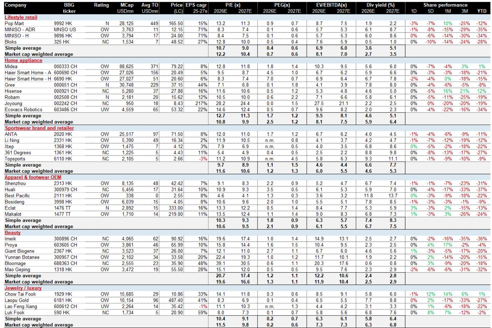
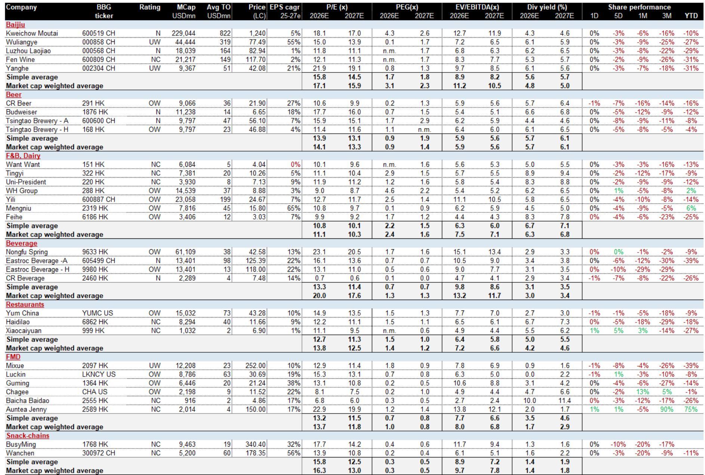
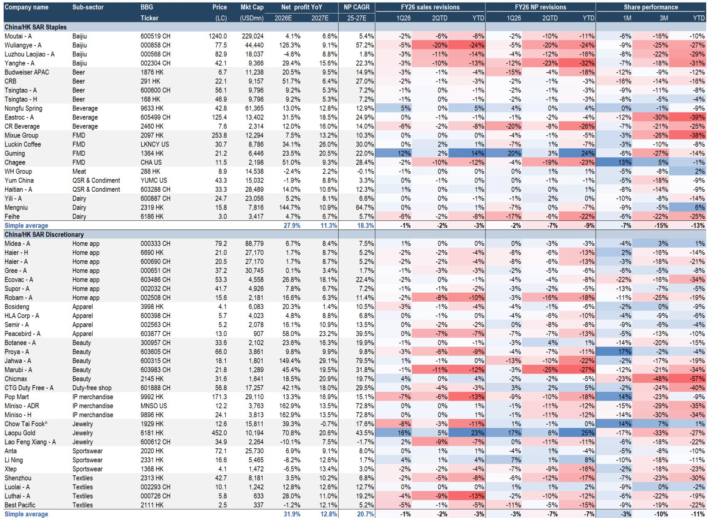

# China Consumer Stocks Are Cheap But Unloved: Why Selective Positioning Matters More Than Waiting for a Macro Catalyst

The Chinese consumer sector presents a paradox that demands strategic navigation. Valuations are trading at 1.5 standard deviations below their ten-year averages, with staples at 16x forward P/E and discretionary names at 13x. Yet this apparent bargain is not a signal to buy indiscriminately. The market is correctly pricing in a structural shift: earnings revisions have been overwhelmingly negative, with 80% of coverage seeing consensus estimates downgraded year-to-date. The opportunity is not in the broad index but in a narrow set of companies where operator quality, not category beta, will determine returns. The investor who treats cheap valuations as a blanket entry signal risks catching a falling knife. The investor who understands the diverging fundamentals beneath the surface can build a portfolio that profits from the recovery when it comes, while being protected during the ongoing earnings downgrade cycle.

The timing of this analysis is critical for two reasons. First, the earnings floor has not yet been established. The report indicates that "full pricing" of cost pressure may not show up until late 2026, meaning the consensus estimates still embed optimistic assumptions that have not been fully reset. Second, a potential geopolitical shock—the resolution of the Iran conflict—would trigger an immediate spike in packaging and industrial input costs, with polyethylene and PET prices already up 15-40% versus 2025 averages. This creates a two-phase challenge: companies must first survive the demand weakness, then navigate a cost inflation cycle. Only operators with pricing power, margin buffers, and disciplined capital allocation can manage both. The market has not yet differentiated adequately between these cohorts, which is where the analytical edge lies.

## The Earnings Revision Cycle Has Further to Run, and the Divergence Between Winners and Losers Is the Only Signal That Matters

The consensus earnings revision data tells a story that is more nuanced than the headline numbers suggest. Staples have seen 2026 EPS estimates cut by 9% year-to-date, while discretionary is down 7%. But the dispersion within these averages is far more informative than the averages themselves. Baijiu and beauty names have been the hardest hit, with Luzhou Laojiao seeing a 24% cut to 2026 net profit estimates and Proya down 11%. Meanwhile, a small cluster of companies has actually seen positive revisions: Guming with a 24% upward revision, Laopu Gold at 25%, Li Ning at 8%, and Nongfu Spring at 4%. This is not random variation. It reflects genuine operating divergence.

The critical insight is that the earnings revision cycle is not uniform and will not become uniform. The market is still pricing in a broad-based recovery narrative that the data does not support. When you look at the dispersion of revisions across sub-sectors, a clear pattern emerges. The companies with positive revisions share common characteristics: they have demonstrated the ability to gain market share, they operate in categories with structural growth tailwinds, or they possess pricing power that protects margins. Guming is expanding its store network aggressively while improving brand equity. Laopu Gold is capturing the premium jewelry segment through product innovation and brand building. Nongfu Spring has a margin buffer that allows it to invest while competitors struggle.

The implication for investors is uncomfortable but necessary: the earnings floor is not a single point in time for the entire sector. It will be reached at different times for different companies, and some may not have a floor at all if their business models are structurally impaired. The companies that are seeing downward revisions today may continue to see them for several more quarters. The winners may continue to raise guidance. Trying to time the bottom of the aggregate index is a fool's errand. The only reliable approach is to own the companies that are demonstrating operating momentum independent of the macro environment.

## Cost Inflation from Late 2026 Will Separate Companies with Pricing Power from Those Without It

The report's analysis of a potential Iran conflict resolution provides a stress test for the entire consumer sector. The scenario is not hypothetical: packaging and industrial input costs are already elevated, and a peace dividend that lowers oil prices would paradoxically create a different kind of cost shock. The mechanism is straightforward: lower geopolitical risk reduces the risk premium on commodities, but the immediate effect is a re-pricing of input costs that have been artificially suppressed. The JPM China Economics team forecasts PPI at 3.5% in Q2 2026, rising to 3.9% in Q3, while CPI remains subdued at 1.3-1.4%. This widens the CPI-PPI gap to -2.9 percentage points, meaning input costs rise significantly faster than output prices.

This is the moment when pricing power becomes the single most important valuation metric. Companies that can pass through cost increases without losing volume will see margins compress only modestly. Those that cannot will face a profit squeeze that could erase years of value creation. The report identifies three sub-sectors that are relatively insulated: baijiu, beer, and condiments. Baijiu's distribution model and brand loyalty give premium players like Moutai the ability to raise prices. Major brewers have long demonstrated pricing discipline and consumer acceptance of gradual increases. Haitian, the condiment leader, has a dominant market position that supports price leadership.

Beverages, by contrast, are the most exposed. The sub-sector is characterized by intense competition, low switching costs for consumers, and a fragmented market structure. A cost shock in packaging materials—which represent a significant portion of input costs—would compress margins across the board. The report explicitly flags this risk, noting that beverages should be avoided in Q3 2026, especially crowded dividend trades that may appear safe but are actually vulnerable. The lesson is that dividend yield is not a proxy for safety when the underlying business model cannot protect its margins. Investors need to examine the cost structure and competitive dynamics of each company, not just its payout ratio.

## Operator Quality, Not Category Beta, Is the Primary Source of Alpha Over the Next Three to Five Years

The report introduces a scoring framework that evaluates companies across three dimensions: fundamentals (demand, supply, pricing, margins), returns (dividends), and valuation. This framework yields a clear conclusion: sportswear, pop toys, and white appliances are the sub-sectors that score highest over the next 3-5 years. Within these, the report highlights Anta, Pop Mart, and Midea as preferred names. The logic is not about catching a cyclical recovery but about structural advantage.

Sportswear benefits from a long-term trend toward health and fitness participation in China, which has not peaked. The market is large enough to support multiple strong brands, and the leaders have built distribution networks and brand equity that new entrants cannot replicate quickly. Anta's multi-brand portfolio, including the FILA franchise and its own Anta brand, provides diversification across price points and consumer segments. The overseas expansion opportunity, particularly in Southeast Asia, adds a growth vector that is independent of China's domestic demand.

Pop toys represent a category that is still in its early stages of penetration in China. The market for collectible toys, blind boxes, and IP-driven merchandise is growing rapidly, driven by younger consumers who prioritize emotional consumption over functional utility. Pop Mart has established a dominant position through its proprietary IP portfolio and retail network. The company's ability to create and monetize intellectual property gives it a moat that is difficult to replicate. The category beta is strong, but Pop Mart's operator quality—its execution in store expansion, IP development, and brand building—is what will determine whether it captures the full opportunity.

White appliances may seem like a mature category, but the market is undergoing a consolidation that benefits the leaders. Midea, Haier, and Gree have scale advantages in manufacturing, distribution, and after-sales service that smaller competitors cannot match. The replacement cycle, driven by urbanization and rising income levels, provides steady demand. Midea, in particular, has demonstrated strong execution in product innovation and cost control. The company's valuation is attractive, and its dividend yield provides a floor for returns.

The key analytical point is that these sub-sectors are not random picks. They share common characteristics: structural demand growth, consolidated market structures, and companies with demonstrated operating discipline. The investor should not try to pick the bottom of the cycle in weak categories. The opportunity is to identify and own the operators that will emerge stronger regardless of when the macro recovery arrives.

## The Report Leaves Unanswered Questions That Investors Must Resolve for Themselves

No analytical framework can eliminate uncertainty, and this report is no exception. Three questions remain open, and the answers will determine whether the recommended positions perform as expected.

First, how will the trade war and tariff environment evolve? The report does not model the impact of escalating trade tensions on Chinese consumer companies. Many of these companies have supply chains that are exposed to imported raw materials or components. Some, like Anta and Pop Mart, have overseas revenue exposure that could be affected by trade barriers. The assumption that domestic demand will remain the primary driver may be correct, but it needs to be stress-tested against a scenario where trade friction disrupts supply chains or reduces consumer confidence.

Second, what is the trajectory of consumer confidence? The report focuses on earnings revisions and cost inflation, but it does not deeply analyze the demand side. Chinese consumer confidence has been weak, with households increasing savings and reducing discretionary spending. The property market downturn and income uncertainty have created a precautionary savings motive that suppresses consumption. A recovery in consumer confidence would lift all boats, but the timing and magnitude of such a recovery are highly uncertain. The report's preference for operator quality assumes that demand will eventually normalize, but if the demand weakness persists for an extended period, even the best operators will see earnings pressure.

Third, how will regulatory risk evolve? The Chinese government has demonstrated a willingness to intervene in consumer markets, from the anti-monopoly campaign to the regulation of online platforms and the entertainment industry. The report does not address the possibility of regulatory changes that could affect specific sub-sectors, such as advertising restrictions on certain products or new rules governing franchise models. Investors need to form their own view on regulatory risk and incorporate it into their position sizing.

These unanswered questions should not paralyze decision-making, but they should inform position sizing and risk management. The investor who acknowledges these uncertainties can build a portfolio that is robust to multiple scenarios, rather than betting on a single outcome.

## A Decision Framework for Navigating the Chinese Consumer Sector

For the serious investor, the report provides enough data and analysis to construct a decision framework. This framework should have three components: timing, selection, and risk management.

On timing, the report offers specific guidance on when to add exposure to different sub-sectors. For franchise food and beverage (FMD) names like Guming, Luckin, and Chagee, the recommendation is to add after June. For beverages, the recommendation is to avoid in Q3 2026 due to cost inflation risk. For baijiu and jewelry, the Mid-Autumn Festival and October Golden Week are key read-through events that will provide data on demand trends. The investor should build a calendar that marks these dates and adjust positions based on the signals they provide.

On selection, the framework should prioritize operator quality over valuation. The report's scoring system provides a starting point, but investors should conduct their own due diligence on each company's management team, competitive position, and financial discipline. The three names highlighted as top picks—Nongfu, Anta, and Guming—are not the only viable options, but they represent a starting point for analysis. The investor should ask: Does this company have a sustainable competitive advantage? Can it pass through cost increases? Does it have a balance sheet that can withstand a prolonged downturn? Is management aligned with shareholder interests?

On risk management, the framework should account for the possibility that the earnings floor is lower than expected. The report notes that "full pricing" of cost pressure may not show up until late 2026, which means current consensus estimates are likely too optimistic. Investors should apply a margin of safety to their valuation models. They should also diversify across sub-sectors to avoid concentration risk. The report's preference for sportswear, pop toys, and white appliances provides a natural diversification, as these sub-sectors have different demand drivers and cost structures.

The final piece of the framework is patience. The Chinese consumer sector is not going to recover overnight. The earnings revision cycle has further to run. The cost inflation shock is still ahead. The investor who tries to trade the short-term noise will likely underperform. The investor who builds a portfolio of high-quality operators and holds through the cycle will be rewarded when the recovery eventually arrives.

Join the community to read the full report and review the original charts.

*This article is for learning and discussion only and does not constitute investment advice.*

Personal reading notes and learning share only. Not investment advice.

