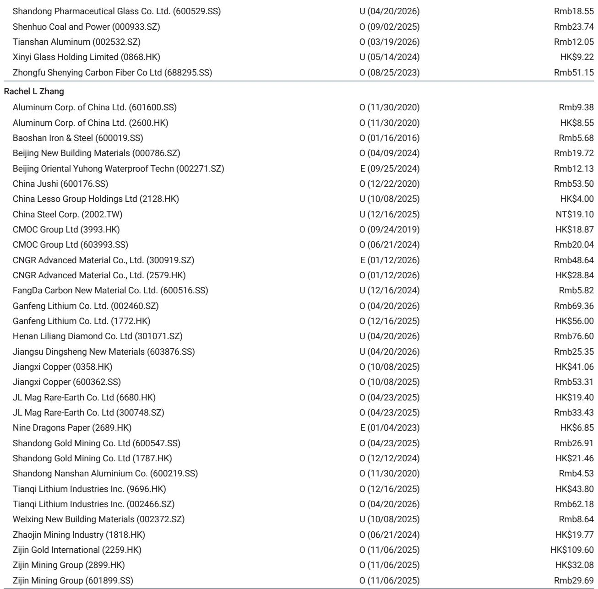
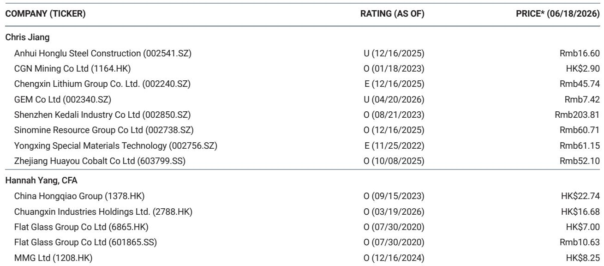
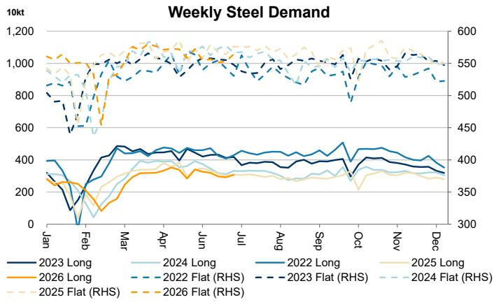

# China's Steel Market Is Signaling a Demand Recovery That Many Investors Are Underestimating

The latest weekly data from China's steel and iron ore markets contains a subtle but powerful message: a demand recovery is quietly taking shape beneath the surface of headline numbers. Apparent consumption of long products rose 5.1% week-over-week, while flat products grew 2.0%. These are not merely statistical blips. They represent a shift in the underlying trajectory of China's construction and manufacturing sectors that most macro narratives have failed to capture.

This matters now because the market has been conditioned to expect weakness. For months, the dominant story has been about China's property sector drag, excess capacity, and deflationary pressures. The data, however, tells a different story when read carefully. Inventory at traders declined 0.6% week-over-week even as mill output increased for both long and flat products. That combination--rising output and falling trader inventory--means demand is absorbing supply at a faster clip than production is increasing.

The iron ore side of the equation reinforces this view. Mill-level iron ore inventories declined 1.2% week-over-week, even as operating rates improved by 0.8 percentage points and daily output rose 1.2%. Mills are running harder but holding less raw material. That is not a sign of caution. It is a sign of confidence that end-demand will clear finished steel inventory.

The argument here is not that China's steel market has suddenly boomed. It is that the data is inconsistent with the prevailing pessimism. The recovery is uneven, product-specific, and still early. But for investors who rely on steel and iron ore as leading indicators of broader economic activity, the signal is worth taking seriously.

## The Divergence Between Long and Flat Products Reveals a Two-Speed Recovery That Has Strategic Implications

The 5.1% week-over-week jump in long product consumption versus the 2.0% increase in flat products is not just a data point. It is a structural clue about which parts of the Chinese economy are reviving. Long products--rebar, wire rod, and structural steel--are predominantly used in construction. Flat products--hot-rolled coil, cold-rolled coil, and galvanized sheet--go into manufacturing, automobiles, appliances, and shipbuilding.

The fact that long product consumption is accelerating faster suggests that construction-related demand is staging a comeback. This is noteworthy because construction has been the primary drag on China's economy for over two years. A 5.1% weekly gain in long product consumption, if sustained, would imply that infrastructure spending and possibly even some property-sector stabilization are gaining traction.

Flat product growth at 2.0% is more modest but still positive. This segment has been relatively resilient throughout the downturn, supported by export demand and manufacturing strength. The slower growth here does not signal weakness in manufacturing. It signals that manufacturing was already operating at a higher base, so incremental gains are smaller in percentage terms.

For strategic investors, this divergence means that the composition of demand matters more than the aggregate number. A recovery led by long products is a recovery led by domestic construction activity. That has different implications for commodity demand, policy support, and sector rotation than a recovery led by exports or manufacturing.

## The Inventory Dynamics Suggest That Mills Are Betting on Sustained Demand, Not Just Restocking

One of the most telling patterns in the weekly data is the combination of rising mill output and falling trader inventory. Long product output rose 2.7% week-over-week, flat product output rose 0.5%, and overall mill utilization reached 90.3%. Yet trader inventory declined 0.6%. This is not a market where producers are building unwanted stockpiles. It is a market where supply is being absorbed.

The mill inventory picture adds another layer. Mill-level steel inventory actually inched up 0.7% week-over-week. That might seem contradictory to the demand recovery thesis, but it is not. Mills are increasing production in anticipation of future demand. The slight build in mill inventory is a buffer, not a sign of distress. When mills are confident, they hold more finished goods because they expect to ship them shortly.

The electric arc furnace utilization rate jumped 2.0 percentage points week-over-week to 64.4%. EAFs are the marginal, higher-cost producers in China's steel industry. When they ramp up, it signals that demand is strong enough to support higher-cost production. The year-over-year comparison is even more striking: EAF utilization is up 7.7 percentage points from the same week last year. That is not a small move. It is a meaningful shift in the cost curve dynamics of the industry.

The iron ore inventory data at mills tells a congruent story. Mill-level iron ore inventory fell 1.2% week-over-week to 225 kilotons per mill. This decline occurred even as operating rates and daily output increased. Mills are drawing down their iron ore stockpiles because they are converting raw material into finished steel at a faster pace. If they expected demand to weaken, they would let iron ore inventory accumulate and slow production. They are doing the opposite.

## The Iron Ore Supply Side Introduces a Critical Tension That Could Reshape Margins

The iron ore supply data from Australia and Brazil adds a complicating factor to the demand recovery story. Combined shipments from the two largest exporters rose by 0.59 million tonnes week-over-week for the period June 8 to June 14. But the composition matters: Australian shipments actually fell by 1.64 million tonnes week-over-week, while Brazilian shipments surged by 2.24 million tonnes.

This divergence is not random. Australian iron ore is typically higher grade and commands a premium. Brazilian ore, while still high quality, often has different logistical and cost characteristics. A shift in the supply mix toward Brazil and away from Australia could alter the pricing dynamics for different grades of iron ore.

More importantly, the overall increase in shipments is happening alongside declining mill inventories. That means the incremental supply is being consumed, not stockpiled at ports. Port-level iron ore inventory actually rose 0.7% week-over-week, but that is a modest increase relative to the volume moving through the system. The market is absorbing both the demand recovery and the supply increase without building significant excess inventory.

For steel mills, this creates a margin squeeze risk. If iron ore prices remain elevated due to supply constraints from Australia while steel prices are still recovering, mill margins could compress. The EAF utilization increase suggests that mills are willing to pay higher raw material costs to capture demand, but that is not sustainable if finished steel prices do not keep pace.

The unanswered question is whether the Brazilian supply increase is structural or temporary. If Brazilian miners can sustain higher shipment volumes, the iron ore market could loosen, benefiting steel mills at the expense of iron ore producers. If the Brazilian surge is a one-off catch-up from weather-related disruptions, then the supply tightness could persist.

## What the Report Does Not Fully Answer: The Sustainability of the Demand Recovery and the Role of Exports

The weekly data provides a snapshot, not a forecast. The most important analytical question that the report does not fully resolve is whether this demand recovery is durable or temporary. Several factors could undermine the current trajectory.

First, the year-over-year comparisons are mixed. Long product consumption is down 0.3% year-over-year, and flat product consumption is down 2.1% year-over-year. The weekly gains are encouraging, but they are recovering from a low base. The market has not yet returned to prior-year levels of consumption.

Second, the role of exports is unclear from the data. China's steel exports have been a significant outlet for excess capacity in recent quarters. If the current demand recovery is being driven partly by export orders rather than domestic consumption, then the sustainability depends on external demand conditions that are outside China's control. Trade tensions, anti-dumping measures, and global economic slowdowns could reverse this channel quickly.

Third, the property sector remains the wild card. Construction-related demand for long products is improving, but it is not yet clear whether this reflects genuine stabilization in property investment or just seasonal infrastructure spending. The property sector's debt restructuring and developer solvency issues have not been resolved. A renewed downturn in property could reverse the long product recovery.

Fourth, the data does not break down demand by end-user sector. Without knowing whether the consumption increase is coming from infrastructure, real estate, or manufacturing, it is difficult to assess the quality of the recovery. Infrastructure-driven demand is more policy-dependent and potentially less durable than private-sector-driven demand.

These open questions are precisely why the weekly data should be read as a signal, not a conclusion. The direction is positive. The magnitude is meaningful. But the sustainability requires confirmation over the coming weeks.

## A Decision Framework for Investors: How to Interpret the Next Four Weeks of Data

Based on the patterns in this report, investors should establish a decision framework that turns weekly data into actionable signals. The framework has three layers.

Layer one is the long product consumption trend. If long product consumption continues to grow at 3% or more week-over-week for the next three weeks, it would confirm that construction demand is structurally improving. If growth decelerates below 1% week-over-week, it would suggest the recovery is fading or seasonal.

Layer two is the EAF utilization rate. If EAF utilization continues to rise above 65% and approaches 70%, it would indicate that demand is strong enough to support the entire cost curve. If EAF utilization stalls or declines, it would suggest that the marginal producer is being priced out, which is a bearish signal.

Layer three is the iron ore inventory at mills. If mill-level iron ore inventory continues to decline while operating rates remain elevated, it would confirm that mills are confident in demand and willing to run lean on raw materials. If mill iron ore inventory starts to build even as output rises, it would suggest that mills are hedging against supply disruptions rather than betting on demand.

These three layers together provide a more complete picture than any single data point. The current data is positive on all three layers. The next four weeks will determine whether that holds.

## Join the Community to Read the Full Report and Review the Original Charts

The weekly data summarized here is only the surface. The full report from the global investment bank includes detailed charts on long and flat product demand trends over multiple years, iron ore shipment breakdowns by country, and historical comparisons that reveal seasonal patterns. These charts provide the context necessary to distinguish between noise and signal.

For investors who track China's industrial economy, steel and iron ore data are among the most timely and reliable leading indicators. They capture real economic activity before it appears in GDP reports or industrial production statistics. The current data suggests a narrative shift is underway. The full report provides the evidence to test that thesis.

Join the community to read the full report and review the original charts.

*This article is for learning and discussion only and does not constitute investment advice.*

Personal reading notes and learning share only. Not investment advice.

