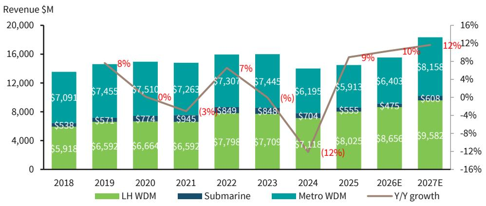
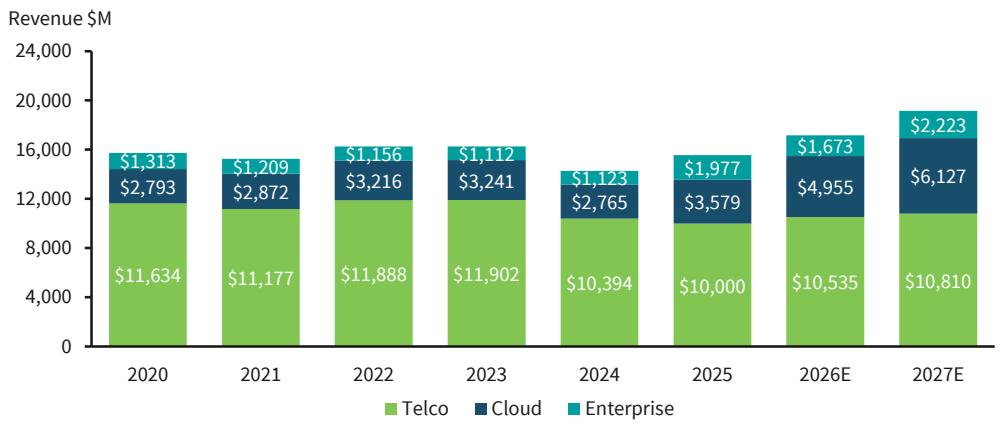
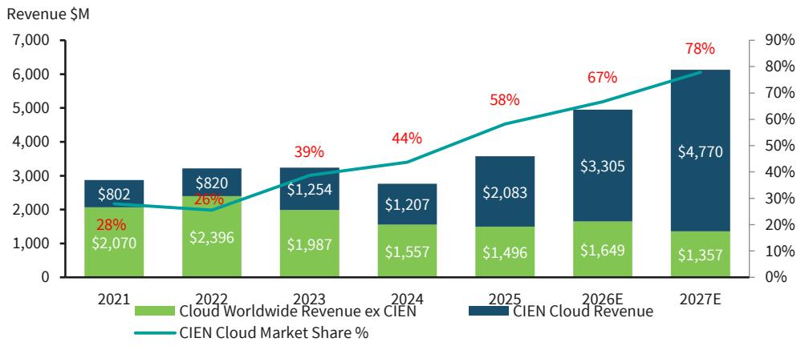
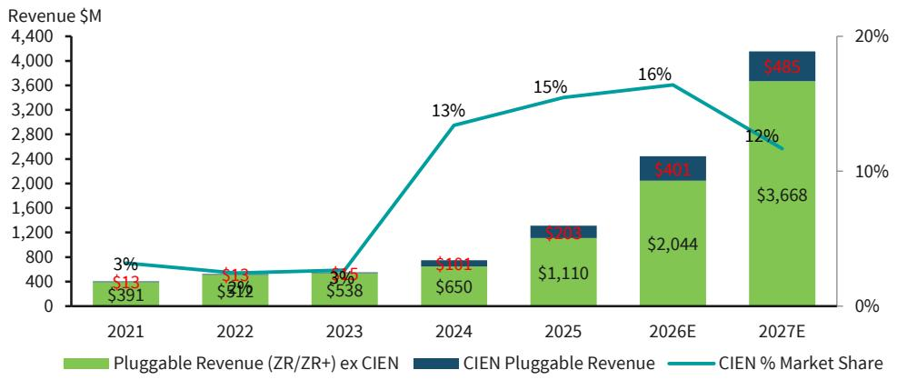
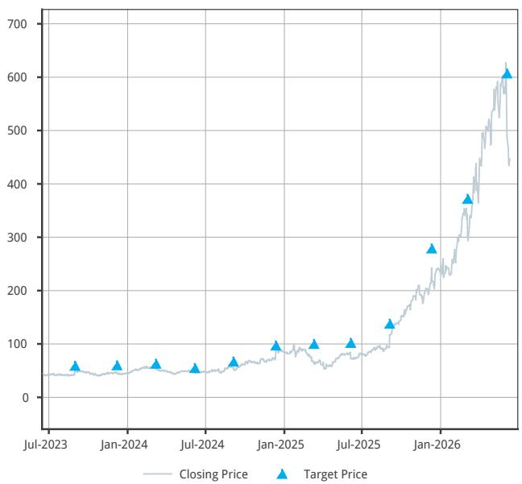
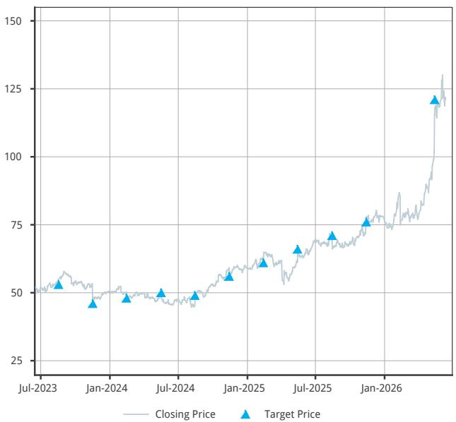

IT Hardware and Communications Equipment

# Updated Optical Model

We update our detailed Optical model that include splits for Long Haul/Submarine/Metro/Pluggable (ZR/ZR+) and Telco/Cloud breakouts. We continue to model DD growth on average over CY26E-27E, given sustained cloud strength and telco momentum.

In this report, we update our expanded Optical model, moving up our 2027 estimates based on strength across end markets and products. For this market, we are looking at the total Optical Networks market, with splits for Long Haul, Submarine, and Metro, as well as Pluggable (ZR/ZR+) breakouts. Additionally, we include a breakout of customer verticals (Telco, Cloud, Enterprise) and the estimated market share CIEN has in each.

Overall growth has been choppy the last few years (prior to 2025), given telco digestion (macro) and cloud lumpiness, though beginning 2025 and now moving into CY26-27 we expect growth to sustain at DD levels. We are encouraged by the strength we see across end markets and products. We now expect DD growth this year, and an acceleration on this growth into 2027, given current dynamics around AI.

Driving our estimates is the expanding cloud applications (i.e. scale across, hyper-rail, DCOM, etc) and cloud demand acceleration, as well as growing MOFN opportunities (\~10-15% of CIEN's telco business) and BEAD funding moving through the market. Our CY26 estimates move to 10% from 8%, and our CY27 estimates move to 12% from 13% (given nuances between FY and CY, as well as the higher base of CY26). We could see upward bias to our estimates with cloud demand acceleration continuing.

In alignment with our estimates, CIEN raised its FY26 guidance and gave high level commentary around FY27 - management expects "meaningful uptick" in revenue in FY27 due partially to hyper-rail and expects to see continued operating leverage into FY27+ (hyper-rail is better margin product). Despite the impressive book-to-bill and backlog posted the prior Q, the most recent Q book-to-bill was over 1 (\~1.3x) and management still expects backlog to grow through the year. We would highlight that we view these backlog dynamics fundamentally different that some of the backlog dynamics in our space post pandemic/supply chain crisis - management mentioned, given their relationships with the hyperscalers, they can see that the products are being deployed (not sitting in warehouses).

## Our conclusions are as follows:

\- AI-related spend has already propelled the Optical market over the past few years (CY19 and CY22 notable standouts as telco spend and hyperscalers built out networks). We continue to

BARC Capital Inc. and/or one of its affiliates does and seeks to do business with companies covered in its research reports. As a result, investors should be aware that the firm may have a conflict of interest that could affect the objectivity of this report. Investors should consider this report as only a single factor in making their investment decision.

IT Hardware and Communications

Equipment

NEUTRAL

IT Hardware and Communications

Equipment

Tim Long

+1 212 526 4043

tim.long@BARC.com

BCI, US

Alyssa Shreves

+1 212 526 7570

alyssa.shreves@BARC.com

BCI, US

Mary Lenox

+1 212 526 6277

mary.lenox@BARC.com

BCI, US

Clarisse Yu

+1 212 526 7025

clarisse.yu@BARC.com

BCI, US

expect DD growth in the cloud vertical in CY26-CY27, as AI-related cloud build-outs broaden and continue to accelerate.

FIGURE 1. Optical Market Expected to Enjoy DD Growth Trends, Driven by Telco Recovery and AI  

bar-line hybrid

| Year | LH WDM ($) | Submarine ($) | Metro WDM ($) | Y/Y growth (%) |
| :--- | :--- | :--- | :--- | :--- |
| 2018 | 5,918 | 538 | 7,091 | |
| 2019 | 6,592 | 571 | 7,455 | 8 |
| 2020 | 6,664 | 774 | 7,510 | 0 |
| 2021 | 6,592 | 945 | 7,263 | -3 |
| 2022 | 7,798 | 849 | 7,307 | 7 |
| 2023 | 7,709 | 848 | 7,445 | -7 |
| 2024 | 7,118 | 704 | 6,195 | -12 |
| 2025E | 8,656 | 555 | 5,913 | 9 |
| 2026E | 8,025 | 475 | 6,403 | 10 |
| 2027E | 9,582 | 608 | 8,158 | 12 |

Source: 650 Group, Bloomberg, company documents, BARC estimates

- We currently do not forecast meaningful coherent Optical inside the data center in CY26 (potentially could see 2H26), and believe that to be more of a CY27+ opportunity.  
- We continue to expect the total Optical market to have a LSD CAGR from CY22-27, taking into account the down years of CY23-24.  
- Within this, we expect Metro to drive the lion's share of growth (down MSD in CY25 though +DD on average in CY26-27), as pluggables accelerate. We expect LH to grow this year and next (+HSD on average), as longer distance scale across (utilizes more LH network approaches vs synchronous scale across applications), MOFN-related demand, and telco general re-architecture of LH networks takes shape. We expect LH to remain roughly half of the total Optical market through CY27.  
• We expect growth in Metro to largely be driven by the rise of ZR/ZR+ Pluggables (+72% and +33% market growth during CY26-27, respectively). We believe the Metro market ex Pluggables is down HSD on average over the same time period.  
- We expect Pluggables to remain a small piece of the overall Optical market (on average high teens % of the total market through CY26-27), given their limited use cases and pricing dynamics (as well as continued growth in other equipment types).

FIGURE 2. Pluggables Remain a Small, Though Rapidly Growing, Part of the Metro Market  

bar-line hybrid

| Year | Metro WDM ex ZR/ZR+Pluggables ($) | Pluggable (ZR/ZR+) ($) | % Pluggables (ZR/ZR+) within Metro WDM (%) |
| :--- | :--- | :--- | :--- |
| 2021 | 6,859 | 404 | 6 |
| 2022 | 6,783 | 525 | 7 |
| 2023 | 6,893 | 553 | 7 |
| 2024 | 5,445 | 750 | 14 |
| 2025 | 4,599 | 1,314 | 22 |
| 2026E | 3,958 | 2,444 | 38 |
| 2027E | 4,004 | 4,153 | 51 |

Source: 650 Group, Bloomberg, company documents, BARC estimates

- We expect Sub to see +DD recovery in CY27 (on easy comps), after multiple down years through CY26. Sub is MSD-HSD% of the total market.  
- Despite the expected cloud growth opportunity, we expect telco to remain the lion's share of the industry (>50%) through CY25-27. However, we acknowledge >50% is materially lower than mid-70% representation just a few years prior.

FIGURE 3. Despite Cloud Growth, Telco Still Majority of the Market  

stacked bar chart

| Year | Telco ($) | Cloud ($) | Enterprise ($) |
| :--- | :--- | :--- | :--- |
| 2020 | 11,634 | 2,793 | 1,313 |
| 2021 | 11,177 | 2,872 | 1,209 |
| 2022 | 11,888 | 3,216 | 1,156 |
| 2023 | 11,902 | 3,241 | 1,112 |
| 2024 | 10,394 | 2,765 | 1,123 |
| 2025 | 10,000 | 3,579 | 1,977 |
| 2026E | 10,535 | 4,955 | 1,673 |
| 2027E | 10,810 | 6,127 | 2,223 |

Source: 650 Group, Bloomberg, company documents, BARC estimates

Within our AI-bucketed stock exposure, Optical continues to have among the highest implied AI multiples, such as CIEN and GLW. For further details on implied AI multiples in our coverage: Implied AI Multiples - Rising Tides Lift Some, 6/01/26

FIGURE 4. Summary of Implied AI P/E as of 5/29/2026

<table><tr><td>Company</td><td>Rating</td><td>p/e on CY27</td><td>core p/E</td><td>implied AI p/e</td></tr><tr><td>SMCI</td><td>EW</td><td>11x</td><td>11x</td><td>7x</td></tr><tr><td>FN</td><td>OW</td><td>36x</td><td>14x</td><td>40x</td></tr><tr><td>CLS</td><td>OW</td><td>26x</td><td>12x</td><td>31x</td></tr><tr><td>ANET</td><td>OW</td><td>37x</td><td>32x</td><td>40x</td></tr><tr><td>CIEN</td><td>OW</td><td>64x</td><td>18x</td><td>115x</td></tr><tr><td>JBL</td><td>OW</td><td>23x</td><td>12x</td><td>37x</td></tr><tr><td>FLEX</td><td>OW</td><td>26x</td><td>12x</td><td>40x</td></tr><tr><td>DELL</td><td>OW</td><td>19x</td><td>10x</td><td>58x</td></tr><tr><td>KEYS</td><td>OW</td><td>27x</td><td>22x</td><td>63x</td></tr><tr><td>HPE</td><td>OW</td><td>15x</td><td>11x</td><td>55x</td></tr><tr><td>GLW</td><td>EW</td><td>47x</td><td>19x</td><td>141x</td></tr><tr><td>CSCO</td><td>EW</td><td>25x</td><td>18x</td><td>72x</td></tr><tr><td>Average</td><td></td><td>30x</td><td>16x</td><td>58x</td></tr></table>

Source: Company Documents, Bloomberg, BARC estimates. Industry View: Neutral. Stock rating: OW=Overweight; EW=Equal Weight; UW=Underweight. For full disclosures on each covered company, including details of our company-specific valuation methodology and risks, please refer to http://publicresearch.barcap.com

## From a vendor standpoint:

\- CIEN (OW-rated) is the only company under our coverage in Optical that has been, and that we continue to expect to be, a share gainer – moving from 16% of the market in CY18 to \~32% in CY27E. We expect CIEN to be a beneficiary of telco customers' recovery, MOFN-related activity, and hyperscalers' AI build-outs, given its existing relationships with each customer set. CIEN also now competes in the ZR/ZR+ market, which we believe is largely incremental revenue for the company (with little cannibalization to existing Metro business).

FIGURE 5. CIEN Cloud Market Share Climbing  

bar-line hybrid

| Year | Cloud Worldwide Revenue ex CIEN ($M) | CIEN Cloud Revenue ($M) | CIEN Cloud Market Share (%) |
| :--- | :--- | :--- | :--- |
| 2021 | 2,070 | 802 | 28 |
| 2022 | 2,396 | 820 | 26 |
| 2023 | 1,987 | 1,254 | 39 |
| 2024 | 1,557 | 1,207 | 44 |
| 2025 | 1,496 | 2,083 | 58 |
| 2026E | 1,649 | 3,305 | 67 |
| 2027E | 1,357 | 4,770 | 78 |

Source: 650 Group, Bloomberg, company documents, BARC estimates

\- Within the ZR/ZR+ market, we expect CIEN to maintain its market share in the mid-teens from CY24-27, given its tech advantage (first win in the market for 800G ZR+) offset by the multiple players in the market. CIEN remains on track to more than double its pluggable revenue from 2025. We expect IADC revenue to be low DD % of total revenue this FY (we forecast \~10%), implying growth of almost 300% y/y (inclusive of pluggables, DCOM, scale-across).

FIGURE 6. CIEN Market Share Within the ZR/ZR+ Pluggable Market Mid-Teens %  

bar-line hybrid

| Year | Pluggable Revenue (ZR/ZR+) ex CIEN ($M) | CIEN Pluggable Revenue ($M) | CIEN % Market Share (%) |
| :--- | :--- | :--- | :--- |
| 2021 | 391 | 13 | 3 |
| 2022 | 512 | 13 | 2 |
| 2023 | 538 | 95 | 3 |
| 2024 | 650 | 181 | 13 |
| 2025 | 1,110 | 203 | 15 |
| 2026E | 2,044 | 401 | 16 |
| 2027E | 3,668 | 485 | 12 |

Source: 650 Group, Bloomberg, company documents, BARC estimates

- CSCO (EW-rated): The company had their first scale-across design win with P200 from two different hypers last Q, with an additional third hyper win announced in early Q4, leading to confidence on the uptake and momentum within this business. The other 50% of AI orders in the Q came from Optics, with five new design wins with different hypers in Q3. Management is confident in the Acacia momentum and expects 200%+ y/y growth in FY26, and we model much higher. CSCO is not a meaningful player in the LH or Sub markets. While CSCO isn’t a major player in optical systems, the company's Acacia business is very strong on components and sub systems.  
- Unlike other verticals under our coverage, white box does not dominate the market share of the Optical market. From CY18 to CY27, we forecast white box to stay around LSD-MSD % of the total market. We believe this is due largely to the technical complexity required of Optical systems and low overall percentage of spending.

## Analyst(s) Certification(s):

I, Tim Long, hereby certify (1) that the views expressed in this research report accurately reflect my personal views about any or all of the subject securities or issuers referred to in this research report and (2) no part of my compensation was, is or will be directly or indirectly related to the specific recommendations or views expressed in this research report.

## Important Disclosures:

BARC is produced by the Investment Bank of BARC Bank PLC and its affiliates (collectively and each individually, "BARC"). All authors contributing to this research report are Research Analysts unless otherwise indicated. The publication date at the top of the report reflects the local time where the report was produced and may differ from the release date provided in GMT.

## Availability of Disclosures:

Where any companies are the subject of this research report, for current important disclosures regarding those companies please refer to https://publicresearch.BARC.com or alternatively send a written request to: BARC Compliance, 745 Seventh Avenue, 13th Floor, New York, NY 10019 or call +1-212-526-1072.

The analysts responsible for preparing this research report have received compensation based upon various factors including the firm's total revenues, a portion of which is generated by investment banking activities, the profitability and revenues of the Markets business and the potential interest of the firm's investing clients in research with respect to the asset class covered by the analyst.

Research analysts employed outside the US by affiliates of BARC Capital Inc. are not registered/qualified as research analysts with FINRA. Such non-US research analysts may not be associated persons of BARC Capital Inc., which is a FINRA member, and therefore may not be subject to FINRA Rule 2241 restrictions on communications with a subject company, public appearances and trading securities held by a research analyst's account.

Analysts regularly conduct site visits to view the material operations of covered companies, but BARC policy prohibits them from accepting payment or reimbursement by any covered company of their travel expenses for such visits.

BARC Department produces various types of research including, but not limited to, fundamental analysis, equity-linked analysis, quantitative analysis, and trade ideas. Recommendations contained in one type of BARC may differ from those contained in other types of BARC, whether as a result of differing time horizons, methodologies, or otherwise.

In order to access BARC Statement regarding Research Dissemination Policies and Procedures, please refer to https://publicresearch.BARC.com/S/RD.htm. In order to access BARC Conflict Management Policy Statement, please refer to: https://publicresearch.BARC.com/S/CM.htm.

## Materially Mentioned Stocks (Ticker, Date, Price)

Ciena Corporation (CIEN, 15-Jun-2026, USD 463.41), Overweight/Neutral, CD/CE/J

Cisco Systems, Inc. (CSCO, 15-Jun-2026, USD 120.17), Equal Weight/Neutral, CD/CE/D/J/K/L/M

Unless otherwise indicated, prices are sourced from Bloomberg and reflect the closing price in the relevant trading market, which may not be the last available closing price at the time of publication.

## Disclosure Legend:

A: BARC Bank PLC and/or an affiliate has been lead manager or co-lead manager of a publicly disclosed offer of securities of the issuer in the previous 12 months.

B: An employee or non-executive director of BARC PLC is a director of this issuer.

CD: BARC Bank PLC and/or an affiliate is a market-maker in debt securities issued by this issuer.

CE: BARC Bank PLC and/or an affiliate is a market-maker in equity securities issued by this issuer.

CH: BARC Bank PLC and/or its group companies makes, or will make, a market in the securities (as defined under paragraph 16.2 (k) of the HK SFC Code of Conduct) in respect of this issuer.

D: BARC Bank PLC and/or an affiliate has received compensation for investment banking services from this issuer in the past 12 months.

E: BARC Bank PLC and/or an affiliate expects to receive or intends to seek compensation for investment banking services from this issuer within the next 3 months.

FA: BARC Bank PLC and/or an affiliate beneficially owns 1% or more of a class of equity securities of this issuer, as calculated in accordance with US regulations.

FB: BARC Bank PLC and/or an affiliate beneficially owns a long position of more than 0.5% of a class of equity securities of this issuer, as calculated in accordance with EU regulations.

FC: BARC Bank PLC and/or an affiliate beneficially owns a short position of more than 0.5% of a class of equity securities of this issuer, as calculated in accordance with EU regulations.

FD: BARC Bank PLC and/or an affiliate beneficially owns 1% or more of a class of equity securities of this issuer, as calculated in accordance with South Korean regulations.

FE: BARC Bank PLC and/or its group companies has financial interests in relation to this issuer and such interests aggregate to an amount equal to or more than 1% of this issuer's market capitalization, as calculated in accordance with HK regulations.

GD: One of the Research Analysts on the fundamental credit coverage team (and/or a member of his or her household) has a long position in the common equity securities of this issuer.

GE: One of the Research Analysts on the fundamental equity coverage team (and/or a member of his or her household) has a long position in the common equity securities of this issuer.

H: This issuer beneficially owns more than 5% of any class of common equity securities of BARC PLC.

I: BARC Bank PLC and/or an affiliate is party to an agreement with this issuer for the provision of financial services to BARC Bank PLC and/or an affiliate.

J: BARC Bank PLC and/or an affiliate is a liquidity provider and/or trades regularly in the securities of this issuer and/or in any related derivatives.

K: BARC Bank PLC and/or an affiliate has received non-investment banking related compensation (including compensation for brokerage services, if applicable) from this issuer within the past 12 months.

L: This issuer is, or during the past 12 months has been, an investment banking client of BARC Bank PLC and/or an affiliate.

M: This issuer is, or during the past 12 months has been, a non-investment banking client (securities related services) of BARC Bank PLC and/or an affiliate.

N: This issuer is, or during the past 12 months has been, a non-investment banking client (non-securities related services) of BARC Bank PLC and/or an affiliate.

O: Not in use.

P: A partner, director or officer of BARC Capital Canada Inc. has, during the preceding 12 months, provided services to the subject company for remuneration, other than normal course investment advisory or trade execution services.

Q: BARC Bank PLC and/or an affiliate is a Corporate Broker to this issuer.

R: BARC Capital Canada Inc. has received compensation for investment banking services from this issuer in the past 12 months.

S: This issuer is a Corporate Broker to BARC PLC.

T: BARC Bank PLC and/or an affiliate is providing investor engagement services to this issuer.

U: The equity securities of this Canadian issuer include subordinate voting restricted shares.

V: The equity securities of this Canadian issuer include non-voting restricted shares.

## Risk Disclosure(s)

Master limited partnerships (MLPs) are pass-through entities structured as publicly listed partnerships. For tax purposes, distributions to MLP unit holders may be treated as a return of principal. Investors should consult their own tax advisors before investing in MLP units.

## Disclosure(s) regarding Information Sources

Bloomberg® is a trademark and service mark of Bloomberg Finance L.P. and its affiliates (collectively “Bloomberg”) and the Bloomberg Indices are trademarks of Bloomberg. Bloomberg or Bloomberg’s licensors own all proprietary rights in the Bloomberg Indices. Bloomberg does not approve or endorse this material, or guarantee the accuracy or completeness of any information herein, or make any warranty, express or implied, as to the results to be obtained therefrom and, to the maximum extent allowed by law, Bloomberg shall have no liability or responsibility for injury or damages arising in connection therewith.

## Guide to the BARC Fundamental Equity Research Rating System:

Our coverage analysts use a relative rating system in which they rate stocks as Overweight, Equal Weight or Underweight (see definitions below) relative to other companies covered by the analyst or a team of analysts that are deemed to be in the same industry (the "industry coverage universe").

In addition to the stock rating, we provide industry views which rate the outlook for the industry coverage universe as Positive, Neutral or Negative (see definitions below). A rating system using terms such as buy, hold and sell is not the equivalent of our rating system. Investors should carefully read the entire research report including the definitions of all ratings and not infer its contents from ratings alone.

## Stock Rating

Overweight - The stock is expected to outperform the unweighted expected total return of the industry coverage universe over a 12-month investment horizon.

Equal Weight - The stock is expected to perform in line with the unweighted expected total return of the industry coverage universe over a 12-month investment horizon.

Underweight - The stock is expected to underperform the unweighted expected total return of the industry coverage universe over a 12-month investment horizon.

Rating Suspended - The rating and target price have been suspended temporarily due to market events that made coverage impracticable or to comply with applicable regulations and/or firm policies in certain circumstances including where the Investment Bank of BARC Bank PLC is acting in an advisory capacity in a merger or strategic transaction involving the company.

## Industry View

Positive - industry coverage universe fundamentals/valuations are improving.

Neutral - industry coverage universe fundamentals/valuations are steady, neither improving nor deteriorating.

Negative - industry coverage universe fundamentals/valuations are deteriorating.

Below is the list of companies that constitute the "industry coverage universe":

IT Hardware and Communications Equipment

<table><tr><td>Apple, Inc. (AAPL)</td><td>Arista Networks, Inc. (ANET)</td><td>Axon Enterprise, Inc. (AXON)</td></tr><tr><td>Celestica Inc. (CLS)</td><td>Ciena Corporation (CIEN)</td><td>Cisco Systems, Inc. (CSCO)</td></tr><tr><td>Corning Incorporated (GLW)</td><td>Corsair Gaming, Inc. (CRSR)</td><td>Dell Technologies Inc. (DELL)</td></tr><tr><td>Everpure, Inc. (P)</td><td>F5, Inc. (FFIV)</td><td>Fabrinet (FN)</td></tr><tr><td>Flex Ltd (FLEX)</td><td>Garmin (GRMN)</td><td>Harmonic, Inc. (HLIT)</td></tr><tr><td>Hewlett Packard Enterprise Company (HPE)</td><td>HP Inc. (HPQ)</td><td>Jabil (JBL)</td></tr><tr><td>Keysight Technologies, Inc. (KEYS)</td><td>Logitech (LOGI)</td><td>Motorola Solutions, Inc. (MSI)</td></tr><tr><td>NetApp, Inc. (NTAP)</td><td>Nutanix, Inc (NTNX)</td><td>Super Micro (SMCI)</td></tr><tr><td>Ubiquiti, Inc. (UI)</td><td></td><td></td></tr></table>

## Distribution of Ratings:

BARC Equity Research has 1833 companies under coverage.

51% have been assigned an Overweight rating which, for purposes of mandatory regulatory disclosures, is classified as a Buy rating; 47% of companies with this rating are investment banking clients of the Firm; 64% of the issuers with this rating have received financial services from the Firm.

34% have been assigned an Equal Weight rating which, for purposes of mandatory regulatory disclosures, is classified as a Hold rating; 36% of companies with this rating are investment banking clients of the Firm; 57% of the issuers with this rating have received financial services from the Firm.

14% have been assigned an Underweight rating which, for purposes of mandatory regulatory disclosures, is classified as a Sell rating; 31% of companies with this rating are investment banking clients of the Firm; 58% of the issuers with this rating have received financial services from the Firm.

## Guide to the BARC Price Target:

Each analyst has a single price target on the stocks that they cover. The price target represents that analyst's expectation of where the stock will trade in the next 12 months. Upside/downside scenarios, where provided, represent potential upside/potential downside to each analyst's price target over the same 12-month period.

## Types of investment recommendations produced by BARC Equity Research:

In addition to any ratings assigned under BARC' formal rating systems, this publication may contain investment recommendations in the form of trade ideas, thematic screens, scorecards or portfolio recommendations that have been produced by analysts within Equity Research. Any such investment recommendations shall remain open until they are subsequently amended, rebalanced or closed in a future research report.

BARC may also re-distribute equity research reports produced by third-party research providers that contain recommendations that differ from and/or conflict with those published by BARC' Equity Research Department.

## Disclosure of other investment recommendations produced by BARC Equity Research:

BARC Equity Research may have published other investment recommendations in respect of the same securities/instruments recommended in this research report during the preceding 12 months. To view all investment recommendations published by BARC Equity Research in the preceding 12 months please refer to https://live.barcap.com/go/research/Recommendations.

## Legal entities involved in producing BARC:

BARC Bank PLC (BARC, UK)

BARC Capital Inc. (BCI, US)

BARC Bank Ireland PLC, Frankfurt Branch (BBI, Frankfurt)

BARC Bank Ireland PLC, Paris Branch (BBI, Paris)

BARC Bank Ireland PLC, Milan Branch (BBI, Milan)

BARC Securities Japan Limited (BSJL, Japan)

BARC Bank PLC, Hong Kong Branch (BARC Bank, Hong Kong)

BARC Bank Mexico, S.A. (BBMX, Mexico)

BARC Capital Casa de Bolsa, S.A. de C.V. (BCCB, Mexico)

BARC Securities (India) Private Limited (BSIPL, India)

BARC Bank PLC, Singapore Branch (BARC Bank, Singapore)

BARC Bank PLC, DIFC Branch (BARC Bank, DIFC)

## Restricted Distribution

This report is not meant for distribution into South Korea.

## Ciena Corporation (CIEN / CIEN)

Stock Rating: OVERWEIGHT

Industry View: NEUTRAL

Closing Price: USD 463.41 (15-Jun-2026)

## Rating and Price Target Chart - USD (as of 15-Jun-2026)

Currency=USD

line chart

| Date     | Closing Price | Target Price |
| -------- | ------------- | ------------ |
| Jul-2023 | ~40           | ~50          |
| Jan-2024 | ~50           | ~60          |
| Jul-2024 | ~60           | ~70          |
| Jan-2025 | ~80           | ~100         |
| Jul-2025 | ~90           | ~110         |
| Jan-2026 | ~250          | ~380         |
| Dec-2026 | ~600          | ~610         |

Source: IDC, BARC

Link to BARC Live for interactive charting

<table><tr><td>Publication Date</td><td>Closing Price*</td><td>Rating</td><td>Adjusted Price Target</td></tr><tr><td>05-Jun-2026</td><td>535.63</td><td></td><td>607.00</td></tr><tr><td>05-Mar-2026</td><td>299.30</td><td></td><td>372.00</td></tr><tr><td>11-Dec-2025</td><td>221.85</td><td></td><td>279.00</td></tr><tr><td>04-Sep-2025</td><td>94.82</td><td></td><td>138.00</td></tr><tr><td>05-Jun-2025</td><td>83.89</td><td></td><td>102.00</td></tr><tr><td>11-Mar-2025</td><td>63.95</td><td></td><td>100.00</td></tr><tr><td>12-Dec-2024</td><td>73.21</td><td></td><td>97.00</td></tr><tr><td>04-Sep-2024</td><td>55.35</td><td></td><td>67.00</td></tr><tr><td>06-Jun-2024</td><td>48.56</td><td></td><td>55.00</td></tr><tr><td>07-Mar-2024</td><td>61.96</td><td></td><td>63.00</td></tr><tr><td>07-Dec-2023</td><td>45.76</td><td></td><td>60.00</td></tr><tr><td>31-Aug-2023</td><td>43.16</td><td></td><td>59.00</td></tr></table>

On 16-Jun-2023, prior to any intra-day change that may have been published, the rating for this security was Overweight, and the adjusted price target was 66.00.

Source: Bloomberg, BARC

\*This is the closing price referenced in the publication, which may not be the last available closing price at the time of publication.

Historical stock prices and price targets may have been adjusted for stock splits and dividends.

CD: BARC Bank PLC and/or an affiliate is a market-maker in debt securities issued by Ciena Corporation.

CE: BARC Bank PLC and/or an affiliate is a market-maker in equity securities issued by Ciena Corporation.

J: BARC Bank PLC and/or an affiliate is a liquidity provider and/or trades regularly in the securities by Ciena Corporation and/or in any related derivatives.

Valuation Methodology: Our price target of \$607 reflects a P/E multiple of 50x our FY28 EPS estimate of \$12.14, a premium to the 2-year average that we believe is justified based on expected triple-double-digit EPS growth in FY26e and DD growth in FY27e-FY28e.

Risks which May Impede the Achievement of the BARC Valuation and Price Target: 1) Competition. The optical space is very competitive given high growth relative to other networking segments. 2) Volatility. Ciena's business with Telcos has consistently been lumpy, and Cloud players could become more volatile. 3) Vertical integration. Cloud vendors like to vertically integrate, though efforts to do so in optical have stalled.

## Cisco Systems, Inc. (CSCO / CSCO)

Stock Rating: EQUAL WEIGHT

Industry View: NEUTRAL

Closing Price: USD 120.17 (15-Jun-2026)

## Rating and Price Target Chart - USD (as of 15-Jun-2026)

Currency=USD

line chart

| Date     | Closing Price | Target Price |
| -------- | ------------- | ------------ |
| Jul-2023 | ~50           | ~52          |
| Jan-2024 | ~48           | ~47          |
| Jul-2024 | ~49           | ~50          |
| Jan-2025 | ~55           | ~58          |
| Jul-2025 | ~65           | ~68          |
| Jan-2026 | ~75           | ~78          |
| Current  | ~130          | ~120         |

Source: IDC, BARC  
Link to BARC Live for interactive charting

<table><tr><td>Publication Date</td><td>Closing Price*</td><td>Rating</td><td>Adjusted Price Target</td></tr><tr><td>14-May-2026</td><td>101.87</td><td></td><td>121.00</td></tr><tr><td>13-Nov-2025</td><td>73.96</td><td></td><td>76.00</td></tr><tr><td>14-Aug-2025</td><td>70.40</td><td></td><td>71.00</td></tr><tr><td>14-May-2025</td><td>61.29</td><td></td><td>66.00</td></tr><tr><td>12-Feb-2025</td><td>62.43</td><td></td><td>61.00</td></tr><tr><td>13-Nov-2024</td><td>59.18</td><td></td><td>56.00</td></tr><tr><td>14-Aug-2024</td><td>45.44</td><td></td><td>49.00</td></tr><tr><td>16-May-2024</td><td>49.67</td><td></td><td>50.00</td></tr><tr><td>14-Feb-2024</td><td>50.28</td><td></td><td>48.00</td></tr><tr><td>16-Nov-2023</td><td>53.28</td><td></td><td>46.00</td></tr><tr><td>17-Aug-2023</td><td>52.96</td><td></td><td>53.00</td></tr></table>

On 16-Jun-2023, prior to any intra-day change that may have been published, the rating for this security was Equal Weight, and the adjusted price target was 51.00.

Source: Bloomberg, BARC

\*This is the closing price referenced in the publication, which may not be the last available closing price at the time of publication.

Historical stock prices and price targets may have been adjusted for stock splits and dividends.

CD: BARC Bank PLC and/or an affiliate is a market-maker in debt securities issued by Cisco Systems, Inc..

CE: BARC Bank PLC and/or an affiliate is a market-maker in equity securities issued by Cisco Systems, Inc..

D: BARC Bank PLC and/or an affiliate has received compensation for investment banking services from Cisco Systems, Inc. in the past 12 months.

J: BARC Bank PLC and/or an affiliate is a liquidity provider and/or trades regularly in the securities by Cisco Systems, Inc. and/or in any related derivatives.

K: BARC Bank PLC and/or an affiliate has received non-investment banking related compensation (including compensation for brokerage services, if applicable) from Cisco Systems, Inc. within the past 12 months.

L: Cisco Systems, Inc. is, or during the past 12 months has been, an investment banking client of BARC Bank PLC and/or an affiliate.

M: Cisco Systems, Inc. is, or during the past 12 months has been, a non-investment banking client (securities related services) of BARC Bank PLC and/or an affiliate.

Valuation Methodology: Our PT of \$121 is based on a 25x P/E multiple on our CY27e EPS estimate of \$4.85.

Risks which May Impede the Achievement of the BARC Valuation and Price Target: 1) Cloud. Cisco's shares in key hardware segments are much higher on-prem then on the cloud, so the transition may negatively impact revenues. 2) Software transition. Management is investing to keep the move to software rolling. However, many in the industry are hesitant to take as-a-service offerings for typical hardware purchases. 3) Macro. Future macroeconomic softness could pressure the IT spending environment, and could continue to depress sales growth if economic and/or political uncertainty persist. Upside risks include future share gains in core verticals, better traction in software and cloud, and macro holding up better than expected.

## Disclaimer:

This publication has been produced by BARC Department in the Investment Bank of BARC Bank PLC and/or one or more of its affiliates (collectively and each individually, "BARC").

It has been prepared for institutional investors and not for retail investors. It has been distributed by one or more BARC affiliated legal entities listed below or by an independent and non-affiliated third-party entity (as may be communicated to you by such third-party entity in its communications with you). It is provided for information purposes only, and BARC makes no express or implied warranties, and expressly disclaims all warranties of merchantability or fitness for a particular purpose or use with respect to any data included in this publication. To the extent that this publication states on the front page that it is intended for institutional investors and is not subject to all of the independence and disclosure standards applicable to debt research reports prepared for retail investors under U.S. FINRA Rule 2242, it is an “institutional debt research report” and distribution to retail investors is strictly prohibited. BARC also distributes such institutional debt research reports to various issuers, media, regulatory and academic organisations for their own internal informational news gathering, regulatory or academic purposes and not for the purpose of making investment decisions regarding any debt securities. Media organisations are prohibited from re-publishing any opinion or recommendation concerning a debt issuer or debt security contained in any BARC institutional debt research report. Any such recipients that do not want to continue receiving BARC institutional debt research reports should contact debtresearch@BARC.com. Unless clients have agreed to receive “institutional debt research reports” as required by US FINRA Rule 2242, they will not receive any such reports that may be co-authored by non-debt research analysts. Eligible clients may get access to such cross asset reports by contacting debtresearch@BARC.com. BARC will not treat unauthorized recipients of this report as its clients and accepts no liability for use by them of the contents which may not be suitable for their personal use. Prices shown are indicative and BARC is not offering to buy or sell or soliciting offers to buy or sell any financial instrument.

Without limiting any of the foregoing and to the extent permitted by law, in no event shall BARC, nor any affiliate, nor any of their respective officers, directors, partners, or employees have any liability for (a) any special, punitive, indirect, or consequential damages; or (b) any lost profits, lost revenue, loss of anticipated savings or loss of opportunity or other financial loss, even if notified of the possibility of such damages, arising from any use of this publication or its contents.

Other than disclosures relating to BARC, the information contained in this publication (including third-party data) has been obtained from sources that BARC believes to be reliable, but BARC does not represent or warrant that it is accurate or complete. Third-party data, including third-party forecasts and predictions, is provided for information purposes only, has not been adopted or endorsed by BARC, and does not represent the views or opinions of BARC. Presentations by Third-Party Speakers: Any views or opinions expressed by third-party speakers during a BARC-hosted event are solely those of the speaker and do not represent the views or opinions of BARC. BARC is not responsible for, and makes no warranties whatsoever as to, the information or opinions contained in any written, electronic, audio or video presentations by any third-party speakers, and such presentations have not been adopted or endorsed by BARC and do not represent the views or opinions of BARC. Content from third-party presentations is provided for information purposes only and has not been independently verified by BARC for its accuracy or completeness.

The views in this publication are solely and exclusively those of the authoring analyst(s) and are subject to change, and BARC has no obligation to update its opinions or the information in this publication. Unless otherwise disclosed herein, the analysts who authored this report have not received any compensation from the subject companies in the past 12 months. If this publication contains recommendations, they are general recommendations that were prepared independently of any other interests, including those of BARC and/or its affiliates, and/or the subject companies. This publication does not contain personal investment recommendations or investment advice or take into account the individual financial circumstances or investment objectives of the clients who receive it. BARC is not a fiduciary to any recipient of this publication. The securities and other investments discussed herein may not be suitable for all investors and may not be available for purchase in all jurisdictions. The United States imposed sanctions on certain Chinese companies (https://ofac.treasury.gov/sanctions-programs-and-country-information/chinese-military-companies-sanctions), which may restrict U.S. persons from purchasing securities issued by those companies. Investors must independently evaluate the merits and risks of the investments discussed herein, including any sanctions restrictions that may apply, consult any independent advisors they believe necessary, and exercise independent judgment with regard to any investment decision. The value of and income from any investment may fluctuate from day to day as a result of changes in relevant economic markets (including changes in market liquidity). The information herein is not intended to predict actual results, which may differ substantially from those reflected. Past performance is not necessarily indicative of future results. The information provided does not constitute a financial benchmark and should not be used as a submission or contribution of input data for the purposes of determining a financial benchmark.

This publication is not investment company sales literature as defined by Section 270.24(b) of the US Investment Company Act of 1940, nor is it intended to constitute an offer, promotion or recommendation of, and should not be viewed as marketing (including, without limitation, for the purposes of the UK Alternative Investment Fund Managers Regulations 2013 (SI 2013/1773) or AIFMD (Directive 2011/61)) or pre-marketing (including, without limitation, for the purposes of Directive (EU) 2019/1160) of the securities, products or issuers that are the subject of this report.

Third Party Distribution: Any views expressed in this communication are solely those of BARC and have not been adopted or endorsed by any third party distributor.

United Kingdom: This document is being distributed (1) only by or with the approval of an authorised person (BARC Bank PLC) or (2) to, and is directed at (a) persons in the United Kingdom having professional experience in matters relating to investments and who fall within the definition of "investment professionals" in Article 19(5) of the Financial Services and Markets Act 2000 (Financial Promotion) Order 2005 (the "Order"); or (b) high net worth companies, unincorporated associations and partnerships and trustees of high value trusts as described in Article 49(2) of the Order; or (c) other persons to whom it may otherwise lawfully be communicated (all such persons being "Relevant Persons"). Any investment or investment activity to which this communication relates is only available to and will only be engaged in with Relevant Persons. Any other persons who receive this communication should not rely on or act upon it. BARC Bank PLC is authorised by the Prudential Regulation Authority and regulated by the Financial Conduct Authority and the Prudential Regulation Authority and is a member of the London Stock Exchange.

European Economic Area (“EEA”): This material is being distributed to any “Authorised User” located in a Restricted EEA Country by BARC Bank Ireland PLC. The Restricted EEA Countries are Austria, Bulgaria, Estonia, Finland, Hungary, Iceland, Liechtenstein, Lithuania, Luxembourg, Malta, Portugal, Romania, Slovakia and Slovenia. For any other “Authorised User” located in a country of the European Economic Area, this material is being distributed by BARC Bank PLC. BARC Bank Ireland PLC is a bank authorised by the Central Bank of Ireland whose registered office is at 1 Molesworth Street, Dublin 2, Ireland. BARC Bank PLC is not registered in France with the Autorité des marchés financiers or the Autorité de contrôle prudentiel. Authorised User means each individual associated with the Client who is notified by the Client to BARC and authorised to use the Research Services. The Restricted EEA Countries will be amended if required.

Finland: Notwithstanding Finland's status as a Restricted EEA Country, Research Services may also be provided by BARC Bank PLC where permitted by the terms of its cross-border license.

Americas: The Investment Bank of BARC Bank PLC undertakes U.S. securities business in the name of its wholly owned subsidiary BARC Capital Inc., a FINRA and SIPC member. BARC Capital Inc., a U.S. registered broker/dealer, is distributing this material in the United States and, in connection therewith accepts responsibility for its contents. Any U.S. person wishing to effect a transaction in any security discussed herein should do so only by contacting a representative of BARC Capital Inc. in the U.S. at 745 Seventh Avenue, New York, New York 10019.

Non-U.S. persons should contact and execute transactions through a BARC Bank PLC branch or affiliate in their home jurisdiction unless local regulations permit otherwise.

This material is distributed in Canada by BARC Capital Canada Inc., a registered investment dealer, a Dealer Member of Canadian Investment Regulatory Organization (www.ciro.ca), and a Member of the Canadian Investor Protection Fund (CIPF).

This material is distributed in Mexico by BARC Bank Mexico, S.A. and/or BARC Capital Casa de Bolsa, S.A. de C.V. This material is distributed in the Cayman Islands and in the Bahamas by BARC Capital Inc., which it is not licensed or registered to conduct and does not conduct business in, from or within those jurisdictions and has not filed this material with any regulatory body in those jurisdictions.

Japan: This material is being distributed to institutional investors in Japan by BARC Securities Japan Limited. BARC Securities Japan Limited is a joint-stock company incorporated in Japan with registered office of 6-10-1 Roppongi, Minato-ku, Tokyo 106-6131, Japan. It is a subsidiary of BARC Bank PLC and a registered financial instruments firm regulated by the Financial Services Agency of Japan. Registered Number: Kanto Zaimukyokucho (kinsho) No. 143.

Asia Pacific (excluding Japan): BARC Bank PLC, Hong Kong Branch is distributing this material in Hong Kong as an authorised institution regulated by the Hong Kong Monetary Authority. Registered Office: 41/F, Cheung Kong Center, 2 Queen's Road Central, Hong Kong.

All Indian securities-related research and other equity research produced by BARC' Investment Bank are distributed in India by BARC Securities (India) Private Limited (BSIPL). BSIPL is a company incorporated under the Companies Act, 1956 having CIN U67120MH2006PTC161063. BSIPL is registered and regulated by the Securities and Exchange Board of India (SEBI) as a Research Analyst: INH000001519; Portfolio Manager INP000002585; Stock Broker INZ000269539 (member of NSE and BSE); Depository Participant with the National Securities & Depositories Limited (NSDL): DP ID: IN-DP-NSDL-478-2020; Investment Adviser: INA000000391. BSIPL is also registered as a Mutual Fund Advisor having AMFI ARN No. 53308. The registered office of BSIPL is at Nirlon Knowledge Park, 9th floor, Block B-6, Off. Western Express Highway, Goregaon (East), Mumbai – 400063, India. Telephone No: +91 22 61754000 Fax number: +91 22 61754099. Any other reports produced by BARC' Investment Bank are distributed in India by BARC Bank PLC, India Branch, an associate of BSIPL in India that is registered with Reserve Bank of India (RBI) as a Banking Company under the provisions of The Banking Regulation Act, 1949 (Regn No BOM43) and registered with SEBI as Merchant Banker (Regn No INM000002129) and also as Banker to the Issue (Regn No INBI00000950). BARC Investments and Loans (India) Limited, registered with RBI as Non Banking Financial Company (Regn No RBI CoR-07-00258), and BARC Wealth Trustees (India) Private Limited, registered with Registrar of Companies (CIN U93000MH2008PTC188438), are associates of BSIPL in India that are not authorised to distribute any reports produced by BARC' Investment Bank.

This material is distributed in Singapore by the Singapore Branch of BARC Bank PLC, a bank licensed in Singapore by the Monetary Authority of Singapore. For matters in connection with this material, recipients in Singapore may contact the Singapore branch of BARC Bank PLC, whose registered address is 10 Marina Boulevard, #23-01 Marina Bay Financial Centre Tower 2, Singapore 018983.

This material, where distributed to persons in Australia, is produced or provided by BARC Bank PLC.

This communication is directed at persons who are a “Wholesale Client” as defined by the Australian Corporations Act 2001.

Please note that the Australian Securities and Investments Commission (ASIC) has provided certain exemptions to BARC Bank PLC (BBPLC) under paragraph 911A(2)(I) of the Corporations Act 2001 from the requirement to hold an Australian financial services licence (AFSL) in respect of financial services provided to Australian Wholesale Clients, on the basis that BBPLC is authorised by the Prudential Regulation Authority of the United Kingdom (PRA) and regulated by the Financial Conduct Authority (FCA) of the United Kingdom and the PRA under United Kingdom laws. The United Kingdom has laws which differ from Australian laws. To the extent that this communication involves the provision of financial services by BBPLC to Australian Wholesale Clients, BBPLC relies on the relevant exemption from the requirement to hold an AFSL. Accordingly, BBPLC does not hold an AFSL.

This communication may be distributed to you by either: (i) BARC Bank PLC directly, (ii) Barrenjoey Markets Pty Limited (ACN 636 976 059, "Barrenjoey"), the holder of Australian Financial Services Licence (AFSL) 521800, a non-affiliated third party distributor, where clearly identified to you by Barrenjoey. Barrenjoey is not an agent of BARC Bank PLC or (iii) such other non-affiliated third-party distributor(s) as may be clearly identified to you. Such non-affiliated third-party distributor(s) are not agents of BARC Bank PLC.

This material, where distributed in New Zealand, is produced or provided by BARC Bank PLC. BARC Bank PLC is not registered, filed with or approved by any New Zealand regulatory authority. This material is not provided under or in accordance with the Financial Markets Conduct Act of 2013 (“FMCA”), and is not a disclosure document or “financial advice” under the FMCA. This material is distributed to you by either: (i) BARC Bank PLC directly or (ii) Barrenjoey Markets Pty Limited (“Barrenjoey”), a non-affiliated third party distributor, where clearly identified to you by Barrenjoey. Barrenjoey is not an agent of BARC Bank PLC. This material may only be distributed to “wholesale investors” that meet the “investment business”, “investment activity”, “large”, or “government agency” criteria specified in Schedule 1 of the FMCA.

Middle East: Nothing herein should be considered investment advice as defined in the Israeli Regulation of Investment Advisory, Investment Marketing and Portfolio Management Law, 1995 (“Advisory Law”). This document is being made to eligible clients (as defined under the Advisory Law) only. BARC Israeli branch previously held an investment marketing license with the Israel Securities Authority but it cancelled such license on 30/11/2014 as it solely provides its services to eligible clients pursuant to available exemptions under the Advisory Law, therefore a license with the Israel Securities Authority is not required. Accordingly, BARC does not maintain an insurance coverage pursuant to the Advisory Law.

This material is distributed in the United Arab Emirates (including the Dubai International Financial Centre) and Qatar by BARC Bank PLC. BARC Bank PLC in the Dubai International Financial Centre (Registered No. 0060) is regulated by the Dubai Financial Services Authority (DFSA). Principal place of business in the Dubai International Financial Centre: The Gate Village, Building 4, Level 4, PO Box 506504, Dubai, United Arab Emirates. BARC Bank PLC-DIFC Branch, may only undertake the financial services activities that fall within the scope of its existing DFSA licence. Related financial products or services are only available to Professional Clients, as defined by the Dubai Financial Services Authority. BARC Bank PLC in the UAE is regulated by the Central Bank of the UAE and is licensed to conduct business activities as a branch of a commercial bank incorporated outside the UAE in Dubai (Licence No.: 13/1844/2008, Registered Office: Building No. 6, Burj Dubai Business Hub, Sheikh Zayed Road, Dubai City) and Abu Dhabi (Licence No.: 13/952/2008, Registered Office: Al Jazira Towers, Hamdan Street, PO Box 2734, Abu Dhabi). This material does not constitute or form part of any offer to issue or sell, or any solicitation of any offer to subscribe for or purchase, any securities or investment products in the UAE (including the Dubai International Financial Centre) and accordingly should not be construed as such. Furthermore, this information is being made available on the basis that the recipient acknowledges and understands that the entities and securities to which it may relate have not been approved, licensed by or registered with the UAE Central Bank, the Dubai Financial Services Authority or any other relevant licensing authority or governmental agency in the UAE. The content of this report has not been approved by or filed with the UAE Central Bank or Dubai Financial Services Authority. BARC Bank PLC in the Qatar Financial Centre (Registered No. 00018) is authorised by the Qatar Financial Centre Regulatory Authority (QFCRA). BARC Bank PLC-QFC Branch may only undertake the regulated activities that fall within the scope of its existing QFCRA licence. Principal place of business in Qatar: Qatar Financial Centre, Office 1002, 10th Floor, QFC Tower, Diplomatic Area, West Bay, PO Box 15891, Doha, Qatar. Related financial products or services are only available to Business Customers as defined by the Qatar Financial Centre Regulatory Authority.

Russia: This material is not intended for investors who are not Qualified Investors according to the laws of the Russian Federation as it might contain information about or description of the features of financial instruments not admitted for public offering and/or circulation in the Russian Federation and thus not eligible for non-Qualified Investors. If you are not a Qualified Investor according to the laws of the Russian Federation, please dispose of any copy of this material in your possession.

Sustainable Investing Related Research: There is currently no globally accepted framework or definition (legal, regulatory or otherwise) of, nor market consensus as to what constitutes a ‘sustainable’, ‘ESG’, ‘green’, ‘climate-friendly’ or an equivalent company, investment, strategy or consideration or what precise attributes are required to be eligible to be categorised by such terms. This means there are different ways to evaluate a company or an investment and so different values may be placed on certain sustainability credentials as well as adverse ESG-related impacts of companies and ESG controversies. The evolving nature of sustainable investing considerations, models and methodologies means it can be challenging to definitively and universally classify a company or investment under a sustainable investing label and there may be areas where such companies and investments could improve or where adverse ESG-related impacts or ESG controversies exist. The evolving nature of sustainable finance related regulations and the development of jurisdiction-specific regulatory criteria also means that there is likely to be a degree of divergence as to the interpretation of such terms in the market. We expect industry guidance, market practice, and regulations in this field to continue to evolve.

Any information, data, image, or other content including from a third party source contained, referred to herein or used for whatsoever purpose by BARC or a third party (“Information”), in relation to any actual or potential ‘ESG’, ‘sustainable’ or equivalent objective, issue, factor or consideration is not intended to be relied upon for ESG or sustainability classification, regulatory regime or industry initiative purposes (“ESG Regimes”), unless otherwise stated. Nothing in these materials, including any images included therein, is intended to convey, suggest or indicate that BARC considers or represents any product, service, person or body mentioned in these materials as meeting or qualifying for any ESG or sustainability classification, label or similar standards that may exist under ESG Regimes. BARC has not conducted any assessment of compliance with ESG Regimes. Parties are reminded to make their own assessments for these purposes.

IRS Circular 230 Prepared Materials Disclaimer: BARC does not provide tax advice and nothing contained herein should be construed to be tax advice. Please be advised that any discussion of U.S. tax matters contained herein (including any attachments) (i) is not intended or written to be used, and cannot be used, by you for the purpose of avoiding U.S. tax-related penalties; and (ii) was written to support the promotion or marketing of the transactions or other matters addressed herein. Accordingly, you should seek advice based on your particular circumstances from an independent tax advisor.

© Copyright BARC Bank PLC (2026). All rights reserved. No part of this publication may be reproduced or redistributed in any manner without the prior written permission of BARC. BARC Bank PLC is registered in England No. 1026167. Registered office 1 Churchill Place, London, E14 5HP. Additional information regarding this publication will be furnished upon request.