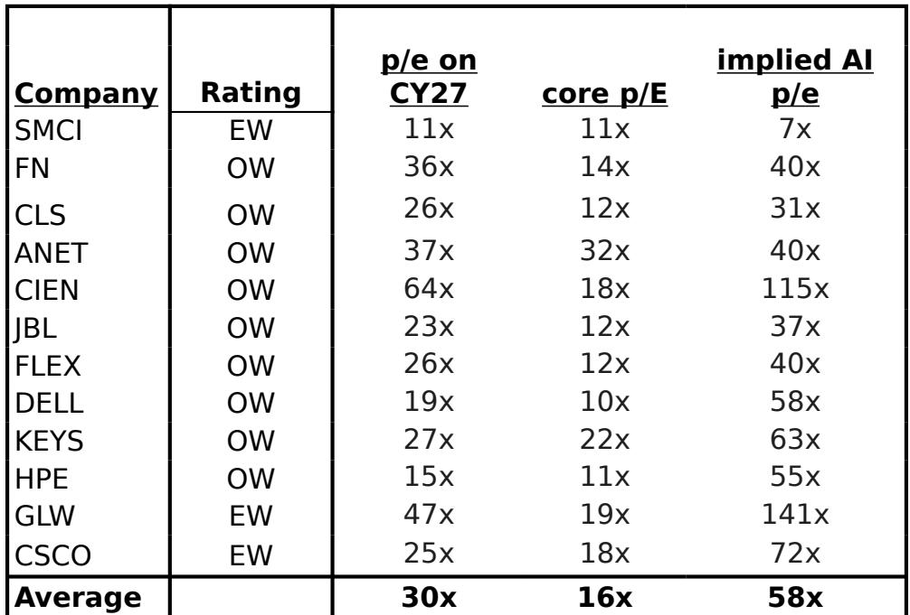
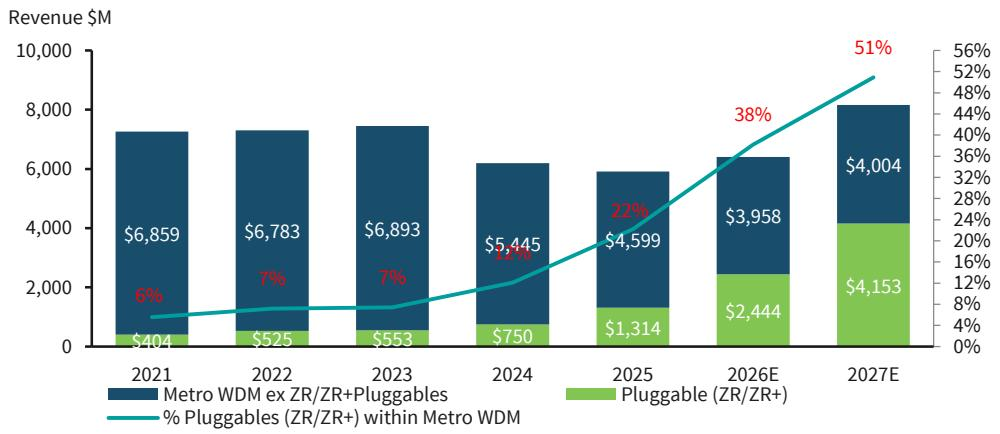

# BARC：光学市场真正的拐点不在于AI需求本身，而在于供给结构正在经历不可逆的重塑

市场对AI拉动光学器件需求的叙事已经足够熟悉。过去两年，每一次关于数据中心互联、超算集群扩容的消息，都能在资本市场引发一轮对光学板块的关注。但这份BARC最新发布的光学模型更新报告，提供了一个更为细腻、也更值得产业决策者仔细审视的判断框架。

报告的核心结论并不令人意外——BARC预计2026至2027年，全球光学网络市场将维持两位数的增长。真正有价值的洞察，藏在它对市场结构的拆解之中：增长的动力来源正在发生系统性切换，而不同细分市场的竞争壁垒和定价权正在经历根本性分化。理解这种分化，比单纯判断“AI需求是否真实”更具投资意义。

这份报告更新了BARC对光学市场的详细模型，涵盖了长途、海底、城域以及可插拔模块（ZR/ZR+）的细分，并首次在客户垂直领域（电信、云、企业）做了明确的收入拆分。对于关注Ciena、思科等核心标的的投资者而言，这份报告提供了一个从总量判断下沉到结构性判断的分析框架。

## 1. 两位数的增长预期背后，是电信与云的双重驱动力正在形成合力

BARC将2026年光学市场增长预期从此前的8%上调至10%，2027年从13%微调至12%。表面上看，这只是几个百分点的调整。但更值得关注的是，驱动这一增长的底层逻辑正在从“单一引擎”转向“双引擎”。

过去几年，光学市场的增长呈现出典型的“跷跷板”效应。2022年，云计算厂商的大规模网络建设推动了市场增长。随后，电信运营商进入库存消化周期，叠加宏观压力，导致2023至2024年市场连续下滑。BARC的数据显示，2023年光学市场同比下降7%，2024年进一步下滑12%。这种“云强则市场强，云弱则市场弱”的特征，让整个行业高度依赖单一客户群体的资本开支节奏。

但BARC的模型显示，这种格局正在改变。2025年起，电信侧的恢复正在形成与云侧增长并行的第二股力量。报告中提到，多光纤网络（MOFN）机会正在为Ciena的电信业务贡献约10%至15%的收入，而BEAD（宽带公平接入与部署）资金正在逐步进入市场。电信运营商的网络重构需求——尤其是长途网络的重新架构——正在成为新的增长支点。

这意味着什么？如果电信侧的恢复能够持续，光学市场的增长将不再完全依赖于几家超大规模云厂商的资本开支节奏。这种需求来源的多元化，本身就是一种风险对冲。

## 2. 城域市场正在经历一场“可插拔革命”，但不要高估它对整体市场的冲击

BARC报告中一个引人注目的数据点是，可插拔模块（ZR/ZR+）在城域WDM市场中的渗透率，预计将从2024年的14%跃升至2027年的51%。从增长速度看，这确实是一场“革命”。ZR模块市场预计在2026年增长72%，ZR+增长33%。

然而，BARC同时给出了一个容易被忽略的定量判断：可插拔模块在整个光学市场中，2026至2027年期间的平均占比仅为高十几个百分点。换言之，尽管它在城域市场内部增长迅猛，但从全市场占比看，它仍然是一个相对较小的细分领域。城域市场剔除可插拔模块后，同期预计将呈现高个位数的下降。

这个对比揭示了一个关键洞察：可插拔模块的增长，更多是在替代传统城域设备，而非创造全新的增量市场。对于投资者而言，这意味着“可插拔概念”本身并不构成一个独立的投资主题。真正的问题在于，谁能在这一替代过程中保住或扩大自己的份额。BARC倾向于认为，Ciena凭借其在ZR+领域的技术领先（率先推出800G ZR+产品），有望在可插拔市场中维持约15%的份额。

## 3. 长途市场才是真正的“AI受益者”，其增长逻辑比城域更硬核

如果说城域市场的故事是关于替代，那么长途市场的故事则是关于扩容。BARC预计，长途WDM市场在2025年增长约9%，2026至2027年保持高个位数平均增速。更重要的是，长途市场在整个光学市场中的占比，预计到2027年仍将维持在约一半的水平。

AI对长途网络的拉动逻辑，不同于市场通常理解的“数据中心内部互联”。BARC在报告中区分了两种场景：一种是“跨规模扩展”（scale across），它更依赖长途网络架构；另一种是更常见的同步扩展。随着AI训练集群的地理分布日益广泛——为了获取更便宜的电力、更低的延迟或更好的政策环境——跨数据中心的互联需求正在推动长途网络投资。

这一点在Ciena的指引中得到了印证。公司管理层在最近的财报中明确提到，预计2027财年收入将出现“有意义的增长”，部分原因正是超大规模网络（hyper-rail）的部署。更重要的是，管理层强调，与超大规模客户的紧密关系使其能够看到产品正在被实际部署，而不是堆积在仓库中。这与疫情后供应链危机时期的库存堆积形成了本质区别。

## 4. 电信仍是市场主导者，但“云占比”的快速攀升正在重塑竞争格局

BARC的模型揭示了一个有趣的结构性变化：尽管云计算增长迅猛，但电信运营商在光学市场中的占比在2025至2027年期间仍将超过50%。然而，这一数字比几年前的中高70%已经有了显著下降。到2027年，云计算在光学市场中的占比预计将从2024年的约20%上升至约32%。

这一变化对竞争格局的影响是深远的。传统上，光学设备市场是一个以电信运营商为核心客户、以技术认证和长期合作关系为护城河的行业。但云计算厂商的采购逻辑不同——它们更看重技术迭代速度、大规模交付能力和生态系统兼容性。这意味着，能够同时服务好两类客户的供应商将拥有更大的战略纵深。

BARC认为，Ciena是唯一一家持续获得市场份额的光学设备商——其市场份额预计从2018年的16%上升至2027年的约32%。而思科虽然凭借Acacia在组件和子系统层面有强劲表现，但在光学系统层面并非主要玩家。白盒解决方案在光学市场中的占比始终维持在低个位数到中个位数，这与数据通信市场形成了鲜明对比。

## 5. 报告尚未完全回答的关键问题：可插拔模块的定价压力与AI内部光学的时间表

尽管BARC的报告提供了极为详尽的市场模型，但仍有两个关键变量尚未得到充分验证。

第一个是可插拔模块的定价压力。报告指出，可插拔模块在光学市场中占比不高的原因之一，是“有限的用例和定价动态”。随着更多玩家涌入ZR/ZR+市场，价格竞争是否会侵蚀利润率？BARC预计Ciena在可插拔市场中的份额将从2026年的16%下降至2027年的12%，这是否反映了竞争加剧的预期？报告没有展开这一逻辑。

第二个是相干光学在数据中心内部的应用时间表。BARC明确表示，目前并未将2026年数据中心内部的相干光学纳入模型（可能在下半年看到），认为这更多是2027年及以后的机遇。这意味着，当前市场对AI驱动的光学需求预期，可能尚未计入数据中心内部互联这一潜在爆发点。如果这一时间表提前，整个市场的上行空间将超出当前模型假设。

这两个未解问题，恰恰是决定当前估值是否合理的关键。以Ciena为例，BARC给出的隐含AI市盈率高达115倍，在所有覆盖标的中仅次于康宁。如此高的AI溢价，意味着市场对上述两个变量的预期已经相当乐观。一旦实际进展不及预期，估值修正的压力也将是巨大的。

---

光学市场的故事，绝不仅仅是“AI需要更多光模块”那么简单。BARC这份报告的价值，在于它把总量增长拆解为结构变迁，把行业叙事还原为竞争逻辑。对于产业决策者和投资者而言，真正需要追问的不是“市场会不会增长”，而是“增长的钱会流向谁的口袋”。

上述关于可插拔模块定价压力、数据中心内部光学时间表以及Ciena市场份额变化的更多细节，包括BARC对2027年各细分市场的完整预测数据，我们已在知识星球和微信社群中分享了完整报告解读与原始图表。欢迎来星球微信群里继续讨论，一起拆解这份报告背后更深的产业逻辑。

Personal reading notes and learning share only. Not investment advice.

