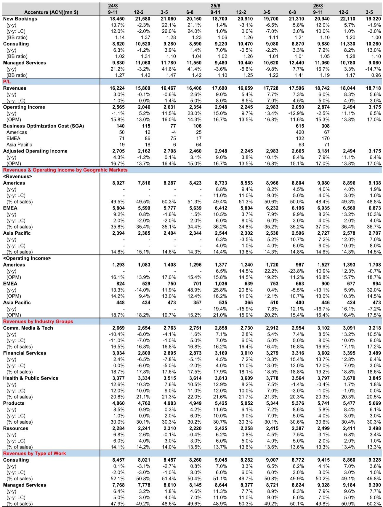
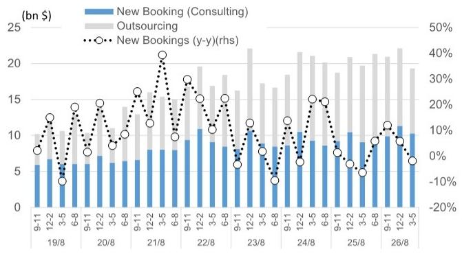
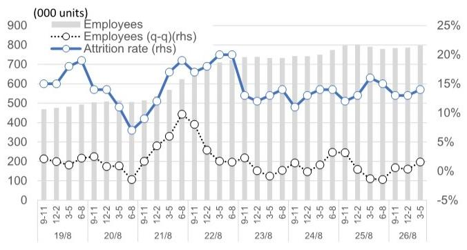

# GS：全球IT服务订单的转折点不是AI，而是地缘政治

全球IT服务行业正在经历一个被市场误读的转折点。当投资者将目光聚焦于AI对传统系统集成商的颠覆性冲击时，GS最新发布的Accenture财报解读却揭示了一个更微妙、也更值得警惕的信号：订单下滑的真正推手并非技术革命，而是地缘政治摩擦。

这份报告的核心判断值得每一位关注日本IT服务板块的投资者认真思考：全球IT服务需求的结构性分化正在加速，AI相关业务在扩张，但地缘政治风险正在成为悬在系统集成商头上的达摩克利斯之剑。市场可能低估了后者对行业基本面的影响周期。

Accenture 3Q8/26（3-5月）财报显示，销售额基本符合预期，但新订单出现了四个季度以来的首次负增长，同比下降3%。更值得关注的是，管理服务订单同比骤降15%，而咨询订单却加速增长13%。这种分化背后，是中东局势导致部分客户决策延迟，而非AI对传统业务的替代。

对日本IT服务板块而言，这份报告的启示在于：本土需求相对稳健，但全球化敞口大的企业将面临更大的不确定性。与此同时，AI相关业务的扩张趋势在日本也开始显现。

## 1. 订单结构的分化揭示了客户决策逻辑的深层变化

Accenture 3Q新订单的负增长并非均匀分布。管理服务订单从2Q的+3%骤降至-15%，而咨询订单从+8%加速至+13%。这种结构性分化是理解当前行业周期的关键。

管理服务通常代表长期外包合同，其订单下滑往往意味着客户对未来业务不确定性的担忧。而咨询订单的加速增长，则反映出企业在战略层面仍然愿意投资于数字化转型和AI落地。两者之间的背离，恰恰说明客户正在将预算从“维持性支出”转向“变革性支出”。

但这里有一个容易被忽略的细节：中东局势对订单的冲击主要集中在咨询业务，约4亿美元的订单延迟。也就是说，即便是在咨询领域，增长也并非完全由内生需求驱动，而是受到了地缘政治因素的扰动。报告明确指出，这一影响在4Q可能进一步扩大。

对于投资者而言，这意味着不能简单地将咨询订单的增长解读为行业全面复苏的信号。客户决策的延迟可能正在制造一个“虚假繁荣”的窗口期。

## 2. 地缘政治风险正在重塑全球IT服务的竞争格局

GS报告中最具洞察力的部分，是对中东局势影响的量化分析。Accenture在3Q因中东局势损失了约1亿美元的销售额和4亿美元的订单，主要集中在制造业和汽车行业。管理层明确表示，4Q的影响可能大于3Q。

这一判断的意义在于：它揭示了一个被市场低估的系统性风险。地缘政治摩擦不再是“黑天鹅”，而是正在成为影响IT服务企业基本面的结构性变量。对于全球化程度高的企业，这种风险敞口将直接影响其订单可见度和收入稳定性。

报告特别指出，大型管理服务项目的推迟更多是“延迟”而非“丢失”，这在一定程度上缓解了市场的担忧。但问题在于，延迟意味着收入确认的节奏被打乱，对企业的现金流和利润率都会产生连锁反应。更重要的是，如果地缘政治局势持续恶化，这些延迟的项目最终可能演变为取消。

## 3. 日本IT服务板块的“免疫”程度取决于海外敞口

GS对日本IT服务板块的传导分析提供了一个清晰的观察框架。报告认为，中东局势对日本本土IT服务需求的影响有限，但对其子公司NTT Data的轻微拖累值得关注，因为后者海外收入占比高达60%。

这一判断的底层逻辑是：日本IT服务企业的业务结构正在发生根本性变化。过去，投资者习惯于将日本IT板块视为一个相对封闭、受国内需求驱动的市场。但NTT Data、NOM综合研究所等企业的全球化布局，正在改变这一假设。

报告指出，日本市场也开始出现与全球类似的AI相关业务扩张趋势，NOM综合研究所和趋势科技被认为处于有利位置。这意味着，日本IT服务板块的投资逻辑正在从“国内需求周期”转向“全球AI需求+地缘政治风险”的双重驱动。

投资者需要重新审视自己的持仓组合：那些海外收入占比高、且在中东或欧洲有重大业务敞口的企业，其估值可能需要纳入新的风险溢价。而那些以日本本土市场为主、同时具备AI业务能力的企业，可能更具防御性。

## 4. AI业务的扩张正在从概念验证走向商业部署

Accenture财报中一个被忽视的亮点是AI相关业务的加速扩张。报告指出，企业AI投资意愿强劲，焦点正从概念验证转向商业部署，带动了AI实施支持、AI驱动的业务转型咨询、数据基础设施和安全等领域的需求。

这一判断与市场对AI“泡沫化”的担忧形成鲜明对比。GS的分析表明，AI正在从实验室走向企业的核心业务流程，这为IT服务企业创造了新的收入增长点。但需要注意的是，这种增长目前主要集中在咨询业务，尚未完全传导至管理服务。

对于日本市场而言，NOM综合研究所和趋势科技被认为将受益于这一趋势。NOM综合研究所在金融IT领域的深厚积累，使其在AI驱动的业务转型咨询中具有天然优势。而趋势科技在网络安全领域的布局，则契合了AI部署带来的安全需求增长。

但这里仍有一个关键问题需要验证：AI相关业务的利润率是否能够达到传统IT服务的水平？如果AI业务需要更高的研发投入和更短的交付周期，其对盈利能力的贡献可能不如预期。

## 5. 报告尚未完全回答的关键问题：订单结构的可持续性

尽管GS报告提供了丰富的分析框架，但仍有几个关键问题没有被完全解答。

第一，管理服务订单的疲软是暂时的还是结构性的？Accenture管理层将大型项目的推迟归因于客户特定因素，而非行业趋势。但考虑到地缘政治风险可能持续，这种“延迟”的持续时间存在不确定性。

第二，AI业务的扩张能否完全对冲地缘政治风险带来的收入缺口？报告显示AI相关需求强劲，但并未给出具体的量化预测。如果中东局势的影响在4Q进一步扩大，AI业务的增量能否弥补这一缺口，仍是一个开放性问题。

第三，日本IT服务企业的AI业务扩张速度是否能够跟上全球同行？报告提到日本市场开始出现类似的AI趋势，但并未提供具体的增长数据或时间表。对于投资者而言，这意味需要更密切地跟踪日本企业的AI业务进展。

这些未解问题正是深入阅读完整报告的价值所在。GS的报告不仅提供了数据和分析，更重要的是为投资者提供了一个持续跟踪行业变化的框架。

## 6. 投资者需要建立的新观察框架：从“AI颠覆”到“地缘政治+AI双重驱动”

基于这份报告，投资者需要重新审视自己对全球IT服务板块的观察框架。传统的“AI颠覆传统系统集成商”叙事可能过于简单化。更准确的框架应该是“地缘政治风险正在重新定义行业周期，而AI正在重新定义增长结构”。

具体而言，建议关注以下几个维度：

第一，企业的地理收入结构。海外收入占比高、且在中东或欧洲有重大业务敞口的企业，其订单可见度可能面临更大的不确定性。日本IT板块中，NTT Data的海外敞口值得持续跟踪。

第二，AI业务的收入转化效率。从概念验证到商业部署的转变，意味着AI业务正在从“成本中心”转向“利润中心”。但不同企业的转化效率可能存在显著差异。报告提到的NOM综合研究所和趋势科技，其AI业务的收入占比和利润率变化将是关键观察指标。

第三，订单结构的动态变化。咨询订单与管理服务订单之间的背离，是判断行业周期的重要先行指标。如果未来几个季度管理服务订单持续疲软，可能意味着客户对长期外包的信心尚未恢复。

第四，地缘政治风险对估值的影响。如果地缘政治风险被市场低估，那么拥有高海外敞口的企业可能面临估值下修的风险。反之，那些以本土市场为主、且AI业务布局清晰的企业，可能获得估值溢价。

这份报告的价值不仅在于它提供了Accenture财报的详细解读，更在于它为投资者提供了一个重新审视全球IT服务板块的分析框架。在AI和地缘政治的双重驱动下，行业正在进入一个全新的分化阶段。

欢迎来星球微信群里继续讨论。我们会在群内分享完整的GS报告原文和更多行业分析框架，帮助您建立更系统的投资决策体系。

Personal reading notes and learning share only. Not investment advice.

