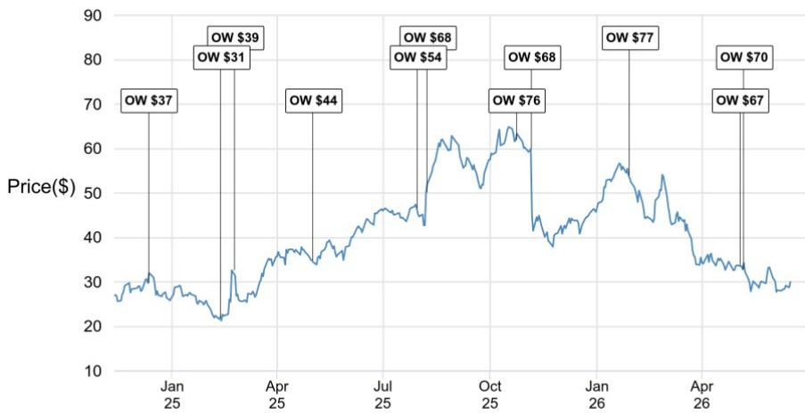
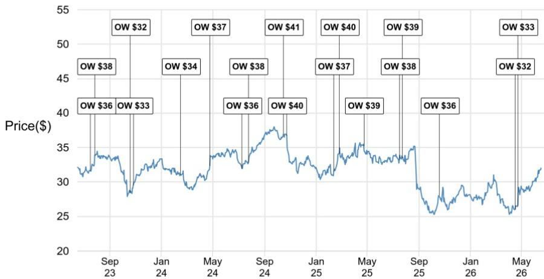
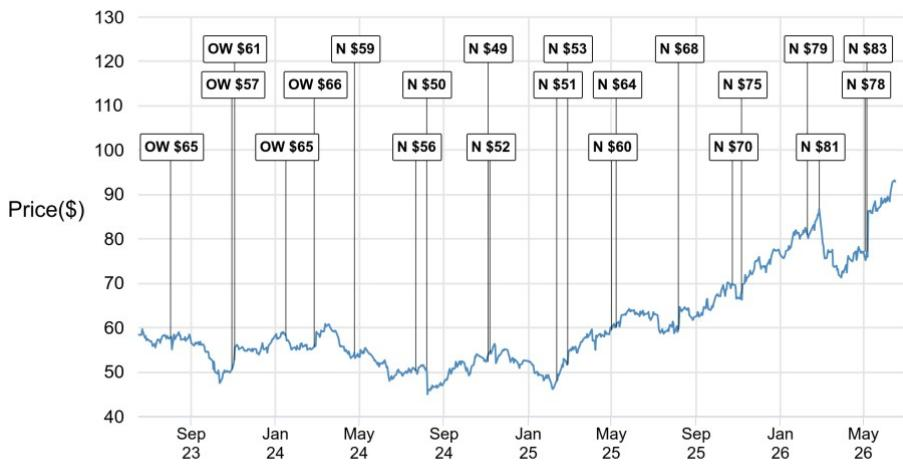

## U.S. Energy Drinks

## Numerator Energy Drinks Monitor

In this monthly edition, we highlight the latest Numerator data (May 2026) for the energy category and brand KPIs (see methodology below). We summarize key conclusions from the data below. All supporting data points by brand are inside this note.

## Key Brand Takeaways

## Monster (MNST, Neutral)

- The data remains better than peers for Monster, both on an absolute basis and relative to peers, and while KPIs for Monster decelerated sequentially vs. prior month on softer buy rate (purchase frequency deceleration), trends have been more resilient vs. peers.  
- Household penetration gains were mostly flat sequentially, decelerating by a slight -7 bps sequentially in 13-weeks ended May to +177 bps YOY (second consecutive period of slight deceleration following five consecutive months of accelerating household penetration gain trend); that said, sequentially on an absolute basis Monster household penetration increased +56 bps vs. prior monthly 13-week period (to 32.7%) and reached a new high.  
- Buy rate growth decelerated sequentially by -246 bps in 13-weeks ended May to +6% YOY, still well above Red Bull and best among the more mature brands, but below recent +HSD-LDD% trend over prior three rolling 13-week monthly periods; on an absolute basis Monster buy rate decreased -0.5% vs. April.  
- Purchase frequency growth decelerated sequentially by -200 bps in 13-weeks ended May to flat YOY (third consecutive period of decelerating purchase frequency growth following six consecutive periods of improving purchase frequency growth); on an absolute basis Monster purchase frequency decreased -1.0% vs. April.  
- Spend per trip decelerated slightly sequentially by -34 bps in 13-weeks ended May to +6% YOY (23 $^{rd}$ consecutive monthly 13-week period of +MSD-HSD% spend per trip growth); on an absolute basis Monster spend per trip reached a new high and increased +0.6% vs. prior monthly 13-week period April.  
- All-in, Numerator projected sales for Monster decelerated sequentially (-314 bps) to +14% YOY while Circana shows a -70 bps deceleration in L13W 5/31/26 to +13.1% (vs. +13.8% L13W 5/3/26).

## Celsius Holdings (CELH, Overweight, AFL)

- The data appear to be softer sequentially for Celsius Holdings with deceleration in sequential trend for both Celsius (buy rate deceleration) and Alani Nu (household penetration and buy rate deceleration), which is consistent with the tracked channel data. That said, the data for Alani Nu remain robust and Celsius household penetration and purchase frequency on an absolute basis are holding up better vs. the YOY trends.  
• Household penetration for Alani Nu decelerated sequentially (-62 bps to

## Beverage, Household & Personal Care Products

Andrea Teixeira, CFA AC

(1-212) 622-6735

andrea.f.teixeira@JPM.com

Drew Levine, CFA

(1-212) 622-0374

drew.levine@JPM.com

Shovana Chowdhury

(1-212) 270-2184

shovana.chowdhury@JPM.com

JPM Securities LLC

Contents

<table><tr><td>Energy Drinks Trends by Brand</td><td>6</td></tr><tr><td>Energy Drinks Category Trends</td><td>10</td></tr><tr><td>Monster</td><td>22</td></tr><tr><td>Red Bull</td><td>25</td></tr><tr><td>Celsius</td><td>28</td></tr><tr><td>Alani Nu</td><td>31</td></tr><tr><td>C4</td><td>34</td></tr><tr><td>GHOST</td><td>37</td></tr></table>

JPM Data Insights

+426 bps YOY) but remains very strong and reached a new high on an absolute basis (15.3% 13-weeks May, +8 bps sequentially vs. 13-weeks April); Celsius household penetration was largely flat sequentially, decelerating a very slight -4 bps, and remains negative YOY (-89 bps YOY) for the fourth consecutive monthly 13-week period; that said, on an absolute basis Celsius household penetration increased +35 bps to 15.9%, second consecutive monthly 13-week period of improving household penetration following six consecutive monthly 13-week periods of moderating household penetration.

- Alani Nu buy rate decelerated modestly by -206 bps sequentially to +25% YOY (still very strong YOY and second to only Bloom on YOY basis); on an absolute basis Alani Nu buy rate decreased -0.8% sequentially vs. prior monthly 13-week period. Alani Nu buy rate deceleration was driven entirely by purchase frequency (+14% YOY decelerated -347 bps sequentially; on an absolute basis decreased -0.7% vs. 13-weeks April following four consecutive periods of improving purchase frequency) while spend per trip accelerated (+148 bps sequentially to +10% YOY; on absolute basis largely flat sequentially vs. 13-weeks April).  
- Celsius buy rate decelerated sequentially (-484 bps sequentially to flat YOY), driven mostly by moderation in purchase frequency (decelerated -452 bps sequentially to -4% YOY; on an absolute basis, however, increased +0.2% vs. 13-weeks April) while spend per trip was largely stable (+4% YOY; on an absolute basis decreased -0.3% sequentially vs. 13-weeks April).  
- All-in, Numerator projected sales for CELH “combined” softened sequentially (-604 bps) to +11.3% YOY while Circana shows a -460 bps deceleration in L13W 5/31/26 to +20.5% (vs. L13W 5/3/26); Numerator projected sales for Alani Nu +76% decelerated -1,420 bps (vs. Circana L13W 5/31/26 -1,080 bps to +72.3%) and for Celsius -3% decelerated -487 bps (vs. Circana L13W 5/31/26 -320 bps to -0.3%).

## Red Bull (Private)

- The data appear softer sequentially for Red Bull (private), as buy rate growth decelerated and inflected negative, although household penetration gains remain solid. Deceleration in the Numerator data was stronger than the moderation in trends seen in Circana data L13W 5/31/26 vs. L13W 5/3/26.  
- Household penetration gains decelerated sequentially (-17 bps to +189 bps YOY) following four consecutive monthly 13-week periods of accelerating household penetration gains, although on an absolute basis improved +76 bps sequentially vs. 13-weeks April and reached a new high (38.5%). Red Bull household penetration gains remain ahead of Monster.  
- Buy rate decelerated sequentially YOY and inflected negative to -3% YOY (from +4% in 13-weeks April) following four consecutive monthly 13-week periods of YOY buy rate growth. Buy rate deceleration was driven predominantly by deceleration in purchase frequency of -411 bps to -4% YOY (softest YOY performance since 13-weeks July 2024) while spend per trip also decelerated by -187 bps to +2% YOY (although largely in-line with recent +LSD% YOY trends). On an absolute basis buy rate decreased -1.5% sequentially vs. 13-week period April with largely stable purchase frequency (+0.2% sequentially) and lower spend per trip (-1.7% sequentially).  
- All-in, Numerator projected sales for Red Bull decelerated to +4% in 13-weeks May vs. +11% 13-weeks April (-718 bps sequentially) while Circana L13W 5/31/26 takeaway +5.6% decelerated -400 bps from +9.6% L13W 5/3/26.

## Keurig Dr Pepper (KDP, Overweight)

\- For Keurig Dr Pepper, the data appear mostly unfavorable sequentially, in our view, with GHOST buy rate trend decelerating (albeit household penetration trends a bit better). Bloom remains strong but decelerated. GHOST trends remain tepid in the Numerator data with buy rate deceleration driven by purchase frequency partially offset by slightly better household penetration trends, leading to a modest deceleration in projected sales (Circana trends remain notably stronger for GHOST vs. Numerator). C4 saw a very steep deceleration in buy rate trends driven by both purchase frequency and spend per trip, although household penetration trends remain better; Circana trends are now slightly better than Numerator trends vs. recent history of Numerator running well ahead of Circana. Bloom continues to perform very well across most key KPIs (+DDD% growth, strong household penetration gains and buy rate growth), although is moderating as comp base gets larger.

- Household penetration for GHOST were mostly flat sequentially (+9 bps vs. 13-weeks April) at +12 bps YOY, third consecutive period of YOY household penetration gains following four consecutive periods of YOY household penetration declines; on an absolute basis GHOST household penetration improved +29 bps sequentially vs. 13-weeks April to 6.2%. Household penetration for C4 was up YOY with gains improving slightly sequentially to +54 bps YOY (seventh consecutive monthly 13-week period of YOY household penetration growth and third consecutive period of accelerating household penetration gains) and on an absolute basis improved +52 bps sequentially vs. 13-weeks April to 7.7%. Bloom household penetration gains improved +62 bps sequentially to +451 bps YOY (best among brands we track) and on an absolute basis reached a new peak of 7.9% (+107 bps sequentially vs. 13-weeks April).  
- Buy rate for GHOST decelerated sequentially flat YOY from +3% YOY in 13-weeks April, but on an absolute basis increased nearly +2% vs. 13-weeks April; C4 buy rate growth decelerated materially to -9% YOY vs. +4% YOY in 13-weeks April and on an absolute basis decreased about -12% sequentially; Bloom buy rate growth remains very strong at +32% YOY but decelerated sequentially on a YOY basis (vs. +44% in 13-weeks April) for the fourth consecutive monthly 13-week period and on an absolute basis decreased -2.8% sequentially vs. 13-weeks April.  
- The change in buy rate for GHOST was driven by deceleration in purchase frequency (-302 bps sequentially to -3% YOY in 13-weeks May) while purchase frequency was flat sequentially at +3% YOY. The buy rate deceleration for C4 was driven by both purchase frequency (-802 bps sequentially to -6% YOY - fifth period of past six with declining YOY purchase frequency) and spend per trip (-498 bps sequentially to -4% YOY - first YOY decline for the brand in our dataset). Bloom buy rate is being driven by strong growth in purchase frequency (+37% YOY, improved slightly sequentially vs. 13-weeks April) while spend per trip decelerated and inflected negative YOY (-899 bps sequentially to -4% YOY).  
We note that the Circana trends appear much more constructive for GHOST (L13W 5/31/26 takeaway decelerated -300 bps sequentially to +28.7% from +31.7% L13W 5/3/26 but are running significantly ahead of Numerator +3% YOY) and somewhat more constructive for C4 (L13W 5/31/26 +1.0% improved +100 bps sequentially while Numerator decelerated materially to -1% YOY 13-weeks May); projected sales growth for Bloom are strong +DDD% in both datasets, albeit decelerated sequentially.

## Key Category Takeaways

\- Projected sales decelerated -526 bps sequentially to +10% in May, the second consecutive monthly period of deceleration following four consecutive monthly periods of sequential acceleration on a rolling 13-week basis; slowest YOY growth since 13-week period February 2025. Within the projected sales growth deceleration, buy rate decelerated (-346 bps sequentially to +3% YOY) and household penetration growth moderated (-61 bps sequentially to +286 bps YOY) vs. prior month. Household penetration improved sequentially on an absolute basis to 55.0% (from 54.2% in rolling 13-weeks ending April) and reached a new high while buy rate decreased -0.4% sequentially on an absolute basis from rolling 13-weeks ended April and moderated to +LSD% YOY following five consecutive monthly rolling 13-week periods of +5-10% YOY growth.

\- Buy rate growth decelerated across income and age cohorts and was mixed by channel in May, but decelerated meaningfully in gas & convenience. Buy rate decelerated most for low income cohort (-497 bps to +2% YOY in May), the third consecutive month of deceleration, and also decelerated meaningfully for high income (-418 bps sequentially to -1% YOY in May) and middle income (-211 bps sequentially to +6% YOY in May); on an absolute basis, buy rate reached an absolute high for middle income (+0.2% sequentially vs. prior month) and decreased for low and high income by about -1%. Buy rate decelerated the most for Gen Z (-1,196 bps sequentially to +1% YOY) and decelerated for other age cohorts; on an absolute basis, Gen Z buy rate decreased nearly -5% sequentially and Millennials buy rate decreased -2% sequentially; Gen X and Boomers buy rate reached new highs. Buy rate decelerated meaningfully in gas & convenience (-644 bps sequentially to +3% YOY), softest YOY performance since 13-weeks July 2024, and also decelerated in mass (-197 bps sequentially to +7% YOY) and club (-361 bps sequentially to -5% YOY) but was stable/improving in other channels; on an absolute basis vs. April buy rate decreased -0.6% in gas & convenience, -1.3% in food, -2.6% in mass, -1.3% online, and -4.8% in club.

\- Household penetration moderated sequentially across income cohorts, most age cohorts, and was more mixed by channel, but declined in gas & convenience in 13-weeks May. Household penetration decelerated for low income and inflected negative YOY (-27 bps sequentially to -21 bps YOY) and also decelerated for middle and high income, but remains positive YOY; on an absolute basis sequentially household penetration was flat for low income and improved about +40 bps for both middle and high income with both reaching new highs. Household penetration decelerated for Boomers, Gen X, and Gen Z and was largely flat sequentially for Millennials; on an absolute basis Millennial and Gen Z household penetration reached new highs. Household penetration inflected negative YOY in gas & convenience and also decelerated in food and online; on an absolute basis household penetration improved sequentially across channels.

\- Buy rate sequential deceleration was driven mostly by sequentially softer purchase frequency (-303 bps sequentially to -2% YOY) while spend per trip decelerated slightly (-27 bps sequentially to +5% YOY). Purchase frequency decelerated for second consecutive period following five consecutive rolling 13-week months of acceleration and inflected negative for the first time since 13-weeks November 2025; purchase frequency improved +0.3% on an absolute basis sequentially vs. April. Spend per trip growth has been +MSD-HSD% YOY for 22 consecutive rolling 13-week months; on an absolute basis spend per trip softened -0.1% vs. April.

\- Purchase frequency decelerated across income and age cohorts and was mixed by channel (but decelerated meaningfully in gas & convenience) in May. Purchase frequency decelerated roughly equally for low and high income nearly -400 bps sequentially and decelerated nearly -200 bps sequentially for middle income — on a YOY basis purchase frequency inflected negative for low income (decelerated for three consecutive monthly 13-week periods and softest YOY since March 2025), decreased -6% YOY for high income (second consecutive period of YOY declines), and decelerated to flat YOY for middle income; on an absolute basis sequentially purchase frequency decreased almost -1% for low and high income and increased slightly for middle income. Purchase frequency decelerated most for Gen Z (-979 bps to -1% YOY) and inflected negative YOY for first time since March 2024 and decelerated for other age cohorts (Millennials, Boomers declining YOY, Gen X flat YOY); on an absolute basis sequentially vs. 13-weeks April Gen Z purchase frequency decreased -3.4% and Millennials decreased -1.3%, while Gen X and Boomers increased +1% and +1.5%, respectively. Purchase frequency decelerated most in gas & convenience (-567 bps) and inflected negative to -2% YOY, only channel declining on YOY basis in 13-weeks May, while others were flat to +LSD% YOY; on an absolute basis purchase frequency decreased -1.2% sequentially vs. April in gas & convenience.

\- Spend per trip was softer sequentially across income cohorts but was mixed by age and channel in 13-weeks May. Spend per trip remained +MSD% YOY for age cohorts but decelerated about 1 point for low income, although on an absolute basis sequentially vs. 13-weeks April spend per trip was largely flat across income cohorts. Spend per trip decelerated sequentially for Gen Z (-184 bps sequentially to +2% YOY) and Millennials (-95 bps sequentially to +5% YOY) but improved slightly for Boomers and Gen X; on an absolute basis sequentially vs. 13-weeks April, Gen Z spend per trip decreased -1.4% while Gen X spend per trip increased +1.0% while Millennials and Boomers were generally stable. Spend per trip in gas & convenience was still +MSD% YOY and reached a new high on an absolute basis while most other channels saw decreased spend per trip sequentially on an absolute basis vs. 13-weeks April.

## Methodology:

In this monthly publication, we leverage Numerator, an alternative data provider that sources first-party consumer information, to assess trends in the U.S. energy drinks category. Data within this note are organized on a rolling 13-week by month basis and include trends by category and top brands for metrics such as projected sales, projected units, household penetration, buy rate, purchase frequency and spend per trip and attributes such as income, age, geographic region, and channel. We encourage investors to focus more on the directional trends and rate of change relative to absolute numbers or percentages.

## Energy Drinks Trends by Brand

Figure 1: Projected Sales Y/Y %

<table><tr><td></td><td>Total Category</td><td>Red Bull</td><td>Monster</td><td>Celsius</td><td>Alani Nu</td><td>Rockstar</td><td>Cellucor</td><td>GHOST</td><td>Bloom</td><td>Bang Energy</td><td>NOS</td><td>Reign</td></tr><tr><td>May-24</td><td>7%</td><td>1%</td><td>2%</td><td>51%</td><td>90%</td><td>6%</td><td>39%</td><td>22%</td><td></td><td>-36%</td><td>14%</td><td>22%</td></tr><tr><td>Jun-24</td><td>6%</td><td>-3%</td><td>5%</td><td>37%</td><td>98%</td><td>14%</td><td>25%</td><td>26%</td><td></td><td>-24%</td><td>7%</td><td>15%</td></tr><tr><td>Jul-24</td><td>3%</td><td>-4%</td><td>3%</td><td>22%</td><td>85%</td><td>15%</td><td>20%</td><td>24%</td><td></td><td>-9%</td><td>4%</td><td>18%</td></tr><tr><td>Aug-24</td><td>6%</td><td>2%</td><td>3%</td><td>21%</td><td>78%</td><td>22%</td><td>15%</td><td>27%</td><td></td><td>9%</td><td>0%</td><td>27%</td></tr><tr><td>Sep-24</td><td>7%</td><td>2%</td><td>2%</td><td>24%</td><td>78%</td><td>28%</td><td>16%</td><td>36%</td><td></td><td>22%</td><td>-4%</td><td>25%</td></tr><tr><td>Oct-24</td><td>11%</td><td>8%</td><td>5%</td><td>25%</td><td>80%</td><td>22%</td><td>20%</td><td>35%</td><td></td><td>56%</td><td>-11%</td><td>19%</td></tr><tr><td>Nov-24</td><td>11%</td><td>11%</td><td>5%</td><td>17%</td><td>95%</td><td>13%</td><td>18%</td><td>32%</td><td></td><td>59%</td><td>-16%</td><td>14%</td></tr><tr><td>Dec-24</td><td>14%</td><td>16%</td><td>8%</td><td>11%</td><td>107%</td><td>10%</td><td>16%</td><td>25%</td><td></td><td>65%</td><td>-8%</td><td>22%</td></tr><tr><td>Jan-25</td><td>11%</td><td>13%</td><td>6%</td><td>4%</td><td>121%</td><td>8%</td><td>15%</td><td>15%</td><td></td><td>38%</td><td>-7%</td><td>17%</td></tr><tr><td>Feb-25</td><td>9%</td><td>10%</td><td>5%</td><td>0%</td><td>113%</td><td>11%</td><td>11%</td><td>15%</td><td></td><td>28%</td><td>-4%</td><td>10%</td></tr><tr><td>Mar-25</td><td>11%</td><td>16%</td><td>7%</td><td>1%</td><td>105%</td><td>6%</td><td>8%</td><td>13%</td><td></td><td>34%</td><td>-6%</td><td>-4%</td></tr><tr><td>Apr-25</td><td>12%</td><td>18%</td><td>8%</td><td>-2%</td><td>109%</td><td>-3%</td><td>8%</td><td>6%</td><td></td><td>31%</td><td>1%</td><td>-11%</td></tr><tr><td>May-25</td><td>14%</td><td>24%</td><td>9%</td><td>1%</td><td>98%</td><td>-15%</td><td>7%</td><td>12%</td><td></td><td>24%</td><td>3%</td><td>-12%</td></tr><tr><td>Jun-25</td><td>14%</td><td>23%</td><td>8%</td><td>5%</td><td>99%</td><td>-20%</td><td>12%</td><td>14%</td><td></td><td>13%</td><td>1%</td><td>-8%</td></tr><tr><td>Jul-25</td><td>16%</td><td>24%</td><td>8%</td><td>12%</td><td>97%</td><td>-20%</td><td>10%</td><td>17%</td><td>7794%</td><td>3%</td><td>3%</td><td>-10%</td></tr><tr><td>Aug-25</td><td>15%</td><td>19%</td><td>7%</td><td>10%</td><td>143%</td><td>-26%</td><td>7%</td><td>13%</td><td>1971%</td><td>-2%</td><td>3%</td><td>-5%</td></tr><tr><td>Sep-25</td><td>14%</td><td>18%</td><td>10%</td><td>5%</td><td>121%</td><td>-29%</td><td>5%</td><td>7%</td><td>1182%</td><td>-2%</td><td>3%</td><td>2%</td></tr><tr><td>Oct-25</td><td>11%</td><td>10%</td><td>9%</td><td>3%</td><td>83%</td><td>-25%</td><td>26%</td><td>6%</td><td>1003%</td><td>-12%</td><td>2%</td><td>7%</td></tr><tr><td>Nov-25</td><td>11%</td><td>7%</td><td>12%</td><td>7%</td><td>62%</td><td>-24%</td><td>28%</td><td>8%</td><td>1227%</td><td>-19%</td><td>3%</td><td>3%</td></tr><tr><td>Dec-25</td><td>13%</td><td>7%</td><td>14%</td><td>7%</td><td>63%</td><td>-23%</td><td>22%</td><td>8%</td><td>1420%</td><td>-15%</td><td>6%</td><td>-7%</td></tr><tr><td>Jan-26</td><td>15%</td><td>11%</td><td>18%</td><td>8%</td><td>80%</td><td>-28%</td><td>6%</td><td>5%</td><td>749%</td><td>-13%</td><td>7%</td><td>-18%</td></tr><tr><td>Feb-26</td><td>18%</td><td>13%</td><td>21%</td><td>7%</td><td>99%</td><td>-29%</td><td>11%</td><td>1%</td><td>431%</td><td>-12%</td><td>0%</td><td>-24%</td></tr><tr><td>Mar-26</td><td>19%</td><td>13%</td><td>21%</td><td>4%</td><td>110%</td><td>-22%</td><td>9%</td><td>0%</td><td>299%</td><td>-24%</td><td>-2%</td><td>-25%</td></tr><tr><td>Apr-26</td><td>15%</td><td>11%</td><td>17%</td><td>1%</td><td>90%</td><td>-30%</td><td>12%</td><td>5%</td><td>238%</td><td>-26%</td><td>-8%</td><td>-32%</td></tr><tr><td>May-26</td><td>10%</td><td>4%</td><td>14%</td><td>-3%</td><td>76%</td><td>-33%</td><td>-1%</td><td>3%</td><td>212%</td><td>-28%</td><td>-9%</td><td>-35%</td></tr></table>

Source: Numerator. \*Note: Certain purchases are identifiable as energy drinks but not identifiable by brand and as such brand growth may be understated.

Figure 2: Share of Projected Sales Y/Y bps

<table><tr><td></td><td>Total Category</td><td>Red Bull</td><td>Monster</td><td>Celsius</td><td>Alani Nu</td><td>Rockstar</td><td>Cellucor</td><td>GHOST</td><td>Bloom</td><td>Bang Energy</td><td>NOS</td><td>Reign</td></tr><tr><td>May-24</td><td>-</td><td>-201</td><td>-140</td><td>314</td><td>113</td><td>-3</td><td>71</td><td>27</td><td></td><td>-114</td><td>13</td><td>33</td></tr><tr><td>Jun-24</td><td>-</td><td>-285</td><td>-39</td><td>237</td><td>128</td><td>35</td><td>43</td><td>35</td><td></td><td>-72</td><td>3</td><td>20</td></tr><tr><td>Jul-24</td><td>-</td><td>-261</td><td>1</td><td>154</td><td>129</td><td>49</td><td>41</td><td>38</td><td></td><td>-26</td><td>2</td><td>33</td></tr><tr><td>Aug-24</td><td>-</td><td>-153</td><td>-87</td><td>124</td><td>121</td><td>62</td><td>23</td><td>38</td><td></td><td>5</td><td>-13</td><td>43</td></tr><tr><td>Sep-24</td><td>-</td><td>-172</td><td>-175</td><td>147</td><td>127</td><td>76</td><td>23</td><td>53</td><td></td><td>26</td><td>-24</td><td>36</td></tr><tr><td>Oct-24</td><td>-</td><td>-116</td><td>-184</td><td>113</td><td>126</td><td>37</td><td>19</td><td>43</td><td></td><td>64</td><td>-51</td><td>15</td></tr><tr><td>Nov-24</td><td>-</td><td>-21</td><td>-188</td><td>46</td><td>154</td><td>5</td><td>16</td><td>38</td><td></td><td>66</td><td>-64</td><td>6</td></tr><tr><td>Dec-24</td><td>-</td><td>73</td><td>-169</td><td>-28</td><td>165</td><td>-14</td><td>4</td><td>20</td><td></td><td>65</td><td>-48</td><td>13</td></tr><tr><td>Jan-25</td><td>-</td><td>68</td><td>-143</td><td>-60</td><td>194</td><td>-12</td><td>10</td><td>8</td><td></td><td>36</td><td>-37</td><td>12</td></tr><tr><td>Feb-25</td><td>-</td><td>39</td><td>-128</td><td>-88</td><td>191</td><td>8</td><td>6</td><td>11</td><td></td><td>28</td><td>-27</td><td>2</td></tr><tr><td>Mar-25</td><td>-</td><td>133</td><td>-120</td><td>-102</td><td>188</td><td>-20</td><td>-9</td><td>4</td><td></td><td>34</td><td>-37</td><td>-34</td></tr><tr><td>Apr-25</td><td>-</td><td>184</td><td>-109</td><td>-133</td><td>205</td><td>-57</td><td>-11</td><td>-11</td><td></td><td>29</td><td>-22</td><td>-55</td></tr><tr><td>May-25</td><td>-</td><td>271</td><td>-137</td><td>-120</td><td>192</td><td>-121</td><td>-20</td><td>-5</td><td></td><td>15</td><td>-20</td><td>-61</td></tr><tr><td>Jun-25</td><td>-</td><td>249</td><td>-162</td><td>-84</td><td>207</td><td>-145</td><td>-4</td><td>1</td><td></td><td>-2</td><td>-23</td><td>-49</td></tr><tr><td>Jul-25</td><td>-</td><td>223</td><td>-203</td><td>-33</td><td>205</td><td>-151</td><td>-16</td><td>3</td><td>100</td><td>-22</td><td>-22</td><td>-59</td></tr><tr><td>Aug-25</td><td>-</td><td>122</td><td>-206</td><td>-39</td><td>337</td><td>-167</td><td>-20</td><td>-4</td><td>105</td><td>-30</td><td>-22</td><td>-44</td></tr><tr><td>Sep-25</td><td>-</td><td>118</td><td>-108</td><td>-84</td><td>301</td><td>-176</td><td>-24</td><td>-15</td><td>112</td><td>-30</td><td>-21</td><td>-27</td></tr><tr><td>Oct-25</td><td>-</td><td>-22</td><td>-32</td><td>-68</td><td>218</td><td>-141</td><td>39</td><td>-10</td><td>127</td><td>-46</td><td>-15</td><td>-7</td></tr><tr><td>Nov-25</td><td>-</td><td>-104</td><td>55</td><td>-34</td><td>167</td><td>-133</td><td>45</td><td>-6</td><td>140</td><td>-58</td><td>-13</td><td>-14</td></tr><tr><td>Dec-25</td><td>-</td><td>-144</td><td>74</td><td>-37</td><td>170</td><td>-130</td><td>25</td><td>-8</td><td>146</td><td>-50</td><td>-9</td><td>-37</td></tr><tr><td>Jan-26</td><td>-</td><td>-87</td><td>116</td><td>-53</td><td>224</td><td>-153</td><td>-20</td><td>-17</td><td>139</td><td>-44</td><td>-12</td><td>-63</td></tr><tr><td>Feb-26</td><td>-</td><td>-110</td><td>138</td><td>-77</td><td>280</td><td>-164</td><td>-12</td><td>-29</td><td>132</td><td>-46</td><td>-29</td><td>-78</td></tr><tr><td>Mar-26</td><td>-</td><td>-118</td><td>111</td><td>-110</td><td>324</td><td>-128</td><td>-20</td><td>-32</td><td>134</td><td>-70</td><td>-33</td><td>-76</td></tr><tr><td>Apr-26</td><td>-</td><td>-82</td><td>81</td><td>-103</td><td>297</td><td>-143</td><td>-6</td><td>-17</td><td>133</td><td>-69</td><td>-39</td><td>-84</td></tr><tr><td>May-26</td><td>-</td><td>-148</td><td>146</td><td>-105</td><td>280</td><td>-133</td><td>-25</td><td>-11</td><td>146</td><td>-63</td><td>-32</td><td>-83</td></tr></table>

Source: Numerator.

Figure 3: Projected Units Y/Y %

<table><tr><td></td><td>Total Category</td><td>Red Bull</td><td>Monster</td><td>Celsius</td><td>Alani Nu</td><td>Rockstar</td><td>Cellucor</td><td>GHOST</td><td>Bloom</td><td>Bang Energy</td><td>NOS</td><td>Reign</td></tr><tr><td>May-24</td><td>6%</td><td>-4%</td><td>4%</td><td>50%</td><td>103%</td><td>4%</td><td>32%</td><td>19%</td><td></td><td>-38%</td><td>21%</td><td>30%</td></tr><tr><td>Jun-24</td><td>5%</td><td>-6%</td><td>6%</td><td>32%</td><td>112%</td><td>12%</td><td>19%</td><td>30%</td><td></td><td>-26%</td><td>16%</td><td>20%</td></tr><tr><td>Jul-24</td><td>1%</td><td>-8%</td><td>0%</td><td>19%</td><td>99%</td><td>10%</td><td>19%</td><td>29%</td><td></td><td>-12%</td><td>8%</td><td>20%</td></tr><tr><td>Aug-24</td><td>4%</td><td>-2%</td><td>-1%</td><td>19%</td><td>87%</td><td>16%</td><td>17%</td><td>31%</td><td></td><td>4%</td><td>3%</td><td>29%</td></tr><tr><td>Sep-24</td><td>4%</td><td>-3%</td><td>-5%</td><td>26%</td><td>84%</td><td>21%</td><td>21%</td><td>30%</td><td></td><td>19%</td><td>-4%</td><td>23%</td></tr><tr><td>Oct-24</td><td>9%</td><td>3%</td><td>-1%</td><td>27%</td><td>87%</td><td>18%</td><td>25%</td><td>43%</td><td></td><td>56%</td><td>-13%</td><td>15%</td></tr><tr><td>Nov-24</td><td>10%</td><td>8%</td><td>0%</td><td>19%</td><td>102%</td><td>12%</td><td>24%</td><td>38%</td><td></td><td>54%</td><td>-19%</td><td>6%</td></tr><tr><td>Dec-24</td><td>12%</td><td>15%</td><td>3%</td><td>8%</td><td>117%</td><td>12%</td><td>19%</td><td>30%</td><td></td><td>57%</td><td>-11%</td><td>13%</td></tr><tr><td>Jan-25</td><td>8%</td><td>14%</td><td>0%</td><td>0%</td><td>119%</td><td>7%</td><td>13%</td><td>-3%</td><td></td><td>26%</td><td>-12%</td><td>14%</td></tr><tr><td>Feb-25</td><td>6%</td><td>13%</td><td>-2%</td><td>-4%</td><td>107%</td><td>6%</td><td>4%</td><td>-2%</td><td></td><td>50%</td><td>-8%</td><td>7%</td></tr><tr><td>Mar-25</td><td>10%</td><td>21%</td><td>3%</td><td>-2%</td><td>100%</td><td>0%</td><td>1%</td><td>-2%</td><td></td><td>55%</td><td>-12%</td><td>-6%</td></tr><tr><td>Apr-25</td><td>11%</td><td>25%</td><td>1%</td><td>-1%</td><td>107%</td><td>-6%</td><td>4%</td><td>-1%</td><td></td><td>54%</td><td>-6%</td><td>-13%</td></tr><tr><td>May-25</td><td>13%</td><td>31%</td><td>4%</td><td>2%</td><td>95%</td><td>-17%</td><td>8%</td><td>5%</td><td></td><td>22%</td><td>-8%</td><td>-14%</td></tr><tr><td>Jun-25</td><td>12%</td><td>28%</td><td>2%</td><td>7%</td><td>98%</td><td>-22%</td><td>15%</td><td>-1%</td><td></td><td>16%</td><td>-7%</td><td>-10%</td></tr><tr><td>Jul-25</td><td>14%</td><td>26%</td><td>5%</td><td>14%</td><td>93%</td><td>-20%</td><td>10%</td><td>0%</td><td>4631%</td><td>7%</td><td>-4%</td><td>-10%</td></tr><tr><td>Aug-25</td><td>10%</td><td>18%</td><td>3%</td><td>14%</td><td>103%</td><td>-26%</td><td>4%</td><td>-4%</td><td>1056%</td><td>1%</td><td>-7%</td><td>-6%</td></tr><tr><td>Sep-25</td><td>9%</td><td>16%</td><td>5%</td><td>6%</td><td>79%</td><td>-29%</td><td>-1%</td><td>-1%</td><td>650%</td><td>-4%</td><td>-9%</td><td>0%</td></tr><tr><td>Oct-25</td><td>6%</td><td>8%</td><td>4%</td><td>4%</td><td>60%</td><td>-28%</td><td>17%</td><td>-12%</td><td>549%</td><td>-16%</td><td>-8%</td><td>6%</td></tr><tr><td>Nov-25</td><td>6%</td><td>5%</td><td>7%</td><td>8%</td><td>50%</td><td>-28%</td><td>19%</td><td>-7%</td><td>724%</td><td>-23%</td><td>-7%</td><td>2%</td></tr><tr><td>Dec-25</td><td>8%</td><td>5%</td><td>9%</td><td>11%</td><td>53%</td><td>-28%</td><td>13%</td><td>-8%</td><td>902%</td><td>-19%</td><td>-1%</td><td>-10%</td></tr><tr><td>Jan-26</td><td>12%</td><td>11%</td><td>13%</td><td>11%</td><td>81%</td><td>-29%</td><td>2%</td><td>3%</td><td>513%</td><td>-16%</td><td>2%</td><td>-25%</td></tr><tr><td>Feb-26</td><td>13%</td><td>12%</td><td>17%</td><td>6%</td><td>97%</td><td>-27%</td><td>9%</td><td>-6%</td><td>295%</td><td>-34%</td><td>-6%</td><td>-31%</td></tr><tr><td>Mar-26</td><td>13%</td><td>11%</td><td>15%</td><td>0%</td><td>109%</td><td>-19%</td><td>9%</td><td>-9%</td><td>204%</td><td>-42%</td><td>-8%</td><td>-33%</td></tr><tr><td>Apr-26</td><td>9%</td><td>7%</td><td>10%</td><td>-3%</td><td>83%</td><td>-26%</td><td>10%</td><td>-5%</td><td>184%</td><td>-43%</td><td>-14%</td><td>-39%</td></tr><tr><td>May-26</td><td>2%</td><td>-1%</td><td>5%</td><td>-7%</td><td>63%</td><td>-30%</td><td>-6%</td><td>-4%</td><td>199%</td><td>-37%</td><td>-11%</td><td>-42%</td></tr></table>

Source: Numerator. \*Note: Certain purchases are identifiable as energy drinks but not identifiable by brand and as such brand growth may be understated.

Figure 4: Share of Projected Units Y/Y bps

<table><tr><td></td><td>Total Category</td><td>Red Bull</td><td>Monster</td><td>Celsius</td><td>Alani Nu</td><td>Rockstar</td><td>Cellucor</td><td>GHOST</td><td>Bloom</td><td>Bang Energy</td><td>NOS</td><td>Reign</td></tr><tr><td>May-24</td><td>-</td><td>-297</td><td>-81</td><td>336</td><td>138</td><td>-13</td><td>65</td><td>29</td><td></td><td>-142</td><td>27</td><td>57</td></tr><tr><td>Jun-24</td><td>-</td><td>-351</td><td>17</td><td>229</td><td>153</td><td>39</td><td>37</td><td>54</td><td></td><td>-92</td><td>21</td><td>37</td></tr><tr><td>Jul-24</td><td>-</td><td>-291</td><td>-33</td><td>164</td><td>155</td><td>51</td><td>49</td><td>63</td><td></td><td>-36</td><td>13</td><td>49</td></tr><tr><td>Aug-24</td><td>-</td><td>-171</td><td>-156</td><td>141</td><td>146</td><td>64</td><td>39</td><td>64</td><td></td><td>1</td><td>-1</td><td>61</td></tr><tr><td>Sep-24</td><td>-</td><td>-206</td><td>-273</td><td>201</td><td>152</td><td>86</td><td>48</td><td>61</td><td></td><td>30</td><td>-20</td><td>44</td></tr><tr><td>Oct-24</td><td>-</td><td>-165</td><td>-279</td><td>161</td><td>154</td><td>46</td><td>42</td><td>80</td><td></td><td>80</td><td>-53</td><td>13</td></tr><tr><td>Nov-24</td><td>-</td><td>-45</td><td>-272</td><td>87</td><td>176</td><td>10</td><td>37</td><td>67</td><td></td><td>73</td><td>-71</td><td>-7</td></tr><tr><td>Dec-24</td><td>-</td><td>84</td><td>-237</td><td>-32</td><td>194</td><td>0</td><td>19</td><td>43</td><td></td><td>71</td><td>-50</td><td>2</td></tr><tr><td>Jan-25</td><td>-</td><td>180</td><td>-223</td><td>-75</td><td>214</td><td>-2</td><td>16</td><td>-28</td><td></td><td>30</td><td>-44</td><td>15</td></tr><tr><td>Feb-25</td><td>-</td><td>187</td><td>-239</td><td>-111</td><td>210</td><td>1</td><td>-4</td><td>-23</td><td></td><td>77</td><td>-32</td><td>2</td></tr><tr><td>Mar-25</td><td>-</td><td>301</td><td>-209</td><td>-122</td><td>202</td><td>-49</td><td>-27</td><td>-30</td><td></td><td>78</td><td>-48</td><td>-42</td></tr><tr><td>Apr-25</td><td>-</td><td>373</td><td>-271</td><td>-127</td><td>227</td><td>-91</td><td>-20</td><td>-30</td><td></td><td>74</td><td>-35</td><td>-69</td></tr><tr><td>May-25</td><td>-</td><td>451</td><td>-245</td><td>-117</td><td>209</td><td>-162</td><td>-15</td><td>-20</td><td></td><td>16</td><td>-42</td><td>-75</td></tr><tr><td>Jun-25</td><td>-</td><td>389</td><td>-270</td><td>-51</td><td>232</td><td>-194</td><td>7</td><td>-33</td><td></td><td>7</td><td>-38</td><td>-59</td></tr><tr><td>Jul-25</td><td>-</td><td>314</td><td>-245</td><td>2</td><td>222</td><td>-190</td><td>-11</td><td>-36</td><td>90</td><td>-14</td><td>-36</td><td>-67</td></tr><tr><td>Aug-25</td><td>-</td><td>208</td><td>-206</td><td>35</td><td>275</td><td>-202</td><td>-20</td><td>-40</td><td>91</td><td>-20</td><td>-34</td><td>-46</td></tr><tr><td>Sep-25</td><td>-</td><td>199</td><td>-95</td><td>-27</td><td>229</td><td>-211</td><td>-29</td><td>-27</td><td>100</td><td>-28</td><td>-37</td><td>-23</td></tr><tr><td>Oct-25</td><td>-</td><td>83</td><td>-42</td><td>-12</td><td>191</td><td>-186</td><td>36</td><td>-54</td><td>112</td><td>-54</td><td>-27</td><td>2</td></tr><tr><td>Nov-25</td><td>-</td><td>-15</td><td>35</td><td>27</td><td>163</td><td>-183</td><td>42</td><td>-39</td><td>126</td><td>-69</td><td>-24</td><td>-7</td></tr><tr><td>Dec-25</td><td>-</td><td>-60</td><td>37</td><td>38</td><td>172</td><td>-193</td><td>18</td><td>-44</td><td>137</td><td>-60</td><td>-15</td><td>-40</td></tr><tr><td>Jan-26</td><td>-</td><td>1</td><td>59</td><td>1</td><td>266</td><td>-209</td><td>-26</td><td>-19</td><td>131</td><td>-50</td><td>-17</td><td>-86</td></tr><tr><td>Feb-26</td><td>-</td><td>-2</td><td>123</td><td>-52</td><td>326</td><td>-201</td><td>-8</td><td>-42</td><td>125</td><td>-108</td><td>-33</td><td>-104</td></tr><tr><td>Mar-26</td><td>-</td><td>-20</td><td>86</td><td>-112</td><td>390</td><td>-138</td><td>-8</td><td>-47</td><td>119</td><td>-129</td><td>-35</td><td>-101</td></tr><tr><td>Apr-26</td><td>-</td><td>-14</td><td>66</td><td>-97</td><td>344</td><td>-152</td><td>8</td><td>-28</td><td>127</td><td>-125</td><td>-39</td><td>-108</td></tr><tr><td>May-26</td><td>-</td><td>-82</td><td>93</td><td>-82</td><td>302</td><td>-142</td><td>-24</td><td>-13</td><td>156</td><td>-81</td><td>-23</td><td>-103</td></tr></table>

Source: Numerator.

Figure 5: Household Penetration Y/Y bps

<table><tr><td></td><td>Total Category</td><td>Red Bull</td><td>Monster</td><td>Celsius</td><td>Alani Nu</td><td>Rockstar</td><td>Cellucor</td><td>GHOST</td><td>Bloom</td><td>Bang Energy</td><td>NOS</td><td>Reign</td></tr><tr><td>May-24</td><td>-6</td><td>-33</td><td>-104</td><td>260</td><td>274</td><td>3</td><td>72</td><td>-8</td><td></td><td>-186</td><td>17</td><td>34</td></tr><tr><td>Jun-24</td><td>-66</td><td>-70</td><td>-126</td><td>167</td><td>270</td><td>6</td><td>2</td><td>-2</td><td></td><td>-103</td><td>-65</td><td>33</td></tr><tr><td>Jul-24</td><td>-72</td><td>-57</td><td>-153</td><td>80</td><td>257</td><td>-53</td><td>-13</td><td>10</td><td></td><td>21</td><td>-28</td><td>15</td></tr><tr><td>Aug-24</td><td>-36</td><td>6</td><td>-92</td><td>85</td><td>223</td><td>-51</td><td>-65</td><td>11</td><td></td><td>54</td><td>-53</td><td>55</td></tr><tr><td>Sep-24</td><td>-24</td><td>2</td><td>-117</td><td>141</td><td>224</td><td>-41</td><td>-31</td><td>5</td><td></td><td>125</td><td>2</td><td>35</td></tr><tr><td>Oct-24</td><td>102</td><td>148</td><td>-18</td><td>144</td><td>225</td><td>-5</td><td>-27</td><td>9</td><td></td><td>196</td><td>31</td><td>46</td></tr><tr><td>Nov-24</td><td>147</td><td>179</td><td>14</td><td>152</td><td>258</td><td>-19</td><td>18</td><td>35</td><td></td><td>173</td><td>58</td><td>36</td></tr><tr><td>Dec-24</td><td>180</td><td>293</td><td>40</td><td>85</td><td>311</td><td>-32</td><td>-3</td><td>106</td><td></td><td>140</td><td>10</td><td>33</td></tr><tr><td>Jan-25</td><td>166</td><td>277</td><td>25</td><td>53</td><td>318</td><td>-40</td><td>-47</td><td>47</td><td></td><td>57</td><td>-64</td><td>9</td></tr><tr><td>Feb-25</td><td>137</td><td>207</td><td>46</td><td>13</td><td>314</td><td>-39</td><td>-68</td><td>70</td><td></td><td>24</td><td>-87</td><td>-36</td></tr><tr><td>Mar-25</td><td>177</td><td>258</td><td>45</td><td>53</td><td>336</td><td>-84</td><td>-87</td><td>9</td><td></td><td>51</td><td>-124</td><td>-51</td></tr><tr><td>Apr-25</td><td>202</td><td>304</td><td>57</td><td>25</td><td>392</td><td>-112</td><td>-20</td><td>20</td><td></td><td>51</td><td>-71</td><td>-60</td></tr><tr><td>May-25</td><td>278</td><td>366</td><td>116</td><td>2</td><td>401</td><td>-132</td><td>-33</td><td>-2</td><td></td><td>44</td><td>-27</td><td>-56</td></tr><tr><td>Jun-25</td><td>341</td><td>375</td><td>127</td><td>26</td><td>462</td><td>-107</td><td>-2</td><td>10</td><td></td><td>18</td><td>28</td><td>-53</td></tr><tr><td>Jul-25</td><td>371</td><td>387</td><td>137</td><td>93</td><td>481</td><td>-60</td><td>-22</td><td>-15</td><td>393</td><td>-39</td><td>8</td><td>-68</td></tr><tr><td>Aug-25</td><td>389</td><td>370</td><td>117</td><td>161</td><td>539</td><td>-73</td><td>-9</td><td>10</td><td>379</td><td>-49</td><td>-12</td><td>-78</td></tr><tr><td>Sep-25</td><td>391</td><td>351</td><td>172</td><td>144</td><td>488</td><td>-107</td><td>-55</td><td>8</td><td>389</td><td>-82</td><td>-11</td><td>-74</td></tr><tr><td>Oct-25</td><td>305</td><td>217</td><td>119</td><td>112</td><td>443</td><td>-120</td><td>-22</td><td>22</td><td>409</td><td>-126</td><td>-26</td><td>-48</td></tr><tr><td>Nov-25</td><td>279</td><td>219</td><td>123</td><td>86</td><td>353</td><td>-131</td><td>14</td><td>-7</td><td>425</td><td>-111</td><td>-38</td><td>-35</td></tr><tr><td>Dec-25</td><td>257</td><td>197</td><td>135</td><td>42</td><td>397</td><td>-122</td><td>39</td><td>-53</td><td>440</td><td>-64</td><td>-55</td><td>-59</td></tr><tr><td>Jan-26</td><td>283</td><td>215</td><td>172</td><td>13</td><td>468</td><td>-125</td><td>29</td><td>-31</td><td>389</td><td>-33</td><td>-5</td><td>-95</td></tr><tr><td>Feb-26</td><td>297</td><td>223</td><td>176</td><td>-34</td><td>520</td><td>-146</td><td>12</td><td>-49</td><td>362</td><td>-61</td><td>3</td><td>-97</td></tr><tr><td>Mar-26</td><td>332</td><td>229</td><td>218</td><td>-76</td><td>541</td><td>-92</td><td>34</td><td>0</td><td>355</td><td>-117</td><td>-1</td><td>-136</td></tr><tr><td>Apr-26</td><td>348</td><td>206</td><td>184</td><td>-85</td><td>488</td><td>-109</td><td>40</td><td>3</td><td>388</td><td>-156</td><td>-48</td><td>-197</td></tr><tr><td>May-26</td><td>286</td><td>189</td><td>177</td><td>-89</td><td>426</td><td>-120</td><td>54</td><td>12</td><td>451</td><td>-171</td><td>-76</td><td>-223</td></tr></table>

Source: Numerator.

Figure 6: Buy Rate Y/Y %

<table><tr><td></td><td>Total Category</td><td>Red Bull</td><td>Monster</td><td>Celsius</td><td>Alani Nu</td><td>Rockstar</td><td>Cellucor</td><td>GHOST</td><td>Bloom</td><td>Bang Energy</td><td>NOS</td><td>Reign</td></tr><tr><td>May-24</td><td>6%</td><td>1%</td><td>6%</td><td>28%</td><td>15%</td><td>5%</td><td>25%</td><td>23%</td><td></td><td>-15%</td><td>11%</td><td>16%</td></tr><tr><td>Jun-24</td><td>7%</td><td>-1%</td><td>9%</td><td>23%</td><td>24%</td><td>13%</td><td>24%</td><td>26%</td><td></td><td>-11%</td><td>18%</td><td>9%</td></tr><tr><td>Jul-24</td><td>4%</td><td>-3%</td><td>8%</td><td>16%</td><td>22%</td><td>22%</td><td>21%</td><td>22%</td><td></td><td>-12%</td><td>8%</td><td>15%</td></tr><tr><td>Aug-24</td><td>6%</td><td>1%</td><td>6%</td><td>14%</td><td>25%</td><td>30%</td><td>24%</td><td>24%</td><td></td><td>0%</td><td>8%</td><td>18%</td></tr><tr><td>Sep-24</td><td>7%</td><td>1%</td><td>5%</td><td>13%</td><td>26%</td><td>34%</td><td>20%</td><td>34%</td><td></td><td>-1%</td><td>-4%</td><td>19%</td></tr><tr><td>Oct-24</td><td>8%</td><td>3%</td><td>5%</td><td>14%</td><td>29%</td><td>22%</td><td>24%</td><td>32%</td><td></td><td>11%</td><td>-15%</td><td>11%</td></tr><tr><td>Nov-24</td><td>7%</td><td>4%</td><td>4%</td><td>5%</td><td>34%</td><td>15%</td><td>14%</td><td>24%</td><td></td><td>15%</td><td>-24%</td><td>7%</td></tr><tr><td>Dec-24</td><td>9%</td><td>6%</td><td>6%</td><td>4%</td><td>31%</td><td>15%</td><td>16%</td><td>4%</td><td></td><td>25%</td><td>-10%</td><td>15%</td></tr><tr><td>Jan-25</td><td>6%</td><td>3%</td><td>5%</td><td>0%</td><td>38%</td><td>14%</td><td>22%</td><td>5%</td><td></td><td>21%</td><td>3%</td><td>15%</td></tr><tr><td>Feb-25</td><td>5%</td><td>3%</td><td>2%</td><td>-2%</td><td>35%</td><td>17%</td><td>22%</td><td>0%</td><td></td><td>21%</td><td>11%</td><td>16%</td></tr><tr><td>Mar-25</td><td>7%</td><td>6%</td><td>5%</td><td>-4%</td><td>30%</td><td>20%</td><td>22%</td><td>11%</td><td></td><td>20%</td><td>14%</td><td>4%</td></tr><tr><td>Apr-25</td><td>7%</td><td>7%</td><td>5%</td><td>-4%</td><td>28%</td><td>14%</td><td>10%</td><td>2%</td><td></td><td>18%</td><td>12%</td><td>-4%</td></tr><tr><td>May-25</td><td>7%</td><td>10%</td><td>4%</td><td>0%</td><td>25%</td><td>1%</td><td>10%</td><td>11%</td><td></td><td>14%</td><td>6%</td><td>-6%</td></tr><tr><td>Jun-25</td><td>5%</td><td>9%</td><td>3%</td><td>2%</td><td>20%</td><td>-8%</td><td>11%</td><td>11%</td><td></td><td>8%</td><td>-4%</td><td>-2%</td></tr><tr><td>Jul-25</td><td>6%</td><td>9%</td><td>2%</td><td>5%</td><td>19%</td><td>-15%</td><td>11%</td><td>18%</td><td>137%</td><td>8%</td><td>1%</td><td>-3%</td></tr><tr><td>Aug-25</td><td>5%</td><td>6%</td><td>2%</td><td>-1%</td><td>41%</td><td>-19%</td><td>7%</td><td>10%</td><td>99%</td><td>4%</td><td>3%</td><td>4%</td></tr><tr><td>Sep-25</td><td>4%</td><td>5%</td><td>2%</td><td>-5%</td><td>34%</td><td>-18%</td><td>12%</td><td>4%</td><td>65%</td><td>9%</td><td>3%</td><td>11%</td></tr><tr><td>Oct-25</td><td>3%</td><td>2%</td><td>4%</td><td>-5%</td><td>16%</td><td>-12%</td><td>28%</td><td>1%</td><td>54%</td><td>6%</td><td>5%</td><td>13%</td></tr><tr><td>Nov-25</td><td>3%</td><td>-1%</td><td>6%</td><td>-1%</td><td>12%</td><td>-9%</td><td>23%</td><td>7%</td><td>50%</td><td>-3%</td><td>7%</td><td>7%</td></tr><tr><td>Dec-25</td><td>5%</td><td>-1%</td><td>7%</td><td>3%</td><td>9%</td><td>-8%</td><td>13%</td><td>15%</td><td>55%</td><td>-6%</td><td>14%</td><td>0%</td></tr><tr><td>Jan-26</td><td>7%</td><td>3%</td><td>10%</td><td>5%</td><td>14%</td><td>-12%</td><td>0%</td><td>9%</td><td>84%</td><td>-8%</td><td>6%</td><td>-5%</td></tr><tr><td>Feb-26</td><td>9%</td><td>4%</td><td>12%</td><td>7%</td><td>22%</td><td>-10%</td><td>7%</td><td>8%</td><td>79%</td><td>-2%</td><td>-2%</td><td>-11%</td></tr><tr><td>Mar-26</td><td>10%</td><td>5%</td><td>11%</td><td>7%</td><td>30%</td><td>-10%</td><td>2%</td><td>-1%</td><td>66%</td><td>-4%</td><td>-4%</td><td>-3%</td></tr><tr><td>Apr-26</td><td>6%</td><td>4%</td><td>8%</td><td>5%</td><td>27%</td><td>-16%</td><td>4%</td><td>3%</td><td>44%</td><td>1%</td><td>-2%</td><td>-2%</td></tr><tr><td>May-26</td><td>3%</td><td>-3%</td><td>6%</td><td>0%</td><td>25%</td><td>-18%</td><td>-9%</td><td>0%</td><td>32%</td><td>-1%</td><td>1%</td><td>-4%</td></tr></table>

Source: Numerator.

Figure 7: Purchase Frequency Y/Y %

<table><tr><td></td><td>Total Category</td><td>Red Bull</td><td>Monster</td><td>Celsius</td><td>Alani Nu</td><td>Rockstar</td><td>Cellucor</td><td>GHOST</td><td>Bloom</td><td>Bang Energy</td><td>NOS</td><td>Reign</td></tr><tr><td>May-24</td><td>4%</td><td>-2%</td><td>5%</td><td>21%</td><td>17%</td><td>2%</td><td>16%</td><td>19%</td><td></td><td>-16%</td><td>10%</td><td>12%</td></tr><tr><td>Jun-24</td><td>4%</td><td>-3%</td><td>5%</td><td>17%</td><td>26%</td><td>10%</td><td>19%</td><td>21%</td><td></td><td>-10%</td><td>18%</td><td>10%</td></tr><tr><td>Jul-24</td><td>1%</td><td>-6%</td><td>2%</td><td>13%</td><td>26%</td><td>15%</td><td>19%</td><td>15%</td><td></td><td>-11%</td><td>6%</td><td>15%</td></tr><tr><td>Aug-24</td><td>3%</td><td>-1%</td><td>0%</td><td>12%</td><td>26%</td><td>21%</td><td>21%</td><td>17%</td><td></td><td>0%</td><td>6%</td><td>16%</td></tr><tr><td>Sep-24</td><td>3%</td><td>-1%</td><td>-1%</td><td>11%</td><td>23%</td><td>19%</td><td>17%</td><td>21%</td><td></td><td>2%</td><td>-7%</td><td>11%</td></tr><tr><td>Oct-24</td><td>4%</td><td>2%</td><td>-1%</td><td>9%</td><td>25%</td><td>11%</td><td>20%</td><td>17%</td><td></td><td>11%</td><td>-18%</td><td>3%</td></tr><tr><td>Nov-24</td><td>3%</td><td>2%</td><td>-2%</td><td>2%</td><td>31%</td><td>7%</td><td>13%</td><td>8%</td><td></td><td>11%</td><td>-25%</td><td>2%</td></tr><tr><td>Dec-24</td><td>4%</td><td>3%</td><td>0%</td><td>0%</td><td>29%</td><td>13%</td><td>12%</td><td>-5%</td><td></td><td>20%</td><td>-14%</td><td>6%</td></tr><tr><td>Jan-25</td><td>1%</td><td>0%</td><td>-1%</td><td>-2%</td><td>30%</td><td>8%</td><td>13%</td><td>-5%</td><td></td><td>21%</td><td>-2%</td><td>8%</td></tr><tr><td>Feb-25</td><td>-1%</td><td>-1%</td><td>-3%</td><td>-6%</td><td>26%</td><td>7%</td><td>12%</td><td>-13%</td><td></td><td>26%</td><td>5%</td><td>9%</td></tr><tr><td>Mar-25</td><td>0%</td><td>3%</td><td>-2%</td><td>-7%</td><td>25%</td><td>7%</td><td>11%</td><td>-7%</td><td></td><td>23%</td><td>7%</td><td>1%</td></tr><tr><td>Apr-25</td><td>0%</td><td>4%</td><td>-2%</td><td>-5%</td><td>26%</td><td>4%</td><td>-1%</td><td>-14%</td><td></td><td>16%</td><td>3%</td><td>-8%</td></tr><tr><td>May-25</td><td>0%</td><td>6%</td><td>-4%</td><td>-3%</td><td>22%</td><td>-3%</td><td>0%</td><td>-5%</td><td></td><td>12%</td><td>-1%</td><td>-10%</td></tr><tr><td>Jun-25</td><td>-1%</td><td>5%</td><td>-5%</td><td>0%</td><td>16%</td><td>-11%</td><td>2%</td><td>-2%</td><td></td><td>6%</td><td>-9%</td><td>-9%</td></tr><tr><td>Jul-25</td><td>1%</td><td>6%</td><td>-4%</td><td>2%</td><td>14%</td><td>-16%</td><td>4%</td><td>4%</td><td>70%</td><td>8%</td><td>-3%</td><td>-8%</td></tr><tr><td>Aug-25</td><td>-1%</td><td>2%</td><td>-4%</td><td>0%</td><td>16%</td><td>-20%</td><td>-1%</td><td>-4%</td><td>49%</td><td>4%</td><td>-1%</td><td>-4%</td></tr><tr><td>Sep-25</td><td>-2%</td><td>1%</td><td>-3%</td><td>-4%</td><td>11%</td><td>-19%</td><td>1%</td><td>-6%</td><td>32%</td><td>5%</td><td>-4%</td><td>3%</td></tr><tr><td>Oct-25</td><td>-3%</td><td>-2%</td><td>-2%</td><td>-5%</td><td>5%</td><td>-16%</td><td>10%</td><td>-9%</td><td>27%</td><td>4%</td><td>-2%</td><td>6%</td></tr><tr><td>Nov-25</td><td>-2%</td><td>-3%</td><td>1%</td><td>-1%</td><td>3%</td><td>-13%</td><td>6%</td><td>1%</td><td>31%</td><td>-1%</td><td>0%</td><td>0%</td></tr><tr><td>Dec-25</td><td>0%</td><td>-1%</td><td>2%</td><td>2%</td><td>2%</td><td>-14%</td><td>-3%</td><td>9%</td><td>38%</td><td>-2%</td><td>5%</td><td>-5%</td></tr><tr><td>Jan-26</td><td>2%</td><td>2%</td><td>3%</td><td>3%</td><td>7%</td><td>-14%</td><td>-8%</td><td>6%</td><td>55%</td><td>-8%</td><td>0%</td><td>-10%</td></tr><tr><td>Feb-26</td><td>3%</td><td>3%</td><td>6%</td><td>3%</td><td>13%</td><td>-9%</td><td>-2%</td><td>5%</td><td>47%</td><td>-9%</td><td>-8%</td><td>-13%</td></tr><tr><td>Mar-26</td><td>4%</td><td>2%</td><td>5%</td><td>3%</td><td>21%</td><td>-7%</td><td>-3%</td><td>-5%</td><td>42%</td><td>-13%</td><td>-9%</td><td>-6%</td></tr><tr><td>Apr-26</td><td>1%</td><td>0%</td><td>2%</td><td>1%</td><td>18%</td><td>-14%</td><td>2%</td><td>0%</td><td>37%</td><td>-5%</td><td>-7%</td><td>-4%</td></tr><tr><td>May-26</td><td>-2%</td><td>-4%</td><td>0%</td><td>-4%</td><td>14%</td><td>-19%</td><td>-6%</td><td>-3%</td><td>37%</td><td>-9%</td><td>-3%</td><td>-8%</td></tr></table>

Source: Numerator.

Figure 8: Spend per Trip Y/Y %

<table><tr><td></td><td>Total Category</td><td>Red Bull</td><td>Monster</td><td>Celsius</td><td>Alani Nu</td><td>Rockstar</td><td>Cellucor</td><td>GHOST</td><td>Bloom</td><td>Bang Energy</td><td>NOS</td><td>Reign</td></tr><tr><td>May-24</td><td>2%</td><td>3%</td><td>1%</td><td>5%</td><td>-1%</td><td>3%</td><td>8%</td><td>3%</td><td></td><td>1%</td><td>0%</td><td>3%</td></tr><tr><td>Jun-24</td><td>2%</td><td>2%</td><td>3%</td><td>5%</td><td>-1%</td><td>2%</td><td>4%</td><td>5%</td><td></td><td>-1%</td><td>0%</td><td>-1%</td></tr><tr><td>Jul-24</td><td>3%</td><td>3%</td><td>6%</td><td>3%</td><td>-3%</td><td>7%</td><td>2%</td><td>6%</td><td></td><td>0%</td><td>3%</td><td>0%</td></tr><tr><td>Aug-24</td><td>4%</td><td>2%</td><td>6%</td><td>2%</td><td>0%</td><td>8%</td><td>3%</td><td>6%</td><td></td><td>0%</td><td>2%</td><td>1%</td></tr><tr><td>Sep-24</td><td>4%</td><td>2%</td><td>6%</td><td>2%</td><td>3%</td><td>13%</td><td>3%</td><td>11%</td><td></td><td>-2%</td><td>3%</td><td>8%</td></tr><tr><td>Oct-24</td><td>4%</td><td>1%</td><td>7%</td><td>4%</td><td>3%</td><td>10%</td><td>3%</td><td>14%</td><td></td><td>0%</td><td>3%</td><td>7%</td></tr><tr><td>Nov-24</td><td>4%</td><td>2%</td><td>6%</td><td>4%</td><td>3%</td><td>8%</td><td>1%</td><td>15%</td><td></td><td>3%</td><td>1%</td><td>5%</td></tr><tr><td>Dec-24</td><td>5%</td><td>3%</td><td>6%</td><td>4%</td><td>1%</td><td>2%</td><td>3%</td><td>10%</td><td></td><td>4%</td><td>4%</td><td>8%</td></tr><tr><td>Jan-25</td><td>5%</td><td>3%</td><td>5%</td><td>3%</td><td>6%</td><td>5%</td><td>8%</td><td>11%</td><td></td><td>0%</td><td>5%</td><td>6%</td></tr><tr><td>Feb-25</td><td>6%</td><td>4%</td><td>5%</td><td>4%</td><td>7%</td><td>10%</td><td>9%</td><td>15%</td><td></td><td>-4%</td><td>6%</td><td>6%</td></tr><tr><td>Mar-25</td><td>6%</td><td>3%</td><td>7%</td><td>3%</td><td>4%</td><td>12%</td><td>10%</td><td>19%</td><td></td><td>-2%</td><td>7%</td><td>3%</td></tr><tr><td>Apr-25</td><td>7%</td><td>3%</td><td>8%</td><td>1%</td><td>2%</td><td>9%</td><td>11%</td><td>18%</td><td></td><td>2%</td><td>8%</td><td>5%</td></tr><tr><td>May-25</td><td>7%</td><td>3%</td><td>9%</td><td>3%</td><td>2%</td><td>4%</td><td>10%</td><td>16%</td><td></td><td>2%</td><td>7%</td><td>5%</td></tr><tr><td>Jun-25</td><td>6%</td><td>3%</td><td>8%</td><td>2%</td><td>3%</td><td>3%</td><td>9%</td><td>13%</td><td></td><td>2%</td><td>6%</td><td>8%</td></tr><tr><td>Jul-25</td><td>6%</td><td>3%</td><td>6%</td><td>3%</td><td>4%</td><td>2%</td><td>7%</td><td>14%</td><td>39%</td><td>0%</td><td>3%</td><td>6%</td></tr><tr><td>Aug-25</td><td>7%</td><td>4%</td><td>6%</td><td>-1%</td><td>22%</td><td>1%</td><td>8%</td><td>14%</td><td>34%</td><td>0%</td><td>5%</td><td>8%</td></tr><tr><td>Sep-25</td><td>7%</td><td>4%</td><td>6%</td><td>-1%</td><td>21%</td><td>0%</td><td>10%</td><td>11%</td><td>25%</td><td>5%</td><td>7%</td><td>7%</td></tr><tr><td>Oct-25</td><td>6%</td><td>3%</td><td>5%</td><td>0%</td><td>11%</td><td>5%</td><td>17%</td><td>10%</td><td>21%</td><td>2%</td><td>7%</td><td>6%</td></tr><tr><td>Nov-25</td><td>5%</td><td>2%</td><td>5%</td><td>1%</td><td>8%</td><td>5%</td><td>17%</td><td>6%</td><td>15%</td><td>-2%</td><td>7%</td><td>7%</td></tr><tr><td>Dec-25</td><td>5%</td><td>1%</td><td>5%</td><td>1%</td><td>7%</td><td>6%</td><td>16%</td><td>6%</td><td>12%</td><td>-4%</td><td>9%</td><td>5%</td></tr><tr><td>Jan-26</td><td>5%</td><td>0%</td><td>6%</td><td>2%</td><td>6%</td><td>2%</td><td>9%</td><td>3%</td><td>19%</td><td>-1%</td><td>6%</td><td>5%</td></tr><tr><td>Feb-26</td><td>6%</td><td>1%</td><td>6%</td><td>4%</td><td>8%</td><td>-1%</td><td>10%</td><td>3%</td><td>22%</td><td>9%</td><td>6%</td><td>3%</td></tr><tr><td>Mar-26</td><td>6%</td><td>2%</td><td>6%</td><td>4%</td><td>8%</td><td>-3%</td><td>5%</td><td>4%</td><td>17%</td><td>11%</td><td>6%</td><td>3%</td></tr><tr><td>Apr-26</td><td>6%</td><td>3%</td><td>6%</td><td>4%</td><td>8%</td><td>-2%</td><td>1%</td><td>3%</td><td>5%</td><td>6%</td><td>5%</td><td>3%</td></tr><tr><td>May-26</td><td>5%</td><td>2%</td><td>6%</td><td>4%</td><td>10%</td><td>0%</td><td>-4%</td><td>3%</td><td>-4%</td><td>9%</td><td>5%</td><td>4%</td></tr></table>

Source: Numerator.

# Energy Drinks Category Trends

## Buy Rate

Figure 9: Buy Rate Y/Y % – By Income Bracket

<table><tr><td></td><td>Total Category</td><td>Middle Income ($40k-$125k)</td><td>High Income (Over $125k)</td><td>Low Income (Under $40k)</td></tr><tr><td>May-24</td><td>6%</td><td>8%</td><td>7%</td><td>4%</td></tr><tr><td>Jun-24</td><td>7%</td><td>8%</td><td>6%</td><td>5%</td></tr><tr><td>Jul-24</td><td>4%</td><td>5%</td><td>4%</td><td>3%</td></tr><tr><td>Aug-24</td><td>6%</td><td>9%</td><td>6%</td><td>3%</td></tr><tr><td>Sep-24</td><td>7%</td><td>9%</td><td>7%</td><td>4%</td></tr><tr><td>Oct-24</td><td>8%</td><td>10%</td><td>8%</td><td>6%</td></tr><tr><td>Nov-24</td><td>7%</td><td>8%</td><td>7%</td><td>6%</td></tr><tr><td>Dec-24</td><td>9%</td><td>9%</td><td>13%</td><td>5%</td></tr><tr><td>Jan-25</td><td>6%</td><td>6%</td><td>12%</td><td>0%</td></tr><tr><td>Feb-25</td><td>5%</td><td>5%</td><td>8%</td><td>1%</td></tr><tr><td>Mar-25</td><td>7%</td><td>5%</td><td>8%</td><td>7%</td></tr><tr><td>Apr-25</td><td>7%</td><td>5%</td><td>10%</td><td>7%</td></tr><tr><td>May-25</td><td>7%</td><td>5%</td><td>9%</td><td>7%</td></tr><tr><td>Jun-25</td><td>5%</td><td>4%</td><td>7%</td><td>6%</td></tr><tr><td>Jul-25</td><td>6%</td><td>6%</td><td>6%</td><td>7%</td></tr><tr><td>Aug-25</td><td>5%</td><td>4%</td><td>8%</td><td>3%</td></tr><tr><td>Sep-25</td><td>4%</td><td>2%</td><td>6%</td><td>7%</td></tr><tr><td>Oct-25</td><td>3%</td><td>1%</td><td>3%</td><td>7%</td></tr><tr><td>Nov-25</td><td>3%</td><td>1%</td><td>0%</td><td>12%</td></tr><tr><td>Dec-25</td><td>5%</td><td>3%</td><td>2%</td><td>14%</td></tr><tr><td>Jan-26</td><td>7%</td><td>6%</td><td>3%</td><td>18%</td></tr><tr><td>Feb-26</td><td>9%</td><td>7%</td><td>5%</td><td>18%</td></tr><tr><td>Mar-26</td><td>10%</td><td>11%</td><td>6%</td><td>12%</td></tr><tr><td>Apr-26</td><td>6%</td><td>8%</td><td>3%</td><td>7%</td></tr><tr><td>May-26</td><td>3%</td><td>6%</td><td>-1%</td><td>2%</td></tr></table>

Source: Numerator.

Figure 10: Buy Rate Y/Y % – By Generation

<table><tr><td></td><td>Total Category</td><td>Gen X [1965-1981]</td><td>Millennials [1982-1995]</td><td>Boomers+ [&lt; 1965]</td><td>Gen Z [&gt; 1995]</td></tr><tr><td>May-24</td><td>6%</td><td>5%</td><td>6%</td><td>10%</td><td>6%</td></tr><tr><td>Jun-24</td><td>7%</td><td>7%</td><td>5%</td><td>9%</td><td>9%</td></tr><tr><td>Jul-24</td><td>4%</td><td>5%</td><td>2%</td><td>6%</td><td>6%</td></tr><tr><td>Aug-24</td><td>6%</td><td>5%</td><td>6%</td><td>6%</td><td>10%</td></tr><tr><td>Sep-24</td><td>7%</td><td>3%</td><td>7%</td><td>12%</td><td>15%</td></tr><tr><td>Oct-24</td><td>8%</td><td>5%</td><td>7%</td><td>11%</td><td>23%</td></tr><tr><td>Nov-24</td><td>7%</td><td>6%</td><td>8%</td><td>5%</td><td>19%</td></tr><tr><td>Dec-24</td><td>9%</td><td>11%</td><td>9%</td><td>4%</td><td>14%</td></tr><tr><td>Jan-25</td><td>6%</td><td>9%</td><td>6%</td><td>2%</td><td>7%</td></tr><tr><td>Feb-25</td><td>5%</td><td>6%</td><td>5%</td><td>-1%</td><td>11%</td></tr><tr><td>Mar-25</td><td>7%</td><td>6%</td><td>7%</td><td>3%</td><td>16%</td></tr><tr><td>Apr-25</td><td>7%</td><td>5%</td><td>8%</td><td>3%</td><td>15%</td></tr><tr><td>May-25</td><td>7%</td><td>6%</td><td>7%</td><td>4%</td><td>10%</td></tr><tr><td>Jun-25</td><td>5%</td><td>4%</td><td>7%</td><td>3%</td><td>9%</td></tr><tr><td>Jul-25</td><td>6%</td><td>5%</td><td>6%</td><td>7%</td><td>9%</td></tr><tr><td>Aug-25</td><td>5%</td><td>3%</td><td>5%</td><td>6%</td><td>10%</td></tr><tr><td>Sep-25</td><td>4%</td><td>7%</td><td>4%</td><td>-1%</td><td>10%</td></tr><tr><td>Oct-25</td><td>3%</td><td>5%</td><td>2%</td><td>-2%</td><td>7%</td></tr><tr><td>Nov-25</td><td>3%</td><td>3%</td><td>1%</td><td>3%</td><td>12%</td></tr><tr><td>Dec-25</td><td>5%</td><td>3%</td><td>1%</td><td>10%</td><td>18%</td></tr><tr><td>Jan-26</td><td>7%</td><td>5%</td><td>2%</td><td>15%</td><td>25%</td></tr><tr><td>Feb-26</td><td>9%</td><td>8%</td><td>4%</td><td>15%</td><td>21%</td></tr><tr><td>Mar-26</td><td>10%</td><td>10%</td><td>5%</td><td>11%</td><td>24%</td></tr><tr><td>Apr-26</td><td>6%</td><td>7%</td><td>2%</td><td>9%</td><td>13%</td></tr><tr><td>May-26</td><td>3%</td><td>5%</td><td>-1%</td><td>7%</td><td>1%</td></tr></table>

Source: Numerator.

Figure 11: Buy Rate Y/Y % – By Geographic Region

<table><tr><td></td><td>Total Category</td><td>South</td><td>West</td><td>Midwest</td><td>Northeast</td></tr><tr><td>May-24</td><td>6%</td><td>8%</td><td>4%</td><td>4%</td><td>13%</td></tr><tr><td>Jun-24</td><td>7%</td><td>9%</td><td>3%</td><td>4%</td><td>14%</td></tr><tr><td>Jul-24</td><td>4%</td><td>4%</td><td>4%</td><td>2%</td><td>9%</td></tr><tr><td>Aug-24</td><td>6%</td><td>3%</td><td>9%</td><td>5%</td><td>14%</td></tr><tr><td>Sep-24</td><td>7%</td><td>5%</td><td>9%</td><td>4%</td><td>16%</td></tr><tr><td>Oct-24</td><td>8%</td><td>8%</td><td>7%</td><td>5%</td><td>19%</td></tr><tr><td>Nov-24</td><td>7%</td><td>7%</td><td>5%</td><td>4%</td><td>21%</td></tr><tr><td>Dec-24</td><td>9%</td><td>8%</td><td>9%</td><td>6%</td><td>19%</td></tr><tr><td>Jan-25</td><td>6%</td><td>5%</td><td>6%</td><td>6%</td><td>13%</td></tr><tr><td>Feb-25</td><td>5%</td><td>3%</td><td>8%</td><td>4%</td><td>7%</td></tr><tr><td>Mar-25</td><td>7%</td><td>4%</td><td>10%</td><td>6%</td><td>8%</td></tr><tr><td>Apr-25</td><td>7%</td><td>4%</td><td>10%</td><td>8%</td><td>8%</td></tr><tr><td>May-25</td><td>7%</td><td>4%</td><td>12%</td><td>6%</td><td>7%</td></tr><tr><td>Jun-25</td><td>5%</td><td>1%</td><td>11%</td><td>4%</td><td>9%</td></tr><tr><td>Jul-25</td><td>6%</td><td>5%</td><td>8%</td><td>4%</td><td>11%</td></tr><tr><td>Aug-25</td><td>5%</td><td>6%</td><td>3%</td><td>7%</td><td>3%</td></tr><tr><td>Sep-25</td><td>4%</td><td>5%</td><td>3%</td><td>9%</td><td>-3%</td></tr><tr><td>Oct-25</td><td>3%</td><td>2%</td><td>4%</td><td>6%</td><td>-4%</td></tr><tr><td>Nov-25</td><td>3%</td><td>4%</td><td>3%</td><td>7%</td><td>-6%</td></tr><tr><td>Dec-25</td><td>5%</td><td>5%</td><td>6%</td><td>9%</td><td>-4%</td></tr><tr><td>Jan-26</td><td>7%</td><td>8%</td><td>9%</td><td>11%</td><td>-5%</td></tr><tr><td>Feb-26</td><td>9%</td><td>10%</td><td>10%</td><td>14%</td><td>-4%</td></tr><tr><td>Mar-26</td><td>10%</td><td>10%</td><td>9%</td><td>17%</td><td>-3%</td></tr><tr><td>Apr-26</td><td>6%</td><td>8%</td><td>3%</td><td>12%</td><td>-5%</td></tr><tr><td>May-26</td><td>3%</td><td>5%</td><td>-1%</td><td>8%</td><td>-6%</td></tr></table>

Source: Numerator.

Figure 12: Buy Rate Y/Y % – By Channel

<table><tr><td></td><td>Total Category</td><td>Gas &amp; Convenience</td><td>Food</td><td>Mass</td><td>Dollar</td><td>Drug</td><td>Online</td><td>Club</td><td>Home Improvement</td></tr><tr><td>May-24</td><td>6%</td><td>4%</td><td>1%</td><td>5%</td><td>16%</td><td>0%</td><td>-3%</td><td>0%</td><td>9%</td></tr><tr><td>Jun-24</td><td>7%</td><td>4%</td><td>4%</td><td>4%</td><td>16%</td><td>2%</td><td>-3%</td><td>3%</td><td>9%</td></tr><tr><td>Jul-24</td><td>4%</td><td>0%</td><td>4%</td><td>4%</td><td>15%</td><td>1%</td><td>2%</td><td>4%</td><td>5%</td></tr><tr><td>Aug-24</td><td>6%</td><td>4%</td><td>3%</td><td>2%</td><td>12%</td><td>-3%</td><td>1%</td><td>0%</td><td>3%</td></tr><tr><td>Sep-24</td><td>7%</td><td>6%</td><td>1%</td><td>4%</td><td>12%</td><td>-7%</td><td>-2%</td><td>1%</td><td>-2%</td></tr><tr><td>Oct-24</td><td>8%</td><td>10%</td><td>1%</td><td>4%</td><td>9%</td><td>-8%</td><td>-1%</td><td>-2%</td><td>-5%</td></tr><tr><td>Nov-24</td><td>7%</td><td>10%</td><td>-1%</td><td>5%</td><td>6%</td><td>-10%</td><td>-4%</td><td>-2%</td><td>-13%</td></tr><tr><td>Dec-24</td><td>9%</td><td>12%</td><td>2%</td><td>2%</td><td>3%</td><td>-12%</td><td>0%</td><td>-6%</td><td>-8%</td></tr><tr><td>Jan-25</td><td>6%</td><td>9%</td><td>2%</td><td>2%</td><td>5%</td><td>-15%</td><td>-1%</td><td>-7%</td><td>-7%</td></tr><tr><td>Feb-25</td><td>5%</td><td>7%</td><td>3%</td><td>2%</td><td>2%</td><td>-15%</td><td>3%</td><td>-7%</td><td>-4%</td></tr><tr><td>Mar-25</td><td>7%</td><td>11%</td><td>3%</td><td>4%</td><td>4%</td><td>-14%</td><td>3%</td><td>-5%</td><td>1%</td></tr><tr><td>Apr-25</td><td>7%</td><td>10%</td><td>4%</td><td>5%</td><td>4%</td><td>-11%</td><td>4%</td><td>-2%</td><td>0%</td></tr><tr><td>May-25</td><td>7%</td><td>11%</td><td>5%</td><td>5%</td><td>1%</td><td>-14%</td><td>2%</td><td>-3%</td><td>2%</td></tr><tr><td>Jun-25</td><td>5%</td><td>9%</td><td>4%</td><td>4%</td><td>1%</td><td>-13%</td><td>0%</td><td>-6%</td><td>0%</td></tr><tr><td>Jul-25</td><td>6%</td><td>11%</td><td>3%</td><td>7%</td><td>2%</td><td>-11%</td><td>-1%</td><td>-3%</td><td>5%</td></tr><tr><td>Aug-25</td><td>5%</td><td>7%</td><td>2%</td><td>9%</td><td>6%</td><td>-8%</td><td>9%</td><td>-2%</td><td>4%</td></tr><tr><td>Sep-25</td><td>4%</td><td>7%</td><td>3%</td><td>9%</td><td>5%</td><td>-7%</td><td>7%</td><td>-5%</td><td>0%</td></tr><tr><td>Oct-25</td><td>3%</td><td>4%</td><td>2%</td><td>8%</td><td>7%</td><td>-10%</td><td>0%</td><td>-7%</td><td>-2%</td></tr><tr><td>Nov-25</td><td>3%</td><td>4%</td><td>4%</td><td>8%</td><td>6%</td><td>-11%</td><td>0%</td><td>-2%</td><td>-1%</td></tr><tr><td>Dec-25</td><td>5%</td><td>7%</td><td>6%</td><td>10%</td><td>5%</td><td>-4%</td><td>-1%</td><td>5%</td><td>0%</td></tr><tr><td>Jan-26</td><td>7%</td><td>8%</td><td>8%</td><td>12%</td><td>5%</td><td>-1%</td><td>-1%</td><td>10%</td><td>-2%</td></tr><tr><td>Feb-26</td><td>9%</td><td>11%</td><td>7%</td><td>13%</td><td>5%</td><td>2%</td><td>-1%</td><td>7%</td><td>-2%</td></tr><tr><td>Mar-26</td><td>10%</td><td>11%</td><td>6%</td><td>13%</td><td>5%</td><td>-1%</td><td>-2%</td><td>4%</td><td>1%</td></tr><tr><td>Apr-26</td><td>6%</td><td>9%</td><td>3%</td><td>9%</td><td>4%</td><td>-3%</td><td>-2%</td><td>-1%</td><td>4%</td></tr><tr><td>May-26</td><td>3%</td><td>3%</td><td>3%</td><td>7%</td><td>5%</td><td>0%</td><td>-2%</td><td>-5%</td><td>7%</td></tr></table>

Source: Numerator.

## Purchase Frequency

Figure 13: Purchase Frequency Y/Y % – By Income Bracket

<table><tr><td></td><td>Total Category</td><td>Middle Income ($40k-$125k)</td><td>High Income (Over $125k)</td><td>Low Income (Under $40k)</td></tr><tr><td>May-24</td><td>4%</td><td>7%</td><td>4%</td><td>3%</td></tr><tr><td>Jun-24</td><td>4%</td><td>6%</td><td>5%</td><td>2%</td></tr><tr><td>Jul-24</td><td>1%</td><td>2%</td><td>2%</td><td>-2%</td></tr><tr><td>Aug-24</td><td>3%</td><td>6%</td><td>3%</td><td>-3%</td></tr><tr><td>Sep-24</td><td>3%</td><td>6%</td><td>3%</td><td>-2%</td></tr><tr><td>Oct-24</td><td>4%</td><td>8%</td><td>5%</td><td>-2%</td></tr><tr><td>Nov-24</td><td>3%</td><td>5%</td><td>4%</td><td>-1%</td></tr><tr><td>Dec-24</td><td>4%</td><td>5%</td><td>9%</td><td>-1%</td></tr><tr><td>Jan-25</td><td>1%</td><td>2%</td><td>7%</td><td>-5%</td></tr><tr><td>Feb-25</td><td>-1%</td><td>0%</td><td>3%</td><td>-6%</td></tr><tr><td>Mar-25</td><td>0%</td><td>1%</td><td>1%</td><td>-2%</td></tr><tr><td>Apr-25</td><td>0%</td><td>0%</td><td>2%</td><td>-1%</td></tr><tr><td>May-25</td><td>0%</td><td>0%</td><td>0%</td><td>1%</td></tr><tr><td>Jun-25</td><td>-1%</td><td>-1%</td><td>-2%</td><td>2%</td></tr><tr><td>Jul-25</td><td>1%</td><td>1%</td><td>-2%</td><td>4%</td></tr><tr><td>Aug-25</td><td>-1%</td><td>-2%</td><td>-2%</td><td>0%</td></tr><tr><td>Sep-25</td><td>-2%</td><td>-4%</td><td>-3%</td><td>2%</td></tr><tr><td>Oct-25</td><td>-3%</td><td>-5%</td><td>-4%</td><td>1%</td></tr><tr><td>Nov-25</td><td>-2%</td><td>-3%</td><td>-5%</td><td>4%</td></tr><tr><td>Dec-25</td><td>0%</td><td>-1%</td><td>-3%</td><td>6%</td></tr><tr><td>Jan-26</td><td>2%</td><td>2%</td><td>-1%</td><td>8%</td></tr><tr><td>Feb-26</td><td>3%</td><td>2%</td><td>0%</td><td>9%</td></tr><tr><td>Mar-26</td><td>4%</td><td>5%</td><td>2%</td><td>5%</td></tr><tr><td>Apr-26</td><td>1%</td><td>2%</td><td>-2%</td><td>2%</td></tr><tr><td>May-26</td><td>-2%</td><td>0%</td><td>-6%</td><td>-2%</td></tr></table>

Source: Numerator.

Figure 14: Purchase Frequency Y/Y % – By Generation

<table><tr><td></td><td>Total Category</td><td>Gen X [1965-1981]</td><td>Millennials [1982-1995]</td><td>Boomers+ [&lt; 1965]</td><td>Gen Z [&gt; 1995]</td></tr><tr><td>May-24</td><td>4%</td><td>4%</td><td>3%</td><td>9%</td><td>5%</td></tr><tr><td>Jun-24</td><td>4%</td><td>4%</td><td>2%</td><td>8%</td><td>7%</td></tr><tr><td>Jul-24</td><td>1%</td><td>0%</td><td>-2%</td><td>4%</td><td>3%</td></tr><tr><td>Aug-24</td><td>3%</td><td>2%</td><td>1%</td><td>4%</td><td>4%</td></tr><tr><td>Sep-24</td><td>3%</td><td>0%</td><td>0%</td><td>12%</td><td>9%</td></tr><tr><td>Oct-24</td><td>4%</td><td>2%</td><td>0%</td><td>12%</td><td>19%</td></tr><tr><td>Nov-24</td><td>3%</td><td>1%</td><td>1%</td><td>5%</td><td>18%</td></tr><tr><td>Dec-24</td><td>4%</td><td>5%</td><td>3%</td><td>1%</td><td>15%</td></tr><tr><td>Jan-25</td><td>1%</td><td>3%</td><td>0%</td><td>-3%</td><td>7%</td></tr><tr><td>Feb-25</td><td>-1%</td><td>0%</td><td>-1%</td><td>-6%</td><td>10%</td></tr><tr><td>Mar-25</td><td>0%</td><td>-1%</td><td>-1%</td><td>-1%</td><td>10%</td></tr><tr><td>Apr-25</td><td>0%</td><td>-2%</td><td>-1%</td><td>1%</td><td>8%</td></tr><tr><td>May-25</td><td>0%</td><td>-3%</td><td>0%</td><td>4%</td><td>2%</td></tr><tr><td>Jun-25</td><td>-1%</td><td>-4%</td><td>0%</td><td>3%</td><td>2%</td></tr><tr><td>Jul-25</td><td>1%</td><td>-1%</td><td>0%</td><td>5%</td><td>4%</td></tr><tr><td>Aug-25</td><td>-1%</td><td>-3%</td><td>-3%</td><td>2%</td><td>6%</td></tr><tr><td>Sep-25</td><td>-2%</td><td>0%</td><td>-4%</td><td>-6%</td><td>5%</td></tr><tr><td>Oct-25</td><td>-3%</td><td>-1%</td><td>-5%</td><td>-7%</td><td>2%</td></tr><tr><td>Nov-25</td><td>-2%</td><td>-2%</td><td>-5%</td><td>-1%</td><td>7%</td></tr><tr><td>Dec-25</td><td>0%</td><td>-2%</td><td>-4%</td><td>5%</td><td>13%</td></tr><tr><td>Jan-26</td><td>2%</td><td>-1%</td><td>-2%</td><td>9%</td><td>19%</td></tr><tr><td>Feb-26</td><td>3%</td><td>2%</td><td>-1%</td><td>8%</td><td>13%</td></tr><tr><td>Mar-26</td><td>4%</td><td>5%</td><td>-1%</td><td>3%</td><td>17%</td></tr><tr><td>Apr-26</td><td>1%</td><td>3%</td><td>-3%</td><td>-2%</td><td>9%</td></tr><tr><td>May-26</td><td>-2%</td><td>0%</td><td>-6%</td><td>-3%</td><td>-1%</td></tr></table>

Source: Numerator.

Figure 15: Purchase Frequency Y/Y % – By Geographic Region

<table><tr><td></td><td>Total Category</td><td>South</td><td>West</td><td>Midwest</td><td>Northeast</td></tr><tr><td>May-24</td><td>4%</td><td>4%</td><td>3%</td><td>2%</td><td>10%</td></tr><tr><td>Jun-24</td><td>4%</td><td>6%</td><td>3%</td><td>2%</td><td>9%</td></tr><tr><td>Jul-24</td><td>1%</td><td>0%</td><td>3%</td><td>-2%</td><td>3%</td></tr><tr><td>Aug-24</td><td>3%</td><td>-1%</td><td>6%</td><td>1%</td><td>8%</td></tr><tr><td>Sep-24</td><td>3%</td><td>1%</td><td>4%</td><td>1%</td><td>10%</td></tr><tr><td>Oct-24</td><td>4%</td><td>5%</td><td>0%</td><td>2%</td><td>13%</td></tr><tr><td>Nov-24</td><td>3%</td><td>4%</td><td>-2%</td><td>2%</td><td>11%</td></tr><tr><td>Dec-24</td><td>4%</td><td>5%</td><td>3%</td><td>3%</td><td>7%</td></tr><tr><td>Jan-25</td><td>1%</td><td>1%</td><td>1%</td><td>0%</td><td>3%</td></tr><tr><td>Feb-25</td><td>-1%</td><td>-1%</td><td>1%</td><td>-3%</td><td>-1%</td></tr><tr><td>Mar-25</td><td>0%</td><td>-1%</td><td>2%</td><td>-1%</td><td>1%</td></tr><tr><td>Apr-25</td><td>0%</td><td>-1%</td><td>2%</td><td>1%</td><td>0%</td></tr><tr><td>May-25</td><td>0%</td><td>-2%</td><td>3%</td><td>1%</td><td>0%</td></tr><tr><td>Jun-25</td><td>-1%</td><td>-4%</td><td>3%</td><td>0%</td><td>2%</td></tr><tr><td>Jul-25</td><td>1%</td><td>-1%</td><td>1%</td><td>2%</td><td>6%</td></tr><tr><td>Aug-25</td><td>-1%</td><td>-1%</td><td>-3%</td><td>1%</td><td>-3%</td></tr><tr><td>Sep-25</td><td>-2%</td><td>-2%</td><td>-4%</td><td>2%</td><td>-9%</td></tr><tr><td>Oct-25</td><td>-3%</td><td>-5%</td><td>-3%</td><td>3%</td><td>-10%</td></tr><tr><td>Nov-25</td><td>-2%</td><td>-2%</td><td>-2%</td><td>3%</td><td>-10%</td></tr><tr><td>Dec-25</td><td>0%</td><td>-1%</td><td>0%</td><td>6%</td><td>-8%</td></tr><tr><td>Jan-26</td><td>2%</td><td>2%</td><td>3%</td><td>8%</td><td>-8%</td></tr><tr><td>Feb-26</td><td>3%</td><td>3%</td><td>3%</td><td>10%</td><td>-9%</td></tr><tr><td>Mar-26</td><td>4%</td><td>3%</td><td>5%</td><td>11%</td><td>-9%</td></tr><tr><td>Apr-26</td><td>1%</td><td>2%</td><td>-1%</td><td>5%</td><td>-10%</td></tr><tr><td>May-26</td><td>-2%</td><td>-1%</td><td>-5%</td><td>2%</td><td>-10%</td></tr></table>

Source: Numerator.

Figure 16: Purchase Frequency Y/Y % – By Channel

<table><tr><td></td><td>Total Category</td><td>Gas &amp; Convenience</td><td>Food</td><td>Mass</td><td>Dollar</td><td>Drug</td><td>Online</td><td>Club</td><td>Home Improvement</td></tr><tr><td>May-24</td><td>4%</td><td>2%</td><td>2%</td><td>0%</td><td>8%</td><td>-3%</td><td>8%</td><td>0%</td><td>4%</td></tr><tr><td>Jun-24</td><td>4%</td><td>2%</td><td>3%</td><td>0%</td><td>8%</td><td>-1%</td><td>10%</td><td>1%</td><td>3%</td></tr><tr><td>Jul-24</td><td>1%</td><td>-3%</td><td>3%</td><td>-1%</td><td>8%</td><td>-3%</td><td>10%</td><td>1%</td><td>-2%</td></tr><tr><td>Aug-24</td><td>3%</td><td>-1%</td><td>3%</td><td>-1%</td><td>7%</td><td>-2%</td><td>10%</td><td>0%</td><td>-2%</td></tr><tr><td>Sep-24</td><td>3%</td><td>0%</td><td>2%</td><td>-1%</td><td>7%</td><td>-5%</td><td>9%</td><td>0%</td><td>-4%</td></tr><tr><td>Oct-24</td><td>4%</td><td>3%</td><td>2%</td><td>-1%</td><td>3%</td><td>-3%</td><td>9%</td><td>-1%</td><td>-3%</td></tr><tr><td>Nov-24</td><td>3%</td><td>3%</td><td>0%</td><td>1%</td><td>0%</td><td>-5%</td><td>6%</td><td>-2%</td><td>-3%</td></tr><tr><td>Dec-24</td><td>4%</td><td>5%</td><td>-2%</td><td>1%</td><td>-1%</td><td>-8%</td><td>4%</td><td>-2%</td><td>0%</td></tr><tr><td>Jan-25</td><td>1%</td><td>2%</td><td>-3%</td><td>1%</td><td>2%</td><td>-10%</td><td>4%</td><td>-2%</td><td>2%</td></tr><tr><td>Feb-25</td><td>-1%</td><td>0%</td><td>-2%</td><td>2%</td><td>0%</td><td>-10%</td><td>5%</td><td>-2%</td><td>-1%</td></tr><tr><td>Mar-25</td><td>0%</td><td>2%</td><td>0%</td><td>3%</td><td>1%</td><td>-9%</td><td>1%</td><td>-1%</td><td>0%</td></tr><tr><td>Apr-25</td><td>0%</td><td>2%</td><td>1%</td><td>3%</td><td>1%</td><td>-7%</td><td>1%</td><td>-1%</td><td>-1%</td></tr><tr><td>May-25</td><td>0%</td><td>2%</td><td>2%</td><td>3%</td><td>-1%</td><td>-10%</td><td>0%</td><td>-2%</td><td>-2%</td></tr><tr><td>Jun-25</td><td>-1%</td><td>2%</td><td>2%</td><td>3%</td><td>-2%</td><td>-9%</td><td>-2%</td><td>-3%</td><td>-1%</td></tr><tr><td>Jul-25</td><td>1%</td><td>5%</td><td>1%</td><td>4%</td><td>-3%</td><td>-8%</td><td>-3%</td><td>-1%</td><td>2%</td></tr><tr><td>Aug-25</td><td>-1%</td><td>2%</td><td>0%</td><td>4%</td><td>-1%</td><td>-6%</td><td>-3%</td><td>-1%</td><td>2%</td></tr><tr><td>Sep-25</td><td>-2%</td><td>1%</td><td>1%</td><td>3%</td><td>-1%</td><td>-5%</td><td>-3%</td><td>-2%</td><td>0%</td></tr><tr><td>Oct-25</td><td>-3%</td><td>-2%</td><td>0%</td><td>4%</td><td>4%</td><td>-6%</td><td>0%</td><td>-3%</td><td>-3%</td></tr><tr><td>Nov-25</td><td>-2%</td><td>0%</td><td>3%</td><td>4%</td><td>4%</td><td>-5%</td><td>1%</td><td>-1%</td><td>-3%</td></tr><tr><td>Dec-25</td><td>0%</td><td>2%</td><td>2%</td><td>6%</td><td>2%</td><td>-1%</td><td>3%</td><td>-1%</td><td>-3%</td></tr><tr><td>Jan-26</td><td>2%</td><td>4%</td><td>4%</td><td>7%</td><td>0%</td><td>1%</td><td>2%</td><td>0%</td><td>-5%</td></tr><tr><td>Feb-26</td><td>3%</td><td>6%</td><td>3%</td><td>6%</td><td>0%</td><td>2%</td><td>3%</td><td>-1%</td><td>-4%</td></tr><tr><td>Mar-26</td><td>4%</td><td>6%</td><td>2%</td><td>5%</td><td>1%</td><td>-1%</td><td>2%</td><td>0%</td><td>-4%</td></tr><tr><td>Apr-26</td><td>1%</td><td>4%</td><td>0%</td><td>4%</td><td>0%</td><td>-1%</td><td>-1%</td><td>0%</td><td>0%</td></tr><tr><td>May-26</td><td>-2%</td><td>-2%</td><td>0%</td><td>3%</td><td>2%</td><td>2%</td><td>2%</td><td>2%</td><td>1%</td></tr></table>

Source: Numerator.

## Spend per Trip

Figure 17: Spend per Trip Y/Y % – By Income Bracket

<table><tr><td></td><td>Total Category</td><td>Middle Income ($40k-$125k)</td><td>High Income (Over $125k)</td><td>Low Income (Under $40k)</td></tr><tr><td>May-24</td><td>2%</td><td>1%</td><td>3%</td><td>1%</td></tr><tr><td>Jun-24</td><td>2%</td><td>2%</td><td>1%</td><td>3%</td></tr><tr><td>Jul-24</td><td>3%</td><td>3%</td><td>2%</td><td>4%</td></tr><tr><td>Aug-24</td><td>4%</td><td>2%</td><td>3%</td><td>6%</td></tr><tr><td>Sep-24</td><td>4%</td><td>2%</td><td>4%</td><td>7%</td></tr><tr><td>Oct-24</td><td>4%</td><td>2%</td><td>3%</td><td>8%</td></tr><tr><td>Nov-24</td><td>4%</td><td>3%</td><td>3%</td><td>7%</td></tr><tr><td>Dec-24</td><td>5%</td><td>4%</td><td>4%</td><td>6%</td></tr><tr><td>Jan-25</td><td>5%</td><td>4%</td><td>5%</td><td>5%</td></tr><tr><td>Feb-25</td><td>6%</td><td>4%</td><td>5%</td><td>7%</td></tr><tr><td>Mar-25</td><td>6%</td><td>4%</td><td>7%</td><td>8%</td></tr><tr><td>Apr-25</td><td>7%</td><td>5%</td><td>8%</td><td>7%</td></tr><tr><td>May-25</td><td>7%</td><td>6%</td><td>9%</td><td>6%</td></tr><tr><td>Jun-25</td><td>6%</td><td>5%</td><td>9%</td><td>4%</td></tr><tr><td>Jul-25</td><td>6%</td><td>5%</td><td>7%</td><td>3%</td></tr><tr><td>Aug-25</td><td>7%</td><td>6%</td><td>10%</td><td>3%</td></tr><tr><td>Sep-25</td><td>7%</td><td>6%</td><td>10%</td><td>5%</td></tr><tr><td>Oct-25</td><td>6%</td><td>6%</td><td>7%</td><td>6%</td></tr><tr><td>Nov-25</td><td>5%</td><td>4%</td><td>5%</td><td>7%</td></tr><tr><td>Dec-25</td><td>5%</td><td>4%</td><td>5%</td><td>8%</td></tr><tr><td>Jan-26</td><td>5%</td><td>4%</td><td>4%</td><td>9%</td></tr><tr><td>Feb-26</td><td>6%</td><td>5%</td><td>5%</td><td>8%</td></tr><tr><td>Mar-26</td><td>6%</td><td>6%</td><td>5%</td><td>6%</td></tr><tr><td>Apr-26</td><td>6%</td><td>6%</td><td>5%</td><td>5%</td></tr><tr><td>May-26</td><td>5%</td><td>6%</td><td>5%</td><td>4%</td></tr></table>

Source: Numerator.

Figure 18: Spend per Trip Y/Y % – By Generation

<table><tr><td></td><td>Total Category</td><td>Gen X [1965-1981]</td><td>Millennials [1982-1995]</td><td>Boomers+ [&lt; 1965]</td><td>Gen Z [&gt; 1995]</td></tr><tr><td>May-24</td><td>2%</td><td>2%</td><td>3%</td><td>1%</td><td>1%</td></tr><tr><td>Jun-24</td><td>2%</td><td>2%</td><td>3%</td><td>1%</td><td>2%</td></tr><tr><td>Jul-24</td><td>3%</td><td>4%</td><td>4%</td><td>1%</td><td>2%</td></tr><tr><td>Aug-24</td><td>4%</td><td>3%</td><td>5%</td><td>2%</td><td>6%</td></tr><tr><td>Sep-24</td><td>4%</td><td>3%</td><td>7%</td><td>0%</td><td>5%</td></tr><tr><td>Oct-24</td><td>4%</td><td>4%</td><td>7%</td><td>-1%</td><td>4%</td></tr><tr><td>Nov-24</td><td>4%</td><td>5%</td><td>7%</td><td>0%</td><td>1%</td></tr><tr><td>Dec-24</td><td>5%</td><td>6%</td><td>6%</td><td>3%</td><td>-1%</td></tr><tr><td>Jan-25</td><td>5%</td><td>6%</td><td>5%</td><td>5%</td><td>0%</td></tr><tr><td>Feb-25</td><td>6%</td><td>6%</td><td>7%</td><td>5%</td><td>1%</td></tr><tr><td>Mar-25</td><td>6%</td><td>7%</td><td>8%</td><td>4%</td><td>5%</td></tr><tr><td>Apr-25</td><td>7%</td><td>8%</td><td>8%</td><td>2%</td><td>6%</td></tr><tr><td>May-25</td><td>7%</td><td>9%</td><td>8%</td><td>1%</td><td>8%</td></tr><tr><td>Jun-25</td><td>6%</td><td>8%</td><td>7%</td><td>1%</td><td>7%</td></tr><tr><td>Jul-25</td><td>6%</td><td>6%</td><td>7%</td><td>2%</td><td>4%</td></tr><tr><td>Aug-25</td><td>7%</td><td>6%</td><td>9%</td><td>4%</td><td>3%</td></tr><tr><td>Sep-25</td><td>7%</td><td>7%</td><td>8%</td><td>5%</td><td>4%</td></tr><tr><td>Oct-25</td><td>6%</td><td>6%</td><td>7%</td><td>5%</td><td>4%</td></tr><tr><td>Nov-25</td><td>5%</td><td>6%</td><td>6%</td><td>4%</td><td>4%</td></tr><tr><td>Dec-25</td><td>5%</td><td>6%</td><td>6%</td><td>4%</td><td>4%</td></tr><tr><td>Jan-26</td><td>5%</td><td>6%</td><td>4%</td><td>5%</td><td>5%</td></tr><tr><td>Feb-26</td><td>6%</td><td>6%</td><td>6%</td><td>6%</td><td>7%</td></tr><tr><td>Mar-26</td><td>6%</td><td>5%</td><td>5%</td><td>8%</td><td>6%</td></tr><tr><td>Apr-26</td><td>6%</td><td>4%</td><td>6%</td><td>10%</td><td>4%</td></tr><tr><td>May-26</td><td>5%</td><td>4%</td><td>5%</td><td>11%</td><td>2%</td></tr></table>

Source: Numerator.

Figure 19: Spend per Trip Y/Y % – By Geographic Region

<table><tr><td></td><td>Total Category</td><td>South</td><td>West</td><td>Midwest</td><td>Northeast</td></tr><tr><td>May-24</td><td>2%</td><td>3%</td><td>1%</td><td>2%</td><td>3%</td></tr><tr><td>Jun-24</td><td>2%</td><td>3%</td><td>0%</td><td>2%</td><td>4%</td></tr><tr><td>Jul-24</td><td>3%</td><td>4%</td><td>1%</td><td>5%</td><td>6%</td></tr><tr><td>Aug-24</td><td>4%</td><td>4%</td><td>3%</td><td>4%</td><td>5%</td></tr><tr><td>Sep-24</td><td>4%</td><td>4%</td><td>4%</td><td>3%</td><td>5%</td></tr><tr><td>Oct-24</td><td>4%</td><td>3%</td><td>7%</td><td>3%</td><td>6%</td></tr><tr><td>Nov-24</td><td>4%</td><td>3%</td><td>7%</td><td>2%</td><td>9%</td></tr><tr><td>Dec-24</td><td>5%</td><td>3%</td><td>6%</td><td>3%</td><td>12%</td></tr><tr><td>Jan-25</td><td>5%</td><td>3%</td><td>5%</td><td>6%</td><td>10%</td></tr><tr><td>Feb-25</td><td>6%</td><td>4%</td><td>7%</td><td>7%</td><td>8%</td></tr><tr><td>Mar-25</td><td>6%</td><td>5%</td><td>8%</td><td>7%</td><td>7%</td></tr><tr><td>Apr-25</td><td>7%</td><td>6%</td><td>8%</td><td>6%</td><td>8%</td></tr><tr><td>May-25</td><td>7%</td><td>6%</td><td>9%</td><td>5%</td><td>8%</td></tr><tr><td>Jun-25</td><td>6%</td><td>6%</td><td>8%</td><td>4%</td><td>7%</td></tr><tr><td>Jul-25</td><td>6%</td><td>7%</td><td>7%</td><td>2%</td><td>5%</td></tr><tr><td>Aug-25</td><td>7%</td><td>7%</td><td>7%</td><td>6%</td><td>5%</td></tr><tr><td>Sep-25</td><td>7%</td><td>7%</td><td>7%</td><td>6%</td><td>6%</td></tr><tr><td>Oct-25</td><td>6%</td><td>7%</td><td>7%</td><td>4%</td><td>7%</td></tr><tr><td>Nov-25</td><td>5%</td><td>6%</td><td>5%</td><td>4%</td><td>5%</td></tr><tr><td>Dec-25</td><td>5%</td><td>6%</td><td>6%</td><td>3%</td><td>4%</td></tr><tr><td>Jan-26</td><td>5%</td><td>6%</td><td>6%</td><td>3%</td><td>3%</td></tr><tr><td>Feb-26</td><td>6%</td><td>7%</td><td>6%</td><td>4%</td><td>6%</td></tr><tr><td>Mar-26</td><td>6%</td><td>7%</td><td>4%</td><td>5%</td><td>6%</td></tr><tr><td>Apr-26</td><td>6%</td><td>6%</td><td>4%</td><td>6%</td><td>6%</td></tr><tr><td>May-26</td><td>5%</td><td>6%</td><td>4%</td><td>6%</td><td>5%</td></tr></table>

Source: Numerator.

Figure 20: Spend per Trip Y/Y % – By Channel

<table><tr><td></td><td>Total Category</td><td>Gas &amp; Convenience</td><td>Food</td><td>Mass</td><td>Dollar</td><td>Drug</td><td>Online</td><td>Club</td><td>Home Improvement</td></tr><tr><td>May-24</td><td>2%</td><td>2%</td><td>-1%</td><td>5%</td><td>8%</td><td>4%</td><td>-10%</td><td>0%</td><td>5%</td></tr><tr><td>Jun-24</td><td>2%</td><td>2%</td><td>1%</td><td>5%</td><td>7%</td><td>4%</td><td>-11%</td><td>1%</td><td>6%</td></tr><tr><td>Jul-24</td><td>3%</td><td>3%</td><td>1%</td><td>4%</td><td>6%</td><td>4%</td><td>-8%</td><td>3%</td><td>6%</td></tr><tr><td>Aug-24</td><td>4%</td><td>5%</td><td>1%</td><td>3%</td><td>4%</td><td>-1%</td><td>-8%</td><td>0%</td><td>5%</td></tr><tr><td>Sep-24</td><td>4%</td><td>6%</td><td>0%</td><td>4%</td><td>5%</td><td>-3%</td><td>-11%</td><td>2%</td><td>2%</td></tr><tr><td>Oct-24</td><td>4%</td><td>7%</td><td>-1%</td><td>4%</td><td>6%</td><td>-5%</td><td>-9%</td><td>-1%</td><td>-2%</td></tr><tr><td>Nov-24</td><td>4%</td><td>7%</td><td>0%</td><td>4%</td><td>6%</td><td>-5%</td><td>-9%</td><td>0%</td><td>-10%</td></tr><tr><td>Dec-24</td><td>5%</td><td>7%</td><td>4%</td><td>2%</td><td>4%</td><td>-5%</td><td>-4%</td><td>-4%</td><td>-8%</td></tr><tr><td>Jan-25</td><td>5%</td><td>7%</td><td>5%</td><td>1%</td><td>2%</td><td>-6%</td><td>-5%</td><td>-5%</td><td>-9%</td></tr><tr><td>Feb-25</td><td>6%</td><td>7%</td><td>5%</td><td>0%</td><td>2%</td><td>-5%</td><td>-2%</td><td>-5%</td><td>-3%</td></tr><tr><td>Mar-25</td><td>6%</td><td>9%</td><td>3%</td><td>1%</td><td>4%</td><td>-6%</td><td>2%</td><td>-3%</td><td>1%</td></tr><tr><td>Apr-25</td><td>7%</td><td>8%</td><td>4%</td><td>2%</td><td>3%</td><td>-5%</td><td>3%</td><td>-1%</td><td>1%</td></tr><tr><td>May-25</td><td>7%</td><td>9%</td><td>3%</td><td>2%</td><td>2%</td><td>-5%</td><td>2%</td><td>-1%</td><td>4%</td></tr><tr><td>Jun-25</td><td>6%</td><td>7%</td><td>2%</td><td>1%</td><td>3%</td><td>-4%</td><td>2%</td><td>-3%</td><td>2%</td></tr><tr><td>Jul-25</td><td>6%</td><td>6%</td><td>2%</td><td>2%</td><td>5%</td><td>-4%</td><td>3%</td><td>-2%</td><td>3%</td></tr><tr><td>Aug-25</td><td>7%</td><td>5%</td><td>2%</td><td>5%</td><td>7%</td><td>-2%</td><td>13%</td><td>-1%</td><td>2%</td></tr><tr><td>Sep-25</td><td>7%</td><td>5%</td><td>2%</td><td>5%</td><td>6%</td><td>-2%</td><td>11%</td><td>-4%</td><td>1%</td></tr><tr><td>Oct-25</td><td>6%</td><td>6%</td><td>2%</td><td>5%</td><td>4%</td><td>-3%</td><td>0%</td><td>-4%</td><td>1%</td></tr><tr><td>Nov-25</td><td>5%</td><td>5%</td><td>1%</td><td>4%</td><td>2%</td><td>-6%</td><td>-1%</td><td>-1%</td><td>2%</td></tr><tr><td>Dec-25</td><td>5%</td><td>5%</td><td>3%</td><td>3%</td><td>3%</td><td>-3%</td><td>-4%</td><td>7%</td><td>3%</td></tr><tr><td>Jan-26</td><td>5%</td><td>4%</td><td>4%</td><td>5%</td><td>5%</td><td>-1%</td><td>-3%</td><td>10%</td><td>3%</td></tr><tr><td>Feb-26</td><td>6%</td><td>5%</td><td>4%</td><td>7%</td><td>5%</td><td>-1%</td><td>-3%</td><td>8%</td><td>2%</td></tr><tr><td>Mar-26</td><td>6%</td><td>5%</td><td>4%</td><td>7%</td><td>5%</td><td>0%</td><td>-4%</td><td>4%</td><td>5%</td></tr><tr><td>Apr-26</td><td>6%</td><td>5%</td><td>3%</td><td>5%</td><td>4%</td><td>-1%</td><td>-1%</td><td>-1%</td><td>3%</td></tr><tr><td>May-26</td><td>5%</td><td>5%</td><td>4%</td><td>4%</td><td>3%</td><td>-1%</td><td>-3%</td><td>-6%</td><td>6%</td></tr></table>

Source: Numerator.

## Monster

Figure 21: Monster Buy Rate Y/Y %

<table><tr><td></td><td>Total</td><td>Middle Income ($40k-$125k)</td><td>Low Income (&lt;$40k)</td><td>High Income (&gt;$125k)</td><td>Millennials</td><td>Gen X</td><td>Boomers+</td><td>Gen Z</td><td>South</td><td>West</td><td>Midwest</td><td>Northeast</td><td>Convenience</td><td>Food</td><td>Mass</td><td>Club</td><td>Online</td></tr><tr><td>May-24</td><td>6%</td><td>7%</td><td>7%</td><td>1%</td><td>8%</td><td>2%</td><td>3%</td><td>20%</td><td>6%</td><td>0%</td><td>6%</td><td>12%</td><td>5%</td><td>-1%</td><td>1%</td><td>1%</td><td>-7%</td></tr><tr><td>Jun-24</td><td>9%</td><td>9%</td><td>11%</td><td>5%</td><td>10%</td><td>9%</td><td>1%</td><td>21%</td><td>11%</td><td>4%</td><td>6%</td><td>18%</td><td>9%</td><td>-1%</td><td>4%</td><td>6%</td><td>-5%</td></tr><tr><td>Jul-24</td><td>8%</td><td>8%</td><td>5%</td><td>9%</td><td>9%</td><td>10%</td><td>1%</td><td>11%</td><td>7%</td><td>8%</td><td>5%</td><td>16%</td><td>8%</td><td>3%</td><td>2%</td><td>10%</td><td>4%</td></tr><tr><td>Aug-24</td><td>6%</td><td>7%</td><td>2%</td><td>7%</td><td>5%</td><td>8%</td><td>2%</td><td>9%</td><td>1%</td><td>8%</td><td>6%</td><td>16%</td><td>6%</td><td>-1%</td><td>-3%</td><td>6%</td><td>4%</td></tr><tr><td>Sep-24</td><td>5%</td><td>5%</td><td>1%</td><td>6%</td><td>4%</td><td>3%</td><td>9%</td><td>15%</td><td>3%</td><td>4%</td><td>3%</td><td>16%</td><td>4%</td><td>-1%</td><td>-1%</td><td>8%</td><td>-2%</td></tr><tr><td>Oct-24</td><td>5%</td><td>5%</td><td>3%</td><td>7%</td><td>2%</td><td>3%</td><td>12%</td><td>18%</td><td>8%</td><td>0%</td><td>4%</td><td>12%</td><td>5%</td><td>-3%</td><td>-2%</td><td>-1%</td><td>0%</td></tr><tr><td>Nov-24</td><td>4%</td><td>5%</td><td>2%</td><td>4%</td><td>1%</td><td>5%</td><td>4%</td><td>15%</td><td>7%</td><td>1%</td><td>-1%</td><td>14%</td><td>7%</td><td>-5%</td><td>-1%</td><td>-5%</td><td>-5%</td></tr><tr><td>Dec-24</td><td>6%</td><td>8%</td><td>4%</td><td>5%</td><td>2%</td><td>9%</td><td>5%</td><td>13%</td><td>12%</td><td>3%</td><td>-1%</td><td>11%</td><td>10%</td><td>-6%</td><td>1%</td><td>-6%</td><td>2%</td></tr><tr><td>Jan-25</td><td>5%</td><td>6%</td><td>3%</td><td>3%</td><td>1%</td><td>8%</td><td>4%</td><td>4%</td><td>6%</td><td>4%</td><td>4%</td><td>5%</td><td>7%</td><td>-3%</td><td>2%</td><td>-4%</td><td>-1%</td></tr><tr><td>Feb-25</td><td>2%</td><td>6%</td><td>1%</td><td>-3%</td><td>3%</td><td>3%</td><td>-2%</td><td>8%</td><td>4%</td><td>5%</td><td>0%</td><td>-5%</td><td>3%</td><td>0%</td><td>3%</td><td>-2%</td><td>3%</td></tr><tr><td>Mar-25</td><td>5%</td><td>4%</td><td>11%</td><td>0%</td><td>7%</td><td>3%</td><td>4%</td><td>12%</td><td>8%</td><td>7%</td><td>3%</td><td>-8%</td><td>7%</td><td>3%</td><td>3%</td><td>4%</td><td>0%</td></tr><tr><td>Apr-25</td><td>5%</td><td>3%</td><td>10%</td><td>6%</td><td>9%</td><td>1%</td><td>8%</td><td>3%</td><td>11%</td><td>1%</td><td>6%</td><td>-3%</td><td>9%</td><td>5%</td><td>3%</td><td>4%</td><td>5%</td></tr><tr><td>May-25</td><td>4%</td><td>3%</td><td>5%</td><td>5%</td><td>6%</td><td>2%</td><td>7%</td><td>-1%</td><td>11%</td><td>-2%</td><td>1%</td><td>3%</td><td>8%</td><td>4%</td><td>1%</td><td>5%</td><td>6%</td></tr><tr><td>Jun-25</td><td>3%</td><td>5%</td><td>3%</td><td>-1%</td><td>7%</td><td>-3%</td><td>10%</td><td>-1%</td><td>5%</td><td>0%</td><td>0%</td><td>5%</td><td>8%</td><td>5%</td><td>-1%</td><td>-1%</td><td>3%</td></tr><tr><td>Jul-25</td><td>2%</td><td>6%</td><td>7%</td><td>-6%</td><td>6%</td><td>-6%</td><td>15%</td><td>3%</td><td>9%</td><td>-2%</td><td>-4%</td><td>6%</td><td>8%</td><td>6%</td><td>1%</td><td>-2%</td><td>-2%</td></tr><tr><td>Aug-25</td><td>2%</td><td>6%</td><td>5%</td><td>-6%</td><td>7%</td><td>-7%</td><td>11%</td><td>10%</td><td>7%</td><td>-2%</td><td>-1%</td><td>2%</td><td>6%</td><td>6%</td><td>3%</td><td>3%</td><td>-4%</td></tr><tr><td>Sep-25</td><td>2%</td><td>5%</td><td>7%</td><td>-5%</td><td>7%</td><td>-2%</td><td>2%</td><td>8%</td><td>3%</td><td>1%</td><td>4%</td><td>1%</td><td>8%</td><td>3%</td><td>4%</td><td>3%</td><td>-7%</td></tr><tr><td>Oct-25</td><td>4%</td><td>6%</td><td>11%</td><td>-5%</td><td>7%</td><td>0%</td><td>3%</td><td>10%</td><td>0%</td><td>2%</td><td>8%</td><td>7%</td><td>8%</td><td>2%</td><td>8%</td><td>1%</td><td>-5%</td></tr><tr><td>Nov-25</td><td>6%</td><td>5%</td><td>20%</td><td>-2%</td><td>7%</td><td>-2%</td><td>17%</td><td>17%</td><td>6%</td><td>0%</td><td>12%</td><td>8%</td><td>11%</td><td>5%</td><td>10%</td><td>5%</td><td>-4%</td></tr><tr><td>Dec-25</td><td>7%</td><td>6%</td><td>22%</td><td>-1%</td><td>6%</td><td>0%</td><td>23%</td><td>20%</td><td>6%</td><td>3%</td><td>13%</td><td>7%</td><td>10%</td><td>8%</td><td>12%</td><td>9%</td><td>-8%</td></tr><tr><td>Jan-26</td><td>10%</td><td>8%</td><td>20%</td><td>4%</td><td>6%</td><td>2%</td><td>27%</td><td>31%</td><td>12%</td><td>3%</td><td>15%</td><td>8%</td><td>12%</td><td>8%</td><td>11%</td><td>15%</td><td>-3%</td></tr><tr><td>Feb-26</td><td>12%</td><td>11%</td><td>18%</td><td>10%</td><td>7%</td><td>7%</td><td>30%</td><td>24%</td><td>12%</td><td>11%</td><td>16%</td><td>10%</td><td>17%</td><td>7%</td><td>12%</td><td>15%</td><td>-5%</td></tr><tr><td>Mar-26</td><td>11%</td><td>12%</td><td>8%</td><td>12%</td><td>4%</td><td>12%</td><td>20%</td><td>20%</td><td>8%</td><td>11%</td><td>17%</td><td>8%</td><td>14%</td><td>4%</td><td>9%</td><td>12%</td><td>-1%</td></tr><tr><td>Apr-26</td><td>8%</td><td>12%</td><td>7%</td><td>4%</td><td>6%</td><td>9%</td><td>15%</td><td>6%</td><td>4%</td><td>13%</td><td>16%</td><td>-2%</td><td>13%</td><td>3%</td><td>7%</td><td>7%</td><td>-6%</td></tr><tr><td>May-26</td><td>6%</td><td>12%</td><td>5%</td><td>-2%</td><td>6%</td><td>5%</td><td>10%</td><td>2%</td><td>1%</td><td>10%</td><td>12%</td><td>0%</td><td>8%</td><td>2%</td><td>6%</td><td>1%</td><td>-5%</td></tr></table>

Source: Numerator.

Figure 22: Monster Purchase Frequency Y/Y %

<table><tr><td></td><td>Total</td><td>Middle Income ($40k-$125k)</td><td>Low Income (&lt;$40k)</td><td>High Income (&gt;$125k)</td><td>Millennials</td><td>Gen X</td><td>Boomers+</td><td>Gen Z</td><td>South</td><td>West</td><td>Midwest</td><td>Northeast</td><td>Convenience</td><td>Food</td><td>Mass</td><td>Club</td><td>Online</td></tr><tr><td>May-24</td><td>5%</td><td>8%</td><td>5%</td><td>-1%</td><td>8%</td><td>1%</td><td>4%</td><td>14%</td><td>4%</td><td>2%</td><td>7%</td><td>5%</td><td>3%</td><td>4%</td><td>-2%</td><td>0%</td><td>16%</td></tr><tr><td>Jun-24</td><td>5%</td><td>8%</td><td>4%</td><td>2%</td><td>7%</td><td>4%</td><td>1%</td><td>15%</td><td>7%</td><td>3%</td><td>3%</td><td>9%</td><td>4%</td><td>3%</td><td>-2%</td><td>4%</td><td>14%</td></tr><tr><td>Jul-24</td><td>2%</td><td>5%</td><td>-2%</td><td>2%</td><td>3%</td><td>3%</td><td>-2%</td><td>7%</td><td>1%</td><td>6%</td><td>-2%</td><td>5%</td><td>1%</td><td>4%</td><td>-3%</td><td>6%</td><td>10%</td></tr><tr><td>Aug-24</td><td>0%</td><td>6%</td><td>-7%</td><td>-3%</td><td>-3%</td><td>1%</td><td>1%</td><td>4%</td><td>-4%</td><td>5%</td><td>-3%</td><td>7%</td><td>-2%</td><td>1%</td><td>-7%</td><td>6%</td><td>8%</td></tr><tr><td>Sep-24</td><td>-1%</td><td>3%</td><td>-6%</td><td>-4%</td><td>-6%</td><td>-4%</td><td>9%</td><td>6%</td><td>-3%</td><td>-1%</td><td>-3%</td><td>6%</td><td>-3%</td><td>-1%</td><td>-6%</td><td>6%</td><td>5%</td></tr><tr><td>Oct-24</td><td>-1%</td><td>3%</td><td>-5%</td><td>-4%</td><td>-7%</td><td>-3%</td><td>11%</td><td>9%</td><td>0%</td><td>-6%</td><td>-1%</td><td>3%</td><td>-3%</td><td>-2%</td><td>-6%</td><td>-1%</td><td>3%</td></tr><tr><td>Nov-24</td><td>-2%</td><td>2%</td><td>-3%</td><td>-6%</td><td>-6%</td><td>-2%</td><td>3%</td><td>7%</td><td>2%</td><td>-6%</td><td>-5%</td><td>3%</td><td>-2%</td><td>-5%</td><td>-5%</td><td>-3%</td><td>-2%</td></tr><tr><td>Dec-24</td><td>0%</td><td>3%</td><td>-2%</td><td>-2%</td><td>-4%</td><td>1%</td><td>3%</td><td>11%</td><td>7%</td><td>-4%</td><td>-5%</td><td>2%</td><td>1%</td><td>-6%</td><td>-2%</td><td>-1%</td><td>2%</td></tr><tr><td>Jan-25</td><td>-1%</td><td>1%</td><td>-1%</td><td>-2%</td><td>-5%</td><td>1%</td><td>3%</td><td>1%</td><td>2%</td><td>-1%</td><td>-3%</td><td>-3%</td><td>0%</td><td>-5%</td><td>-1%</td><td>2%</td><td>0%</td></tr><tr><td>Feb-25</td><td>-3%</td><td>1%</td><td>-4%</td><td>-7%</td><td>-3%</td><td>-4%</td><td>-3%</td><td>3%</td><td>-1%</td><td>-1%</td><td>-5%</td><td>-9%</td><td>-2%</td><td>-3%</td><td>1%</td><td>0%</td><td>-1%</td></tr><tr><td>Mar-25</td><td>-2%</td><td>-1%</td><td>2%</td><td>-7%</td><td>-2%</td><td>-4%</td><td>3%</td><td>3%</td><td>1%</td><td>-1%</td><td>-2%</td><td>-12%</td><td>0%</td><td>-1%</td><td>2%</td><td>2%</td><td>-8%</td></tr><tr><td>Apr-25</td><td>-2%</td><td>-3%</td><td>1%</td><td>-5%</td><td>-1%</td><td>-7%</td><td>5%</td><td>-3%</td><td>0%</td><td>-7%</td><td>0%</td><td>-9%</td><td>1%</td><td>-1%</td><td>2%</td><td>1%</td><td>-5%</td></tr><tr><td>May-25</td><td>-4%</td><td>-4%</td><td>-2%</td><td>-7%</td><td>-5%</td><td>-7%</td><td>4%</td><td>-7%</td><td>-2%</td><td>-9%</td><td>-3%</td><td>-6%</td><td>-1%</td><td>-3%</td><td>2%</td><td>0%</td><td>-5%</td></tr><tr><td>Jun-25</td><td>-5%</td><td>-3%</td><td>-1%</td><td>-11%</td><td>-4%</td><td>-10%</td><td>7%</td><td>-6%</td><td>-5%</td><td>-8%</td><td>-3%</td><td>-4%</td><td>0%</td><td>-2%</td><td>2%</td><td>-5%</td><td>-7%</td></tr><tr><td>Jul-25</td><td>-4%</td><td>-1%</td><td>3%</td><td>-13%</td><td>-4%</td><td>-11%</td><td>10%</td><td>2%</td><td>-2%</td><td>-8%</td><td>-5%</td><td>-1%</td><td>2%</td><td>-2%</td><td>3%</td><td>-4%</td><td>-8%</td></tr><tr><td>Aug-25</td><td>-4%</td><td>-2%</td><td>0%</td><td>-11%</td><td>-1%</td><td>-12%</td><td>2%</td><td>6%</td><td>-4%</td><td>-9%</td><td>-1%</td><td>-3%</td><td>1%</td><td>-2%</td><td>4%</td><td>-1%</td><td>-6%</td></tr><tr><td>Sep-25</td><td>-3%</td><td>-1%</td><td>1%</td><td>-9%</td><td>1%</td><td>-6%</td><td>-7%</td><td>4%</td><td>-5%</td><td>-7%</td><td>3%</td><td>-3%</td><td>3%</td><td>-3%</td><td>4%</td><td>-2%</td><td>-5%</td></tr><tr><td>Oct-25</td><td>-2%</td><td>0%</td><td>1%</td><td>-7%</td><td>0%</td><td>-3%</td><td>-5%</td><td>9%</td><td>-5%</td><td>-6%</td><td>7%</td><td>1%</td><td>2%</td><td>-1%</td><td>6%</td><td>-5%</td><td>-2%</td></tr><tr><td>Nov-25</td><td>1%</td><td>1%</td><td>7%</td><td>-3%</td><td>0%</td><td>-4%</td><td>9%</td><td>13%</td><td>0%</td><td>-6%</td><td>10%</td><td>1%</td><td>5%</td><td>3%</td><td>7%</td><td>-4%</td><td>0%</td></tr><tr><td>Dec-25</td><td>2%</td><td>1%</td><td>9%</td><td>-3%</td><td>-1%</td><td>-4%</td><td>17%</td><td>12%</td><td>0%</td><td>-1%</td><td>10%</td><td>-1%</td><td>4%</td><td>4%</td><td>9%</td><td>-5%</td><td>-3%</td></tr><tr><td>Jan-26</td><td>3%</td><td>3%</td><td>8%</td><td>1%</td><td>-1%</td><td>-3%</td><td>17%</td><td>22%</td><td>3%</td><td>-2%</td><td>11%</td><td>-2%</td><td>5%</td><td>4%</td><td>7%</td><td>-4%</td><td>-2%</td></tr><tr><td>Feb-26</td><td>6%</td><td>4%</td><td>9%</td><td>6%</td><td>0%</td><td>2%</td><td>19%</td><td>19%</td><td>5%</td><td>6%</td><td>12%</td><td>-3%</td><td>8%</td><td>3%</td><td>7%</td><td>-3%</td><td>-3%</td></tr><tr><td>Mar-26</td><td>5%</td><td>6%</td><td>2%</td><td>6%</td><td>-2%</td><td>7%</td><td>9%</td><td>16%</td><td>3%</td><td>7%</td><td>11%</td><td>-5%</td><td>6%</td><td>0%</td><td>5%</td><td>-4%</td><td>0%</td></tr><tr><td>Apr-26</td><td>2%</td><td>3%</td><td>2%</td><td>1%</td><td>-4%</td><td>5%</td><td>4%</td><td>7%</td><td>1%</td><td>6%</td><td>5%</td><td>-10%</td><td>4%</td><td>-2%</td><td>4%</td><td>-6%</td><td>-6%</td></tr><tr><td>May-26</td><td>0%</td><td>3%</td><td>-1%</td><td>-4%</td><td>-1%</td><td>1%</td><td>0%</td><td>-2%</td><td>-1%</td><td>3%</td><td>1%</td><td>-5%</td><td>1%</td><td>-3%</td><td>4%</td><td>-9%</td><td>-1%</td></tr></table>

Source: Numerator.

Figure 23: Monster Spend per Trip Y/Y %

<table><tr><td></td><td>Total</td><td>Middle Income ($40k-$125k)</td><td>Low Income (&lt;$40k)</td><td>High Income (&gt;$125k)</td><td>Millennials</td><td>Gen X</td><td>Boomers+</td><td>Gen Z</td><td>South</td><td>West</td><td>Midwest</td><td>Northeast</td><td>Convenience</td><td>Food</td><td>Mass</td><td>Club</td><td>Online</td></tr><tr><td>May-24</td><td>1%</td><td>-1%</td><td>2%</td><td>2%</td><td>1%</td><td>1%</td><td>-1%</td><td>6%</td><td>2%</td><td>-1%</td><td>0%</td><td>7%</td><td>2%</td><td>-5%</td><td>4%</td><td>1%</td><td>-19%</td></tr><tr><td>Jun-24</td><td>3%</td><td>1%</td><td>6%</td><td>3%</td><td>3%</td><td>4%</td><td>0%</td><td>5%</td><td>3%</td><td>1%</td><td>3%</td><td>9%</td><td>5%</td><td>-4%</td><td>6%</td><td>3%</td><td>-16%</td></tr><tr><td>Jul-24</td><td>6%</td><td>3%</td><td>7%</td><td>7%</td><td>6%</td><td>7%</td><td>3%</td><td>4%</td><td>6%</td><td>2%</td><td>7%</td><td>10%</td><td>7%</td><td>-2%</td><td>5%</td><td>5%</td><td>-6%</td></tr><tr><td>Aug-24</td><td>6%</td><td>1%</td><td>9%</td><td>10%</td><td>8%</td><td>7%</td><td>2%</td><td>5%</td><td>5%</td><td>3%</td><td>9%</td><td>8%</td><td>9%</td><td>-2%</td><td>5%</td><td>1%</td><td>-4%</td></tr><tr><td>Sep-24</td><td>6%</td><td>2%</td><td>8%</td><td>11%</td><td>10%</td><td>6%</td><td>0%</td><td>8%</td><td>6%</td><td>5%</td><td>6%</td><td>10%</td><td>8%</td><td>1%</td><td>5%</td><td>2%</td><td>-7%</td></tr><tr><td>Oct-24</td><td>7%</td><td>2%</td><td>8%</td><td>11%</td><td>10%</td><td>6%</td><td>2%</td><td>9%</td><td>7%</td><td>6%</td><td>5%</td><td>8%</td><td>8%</td><td>0%</td><td>5%</td><td>0%</td><td>-2%</td></tr><tr><td>Nov-24</td><td>6%</td><td>3%</td><td>6%</td><td>11%</td><td>7%</td><td>8%</td><td>1%</td><td>7%</td><td>5%</td><td>8%</td><td>4%</td><td>10%</td><td>9%</td><td>0%</td><td>4%</td><td>-2%</td><td>-3%</td></tr><tr><td>Dec-24</td><td>6%</td><td>4%</td><td>5%</td><td>8%</td><td>6%</td><td>8%</td><td>2%</td><td>2%</td><td>5%</td><td>7%</td><td>4%</td><td>9%</td><td>9%</td><td>0%</td><td>3%</td><td>-5%</td><td>0%</td></tr><tr><td>Jan-25</td><td>5%</td><td>5%</td><td>4%</td><td>6%</td><td>6%</td><td>7%</td><td>1%</td><td>3%</td><td>4%</td><td>5%</td><td>7%</td><td>8%</td><td>7%</td><td>3%</td><td>3%</td><td>-6%</td><td>-1%</td></tr><tr><td>Feb-25</td><td>5%</td><td>5%</td><td>6%</td><td>4%</td><td>6%</td><td>6%</td><td>1%</td><td>4%</td><td>5%</td><td>5%</td><td>5%</td><td>5%</td><td>5%</td><td>3%</td><td>3%</td><td>-2%</td><td>4%</td></tr><tr><td>Mar-25</td><td>7%</td><td>5%</td><td>9%</td><td>8%</td><td>9%</td><td>8%</td><td>1%</td><td>9%</td><td>8%</td><td>9%</td><td>6%</td><td>5%</td><td>7%</td><td>5%</td><td>1%</td><td>1%</td><td>8%</td></tr><tr><td>Apr-25</td><td>8%</td><td>5%</td><td>9%</td><td>11%</td><td>10%</td><td>9%</td><td>3%</td><td>6%</td><td>11%</td><td>8%</td><td>6%</td><td>6%</td><td>8%</td><td>6%</td><td>0%</td><td>3%</td><td>11%</td></tr><tr><td>May-25</td><td>9%</td><td>7%</td><td>8%</td><td>12%</td><td>12%</td><td>10%</td><td>3%</td><td>6%</td><td>13%</td><td>8%</td><td>4%</td><td>9%</td><td>9%</td><td>8%</td><td>-1%</td><td>5%</td><td>11%</td></tr><tr><td>Jun-25</td><td>8%</td><td>9%</td><td>4%</td><td>11%</td><td>11%</td><td>9%</td><td>3%</td><td>5%</td><td>11%</td><td>9%</td><td>2%</td><td>10%</td><td>8%</td><td>7%</td><td>-2%</td><td>3%</td><td>11%</td></tr><tr><td>Jul-25</td><td>6%</td><td>7%</td><td>4%</td><td>7%</td><td>10%</td><td>6%</td><td>5%</td><td>1%</td><td>11%</td><td>6%</td><td>1%</td><td>7%</td><td>6%</td><td>9%</td><td>-2%</td><td>2%</td><td>6%</td></tr><tr><td>Aug-25</td><td>6%</td><td>8%</td><td>5%</td><td>6%</td><td>8%</td><td>5%</td><td>8%</td><td>3%</td><td>12%</td><td>8%</td><td>0%</td><td>6%</td><td>5%</td><td>9%</td><td>-2%</td><td>4%</td><td>2%</td></tr><tr><td>Sep-25</td><td>6%</td><td>6%</td><td>6%</td><td>5%</td><td>6%</td><td>4%</td><td>10%</td><td>3%</td><td>8%</td><td>8%</td><td>1%</td><td>4%</td><td>6%</td><td>6%</td><td>0%</td><td>5%</td><td>-2%</td></tr><tr><td>Oct-25</td><td>5%</td><td>6%</td><td>10%</td><td>2%</td><td>7%</td><td>4%</td><td>8%</td><td>1%</td><td>6%</td><td>9%</td><td>1%</td><td>7%</td><td>6%</td><td>3%</td><td>2%</td><td>6%</td><td>-3%</td></tr><tr><td>Nov-25</td><td>5%</td><td>4%</td><td>12%</td><td>1%</td><td>7%</td><td>2%</td><td>7%</td><td>4%</td><td>6%</td><td>6%</td><td>2%</td><td>7%</td><td>6%</td><td>2%</td><td>3%</td><td>10%</td><td>-4%</td></tr><tr><td>Dec-25</td><td>5%</td><td>4%</td><td>12%</td><td>2%</td><td>7%</td><td>4%</td><td>5%</td><td>7%</td><td>6%</td><td>5%</td><td>3%</td><td>9%</td><td>6%</td><td>3%</td><td>3%</td><td>14%</td><td>-4%</td></tr><tr><td>Jan-26</td><td>6%</td><td>5%</td><td>11%</td><td>4%</td><td>7%</td><td>5%</td><td>8%</td><td>7%</td><td>8%</td><td>5%</td><td>4%</td><td>10%</td><td>7%</td><td>3%</td><td>4%</td><td>20%</td><td>-1%</td></tr><tr><td>Feb-26</td><td>6%</td><td>6%</td><td>8%</td><td>4%</td><td>7%</td><td>5%</td><td>9%</td><td>5%</td><td>6%</td><td>5%</td><td>4%</td><td>14%</td><td>8%</td><td>4%</td><td>4%</td><td>19%</td><td>-2%</td></tr><tr><td>Mar-26</td><td>6%</td><td>6%</td><td>6%</td><td>6%</td><td>6%</td><td>4%</td><td>11%</td><td>3%</td><td>5%</td><td>4%</td><td>5%</td><td>13%</td><td>8%</td><td>4%</td><td>4%</td><td>17%</td><td>-1%</td></tr><tr><td>Apr-26</td><td>6%</td><td>9%</td><td>6%</td><td>2%</td><td>10%</td><td>3%</td><td>11%</td><td>-1%</td><td>3%</td><td>6%</td><td>10%</td><td>9%</td><td>9%</td><td>5%</td><td>3%</td><td>14%</td><td>0%</td></tr><tr><td>May-26</td><td>6%</td><td>9%</td><td>6%</td><td>2%</td><td>7%</td><td>4%</td><td>9%</td><td>4%</td><td>3%</td><td>7%</td><td>10%</td><td>4%</td><td>8%</td><td>5%</td><td>2%</td><td>11%</td><td>-4%</td></tr></table>

Source: Numerator.

## Red Bull

Figure 24: Red Bull Buy Rate Y/Y %

<table><tr><td></td><td>Total</td><td>Middle Income ($40k-$125k)</td><td>Low Income (&lt;$40k)</td><td>High Income (&gt;$125k)</td><td>Millennials</td><td>Gen X</td><td>Boomers+</td><td>Gen Z</td><td>South</td><td>West</td><td>Midwest</td><td>Northeast</td><td>Convenience</td><td>Food</td><td>Mass</td><td>Club</td><td>Online</td></tr><tr><td>May-24</td><td>1%</td><td>3%</td><td>-2%</td><td>2%</td><td>-1%</td><td>3%</td><td>8%</td><td>0%</td><td>2%</td><td>-1%</td><td>-4%</td><td>12%</td><td>-1%</td><td>1%</td><td>4%</td><td>2%</td><td>-1%</td></tr><tr><td>Jun-24</td><td>-1%</td><td>3%</td><td>-3%</td><td>-4%</td><td>-5%</td><td>1%</td><td>7%</td><td>3%</td><td>2%</td><td>-5%</td><td>-6%</td><td>10%</td><td>-5%</td><td>6%</td><td>2%</td><td>3%</td><td>-1%</td></tr><tr><td>Jul-24</td><td>-3%</td><td>1%</td><td>-4%</td><td>-9%</td><td>-7%</td><td>-1%</td><td>2%</td><td>4%</td><td>-3%</td><td>-5%</td><td>-4%</td><td>3%</td><td>-8%</td><td>4%</td><td>2%</td><td>7%</td><td>-4%</td></tr><tr><td>Aug-24</td><td>1%</td><td>5%</td><td>-2%</td><td>-3%</td><td>2%</td><td>-3%</td><td>3%</td><td>11%</td><td>-1%</td><td>1%</td><td>-3%</td><td>14%</td><td>-3%</td><td>6%</td><td>1%</td><td>-2%</td><td>-5%</td></tr><tr><td>Sep-24</td><td>1%</td><td>4%</td><td>-3%</td><td>2%</td><td>2%</td><td>0%</td><td>-2%</td><td>13%</td><td>-1%</td><td>3%</td><td>-4%</td><td>14%</td><td>-2%</td><td>1%</td><td>5%</td><td>2%</td><td>-7%</td></tr><tr><td>Oct-24</td><td>3%</td><td>3%</td><td>4%</td><td>1%</td><td>3%</td><td>4%</td><td>-5%</td><td>18%</td><td>0%</td><td>4%</td><td>-6%</td><td>19%</td><td>0%</td><td>4%</td><td>5%</td><td>-3%</td><td>-8%</td></tr><tr><td>Nov-24</td><td>4%</td><td>3%</td><td>4%</td><td>5%</td><td>5%</td><td>8%</td><td>-4%</td><td>9%</td><td>3%</td><td>6%</td><td>-8%</td><td>26%</td><td>3%</td><td>0%</td><td>5%</td><td>4%</td><td>-11%</td></tr><tr><td>Dec-24</td><td>6%</td><td>3%</td><td>4%</td><td>11%</td><td>8%</td><td>10%</td><td>-2%</td><td>-1%</td><td>2%</td><td>6%</td><td>1%</td><td>26%</td><td>9%</td><td>-3%</td><td>-1%</td><td>-4%</td><td>-12%</td></tr><tr><td>Jan-25</td><td>3%</td><td>2%</td><td>-2%</td><td>10%</td><td>5%</td><td>8%</td><td>-7%</td><td>-5%</td><td>0%</td><td>2%</td><td>2%</td><td>19%</td><td>10%</td><td>-6%</td><td>-5%</td><td>-2%</td><td>-18%</td></tr><tr><td>Feb-25</td><td>3%</td><td>0%</td><td>0%</td><td>8%</td><td>5%</td><td>7%</td><td>-9%</td><td>-1%</td><td>-2%</td><td>1%</td><td>4%</td><td>17%</td><td>13%</td><td>-6%</td><td>-8%</td><td>-7%</td><td>-10%</td></tr><tr><td>Mar-25</td><td>6%</td><td>2%</td><td>6%</td><td>11%</td><td>9%</td><td>10%</td><td>-6%</td><td>7%</td><td>1%</td><td>7%</td><td>6%</td><td>21%</td><td>17%</td><td>-5%</td><td>-5%</td><td>-8%</td><td>-10%</td></tr><tr><td>Apr-25</td><td>7%</td><td>2%</td><td>9%</td><td>14%</td><td>9%</td><td>10%</td><td>-6%</td><td>14%</td><td>1%</td><td>12%</td><td>5%</td><td>18%</td><td>16%</td><td>-2%</td><td>-5%</td><td>-9%</td><td>-7%</td></tr><tr><td>May-25</td><td>10%</td><td>4%</td><td>11%</td><td>19%</td><td>10%</td><td>12%</td><td>-1%</td><td>21%</td><td>2%</td><td>20%</td><td>11%</td><td>11%</td><td>16%</td><td>-2%</td><td>-2%</td><td>-6%</td><td>-8%</td></tr><tr><td>Jun-25</td><td>9%</td><td>4%</td><td>9%</td><td>16%</td><td>9%</td><td>11%</td><td>-2%</td><td>16%</td><td>0%</td><td>17%</td><td>11%</td><td>14%</td><td>14%</td><td>-5%</td><td>-1%</td><td>-9%</td><td>-6%</td></tr><tr><td>Jul-25</td><td>9%</td><td>8%</td><td>6%</td><td>14%</td><td>8%</td><td>13%</td><td>3%</td><td>11%</td><td>4%</td><td>14%</td><td>11%</td><td>12%</td><td>15%</td><td>-4%</td><td>3%</td><td>-6%</td><td>-6%</td></tr><tr><td>Aug-25</td><td>6%</td><td>4%</td><td>3%</td><td>10%</td><td>1%</td><td>12%</td><td>3%</td><td>6%</td><td>4%</td><td>9%</td><td>7%</td><td>-1%</td><td>12%</td><td>-4%</td><td>2%</td><td>-1%</td><td>-3%</td></tr><tr><td>Sep-25</td><td>5%</td><td>1%</td><td>10%</td><td>8%</td><td>1%</td><td>12%</td><td>0%</td><td>10%</td><td>5%</td><td>11%</td><td>8%</td><td>-7%</td><td>12%</td><td>1%</td><td>0%</td><td>-7%</td><td>2%</td></tr><tr><td>Oct-25</td><td>2%</td><td>-2%</td><td>6%</td><td>4%</td><td>-2%</td><td>7%</td><td>-6%</td><td>11%</td><td>-1%</td><td>11%</td><td>5%</td><td>-14%</td><td>8%</td><td>-1%</td><td>-3%</td><td>-13%</td><td>5%</td></tr><tr><td>Nov-25</td><td>-1%</td><td>-2%</td><td>7%</td><td>-6%</td><td>-6%</td><td>3%</td><td>-8%</td><td>15%</td><td>-3%</td><td>9%</td><td>3%</td><td>-20%</td><td>3%</td><td>2%</td><td>-3%</td><td>-7%</td><td>5%</td></tr><tr><td>Dec-25</td><td>-1%</td><td>-1%</td><td>10%</td><td>-7%</td><td>-7%</td><td>2%</td><td>0%</td><td>13%</td><td>-1%</td><td>8%</td><td>2%</td><td>-20%</td><td>2%</td><td>1%</td><td>-1%</td><td>12%</td><td>3%</td></tr><tr><td>Jan-26</td><td>3%</td><td>0%</td><td>19%</td><td>-5%</td><td>-5%</td><td>4%</td><td>9%</td><td>21%</td><td>3%</td><td>15%</td><td>2%</td><td>-20%</td><td>3%</td><td>4%</td><td>3%</td><td>19%</td><td>-1%</td></tr><tr><td>Feb-26</td><td>4%</td><td>2%</td><td>17%</td><td>-3%</td><td>-4%</td><td>7%</td><td>8%</td><td>19%</td><td>5%</td><td>16%</td><td>3%</td><td>-19%</td><td>3%</td><td>2%</td><td>6%</td><td>15%</td><td>-2%</td></tr><tr><td>Mar-26</td><td>5%</td><td>7%</td><td>11%</td><td>-3%</td><td>-2%</td><td>4%</td><td>8%</td><td>27%</td><td>5%</td><td>13%</td><td>10%</td><td>-18%</td><td>5%</td><td>1%</td><td>6%</td><td>2%</td><td>1%</td></tr><tr><td>Apr-26</td><td>4%</td><td>4%</td><td>4%</td><td>2%</td><td>-3%</td><td>2%</td><td>13%</td><td>17%</td><td>5%</td><td>6%</td><td>11%</td><td>-14%</td><td>4%</td><td>0%</td><td>6%</td><td>-3%</td><td>1%</td></tr><tr><td>May-26</td><td>-3%</td><td>-1%</td><td>-2%</td><td>-5%</td><td>-8%</td><td>-3%</td><td>9%</td><td>0%</td><td>3%</td><td>-9%</td><td>5%</td><td>-16%</td><td>0%</td><td>-3%</td><td>4%</td><td>-7%</td><td>2%</td></tr></table>

Source: Numerator.

Figure 25: Red Bull Purchase Frequency Y/Y %

<table><tr><td></td><td>Total</td><td>Middle Income ($40k-$125k)</td><td>Low Income (&lt;$40k)</td><td>High Income (&gt;$125k)</td><td>Millennials</td><td>Gen X</td><td>Boomers+</td><td>Gen Z</td><td>South</td><td>West</td><td>Midwest</td><td>Northeast</td><td>Convenience</td><td>Food</td><td>Mass</td><td>Club</td><td>Online</td></tr><tr><td>May-24</td><td>-2%</td><td>2%</td><td>-3%</td><td>-3%</td><td>-4%</td><td>-1%</td><td>6%</td><td>1%</td><td>-3%</td><td>-4%</td><td>-3%</td><td>12%</td><td>-3%</td><td>-2%</td><td>3%</td><td>-2%</td><td>5%</td></tr><tr><td>Jun-24</td><td>-3%</td><td>0%</td><td>-5%</td><td>-5%</td><td>-7%</td><td>-2%</td><td>4%</td><td>1%</td><td>-4%</td><td>-5%</td><td>-7%</td><td>8%</td><td>-6%</td><td>-1%</td><td>2%</td><td>2%</td><td>11%</td></tr><tr><td>Jul-24</td><td>-6%</td><td>-2%</td><td>-7%</td><td>-9%</td><td>-10%</td><td>-4%</td><td>-1%</td><td>0%</td><td>-8%</td><td>-3%</td><td>-9%</td><td>0%</td><td>-10%</td><td>-1%</td><td>1%</td><td>6%</td><td>11%</td></tr><tr><td>Aug-24</td><td>-1%</td><td>2%</td><td>-3%</td><td>-3%</td><td>-1%</td><td>-3%</td><td>1%</td><td>4%</td><td>-4%</td><td>3%</td><td>-6%</td><td>9%</td><td>-5%</td><td>0%</td><td>3%</td><td>-2%</td><td>12%</td></tr><tr><td>Sep-24</td><td>-1%</td><td>0%</td><td>-4%</td><td>1%</td><td>-2%</td><td>-3%</td><td>1%</td><td>12%</td><td>-4%</td><td>1%</td><td>-6%</td><td>11%</td><td>-5%</td><td>-1%</td><td>1%</td><td>-4%</td><td>15%</td></tr><tr><td>Oct-24</td><td>2%</td><td>2%</td><td>0%</td><td>5%</td><td>-1%</td><td>1%</td><td>1%</td><td>22%</td><td>1%</td><td>2%</td><td>-6%</td><td>13%</td><td>-1%</td><td>1%</td><td>0%</td><td>-3%</td><td>15%</td></tr><tr><td>Nov-24</td><td>2%</td><td>2%</td><td>-2%</td><td>7%</td><td>0%</td><td>3%</td><td>1%</td><td>16%</td><td>2%</td><td>3%</td><td>-9%</td><td>17%</td><td>-1%</td><td>1%</td><td>0%</td><td>1%</td><td>9%</td></tr><tr><td>Dec-24</td><td>3%</td><td>2%</td><td>-2%</td><td>12%</td><td>3%</td><td>5%</td><td>-1%</td><td>7%</td><td>2%</td><td>4%</td><td>-2%</td><td>14%</td><td>3%</td><td>-1%</td><td>-1%</td><td>-2%</td><td>-2%</td></tr><tr><td>Jan-25</td><td>0%</td><td>1%</td><td>-7%</td><td>8%</td><td>1%</td><td>5%</td><td>-8%</td><td>-1%</td><td>-1%</td><td>-1%</td><td>-3%</td><td>13%</td><td>2%</td><td>-2%</td><td>-2%</td><td>-3%</td><td>-8%</td></tr><tr><td>Feb-25</td><td>-1%</td><td>-1%</td><td>-7%</td><td>4%</td><td>0%</td><td>3%</td><td>-10%</td><td>1%</td><td>-1%</td><td>-5%</td><td>-2%</td><td>8%</td><td>1%</td><td>-3%</td><td>-2%</td><td>-4%</td><td>-1%</td></tr><tr><td>Mar-25</td><td>3%</td><td>2%</td><td>1%</td><td>7%</td><td>4%</td><td>5%</td><td>-3%</td><td>4%</td><td>2%</td><td>1%</td><td>1%</td><td>12%</td><td>6%</td><td>-2%</td><td>1%</td><td>-2%</td><td>-7%</td></tr><tr><td>Apr-25</td><td>4%</td><td>1%</td><td>2%</td><td>9%</td><td>4%</td><td>5%</td><td>-3%</td><td>6%</td><td>1%</td><td>6%</td><td>2%</td><td>9%</td><td>6%</td><td>0%</td><td>-2%</td><td>-3%</td><td>-3%</td></tr><tr><td>May-25</td><td>6%</td><td>3%</td><td>4%</td><td>14%</td><td>6%</td><td>6%</td><td>5%</td><td>9%</td><td>2%</td><td>12%</td><td>8%</td><td>6%</td><td>7%</td><td>2%</td><td>0%</td><td>-3%</td><td>-3%</td></tr><tr><td>Jun-25</td><td>5%</td><td>3%</td><td>4%</td><td>11%</td><td>5%</td><td>5%</td><td>3%</td><td>7%</td><td>-1%</td><td>10%</td><td>10%</td><td>10%</td><td>7%</td><td>1%</td><td>0%</td><td>-7%</td><td>-5%</td></tr><tr><td>Jul-25</td><td>6%</td><td>5%</td><td>3%</td><td>10%</td><td>4%</td><td>7%</td><td>6%</td><td>7%</td><td>1%</td><td>8%</td><td>12%</td><td>9%</td><td>9%</td><td>1%</td><td>1%</td><td>-7%</td><td>-9%</td></tr><tr><td>Aug-25</td><td>2%</td><td>1%</td><td>0%</td><td>6%</td><td>-3%</td><td>5%</td><td>3%</td><td>5%</td><td>0%</td><td>3%</td><td>8%</td><td>-4%</td><td>6%</td><td>-1%</td><td>-2%</td><td>-3%</td><td>-11%</td></tr><tr><td>Sep-25</td><td>1%</td><td>-2%</td><td>4%</td><td>4%</td><td>-2%</td><td>5%</td><td>-1%</td><td>5%</td><td>1%</td><td>6%</td><td>6%</td><td>-13%</td><td>6%</td><td>0%</td><td>-2%</td><td>-5%</td><td>-7%</td></tr><tr><td>Oct-25</td><td>-2%</td><td>-5%</td><td>2%</td><td>0%</td><td>-6%</td><td>1%</td><td>-5%</td><td>5%</td><td>-4%</td><td>7%</td><td>2%</td><td>-16%</td><td>3%</td><td>-1%</td><td>-1%</td><td>-9%</td><td>-1%</td></tr><tr><td>Nov-25</td><td>-3%</td><td>-5%</td><td>4%</td><td>-6%</td><td>-7%</td><td>-1%</td><td>-4%</td><td>9%</td><td>-5%</td><td>5%</td><td>2%</td><td>-18%</td><td>1%</td><td>0%</td><td>0%</td><td>-7%</td><td>1%</td></tr><tr><td>Dec-25</td><td>-1%</td><td>-3%</td><td>7%</td><td>-6%</td><td>-5%</td><td>-3%</td><td>0%</td><td>13%</td><td>-2%</td><td>3%</td><td>4%</td><td>-16%</td><td>2%</td><td>-1%</td><td>2%</td><td>-4%</td><td>7%</td></tr><tr><td>Jan-26</td><td>2%</td><td>0%</td><td>13%</td><td>-2%</td><td>-3%</td><td>-1%</td><td>10%</td><td>19%</td><td>2%</td><td>9%</td><td>8%</td><td>-16%</td><td>5%</td><td>0%</td><td>2%</td><td>-3%</td><td>3%</td></tr><tr><td>Feb-26</td><td>3%</td><td>0%</td><td>10%</td><td>0%</td><td>-3%</td><td>2%</td><td>8%</td><td>16%</td><td>2%</td><td>10%</td><td>7%</td><td>-16%</td><td>4%</td><td>0%</td><td>2%</td><td>-3%</td><td>1%</td></tr><tr><td>Mar-26</td><td>2%</td><td>4%</td><td>5%</td><td>-2%</td><td>-3%</td><td>0%</td><td>5%</td><td>20%</td><td>0%</td><td>10%</td><td>10%</td><td>-17%</td><td>4%</td><td>-1%</td><td>0%</td><td>-4%</td><td>4%</td></tr><tr><td>Apr-26</td><td>0%</td><td>0%</td><td>1%</td><td>0%</td><td>-5%</td><td>0%</td><td>2%</td><td>13%</td><td>-1%</td><td>4%</td><td>10%</td><td>-18%</td><td>1%</td><td>-1%</td><td>1%</td><td>-1%</td><td>-3%</td></tr><tr><td>May-26</td><td>-4%</td><td>-3%</td><td>-4%</td><td>-6%</td><td>-9%</td><td>-3%</td><td>-1%</td><td>3%</td><td>-2%</td><td>-6%</td><td>4%</td><td>-16%</td><td>-2%</td><td>-4%</td><td>1%</td><td>-5%</td><td>1%</td></tr></table>

Source: Numerator.

Figure 26: Red Bull Spend per Trip Y/Y %

<table><tr><td></td><td>Total</td><td>Middle Income ($40k-$125k)</td><td>Low Income (&lt;$40k)</td><td>High Income (&gt;$125k)</td><td>Millennials</td><td>Gen X</td><td>Boomers+</td><td>Gen Z</td><td>South</td><td>West</td><td>Midwest</td><td>Northeast</td><td>Convenience</td><td>Food</td><td>Mass</td><td>Club</td><td>Online</td></tr><tr><td>May-24</td><td>3%</td><td>2%</td><td>1%</td><td>5%</td><td>3%</td><td>4%</td><td>2%</td><td>-1%</td><td>5%</td><td>3%</td><td>0%</td><td>0%</td><td>2%</td><td>3%</td><td>1%</td><td>5%</td><td>-6%</td></tr><tr><td>Jun-24</td><td>2%</td><td>2%</td><td>2%</td><td>1%</td><td>2%</td><td>3%</td><td>2%</td><td>2%</td><td>6%</td><td>-1%</td><td>1%</td><td>2%</td><td>1%</td><td>7%</td><td>0%</td><td>1%</td><td>-11%</td></tr><tr><td>Jul-24</td><td>3%</td><td>4%</td><td>3%</td><td>0%</td><td>3%</td><td>2%</td><td>3%</td><td>4%</td><td>5%</td><td>-2%</td><td>4%</td><td>3%</td><td>2%</td><td>5%</td><td>0%</td><td>1%</td><td>-14%</td></tr><tr><td>Aug-24</td><td>2%</td><td>3%</td><td>1%</td><td>0%</td><td>3%</td><td>0%</td><td>2%</td><td>6%</td><td>3%</td><td>-2%</td><td>3%</td><td>4%</td><td>2%</td><td>6%</td><td>-2%</td><td>1%</td><td>-16%</td></tr><tr><td>Sep-24</td><td>2%</td><td>3%</td><td>1%</td><td>1%</td><td>4%</td><td>3%</td><td>-3%</td><td>1%</td><td>2%</td><td>1%</td><td>2%</td><td>3%</td><td>2%</td><td>2%</td><td>4%</td><td>5%</td><td>-19%</td></tr><tr><td>Oct-24</td><td>1%</td><td>1%</td><td>4%</td><td>-3%</td><td>4%</td><td>2%</td><td>-6%</td><td>-3%</td><td>-1%</td><td>2%</td><td>0%</td><td>5%</td><td>1%</td><td>3%</td><td>5%</td><td>0%</td><td>-20%</td></tr><tr><td>Nov-24</td><td>2%</td><td>2%</td><td>6%</td><td>-2%</td><td>6%</td><td>4%</td><td>-4%</td><td>-6%</td><td>1%</td><td>3%</td><td>1%</td><td>8%</td><td>4%</td><td>-1%</td><td>5%</td><td>2%</td><td>-18%</td></tr><tr><td>Dec-24</td><td>3%</td><td>1%</td><td>6%</td><td>-1%</td><td>5%</td><td>5%</td><td>-1%</td><td>-7%</td><td>0%</td><td>2%</td><td>3%</td><td>11%</td><td>6%</td><td>-1%</td><td>0%</td><td>-1%</td><td>-10%</td></tr><tr><td>Jan-25</td><td>3%</td><td>1%</td><td>5%</td><td>2%</td><td>4%</td><td>3%</td><td>2%</td><td>-4%</td><td>1%</td><td>3%</td><td>5%</td><td>6%</td><td>9%</td><td>-4%</td><td>-3%</td><td>1%</td><td>-11%</td></tr><tr><td>Feb-25</td><td>4%</td><td>1%</td><td>7%</td><td>4%</td><td>6%</td><td>5%</td><td>0%</td><td>-2%</td><td>0%</td><td>6%</td><td>6%</td><td>8%</td><td>11%</td><td>-3%</td><td>-6%</td><td>-3%</td><td>-8%</td></tr><tr><td>Mar-25</td><td>3%</td><td>1%</td><td>6%</td><td>4%</td><td>5%</td><td>4%</td><td>-3%</td><td>3%</td><td>-1%</td><td>6%</td><td>5%</td><td>8%</td><td>10%</td><td>-3%</td><td>-6%</td><td>-6%</td><td>-4%</td></tr><tr><td>Apr-25</td><td>3%</td><td>0%</td><td>7%</td><td>5%</td><td>5%</td><td>5%</td><td>-3%</td><td>7%</td><td>0%</td><td>6%</td><td>3%</td><td>8%</td><td>9%</td><td>-3%</td><td>-3%</td><td>-6%</td><td>-5%</td></tr><tr><td>May-25</td><td>3%</td><td>0%</td><td>6%</td><td>4%</td><td>3%</td><td>6%</td><td>-5%</td><td>11%</td><td>0%</td><td>7%</td><td>2%</td><td>5%</td><td>8%</td><td>-5%</td><td>-2%</td><td>-3%</td><td>-5%</td></tr><tr><td>Jun-25</td><td>3%</td><td>0%</td><td>5%</td><td>5%</td><td>4%</td><td>5%</td><td>-5%</td><td>9%</td><td>1%</td><td>6%</td><td>1%</td><td>4%</td><td>7%</td><td>-6%</td><td>-1%</td><td>-2%</td><td>-2%</td></tr><tr><td>Jul-25</td><td>3%</td><td>3%</td><td>3%</td><td>4%</td><td>4%</td><td>6%</td><td>-3%</td><td>3%</td><td>3%</td><td>6%</td><td>-1%</td><td>3%</td><td>6%</td><td>-5%</td><td>1%</td><td>1%</td><td>4%</td></tr><tr><td>Aug-25</td><td>4%</td><td>3%</td><td>3%</td><td>4%</td><td>4%</td><td>6%</td><td>0%</td><td>1%</td><td>4%</td><td>6%</td><td>0%</td><td>4%</td><td>6%</td><td>-3%</td><td>5%</td><td>3%</td><td>9%</td></tr><tr><td>Sep-25</td><td>4%</td><td>3%</td><td>6%</td><td>4%</td><td>4%</td><td>6%</td><td>1%</td><td>5%</td><td>4%</td><td>5%</td><td>2%</td><td>6%</td><td>6%</td><td>1%</td><td>2%</td><td>-2%</td><td>10%</td></tr><tr><td>Oct-25</td><td>3%</td><td>3%</td><td>4%</td><td>4%</td><td>3%</td><td>5%</td><td>-1%</td><td>6%</td><td>4%</td><td>4%</td><td>3%</td><td>2%</td><td>6%</td><td>0%</td><td>-2%</td><td>-5%</td><td>6%</td></tr><tr><td>Nov-25</td><td>2%</td><td>3%</td><td>3%</td><td>0%</td><td>2%</td><td>5%</td><td>-4%</td><td>5%</td><td>1%</td><td>4%</td><td>2%</td><td>-2%</td><td>2%</td><td>2%</td><td>-3%</td><td>1%</td><td>4%</td></tr><tr><td>Dec-25</td><td>1%</td><td>2%</td><td>3%</td><td>-1%</td><td>-1%</td><td>5%</td><td>0%</td><td>0%</td><td>2%</td><td>5%</td><td>-2%</td><td>-6%</td><td>0%</td><td>2%</td><td>-2%</td><td>17%</td><td>-4%</td></tr><tr><td>Jan-26</td><td>0%</td><td>1%</td><td>6%</td><td>-3%</td><td>-2%</td><td>5%</td><td>-1%</td><td>1%</td><td>1%</td><td>6%</td><td>-5%</td><td>-4%</td><td>-2%</td><td>4%</td><td>1%</td><td>23%</td><td>-3%</td></tr><tr><td>Feb-26</td><td>1%</td><td>1%</td><td>6%</td><td>-3%</td><td>-1%</td><td>5%</td><td>1%</td><td>2%</td><td>3%</td><td>5%</td><td>-4%</td><td>-4%</td><td>-1%</td><td>2%</td><td>4%</td><td>19%</td><td>-3%</td></tr><tr><td>Mar-26</td><td>2%</td><td>3%</td><td>6%</td><td>-2%</td><td>1%</td><td>4%</td><td>3%</td><td>7%</td><td>5%</td><td>2%</td><td>0%</td><td>-2%</td><td>1%</td><td>2%</td><td>6%</td><td>6%</td><td>-3%</td></tr><tr><td>Apr-26</td><td>3%</td><td>4%</td><td>3%</td><td>3%</td><td>2%</td><td>2%</td><td>11%</td><td>4%</td><td>6%</td><td>1%</td><td>1%</td><td>4%</td><td>3%</td><td>1%</td><td>5%</td><td>-2%</td><td>4%</td></tr><tr><td>May-26</td><td>2%</td><td>2%</td><td>2%</td><td>0%</td><td>1%</td><td>0%</td><td>11%</td><td>-2%</td><td>6%</td><td>-3%</td><td>2%</td><td>0%</td><td>1%</td><td>1%</td><td>2%</td><td>-2%</td><td>2%</td></tr></table>

Source: Numerator.

## Celsius

Figure 27: Celsius Buy Rate Y/Y %

<table><tr><td></td><td>Total</td><td>Middle Income ($40k-$125k)</td><td>Low Income (&lt;$40k)</td><td>High Income (&gt;$125k)</td><td>Millennials</td><td>Gen X</td><td>Boomers+</td><td>Gen Z</td><td>South</td><td>West</td><td>Midwest</td><td>Northeast</td><td>Convenience</td><td>Food</td><td>Mass</td><td>Club</td><td>Online</td></tr><tr><td>May-24</td><td>28%</td><td>22%</td><td>23%</td><td>35%</td><td>25%</td><td>27%</td><td>39%</td><td>17%</td><td>22%</td><td>23%</td><td>35%</td><td>39%</td><td>17%</td><td>16%</td><td>6%</td><td>6%</td><td>-3%</td></tr><tr><td>Jun-24</td><td>23%</td><td>22%</td><td>14%</td><td>29%</td><td>21%</td><td>20%</td><td>31%</td><td>35%</td><td>25%</td><td>8%</td><td>28%</td><td>32%</td><td>18%</td><td>4%</td><td>7%</td><td>2%</td><td>-5%</td></tr><tr><td>Jul-24</td><td>16%</td><td>15%</td><td>6%</td><td>21%</td><td>16%</td><td>11%</td><td>24%</td><td>15%</td><td>18%</td><td>3%</td><td>16%</td><td>26%</td><td>12%</td><td>3%</td><td>6%</td><td>-5%</td><td>-5%</td></tr><tr><td>Aug-24</td><td>14%</td><td>12%</td><td>3%</td><td>22%</td><td>18%</td><td>13%</td><td>11%</td><td>10%</td><td>18%</td><td>1%</td><td>18%</td><td>21%</td><td>13%</td><td>-12%</td><td>6%</td><td>-10%</td><td>1%</td></tr><tr><td>Sep-24</td><td>13%</td><td>11%</td><td>8%</td><td>19%</td><td>13%</td><td>8%</td><td>19%</td><td>34%</td><td>20%</td><td>3%</td><td>11%</td><td>16%</td><td>15%</td><td>-11%</td><td>5%</td><td>-9%</td><td>1%</td></tr><tr><td>Oct-24</td><td>14%</td><td>16%</td><td>9%</td><td>13%</td><td>11%</td><td>9%</td><td>20%</td><td>40%</td><td>17%</td><td>8%</td><td>8%</td><td>24%</td><td>17%</td><td>-11%</td><td>2%</td><td>-6%</td><td>5%</td></tr><tr><td>Nov-24</td><td>5%</td><td>7%</td><td>-3%</td><td>7%</td><td>9%</td><td>-4%</td><td>8%</td><td>34%</td><td>4%</td><td>3%</td><td>4%</td><td>14%</td><td>6%</td><td>-8%</td><td>-1%</td><td>-6%</td><td>1%</td></tr><tr><td>Dec-24</td><td>4%</td><td>0%</td><td>-2%</td><td>12%</td><td>4%</td><td>1%</td><td>5%</td><td>21%</td><td>0%</td><td>15%</td><td>-5%</td><td>14%</td><td>-6%</td><td>29%</td><td>-2%</td><td>-4%</td><td>11%</td></tr><tr><td>Jan-25</td><td>0%</td><td>-8%</td><td>4%</td><td>9%</td><td>0%</td><td>1%</td><td>-2%</td><td>6%</td><td>-4%</td><td>9%</td><td>-9%</td><td>13%</td><td>-8%</td><td>31%</td><td>-4%</td><td>-6%</td><td>9%</td></tr><tr><td>Feb-25</td><td>-2%</td><td>-8%</td><td>-1%</td><td>5%</td><td>-3%</td><td>-1%</td><td>-1%</td><td>0%</td><td>-6%</td><td>7%</td><td>-14%</td><td>12%</td><td>-7%</td><td>30%</td><td>-6%</td><td>-6%</td><td>11%</td></tr><tr><td>Mar-25</td><td>-4%</td><td>-7%</td><td>-5%</td><td>1%</td><td>-6%</td><td>-3%</td><td>3%</td><td>-7%</td><td>-6%</td><td>-4%</td><td>-7%</td><td>5%</td><td>0%</td><td>5%</td><td>-6%</td><td>-9%</td><td>8%</td></tr><tr><td>Apr-25</td><td>-4%</td><td>-1%</td><td>-11%</td><td>-5%</td><td>-4%</td><td>-9%</td><td>2%</td><td>2%</td><td>-8%</td><td>4%</td><td>-9%</td><td>0%</td><td>0%</td><td>5%</td><td>-5%</td><td>-5%</td><td>12%</td></tr><tr><td>May-25</td><td>0%</td><td>7%</td><td>-6%</td><td>-5%</td><td>-2%</td><td>-4%</td><td>8%</td><td>6%</td><td>-9%</td><td>23%</td><td>-6%</td><td>2%</td><td>2%</td><td>19%</td><td>-3%</td><td>-6%</td><td>14%</td></tr><tr><td>Jun-25</td><td>2%</td><td>5%</td><td>-1%</td><td>0%</td><td>0%</td><td>3%</td><td>6%</td><td>-8%</td><td>-7%</td><td>33%</td><td>-9%</td><td>4%</td><td>2%</td><td>28%</td><td>-7%</td><td>-5%</td><td>10%</td></tr><tr><td>Jul-25</td><td>5%</td><td>6%</td><td>15%</td><td>0%</td><td>-1%</td><td>10%</td><td>6%</td><td>0%</td><td>-2%</td><td>28%</td><td>-4%</td><td>6%</td><td>8%</td><td>18%</td><td>-2%</td><td>-2%</td><td>10%</td></tr><tr><td>Aug-25</td><td>-1%</td><td>2%</td><td>0%</td><td>-5%</td><td>-7%</td><td>3%</td><td>1%</td><td>5%</td><td>-3%</td><td>10%</td><td>-8%</td><td>1%</td><td>2%</td><td>6%</td><td>0%</td><td>-3%</td><td>2%</td></tr><tr><td>Sep-25</td><td>-5%</td><td>0%</td><td>-12%</td><td>-6%</td><td>-7%</td><td>6%</td><td>-16%</td><td>-8%</td><td>-9%</td><td>1%</td><td>-4%</td><td>-2%</td><td>-4%</td><td>-4%</td><td>5%</td><td>-5%</td><td>-1%</td></tr><tr><td>Oct-25</td><td>-5%</td><td>-1%</td><td>-5%</td><td>-9%</td><td>-4%</td><td>5%</td><td>-19%</td><td>-13%</td><td>-10%</td><td>1%</td><td>-2%</td><td>-5%</td><td>-5%</td><td>-2%</td><td>2%</td><td>-9%</td><td>-4%</td></tr><tr><td>Nov-25</td><td>-1%</td><td>4%</td><td>4%</td><td>-7%</td><td>-1%</td><td>10%</td><td>-15%</td><td>-6%</td><td>-3%</td><td>2%</td><td>4%</td><td>-4%</td><td>3%</td><td>-1%</td><td>0%</td><td>-8%</td><td>-6%</td></tr><tr><td>Dec-25</td><td>3%</td><td>5%</td><td>13%</td><td>-4%</td><td>5%</td><td>5%</td><td>-9%</td><td>10%</td><td>-3%</td><td>12%</td><td>8%</td><td>-3%</td><td>10%</td><td>4%</td><td>-5%</td><td>-6%</td><td>-6%</td></tr><tr><td>Jan-26</td><td>5%</td><td>12%</td><td>9%</td><td>-3%</td><td>5%</td><td>3%</td><td>4%</td><td>20%</td><td>2%</td><td>9%</td><td>8%</td><td>2%</td><td>11%</td><td>6%</td><td>-2%</td><td>-6%</td><td>-3%</td></tr><tr><td>Feb-26</td><td>7%</td><td>12%</td><td>15%</td><td>-1%</td><td>7%</td><td>7%</td><td>4%</td><td>18%</td><td>8%</td><td>6%</td><td>11%</td><td>4%</td><td>15%</td><td>6%</td><td>1%</td><td>-6%</td><td>1%</td></tr><tr><td>Mar-26</td><td>7%</td><td>10%</td><td>18%</td><td>-1%</td><td>6%</td><td>8%</td><td>1%</td><td>24%</td><td>9%</td><td>4%</td><td>8%</td><td>5%</td><td>12%</td><td>6%</td><td>3%</td><td>0%</td><td>-1%</td></tr><tr><td>Apr-26</td><td>5%</td><td>4%</td><td>18%</td><td>1%</td><td>1%</td><td>12%</td><td>-1%</td><td>13%</td><td>11%</td><td>-2%</td><td>2%</td><td>7%</td><td>11%</td><td>2%</td><td>2%</td><td>4%</td><td>4%</td></tr><tr><td>May-26</td><td>0%</td><td>1%</td><td>8%</td><td>-5%</td><td>-5%</td><td>9%</td><td>-4%</td><td>-2%</td><td>5%</td><td>-5%</td><td>3%</td><td>-7%</td><td>7%</td><td>1%</td><td>-2%</td><td>6%</td><td>2%</td></tr></table>

Source: Numerator.

Figure 28: Celsius Purchase Frequency Y/Y %

<table><tr><td></td><td>Total</td><td>Middle Income ($40k-$125k)</td><td>Low Income (&lt;$40k)</td><td>High Income (&gt;$125k)</td><td>Millennials</td><td>Gen X</td><td>Boomers+</td><td>Gen Z</td><td>South</td><td>West</td><td>Midwest</td><td>Northeast</td><td>Convenience</td><td>Food</td><td>Mass</td><td>Club</td><td>Online</td></tr><tr><td>May-24</td><td>21%</td><td>15%</td><td>20%</td><td>29%</td><td>19%</td><td>21%</td><td>19%</td><td>34%</td><td>19%</td><td>26%</td><td>18%</td><td>27%</td><td>6%</td><td>2%</td><td>-1%</td><td>2%</td><td>3%</td></tr><tr><td>Jun-24</td><td>17%</td><td>15%</td><td>12%</td><td>23%</td><td>17%</td><td>15%</td><td>11%</td><td>40%</td><td>17%</td><td>18%</td><td>13%</td><td>20%</td><td>6%</td><td>4%</td><td>0%</td><td>0%</td><td>2%</td></tr><tr><td>Jul-24</td><td>13%</td><td>11%</td><td>8%</td><td>16%</td><td>16%</td><td>8%</td><td>11%</td><td>23%</td><td>13%</td><td>13%</td><td>8%</td><td>16%</td><td>4%</td><td>6%</td><td>3%</td><td>-7%</td><td>5%</td></tr><tr><td>Aug-24</td><td>12%</td><td>11%</td><td>4%</td><td>18%</td><td>16%</td><td>11%</td><td>4%</td><td>11%</td><td>12%</td><td>8%</td><td>11%</td><td>17%</td><td>3%</td><td>2%</td><td>3%</td><td>-7%</td><td>7%</td></tr><tr><td>Sep-24</td><td>11%</td><td>9%</td><td>5%</td><td>18%</td><td>8%</td><td>9%</td><td>15%</td><td>36%</td><td>15%</td><td>7%</td><td>8%</td><td>13%</td><td>4%</td><td>2%</td><td>5%</td><td>-7%</td><td>7%</td></tr><tr><td>Oct-24</td><td>9%</td><td>9%</td><td>3%</td><td>12%</td><td>3%</td><td>7%</td><td>15%</td><td>38%</td><td>10%</td><td>6%</td><td>4%</td><td>19%</td><td>2%</td><td>-4%</td><td>6%</td><td>-3%</td><td>7%</td></tr><tr><td>Nov-24</td><td>2%</td><td>-2%</td><td>-3%</td><td>9%</td><td>5%</td><td>-6%</td><td>2%</td><td>32%</td><td>0%</td><td>0%</td><td>3%</td><td>6%</td><td>-6%</td><td>-4%</td><td>6%</td><td>-4%</td><td>6%</td></tr><tr><td>Dec-24</td><td>0%</td><td>-10%</td><td>3%</td><td>12%</td><td>1%</td><td>-2%</td><td>-4%</td><td>20%</td><td>-2%</td><td>11%</td><td>-7%</td><td>1%</td><td>-10%</td><td>-4%</td><td>4%</td><td>-1%</td><td>10%</td></tr><tr><td>Jan-25</td><td>-2%</td><td>-12%</td><td>6%</td><td>8%</td><td>-1%</td><td>-2%</td><td>-10%</td><td>9%</td><td>-6%</td><td>8%</td><td>-11%</td><td>5%</td><td>-8%</td><td>-2%</td><td>1%</td><td>-2%</td><td>9%</td></tr><tr><td>Feb-25</td><td>-6%</td><td>-11%</td><td>-3%</td><td>0%</td><td>-4%</td><td>-6%</td><td>-9%</td><td>-2%</td><td>-8%</td><td>1%</td><td>-16%</td><td>6%</td><td>-6%</td><td>0%</td><td>-2%</td><td>-3%</td><td>9%</td></tr><tr><td>Mar-25</td><td>-7%</td><td>-8%</td><td>-10%</td><td>-2%</td><td>-5%</td><td>-8%</td><td>-3%</td><td>-15%</td><td>-8%</td><td>-8%</td><td>-10%</td><td>5%</td><td>-3%</td><td>0%</td><td>-2%</td><td>-6%</td><td>4%</td></tr><tr><td>Apr-25</td><td>-5%</td><td>-5%</td><td>-8%</td><td>-3%</td><td>-3%</td><td>-11%</td><td>6%</td><td>-11%</td><td>-8%</td><td>-2%</td><td>-7%</td><td>0%</td><td>-1%</td><td>0%</td><td>-2%</td><td>-5%</td><td>6%</td></tr><tr><td>May-25</td><td>-3%</td><td>4%</td><td>-6%</td><td>-9%</td><td>-3%</td><td>-9%</td><td>12%</td><td>-8%</td><td>-9%</td><td>8%</td><td>-6%</td><td>1%</td><td>-2%</td><td>5%</td><td>1%</td><td>-3%</td><td>6%</td></tr><tr><td>Jun-25</td><td>0%</td><td>4%</td><td>0%</td><td>-5%</td><td>-1%</td><td>-3%</td><td>9%</td><td>-9%</td><td>-4%</td><td>14%</td><td>-9%</td><td>4%</td><td>0%</td><td>4%</td><td>0%</td><td>-1%</td><td>5%</td></tr><tr><td>Jul-25</td><td>2%</td><td>5%</td><td>11%</td><td>-6%</td><td>-3%</td><td>4%</td><td>9%</td><td>-5%</td><td>-1%</td><td>11%</td><td>-5%</td><td>6%</td><td>4%</td><td>2%</td><td>2%</td><td>6%</td><td>8%</td></tr><tr><td>Aug-25</td><td>0%</td><td>3%</td><td>2%</td><td>-5%</td><td>-5%</td><td>2%</td><td>7%</td><td>2%</td><td>1%</td><td>5%</td><td>-5%</td><td>-1%</td><td>1%</td><td>7%</td><td>5%</td><td>2%</td><td>6%</td></tr><tr><td>Sep-25</td><td>-4%</td><td>0%</td><td>-7%</td><td>-7%</td><td>-5%</td><td>2%</td><td>-10%</td><td>-11%</td><td>-7%</td><td>0%</td><td>-2%</td><td>-5%</td><td>-4%</td><td>6%</td><td>5%</td><td>3%</td><td>3%</td></tr><tr><td>Oct-25</td><td>-5%</td><td>-1%</td><td>0%</td><td>-11%</td><td>-2%</td><td>3%</td><td>-18%</td><td>-15%</td><td>-8%</td><td>0%</td><td>0%</td><td>-8%</td><td>-6%</td><td>5%</td><td>3%</td><td>-4%</td><td>3%</td></tr><tr><td>Nov-25</td><td>-1%</td><td>4%</td><td>5%</td><td>-10%</td><td>-1%</td><td>7%</td><td>-15%</td><td>-5%</td><td>-4%</td><td>3%</td><td>3%</td><td>-6%</td><td>0%</td><td>6%</td><td>1%</td><td>-2%</td><td>3%</td></tr><tr><td>Dec-25</td><td>2%</td><td>7%</td><td>10%</td><td>-8%</td><td>4%</td><td>4%</td><td>-11%</td><td>11%</td><td>-5%</td><td>14%</td><td>9%</td><td>-4%</td><td>5%</td><td>8%</td><td>-1%</td><td>-4%</td><td>4%</td></tr><tr><td>Jan-26</td><td>3%</td><td>10%</td><td>6%</td><td>-8%</td><td>3%</td><td>1%</td><td>-2%</td><td>18%</td><td>-1%</td><td>10%</td><td>5%</td><td>2%</td><td>5%</td><td>6%</td><td>2%</td><td>-2%</td><td>4%</td></tr><tr><td>Feb-26</td><td>3%</td><td>8%</td><td>10%</td><td>-6%</td><td>1%</td><td>4%</td><td>1%</td><td>13%</td><td>0%</td><td>7%</td><td>7%</td><td>1%</td><td>7%</td><td>4%</td><td>2%</td><td>-2%</td><td>6%</td></tr><tr><td>Mar-26</td><td>3%</td><td>5%</td><td>15%</td><td>-7%</td><td>-1%</td><td>4%</td><td>-2%</td><td>23%</td><td>1%</td><td>3%</td><td>5%</td><td>2%</td><td>6%</td><td>2%</td><td>1%</td><td>5%</td><td>5%</td></tr><tr><td>Apr-26</td><td>1%</td><td>2%</td><td>9%</td><td>-5%</td><td>-7%</td><td>9%</td><td>-7%</td><td>20%</td><td>3%</td><td>-1%</td><td>-1%</td><td>2%</td><td>6%</td><td>3%</td><td>0%</td><td>6%</td><td>8%</td></tr><tr><td>May-26</td><td>-4%</td><td>-3%</td><td>0%</td><td>-7%</td><td>-11%</td><td>8%</td><td>-12%</td><td>-2%</td><td>-1%</td><td>-5%</td><td>-2%</td><td>-12%</td><td>2%</td><td>2%</td><td>-1%</td><td>5%</td><td>10%</td></tr></table>

Source: Numerator.

Figure 29: Celsius Spend per Trip Y/Y %

<table><tr><td></td><td>Total</td><td>Middle Income ($40k-$125k)</td><td>Low Income (&lt;$40k)</td><td>High Income (&gt;$125k)</td><td>Millennials</td><td>Gen X</td><td>Boomers+</td><td>Gen Z</td><td>South</td><td>West</td><td>Midwest</td><td>Northeast</td><td>Convenience</td><td>Food</td><td>Mass</td><td>Club</td><td>Online</td></tr><tr><td>May-24</td><td>5%</td><td>6%</td><td>3%</td><td>4%</td><td>5%</td><td>5%</td><td>17%</td><td>-13%</td><td>3%</td><td>-2%</td><td>15%</td><td>10%</td><td>10%</td><td>14%</td><td>7%</td><td>4%</td><td>-6%</td></tr><tr><td>Jun-24</td><td>5%</td><td>6%</td><td>2%</td><td>5%</td><td>3%</td><td>4%</td><td>17%</td><td>-3%</td><td>7%</td><td>-8%</td><td>13%</td><td>10%</td><td>11%</td><td>0%</td><td>7%</td><td>2%</td><td>-7%</td></tr><tr><td>Jul-24</td><td>3%</td><td>3%</td><td>-2%</td><td>4%</td><td>0%</td><td>3%</td><td>12%</td><td>-6%</td><td>5%</td><td>-9%</td><td>7%</td><td>8%</td><td>8%</td><td>-3%</td><td>4%</td><td>1%</td><td>-10%</td></tr><tr><td>Aug-24</td><td>2%</td><td>1%</td><td>-1%</td><td>4%</td><td>2%</td><td>2%</td><td>7%</td><td>-1%</td><td>5%</td><td>-7%</td><td>6%</td><td>3%</td><td>10%</td><td>-14%</td><td>3%</td><td>-3%</td><td>-5%</td></tr><tr><td>Sep-24</td><td>2%</td><td>2%</td><td>3%</td><td>1%</td><td>5%</td><td>-1%</td><td>3%</td><td>-1%</td><td>4%</td><td>-4%</td><td>3%</td><td>2%</td><td>11%</td><td>-13%</td><td>0%</td><td>-3%</td><td>-6%</td></tr><tr><td>Oct-24</td><td>4%</td><td>6%</td><td>6%</td><td>1%</td><td>8%</td><td>2%</td><td>4%</td><td>1%</td><td>6%</td><td>1%</td><td>4%</td><td>5%</td><td>14%</td><td>-7%</td><td>-4%</td><td>-2%</td><td>-2%</td></tr><tr><td>Nov-24</td><td>4%</td><td>9%</td><td>0%</td><td>-2%</td><td>4%</td><td>3%</td><td>6%</td><td>2%</td><td>4%</td><td>2%</td><td>1%</td><td>7%</td><td>12%</td><td>-4%</td><td>-6%</td><td>-2%</td><td>-5%</td></tr><tr><td>Dec-24</td><td>4%</td><td>10%</td><td>-5%</td><td>0%</td><td>3%</td><td>4%</td><td>9%</td><td>1%</td><td>2%</td><td>3%</td><td>2%</td><td>13%</td><td>4%</td><td>33%</td><td>-6%</td><td>-2%</td><td>1%</td></tr><tr><td>Jan-25</td><td>3%</td><td>5%</td><td>-1%</td><td>1%</td><td>1%</td><td>3%</td><td>8%</td><td>-2%</td><td>2%</td><td>1%</td><td>2%</td><td>7%</td><td>-1%</td><td>33%</td><td>-5%</td><td>-4%</td><td>0%</td></tr><tr><td>Feb-25</td><td>4%</td><td>3%</td><td>2%</td><td>4%</td><td>1%</td><td>5%</td><td>9%</td><td>2%</td><td>2%</td><td>6%</td><td>2%</td><td>6%</td><td>-1%</td><td>30%</td><td>-4%</td><td>-3%</td><td>2%</td></tr><tr><td>Mar-25</td><td>3%</td><td>1%</td><td>5%</td><td>3%</td><td>-1%</td><td>4%</td><td>6%</td><td>10%</td><td>2%</td><td>5%</td><td>4%</td><td>0%</td><td>2%</td><td>5%</td><td>-3%</td><td>-3%</td><td>4%</td></tr><tr><td>Apr-25</td><td>1%</td><td>4%</td><td>-3%</td><td>-2%</td><td>-1%</td><td>2%</td><td>-4%</td><td>15%</td><td>0%</td><td>7%</td><td>-3%</td><td>0%</td><td>1%</td><td>5%</td><td>-3%</td><td>0%</td><td>6%</td></tr><tr><td>May-25</td><td>3%</td><td>3%</td><td>-1%</td><td>5%</td><td>1%</td><td>6%</td><td>-4%</td><td>14%</td><td>0%</td><td>14%</td><td>-1%</td><td>0%</td><td>4%</td><td>14%</td><td>-4%</td><td>-3%</td><td>8%</td></tr><tr><td>Jun-25</td><td>2%</td><td>1%</td><td>-1%</td><td>5%</td><td>1%</td><td>6%</td><td>-3%</td><td>2%</td><td>-3%</td><td>17%</td><td>0%</td><td>-1%</td><td>2%</td><td>23%</td><td>-7%</td><td>-4%</td><td>4%</td></tr><tr><td>Jul-25</td><td>3%</td><td>0%</td><td>4%</td><td>7%</td><td>2%</td><td>6%</td><td>-3%</td><td>5%</td><td>-2%</td><td>15%</td><td>2%</td><td>-1%</td><td>3%</td><td>16%</td><td>-3%</td><td>-8%</td><td>2%</td></tr><tr><td>Aug-25</td><td>-1%</td><td>-1%</td><td>-1%</td><td>0%</td><td>-1%</td><td>2%</td><td>-6%</td><td>3%</td><td>-4%</td><td>5%</td><td>-3%</td><td>2%</td><td>1%</td><td>-1%</td><td>-4%</td><td>-4%</td><td>-4%</td></tr><tr><td>Sep-25</td><td>-1%</td><td>0%</td><td>-5%</td><td>2%</td><td>-2%</td><td>3%</td><td>-7%</td><td>3%</td><td>-2%</td><td>1%</td><td>-2%</td><td>3%</td><td>0%</td><td>-9%</td><td>0%</td><td>-8%</td><td>-4%</td></tr><tr><td>Oct-25</td><td>0%</td><td>0%</td><td>-4%</td><td>2%</td><td>-2%</td><td>2%</td><td>-1%</td><td>2%</td><td>-1%</td><td>1%</td><td>-2%</td><td>4%</td><td>1%</td><td>-7%</td><td>-1%</td><td>-5%</td><td>-7%</td></tr><tr><td>Nov-25</td><td>1%</td><td>0%</td><td>-1%</td><td>3%</td><td>0%</td><td>3%</td><td>0%</td><td>-1%</td><td>1%</td><td>-1%</td><td>1%</td><td>1%</td><td>3%</td><td>-7%</td><td>-1%</td><td>-6%</td><td>-9%</td></tr><tr><td>Dec-25</td><td>1%</td><td>-2%</td><td>2%</td><td>5%</td><td>1%</td><td>0%</td><td>2%</td><td>-1%</td><td>2%</td><td>-2%</td><td>0%</td><td>1%</td><td>5%</td><td>-3%</td><td>-4%</td><td>-2%</td><td>-9%</td></tr><tr><td>Jan-26</td><td>2%</td><td>1%</td><td>3%</td><td>5%</td><td>2%</td><td>2%</td><td>6%</td><td>2%</td><td>3%</td><td>0%</td><td>4%</td><td>0%</td><td>6%</td><td>1%</td><td>-4%</td><td>-4%</td><td>-6%</td></tr><tr><td>Feb-26</td><td>4%</td><td>4%</td><td>4%</td><td>6%</td><td>6%</td><td>3%</td><td>3%</td><td>4%</td><td>8%</td><td>-1%</td><td>3%</td><td>3%</td><td>8%</td><td>2%</td><td>-1%</td><td>-5%</td><td>-4%</td></tr><tr><td>Mar-26</td><td>4%</td><td>5%</td><td>3%</td><td>6%</td><td>7%</td><td>3%</td><td>4%</td><td>0%</td><td>8%</td><td>1%</td><td>3%</td><td>2%</td><td>6%</td><td>4%</td><td>3%</td><td>-4%</td><td>-6%</td></tr><tr><td>Apr-26</td><td>4%</td><td>3%</td><td>8%</td><td>6%</td><td>8%</td><td>3%</td><td>6%</td><td>-6%</td><td>8%</td><td>0%</td><td>3%</td><td>5%</td><td>5%</td><td>-1%</td><td>2%</td><td>-2%</td><td>-4%</td></tr><tr><td>May-26</td><td>4%</td><td>5%</td><td>8%</td><td>3%</td><td>6%</td><td>1%</td><td>10%</td><td>0%</td><td>6%</td><td>0%</td><td>5%</td><td>6%</td><td>5%</td><td>0%</td><td>-1%</td><td>1%</td><td>-7%</td></tr></table>

Source: Numerator.

## Alani Nu

Figure 30: Alani Nu Buy Rate Y/Y %

<table><tr><td></td><td>Total</td><td>Middle Income ($40k-$125k)</td><td>Low Income (&lt;$40k)</td><td>High Income (&gt;$125k)</td><td>Millennials</td><td>Gen X</td><td>Boomers+</td><td>Gen Z</td><td>South</td><td>West</td><td>Midwest</td><td>Northeast</td><td>Convenience</td><td>Food</td><td>Mass</td><td>Club</td><td>Online</td></tr><tr><td>May-24</td><td>15%</td><td>19%</td><td>10%</td><td>10%</td><td>21%</td><td>12%</td><td>5%</td><td>23%</td><td>22%</td><td>13%</td><td>1%</td><td>33%</td><td>12%</td><td>-4%</td><td>-8%</td><td>8%</td><td>5%</td></tr><tr><td>Jun-24</td><td>24%</td><td>23%</td><td>31%</td><td>21%</td><td>27%</td><td>22%</td><td>5%</td><td>51%</td><td>19%</td><td>25%</td><td>22%</td><td>49%</td><td>24%</td><td>1%</td><td>1%</td><td>23%</td><td>7%</td></tr><tr><td>Jul-24</td><td>22%</td><td>16%</td><td>37%</td><td>21%</td><td>27%</td><td>25%</td><td>7%</td><td>17%</td><td>18%</td><td>17%</td><td>26%</td><td>41%</td><td>15%</td><td>-2%</td><td>2%</td><td>7%</td><td>11%</td></tr><tr><td>Aug-24</td><td>25%</td><td>18%</td><td>27%</td><td>28%</td><td>32%</td><td>30%</td><td>12%</td><td>6%</td><td>17%</td><td>14%</td><td>39%</td><td>48%</td><td>16%</td><td>0%</td><td>6%</td><td>1%</td><td>9%</td></tr><tr><td>Sep-24</td><td>26%</td><td>20%</td><td>23%</td><td>30%</td><td>31%</td><td>30%</td><td>25%</td><td>11%</td><td>20%</td><td>12%</td><td>40%</td><td>44%</td><td>7%</td><td>10%</td><td>6%</td><td>4%</td><td>9%</td></tr><tr><td>Oct-24</td><td>29%</td><td>23%</td><td>20%</td><td>35%</td><td>35%</td><td>25%</td><td>33%</td><td>14%</td><td>24%</td><td>13%</td><td>38%</td><td>49%</td><td>16%</td><td>19%</td><td>11%</td><td>8%</td><td>18%</td></tr><tr><td>Nov-24</td><td>34%</td><td>30%</td><td>46%</td><td>30%</td><td>32%</td><td>27%</td><td>46%</td><td>50%</td><td>31%</td><td>21%</td><td>43%</td><td>43%</td><td>35%</td><td>11%</td><td>9%</td><td>1%</td><td>16%</td></tr><tr><td>Dec-24</td><td>31%</td><td>25%</td><td>49%</td><td>26%</td><td>39%</td><td>19%</td><td>22%</td><td>45%</td><td>38%</td><td>15%</td><td>28%</td><td>37%</td><td>38%</td><td>9%</td><td>1%</td><td>-2%</td><td>9%</td></tr><tr><td>Jan-25</td><td>38%</td><td>31%</td><td>51%</td><td>35%</td><td>48%</td><td>27%</td><td>23%</td><td>47%</td><td>48%</td><td>18%</td><td>36%</td><td>32%</td><td>54%</td><td>11%</td><td>6%</td><td>1%</td><td>11%</td></tr><tr><td>Feb-25</td><td>35%</td><td>31%</td><td>29%</td><td>35%</td><td>48%</td><td>32%</td><td>16%</td><td>19%</td><td>43%</td><td>21%</td><td>32%</td><td>29%</td><td>48%</td><td>10%</td><td>14%</td><td>0%</td><td>14%</td></tr><tr><td>Mar-25</td><td>30%</td><td>29%</td><td>18%</td><td>33%</td><td>30%</td><td>37%</td><td>22%</td><td>22%</td><td>30%</td><td>22%</td><td>37%</td><td>16%</td><td>23%</td><td>13%</td><td>26%</td><td>7%</td><td>19%</td></tr><tr><td>Apr-25</td><td>28%</td><td>25%</td><td>24%</td><td>31%</td><td>22%</td><td>35%</td><td>28%</td><td>30%</td><td>28%</td><td>18%</td><td>35%</td><td>18%</td><td>12%</td><td>7%</td><td>26%</td><td>4%</td><td>17%</td></tr><tr><td>May-25</td><td>25%</td><td>23%</td><td>22%</td><td>28%</td><td>23%</td><td>35%</td><td>28%</td><td>5%</td><td>21%</td><td>21%</td><td>33%</td><td>16%</td><td>11%</td><td>3%</td><td>19%</td><td>1%</td><td>15%</td></tr><tr><td>Jun-25</td><td>20%</td><td>22%</td><td>12%</td><td>23%</td><td>21%</td><td>26%</td><td>26%</td><td>3%</td><td>24%</td><td>7%</td><td>25%</td><td>12%</td><td>5%</td><td>1%</td><td>18%</td><td>-16%</td><td>9%</td></tr><tr><td>Jul-25</td><td>19%</td><td>19%</td><td>17%</td><td>20%</td><td>22%</td><td>21%</td><td>21%</td><td>7%</td><td>26%</td><td>9%</td><td>16%</td><td>16%</td><td>8%</td><td>4%</td><td>12%</td><td>-7%</td><td>13%</td></tr><tr><td>Aug-25</td><td>41%</td><td>23%</td><td>34%</td><td>58%</td><td>68%</td><td>20%</td><td>24%</td><td>37%</td><td>33%</td><td>14%</td><td>72%</td><td>18%</td><td>8%</td><td>8%</td><td>17%</td><td>-1%</td><td>168%</td></tr><tr><td>Sep-25</td><td>34%</td><td>22%</td><td>32%</td><td>45%</td><td>57%</td><td>21%</td><td>15%</td><td>17%</td><td>25%</td><td>25%</td><td>60%</td><td>12%</td><td>11%</td><td>1%</td><td>15%</td><td>3%</td><td>123%</td></tr><tr><td>Oct-25</td><td>16%</td><td>17%</td><td>28%</td><td>10%</td><td>18%</td><td>18%</td><td>8%</td><td>15%</td><td>17%</td><td>21%</td><td>15%</td><td>9%</td><td>3%</td><td>-5%</td><td>15%</td><td>-3%</td><td>13%</td></tr><tr><td>Nov-25</td><td>12%</td><td>14%</td><td>7%</td><td>12%</td><td>14%</td><td>20%</td><td>8%</td><td>-16%</td><td>13%</td><td>20%</td><td>9%</td><td>4%</td><td>-2%</td><td>-8%</td><td>10%</td><td>2%</td><td>9%</td></tr><tr><td>Dec-25</td><td>9%</td><td>13%</td><td>6%</td><td>8%</td><td>10%</td><td>14%</td><td>13%</td><td>-9%</td><td>7%</td><td>21%</td><td>7%</td><td>9%</td><td>-7%</td><td>-6%</td><td>13%</td><td>8%</td><td>12%</td></tr><tr><td>Jan-26</td><td>14%</td><td>16%</td><td>13%</td><td>14%</td><td>13%</td><td>17%</td><td>17%</td><td>4%</td><td>11%</td><td>17%</td><td>17%</td><td>14%</td><td>-3%</td><td>-2%</td><td>18%</td><td>21%</td><td>2%</td></tr><tr><td>Feb-26</td><td>22%</td><td>22%</td><td>38%</td><td>20%</td><td>20%</td><td>23%</td><td>21%</td><td>36%</td><td>22%</td><td>17%</td><td>27%</td><td>19%</td><td>13%</td><td>1%</td><td>17%</td><td>14%</td><td>10%</td></tr><tr><td>Mar-26</td><td>30%</td><td>32%</td><td>43%</td><td>26%</td><td>30%</td><td>33%</td><td>18%</td><td>38%</td><td>30%</td><td>24%</td><td>42%</td><td>12%</td><td>34%</td><td>6%</td><td>15%</td><td>10%</td><td>5%</td></tr><tr><td>Apr-26</td><td>27%</td><td>31%</td><td>37%</td><td>21%</td><td>31%</td><td>31%</td><td>13%</td><td>21%</td><td>29%</td><td>26%</td><td>34%</td><td>10%</td><td>40%</td><td>10%</td><td>7%</td><td>11%</td><td>7%</td></tr><tr><td>May-26</td><td>25%</td><td>27%</td><td>30%</td><td>22%</td><td>27%</td><td>30%</td><td>18%</td><td>18%</td><td>25%</td><td>23%</td><td>33%</td><td>14%</td><td>36%</td><td>11%</td><td>6%</td><td>19%</td><td>3%</td></tr></table>

Source: Numerator.

Figure 31: Alani Nu Purchase Frequency Y/Y %

<table><tr><td></td><td>Total</td><td>Middle Income ($40k-$125k)</td><td>Low Income (&lt;$40k)</td><td>High Income (&gt;$125k)</td><td>Millennials</td><td>Gen X</td><td>Boomers+</td><td>Gen Z</td><td>South</td><td>West</td><td>Midwest</td><td>Northeast</td><td>Convenience</td><td>Food</td><td>Mass</td><td>Club</td><td>Online</td></tr><tr><td>May-24</td><td>17%</td><td>20%</td><td>15%</td><td>13%</td><td>19%</td><td>14%</td><td>7%</td><td>34%</td><td>20%</td><td>4%</td><td>13%</td><td>32%</td><td>3%</td><td>3%</td><td>4%</td><td>12%</td><td>8%</td></tr><tr><td>Jun-24</td><td>26%</td><td>25%</td><td>26%</td><td>27%</td><td>29%</td><td>21%</td><td>8%</td><td>54%</td><td>20%</td><td>15%</td><td>34%</td><td>46%</td><td>9%</td><td>5%</td><td>8%</td><td>20%</td><td>11%</td></tr><tr><td>Jul-24</td><td>26%</td><td>21%</td><td>30%</td><td>28%</td><td>33%</td><td>23%</td><td>11%</td><td>27%</td><td>20%</td><td>16%</td><td>35%</td><td>33%</td><td>6%</td><td>5%</td><td>11%</td><td>5%</td><td>4%</td></tr><tr><td>Aug-24</td><td>26%</td><td>20%</td><td>23%</td><td>32%</td><td>34%</td><td>27%</td><td>16%</td><td>8%</td><td>19%</td><td>5%</td><td>45%</td><td>29%</td><td>8%</td><td>5%</td><td>11%</td><td>0%</td><td>6%</td></tr><tr><td>Sep-24</td><td>23%</td><td>17%</td><td>15%</td><td>32%</td><td>32%</td><td>23%</td><td>25%</td><td>0%</td><td>18%</td><td>2%</td><td>43%</td><td>18%</td><td>0%</td><td>7%</td><td>8%</td><td>4%</td><td>6%</td></tr><tr><td>Oct-24</td><td>25%</td><td>21%</td><td>13%</td><td>35%</td><td>33%</td><td>27%</td><td>23%</td><td>4%</td><td>26%</td><td>-3%</td><td>40%</td><td>24%</td><td>8%</td><td>11%</td><td>9%</td><td>8%</td><td>4%</td></tr><tr><td>Nov-24</td><td>31%</td><td>25%</td><td>28%</td><td>37%</td><td>34%</td><td>29%</td><td>23%</td><td>32%</td><td>30%</td><td>11%</td><td>43%</td><td>23%</td><td>21%</td><td>6%</td><td>9%</td><td>0%</td><td>1%</td></tr><tr><td>Dec-24</td><td>29%</td><td>21%</td><td>41%</td><td>32%</td><td>33%</td><td>25%</td><td>19%</td><td>33%</td><td>35%</td><td>13%</td><td>32%</td><td>15%</td><td>23%</td><td>5%</td><td>5%</td><td>-2%</td><td>-1%</td></tr><tr><td>Jan-25</td><td>30%</td><td>21%</td><td>38%</td><td>35%</td><td>36%</td><td>23%</td><td>26%</td><td>29%</td><td>38%</td><td>12%</td><td>33%</td><td>10%</td><td>28%</td><td>6%</td><td>4%</td><td>-4%</td><td>7%</td></tr><tr><td>Feb-25</td><td>26%</td><td>23%</td><td>20%</td><td>30%</td><td>33%</td><td>23%</td><td>28%</td><td>12%</td><td>33%</td><td>10%</td><td>28%</td><td>9%</td><td>24%</td><td>4%</td><td>6%</td><td>-4%</td><td>5%</td></tr><tr><td>Mar-25</td><td>25%</td><td>24%</td><td>19%</td><td>27%</td><td>24%</td><td>30%</td><td>31%</td><td>17%</td><td>21%</td><td>19%</td><td>33%</td><td>14%</td><td>13%</td><td>6%</td><td>9%</td><td>1%</td><td>1%</td></tr><tr><td>Apr-25</td><td>26%</td><td>24%</td><td>26%</td><td>29%</td><td>20%</td><td>31%</td><td>35%</td><td>30%</td><td>22%</td><td>15%</td><td>36%</td><td>18%</td><td>10%</td><td>6%</td><td>11%</td><td>-3%</td><td>-4%</td></tr><tr><td>May-25</td><td>22%</td><td>22%</td><td>23%</td><td>22%</td><td>20%</td><td>27%</td><td>35%</td><td>8%</td><td>17%</td><td>16%</td><td>30%</td><td>15%</td><td>9%</td><td>4%</td><td>8%</td><td>-4%</td><td>-1%</td></tr><tr><td>Jun-25</td><td>16%</td><td>19%</td><td>15%</td><td>15%</td><td>15%</td><td>22%</td><td>30%</td><td>1%</td><td>16%</td><td>8%</td><td>20%</td><td>8%</td><td>5%</td><td>2%</td><td>7%</td><td>-16%</td><td>-1%</td></tr><tr><td>Jul-25</td><td>14%</td><td>14%</td><td>14%</td><td>13%</td><td>15%</td><td>19%</td><td>21%</td><td>0%</td><td>17%</td><td>13%</td><td>9%</td><td>13%</td><td>5%</td><td>2%</td><td>1%</td><td>-11%</td><td>0%</td></tr><tr><td>Aug-25</td><td>16%</td><td>17%</td><td>25%</td><td>11%</td><td>14%</td><td>17%</td><td>20%</td><td>23%</td><td>22%</td><td>14%</td><td>8%</td><td>13%</td><td>4%</td><td>3%</td><td>0%</td><td>-9%</td><td>1%</td></tr><tr><td>Sep-25</td><td>11%</td><td>14%</td><td>21%</td><td>4%</td><td>8%</td><td>16%</td><td>12%</td><td>15%</td><td>16%</td><td>14%</td><td>4%</td><td>12%</td><td>4%</td><td>0%</td><td>-3%</td><td>-5%</td><td>-6%</td></tr><tr><td>Oct-25</td><td>5%</td><td>7%</td><td>16%</td><td>-2%</td><td>1%</td><td>7%</td><td>11%</td><td>8%</td><td>7%</td><td>8%</td><td>2%</td><td>3%</td><td>-3%</td><td>-5%</td><td>-5%</td><td>-7%</td><td>-6%</td></tr><tr><td>Nov-25</td><td>3%</td><td>6%</td><td>6%</td><td>-1%</td><td>1%</td><td>10%</td><td>15%</td><td>-16%</td><td>5%</td><td>8%</td><td>0%</td><td>2%</td><td>-3%</td><td>-5%</td><td>-3%</td><td>0%</td><td>-1%</td></tr><tr><td>Dec-25</td><td>2%</td><td>6%</td><td>0%</td><td>0%</td><td>0%</td><td>7%</td><td>18%</td><td>-15%</td><td>1%</td><td>9%</td><td>3%</td><td>-2%</td><td>-6%</td><td>-6%</td><td>0%</td><td>5%</td><td>0%</td></tr><tr><td>Jan-26</td><td>7%</td><td>10%</td><td>6%</td><td>6%</td><td>3%</td><td>13%</td><td>16%</td><td>-2%</td><td>4%</td><td>13%</td><td>11%</td><td>3%</td><td>-5%</td><td>-5%</td><td>5%</td><td>11%</td><td>-4%</td></tr><tr><td>Feb-26</td><td>13%</td><td>12%</td><td>27%</td><td>10%</td><td>7%</td><td>18%</td><td>14%</td><td>24%</td><td>11%</td><td>16%</td><td>18%</td><td>6%</td><td>5%</td><td>-4%</td><td>6%</td><td>5%</td><td>0%</td></tr><tr><td>Mar-26</td><td>21%</td><td>22%</td><td>30%</td><td>17%</td><td>19%</td><td>27%</td><td>8%</td><td>24%</td><td>22%</td><td>22%</td><td>27%</td><td>9%</td><td>19%</td><td>-2%</td><td>8%</td><td>4%</td><td>1%</td></tr><tr><td>Apr-26</td><td>18%</td><td>22%</td><td>20%</td><td>12%</td><td>21%</td><td>24%</td><td>5%</td><td>3%</td><td>20%</td><td>24%</td><td>18%</td><td>8%</td><td>22%</td><td>-2%</td><td>2%</td><td>9%</td><td>3%</td></tr><tr><td>May-26</td><td>14%</td><td>18%</td><td>11%</td><td>12%</td><td>17%</td><td>20%</td><td>5%</td><td>-2%</td><td>15%</td><td>16%</td><td>16%</td><td>14%</td><td>19%</td><td>-2%</td><td>0%</td><td>18%</td><td>3%</td></tr></table>

Source: Numerator.

Figure 32: Alani Nu Spend per Trip Y/Y %

<table><tr><td></td><td>Total</td><td>Middle Income ($40k-$125k)</td><td>Low Income (&lt;$40k)</td><td>High Income (&gt;$125k)</td><td>Millennials</td><td>Gen X</td><td>Boomers+</td><td>Gen Z</td><td>South</td><td>West</td><td>Midwest</td><td>Northeast</td><td>Convenience</td><td>Food</td><td>Mass</td><td>Club</td><td>Online</td></tr><tr><td>May-24</td><td>-1%</td><td>-1%</td><td>-4%</td><td>-3%</td><td>2%</td><td>-2%</td><td>-2%</td><td>-8%</td><td>1%</td><td>9%</td><td>-11%</td><td>1%</td><td>9%</td><td>-7%</td><td>-11%</td><td>-3%</td><td>-3%</td></tr><tr><td>Jun-24</td><td>-1%</td><td>-2%</td><td>4%</td><td>-4%</td><td>-1%</td><td>1%</td><td>-3%</td><td>-2%</td><td>0%</td><td>9%</td><td>-9%</td><td>2%</td><td>13%</td><td>-4%</td><td>-7%</td><td>2%</td><td>-4%</td></tr><tr><td>Jul-24</td><td>-3%</td><td>-4%</td><td>5%</td><td>-6%</td><td>-4%</td><td>1%</td><td>-4%</td><td>-8%</td><td>-2%</td><td>0%</td><td>-6%</td><td>6%</td><td>9%</td><td>-7%</td><td>-8%</td><td>1%</td><td>6%</td></tr><tr><td>Aug-24</td><td>0%</td><td>-1%</td><td>4%</td><td>-3%</td><td>-2%</td><td>2%</td><td>-4%</td><td>-2%</td><td>-2%</td><td>8%</td><td>-4%</td><td>14%</td><td>7%</td><td>-5%</td><td>-4%</td><td>0%</td><td>3%</td></tr><tr><td>Sep-24</td><td>3%</td><td>2%</td><td>7%</td><td>-1%</td><td>-1%</td><td>5%</td><td>0%</td><td>11%</td><td>2%</td><td>9%</td><td>-2%</td><td>21%</td><td>8%</td><td>3%</td><td>-2%</td><td>1%</td><td>3%</td></tr><tr><td>Oct-24</td><td>3%</td><td>2%</td><td>5%</td><td>0%</td><td>2%</td><td>-1%</td><td>8%</td><td>10%</td><td>-1%</td><td>16%</td><td>-1%</td><td>19%</td><td>8%</td><td>7%</td><td>2%</td><td>0%</td><td>13%</td></tr><tr><td>Nov-24</td><td>3%</td><td>4%</td><td>14%</td><td>-5%</td><td>-2%</td><td>-2%</td><td>18%</td><td>14%</td><td>1%</td><td>10%</td><td>0%</td><td>16%</td><td>12%</td><td>4%</td><td>0%</td><td>0%</td><td>15%</td></tr><tr><td>Dec-24</td><td>1%</td><td>4%</td><td>6%</td><td>-5%</td><td>4%</td><td>-4%</td><td>2%</td><td>10%</td><td>2%</td><td>1%</td><td>-3%</td><td>19%</td><td>12%</td><td>3%</td><td>-4%</td><td>0%</td><td>10%</td></tr><tr><td>Jan-25</td><td>6%</td><td>8%</td><td>9%</td><td>0%</td><td>9%</td><td>3%</td><td>-3%</td><td>14%</td><td>7%</td><td>6%</td><td>2%</td><td>20%</td><td>21%</td><td>5%</td><td>2%</td><td>4%</td><td>4%</td></tr><tr><td>Feb-25</td><td>7%</td><td>7%</td><td>8%</td><td>4%</td><td>11%</td><td>8%</td><td>-10%</td><td>7%</td><td>8%</td><td>10%</td><td>4%</td><td>19%</td><td>20%</td><td>5%</td><td>7%</td><td>4%</td><td>9%</td></tr><tr><td>Mar-25</td><td>4%</td><td>4%</td><td>-1%</td><td>4%</td><td>5%</td><td>6%</td><td>-7%</td><td>4%</td><td>7%</td><td>2%</td><td>3%</td><td>2%</td><td>9%</td><td>7%</td><td>16%</td><td>6%</td><td>18%</td></tr><tr><td>Apr-25</td><td>2%</td><td>1%</td><td>-2%</td><td>2%</td><td>2%</td><td>4%</td><td>-5%</td><td>1%</td><td>5%</td><td>2%</td><td>-1%</td><td>0%</td><td>1%</td><td>1%</td><td>13%</td><td>7%</td><td>21%</td></tr><tr><td>May-25</td><td>2%</td><td>1%</td><td>-1%</td><td>4%</td><td>2%</td><td>6%</td><td>-6%</td><td>-3%</td><td>3%</td><td>5%</td><td>2%</td><td>1%</td><td>2%</td><td>-1%</td><td>11%</td><td>6%</td><td>17%</td></tr><tr><td>Jun-25</td><td>3%</td><td>3%</td><td>-2%</td><td>7%</td><td>6%</td><td>3%</td><td>-3%</td><td>3%</td><td>6%</td><td>-1%</td><td>4%</td><td>4%</td><td>0%</td><td>-1%</td><td>11%</td><td>1%</td><td>10%</td></tr><tr><td>Jul-25</td><td>4%</td><td>4%</td><td>2%</td><td>6%</td><td>7%</td><td>2%</td><td>0%</td><td>8%</td><td>8%</td><td>-4%</td><td>7%</td><td>2%</td><td>3%</td><td>2%</td><td>11%</td><td>4%</td><td>14%</td></tr><tr><td>Aug-25</td><td>22%</td><td>6%</td><td>7%</td><td>43%</td><td>47%</td><td>3%</td><td>3%</td><td>11%</td><td>9%</td><td>0%</td><td>60%</td><td>4%</td><td>4%</td><td>5%</td><td>17%</td><td>8%</td><td>166%</td></tr><tr><td>Sep-25</td><td>21%</td><td>7%</td><td>9%</td><td>40%</td><td>45%</td><td>5%</td><td>3%</td><td>2%</td><td>8%</td><td>10%</td><td>54%</td><td>0%</td><td>6%</td><td>0%</td><td>19%</td><td>8%</td><td>136%</td></tr><tr><td>Oct-25</td><td>11%</td><td>9%</td><td>10%</td><td>13%</td><td>17%</td><td>10%</td><td>-2%</td><td>7%</td><td>10%</td><td>12%</td><td>13%</td><td>5%</td><td>5%</td><td>0%</td><td>20%</td><td>5%</td><td>19%</td></tr><tr><td>Nov-25</td><td>8%</td><td>7%</td><td>1%</td><td>13%</td><td>13%</td><td>9%</td><td>-6%</td><td>1%</td><td>7%</td><td>11%</td><td>9%</td><td>2%</td><td>1%</td><td>-3%</td><td>14%</td><td>2%</td><td>11%</td></tr><tr><td>Dec-25</td><td>7%</td><td>6%</td><td>5%</td><td>8%</td><td>10%</td><td>6%</td><td>-4%</td><td>7%</td><td>7%</td><td>12%</td><td>3%</td><td>12%</td><td>-1%</td><td>0%</td><td>13%</td><td>3%</td><td>12%</td></tr><tr><td>Jan-26</td><td>6%</td><td>5%</td><td>7%</td><td>8%</td><td>10%</td><td>4%</td><td>1%</td><td>6%</td><td>7%</td><td>4%</td><td>5%</td><td>11%</td><td>2%</td><td>3%</td><td>12%</td><td>10%</td><td>6%</td></tr><tr><td>Feb-26</td><td>8%</td><td>9%</td><td>8%</td><td>9%</td><td>12%</td><td>4%</td><td>6%</td><td>10%</td><td>9%</td><td>1%</td><td>8%</td><td>11%</td><td>7%</td><td>5%</td><td>11%</td><td>8%</td><td>10%</td></tr><tr><td>Mar-26</td><td>8%</td><td>8%</td><td>10%</td><td>8%</td><td>9%</td><td>4%</td><td>9%</td><td>11%</td><td>7%</td><td>1%</td><td>12%</td><td>3%</td><td>13%</td><td>9%</td><td>7%</td><td>5%</td><td>4%</td></tr><tr><td>Apr-26</td><td>8%</td><td>8%</td><td>14%</td><td>8%</td><td>8%</td><td>6%</td><td>7%</td><td>18%</td><td>7%</td><td>1%</td><td>14%</td><td>2%</td><td>14%</td><td>13%</td><td>5%</td><td>2%</td><td>4%</td></tr><tr><td>May-26</td><td>10%</td><td>8%</td><td>17%</td><td>9%</td><td>8%</td><td>8%</td><td>12%</td><td>21%</td><td>9%</td><td>6%</td><td>15%</td><td>0%</td><td>14%</td><td>13%</td><td>6%</td><td>1%</td><td>1%</td></tr></table>

Source: Numerator.

## C4

Figure 33: C4 Buy Rate Y/Y %

<table><tr><td></td><td>Total</td><td>Middle Income ($40k-$125k)</td><td>Low Income (&lt;$40k)</td><td>High Income (&gt;$125k)</td><td>Millennials</td><td>Gen X</td><td>Boomers+</td><td>Gen Z</td><td>South</td><td>West</td><td>Midwest</td><td>Northeast</td><td>Convenience</td><td>Food</td><td>Mass</td><td>Club</td><td>Online</td></tr><tr><td>May-24</td><td>25%</td><td>14%</td><td>52%</td><td>20%</td><td>18%</td><td>26%</td><td>3%</td><td>124%</td><td>18%</td><td>41%</td><td>43%</td><td>5%</td><td>18%</td><td>-5%</td><td>20%</td><td>-8%</td><td>7%</td></tr><tr><td>Jun-24</td><td>24%</td><td>16%</td><td>51%</td><td>15%</td><td>15%</td><td>29%</td><td>12%</td><td>60%</td><td>12%</td><td>46%</td><td>44%</td><td>7%</td><td>13%</td><td>2%</td><td>24%</td><td>-1%</td><td>6%</td></tr><tr><td>Jul-24</td><td>21%</td><td>16%</td><td>42%</td><td>13%</td><td>24%</td><td>19%</td><td>6%</td><td>33%</td><td>2%</td><td>60%</td><td>38%</td><td>10%</td><td>11%</td><td>-10%</td><td>26%</td><td>30%</td><td>11%</td></tr><tr><td>Aug-24</td><td>24%</td><td>18%</td><td>46%</td><td>16%</td><td>32%</td><td>22%</td><td>-3%</td><td>31%</td><td>6%</td><td>56%</td><td>36%</td><td>18%</td><td>16%</td><td>-17%</td><td>30%</td><td>29%</td><td>-10%</td></tr><tr><td>Sep-24</td><td>20%</td><td>19%</td><td>46%</td><td>3%</td><td>28%</td><td>11%</td><td>-3%</td><td>68%</td><td>2%</td><td>47%</td><td>24%</td><td>30%</td><td>19%</td><td>-23%</td><td>24%</td><td>31%</td><td>-17%</td></tr><tr><td>Oct-24</td><td>24%</td><td>21%</td><td>43%</td><td>17%</td><td>23%</td><td>22%</td><td>13%</td><td>66%</td><td>27%</td><td>13%</td><td>29%</td><td>27%</td><td>25%</td><td>-21%</td><td>34%</td><td>33%</td><td>-26%</td></tr><tr><td>Nov-24</td><td>14%</td><td>17%</td><td>7%</td><td>17%</td><td>7%</td><td>17%</td><td>23%</td><td>47%</td><td>18%</td><td>1%</td><td>23%</td><td>18%</td><td>13%</td><td>-17%</td><td>34%</td><td>34%</td><td>-23%</td></tr><tr><td>Dec-24</td><td>16%</td><td>22%</td><td>12%</td><td>10%</td><td>7%</td><td>20%</td><td>31%</td><td>24%</td><td>11%</td><td>3%</td><td>47%</td><td>3%</td><td>13%</td><td>-16%</td><td>25%</td><td>26%</td><td>-13%</td></tr><tr><td>Jan-25</td><td>22%</td><td>34%</td><td>6%</td><td>21%</td><td>18%</td><td>26%</td><td>22%</td><td>44%</td><td>33%</td><td>5%</td><td>32%</td><td>13%</td><td>24%</td><td>-12%</td><td>17%</td><td>17%</td><td>4%</td></tr><tr><td>Feb-25</td><td>22%</td><td>22%</td><td>28%</td><td>19%</td><td>20%</td><td>22%</td><td>26%</td><td>31%</td><td>26%</td><td>19%</td><td>22%</td><td>21%</td><td>21%</td><td>1%</td><td>17%</td><td>20%</td><td>19%</td></tr><tr><td>Mar-25</td><td>22%</td><td>35%</td><td>22%</td><td>3%</td><td>17%</td><td>19%</td><td>16%</td><td>97%</td><td>29%</td><td>19%</td><td>17%</td><td>19%</td><td>19%</td><td>6%</td><td>17%</td><td>7%</td><td>22%</td></tr><tr><td>Apr-25</td><td>10%</td><td>24%</td><td>0%</td><td>-3%</td><td>4%</td><td>7%</td><td>19%</td><td>47%</td><td>10%</td><td>4%</td><td>20%</td><td>1%</td><td>8%</td><td>11%</td><td>29%</td><td>-7%</td><td>19%</td></tr><tr><td>May-25</td><td>10%</td><td>24%</td><td>-6%</td><td>5%</td><td>7%</td><td>16%</td><td>14%</td><td>1%</td><td>17%</td><td>3%</td><td>9%</td><td>11%</td><td>14%</td><td>0%</td><td>14%</td><td>-17%</td><td>-8%</td></tr><tr><td>Jun-25</td><td>11%</td><td>16%</td><td>-10%</td><td>23%</td><td>10%</td><td>16%</td><td>22%</td><td>-12%</td><td>18%</td><td>-2%</td><td>15%</td><td>11%</td><td>18%</td><td>-5%</td><td>10%</td><td>-12%</td><td>-15%</td></tr><tr><td>Jul-25</td><td>11%</td><td>6%</td><td>-11%</td><td>39%</td><td>11%</td><td>15%</td><td>14%</td><td>-6%</td><td>22%</td><td>-4%</td><td>11%</td><td>15%</td><td>16%</td><td>0%</td><td>13%</td><td>-7%</td><td>-12%</td></tr><tr><td>Aug-25</td><td>7%</td><td>0%</td><td>-8%</td><td>33%</td><td>3%</td><td>15%</td><td>20%</td><td>-12%</td><td>28%</td><td>-19%</td><td>-4%</td><td>18%</td><td>13%</td><td>13%</td><td>12%</td><td>5%</td><td>-1%</td></tr><tr><td>Sep-25</td><td>12%</td><td>2%</td><td>7%</td><td>34%</td><td>-1%</td><td>31%</td><td>22%</td><td>1%</td><td>40%</td><td>-9%</td><td>-6%</td><td>9%</td><td>15%</td><td>21%</td><td>14%</td><td>1%</td><td>9%</td></tr><tr><td>Oct-25</td><td>28%</td><td>18%</td><td>9%</td><td>59%</td><td>19%</td><td>42%</td><td>50%</td><td>13%</td><td>65%</td><td>6%</td><td>-9%</td><td>25%</td><td>39%</td><td>25%</td><td>14%</td><td>-3%</td><td>14%</td></tr><tr><td>Nov-25</td><td>23%</td><td>10%</td><td>21%</td><td>47%</td><td>16%</td><td>34%</td><td>40%</td><td>3%</td><td>57%</td><td>1%</td><td>-9%</td><td>16%</td><td>36%</td><td>22%</td><td>10%</td><td>25%</td><td>5%</td></tr><tr><td>Dec-25</td><td>13%</td><td>-6%</td><td>-1%</td><td>52%</td><td>16%</td><td>10%</td><td>27%</td><td>-5%</td><td>36%</td><td>-10%</td><td>-16%</td><td>34%</td><td>23%</td><td>19%</td><td>12%</td><td>49%</td><td>-4%</td></tr><tr><td>Jan-26</td><td>0%</td><td>-10%</td><td>2%</td><td>15%</td><td>-9%</td><td>12%</td><td>-5%</td><td>-6%</td><td>2%</td><td>-6%</td><td>-13%</td><td>32%</td><td>7%</td><td>7%</td><td>22%</td><td>46%</td><td>-13%</td></tr><tr><td>Feb-26</td><td>7%</td><td>1%</td><td>-3%</td><td>25%</td><td>-2%</td><td>24%</td><td>-12%</td><td>9%</td><td>3%</td><td>19%</td><td>-10%</td><td>44%</td><td>17%</td><td>-3%</td><td>19%</td><td>70%</td><td>-13%</td></tr><tr><td>Mar-26</td><td>2%</td><td>-6%</td><td>-12%</td><td>30%</td><td>-4%</td><td>16%</td><td>-17%</td><td>-9%</td><td>-2%</td><td>10%</td><td>-10%</td><td>29%</td><td>9%</td><td>-5%</td><td>8%</td><td>62%</td><td>-10%</td></tr><tr><td>Apr-26</td><td>4%</td><td>-10%</td><td>3%</td><td>28%</td><td>12%</td><td>3%</td><td>-25%</td><td>7%</td><td>10%</td><td>-2%</td><td>-15%</td><td>29%</td><td>11%</td><td>-9%</td><td>0%</td><td>70%</td><td>-6%</td></tr><tr><td>May-26</td><td>-9%</td><td>-9%</td><td>-5%</td><td>-13%</td><td>-1%</td><td>-14%</td><td>-20%</td><td>-11%</td><td>-6%</td><td>-28%</td><td>-7%</td><td>6%</td><td>-6%</td><td>-13%</td><td>9%</td><td>56%</td><td>4%</td></tr></table>

Source: Numerator.

Figure 34: C4 Purchase Frequency Y/Y %

<table><tr><td></td><td>Total</td><td>Middle Income ($40k-$125k)</td><td>Low Income (&lt;$40k)</td><td>High Income (&gt;$125k)</td><td>Millennials</td><td>Gen X</td><td>Boomers+</td><td>Gen Z</td><td>South</td><td>West</td><td>Midwest</td><td>Northeast</td><td>Convenience</td><td>Food</td><td>Mass</td><td>Club</td><td>Online</td></tr><tr><td>May-24</td><td>16%</td><td>7%</td><td>52%</td><td>3%</td><td>6%</td><td>23%</td><td>3%</td><td>80%</td><td>17%</td><td>20%</td><td>28%</td><td>-3%</td><td>9%</td><td>-7%</td><td>28%</td><td>10%</td><td>10%</td></tr><tr><td>Jun-24</td><td>19%</td><td>12%</td><td>51%</td><td>6%</td><td>6%</td><td>27%</td><td>13%</td><td>59%</td><td>15%</td><td>29%</td><td>30%</td><td>0%</td><td>8%</td><td>-1%</td><td>31%</td><td>9%</td><td>12%</td></tr><tr><td>Jul-24</td><td>19%</td><td>11%</td><td>46%</td><td>11%</td><td>17%</td><td>17%</td><td>17%</td><td>36%</td><td>10%</td><td>36%</td><td>34%</td><td>-4%</td><td>8%</td><td>-8%</td><td>31%</td><td>20%</td><td>15%</td></tr><tr><td>Aug-24</td><td>21%</td><td>14%</td><td>46%</td><td>14%</td><td>24%</td><td>21%</td><td>10%</td><td>21%</td><td>14%</td><td>34%</td><td>34%</td><td>2%</td><td>10%</td><td>-7%</td><td>23%</td><td>9%</td><td>9%</td></tr><tr><td>Sep-24</td><td>17%</td><td>12%</td><td>44%</td><td>6%</td><td>20%</td><td>11%</td><td>14%</td><td>37%</td><td>9%</td><td>28%</td><td>25%</td><td>8%</td><td>11%</td><td>-9%</td><td>13%</td><td>-1%</td><td>3%</td></tr><tr><td>Oct-24</td><td>20%</td><td>19%</td><td>27%</td><td>19%</td><td>18%</td><td>23%</td><td>10%</td><td>39%</td><td>29%</td><td>11%</td><td>24%</td><td>9%</td><td>14%</td><td>-4%</td><td>7%</td><td>-2%</td><td>-2%</td></tr><tr><td>Nov-24</td><td>13%</td><td>18%</td><td>-7%</td><td>24%</td><td>10%</td><td>14%</td><td>11%</td><td>34%</td><td>20%</td><td>4%</td><td>20%</td><td>-2%</td><td>8%</td><td>-4%</td><td>1%</td><td>6%</td><td>-6%</td></tr><tr><td>Dec-24</td><td>12%</td><td>22%</td><td>-1%</td><td>12%</td><td>10%</td><td>17%</td><td>6%</td><td>11%</td><td>16%</td><td>4%</td><td>31%</td><td>-15%</td><td>9%</td><td>-2%</td><td>-5%</td><td>15%</td><td>-5%</td></tr><tr><td>Jan-25</td><td>13%</td><td>29%</td><td>-5%</td><td>12%</td><td>17%</td><td>13%</td><td>2%</td><td>13%</td><td>29%</td><td>4%</td><td>18%</td><td>-14%</td><td>16%</td><td>-3%</td><td>-5%</td><td>7%</td><td>5%</td></tr><tr><td>Feb-25</td><td>12%</td><td>21%</td><td>14%</td><td>-1%</td><td>15%</td><td>11%</td><td>3%</td><td>10%</td><td>24%</td><td>9%</td><td>8%</td><td>-5%</td><td>15%</td><td>3%</td><td>-5%</td><td>1%</td><td>13%</td></tr><tr><td>Mar-25</td><td>11%</td><td>27%</td><td>7%</td><td>-8%</td><td>13%</td><td>5%</td><td>3%</td><td>40%</td><td>18%</td><td>9%</td><td>6%</td><td>-1%</td><td>10%</td><td>6%</td><td>-6%</td><td>-7%</td><td>15%</td></tr><tr><td>Apr-25</td><td>-1%</td><td>12%</td><td>-12%</td><td>-8%</td><td>0%</td><td>-8%</td><td>3%</td><td>20%</td><td>3%</td><td>-5%</td><td>4%</td><td>-15%</td><td>-3%</td><td>7%</td><td>-3%</td><td>-12%</td><td>14%</td></tr><tr><td>May-25</td><td>0%</td><td>9%</td><td>-13%</td><td>3%</td><td>2%</td><td>1%</td><td>7%</td><td>-17%</td><td>7%</td><td>-7%</td><td>1%</td><td>-5%</td><td>1%</td><td>4%</td><td>-10%</td><td>-12%</td><td>2%</td></tr><tr><td>Jun-25</td><td>2%</td><td>5%</td><td>-15%</td><td>15%</td><td>2%</td><td>0%</td><td>25%</td><td>-17%</td><td>10%</td><td>-12%</td><td>8%</td><td>-4%</td><td>4%</td><td>-3%</td><td>-9%</td><td>-3%</td><td>-4%</td></tr><tr><td>Jul-25</td><td>4%</td><td>-1%</td><td>-11%</td><td>26%</td><td>1%</td><td>2%</td><td>29%</td><td>-11%</td><td>9%</td><td>-12%</td><td>10%</td><td>10%</td><td>7%</td><td>1%</td><td>2%</td><td>-8%</td><td>0%</td></tr><tr><td>Aug-25</td><td>-1%</td><td>-6%</td><td>-13%</td><td>18%</td><td>-7%</td><td>0%</td><td>31%</td><td>-13%</td><td>11%</td><td>-22%</td><td>1%</td><td>1%</td><td>5%</td><td>2%</td><td>3%</td><td>8%</td><td>4%</td></tr><tr><td>Sep-25</td><td>1%</td><td>-4%</td><td>-6%</td><td>16%</td><td>-8%</td><td>10%</td><td>25%</td><td>-7%</td><td>18%</td><td>-14%</td><td>-2%</td><td>-7%</td><td>7%</td><td>6%</td><td>0%</td><td>13%</td><td>8%</td></tr><tr><td>Oct-25</td><td>10%</td><td>4%</td><td>1%</td><td>25%</td><td>2%</td><td>15%</td><td>40%</td><td>3%</td><td>24%</td><td>-2%</td><td>-3%</td><td>7%</td><td>20%</td><td>4%</td><td>1%</td><td>13%</td><td>11%</td></tr><tr><td>Nov-25</td><td>6%</td><td>-3%</td><td>14%</td><td>15%</td><td>-1%</td><td>11%</td><td>27%</td><td>-4%</td><td>19%</td><td>-7%</td><td>-6%</td><td>8%</td><td>16%</td><td>3%</td><td>-1%</td><td>19%</td><td>8%</td></tr><tr><td>Dec-25</td><td>-3%</td><td>-13%</td><td>-5%</td><td>15%</td><td>-6%</td><td>-2%</td><td>16%</td><td>-8%</td><td>4%</td><td>-18%</td><td>-12%</td><td>26%</td><td>4%</td><td>1%</td><td>2%</td><td>20%</td><td>2%</td></tr><tr><td>Jan-26</td><td>-8%</td><td>-13%</td><td>-7%</td><td>0%</td><td>-19%</td><td>3%</td><td>-7%</td><td>-1%</td><td>-11%</td><td>-16%</td><td>-11%</td><td>34%</td><td>-4%</td><td>1%</td><td>5%</td><td>22%</td><td>-4%</td></tr><tr><td>Feb-26</td><td>-2%</td><td>-5%</td><td>-11%</td><td>11%</td><td>-12%</td><td>10%</td><td>-12%</td><td>6%</td><td>-12%</td><td>5%</td><td>-7%</td><td>36%</td><td>2%</td><td>-3%</td><td>5%</td><td>42%</td><td>-6%</td></tr><tr><td>Mar-26</td><td>-3%</td><td>-7%</td><td>-18%</td><td>21%</td><td>-10%</td><td>9%</td><td>-14%</td><td>-5%</td><td>-12%</td><td>2%</td><td>-2%</td><td>24%</td><td>1%</td><td>-2%</td><td>3%</td><td>39%</td><td>-5%</td></tr><tr><td>Apr-26</td><td>2%</td><td>-5%</td><td>-3%</td><td>19%</td><td>4%</td><td>6%</td><td>-14%</td><td>5%</td><td>-1%</td><td>1%</td><td>-4%</td><td>31%</td><td>8%</td><td>-5%</td><td>1%</td><td>42%</td><td>-5%</td></tr><tr><td>May-26</td><td>-6%</td><td>-3%</td><td>-12%</td><td>-6%</td><td>-1%</td><td>-7%</td><td>-13%</td><td>-15%</td><td>-5%</td><td>-22%</td><td>-1%</td><td>11%</td><td>-1%</td><td>-9%</td><td>3%</td><td>26%</td><td>0%</td></tr></table>

Source: Numerator.

Figure 35: C4 Spend per Trip Y/Y %

<table><tr><td></td><td>Total</td><td>Middle Income ($40k-$125k)</td><td>Low Income (&lt;$40k)</td><td>High Income (&gt;$125k)</td><td>Millennials</td><td>Gen X</td><td>Boomers+</td><td>Gen Z</td><td>South</td><td>West</td><td>Midwest</td><td>Northeast</td><td>Convenience</td><td>Food</td><td>Mass</td><td>Club</td><td>Online</td></tr><tr><td>May-24</td><td>8%</td><td>7%</td><td>0%</td><td>17%</td><td>12%</td><td>3%</td><td>0%</td><td>25%</td><td>1%</td><td>17%</td><td>12%</td><td>9%</td><td>8%</td><td>3%</td><td>-6%</td><td>-17%</td><td>-3%</td></tr><tr><td>Jun-24</td><td>4%</td><td>4%</td><td>0%</td><td>9%</td><td>9%</td><td>1%</td><td>-1%</td><td>1%</td><td>-3%</td><td>13%</td><td>11%</td><td>7%</td><td>4%</td><td>3%</td><td>-6%</td><td>-9%</td><td>-5%</td></tr><tr><td>Jul-24</td><td>2%</td><td>5%</td><td>-3%</td><td>2%</td><td>6%</td><td>2%</td><td>-9%</td><td>-2%</td><td>-7%</td><td>17%</td><td>3%</td><td>15%</td><td>3%</td><td>-2%</td><td>-4%</td><td>8%</td><td>-4%</td></tr><tr><td>Aug-24</td><td>3%</td><td>4%</td><td>0%</td><td>2%</td><td>7%</td><td>1%</td><td>-12%</td><td>7%</td><td>-7%</td><td>16%</td><td>1%</td><td>16%</td><td>5%</td><td>-10%</td><td>6%</td><td>18%</td><td>-18%</td></tr><tr><td>Sep-24</td><td>3%</td><td>6%</td><td>1%</td><td>-2%</td><td>7%</td><td>0%</td><td>-15%</td><td>22%</td><td>-6%</td><td>15%</td><td>-1%</td><td>20%</td><td>8%</td><td>-16%</td><td>10%</td><td>33%</td><td>-20%</td></tr><tr><td>Oct-24</td><td>3%</td><td>2%</td><td>13%</td><td>-2%</td><td>4%</td><td>-1%</td><td>3%</td><td>19%</td><td>-1%</td><td>2%</td><td>4%</td><td>17%</td><td>9%</td><td>-18%</td><td>25%</td><td>35%</td><td>-24%</td></tr><tr><td>Nov-24</td><td>1%</td><td>-1%</td><td>14%</td><td>-6%</td><td>-3%</td><td>3%</td><td>10%</td><td>9%</td><td>-2%</td><td>-3%</td><td>2%</td><td>20%</td><td>5%</td><td>-13%</td><td>33%</td><td>26%</td><td>-18%</td></tr><tr><td>Dec-24</td><td>3%</td><td>0%</td><td>13%</td><td>-2%</td><td>-3%</td><td>3%</td><td>24%</td><td>11%</td><td>-4%</td><td>-1%</td><td>12%</td><td>21%</td><td>3%</td><td>-14%</td><td>32%</td><td>10%</td><td>-9%</td></tr><tr><td>Jan-25</td><td>8%</td><td>4%</td><td>12%</td><td>8%</td><td>0%</td><td>12%</td><td>20%</td><td>27%</td><td>4%</td><td>1%</td><td>12%</td><td>32%</td><td>7%</td><td>-8%</td><td>24%</td><td>10%</td><td>-1%</td></tr><tr><td>Feb-25</td><td>9%</td><td>2%</td><td>12%</td><td>19%</td><td>4%</td><td>10%</td><td>23%</td><td>19%</td><td>2%</td><td>10%</td><td>12%</td><td>27%</td><td>6%</td><td>-2%</td><td>24%</td><td>20%</td><td>6%</td></tr><tr><td>Mar-25</td><td>10%</td><td>6%</td><td>15%</td><td>13%</td><td>3%</td><td>13%</td><td>13%</td><td>41%</td><td>9%</td><td>10%</td><td>10%</td><td>20%</td><td>8%</td><td>0%</td><td>25%</td><td>15%</td><td>6%</td></tr><tr><td>Apr-25</td><td>11%</td><td>11%</td><td>14%</td><td>6%</td><td>4%</td><td>16%</td><td>16%</td><td>23%</td><td>7%</td><td>9%</td><td>16%</td><td>19%</td><td>11%</td><td>3%</td><td>34%</td><td>5%</td><td>4%</td></tr><tr><td>May-25</td><td>10%</td><td>14%</td><td>8%</td><td>2%</td><td>4%</td><td>15%</td><td>6%</td><td>21%</td><td>9%</td><td>11%</td><td>8%</td><td>17%</td><td>13%</td><td>-3%</td><td>27%</td><td>-5%</td><td>-10%</td></tr><tr><td>Jun-25</td><td>9%</td><td>11%</td><td>6%</td><td>7%</td><td>8%</td><td>16%</td><td>-3%</td><td>6%</td><td>8%</td><td>12%</td><td>6%</td><td>16%</td><td>13%</td><td>-2%</td><td>20%</td><td>-9%</td><td>-12%</td></tr><tr><td>Jul-25</td><td>7%</td><td>7%</td><td>1%</td><td>11%</td><td>10%</td><td>13%</td><td>-11%</td><td>6%</td><td>12%</td><td>9%</td><td>1%</td><td>5%</td><td>8%</td><td>-1%</td><td>11%</td><td>1%</td><td>-12%</td></tr><tr><td>Aug-25</td><td>8%</td><td>6%</td><td>7%</td><td>13%</td><td>10%</td><td>16%</td><td>-9%</td><td>1%</td><td>16%</td><td>4%</td><td>-5%</td><td>17%</td><td>7%</td><td>11%</td><td>9%</td><td>-2%</td><td>-5%</td></tr><tr><td>Sep-25</td><td>10%</td><td>6%</td><td>13%</td><td>15%</td><td>7%</td><td>19%</td><td>-2%</td><td>9%</td><td>19%</td><td>6%</td><td>-4%</td><td>17%</td><td>8%</td><td>14%</td><td>14%</td><td>-11%</td><td>1%</td></tr><tr><td>Oct-25</td><td>17%</td><td>14%</td><td>7%</td><td>27%</td><td>16%</td><td>24%</td><td>7%</td><td>10%</td><td>33%</td><td>8%</td><td>-7%</td><td>17%</td><td>16%</td><td>21%</td><td>13%</td><td>-14%</td><td>3%</td></tr><tr><td>Nov-25</td><td>17%</td><td>13%</td><td>7%</td><td>28%</td><td>17%</td><td>21%</td><td>10%</td><td>8%</td><td>31%</td><td>9%</td><td>-3%</td><td>7%</td><td>17%</td><td>18%</td><td>11%</td><td>5%</td><td>-2%</td></tr><tr><td>Dec-25</td><td>16%</td><td>8%</td><td>4%</td><td>32%</td><td>24%</td><td>11%</td><td>10%</td><td>3%</td><td>31%</td><td>10%</td><td>-5%</td><td>7%</td><td>18%</td><td>17%</td><td>9%</td><td>25%</td><td>-6%</td></tr><tr><td>Jan-26</td><td>9%</td><td>3%</td><td>11%</td><td>15%</td><td>13%</td><td>9%</td><td>2%</td><td>-4%</td><td>16%</td><td>12%</td><td>-3%</td><td>-1%</td><td>11%</td><td>6%</td><td>16%</td><td>19%</td><td>-10%</td></tr><tr><td>Feb-26</td><td>10%</td><td>7%</td><td>10%</td><td>13%</td><td>11%</td><td>13%</td><td>0%</td><td>3%</td><td>17%</td><td>13%</td><td>-4%</td><td>6%</td><td>15%</td><td>-1%</td><td>13%</td><td>19%</td><td>-7%</td></tr><tr><td>Mar-26</td><td>5%</td><td>1%</td><td>7%</td><td>7%</td><td>6%</td><td>6%</td><td>-3%</td><td>-4%</td><td>11%</td><td>8%</td><td>-8%</td><td>4%</td><td>8%</td><td>-3%</td><td>4%</td><td>16%</td><td>-5%</td></tr><tr><td>Apr-26</td><td>1%</td><td>-5%</td><td>7%</td><td>8%</td><td>8%</td><td>-3%</td><td>-12%</td><td>2%</td><td>10%</td><td>-3%</td><td>-11%</td><td>-2%</td><td>3%</td><td>-4%</td><td>-1%</td><td>20%</td><td>-1%</td></tr><tr><td>May-26</td><td>-4%</td><td>-6%</td><td>8%</td><td>-8%</td><td>0%</td><td>-8%</td><td>-8%</td><td>4%</td><td>-1%</td><td>-8%</td><td>-6%</td><td>-4%</td><td>-6%</td><td>-5%</td><td>6%</td><td>24%</td><td>4%</td></tr></table>

Source: Numerator.

## GHOST

Figure 36: GHOST Buy Rate Y/Y %

<table><tr><td></td><td>Total</td><td>Middle Income ($40k-$125k)</td><td>Low Income (&lt;$40k)</td><td>High Income (&gt;$125k)</td><td>Millennials</td><td>Gen X</td><td>Boomers+</td><td>Gen Z</td><td>South</td><td>West</td><td>Midwest</td><td>Northeast</td><td>Convenience</td><td>Food</td><td>Mass</td><td>Club</td><td>Online</td></tr><tr><td>May-24</td><td>23%</td><td>31%</td><td>26%</td><td>5%</td><td>34%</td><td>15%</td><td>9%</td><td>14%</td><td>30%</td><td>17%</td><td>28%</td><td>5%</td><td>11%</td><td>7%</td><td>22%</td><td></td><td>-4%</td></tr><tr><td>Jun-24</td><td>26%</td><td>31%</td><td>42%</td><td>9%</td><td>21%</td><td>33%</td><td>13%</td><td>52%</td><td>19%</td><td>50%</td><td>28%</td><td>7%</td><td>15%</td><td>14%</td><td>20%</td><td></td><td>10%</td></tr><tr><td>Jul-24</td><td>22%</td><td>21%</td><td>56%</td><td>3%</td><td>26%</td><td>26%</td><td>9%</td><td>17%</td><td>17%</td><td>43%</td><td>17%</td><td>6%</td><td>11%</td><td>11%</td><td>14%</td><td></td><td>25%</td></tr><tr><td>Aug-24</td><td>24%</td><td>28%</td><td>52%</td><td>1%</td><td>30%</td><td>27%</td><td>11%</td><td>4%</td><td>11%</td><td>43%</td><td>18%</td><td>38%</td><td>19%</td><td>11%</td><td>14%</td><td></td><td>0%</td></tr><tr><td>Sep-24</td><td>34%</td><td>36%</td><td>62%</td><td>15%</td><td>43%</td><td>25%</td><td>34%</td><td>4%</td><td>30%</td><td>36%</td><td>22%</td><td>61%</td><td>29%</td><td>15%</td><td>11%</td><td></td><td>-2%</td></tr><tr><td>Oct-24</td><td>32%</td><td>32%</td><td>53%</td><td>20%</td><td>27%</td><td>37%</td><td>29%</td><td>33%</td><td>30%</td><td>15%</td><td>29%</td><td>88%</td><td>25%</td><td>11%</td><td>11%</td><td></td><td>23%</td></tr><tr><td>Nov-24</td><td>24%</td><td>29%</td><td>37%</td><td>10%</td><td>27%</td><td>25%</td><td>17%</td><td>22%</td><td>22%</td><td>14%</td><td>26%</td><td>52%</td><td>14%</td><td>15%</td><td>6%</td><td></td><td>19%</td></tr><tr><td>Dec-24</td><td>4%</td><td>21%</td><td>-11%</td><td>-10%</td><td>-2%</td><td>17%</td><td>-1%</td><td>6%</td><td>0%</td><td>6%</td><td>15%</td><td>-5%</td><td>-5%</td><td>12%</td><td>1%</td><td></td><td>3%</td></tr><tr><td>Jan-25</td><td>5%</td><td>27%</td><td>-28%</td><td>3%</td><td>-1%</td><td>16%</td><td>15%</td><td>6%</td><td>0%</td><td>24%</td><td>17%</td><td>-23%</td><td>-1%</td><td>13%</td><td>-1%</td><td></td><td>-2%</td></tr><tr><td>Feb-25</td><td>0%</td><td>19%</td><td>-42%</td><td>12%</td><td>-9%</td><td>17%</td><td>16%</td><td>5%</td><td>-12%</td><td>18%</td><td>23%</td><td>-21%</td><td>-7%</td><td>11%</td><td>-4%</td><td></td><td>-4%</td></tr><tr><td>Mar-25</td><td>11%</td><td>17%</td><td>-30%</td><td>43%</td><td>6%</td><td>14%</td><td>29%</td><td>7%</td><td>1%</td><td>14%</td><td>38%</td><td>-5%</td><td>7%</td><td>15%</td><td>-4%</td><td></td><td>4%</td></tr><tr><td>Apr-25</td><td>2%</td><td>12%</td><td>-33%</td><td>23%</td><td>5%</td><td>1%</td><td>18%</td><td>-10%</td><td>-13%</td><td>4%</td><td>21%</td><td>17%</td><td>-6%</td><td>12%</td><td>-7%</td><td></td><td>4%</td></tr><tr><td>May-25</td><td>11%</td><td>2%</td><td>6%</td><td>31%</td><td>16%</td><td>8%</td><td>13%</td><td>-10%</td><td>0%</td><td>16%</td><td>15%</td><td>31%</td><td>6%</td><td>4%</td><td>-8%</td><td></td><td>1%</td></tr><tr><td>Jun-25</td><td>11%</td><td>5%</td><td>-6%</td><td>37%</td><td>21%</td><td>10%</td><td>7%</td><td>-18%</td><td>4%</td><td>18%</td><td>6%</td><td>30%</td><td>5%</td><td>1%</td><td>-3%</td><td></td><td>-4%</td></tr><tr><td>Jul-25</td><td>18%</td><td>13%</td><td>-5%</td><td>48%</td><td>21%</td><td>18%</td><td>11%</td><td>8%</td><td>6%</td><td>20%</td><td>27%</td><td>38%</td><td>12%</td><td>4%</td><td>-1%</td><td></td><td>-8%</td></tr><tr><td>Aug-25</td><td>10%</td><td>8%</td><td>-21%</td><td>43%</td><td>9%</td><td>7%</td><td>16%</td><td>17%</td><td>0%</td><td>13%</td><td>29%</td><td>5%</td><td>1%</td><td>2%</td><td>-7%</td><td></td><td>14%</td></tr><tr><td>Sep-25</td><td>4%</td><td>3%</td><td>-17%</td><td>24%</td><td>6%</td><td>0%</td><td>6%</td><td>20%</td><td>-4%</td><td>4%</td><td>32%</td><td>-9%</td><td>-4%</td><td>0%</td><td>-9%</td><td>46%</td><td>23%</td></tr><tr><td>Oct-25</td><td>1%</td><td>1%</td><td>-19%</td><td>14%</td><td>8%</td><td>-8%</td><td>9%</td><td>-7%</td><td>-4%</td><td>-1%</td><td>24%</td><td>-13%</td><td>-7%</td><td>1%</td><td>-10%</td><td>43%</td><td>14%</td></tr><tr><td>Nov-25</td><td>7%</td><td>5%</td><td>-11%</td><td>22%</td><td>13%</td><td>1%</td><td>2%</td><td>2%</td><td>10%</td><td>0%</td><td>24%</td><td>-9%</td><td>2%</td><td>-1%</td><td>-3%</td><td>31%</td><td>15%</td></tr><tr><td>Dec-25</td><td>15%</td><td>8%</td><td>14%</td><td>25%</td><td>19%</td><td>9%</td><td>8%</td><td>19%</td><td>23%</td><td>3%</td><td>25%</td><td>4%</td><td>13%</td><td>-5%</td><td>0%</td><td>13%</td><td>20%</td></tr><tr><td>Jan-26</td><td>9%</td><td>4%</td><td>12%</td><td>12%</td><td>4%</td><td>15%</td><td>1%</td><td>26%</td><td>10%</td><td>-8%</td><td>31%</td><td>10%</td><td>6%</td><td>-11%</td><td>1%</td><td>-2%</td><td>6%</td></tr><tr><td>Feb-26</td><td>8%</td><td>10%</td><td>12%</td><td>3%</td><td>6%</td><td>10%</td><td>7%</td><td>27%</td><td>5%</td><td>-4%</td><td>32%</td><td>8%</td><td>3%</td><td>-8%</td><td>-1%</td><td>1%</td><td>3%</td></tr><tr><td>Mar-26</td><td>-1%</td><td>7%</td><td>-12%</td><td>-9%</td><td>-10%</td><td>9%</td><td>14%</td><td>10%</td><td>-14%</td><td>10%</td><td>13%</td><td>-5%</td><td>-14%</td><td>-7%</td><td>-2%</td><td>16%</td><td>6%</td></tr><tr><td>Apr-26</td><td>3%</td><td>8%</td><td>-8%</td><td>0%</td><td>-5%</td><td>10%</td><td>28%</td><td>7%</td><td>1%</td><td>5%</td><td>17%</td><td>-15%</td><td>-4%</td><td>-7%</td><td>1%</td><td>26%</td><td>7%</td></tr><tr><td>May-26</td><td>0%</td><td>3%</td><td>-15%</td><td>1%</td><td>-9%</td><td>3%</td><td>23%</td><td>19%</td><td>6%</td><td>-5%</td><td>1%</td><td>-11%</td><td>-4%</td><td>0%</td><td>-6%</td><td>21%</td><td>16%</td></tr></table>

Source: Numerator.

Figure 37: GHOST Purchase Frequency Y/Y %

<table><tr><td></td><td>Total</td><td>Middle Income ($40k-$125k)</td><td>Low Income (&lt;$40k)</td><td>High Income (&gt;$125k)</td><td>Millennials</td><td>Gen X</td><td>Boomers+</td><td>Gen Z</td><td>South</td><td>West</td><td>Midwest</td><td>Northeast</td><td>Convenience</td><td>Food</td><td>Mass</td><td>Club</td><td>Online</td></tr><tr><td>May-24</td><td>19%</td><td>24%</td><td>28%</td><td>3%</td><td>33%</td><td>10%</td><td>4%</td><td>8%</td><td>30%</td><td>12%</td><td>11%</td><td>15%</td><td>7%</td><td>13%</td><td>23%</td><td></td><td>24%</td></tr><tr><td>Jun-24</td><td>21%</td><td>23%</td><td>31%</td><td>8%</td><td>21%</td><td>20%</td><td>11%</td><td>40%</td><td>17%</td><td>32%</td><td>13%</td><td>25%</td><td>9%</td><td>13%</td><td>17%</td><td></td><td>40%</td></tr><tr><td>Jul-24</td><td>15%</td><td>12%</td><td>41%</td><td>4%</td><td>19%</td><td>14%</td><td>11%</td><td>18%</td><td>16%</td><td>24%</td><td>6%</td><td>5%</td><td>3%</td><td>12%</td><td>12%</td><td></td><td>33%</td></tr><tr><td>Aug-24</td><td>17%</td><td>16%</td><td>39%</td><td>4%</td><td>19%</td><td>20%</td><td>7%</td><td>13%</td><td>14%</td><td>24%</td><td>8%</td><td>28%</td><td>9%</td><td>13%</td><td>11%</td><td></td><td>-1%</td></tr><tr><td>Sep-24</td><td>21%</td><td>20%</td><td>35%</td><td>12%</td><td>21%</td><td>20%</td><td>17%</td><td>8%</td><td>29%</td><td>14%</td><td>4%</td><td>36%</td><td>13%</td><td>12%</td><td>9%</td><td></td><td>-9%</td></tr><tr><td>Oct-24</td><td>17%</td><td>19%</td><td>24%</td><td>7%</td><td>4%</td><td>29%</td><td>12%</td><td>35%</td><td>26%</td><td>-5%</td><td>8%</td><td>58%</td><td>10%</td><td>6%</td><td>6%</td><td></td><td>14%</td></tr><tr><td>Nov-24</td><td>8%</td><td>16%</td><td>10%</td><td>-6%</td><td>3%</td><td>13%</td><td>13%</td><td>16%</td><td>18%</td><td>-13%</td><td>14%</td><td>21%</td><td>2%</td><td>5%</td><td>-3%</td><td></td><td>12%</td></tr><tr><td>Dec-24</td><td>-5%</td><td>12%</td><td>-10%</td><td>-25%</td><td>-13%</td><td>5%</td><td>4%</td><td>2%</td><td>-6%</td><td>-10%</td><td>21%</td><td>-23%</td><td>-9%</td><td>3%</td><td>-5%</td><td></td><td>-6%</td></tr><tr><td>Jan-25</td><td>-5%</td><td>24%</td><td>-34%</td><td>-18%</td><td>-15%</td><td>5%</td><td>19%</td><td>3%</td><td>-11%</td><td>4%</td><td>22%</td><td>-33%</td><td>-7%</td><td>2%</td><td>-7%</td><td></td><td>-7%</td></tr><tr><td>Feb-25</td><td>-13%</td><td>16%</td><td>-48%</td><td>-12%</td><td>-23%</td><td>5%</td><td>9%</td><td>-5%</td><td>-26%</td><td>0%</td><td>15%</td><td>-28%</td><td>-15%</td><td>1%</td><td>-8%</td><td></td><td>-10%</td></tr><tr><td>Mar-25</td><td>-7%</td><td>12%</td><td>-43%</td><td>7%</td><td>-16%</td><td>3%</td><td>14%</td><td>-3%</td><td>-19%</td><td>-1%</td><td>18%</td><td>-15%</td><td>-7%</td><td>3%</td><td>-5%</td><td></td><td>-7%</td></tr><tr><td>Apr-25</td><td>-14%</td><td>6%</td><td>-42%</td><td>-7%</td><td>-16%</td><td>-10%</td><td>7%</td><td>-16%</td><td>-27%</td><td>-8%</td><td>2%</td><td>-3%</td><td>-16%</td><td>2%</td><td>-4%</td><td></td><td>-9%</td></tr><tr><td>May-25</td><td>-5%</td><td>-9%</td><td>3%</td><td>-2%</td><td>-7%</td><td>-4%</td><td>4%</td><td>-4%</td><td>-14%</td><td>1%</td><td>-2%</td><td>11%</td><td>-4%</td><td>-2%</td><td>-2%</td><td></td><td>-2%</td></tr><tr><td>Jun-25</td><td>-2%</td><td>-6%</td><td>1%</td><td>4%</td><td>-2%</td><td>2%</td><td>-1%</td><td>-10%</td><td>-6%</td><td>6%</td><td>-9%</td><td>12%</td><td>-1%</td><td>-4%</td><td>3%</td><td></td><td>-12%</td></tr><tr><td>Jul-25</td><td>4%</td><td>3%</td><td>-3%</td><td>11%</td><td>-3%</td><td>11%</td><td>1%</td><td>10%</td><td>-3%</td><td>4%</td><td>5%</td><td>31%</td><td>4%</td><td>-3%</td><td>8%</td><td></td><td>-14%</td></tr><tr><td>Aug-25</td><td>-4%</td><td>-1%</td><td>-21%</td><td>7%</td><td>-8%</td><td>-3%</td><td>6%</td><td>6%</td><td>-8%</td><td>-5%</td><td>7%</td><td>-1%</td><td>-5%</td><td>-7%</td><td>5%</td><td></td><td>3%</td></tr><tr><td>Sep-25</td><td>-6%</td><td>-2%</td><td>-16%</td><td>-4%</td><td>-4%</td><td>-11%</td><td>-3%</td><td>13%</td><td>-11%</td><td>-10%</td><td>18%</td><td>-15%</td><td>-7%</td><td>-4%</td><td>2%</td><td>27%</td><td>10%</td></tr><tr><td>Oct-25</td><td>-9%</td><td>-6%</td><td>-15%</td><td>-9%</td><td>-1%</td><td>-18%</td><td>-1%</td><td>-20%</td><td>-12%</td><td>-12%</td><td>12%</td><td>-19%</td><td>-11%</td><td>-5%</td><td>0%</td><td>23%</td><td>1%</td></tr><tr><td>Nov-25</td><td>1%</td><td>2%</td><td>-6%</td><td>3%</td><td>7%</td><td>-5%</td><td>-6%</td><td>-12%</td><td>1%</td><td>-5%</td><td>15%</td><td>-9%</td><td>0%</td><td>-5%</td><td>6%</td><td>15%</td><td>1%</td></tr><tr><td>Dec-25</td><td>9%</td><td>8%</td><td>4%</td><td>11%</td><td>14%</td><td>5%</td><td>-5%</td><td>0%</td><td>22%</td><td>-4%</td><td>4%</td><td>4%</td><td>11%</td><td>-9%</td><td>10%</td><td>2%</td><td>5%</td></tr><tr><td>Jan-26</td><td>6%</td><td>6%</td><td>5%</td><td>4%</td><td>5%</td><td>12%</td><td>-5%</td><td>7%</td><td>14%</td><td>-10%</td><td>10%</td><td>10%</td><td>7%</td><td>-10%</td><td>9%</td><td>-7%</td><td>3%</td></tr><tr><td>Feb-26</td><td>5%</td><td>9%</td><td>4%</td><td>-4%</td><td>2%</td><td>10%</td><td>0%</td><td>13%</td><td>9%</td><td>-3%</td><td>8%</td><td>4%</td><td>5%</td><td>-8%</td><td>7%</td><td>-6%</td><td>2%</td></tr><tr><td>Mar-26</td><td>-5%</td><td>4%</td><td>-12%</td><td>-14%</td><td>-11%</td><td>5%</td><td>0%</td><td>-2%</td><td>-13%</td><td>9%</td><td>2%</td><td>-10%</td><td>-9%</td><td>-8%</td><td>2%</td><td>2%</td><td>4%</td></tr><tr><td>Apr-26</td><td>0%</td><td>6%</td><td>-11%</td><td>-3%</td><td>-6%</td><td>8%</td><td>7%</td><td>1%</td><td>-3%</td><td>7%</td><td>10%</td><td>-15%</td><td>-1%</td><td>-7%</td><td>2%</td><td>9%</td><td>8%</td></tr><tr><td>May-26</td><td>-3%</td><td>2%</td><td>-15%</td><td>-3%</td><td>-9%</td><td>-1%</td><td>9%</td><td>9%</td><td>-3%</td><td>-1%</td><td>5%</td><td>-15%</td><td>-3%</td><td>-3%</td><td>-6%</td><td>5%</td><td>14%</td></tr></table>

Source: Numerator.

Figure 38: GHOST Spend per Trip Y/Y %

<table><tr><td></td><td>Total</td><td>Middle Income ($40k-$125k)</td><td>Low Income (&lt;$40k)</td><td>High Income (&gt;$125k)</td><td>Millennials</td><td>Gen X</td><td>Boomers+</td><td>Gen Z</td><td>South</td><td>West</td><td>Midwest</td><td>Northeast</td><td>Convenience</td><td>Food</td><td>Mass</td><td>Club</td><td>Online</td></tr><tr><td>May-24</td><td>3%</td><td>5%</td><td>-2%</td><td>2%</td><td>1%</td><td>5%</td><td>5%</td><td>5%</td><td>0%</td><td>5%</td><td>16%</td><td>-9%</td><td>3%</td><td>-6%</td><td>-1%</td><td></td><td>-22%</td></tr><tr><td>Jun-24</td><td>5%</td><td>6%</td><td>8%</td><td>1%</td><td>0%</td><td>11%</td><td>2%</td><td>9%</td><td>2%</td><td>14%</td><td>13%</td><td>-14%</td><td>6%</td><td>1%</td><td>2%</td><td></td><td>-21%</td></tr><tr><td>Jul-24</td><td>6%</td><td>8%</td><td>10%</td><td>-1%</td><td>5%</td><td>11%</td><td>-2%</td><td>0%</td><td>1%</td><td>15%</td><td>10%</td><td>1%</td><td>8%</td><td>-1%</td><td>2%</td><td></td><td>-6%</td></tr><tr><td>Aug-24</td><td>6%</td><td>10%</td><td>10%</td><td>-3%</td><td>10%</td><td>6%</td><td>4%</td><td>-7%</td><td>-3%</td><td>15%</td><td>10%</td><td>8%</td><td>9%</td><td>-1%</td><td>2%</td><td></td><td>1%</td></tr><tr><td>Sep-24</td><td>11%</td><td>13%</td><td>20%</td><td>2%</td><td>18%</td><td>4%</td><td>15%</td><td>-4%</td><td>0%</td><td>20%</td><td>17%</td><td>18%</td><td>14%</td><td>3%</td><td>2%</td><td></td><td>7%</td></tr><tr><td>Oct-24</td><td>14%</td><td>11%</td><td>23%</td><td>12%</td><td>22%</td><td>6%</td><td>15%</td><td>-1%</td><td>3%</td><td>22%</td><td>19%</td><td>19%</td><td>14%</td><td>4%</td><td>5%</td><td></td><td>7%</td></tr><tr><td>Nov-24</td><td>15%</td><td>11%</td><td>25%</td><td>17%</td><td>22%</td><td>11%</td><td>3%</td><td>5%</td><td>3%</td><td>31%</td><td>10%</td><td>25%</td><td>12%</td><td>9%</td><td>8%</td><td></td><td>7%</td></tr><tr><td>Dec-24</td><td>10%</td><td>8%</td><td>-1%</td><td>19%</td><td>13%</td><td>12%</td><td>-5%</td><td>3%</td><td>6%</td><td>18%</td><td>-5%</td><td>22%</td><td>4%</td><td>9%</td><td>6%</td><td></td><td>9%</td></tr><tr><td>Jan-25</td><td>11%</td><td>2%</td><td>8%</td><td>26%</td><td>17%</td><td>11%</td><td>-3%</td><td>3%</td><td>12%</td><td>20%</td><td>-4%</td><td>15%</td><td>6%</td><td>11%</td><td>7%</td><td></td><td>6%</td></tr><tr><td>Feb-25</td><td>15%</td><td>3%</td><td>12%</td><td>27%</td><td>18%</td><td>12%</td><td>6%</td><td>11%</td><td>18%</td><td>18%</td><td>6%</td><td>10%</td><td>10%</td><td>10%</td><td>5%</td><td></td><td>7%</td></tr><tr><td>Mar-25</td><td>19%</td><td>4%</td><td>22%</td><td>33%</td><td>26%</td><td>11%</td><td>13%</td><td>11%</td><td>24%</td><td>15%</td><td>17%</td><td>12%</td><td>15%</td><td>12%</td><td>1%</td><td></td><td>12%</td></tr><tr><td>Apr-25</td><td>18%</td><td>5%</td><td>15%</td><td>32%</td><td>25%</td><td>13%</td><td>10%</td><td>7%</td><td>20%</td><td>14%</td><td>18%</td><td>21%</td><td>12%</td><td>10%</td><td>-3%</td><td></td><td>15%</td></tr><tr><td>May-25</td><td>16%</td><td>12%</td><td>3%</td><td>33%</td><td>25%</td><td>12%</td><td>8%</td><td>-6%</td><td>15%</td><td>15%</td><td>17%</td><td>17%</td><td>10%</td><td>7%</td><td>-5%</td><td></td><td>3%</td></tr><tr><td>Jun-25</td><td>13%</td><td>11%</td><td>-7%</td><td>32%</td><td>24%</td><td>8%</td><td>9%</td><td>-10%</td><td>11%</td><td>11%</td><td>16%</td><td>16%</td><td>7%</td><td>6%</td><td>-6%</td><td></td><td>9%</td></tr><tr><td>Jul-25</td><td>14%</td><td>10%</td><td>-2%</td><td>34%</td><td>25%</td><td>7%</td><td>10%</td><td>-3%</td><td>10%</td><td>15%</td><td>21%</td><td>5%</td><td>8%</td><td>6%</td><td>-8%</td><td></td><td>7%</td></tr><tr><td>Aug-25</td><td>14%</td><td>8%</td><td>1%</td><td>34%</td><td>19%</td><td>10%</td><td>10%</td><td>11%</td><td>9%</td><td>19%</td><td>20%</td><td>6%</td><td>7%</td><td>9%</td><td>-12%</td><td></td><td>11%</td></tr><tr><td>Sep-25</td><td>11%</td><td>5%</td><td>-1%</td><td>29%</td><td>11%</td><td>13%</td><td>9%</td><td>7%</td><td>7%</td><td>16%</td><td>12%</td><td>7%</td><td>4%</td><td>4%</td><td>-10%</td><td>15%</td><td>13%</td></tr><tr><td>Oct-25</td><td>10%</td><td>8%</td><td>-5%</td><td>25%</td><td>9%</td><td>11%</td><td>10%</td><td>15%</td><td>10%</td><td>13%</td><td>11%</td><td>7%</td><td>5%</td><td>5%</td><td>-10%</td><td>16%</td><td>12%</td></tr><tr><td>Nov-25</td><td>6%</td><td>4%</td><td>-5%</td><td>18%</td><td>5%</td><td>6%</td><td>9%</td><td>16%</td><td>9%</td><td>5%</td><td>8%</td><td>0%</td><td>2%</td><td>4%</td><td>-9%</td><td>14%</td><td>14%</td></tr><tr><td>Dec-25</td><td>6%</td><td>0%</td><td>9%</td><td>13%</td><td>4%</td><td>4%</td><td>13%</td><td>19%</td><td>1%</td><td>7%</td><td>21%</td><td>-1%</td><td>2%</td><td>5%</td><td>-9%</td><td>10%</td><td>15%</td></tr><tr><td>Jan-26</td><td>3%</td><td>-1%</td><td>7%</td><td>8%</td><td>0%</td><td>3%</td><td>7%</td><td>18%</td><td>-4%</td><td>2%</td><td>19%</td><td>0%</td><td>-1%</td><td>-1%</td><td>-7%</td><td>5%</td><td>3%</td></tr><tr><td>Feb-26</td><td>3%</td><td>1%</td><td>7%</td><td>7%</td><td>4%</td><td>0%</td><td>7%</td><td>13%</td><td>-4%</td><td>-1%</td><td>22%</td><td>3%</td><td>-2%</td><td>0%</td><td>-7%</td><td>8%</td><td>1%</td></tr><tr><td>Mar-26</td><td>4%</td><td>3%</td><td>1%</td><td>6%</td><td>1%</td><td>4%</td><td>14%</td><td>12%</td><td>-1%</td><td>1%</td><td>11%</td><td>6%</td><td>-5%</td><td>1%</td><td>-5%</td><td>13%</td><td>2%</td></tr><tr><td>Apr-26</td><td>3%</td><td>2%</td><td>3%</td><td>3%</td><td>1%</td><td>1%</td><td>19%</td><td>6%</td><td>4%</td><td>-2%</td><td>6%</td><td>-1%</td><td>-3%</td><td>1%</td><td>-1%</td><td>16%</td><td>-2%</td></tr><tr><td>May-26</td><td>3%</td><td>1%</td><td>0%</td><td>3%</td><td>1%</td><td>3%</td><td>13%</td><td>9%</td><td>10%</td><td>-4%</td><td>-3%</td><td>5%</td><td>-1%</td><td>3%</td><td>1%</td><td>15%</td><td>2%</td></tr></table>

Source: Numerator.

Companies Discussed in This Report (all prices in this report as of market close on 16 June 2026, unless otherwise indicated)  
Celsius Holdings(CELH/\$30.01/OW), Keurig Dr Pepper Inc(KDP/\$32.00/OW), Monster Beverage(MNST/\$92.95/N)

Analyst Certification: The Research Analyst(s) denoted by an “AC” on the cover of this report certifies (or, where multiple Research Analysts are primarily responsible for this report, the Research Analyst denoted by an “AC” on the cover or within the document individually certifies, with respect to each security or issuer that the Research Analyst covers in this research) that: (1) all of the views expressed in this report accurately reflect the Research Analyst’s personal views about any and all of the subject securities or issuers; and (2) no part of any of the Research Analyst's compensation was, is, or will be directly or indirectly related to the specific recommendations or views expressed by the Research Analyst(s) in this report. For all Korea-based Research Analysts listed on the front cover, if applicable, they also certify, as per KOFIA requirements, that the Research Analyst’s analysis was made in good faith and that the views reflect the Research Analyst’s own opinion, without undue influence or intervention.

All authors named within this report are Research Analysts who produce independent research unless otherwise specified. In Europe, Sector Specialists (Sales and Trading) may be shown on this report as contacts but are not authors of the report or part of the Research Department.

## Important Disclosures

• Market Maker: JPM Securities LLC makes a market in the securities of Monster Beverage or related entities.  
• Market Maker/ Liquidity Provider: JPM is a market maker and/or liquidity provider in the financial instruments of/related to Celsius Holdings, Keurig Dr Pepper Inc, Monster Beverage or related entities.  
- Beneficial Ownership (1% or more): JPM beneficially owns 1% or more of a class of common equity securities of Celsius Holdings or related entities.  
- Client: JPM currently has, or had within the past 12 months, the following entity(ies) as clients: Celsius Holdings, Keurig Dr Pepper Inc, Monster Beverage or related entities.  
- Client/Investment Banking: JPM currently has, or had within the past 12 months, the following entity(ies) as investment banking clients: Keurig Dr Pepper Inc, Monster Beverage or related entities.  
- Client/Non-Investment Banking, Securities-Related: JPM currently has, or had within the past 12 months, the following entity(ies) as clients, and the services provided were non-investment-banking, securities-related: Celsius Holdings, Keurig Dr Pepper Inc, Monster Beverage or related entities.  
- Client/Non-Securities-Related: JPM currently has, or had within the past 12 months, the following entity(ies) as clients, and the services provided were non-securities-related: Celsius Holdings, Keurig Dr Pepper Inc, Monster Beverage or related entities.  
- Investment Banking Compensation Received: JPM has received in the past 12 months compensation for investment banking services from Keurig Dr Pepper Inc, Monster Beverage or related entities.  
- Potential Investment Banking Compensation: JPM expects to receive, or intends to seek, compensation for investment banking services in the next three months from Celsius Holdings, Keurig Dr Pepper Inc, Monster Beverage or related entities.  
• Non-Investment Banking Compensation Received: JPM has received compensation in the past 12 months for products or services other than investment banking from Celsius Holdings, Keurig Dr Pepper Inc, Monster Beverage or related entities.  
- Debt Position: JPM may hold a position in the debt securities of Celsius Holdings, Keurig Dr Pepper Inc, Monster Beverage or related entities, if any.

Company-Specific Disclosures: JPM does and seeks to do business with companies covered in its research reports. As a result, investors should be aware that the firm may have a conflict of interest that could affect the objectivity of this report. Investors should consider this report as only a single factor in making their investment decision. Important disclosures, including price charts and credit opinion history tables (if applicable), are available for compendium reports and all JPM-covered companies, and certain non-covered companies, by visiting https://www.jpmm.com/research/disclosures, calling 1-800-477-0406, or e-mailing research.disclosure.inquiries@JPM.com with your request.

Celsius Holdings (CELH, CELH US) Price Chart  

line chart

| Date  | Price($) |
|-------|----------|
| Jan 25 | 37       |
| Apr 25 | 31       |
| Jul 25 | 44       |
| Oct 25 | 54       |
| Jan 26 | 68       |
| Apr 26 | 70       |

<table><tr><td>Date</td><td>Rating</td><td>Price ($)</td><td>Price Target ($)</td></tr><tr><td>12-Dec-24</td><td>OW</td><td>29.76</td><td>37</td></tr><tr><td>12-Feb-25</td><td>OW</td><td>22.04</td><td>31</td></tr><tr><td>24-Feb-25</td><td>OW</td><td>32.62</td><td>39</td></tr><tr><td>02-May-25</td><td>OW</td><td>34.87</td><td>44</td></tr><tr><td>31-Jul-25</td><td>OW</td><td>46.54</td><td>54</td></tr><tr><td>08-Aug-25</td><td>OW</td><td>50.12</td><td>68</td></tr><tr><td>24-Oct-25</td><td>OW</td><td>61.95</td><td>76</td></tr><tr><td>06-Nov-25</td><td>OW</td><td>59.92</td><td>68</td></tr><tr><td>29-Jan-26</td><td>OW</td><td>53.91</td><td>77</td></tr><tr><td>04-May-26</td><td>OW</td><td>33.73</td><td>67</td></tr><tr><td>07-May-26</td><td>OW</td><td>32.80</td><td>70</td></tr></table>

Source: Bloomberg Finance L.P. and JPM; price data adjusted for stock splits and dividends. Initiated coverage Dec 12, 2024. All share prices are as of market close on the previous business day.

Keurig Dr Pepper Inc (KDP, KDP US) Price Chart  

line chart

| Date  | Price($) |
|-------|----------|
| Sep 23 | 36       |
| Jan 24 | 33       |
| May 24 | 34       |
| Sep 24 | 36       |
| Jan 25 | 37       |
| May 25 | 38       |
| Sep 25 | 39       |
| Jan 26 | 36       |
| May 26 | 32       |

<table><tr><td>Date</td><td>Rating</td><td>Price ($)</td><td>Price Target ($)</td></tr><tr><td>17-Jul-23</td><td>OW</td><td>31.66</td><td>36</td></tr><tr><td>28-Jul-23</td><td>OW</td><td>33.76</td><td>38</td></tr><tr><td>20-Oct-23</td><td>OW</td><td>28.45</td><td>32</td></tr><tr><td>27-Oct-23</td><td>OW</td><td>29.51</td><td>33</td></tr><tr><td>16-Feb-24</td><td>OW</td><td>31.09</td><td>34</td></tr><tr><td>25-Apr-24</td><td>OW</td><td>32.34</td><td>37</td></tr><tr><td>10-Jul-24</td><td>OW</td><td>31.95</td><td>36</td></tr><tr><td>25-Jul-24</td><td>OW</td><td>32.77</td><td>38</td></tr><tr><td>16-Oct-24</td><td>OW</td><td>36.92</td><td>41</td></tr><tr><td>24-Oct-24</td><td>OW</td><td>36.70</td><td>40</td></tr><tr><td>12-Feb-25</td><td>OW</td><td>31.56</td><td>37</td></tr><tr><td>25-Feb-25</td><td>OW</td><td>34.12</td><td>40</td></tr><tr><td>24-Apr-25</td><td>OW</td><td>35.19</td><td>39</td></tr><tr><td>17-Jul-25</td><td>OW</td><td>33.21</td><td>38</td></tr><tr><td>24-Jul-25</td><td>OW</td><td>33.50</td><td>39</td></tr><tr><td>20-Oct-25</td><td>OW</td><td>28.03</td><td>36</td></tr><tr><td>16-Apr-26</td><td>OW</td><td>26.00</td><td>32</td></tr><tr><td>23-Apr-26</td><td>OW</td><td>26.54</td><td>33</td></tr></table>

Source: Bloomberg Finance L.P. and JPM; price data adjusted for stock splits and dividends. Initiated coverage Jun 03, 2008. All share prices are as of market close on the previous business day.

Monster Beverage (MNST, MNST US) Price Chart  

line chart

| Date  | Label | Price($) |
|-------|-------|----------|
| Sep 23 | OW    | 65       |
| Sep 23 | OW    | 61       |
| Jan 24 | OW    | 57       |
| Jan 24 | OW    | 65       |
| May 24 | OW    | 66       |
| May 24 | N     | 59       |
| Sep 24 | N     | 50       |
| Sep 24 | N     | 56       |
| Jan 25 | N     | 49       |
| Jan 25 | N     | 52       |
| Jan 25 | N     | 53       |
| May 25 | N     | 51       |
| May 25 | N     | 60       |
| Sep 25 | N     | 64       |
| Sep 25 | N     | 68       |
| Jan 26 | N     | 70       |
| Jan 26 | N     | 75       |
| Jan 26 | N     | 79       |
| Jan 26 | N     | 81       |
| May 26 | N     | 78       |
| May 26 | N     | 83       |

Source: Bloomberg Finance L.P. and JPM; price data adjusted for stock splits and dividends. Initiated coverage Dec 02, 2013. All share prices are as of market close on the previous business day.

<table><tr><td>Date</td><td>Rating</td><td>Price ($)</td><td>Price Target ($)</td></tr><tr><td>03-Aug-23</td><td>OW</td><td>57.63</td><td>65</td></tr><tr><td>31-Oct-23</td><td>OW</td><td>50.68</td><td>57</td></tr><tr><td>03-Nov-23</td><td>OW</td><td>52.66</td><td>61</td></tr><tr><td>17-Jan-24</td><td>OW</td><td>58.17</td><td>65</td></tr><tr><td>27-Feb-24</td><td>OW</td><td>55.72</td><td>66</td></tr><tr><td>25-Apr-24</td><td>N</td><td>54.33</td><td>59</td></tr><tr><td>23-Jul-24</td><td>N</td><td>50.36</td><td>56</td></tr><tr><td>07-Aug-24</td><td>N</td><td>50.80</td><td>50</td></tr><tr><td>04-Nov-24</td><td>N</td><td>52.30</td><td>49</td></tr><tr><td>07-Nov-24</td><td>N</td><td>54.44</td><td>52</td></tr><tr><td>12-Feb-25</td><td>N</td><td>48.06</td><td>51</td></tr><tr><td>27-Feb-25</td><td>N</td><td>51.65</td><td>53</td></tr><tr><td>02-May-25</td><td>N</td><td>59.52</td><td>60</td></tr><tr><td>09-May-25</td><td>N</td><td>60.14</td><td>64</td></tr><tr><td>07-Aug-25</td><td>N</td><td>59.50</td><td>68</td></tr><tr><td>24-Oct-25</td><td>N</td><td>69.89</td><td>70</td></tr><tr><td>06-Nov-25</td><td>N</td><td>67.87</td><td>75</td></tr><tr><td>10-Feb-26</td><td>N</td><td>80.90</td><td>79</td></tr><tr><td>27-Feb-26</td><td>N</td><td>86.66</td><td>81</td></tr><tr><td>04-May-26</td><td>N</td><td>77.12</td><td>78</td></tr><tr><td>07-May-26</td><td>N</td><td>77.20</td><td>83</td></tr></table>

The chart(s) show JPM's continuing coverage of the stocks; the current analysts may or may not have covered it over the entire period. JPM ratings or designations: OW = Overweight, N = Neutral, UW = Underweight, NR = Not Rated

## Explanation of Equity Research Ratings, Designations and Analyst(s) Coverage Universe:

JPM uses the following rating system: Overweight (over the duration of the price target indicated in this report, we expect this stock will outperform the average total return of the stocks in the Research Analyst's, or the Research Analyst's team's, coverage universe); Neutral (over the duration of the price target indicated in this report, we expect this stock will perform in line with the average total return of the stocks in the Research Analyst's, or the Research Analyst's team's, coverage universe); and Underweight (over the duration of the price target indicated in this report, we expect this stock will underperform the average total return of the stocks in the Research Analyst's, or the Research Analyst's team's, coverage universe. NR is Not Rated. In this case, JPM has removed the rating and, if applicable, the price target, for this stock because of either a lack of a sufficient fundamental basis or for legal, regulatory or policy reasons. The previous rating and, if applicable, the price target, no longer should be relied upon. An NR designation is not a recommendation or a rating. Some stocks under coverage have a rating but no price target; in these cases, we expect the stock will outperform/perform in line/underperform the average total return of the stocks in the Research Analyst's, or the Research Analyst's team's, coverage universe of the relevant duration of the region. In our Asia (ex-Australia and ex-India) and U.K. small- and mid-cap Equity Research, each stock's expected total return is compared to the expected total return of a benchmark country market index, not to those Research Analysts' coverage universe. If it does not appear in the Important Disclosures section of this report, the certifying Research Analyst's coverage universe can be found on JPM's Research website, https://www.JPMmarkets.com.

Coverage Universe: Teixeira, Andrea : Celsius Holdings (CELH), Central Garden & Pet (CENTA), Church & Dwight (CHD), Clorox (CLX), Coca-Cola (KO), Colgate-Palmolive Co (CL), Coty Inc (COTY), Energizer Holdings (ENR), Kenvue (KVUE), Keurig Dr Pepper Inc (KDP), Kimberly Clark Corp (KMB), Monster Beverage (MNST), Newell Brands Inc (NWL), Olaplex (OLPX), PepsiCo (PEP), Primo Brands (PRMB), Reynolds (REYN), SharkNinja (SN), The Estee Lauder Cos (EL), The Honest Company (HNST), The Procter & Gamble Company (PG), e.l.f. Beauty Inc (ELF)

JPM Equity Research Ratings Distribution, as of April 04, 2026

<table><tr><td></td><td>Overweight (buy)</td><td>Neutral (hold)</td><td>Underweight (sell)</td></tr><tr><td>JPM Global Equity Research Coverage*</td><td>51%</td><td>37%</td><td>12%</td></tr><tr><td>IB clients**</td><td>83%</td><td>79%</td><td>74%</td></tr><tr><td>JPMS Equity Research Coverage*</td><td>49%</td><td>39%</td><td>13%</td></tr><tr><td>IB clients**</td><td>94%</td><td>93%</td><td>85%</td></tr></table>

\*Please note that the percentages may not add to 100% because of rounding.  
\*\*Percentage of subject companies within each of the "buy," "hold" and "sell" categories for which JPM has provided investment banking services within the previous 12 months.  
For purposes of FINRA ratings distribution rules only, our Overweight rating falls into a buy rating category; our Neutral rating falls into a hold rating category; and our Underweight rating falls into a sell rating category. Please note that stocks with an NR designation

are not included in the table above. This information is current as of the end of the most recent calendar quarter.

Equity Valuation and Risks: For valuation methodology and risks associated with covered companies or price targets for covered companies, please see the most recent company-specific research report at http://www.JPMmarkets.com, contact the primary analyst or your JPM representative, or email research.disclosure.inquiries@JPM.com. For material information about the proprietary models used, please see the Summary of Financials in company-specific research reports and the Company Tearsheets, which are available to download on the company pages of our client website, http://www.JPMmarkets.com. This report also sets out within it the material underlying assumptions used.

## History of Investment Recommendations:

A history of JPM investment recommendations disseminated during the preceding 12 months can be accessed on the Research & Commentary page of http://www.JPMmarkets.com where you can also search by analyst name, sector or financial instrument.

Analysts' Compensation: The research analysts responsible for the preparation of this report receive compensation based upon various factors, including the quality and accuracy of research, client feedback, competitive factors, and overall firm revenues.

## Other Disclosures

JPM is a marketing name for investment banking businesses of JPM Chase & Co. and its subsidiaries and affiliates worldwide.

UK MIFID FICC research unbundling exemption: UK clients should refer to UK MIFID Research Unbundling exemption for details of JPM's implementation of the FICC research exemption and guidance on relevant FICC research categorisation.

All research material made available to clients are simultaneously available on our client website, JPM Markets, unless specifically permitted by relevant laws. Not all research content is redistributed, e-mailed or made available to third-party aggregators. For all research material available on a particular stock, please contact your sales representative.

Any long form nomenclature for references to China; Hong Kong; Taiwan; and Macau within this research material are Mainland China; Hong Kong SAR (China); Taiwan (China); and Macau SAR (China).

JPM may, from time to time, write on issuers or securities targeted by economic or financial sanctions imposed or administered by the governmental authorities of the U.S., EU, UK or other relevant jurisdictions (Sanctioned Securities). Nothing in this report is intended to be read or construed as encouraging, facilitating, promoting or otherwise approving investment or dealing in such Sanctioned Securities. Clients should be aware of their own legal and compliance obligations when making investment decisions.

Any digital or crypto assets discussed in this research report are subject to a rapidly changing regulatory landscape. For relevant regulatory advisories on crypto assets, including bitcoin and ether, please see https://www.JPM.com/disclosures/cryptoasset-disclosure.

The author(s) of this research report may not be licensed to carry on regulated activities in your jurisdiction and, if not licensed, do not hold themselves out as being able to do so.

Exchange-Traded Funds (ETFs): JPM Securities LLC (“JPMS”) acts as authorized participant for substantially all U.S.-listed ETFs. To the extent that any ETFs are mentioned in this report, JPMS may earn commissions and transaction-based compensation in connection with the distribution of those ETF shares and may earn fees for performing other trade-related services, such as securities lending to short sellers of the ETF shares. JPMS may also perform services for the ETFs themselves, including acting as a broker or dealer to the ETFs. In addition, affiliates of JPMS may perform services for the ETFs, including trust, custodial, administration, lending, index calculation and/or maintenance and other services.

Options and Futures related research: If the information contained herein regards options- or futures-related research, such information is available only to persons who have received the proper options or futures risk disclosure documents. Please contact your JPM Representative or visit https://www.theocc.com/components/docs/riskstoc.pdf for a copy of the Option Clearing Corporation's Characteristics and Risks of Standardized Options or https://www.finra.org/sites/default/files/2020-08/Security\_Futures\_Risk\_Disclosure\_Statement\_2020.pdf for a copy of the Security Futures Risk Disclosure Statement.

Changes to Interbank Offered Rates (IBORs) and other benchmark rates: Certain interest rate benchmarks are, or may in the future become, subject to ongoing international, national and other regulatory guidance, reform and proposals for reform. For more information, please consult: https://www.JPM.com/global/disclosures/interbank\_offered\_rates

Private Bank Clients: Where you are receiving research as a client of the private banking businesses offered by JPM Chase & Co. and its subsidiaries (“JPM Private Bank”), research is provided to you by JPM Private Bank and not by any other division of JPM, including, but not limited to, the JPM Corporate and Investment Bank and its Global Research division.

Legal entity responsible for the production and distribution of research: The legal entity identified below the name of the Reg AC Research Analyst who authored this material is the legal entity responsible for the production of this research. Where multiple Reg AC Research Analysts authored this material with different legal entities identified below their names, these legal entities are jointly responsible for the production of this research. Where more than one legal entity is listed under an analyst's name, the first legal entity is responsible for the production unless stated otherwise. Research Analysts from various JPM affiliates may have contributed to the production of this material but may not be licensed to carry out regulated activities in your jurisdiction (and do not hold themselves out as being able to do so). Unless otherwise stated below in the legal entity disclosures, this material has been distributed by the legal entity responsible for production, or where more than one legal entity is listed under the analyst's name, the first legal entity will be responsible for distribution. If you have any queries, please contact the relevant Research Analyst in your jurisdiction or the entity in your jurisdiction that has distributed this research material.

## Legal Entities Disclosures and Country-/Region-Specific Disclosures:

Argentina: JPM Chase Bank N.A Sucursal Buenos Aires is regulated by Banco Central de la República Argentina (“BCRA”- Central Bank of Argentina) and Comisión Nacional de Valores (“CNV”- Argentinian Securities Commission - ALYC y AN Integral N°51).

Australia: JPM Securities Australia Limited (“JPMSAL”) (ABN 61 003 245 234/AFS Licence No: 238066) is regulated by the Australian Securities and Investments Commission and is a Market Participant of ASX Limited, a Clearing and Settlement Participant of ASX Clear Pty Limited and a Clearing Participant of ASX Clear (Futures) Pty Limited. This material is issued and distributed in Australia by or on behalf of JPMSAL only to "wholesale clients" (as defined in section 761G of the Corporations Act 2001). A list of all financial products covered can be found by visiting https://www.jpmm.com/research/disclosures. JPM seeks to cover companies of relevance to the domestic and international investor base across all Global Industry Classification Standard (GICS) sectors, as well as across a range of market capitalisation sizes. If applicable, in the course of conducting public side due diligence on the subject company(ies), the Research Analyst team may at times perform such diligence through corporate engagements such as site visits, discussions with company representatives, management presentations, etc. Research issued by JPMSAL has been prepared in accordance with JPM Australia’s Research Independence Policy which can be found at the following link: JPM Australia - Research Independence Policy.

Brazil: Banco JPM S.A. is regulated by the Comissao de Valores Mobiliarios (CVM) and by the Central Bank of Brazil. Ombudsman JPM: 0800-7700847 / 0800-7700810 (For Hearing Impaired) / ouvidoria.jp.morgan@jpmchase.com.

Canada: JPM Securities Canada Inc. is a registered investment dealer, regulated by the Canadian Investment Regulatory Organization and the Ontario Securities Commission and is the participating member on Canadian exchanges. This material is distributed in Canada by or on behalf of JPM Securities Canada Inc.

Chile: Inversiones JPM Limitada is an unregulated entity incorporated in Chile.

China: JPM Securities (China) Company Limited has been approved by CSRC to conduct the securities investment consultancy business.

Colombia: Banco JPM Colombia S.A. is supervised by the Superintendencia Financiera de Colombia (SFC). Any reference in this material to products or services offered abroad by entities other than the Bank in Colombia is included exclusively for descriptive purposes. Such references do not constitute, and should not be construed as, promotional activity or the provision of financial products or services within Colombian territory, as defined under applicable Colombian regulation.

Dubai International Financial Centre (DIFC): JPM Chase Bank, N.A., Dubai Branch is regulated by the Dubai Financial Services Authority (DFSA) and its registered address is Dubai International Financial Centre - The Gate, West Wing, Level 3 and 9 PO Box 506551, Dubai, UAE. This material has been distributed by JPM Chase Bank, N.A., Dubai Branch to persons regarded as professional clients or market counterparties as defined under the DFSA rules.

European Economic Area (EEA): Unless specified to the contrary, research is distributed in the EEA by JPM SE (“JPM SE”), which is authorised as a credit institution by the Federal Financial Supervisory Authority (Bundesanstalt für Finanzdienstleistungsaufsicht, BaFin) and jointly supervised by the BaFin, the German Central Bank (Deutsche Bundesbank) and the European Central Bank (ECB). JPM SE is a company headquartered in Frankfurt with registered address at TaunusTurm, Taunustor 1, Frankfurt am Main, 60310, Germany. The material has been distributed in the EEA to persons regarded as professional investors (or equivalent) pursuant to Art. 4 para. 1 no. 10 and Annex II of MiFID II and its respective implementation in their home jurisdictions (“EEA professional investors”). This material must not be acted on or relied on by persons who are not EEA professional investors. Any investment or investment activity to which this material relates is only available to EEA relevant persons and will be engaged in only with EEA relevant persons.

Hong Kong: JPM Securities (Asia Pacific) Limited (CE number AAJ321) is regulated by the Hong Kong Monetary Authority and the Securities and Futures Commission in Hong Kong, and JPM Broking (Hong Kong) Limited (CE number AAB027) is regulated by the Securities and Futures Commission in Hong Kong. JPM Chase Bank, N.A., Hong Kong Branch (CE Number AAL996) is regulated by the Hong Kong Monetary Authority and the Securities and Futures Commission, is organized under the laws of the United States with limited liability. Where the distribution of this material is a regulated activity in Hong Kong, the material is distributed in Hong Kong by or through JPM Securities (Asia Pacific) Limited and/or JPM Broking (Hong Kong) Limited.

India: JPM India Private Limited (Corporate Identity Number - U67120MH1992FTC068724), having its registered office at JPM Tower, Off. C.S.T. Road, Kalina, Santacruz - East, Mumbai – 400098, is registered with the Securities and Exchange Board of India (SEBI) as a 'Research Analyst' having registration number INH000001873. JPM India Private Limited is also registered with SEBI as a member of the National Stock Exchange of India Limited and the Bombay Stock Exchange Limited (SEBI Registration Number – INZ000239730) and as a Merchant Banker (SEBI Registration Number - MB/INM000002970). Telephone: 91-22-6157 3000, Facsimile: 91-22-6157 3990 and Website: http://www.jpmipl.com. JPM Chase Bank, N.A. - Mumbai Branch is licensed by the Reserve Bank of India (RBI) (Licence No. 53/

Licence No. BY.4/94; SEBI - IN/CUS/014/ CDSL : IN-DP-CDSL-444-2008/ IN-DP-NSDL-285-2008/ INBI00000984/ INE231311239) as a Scheduled Commercial Bank in India, which is its primary license allowing it to carry on Banking business in India and other activities, which a Bank branch in India are permitted to undertake. For non-local research material, this material is not distributed in India by JPM India Private Limited. Compliance Officer: Ashutosh Sharma; ashutosh.j.sharma@jpmchase.com; +912261575002. Grievance Officer: Ramprasadh K, jpmipl.research.feedback@JPM.com; +912261573000. Registration granted by SEBI and certification from NISM in no way guarantee performance of the intermediary or provide any assurance of returns to investors. Please visit Terms and Conditions and Most Important Terms and Conditions (MITC). The annual Compliance audit report is available at http://www.jpmipl.com/#research.

Indonesia: PT JPM Sekuritas Indonesia is a member of the Indonesia Stock Exchange and is registered and supervised by the Otoritas Jasa Keuangan (OJK).

Korea: JPM Securities (Far East) Limited, Seoul Branch, is a member of the Korea Exchange (KRX). JPM Chase Bank, N.A., Seoul Branch, is licensed as a branch office of foreign bank (JPM Chase Bank, N.A.) in Korea. Both entities are regulated by the Financial Services Commission (FSC) and the Financial Supervisory Service (FSS). For non-macro research material, the material is distributed in Korea by or through JPM Securities (Far East) Limited, Seoul Branch.

Japan: JPM Securities Japan Co., Ltd. and JPM Chase Bank, N.A., Tokyo Branch are regulated by the Financial Services Agency in Japan.

Malaysia: This material is issued and distributed in Malaysia by JPM Securities (Malaysia) Sdn Bhd (18146-X), which is a Participating Organization of Bursa Malaysia Berhad and holds a Capital Markets Services License issued by the Securities Commission in Malaysia.

Mexico: JPM Casa de Bolsa, S.A. de C.V., JPM Grupo Financiero is member of the Mexican Stock Exchange (“Bolsa Mexicana de Valores”) and the Institutional Stock Exchange (“Bolsa Institucional de Valores”), and it is authorized to act as a broker dealer by the National Banking and Securities Exchange Commission (“Comisión Nacional Bancaria y de Valores”).

New Zealand: This material is issued and distributed by JPMSAL in New Zealand only to "wholesale clients" (as defined in the Financial Markets Conduct Act 2013). JPMSAL is registered as a Financial Service Provider under the Financial Service providers (Registration and Dispute Resolution) Act of 2008.

Philippines: JPM Securities Philippines Inc. is a Trading Participant of the Philippine Stock Exchange and a member of the Securities Clearing Corporation of the Philippines and the Securities Investor Protection Fund. It is regulated by the Securities and Exchange Commission.

Singapore: This material is issued and distributed in Singapore by or through JPM Securities Singapore Private Limited (JPMSS) [MDDI (P) 057/08/2025 and Co. Reg. No.: 199405335R], which is a member of the Singapore Exchange Securities Trading Limited, and/or JPM Chase Bank, N.A., Singapore branch (JPMCB Singapore), both of which are regulated by the Monetary Authority of Singapore. This material is issued and distributed in Singapore only to accredited investors, expert investors and institutional investors, as defined in Section 4A of the Securities and Futures Act, Cap. 289 (SFA). This material is not intended to be issued or distributed to any retail investors or any other investors that do not fall into the classes of “accredited investors,” “expert investors” or “institutional investors,” as defined under Section 4A of the SFA. Recipients of this material in Singapore are to contact JPMSS or JPMCB Singapore in respect of any matters arising from, or in connection with, the material.

South Africa: JPM Equities South Africa Proprietary Limited and JPM Chase Bank, N.A., Johannesburg Branch are members of the Johannesburg Securities Exchange and are regulated by the Financial Services Conduct Authority (FSCA).

Taiwan: JPM Securities (Taiwan) Limited is a participant of the Taiwan Stock Exchange (company-type) and regulated by the Taiwan Securities and Futures Bureau. Material relating to equity securities is issued and distributed in Taiwan by JPM Securities (Taiwan) Limited, subject to the license scope and the applicable laws and the regulations in Taiwan. To the extent that JPM Securities (Taiwan) Limited produces research materials on securities not listed on the Taiwan Stock Exchange or Taipei Exchange (“Non-Taiwan Listed Securities”), these materials shall not constitute securities recommendations for the purpose of applicable Taiwan regulations, and, for the avoidance of doubt, JPM Securities (Taiwan) Limited does not act as broker for Non-Taiwan Listed Securities. According to Paragraph 2, Article 7-1 of Operational Regulations Governing Securities Firms Recommending Trades in Securities to Customers (as amended or supplemented) and/or other applicable laws or regulations, please note that the recipient of this material is not permitted to engage in any activities in connection with the material that may give rise to conflicts of interests, unless otherwise disclosed in the “Important Disclosures” in this material.

Thailand: This material is issued and distributed in Thailand by JPM Securities (Thailand) Ltd., which is a member of the Stock Exchange of Thailand and is regulated by the Ministry of Finance and the Securities and Exchange Commission. The registered address is 548 One City Center Building, 50th Floor, Ploenchit Road, Lymphini, Pathum Wan, Bangkok 10330.

UK: Research is produced in the UK by JPM Securities plc (“JPMS plc”) which is a member of the London Stock Exchange and is authorised by the Prudential Regulation Authority and regulated by the Financial Conduct Authority and the Prudential Regulation Authority or JPM Markets Limited (“JPMML Ltd”) which is authorised and regulated by the Financial Conduct Authority. Unless specified to the contrary, this material is distributed in the UK by JPMS plc and is directed in the UK only to: (a) persons having professional experience in matters relating to investments falling within article 19(5) of the Financial Services and Markets Act 2000 (Financial Promotion) (Order) 2005 (“the FPO”); (b) persons outlined in article 49 of the FPO (high net worth companies, unincorporated associations or partnerships, the trustees of high value trusts, etc.); or (c) any persons to whom this communication may otherwise lawfully be made; all such persons being referred to as

"UK relevant persons". This material must not be acted on or relied on by persons who are not UK relevant persons. Any investment or investment activity to which this material relates is only available to UK relevant persons and will be engaged in only with UK relevant persons. A description of JPM EMEA's policy for prevention and avoidance of conflicts of interest related to the production of Research can be found at the following link: JPM EMEA - Research Independence Policy.

U.S.: JPM Securities LLC (“JPMS”) is a member of the NYSE, FINRA, SIPC, and the NFA. JPM Chase Bank, N.A. is a member of the FDIC. Material published by non-U.S. affiliates is distributed in the U.S. by JPMS who accepts responsibility for its content.

General: Additional information is available upon request. The information in this material has been obtained from sources believed to be reliable. While all reasonable care has been taken to ensure that the facts stated in this material are accurate and that the forecasts, opinions and expectations contained herein are fair and reasonable, JPM Chase & Co. or its affiliates and/or subsidiaries (collectively JPM) make no representations or warranties whatsoever to the completeness or accuracy of the material provided, except with respect to any disclosures relative to JPM and the Research Analyst's involvement with the issuer that is the subject of the material. Accordingly, no reliance should be placed on the accuracy, fairness or completeness of the information contained in this material. There may be certain discrepancies with data and/or limited content in this material as a result of calculations, adjustments, translations to different languages, and/or local regulatory restrictions, as applicable. These discrepancies should not impact the overall investment analysis, views and/or recommendations of the subject company(ies) that may be discussed in the material. Artificial intelligence tools may have been used in the preparation of this material, including assisting in data analysis, pattern recognition, and content drafting for research material. JPM accepts no liability whatsoever for any loss arising from any use of this material or its contents, and neither JPM nor any of its respective directors, officers or employees, shall be in any way responsible for the contents hereof, apart from the liabilities and responsibilities that may be imposed on them by the relevant regulatory authority in the jurisdiction in question, or the regulatory regime thereunder. Opinions, forecasts or projections contained in this material represent JPM's current opinions or judgment as of the date of the material only and are therefore subject to change without notice. Periodic updates may be provided on companies/industries based on company-specific developments or announcements, market conditions or any other publicly available information. There can be no assurance that future results or events will be consistent with any such opinions, forecasts or projections, which represent only one possible outcome. Furthermore, such opinions, forecasts or projections are subject to certain risks, uncertainties and assumptions that have not been verified, and future actual results or events could differ materially. The value of, or income from, any investments referred to in this material may fluctuate and/or be affected by changes in exchange rates. All pricing is indicative as of the close of market for the securities discussed, unless otherwise stated. Past performance is not indicative of future results. Accordingly, investors may receive back less than originally invested. This material is not intended as an offer or solicitation for the purchase or sale of any financial instrument. The opinions and recommendations herein do not take into account individual client circumstances, objectives, or needs and are not intended as recommendations of particular securities, financial instruments or strategies to particular clients. This material may include views on structured securities, options, futures and other derivatives. These are complex instruments, may involve a high degree of risk and may be appropriate investments only for sophisticated investors who are capable of understanding and assuming the risks involved. The recipients of this material must make their own independent decisions regarding any securities or financial instruments mentioned herein and should seek advice from such independent financial, legal, tax or other adviser as they deem necessary. JPM may trade as a principal on the basis of the Research Analysts' views and research, and it may also engage in transactions for its own account or for its clients' accounts in a manner inconsistent with the views taken in this material, and JPM is under no obligation to ensure that such other communication is brought to the attention of any recipient of this material. Others within JPM, including Strategists, Sales staff and other Research Analysts, may take views that are inconsistent with those taken in this material. Employees of JPM not involved in the preparation of this material may have investments in the securities (or derivatives of such securities) mentioned in this material and may trade them in ways different from those discussed in this material. This material is not an advertisement for or marketing of any issuer, its products or services, or its securities in any jurisdiction.

Confidentiality and Security Notice: This transmission may contain information that is privileged, confidential, legally privileged, and/or exempt from disclosure under applicable law. If you are not the intended recipient, you are hereby notified that any disclosure, copying, distribution, or use of the information contained herein (including any reliance thereon) is STRICTLY PROHIBITED. Although this transmission and any attachments are believed to be free of any virus or other defect that might affect any computer system into which it is received and opened, it is the responsibility of the recipient to ensure that it is virus free and no responsibility is accepted by JPM Chase & Co., its subsidiaries and affiliates, as applicable, for any loss or damage arising in any way from its use. If you received this transmission in error, please immediately contact the sender and destroy the material in its entirety, whether in electronic or hard copy format. This message is subject to electronic monitoring: https://www.JPM.com/disclosures/email

MSCI: Certain information herein (“Information”) is reproduced by permission of MSCI Inc., its affiliates and information providers (“MSCI”) ©2026. No reproduction or dissemination of the Information is permitted without an appropriate license. MSCI MAKES NO EXPRESS OR IMPLIED WARRANTIES (INCLUDING MERCHANTABILITY OR FITNESS) AS TO THE INFORMATION AND DISCLAIMS ALL LIABILITY TO THE EXTENT PERMITTED BY LAW. No Information constitutes investment advice, except for any applicable Information from MSCI ESG Research. Subject also to msci.com/disclaimer

Sustainalytics: Certain information, data, analyses and opinions contained herein are reproduced by permission of Sustainalytics and: (1) includes the proprietary information of Sustainalytics; (2) may not be copied or redistributed except as specifically authorized; (3) do not constitute investment advice nor an endorsement of any product or project; (4) are provided solely for informational purposes; and (5) are not warranted to be complete, accurate or timely. Sustainalytics is not responsible for any trading decisions, damages or other losses related to it or its use. The use of the data is subject to conditions available at https://www.sustainalytics.com/legal-disclaimers. ©2026 Sustainalytics. All Rights Reserved.

"Other Disclosures" last revised May 16, 2026.

Copyright 2026 JPM Chase & Co. All rights reserved. This material or any portion hereof may not be reprinted, sold or redistributed without the written consent of JPM. It is strictly prohibited to use or share without prior written consent from JPM any research material received from JPM or an authorized third-party (“JPM Data”) in any third-party artificial intelligence (“AI”) systems or models when such JPM Data is accessible by a third-party.

Completed 16 Jun 2026 10:27 PM EDT

Disseminated 17 Jun 2026 12:15 AM EDT