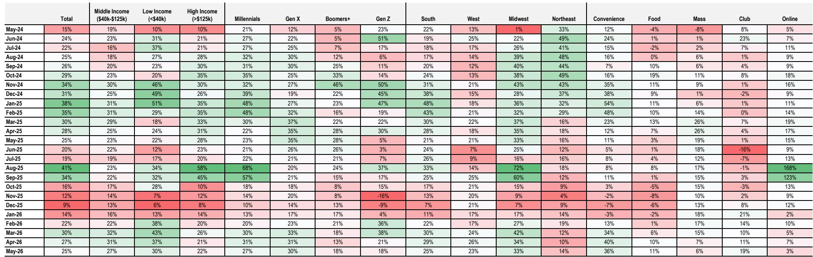
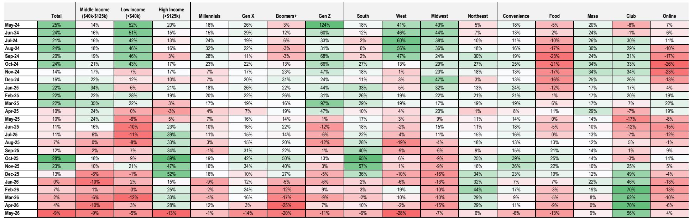
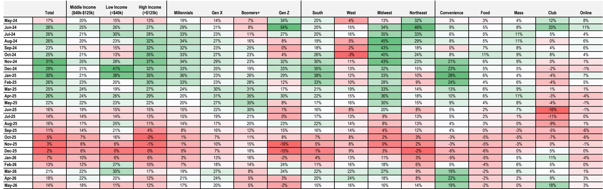

# The Energy Drink Category Is Signaling a Demand Normalization, Not a Collapse—But the Divergence Between Brands Is Widening

The U.S. energy drink category has entered a phase that demands careful interpretation. Through May 2026, the rolling 13-week projected sales growth decelerated to +10% year-over-year, marking the second consecutive month of deceleration and the slowest pace since February 2025. This is not a crash. But it is a clear signal that the category's post-pandemic acceleration phase is giving way to something more nuanced: a normalization that is exposing structural differences in brand health, consumer loyalty, and channel vulnerability.

The headline deceleration is real, but it masks a more important story. Monster Beverage Corporation continues to demonstrate resilience that sets it apart from its mature peers, even as its own momentum softens. Celsius Holdings, despite owning the high-growth Alani Nu brand, is showing sequential weakness in its core Celsius line that raises questions about its trajectory. Red Bull, the category's long-time leader by household penetration, has seen its buy rate inflect negative for the first time in months. And the challenger brands—Bloom, GHOST, C4—are revealing that high growth rates are not immune to the law of large numbers.

For investors and strategists, the critical question is not whether the category is slowing. It is. The question is which brands are losing momentum because of cyclical headwinds, and which are showing signs of structural erosion. The answer will determine portfolio positioning for the next 12 to 18 months.

## Household Penetration Is Still Expanding, But Buy Rate Deceleration Signals a Shift in Consumer Behavior

The category's top-line deceleration is being driven almost entirely by a softening in buy rate, not by a retreat in household penetration. In the 13 weeks ending May 2026, household penetration reached a new all-time high of 55.0%, up from 54.2% in the prior period. That is a remarkable achievement for a category that has been growing for years. The number of U.S. households buying energy drinks continues to expand.

The problem is on the frequency and volume side. Buy rate growth decelerated by 346 basis points sequentially to just +3% year-over-year, and on an absolute basis, buy rate actually declined by 0.4% versus the prior 13-week period. This marks a sharp departure from the previous five rolling 13-week periods, where buy rate growth consistently ran between +5% and +10% year-over-year.

This pattern matters because it tells us that the category is not losing customers. It is losing usage intensity among existing customers. The pool of consumers is still growing, but each consumer is buying less frequently or spending less per trip. That is a fundamentally different problem from a demand collapse. It suggests that the category is maturing, that the incremental consumer being added is less engaged than the early adopters, or that price sensitivity is beginning to constrain consumption.

The data on purchase frequency is particularly telling. Purchase frequency decelerated for the second consecutive period and inflected negative year-over-year for the first time since November 2025. On a sequential absolute basis, it improved slightly by 0.3%, but the year-over-year comparison shows that consumers are buying energy drinks less often than they were a year ago. Spend per trip, by contrast, remains resilient at +5% year-over-year, marking the 22nd consecutive rolling 13-week period of mid-single-digit to high-single-digit growth. Consumers are still willing to pay more per visit, but they are visiting less.

For strategists, this points to a category that is transitioning from a volume-driven growth story to a price-driven one. The question is whether that transition is sustainable, or whether it signals that the category is approaching a ceiling on per-capita consumption.

## The Slowdown Is Concentrated in Gas and Convenience, and Among Younger, Lower-Income Consumers

The deceleration in buy rate is not uniform across channels or demographics. It is heavily concentrated in the gas and convenience channel, which is the most important distribution channel for energy drinks. In the 13 weeks ending May 2026, buy rate in gas and convenience decelerated by 644 basis points sequentially to +3% year-over-year, the softest performance since July 2024. On an absolute basis, buy rate in this channel declined by 0.6% versus the prior period.

This is not a minor channel shift. Gas and convenience is where impulse purchases happen, where the core energy drink consumer shops, and where brand visibility is highest. A deceleration here suggests that the category's traditional growth engine is losing power. The fact that household penetration in gas and convenience actually inflected negative year-over-year reinforces this point. The channel is not just seeing lighter baskets; it is losing households entirely.

Demographically, the deceleration is most pronounced among Gen Z and lower-income consumers. Gen Z buy rate decelerated by a staggering 1,196 basis points sequentially to just +1% year-over-year, and on an absolute basis, Gen Z buy rate fell nearly 5% versus the prior period. Low-income consumers saw buy rate decelerate by 497 basis points to +2% year-over-year, with absolute buy rate declining roughly 1%.

These two groups—younger consumers and lower-income consumers—are often the most price-sensitive and the most influenced by discretionary spending constraints. Their pullback suggests that macroeconomic pressures, inflation in other categories, or simply a shift in preferences is affecting the category's most growth-dependent segments. By contrast, Gen X and Boomers saw their buy rates reach new highs on an absolute basis, indicating that older, more established consumers are maintaining or increasing their consumption.

For brand strategists, this creates a dilemma. The category is still adding households, but it is adding them among demographics that are less engaged or more financially constrained. The brands that can maintain purchase frequency among their core, higher-income, older consumers will fare better than those that are dependent on younger, lower-income trial.

## Monster Is Slowing, But It Is Slowing Less Than Its Peers—And That Is the Point

Monster Beverage Corporation's data for the 13 weeks ending May 2026 reveals a brand that is decelerating, but from a position of relative strength that should not be dismissed. Household penetration reached a new all-time high of 32.7%, up 56 basis points sequentially. Buy rate growth decelerated to +6% year-over-year, which is still well above Red Bull and the best among the more mature brands. Spend per trip reached a new high, increasing 0.6% sequentially.

The concern is in the trends. Purchase frequency growth decelerated for the third consecutive period and is now flat year-over-year. Buy rate growth, while still positive, has fallen from high-single-digit to low-double-digit growth rates over the prior three rolling periods to just +6%. Numerator projected sales decelerated by 314 basis points sequentially to +14% year-over-year.

But context matters. Monster's deceleration is happening from a higher base and at a slower rate than its peers. Red Bull's buy rate has inflected negative. Celsius's core brand buy rate is flat year-over-year. Monster's buy rate is still up 6%. Its household penetration gains, while decelerating slightly, are still positive and at an all-time high. Spend per trip growth remains consistent at +6% year-over-year for the 23rd consecutive monthly 13-week period.

The strategic implication is that Monster is demonstrating what a mature, well-managed brand looks like during a category normalization. It is not immune to the headwinds, but it is not breaking. Its deceleration is orderly, not alarming. For investors, the question is whether this resilience is priced in, or whether the market is overreacting to the deceleration narrative and missing the relative outperformance.

## Celsius Holdings Faces a Two-Speed Portfolio Problem

Celsius Holdings presents a more complex picture. The company owns two brands—Celsius and Alani Nu—that are on very different trajectories. Alani Nu continues to deliver robust growth, with household penetration reaching a new high of 15.3%, buy rate growth of +25% year-over-year, and projected sales growth of +76%, even as that growth decelerated by 1,420 basis points sequentially. Alani Nu is still growing at a pace that most brands would envy, but the deceleration is real and the comps are getting harder.

The Celsius brand itself is the source of concern. Celsius household penetration remains negative year-over-year for the fourth consecutive monthly 13-week period, at -89 basis points. Buy rate growth decelerated by 484 basis points sequentially to flat year-over-year, driven by a moderation in purchase frequency, which is now down 4% year-over-year. Numerator projected sales for the Celsius brand are now negative at -3% year-over-year, decelerating by 487 basis points sequentially.

The portfolio dynamic creates a strategic tension. Alani Nu is carrying the company's growth, but it is decelerating. Celsius is not growing at all. The combined entity is still showing positive growth of +11.3% year-over-year in Numerator projected sales, but that is down from much higher levels. The question for management is whether the Celsius brand can be revitalized, or whether the company is becoming increasingly dependent on Alani Nu to mask the core brand's stagnation.

For investors, the key unknown is whether the Celsius brand's household penetration decline is a cyclical pause or a structural loss of relevance. The brand's absolute household penetration did improve by 35 basis points sequentially to 15.9%, which is a positive sign after six consecutive months of moderation. But the year-over-year comparison remains negative, and that is a metric that will need to turn positive before the narrative can shift.

## The Challenger Brands Are Hitting a Growth Ceiling, But at Very Different Rates

The smaller brands in the category—Bloom, GHOST, C4—are revealing that high growth rates eventually moderate, but the pace and nature of that moderation vary significantly. Bloom continues to be the standout, with household penetration gains of +451 basis points year-over-year, the best among all tracked brands, and buy rate growth of +32% year-over-year. But even Bloom is decelerating. Its buy rate growth was +44% in the prior period and has now moderated for four consecutive months. On an absolute basis, Bloom's buy rate declined 2.8% sequentially.

GHOST presents a more ambiguous picture. Its Numerator data shows buy rate deceleration to flat year-over-year, driven by a decline in purchase frequency. But Circana data, which tracks a different channel mix, shows GHOST growing at +28.7% year-over-year. The divergence between the two data sources is significant and suggests that GHOST's performance may be channel-dependent or that Numerator's panel is not capturing the brand's true trajectory. For investors, this data inconsistency is a risk factor that demands further investigation.

C4's data is the most concerning among the challengers. Buy rate growth decelerated materially to -9% year-over-year, driven by declines in both purchase frequency and spend per trip. Spend per trip declined year-over-year for the first time in the dataset, which is a warning sign. Household penetration gains remain positive, but if the buy rate decline continues, those gains will eventually reverse.

The strategic takeaway is that the challenger brands are reaching a point where they cannot rely on household penetration gains alone to drive growth. They need to convert new households into repeat buyers and increase frequency. The data suggests that Bloom is doing this most effectively, while C4 is struggling and GHOST is an open question.

## What the Report Does Not Fully Answer: The Role of Pricing, Innovation, and Macroeconomic Sensitivity

The Numerator data provides an excellent granular view of consumer behavior, but it leaves several critical questions unanswered. First, the data does not break down the impact of pricing versus mix on the spend per trip metric. Spend per trip is up 5% year-over-year, but is that because prices have increased, because consumers are buying more premium products, or because they are buying larger pack sizes? The answer has very different implications for brand strategy and margin outlook.

Second, the data does not capture the role of new product innovation in driving household penetration or buy rate. The energy drink category has seen significant innovation in recent years, with new flavors, functional ingredients, and packaging formats. The deceleration in purchase frequency could be a sign that innovation is not resonating, or it could be that the innovation cycle is simply in a lull. Without product-level data, it is impossible to know.

Third, the data cannot fully isolate the impact of macroeconomic conditions on the category. The deceleration among low-income and Gen Z consumers suggests that discretionary spending pressure is a factor, but the data does not control for inflation, wage growth, or consumer confidence. It is possible that the category is simply normalizing after a period of elevated growth, and that the current deceleration is not a sign of weakness but a return to trend.

Finally, the divergence between Numerator and Circana data for brands like GHOST raises questions about data reliability and channel mix. Investors who rely on a single data source may be misled. The report itself encourages focusing on directional trends rather than absolute numbers, but even directional trends can be misleading if the underlying sample is not representative.

## A Decision Framework for Evaluating Energy Drink Brands During Normalization

For investors and strategists trying to navigate this phase, a structured framework can help separate signal from noise. The following four-quadrant analysis provides a way to evaluate brands based on their household penetration trajectory and their buy rate trajectory.

**Quadrant 1: Expanding penetration, growing buy rate.** These brands are in the strongest position. They are adding new households while also increasing consumption among existing customers. Bloom fits this profile, though its buy rate growth is decelerating. Alani Nu is close, but its household penetration gains are decelerating.

**Quadrant 2: Expanding penetration, declining buy rate.** These brands are still attracting new customers, but existing customers are buying less. This is a warning sign that the brand may be reaching a ceiling on usage intensity. C4 fits this profile, with strong household penetration gains but a sharp decline in buy rate.

**Quadrant 3: Stable penetration, growing buy rate.** These brands are not adding many new households, but their existing customers are buying more. This suggests a loyal, engaged consumer base that may be less sensitive to competition. Monster fits this profile, with household penetration at a new high but decelerating, and buy rate still positive.

**Quadrant 4: Stable or declining penetration, declining buy rate.** These brands are in the most dangerous position. They are losing both customers and usage intensity. Red Bull, with household penetration still growing but buy rate now negative, is on the edge of this quadrant. The Celsius brand, with negative household penetration year-over-year and flat buy rate, is also at risk.

The framework suggests that the most attractive investment opportunities are in Quadrant 1 and Quadrant 3, where at least one of the two key metrics is healthy. The riskiest positions are in Quadrant 4, where both metrics are under pressure. The key unknown is whether Quadrant 2 brands can reverse their buy rate decline before household penetration gains stall.

## Join the community to read the full report and review the original charts.

The data presented here is drawn from a detailed monthly analysis of the U.S. energy drink category, including brand-by-brand breakdowns of household penetration, buy rate, purchase frequency, spend per trip, and channel and demographic trends. The full report includes the underlying charts and tables that allow for deeper analysis of the trends discussed here, as well as data on additional brands and time periods.

*This article is for learning and discussion only and does not constitute investment advice.*

Personal reading notes and learning share only. Not investment advice.

