## Investor Presentation | Asia Pacific

# Asia Summer School 2026: ASEAN Telecoms & Data Centers

We take a deep dive into the five key drivers of ASEAN Telecom stocks: Competition, Capex, Regulation, Capital Allocation, and Valuations. We also explore how telecom operators are benefitting from rising data center demand in the region.

MS ASIA (SINGAPORE) PTE.+

Da Wei Lee

Equity Analyst

Dawei.Lee@morganstanley.com

+65 6834-6510

text_image

Asia Summer School 2026

MS does and seeks to do business with companies covered in MS. As a result, investors should be aware that the firm may have a conflict of interest that could affect the objectivity of MS. Investors should consider MS as only a single factor in making their investment decision.

For analyst certification and other important disclosures, refer to the Disclosure Section, located at the end of this report.

+= Analysts employed by non-U.S. affiliates are not registered with FINRA, may not be associated persons of the member and may not be subject to FINRA restrictions on communications with a subject company, public appearances and trading securities held by a research analyst account.

## ASEAN Summer School 2026

Five Underlying Drivers

<table><tr><td>Competition</td><td>This is a function of 1) the number of market participants, 2) structural forces (i.e., voice/SMS cannibalization), and 3) regulatory events (e.g., spectrum auctions).High levels of competition correlate with lower market returns and vice versa – lower competition tends to result in higher returns.</td></tr><tr><td>Capex cycle</td><td>This is driven by 1) technology upgrades (4G to 5G), 2) network expansions, and 3) fixed-network investments (fibre rollouts).High levels of expected capex will decrease return on invested capital (ROIC) and can limit capital distributions.</td></tr><tr><td>Regulation</td><td>How much influence do regulators exert on the industry, and is this expected to change?Examples include spectrum auctions, interconnection fees, industry consolidation, and network sharing.High levels of regulation can result in lower shareholder returns, with new players entering the market or by fostering limits on capital returns.</td></tr><tr><td>Capital allocation</td><td>Capital allocation flexibility is determined by balance sheet strength, which then drives dividend policy and M&amp;A policy.Capital returns have historically been a strong driver of alpha generation for telco stocks.</td></tr><tr><td>Valuations</td><td>We think investors should focus on multiple metrics, not just one – EV/EBITDA, dividend yield, FCF yield, ROE and P/BV, and ROIC.</td></tr></table>

## Ranking of ASEAN Telco Markets for 2026: TH>SG>MY>ID>PH

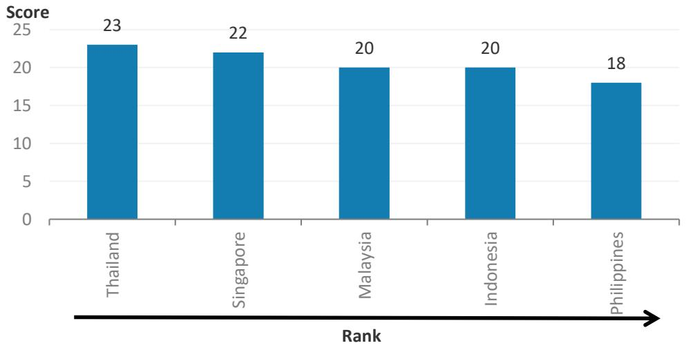

bar chart

| Country | Score |
| :--- | :--- |
| Thailand | 23 |
| Singapore | 22 |
| Malaysia | 20 |
| Indonesia | 20 |
| Philippines | 18 |

<table><tr><td>Country</td><td colspan="2">Competition Cycle</td><td colspan="2">Capex Cycle</td><td colspan="2">Regulation Cycle</td><td colspan="2">Capital allocation</td><td colspan="2">Valuation</td><td colspan="2"></td></tr><tr><td></td><td>Current</td><td>Outlook</td><td>Current</td><td>Outlook</td><td>Current</td><td>Outlook</td><td>Current</td><td>Outlook</td><td>Current</td><td>Outlook</td><td>Total</td><td>Rank</td></tr><tr><td>Thailand</td><td>3</td><td>3</td><td>2</td><td>2</td><td>2</td><td>2</td><td>2</td><td>3</td><td>1</td><td>3</td><td>23</td><td>1</td></tr><tr><td>Singapore</td><td>1</td><td>3</td><td>3</td><td>2</td><td>2</td><td>2</td><td>3</td><td>3</td><td>1</td><td>2</td><td>22</td><td>2</td></tr><tr><td>Malaysia</td><td>1</td><td>2</td><td>3</td><td>1</td><td>2</td><td>2</td><td>2</td><td>3</td><td>2</td><td>2</td><td>20</td><td>3</td></tr><tr><td>Indonesia</td><td>2</td><td>2</td><td>1</td><td>1</td><td>2</td><td>2</td><td>1</td><td>3</td><td>3</td><td>3</td><td>20</td><td>3</td></tr><tr><td>Philippines</td><td>2</td><td>1</td><td>1</td><td>2</td><td>3</td><td>2</td><td>2</td><td>1</td><td>3</td><td>1</td><td>18</td><td>5</td></tr></table>

Source: MS.

# Indonesia: Competition Expected to Improve in Java, but Rise ex-Java

## Number of industry participants (consolidated to three)

• Consolidated from 10 players in 2008 to three today.  
- Tsel is Indonesia’s market leader with \~45% subs market share.  
- ISAT and H3I merged to form Indonesia's #2 mobile player in 2022.  
• XLSmart was formed following the EXCL+FREN merger in 2025.

## Industry structure:

\- Largely prepaid subs; mobile revenue driven by data revenue (legacy voice/SMS has fallen from $>60\%$ of revenue in 2015 to $<10\%$ today).

## Recent developments:

- Competition has improved since 2H25.  
- We expect network coverage/quality to improve ex-Java now with ISAT and EXCL bigger/stronger post their respective mergers.  
• ARPU converging towards Rp45k between all three operators.

Number of Mobile Operators in Indonesia  
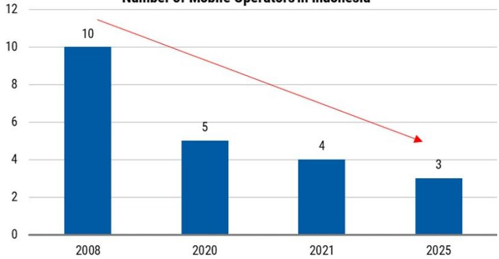

bar chart

Number of mobile operators in India
| Year | Number of mobile operators (in thousands) |
|---|---|
| 2008 | 10 |
| 2020 | 5 |
| 2021 | 4 |
| 2025 | 3 |

Source: Company data, MS.

Market Share by Mobile Subscribers in Indonesia  
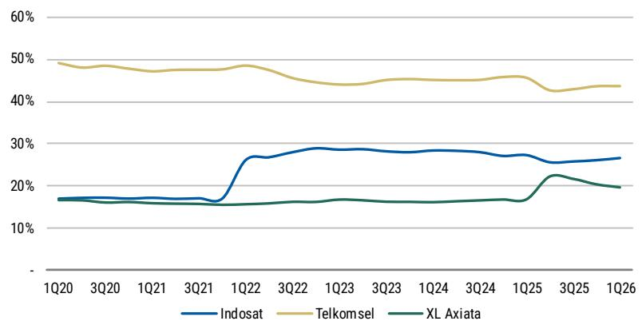

line chart

| Quarter | Indosat | Telkomsel | XL Axiata |
| ------- | ------- | --------- | --------- |
| 1Q20    | 17%     | 49%       | 17%       |
| 3Q20    | 17%     | 48%       | 16%       |
| 1Q21    | 17%     | 47%       | 16%       |
| 3Q21    | 17%     | 47%       | 16%       |
| 1Q22    | 27%     | 48%       | 16%       |
| 3Q22    | 29%     | 45%       | 16%       |
| 1Q23    | 29%     | 44%       | 16%       |
| 3Q23    | 28%     | 45%       | 16%       |
| 1Q24    | 28%     | 45%       | 16%       |
| 3Q24    | 28%     | 45%       | 16%       |
| 1Q25    | 27%     | 45%       | 16%       |
| 3Q25    | 25%     | 43%       | 22%       |
| 1Q26    | 26%     | 43%       | 20%       |

Blended ARPU in IDR'actuals  
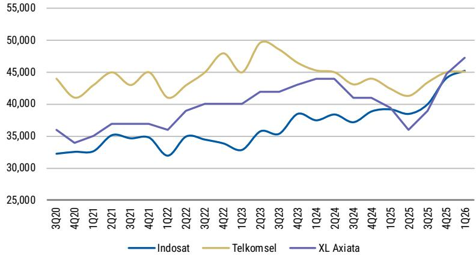

line chart

| Quarter | Indosat | Telkomsel | XL Axiata |
| ------- | ------- | --------- | --------- |
| 3Q20    | 32,000  | 44,000    | 36,000    |
| 4Q20    | 32,500  | 41,000    | 34,000    |
| 1Q21    | 33,000  | 45,000    | 35,000    |
| 2Q21    | 34,000  | 44,000    | 36,000    |
| 3Q21    | 34,500  | 45,000    | 36,500    |
| 4Q21    | 33,500  | 41,000    | 36,500    |
| 1Q22    | 32,500  | 42,000    | 36,500    |
| 2Q22    | 34,500  | 44,000    | 39,500    |
| 3Q22    | 34,500  | 48,000    | 40,000    |
| 4Q22    | 33,500  | 45,000    | 40,000    |
| 1Q23    | 33,500  | 50,000    | 41,500    |
| 2Q23    | 35,500  | 49,500    | 42,500    |
| 3Q23    | 36,500  | 48,500    | 42,500    |
| 4Q23    | 38,500  | 47,500    | 43,500    |
| 1Q24    | 38,500  | 46,500    | 44,500    |
| 2Q24    | 38,500  | 46,500    | 44,500    |
| 3Q24    | 38,500  | 46,500    | 41,500    |
| 4Q24    | 39,500  | 46,500    | 41,500    |
| 1Q25    | 39,500  | 41,500    | 36,500    |
| 2Q25    | 38,500  | 41,500    | 36,500    |
| 3Q25    | 39,500  | 42,500    | 39,500    |
| 4Q25    | 44,500  | 46,500    | 47,500    |
| 1Q26    | 47,500  | 47,500    | 48,500    |

## Thailand: Competition Expected to Stay Rational in a Duopoly Market

## Number of industry participants (3 key players to 2)

- TRUE is Thailand's market leader following the merger with DTAC in 2022. It has \~40% subs market share.  
• AIS' market share is \~40%.  
• SOEs TOT/CAT merged to form National Telecom.

## Industry structure:

- Largely prepaid subs (>70%), but migration toward postpaid and transitioning towards 5G.  
- Competition has been stable post merger.

## Broadband – ARPU on the rise

• We expect broadband penetration to rise \~1ppt in 2025-28e, to \~58%.  
- We observed broadband ARPU rising through 2024 as operators removed discounts, etc.

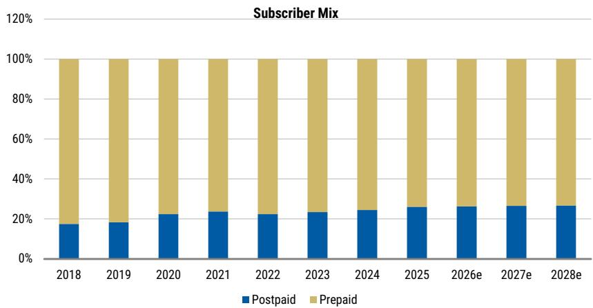

stacked bar chart

| Year   | Postpaid | Prepaid |
| ------ | -------- | ------- |
| 2018   | 18%      | 81%     |
| 2019   | 18%      | 81%     |
| 2020   | 22%      | 78%     |
| 2021   | 24%      | 76%     |
| 2022   | 22%      | 78%     |
| 2023   | 23%      | 76%     |
| 2024   | 24%      | 76%     |
| 2025   | 26%      | 74%     |
| 2026e  | 26%      | 74%     |
| 2027e  | 26%      | 74%     |
| 2028e  | 26%      | 74%     |

Source: Company data, MS estimates.

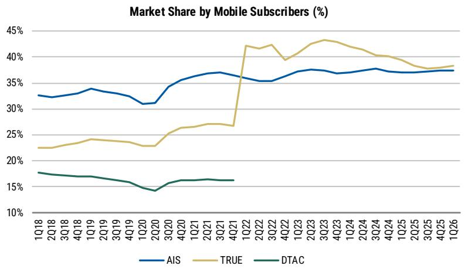

line chart

| Quarter | AIS   | TRUE  | DTAC  |
|---------|-------|-------|-------|
| 1Q18    | 32%   | 22%   | 17%   |
| 2Q18    | 32%   | 22%   | 17%   |
| 3Q18    | 33%   | 23%   | 17%   |
| 4Q18    | 34%   | 24%   | 17%   |
| 1Q19    | 33%   | 24%   | 17%   |
| 2Q19    | 32%   | 24%   | 16%   |
| 3Q19    | 32%   | 24%   | 16%   |
| 4Q19    | 31%   | 24%   | 15%   |
| 1Q20    | 30%   | 23%   | 14%   |
| 2Q20    | 31%   | 23%   | 15%   |
| 3Q20    | 34%   | 26%   | 16%   |
| 4Q20    | 35%   | 27%   | 16%   |
| 1Q21    | 36%   | 27%   | 16%   |
| 2Q21    | 37%   | 27%   | 16%   |
| 3Q21    | 37%   | 27%   | 16%   |
| 4Q21    | 36%   | 27%   | 16%   |
| 1Q22    | 35%   | 42%   | -     |
| 2Q22    | 35%   | 42%   | -     |
| 3Q22    | 36%   | 43%   | -     |
| 4Q22    | 36%   | 40%   | -     |
| 1Q23    | 37%   | 41%   | -     |
| 2Q23    | 37%   | 42%   | -     |
| 3Q23    | 37%   | 43%   | -     |
| 4Q23    | 37%   | 43%   | -     |
| 1Q24    | 37%   | 42%   | -     |
| 2Q24    | 37%   | 41%   | -     |
| 3Q24    | 37%   | 40%   | -     |
| 4Q24    | 37%   | 40%   | -     |
| 1Q25    | 37%   | 39%   | -     |
| 2Q25    | 37%   | 38%   | -     |
| 3Q25    | 37%   | 38%   | -     |
| 4Q25    | 37%   | 38%   | -     |
| 1Q26    | 37%   | 38%   | -     |

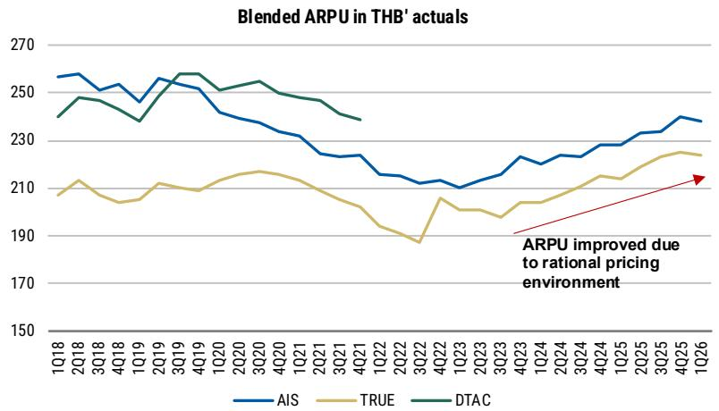

line chart

| Quarter | AIS   | TRUE  | DTAC  |
|---------|-------|-------|-------|
| 1Q18    | 255   | 210   | 240   |
| 2Q18    | 258   | 212   | 245   |
| 3Q18    | 255   | 208   | 248   |
| 4Q18    | 250   | 205   | 245   |
| 1Q19    | 245   | 208   | 240   |
| 2Q19    | 255   | 210   | 250   |
| 3Q19    | 250   | 208   | 255   |
| 4Q19    | 245   | 205   | 250   |
| 1Q20    | 240   | 208   | 245   |
| 2Q20    | 235   | 210   | 240   |
| 3Q20    | 230   | 212   | 235   |
| 4Q20    | 225   | 210   | 230   |
| 1Q21    | 220   | 208   | 225   |
| 2Q21    | 215   | 205   | 220   |
| 3Q21    | 210   | 200   | 215   |
| 4Q21    | 205   | 195   | 210   |
| 1Q22    | 200   | 190   | 205   |
| 2Q22    | 195   | 185   | 200   |
| 3Q22    | 190   | 180   | 195   |
| 4Q22    | 195   | 185   | 190   |
| 1Q23    | 200   | 190   | 195   |
| 2Q23    | 205   | 195   | 200   |
| 3Q23    | 210   | 200   | 205   |
| 4Q23    | 215   | 205   | 210   |
| 1Q24    | 220   | 210   | 215   |
| 2Q24    | 225   | 215   | 220   |
| 3Q24    | 230   | 220   | 225   |
| 4Q24    | 235   | 225   | 230   |
| 1Q25    | 240   | 230   | 235   |
| 2Q25    | 245   | 235   | 240   |
| 3Q25    | 250   | 240   | 245   |
| 4Q25    | 255   | 245   | 250   |
| 1Q26    | 260   | 250   | 255   |

## Singapore: Competition to Sustain in Mobile, Intensifying in Broadband

## Number of industry participants (4 players but may consolidate)

- 4-player market – SingTel is the incumbent with \~45% subs market share.  
- TPG won rights to be the fourth telco in Singapore in 2016.  
- Competition in SIM-only plans remains highly intense.  
- Simba + M1 deal suspended; SingTel is keen to participate

## Industry structure:

• Largely postpaid subs market.  
• A number of MVNOs have entered since 2016.  
• Proliferation of SIM-only plans.

## Broadband – SIMBA pushing the competition

\- Competition in broadband moved a notch higher in Singapore since SIMBA launched its broadband plan in 2024. SIMBA is currently offering a 10Gbps speed plan at S\$30.

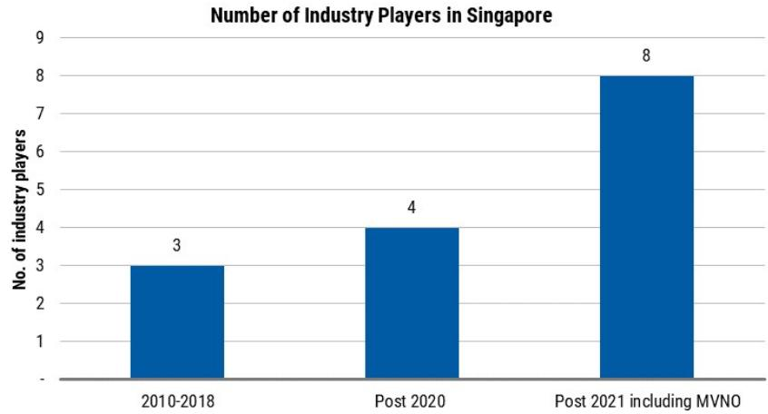

bar chart

Number of Industry Players in Singapore
| Period | No. of industry players |
| :--- | :--- |
| 2010-2018 | 3 |
| Post 2020 | 4 |
| Post 2021 including MVNO | 8 |

Source: Company data, MS.

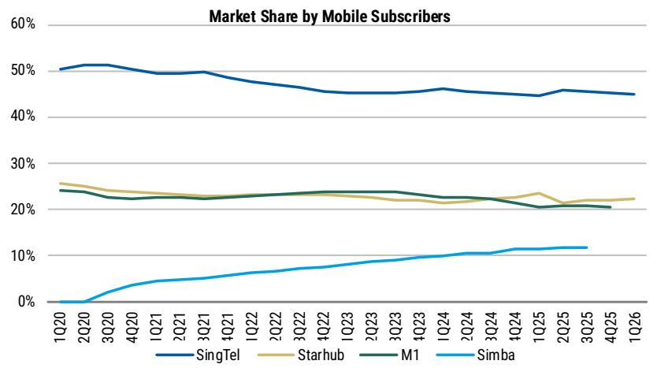

line chart

| Quarter | SingTel | Starhub | M1   | Simba |
|---------|---------|---------|------|-------|
| 1Q20    | 50%     | 25%     | 23%  | 0%    |
| 2Q20    | 51%     | 24%     | 22%  | 0%    |
| 3Q20    | 50%     | 23%     | 21%  | 0%    |
| 4Q20    | 49%     | 22%     | 20%  | 3%    |
| 1Q21    | 48%     | 21%     | 19%  | 4%    |
| 2Q21    | 47%     | 20%     | 18%  | 5%    |
| 3Q21    | 46%     | 19%     | 17%  | 6%    |
| 4Q21    | 45%     | 18%     | 16%  | 7%    |
| 1Q22    | 44%     | 17%     | 15%  | 8%    |
| 2Q22    | 43%     | 16%     | 14%  | 9%    |
| 3Q22    | 42%     | 15%     | 13%  | 10%   |
| 4Q22    | 41%     | 14%     | 12%  | 11%   |
| 1Q23    | 40%     | 13%     | 11%  | 12%   |
| 2Q23    | 39%     | 12%     | 10%  | 13%   |
| 3Q23    | 38%     | 11%     | 9%   | 14%   |
| 4Q23    | 37%     | 10%     | 8%   | 15%   |
| 1Q24    | 36%     | 9%      | 7%   | 16%   |
| 2Q24    | 35%     | 8%      | 6%   | 17%   |
| 3Q24    | 34%     | 7%      | 5%   | 18%   |
| 4Q24    | 33%     | 6%      | 4%   | 19%   |
| 1Q25    | 32%     | 5%      | 3%   | 20%   |
| 2Q25    | 31%     | 4%      | 2%   | 21%   |
| 3Q25    | 30%     | 3%      | 1%   | 22%   |
| 4Q25    | 29%     | 2%      | 0%   | 23%   |
| 1Q26    | 28%     | 1%      | -1%  | 24%   |

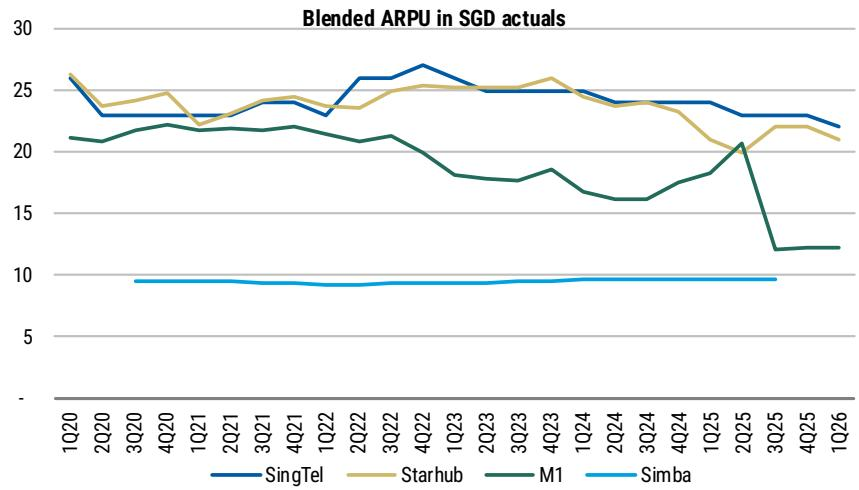

line chart

| Quarter | SingTel | Starhub | M1  | Simba |
|---------|---------|---------|-----|-------|
| 1Q20    | 26.0    | 26.0    | 21.0| 9.5   |
| 2Q20    | 23.0    | 24.0    | 21.5| 9.5   |
| 3Q20    | 23.0    | 25.0    | 22.0| 9.5   |
| 4Q20    | 23.0    | 24.0    | 22.5| 9.5   |
| 1Q21    | 23.0    | 23.0    | 22.0| 9.5   |
| 2Q21    | 23.0    | 24.0    | 22.5| 9.5   |
| 3Q21    | 24.0    | 24.5    | 22.5| 9.5   |
| 4Q21    | 24.0    | 24.0    | 22.5| 9.5   |
| 1Q22    | 23.0    | 23.5    | 21.5| 9.5   |
| 2Q22    | 26.0    | 24.0    | 21.0| 9.5   |
| 3Q22    | 26.0    | 25.0    | 21.5| 9.5   |
| 4Q22    | 27.0    | 25.5    | 19.5| 9.5   |
| 1Q23    | 26.0    | 25.0    | 18.0| 9.5   |
| 2Q23    | 25.0    | 25.0    | 17.5| 9.5   |
| 3Q23    | 25.0    | 26.0    | 18.0| 9.5   |
| 4Q23    | 25.0    | 26.0    | 17.5| 9.5   |
| 1Q24    | 24.0    | 24.0    | 16.5| 9.5   |
| 2Q24    | 24.0    | 24.0    | 16.0| 9.5   |
| 3Q24    | 24.0    | 23.5    | 16.5| 9.5   |
| 4Q24    | 24.0    | 23.0    | 17.5| 9.5   |
| 1Q25    | 24.0    | 21.0    | 18.5| 9.5   |
| 2Q25    | 23.0    | 19.0    | 17.0| 9.5   |
| 3Q25    | 23.0    | 17.0    | 11.5| 9.5   |
| 4Q25    | 23.0    | 17.5    | 11.5| 9.5   |
| 1Q26    | 22.0    | 17.0    | 11.5| 9.5   |

## Philippines: Third Player is Still Hanging Around

## Number of industry participants (up from 2 to 3)

\- Historically a two-player market, with a new entrant (Dito) launched in March 2021.

## Industry structure:

\- Largely prepaid subs; data revenues driving growth and replacing legacy voice/SMS revenues (this has fallen from \~80% of revenue in 2013 to \~6% in 2026e).

## Broadband – lower pricing arising from affordability issues

- Broadband penetration to rise \~2ppt p.a. over 2025-28e to 37%; this is still lower than the ASEAN average of \~50%.  
- Affordability is an issue, with broadband ARPU as a percentage of household income at one of the highest levels in ASEAN: \~2.5% vs. the ASEAN average of 1.6%.

Philippines Mobile Revenue in PHP'mn  
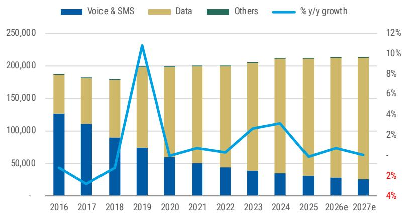

bar-line hybrid

| Year | Voice & SMS | Data | Others | % y/y growth |
|---|---|---|---|---|
| 2016 | 125000 | 55000 | 0 | 2.3 |
| 2017 | 108000 | 64000 | 0 | 1.9 |
| 2018 | 88000 | 74000 | 0 | 3.5 |
| 2019 | 72000 | 135000 | 0 | 11.5 |
| 2020 | 58000 | 145000 | 0 | -1.3 |
| 2021 | 51000 | 148000 | 0 | 1.6 |
| 2022 | 45000 | 149000 | 0 | 1.4 |
| 2023 | 39000 | 153000 | 0 | 2.1 |
| 2024 | 35000 | 158000 | 500 | 3.1 |
| 2025 | 31000 | 161000 | 500 | -1.3 |
| 2026e | 28000 | 163000 | 550 | 1.7 |
| 2027e | 25000 | 164000 | 550 | 1.4 |

Source: Company data, MS estimates.

Market Share by Mobile Subscribers in Philippines (%)  
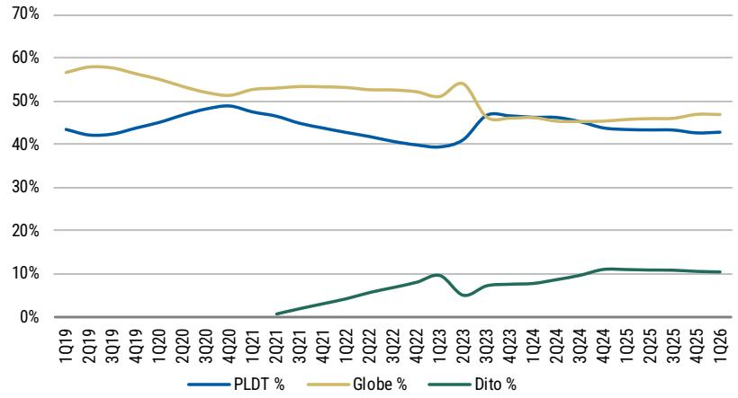

line chart

| Quarter | PLDT % | Globe % | Dito % |
|---------|--------|---------|--------|
| 1Q19    | 43%    | 57%     | -      |
| 2Q19    | 42%    | 58%     | -      |
| 3Q19    | 44%    | 57%     | -      |
| 4Q19    | 45%    | 56%     | -      |
| 1Q20    | 46%    | 55%     | -      |
| 2Q20    | 47%    | 54%     | -      |
| 3Q20    | 48%    | 53%     | -      |
| 4Q20    | 49%    | 52%     | -      |
| 1Q21    | 48%    | 53%     | -      |
| 2Q21    | 47%    | 54%     | -      |
| 3Q21    | 46%    | 55%     | -      |
| 4Q21    | 45%    | 56%     | -      |
| 1Q22    | 44%    | 57%     | -      |
| 2Q22    | 43%    | 58%     | -      |
| 3Q22    | 42%    | 59%     | -      |
| 4Q22    | 41%    | 60%     | -      |
| 1Q23    | 40%    | 59%     | -      |
| 2Q23    | 39%    | 58%     | -      |
| 3Q23    | 40%    | 57%     | -      |
| 4Q23    | 41%    | 56%     | -      |
| 1Q24    | 42%    | 55%     | -      |
| 2Q24    | 43%    | 54%     | -      |
| 3Q24    | 44%    | 53%     | -      |
| 4Q24    | 45%    | 52%     | -      |
| 1Q25    | 46%    | 51%     | -      |
| 2Q25    | 47%    | 50%     | -      |
| 3Q25    | 48%    | 49%     | -      |
| 4Q25    | 49%    | 48%     | -      |
| 1Q26    | 50%    | 47%     | -      |

Blended ARPU in PHP actuals  
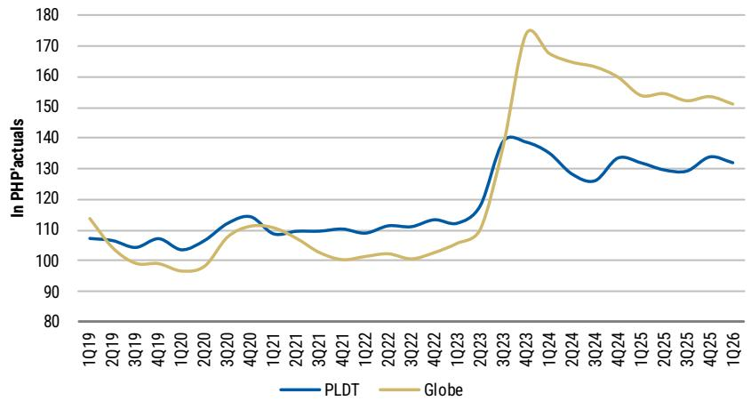

line chart

| Quarter | PLDT  | Globe |
|---------|-------|-------|
| 1Q19    | 108   | 113   |
| 2Q19    | 107   | 100   |
| 3Q19    | 105   | 98    |
| 4Q19    | 106   | 97    |
| 1Q20    | 104   | 96    |
| 2Q20    | 105   | 97    |
| 3Q20    | 108   | 100   |
| 4Q20    | 112   | 105   |
| 1Q21    | 110   | 108   |
| 2Q21    | 109   | 105   |
| 3Q21    | 108   | 103   |
| 4Q21    | 109   | 102   |
| 1Q22    | 108   | 103   |
| 2Q22    | 109   | 104   |
| 3Q22    | 108   | 105   |
| 4Q22    | 109   | 106   |
| 1Q23    | 110   | 107   |
| 2Q23    | 115   | 108   |
| 3Q23    | 135   | 140   |
| 4Q23    | 138   | 175   |
| 1Q24    | 135   | 165   |
| 2Q24    | 130   | 160   |
| 3Q24    | 128   | 158   |
| 4Q24    | 132   | 155   |
| 1Q25    | 130   | 153   |
| 2Q25    | 128   | 152   |
| 3Q25    | 130   | 153   |
| 4Q25    | 132   | 154   |
| 1Q26    | 133   | 152   |

## Malaysia: Competition is High

## Number of industry participants (consolidated from 5 to 4)

• Celcom-Digi merger completed in Dec 2022  
- Largely prepaid subs (\~70%), but migration towards postpaid Recent developments:  
- CelcomDigi & Maxis each injected RM202mn shareholder advance to DNB  
- U Mobile sold its entire stake in Digital Nasional Bhd (DNB) in May 2025 and is currently pushing its own 5G network plans  
- TM invoked rights to terminate the 5G agreement with DNB; it signed a deal with U Mobile in February 2026

## Industry structure:

Malaysia Telco Revenue in MYR'mn  
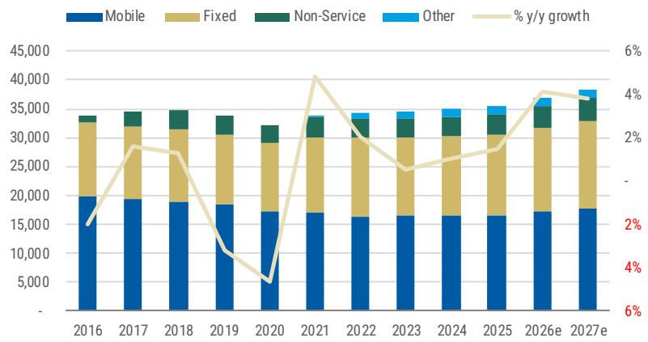

stacked bar chart

| Year | Mobile | Fixed | Non-Service | Other | % y/y growth |
|---|---|---|---|---|---|
| 2016 | 20000 | 15000 | 2000 | 0 | 2.0 |
| 2017 | 19500 | 14000 | 3000 | 0 | 2.5 |
| 2018 | 19000 | 14500 | 3500 | 0 | 2.3 |
| 2019 | 18500 | 15500 | 3500 | 0 | 1.5 |
| 2020 | 17500 | 13500 | 3500 | 0 | 3.5 |
| 2021 | 17000 | 17500 | 4500 | 0 | 4.5 |
| 2022 | 16500 | 18500 | 4500 | 150 | 3.5 |
| 2023 | 16500 | 17500 | 4500 | 150 | 2.5 |
| 2024 | 16500 | 17500 | 4500 | 150 | 2.5 |
| 2025 | 16500 | 18500 | 4500 | 150 | 3.5 |
| 2026e | 17000 | 19500 | 4500 | 150 | 4.5 |
| 2027e | 17500 | 19500 | 4500 | 150 | 4.5 |

Source: Company data, MS estimates.

Market Share by Mobile Subscribers (%)  
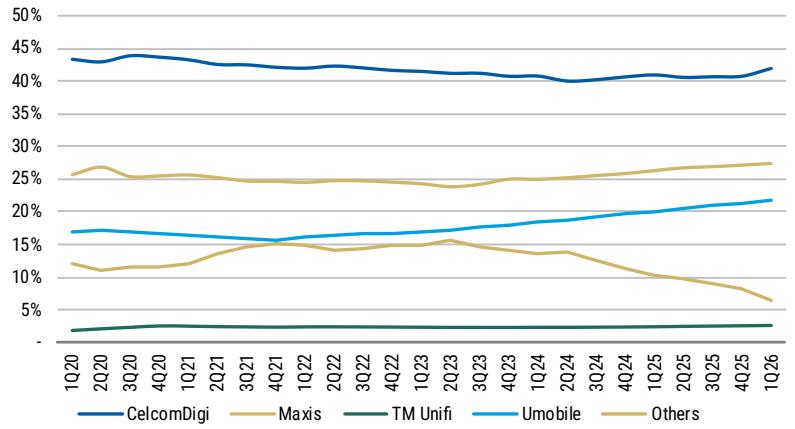

line chart

| Quarter | CelcomDigi | Maxis | TM Unifi | Umobile | Others |
|---------|------------|-------|----------|---------|--------|
| 1Q20    | 43%        | 25%   | 2%       | 17%     | 12%    |
| 2Q20    | 44%        | 26%   | 2%       | 17%     | 11%    |
| 3Q20    | 44%        | 25%   | 2%       | 17%     | 11%    |
| 4Q20    | 43%        | 25%   | 2%       | 17%     | 12%    |
| 1Q21    | 43%        | 25%   | 2%       | 17%     | 13%    |
| 2Q21    | 43%        | 25%   | 2%       | 17%     | 14%    |
| 3Q21    | 43%        | 25%   | 2%       | 17%     | 15%    |
| 4Q21    | 43%        | 25%   | 2%       | 17%     | 15%    |
| 1Q22    | 43%        | 25%   | 2%       | 17%     | 15%    |
| 2Q22    | 43%        | 25%   | 2%       | 17%     | 15%    |
| 3Q22    | 43%        | 25%   | 2%       | 17%     | 15%    |
| 4Q22    | 43%        | 25%   | 2%       | 17%     | 15%    |
| 1Q23    | 43%        | 25%   | 2%       | 17%     | 15%    |
| 2Q23    | 43%        | 25%   | 2%       | 17%     | 15%    |
| 3Q23    | 43%        | 25%   | 2%       | 17%     | 15%    |
| 4Q23    | 43%        | 25%   | 2%       | 17%     | 15%    |
| 1Q24    | 43%        | 25%   | 2%       | 17%     | 15%    |
| 2Q24    | 43%        | 25%   | 2%       | 17%     | 15%    |
| 3Q24    | 43%        | 25%   | 2%       | 17%     | 15%    |
| 4Q24    | 43%        | 25%   | 2%       | 17%     | 15%    |
| 1Q25    | 43%        | 25%   | 2%       | 17%     | 15%    |
| 2Q25    | 43%        | 25%   | 2%       | 17%     | 15%    |
| 3Q25    | 43%        | 25%   | 2%       | 17%     | 15%    |
| 4Q25    | 43%        | 25%   | 2%       | 17%     | 15%    |
| 1Q26    | 43%        | 25%   | 2%       | 17%     | 15%    |
| Q1-06   | -          | -     | -        | -       | -      |
| Q0-06   | -          | -     | -        | -       | -      |
| Q1-06   | -          | -     | -        | -       | -      |
| Q0-06   | -          | -     | -        | -       | -      |
| Q1-06   | -          | -     | -        | -       | -      |
| Q0-06   | -          | -     | -        | -       | -      |
| Q1-06*  | -          | -     | -        | -       | -      |
| Q0-06*   | -          | -     | -        | -       | -      |
| Q1-06*   | -          | -     | -        | -       | -      |
| Q0-06*   | -          | -     | -        | -       | -      |
| Q1-06*   | -          | -     | -        | -       | -      |
| Q0-06*   | -          | -     | -        | -       | -      |
| Q1-06*   | -          = -    | -     | -        | -       | -      |
| Q0-06*   | -          = -    | -     | -        | -       | -      |
| Q1-06*   | -          = -    | -     | -        | -       | -      |
| Q0-06*   | -          = -    | -     | -        | -       | -      |
| Q1-06*   | -          = -    | -     | -        | -       | -      |
| Q0-07*   | -          = -    | -     | -        | -       | -      |
| Q1-07*   | -          = -    | -     | -        | -       | -      |
| Q0-07*   | -          = -    | -     | -        | -       | -      |
| Q1-07*   | -          = -    | -     | -        | -       | -      |
| Q0-07*   | -          = -    | -     | -        | -       | +6.79 % |
| Q1-07*   | -          = -    | -     | -        | -       | +6.79 % |
| Q0-07*   | -          = -    | -     | -        | -       | +6.79 % |
| Q1-07*   | -          = -    | -     | -        | -       | +6.79 % |
| Q0-08*   | -          = -    | -     | -        | -       | +6.79 % |
| Q1-08*   | -          = -    | -     | -        | -       | +6.79 % |
| Q0-08*   | -          = -    | -     | -        | -       | +6.79 % |
| Q1-08*   | -          = -    | -     | -        | -       | +6.79 % |
| Q0-09*   | -          = -    | -     | -        | -       | +6.79 % |
| Q1-09*   | -          = -    | -     | -        | -       | +6.79 % |
| Q0-09*   | -          = -    | -     | -        | -       | +6.79 % |
| Q1-09*   | -          = -    | -     | -        | -       | +6.79 % |
| Q0-09*   |
| Q1-09*   (Note) * (-) * (-) * (-) * (-) * (-) * (-) * (-) * (-) * (-) * (-) * (-) * (-) * (-) * (-) * (-) * (-) * (-) * (-) * (-) * (-) * (-) * (-) * (-) * (-) * (-) * (-) * (-) * (-) * (-) * (-) * (-) * (-) * (-) * (-)|

Blended ARPU in MYRactuals  
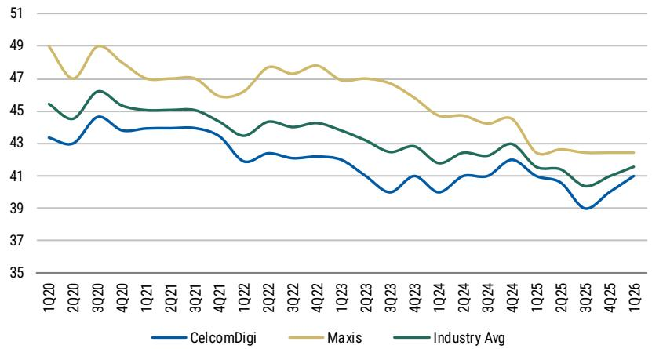

line chart

| Quarter | CelcomDigi | Maxis | Industry Avg |
| ------- | ---------- | ----- | ------------ |
| 1Q20    | 43.0       | 49.0  | 45.0         |
| 2Q20    | 43.5       | 47.0  | 44.5         |
| 3Q20    | 44.5       | 49.0  | 46.0         |
| 4Q20    | 44.0       | 48.0  | 45.5         |
| 1Q21    | 43.5       | 47.0  | 45.0         |
| 2Q21    | 43.5       | 47.0  | 45.0         |
| 3Q21    | 43.5       | 47.0  | 45.0         |
| 4Q21    | 43.0       | 46.0  | 44.5         |
| 1Q22    | 42.5       | 47.0  | 44.0         |
| 2Q22    | 42.5       | 47.5  | 43.5         |
| 3Q22    | 42.5       | 47.5  | 43.5         |
| 4Q22    | 42.5       | 47.5  | 43.5         |
| 1Q23    | 42.5       | 47.0  | 43.0         |
| 2Q23    | 42.0       | 47.0  | 42.5         |
| 3Q23    | 41.5       | 46.5  | 42.0         |
| 4Q23    | 41.0       | 46.0  | 41.5         |
| 1Q24    | 40.5       | 45.0  | 41.0         |
| 2Q24    | 40.5       | 45.0  | 41.0         |
| 3Q24    | 41.0       | 45.0  | 41.5         |
| 4Q24    | 41.5       | 45.0  | 41.5         |
| 1Q25    | 41.0       | 43.0  | 41.0         |
| 2Q25    | 40.5       | 43.0  | 40.5         |
| 3Q25    | 39.0       | 43.0  | 40.0         |
| 4Q25    | 39.5       | 43.0  | 40.5         |
| 1Q26    | 41.0       | 43.0  | 41.0         |

## Indonesia: Capex has Peaked, but 5G Poses Downside Risk

## Technology upgrade:

- ISAT and EXCL have hiked their capex over the past few years to expand their network coverage ex-Java.  
- Indonesia telcos have passed their peak capex, with capex at $< 30\%$ of sales.  
- 5G – Indonesia launched 700MHz and 2.6GHz spectrum auction in April 2026.

## Network expansion:

• All operators have phased out 3G BTS.  
• EXCL had 12k 5G BTS as of 1Q26  
• Tsel had 5.4k 5G BTS as of 1Q26  
• ISAT had 10k 5G BTS as of 1Q26

## Fixed network investment:

- Fixed broadband household penetration in Indonesia was 21% in 2025, and we forecast this to rise to 24% by 2028e.  
• TLKM is spinning off its fiber assets.  
• ISAT targets 8-10% subscriber market share by 2028.

Source: Company data, MS estimates.

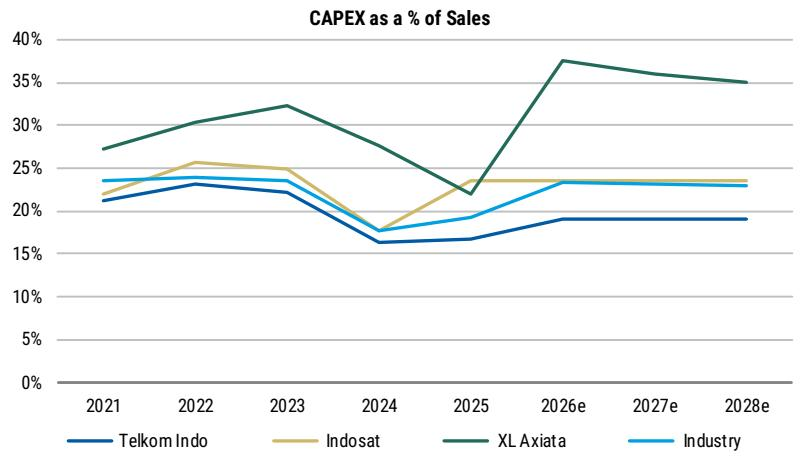

line chart

| Year   | Telkom Indo | Indosat | XL Axiata | Industry |
|--------|-------------|---------|-----------|----------|
| 2021   | 21%         | 22%     | 27%       | 23%      |
| 2022   | 23%         | 25%     | 30%       | 24%      |
| 2023   | 22%         | 25%     | 32%       | 24%      |
| 2024   | 16%         | 18%     | 28%       | 18%      |
| 2025   | 17%         | 23%     | 22%       | 19%      |
| 2026e  | 19%         | 23%     | 37%       | 23%      |
| 2027e  | 19%         | 23%     | 36%       | 23%      |
| 2028e  | 19%         | 23%     | 35%       | 23%      |

Fixed broadband subscribers& Penetration in Indonesia  
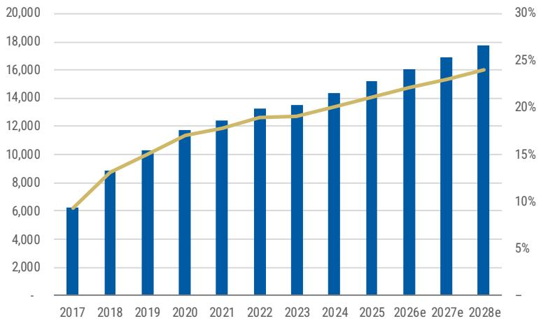

bar-line hybrid chart

| Year | Value (Left Y-axis) | Percentage (%) |
| :--- | :--- | :--- |
| 2017 | 6300 | 9.5 |
| 2018 | 8700 | 13.5 |
| 2019 | 10200 | 15.5 |
| 2020 | 11600 | 17.5 |
| 2021 | 12300 | 18.5 |
| 2022 | 13200 | 19.5 |
| 2023 | 13400 | 19.5 |
| 2024 | 14300 | 20.5 |
| 2025 | 15200 | 21.5 |
| 2026e | 16100 | 22.5 |
| 2027e | 16900 | 23.5 |
| 2028e | 17700 | 24.5 |

## Thailand: Capex has Peaked

## Technology upgrade:

- 5G spectrum auction was held in Feb-20; prices were reasonable.  
- Operators launched 5G plans at end-2020.  
• Another round of spectrum auctions held in June 2025.

## Network expansion:

- The operators showed a significant increase in capex in 2015, as they aggressively rolled out 4G.  
- All operators have finished their 4G rollouts and have begun their 5G rollouts.  
- We saw small capex increases for Thailand through 2023 and 2024, as 5G technology was being deployed, but not at the steep increase as seen during the 4G upgrade.  
- We expect capex as a percentage of sales to trend downward, closer to 13%, as operators have passed their peak 5G investment.  
- AIS covers $>95\%$ of Thailand's population; $39\%$ of its subs are on 5G.  
• TRUE has 98.9% nationwide coverage; 38% of its subs are on 5G.

## Fixed network investment:

- Fixed broadband household penetration in Thailand was 55% in 2025, and we forecast this to rise to 58% by 2028e.  
- Growth spiked in 2019/20 due to increased demand from the work-from-home Covid-19 situation.  
• We expect telcos to continue to roll out fibre across Thailand.  
- AIS' acquisition of Triple T Broadband was completed in 2023.

Source: Company data, MS estimates.

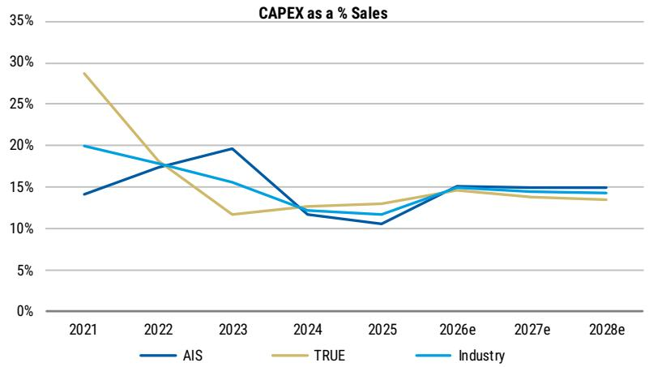

line chart

| Year   | AIS   | TRUE  | Industry |
| ------ | ----- | ----- | -------- |
| 2021   | 14%   | 29%   | 20%      |
| 2022   | 17%   | 18%   | 18%      |
| 2023   | 20%   | 12%   | 16%      |
| 2024   | 12%   | 13%   | 13%      |
| 2025   | 10%   | 13%   | 12%      |
| 2026e  | 15%   | 15%   | 15%      |
| 2027e  | 15%   | 14%   | 15%      |
| 2028e  | 15%   | 14%   | 15%      |

Fixed Broadband Subscribers and Household penetration in Thailand  
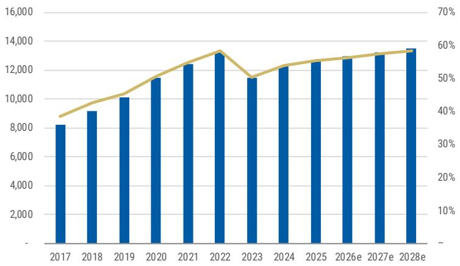

bar-line hybrid chart

| Year | Value (Left Axis) | Percentage (%) |
| :--- | :--- | :--- |
| 2017 | 8200 | 38 |
| 2018 | 9100 | 42 |
| 2019 | 10000 | 45 |
| 2020 | 11400 | 49 |
| 2021 | 12300 | 53 |
| 2022 | 13200 | 58 |
| 2023 | 11500 | 51 |
| 2024 | 12200 | 54 |
| 2025 | 12500 | 55 |
| 2026e | 12700 | 56 |
| 2027e | 13000 | 57 |
| 2028e | 13500 | 58 |

## Singapore: Capex has Peaked; Cybersecurity Risks are Rising

## Technology upgrade:

- Singapore is a small, densely populated island, which makes mobile network deployment easy as compared with larger, less densely populated countries.  
- All operators are done with 5G coverage across Singapore and almost done with 5G.  
- Singapore is significantly raising its national telco cybersecurity standards.

## Network updates:

\- SingTel achieved nationwide 5G standalone coverage in Singapore ahead of schedule.

## Fixed network investment:

- Fixed network investment in Singapore is modest for all players because of NetLink NBN Trust.  
- 10Gbps broadband is becoming increasingly available, part of a nationwide effort to upgrade broadband infrastructure from the current 1Gbps speed.

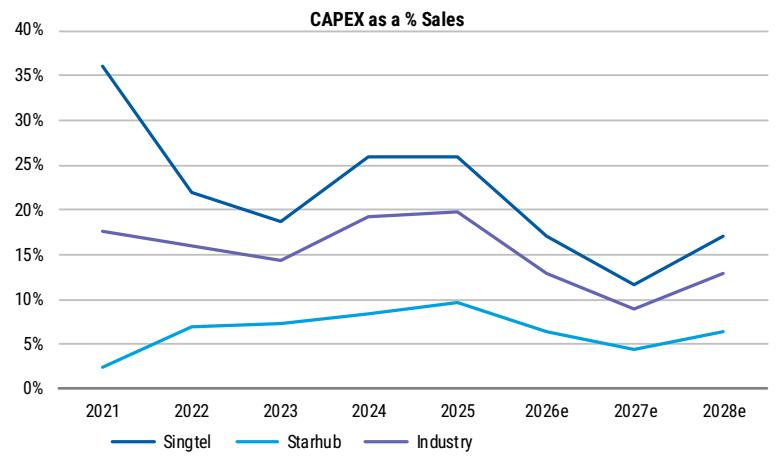

line chart

| Year   | Singtel | Starhub | Industry |
| ------ | ------- | ------- | -------- |
| 2021   | 36%     | 3%      | 18%      |
| 2022   | 22%     | 7%      | 16%      |
| 2023   | 19%     | 7%      | 14%      |
| 2024   | 26%     | 8%      | 19%      |
| 2025   | 26%     | 10%     | 20%      |
| 2026e  | 17%     | 6%      | 13%      |
| 2027e  | 12%     | 4%      | 9%       |
| 2028e  | 17%     | 6%      | 13%      |

Fixed Broadband Subs & Penetration in Singapore  
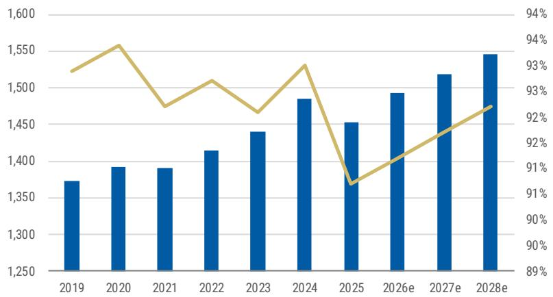

bar-line hybrid chart

| Year   | Bar Value | Line Value |
| ------ | --------- | ---------- |
| 2019   | 1370      | 92.5       |
| 2020   | 1390      | 93.5       |
| 2021   | 1390      | 92.0       |
| 2022   | 1415      | 93.0       |
| 2023   | 1440      | 92.5       |
| 2024   | 1485      | 93.5       |
| 2025   | 1455      | 91.0       |
| 2026e  | 1495      | 92.0       |
| 2027e  | 1520      | 93.0       |
| 2028e  | 1545      | 93.5       |

Source: Company data, MS estimates.

# Philippines: Capex has Already Peaked, but Will Remain Elevated vs. Other Countries

## Technology upgrade:

• PLDT's 5G BTS 5.4k  
• Globe 408 5G sites installed

## Network expansion:

- GLO has achieved 5G 99% coverage in Metro Manila and 98% in VisMin.  
• PLDT 99% 5G coverage (NCR + Rizal)

## Fixed network investment:

- Fixed broadband penetration in the Philippines was 32% in 2025, and we expect this to grow to 37% in 2028e.  
- PLDT and Globe migrated broadband users to fiber; Globe is shifting its strategy away from Fixed Wireless Access (FWA) towards fiber.

Source: Company data, MS estimates.

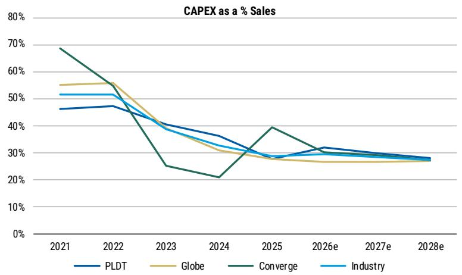

line chart

| Year   | PLDT  | Globe | Converge | Industry |
| ------ | ----- | ----- | -------- | -------- |
| 2021   | 46%   | 55%   | 69%      | 51%      |
| 2022   | 47%   | 56%   | 55%      | 51%      |
| 2023   | 40%   | 42%   | 25%      | 40%      |
| 2024   | 36%   | 30%   | 21%      | 33%      |
| 2025   | 29%   | 28%   | 40%      | 29%      |
| 2026e  | 31%   | 28%   | 30%      | 30%      |
| 2027e  | 30%   | 28%   | 29%      | 29%      |
| 2028e  | 28%   | 28%   | 28%      | 28%      |

Fixed Broadband Subs & Penetration in Philippines  
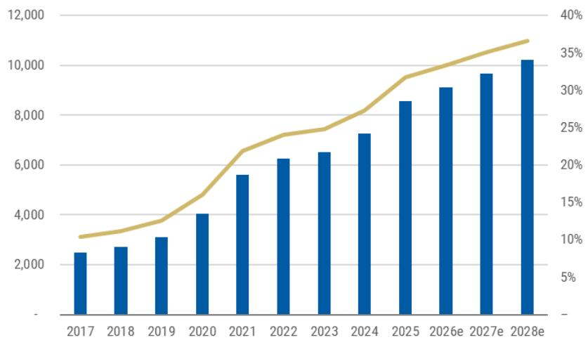

bar-line hybrid chart

| Year   | Bar Value | Line Value |
| ------ | --------- | ---------- |
| 2017   | 2500      | 30%        |
| 2018   | 2700      | 32%        |
| 2019   | 3100      | 35%        |
| 2020   | 4000      | 45%        |
| 2021   | 5600      | 65%        |
| 2022   | 6200      | 75%        |
| 2023   | 6500      | 78%        |
| 2024   | 7300      | 85%        |
| 2025   | 8600      | 95%        |
| 2026e  | 9100      | 105%       |
| 2027e  | 9700      | 115%       |
| 2028e  | 10200     | 125%       |

## Malaysia: Capex is Low but May Rise

## Technology upgrade:

\- 5G – Transition to dual network

## Network expansion:

- First 5G network by DNB achieved 80% population coverage as of December 2023  
- U Mobile launched its 5G network and achieved 83% population coverage as of March 2026

## Fixed network investment:

- Fixed broadband penetration in Malaysia was 60% in 2025, and we expect this to grow to 66% in 2028e.  
- We expect TM to maintain its market leadership with $>60\%$ subscriber share

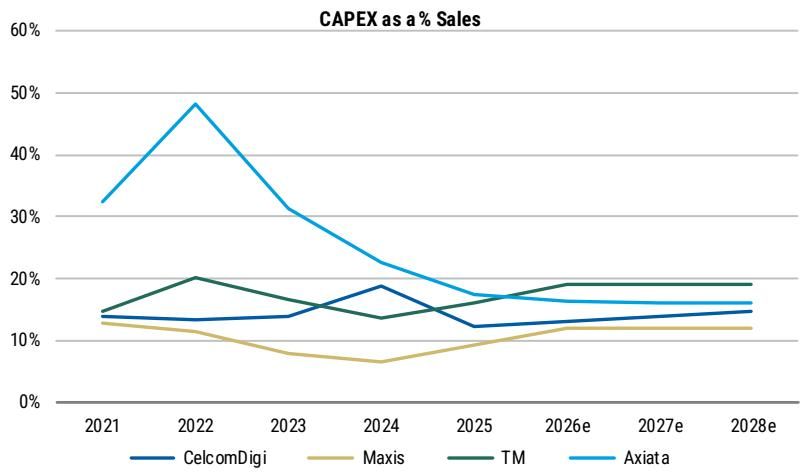

line chart

| Year   | CelcomDigi | Maxis | TM   | Axiata |
|--------|------------|-------|------|--------|
| 2021   | 13%        | 12%   | 14%  | 32%    |
| 2022   | 13%        | 11%   | 20%  | 48%    |
| 2023   | 13%        | 7%    | 16%  | 31%    |
| 2024   | 19%        | 6%    | 13%  | 23%    |
| 2025   | 12%        | 8%    | 15%  | 17%    |
| 2026e  | 13%        | 11%   | 19%  | 16%    |
| 2027e  | 14%        | 12%   | 19%  | 16%    |
| 2028e  | 15%        | 12%   | 19%  | 16%    |

Fixed Broadband Subs & Household Penetration in Malaysia  
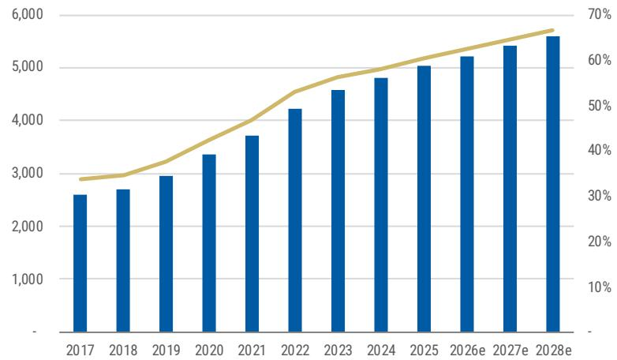

bar-line hybrid chart

| Year | Value |
| :--- | :--- |
| 2017 | 2600 |
| 2018 | 2700 |
| 2019 | 2950 |
| 2020 | 3350 |
| 2021 | 3700 |
| 2022 | 4200 |
| 2023 | 4550 |
| 2024 | 4800 |
| 2025 | 5050 |
| 2026e | 5150 |
| 2027e | 5350 |
| 2028e | 5550 |

Source: Company data, MS estimates.

## Indonesia: Regulator has Moderate Influence, and we Expect This to Sustain

## Regulator/Govt

- Has a strong influence on the telco market, as TLKM is 52% owned by the government  
- Set-up of Danatara sovereign wealth fund  
• Key initiatives:
• Streamlining
• Infra monetization
• Higher dividends

## Omnibus Law

• Spectrum sharing allowed  
• Approved sharing of telecom infrastructure  
• Foreign ownership limits removed (previously 67%)  
- Mandated transition from analog to digital broadcasting to free up spectrum for 5G

## Consolidation

• ISAT merged with H3I in January 2022  
• EXCL merged with FREN in April 2025

## Thailand: Regulation has Improved

## Spectrum:

- Previously a concession structure, it has now moved to a license regime.  
- 2015 spectrum auction for 900MHz was at a \~329% premium to global average pricing.  
- 5G spectrum prices were reasonable.  
- 900MHz payment terms were relaxed.  
• 2100MHz / 2300MHz renewed at reasonable rates.

## Court cases against TOT/CAT were gradually resolved

## Covid-19 support:

\- Mobile users were given free 10GB of data usage per month from April to June 2020.

## Mergers:

- TOT merged with CAT to form National Telecom in January 2021 after several years of delays.  
- TRUE-DTAC merger was completed in early 2023.  
- AIS' acquisition of Triple T Broadband completed in 2023.

Thai 900MHz was \~329% premium to global average  
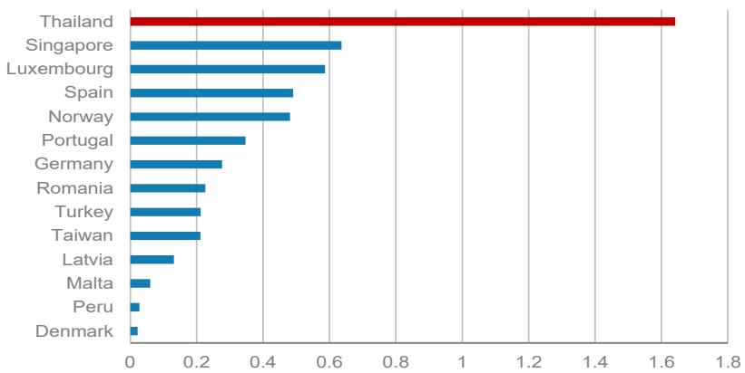

bar chart

| Country | Value |
| :--- | :--- |
| Thailand | 1.63 |
| Singapore | 0.62 |
| Luxembourg | 0.58 |
| Spain | 0.48 |
| Norway | 0.47 |
| Portugal | 0.34 |
| Germany | 0.26 |
| Romania | 0.22 |
| Turkey | 0.21 |
| Taiwan | 0.21 |
| Latvia | 0.13 |
| Malta | 0.06 |
| Peru | 0.03 |
| Denmark | 0.03 |

5G auction spectrum prices were reasonable

<table><tr><td>Price (Bt bn)</td><td>700MHz</td><td>2600MHz</td><td>26GHz</td><td>Total</td></tr><tr><td>AIS</td><td>17.2</td><td>19.6</td><td>5.3</td><td>42.1</td></tr><tr><td>True</td><td></td><td>17.9</td><td>3.6</td><td>21.4</td></tr><tr><td>DTAC</td><td></td><td></td><td>0.9</td><td>0.9</td></tr><tr><td>TOT</td><td></td><td></td><td>1.8</td><td>1.8</td></tr><tr><td>CAT</td><td>34.3</td><td></td><td></td><td>34.3</td></tr><tr><td>Total</td><td>51.5</td><td>37.4</td><td>11.7</td><td>100.5</td></tr><tr><td>Population (mn)</td><td>70</td><td>70</td><td>70</td><td></td></tr><tr><td>THB/USD</td><td>31.21</td><td>31.21</td><td>31.21</td><td></td></tr><tr><td colspan="5">Per MHz per pop (US$)</td></tr><tr><td>Thailand</td><td>0.79</td><td>0.09</td><td>0.002</td><td></td></tr><tr><td>Global average</td><td>0.63</td><td>0.14</td><td></td><td></td></tr><tr><td>% premium / (discount)</td><td>25%</td><td>-37%</td><td></td><td></td></tr></table>

## Singapore: Regulation Relatively Unchanged

## $4^{\text{th}}$ mobile player:

- Simba won the spectrum auction in December 2016.  
• MVNOs have started joining the fray since then.  
- Simba launched commercially in April 2020.  
• Simba + M1 deal suspended in May 2026

## 5G network rollout:

- SingTel and StarHub/M1 JV awarded 5G national licenses.  
- SingTel announced in July 2022 that it had achieved over 95% 5G nationwide coverage; this is three years ahead of the regulatory target of end-2025.  
- 2.1GHz - 15Mhz awarded to StarHub/M1 consortium, 20Mhz to SingTel and 10MHz to TPG.  
- TPG was allowed to use 2.3GHz for 5G NSA trial.

## Broadband:

• Number of major broadband players has risen.  
- This has resulted in broadband ARPUs falling at \~3% CAGR from 2012-24.  
- Singapore actively upgrading broadband to 10Gbps.  
• SIMBA offers 10Gbps at S\$30.

Source: Company data, MS.

Number of mobile providers has increased...  
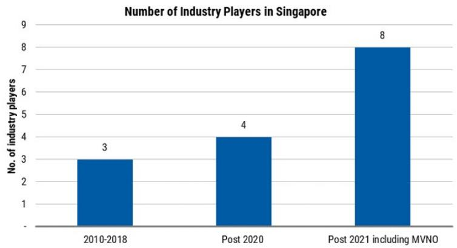

bar chart

Number of Industry Players in Singapore
| Period | No. of industry players |
|---|---|
| 2010-2018 | 3 |
| Post 2020 | 4 |
| Post 2021 including MVNO | 8 |

Broadband prices fell 3% p.a. from 2012-24  
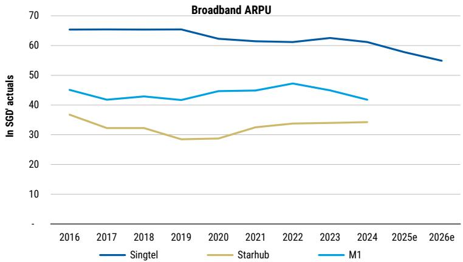

line chart

| Year   | Singtel | Starhub | M1   |
| ------ | ------- | ------- | ---- |
| 2016   | 65      | 37      | 45   |
| 2017   | 65      | 32      | 42   |
| 2018   | 65      | 32      | 43   |
| 2019   | 65      | 28      | 41   |
| 2020   | 62      | 28      | 44   |
| 2021   | 61      | 32      | 45   |
| 2022   | 61      | 33      | 47   |
| 2023   | 62      | 34      | 45   |
| 2024   | 61      | 34      | 42   |
| 2025e  | 58      | -       | -    |
| 2026e  | 55      | -       | -    |

## Philippines: Regulation has Increased

## New Entrants

- July 2019, Dito received a license to operate as the country's third telco operator.  
- Dito launched commercially in 2021 and had acquired 17mn subs as of July 2023 (\~10% subscriber market share).  
• Starlink was given the green light to operate in 2022.

## Common Tower Policy

• The government aims to improve service quality by encouraging the construction of tens of thousands of new towers.  
- The Department of Information and Communications Technology (DICT) said the Philippines needs another 50k cell towers on top of the \~18k that PLDT/Globe have built.  
• Tower-sharing regime will aid Dito's rollout.  
- PLDT and Globe have sold \~15k towers.

## Foreign Ownership Limit

• In March 2022, the government removed the 40% foreign ownership cap in industries such as telcos, airlines, domestic shipping, and railways.  
• Foreign nationals can now own up to 100% of capital in telcos.  
- A reciprocity clause prohibits foreign citizens from owning $>40\%$ of critical infrastructure, unless their country provides similar access to Filipino investors.

## Others

• The SIM Registration Act was enacted December 2022 – to curb cybercriminal activities.  
- Mobile Number Portability of 2019 allowed subs to change providers without changing their number.

## Knektadong Pinoy Act

• No congressional franchise needed  
- Open Infrastructure sharing  
• Accelerated deployment

## Malaysia: Regulatory Uncertainty

## Mobile consolidation:

- Celcom + Digi's proposed merger in 2019 did not go through  
• Celcom/Digi merger talks were re-initiated in April 2021  
- April 2022 – MCMC laid out concerns over the merger  
- June 2022 – MCMC approved the merger  
- December 2022 – The merger was completed

## 5G rollout plans:

- Initial plan was to award the 5G spectrum to a consortium  
- May 2020 – 5G spectrum awarded without open tender  
- June 2020 – 5G spectrum awarded was revoked  
- March 2021 – DNB deployed 5G through a Single Wholesale Network  
- December 2021 - Malaysia reconsidered a plan for a single 5G network amid impasse with telcos  
• March 2022 - DNB offered 70% stake to telcos  
- May 2022 – Big 4 MNOs rejected minority stake in DNB  
• June 2022 – 6 telcos took a 70% stake in DNB  
- December 2022 – Operators started rolling 5G plans except MXSC

## 5G rollout plans:

- May 2023 – Malaysia transitioned towards a Dual Wholesale Network  
• August 2023 – MXSC launched 5G  
- June 2024 – CELC, MXSC, U Mobile, YTL subscribed to DNB  
• July 2024 – Tender process for second 5G network  
- November 2024 – U Mobile awarded the opportunity to build the country's second 5G network.  
- May 2025 – U Mobile sold its 17% stake in DNB to fellow shareholders; targets 80% 5G population coverage within 12 months, 90% in the subsequent 12 months  
- Early 2026 – CelcomDigi & Maxis each inject additional RM202mn into DNB  
- Early 2026 – TM in dispute with DNB after issuing notice to terminate wholesale access agreement; TM switched to U Mobile under a new three-year agreement

Indonesia: Dividends Expected to Rise  
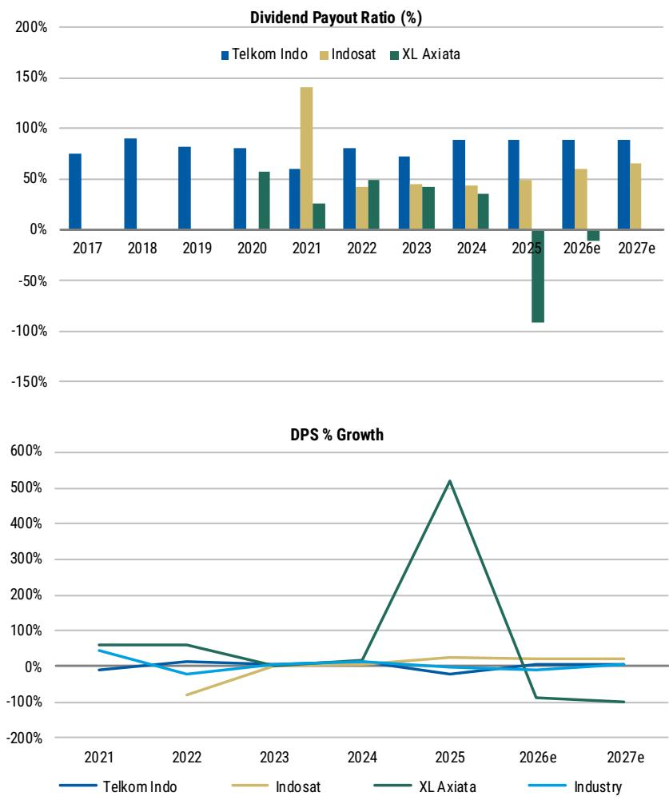

bar-line hybrid chart

| Year | Telkom Indo (%) | Indosat (%) | XL Axiata (%) |
| --- | --- | --- | --- |
| 2017 | 75 |  |  |
| 2018 | 90 |  |  |
| 2019 | 80 |  |  |
| 2020 | 80 |  | 55 |
| 2021 | 60 | 140 | 25 |
| 2022 | 80 | 40 | 50 |
| 2023 | 70 | 45 | 40 |
| 2024 | 90 | 40 | 35 |
| 2025 | 90 | 50 | -90 |
| 2026e | 90 | 60 | -100 |
| 2027e | 90 | 65 |  |

Source: Company data, MS estimates.

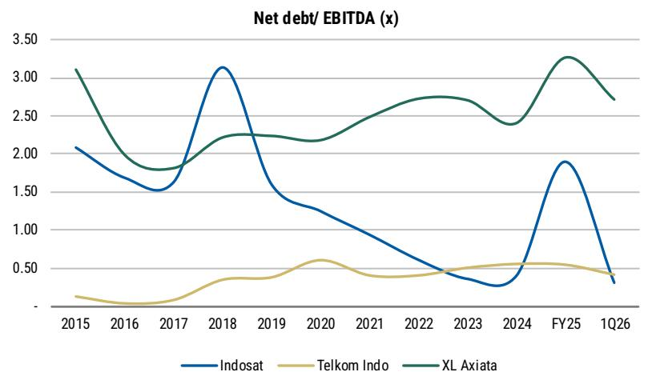

line chart

| Year | Indosat | Telkom Indo | XL Axiata |
|------|---------|-------------|-----------|
| 2015 | 2.1     | 0.1         | 3.1       |
| 2016 | 1.7     | 0.05        | 1.9       |
| 2017 | 1.5     | 0.05        | 1.8       |
| 2018 | 3.1     | 0.4         | 2.2       |
| 2019 | 1.4     | 0.4         | 2.2       |
| 2020 | 1.2     | 0.6         | 2.2       |
| 2021 | 0.9     | 0.4         | 2.4       |
| 2022 | 0.6     | 0.4         | 2.7       |
| 2023 | 0.4     | 0.5         | 2.7       |
| 2024 | 0.3     | 0.5         | 2.4       |
| FY25 | 1.9     | 0.5         | 3.3       |
| 1Q26 | 0.3     | 0.4         | 2.7       |

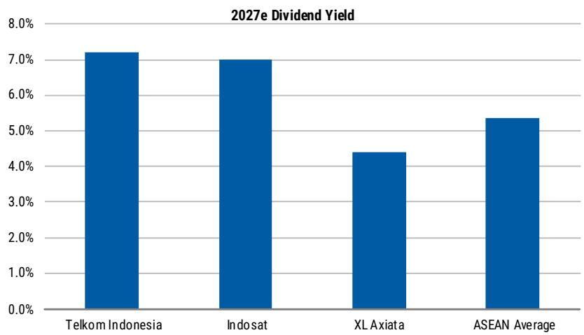

bar chart

2027e Dividend Yield
| Company | Dividend Yield (%) |
| :--- | :--- |
| Telkom Indonesia | 7.2 |
| Indosat | 7.0 |
| XL Axiata | 4.4 |
| ASEAN Average | 5.3 |

Thailand: Dividends Expected to Rise  
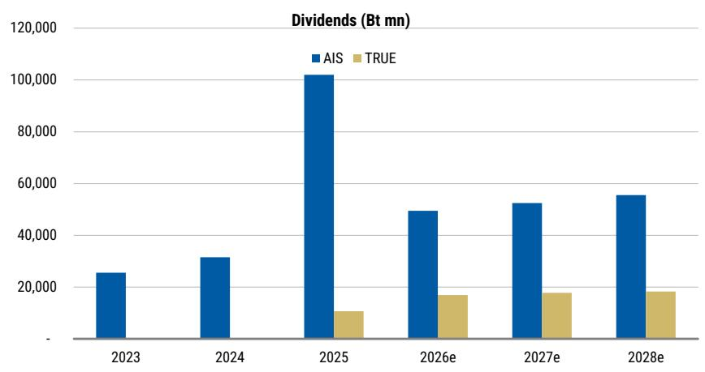

bar chart

Dividends (Bt mn)
| Year | AIS (Bt mn) | TRUE (Bt mn) |
| :--- | :--- | :--- |
| 2023 | 25000 | - |
| 2024 | 31000 | - |
| 2025 | 102000 | 11000 |
| 2026e | 49000 | 17000 |
| 2027e | 52000 | 18000 |
| 2028e | 55000 | 18500 |

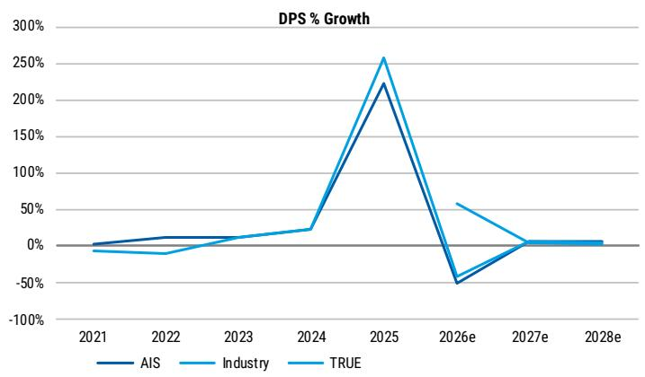

line chart

| Year   | AIS    | Industry | TRUE   |
| ------ | ------ | -------- | ------ |
| 2021   | 0%     | 0%       | 0%     |
| 2022   | 10%    | -10%     | -10%   |
| 2023   | 10%    | 10%      | 10%    |
| 2024   | 20%    | 20%      | 20%    |
| 2025   | 220%   | 260%     | 250%   |
| 2026e  | -50%   | -40%     | -40%   |
| 2027e  | 0%     | 0%       | 0%     |
| 2028e  | 0%     | 0%       | 0%     |

Source: Company data, MS estimates.

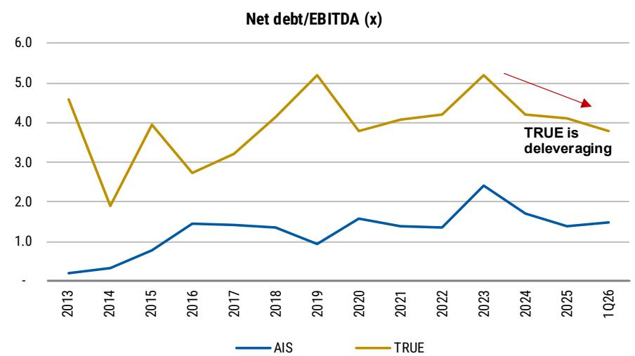

line chart

| Year | AIS  | TRUE |
|------|------|------|
| 2013 | ~0.2 | 4.5  |
| 2014 | ~0.3 | 1.9  |
| 2015 | ~0.8 | 3.9  |
| 2016 | ~1.4 | 2.7  |
| 2017 | ~1.4 | 3.2  |
| 2018 | ~1.3 | 4.0  |
| 2019 | ~0.9 | 5.2  |
| 2020 | ~1.5 | 3.8  |
| 2021 | ~1.4 | 4.0  |
| 2022 | ~1.3 | 4.2  |
| 2023 | ~2.4 | 5.2  |
| 2024 | ~1.7 | 4.2  |
| 2025 | ~1.3 | 4.0  |
| 1Q26 | ~1.4 | 3.8  |

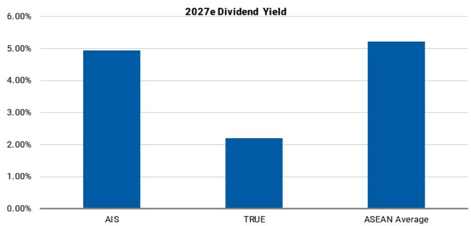

bar chart

2027e Dividend Yield
| Category | Dividend Yield (%) |
| :--- | :--- |
| AIS | 4.95 |
| TRUE | 2.18 |
| ASEAN Average | 5.20 |

Singapore: DPS Growth Expected  
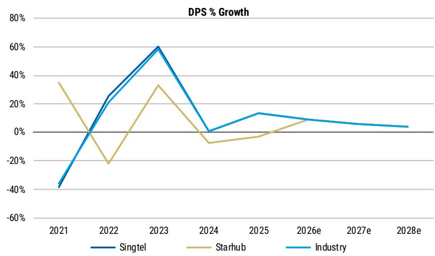

line chart

| Year   | Singtel | Starhub | Industry |
| ------ | ------- | ------- | -------- |
| 2021   | -40%    | 35%     | -        |
| 2022   | 25%     | -20%    | 20%      |
| 2023   | 60%     | 35%     | 60%      |
| 2024   | 0%      | -10%    | 0%       |
| 2025   | 15%     | -5%     | 15%      |
| 2026e  | 10%     | 5%      | 10%      |
| 2027e  | 5%      | 5%      | 5%       |
| 2028e  | 5%      | 5%      | 5%       |

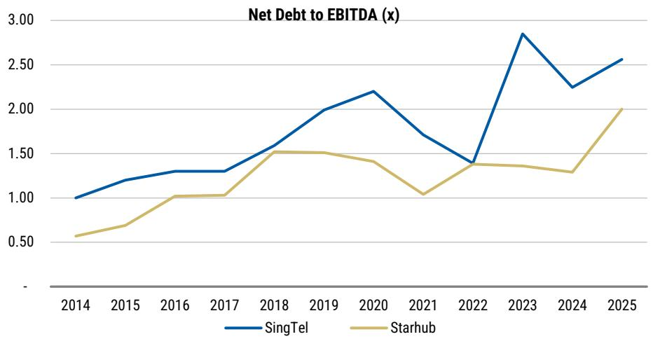

line chart

| Year | SingTel | Starhub |
|------|---------|---------|
| 2014 | 1.00    | 0.55    |
| 2015 | 1.20    | 0.65    |
| 2016 | 1.30    | 1.00    |
| 2017 | 1.30    | 1.00    |
| 2018 | 1.60    | 1.50    |
| 2019 | 2.00    | 1.50    |
| 2020 | 2.20    | 1.40    |
| 2021 | 1.70    | 1.05    |
| 2022 | 1.40    | 1.35    |
| 2023 | 2.85    | 1.35    |
| 2024 | 2.25    | 1.30    |
| 2025 | 2.55    | 2.00    |

Source: Company data, MS estimates.

## Philippines: DPS Increase Expected

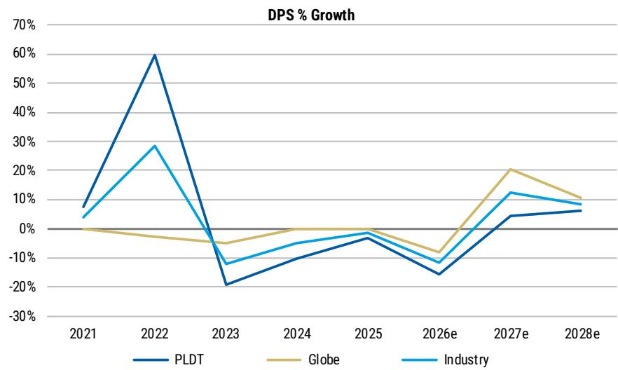

line chart

| Year   | PLDT  | Globe | Industry |
| ------ | ----- | ----- | -------- |
| 2021   | 5%    | 0%    | 5%       |
| 2022   | 60%   | -5%   | 30%      |
| 2023   | -20%  | -5%   | -15%     |
| 2024   | -10%  | 0%    | -5%      |
| 2025   | -5%   | 0%    | 0%       |
| 2026e  | -15%  | -10%  | -10%     |
| 2027e  | 5%    | 20%   | 15%      |
| 2028e  | 5%    | 10%   | 10%      |

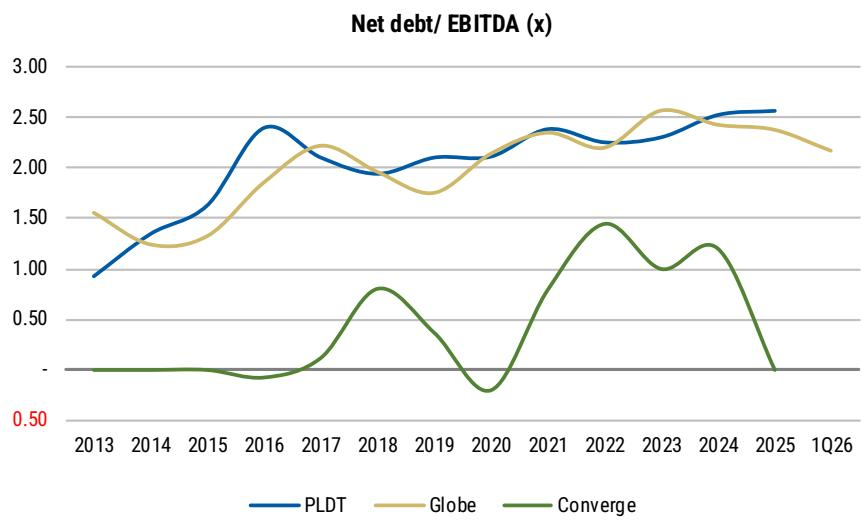

line chart

| Year | PLDT  | Globe | Converge |
|------|-------|-------|----------|
| 2013 | 0.90  | 1.55  | 0.00     |
| 2014 | 1.30  | 1.20  | 0.00     |
| 2015 | 1.60  | 1.30  | 0.00     |
| 2016 | 2.40  | 1.80  | -0.10    |
| 2017 | 2.10  | 2.20  | -0.10    |
| 2018 | 1.95  | 2.15  | 0.80     |
| 2019 | 2.05  | 1.75  | -0.30    |
| 2020 | 2.10  | 2.10  | -0.70    |
| 2021 | 2.35  | 2.35  | -0.50    |
| 2022 | 2.30  | 2.25  | 1.45     |
| 2023 | 2.40  | 2.55  | 1.00     |
| 2024 | 2.50  | 2.45  | 1.25     |
| 2025 | 2.55  | 2.35  | -0.50    |
| 1Q26 | -     | 2.15  | -        |

Source: Company data, MS estimates.

Malaysia: Dividend Growth Post 2025 Expected  
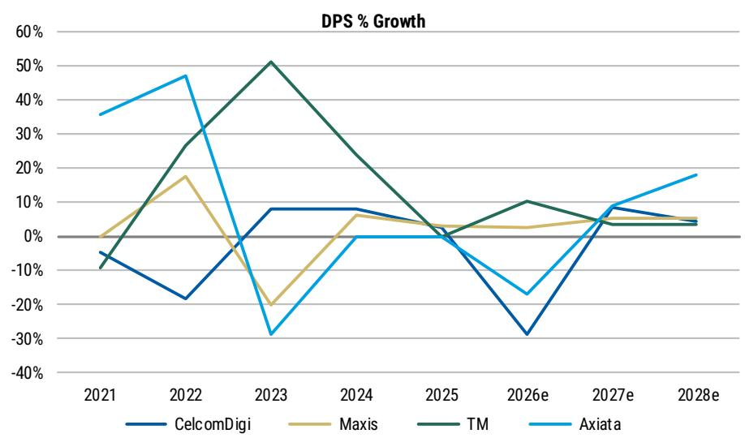

line chart

| Year   | CelcomDigi | Maxis | TM   | Axiata |
|--------|------------|-------|------|--------|
| 2021   | -5%        | 0%    | -10% | 35%    |
| 2022   | -20%       | 18%   | 25%  | 48%    |
| 2023   | 8%         | -20%  | 50%  | -30%   |
| 2024   | 8%         | 6%    | 25%  | 0%     |
| 2025   | 0%         | 0%    | 0%   | 0%     |
| 2026e  | -30%       | 3%    | 10%  | -15%   |
| 2027e  | 8%         | 5%    | 3%   | 10%    |
| 2028e  | 5%         | 5%    | 5%   | 18%    |

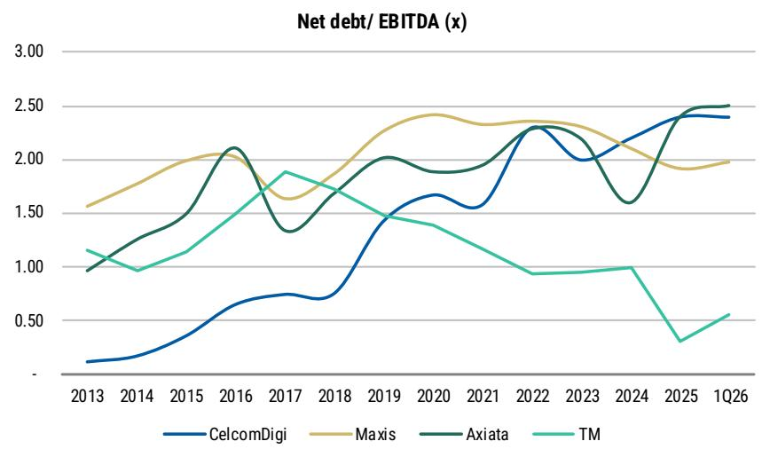

line chart

| Year | CelcomDigi | Maxis | Axiata | TM |
|------|------------|-------|--------|----|
| 2013 | 0.1        | 1.5   | 1.0    | 1.1 |
| 2014 | 0.2        | 1.8   | 1.3    | 0.9 |
| 2015 | 0.4        | 2.0   | 1.5    | 1.1 |
| 2016 | 0.6        | 2.1   | 2.1    | 1.5 |
| 2017 | 0.7        | 1.6   | 1.3    | 1.9 |
| 2018 | 0.7        | 1.8   | 1.7    | 1.6 |
| 2019 | 1.5        | 2.3   | 2.0    | 1.4 |
| 2020 | 1.7        | 2.4   | 1.9    | 1.3 |
| 2021 | 1.5        | 2.3   | 2.0    | 1.1 |
| 2022 | 2.3        | 2.4   | 2.3    | 0.9 |
| 2023 | 2.0        | 2.3   | 2.2    | 0.9 |
| 2024 | 2.2        | 2.1   | 1.6    | 1.0 |
| 2025 | 2.4        | 1.9   | 2.5    | 0.3 |
| 1Q26 | 2.4        | 2.0   | 2.5    | 0.5 |

Source: Company data, MS estimates.

## ROIC is a Leading Indicator for Multiple Re-rating or De-rating

Globally, changes in telecom ROIC lead changes in EV/EBITDA by about 18 months...

Global ROIC vs. EV/EBITDA (Lagged 18 months)  
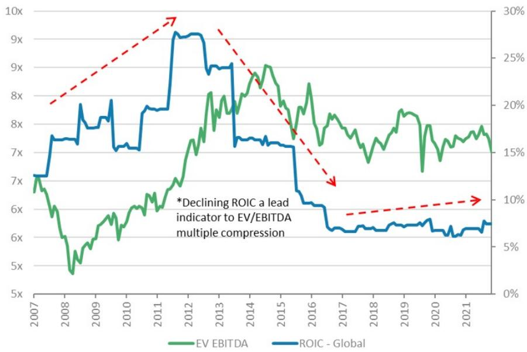

line chart

| Year | EV EBITDA | ROIC - Global |
|------|-----------|---------------|
| 2007 | 6.8x      | 7.2x          |
| 2008 | 4.8x      | 7.5x          |
| 2009 | 5.8x      | 7.8x          |
| 2010 | 6.2x      | 7.3x          |
| 2011 | 6.5x      | 7.6x          |
| 2012 | 7.5x      | 9.2x          |
| 2013 | 8.0x      | 9.0x          |
| 2014 | 8.5x      | 8.8x          |
| 2015 | 8.2x      | 7.5x          |
| 2016 | 7.8x      | 6.5x          |
| 2017 | 7.5x      | 6.2x          |
| 2018 | 7.3x      | 6.3x          |
| 2019 | 7.6x      | 6.4x          |
| 2020 | 7.4x      | 6.3x          |
| 2021 | 7.5x      | 6.4x          |

... and the same goes for ASEAN telcos

ASEAN ROIC vs. EV/EBITDA (Lagged 18 months)  
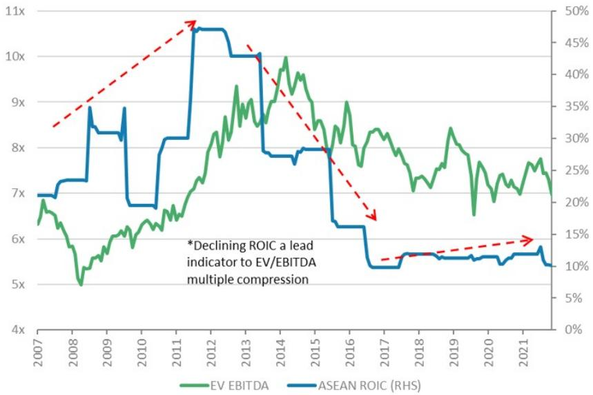

line chart

| Year | EV EBITDA | ASEAN ROIC (RHS) |
|------|-----------|------------------|
| 2007 | ~6.8x     | ~7.0x            |
| 2008 | ~5.0x     | ~9.0x            |
| 2009 | ~6.0x     | ~8.5x            |
| 2010 | ~6.5x     | ~8.0x            |
| 2011 | ~7.5x     | ~10.5x           |
| 2012 | ~8.5x     | ~10.5x           |
| 2013 | ~9.5x     | ~10.0x           |
| 2014 | ~9.0x     | ~8.0x            |
| 2015 | ~8.5x     | ~8.0x            |
| 2016 | ~8.0x     | ~6.5x            |
| 2017 | ~7.5x     | ~5.5x            |
| 2018 | ~7.0x     | ~5.5x            |
| 2019 | ~7.5x     | ~5.5x            |
| 2020 | ~7.0x     | ~5.5x            |
| 2021 | ~7.5x     | ~5.5x            |

Source: Refinitiv, company data, MS.

## Data Centers

ASEAN Data Centers: Singapore is a Submarine Cable Hub  
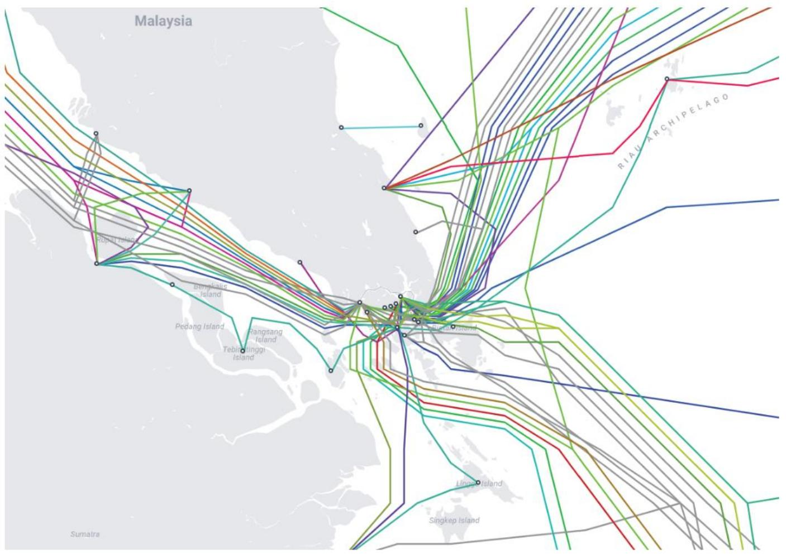

network map

| Island | Color |
| --- | --- |
| Riau Archipelago | Red |
| Linga Island | Green |
| Singkep Island | Blue |
| Ringa Island | Yellow |
| Singkep Island | Purple |
| Linga Island | Teal |
| Singkep Island | Grey |
| Ringa Island | Orange |
| Linga Island | Pink |
| Singkep Island | Brown |
| Ringa Island | Brown |
| Linga Island | Brown |
| Singkep Island | Grey |
| Ringa Island | Grey |
| Linga Island | Grey |
| Singkep Island | Grey |
| Ringa Island | Grey |
| Linga Island | Grey |
| Singkep Island | Grey |
| Ringa Island | Grey |
| Linga Island | Grey |
| Singkep Island | Grey |
| Ringa Island | Grey |
| Linga Island | Grey |
| Singkep Island | Grey |
| Ringa Island (Sumatra) | Grey |
| Linga Island (Sumatra) | Grey |
| Singkep Island (Sumatra) | Grey |
| Ringa Island (Sumatra) | Grey |
| Linga Island (Sumatra) | Grey |
| Singkep Island (Sumatra) | Grey |
| Ringa Island (Sumatra) | Grey |
| Linga Island (Sumatra) | Grey |
| Singkep Island (Sumatra) | Grey |
| Ringa Island (Sumatra) | Grey |
| Linga Island (Sumatra) | Gray |
| Singkep Island (Sumatra) | Grey |
| Ringa Island (Sumatra) | Grey |
| Linga Island (Sumatra) | Grey |
| Singkep Island (Sumatra) | Grey |
| Ringa Island (Sumatra) | Grey |
| Linga Island (Sumatra) | Grey |
| Singkep Island (Sumatra) | Grey |

Source: TeleGeography, MS.

## ASEAN Data Centers: Malaysia is Capturing Overspilling Demand From Singapore

Singapore – ASEAN's Largest DC Market in 2024  
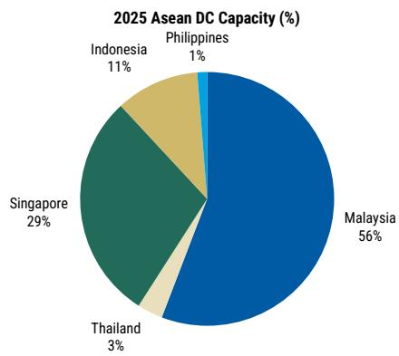

pie chart

2025 Asean DC Capacity (%)
| Country | Capacity (%) |
| :--- | :--- |
| Malaysia | 56 |
| Singapore | 29 |
| Indonesia | 11 |
| Thailand | 3 |
| Philippines | 1 |

Malaysia is Experiencing a DC Boom  
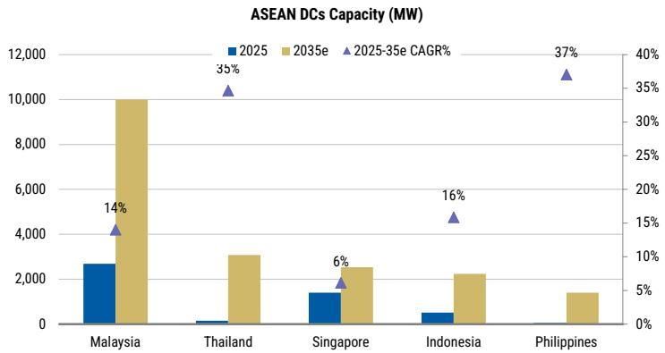

bar chart

| Country     | 2025  | 2035e | 2025-35e CAGR |
| ----------- | ----- | ----- | ------------- |
| Malaysia    | 2800  | 10000 | 14%           |
| Thailand    | 200   | 3000  | 35%           |
| Singapore   | 1400  | 2500  | 6%            |
| Indonesia   | 500   | 2200  | 16%           |
| Philippines | 100   | 1400  | 37%           |

Source: Company data, MS.

Malaysia to Overtake Singapore in DC Capacity  
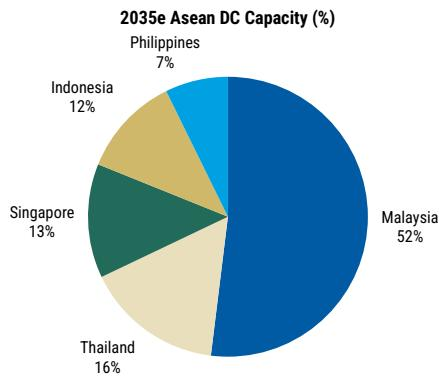

pie chart

2035e Asean DC Capacity (%)
| Country | Capacity (%) |
| :--- | :--- |
| Malaysia | 52 |
| Thailand | 16 |
| Singapore | 13 |
| Indonesia | 12 |
| Philippines | 7 |

Malaysia Electricity Costs Lower than Singapore  
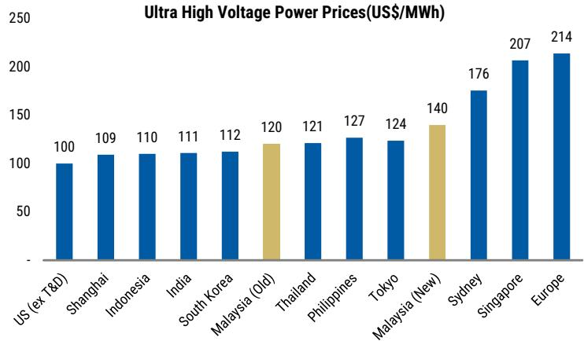

bar chart

Ultra High Voltage Power Prices(US$/MWh)
| Region | Ultra High Voltage Power Prices (US$/MWh) |
| :--- | :--- |
| US (ex T&D) | 100 |
| Shanghai | 109 |
| Indonesia | 110 |
| India | 111 |
| South Korea | 112 |
| Malaysia (Old) | 120 |
| Thailand | 121 |
| Philippines | 127 |
| Tokyo | 124 |
| Malaysia (New) | 140 |
| Sydney | 176 |
| Singapore | 207 |
| Europe | 214 |

## ASEAN Data Centers: Which Telcos are Building Data Centers?

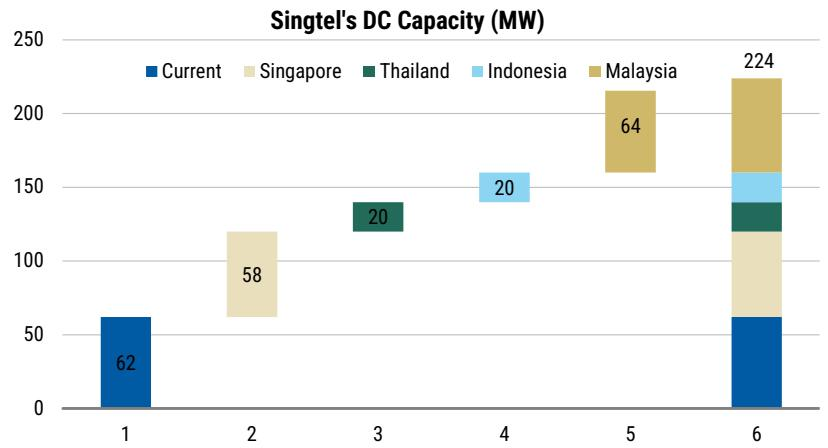

stacked bar chart

Singtel's DC Capacity (MW)
| Period | Current (MW) | Singapore (MW) | Thailand (MW) | Indonesia (MW) | Malaysia (MW) |
|---|---|---|---|---|---|
| 1 | 62 | 0 | 0 | 0 | 0 |
| 2 | 0 | 58 | 0 | 0 | 0 |
| 3 | 0 | 0 | 20 | 0 | 0 |
| 4 | 0 | 0 | 0 | 20 | 0 |
| 5 | 0 | 0 | 0 | 0 | 64 |
| 6 | 62 | 72 | 22 | 22 | 114 |
| Total | 62 | 0 | 0 | 0 | 224 |

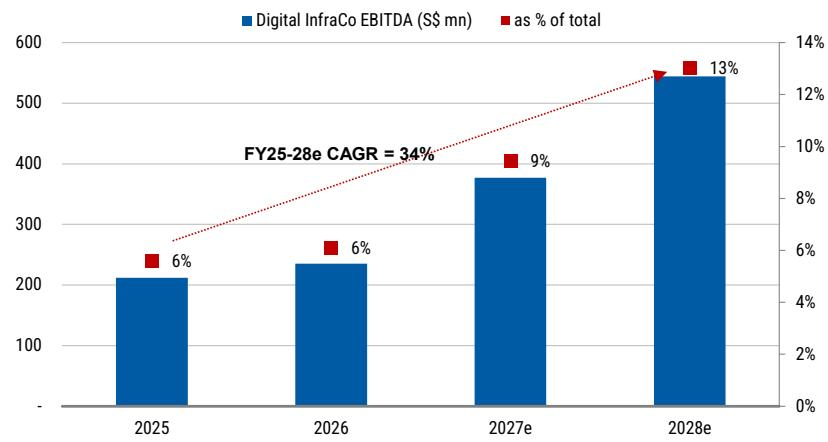

bar-line hybrid

| Year | Digital InfraCo EBITDA ($ mn) | as % of total (%) |
| :--- | :--- | :--- |
| 2025 | 210 | 6 |
| 2026 | 235 | 6 |
| 2027e | 375 | 9 |
| 2028e | 545 | 13 |
FY25-28e CAGR = 34%

Source: Company data, MS estimates.

## SingTel: Leader Amongst ASEAN Telcos

• 2024: 62MW in Singapore  
• +58MW in Singapore  
• +20MW (1 $^{st}$ phase) in Thailand; JV with GULF & AIS  
• +20MW (1 $^{st}$ phase) in Indonesia; JV with TLKM & Medco  
• +64MW (1 $^{st}$ phase) in Malaysia; JV with TM

## TLKM: Exploring Strategic Partnerships

• 2024: 35 DCs with 38MW capacity  
• +18MW in Cikarang  
• +18 MW in Batam

## Indosat: Leading Indonesia's Sovereign AI

• US\$200mn AI center

## Globe: 50% stake in JV with Ayala & STT GDC

• 22MW in 2024, target to reach 52MW by 2026

## PLDT:

• Current 64MW capacity  
• 11 $^{th}$ DC +36MW, evaluating 12 $^{th}$ with 100MW

## Disclosure Section

The information and opinions in MS were prepared or are disseminated by MS Asia Limited (which accepts the responsibility for its contents) and/or MS Asia (Singapore) Pte. (Registration number 199206298Z) and/or MS Asia (Singapore) Securities Pte Ltd (Registration number 200008434H), regulated by the Monetary Authority of Singapore (which accepts legal responsibility for its contents and should be contacted with respect to any matters arising from, or in connection with, MS), and/or MS Taiwan Limited and/or MS & Co International plc, Seoul Branch, and/or MS Australia Limited (A.B.N. 67 003 734 576, holder of Australian financial services license No. 233742, which accepts responsibility for its contents), and/or MS Wealth Management Australia Pty Ltd (A.B.N. 19 009 145 555, holder of Australian financial services license No. 240813, which accepts responsibility for its contents), and/or MS India Company Private Limited having Corporate Identification No (CIN) U22990MH1998PTC115305, regulated by the Securities and Exchange Board of India ("SEBI") and holder of licenses as a Research Analyst (SEBI Registration No. INH000001105); Stock Broker (SEBI Stock Broker Registration No. INZ000244438), Merchant Banker (SEBI Registration No. INM000011203), and depository participant with National Securities Depository Limited (SEBI Registration No. IN-DP-NSDL-567-2021) having registered office at Altimus, Level 39 & 40, Pandurang Budhkar Marg, Worli, Mumbai 400018, India; Telephone no. +91-22-61181000; Compliance Officer Details: Mr. Tejarshi Hardas, Tel. No.: +91-22-61181000 or Email: tejarshi.hardas@morganstanley.com; Grievance officer details: Mr. Tejarshi Hardas, Tel. No.: +91-22-61181000 or Email: msic-compliance@morganstanley.com which accepts the responsibility for its contents and should be contacted with respect to any matters arising from, or in connection with, MS, and their affiliates (collectively, "MS"). MS India Company Private Limited (MSICPL) may use AI tools in providing research services. All recommendations contained herein are made by the duly qualified research analysts.

For important disclosures, stock price charts and equity rating histories regarding companies that are the subject of this report, please see the MS Disclosure Website at www.morganstanley.com/eqr/disclosures/webapp/generalresearch, or contact your investment representative or MS at 1585 Broadway, (Attention: Research Management), New York, NY, 10036 USA.

For valuation methodology and risks associated with any recommendation, rating or price target referenced in this research report, please contact the Client Support Team as follows: US/Canada +1800 303-2495; Hong Kong +852 2848-5999; Latin America +1718 754-5444 (U.S.); London +44 (0)20-7425-8169; Singapore +65 6834-6860; Sydney +61(0)2-9770-1505; Tokyo +81(0)3-6836-9000. Alternatively you may contact your investment representative or MS at 1585 Broadway, (Attention: Research Management), New York, NY 10036 USA.

## Analyst Certification

The following analysts hereby certify that their views about the companies and their securities discussed in this report are accurately expressed and that they have not received and will not receive direct or indirect compensation in exchange for expressing specific recommendations or views in this report: Da Wei Lee.

## Global Research Conflict Management Policy

MS has been published in accordance with our conflict management policy, which is available at www.morganstanley.com/institutional/research/conflictpolicies. A Portuguese version of the policy can be found at www.morganstanley.com.br

## Important Regulatory Disclosures on Subject Companies

Within the last 12 months, MS has received compensation for investment banking services from Globe Telecom.

In the next 3 months, MS expects to receive or intends to seek compensation for investment banking services from Advanced Info Service, Axiata Group Berhad, Globe Telecom, PLDT, Singapore Telecom, Telekomunikasi, True Corporation PCL. Within the last 12 months, MS has received compensation for products and services other than investment banking services from PLDT, Telekom Malaysia BHD.

Within the last 12 months, MS has provided or is providing investment banking services to, or has an investment banking client relationship with, the following company: Advanced Info Service, Axiata Group Berhad, Globe Telecom, PLDT, Singapore Telecom, Telekomunikasi, True Corporation PCL.

Within the last 12 months, MS has either provided or is providing non-investment banking, securities-related services to and/or in the past has entered into an agreement to provide services or has a client relationship with the following company: PLDT, Telekom Malaysia BHD.

MS & Co. LLC makes a market in the securities of PLDT, Telekomunikasi.

The equity research analysts or strategists principally responsible for the preparation of MS have received compensation based upon various factors, including quality of research, investor client feedback, stock picking, competitive factors, firm revenues and overall investment banking revenues. Equity Research analysts' or strategists' compensation is not linked to investment banking or capital markets transactions performed by MS or the profitability or revenues of particular trading desks.

MS and its affiliates do business that relates to companies/instruments covered in MS, including market making, providing liquidity, fund management, commercial banking, extension of credit, investment services and investment banking. MS sells to and buys from customers the securities/instruments of companies covered in MS on a principal basis. MS may have a position in the debt of the Company or instruments discussed in this report. MS trades or may trade as principal in the debt securities (or in related derivatives) that are the subject of the debt research report.

Certain disclosures listed above are also for compliance with applicable regulations in non-US jurisdictions.

## STOCK RATINGS

MS uses a relative rating system using terms such as Overweight, Equal-weight, Not-Rated or Underweight (see definitions below). MS does not assign ratings of Buy, Hold or Sell to the stocks we cover. Overweight, Equal-weight, Not-Rated and Underweight are not the equivalent of buy, hold and sell. Investors should carefully read the definitions of all ratings used in MS. In addition, since MS contains more complete information concerning the analyst's views, investors should carefully read MS, in its entirety, and not infer the contents from the rating alone. In any case, ratings (or research) should not be used or relied upon as investment advice. An investor's decision to buy or sell a stock should depend on individual circumstances (such as the investor's existing holdings) and other considerations.

## Global Stock Ratings Distribution

(as of May 31, 2026)

The Stock Ratings described below apply to MS's Fundamental Equity Research and do not apply to Debt Research produced by the Firm.

For disclosure purposes only (in accordance with FINRA requirements), we include the category headings of Buy, Hold, and Sell alongside our ratings of Overweight, Equal-weight, Not-Rated and Underweight. MS does not assign ratings of Buy, Hold or Sell to the stocks we cover. Overweight, Equal-weight, Not-Rated and Underweight are not the equivalent of buy, hold, and sell but represent recommended relative weightings (see definitions below). To satisfy regulatory requirements, we correspond Overweight, our most positive stock rating, with a buy recommendation; we correspond Equal-weight and Not-Rated to hold and Underweight to sell recommendations, respectively.

<table><tr><td></td><td colspan="2">Coverage Universe</td><td colspan="3">Investment Banking Clients (IBC)</td><td colspan="2">Other Material Investment Services Clients (MISC)</td></tr><tr><td>Stock Rating Category</td><td>Count</td><td>% of Total</td><td>Count</td><td>% of Total IBC</td><td>% of Rating Category</td><td>Count</td><td>% of Total Other MISC</td></tr><tr><td>Overweight/Buy</td><td>1542</td><td>42%</td><td>465</td><td>51%</td><td>30%</td><td>707</td><td>43%</td></tr><tr><td>Equal-weight/Hold</td><td>1571</td><td>43%</td><td>369</td><td>40%</td><td>23%</td><td>723</td><td>44%</td></tr><tr><td>Not-Rated/Hold</td><td>3</td><td>0%</td><td>0</td><td>0%</td><td>0%</td><td>1</td><td>0%</td></tr><tr><td>Underweight/Sell</td><td>551</td><td>15%</td><td>86</td><td>9%</td><td>16%</td><td>201</td><td>12%</td></tr><tr><td>Total</td><td>3,667</td><td></td><td>920</td><td></td><td></td><td>1632</td><td></td></tr></table>

Data include common stock and ADRs currently assigned ratings. Investment Banking Clients are companies from whom MS received investment banking compensation in the last 12 months. Due to rounding off of decimals, the percentages provided in the "% of total" column may not add up to exactly 100 percent.

## Analyst Stock Ratings

Overweight (O). The stock's total return is expected to exceed the average total return of the analyst's industry (or industry team's) coverage universe, on a risk-adjusted basis, over the next 12-18 months.

Equal-weight (E). The stock's total return is expected to be in line with the average total return of the analyst's industry (or industry team's) coverage universe, on a risk-adjusted basis, over the next 12-18 months.

Not-Rated (NR). Currently the analyst does not have adequate conviction about the stock's total return relative to the average total return of the analyst's industry (or industry team's) coverage universe, on a risk-adjusted basis, over the next 12-18 months.

Underweight (U). The stock's total return is expected to be below the average total return of the analyst's industry (or industry team's) coverage universe, on a risk-adjusted basis, over the next 12-18 months.

Unless otherwise specified, the time frame for price targets included in MS is 12 to 18 months.

## Analyst Industry Views

Attractive (A): The analyst expects the performance of his or her industry coverage universe over the next 12-18 months to be attractive vs. the relevant broad market benchmark, as indicated below.

In-Line (I): The analyst expects the performance of his or her industry coverage universe over the next 12-18 months to be in line with the relevant broad market benchmark, as indicated below.

Cautious (C): The analyst views the performance of his or her industry coverage universe over the next 12-18 months with caution vs. the relevant broad market benchmark, as indicated below.

Benchmarks for each region are as follows: North America - S&P 500; Latin America - relevant MSCI country index or MSCI Latin America Index; Europe - MSCI Europe; Japan - TOPIX; Asia - relevant MSCI country index or MSCI sub-regional index or MSCI AC Asia Pacific ex Japan Index.

## Important Disclosures for MS Smith Barney LLC Customers

Important disclosures regarding any material conflict of interest that can reasonably be expected to have influenced MS Smith Barney LLC's choice of a third-party research provider or the subject company of a third-party research report, are available on the MS Wealth Management disclosure website at www.morganstanley.com/online/researchdisclosures. For MS specific disclosures, you may refer to https://www.morganstanley.com/eqr/disclosures/webapp/generalresearch.

Each MS report is reviewed and approved on behalf of MS Smith Barney LLC. This review and approval is conducted by the same person who reviews the research report on behalf of MS. This could create a conflict of interest.

## Other Important Disclosures

MS policy is to update research reports as and when the Research Analyst and Research Management deem appropriate, based on developments with the issuer, the sector, or the market that may have a material impact on the research views or opinions stated therein. In addition, certain Research publications are intended to be updated on a regular periodic basis (weekly/monthly/quarterly/annual) and will ordinarily be updated with that frequency, unless the Research Analyst and Research

Management determine that a different publication schedule is appropriate based on current conditions.

MS is not acting as a municipal advisor and the opinions or views contained herein are not intended to be, and do not constitute, advice within the meaning of Section 975 of the Dodd-Frank Wall Street Reform and Consumer Protection Act. MS produces an equity research product called a "Tactical Idea." Views contained in a "Tactical Idea" on a particular stock may be contrary to the recommendations or views expressed in research on the same stock. This may be the result of differing time horizons, methodologies, market events, or other factors. For all research available on a particular stock, please contact your sales representative or go to Matrix at http://www.morganstanley.com/matrix.

MS is provided to our clients through our proprietary research portal on Matrix and also distributed electronically by MS to clients. Certain, but not all, MS products are also made available to clients through third-party vendors or redistributed to clients through alternate electronic means as a convenience. For access to all available MS, please contact your sales representative or go to Matrix at http://www.morganstanley.com/matrix.Any access and/or use of MS is subject to MS's Terms of Use (http://www.morganstanley.com/terms.html). By accessing and/or using MS, you are indicating that you have read and agree to be bound by our Terms of Use (http://www.morganstanley.com/terms.html). In addition you consent to MS processing your personal data and using cookies in accordance with our Privacy Policy and our Global Cookies Policy (http://www.morganstanley.com/privacy\_pledge.html), including for the purposes of setting your preferences and to collect readership data so that we can deliver better and more personalized service and products to you. To find out more information about how MS processes personal data, how we use cookies and how to reject cookies see our Privacy Policy and our Global Cookies Policy (http://www.morganstanley.com/privacy\_pledge.html). Please use the provided link to review the Terms and Conditions and Most Important Terms and Conditions for MS India Company Private Limited (https://www.morganstanley.com/assets/pdfs/about-us-global-offices/india/Terms\_and\_conditions.pdf) and the following link to review the audit report (https://ny.matrix.ms.com/eqr/research/webapp/researchdocs/MSICPL\_Morgan\_Stanley\_Research\_Audit\_Report.pdf).

If you do not agree to our Terms of Use and/or if you do not wish to provide your consent to MS processing your personal data or using cookies please do not access our research.

MS does not provide individually tailored investment advice. MS has been prepared without regard to the circumstances and objectives of those who receive it. MS recommends that investors independently evaluate particular investments and strategies, and encourages investors to seek the advice of a financial adviser. The appropriateness of an investment or strategy will depend on an investor's circumstances and objectives. The securities, instruments, or strategies discussed in MS may not be suitable for all investors, and certain investors may not be eligible to purchase or participate in some or all of them. MS is not an offer to buy or sell or the solicitation of an offer to buy or sell any security/instrument or to participate in any particular trading strategy. The value of and income from your investments may vary because of changes in interest rates, foreign exchange rates, default rates, prepayment rates, securities/instruments prices, market indexes, operational or financial conditions of companies or other factors. There may be time limitations on the exercise of options or other rights in securities/instruments transactions. Past performance is not necessarily a guide to future performance. Estimates of future performance are based on assumptions that may not be realized. If provided, and unless otherwise stated, the closing price on the cover page is that of the primary exchange for the subject company's securities/instruments.

The fixed income research analysts, strategists or economists principally responsible for the preparation of MS have received compensation based upon various factors, including quality, accuracy and value of research, firm profitability or revenues (which include fixed income trading and capital markets profitability or revenues), client feedback and competitive factors. Fixed Income Research analysts', strategists' or economists' compensation is not linked to investment banking or capital markets transactions performed by MS or the profitability or revenues of particular trading desks.

The "Important Regulatory Disclosures on Subject Companies" section in MS lists all companies mentioned where MS owns $1\%$ or more of a class of common equity securities of the companies. For all other companies mentioned in MS, MS may have an investment of less than $1\%$ in securities/instruments or derivatives of securities/instruments of companies and may trade them in ways different from those discussed in MS. Employees of MS not involved in the preparation of MS may have investments in securities/instruments or derivatives of securities/instruments of companies mentioned and may trade them in ways different from those discussed in MS. Derivatives may be issued by MS or associated persons.

With the exception of information regarding MS, MS is based on public information. MS makes every effort to use reliable, comprehensive information, but we make no representation that it is accurate or complete. We have no obligation to tell you when opinions or information in MS change apart from when we intend to discontinue equity research coverage of a subject company. Facts and views presented in MS have not been reviewed by, and may not reflect information known to, professionals in other MS business areas, including investment banking personnel.

MS personnel may participate in company events such as site visits and are generally prohibited from accepting payment by the company of associated expenses unless pre-approved by authorized members of Research management. MS may make investment decisions that are inconsistent with the recommendations or views in this report.

To our readers based in Taiwan or trading in Taiwan securities/instruments: Information on securities/instruments that trade in Taiwan is distributed by MS Taiwan Limited ("MSTL"). Such information is for your reference only. The reader should independently evaluate the investment risks and is solely responsible for their investment decisions. MS may not be distributed to the public media or quoted or used by the public media without the express written consent of MS. Any non-customer reader within the scope of Article 7-1 of the Taiwan Stock Exchange Recommendation Regulations accessing and/or receiving MS is not permitted to provide MS to any third party (including but not limited to related parties, affiliated companies and any other third parties) or engage in any activities regarding MS which may create or give the appearance of creating a conflict of interest. Information on securities/instruments that do not trade in Taiwan is for informational purposes only and is not to be construed as a recommendation or a solicitation to trade in such securities/instruments. MSTL may not execute transactions for clients in these securities/instruments.

Certain information in MS was sourced by employees of the Shanghai Representative Office of MS Asia Limited for the use of MS Asia Limited.

MS is not incorporated under PRC law and the research in relation to this report is conducted outside the PRC. MS does not constitute an offer to sell or the solicitation of an offer to buy any securities in the PRC. PRC investors shall have the relevant qualifications to invest in such securities and shall be responsible for obtaining all relevant approvals, licenses, verifications and/or registrations from the relevant governmental authorities themselves. Neither this report nor any part of it is intended as, or shall constitute, provision of any consultancy or advisory service of securities investment as defined under PRC law. Such information is provided for your reference only.

MS is disseminated in Brazil by MS C.T.V.M. S.A. located at Av. Brigadeiro Faria Lima, 3600, 6th floor, São Paulo - SP, Brazil; and is regulated by the Comissão de Valores Mobiliários; in Mexico by MS México, Casa de Bolsa, S.A. de C.V which is regulated by Comision Nacional Bancaria y de Valores. Paseo de los Tamarindos 90, Torre 1, Col. Bosques de las Lomas Floor 29, 05120 Mexico City; in Japan by MS MUFG Securities Co., Ltd. and, for Commodities related research reports only, MS Capital Group Japan Co., Ltd; in Hong Kong by MS Asia Limited (which accepts responsibility for its contents) and by MS Bank Asia Limited; in Singapore by MS Asia (Singapore)

Pte. (Registration number 199206298Z) and/or MS Asia (Singapore) Securities Pte Ltd (Registration number 200008434H), regulated by the Monetary Authority of Singapore (which accepts legal responsibility for its contents and should be contacted with respect to any matters arising from, or in connection with, MS) and by MS Bank Asia Limited, Singapore Branch (Registration number T14FC0118); in Australia to "wholesale clients" within the meaning of the Australian Corporations Act by MS Australia Limited A.B.N. 67 003 734 576, holder of Australian financial services license No. 23374-2, which accepts responsibility for its contents; in Australia to "wholesale clients" and "retail clients" within the meaning of the Australian Corporations Act by MS Wealth Management Australia Pty Ltd (A.B.N. 19 009 145 555, holder of Australian financial services license No. 240813, which accepts responsibility for its contents; in Korea by MS & Co International plc, Seoul Branch; in India by MS India Company Private Limited having Corporate Identification No (CIN) U22990MH1998PTC115305, regulated by the Securities and Exchange Board of India ("SEBI") and holder of licenses as a Research Analyst (SEBI Registration No. INH000001105); Stock Broker (SEBI Stock Broker Registration No. INZ000244438), Merchant Banker (SEBI Registration No. INM000011203), and depository participant with National Securities Depository Limited (SEBI Registration No. IN-DP-NSDL-567-2021) having registered office at Altimus, Level 39 & 40, Pandurang Budhkar Marg, Worli, Mumbai 400018, India; Telephone no. +91-22-61181000; Compliance Officer Details: Mr. Tejarshi Hardas, Tel. No.: +91-22-61181000 or Email: tejarshi.hardas@morganstanley.com; Grievance officer details: Mr. Tejarshi Hardas, Tel. No.: +91-22-61181000 or Email: msic-compliance@morganstanley.com. MS India Company Private Limited (MSICPL) may use AI tools in providing research services. All recommendations contained herein are made by the duly qualified research analysts; in Canada by MS Canada Limited; in Germany and the European Economic Area where required by MS Europe S.E., authorised and regulated by Bundesanstalt fuer Finanzdienstleistungsaufsicht (BaFin) under the reference number 149169; in the US by MS & Co. LLC, which accepts responsibility for its contents. MS & Co. International plc, authorized by the Prudential Regulation Authority and regulated by the Financial Conduct Authority and the Prudential Regulation Authority, disseminates in the UK research that it has prepared, and research which has been prepared by any of its affiliates, only to persons who (i) are investment professionals falling within Article 19(5) of the Financial Services and Markets Act 2000 (Financial Promotion) Order 2005 (as amended, the "Order"); (ii) are persons who are high net worth entities falling within Article 49(2)(a) to (d) of the Order; or (iii) are persons to whom an invitation or inducement to engage in investment activity (within the meaning of section 21 of the Financial Services and Markets Act 2000, as amended) may otherwise lawfully be communicated or caused to be communicated. RMB MS Proprietary Limited is a member of the JSE Limited and A2X (Pty) Ltd. RMB MS Proprietary Limited is a joint venture owned equally by MS International Holdings Inc. and RMB Investment Advisory (Proprietary) Limited, which is wholly owned by FirstRand Limited. The information in MS is being disseminated by MS Saudi Arabia, regulated by the Capital Market Authority in the Kingdom of Saudi Arabia, and is directed at Sophisticated investors only.

The information in MS is being communicated by MS & Co. International plc (DIFC Branch), regulated by the Dubai Financial Services Authority (the DFSA) or by MS & Co. International plc (ADGM Branch), regulated by the Financial Services Regulatory Authority Abu Dhabi (the FSRA), and is directed at Professional Clients only, as defined by the DFSA or the FSRA, respectively. The financial products or financial services to which this research relates will only be made available to a customer who we are satisfied meets the regulatory criteria of a Professional Client. A distribution of the different MS Research ratings or recommendations, in percentage terms for Investments in each sector covered, is available upon request from your sales representative.

The information in MS is being communicated by MS & Co. International plc (QFC Branch), regulated by the Qatar Financial Centre Regulatory Authority (the QFCRA), and is directed at business customers and market counterparties only and is not intended for Retail Customers as defined by the QFCRA.

As required by the Capital Markets Board of Turkey, investment information, comments and recommendations stated here, are not within the scope of investment advisory activity. Investment advisory service is provided exclusively to persons based on their risk and income preferences by the authorized firms. Comments and recommendations stated here are general in nature. These opinions may not fit to your financial status, risk and return preferences. For this reason, to make an investment decision by relying solely to this information stated here may not bring about outcomes that fit your expectations.

The following companies do business in countries which are generally subject to comprehensive sanctions programs administered or enforced by the U.S. Department of the Treasury's Office of Foreign Assets Control ("OFAC") and by other countries and multi-national bodies: True Corporation PCL.

The trademarks and service marks contained in MS are the property of their respective owners. Third-party data providers make no warranties or representations relating to the accuracy, completeness, or timeliness of the data they provide and shall not have liability for any damages relating to such data. The Global Industry Classification Standard (GICS) was developed by and is the exclusive property of MSCI and S&P.

MS, or any portion thereof may not be reprinted, sold or redistributed without the written consent of MS.

Indicators and trackers referenced in MS may not be used as, or treated as, a benchmark under Regulation EU 2016/1011, or any other similar framework.

The issuers and/or fixed income products recommended or discussed in certain fixed income research reports may not be continuously followed. Accordingly, investors should regard those fixed income research reports as providing stand-alone analysis and should not expect continuing analysis or additional reports relating to such issuers and/or individual fixed income products.

MS may hold, from time to time, material financial and commercial interests regarding the company subject to the Research report.

Registration granted by SEBI and certification from the National Institute of Securities Markets (NISM) in no way guarantee performance of the intermediary or provide any assurance of returns to investors. Investment in securities market are subject to market risks. Read all the related documents carefully before investing.

INDUSTRY COVERAGE: ASEAN Telecoms and Media

<table><tr><td>COMPANY (TICKER)</td><td>RATING (AS OF)</td><td>PRICE* (06/17/2026)</td></tr><tr><td>Da Wei Lee</td><td></td><td></td></tr><tr><td>Advanced Info Service (ADVANC.BK)</td><td>O (02/24/2026)</td><td>Bt358.00</td></tr><tr><td>Axiata Group Berhad (AXIA.KL)</td><td>O (09/29/2025)</td><td>RM1.97</td></tr><tr><td>Celcomdigi Berhad (CELC.KL)</td><td>U (08/20/2024)</td><td>RM2.80</td></tr><tr><td>Globe Telecom (GLO.PS)</td><td>O (05/16/2024)</td><td>PP1,809.00</td></tr><tr><td>Indosat (ISAT.JK)</td><td>E (07/31/2025)</td><td>Rp1,855</td></tr><tr><td>Maxis Berhad (MXSC.KL)</td><td>E (05/20/2024)</td><td>RM3.41</td></tr><tr><td>PLDT (TEL.PS)</td><td>O (12/11/2020)</td><td>PP1,108.00</td></tr><tr><td>Singapore Telecom (STEL.SI)</td><td>O (04/05/2024)</td><td>S$4.35</td></tr><tr><td>Telekom Malaysia BHD (TLMM.KL)</td><td>O (03/03/2023)</td><td>RM7.48</td></tr><tr><td>Telekomunikasi (TLKM.JK)</td><td>E (04/24/2024)</td><td>Rp2,960</td></tr><tr><td>True Corporation PCL (TRUE.BK)</td><td>O (09/21/2023)</td><td>Bt14.00</td></tr><tr><td>XL Axiata (EXCL.JK)</td><td>U (05/07/2025)</td><td>Rp2,580</td></tr></table>

Stock Ratings are subject to change. Please see latest research for each company.  
\* Historical prices are not split adjusted.

© 2026 MS