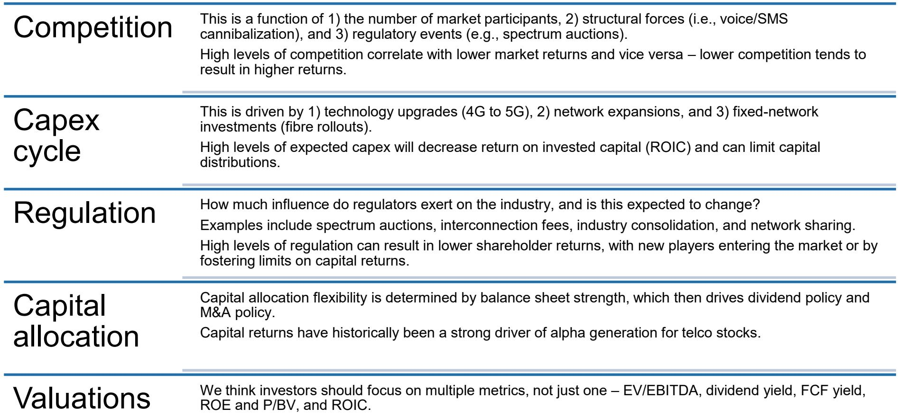
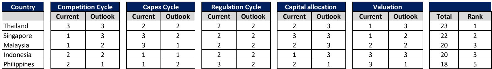

# 摩根斯坦利：东盟电信股真正的回报来源不是5G，而是竞争格局的结构性改善

市场对东盟电信板块的关注，长期集中在两个叙事上：一是5G资本开支周期何时见顶，二是数据中心需求能否带来第二增长曲线。但摩根斯坦利在最新发布的《Asia Summer School 2026: ASEAN Telecoms & Data Centers》报告中给出了一个更值得深思的判断：**决定未来12-18个月电信股超额收益的核心变量，不是技术升级，而是各国市场竞争格局的结构性变化。**

这份报告覆盖了泰国、新加坡、马来西亚、印度尼西亚和菲律宾五个市场，并基于竞争、资本开支、监管、资本配置和估值五个维度进行了系统打分。结果并不令人意外：泰国和新加坡排名前二，菲律宾垫底。但真正有价值的不是排名本身，而是排名背后的逻辑——竞争格局的改善，正在重塑这些市场的投资回报框架。

## 1. 泰国和新加坡的领先，本质上是对“寡头红利”的定价

摩根斯坦利的评分体系中，泰国以23分位居第一，新加坡以22分紧随其后。这两个市场的共同特征是什么？都是事实上的双寡头或准双寡头格局。

泰国市场在TRUE与DTAC于2022年合并后，已经从三家竞争演变为AIS与TRUE的双寡头格局。报告明确指出，合并后的竞争环境“保持理性”（competition has been stable post merger）。这不仅仅是一个市场结构描述，更是一个定价信号——当市场参与者从三家减少到两家，价格战的动机显著下降，ARPU止跌回升的可能性大幅增加。报告中的ARPU数据也印证了这一点：泰国主要运营商的ARPU自2023年以来持续回升，而这一趋势在2024-2026年的预测中仍在延续。

新加坡的情况则更为微妙。表面上看，新加坡是四家运营商加多家MVNO的竞争格局，但摩根斯坦利重点关注的是SingTel的份额稳定性和SIMBA的宽带价格战影响。报告的评分显示，新加坡在“竞争”维度的当前得分仅为1（满分3），但“展望”得分却跳升至3——这意味着分析师预期竞争环境将在未来改善。这一转变的关键变量，可能是行业整合的推进。报告提到SIMBA与M1的交易已暂停，但SingTel对参与整合表现出兴趣。如果整合发生，新加坡将从四家玩家变为三家，竞争烈度将显著下降。

对于投资者而言，这意味着泰国的寡头红利已经兑现，而新加坡的寡头红利仍在酝酿中。泰国的投资逻辑更偏向“持有并收取股息”，新加坡则可能提供“预期差带来的估值修复”。

## 2. 印尼的“双面故事”：Java趋稳，外岛才是真正的战场

印尼以20分与马来西亚并列第三，但它的故事远比分数复杂。摩根斯坦利对印尼的分析揭示了一个关键洞察：竞争格局正在出现结构性分化。

从行业参与者数量看，印尼已经从2008年的10家运营商合并为3家——Telkomsel、Indosat和XLSmart（由XL与FREN合并而来）。合并后的市场集中度提升，竞争在Java岛（印尼人口最密集的区域）确实有所改善。报告提到“竞争自2025年下半年以来有所改善”，三个运营商的ARPU正在向45,000印尼盾收敛。

但问题出在Java之外。报告明确指出，Indosat和XLSmart在合并后变得更强大，它们有更强的动机和资源在外岛（ex-Java）扩张网络覆盖。这意味着，虽然Java岛的竞争趋稳，但外岛的竞争可能加剧。这是一个典型的“局部改善、整体复杂”的局面。

对于投资者而言，印尼电信股的投资需要区分两个维度：一是Java岛的价格战趋缓带来的ARPU支撑，二是外岛资本开支增加对自由现金流的侵蚀。这两个力量的净效果，决定了印尼电信股的回报质量。报告在评分中给印尼的“资本开支”维度当前得分仅为1（最低分），说明市场已经定价了较高的资本开支压力，但问题在于市场是否充分定价了外岛竞争加剧的可能性。

## 3. 菲律宾的困境：第三玩家“赖着不走”，行业结构修复被推迟

菲律宾以18分排名垫底，这是五个市场中唯一一个在“竞争”和“资本配置”两个维度的展望得分都出现下滑的市场。摩根斯坦利的分析点出了一个关键问题：第三玩家Dito仍在市场中“游荡”。

菲律宾电信市场历史上是PLDT与Globe的双寡头格局，但Dito在2021年进入后，市场变成了三家竞争。报告没有直接说Dito何时退出，但数据已经说明问题：Dito的市场份额虽然增长缓慢，但始终没有消失。更关键的是，菲律宾的宽带普及率虽然预计每年增长2个百分点，但ARPU占家庭收入的比例高达2.5%，远高于东盟平均的1.6%，这意味着价格上行空间极其有限。

菲律宾的困境本质上是一个“行业结构修复被推迟”的故事。如果Dito最终退出或与现有玩家合并，市场将重新回到双寡头格局，竞争压力才会真正缓解。但在那之前，菲律宾电信股将面临持续的ARPU压力和资本开支需求，这解释了为什么摩根斯坦利在评分中给菲律宾的“资本配置”展望得分仅为1。

对于投资者而言，菲律宾电信股目前缺乏明确的催化剂。等待行业整合信号的出现，可能是比追逐股息率更理性的策略。

## 4. 报告尚未完全回答的关键问题：数据中心需求能否对冲电信主业的压力？

摩根斯坦利这份报告的主题虽然是“ASEAN Telecoms & Data Centers”，但对数据中心的分析相对克制。报告提到电信运营商正在从东盟地区的数据中心需求增长中受益，但没有量化这一受益对运营商整体盈利的贡献程度。

这是一个值得深入探讨的问题。电信运营商拥有的土地储备、光纤网络和电力基础设施，使其在数据中心建设中具有天然优势。但数据中心的资本开支强度远高于传统电信业务，且回报周期更长。如果运营商为了抢占数据中心市场份额而大幅增加资本开支，可能会抵消电信主业竞争改善带来的现金流改善。

此外，数据中心的客户集中度（主要来自超大规模云服务商）意味着运营商的议价能力有限。在电力成本上升的背景下，数据中心业务的毛利率能否维持在高位，仍是一个需要验证的假设。

## 5. 投资者的观察框架：从“买行业”转向“买格局”

这份报告给投资者最重要的启示，是东盟电信股的投资框架需要从“行业周期”转向“市场格局”。具体而言，投资者应该建立以下三个层次的观察框架：

第一层是竞争格局的稳定性。泰国和新加坡的双寡头/准双寡头格局提供了最清晰的回报路径——ARPU稳定、资本开支可控、股息可预期。印尼和马来西亚则需要更细致的区域分析，不能简单地用“行业整合完成”来概括。

第二层是资本配置的纪律性。报告特别强调“资本回报历史上是电信股超额收益的强驱动因素”。这意味着，即使竞争格局改善，如果管理层选择将现金流用于并购或资本开支而非分红，股东回报仍可能低于预期。投资者需要关注运营商的分红政策和自由现金流转化率。

第三层是估值的多重验证。摩根斯坦利建议投资者关注EV/EBITDA、股息率、自由现金流收益率、ROE和P/BV等多种指标，而不是单一依赖某个指标。这背后的逻辑是：电信股的估值往往在行业周期的不同阶段由不同指标驱动。在竞争改善的早期，EV/EBITDA可能更具参考价值；在稳定期，股息率和自由现金流收益率则更为关键。

---

这份报告的完整版本包含了更多细节——包括每个市场主要运营商的财务预测、频谱拍卖时间表、以及数据中心需求对运营商ROIC的敏感性分析。这些内容在本文中无法一一展开，但它们对构建具体的投资决策至关重要。

欢迎来到知识星球微信群继续讨论。我们将围绕这份报告的几个未解问题——数据中心能否成为电信股的真正增长引擎、印尼外岛竞争的演变路径、以及菲律宾行业整合的时间表——进行更深入的拆解和推演。在群里，你可以获取完整的原始报告图表，并与关注同一主题的投资者交流各自的判断框架。

Personal reading notes and learning share only. Not investment advice.

