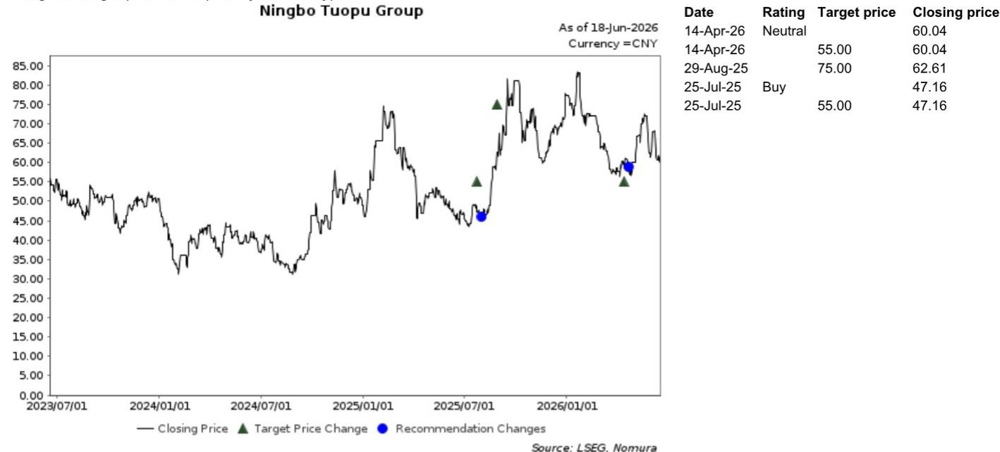
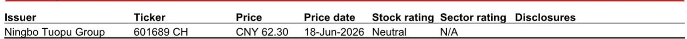

# NOM：四足机器人已越过盈亏线，但真正考验在于“大脑”尚未定型

2026年6月15日，NOM分析师团队实地走访了杭州的深度机器人公司（DEEP Robotics，未上市），并在18日该公司科创板IPO申请获受理后，发布了这份调研报告。这份报告的价值不在于它描述了机器人行业的火热——那是共识——而在于它提供了三个层次上市场尚未充分定价的判断：第一，这家四足机器人专业厂商在2025年首次实现全年盈利，营收同比增长227%至3.37亿元，净利润达到2900万元；第二，电力巡检和消防这两个垂直场景的需求正在从“试点”走向“批量部署”，但价格和性能仍然是规模化复制的硬约束；第三，也是最容易被忽视的一点，行业通往“物理AI”的技术路线尚未收敛，这意味着当前所有关于远期市场空间的线性外推，都可能建立在一条尚未选定的路径上。

以下是我们从这份研报中提炼出的五个关键洞察，以及一个NOM尚未完全回答的关键问题。

## 1. 2025年首次盈利是一个里程碑，但更值得关注的是毛利率与客户集中度的组合信号

营收从2023年到2025年的复合年增长率达到159.5%，2025年产量3936台、销量2908台，产销率73.88%——这些数字本身已经能说明公司处于高速成长期。但报告中最值得推敲的财务信号是两个并存的事实：52.83%的毛利率和18.83%的前五大客户集中度。

毛利率超过50%在硬件制造领域并不常见，尤其对于一家仍在快速扩张期的公司。这意味着产品定价权或成本结构有某种结构性优势——可能是四足机器人在特定场景下的不可替代性，也可能是公司在核心零部件或算法层面的自研壁垒。但与此同时，不到20%的前五大客户集中度暗示收入来源相对分散，这在一定程度上降低了单一客户依赖风险，但也意味着销售和渠道成本可能较高，因为服务大量中小客户所需的部署、维护和定制化投入并不低。

对于投资者而言，这里需要追问的是：毛利率能否在收入规模继续扩大的过程中维持甚至提升？如果答案是否定的，那么当前的盈利能力可能只是阶段性红利，而非长期竞争壁垒的体现。

## 2. 电力与消防场景的需求正在真实落地，但“智能仪表”方案可能在未来侵蚀这一市场

报告中提到的东莞变电站案例——每天约8.5小时巡检，识别准确率超过95%，使用双目摄像头辅以声学和温度传感——是一个难得的、有具体参数的部署证据。这不是概念验证，而是已经跑通了的运营场景。湖南、山西、河南等省份的消防和巡逻单位也在推进部署，海外项目触及新加坡和北美。

然而，NOM的外部行业调查提出了一个值得警惕的判断：随着变电站数字化转型推进，“智能仪表”方案——即变电站自身设备具备自感知能力——可能逐步侵蚀四足机器人在变电站巡检中的机会。这本质上是一个“技术替代”风险：如果变电站自己就能完成数据采集和异常识别，为什么还需要一台四足机器人？

这意味着，电力巡检这个看似确定的“近岸锚点”场景，其市场天花板可能比直觉上看到的要低。四足机器人厂商需要在这个窗口期内，快速证明自己不止能做巡检，还能做那些“智能仪表”做不到的事——比如在复杂地形中执行物理操作、在高温或粉尘环境下进行应急响应。

## 3. 工业垂直场景的规模化采用仍需等待，认证、载荷和续航是三个硬约束

报告提到，管理层认为化工、石化、矿业中的防爆机器人是一个更大、更具防御性的机会。但紧接着，报告也给出了为什么这个目标很难实现的原因：认证、载荷、续航，以及四足底盘本身的形态限制。

防爆认证在化工和矿业领域是一个漫长且高成本的过程，涉及多个国家和行业标准。四足机器人的载荷能力有限，意味着它无法携带大型工具或设备执行复杂任务。续航问题则限制了单次作业的时长和覆盖范围。而四足底盘在狭窄管道、高密度设备区等特定工业环境中的适用性，也需要进一步验证。

这些约束本质上指向同一个结论：当前四足机器人的工业应用，更多是“探测”和“巡检”性质的，离“操作”和“维修”级别的应用还有距离。后者才是工业场景中价值量最高的部分，也是真正能支撑起大规模、高复购率商业模式的场景。

## 4. “大脑”路线尚未收敛，VLA与World Model之争决定未来五年的竞争格局

这是整份报告中NOM最有洞察力的部分。管理层将行业长期轨迹定位在“大脑”——即物理AI作为通用技术——并预计其成熟至少需要八年到十年或更长时间。但真正重要的信息是：高层的技术路线尚未收敛。

目前学术界的主流方向正在从VLA风格向World Model迁移，但“世界”的定义和场景理解在不同参与者之间存在显著分歧，没有形成明确的时间表。相比之下，“小脑”部分——越来越多地基于强化学习模型——被认为已经基本确定。

这意味着什么？如果你是一家四足机器人公司，你的“大脑”路线选择将决定你未来五年的研发投入方向、人才招聘策略、甚至硬件架构设计。选错了路线，可能意味着数亿美元的沉没成本和数年的时间损失。而对于投资者而言，这意味着当前所有关于“物理AI将如何改变机器人行业”的估值模型，都建立在一个尚未被验证的假设之上。这不是一个可以忽略的风险。

## 5. 报告尚未完全回答的关键问题：供应链的可扩展性如何验证？

NOM在这份报告中给出了对拓普集团的中性评级，理由是“对人形机器人贡献的可持续性和规模持谨慎态度”，并预计其核心业务增长将在2026年放缓。这是一个合理的判断，但它回避了一个更根本的问题：四足机器人供应链本身的可扩展性。

目前四足机器人的核心零部件——电机、减速器、传感器、电池——大多来自消费电子或工业自动化供应链。当产量从几千台跃升到几万台甚至几十万台时，供应链是否能保证成本持续下降、性能持续提升？是否存在关键零部件的供应瓶颈？海外客户对供应链安全性的考量是否会推动本地化生产？这些问题在报告中并未展开，但它们恰恰是判断这家公司能否从“小而美”走向“大而强”的关键变量。

## 顺着这些未解问题继续读完整报告

NOM的这份调研报告，在提供了详实财务数据和场景案例的同时，也留下了几个值得继续深挖的方向：技术路线的收敛时间点如何跟踪？防爆认证的进展能否成为先行指标？供应链成本曲线的拐点何时出现？这些问题的答案，可能藏在报告的附录图表、分析师与公司的详细问答、以及NOM对行业供应链的持续跟踪中。

如果你对这些未解问题感兴趣，欢迎来星球微信群里继续讨论。我们会在群内分享完整的报告原文、NOM分析师的核心判断逻辑，以及我们对这些关键变量的持续跟踪和解读。

Personal reading notes and learning share only. Not investment advice.

