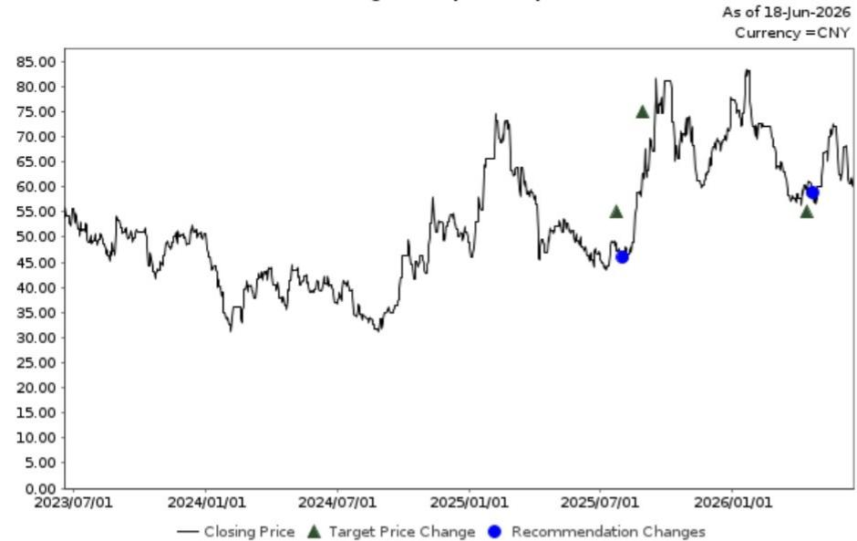
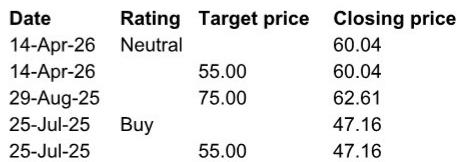

# NOM：宇树科技IPO揭示的真正悬念，不在硬件成本，而在“大脑”路线的未定

当一家公司以5,500台人形机器人出货量位居全球第一，营收同比增长335%至17亿元人民币，并实现2.88亿元的净利润，毛利率约60%，它即将在科创板挂牌的消息，很容易被市场解读为“人形机器人商业化拐点已至”。

但NOM在6月15日实地调研宇树科技后发布的这份报告，其真正有价值的判断并非关于出货量或毛利率。报告的核心洞察指向一个更根本、也更令人不安的结论：**行业当前最硬的约束条件，已经从“能不能动”转向了“能不能想”——而后者，整个行业都还没有找到确定的路径。**

这份报告的价值，在于它没有停留在对宇树全栈自研能力的赞美，而是清晰区分了“已被验证的成本优势”与“尚未被验证的模型能力”。对于关注这一赛道的投资者而言，理解这两者之间的张力，比记住任何一组财务数字都更重要。

## 1. 宇树的成本优势已构成护城河，但这条护城河可能只保护了一半战场

NOM调研报告中最引人注目的数据，是宇树的成本结构：电机、减速器、激光雷达全部自研，外采部件仅占整体成本的14%至18%。配合超过90%的产销比，这组数字共同指向一个判断：宇树在人形机器人的“物理层”建立了一个相当完整的成本护城河。

这一点在行业内并非普遍现象。许多竞争对手仍然依赖外购核心部件，这意味着它们在定价权和供应链韧性上天然处于劣势。宇树能够在2025年实现盈利，很大程度上正是得益于这种全栈自研带来的成本优势。管理层的表述也很清晰：成熟的四足机器人业务产生的现金流，正在反哺人形机器人的研发和市场拓展。

但这里有一个关键问题需要区分：成本优势解决的是“能不能造得便宜”，而人形机器人产业当前的核心矛盾，已经不再是制造成本。NOM调研中引用的外部行业调查明确指出，行业真正的瓶颈在于“大脑”——即通用世界模型的能力。硬件成本再低，如果机器人无法在复杂环境中自主决策和执行任务，它仍然只是一个昂贵的可动装置。

这意味着宇树的成本护城河是真实且有价值的，但它保护的战场，可能只是整个战役的前半段。后半段战役——关于智能水平的竞争——才刚刚开始，而且胜负远未确定。

## 2. 模型路线尚未收敛，这是比任何技术差距都更大的行业风险

NOM报告中一个被低估的判断，是关于“大脑”路线的分歧。报告指出，领先研究机构已经从VLA模型路线转向世界模型路线，但对于“世界”的定义和场景理解方式，各家之间仍然存在显著差异。

这句话的信息密度很高。它意味着当前人形机器人行业面临的根本问题，不是某家公司比另一家强多少，而是整个行业还没有就“如何让机器人理解世界”达成共识。高层次的路径没有收敛，子路线也没有收敛，因此不存在一个被确认的时间表。

这对所有硬件厂商都是一个结构性风险。如果最终的模型路线被AI巨头主导——正如NOM引用的行业调查所暗示的——那么硬件厂商将面临持续的压力。它们可能会发现自己投入巨资开发的硬件平台，需要适配一个并非由自己定义的智能系统。这种适配过程不仅成本高昂，而且可能随时面临路线变更带来的沉没成本。

宇树管理层显然意识到了这一点。NOM报告提到，公司计划将IPO募集资金的50%以上用于“大脑”开发。这是一个正确的战略方向，但也暴露了问题的严重性：连全球出货量第一的人形机器人公司，都不得不将过半资源投入一个尚未确认路径的领域。

## 3. 学术收入占比74%：这不是短板，而是产业成熟度的真实写照

很多人看到“74%的收入来自大学和科研机构”这个数字，可能会认为这是宇树的短板。但NOM报告的处理方式值得借鉴：它没有将其简单定义为问题，而是将其作为产业成熟度的标尺。

人形机器人目前仍处于“工具被研究者使用”的阶段，而非“工具被产业使用”的阶段。电网巡检和消防是增长最快的工业应用场景，但报告明确提到，其他垂直领域主要是“需求拉动”而非主动开拓。公司将自己定位为通用机器人制造商，只有在市场需求明确浮现时，才会与合作伙伴一起开发专用解决方案。

这种策略是理性的。在智能水平尚未达到广泛商业化要求之前，过早进入过多垂直领域只会分散资源。但这也意味着，宇树的增长故事在短期内仍然高度依赖学术市场的采购周期和预算安排。工业市场的规模化放量，需要等到“大脑”能力达到一个临界点。

NOM报告没有给出这个临界点的时间表，因为整个行业都无法给出。这恰恰是投资者需要保持耐心的原因：出货量第一并不等于商业化成熟，盈利也不等于规模化的开始。

## 4. 报告尚未完全回答的关键问题：成本优势能否转化为智能生态的入口

NOM的调研提供了一个清晰的框架，但有一个问题报告没有完全展开：宇树的成本优势，在多大程度上能够转化为智能生态的入口优势？

逻辑上，更低成本的硬件意味着更大的装机量，更大的装机量意味着更多的运行数据和反馈数据，这些数据对于训练“大脑”至关重要。如果这个闭环成立，宇树的成本优势就不仅仅是制造优势，而是数据优势的起点。

但这里有两个未经验证的假设。第一，宇树目前的出货量（5,500台）是否已经达到能够产生有效训练数据的规模阈值？第二，这些数据是否能够被有效地收集、标注和用于模型训练？宇树的技术栈在硬件层面是全栈自研，但在软件和数据层面，报告没有提供足够的信息来判断其能力。

这两个问题，可能是决定宇树能否从“硬件冠军”进化为“智能平台”的关键。如果数据闭环不能有效建立，宇树最终可能只是一家优秀的硬件制造商，而智能层的价值将被AI巨头攫取。反之，如果数据闭环成立，宇树的竞争壁垒将从成本扩展到数据和生态。

## 5. 供应链投资需要区分“概念受益”与“业绩兑现”

NOM报告在调研宇树的同时，也对供应链公司拓普集团给出了中性评级。核心逻辑是：对人形机器人业务的贡献可持续性和规模持谨慎态度，且预计其核心业务增速将在2026年因规模优势有限而放缓。

这是一个重要的提醒。人形机器人产业链的投资逻辑，不能简单等同于“宇树出货量增长，所以供应链受益”。NOM的估值方法——基于34倍2026年预期市盈率，高于历史均值21倍——已经反映了市场对人形机器人业务的乐观预期。但报告的风险提示部分明确指出，下行风险包括人形机器人企业的量产进度慢于预期。

这意味着，对于供应链公司而言，人形机器人业务目前更多是“估值故事”而非“业绩故事”。投资者需要区分哪些公司的核心业务能够独立支撑估值，哪些公司的估值主要依赖人形机器人概念的溢价。后者的风险在于，一旦量产进度不及预期，估值回调的幅度可能远大于核心业务本身的波动。

---

NOM的这份调研报告，真正有价值的地方不在于它确认了宇树的成本优势，而在于它清晰地指出了行业当前最不确定的变量。全球出货量第一、盈利、毛利率60%——这些数字都很真实，但它们回答的是“过去和现在”的问题。而行业真正的胜负手，在于“大脑”路线的选择、数据闭环的建立，以及智能层与硬件层的价值分配。

这些问题，报告没有给出确定的答案，因为没有人能给出。但投资者至少可以带着正确的框架去观察：当市场谈论人形机器人时，它是在谈论成本，还是在谈论智能？这两者的估值逻辑，截然不同。

如果你对NOM这份报告的完整图表、宇树IPO招股书中的详细数据，以及我们对人形机器人“大脑”路线分歧的深度拆解感兴趣，欢迎来星球微信群里继续讨论。我们会在群内分享报告原文的PDF版本，并围绕“模型路线收敛的时间窗口”和“硬件厂商的数据闭环策略”这两个未解问题，展开进一步的交流。

Personal reading notes and learning share only. Not investment advice.

