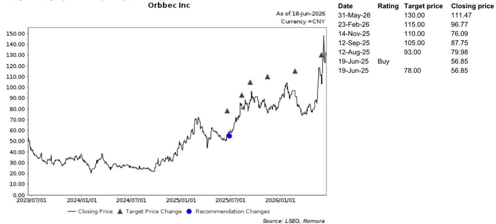

# NOM：机器人视觉的竞争壁垒不在“手”，而在“眼”和“脑”的数据飞轮

机器人行业正在经历从“机器换人”到“智能体替代”的范式迁移。市场注意力大多集中在人形机器人的整机厂商和灵巧手供应商上，但一份NOM近期发布的研报，通过对国内机器视觉头部企业梅卡曼德（Mech-Mind Robotics，未上市）的实地调研，揭示了一个可能被低估的竞争逻辑：在机器人智能化的价值链中，“眼”（3D视觉）和“脑”（算法模型）所构成的认知层，才是当前最具规模效应和护城河潜力的环节，而“手”的执行层，尚处于商业化早期。

这份报告的核心判断是：**机器人产业链的价值分配，正在从硬件集成向数据驱动的认知平台迁移。** 梅卡曼德的案例表明，谁能在“眼-脑”层面率先形成数据闭环，谁就有机会在长尾、多样化的工业场景中建立标准化部署的壁垒。以下是我们基于这份研报解析提炼出的五个关键洞察。

## 1. 连续六年市占率第一的背后，是“数据飞轮”而非单纯的硬件优势

NOM在研报中指出，梅卡曼德在大型3D抓取领域（如拆垛）已连续六年保持国内市场份额第一。管理层的表述是：“做得多，数据就多，数据多就能改进模型。”这听起来像一句常见的商业口号，但其背后的竞争逻辑值得深究。

在机器人视觉领域，单纯的传感器硬件（如深度相机）的差异化正在缩小。真正拉开差距的是算法对海量、多场景数据的消化能力。梅卡曼德的策略是不生产机器人本体，而是适配全系列机械臂。这意味着，每一次部署——无论是天津包裹处理中心每小时处理1800件包裹的场景，还是其他工业产线——都在为其“脑”积累新的训练数据。这种“眼”与“脑”的协同，构成了一个自我强化的正反馈循环：部署越多，模型越通用和稳定；模型越强，部署的门槛和成本就越低。

这给我们的启示是：在评估机器人产业链公司时，不应只看其硬件的技术参数，更应关注其数据的“生成-回流-迭代”机制是否成立。那些只能卖硬件、无法积累场景数据的公司，长期来看可能会被数据飞轮驱动的平台型公司拉开差距。

## 2. “眼-脑-手”平台的核心诉求是标准化，但“手”仍是最大的不确定性

梅卡曼德将其核心收入来源定义为“眼”（3D视觉）和“脑”（算法/模型），并据此构建了“眼-脑-手”（EBH）平台战略。管理层的愿景是推动行业从重度定制的集成模式，转向标准化、易部署的解决方案。为此，公司每年培训2000-3000名客户人员，以降低使用门槛。

这一战略的逻辑是清晰的：工业机器人需求具有“广泛、长尾、多样化”的特征，传统集成商模式效率低、规模不经济。如果能通过标准化的“眼-脑”平台，将复杂的机器人编程和调试简化为“即插即用”，那么梅卡曼德就有机会从项目制公司转型为平台型公司。

然而，NOM在研报中也坦诚地指出了行业调研中的谨慎看法：梅卡曼德的优势在于视觉，而非运动控制。灵巧手（dexterous hand）尚未产生规模收入，且自研成熟灵巧手需要时间，甚至可能需要股权激励来吸引人才。这意味着，尽管“眼-脑”平台可以适配不同形态的机器人本体和末端执行器，但“手”的缺失，可能会限制其在需要精细操作的高附加值场景中的渗透。

这里有一个尚未完全回答的关键问题：**“眼-脑”平台的先发优势，能否在“手”的短板补齐之前，支撑起足够高的客户粘性和商业壁垒？** 如果“手”的成熟周期过长，竞争对手可能在“眼-脑”层面迎头赶上。

## 3. 与奥比中光的差异化定位：通用市场 vs 高价值利基市场

NOM将梅卡曼德与A股上市的奥比中光（688322 CH，买入评级）进行了对比，这一对比对于理解3D视觉赛道的竞争格局至关重要。

报告的核心结论是：两者并非直接竞争，而是瞄准了不同细分市场。奥比中光定位于通用市场，覆盖支付刷脸、社保认证、服务机器人乃至人形机器人等大规模应用场景。而梅卡曼德，根据行业调研，更适合那些需要移动、高精度、广域定位的“高价值利基市场”，其结构光和抗干扰能力在这些场景中更具优势。

这一差异化的背后，是两种完全不同的商业逻辑。奥比中光追求的是“广度”——通过标准化模组覆盖海量出货量，以规模摊薄成本。梅卡曼德追求的是“深度”——在特定工业场景中提供完整的“眼-脑”解决方案，以软件和服务获取高附加值。NOM对奥比中光的估值基于18倍2027年预测市销率，隐含了对62%的2025-28年销售复合年增长率的预期，这背后是对其通用市场放量的押注。

对于投资者而言，这一对比提供了一个清晰的观察框架：**在3D视觉赛道，不应笼统地看待“机器视觉”概念，而应区分“硬件模组商”和“解决方案平台商”，前者看规模，后者看场景深度和客户粘性。** 两者的估值逻辑和风险点截然不同。

## 4. 报告尚未完全回答的关键问题：技术领先优势的窗口期有多长？

NOM在研报中坦承，尽管梅卡曼德在拆垛领域保持领先，但其相对于海康机器人（Hikrobot，未上市）等竞争对手的技术领先优势可能正在缩小。这是一个非常关键的风险提示。

在科技行业，先发优势往往伴随着“追赶者压力”。一旦核心算法和视觉方案被竞争对手通过逆向工程或差异化路径突破，梅卡曼德的数据飞轮效应可能会面临挑战。特别是当海康机器人这样拥有强大硬件制造能力和渠道网络的对手入场时，竞争格局可能会快速变化。

报告没有完全展开的是：**梅卡曼德的技术护城河，究竟有多少来自专利和算法秘密，又有多少来自其积累的行业数据？** 如果后者是核心，那么数据壁垒的牢固程度，取决于其客户数据的排他性以及模型对特定场景的“过拟合”程度。如果模型过于依赖特定场景数据，那么在跨行业迁移时，其通用性优势可能会打折扣。

另一个未解问题是：**“眼-脑-手”平台对“手”的依赖，是否会成为其走向人形机器人市场的结构性障碍？** NOM指出，“眼”的先发优势可以支持长期适应不同形态的机器人，但前提是“手”的短板不能拖累整体方案的竞争力。

## 5. 对决策者的观察框架：用三个维度评估机器人视觉公司

基于NOM这份研报的逻辑，我们建议产业决策者和投资者从以下三个维度来审视机器人视觉赛道的公司：

**第一，数据飞轮的闭环程度。** 公司是否具备“部署-数据-模型改进-更易部署”的正反馈机制？单纯的硬件销售无法形成飞轮，只有那些能够持续从客户现场获取操作数据、并反哺算法的公司，才具备长期竞争力。梅卡曼德每年培训数千客户人员，本质上是在加速这一闭环。

**第二，标准化与定制化的平衡能力。** 机器人集成行业长期受困于“非标”，导致利润率低、可复制性差。一家公司的价值，很大程度上取决于其能否将80%的部署工作标准化，而仅将20%留给定制。梅卡曼德的EBH平台试图做到这一点，但报告没有给出其标准化率的量化数据，这需要进一步验证。

**第三，对“手”的依赖程度。** 如果一家公司的核心壁垒在“眼”和“脑”，那么它有能力适配不同供应商的“手”，商业弹性较大。反之，如果其方案高度依赖自研的特定末端执行器，那么“手”的成熟度和成本将成为其发展的天花板。梅卡曼德的策略是前者，但报告的调研也暗示，其“手”的进展将直接影响市场对其长期价值的评估。

---

NOM的这份研报为我们提供了一个难得的窗口，去审视一家非上市但极具代表性的机器人视觉公司。其核心价值不在于给出具体的买卖建议，而在于揭示了机器人智能化浪潮中，价值链正在从硬件向认知层迁移的趋势。梅卡曼德的数据飞轮和标准化战略，是这一趋势的缩影。

然而，技术领先窗口期的缩短、灵巧手商业化的不确定性，以及来自海康机器人等巨头的竞争压力，都是这份报告没有完全回答的问题。这些问题的答案，可能就藏在原始报告更详尽的行业调研数据和对竞争格局的深入拆解中。

欢迎来星球微信群里继续讨论：梅卡曼德的数据壁垒到底有多深？奥比中光的通用市场逻辑能否兑现？以及，如果“眼-脑”平台成为主流，哪些机器人本体厂商将因此受益或受损？

Personal reading notes and learning share only. Not investment advice.

