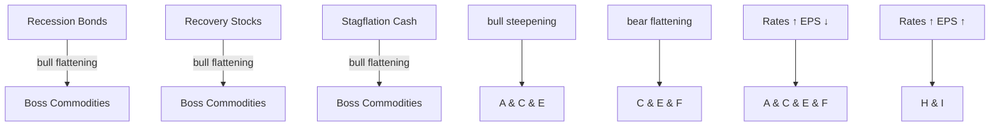

You are a senior financial newsletter editor with a consulting-style strategy lens. You turn research-report material into a long-form English article that is structured, insightful, and suitable for a serious business audience.

Objective:
- Write an English Markdown article based on the report parsing below.
- Target length: around 2200 words, plus or minus 15%.
- Tone: serious, analytical, strategic, and readable.
- The article should not feel like a summary. It should make an argument.
- You may extend the report's logic into reasonable second-order implications, but do not invent data, company actions, or quotes.
- Do not disclose every detail. Leave several meaningful open questions that make readers want the full report.

McKinsey-style writing principles:
1. Answer first: open with the controlling idea, not background.
2. Governing thought: every section must support the main answer.
3. Mutually exclusive, collectively exhaustive logic: avoid overlapping sections.
4. So what: every section must explain why the point matters.
5. Synthesis over summary: do not list facts; interpret what the pattern means.
6. Action titles: section headings must be complete, insight-bearing sentences. Do not use generic headings such as "Key Takeaways", "Market Background", "Core View", or "Reader Implications".
7. Natural hooks: if you want readers to join the community or read the full report, the hook should emerge from unresolved analytical questions, not from promotional language.

Required Markdown structure:
- `# Title`: make it a direct argument, not a topic label.
- Opening: 4-6 short paragraphs that state the main thesis and why now matters.
- 4-6 `##` sections. Each `##` heading must be an action title: a sentence that tells the reader the insight.
- One section should identify what the report does not fully answer yet.
- One section should translate the report into a decision framework for readers.
- Final section: naturally invite readers to join the community or read the full report using this CTA: Join the community to read the full report and review the original charts.
- End with: `*This article is for learning and discussion only and does not constitute investment advice.*`

Content boundaries:
- Do not mention specific investment bank names such as GS. Use "a global investment bank report" if needed.
- Do not use emoji.
- Do not write like a viral post.
- Do not output your reasoning process.
- Do not generate image Markdown; the system will insert original MinerU images afterward.

Report parsing:
"""
# The Flow Show

# V for Victory, Votes & Vigilantes

Scores on the Doors: commodities 38.6%, oil 33.0%, ACWI 16.1%, SPX 9.6%, US\$ 2.6%, cash 1.7%, HY 1.7%, IG 0.2%, govt bonds -1.0%, gold -2.7%, bitcoin -28.3% YTD.

Zeitgeist: “Warsh is the best thing that’s happened to macro trading in a long time.”

The Price is Right: victory...Iran done & US pivot back to boom & bubble to win US-China AI war; AI now 39% of SPX \~ ceiling of bubble concentration ex. railroads 1880s (Chart 3); bubbles = concentration not rotation...only tech outperformed SPX from Oct'98 lows to Mar'00 highs, only tech/telco in positive territory last 6 months of bubble (Charts 12-13).

Tale of the Tape: votes...Iran done ending plunge in Trump/economy/inflation approval (Chart 9); Wall St approval @ all-time highs (US household equity wealth up \$6tn YTD – Chart 7), but GOP losing Senate in Nov = big “dollar down, yields down, stocks down” event; booms & bubbles ended by voters & vigilantes (and vol events, e.g. JPY & KRW crises – Chart 4)...bulls will get “yippy” if no big bounce in Trump approval by Sept.

The Biggest Picture: vigilantes...since Warsh pick for Fed Jan 30 $^{th}$ (peak gold, XBT - 30%) big US yield curve bear flattening (2s10s curve 75bps to 25bps) on “inflation = hikes” fear (CPI>unemployment rate rare but always coincides with yield curve inversion – Chart 8); bear move from inflation boom to stagflation bust (Chart 2) arrested if big oil drop offsets AI/wealth price spiral and sends CPI back <3%.

Chart 2: Only oil price can arrest bear flattening yield curve shift from boom to stagflation  
The BofA Investment Clock  

flowchart

Source: BofA Global Investment Strategy  
BofA GLOBAL RESEARCH

More on page 2...

## 18 June 2026

Investment Strategy

Global

BofA

Data

Analytics

Michael Hartnett

Investment Strategist

BofAS

+1 646 855 1508

michael.hartnett@bofa.com

Anya Shelekhin

Investment Strategist

BofAS

+1 646 855 3753

anya.shelekhin@bofa.com

Myung-Jee Jung

Investment Strategist

BofAS

+1 646 855 0389

myung-jee.jung@bofa.com

Jessica Guo

Investment Strategist

BofAS

+1 646 855 0033

jessica.guo@bofa.com

Chart 1: BofA Bull & Bear Indicator  
Up to 9.2 from 8.9  

gauge chart

| Category | Value |
|---|---|
| Extreme Bearish | 2 |
| Buy | 6 |
| Sell | 9.2 |
| Extreme Bullish | 10 |

Source: BofA Global Investment Strategy. The indicator identified above as the BofA Bull & Bear Indicator is intended to be an indicative metric only and may not be used for reference purposes or as a measure of performance for any financial instrument or contract, or otherwise relied upon by third parties for any other purpose, without the prior written consent of BofA Global Research. This indicator was not created to act as a benchmark.

BofA GLOBAL RESEARCH

Trading ideas and investment strategies discussed herein may give rise to significant risk and are not suitable for all investors. Investors should have experience in relevant markets and the financial resources to absorb any losses arising from applying these ideas or strategies.

BofA does and seeks to do business with issuers covered in its research reports. As a result, investors should be aware that the firm may have a conflict of interest that could affect the objectivity of this report. Investors should consider this report as only a single factor in making their investment decision.

Refer to important disclosures on page 12 to 14.

12985485

Weekly Flows: \$126.4bn to equities, \$25.1bn to cash, \$19.7bn to bonds, \$0.1bn from crypto, \$2.9bn from gold.

## Flows to Know:

- IG bonds: \$10.3bn inflow, 11 $^{th}$ weekly inflow,  
- US stocks: record \$119.2bn weekly inflow...US stocks annualizing record \$739bn inflow in '26 (Chart 10),  
• US mid cap: record \$19.9bn weekly inflow,  
• US small cap: \$12.3bn inflow...2 $^{nd}$ biggest weekly inflow ever,  
- Tech: record \$19.2bn inflow...tech stocks annualizing record \$154bn inflow in '26 (Chart 11),  
• Europe equities: \$1.2bn outflow, 10 $^{th}$ weekly outflow,  
• China equities: \$9.1bn outflow, 12 $^{th}$ weekly outflow.

BofA Private Clients: \$4.5tn AUM...65.6% stocks, 17.4% bonds, 9.8% cash; GWIM equity ETF share count up 5.1% YTD, 0.2% past week...underlying equity buying; past 4 weeks private clients buying materials, TIPs, municipal bond ETFs, and selling Japan, staples, utilities ETFs.

BofA Bull & Bear Indicator $^{1}$ : rises to 9.2 from 8.9 on surging equity inflows & tighter spreads in risky bonds; “extreme bull” positioning...“sell signal” triggered May'26...17 "sell signals" since '02, average loss for global stocks over 2-3 months is 2-3%, hit ratio of \~60%, max drawdowns of 15-20% (see BofA Bull & Bear Indicator).

Chart 3: AI 39% of SPX...bubble concentration ceiling ex. railroads
History of stock market concentration measured as % of US market cap  

line chart

| Year | Railroads | Nifty Fifty | TMT | Utilities/telco/industrials | Japan, % MSCI ACWI | AI Big 10* |
|------|-----------|-------------|-----|-----------------------------|--------------------|------------|
| 1835 | ~10%      | ~10%        | ~10%| ~10%                        | ~10%               | ~10%       |
| 1920 | ~63%      | ~36%        | ~36%| ~36%                        | ~36%               | ~36%       |
| 1972 | ~40%      | ~40%        | ~40%| ~40%                        | ~40%               | ~40%       |
| 1985 | ~44%      | ~44%        | ~44%| ~44%                        | ~44%               | ~44%       |
| 1999 | ~41%      | ~41%        | ~41%| ~41%                        | ~41%               | ~41%       |
| 2023 | ~39%      | ~39%        | ~39%| ~39%                        | ~39%               | ~39%       |

Source: BofA Global Investment Strategy, GFD Finaeon, Bloomberg. Note: Japan is measured as % of MSCI ACWI, all others as % of US stock market. \*\*AI Big 10\* = Magnificent 7 + Broadcom, AMD, Micron.  
BofA GLOBAL RESEARCH

Chart 4: Ultimate K-shape...KOSPI vs. Korean won...one is wrong
Kospi vs Korean won  

line chart

| Date   | Korean stocks (KOSPI) | KRW to USD (per 100 KRW, RHS) |
|--------|------------------------|-------------------------------|
| Jan'25 | ~2500                  | ~0.068                        |
| Apr'25 | ~2400                  | ~0.070                        |
| Jul'25 | ~3000                  | ~0.073                        |
| Oct'25 | ~3500                  | ~0.071                        |
| Jan'26 | ~4000                  | ~0.069                        |
| Apr'26 | ~5500                  | ~0.067                        |
| Jul'26 | ~9000                  | ~0.065                        |

Source: BofA Global Investment Strategy, Bloomberg  
BofA GLOBAL RESEARCH

Chart 5: $1^{st}$ time since Jul'23 DM & EM central bank rate hikes > cuts  
Central bank rate hikes minus cuts, 3-month rolling  

line chart

| Year | Developed Markets | Emerging Markets |
|------|-------------------|------------------|
| '26  | ~0%               | ~-10%            |

Source: BofA Global Investment Strategy, Bloomberg  
BofA GLOBAL RESEARCH

Chart 7: US wealth up \$6tn YTD...wealth-price spiral  
US household and BofA private client equity holdings (q/q change)  

bar-line hybrid chart

| Year | US household equity holdings (q/q chg, $tn) | GWIM equity holdings (q/q, $bn) - RHS |
|------|-----------------------------------------------|----------------------------------------|
| '14  | ~1.5                                          | ~10                                    |
| '15  | ~0.5                                          | ~-5                                    |
| '16  | ~1.0                                          | ~-20                                   |
| '17  | ~1.5                                          | ~0                                     |
| '18  | ~1.0                                          | ~5                                     |
| '19  | ~1.5                                          | ~40                                    |
| '20  | ~6.0                                          | ~-80                                   |
| '21  | ~5.5                                          | ~30                                    |
| '22  | ~2.5                                          | ~-80                                   |
| '23  | ~2.0                                          | ~-30                                   |
| '24  | ~4.0                                          | ~100                                   |
| '25  | ~5.5                                          | ~-30                                   |
| '26  | ~10.0                                         | ~-50                                   |

Source: BofA Global Investment Strategy,  
BofA GLOBAL RESEARCH

Chart 9: Why the US-Iran war ended...markets will want to see bounce  
Trump approval (Presidential, on inflation, on economy)  

line chart

| Date    | Trump Presidential Job Approval | Trump Inflation Approval | Trump Economy Approval |
|---------|----------------------------------|--------------------------|------------------------|
| May-26  | 41%                              | 28%                      | 35%                    |

Source: BofA Global Investment Strategy, Real Clear Politics, Bloomberg  
BofA GLOBAL RESEARCH

Chart 6: Nominal GDP "boom loop"  
US nominal GDP in midst of unprecedented 75% surge from 2020 to 2027  

line chart

| Year | US nominal GDP ($tn) | BofA forecast |
|------|----------------------|---------------|
| Q2'20 | $20 | - |
| Q4'27 | $35 | - |

Source: BofA Global Investment Strategy, Bloomberg, GFD Finaeon  
BofA GLOBAL RESEARCH

Chart 8: When U-rate lower than CPI...there be dragons  
US unemployment rate minus US headline CPI YoY % vs 2s10s curve  

line chart

| Year | US unemployment rate minus US headline CPI (YoY %) | US 2s10s Curve (RHS) |
|------|--------------------------------------------------|------------------------|
| '78  | -10                                              | 0                      |
| '82  | 5                                                | 100                    |
| '86  | 7                                                | 150                    |
| '90  | 3                                                | 200                    |
| '94  | 5                                                | 250                    |
| '98  | 3                                                | 100                    |
| '02  | 4                                                | 200                    |
| '06  | 2                                                | 150                    |
| '10  | 6                                                | 250                    |
| '14  | 5                                                | 200                    |
| '18  | 3                                                | 150                    |
| '22  | -5                                               | 100                    |
| '26  | 2                                                | 50                     |

Source: BofA Global Investment Strategy, Bloomberg  
BofA GLOBAL RESEARCH

Chart 10: Inflows to US stocks annualizing record \$739bn in '26  
Cumulative US equity fund flows, by year (\$bn)  

line chart

| Year | Cumulative ($bn) |
| ---- | ----------------- |
| 2026 | 739               |

Source: BofA Global Investment Strategy, EPFR. \*2026 is YTD annualized.  
BofA GLOBAL RESEARCH

Chart 11: Inflows to tech stocks annualizing record \$154bn in '26  
Cumulative US tech fund flows, by year (\$bn)  

line chart

| Year | Cumulative ($bn) |
| ---- | ----------------- |
| '26  | 154               |
| '26, ann. | 154         |

Source: BofA Global Investment Strategy, EPFR. \*2026 is YTD annualized.  
BofA GLOBAL RESEARCH

Chart 12: Only tech outperformed SPX from Oct'98 low to Mar'00 high  
S&P 500 sector returns from 10/8/98 to 3/10/00  

bar chart

| Sector | Value (%) |
| :--- | :--- |
| Tech | 221 |
| S&P 500 | 45 |
| Discretionary | 44 |
| Telco | 44 |
| Industrials | 34 |
| Financials | 17 |
| Energy | 13 |
| Healthcare | 5 |
| Materials | -2 |
| Utilities | -15 |
| Staples | -31 |

Source: BofA Global Investment Strategy, Bloomberg  
BofA GLOBAL RESEARCH

Chart 13: Only tech/telco in positive territory last 6 months of bubble  
Sector returns from 9/10/99 to 3/10/00  

bar chart

| Sector | Value (%) |
| :--- | :--- |
| Tech | 44 |
| Telco | 10 |
| S&P 500 | 3 |
| Discretionary | -3 |
| Industrials | -8 |
| Energy | -10 |
| Utilities | -11 |
| Healthcare | -11 |
| Financials | -14 |
| Materials | -19 |
| Staples | -31 |

Source: BofA Global Investment Strategy, Bloomberg  
BofA GLOBAL RESEARCH

## Asset Class Flows (Table 1)

Equities: \$126.4bn inflow (\$140.0bn to ETFs, \$13.4bn from mutual funds)

Bonds: inflows past 60 weeks (\$19.7bn)

Precious metals: outflows past 2 weeks (\$2.9bn)

## Fixed Income Flows (Chart 14)

IG Bond inflows past 11 weeks (\$10.3bn)

HY Bond inflows resume (\$2.2bn)

EM Debt inflows resume (\$0.2bn)

Munis inflows past 9 weeks (\$2.5bn)

Govt/Tsy inflows past 8 weeks (\$1.6bn)

TIPS inflows past 20 weeks (\$0.9bn)

Bank loan inflows past 2 weeks (\$1.0bn)

## Equity Flows (Table 2)

US: inflows past 12 weeks (\$119.2bn)

Japan: inflows past 2 weeks (\$1.2bn)

Europe: outflows past 10 weeks (\$1.2bn)

EM: outflows resume (\$9.5bn)

By style: inflows US large cap (\$60.5bn), US small cap (\$12.3bn), US value (\$11.4bn), US growth (\$1.6bn).

By sector: inflows tech (\$19.2bn), financials (\$1.1bn), materials (\$1.0bn), real estate (\$0.9bn), com svs (\$0.8bn), hcare (\$0.1bn), outflows utilities (\$0.3bn), consumer (\$0.4bn), energy (\$0.7bn).

Chart 15: FICC inflows to bank loans, TIPS, HY bonds  
Weekly FICC flows as a \% AUM  

bar chart

| Category | Value (%) |
|---|---|
| Bank loan | 0.52 |
| TIPS | 0.48 |
| Corp HY | 0.31 |
| Money-market | 0.26 |
| Corp IG | 0.24 |
| Govt/Tsy | 0.11 |
| EM debt | -0.07 |
| Commodities | -0.31 |
| Gold & Silver | -0.42 |

Source: BofA Global Investment Strategy, EPFR Global

Table 1: Cumulative YTD flows by asset class  
Global flows by asset class, \$mn

<table><tr><td></td><td>Wk % AUM</td><td>YTD</td><td>YTD %AUM</td></tr><tr><td>Equities</td><td>0.4%</td><td>534,988</td><td>1.8%</td></tr><tr><td>ETFs</td><td>0.8%</td><td>787,762</td><td>4.8%</td></tr><tr><td>LO</td><td>-0.1%</td><td>-252,718</td><td>-2.0%</td></tr><tr><td>Bonds</td><td>0.2%</td><td>434,334</td><td>4.6%</td></tr><tr><td>Commodities</td><td>-0.3%</td><td>14,940</td><td>1.5%</td></tr><tr><td>Money-market</td><td>0.2%</td><td>412,459</td><td>3.7%</td></tr></table>

\*week ended 06/17/2026: Source: EPFR Global  
BofA GLOBAL RESEARCH

Table 2: Table 5: Big YTD inflows to DM stocks  
Global equity flows by region, \$mn

<table><tr><td></td><td>Wk % AUM</td><td>YTD</td></tr><tr><td>Total Equities</td><td>0.4%</td><td>534,988</td></tr><tr><td>long-only funds</td><td>-0.1%</td><td>-252,718</td></tr><tr><td>ETFs</td><td>0.8%</td><td>787,762</td></tr><tr><td>Total EM</td><td>-0.3%</td><td>-120,208</td></tr><tr><td>Brazil</td><td>-0.3%</td><td>4,445</td></tr><tr><td>India</td><td>-0.5%</td><td>-8,511</td></tr><tr><td>China</td><td>-1.4%</td><td>-229,803</td></tr><tr><td>Total DM</td><td>0.5%</td><td>655,196</td></tr><tr><td>US</td><td>0.7%</td><td>341,217</td></tr><tr><td>Europe</td><td>-0.1%</td><td>-10,053</td></tr><tr><td>Japan</td><td>0.1%</td><td>12,330</td></tr><tr><td>International</td><td>0.2%</td><td>290,437</td></tr></table>

Total Equities = Total EM + Total DM  
Source: EPFR Global  
BofA GLOBAL RESEARCH  
BofA GLOBAL RESEARCH

## BofA private client flows & allocations

Chart 16: Private clients bought materials, TIPs, munis  
BofA private clients 4-week ETF flows as % of AUM  

bar chart

BofA GWIM private clients
Cumulative 4w flows as % AUM
| Sector | Cumulative 4w flows as % AUM (%) |
| :--- | :--- |
| Materials | 8.2 |
| TIPS | 2.6 |
| Municipals | 2.3 |
| MLP | 1.5 |
| IG | 1.1 |
| Healthcare | 1.0 |
| Value | 0.9 |
| Cons. Disc. | 0.8 |
| HY | 0.7 |
| Industrials | 0.6 |
| REITs | 0.4 |
| Bank loan | 0.3 |
| Dividend | 0.2 |
| US | 0.1 |
| Growth | -0.1 |
| Energy | -0.2 |
| Precious | -0.3 |
| EM debt | -0.4 |
| Low-vol | -0.6 |
| Tech | -1.0 |
| Financials | -1.5 |
| Utilities | -2.2 |
| Staples | -3.0 |
| Japan | -6.0 |

Source: BofA Global investment Strategy  
BofA GLOBAL RESEARCH

Chart 

[中间内容因长度限制已省略]

ch information is distributed simultaneously to internal and client websites and other portals by BofA and is not publicly-available material. Any unauthorized use or disclosure is prohibited. Receipt and review of this information constitutes your agreement not to redistribute, retransmit, or disclose to others the contents, opinions, conclusion, or information contained herein (including any investment recommendations, estimates or price targets) without first obtaining express permission from an authorized officer of BofA.

Materials prepared by BofA Global Research personnel are based on public information. Facts and views presented in this material have not been reviewed by, and may not reflect information known to, professionals in other business areas of BofA, including investment banking personnel. BofA has established information barriers between BofA Global Research and certain business groups. As a result, BofA does not disclose certain client relationships with, or compensation received from, such issuers. To the extent this material discusses any legal proceeding or issues, it has not been prepared as nor is it intended to express any legal conclusion, opinion or advice. Investors should consult their own legal advisers as to issues of law relating to the subject matter of this material. BofA Global Research personnel's knowledge of legal proceedings in which any BofA entity and/or its directors, officers and employees may be plaintiffs, defendants, co-defendants or co-plaintiffs with or involving issuers mentioned in this material is based on public information. Facts and views presented in this material that relate to any such proceedings have not been reviewed by, discussed with, and may not reflect information known to, professionals in other business areas of BofA in connection with the legal proceedings or matters relevant to such proceedings.

This information has been prepared independently of any issuer of securities mentioned herein and not in connection with any proposed offering of securities or as agent of any issuer of any securities. None of BofAS any of its affiliates or their research analysts has any authority whatsoever to make any representation or warranty on behalf of the issuer(s). BofA Global Research policy prohibits research personnel from disclosing a recommendation, investment rating, or investment thesis for review by an issuer prior to the publication of a research report containing such rating, recommendation or investment thesis.

Any information relating to sustainability in this material is limited as discussed herein and is not intended to provide a comprehensive view on any sustainability claim with respect to any issuer or security.

Any information relating to the tax status of financial instruments discussed herein is not intended to provide tax advice or to be used by anyone to provide tax advice. Investors are urged to seek tax advice based on their particular circumstances from an independent tax professional.

The information herein (other than disclosure information relating to BofA and its affiliates) was obtained from various sources and we do not guarantee its accuracy. This information may contain links to third-party websites. BofA is not responsible for the content of any third-party website or any linked content contained in a third-party website. Content contained on such third-party websites is not part of this information and is not incorporated by reference. The inclusion of a link does not imply any endorsement by or any affiliation with BofA. Access to any third-party website is at your own risk, and you should always review the terms and privacy policies at third-party websites before submitting any personal information to them. BofA is not responsible for such terms and privacy policies and expressly disclaims any liability for them.

All opinions, projections and estimates constitute the judgment of the author as of the date of publication and are subject to change without notice. Prices also are subject to change without notice. BofA is under no obligation to update this information and BofA ability to publish information on the subject issuer(s) in the future is subject to applicable quiet periods. You should therefore assume that BofA will not update any fact, circumstance or opinion contained herein.

Certain outstanding reports or investment opinions relating to securities, financial instruments and/or issuers may no longer be current. Always refer to the most recent research report relating to an issuer prior to making an investment decision.

In some cases, an issuer may be classified as Restricted or may be Under Review or Extended Review. In each case, investors should consider any investment opinion relating to such issuer (or its security and/or financial instruments) to be suspended or withdrawn and should not rely on the analyses and investment opinion(s) pertaining to such issuer (or its securities and/or financial instruments) nor should the analyses or opinion(s) be considered a solicitation of any kind. Sales persons and financial advisors affiliated with BofAS or any of its affiliates may not solicit purchases of securities or financial instruments that are Restricted or Under Review and may only solicit securities under Extended Review in accordance with firm policies.

Neither BofA nor any officer or employee of BofA accepts any liability whatsoever for any direct, indirect or consequential damages or losses arising from any use of this information.
"""
