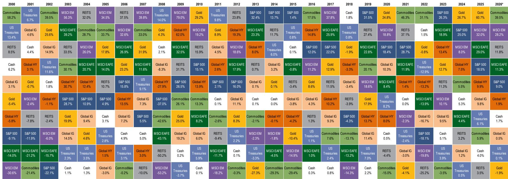
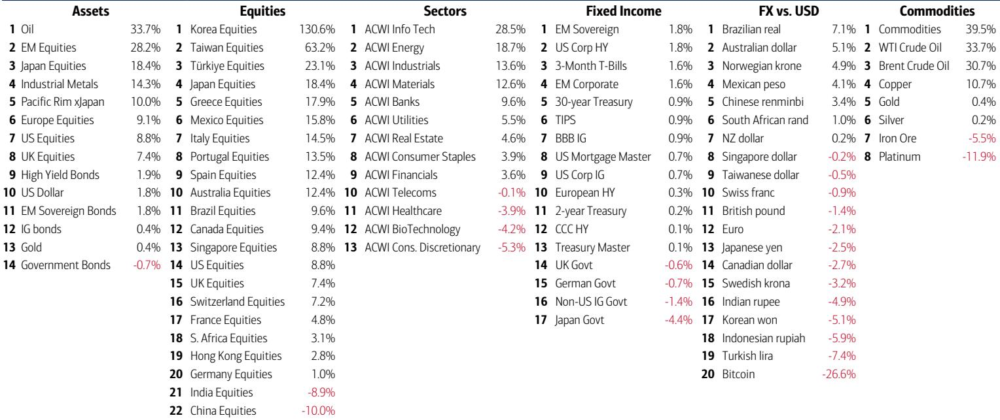
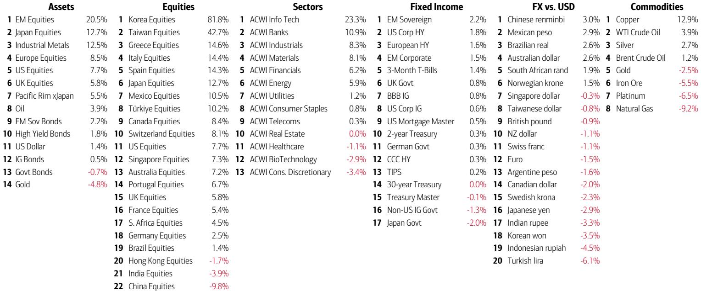

# The AI Bubble Has Reached Its Concentration Ceiling — But the Real Risk Is Not a Crash

The most important signal in markets today is not the record inflows into US equities, the 39% weighting of AI stocks in the S&P 500, or even the yield curve's bear flattening. It is the fact that the US economy is now trapped between a wealth-price spiral and a stagflation bust, with only one variable capable of breaking the deadlock: the price of oil. The flow show of mid-2026 reveals a market that has already priced a victory narrative — the end of the Iran conflict, a pivot back to domestic boom economics, and an AI-led supremacy race against China — but has not yet confronted the political and monetary vigilantes that historically end every boom.

The data from a leading global investment bank's flow report paints a picture of extreme conviction. US equities are annualizing a record $739 billion in inflows for 2026. Tech stocks alone are on pace for $154 billion. The BofA Bull & Bear Indicator has risen to 9.2, firmly in "extreme bull" territory and flashing a sell signal since May. This is not a market that is cautiously optimistic. This is a market that has made a massive, concentrated bet on a single narrative: that the AI revolution will continue to defy gravity, that the US political cycle will deliver a pro-risk outcome, and that inflation is no longer a threat.

That bet may be correct. But the historical pattern of booms and bubbles suggests it will be resolved not by fundamentals, but by two forces that the current flow data barely acknowledges: voters and vigilantes.

## The Wealth-Price Spiral Is Now the Dominant Macro Regime, and It Has Made the Economy Dependent on Rising Asset Prices

The report's most underappreciated chart is the one showing US household equity wealth up $6 trillion year-to-date. This is not a side effect of the bull market. It is the engine. The US economy has entered what the report calls a "wealth-price spiral," where rising stock prices create consumption and tax revenue, which in turn supports earnings and further stock price appreciation. This is the nominal GDP "boom loop" — a 75% surge from 2020 to 2027, unprecedented in modern history.

The strategic implication is stark: the Fed and the administration cannot afford a significant equity drawdown without breaking the feedback loop that is propping up the real economy. This is why the end of the Iran conflict matters so much. The report shows that Trump's approval ratings on inflation and the economy had fallen to 28% and 35% respectively before the pivot. The war was a drag on the boom narrative. Its conclusion allows the administration to refocus on the domestic boom-and-bubble playbook that is necessary to win the US-China AI war.

But this creates a dangerous dependency. If the wealth-price spiral is the only thing keeping nominal GDP aloft, then any shock that breaks the equity bid — a political surprise, a vol event, a vigilante attack on the yield curve — becomes an immediate macro crisis. The market is not pricing this tail risk because it has become the regime.

## AI Concentration Has Hit a Historical Ceiling, and Bubbles Do Not Rotate — They Burst

The report's chart on stock market concentration is arguably the most powerful piece of evidence for the bears. AI now represents 39% of the S&P 500, which the report explicitly labels as the "bubble concentration ceiling" — exceeding even the railroad bubble of the 1880s. The historical comparison is instructive: in every prior instance of extreme concentration, the bubble did not end with a gradual rotation into other sectors. It ended with a collapse in the dominant cohort.

The report provides the data to support this. From the October 1998 low to the March 2000 high, only tech outperformed the S&P 500. In the last six months of that bubble, only tech and telecom were in positive territory. Every other sector was either flat or deeply negative. This is the signature of a terminal bubble: capital does not rotate out of the mania; it stays until the mania ends, and then it flees the asset class entirely.

The current flow data is consistent with this pattern. US small caps and mid caps are seeing record inflows, but this is not rotation away from tech. It is a broadening of the risk appetite within the same speculative regime. Tech itself is still seeing record weekly inflows of $19.2 billion. The real question is not whether value or international equities will catch up. It is whether the AI trade can sustain its dominance without triggering the kind of macro reversal that historically follows peak concentration.

## The Yield Curve Is Flashing a Stagflation Signal That Only Oil Can Resolve

The most technically significant development in the report is the bear flattening of the US yield curve. Since the appointment of a new Fed chair in January, the 2s10s curve has flattened from 75 basis points to 25 basis points. This is not a benign signal. The report's investment clock framework maps this as a shift from a "boom" regime (recovery stocks, commodities) toward a "stagflation" regime (cash, commodities). The yield curve is telling us that the market is beginning to price a scenario where inflation remains sticky while growth slows.

The report identifies the crucial variable: CPI is currently above the unemployment rate. Historically, this condition is rare and always coincides with yield curve inversion. The only way to arrest the bear flattening and prevent a full stagflation repricing is a significant drop in oil prices. If oil falls enough to push CPI back below 3%, the wealth-price spiral can continue. If it does not, the curve will continue to flatten, and the equity bid will become increasingly fragile.

This is the hidden vulnerability in the current flow story. The record inflows into US equities are predicated on a Goldilocks scenario that the yield curve is explicitly rejecting. Either the curve is wrong, or the equity market is about to face a reality check.

## The November Election Is the Most Underpriced Tail Risk in the Flow Data

The report makes a provocative claim: if the GOP loses the Senate in November, the market reaction would be a sharp "dollar down, yields down, stocks down" event. This is not a conventional political analysis. It is a flow-based argument. The current bull market is partly a function of expectations that the administration will maintain a pro-business, pro-boom policy mix. A loss of Senate control would immediately raise the probability of fiscal gridlock, regulatory uncertainty, and a reversal of the tax and spending assumptions embedded in current equity valuations.

The report notes that Wall Street approval is at all-time highs, and that US household equity wealth is up $6 trillion year-to-date. This creates a political economy problem. If the equity market is the primary transmission mechanism for economic well-being, then any political event that threatens the market also threatens the administration's approval. The report warns that bulls will get "yippy" if Trump's approval does not bounce significantly by September. This is a timeline that every investor should mark on their calendar.

The market is currently treating the election as a non-event because it assumes the boom narrative will carry the day. But the flow data shows that the boom itself is fragile and dependent on a narrow set of conditions. A political surprise would not just be a sentiment shock. It would be a flow shock, as the record inflows that have driven the market to extreme levels reverse with equal force.

## What the Report Does Not Fully Answer: The Mechanism of the Unwind

The report is exceptionally clear on what is happening now and what the historical precedents are. It is less clear on the specific trigger or sequence of an unwind. The sell signal from the Bull & Bear Indicator has a historical hit ratio of roughly 60%, with average losses of 2-3% over two to three months and maximum drawdowns of 15-20%. But the report does not specify what distinguishes the 60% of signals that lead to losses from the 40% that do not.

This is the critical analytical gap. Is the current signal different because the wealth-price spiral is deeper than in prior cycles? Is the AI concentration so extreme that a 15-20% drawdown in the S&P 500 would translate into a 30-40% drawdown in tech, triggering a systemic event? Or is the bull case correct that this time is different because the AI revolution is a genuine productivity shock that justifies the concentration?

The report hints at an answer by pointing to the role of vol events, particularly the JPY and KRW crises, as historical triggers for the end of booms. The chart showing the KOSPI versus the Korean won is a warning: one of these two is wrong. If the Korean won continues to weaken while Korean stocks continue to rally, the divergence will eventually resolve with a sharp correction in equities. This is the kind of cross-asset dislocation that can spill over into US markets.

But the report does not model the probability or timing of such an event. It leaves the reader with a framework for identifying the risk, but not a tool for predicting it. This is honest analysis, but it means that the strategic conclusion is necessarily probabilistic rather than deterministic.

## A Decision Framework for the Second Half of 2026

For the institutional investor, the report implies a clear sequence of questions that should drive portfolio construction for the remainder of the year.

First, monitor the oil price as the single most important macro variable. If oil falls, the yield curve can re-steepen, the stagflation fear recedes, and the equity bid can continue. If oil holds or rises, the bear flattening will accelerate, and the rotation out of growth and into cash and commodities will become self-reinforcing.

Second, watch Trump's approval numbers as a leading indicator for the election outcome. If approval does not bounce by September, the probability of a GOP Senate loss rises, and the market will begin to price that risk well before November. The report suggests that this would be a negative for the dollar, Treasuries, and equities simultaneously — a rare triple shock that would test the resilience of the current flow regime.

Third, treat the AI concentration as a risk management problem, not an alpha opportunity. The historical data is clear: when a single sector reaches 39% of the index, the subsequent drawdown is not a rotation into other sectors. It is a decline in the index itself. The appropriate hedge is not to underweight tech and overweight value. It is to reduce overall equity exposure or to buy protection against a broad market decline.

Fourth, prepare for a vol event. The report identifies the JPY and KRW crises as historical triggers. The current divergence in Asian currencies and equities is a warning. If the won breaks, or if the yen carries trade unwinds, the spillover into US equities could be sudden and severe. This is not a base case, but it is a tail risk that the current flow data does not discount.

Finally, recognize that the sell signal from the Bull & Bear Indicator is not a timing tool. It is a regime indicator. It tells you that the market is priced for perfection and that the risk-reward is asymmetric to the downside. The appropriate response is not to sell everything, but to ensure that your portfolio can withstand a 15-20% drawdown without forcing a liquidation at the worst possible time.

Join the community to read the full report and review the original charts.

*This article is for learning and discussion only and does not constitute investment advice.*

Personal reading notes and learning share only. Not investment advice.

