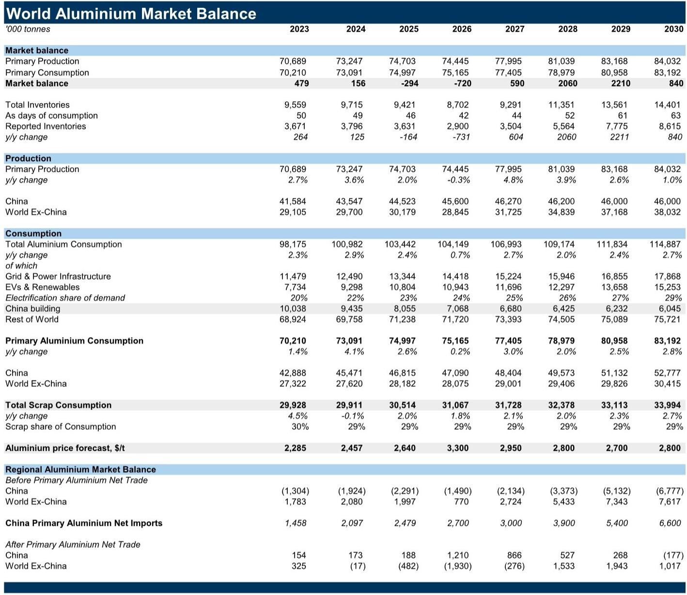
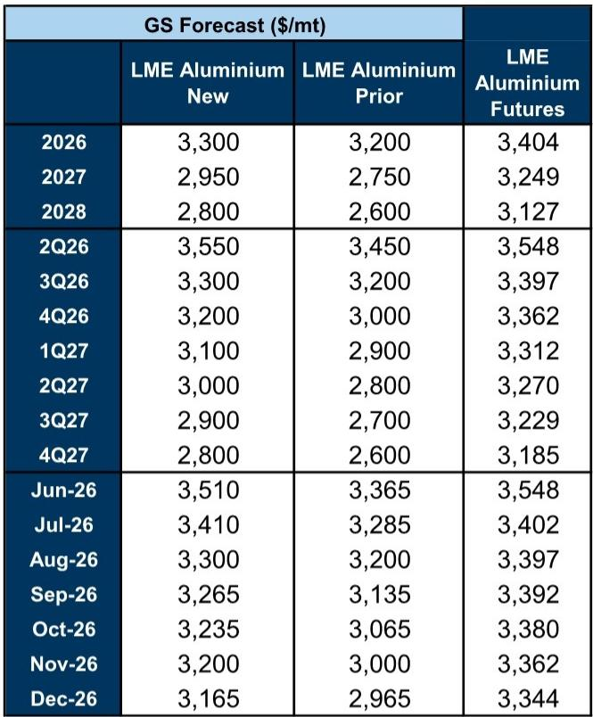
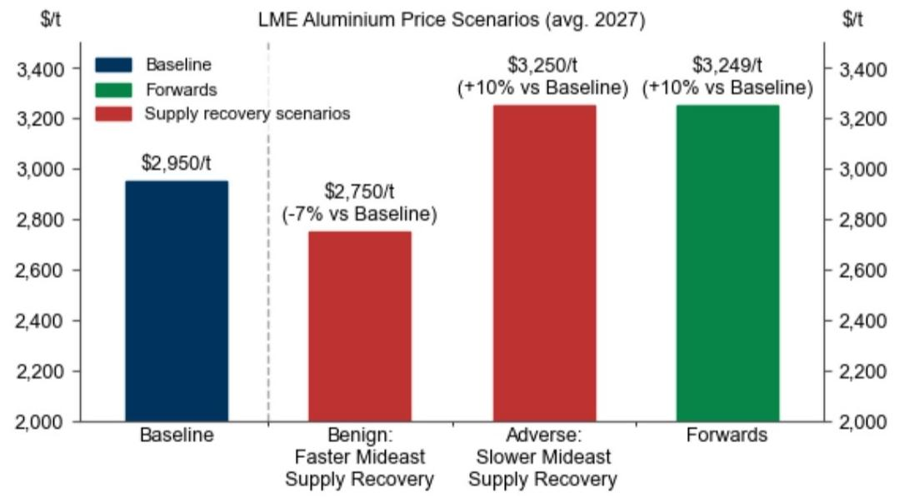

# The Aluminium Market Is Telling Two Contradictory Stories at Once — And That Is the Real Strategic Insight

The global aluminium market is no longer a single narrative. It is a battle between a near-term supply shock in the Middle East and a structural supply wave from China and Indonesia, and the tension between these two forces will define pricing, investment strategy, and risk management for the next three years. A global investment bank report has revised its aluminium price forecasts upward for 2026 and 2027, but the revision masks a deeper analytical challenge: the market is simultaneously tighter than previously expected in the short run and more oversupplied than consensus believes in the medium term. This is not a contradiction to resolve. It is a dual reality that demands a differentiated approach.

The report raises its Q3 2026 LME aluminium price forecast to $3,300 per tonne and its average 2027 forecast to $2,950 per tonne, up from $3,200 and $2,750 respectively. Yet these new forecasts remain well below forward prices of $3,400 and $3,250. The gap between what the analyst expects and what the market prices is not noise. It reflects a fundamental disagreement about the persistence of the Middle East disruption and the speed of the supply response from Asia. For investors and corporate strategists, understanding why this gap exists — and which side is more likely to be wrong — is the central question.

The Middle East supply shock is more persistent than initial assumptions suggested. The report now downgrades Middle East output by approximately 660 kilotonnes in 2026 and 1 million tonnes in 2027, as damaged capacity is expected to restart in early 2027 rather than the second half of 2026. The precedent is instructive: after the April 2025 Iberian grid outage, Alcoa took roughly one year to fully restart the San Ciprián smelter. Even if the Strait of Hormuz reopens under an announced interim deal, the physical reality of repairing potlines and gradually restarting curtailed capacity imposes a timeline that markets may be underestimating. Bahrain output is now expected to return to pre-conflict levels by mid-2027, and UAE output by end-2027.

This persistence matters because it reshapes the global balance. The report now projects a 720 kilotonne deficit in 2026 and a 590 kilotonne surplus in 2027, compared to a 570 kilotonne deficit and a 1.3 million tonne surplus previously. The deficit in 2026 is deeper, and the surplus in 2027 is smaller. That is a meaningful shift for anyone with exposure to aluminium prices, whether through physical procurement, derivatives, or equity positions in producers and consumers. But the report does not stop at the near-term tightening. It argues that the structural story — the supply wave from Indonesia and China — ultimately offsets the disruption and keeps a medium-term bearish view intact.

## The Middle East disruption is not a temporary blip but a persistent structural constraint that rewrites the near-term balance

The instinct when a geopolitical disruption hits commodity supply is to assume it will resolve quickly. Markets price in a V-shaped recovery, and analysts often follow. The report challenges that reflex by providing a detailed, evidence-based timeline for Middle East production recovery. The key insight is not just that the disruption is larger than initially thought, but that the recovery process itself is constrained by physical and operational realities that no diplomatic agreement can accelerate.

Potlines that have been damaged require months of repair. Curtailed capacity cannot be restarted instantly without risking further damage to equipment. The report cites the San Ciprián precedent, where a full restart took approximately one year after an Iberian grid outage in April 2025. That timeline is now being applied to the Middle East, and the implication is that even under the best-case geopolitical scenario, production will not return to pre-conflict levels until late 2027 at the earliest.

For anyone managing aluminium price risk, this means the near-term tightening is more durable than spot prices suggest. The market may be pricing in a faster recovery than is physically possible. The report's upward revision to 2026 and 2027 price forecasts reflects this view, but the fact that forecasts remain below forwards indicates that the analyst believes the market is still overestimating the speed of the supply response. This gap between forecast and forward is the most actionable signal in the report.

## Indonesia is not just a marginal supplier — it is becoming the swing producer that determines the medium-term price floor

The report raises its Indonesian primary aluminium production forecast to 1.7 million tonnes in 2026 and 2.9 million tonnes in 2027, up from 1.6 million and 2.5 million respectively. That is a compound annual growth rate of over 80% from 2025 levels. Recent data supports the ramp, with Indonesian output up approximately 89% year-onear year-to-date. The report's confidence has increased because power availability, previously seen as a binding constraint, is now being addressed through captive or dedicated power arrangements and some reallocation of power from nickel to aluminium projects in industrial parks.

This is the structural supply wave that the report argues will eventually overwhelm the Middle East disruption. Indonesian production is not just growing; it is growing at a pace that fundamentally changes the global supply curve. By 2027, Indonesia alone will add roughly 2.1 million tonnes of new production compared to 2025 levels. That is more than the entire Middle East disruption of approximately 1 million tonnes in 2027. The math is straightforward: the structural surplus eventually wins.

But the timing matters. In 2026, Indonesian growth does not fully offset the Middle East loss. The market remains in deficit. It is only from 2027 onwards, as Indonesian production reaches scale and Middle East production slowly recovers, that the surplus re-emerges. This creates a window where the market transitions from tight to loose, and the question for investors is how to position for that transition.

## China adds another layer of supply response that the market may be underestimating

The report raises its China primary aluminium production forecast to 45.6 million tonnes in 2026 and 46.3 million tonnes in 2027, up from 45.2 million and 45.9 million respectively. The key driver is strong industry margins, which have supported restarts, selected replacement projects, and what the report describes as "some estimated overproduction above the headline cap." Recent data suggests Chinese output has already moved above the headline 45 million tonne capacity cap on a run-rate basis.

This is significant because the capacity cap has been a key anchor for market expectations. If China is already producing above the cap, and if strong margins continue to incentivize overproduction, then the effective supply ceiling is higher than the official one. The report notes that the year-to-date strength could reflect unauthorized overproduction, continued operation of old capacity under capacity swap programmes, and short-term potline intensification. The production hit from recent environmental inspections and reported curtailments appears relatively small.

The implication is that China, alongside Indonesia, provides a partial offset to lower Middle East output in both 2026 and 2027. The combined supply response from Asia is the mechanism that eventually flips the market from deficit to surplus. But the exact timing and magnitude of that flip depend on factors that the report itself acknowledges are uncertain.

## The report leaves critical questions unanswered — and that is where the real analytical work begins

No report can resolve every uncertainty, and the most valuable analysis is the one that identifies what it does not know. The report explicitly flags that risks around Middle East supply recovery are two-sided. A slower restart of damaged capacity would remove around 500 kilotonnes of 2027 supply versus the base case, keeping the market fairly balanced and prices around $3,250 per tonne. A faster restart would add around 600 kilotonnes, lifting the surplus toward 1.2 million tonnes and bringing prices closer to $2,750 per tonne.

That is a $500 per tonne range, or roughly 15% of the current price level. For a commodity market, that is enormous uncertainty. The report's base case sits in the middle, but the tails are wide and the probabilities are unquantified. The reader is left with a clear analytical framework but no simple answer.

There are also deeper questions that the report does not fully address. What happens to Chinese overproduction if margins compress? The report assumes strong margins persist, but if the supply response itself pushes prices lower, margins will compress and the incentive to overproduce will diminish. This creates a feedback loop that could limit the supply response exactly when it is most needed. Similarly, Indonesian production growth depends on power availability and project execution. The report expresses more confidence than before, but the track record of large-scale industrial projects in emerging markets is mixed.

The most important unresolved question is whether the market's current forward pricing is wrong because it underestimates the persistence of the Middle East disruption, or because it overestimates the speed of the Asian supply response. The report argues for the former in the near term and the latter in the medium term, but the transition between these two regimes is where the risk lies.

## A decision framework for navigating the two-supply-shock aluminium market

For investors and corporate strategists, the report provides a clear framework for decision-making, even if it cannot resolve all uncertainties. The framework has three layers.

First, assess your time horizon. If your exposure is to 2026 pricing, the report argues that the market is tighter than forwards suggest. The Middle East disruption is persistent, and the Asian supply response has not yet reached sufficient scale. This argues for hedging against higher prices or maintaining long positions. If your exposure is to 2027 and beyond, the structural surplus from Indonesia and China argues for hedging against lower prices or maintaining short positions. The report explicitly closes a short December 2026 LME aluminium trade and rolls to a short December 2027 position, reflecting exactly this time-based differentiation.

Second, monitor the key variables that will determine which scenario materializes. The most important are Middle East restart timelines, Indonesian production data, and Chinese output relative to the capacity cap. The report provides specific thresholds: a slower Middle East restart removes 500 kilotonnes of 2027 supply; a faster restart adds 600 kilotonnes. Indonesian output of 1.7 million tonnes in 2026 and 2.9 million tonnes in 2027 are the base case assumptions. Any deviation from these numbers should trigger a reassessment of the balance.

Third, consider the cross-asset implications. The report reiterates a long December 2027 copper versus short December 2027 aluminium trade, noting that the remaining upside is now concentrated in the aluminium leg. This trade expresses a view that copper and aluminium will diverge as aluminium faces structural oversupply while copper faces structural deficit. For multi-commodity investors, this is a direct expression of the report's core thesis.

## The full report contains the data and charts that make this analysis actionable

The analysis presented here is based on a detailed report that includes specific production forecasts, balance sheets, and price targets for each year through 2030. The report also includes charts showing the evolution of smelter margins, inventory cover, and the shifting share of global production between the Middle East and Indonesia. These charts are not decorative. They are the empirical foundation for the arguments made above, and they allow readers to test the assumptions for themselves.

The report also includes a detailed breakdown of Indonesian production by project, showing which specific smelters are driving the growth and when each is expected to reach full capacity. This level of granularity is essential for anyone who wants to monitor the supply wave as it develops.

Join the community to read the full report and review the original charts.

*This article is for learning and discussion only and does not constitute investment advice.*

Personal reading notes and learning share only. Not investment advice.

