Investor Presentation | Asia Pacific

Narrowing the K-shaped Recovery Gap

MS ASIA LIMITED+

Kathleen Oh

Chief Korea/Taiwan Economist

Kathleen.Oh@morganstanley.com

+852 2848-7340

Asia Summer School 2026

For analyst certification and other important disclosures, refer to the Disclosure Section, located at the end of this report.

Korea: Macro Overview

## From K-shaped Recovery to a Broad-based Rebound

We see the Korean economy recovering on a broader-based rebound. Unprecedented resilience in tech exports coupled with a faster-than-expected consumption recovery look set to close the negative output gap two quarters earlier than our previous forecast. We see above-potential growth for the next two years and total four hikes by the BoK over one year from July 2026.

We expect a broad-based rebound in GDP growth to 2.8%Y in 2026 vs. 1.1% in 2025  
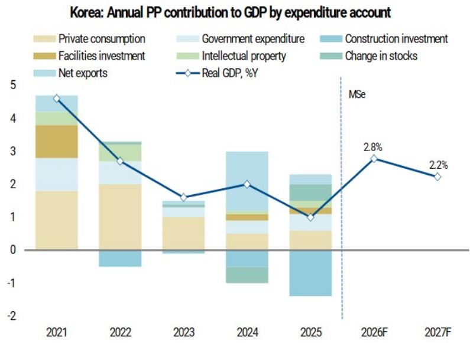

bar-line hybrid

Korea: Annual PP contribution to GDP by expenditure account
| Year | Net exports (%) | Government expenditure (%) | Real GDP, %Y (%) |
|---|---|---|---|
| 2021 | 1.8 | 0.6 | 4.6 |
| 2022 | 1.9 | 0.5 | 2.7 |
| 2023 | 1.0 | -0.1 | 1.5 |
| 2024 | 0.5 | 0.2 | 2.0 |
| 2025 | 0.6 | -0.8 | 1.0 |
| 2026F | 0.4 | 0.1 | 2.8 |
| 2027F | 0.3 | 0.1 | 2.2 |
MSe

Source: BoK, MS forecasts

## Key takeaways

- Korea set to move from K-shaped recovery to a broad-based rebound: Growth likely to jump 2.8% in 2026 vs 1.1% in 2025 before stabilizing to 2.2% in 2027.  
- CPI inflation faces upward pressure to 2.5%Y, not only from elevated oil prices but from a faster-than-expected consumption recovery among households.  
- With ample tax income amid strong corporate earnings, income and securities transaction taxes, the government could hand down an extra budget in 2H26.  
- With an above-potential growth outlook through 2027, we see the BoK entering tightening territory above the neutral range; terminal rate at $3.50\%$ by 1H27e.  
- The risk balance is tilted to the upside with the fiscal windfall expected from the tech exporter outperformance.

## Growth to See Above-Potential Level Rebound to 2.8%Y in 2026

Growth contribution from domestic and external demand to show a balanced dynamic  
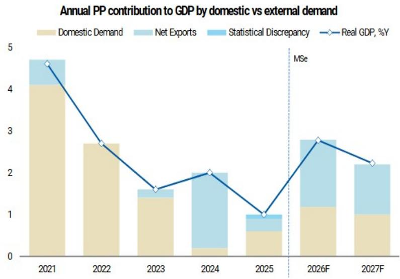

bar-line hybrid

Annual PP contribution to GDP by domestic vs external demand
| Year | Domestic Demand (%) | Net Exports (%) | Statistical Discrepancy (%) | Real GDP, %Y (%) |
|---|---|---|---|---|
| 2021 | 4.1 | 0.3 | 0.5 | 4.6 |
| 2022 | 2.7 | 0.1 | 0.0 | 2.8 |
| 2023 | 1.4 | 0.1 | 0.0 | 1.6 |
| 2024 | 0.2 | 1.6 | 0.1 | 2.0 |
| 2025 | 0.6 | 0.3 | 0.1 | 1.0 |
| 2026F | 1.2 | 1.4 | 0.1 | 2.8 |
| 2027F | 1.0 | 1.3 | 0.0 | 2.3 |

Unfavorable base to kick-in from 2Q26 before a rebound in 2H26  
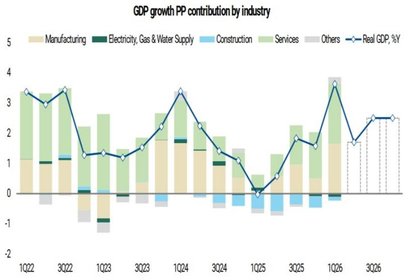

bar-line hybrid

| Quarter | Manufacturing (%) | Electricity, Gas & Water Supply (%) | Construction (%) | Services (%) | Others (%) | Real GDP, %Y |
| --- | --- | --- | --- | --- | --- | --- |
| 1Q22 | 1.1 | 0.1 | 0.0 | 1.8 | -0.4 | 3.4 |
| 2Q22 | 1.0 | 0.1 | 0.0 | 1.9 | -0.5 | 3.0 |
| 3Q22 | 1.1 | 0.1 | 0.0 | 2.0 | -0.4 | 3.5 |
| 4Q22 | 1.1 | 0.1 | 0.0 | 1.7 | -0.6 | 3.4 |
| 1Q23 | -0.8 | -0.3 | -0.2 | 1.6 | -1.3 | 1.3 |
| 2Q23 | -0.5 | -0.1 | -0.1 | 1.4 | -0.5 | 1.2 |
| 3Q23 | 0.3 | 0.1 | -0.1 | 1.4 | -0.4 | 1.5 |
| 4Q23 | 1.8 | 0.1 | -0.3 | 1.7 | -0.5 | 2.2 |
| 1Q24 | 1.6 | 0.1 | -0.1 | 1.5 | -0.4 | 3.4 |
| 2Q24 | 1.4 | 0.1 | -0.2 | 1.3 | -0.4 | 2.3 |
| 3Q24 | 1.3 | 0.1 | -0.3 | 1.9 | -0.5 | 1.4 |
| 4Q24 | 0.5 | 0.1 | -0.3 | 1.3 | -0.5 | 1.1 |
| 1Q25 | -0.5 | -0.1 | -0.4 | 0.5 | -0.6 | -0.1 |
| 2Q25 | -0.7 | -0.1 | -0.5 | 1.3 | -0.6 | 0.5 |
| 3Q25 | 0.9 | 0.1 | -0.4 | 1.7 | -0.6 | 1.8 |
| 4Q25 | 0.5 | 0.1 | -0.3 | 2.1 | -0.6 | 1.6 |
| 1Q26 | 1.6 | 0.1 | -0.2 | 2.7 | -0.6 | 3.7 |

Source: BoK, MS forecasts

## Exports: A New Cycle High

Korea's May trade recorded highest monthly export value, despite rising energy imports  
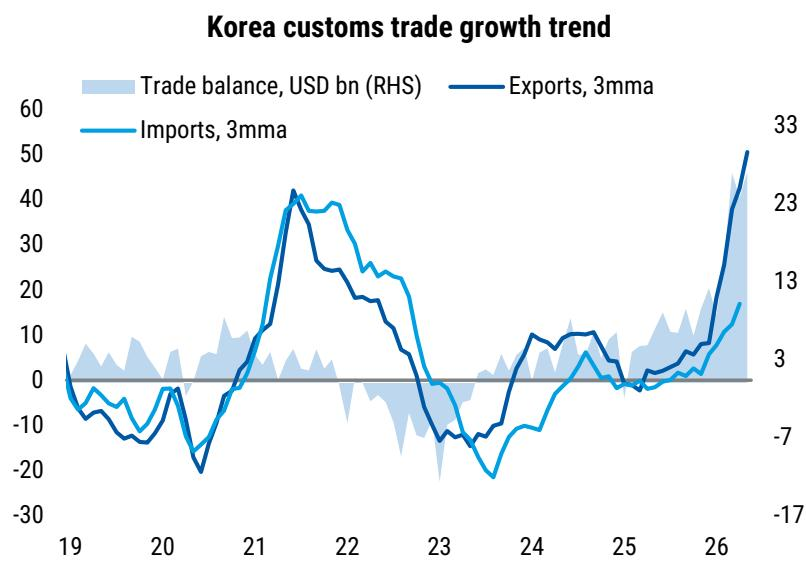

line chart

| Year | Trade balance, USD bn (RHS) | Exports, 3mma | Imports, 3mma |
|------|-----------------------------|---------------|---------------|
| 19   | ~0                          | ~0            | ~0            |
| 20   | ~-5                         | ~-10          | ~-5           |
| 21   | ~10                         | ~40           | ~30           |
| 22   | ~-10                        | ~20           | ~25           |
| 23   | ~-15                        | ~-10          | ~-5           |
| 24   | ~-5                         | ~10           | ~5            |
| 25   | ~0                          | ~5            | ~0            |
| 26   | ~15                         | ~30           | ~10           |

Both tech and non-tech momentum accelerating  
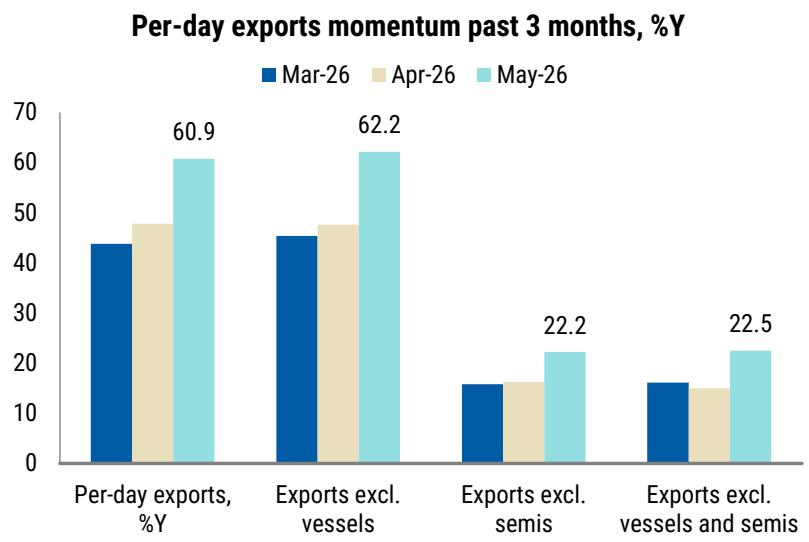

bar chart

Per-day exports momentum past 3 months, %Y
| Category | Mar-26 (%) | Apr-26 (%) | May-26 (%) |
| :--- | :--- | :--- | :--- |
| Per-day exports, %Y | 44 | 48 | 60.9 |
| Exports excl. vessels | 45.5 | 47.5 | 62.2 |
| Exports excl. semis | 15.5 | 16 | 22.2 |
| Exports excl. vessels and semis | 16 | 15 | 22.5 |

Source: KITA, MS

## Rising Global Demand for HBM and Generic DRAM

Exports to rise significantly on AI-driven demand  
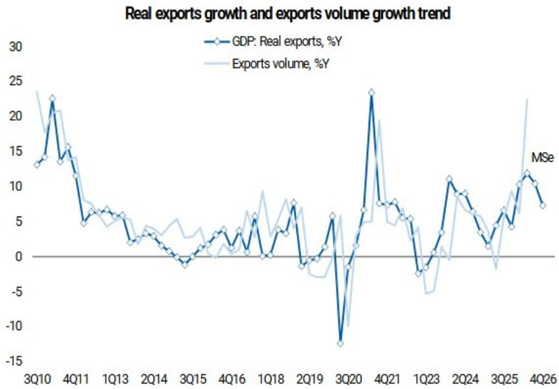

line chart

| Quarter | GDP: Real exports, %Y | Exports volume, %Y |
| ------- | --------------------- | ------------------ |
| 3Q10    | ~13                   | ~23                |
| 4Q10    | ~22                   | ~15                |
| 1Q11    | ~10                   | ~8                 |
| 2Q11    | ~5                    | ~6                 |
| 3Q11    | ~3                    | ~4                 |
| 4Q11    | ~2                    | ~3                 |
| 1Q12    | ~1                    | ~2                 |
| 2Q12    | ~0                    | ~1                 |
| 3Q12    | ~-1                   | ~0                 |
| 4Q12    | ~-2                   | ~-1                |
| 1Q13    | ~-3                   | ~-2                |
| 2Q13    | ~-4                   | ~-3                |
| 3Q13    | ~-5                   | ~-4                |
| 4Q13    | ~-6                   | ~-5                |
| 1Q14    | ~-7                   | ~-6                |
| 2Q14    | ~-8                   | ~-7                |
| 3Q14    | ~-9                   | ~-8                |
| 4Q14    | ~-10                  | ~-9                |
| 1Q15    | ~-11                  | ~-10               |
| 2Q15    | ~-12                  | ~-11               |
| 3Q15    | ~-13                  | ~-12               |
| 4Q15    | ~-14                  | ~-13               |
| 1Q16    | ~-15                  | ~-14               |
| 2Q16    | ~-16                  | ~-15               |
| 3Q16    | ~-17                  | ~-16               |
| 4Q16    | ~-18                  | ~-17               |
| 1Q17    | ~-19                  | ~-18               |
| 2Q17    | ~-20                  | ~-19               |
| 3Q17    | ~-21                  | ~-20               |
| 4Q17    | ~-22                  | ~-21               |
| 1Q18    | ~-23                  | ~-22               |
| 2Q18    | ~-24                  | ~-23               |
| 3Q18    | ~-25                  | ~-24               |
| 4Q18    | ~-26                  | ~-25               |
| 1Q19    | ~-27                  | ~-26               |
| 2Q19    | ~-28                  | ~-27               |
| 3Q19    | ~-29                  | ~-28               |
| 4Q19    | ~-30                  | ~-29               |
| 1Q20    | ~-31                  | ~-30               |
| 2Q20    | ~-32                  | ~-31               |
| 3Q20    | ~-33                  | ~-32               |
| 4Q20    | ~-34                  | ~-33               |
| 1Q21    | ~-35                  | ~-34               |
| 2Q21    | ~-36                  | ~-35               |
| 3Q21    | ~-37                  | ~-36               |
| 4Q21    | ~-38                  | ~-37               |
| 1Q22    | ~-39                  | ~-38               |
| 2Q22    | ~-40                  | ~-39               |
| 3Q22    | ~-41                  | ~-40               |
| 4Q22    | ~-42                  | ~-41               |
| 1Q23    | ~-43                  | ~-42               |
| 2Q23    | ~-44                  | ~-43               |
| 3Q23    | ~-45                  | ~-44               |
| 4Q23    | ~-46                  | ~-45               |
| 1Q24    | ~-47                  | ~-46               |
| 2Q24    | ~-48                  | ~-47               |
| 3Q24    | ~-49                  | ~-48               |
| 4Q24    | ~-50                  | ~-49               |
| 1Q25    | ~-51                  | ~-50               |
| 2Q25    | ~-52                  | ~-51               |
| 3Q25    | ~-53                  | ~-52               |
| 4Q25    | ~-54                  | ~-53               |
| 1Q26    | ~-55                  | ~-54               |
| 2Q26    | ~-56                  | ~-55               |
| 3Q26    | ~-57                  | ~-56               |
| 4Q26    | ~-58                  | ~-57               |
| MSe     | -                     | -                  |

Bit shipments expected to maintain two-digit growth  
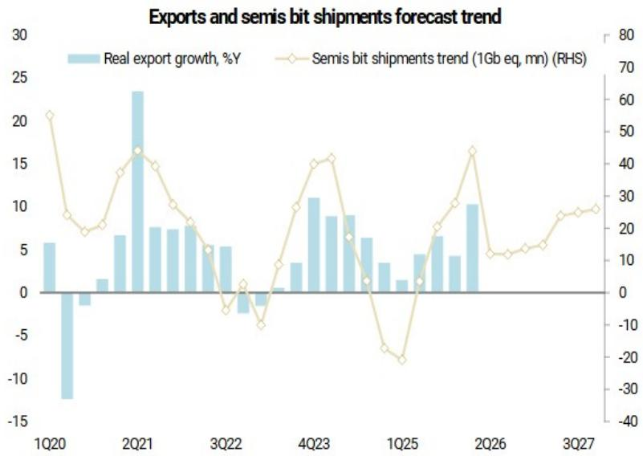

bar-line hybrid

Exports and semis bit shipments forecast trend
| Quarter | Real export growth, %Y (%) | Semis bit shipments trend (1Gb eq, mn) (RHS) |
| :--- | :--- | :--- |
| 1Q20 | 5.6 | 58 |
| 2Q20 | -12.4 | 9.0 |
| 3Q20 | -1.2 | 7.0 |
| 4Q20 | 1.6 | 14.0 |
| 1Q21 | 6.8 | 16.0 |
| 2Q21 | 23.6 | 45.0 |
| 3Q21 | 7.6 | 10.0 |
| 4Q21 | 7.6 | 8.0 |
| 1Q22 | 7.6 | 5.0 |
| 2Q22 | 5.4 | -2.0 |
| 3Q22 | -2.4 | 1.0 |
| 4Q22 | -0.8 | -4.0 |
| 1Q23 | 0.4 | 3.0 |
| 2Q23 | 3.4 | 10.0 |
| 3Q23 | 11.0 | 30.0 |
| 4Q23 | 8.8 | 45.0 |
| 1Q24 | 8.8 | 18.0 |
| 2Q24 | 6.4 | 5.0 |
| 3Q24 | 3.4 | -18.0 |
| 4Q24 | 1.6 | -28.0 |
| 1Q25 | 4.4 | 10.0 |
| 2Q25 | 6.8 | 20.0 |
| 3Q25 | 4.4 | 30.0 |
| 4Q25 | 10.0 | 45.0 |
| 1Q26 | - | 10.0 |
| 2Q26 | - | 15.0 |
| 3Q26 | - | 18.0 |
| 4Q26 | - | 25.0 |
| 1Q27 | - | 30.0 |
| 2Q27 | - | 35.0 |
| 3Q27 | - | 38.0 |

Source: BoK, MS forecasts

## Semis Now 40% of Total Exports; Non-Tech Recovery Since End-2025

Tech-related goods continue to remain the key contributors to Korea's exports  
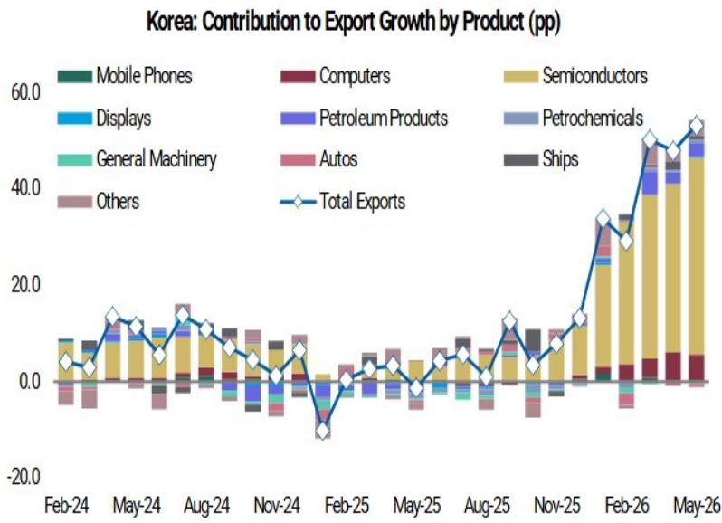

bar-line hybrid

Korea: Contribution to Export Growth by Product (pp)
| Month | Mobile Phones | Displays | General Machinery | Others | Computers | Petroleum Products | Autos | Semiconductors | Petrochemicals | Ships | Total Exports |
|---|---|---|---|---|---|---|---|---|---|---|---|
| Feb-24 | 0.0 | 0.0 | 0.0 | 0.0 | 0.0 | 0.0 | 0.0 | 0.0 | 0.0 | 0.0 | 0.0 |
| May-24 | 0.0 | 0.0 | 0.0 | 0.0 | 0.0 | 0.0 | 0.0 | 0.0 | 0.0 | 0.0 | 15.0 |
| Aug-24 | 0.0 | 0.0 | 0.0 | 0.0 | 0.0 | 0.0 | 0.0 | 0.0 | 0.0 | 0.0 | 12.5 |
| Nov-24 | 0.0 | 0.0 | 0.0 | 0.0 | 0.0 | 0.0 | 0.0 | 0.0 | 0.0 | 0.0 | 5.5 |
| Feb-25 | -5.5 | -5.5 | -5.5 | -5.5 | -5.5 | -5.5 | -5.5 | -5.5 | -5.5 | -5.5 | -13.5 |
| May-25 | -1.5 | -1.5 | -1.5 | -1.5 | -1.5 | -1.5 | -1.5 | -1.5 | -1.5 | -1.5 | -1.5 |
| Aug-25 | -1.5 | -1.5 | -1.5 | -1.5 | -1.5 | -1.5 | -1.5 | -1.5 | -1.5 | -1.5 | 12.5 |
| Nov-25 | -1.5 | -1.5 | -1.5 | -1.5 | -1.5 | -1.5 | -1.5 | -1.5 | -1.5 | -1.5 | 12.5 |
| Feb-26 | 2.5 | 2.5 | 2.5 | 2.5 | 2.5 | 2.5 | 2.5 | 2.5 | 2.5 | 2.5 | 33.7 |
| May-26 | 3.75 | 3.75 | 3.75 | 3.75 | 3.75 | 3.75 | 3.75 | 3.75 | 3.75 | 3.75 | 49.8 |
The chart displays a stacked bar chart with a line overlay showing the total exports over time.

Persistent energy market volatility drives crude petroleum and coal import growth  
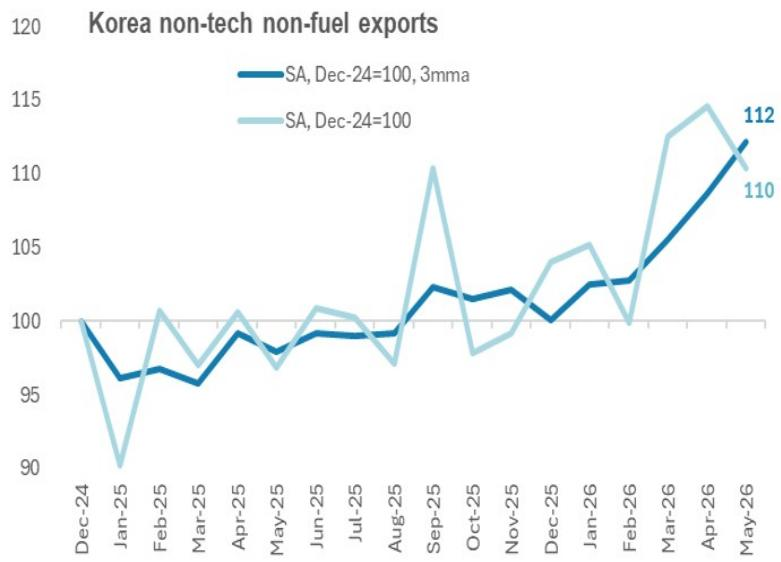

line chart

| Month    | SA, Dec-24=100, 3mma | SA, Dec-24=100 |
| -------- | --------------------- | -------------- |
| May-26   | 112                   | 110            |

Source: KITA, MS

## Tech Supercycle Benefitting Capex Activities

Unprecedented tech super-cycle benefits exports  
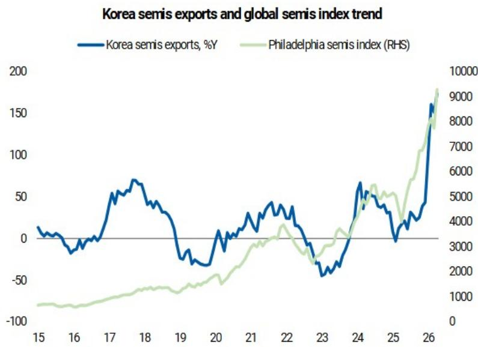

line chart

| Year | Korea semis exports, %Y | Philadelphia semis index (RHS) |
|------|--------------------------|----------------------------------|
| 15   | ~10                      | ~800                             |
| 16   | ~-20                     | ~700                             |
| 17   | ~50                      | ~600                             |
| 18   | ~70                      | ~500                             |
| 19   | ~-30                     | ~400                             |
| 20   | ~-40                     | ~300                             |
| 21   | ~30                      | ~200                             |
| 22   | ~40                      | ~100                             |
| 23   | ~-50                     | ~-200                            |
| 24   | ~60                      | ~500                             |
| 25   | ~-10                     | ~400                             |
| 26   | ~170                     | ~9000                            |

Capex and capital goods imports ramped up  
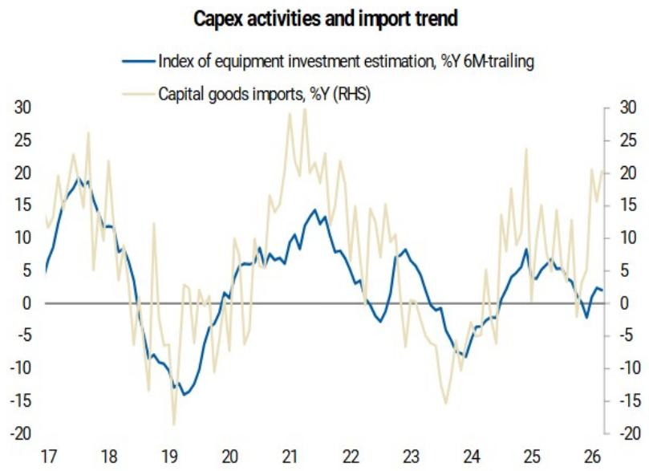

line chart

| Year | Index of equipment investment estimation, %Y 6M-trailing | Capital goods imports, %Y (RHS) |
|------|----------------------------------------------------------|-------------------------------|
| 17   | ~5                                                       | ~15                           |
| 18   | ~18                                                      | ~25                           |
| 19   | ~-15                                                     | ~-20                          |
| 20   | ~5                                                       | ~10                           |
| 21   | ~15                                                      | ~30                           |
| 22   | ~5                                                       | ~15                           |
| 23   | ~-5                                                      | ~-10                          |
| 24   | ~-10                                                     | ~-15                          |
| 25   | ~5                                                       | ~25                           |
| 26   | ~0                                                       | ~20                           |

Source: BoK, MS

## Consumption: Faster-Than-Expected Recovery

We see a more stable consumption path on fiscal support, wealth effect, and wage growth

GDP private consumption trend  
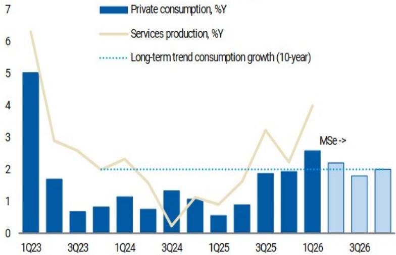

bar-line hybrid

| Quarter | Private consumption, %Y | Services production, %Y | Long-term trend consumption growth (10-year) |
|---|---|---|---|
| 1Q23 | 5.0 | 6.4 | |
| 3Q23 | 1.7 | 2.9 | |
| 1Q24 | 0.7 | 2.0 | |
| 3Q24 | 1.3 | 0.3 | |
| 1Q25 | 0.5 | 0.9 | |
| 3Q25 | 1.9 | 3.3 | |
| 1Q26 | 2.6 | 4.0 | MSe-> |
| 3Q26 | 1.8 | 2.2 | |
| 1Q27E | 2.0 | 2.0 | |

Both goods and services consumption to sustain

Consumption breakdown by components  
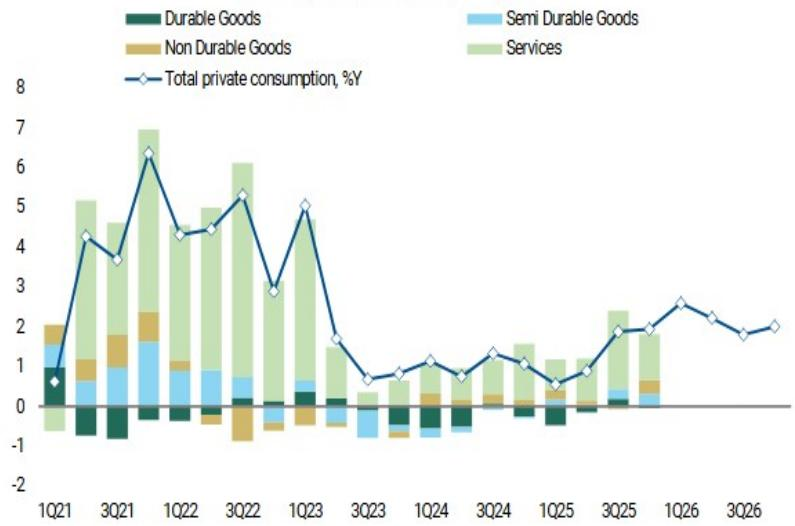

bar-line hybrid

| Quarter | Durable Goods (%) | Semi Durable Goods (%) | Non Durable Goods (%) | Services (%) | Total private consumption, %Y |
|---|---|---|---|---|---|
| 1Q21 | 0.8 | 0.5 | 0.4 | -0.5 | 0.7 |
| 2Q21 | -0.8 | 0.9 | 0.6 | 1.5 | 4.3 |
| 3Q21 | -0.6 | 1.0 | 0.7 | 1.8 | 3.7 |
| 4Q21 | -0.4 | 1.4 | 0.8 | 2.5 | 6.4 |
| 1Q22 | -0.3 | 0.7 | 0.3 | 2.5 | 4.3 |
| 2Q22 | -0.2 | 0.8 | -0.3 | 2.5 | 4.4 |
| 3Q22 | -0.1 | 0.6 | -0.8 | 3.0 | 5.3 |
| 4Q22 | 0.1 | 0.3 | -0.5 | 2.8 | 3.0 |
| 1Q23 | 0.3 | 0.4 | -0.4 | 2.5 | 5.0 |
| 2Q23 | 0.2 | -0.3 | -0.3 | 1.5 | 1.7 |
| 3Q23 | -0.1 | -0.6 | -0.4 | 0.5 | 0.6 |
| 4Q23 | -0.2 | -0.7 | -0.4 | 0.6 | 0.7 |
| 1Q24 | -0.3 | -0.8 | -0.4 | 0.7 | 1.1 |
| 2Q24 | -0.4 | -0.9 | -0.4 | 0.8 | 1.1 |
| 3Q24 | -0.5 | -1.0 | -0.4 | 0.9 | 1.3 |
| 4Q24 | -0.6 | -1.1 | -0.4 | 1.0 | 1.3 |
| 1Q25 | -0.7 | -1.2 | -0.4 | 1.1 | 1.1 |
| 2Q25 | -0.8 | -1.3 | -0.4 | 1.2 | 1.1 |
| 3Q25 | -0.9 | -1.4 | -0.4 | 1.3 | 1.9 |
| 4Q25E | -1.0 | -1.5 | -0.4 | 1.4 | 2.3 |
| 1Q26E | -1.1 | -1.6 | -0.4 | 1.5 | 2.6 |
| 2Q26E | -1.2 | -1.7 | -0.4 | 1.6 | 2.1 |
| 3Q26E | -1.3 | -1.8 | -0.4 | 1.7 | 2.1 |
The chart displays the percentage of total private consumption by year (as of Q4) for each quarter from Q1 to Q3 of the following year (from Q1 to Q3). The data is presented in a table format with columns for each category: 'Durable Goods' (dark green), 'Non Durable Goods' (orange), 'Services' (light green), and 'Total private consumption, %Y' (blue line with diamond markers). The values for the line are calculated based on the absolute percentage of total private consumption for each quarter and year respectively.

Source: BoK, MS forecasts

## Structural Factors Become Favorable for Wealth Effect From Equities

Retail investor stock ownership in Korea remains relatively high, nearly 50% of the adult population

% share of adult population with stock ownership  
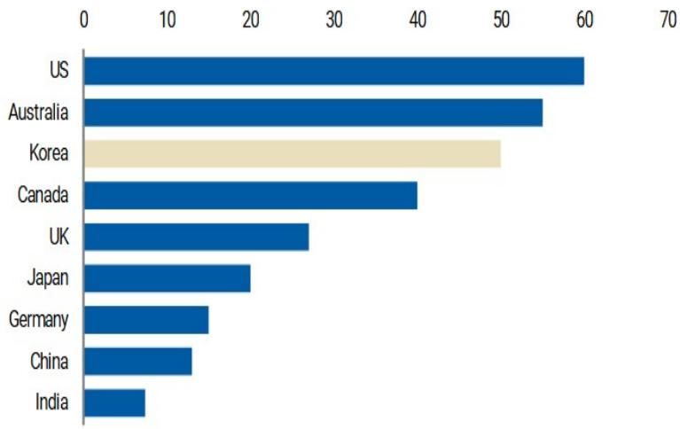

bar chart

| Country | Value |
| :--- | :--- |
| US | 60 |
| Australia | 55 |
| Korea | 50 |
| Canada | 40 |
| UK | 27 |
| Japan | 20 |
| Germany | 15 |
| China | 13 |
| India | 8 |

Liquidity in Korea's equity market remains ample, with a recent jump over the past two years

Korea: Securities investor deposits, KRW tn  
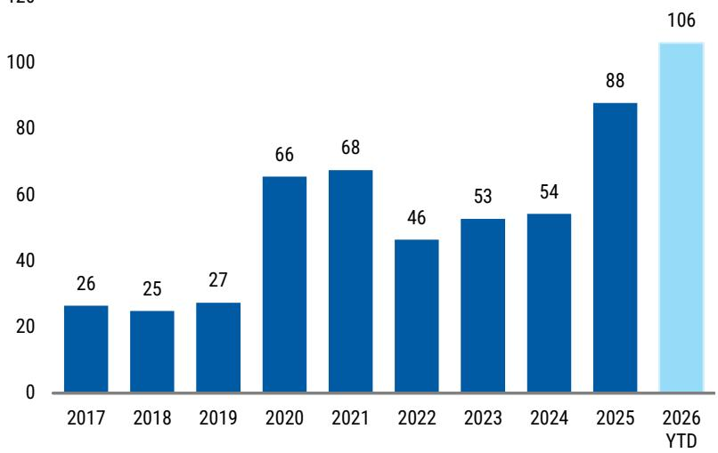

bar chart

| Year | Value |
| :--- | :--- |
| 2017 | 26 |
| 2018 | 25 |
| 2019 | 27 |
| 2020 | 66 |
| 2021 | 68 |
| 2022 | 46 |
| 2023 | 53 |
| 2024 | 54 |
| 2025 | 88 |
| 2026 YTD | 106 |

Source: CEIC, Korea Exchange, MS

## Supporting Strong Luxury Sales Growth

Wealth effect benefiting high-end consumption, especially luxury category sales  
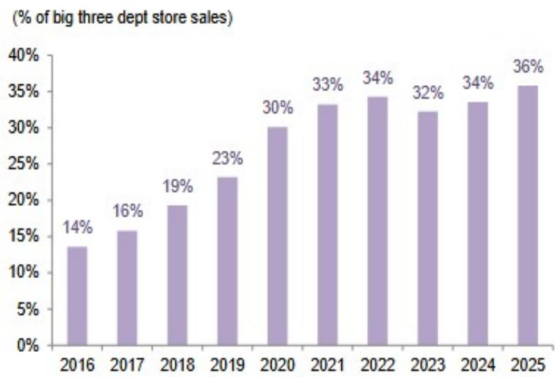

bar chart

(% of big three dept store sales)
| Year | (% of big three dept store sales) |
| :--- | :--- |
| 2016 | 14 |
| 2017 | 16 |
| 2018 | 19 |
| 2019 | 23 |
| 2020 | 30 |
| 2021 | 33 |
| 2022 | 34 |
| 2023 | 32 |
| 2024 | 34 |
| 2025 | 36 |

Luxury sales growth at department stores  
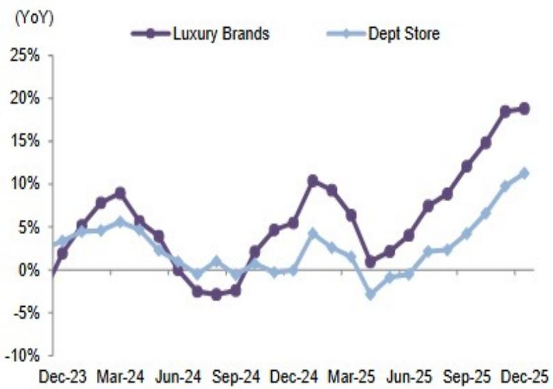

line chart

| Month    | Luxury Brands | Dept Store |
| -------- | ------------- | ---------- |
| Dec-23   | 0%            | 3%         |
| Mar-24   | 9%            | 6%         |
| Jun-24   | -3%           | 0%         |
| Sep-24   | -2%           | 1%         |
| Dec-24   | 10%           | 5%         |
| Mar-25   | 6%            | 2%         |
| Jun-25   | 2%            | 0%         |
| Sep-25   | 15%           | 5%         |
| Dec-25   | 19%           | 11%        |

Source: Company Data, MS estimates

## Uneven Wealth Gains across Income Groups

Overall wage growth below the long-term trend...  
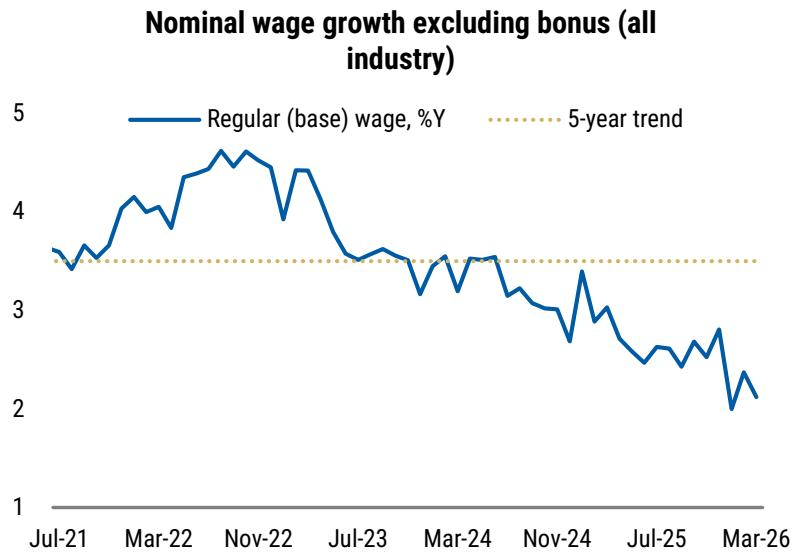

line chart

| Date   | Regular (base) wage, %Y |
|--------|--------------------------|
| Jul-21 | ~3.5                     |
| Mar-22 | ~4.0                     |
| Nov-22 | ~4.5                     |
| Jul-23 | ~3.5                     |
| Mar-24 | ~3.5                     |
| Nov-24 | ~3.0                     |
| Jul-25 | ~2.5                     |
| Mar-26 | ~2.0                     |

...But early year bonus has nearly tripled this year  
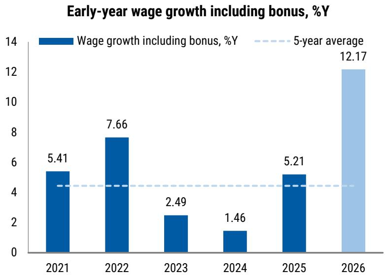

bar chart

| Year | Wage growth including bonus, %Y |
| ---- | ------------------------------ |
| 2021 | 5.41                           |
| 2022 | 7.66                           |
| 2023 | 2.49                           |
| 2024 | 1.46                           |
| 2025 | 5.21                           |
| 2026 | 12.17                          |

Source: MoEL, MS

## Uneven Wealth Gains across Income Groups

Labor income as a share of total household income has fallen in the past two years vs. return on assets

<table><tr><td>Korea nominal wage growth - total growth including bonus</td><td>2023</td><td>2024</td><td>2025</td><td>1Q26</td></tr><tr><td>Total wage including bonus, %Y</td><td>2.59</td><td>3.07</td><td>3.11</td><td>11.14</td></tr><tr><td>Mining and quarrying</td><td>0.56</td><td>5.91</td><td>0.10</td><td>5.49</td></tr><tr><td>Manufacturing</td><td>3.60</td><td>3.25</td><td>3.30</td><td>12.41</td></tr><tr><td>Electricity, gas, steam and water supply</td><td>6.47</td><td>6.40</td><td>2.57</td><td>(1.89)</td></tr><tr><td>Sew erage, waste management, materials recovery and remediation activities</td><td>3.07</td><td>3.37</td><td>2.54</td><td>2.18</td></tr><tr><td>Construction</td><td>4.00</td><td>3.01</td><td>2.70</td><td>21.80</td></tr><tr><td>Wholesale and retail trade</td><td>3.98</td><td>2.99</td><td>2.57</td><td>11.65</td></tr><tr><td>Transportation</td><td>4.04</td><td>3.51</td><td>3.57</td><td>6.31</td></tr><tr><td>Accommodation and food service activities</td><td>4.70</td><td>1.81</td><td>3.51</td><td>31.14</td></tr><tr><td>Information and communications</td><td>2.66</td><td>4.35</td><td>3.10</td><td>1.04</td></tr><tr><td>Financial and insurance activities</td><td>0.67</td><td>2.08</td><td>6.16</td><td>8.82</td></tr><tr><td>Real estate activities and renting and leasing</td><td>1.06</td><td>1.59</td><td>1.64</td><td>0.95</td></tr><tr><td>Professional, scientific and technical activities</td><td>1.79</td><td>3.55</td><td>2.89</td><td>9.32</td></tr><tr><td>Business facilities management and business support services</td><td>3.99</td><td>3.79</td><td>2.13</td><td>8.32</td></tr><tr><td>Education</td><td>2.04</td><td>2.94</td><td>2.35</td><td>5.56</td></tr><tr><td>Human health and social work activities</td><td>0.30</td><td>2.83</td><td>4.15</td><td>7.56</td></tr><tr><td>Arts, sports and recreation related services</td><td>(0.58)</td><td>1.87</td><td>1.92</td><td>13.71</td></tr><tr><td>Membership organizations, repair and other personal services</td><td>6.24</td><td>4.07</td><td>2.42</td><td>7.47</td></tr></table>

Source: BoK, MS

## CPI Inflation: From Supply-side to Services Build-up

We see an inflation trajectory above 2% through 2027; peaking in 2Q26  
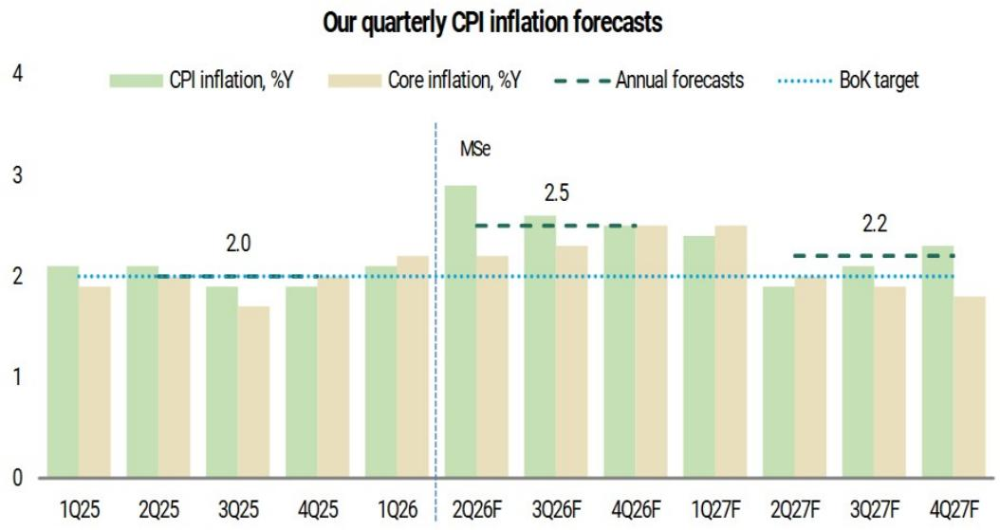

bar chart

| Quarter | CPI inflation, %Y | Core inflation, %Y |
|---------|-------------------|--------------------|
| 1Q25    | 2.1               | 1.9                |
| 2Q25    | 2.1               | 2.0                |
| 3Q25    | 1.9               | 1.7                |
| 4Q25    | 1.9               | 2.0                |
| 1Q26    | 2.1               | 2.2                |
| 2Q26F   | 2.9               | 2.2                |
| 3Q26F   | 2.6               | 2.3                |
| 4Q26F   | 2.5               | 2.5                |
| 1Q27F   | 2.4               | 2.5                |
| 2Q27F   | 1.9               | 2.0                |
| 3Q27F   | 2.0               | 1.9                |
| 4Q27F   | 2.3               | 1.8                |

Source: BoK, MS forecasts

We raise our CPI inflation forecast to 2.5% for this year with the peak at 2.9% in 2Q26.  
■ Reflecting the elevated energy prices and faster-than-expected domestic recovery story, we forecast CPI inflation at 2.5% and core inflation at 2.3% for 2026.  
While higher oil prices are yet to have been fully passed through to domestic services inflation in 1Q26 as the administered price smoothing and retail oil price caps are in place, we forecast CPI inflation to rise to 2.9%Y in 2Q26 before it stabilizes at 2.5% in 2H26.

## CPI Inflation: From Supply-side to Services Build-up

Demand-driven services inflation looks set to climb to the 2% level by 2H26 vs. 2.4% pre-Iran conflict

CPI inflation: Service prices  
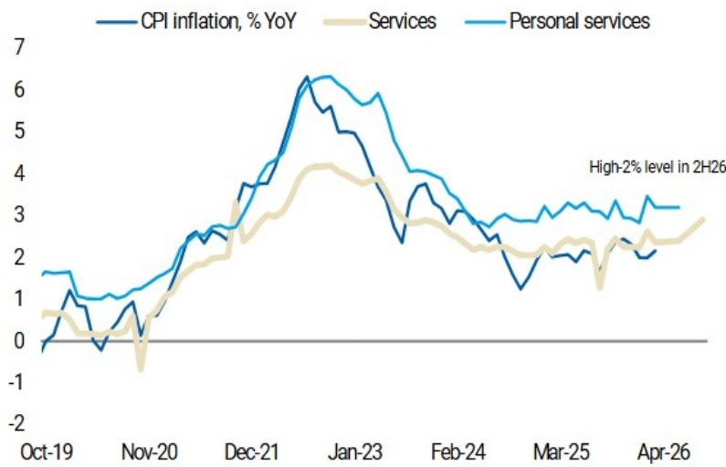

line chart

| Date    | CPI inflation, % YoY | Services | Personal services |
|---------|----------------------|----------|-------------------|
| High-2% | 2H26                 |          |                   |

Real rate extends further into negative territory as inflation expectations jump to 2.9% in April

BoK policy rate path and real interest rate trend  
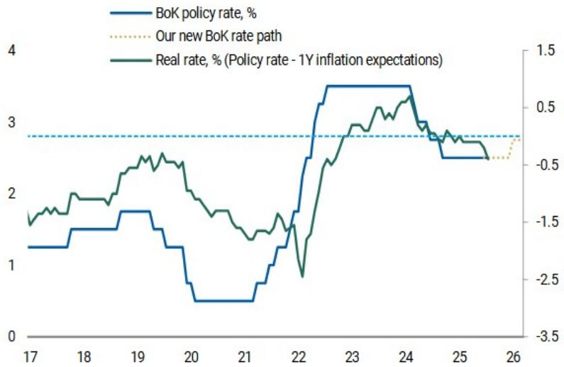

line chart

| Year | BoK policy rate, % | Our new BoK rate path | Real rate, % (Policy rate - 1Y inflation expectations) |
|------|---------------------|------------------------|--------------------------------------------------------|
| 17   | 1.3                 | -                      | 1.6                                                    |
| 18   | 1.4                 | -                      | 1.8                                                    |
| 19   | 1.5                 | -                      | 2.0                                                    |
| 20   | 0.5                 | -                      | 1.8                                                    |
| 21   | 0.5                 | -                      | 1.5                                                    |
| 22   | 1.5                 | -                      | 0.8                                                    |
| 23   | 3.5                 | -                      | 0.5                                                    |
| 24   | 3.5                 | -                      | 0.5                                                    |
| 25   | 2.5                 | -                      | 0.3                                                    |
| 26   | 2.5                 | -                      | 0.2                                                    |

Source: BoK, MS forecasts

## Fiscal Policy: Ample Revenue for Expansion

On the policy side, we see 2026 as the first full year of expansionary fiscal policy in four years. After the previous government's fiscal prudence agenda and the mid-year 2025 election, this will be the first year the government's expanded spending plan is fully in place, and the domestic economy should benefit as it recovers.

With weak growth backdrop, the government proposes record-high budget spending in 2026  
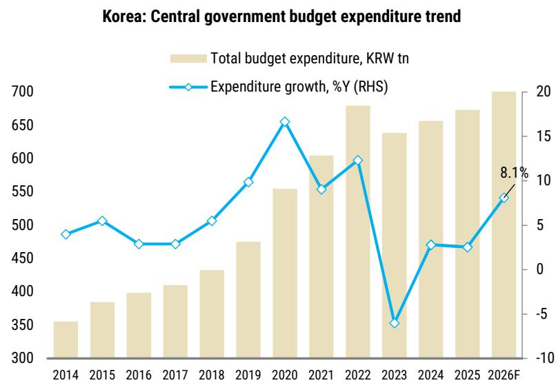

bar-line hybrid

Korea: Central government budget expenditure trend
| Year | Total budget expenditure, KRW tn (in KRW tn) | Expenditure growth, %Y (RHS) (%) |
| :--- | :--- | :--- |
| 2014 | 355 | 4.5 |
| 2015 | 385 | 5.5 |
| 2016 | 398 | 3.5 |
| 2017 | 408 | 3.5 |
| 2018 | 432 | 5.5 |
| 2019 | 475 | 8.0 |
| 2020 | 553 | 16.5 |
| 2021 | 603 | 5.5 |
| 2022 | 677 | 11.0 |
| 2023 | 640 | -6.5 |
| 2024 | 657 | 3.0 |
| 2025 | 671 | 2.5 |
| 2026F | 700 | 8.1 |

KTB issuance to rise marginally from this year  
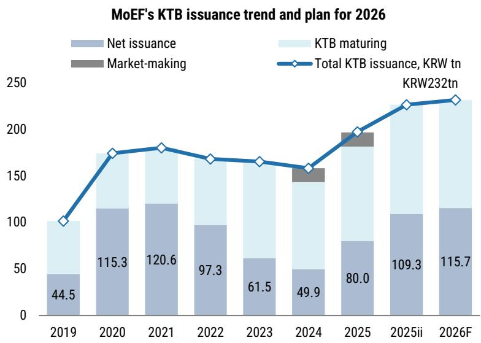

bar-line hybrid

MoEF's KTB issuance trend and plan for 2026
| Year | Net issuance (KRW tn) | Market-making (KRW tn) | KTB maturing (KRW tn) | Total KTB issuance, KRW tn (KRW tn) |
| :--- | :--- | :--- | :--- | :--- |
| 2019 | 44.5 | - | 60.0 | 100.0 |
| 2020 | 115.3 | - | 70.0 | 175.0 |
| 2021 | 120.6 | - | 65.0 | 180.0 |
| 2022 | 97.3 | - | 80.0 | 168.0 |
| 2023 | 61.5 | - | 105.0 | 165.0 |
| 2024 | 49.9 | 15.0 | 115.0 | 158.0 |
| 2025 | 80.0 | 35.0 | 135.0 | 198.0 |
| 2025ii | 109.3 | - | 145.0 | 225.0 |
| 2026F | 115.7 | - | 145.0 | 232.0 |

Source: MoEF, MS (F) forecasts

## Ample Revenue for Expansion

We think tax income could rise 8% more than the government's forecast, mostly on corporate tax increase

Tax income by major category  
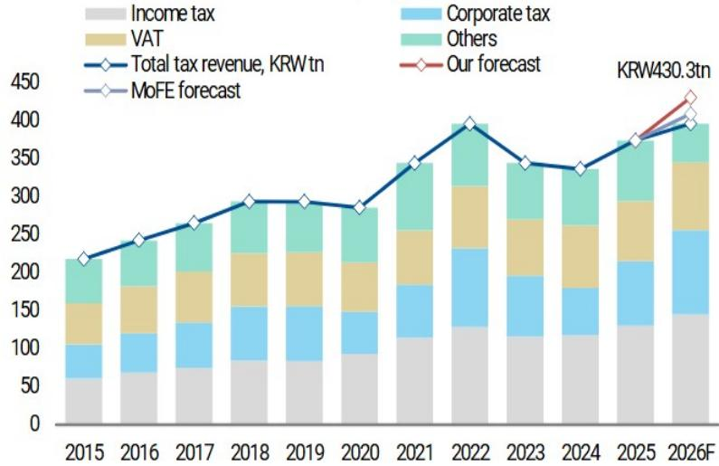

stacked bar chart

| Year | Income tax (in €m) | VAT (in €m) | Corporate tax (in €m) | Others (in €m) | Total tax revenue, KRWtn (€m) | MoFE forecast (€m) | Our forecast (€m) |
|---|---|---|---|---|---|---|---|
| 2015 | 60 | 50 | 40 | 50 | 210 | - | - |
| 2016 | 65 | 55 | 45 | 55 | 230 | - | - |
| 2017 | 70 | 60 | 50 | 60 | 250 | - | - |
| 2018 | 80 | 65 | 55 | 65 | 290 | - | - |
| 2019 | 80 | 70 | 60 | 70 | 290 | - | - |
| 2020 | 90 | 75 | 65 | 75 | 280 | - | - |
| 2021 | 110 | 80 | 75 | 85 | 340 | - | - |
| 2022 | 125 | 85 | 90 | 95 | 395 | - | - |
| 2023 | 115 | 80 | 75 | 75 | 345 | - | - |
| 2024 | 115 | 75 | 70 | 75 | 335 | - | - |
| 2025 | 125 | 80 | 85 | 85 | 375 | - | - |
| 2026F | 145 | 85 | 95 | 90 | 430.3 | - | KRW430.3tn |
The chart displays stacked bars for Income tax, VAT, Corporate tax, Others, and a red line for Total tax revenue (KRWtn). The data is presented in a table format with years as rows and tax revenue as columns.

Our tech team expects earnings to rise 7.8x for the two Korean chipmakers this year

Chipmakers' earnings outlook and corporate tax trajectory  
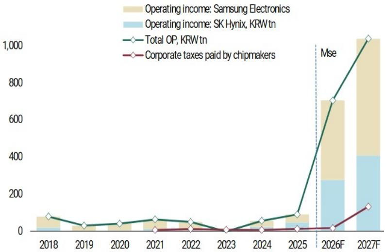

bar-line hybrid

| Year | Operating income: Samsung Electronics (in € million) | Operating income: SK Hynix, KRW tn (in million) | Total OP, KRW tn (in million) | Corporate taxes paid by chipmakers (in million) |
|---|---|---|---|---|
| 2018 | 60 | 15 | 75 | 0 |
| 2019 | 30 | 10 | 30 | 0 |
| 2020 | 30 | 10 | 40 | 0 |
| 2021 | 40 | 15 | 60 | 0 |
| 2022 | 40 | 15 | 50 | 0 |
| 2023 | 10 | 5 | 10 | 0 |
| 2024 | 50 | 20 | 60 | 0 |
| 2025 | 80 | 30 | 90 | 0 |
| Mse | 700 | 270 | 700 | 10 |
| 2026F | 450 | 270 | 450 | 15 |
| 2027F | 550 | 400 | 550 | 135 |

Source: MOFE, NABO, MS

## 2026 Expansionary Fiscal Policy

Budget allocation likely extended on household support and AI-related R&D spending  
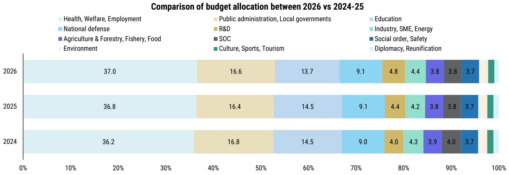

stacked bar chart

Comparison of budget allocation between 2026 vs 2024-25
| Year | Environment | Agriculture & Forestry, Fishery, Food | National defense | Public administration, Local governments | R&D | SOC | Education | Industry, SME, Energy | Social order, Safety | Culture, Sports, Tourism | Diplomacy, Reunification |
| :--- | :--- | :--- | :--- | :--- | :--- | :--- | :--- | :--- | :--- | :--- | :--- |
| 2026 | 37.0 | 3.8 | 9.1 | 16.6 | 4.8 | 3.8 | 3.8 | 4.4 | 3.8 | 3.7 | 1.1 |
| 2025 | 36.8 | 3.8 | 9.1 | 16.4 | 4.4 | 3.8 | 3.8 | 4.2 | 3.8 | 3.7 | 1.1 |
| 2024 | 36.2 | 3.9 | 9.0 | 16.8 | 4.0 | 3.9 | 4.0 | 4.3 | 3.7 | 3.7 | 1.1 |

Source: MoEF, MS

## Monetary Policy: All Signs Point to Hiking Path

We see four BoK hikes now, starting from 4Q26, to a terminal rate of 3.50% by mid-2027

BoK policy rate trajectory and neutral rate range  
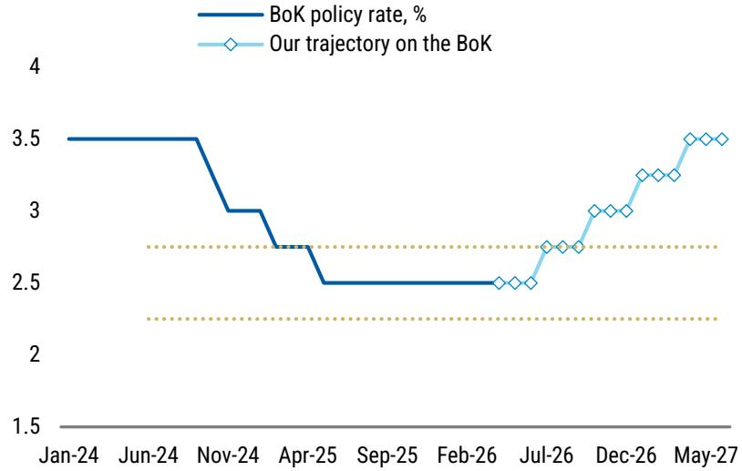

line chart

| Date    | BoK policy rate, % |
|---------|--------------------|
| Jan-24  | 3.5                |
| Jun-24  | 3.5                |
| Nov-24  | 3.0                |
| Apr-25  | 2.5                |
| Sep-25  | 2.5                |
| Feb-26  | 2.5                |
| Jul-26  | 2.5                |
| Dec-26  | 3.0                |
| May-27  | 3.5                |

Source: BoK, MS

- On the monetary side, we expect four hikes in this cycle, taking the terminal rate to 3.5% by 2Q27.  
We expect the first hike in July, followed by October, January, and April 2027.  
- The BoK's renewed confidence in fundamentals-driven growth and sustained inflation – rather than a transient rebound – leads us to shift our view from an incremental hiking cycle to an earlier and longer one.  
While we do not rule out back-to-back hikes this year, the BoK's core inflation forecast – remaining elevated at 2.4% and 2.3% through next year – supports a sustained move deeper into tightening territory rather than a rapidly front-loaded path.

## Confident on Growth, Rushing to Hike on Inflation

A sharp turn to higher rate projection signals an immediate start to the hiking cycle and potentially a longer-lasting one

BoK MPC dot plot: Next 6M conditional policy rate projection (May 2026)  
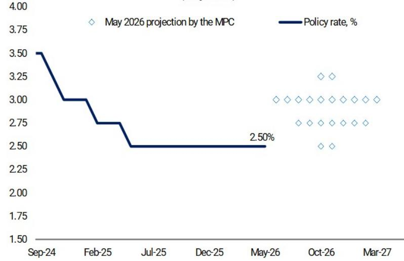

line chart

| Date    | Policy rate, % |
|---------|----------------|
| Sep-24  | 3.50           |
| Feb-25  | 3.00           |
| Jul-25  | 2.50           |
| Dec-25  | 2.50           |
| May-26  | 3.00           |
| Oct-26  | 3.25           |
| Mar-27  | 3.00           |

BoK's growth forecast is in line with our expectations at $2.6\%$ for the next year while its inflation forecast looks stickier at $2.7\%$ vs. our forecast of $2.5\%$ ; Its core inflation forecast at $2.3\%$ next year is notable

BoK's macro forecasts on growth and inflation  
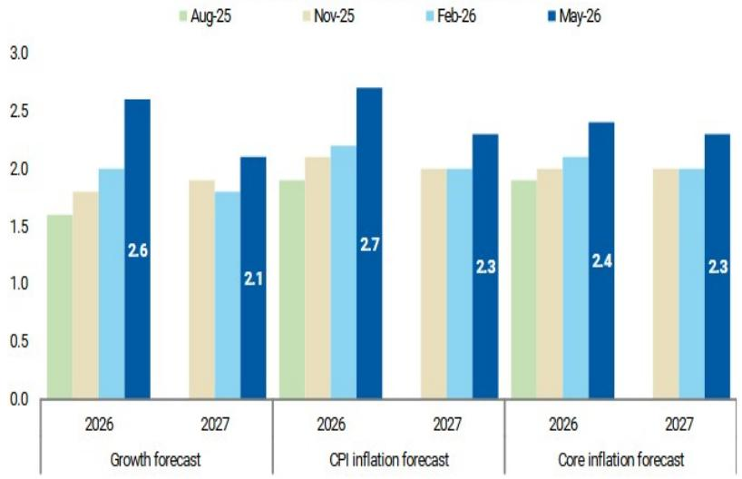

bar chart

| Category | Period | Value |
|---|---|---|
| Growth forecast | Aug-25 | 1.6 |
| Growth forecast | Nov-25 | 1.8 |
| Growth forecast | Feb-26 | 2.0 |
| Growth forecast | May-26 | 2.6 |
| Growth forecast | Aug-27 | 2.1 |
| CPI inflation forecast | Aug-25 | 1.9 |
| CPI inflation forecast | Nov-25 | 2.1 |
| CPI inflation forecast | Feb-26 | 2.2 |
| CPI inflation forecast | May-26 | 2.7 |
| Core inflation forecast | Aug-25 | 1.9 |
| Core inflation forecast | Nov-25 | 2.0 |
| Core inflation forecast | Feb-26 | 2.0 |
| Core inflation forecast | May-26 | 2.3 |
| Core inflation forecast | Aug-27 | 1.9 |
| Core inflation forecast | Nov-25 | 2.0 |
| Core inflation forecast | Feb-26 | 2.1 |
| Core inflation forecast | May-26 | 2.4 |
| Core inflation forecast | Aug-27 | 2.0 |
| Core inflation forecast | Nov-25 | 2.0 |
| Core inflation forecast | Feb-26 | 2.0 |
| Core inflation forecast | May-26 | 2.3 |

Source: Haver, MS

## Wealth Effect: Implications for CPI Inflation and Monetary Policy

Amplified wealth effect likely implies inflationary pressure build-up; KOSPI move highly correlated with a statistical lead of 15-18 months

Korea: CPI inflation trend and KOSPI performance since 2001  
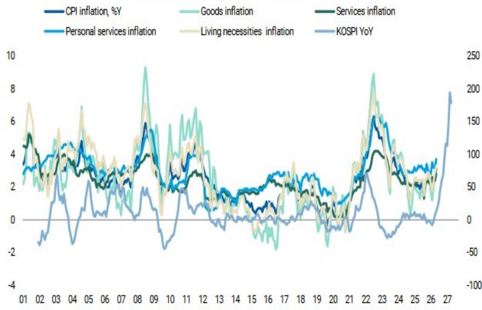

line chart

| Year | CPI inflation, %Y | Goods inflation | Services inflation | Personal services inflation | Living necessities inflation | KOSPI YoY |
|------|-------------------|-----------------|--------------------|------------------------------|------------------------------|---------|
| 01   | ~3.5              | ~4.5            | ~5.0               | ~3.0                         | ~7.0                         | ~-10    |
| 02   | ~3.0              | ~4.0            | ~4.5               | ~2.5                         | ~6.5                         | ~-5     |
| 03   | ~3.5              | ~4.5            | ~5.0               | ~3.0                         | ~7.0                         | ~0      |
| 04   | ~4.0              | ~5.0            | ~5.5               | ~3.5                         | ~7.5                         | ~5      |
| 05   | ~4.5              | ~5.5            | ~6.0               | ~4.0                         | ~8.0                         | ~10     |
| 06   | ~5.0              | ~6.0            | ~6.5               | ~4.5                         | ~8.5                         | ~15     |
| 07   | ~5.5              | ~6.5            | ~7.0               | ~5.0                         | ~9.0                         | ~20     |
| 08   | ~6.0              | ~7.0            | ~7.5               | ~5.5                         | ~9.5                         | ~25     |
| 09   | ~6.5              | ~7.5            | ~8.0               | ~6.0                         | ~10.0                        | ~30     |
| 10   | ~7.0              | ~8.0            | ~8.5               | ~6.5                         | ~10.5                        | ~35     |
| 11   | ~7.5              | ~8.5            | ~9.0               | ~7.0                         | ~11.0                        | ~40     |
| 12   | ~8.0              | ~9.0            | ~9.5               | ~7.5                         | ~11.5                        | ~45     |
| 13   | ~8.5              | ~9.5            | ~10.0              | ~8.0                         | ~12.0                        | ~50     |
| 14   | ~9.0              | ~10.0           | ~10.5              | ~8.5                         | ~12.5                        | ~55     |
| 15   | ~9.5              | ~10.5           | ~11.0              | ~9.0                         | ~13.0                        | ~60     |
| 16   | ~10.0             | ~11.0           | ~11.5              | ~9.5                         | ~13.5                        | ~65     |
| 17   | ~10.5             | ~11.5           | ~12.0              | ~10.0                        | ~14.0                        | ~70     |
| 18   | ~11.0             | ~12.0           | ~12.5              | ~10.5                        | ~14.5                        | ~75     |
| 19   | ~11.5             | ~12.5           | ~13.0              | ~11.0                        | ~15.0                        | ~80     |
| 20   | ~12.0             | ~13.0           | ~13.5              | ~11.5                        | ~15.5                        | ~85     |
| 21   | ~12.5             | ~13.5           | ~14.0              | ~12.0                        | ~16.0                        | ~90     |
| 22   | ~13.0             | ~14.0           | ~14.5              | ~12.5                        | ~16.5                        | ~95     |
| 23   | ~13.5             | ~14.5           | ~15.0              | ~13.0                        | ~17.0                        | ~100    |
| 24   | ~14.0             | ~15.0           | ~15.5              | ~13.5                        | ~17.5                        | ~105    |
| 25   | ~14.5             | ~15.5           | ~16.0              | ~14.0                        | ~18.0                        | ~110    |
| 26   | ~15.0             | ~16.0           | ~16.5              | ~14.5                        | ~18.5                        | ~115    |
| 27   | ~16.0             | ~17.0           | ~17.5              | ~15.0                        | ~200                         | ~220    |

We expect a hiking cycle to start from July 2026 through mid-2027

Policy rate forecast on the BoK & Fed  
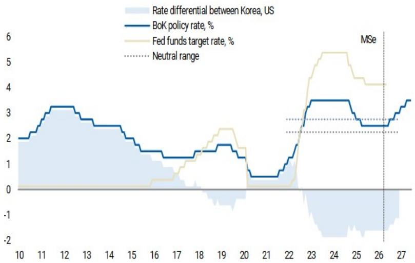

line chart

| Year | BoK policy rate, % | Fed funds target rate, % | Neutral range |
|------|---------------------|---------------------------|---------------|
| 10   | 2.0                 | 0.0                       | 0.0           |
| 11   | 2.5                 | 0.0                       | 0.0           |
| 12   | 3.0                 | 0.0                       | 0.0           |
| 13   | 2.8                 | 0.0                       | 0.0           |
| 14   | 2.5                 | 0.0                       | 0.0           |
| 15   | 2.0                 | 0.0                       | 0.0           |
| 16   | 1.5                 | 0.0                       | 0.0           |
| 17   | 1.2                 | 0.5                       | 0.0           |
| 18   | 1.5                 | 1.0                       | 0.0           |
| 19   | 1.8                 | 2.5                       | 0.0           |
| 20   | 1.5                 | 1.5                       | 0.0           |
| 21   | 0.5                 | 0.5                       | 2.5           |
| 22   | 1.0                 | 1.5                       | 2.5           |
| 23   | 3.5                 | 5.5                       | 2.5           |
| 24   | 3.5                 | 5.5                       | 2.5           |
| 25   | 3.0                 | 4.5                       | 2.5           |
| 26   | 2.5                 | 4.0                       | 2.5           |
| 27   | 3.5                 | 4.0                       | 2.5           |

Source: BoK, Fed, MS forecasts

## Household Debt Overall Slowing Down

Korea's YoY Household debt growth has remained under $3\%$ over the past 3 years

Korea: Household debt trend  
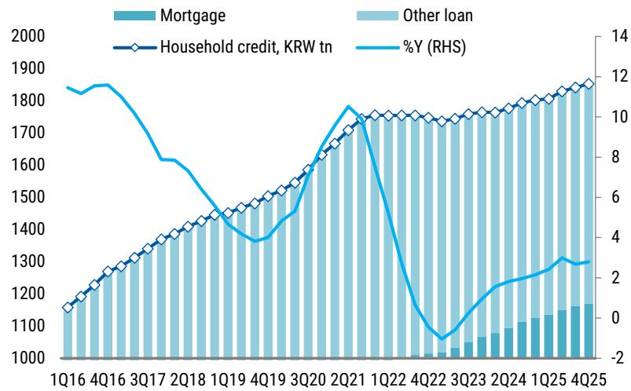

Mortgage debt growth has been the main driver of marginal debt increase

Quarterly changes: mortgage vs other loans  
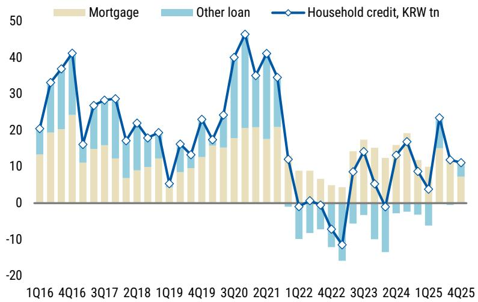

bar-line hybrid chart

| Quarter | Mortgage | Other loan | Household credit, KRW tn |
|---------|----------|------------|---------------------------|
| 1Q16    | 13       | 8          | 20                        |
| 2Q16    | 20       | 10         | 35                        |
| 3Q16    | 24       | 12         | 41                        |
| 4Q16    | 20       | 15         | 38                        |
| 1Q17    | 15       | 10         | 27                        |
| 2Q17    | 16       | 10         | 29                        |
| 3Q17    | 15       | 10         | 28                        |
| 4Q17    | 14       | 10         | 27                        |
| 1Q18    | 12       | 8          | 22                        |
| 2Q18    | 10       | 8          | 20                        |
| 3Q18    | 9        | 8          | 19                        |
| 4Q18    | 8        | 8          | 18                        |
| 1Q19    | 7        | 7          | 17                        |
| 2Q19    | 6        | 7          | 16                        |
| 3Q19    | 5        | 7          | 15                        |
| 4Q19    | 4        | 7          | 14                        |
| 1Q20    | 3        | 7          | 13                        |
| 2Q20    | 2        | 7          | 12                        |
| 3Q20    | 1        | 7          | 11                        |
| 4Q20    | 0        | 7          | 10                        |
| 1Q21    | -1       | -7         | -5                        |
| 2Q21    | -2       | -8         | -6                        |
| 3Q21    | -3       | -9         | -7                        |
| 4Q21    | -4       | -10        | -8                        |
| 1Q22    | -5       | -11        | -9                        |
| 2Q22    | -6       | -12        | -10                       |
| 3Q22    | -7       | -13        | -11                       |
| 4Q22    | -8       | -14        | -12                       |
| 1Q23    | -9       | -15        | -13                       |
| 2Q23    | -10      | -16        | -14                       |
| 3Q23    | -11      | -17        | -15                       |
| 4Q23    | -12      | -18        | -16                       |
| 1Q24    | -13      | -19        | -17                       |
| 2Q24    | -14      | -20        | -18                       |
| 3Q24    | -15      | -21        | -19                       |
| 4Q24    | -16      | -22        | -20                       |
| 1Q25    | -17      | -23        | -21                       |
| 2Q25    | -18      | -24        | -22                       |
| 3Q25    | -19      | -25        | -23                       |
| 4Q25    | -20      | -26        | -24                       |

Source: BoK, MS

## Korea Renaissance:

## Is the Household Asset Move to Equities Sustainable? Possibly

# Korean Households' Asset Reallocation Has Been an Ongoing Trend

Korean household balance sheets are undergoing a major shift. Equity holdings are surging, as a long-standing bias towards cash fades. With property accumulation facing policy headwinds and the stock market set for positive catalysts, we see retail investors' participation in equities continuing.

After accumulating wealth primarily through real estate, household equity holdings surged 48%Y in 2025, a striking inflection in appetite for risk assets  
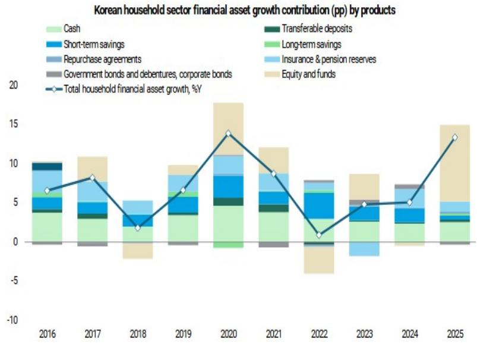

bar-line hybrid

Korean household sector financial asset growth contribution (pp) by products
| Year | Cash (%) | Short-term savings (%) | Repurchase agreements (%) | Government bonds and debentures, corporate bonds (%) | Transferable deposits (%) | Long-term savings (%) | Insurance & pension reserves (%) | Equity and funds (%) | Total household financial asset growth, %Y |
|---|---|---|---|---|---|---|---|---|---|
| 2016 | 3.5 | 1.5 | 2.0 | -0.5 | 0.5 | 0.5 | 1.0 | 0.0 | 6.5 |
| 2017 | 3.0 | 1.5 | 1.5 | -0.5 | 0.5 | 0.5 | 1.0 | 0.0 | 8.0 |
| 2018 | 2.0 | 1.0 | 0.5 | -0.5 | 0.5 | 0.5 | 1.0 | -2.0 | 1.5 |
| 2019 | 3.0 | 1.5 | 1.0 | -0.5 | 0.5 | 0.5 | 1.0 | 0.0 | 6.5 |
| 2020 | 4.5 | 3.0 | 2.0 | -1.0 | 1.0 | 1.0 | 1.5 | 17.5 | 13.5 |
| 2021 | 3.5 | 1.5 | 1.5 | -0.5 | 0.5 | 0.5 | 1.5 | 12.0 | 9.0 |
| 2022 | -0.5 | -0.5 | -1.0 | -3.0 | -0.5 | -0.5 | -1.0 | -4.0 | 0.5 |
| 2023 | 2.5 | 1.5 | -2.0 | -0.5 | 0.5 | 0.5 | -1.0 | 8.5 | 4.5 |
| 2024 | 2.5 | 1.5 | -1.5 | -0.5 | 0.5 | 0.5 | -1.0 | 7.0 | 4.5 |
| 2025 | 2.5 | 1.5 | -1.5 | -0.5 | 0.5 | 0.5 | -1.0 | 14.5 | 13.5 |
The chart displays a line graph representing the total household financial asset growth, %Y for each year from 2016 to 2025.

Source: BoK, FSC, MoDS, MS

## Key takeaways

- Household asset composition in Korea is undergoing a meaningful structural shift into risk assets, with equity holdings extending their sharp rise since 2025.  
- Housing unaffordability and tight credit policy contrasted by stock-market reform measures are behind the transition to an alternative wealth-building vehicle.  
- Both positive and negative economic implications are at play: wealth effect to help consumption, while high exposure to volatility risks the reverse effect.  
- The tendencies of Korean retail investors toward equity investing appear to be evolving in a positive way, but leverage needs to be managed.  
We expect retail investor engagement to be sustained, but investors' expanded scope could be a double-edged sword. We raise our KOSPI target to 9,000.

## Heavy Bias Toward Real Assets Coming from Lack of Retirement Safety Net

Real estate assets across main and other residences composed 67% of total household assets back in 2015

Household asset breakdown by sub-category (2015)  
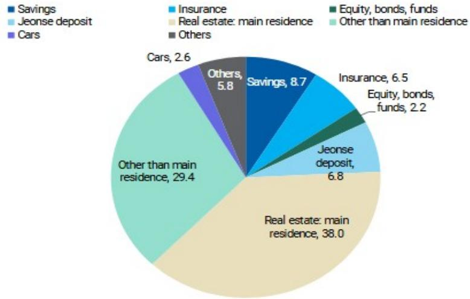

pie chart

| Category | Value |
|---|---|
| Savings | 8.7 |
| Insurance | 6.5 |
| Equity, bonds, funds | 2.2 |
| Jeons deposit | 6.8 |
| Real estate: main residence | 38.0 |
| Other than main residence | 29.4 |
| Cars | 2.6 |
| Others | 5.8 |

The share rose to 70% while the size of total assets nearly doubled in the past decade through 2025

Household asset breakdown by sub-category (2025)  
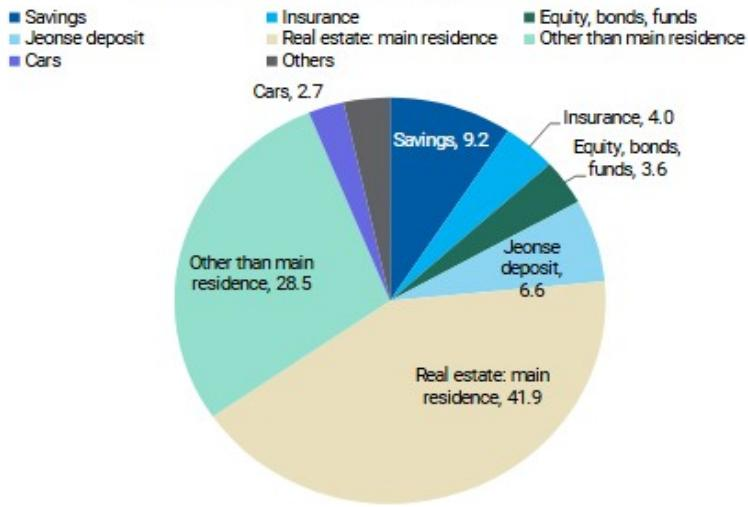

pie chart

| Category | Value |
|---|---|
| Savings | 9.2 |
| Jeons deposit | 6.6 |
| Cars | 2.7 |
| Insurance | 4.0 |
| Equity, bonds, funds | 3.6 |
| Real estate: main residence | 41.9 |
| Other than main residence | 28.5 |

Source: BoK, CEIC, MS

## Real Assets a de facto Retirement Savings Instrument

Korean households' real asset share exceeded trend compared to other economies

Share of real assets to total household assets (2024)  
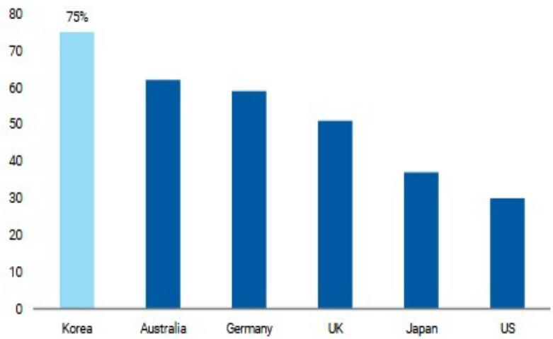

bar chart

| Country | Value (%) |
| :--- | :--- |
| Korea | 75 |
| Australia | 62 |
| Germany | 59 |
| UK | 51 |
| Japan | 37 |
| US | 30 |

Real assets likely substituted for the low-funded pension and post-retirement income

Share of pension and insurance to total household assets (2024)  
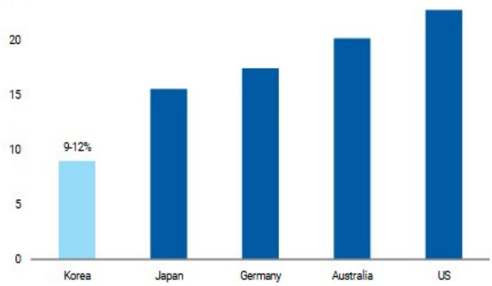

bar chart

| Country | Value |
| :--- | :--- |
| Korea | 9-12% |
| Japan | 15.5 |
| Germany | 17.3 |
| Australia | 20.1 |
| US | 23.4 |

Source: BoK, ESRI, Bundesbank, FRED, MS

## Wealthier Households Shift Faster from Concentrated Holdings of Real Assets

Wealthier households showed a stronger preference to holding real estate: 77% vs. medium-income of 66.8% vs. 26.5% for bottom income households; Yet, this long-entrenched bias toward real assets among wealthier households has shown signs of rotation in recent years.

Household asset breakdown by income groups  
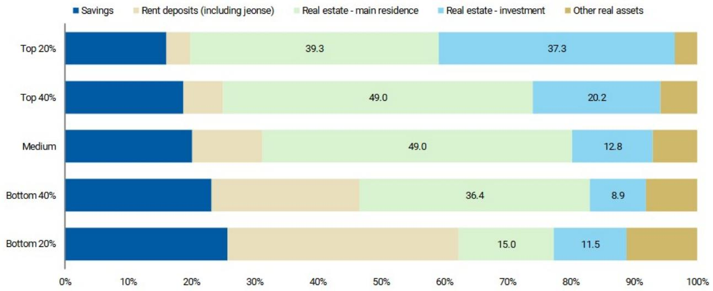

stacked bar chart

| Category | Savings (%) | Rent deposits (including jeonse) (%) | Real estate - main residence (%) | Real estate - investment (%) | Other real assets (%) |
| :--- | :--- | :--- | :--- | :--- | :--- |
| Top 20% | 16.0 | 5.3 | 39.3 | 37.3 | 3.8 |
| Top 40% | 18.7 | 7.6 | 49.0 | 20.2 | 5.6 |
| Medium | 20.0 | 11.0 | 49.0 | 12.8 | 6.5 |
| Bottom 40% | 23.0 | 21.0 | 36.4 | 8.9 | 8.5 |
| Bottom 20% | 26.0 | 31.0 | 15.0 | 11.5 | 11.5 |

Source: Korea Statistics (2025 Household Financial Conditions Survey), MS

## Economic Implications of Household Asset Shift

With the structural shift toward equity investments that we believe is underway, we see this transition carrying a wide range of positive and negative implications for the real economy. Transitions carry notable implications for consumption, financial stability, inflation as well as monetary policy, in our view, amid the broadening of the investor base and scale-up in total equity holdings newly featured in the past 4-5 years that did not exist to the same degree pre-2020.

The number of retail investors increased to 50% of total adult population vs. 21% in 2019

43% of retail investors are aged 40s or below, groups with a higher marginal propensity to consume

Number of retail investors and % to adult population  
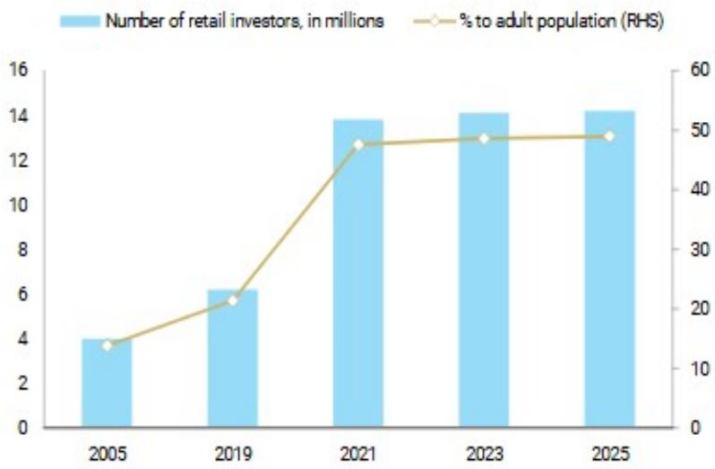

bar-line hybrid

| Year | Number of retail investors, in millions | % to adult population (RHS) |
|---|---|---|
| 2005 | 4 | 15 |
| 2019 | 6 | 25 |
| 2021 | 14 | 48 |
| 2023 | 14 | 49 |
| 2025 | 14 | 49 |

% share of retail investors by age group (2025)  
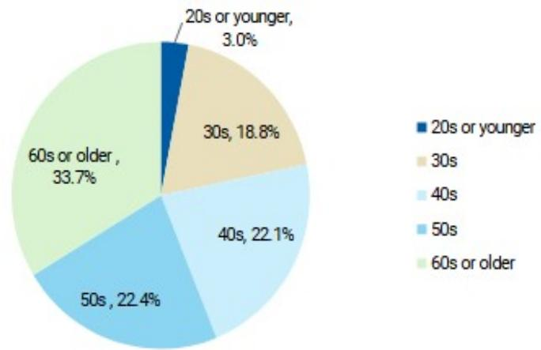

pie chart

| Age Group | Percentage (%) |
| :--- | :--- |
| 20s or younger | 3.0 |
| 30s | 18.8 |
| 40s | 22.1 |
| 50s | 22.4 |
| 60s or older | 33.7 |

Source: Korea Statistics (2025 Household Financial Conditions Survey), MS

## Positive Implications: (1) Amplified Positive Wealth Effect

Historically, a 1% gain in the KOSPI implied a boost to consumption growth of approximately 0.03-0.035%p

Korea: Private consumption and equity market performance  
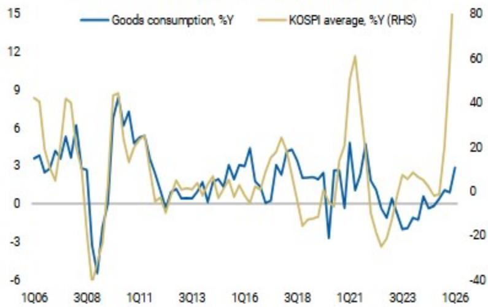

line chart

| Quarter | Goods consumption, %Y | KOSPI average, %Y (RHS) |
| ------- | --------------------- | ------------------------ |
| 1Q06    | ~3                    | ~40                      |
| 3Q08    | ~-6                   | ~-40                     |
| 1Q11    | ~9                    | ~50                      |
| 3Q13    | ~0                    | ~0                       |
| 1Q16    | ~3                    | ~20                      |
| 3Q18    | ~2                    | ~0                       |
| 1Q21    | ~5                    | ~60                      |
| 3Q23    | ~-2                   | ~-20                     |
| 1Q26    | ~3                    | ~80                      |

Along with goods consumption, services has shown a higher response to KOSPI performance in the recent quarters

Korea: Private consumption and equity market performance  
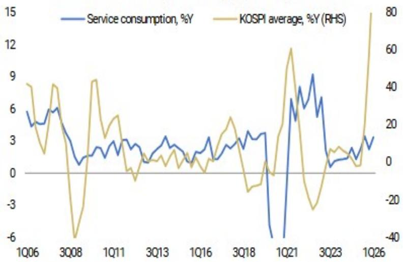

line chart

| Quarter | Service consumption, %Y | KOSPI average, %Y (RHS) |
| ------- | ---------------------- | ----------------------- |
| 1Q06    | ~5.5                   | ~80                     |
| 3Q08    | ~1.5                   | ~-60                    |
| 1Q11    | ~2.5                   | ~90                     |
| 3Q13    | ~2.0                   | ~-10                    |
| 1Q16    | ~2.5                   | ~-5                     |
| 3Q18    | ~3.0                   | ~-20                    |
| 1Q21    | ~-6.0                  | ~60                     |
| 3Q23    | ~1.0                   | ~-30                    |
| 1Q26    | ~3.0                   | ~80                     |

Source: Bloomberg, BoK, MS

## (2) Reduced Systemic Leverage and Asset Skewness to Real Estate

Stronger growth and inflation forecasts for this year offset by weaker outlook next year

Asset skewness across sectors in Korea  
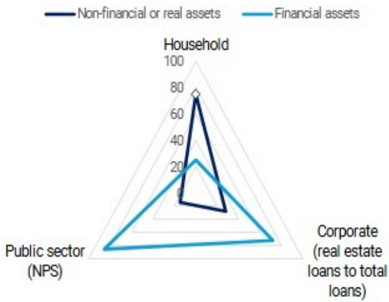

radar chart

| Category | Non-financial or real assets | Financial assets |
| -------- | ---------------------------- | ---------------- |
| Household | 75 | 25 |
| Public sector (NPS) | 10 | 40 |
| Corporate (real estate loans to total loans) | 25 | 40 |

The outlook for both consumption and exports weakens in 2H26 vs. 1H26

Household Debt-to-GDP ratio trajectory  
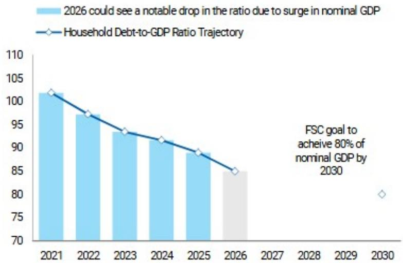

bar-line hybrid chart

| Year | Household Debt-to-GDP Ratio |
| :--- | :--- |
| 2021 | 102 |
| 2022 | 97 |
| 2023 | 94 |
| 2024 | 92 |
| 2025 | 89 |
| 2026 | 85 |
FSC goal to achieve 80% of nominal GDP by 2030

Source: Korea Statistics (2025 Household Financial Conditions Survey), MS

## (3) Diversifying Household Income Channels Beyond Labor and Real Asset Returns

Income breakdown across labor, financial and real asset returns show a heavy dependency on labor income

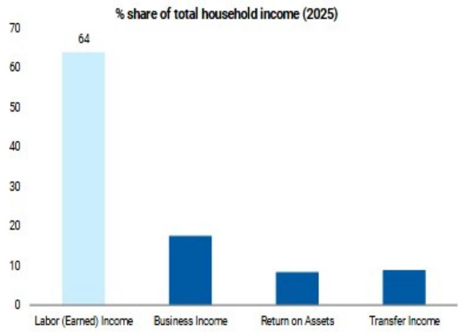

bar chart

% share of total household income (2025)
| Category | Value (%) |
|---|---|
| Labor (Earned) Income | 64 |
| Business Income | 17 |
| Return on Assets | 8 |
| Transfer Income | 9 |

Households' dividend income shows an up-trend, yet remains relatively low at 2.2% of total disposable income

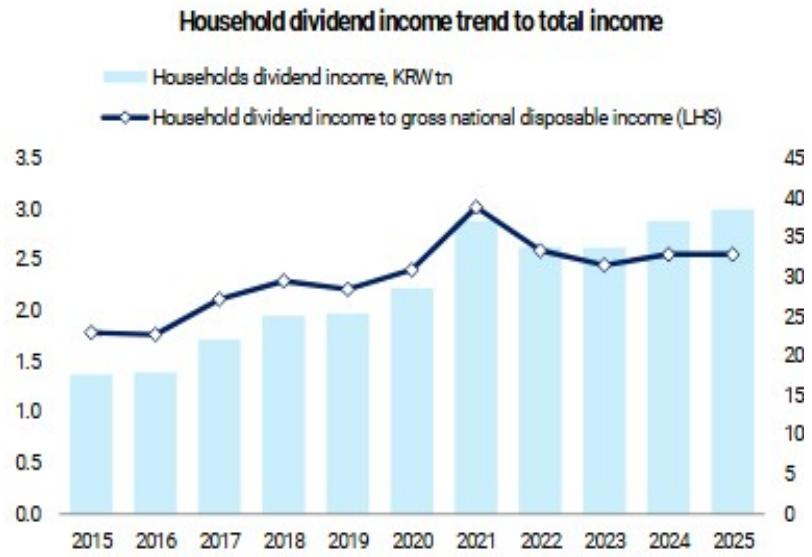

bar-line hybrid

Household dividend income trend to total income
| Year | Households dividend income, KRW tn (KRW tn) | Household dividend income to gross national disposable income (LHS) |
| :--- | :--- | :--- |
| 2015 | 1.38 | 24 |
| 2016 | 1.39 | 24 |
| 2017 | 1.71 | 28 |
| 2018 | 1.95 | 30 |
| 2019 | 1.98 | 29 |
| 2020 | 2.21 | 31 |
| 2021 | 2.98 | 40 |
| 2022 | 2.57 | 35 |
| 2023 | 2.63 | 33 |
| 2024 | 2.89 | 34 |
| 2025 | 3.01 | 34 |

Source: BoK, Korea Statistics, MS

## Negative Implications: (1) Heightened Exposure to Market Volatility

As Korean households already carry a large debt burden, a period of elevated equity market exposure could stretch liquidity, slow consumption, and increase debt-service stress. The scale of equity asset accumulation on Korean households' balance sheets reached a record high, 61% of nominal GDP, from the previous five-year trend of 45%. By 2027, we estimate that this is likely to grow to over 81% of nominal GDP. This would heighten households' sensitivity to equity market volatility.

ETF flows have been one of the key drivers of the domestic equity market; ETFs can be a double-edged sword: on the way up, they are a catalyst, but they could have the same effect on the way down. We will have to monitor the flows closely

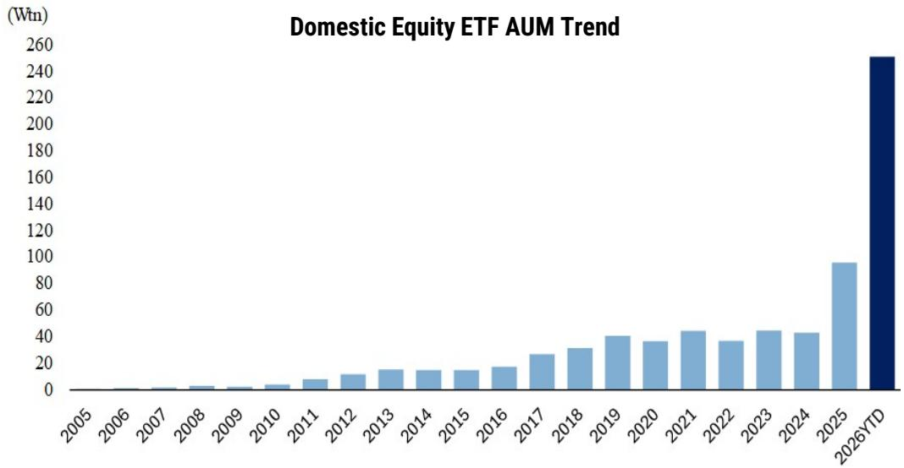

bar chart

Domestic Equity ETF AUM Trend
| Year | Value (Wtn) |
|---|---|
| 2005 | 0 |
| 2006 | 1 |
| 2007 | 2 |
| 2008 | 3 |
| 2009 | 4 |
| 2010 | 5 |
| 2011 | 8 |
| 2012 | 12 |
| 2013 | 15 |
| 2014 | 14 |
| 2015 | 14 |
| 2016 | 17 |
| 2017 | 27 |
| 2018 | 31 |
| 2019 | 41 |
| 2020 | 36 |
| 2021 | 45 |
| 2022 | 36 |
| 2023 | 45 |
| 2024 | 43 |
| 2025 | 96 |
| 2026YTD | 250 |

Source: WiseFN, MS, Data as of Jun 2, 2026

## (2) Risks around Asymmetry in Reverse Wealth Effect

Share of equity assets held by households set to reach the highest level, at 35% of total financial assets

Equity holding exposure to total household assets  
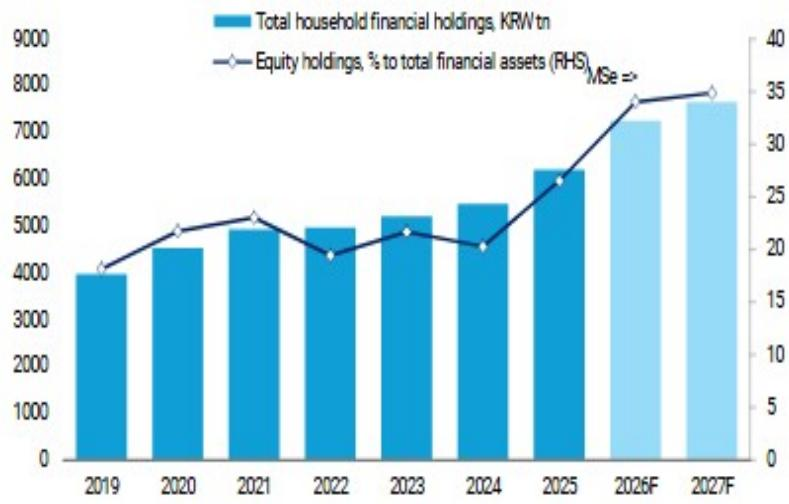

bar-line hybrid

| Year | Total household financial holdings, KRW tn | Equity holdings, % to total financial assets (RHS), MSe = |
|---|---|---|
| 2019 | 3950 | 18 |
| 2020 | 4500 | 22 |
| 2021 | 4900 | 24 |
| 2022 | 4950 | 19 |
| 2023 | 5200 | 21 |
| 2024 | 5450 | 20 |
| 2025 | 6150 | 26 |
| 2026F | 7200 | 34 |
| 2027F | 7600 | 35 |

This likely extends the size to over 80% of nominal GDP by 2027 vs. 61% in 2025 and 43% in 2024

Share of household sector equity holding to nominal GDP  
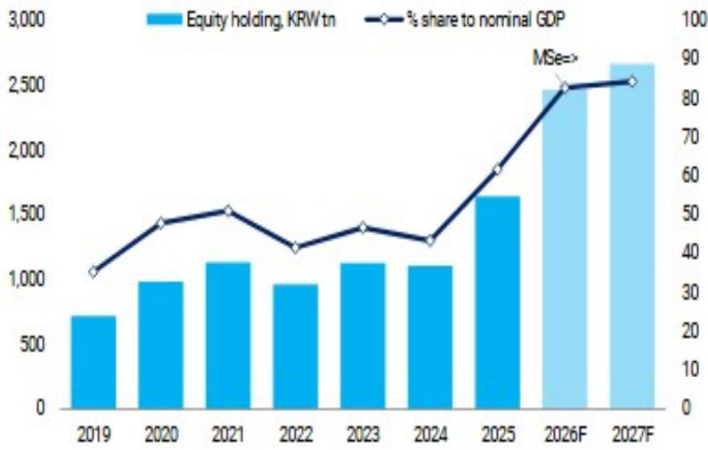

bar-line hybrid

| Year   | Equity holding, KRW tn | % share to nominal GDP |
| ------ | ---------------------- | ---------------------- |
| 2019   | 700                    | 35                     |
| 2020   | 1000                   | 45                     |
| 2021   | 1150                   | 50                     |
| 2022   | 950                    | 40                     |
| 2023   | 1100                   | 45                     |
| 2024   | 1100                   | 40                     |
| 2025   | 1650                   | 60                     |
| 2026F  | 2500                   | 85                     |
| 2027F  | 2700                   | 85                     |

Source: BoK, MS forecasts

## (3) Higher Sensitivity to Tighter Financial Conditions

Households' sensitivity to rising interest rates adds pressure to their already high leverage

Korea: Household debt trend  
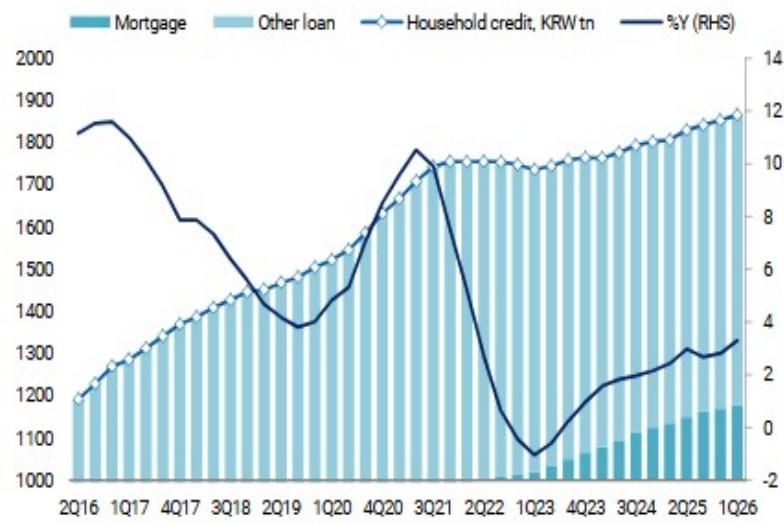

bar-line hybrid chart

| Quarter | Mortgage (KRW tn) | Other loan (KRW tn) | Household credit, KRW tn (%) | %Y (RHS) |
|---|---|---|---|---|
| 2Q16 | 1200 | 1200 | 1.5 | 12.0 |
| 1Q17 | 1300 | 1300 | 2.0 | 12.5 |
| 4Q17 | 1400 | 1400 | 2.5 | 11.5 |
| 3Q18 | 1450 | 1450 | 3.0 | 10.5 |
| 2Q19 | 1500 | 1500 | 3.5 | 9.5 |
| 1Q20 | 1550 | 1550 | 4.0 | 8.5 |
| 4Q20 | 1650 | 1650 | 5.0 | 9.5 |
| 3Q21 | 1750 | 1750 | 6.0 | 10.5 |
| 2Q22 | 1700 | 1700 | 4.5 | 8.0 |
| 1Q23 | 1650 | 1650 | -1.0 | -2.0 |
| 4Q23 | 1700 | 1700 | 2.0 | 1.5 |
| 3Q24 | 1750 | 1750 | 2.5 | 2.0 |
| 2Q25 | 1800 | 1800 | 3.0 | 2.5 |
| 1Q26 | 1850 | 1850 | 3.5 | 3.0 |

Amid persistent increase in mortgage loans, other loans turned around to an increase in the past 4 quarters

Quarterly changes: mortgage vs other loans  
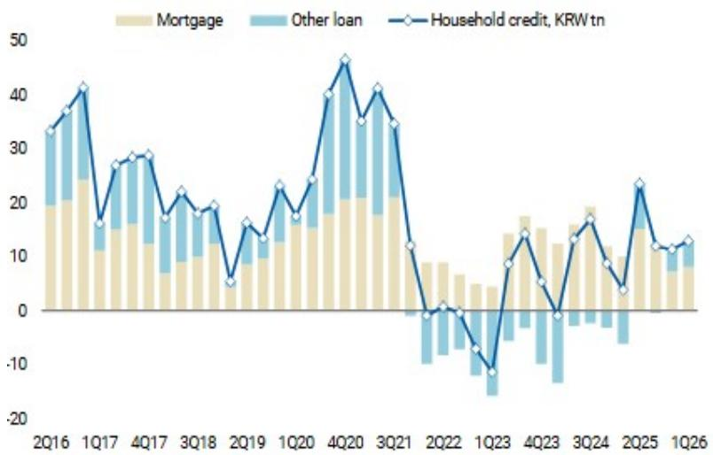

bar-line hybrid

| Quarter | Mortgage (KRW tn) | Other loan (KRW tn) | Household credit, KRW tn |
|---|---|---|---|
| 2Q16 | 34 | 18 | 33 |
| 1Q17 | 41 | 15 | 16 |
| 4Q17 | 29 | 14 | 27 |
| 3Q18 | 20 | 10 | 22 |
| 2Q19 | 5 | 8 | 16 |
| 1Q20 | 23 | 10 | 23 |
| 4Q20 | 46 | 25 | 40 |
| 3Q21 | 34 | 15 | 35 |
| 2Q22 | -5 | -10 | -5 |
| 1Q23 | -15 | -15 | -15 |
| 4Q23 | 15 | -5 | 10 |
| 3Q24 | 19 | -5 | 15 |
| 2Q25 | 24 | -5 | 23 |
| 1Q26 | 12 | 5 | 12 |

Source: BoK, MS

## Japan's Reform as Reference: Quicker Move amid Active Risk-Seeking in Korea

Japanese households have shown stronger appetite for lower-risk assets vs. Korea; bias to cash remains higher

Historical changes in the composition of household financial assets: Japan vs Korea  
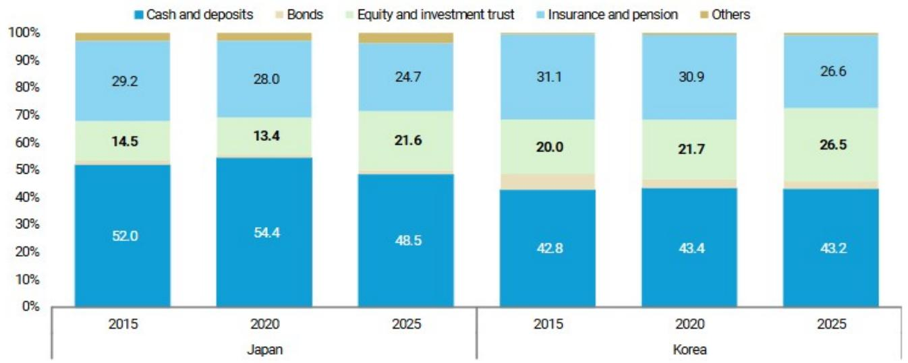

stacked bar chart

| Country | Year | Cash and deposits (%) | Bonds (%) | Equity and investment trust (%) | Insurance and pension (%) | Others (%) |
| :--- | :--- | :--- | :--- | :--- | :--- | :--- |
| Japan | 2015 | 52.0 | 14.5 | 14.5 | 29.2 | 3.6 |
| Japan | 2020 | 54.4 | 13.4 | 13.4 | 28.0 | 3.7 |
| Japan | 2025 | 48.5 | 21.6 | 21.6 | 24.7 | 4.3 |
| Korea | 2015 | 42.8 | 20.0 | 20.0 | 31.1 | 1.0 |
| Korea | 2020 | 43.4 | 21.7 | 21.7 | 30.9 | 1.0 |
| Korea | 2025 | 43.2 | 26.5 | 26.5 | 26.6 | 1.0 |

Source: BoK, ESRI, MS

## Successful Expansion of Retail Participation in NISA

Japan: Majority of contributions to an annual increase in financial assets came from equity and investment trust holdings in 2025, following new NISA reforms

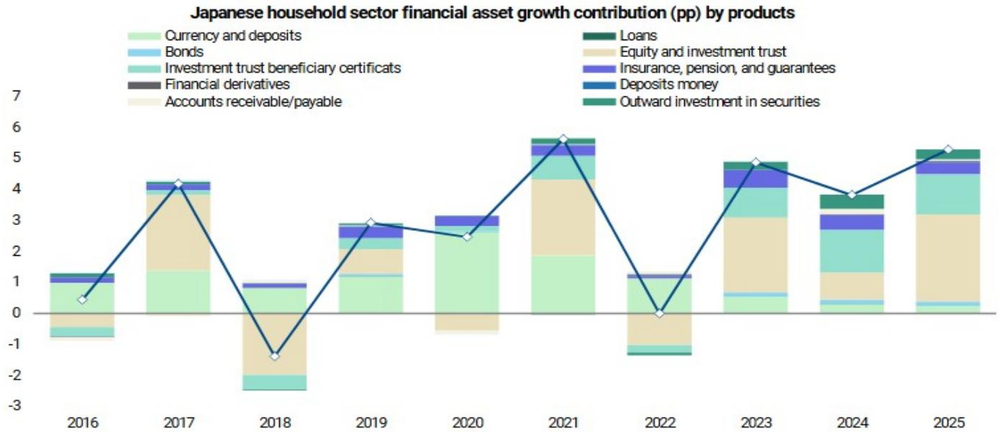

stacked bar chart

Japanese household sector financial asset growth contribution (pp) by products
| Year | Accounts receivable/payable | Financial derivatives | Financial derivatives | Investment trust beneficiary certificates | Bonds | Currency and deposits | Loans | Deposits money | Equity and investment trust | Insurance, pension, and guarantees | Outward investment in securities |
|---|---|---|---|---|---|---|---|---|---|---|---|
| 2016 | -0.8 | 0.1 | 0.1 | -0.3 | 0.1 | 0.4 | 0.1 | 0.1 | 0.3 | 0.1 | 0.4 |
| 2017 | 0.1 | 0.1 | 0.1 | 0.1 | 0.1 | 1.3 | 0.1 | 0.1 | 2.2 | 0.1 | 4.2 |
| 2018 | -2.5 | 0.1 | 0.1 | -2.3 | 0.1 | 0.9 | 0.1 | 0.1 | -1.5 | 0.1 | -1.5 |
| 2019 | 0.1 | 0.2 | 0.2 | 0.3 | 0.1 | 1.2 | 0.1 | 0.3 | 0.8 | 0.2 | 2.9 |
| 2020 | -0.5 | 0.1 | 0.1 | -0.5 | 0.1 | 2.4 | 0.1 | 0.3 | -0.5 | 0.2 | -0.5 |
| 2021 | 0.1 | 0.2 | 0.2 | 1.3 | 0.1 | 1.9 | 0.1 | 0.3 | 2.5 | 0.3 | 5.6 |
| 2022 | -1.3 | 0.1 | 0.1 | -1.3 | 0.1 | -1.3 | 0.1 | -1.3 | -1.3 | -1.3 | -1.3 |
| 2023 | 0.5 | 0.1 | 0.1 | 1.3 | 0.1 | 0.5 | 0.3 | 0.5 | 2.5 | 0.4 | 4.8 |
| 2024 | -0.3 | 0.1 | 0.1 | -0.3 | 0.1 | -0.3 | 0.4 | -0.3 | -1.3 | -0.3 | -3.7 |
| 2025 | -0.3 | 0.1 | 0.1 | -0.3 | 0.1 | -0.3 | 0.4 | -0.3 | -1.3 | -0.3 | -5.2 |
The chart displays a line graph with markers connecting bars to the data series.

Source: BoJ, MS

# Stronger Appetite for Retail Equity Investment in Korea vs. Japan

Retail investor stock ownership: Despite an earlier start on market reforms with the new NISA in 2024, Japan's retail participation share has risen, but from a low base. Its individual investors accounted for 25% of trading value in 2025, the highest level in over a decade, but they made up only 17% of market ownership. Meanwhile in Korea, retail traders historically made up about 42-45% of total domestic exchange turnover, and the retail investor base has more than doubled in five years, to 14.2mn in 2024 from 6.9mn in 2019, or nearly half of the adult population (above age 15).

Intensity of retail participation: This growth has led retail transaction volumes to surge in Korea. In 2026, retail investors have been the largest net buyers in the Korean market, with approximately US\$15bn in inflows. On the other hand, Japanese retail investors have been net sellers of domestic stocks in 2025-26, offloading JPY3.8tn, despite a significant rally in Japanese equities. We think this contrarian behavior is indicative of the conservative nature of the domestic market in Japan.

More resources in Korea? Korean investors have significant cash in brokerage accounts, reaching W132tn this year, a record high. We believe this could be invested in equities. Margin lending balances have also continued to trend higher, indicating rising risk appetite. As of June 2026, customer deposits were up 60%, to W132tn, and margin lending balances up 70%, to W37.7tn, compared to August 2025.

Source: MS

## Asia's Industrial Cycle is Inflecting

## Asia's Industrial Cycle is Inflecting

A variety of indicators suggest that Asia's industrial growth is improving. An increase in energy transition-related, AI infrastructure and defense spending should lift Asia's industrial production further this year. Moreover, lower energy prices could provide a boost to the ongoing industrial and capex super-cycle. Korea should benefit considering its high net oil imports.

## Key takeaways

- Asia ex-China's industrial production growth has already reached a 42-month high, and we expect a further acceleration.  
- AI infrastructure, energy transition-related, and defense spending will increase and support industrial production.  
Economies outside of Asia are also raising their spending, which could lift Asia's non-tech exports.  
- With the progress on a US-Iran peace deal, dated Brent prices have declined below US\$85/bbl from a peak of US\$144/bbl and vs. \$72/bbl on February 26.  
- Our global oil strategist now sees dated Brent price settling at around US\$80/bbl from 4Q26 onwards.

Asia's industrial production growth is at a four-year high  
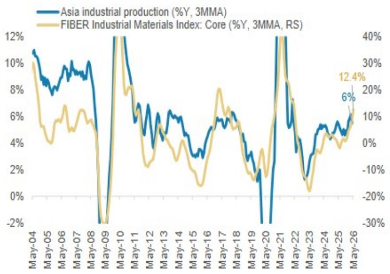

line chart

| Date   | Asia industrial production (%Y, 3MMA) | FIBER Industrial Materials Index: Core (%Y, 3MMA, RS) |
|--------|----------------------------------------|----------------------------------------------------------|
| May-26 | 6%                                     | 12.4%                                                    |

Source: MS

## Ongoing Industrial Super-cycle Gets a Boost

Semis exports have continued to strengthen  
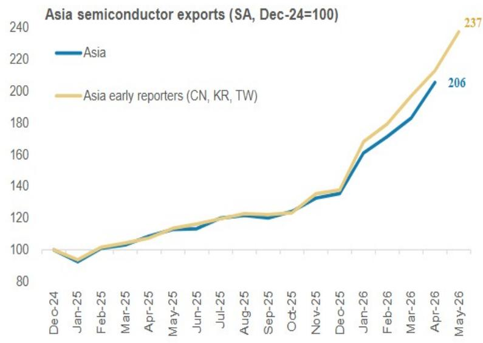

line chart

| Month    | Asia | Asia early reporters (CN, KR, TW) |
| -------- | ---- | --------------------------------- |
| May-26   | 206  | 237                               |

Strength in non-tech exports has sustained into May  
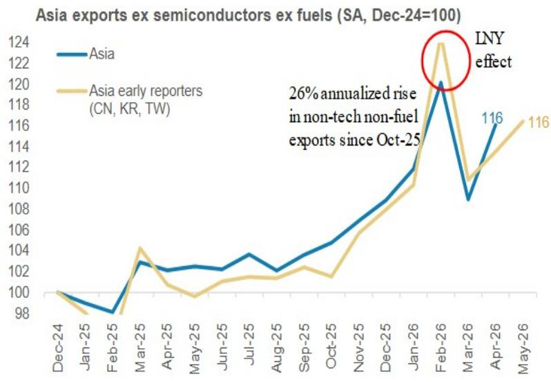

line chart

| Month    | Asia  | Asia early reporters (CN, KR, TW) |
| -------- | ----- | -------------------------------- |
| Dec-24   | 100   | 100                              |
| Jan-25   | 98    | 98                               |
| Feb-25   | 103   | 104                              |
| Mar-25   | 102   | 101                              |
| Apr-25   | 103   | 100                              |
| May-25   | 102   | 99                               |
| Jun-25   | 103   | 101                              |
| Jul-25   | 104   | 102                              |
| Aug-25   | 102   | 101                              |
| Sep-25   | 103   | 102                              |
| Oct-25   | 105   | 106                              |
| Nov-25   | 107   | 108                              |
| Dec-25   | 109   | 110                              |
| Jan-26   | 112   | 111                              |
| Feb-26   | 120   | 124                              |
| Mar-26   | 109   | 110                              |
| Apr-26   | 116   | 116                              |
| May-26   | 116   | 116                              |

Source: CEIC, Haver, MS

## Trends in Semis Exports: Still Surging Driven by Strong Demand from Hyperscalers

US hyperscaler capex to sustain strong growth through 2027  
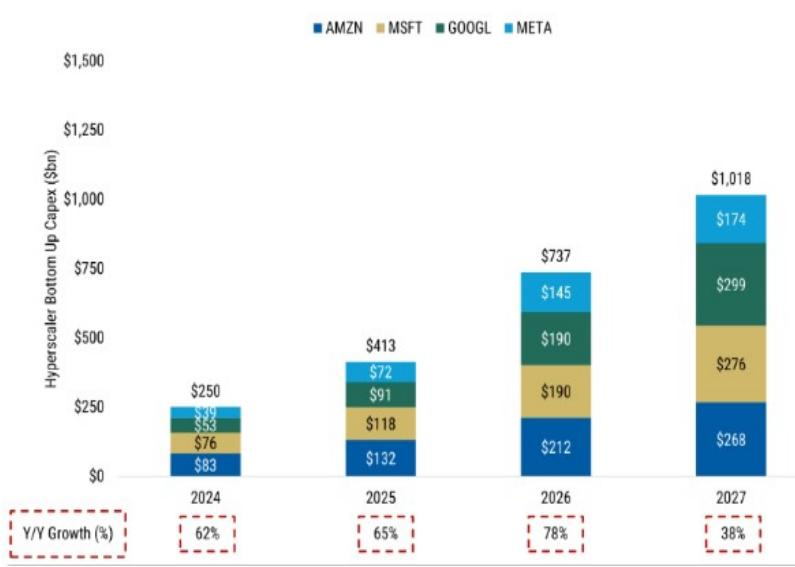

stacked bar chart

| Year | AMZN ($bn) | MSFT ($bn) | GOOGL ($bn) | META ($bn) | Total ($bn) | Y/Y Growth (%) |
| :--- | :--- | :--- | :--- | :--- | :--- | :--- |
| 2024 | 83 | 76 | 53 | 39 | 250 | 62 |
| 2025 | 132 | 118 | 91 | 72 | 413 | 65 |
| 2026 | 212 | 190 | 190 | 145 | 737 | 78 |
| 2027 | 268 | 276 | 299 | 174 | 1,018 | 38 |

Strong US IT capex to sustain Asia's tech exports  
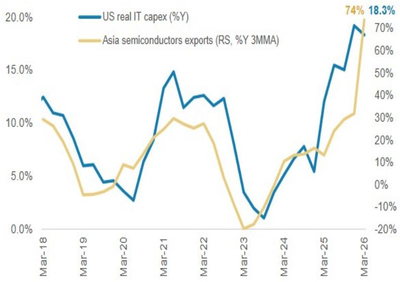

line chart

| Date   | US real IT capex (%Y) | Asia semiconductors exports (RS, %Y 3MMA) |
|--------|------------------------|------------------------------------------|
| Mar-26 | 74%                    | 18.3%                                    |

Source: Haver, MS US Equity Research team

## Don't Underestimate the Recovery in Non-tech Exports

On an annualized basis, non-tech exports for Asia's early reporting economies have grown at $27\%$ since October through April  
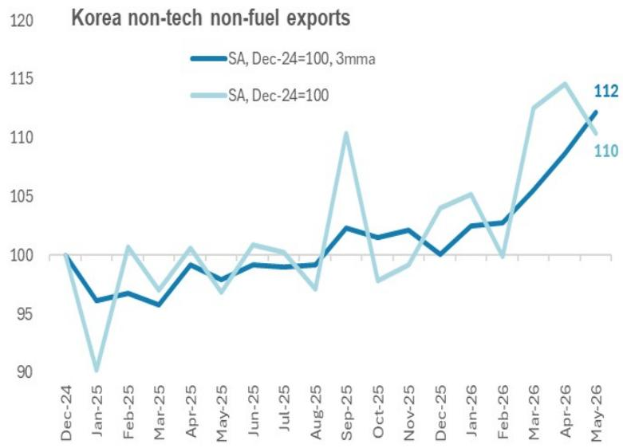

line chart

| Month    | SA, Dec-24=100, 3mma | SA, Dec-24=100 |
| -------- | --------------------- | --------------- |
| May-26   | 112                   | 110             |

On a YoY three-month trailing basis, Asia's non-tech exports growth has accelerated to 14%Y  
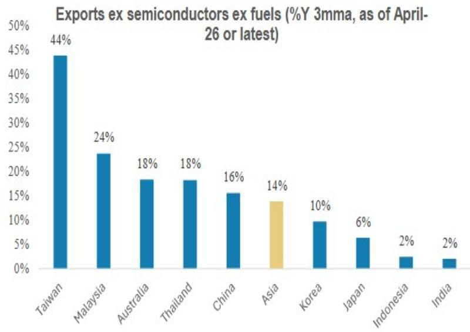

bar chart

Exports ex semiconductors ex fuels (%Y 3mma, as of April-26 or latest)
| Country | Exports (%) |
| :--- | :--- |
| Taiwan | 44 |
| Malaysia | 24 |
| Australia | 18 |
| Thailand | 18 |
| China | 16 |
| Asia | 14 |
| Korea | 10 |
| Japan | 6 |
| Indonesia | 2 |
| India | 2 |

Source: CEIC, MS; Note: Asia includes China, India, Indonesia, Korea, Malaysia, Thailand, Taiwan, Australia and Japan. Non-tech non-fuel exports have risen at an annualized run rate of 25% (and 27% for early reporters) since October 2025, when the US signed trade deals with most Asian economies.

## Korea Benefits from Lower Oil Prices

Policymakers have mitigated the pass-through from international oil price increases to domestic fuel price increases  
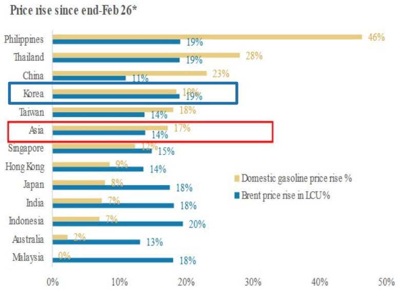

bar chart

Price rise since end-Feb 26*
| Region | Domestic gasoline price rise % (%) | Brent price rise in ICU % (%) |
| :--- | :--- | :--- |
| Philippines | 46 | 19 |
| Thailand | 28 | 19 |
| China | 23 | 11 |
| Korea | 19 | 19 |
| Taiwan | 18 | 14 |
| Asia | 17 | 14 |
| Singapore | 12 | 15 |
| Hong Kong | 9 | 14 |
| Japan | 8 | 18 |
| India | 7 | 18 |
| Indonesia | 7 | 20 |
| Australia | 2 | 13 |
| Malaysia | 0 | 18 |

Lower oil prices to minimize Korea's large exposure to oil balance deficits  
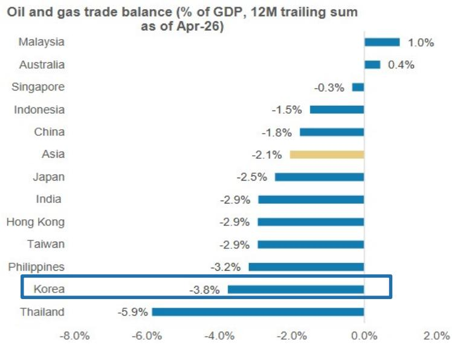

bar chart

Oil and gas trade balance (% of GDP, 12M trailing sum as of Apr-26)
| Country/Region | Oil and gas trade balance (% of GDP) |
| :--- | :--- |
| Malaysia | 1.0 |
| Australia | 0.4 |
| Singapore | -0.3 |
| Indonesia | -1.5 |
| China | -1.8 |
| Asia | -2.1 |
| Japan | -2.5 |
| India | -2.9 |
| Hong Kong | -2.9 |
| Taiwan | -2.9 |
| Philippines | -3.2 |
| Korea | -3.8 |
| Thailand | -5.9 |

Source: CEIC, Globalpetrolprices.com, MS; Note: \*Data for brent price as of June 16, data for domestic fuel price as of June 8.

## USDKRW

## KRW Has Potential to Outperform

Our FX strategist sees KRW outperforming when the Strait of Hormuz re-opens given its high beta and cheap valuations. Domestic fundamentals are also supportive: 1) Korea's current account surplus is likely to continue expanding to a new high with tailwinds from the industrial cycle; 2) NPS's foreign investments may not weaken KRW to the same extent as before given its higher FX hedge ratio; 3) Outflows from Korea retail investors have eased; and 4) Our equity strategists see further upside for KOSPI.

We expect AXJ currencies to recover in 2H26 as oil prices ease

<table><tr><td></td><td>12-May-26</td><td>2Q26</td><td>3Q26</td><td>4Q26</td><td>1Q27</td><td>2Q27</td><td>3Q27</td><td>4Q27</td></tr><tr><td>USD/CNY</td><td>6.80</td><td>6.78</td><td>6.72</td><td>6.75</td><td>6.77</td><td>6.80</td><td>6.77</td><td>6.75</td></tr><tr><td>USD/HKD</td><td>7.83</td><td>7.81</td><td>7.79</td><td>7.77</td><td>7.81</td><td>7.80</td><td>7.79</td><td>7.78</td></tr><tr><td>USD/IDR</td><td>17529</td><td>17300</td><td>17150</td><td>17100</td><td>17200</td><td>17400</td><td>17111</td><td>16826</td></tr><tr><td>USD/INR</td><td>95.6</td><td>94.0</td><td>93.0</td><td>93.5</td><td>94.2</td><td>95.0</td><td>93.8</td><td>92.7</td></tr><tr><td>USD/KRW</td><td>1494</td><td>1450</td><td>1430</td><td>1420</td><td>1430</td><td>1440</td><td>1418</td><td>1397</td></tr><tr><td>USD/MYR</td><td>3.93</td><td>3.89</td><td>3.83</td><td>3.80</td><td>3.83</td><td>3.86</td><td>3.86</td><td>3.87</td></tr><tr><td>USD/PHP</td><td>61.5</td><td>60.3</td><td>59.8</td><td>59.6</td><td>60.0</td><td>60.5</td><td>60.0</td><td>59.4</td></tr><tr><td>USD/SGD</td><td>1.272</td><td>1.260</td><td>1.240</td><td>1.230</td><td>1.240</td><td>1.250</td><td>1.286</td><td>1.282</td></tr><tr><td>USD/THB</td><td>32.4</td><td>31.9</td><td>31.4</td><td>31.2</td><td>31.6</td><td>31.9</td><td>31.8</td><td>31.8</td></tr><tr><td>USD/TWD</td><td>31.5</td><td>31.2</td><td>30.7</td><td>30.5</td><td>30.8</td><td>31.0</td><td>30.7</td><td>30.4</td></tr><tr><td>DXY</td><td>98</td><td>97</td><td>95</td><td>96</td><td>98</td><td>99</td><td>99</td><td>99</td></tr></table>

The capex cycle should continue to underpin Asia export strength and FX recovery  
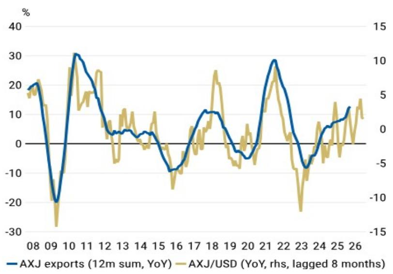

line chart

| Year | AXJ exports (12m sum, YoY) | AXJ/USD (YoY, rhs, lagged 8 months) |
|------|-----------------------------|--------------------------------------|
| 08   | ~20                         | ~5                                   |
| 09   | ~-20                        | ~-15                                 |
| 10   | ~30                         | ~10                                  |
| 11   | ~25                         | ~5                                   |
| 12   | ~10                         | ~0                                   |
| 13   | ~5                          | ~5                                   |
| 14   | ~0                          | ~0                                   |
| 15   | ~5                          | ~5                                   |
| 16   | ~-10                        | ~-5                                  |
| 17   | ~5                          | ~0                                   |
| 18   | ~10                         | ~5                                   |
| 19   | ~5                          | ~0                                   |
| 20   | ~-5                         | ~-5                                  |
| 21   | ~30                         | ~10                                  |
| 22   | ~25                         | ~5                                   |
| 23   | ~-10                        | ~-15                                 |
| 24   | ~5                          | ~0                                   |
| 25   | ~10                         | ~5                                   |
| 26   | ~15                         | ~10                                  |

Source: Bloomberg, Macrobond, MS

# Outflows from Korea Retail Investors Have Eased vs. Foreigners

Outflows from Korea retail investors have eased since March 2026  
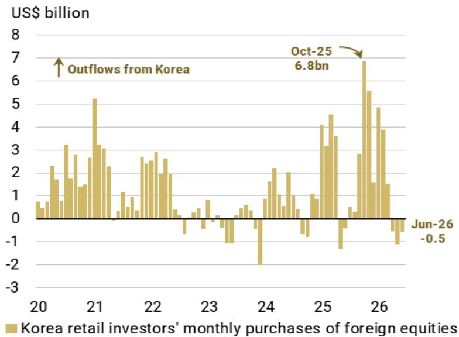

bar chart

| Date     | Monthly Purchases (US$ billion) |
| -------- | ------------------------------- |
| Oct-25   | 6.8bn                           |
| Jun-26   | -0.5                            |

Equities are the key source of capital outflows from Korea  
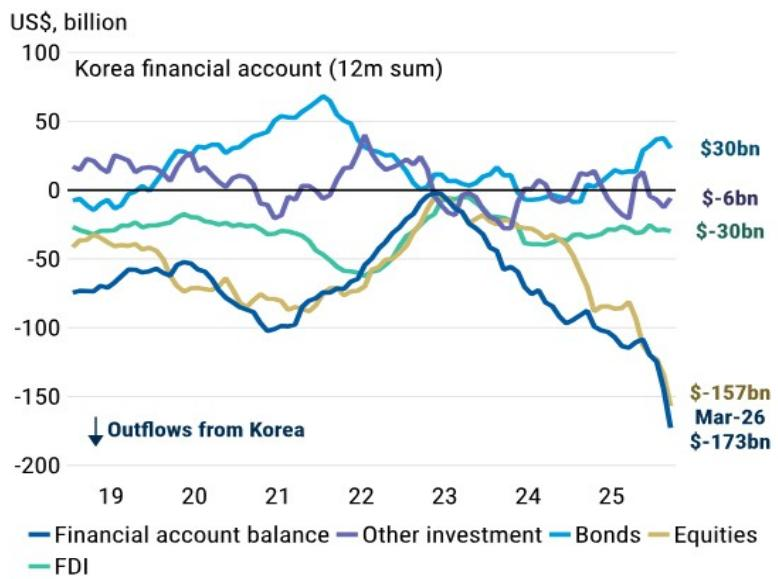

line chart

| Year | Financial account balance | Other investment | Bonds | Equities | FDI |
|------|-----------------------------|-------------------|-------|----------|-----|
| 2023 | -100                        | 0                 | 0     | -50      | -50 |
| 2025 | -173                        | -157              | 30    | -173     | -30 |

Source: Bloomberg, Macrobond, Seibro, MS

## Inflation Above Target Putting Upside Risks for Korea Yields

Rate hike pricing historically peaks after the start of the hiking cycle  
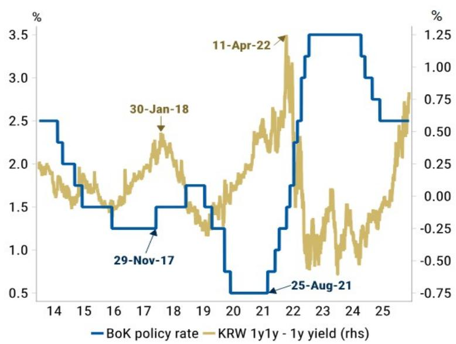

line chart

| Date       | BoK policy rate | KRW 1y1y - 1y yield (rhs) |
| ---------- | --------------- | ------------------------- |
| 29-Nov-17  | 1.5             | -0.75                     |
| 30-Jan-18  | 1.5             | 0.50                      |
| 11-Apr-22  | 3.5             | 1.25                      |
| 25-Aug-21  | 0.5             | -0.50                     |

We see upside risks to our policy rate forecasts arising from upside risks to growth  
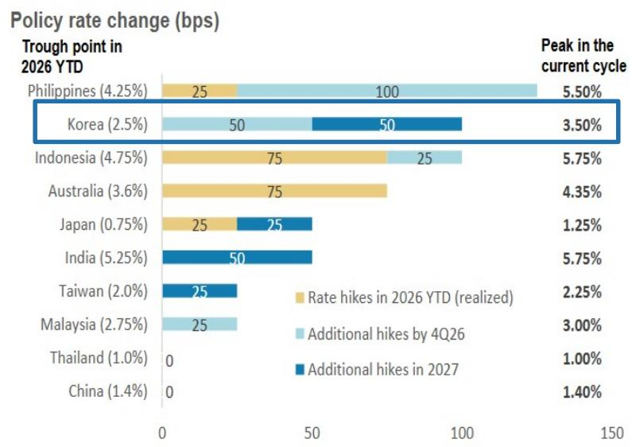

bar chart

| Country       | Rate hikes in 2026 YTD (realized) | Additional hikes by 4Q26 | Additional hikes in 2027 |
| ------------- | ---------------------------------- | ------------------------- | ------------------------- |
| Philippines   | 25                                 | 100                       | 5.50%                     |
| Korea         | 50                                 | 50                        | 3.50%                     |
| Indonesia     | 75                                 | 25                        | 5.75%                     |
| Australia     | 75                                 | 0                         | 4.35%                     |
| Japan         | 25                                 | 0                         | 1.25%                     |
| India         | 0                                  | 0                         | 5.75%                     |
| Taiwan        | 0                                  | 0                         | 2.25%                     |
| Malaysia      | 0                                  | 25                        | 3.00%                     |
| Thailand      | 0                                  | 0                         | 1.00%                     |
| China         | 0                                  | 0                         | 1.40%                     |

Source: Bloomberg, Haver Analytics, MS forecasts

## Disclosure Section

Information and opinions in MS were prepared or are disseminated by one or more of the following, which accept responsibility for its contents: MS Asia Limited, and/or MS Asia (Singapore) Pte. (Registration number 199206298Z) and/or MS Asia (Singapore) Securities Pte Ltd (Registration number 200008434H), regulated by the Monetary Authority of Singapore (which accepts legal responsibility for its contents and should be contacted with respect to any matters arising from, or in connection with, MS), and/or MS Taiwan Limited and/or MS & Co International plc, Seoul Branch, and/or MS Australia Limited (A.B.N. 67 003 734 576, holder of Australian financial services license No. 233742), and/or MS Wealth Management Australia Pty Ltd (A.B.N. 19 009 145 555, holder of Australian financial services license No. 240813, and/or MS India Company Private Limited having Corporate Identification No (CIN) U22990MH1998PTC115305, regulated by the Securities and Exchange Board of India ("SEBI") and holder of licenses as a Research Analyst (SEBI Registration No. INH000001105), Stock Broker (SEBI Stock Broker Registration No. INZ000244438), Merchant Banker (SEBI Registration No. INM000011203), and depository participant with National Securities Depository Limited (SEBI Registration No. IN-DP-NSDL-567-2021) having registered office at Altimus, Level 39 & 40, Pandurang Budhkar Marg, Worli, Mumbai 400018, India; Telephone no. +91-22-61181000; Compliance Officer Details: Mr. Tejarshi Hardas, Tel. No.: +91-22-61181000 or Email: tejarshi.hardas@morganstanley.com; Grievance officer details: Mr. Tejarshi Hardas, Tel. No.: +91-22-61181000 or Email: msic-compliance@morganstanley.com which accepts the responsibility for its contents and should be contacted with respect to any matters arising from, or in connection with, MS and their affiliates (collectively, "MS"). MS India Company Private Limited (MSICPL) may use AI tools in providing research services. All recommendations contained herein are made by the duly qualified research analysts;

For important disclosures, stock price charts and equity rating histories regarding companies that are the subject of this report, please see the MS Disclosure Website at www.morganstanley.com/eqr/disclosures/webapp/generalresearch, or contact your investment representative or MS at 1585 Broadway, (Attention: Research Management), New York, NY, 10036 USA.

For valuation methodology and risks associated with any recommendation, rating or price target referenced in this research report, please contact the Client Support Team as follows: US/Canada +1800 303-2495; Hong Kong +852 2848-5999; Latin America +1718 754-5444 (U.S.); London +44 (0)20-7425-8169; Singapore +65 6834-6860; Sydney +61(0)2-9770-1505; Tokyo +81(0)3-6836-9000. Alternatively you may contact your investment representative or MS at 1585 Broadway, (Attention: Research Management), New York, NY 10036 USA.

## Global Research Conflict Management Policy

MS has been published in accordance with our conflict management policy, which is available at www.morganstanley.com/institutional/research/conflictpolicies. A Portuguese version of the policy can be found at www.morganstanley.com.br

## Important Disclosures

MS is not acting as a municipal advisor and the opinions or views contained herein are not intended to be, and do not constitute, advice within the meaning of Section 975 of the Dodd-Frank Wall Street Reform and Consumer Protection Act. MS does not provide individually tailored investment advice. MS has been prepared without regard to the circumstances and objectives of those who receive it. MS recommends that investors independently evaluate particular investments and strategies, and encourages investors to seek the advice of a financial adviser. The appropriateness of an investment or strategy will depend on an investor's circumstances and objectives. The securities, instruments, or strategies discussed in MS may not be suitable for all investors, and certain investors may not be eligible to purchase or participate in some or all of them. MS is not an offer to buy or sell or the solicitation of an offer to buy or sell any security/instrument or to participate in any particular trading strategy. The value of and income from your investments may vary because of changes in interest rates, foreign exchange rates, default rates, prepayment rates, securities/instruments prices, market indexes, operational or financial conditions of companies or other factors. There may be time limitations on the exercise of options or other rights in securities/instruments transactions. Past performance is not necessarily a guide to future performance. Estimates of future performance are based on assumptions that may not be realized. If provided, and unless otherwise stated, the closing price on the cover page is that of the primary exchange for the subject company's securities/instruments.

The fixed income research analysts, strategists or economists principally responsible for the preparation of MS have received compensation based upon various factors, including quality, accuracy and value of research, firm profitability or revenues (which include fixed income trading and capital markets profitability or revenues), client feedback and competitive factors. Fixed Income Research analysts', strategists' or economists' compensation is not linked to investment banking or capital markets transactions performed by MS or the profitability or revenues of particular trading desks.

With the exception of information regarding MS, MS is based on public information. MS makes every effort to use reliable, comprehensive information, but we make no representation that it is accurate or complete. We have no obligation to tell you when opinions or information in MS change apart from when we intend to discontinue equity research coverage of a subject company. Facts and views presented in MS have not been reviewed by, and may not reflect information known to, professionals in other MS business areas, including investment banking personnel.

MS may make investment decisions that are inconsistent with the recommendations or views in this report.

To our readers based in Taiwan or trading in Taiwan securities/instruments: Information on securities/instruments that trade in Taiwan is distributed by MS Taiwan Limited ("MSTL"). Such information is for your reference only. The reader should independently evaluate the investment risks and is solely responsible for their investment decisions. MS may not be distributed to the public media or quoted or used by the public media without the express written consent of MS. Any non-customer reader within the scope of Article 7-1 of the Taiwan Stock Exchange Recommendation Regulations accessing and/or receiving MS is not permitted to provide MS to any third party (including but not limited to related parties, affiliated companies and any other third parties) or engage in any activities regarding MS which may create or give the appearance of creating a conflict of interest. Information on securities/instruments that do not trade in Taiwan is for informational purposes only and is not to be construed as a recommendation or a solicitation to trade in such securities/instruments. MSTL may not execute transactions for clients in these securities/instruments.

MS is not incorporated under PRC law and the research in relation to this report is conducted outside the PRC. MS does not constitute an offer to sell or the solicitation of an offer to buy any securities in the PRC. PRC investors shall have the relevant qualifications to invest in such securities and shall be responsible for obtaining all relevant approvals, licenses, verifications and/or registrations from the relevant governmental authorities themselves. Neither this report nor any part of it is intended as, or shall constitute, provision of any consultancy or advisory service of securities investment as defined under PRC law. Such information is provided for your reference only.

MS is disseminated in Brazil by MS C.T.V.M. S.A. located at Av. Brigadeiro Faria Lima, 3600, 6th floor, São Paulo - SP, Brazil; and is regulated by the Comissão de Valores Mobiliários; in Mexico by MS México, Casa de Bolsa, S.A. de C.V which is regulated by Comision Nacional Bancaria y de Valores. Paseo de los Tamarindos 90, Torre 1, Col. Bosques de las Lomas Floor 29, 05120 Mexico City; in Japan by MS MUFG Securities Co., Ltd. and, for Commodities related research reports only, MS Capital Group Japan Co., Ltd; in Hong Kong by MS Asia Limited (which accepts responsibility for its contents) and by MS Bank Asia Limited; in Singapore by MS Asia (Singapore) Pte. (Registration number 199206298Z) and/or MS Asia (Singapore) Securities Pte Ltd (Registration number 200008434H), regulated by the Monetary Authority of Singapore (which accepts legal responsibility for its contents and should be contacted with respect to any matters arising from, or in connection with, MS) and by MS Bank Asia Limited, Singapore Branch (Registration number T14FC0118); in Australia to "wholesale clients" within the meaning of the Australian Corporations Act by MS Australia Limited A.B.N. 67 003 734 576, holder of Australian financial services license No. 233742, which accepts responsibility for its contents; in Australia to "wholesale clients" and "retail clients" within the meaning of the Australian Corporations Act by MS Wealth Management Australia Pty Ltd (A.B.N. 19 009 145 555, holder of Australian financial services license No. 240813, which accepts responsibility for its contents; in Korea by MS & Co International plc, Seoul Branch; in India by MS India Company Private Limited having Corporate Identification No (CIN) U22990MH1998PTC115305, regulated by the Securities and Exchange Board of India ("SEBI") and holder of licenses as a Research Analyst (SEBI Registration No. INH000001105); Stock Broker (SEBI Stock Broker Registration No. INZ000244438), Merchant Banker (SEBI Registration No. INM000011203), and depository participant with National Securities Depository Limited (SEBI Registration No. IN-DP-NSDL-567-2021) having registered office at Altimus, Level 39 & 40, Pandurang Budhkar Marg, Worli, Mumbai 400018, India; Telephone no. +91-22-61181000; Compliance Officer Details: Mr. Tejarshi Hardas, Tel. No.: +91-22-61181000 or Email: tejarshi.hardas@morganstanley.com; Grievance officer details: Mr. Tejarshi Hardas, Tel. No.: +91-22-61181000 or Email: msic-compliance@morganstanley.com. MS India Company Private Limited (MSICPL) may use AI tools in providing research services. All recommendations contained herein are made by the duly qualified research analysts; in Canada by MS Canada Limited; in Germany and the European Economic Area where required by MS Europe S.E., regulated by Bundesanstalt fuer Finanzdienstleistungsaufsicht (BaFin) under the reference number 149169; in the United States by MS & Co. LLC, which accepts responsibility for its contents. MS & Co. International plc, authorized by the Prudential Regulation Authority and regulated by the Financial Conduct Authority and the Prudential Regulation Authority, disseminates in the UK research that it has prepared, and research which has been prepared by any of its affiliates, only to persons who (i) are investment professionals falling within Article 19(5) of the Financial Services and Markets Act 2000 (Financial Promotion) Order 2005 (as amended, the "Order"); (ii) are persons who are high net worth entities falling within Article 4.9(2)(a) to (d) of the Order; or (iii) are persons to whom an invitation or inducement to engage in investment activity (within the meaning of section 21 of the Financial Services and Markets Act 2000, as amended) may otherwise lawfully be communicated or caused to be communicated. RMB MS Proprietary Limited is a member of the JSE Limited and A2X (Pty) Ltd. RMB MS Proprietary Limited is a joint venture owned equally by MS International Holdings Inc. and RMB Investment Advisory (Proprietary) Limited, which is wholly owned by FirstRand Limited. The information in MS is being disseminated by MS Saudi Arabia, regulated by the Capital Market Authority in the Kingdom of Saudi Arabia, and is directed at Sophisticated investors only.

The trademarks and service marks contained in MS are the property of their respective owners. Third-party data providers make no warranties or representations relating to the accuracy, completeness, or timeliness of the data they provide and shall not have liability for any damages relating to such data. The Global Industry Classification Standard (GICS) was developed by and is the exclusive property of MSCI and S&P.

MS, or any portion thereof may not be reprinted, sold or redistributed without the written consent of MS.

Indicators and trackers referenced in MS may not be used as, or treated as, a benchmark under Regulation EU 2016/1011, or any other similar framework.

The information in MS is being communicated by MS & Co. International plc (DIFC Branch), regulated by the Dubai Financial Services Authority (the DFSA) or by MS & Co. International plc (ADGM Branch), regulated by the Financial Services Regulatory Authority Abu Dhabi (the FSRA), and is directed at Professional Clients only, as defined by the DFSA or the FSRA, respectively. The financial products or financial services to which this research relates will only be made available to a customer who we are satisfied meets the regulatory criteria of a Professional Client. A distribution of the different MS Research ratings or recommendations, in percentage terms for Investments in each sector covered, is available upon request from your sales representative.

The information in MS is being communicated by MS & Co. International plc (QFC Branch), regulated by the Qatar Financial Centre Regulatory Authority (the QFCRA), and is directed at business customers and market counterparties only and is not intended for Retail Customers as defined by the QFCRA.

As required by the Capital Markets Board of Turkey, investment information, comments and recommendations stated here, are not within the scope of investment advisory activity. Investment advisory service is provided exclusively to persons based on their risk and income preferences by the authorized firms. Comments and recommendations stated here are general in nature. These opinions may not fit to your financial status, risk and return preferences. For this reason, to make an investment decision by relying solely to this information stated here may not bring about outcomes that fit your expectations.

Registration granted by SEBI and certification from the National Institute of Securities Markets (NISM) in no way guarantee performance of the intermediary or provide any assurance of returns to investors. Investment in securities market are subject to market risks. Read all the related documents carefully before investing.

© 2026 MS