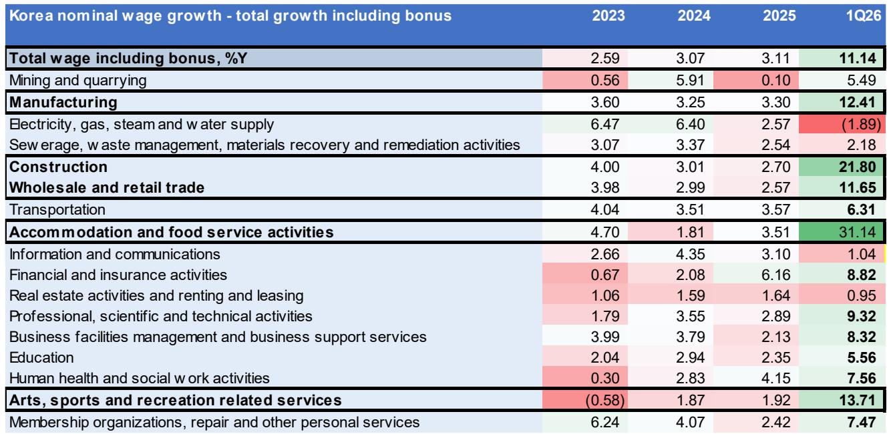

# Korea’s K-Shaped Recovery Is Narrowing: The Real Question Is How the Central Bank and Fiscal Authorities Will Manage the Upside

The most important macroeconomic story in Asia Pacific right now is not a crisis. It is the reversal of one. After two years of a deeply uneven K-shaped recovery that left domestic consumption lagging far behind export-driven growth, South Korea is now entering a phase that looks markedly different: a broad-based rebound. According to a detailed investor presentation from a global investment bank, the Korean economy is projected to grow at 2.8% year-on-year in 2026, up sharply from 1.1% in 2025, before stabilizing to 2.2% in 2027. This is not a marginal improvement. It is a structural shift in the composition of growth, driven by an unprecedented tech export supercycle and a faster-than-expected recovery in household consumption.

The implications extend far beyond a single data point. If this forecast holds, Korea will close its negative output gap two quarters earlier than previously expected, pushing the economy into above-potential growth territory for the next two years. That creates a new set of strategic questions for policymakers, investors, and corporate strategists. How should the Bank of Korea respond to an economy that is not just recovering but accelerating? What happens when fiscal policy, which has been constrained by weak tax revenues, suddenly finds itself with a windfall from corporate earnings and securities transaction taxes? And perhaps most critically, can the consumption recovery sustain itself once the tailwinds from the tech sector begin to normalize?

This article unpacks the logic behind the rebound, identifies the risks embedded in the forecast, and provides a decision framework for readers who need to position themselves for what comes next.

## The Tech Export Supercycle Is Not Just a Tailwind; It Is Reshaping the Entire Growth Architecture

The single most powerful force behind Korea’s turnaround is the semiconductor export cycle, and it is operating at a scale that has no modern precedent. Semiconductors now account for approximately 40% of Korea’s total exports, a share that has grown steadily as global demand for high-bandwidth memory and generic DRAM has surged on the back of artificial intelligence infrastructure buildout. The report shows that Korea’s May trade data recorded the highest monthly export value in history, even as energy imports rose. Both tech and non-tech export momentum are accelerating, with per-day exports growing by over 60% year-on-year in May 2026.

This is not a cyclical bounce. It is a structural re-rating of Korea’s export capacity. The report forecasts that semiconductor bit shipments will maintain double-digit growth through at least 2027, a trajectory that implies sustained demand for Korean memory products from global data center operators, cloud providers, and enterprise AI adopters. The capital expenditure response has been equally dramatic. Equipment investment and capital goods imports have ramped up sharply, reflecting the real economy’s adjustment to this new demand environment.

The strategic takeaway here is that Korea’s growth model has become more concentrated in tech, but also more resilient. In previous cycles, a semiconductor downturn would drag the entire economy into recession. Today, the scale and duration of the AI-driven demand wave suggest that the export engine can run hot for longer without overheating. However, this concentration also introduces a vulnerability: if the AI investment cycle slows or shifts toward less memory-intensive architectures, the downside risk to Korean exports would be severe. The report does not model this scenario in detail, but it is the logical corollary of the supercycle thesis.

## Consumption Recovery Is Accelerating Faster Than Expected, and That Changes the Policy Calculus

For most of 2024 and early 2025, the Korean recovery was a two-speed story. Exports roared ahead while domestic demand stagnated. That gap is now closing. The report projects that private consumption growth will reach 2.6% year-on-year by the first quarter of 2026, supported by fiscal stimulus, rising wages, and a wealth effect from equity markets. The composition of consumption is also shifting. Services consumption, which had been depressed, is recovering strongly, and both durable and non-durable goods spending are showing signs of stabilization.

What makes this recovery different from previous episodes is the structural backdrop. Korean retail investor stock ownership is among the highest in the world, with nearly 50% of the adult population holding equities. That means the wealth effect from a rising stock market is more broadly distributed than in most other developed economies. When equity markets perform well, the transmission to household spending is direct and material. The report notes that securities investor deposits have jumped over the past two years, indicating that retail participation is not only high but still growing.

This creates a self-reinforcing dynamic. Strong exports drive corporate earnings, which support equity valuations, which boost household wealth, which drives consumption, which further supports growth. The risk is that this feedback loop can also work in reverse. If the tech cycle turns or if global risk appetite deteriorates, the consumption recovery could stall quickly. The report acknowledges this risk implicitly by highlighting that the consumption recovery is faster than expected, but it does not fully explore what would happen if the equity market wealth effect reversed.

## The Bank of Korea Faces a Tightening Cycle That Is Already Priced In but Not Fully Understood

Given the above-potential growth outlook through 2027, the report expects the Bank of Korea to begin hiking rates from July 2026, with a total of four hikes over one year, bringing the terminal rate to 3.50% by the first half of 2027. This is a hawkish stance relative to current market pricing, and it reflects the bank’s need to preempt inflationary pressure from both supply and demand sides.

Inflation is projected to rise to 2.5% year-on-year, driven not only by elevated oil prices but also by the faster-than-expected consumption recovery. The report is explicit that the risk balance is tilted to the upside, particularly because the fiscal windfall from strong corporate earnings could lead to an extra budget in the second half of 2026. If the government injects additional fiscal stimulus into an economy that is already operating above potential, the Bank of Korea would have to respond with even more aggressive tightening.

The challenge for investors is that the tightening cycle is not just about the path of rates. It is about the sequencing of policy moves. The Bank of Korea will have to calibrate its rate decisions against fiscal policy, exchange rate dynamics, and global monetary conditions. If the U.S. Federal Reserve remains on hold or cuts rates, a tightening cycle in Korea could widen the interest rate differential and attract capital inflows, which would strengthen the won and potentially dampen export competitiveness. The report does not resolve this tension, but it provides the data needed to frame the question.

## What the Report Does Not Fully Answer: The Sustainability of the Consumption Recovery Without the Tech Tailwind

For all its analytical rigor, the report leaves one critical question open. How sustainable is the consumption recovery if the tech export cycle moderates? The report’s base case assumes that both tech and non-tech exports will remain strong through 2027, but it does not model a scenario in which semiconductor demand softens. Given that semiconductors now account for 40% of exports and a significant share of corporate profits, a downturn in that sector would have outsized effects on household income, equity valuations, and fiscal revenues.

There are also structural factors that the report touches on but does not fully explore. The wealth effect from equities is powerful, but it is also unevenly distributed. While nearly 50% of the adult population owns stocks, the concentration of holdings among higher-income households means that the consumption boost from rising equity prices may be less broad-based than the headline number suggests. If the consumption recovery is being driven primarily by wealthier households, it may be more vulnerable to a correction in asset prices.

Furthermore, the report does not address the implications of demographic trends. Korea has one of the fastest-aging populations in the developed world, and the long-term trend for consumption growth is structurally lower than in previous decades. The report’s projection that consumption will revert to a 2% growth path by 2027 may be optimistic if demographic headwinds intensify.

## A Decision Framework for Investors and Strategists

For readers who need to translate this analysis into actionable positioning, the following framework may help.

First, assess the direction of the tech cycle. The single most important variable for Korea’s macro outlook is the trajectory of semiconductor demand. If AI-driven demand for HBM and generic DRAM continues to grow at double-digit rates, the economy will likely exceed the 2.8% growth forecast for 2026. If demand softens, the downside risk is material.

Second, monitor the fiscal policy response. The report highlights that strong corporate earnings are generating a fiscal windfall. If the government announces an extra budget in the second half of 2026, it would add further stimulus to an economy that is already above potential. That would force the Bank of Korea to tighten more aggressively, which could create headwinds for interest-rate-sensitive sectors.

Third, watch the consumption data closely. The report’s bullish case rests on the assumption that consumption recovery is sustainable. If household spending begins to slow in the second half of 2026, the growth story loses its second pillar and becomes entirely dependent on exports.

Fourth, prepare for currency implications. If the Bank of Korea tightens while the Federal Reserve holds steady, the won could appreciate. That would be positive for importers and domestic consumers but negative for export competitiveness. The net effect on corporate earnings depends on whether companies can pass on currency costs to customers.

## Why This Story Matters Now, and How to Go Deeper

The narrowing of Korea’s K-shaped recovery gap is not just a domestic story. It has implications for global supply chains, technology investment cycles, and the broader Asia Pacific growth narrative. If Korea can sustain a broad-based rebound while managing inflationary and fiscal pressures, it will serve as a case study for other export-dependent economies trying to rebalance growth. If it stumbles, the lessons will be equally instructive.

The report from which this analysis is drawn contains detailed charts on export momentum, consumption breakdowns, semiconductor bit shipments, and fiscal projections that are essential for anyone making investment or strategic decisions in this environment. The original data on securities investor deposits, equity market liquidity, and the wealth effect distribution are not fully captured in this article.

Join the community to read the full report and review the original charts.

*This article is for learning and discussion only and does not constitute investment advice.*

Personal reading notes and learning share only. Not investment advice.

