June 18, 2026 08:29 AM GMT

# Investor Presentation | Japan

## Pharmaceuticals

l Top Pick: Daiichi Sankyo  
l OW (Preference order): Daiichi Sankyo, Takeda, Otsuka, Chugai  
L OW (Mid-cap and generic): Kaken, Towa  
l Industry View: In-Line

MS MUFG SECURITIES CO., LTD.+

## Shinichiro Muraoka

Equity Analyst

Shinichiro.Muraoka@morganstanleymufg.com +81 3 6836-5424

## Jaeheon Lee

Equity Analyst

Jaeheon.Lee@morganstanleymufg.com +81 3 6836-8443

text_image

Japan Summer School 2026

## PHARMACEUTICALS

Japan

Industry View In-Line

MS does and seeks to do business with companies covered in MS. As a result, investors should be aware that the firm may have a conflict of interest that could affect the objectivity of MS. Investors should consider MS as only a single factor in making their investment decision.

## For analyst certification and other important disclosures, refer to the Disclosure Section, located at the end of this report.

+= Analysts employed by non-U.S. affiliates are not registered with FINRA, may not be associated persons of the member and may not be subject to FINRA restrictions on communications with a subject company, public appearances and trading securities held by a research analyst account.

## Table of Contents

Coverage Overview 3

Valuation/Performance 4-9

Pharmaceutical Industry Structure 10-12

FX sensitivity 13

Appendix: Pharma industry overview 14-19

Summary for Each Company 20-37

Daiichi Sankyo 20

Takeda Pharmaceutical 21

Otsuka HD 22

Chugai Pharmaceutical 23

Kaken Pharmaceutical 24

Towa Pharmaceutical 25

Astellas Pharma 26

Eisai 27

Shionogi 28

Santen Pharmaceutical 29

Tsumura 30

Sumitomo Pharma 31

SanBio 32

JCR 33

Sawai Group Holdings 34

Ono Pharmaceutical 35

Nippon Shinyaku 36

Kyowa Kirin 37

## Our Coverage Stocks

Shinichiro Muraoka

<table><tr><td>Company</td><td>Ticker</td><td>Rating</td><td>Price Target</td><td>Current Price (2026/6/16)</td><td>Upside/Downside</td><td>YTD (%)</td><td>Market cap (bn)</td></tr><tr><td>Daiichi Sankyo</td><td>4568.T</td><td>Overweight</td><td>4,650</td><td>¥2,520</td><td>85%</td><td>-25%</td><td>¥4,694</td></tr><tr><td>Takeda</td><td>4502.T</td><td>Overweight</td><td>6,300</td><td>¥5,020</td><td>25%</td><td>4%</td><td>¥7,988</td></tr><tr><td>Otsuka HD</td><td>4578.T</td><td>Overweight</td><td>14,100</td><td>¥10,360</td><td>36%</td><td>16%</td><td>¥5,625</td></tr><tr><td>Chugai</td><td>4519.T</td><td>Overweight</td><td>10,700</td><td>¥7,523</td><td>42%</td><td>-8%</td><td>¥12,632</td></tr><tr><td>Shionogi</td><td>4507.T</td><td>Equal-Weight</td><td>2,950</td><td>¥2,809</td><td>5%</td><td>-1%</td><td>¥2,499</td></tr><tr><td>Eisai</td><td>4523.T</td><td>Equal-Weight</td><td>3,800</td><td>¥3,750</td><td>1%</td><td>-19%</td><td>¥1,094</td></tr><tr><td>Astellas</td><td>4503.T</td><td>Equal-Weight</td><td>2,050</td><td>¥2,144</td><td>-4%</td><td>3%</td><td>¥3,880</td></tr><tr><td>SanBio</td><td>4592.T</td><td>Equal-Weight</td><td>1,500</td><td>¥1,175</td><td>28%</td><td>-25%</td><td>¥92</td></tr><tr><td>JCR</td><td>4552.T</td><td>Equal-Weight</td><td>500</td><td>¥448</td><td>12%</td><td>-36%</td><td>¥58</td></tr><tr><td>Ono</td><td>4528.T</td><td>Underweight</td><td>1,950</td><td>¥2,259</td><td>-14%</td><td>5%</td><td>¥1,127</td></tr><tr><td>Kyowa Kirin</td><td>4151.T</td><td>Underweight</td><td>1,800</td><td>¥2,402</td><td>-25%</td><td>-5%</td><td>¥1,262</td></tr></table>

Jaeheon Lee

<table><tr><td>Company</td><td>Ticker</td><td>Rating</td><td>Price Target</td><td>Current Price (2026/6/16)</td><td>Upside/Downside</td><td>YTD (%)</td><td>Market cap (bn)</td></tr><tr><td>Kaken</td><td>4521.T</td><td>Overweight</td><td>5,300</td><td>¥3,770</td><td>41%</td><td>-6%</td><td>¥166</td></tr><tr><td>Towa</td><td>4553.T</td><td>Overweight</td><td>5,600</td><td>¥3,875</td><td>45%</td><td>7%</td><td>¥200</td></tr><tr><td>Sumitomo Pharma</td><td>4506.T</td><td>Equal-Weight</td><td>2,200</td><td>¥1,487</td><td>48%</td><td>-35%</td><td>¥668</td></tr><tr><td>Santen</td><td>4536.T</td><td>Equal-Weight</td><td>1,900</td><td>¥1,920</td><td>-1%</td><td>19%</td><td>¥619</td></tr><tr><td>Tsumura</td><td>4540.T</td><td>Equal-Weight</td><td>4,100</td><td>¥3,761</td><td>9%</td><td>-8%</td><td>¥289</td></tr><tr><td>Sawai GHD</td><td>4887.T</td><td>Equal-Weight</td><td>2,000</td><td>¥1,651</td><td>21%</td><td>-29%</td><td>¥191</td></tr><tr><td>Nippon Shinyaku</td><td>4516.T</td><td>Underweight</td><td>2,600</td><td>¥3,986</td><td>-35%</td><td>-30%</td><td>¥280</td></tr></table>

Source: FactSet, Company, MS

Valuations for Our Coverage Stocks (1)

<table><tr><td rowspan="2">Company</td><td rowspan="2">Rating</td><td rowspan="2">PT</td><td rowspan="2">Share Price 2026/06/16</td><td rowspan="2">YTD (%)</td><td rowspan="2">Last 4 wks</td><td rowspan="2">Mkt Cap (bn)</td><td colspan="8">EPS (Adj)</td><td colspan="4">P/E*</td><td rowspan="2">EPS Growth 2025-30e</td><td rowspan="2">PEG Ratio</td></tr><tr><td>2025</td><td>2026e</td><td>2027e</td><td>2028e</td><td>2029e</td><td>2030e</td><td>2025</td><td>2026e</td><td>2027e</td><td>2028e</td><td>2029e</td><td>2030e</td></tr><tr><td>Takeda</td><td>OW</td><td>¥6,300</td><td>¥5,020</td><td>2.1%</td><td>-6.4%</td><td>¥7,988</td><td>516.8</td><td>475.5</td><td>518.1</td><td>579.2</td><td>612.8</td><td>619.1</td><td>9.7x</td><td>10.6x</td><td>9.7x</td><td>8.7x</td><td>8.2x</td><td>8.1x</td><td>4%</td><td>2.9</td></tr><tr><td>Astellas</td><td>EW</td><td>¥2,050</td><td>¥2,144</td><td>1.9%</td><td>-8.3%</td><td>¥3,880</td><td>237.0</td><td>277.1</td><td>244.1</td><td>190.7</td><td>185.5</td><td>210.6</td><td>9.0x</td><td>7.7x</td><td>8.8x</td><td>11.2x</td><td>11.6x</td><td>10.2x</td><td>-2%</td><td>(3.3)</td></tr><tr><td>Daiichi Sankyo</td><td>OW</td><td>¥4,650</td><td>¥2,520</td><td>-22.5%</td><td>0.8%</td><td>¥4,694</td><td>210.2</td><td>163.8</td><td>126.4</td><td>176.7</td><td>218.4</td><td>276.2</td><td>12.0x</td><td>15.4x</td><td>19.9x</td><td>14.3x</td><td>11.5x</td><td>9.1x</td><td>6%</td><td>2.7</td></tr><tr><td>Eisai</td><td>EW</td><td>¥3,800</td><td>¥3,750</td><td>-17.8%</td><td>-18.9%</td><td>¥1,094</td><td>136.8</td><td>182.2</td><td>247.8</td><td>253.8</td><td>261.2</td><td>236.1</td><td>27.4x</td><td>20.6x</td><td>15.1x</td><td>14.8x</td><td>14.4x</td><td>15.9x</td><td>12%</td><td>1.8</td></tr><tr><td>Otsuka</td><td>OW</td><td>¥14,100</td><td>¥10,360</td><td>19.1%</td><td>-5.9%</td><td>¥5,625</td><td>685.1</td><td>623.1</td><td>715.5</td><td>794.4</td><td>883.0</td><td>648.4</td><td>15.1x</td><td>16.6x</td><td>14.5x</td><td>13.0x</td><td>11.7x</td><td>16.0x</td><td>-1%</td><td>(15.2)</td></tr><tr><td>Chugai</td><td>OW</td><td>¥10,700</td><td>¥7,523</td><td>-7.2%</td><td>-3.6%</td><td>¥12,632</td><td>274.1</td><td>311.3</td><td>350.5</td><td>390.3</td><td>424.0</td><td>484.8</td><td>27.5x</td><td>24.2x</td><td>21.5x</td><td>19.3x</td><td>17.7x</td><td>15.5x</td><td>12%</td><td>2.0</td></tr><tr><td>Kyowa Kirin</td><td>UW</td><td>¥1,800</td><td>¥2,402</td><td>-3.2%</td><td>3.2%</td><td>¥1,262</td><td>161.3</td><td>193.7</td><td>199.6</td><td>175.2</td><td>173.7</td><td>173.7</td><td>14.9x</td><td>12.4x</td><td>12.0x</td><td>13.7x</td><td>13.8x</td><td>13.8x</td><td>1%</td><td>8.3</td></tr><tr><td>Sumitomo Pharma</td><td>EW</td><td>¥2,200</td><td>¥1,487</td><td>-35.4%</td><td>-12.4%</td><td>¥668</td><td>236.2</td><td>213.4</td><td>270.7</td><td>164.9</td><td>304.0</td><td>193.1</td><td>6.3x</td><td>7.0x</td><td>5.5x</td><td>9.0x</td><td>4.9x</td><td>7.7x</td><td>-4%</td><td>(1.8)</td></tr><tr><td>Shionogi</td><td>EW</td><td>¥2,950</td><td>¥2,809</td><td>-0.3%</td><td>-8.0%</td><td>¥2,499</td><td>248.2</td><td>349.0</td><td>327.6</td><td>331.6</td><td>277.5</td><td>250.7</td><td>11.3x</td><td>8.0x</td><td>8.6x</td><td>8.5x</td><td>10.1x</td><td>11.2x</td><td>0%</td><td>39.5</td></tr><tr><td>Nippon Shinyaku</td><td>UW</td><td>¥2,600</td><td>¥3,986</td><td>-29.7%</td><td>-6.3%</td><td>¥280</td><td>441.2</td><td>440.6</td><td>259.6</td><td>47.5</td><td>54.9</td><td>54.9</td><td>9.0x</td><td>9.0x</td><td>15.4x</td><td>84.0x</td><td>72.6x</td><td>72.6x</td><td>-34%</td><td>(0.3)</td></tr><tr><td>Kaken</td><td>OW</td><td>¥5,300</td><td>¥3,770</td><td>-5.0%</td><td>-8.1%</td><td>¥166</td><td>56.6</td><td>174.1</td><td>218.9</td><td>84.4</td><td>153.0</td><td>255.9</td><td>66.7x</td><td>21.7x</td><td>17.2x</td><td>44.7x</td><td>24.6x</td><td>14.7x</td><td>35%</td><td>0.6</td></tr><tr><td>Ono</td><td>UW</td><td>¥1,950</td><td>¥2,259</td><td>3.5%</td><td>-11.2%</td><td>¥1,127</td><td>220.3</td><td>191.7</td><td>151.3</td><td>186.4</td><td>186.2</td><td>175.6</td><td>10.3x</td><td>11.8x</td><td>14.9x</td><td>12.1x</td><td>12.1x</td><td>12.9x</td><td>-4%</td><td>(2.7)</td></tr><tr><td>Santen</td><td>EW</td><td>¥1,900</td><td>¥1,920</td><td>15.7%</td><td>1.1%</td><td>¥619</td><td>133.3</td><td>139.3</td><td>151.4</td><td>168.8</td><td>186.8</td><td>214.8</td><td>14.4x</td><td>13.8x</td><td>12.7x</td><td>11.4x</td><td>10.3x</td><td>8.9x</td><td>10%</td><td>1.4</td></tr><tr><td>Tsumura</td><td>EW</td><td>¥4,100</td><td>¥3,761</td><td>-9.1%</td><td>-2.0%</td><td>¥289</td><td>376.3</td><td>404.2</td><td>432.3</td><td>428.2</td><td>460.4</td><td>481.8</td><td>10.0x</td><td>9.3x</td><td>8.7x</td><td>8.8x</td><td>8.2x</td><td>7.8x</td><td>5%</td><td>1.8</td></tr><tr><td>JCR</td><td>EW</td><td>¥500</td><td>¥448</td><td>-34.6%</td><td>-10.7%</td><td>¥58</td><td>17.9</td><td>5.7</td><td>13.9</td><td>5.7</td><td>18.9</td><td>29.5</td><td>25.1x</td><td>78.0x</td><td>32.1x</td><td>78.0x</td><td>23.8x</td><td>15.2x</td><td>11%</td><td>7.4</td></tr><tr><td>SanBio</td><td>EW</td><td>¥1,500</td><td>¥1,175</td><td>-33.4%</td><td>-37.9%</td><td>¥92</td><td>(52.6)</td><td>(65.9)</td><td>(40.2)</td><td>(19.7)</td><td>2.1</td><td>59.7</td><td>-</td><td>-</td><td>-</td><td>-</td><td>573.1x</td><td>19.7x</td><td>-</td><td>-</td></tr><tr><td>Sawai</td><td>EW</td><td>¥2,000</td><td>¥1,651</td><td>-28.9%</td><td>-17.5%</td><td>¥191</td><td>162.1</td><td>172.7</td><td>182.2</td><td>196.9</td><td>208.2</td><td>220.4</td><td>10.2x</td><td>9.6x</td><td>9.1x</td><td>8.4x</td><td>7.9x</td><td>7.5x</td><td>6%</td><td>1.5</td></tr><tr><td>Towa</td><td>OW</td><td>¥5,600</td><td>¥3,875</td><td>3.6%</td><td>-0.3%</td><td>¥200</td><td>106.7</td><td>513.9</td><td>505.8</td><td>550.5</td><td>578.9</td><td>595.2</td><td>36.3x</td><td>7.5x</td><td>7.7x</td><td>7.0x</td><td>6.7x</td><td>6.5x</td><td>41%</td><td>0.2</td></tr><tr><td colspan="13">Pharma Avg. (Weighted)</td><td>16.8x</td><td>15.8x</td><td>15.1x</td><td>14.3x</td><td>14.3x</td><td>12.7x</td><td>5%</td><td>3.4</td></tr><tr><td colspan="21">US Pharma (covered by Terence Flynn)</td></tr><tr><td>Abbvie</td><td>OW</td><td>$278.0</td><td>$222.47</td><td>-3.2%</td><td>5.2%</td><td>$393.1</td><td>$10.0</td><td>$14.8</td><td>$17.4</td><td>$19.5</td><td>$20.7</td><td>$21.2</td><td>22.3x</td><td>15.0x</td><td>12.8x</td><td>11.4x</td><td>10.7x</td><td>10.5x</td><td>16%</td><td>1.4</td></tr><tr><td>BMY</td><td>UW</td><td>$40.0</td><td>$55.92</td><td>2.5%</td><td>-3.0%</td><td>$114.2</td><td>$6.1</td><td>$6.5</td><td>$5.9</td><td>$5.0</td><td>$4.3</td><td>$4.9</td><td>9.1x</td><td>8.6x</td><td>9.5x</td><td>11.2x</td><td>12.9x</td><td>11.4x</td><td>-4%</td><td>(2.1)</td></tr><tr><td>JNJ</td><td>OW</td><td>$283.0</td><td>$235.18</td><td>13.2%</td><td>3.9%</td><td>$566.1</td><td>$10.8</td><td>$11.8</td><td>$13.5</td><td>$15.3</td><td>$17.3</td><td>$18.9</td><td>21.8x</td><td>19.9x</td><td>17.5x</td><td>15.3x</td><td>13.6x</td><td>12.4x</td><td>12%</td><td>1.8</td></tr><tr><td>Eli Lilly</td><td>OW</td><td>$1,344.0</td><td>$1,122.50</td><td>3.5%</td><td>10.7%</td><td>$1,057.1</td><td>$24.2</td><td>$39.9</td><td>$47.1</td><td>$57.8</td><td>$64.0</td><td>$73.8</td><td>46.4x</td><td>28.1x</td><td>23.8x</td><td>19.4x</td><td>17.5x</td><td>15.2x</td><td>25%</td><td>1.9</td></tr><tr><td>Merck</td><td>EW</td><td>$112.0</td><td>$115.17</td><td>9.7%</td><td>4.4%</td><td>$284.4</td><td>$9.0</td><td>$5.3</td><td>$9.9</td><td>$11.0</td><td>$8.9</td><td>$9.5</td><td>12.8x</td><td>21.8x</td><td>11.6x</td><td>10.5x</td><td>12.9x</td><td>12.2x</td><td>1%</td><td>11.6</td></tr><tr><td>Pfizer</td><td>EW</td><td>$28.0</td><td>$26.04</td><td>4.1%</td><td>2.3%</td><td>$148.4</td><td>$3.2</td><td>$3.1</td><td>$3.0</td><td>$2.3</td><td>$2.2</td><td>$2.3</td><td>8.1x</td><td>8.5x</td><td>8.6x</td><td>11.3x</td><td>12.0x</td><td>11.5x</td><td>-7%</td><td>(1.2)</td></tr><tr><td colspan="13">US Pharma Avg. (Weighted)</td><td>29.6x</td><td>21.6x</td><td>17.9x</td><td>15.5x</td><td>14.6x</td><td>13.1x</td><td>15%</td><td>2.0</td></tr><tr><td colspan="21">EU Pharma (covered by Sarita Kapila and Thibault Boutherin)</td></tr><tr><td>AZN</td><td>OW</td><td>GBp 16,500</td><td>GBp 13,284</td><td>-2.3%</td><td>-1.2%</td><td>$276.7</td><td>$9.2</td><td>$10.1</td><td>$11.6</td><td>$12.3</td><td>$14.0</td><td>$16.4</td><td>19.5x</td><td>17.6x</td><td>15.4x</td><td>14.5x</td><td>12.8x</td><td>10.9x</td><td>12%</td><td>1.6</td></tr><tr><td>GSK</td><td>UW</td><td>GBp 1,750</td><td>GBp 1,950</td><td>-2.3%</td><td>5.9%</td><td>$106.0</td><td>GBp 172.0</td><td>GBp 182.2</td><td>GBp 199.9</td><td>GBp 199.1</td><td>GBp 197.5</td><td>GBp 190.3</td><td>11.3x</td><td>10.7x</td><td>9.8x</td><td>9.8x</td><td>9.9x</td><td>10.2x</td><td>2%</td><td>5.6</td></tr><tr><td>Novartis</td><td>OW</td><td>CHF 135</td><td>CHF 120</td><td>10.4%</td><td>3.7%</td><td>$307.1</td><td>$9.0</td><td>$8.7</td><td>$9.8</td><td>$11.1</td><td>$12.5</td><td>$13.2</td><td>16.8x</td><td>17.3x</td><td>15.4x</td><td>13.6x</td><td>12.1x</td><td>11.4x</td><td>8%</td><td>2.1</td></tr><tr><td>Novo Nordisk</td><td>EW</td><td>DKK 250</td><td>DKK 280</td><td>-12.2%</td><td>-4.6%</td><td>$147.6</td><td>DKK 26.2</td><td>DKK 21.4</td><td>DKK 20.9</td><td>DKK 21.7</td><td>DKK 22.9</td><td>DKK 25.2</td><td>10.7x</td><td>13.1x</td><td>13.4x</td><td>12.9x</td><td>12.3x</td><td>11.1x</td><td>-1%</td><td>(14.2)</td></tr><tr><td>Roche</td><td>EW</td><td>CHF 295</td><td>CHF 330</td><td>-0.7%</td><td>0.4%</td><td>$331.3</td><td>CHF 19.6</td><td>CHF 20.5</td><td>CHF 21.9</td><td>CHF 22.7</td><td>CHF 24.7</td><td>CHF 25.0</td><td>16.8x</td><td>16.1x</td><td>15.1x</td><td>14.5x</td><td>13.3x</td><td>13.2x</td><td>5%</td><td>3.4</td></tr><tr><td>Sanofi</td><td>EW</td><td>€ 90</td><td>€ 76</td><td>-9.5%</td><td>1.2%</td><td>$106.6</td><td>€ 7.8</td><td>€ 8.6</td><td>€ 9.1</td><td>€ 10.0</td><td>€ 11.0</td><td>€ 11.9</td><td>9.7x</td><td>8.8x</td><td>8.4x</td><td>7.6x</td><td>6.9x</td><td>6.3x</td><td>9%</td><td>1.1</td></tr><tr><td colspan="13">EU Pharma Avg. (Weighted)</td><td>15.6x</td><td>15.3x</td><td>14.0x</td><td>13.1x</td><td>12.0x</td><td>11.2x</td><td>7%</td><td>2.3</td></tr><tr><td colspan="21">Biotech (covered by Terence Flynn)</td></tr><tr><td>Amgen</td><td>EW</td><td>$340.0</td><td>$222.0</td><td>4.4%</td><td>4.7%</td><td>$187.7</td><td>$21.8</td><td>$22.6</td><td>$23.0</td><td>$25.8</td><td>$28.8</td><td>$32.1</td><td>10.2x</td><td>9.8x</td><td>9.7x</td><td>8.6x</td><td>7.7x</td><td>6.9x</td><td>8%</td><td>1.3</td></tr><tr><td>Gilead</td><td>OW</td><td>$168.0</td><td>$127.2</td><td>2.2%</td><td>-2.5%</td><td>$158.0</td><td>$8.1</td><td>$0.7</td><td>$9.8</td><td>$10.6</td><td>$12.1</td><td>$13.8</td><td>15.6x</td><td>-186.0x</td><td>12.9x</td><td>12.0x</td><td>10.5x</td><td>9.2x</td><td>11%</td><td>1.4</td></tr><tr><td>Biogen</td><td>EW</td><td>$206.0</td><td>$195.6</td><td>12.9%</td><td>3.0%</td><td>$28.9</td><td>$15.3</td><td>$15.8</td><td>$15.2</td><td>$14.9</td><td>$10.7</td><td>$11.2</td><td>12.8x</td><td>12.4x</td><td>12.9x</td><td>13.2x</td><td>18.2x</td><td>17.4x</td><td>-6%</td><td>(2.1)</td></tr><tr><td>Vertex</td><td>OW</td><td>$616.0</td><td>$453.2</td><td>1.2%</td><td>5.0%</td><td>$115.0</td><td>$18.4</td><td>$18.7</td><td>$20.1</td><td>$22.4</td><td>$27.2</td><td>$33.1</td><td>24.6x</td><td>24.2x</td><td>22.5x</td><td>20.2x</td><td>16.7x</td><td>13.7x</td><td>12%</td><td>2.0</td></tr><tr><td>Regeneron</td><td>EW</td><td>$788.0</td><td>$614.7</td><td>-21.2%</td><td>-12.8%</td><td>$63.3</td><td>$44.2</td><td>$46.4</td><td>$54.2</td><td>$62.5</td><td>$70.0</td><td>$75.1</td><td>13.9x</td><td>13.3x</td><td>11.3x</td><td>9.8x</td><td>8.8x</td><td>8.2x</td><td>11%</td><td>1.2</td></tr><tr><td colspan="13">Biotech Avg. (Weighted)</td><td>15.3x</td><td>-42.6x</td><td>13.6x</td><td>12.4x</td><td>11.0x</td><td>9.7x</td><td>9%</td><td>1.6</td></tr></table>

Note 1: For Japanese companies, Note 3: e = MS Estimates, Chugai, Kiyawa Kirin and Otsuka (Dec FY-end). Note 2: EPS estimates for Kaken, Eisuk, JCR, and SanBio are on a reported basis, and EPS estimates for other companies exclude one-off factors and goodwill amortization. Note 3: e = MS Estimates, Chugai, Kiyawa Kirin and Otsuka (Dec FY-end).

Valuations for Our Coverage Stocks (2)

<table><tr><td>Company</td><td>Rating</td><td>PT</td><td>Share Price 2026/06/16</td><td>YTD (%)</td><td>Last 4 wks</td><td>Mkt Cap (bn)</td><td>EV (25) (bn)</td><td>2025</td><td>2026e</td><td>2027e</td><td>2028e</td><td>2029e</td><td>2030e</td><td>2025</td><td>2026e</td><td>2027e</td><td>2028e</td><td>2029e</td><td>2030e</td><td>P/B 2025</td><td>DY (%)</td></tr><tr><td>Takeda</td><td>OW</td><td>¥6,300</td><td>¥5,020</td><td>2.1%</td><td>-6.4%</td><td>¥7,988</td><td>¥12,275</td><td>7.7x</td><td>8.6x</td><td>8.6x</td><td>7.9x</td><td>7.6x</td><td>7.6x</td><td>2.7x</td><td>2.8x</td><td>2.4x</td><td>2.0x</td><td>1.5x</td><td>1.2x</td><td>1.0x</td><td>4.0%</td></tr><tr><td>Astellas</td><td>EW</td><td>¥2,050</td><td>¥2,144</td><td>1.9%</td><td>-8.3%</td><td>¥3,880</td><td>¥4,155</td><td>7.1x</td><td>6.3x</td><td>7.3x</td><td>9.0x</td><td>9.3x</td><td>8.2x</td><td>0.5x</td><td>0.0x</td><td>-0.7x</td><td>-1.5x</td><td>-2.0x</td><td>-2.2x</td><td>2.1x</td><td>3.6%</td></tr><tr><td>Daiichi Sankyo</td><td>OW</td><td>¥4,650</td><td>¥2,520</td><td>-22.5%</td><td>0.8%</td><td>¥4,694</td><td>¥4,439</td><td>14.1x</td><td>10.0x</td><td>8.8x</td><td>9.4x</td><td>7.8x</td><td>6.3x</td><td>-0.8x</td><td>-0.6x</td><td>-0.8x</td><td>-0.9x</td><td>-0.8x</td><td>-0.9x</td><td>2.8x</td><td>3.1%</td></tr><tr><td>Eisai</td><td>EW</td><td>¥3,800</td><td>¥3,750</td><td>-17.8%</td><td>-18.9%</td><td>¥1,094</td><td>¥1,033</td><td>12.3x</td><td>9.4x</td><td>7.7x</td><td>7.6x</td><td>7.6x</td><td>8.2x</td><td>-0.7x</td><td>-0.2x</td><td>0.1x</td><td>0.1x</td><td>0.1x</td><td>-0.1x</td><td>1.2x</td><td>4.3%</td></tr><tr><td>Otsuka</td><td>OW</td><td>¥14,100</td><td>¥10,360</td><td>19.1%</td><td>-5.9%</td><td>¥5,625</td><td>¥5,183</td><td>8.7x</td><td>9.4x</td><td>8.3x</td><td>7.5x</td><td>6.9x</td><td>8.7x</td><td>-0.7x</td><td>-1.0x</td><td>-1.1x</td><td>-1.3x</td><td>-1.6x</td><td>-2.2x</td><td>1.8x</td><td>1.4%</td></tr><tr><td>Chugai</td><td>OW</td><td>¥10,700</td><td>¥7,523</td><td>-7.2%</td><td>-3.6%</td><td>¥12,632</td><td>¥11,652</td><td>17.7x</td><td>15.8x</td><td>14.1x</td><td>12.8x</td><td>11.8x</td><td>10.4x</td><td>-1.5x</td><td>-1.7x</td><td>-1.9x</td><td>-2.1x</td><td>-2.4x</td><td>-2.5x</td><td>6.1x</td><td>3.6%</td></tr><tr><td>Kyowa Kirin</td><td>UW</td><td>¥1,800</td><td>¥2,402</td><td>-3.2%</td><td>3.2%</td><td>¥1,262</td><td>¥1,042</td><td>7.7x</td><td>6.6x</td><td>6.4x</td><td>7.0x</td><td>7.1x</td><td>7.0x</td><td>-1.6x</td><td>-1.5x</td><td>-1.7x</td><td>-2.1x</td><td>-2.3x</td><td>-2.5x</td><td>1.4x</td><td>2.6%</td></tr><tr><td>Sumitomo Pharma</td><td>EW</td><td>¥2,200</td><td>¥1,487</td><td>-35.4%</td><td>-12.4%</td><td>¥668</td><td>¥836</td><td>6.6x</td><td>6.6x</td><td>5.2x</td><td>7.3x</td><td>4.0x</td><td>5.9x</td><td>1.3x</td><td>0.0x</td><td>-0.7x</td><td>-1.9x</td><td>-1.5x</td><td>-3.0x</td><td>2.0x</td><td>0.0%</td></tr><tr><td>Shionogi</td><td>EW</td><td>¥2,950</td><td>¥2,809</td><td>-0.3%</td><td>-8.0%</td><td>¥2,499</td><td>¥2,448</td><td>12.6x</td><td>7.1x</td><td>16.1x</td><td>16.1x</td><td>16.1x</td><td>16.1x</td><td>-0.3x</td><td>-0.2x</td><td>0.0x</td><td>0.0x</td><td>0.0x</td><td>0.0x</td><td>1.4x</td><td>2.5%</td></tr><tr><td>Nippon Shinyaku</td><td>UW</td><td>¥2,600</td><td>¥3,986</td><td>-29.7%</td><td>-6.3%</td><td>¥280</td><td>¥234</td><td>5.4x</td><td>5.3x</td><td>8.1x</td><td>22.1x</td><td>21.1x</td><td>21.5x</td><td>-1.1x</td><td>-1.3x</td><td>-2.4x</td><td>-6.5x</td><td>-6.0x</td><td>-5.9x</td><td>0.9x</td><td>3.1%</td></tr><tr><td>Kaken</td><td>OW</td><td>¥5,300</td><td>¥3,770</td><td>-5.0%</td><td>-8.1%</td><td>¥166</td><td>¥120</td><td>55.4x</td><td>10.7x</td><td>8.8x</td><td>19.3x</td><td>11.4x</td><td>7.5x</td><td>-21.7x</td><td>-3.7x</td><td>-2.9x</td><td>-5.8x</td><td>-3.0x</td><td>-1.9x</td><td>1.0x</td><td>5.0%</td></tr><tr><td>Ono</td><td>UW</td><td>¥1,950</td><td>¥2,259</td><td>3.5%</td><td>-11.2%</td><td>¥1,127</td><td>¥998</td><td>7.7x</td><td>8.0x</td><td>9.6x</td><td>7.9x</td><td>7.9x</td><td>8.3x</td><td>-1.0x</td><td>-1.6x</td><td>-2.3x</td><td>-2.2x</td><td>-2.6x</td><td>-3.2x</td><td>1.2x</td><td>3.5%</td></tr><tr><td>Santen</td><td>EW</td><td>¥1,900</td><td>¥1,920</td><td>15.7%</td><td>1.1%</td><td>¥619</td><td>¥567</td><td>7.7x</td><td>7.5x</td><td>7.0x</td><td>6.4x</td><td>5.9x</td><td>5.2x</td><td>-0.7x</td><td>-0.9x</td><td>-1.2x</td><td>-1.5x</td><td>-1.8x</td><td>-1.9x</td><td>2.1x</td><td>2.0%</td></tr><tr><td>Tsumura</td><td>EW</td><td>¥4,100</td><td>¥3,761</td><td>-9.1%</td><td>-2.0%</td><td>¥289</td><td>¥336</td><td>6.4x</td><td>5.8x</td><td>5.2x</td><td>5.1x</td><td>4.8x</td><td>4.7x</td><td>0.9x</td><td>1.7x</td><td>2.2x</td><td>2.5x</td><td>2.7x</td><td>3.1x</td><td>0.9x</td><td>3.9%</td></tr><tr><td>JCR</td><td>EW</td><td>¥500</td><td>¥448</td><td>-34.6%</td><td>-10.7%</td><td>¥58</td><td>¥98</td><td>31.5x</td><td>23.3x</td><td>16.9x</td><td>13.1x</td><td>10.2x</td><td>8.7x</td><td>12.8x</td><td>12.4x</td><td>9.9x</td><td>7.8x</td><td>6.1x</td><td>5.2x</td><td>1.2x</td><td>4.5%</td></tr><tr><td>SanBio</td><td>EW</td><td>¥1,500</td><td>¥1,175</td><td>-33.4%</td><td>-37.9%</td><td>¥92</td><td>¥106</td><td>-</td><td>-</td><td>-</td><td>-</td><td>320.8x</td><td>16.9x</td><td>-3.7x</td><td>-1.5x</td><td>-0.8x</td><td>-1.2x</td><td>4.1x</td><td>0.8x</td><td>6.7x</td><td>0.0%</td></tr><tr><td>Sawai</td><td>EW</td><td>¥2,000</td><td>¥1,651</td><td>-28.9%</td><td>-17.5%</td><td>¥191</td><td>¥267</td><td>8.4x</td><td>6.4x</td><td>6.0x</td><td>5.4x</td><td>5.0x</td><td>4.7x</td><td>2.4x</td><td>2.1x</td><td>2.4x</td><td>2.4x</td><td>2.4x</td><td>2.2x</td><td>1.1x</td><td>3.3%</td></tr><tr><td>Towa</td><td>OW</td><td>¥5,600</td><td>¥3,875</td><td>3.6%</td><td>-0.3%</td><td>¥200</td><td>¥366</td><td>8.8x</td><td>7.1x</td><td>7.0x</td><td>6.7x</td><td>6.5x</td><td>6.4x</td><td>4.0x</td><td>2.9x</td><td>2.8x</td><td>2.4x</td><td>2.1x</td><td>1.8x</td><td>1.1x</td><td>2.1%</td></tr><tr><td colspan="8">Pharma Avg. (Weighted)</td><td>11.9x</td><td>10.5x</td><td>10.3x</td><td>10.0x</td><td>10.1x</td><td>9.0x</td><td>-0.3x</td><td>-0.3x</td><td>-0.5x</td><td>-0.9x</td><td>-1.1x</td><td>-1.3x</td><td>3.0x</td><td></td></tr><tr><td colspan="22">US Pharma (covered by Terence Flynn)</td></tr><tr><td>Abbvie</td><td>OW</td><td>$278</td><td>$222.47</td><td>-3.2%</td><td>5.2%</td><td>$393.06</td><td>$455.3</td><td>18.6x</td><td>13.5x</td><td>11.6x</td><td>10.3x</td><td>9.8x</td><td>9.6x</td><td>2.5x</td><td>1.4x</td><td>1.5x</td><td>1.2x</td><td>1.1x</td><td>0.9x</td><td>-120.3x</td><td>3.0%</td></tr><tr><td>BMY</td><td>UW</td><td>$40.00</td><td>$55.92</td><td>2.5%</td><td>-3.0%</td><td>$114.2</td><td>$148.6</td><td>9.7x</td><td>8.4x</td><td>8.9x</td><td>10.4x</td><td>11.8x</td><td>10.6x</td><td>2.3x</td><td>1.7x</td><td>1.7x</td><td>1.8x</td><td>2.0x</td><td>1.7x</td><td>6.2x</td><td>4.5%</td></tr><tr><td>JNJ</td><td>OW</td><td>$283.00</td><td>$235.18</td><td>13.2%</td><td>3.9%</td><td>$566.1</td><td>$594.0</td><td>17.9x</td><td>15.9x</td><td>14.4x</td><td>12.8x</td><td>11.4x</td><td>10.7x</td><td>0.8x</td><td>0.4x</td><td>1.0x</td><td>0.8x</td><td>0.7x</td><td>0.6x</td><td>6.9x</td><td>2.2%</td></tr><tr><td>Eli Lilly</td><td>OW</td><td>$1,344.00</td><td>$1,122.50</td><td>3.5%</td><td>10.7%</td><td>$1,057.1</td><td>$1,092.3</td><td>38.1x</td><td>23.8x</td><td>20.8x</td><td>17.1x</td><td>15.5x</td><td>13.5x</td><td>1.2x</td><td>0.4x</td><td>0.7x</td><td>0.6x</td><td>0.5x</td><td>0.4x</td><td>38.0x</td><td>0.5%</td></tr><tr><td>Merck</td><td>EW</td><td>$112.00</td><td>$115.17</td><td>9.7%</td><td>4.4%</td><td>$284.4</td><td>$319.2</td><td>10.7x</td><td>14.9x</td><td>9.7x</td><td>9.0x</td><td>11.0x</td><td>10.6x</td><td>1.2x</td><td>1.6x</td><td>0.8x</td><td>0.4x</td><td>0.3x</td><td>0.1x</td><td>5.5x</td><td>2.8%</td></tr><tr><td>Pfizer</td><td>EW</td><td>$28.00</td><td>$26.04</td><td>4.1%</td><td>2.3%</td><td>$148.4</td><td>$199.6</td><td>8.4x</td><td>8.3x</td><td>8.5x</td><td>10.8x</td><td>11.5x</td><td>11.2x</td><td>2.2x</td><td>2.2x</td><td>2.2x</td><td>2.6x</td><td>2.6x</td><td>2.4x</td><td>1.7x</td><td>6.6%</td></tr><tr><td colspan="8">US Pharma Avg. (Weighted)</td><td>24.6x</td><td>17.9x</td><td>15.5x</td><td>13.6x</td><td>12.8x</td><td>11.7x</td><td>1.4x</td><td>0.8x</td><td>1.0x</td><td>0.9x</td><td>0.8x</td><td>0.6x</td><td>-0.3x</td><td></td></tr><tr><td colspan="22">EU Pharma (covered by Sarita Kapila and Thibault Boutherin)</td></tr><tr><td>AZN</td><td>OW</td><td>GBp 16,500</td><td>GBp 13,284</td><td>-2.3%</td><td>-1.2%</td><td>$276.7</td><td>$300.6</td><td>15.5x</td><td>13.7x</td><td>12.3x</td><td>11.8x</td><td>10.5x</td><td>9.0x</td><td>1.2x</td><td>0.8x</td><td>0.3x</td><td>-0.2x</td><td>-0.6x</td><td>-1.1x</td><td>5.7x</td><td>1.8%</td></tr><tr><td>GSK</td><td>UW</td><td>GBp 1,750</td><td>GBp 1,950</td><td>-2.3%</td><td>5.9%</td><td>$106.0</td><td>$120.2</td><td>9.3x</td><td>8.7x</td><td>8.1x</td><td>8.1x</td><td>8.2x</td><td>8.5x</td><td>1.3x</td><td>1.3x</td><td>1.0x</td><td>0.7x</td><td>0.5x</td><td>0.3x</td><td>4.8x</td><td>3.1%</td></tr><tr><td>Novartis</td><td>OW</td><td>CHF 135</td><td>CHF 120</td><td>10.4%</td><td>3.7%</td><td>$307.1</td><td>$329.0</td><td>14.2x</td><td>14.4x</td><td>13.0x</td><td>11.8x</td><td>10.7x</td><td>10.3x</td><td>0.9x</td><td>1.5x</td><td>1.2x</td><td>0.9x</td><td>0.5x</td><td>0.2x</td><td>5.0x</td><td>3.1%</td></tr><tr><td>Novo Nordisk</td><td>EW</td><td>DKK 250</td><td>DKK 280</td><td>-12.2%</td><td>-4.6%</td><td>$147.6</td><td>$244.9</td><td>6.3x</td><td>5.8x</td><td>6.9x</td><td>6.6x</td><td>6.4x</td><td>6.0x</td><td>0.7x</td><td>0.8x</td><td>0.9x</td><td>0.8x</td><td>0.6x</td><td>0.5x</td><td>3.5x</td><td>4.2%</td></tr><tr><td>Roche</td><td>EW</td><td>CHF 295</td><td>CHF 330</td><td>-0.7%</td><td>0.4%</td><td>$331.3</td><td>$347.5</td><td>10.8x</td><td>10.4x</td><td>9.8x</td><td>9.4x</td><td>8.7x</td><td>8.6x</td><td>0.7x</td><td>0.4x</td><td>0.1x</td><td>-0.1x</td><td>-0.5x</td><td>-0.8x</td><td>7.8x</td><td>3.2%</td></tr><tr><td>Sanofi</td><td>EW</td><td>€ 90</td><td>€ 76</td><td>-9.5%</td><td>1.2%</td><td>$106.6</td><td>$117.8</td><td>7.3x</td><td>6.7x</td><td>6.5x</td><td>6.0x</td><td>5.5x</td><td>5.1x</td><td>0.8x</td><td>0.7x</td><td>0.5x</td><td>0.2x</td><td>-0.1x</td><td>-0.4x</td><td>1.3x</td><td>5.2%</td></tr><tr><td colspan="8">EU Pharma Avg. (Weighted)</td><td>11.7x</td><td>11.1x</td><td>10.4x</td><td>9.8x</td><td>9.0x</td><td>8.5x</td><td>0.9x</td><td>0.9x</td><td>0.6x</td><td>0.3x</td><td>0.0x</td><td>-0.3x</td><td>5.4x</td><td></td></tr><tr><td colspan="22">Biotech (covered by Terence Flynn)</td></tr><tr><td>Amgen</td><td>EW</td><td>$340.00</td><td>$222.02</td><td>4.4%</td><td>4.7%</td><td>$187.7</td><td>$233.2</td><td>13.7x</td><td>13.3x</td><td>13.2x</td><td>12.4x</td><td>11.6x</td><td>10.7x</td><td>2.7x</td><td>2.3x</td><td>1.9x</td><td>1.4x</td><td>1.0x</td><td>0.5x</td><td>13.8x</td><td>4.3%</td></tr><tr><td>Gilead</td><td>OW</td><td>$168.00</td><td>$127.23</td><td>2.2%</td><td>-2.5%</td><td>$158.0</td><td>$175.3</td><td>12.9x</td><td>54.9x</td><td>10.6x</td><td>10.0x</td><td>8.9x</td><td>7.9x</td><td>1.3x</td><td>3.0x</td><td>1.1x</td><td>1.0x</td><td>0.8x</td><td>0.7x</td><td>7.0x</td><td>2.5%</td></tr><tr><td>Biogen</td><td>EW</td><td>$206.00</td><td>$195.61</td><td>12.9%</td><td>3.0%</td><td>$28.9</td><td>$31.4</td><td>10.1x</td><td>10.3x</td><td>10.0x</td><td>10.4x</td><td>13.7x</td><td>13.2x</td><td>0.8x</td><td>0.2x</td><td>1.8x</td><td>1.8x</td><td>2.4x</td><td>1.7x</td><td>1.6x</td><td>0.0%</td></tr><tr><td>Vertex</td><td>OW</td><td>$616.00</td><td>$453.17</td><td>1.2%</td><td>5.0%</td><td>$115.0</td><td>$108.4</td><td>19.8x</td><td>18.6x</td><td>17.3x</td><td>15.8x</td><td>13.0x</td><td>10.7x</td><td>-1.2x</td><td>-2.0x</td><td>-0.2x</td><td>-0.2x</td><td>-0.2x</td><td>-0.2x</td><td>6.2x</td><td>0.0%</td></tr><tr><td>Regeneron</td><td>EW</td><td>$788.00</td><td>$614.73</td><td>-21.2%</td><td>-12.8%</td><td>$63.3</td><td>$56.7</td><td>10.8x</td><td>10.2x</td><td>8.8x</td><td>7.5x</td><td>6.7x</td><td>6.3x</td><td>-1.3x</td><td>-1.4x</td><td>-1.6x</td><td>-1.7x</td><td>-2.0x</td><td>-2.4x</td><td>2.1x</td><td>0.6%</td></tr><tr><td colspan="8">Biotech Avg. (Weighted)</td><td>14.2x</td><td>25.8x</td><td>12.7x</td><td>11.8x</td><td>10.7x</td><td>9.6x</td><td>0.9x</td><td>1.1x</td><td>0.8x</td><td>0.6x</td><td>0.4x</td><td>0.1x</td><td>8.3x</td><td></td></tr></table>

Note 1: For Japanese companies, fiscal year ends in March excluding Chugai, Kyowa Kirin and Otsuka HD (Dec FY-end). Note 2: e = MS, OW = Overweight, EW = Equal-weight, UW = Underweight. Source: FactSet, Company, MS, Refer to the following slides for industry view for US.

OW: Large cap: Daiichi Sankyo Takeda, Otsuka HD and Chugai. Mid-cap: Kaken. Generic: Towa

<table><tr><td></td><td>Daiichi Sankyo</td><td>Astellas</td><td>Ono</td><td>Kyowa Kirin</td><td>Nippon Shinyaku</td><td>Santen</td><td>Takeda</td><td>Eisai</td><td>Otsuka HD</td><td>Chugai</td><td>Shionogi</td><td>Sumitomo Pharma</td><td>Kaken</td><td>Tsumura</td><td>JCR</td><td>SanBio</td><td>Sawai</td><td>Towa</td></tr><tr><td>MS Rating</td><td>OW</td><td>EW</td><td>UW</td><td>UW</td><td>UW</td><td>EW</td><td>OW</td><td>EW</td><td>OW</td><td>OW</td><td>EW</td><td>EW</td><td>OW</td><td>EW</td><td>EW</td><td>EW</td><td>EW</td><td>OW</td></tr><tr><td>Price Target</td><td>4,650.00</td><td>2,050.00</td><td>1,950.00</td><td>1,800.00</td><td>2,600.00</td><td>1,900.00</td><td>6,300.00</td><td>3,800.00</td><td>14,100.00</td><td>10,700.00</td><td>2,950.00</td><td>2,200.00</td><td>5,300.00</td><td>4,100.00</td><td>500.00</td><td>1,500.00</td><td>2,000.00</td><td>5,600.00</td></tr><tr><td>Current Price (2026/6/16)</td><td>2,520</td><td>2,144</td><td>2,259</td><td>2,402</td><td>3,986</td><td>1,920</td><td>5,020</td><td>3,750</td><td>10,360</td><td>7,523</td><td>2,809</td><td>1,487</td><td>3,770</td><td>3,761</td><td>448</td><td>1,175</td><td>1,651</td><td>3,875</td></tr><tr><td>Upside/Downside</td><td>85%</td><td>-4%</td><td>-14%</td><td>-25%</td><td>-35%</td><td>-1%</td><td>25%</td><td>1%</td><td>36%</td><td>42%</td><td>5%</td><td>48%</td><td>41%</td><td>9%</td><td>12%</td><td>28%</td><td>21%</td><td>45%</td></tr><tr><td>Market Cap (USDmn)</td><td>28,611 USD</td><td>25,836 USD</td><td>6,625 USD</td><td>7,842 USD</td><td>1,675 USD</td><td>4,779 USD</td><td>48,760 USD</td><td>6,599 USD</td><td>34,128 USD</td><td>77,225 USD</td><td>14,904 USD</td><td>3,685 USD</td><td>897 USD</td><td>1,795 USD</td><td>345 USD</td><td>616 USD</td><td>1,280 USD</td><td>1,190 USD</td></tr><tr><td>Avg Daily Traded Vol (USDmn)</td><td>152 USD</td><td>88 USD</td><td>32 USD</td><td>20 USD</td><td>10 USD</td><td>12 USD</td><td>139 USD</td><td>41 USD</td><td>69 USD</td><td>138 USD</td><td>49 USD</td><td>111 USD</td><td>3 USD</td><td>9 USD</td><td>4 USD</td><td>29 USD</td><td>5 USD</td><td>3 USD</td></tr><tr><td colspan="19">Street View: Ratings</td></tr><tr><td>Buy/Overweight</td><td>88%</td><td>31%</td><td>14%</td><td>17%</td><td>38%</td><td>67%</td><td>69%</td><td>27%</td><td>77%</td><td>65%</td><td>36%</td><td>57%</td><td>25%</td><td>25%</td><td>14%</td><td>0%</td><td>67%</td><td>83%</td></tr><tr><td>Hold/Equal-weight</td><td>12%</td><td>62%</td><td>64%</td><td>33%</td><td>50%</td><td>33%</td><td>31%</td><td>67%</td><td>23%</td><td>35%</td><td>64%</td><td>29%</td><td>75%</td><td>75%</td><td>86%</td><td>80%</td><td>22%</td><td>17%</td></tr><tr><td>Sell/Underweight</td><td>0%</td><td>8%</td><td>21%</td><td>50%</td><td>13%</td><td>0%</td><td>0%</td><td>7%</td><td>0%</td><td>0%</td><td>0%</td><td>14%</td><td>0%</td><td>0%</td><td>0%</td><td>20%</td><td>11%</td><td>0%</td></tr></table>

Share Price Performance in 2024  
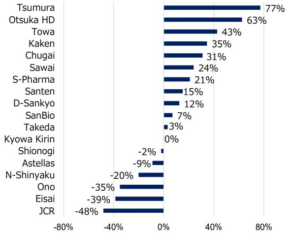

bar chart

| Company | Value (%) |
| :--- | :--- |
| Tsumura | 77 |
| Otsuka HD | 63 |
| Towa | 43 |
| Kaken | 35 |
| Chugai | 31 |
| Sawai | 24 |
| S-Pharma | 21 |
| Santen | 15 |
| D-Sankyo | 12 |
| SanBio | 7 |
| Takeda | 3 |
| Kyowa Kirin | 0 |
| Shionogi | -2 |
| Astellas | -9 |
| N-Shinyaku | -20 |
| Ono | -35 |
| Eisai | -39 |
| JCR | -48 |

Share Price Performance in 2025  
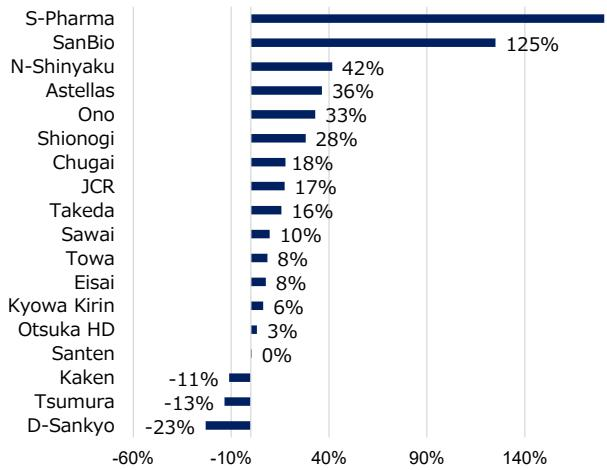

bar chart

| Company | Value (%) |
| :--- | :--- |
| S-Pharma | 150 |
| SanBio | 125 |
| N-Shinyaku | 42 |
| Astellas | 36 |
| Ono | 33 |
| Shionogi | 28 |
| Chugai | 18 |
| JCR | 17 |
| Takeda | 16 |
| Sawai | 10 |
| Towa | 8 |
| Eisai | 8 |
| Kyowa Kirin | 6 |
| Otsuka HD | 3 |
| Santen | 0 |
| Kaken | -11 |
| Tsumura | -13 |
| D-Sankyo | -23 |

YTD Share Price Performance as of 2026/6/16  
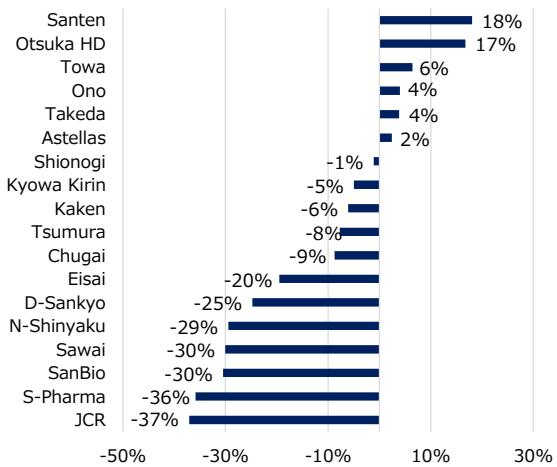

bar chart

| Company | Value (%) |
| :--- | :--- |
| Santen | 18 |
| Otsuka HD | 17 |
| Towa | 6 |
| Ono | 4 |
| Takeda | 4 |
| Astellas | 2 |
| Shionogi | -1 |
| Kyowa Kirin | -5 |
| Kaken | -6 |
| Tsumura | -8 |
| Chugai | -9 |
| Eisai | -20 |
| D-Sankyo | -25 |
| N-Shinyaku | -29 |
| Sawai | -30 |
| SanBio | -30 |
| S-Pharma | -36 |
| JCR | -37 |

Source: FactSet, MS, Note: OW = Overweight, EW = Equal-weight, UW = Underweight

## Pharma: Valuation Comparison (vs Global Pharma, vs TOPIX)

P/E trends: Japan, US and EU Pharma  
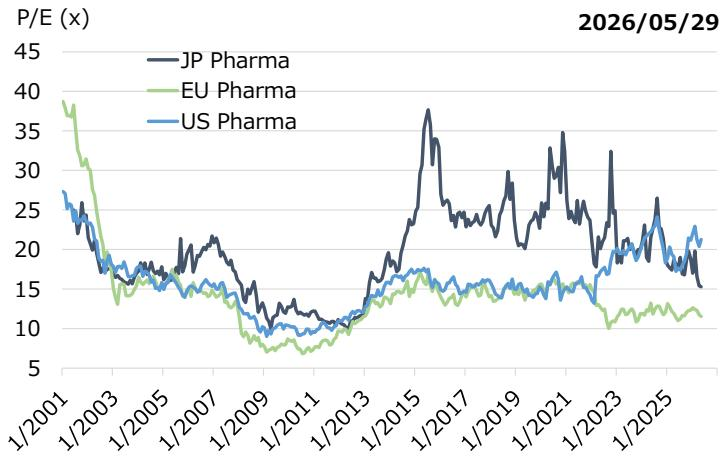

line chart

| Date     | JP Pharma | EU Pharma | US Pharma |
| -------- | --------- | --------- | --------- |
| 2026/05/29 | 15        | 12        | 18        |

Source: FactSet, MS, Note: JP Pharma P/E are weighted avg of our coverage P/E based on our 1-1.5yr forward EPS estimates

TOPIX-relative P/E of Japan Pharma  
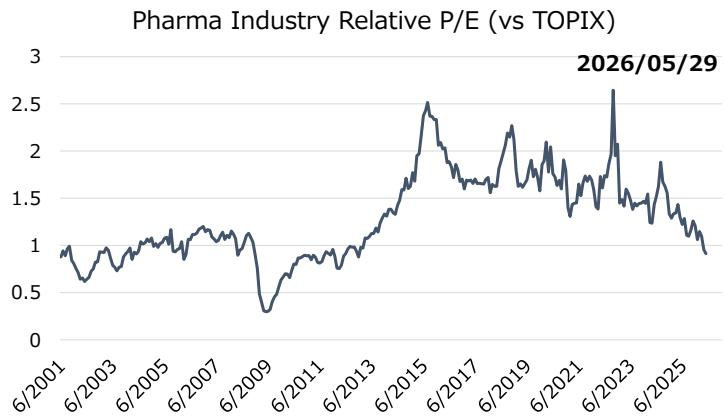

line chart

| Date       | P/E Ratio |
| ---------- | --------- |
| 2026/05/29 | 1.0       |

Stock Performance: Japan, US and EU Pharma  
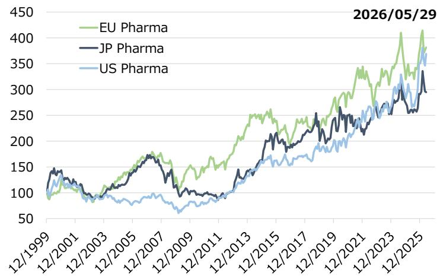

line chart

| Date       | EU Pharma | JP Pharma | US Pharma |
| ---------- | --------- | --------- | --------- |
| 2026/05/29 |           |           |           |

Note: Japan Pharma = TOPIX Pharma. US Pharma = S&P Pharma Industry Index. Europe Pharma = FactSet Pharma. 12/30/1999 = 100. Source: FactSet, MS

## Our view on the pharmaceutical industry

Japan In-Line

US Major Pharma: In-Line

Biotech: Attractive

EU In-Line

Pharma vs. MedTech: P/E Comparison (Global)  
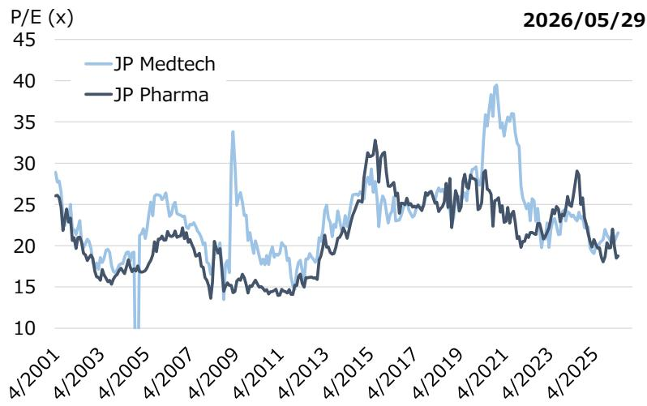

line chart

| Date     | JP Medtech | JP Pharma |
| -------- | ---------- | --------- |
| 2026/05/29 | -          | -         |

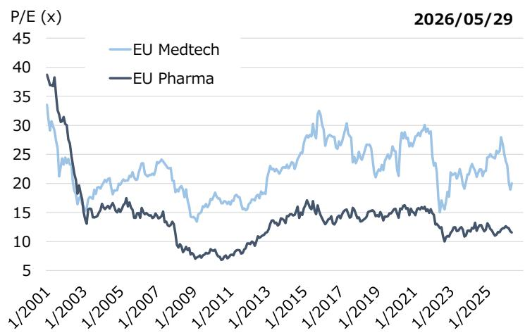

line chart

| Date     | EU Medtech | EU Pharma |
| -------- | ---------- | --------- |
| 2026/05/29 | -          | -         |

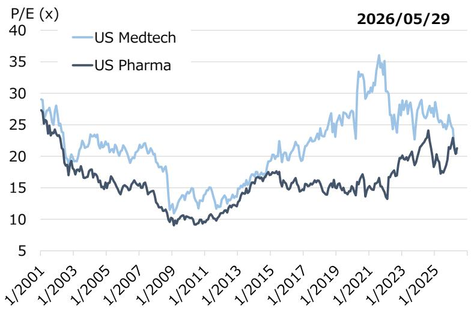

line chart

| Date       | US Medtech | US Pharma |
| ---------- | ---------- | --------- |
| 2026/05/29 |            |           |

Source: FactSet, MS

## Japan/US: Performance by Sector

Japan: Stock Performance by TOPIX Sector  
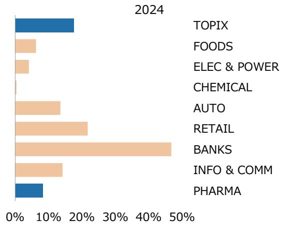

bar chart

2024
| Category | Value (%) |
|---|---|
| TOPIX | 18 |
| FOODS | 7 |
| ELEC & POWER | 5 |
| CHEMICAL | 1 |
| AUTO | 14 |
| RETAIL | 22 |
| BANKS | 47 |
| INFO & COMM | 15 |
| PHARMA | 9 |

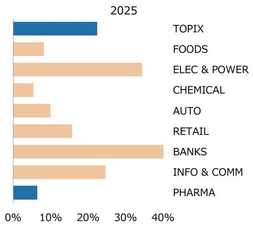

bar chart

2025
| Sector | Value (%) |
| :--- | :--- |
| TOPIX | 23 |
| FOODS | 9 |
| ELEC & POWER | 35 |
| CHEMICAL | 6 |
| AUTO | 11 |
| RETAIL | 16 |
| BANKS | 40 |
| INFO & COMM | 25 |
| PHARMA | 7 |

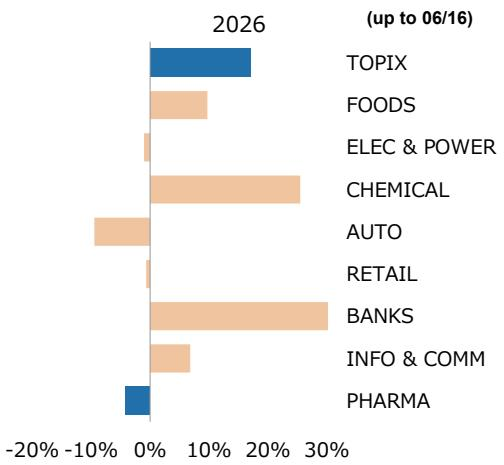

bar chart

2026 (up to 06/16)
| Sector | Value (%) |
| :--- | :--- |
| TOPIX | 18 |
| FOODS | 10 |
| ELEC & POWER | 1 |
| CHEMICAL | 25 |
| AUTO | -8 |
| RETAIL | 1 |
| BANKS | 30 |
| INFO & COMM | 8 |
| PHARMA | -3 |

US: Stock Performance by MSCI Sector  
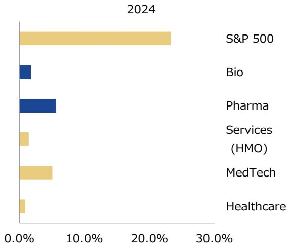

bar chart

2024
| Category | Value (%) |
|---|---|
| S&P 500 | 23.0 |
| Bio | 2.5 |
| Pharma | 6.5 |
| Services (HMO) | 2.0 |
| MedTech | 5.5 |
| Healthcare | 1.5 |

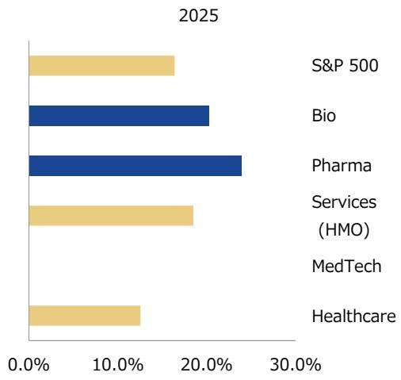

bar chart

2025
| Category | Value (%) |
|---|---|
| S&P 500 | 17.0 |
| Bio | 21.0 |
| Pharma | 24.0 |
| Services (HMO) | 19.0 |
| MedTech | 0.0 |
| Healthcare | 13.0 |

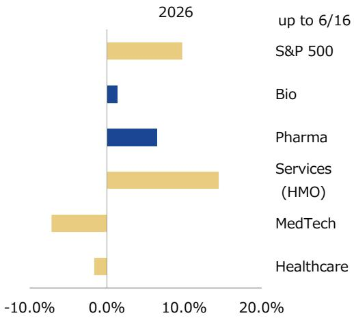

bar chart

2026
| Category | Value (%) |
|---|---|
| S&P 500 | 10.0 |
| Bio | 2.0 |
| Pharma | 7.0 |
| Services (HMO) | 14.0 |
| MedTech | -6.0 |
| Healthcare | -1.0 |
up to 6/16

Source: FactSet, MS

## Generic vs. Long-listed Drugs (Off-patent)

History of Price Cuts

<table><tr><td rowspan="2">Date</td><td rowspan="2">(Actual)Drug Cost Basis</td><td rowspan="2">(Nominal)Drug Cost Basis</td><td rowspan="2">Drug CutMed.Cost Basis</td><td rowspan="2">Adj. Rate</td><td rowspan="2">Avg. gap</td><td colspan="3">Medical Cost Basis</td></tr><tr><td>Net (A+B)</td><td>Dr&#x27;s Fee(A)</td><td>Drug&amp;Device Cost(B)</td></tr><tr><td>4/92</td><td>-</td><td>-8.1%</td><td>-2.4%</td><td>15pt</td><td>23.1%</td><td>+2.5%</td><td>+5.0%</td><td>-2.5%</td></tr><tr><td>4/94</td><td>-</td><td>-6.6%</td><td>-2.0%</td><td>13pt</td><td>19.6%</td><td>+2.7%</td><td>+4.8%</td><td>-2.1%</td></tr><tr><td>4/96</td><td>-</td><td>-6.8%</td><td>-2.6%</td><td>11pt</td><td>17.8%</td><td>+0.8%</td><td>+3.4%</td><td>-2.6%</td></tr><tr><td>4/97</td><td>-</td><td>-4.4%</td><td>-1.27%</td><td>10pt</td><td>14.5%</td><td>+0.4%</td><td>+1.7%</td><td>-1.3%</td></tr><tr><td>4/98</td><td>-</td><td>-9.7%</td><td>-2.7%</td><td>5pt</td><td>13.1%</td><td>-1.3%</td><td>+1.5%</td><td>-2.8%</td></tr><tr><td>4/00</td><td>-</td><td>-7.0%</td><td>-1.6%</td><td>2pt</td><td>9.5%</td><td>+0.2%</td><td>+1.9%</td><td>-1.7%</td></tr><tr><td>4/02</td><td>-</td><td>-6.3%</td><td>-1.3%</td><td>2pt</td><td>7.1%</td><td>-2.7%</td><td>-1.3%</td><td>-1.4%</td></tr><tr><td>4/04</td><td>-</td><td>-4.2%</td><td>-0.9%</td><td>2pt</td><td>6.3%</td><td>-1.1%</td><td>+0.0%</td><td>-1.1%</td></tr><tr><td>4/06</td><td>-</td><td>-6.7%</td><td>-1.6%</td><td>2pt</td><td>8.0%</td><td>-3.16%</td><td>-1.36%</td><td>-1.80%</td></tr><tr><td>4/08</td><td>-</td><td>-5.2%</td><td>-1.1%</td><td>2pt</td><td>6.9%</td><td>-0.82%</td><td>+0.38%</td><td>-1.20%</td></tr><tr><td>4/10</td><td>-6.51%</td><td>-5.75%</td><td>-1.23%</td><td>2pt</td><td>8.4%</td><td>+0.19%</td><td>+1.55%</td><td>-1.36%</td></tr><tr><td>4/12</td><td>-6.25%</td><td>-6.00%</td><td>-1.26%</td><td>2pt</td><td>8.4%</td><td>+0.004%</td><td>+1.38%</td><td>-1.38%</td></tr><tr><td>4/14 (ex-Ctax)</td><td>-</td><td>-5.64%</td><td>-1.22%</td><td>2pt</td><td>8.2%</td><td>-1.26%</td><td>+0.10%</td><td>-1.36%</td></tr><tr><td>4/16</td><td>-7.8%</td><td>-5.57%</td><td>-1.22%</td><td>2pt</td><td>8.8%</td><td>-0.84%</td><td>+0.49%</td><td>-1.33%</td></tr><tr><td>4/18</td><td>-7.48%</td><td>-6.17%</td><td>-1.36%</td><td>2pt</td><td>9.1%</td><td>-0.90%</td><td>+0.55%</td><td>-1.45%</td></tr><tr><td>10/19 (Ctax)</td><td>-4.35%</td><td>-2.40%</td><td>na</td><td>2pt</td><td>7.2%</td><td>na</td><td>na</td><td>na</td></tr><tr><td>4/20</td><td>-</td><td>-4.38%</td><td>-0.99%</td><td>2pt</td><td>8.0%</td><td>-0.46%</td><td>+0.55%</td><td>-1.01%</td></tr><tr><td>4/21</td><td>-</td><td>-4.00%</td><td>-</td><td>2pt</td><td>8.0%</td><td>+0.00%</td><td>+0.00%</td><td>na</td></tr><tr><td>4/22</td><td>-</td><td>-6.69%</td><td>-1.35%</td><td>2pt</td><td>7.6%</td><td>-0.94%</td><td>+0.43%</td><td>-1.37%</td></tr><tr><td>4/23</td><td>-</td><td>-3.00%</td><td>-</td><td>2pt</td><td>7.0%</td><td>na</td><td>na</td><td>na</td></tr><tr><td>4/24</td><td></td><td>-4.67%</td><td>-0.97%</td><td>2pt</td><td>6.0%</td><td>-0.12%</td><td>+0.88%</td><td>-1.00%</td></tr><tr><td>4/25</td><td></td><td>-2.00%</td><td>na</td><td>2pt</td><td>5.2%</td><td>na</td><td>na</td><td>na</td></tr><tr><td>4/26</td><td></td><td>-4.02%</td><td>-0.86%</td><td>2pt</td><td>4.8%</td><td>+2.41%</td><td>+3.28%</td><td>-0.87%</td></tr></table>

Source: MHLW, MOF, MS

% of Overseas Sales (Based on FY2025)  
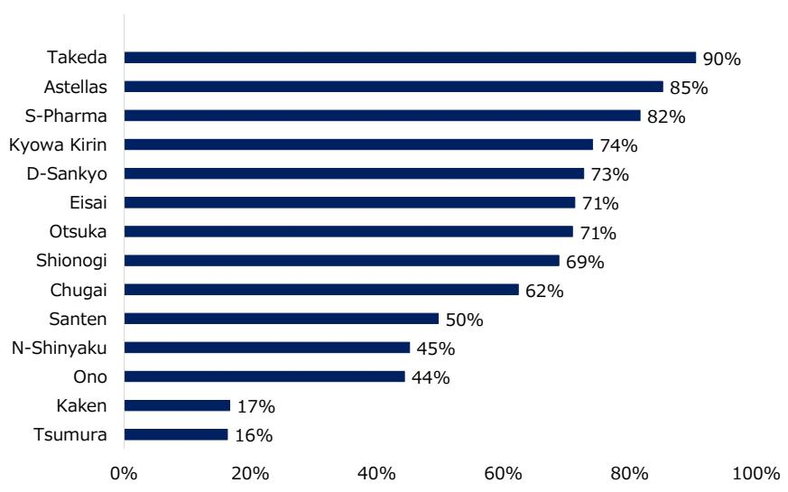

bar chart

| Company | Percentage (%) |
| :--- | :--- |
| Takeda | 90 |
| Astellas | 85 |
| S-Pharma | 82 |
| Kyowa Kirin | 74 |
| D-Sankyo | 73 |
| Eisai | 71 |
| Otsuka | 71 |
| Shionogi | 69 |
| Chugai | 62 |
| Santen | 50 |
| N-Shinyaku | 45 |
| Ono | 44 |
| Kaken | 17 |
| Tsumura | 16 |

Source: Company, MS

2026 April Price Cut Impact

<table><tr><td colspan="2">0-1%</td><td colspan="2">1-2%</td><td colspan="2">2-3%</td><td colspan="2">3-4%</td><td colspan="2">&gt;4%</td><td colspan="2">&gt;7%</td></tr><tr><td rowspan="4">Nippon Shinyak</td><td rowspan="4">0.0%</td><td rowspan="4">Towa</td><td rowspan="4">1.3%</td><td>Eisai</td><td>low-4%</td><td>Astellas</td><td>Approx 3%</td><td>Ono</td><td>high-4$</td><td>Otsuka HD</td><td>7%</td></tr><tr><td>Chugai</td><td>low-2%</td><td>Sumitomo</td><td>Approx 3%</td><td>Santen</td><td>low-6%</td><td>Kyowa Kirin</td><td>low-7%</td></tr><tr><td>Takeda</td><td>high-2%</td><td>Kaken</td><td>Approx 3%</td><td></td><td></td><td></td><td></td></tr><tr><td>JCR</td><td>2.8%</td><td></td><td></td><td></td><td></td><td></td><td></td></tr><tr><td>Shionogi</td><td>No impact</td><td></td><td></td><td></td><td></td><td>Sawai</td><td>Approx 3%</td><td></td><td></td><td></td><td></td></tr><tr><td>Tsumura</td><td>+0.1%</td><td></td><td></td><td></td><td></td><td></td><td></td><td></td><td></td><td>&gt;9%</td><td></td></tr><tr><td></td><td></td><td></td><td></td><td></td><td></td><td>Indst Avg</td><td>4.02%</td><td></td><td></td><td>Daiichi Sankyo</td><td>9%</td></tr></table>

Note: The revision rate above excludes the amount compensating for consumption tax and similar items.  
Source: RIS FAX, Nikkan Yakugyo, Company data, MS

## Medical & Pharma Cost Spending Structure in Japan

Japanese Healthcare: Breakdown of Y48trn annual budget (F3/2024)  
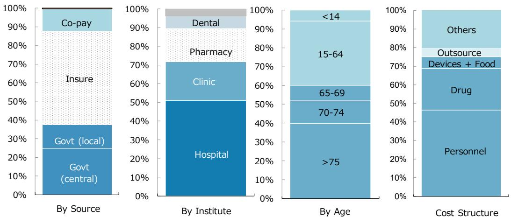

stacked bar chart

| Category | Subcategory | Percentage (%) |
| :--- | :--- | :--- |
| By Source | Co-pay | 20 |
| By Source | Insure | 65 |
| By Source | Govt (local) | 35 |
| By Source | Govt (central) | 25 |
| By Institute | Clinic | 25 |
| By Institute | Pharmacy | 15 |
| By Institute | Dental | 10 |
| By Institute | Hospital | 50 |
| By Age | <14 | 10 |
| By Age | 15-64 | 70 |
| By Age | >75 | 40 |
| Cost Structure | Others | 20 |
| Cost Structure | Outsource | 10 |
| Cost Structure | Devices + Food | 70 |
| Cost Structure | Drug | 60 |
| Cost Structure | Personnel | 50 |

Source: MHLW, MS, Note: Only "Cost Structure" shows data for F3/2017

JP Pharma Spending (by indication, 2023)  
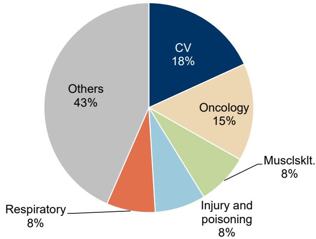

pie chart

| Category | Percentage (%) |
| :--- | :--- |
| Others | 43 |
| CV | 18 |
| Oncology | 15 |
| MusclskIt. | 8 |
| Injury and poisoning | 8 |
| Respiratory | 8 |

Source: MHLW, MS

Rx market Breakdown by Volume (Jpn)  
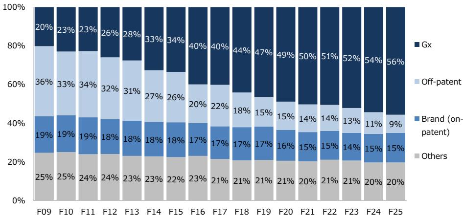

stacked bar chart

| Year | Gx (%) | Off-patent (%) | Brand (on-patent) (%) | Others (%) |
|---|---|---|---|---|
| F09 | 20 | 36 | 19 | 25 |
| F10 | 23 | 33 | 19 | 25 |
| F11 | 23 | 34 | 19 | 24 |
| F12 | 26 | 32 | 18 | 24 |
| F13 | 28 | 31 | 18 | 23 |
| F14 | 33 | 27 | 18 | 23 |
| F15 | 34 | 26 | 18 | 22 |
| F16 | 40 | 20 | 17 | 23 |
| F17 | 40 | 22 | 17 | 21 |
| F18 | 44 | 18 | 17 | 21 |
| F19 | 47 | 15 | 17 | 21 |
| F20 | 49 | 15 | 16 | 21 |
| F21 | 50 | 14 | 15 | 20 |
| F22 | 51 | 14 | 15 | 21 |
| F23 | 52 | 13 | 14 | 21 |
| F24 | 54 | 11 | 15 | 20 |
| F25 | 56 | 9 | 15 | 20 |

Source: MHLW, MS

Rx market Breakdown by Value (Jpn)  
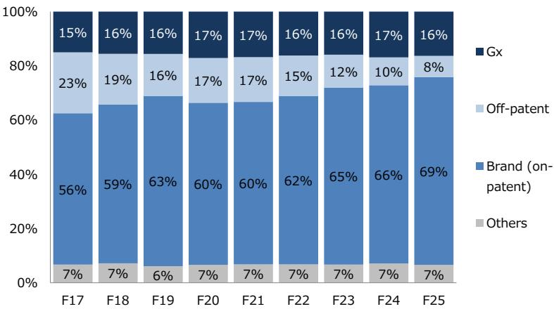

stacked bar chart

| Year | Gx (%) | Off-patent (%) | Brand (on-patent) (%) | Others (%) |
|---|---|---|---|---|
| F17 | 15 | 23 | 56 | 7 |
| F18 | 16 | 19 | 59 | 7 |
| F19 | 16 | 16 | 63 | 6 |
| F20 | 17 | 17 | 60 | 7 |
| F21 | 17 | 17 | 60 | 7 |
| F22 | 16 | 15 | 62 | 7 |
| F23 | 16 | 12 | 65 | 7 |
| F24 | 17 | 10 | 66 | 7 |
| F25 | 16 | 8 | 69 | 7 |

Source: MHLW, MS

## New Drug Approvals Rising & Market Growth

FDA approvals  
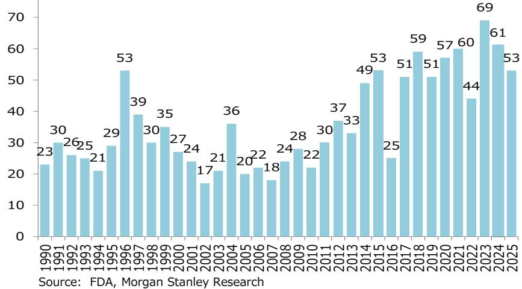

bar chart

| Year | Value |
|---|---|
| 1990 | 23 |
| 1991 | 30 |
| 1992 | 26 |
| 1993 | 25 |
| 1994 | 21 |
| 1995 | 29 |
| 1996 | 53 |
| 1997 | 39 |
| 1998 | 30 |
| 1999 | 35 |
| 2000 | 27 |
| 2001 | 24 |
| 2002 | 17 |
| 2003 | 21 |
| 2004 | 36 |
| 2005 | 20 |
| 2006 | 22 |
| 2007 | 18 |
| 2008 | 24 |
| 2009 | 28 |
| 2010 | 22 |
| 2011 | 30 |
| 2012 | 37 |
| 2013 | 33 |
| 2014 | 49 |
| 2015 | 53 |
| 2016 | 25 |
| 2017 | 51 |
| 2018 | 59 |
| 2019 | 51 |
| 2020 | 57 |
| 2021 | 60 |
| 2022 | 44 |
| 2023 | 69 |
| 2024 | 61 |
| 2025 | 53 |
Source: FDA, MS

NME: # of new drug approvals in the US (related to JP companies)  
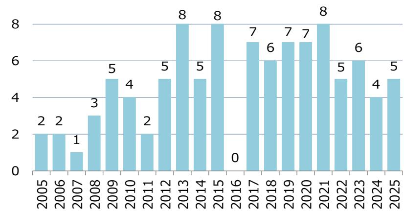

bar chart

| Year | Value |
|---|---|
| 2005 | 2 |
| 2006 | 2 |
| 2007 | 1 |
| 2008 | 3 |
| 2009 | 5 |
| 2010 | 4 |
| 2011 | 2 |
| 2012 | 5 |
| 2013 | 8 |
| 2014 | 5 |
| 2015 | 8 |
| 2016 | 0 |
| 2017 | 7 |
| 2018 | 6 |
| 2019 | 7 |
| 2020 | 7 |
| 2021 | 8 |
| 2022 | 5 |
| 2023 | 6 |
| 2024 | 4 |
| 2025 | 5 |

Source: FDA, MS

US Rx market  
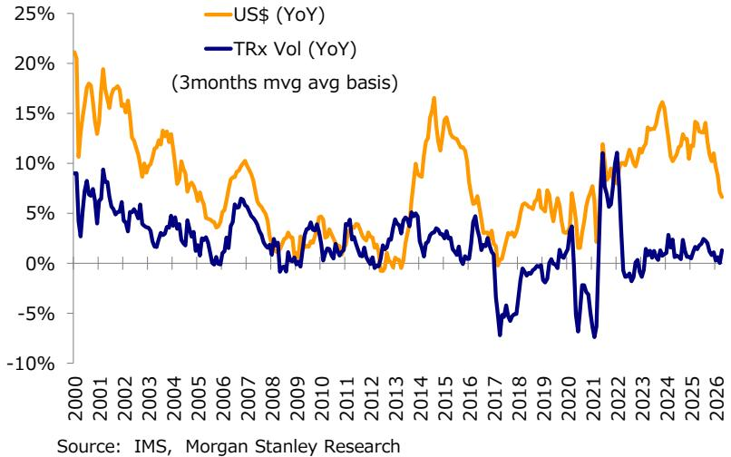

line chart

| Year | US$ (YoY) | TRx Vol (YoY) |
|------|-----------|---------------|
| 2000 | ~21%      | ~9%           |
| 2001 | ~18%      | ~7%           |
| 2002 | ~15%      | ~5%           |
| 2003 | ~13%      | ~4%           |
| 2004 | ~10%      | ~3%           |
| 2005 | ~8%       | ~2%           |
| 2006 | ~6%       | ~1%           |
| 2007 | ~10%      | ~5%           |
| 2008 | ~5%       | ~-2%          |
| 2009 | ~3%       | ~-1%          |
| 2010 | ~4%       | ~0%           |
| 2011 | ~5%       | ~1%           |
| 2012 | ~6%       | ~2%           |
| 2013 | ~7%       | ~3%           |
| 2014 | ~16%      | ~4%           |
| 2015 | ~14%      | ~3%           |
| 2016 | ~10%      | ~2%           |
| 2017 | ~5%       | ~-5%          |
| 2018 | ~6%       | ~-3%          |
| 2019 | ~7%       | ~-1%          |
| 2020 | ~8%       | ~-5%          |
| 2021 | ~12%      | ~-8%          |
| 2022 | ~15%      | ~-5%          |
| 2023 | ~14%      | ~-3%          |
| 2024 | ~16%      | ~-2%          |
| 2025 | ~14%      | ~-1%          |
| 2026 | ~10%      | ~-1%          |

Japanese Rx market: Quarterly growth rate  
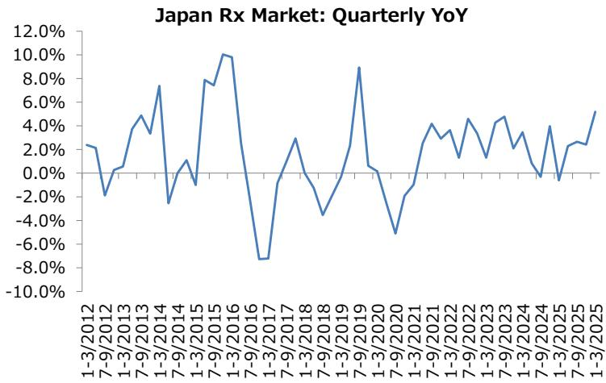

line chart

| Date       | Value  |
| ---------- | ------ |
| 1-3/2012   | 2.0%   |
| 7-9/2012   | -2.0%  |
| 1-3/2013   | 4.0%   |
| 7-9/2013   | 7.0%   |
| 1-3/2014   | -3.0%  |
| 7-9/2014   | 1.0%   |
| 1-3/2015   | -1.0%  |
| 7-9/2015   | 8.0%   |
| 1-3/2016   | 10.0%  |
| 7-9/2016   | -8.0%  |
| 1-3/2017   | -1.0%  |
| 7-9/2017   | 3.0%   |
| 1-3/2018   | -4.0%  |
| 7-9/2018   | -6.0%  |
| 1-3/2019   | 9.0%   |
| 7-9/2019   | -5.0%  |
| 1-3/2020   | -6.0%  |
| 7-9/2020   | -2.0%  |
| 1-3/2021   | 4.0%   |
| 7-9/2021   | 3.0%   |
| 1-3/2022   | 5.0%   |
| 7-9/2022   | 4.0%   |
| 1-3/2023   | 5.0%   |
| 7-9/2023   | 3.0%   |
| 1-3/2024   | -1.0%  |
| 7-9/2024   | -6.0%  |
| 1-3/2025   | 3.0%   |
| 7-9/2025   | 5.0%   |
| 1-3/2026   | 6.0%   |

Source: IMS, MS

## Forex Sensitivity

Forex Impact

<table><tr><td rowspan="2"></td><td colspan="2">FX</td><td colspan="2">Impact of ¥1 appreciation (¥, 100mil)</td><td colspan="2">F3/27Ce(¥, 100mil)</td><td colspan="2">FX effect to F3/27Ce</td></tr><tr><td>F3/26</td><td>F3/27Ce</td><td>Sales</td><td>OP</td><td>Sales</td><td>OP</td><td>Sales</td><td>OP</td></tr><tr><td>Takeda*</td><td></td><td></td><td></td><td></td><td>46,400</td><td>11,600</td><td></td><td></td></tr><tr><td>USD</td><td>150.0</td><td>156.0</td><td>-132.1</td><td>-23.9</td><td></td><td></td><td>-0.3%</td><td>-0.2%</td></tr><tr><td>EUR</td><td>174.0</td><td>182.0</td><td>-38.0</td><td>9.7</td><td></td><td></td><td>-0.1%</td><td>0.1%</td></tr><tr><td>RUB*</td><td>1.9</td><td>2.0</td><td>-4.5</td><td>-2.9</td><td></td><td></td><td>0.0%</td><td>0.0%</td></tr><tr><td>CNY*</td><td>21.1</td><td>22.4</td><td>-19.9</td><td>-12.2</td><td></td><td></td><td>0.0%</td><td>-0.1%</td></tr><tr><td>BRL*</td><td>27.6</td><td>29.5</td><td>-14.2</td><td>-11.6</td><td></td><td></td><td>0.0%</td><td>-0.1%</td></tr><tr><td>Astellas</td><td></td><td></td><td></td><td></td><td>22,200</td><td>6,200</td><td></td><td></td></tr><tr><td>USD</td><td>151.0</td><td>150.0</td><td>-81.0</td><td>-23.0</td><td></td><td></td><td>-0.4%</td><td>-0.4%</td></tr><tr><td>EUR</td><td>175.0</td><td>180.0</td><td>-38.0</td><td>-17.0</td><td></td><td></td><td>-0.2%</td><td>-0.3%</td></tr><tr><td>Daiichi Sankyo</td><td></td><td></td><td></td><td></td><td>22,800</td><td>3,600</td><td></td><td></td></tr><tr><td>USD</td><td>150.8</td><td>150.0</td><td>-65.0</td><td>2.0</td><td></td><td></td><td>-0.3%</td><td>0.1%</td></tr><tr><td>EUR</td><td>174.8</td><td>180.0</td><td>-26.0</td><td>-7.0</td><td></td><td></td><td>-0.1%</td><td>-0.2%</td></tr><tr><td>Eisai</td><td></td><td></td><td></td><td></td><td>8,835</td><td>700</td><td></td><td></td></tr><tr><td>USD</td><td>150.8</td><td>153.0</td><td>19.6</td><td>-5.2</td><td></td><td></td><td>0.2%</td><td>-0.7%</td></tr><tr><td>EUR</td><td>174.8</td><td>180.0</td><td>2.7</td><td>0.3</td><td></td><td></td><td>0.0%</td><td>0.0%</td></tr><tr><td>GBP</td><td>202.1</td><td>205.0</td><td>0.6</td><td>-0.8</td><td></td><td></td><td>0.0%</td><td>-0.1%</td></tr><tr><td>CNY</td><td>21.2</td><td>22.5</td><td>59.6</td><td>34.6</td><td></td><td></td><td>0.7%</td><td>4.9%</td></tr><tr><td>Sumitomo Pharma</td><td></td><td></td><td></td><td></td><td>5,400</td><td>910</td><td></td><td></td></tr><tr><td>USD</td><td>150.7</td><td>155.0</td><td>-28.0</td><td>-6.0</td><td></td><td></td><td>-0.5%</td><td>-0.7%</td></tr><tr><td>CNY</td><td>20.1</td><td></td><td>-</td><td>-</td><td></td><td></td><td></td><td></td></tr><tr><td>Shionogi</td><td></td><td></td><td></td><td></td><td>7,000</td><td>2,200</td><td></td><td></td></tr><tr><td>USD</td><td>150.7</td><td>153.0</td><td>-</td><td>-</td><td></td><td></td><td></td><td></td></tr><tr><td>GBP</td><td>201.9</td><td>205.0</td><td>-</td><td>-</td><td></td><td></td><td></td><td>80% hedged</td></tr><tr><td>EUR</td><td>174.7</td><td>184.0</td><td>-</td><td>-</td><td></td><td></td><td></td><td></td></tr><tr><td>Santen*</td><td></td><td></td><td></td><td></td><td>3,110</td><td>590</td><td></td><td></td></tr><tr><td>USD</td><td>150.8</td><td>155.0</td><td>-0.2</td><td>0.6</td><td></td><td></td><td>0.0%</td><td>0.1%</td></tr><tr><td>EUR</td><td>174.7</td><td>180.0</td><td>-6.7</td><td>-0.7</td><td></td><td></td><td>-0.2%</td><td>-0.1%</td></tr><tr><td>CNY</td><td>21.3</td><td>23.0</td><td>-3.3</td><td>-0.7</td><td></td><td></td><td>-0.1%</td><td>-0.1%</td></tr><tr><td>Ono</td><td></td><td></td><td></td><td></td><td>4,550</td><td>1,240</td><td></td><td></td></tr><tr><td>USD</td><td>151.0</td><td>155.0</td><td>-15.0</td><td>-5.0</td><td></td><td></td><td>-0.3%</td><td>-0.4%</td></tr></table>

<table><tr><td rowspan="2"></td><td colspan="3">FX</td><td colspan="2">Impact of ¥1 appreciation (¥, 100mil)</td><td colspan="2">F12/26Ce(¥, 100mil)</td><td colspan="2">FX effect to F12/26Ce</td></tr><tr><td>F12/25</td><td>1Q</td><td>F12/26Ce</td><td>Sales</td><td>OP</td><td>Sales</td><td>OP</td><td>Sales</td><td>OP</td></tr><tr><td>FY end in Dec Chugai</td><td></td><td></td><td></td><td></td><td></td><td>13,450</td><td>6,700</td><td></td><td></td></tr><tr><td>CHF</td><td>173.6</td><td>182.6</td><td>184.0</td><td>-</td><td>-</td><td></td><td></td><td colspan="2">80% hedged</td></tr><tr><td>EUR</td><td>168.8</td><td>183.3</td><td>179.0</td><td>-</td><td>-</td><td></td><td></td><td></td><td></td></tr><tr><td>USD</td><td>147.1</td><td>149.9</td><td>151.0</td><td>-</td><td>-</td><td></td><td></td><td></td><td></td></tr><tr><td>SGD</td><td>113.6</td><td>122.2</td><td>119.0</td><td>-</td><td>-</td><td></td><td></td><td></td><td></td></tr><tr><td>Otsuka</td><td></td><td></td><td></td><td></td><td></td><td>25,200</td><td>3,550</td><td>-0.4%</td><td>-0.5%</td></tr><tr><td>USD</td><td>149.6</td><td>157.0</td><td>150.0</td><td>-86.0</td><td>-16.0</td><td></td><td></td><td>-0.3%</td><td>-0.5%</td></tr><tr><td>EUR</td><td>169.2</td><td>183.6</td><td>175.0</td><td>-8.0</td><td>-2.0</td><td></td><td></td><td>0.0%</td><td>-0.1%</td></tr><tr><td>Kyowa Kirin</td><td></td><td></td><td></td><td></td><td></td><td>5,200</td><td>1,300</td><td>-0.4%</td><td>-0.4%</td></tr><tr><td>USD</td><td>150.0</td><td>155.0</td><td>150.0</td><td>-18.0</td><td>-6.0</td><td></td><td></td><td>-0.3%</td><td>-0.5%</td></tr><tr><td>GBP</td><td>197.0</td><td>210.0</td><td>205.0</td><td>-1.0</td><td>1.0</td><td></td><td></td><td>0.0%</td><td>0.1%</td></tr><tr><td>EUR</td><td>168.0</td><td>183.0</td><td>180.0</td><td>-4.0</td><td>-2.0</td><td></td><td></td><td>-0.1%</td><td>-0.2%</td></tr></table>

Takeda, Astellas, S-Pharma, Shionogi, Santen, Chugai, Otsuka, and Kyowa Kirin's OP = Core OP, Ce=company estimates, For Takeda, values for RUB/CNY/BRL are the impact of 1% yen appreciation and for Santen, FX sensitivity values are the impact of 1% yen appreciation; Source: Company data, MS

## Medical & Pharma Cost Spending in Japan

Japan: Medical Cost & GDP Ratio  
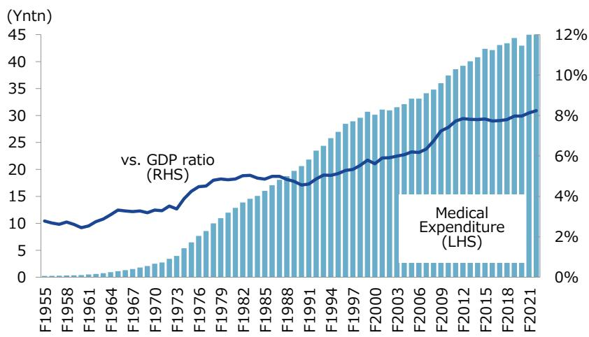

bar-line hybrid chart

| Year | Medical Expenditure (LHS) (Ytn) | vs. GDP ratio (RHS) |
|------|----------------------------------|---------------------|
| F1955 | 0                                | 10                  |
| F1958 | 0                                | 9                   |
| F1961 | 0                                | 10                  |
| F1964 | 0                                | 12                  |
| F1967 | 0                                | 13                  |
| F1970 | 0                                | 14                  |
| F1973 | 0                                | 15                  |
| F1976 | 0                                | 17                  |
| F1979 | 0                                | 18                  |
| F1982 | 0                                | 19                  |
| F1985 | 0                                | 20                  |
| F1988 | 0                                | 21                  |
| F1991 | 0                                | 22                  |
| F1994 | 0                                | 23                  |
| F1997 | 0                                | 24                  |
| F2000 | 0                                | 25                  |
| F2003 | 0                                | 26                  |
| F2006 | 0                                | 27                  |
| F2009 | 0                                | 28                  |
| F2012 | 0                                | 29                  |
| F2015 | 0                                | 30                  |
| F2018 | 0                                | 31                  |
| F2021 | 0                                | 32                  |

Note: Fiscal year ends in the following March. Source: MHLW, MS

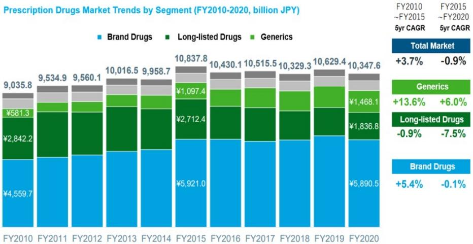

stacked bar chart

Prescription Drugs Market Trends by Segment (FY2010-2020, billion JPY)
| Year | Brand Drugs (billion JPY) | Long-listed Drugs (billion JPY) | Generics (billion JPY) | Total Market (%) |
| :--- | :--- | :--- | :--- | :--- |
| FY2010 | 4,559.7 | 2,842.2 | 581.3 | +3.7 |
| FY2011 | 9,534.9 | 1,666.8 | 13.4 | -0.9 |
| FY2012 | 9,560.1 | 2,468.9 | 13.4 | -0.9 |
| FY2013 | 10,016.5 | 2,678.7 | 13.4 | -0.9 |
| FY2014 | 9,958.7 | 2,468.9 | 13.4 | -0.9 |
| FY2015 | 5,921.0 | 2,712.4 | 1,097.4 | +3.7 |
| FY2016 | 10,430.1 | 2,188.8 | 1,097.4 | +3.7 |
| FY2017 | 10,515.5 | 2,188.8 | 1,097.4 | +3.7 |
| FY2018 | 10,329.3 | 2,188.8 | 1,097.4 | +3.7 |
| FY2019 | 10,629.4 | 2,188.8 | 1,468.1 | +3.7 |
| FY2020 | 5,890.5 | 1,836.8 | 1,468.1 | +3.7 |
FY2010 ~FY2015 -5yr CAGR
FY2015 ~FY2020 -5yr CAGR
Total Market: +3.7%
Generics: +13.6%
Long-listed Drugs: -0.9%
Brand Drugs: +5.4% -0.1%

Source: IQVIA, MS

Japan Rx Market Size Trends  
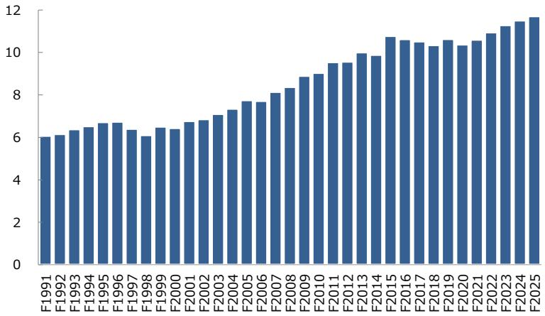

bar chart

| Year | Value |
|---|---|
| F1991 | 6.0 |
| F1992 | 6.1 |
| F1993 | 6.3 |
| F1994 | 6.5 |
| F1995 | 6.7 |
| F1996 | 6.8 |
| F1997 | 6.4 |
| F1998 | 6.0 |
| F1999 | 6.5 |
| F2000 | 6.4 |
| F2001 | 6.8 |
| F2002 | 7.0 |
| F2003 | 7.2 |
| F2004 | 7.4 |
| F2005 | 7.8 |
| F2006 | 7.7 |
| F2007 | 8.1 |
| F2008 | 8.3 |
| F2009 | 8.9 |
| F2010 | 9.0 |
| F2011 | 9.5 |
| F2012 | 9.5 |
| F2013 | 10.0 |
| F2014 | 9.9 |
| F2015 | 10.8 |
| F2016 | 10.6 |
| F2017 | 10.5 |
| F2018 | 10.3 |
| F2019 | 10.6 |
| F2020 | 10.4 |
| F2021 | 10.6 |
| F2022 | 11.0 |
| F2023 | 11.3 |
| F2024 | 11.5 |
| F2025 | 11.8 |

Note: Fiscal year ends in the following March, Source: MHLW, MS

Rx market/ National Health Expenditure  
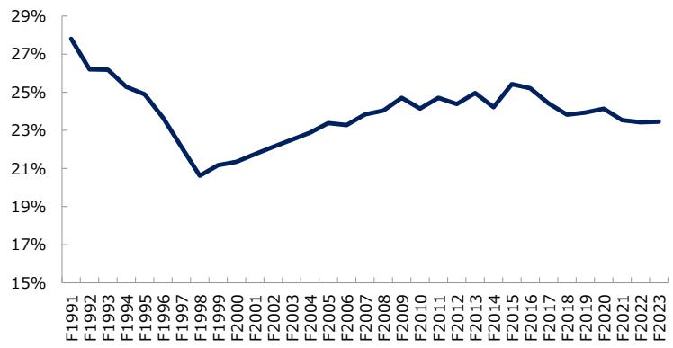

line chart

| Year | Value (%) |
|---|---|
| F1991 | 28 |
| F1992 | 26.5 |
| F1993 | 26.4 |
| F1994 | 25.5 |
| F1995 | 25 |
| F1996 | 23.5 |
| F1997 | 21.5 |
| F1998 | 20.5 |
| F1999 | 21 |
| F2000 | 21.5 |
| F2001 | 22 |
| F2002 | 22.5 |
| F2003 | 23 |
| F2004 | 23.5 |
| F2005 | 23.5 |
| F2006 | 23.5 |
| F2007 | 24 |
| F2008 | 24.5 |
| F2009 | 25 |
| F2010 | 24.5 |
| F2011 | 24.5 |
| F2012 | 24.5 |
| F2013 | 25 |
| F2014 | 24.5 |
| F2015 | 25.5 |
| F2016 | 25 |
| F2017 | 24.5 |
| F2018 | 24 |
| F2019 | 24 |
| F2020 | 24 |
| F2021 | 23.5 |
| F2022 | 23.5 |
| F2023 | 23.5 |

Note: Fiscal year ends in the following March,  
Source: MHLW, MS

## US Pharmaceutical Market

US Market by Disease (Volume)  
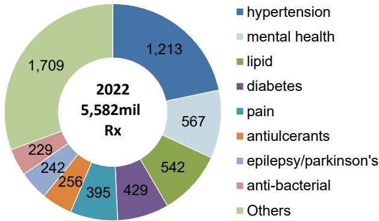

pie chart

2022
5,582mil Rx
| Category | Value |
|---|---|
| hypertension | 1,213 |
| mental health | 567 |
| lipid | 542 |
| diabetes | 429 |
| pain | 395 |
| antiulcerants | 256 |
| epilepsy/parkinson's | 242 |
| anti-bacterial | 229 |
| Others | 1,709 |

Source: IQVIA, MS

US Market Trends: Brand vs. Gx (Vol)  
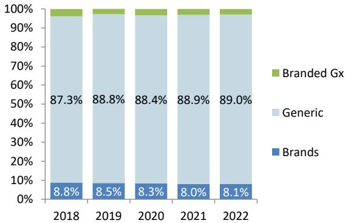

stacked bar chart

| Year | Branded Gx (%) | Generic (%) | Brands (%) |
|---|---|---|---|
| 2018 | 3.5 | 87.3 | 8.8 |
| 2019 | 3.4 | 88.8 | 8.5 |
| 2020 | 3.4 | 88.4 | 8.3 |
| 2021 | 3.4 | 88.9 | 8.0 |
| 2022 | 3.4 | 89.0 | 8.1 |

Source: IQVIA, MS

US Rx Market: Gross vs. Net  
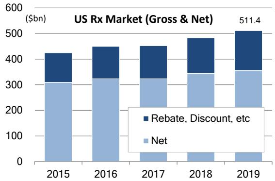

stacked bar chart

US Rx Market (Gross & Net)
| Year | Net ($bn) | Rebate, Discount, etc ($bn) |
| :--- | :--- | :--- |
| 2015 | 308 | 124 |
| 2016 | 323 | 137 |
| 2017 | 324 | 140 |
| 2018 | 343 | 156 |
| 2019 | 356 | 174 |
| Total | 511.4 | (unlabeled top segment) |

Source: IQVIA, MS

US Market by Disease (Value)  
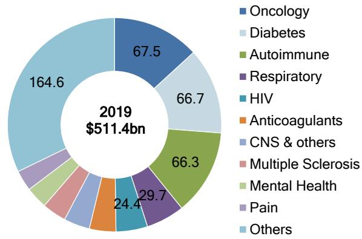

pie chart

2019 $511.4bn
| Category | Value ($bn) |
|---|---|
| Oncology | 67.5 |
| Diabetes | 66.7 |
| Autoimmune | 66.3 |
| Respiratory | 29.7 |
| HIV | 24.4 |
| Anticoagulants | 24.4 |
| CNS & others | 24.4 |
| Multiple Sclerosis | 24.4 |
| Mental Health | 24.4 |
| Pain | 24.4 |
| Others | 164.6 |

Source: IQVIA, MS

US Market Trends: Brand vs. Gx  
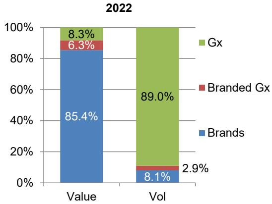

stacked bar chart

2022
| Category | Brands (%) | Branded Gx (%) | Gx (%) |
| :--- | :--- | :--- | :--- |
| Value | 85.4 | 6.3 | 8.3 |
| Vol | 8.1 | 2.9 | 89.0 |

Source: IQVIA, MS

US Market by Payer  
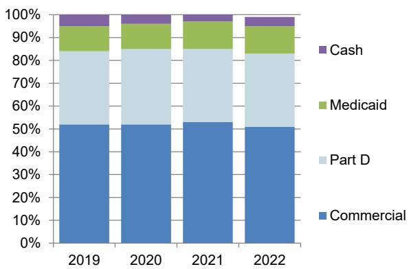

stacked bar chart

| Year | Commercial | Part D | Medicaid | Cash |
|------|------------|--------|----------|------|
| 2019 | 52%        | 27%    | 13%      | 4%   |
| 2020 | 52%        | 27%    | 13%      | 4%   |
| 2021 | 53%        | 26%    | 13%      | 4%   |
| 2022 | 51%        | 28%    | 14%      | 4%   |

Source: IQVIA, MS

## Global Medical & Pharma Market Structure

Global Pharma Market by Region  
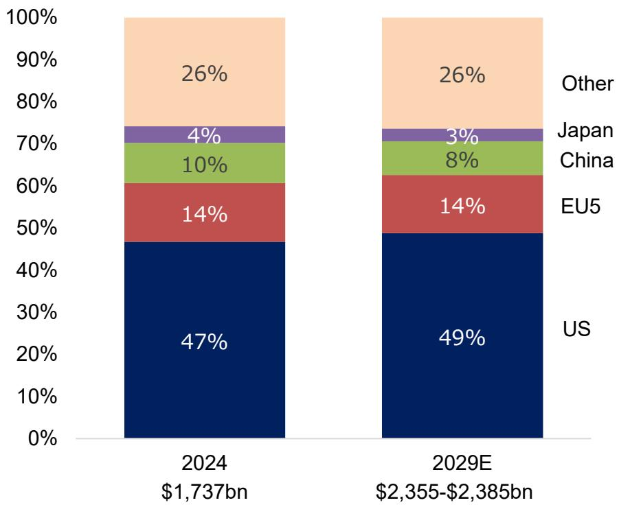

stacked bar chart

| Year | Region | Percentage (%) |
| :--- | :--- | :--- |
| 2024 | US | 47 |
| 2024 | EU5 | 14 |
| 2024 | China | 10 |
| 2024 | Japan | 4 |
| 2024 | Other | 26 |
| 2029E | US | 49 |
| 2029E | EU5 | 14 |
| 2029E | China | 8 |
| 2029E | Japan | 3 |
| 2029E | Other | 26 |
$1,737bn vs $2,355-$2,385bn

Source: IQVIA "Global Use of Medicines 2024", MS, Note: E=IQVIA estimates

Medical cost : % of GDP in 2024  
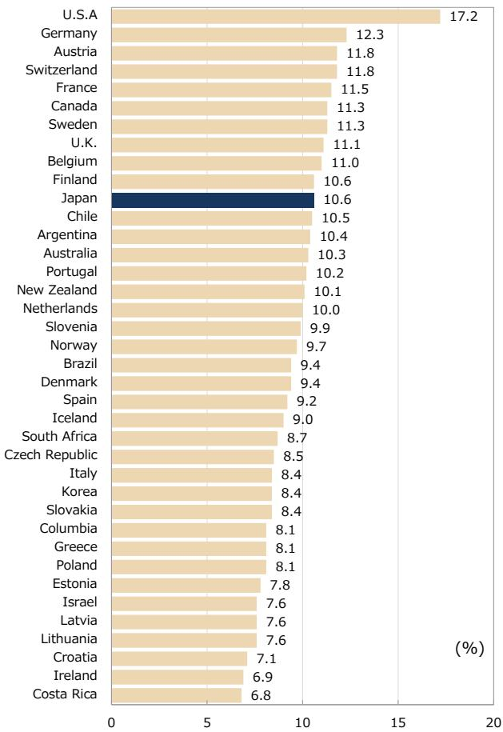

bar chart

| Country | Value (%) |
| :--- | :--- |
| U.S.A | 17.2 |
| Germany | 12.3 |
| Austria | 11.8 |
| Switzerland | 11.8 |
| France | 11.5 |
| Canada | 11.3 |
| Sweden | 11.3 |
| U.K. | 11.1 |
| Belgium | 11.0 |
| Finland | 10.6 |
| Japan | 10.6 |
| Chile | 10.5 |
| Argentina | 10.4 |
| Australia | 10.3 |
| Portugal | 10.2 |
| New Zealand | 10.1 |
| Netherlands | 10.0 |
| Slovenia | 9.9 |
| Norway | 9.7 |
| Brazil | 9.4 |
| Denmark | 9.4 |
| Spain | 9.2 |
| Iceland | 9.0 |
| South Africa | 8.7 |
| Czech Republic | 8.5 |
| Italy | 8.4 |
| Korea | 8.4 |
| Slovakia | 8.4 |
| Columbia | 8.1 |
| Greece | 8.1 |
| Poland | 8.1 |
| Estonia | 7.8 |
| Israel | 7.6 |
| Latvia | 7.6 |
| Lithuania | 7.6 |
| Croatia | 7.1 |
| Ireland | 6.9 |
| Costa Rica | 6.8 |

Source: OECD Health Statistics 2022, MS

## Japan Generic Market (1)

Our thoughts on structural issues of the generic drug industry  
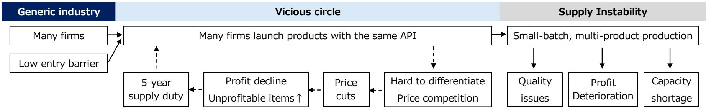

flowchart

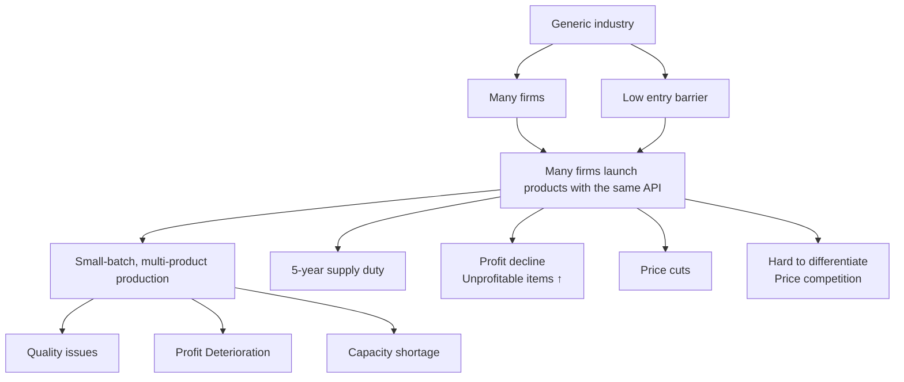
```mermaid
graph TD
  A["Generic industry"] --> B["Many firms"]
  A --> C["Low entry barrier"]
  B --> D["Many firms launch products with the same API"]
  C --> D
  D --> E["Small-batch, multi-product production"]
  D --> F["5-year supply duty"]
  D --> G["Profit decline\nUnprofitable items ↑"]
  D --> H["Price cuts"]
  D --> I["Hard to differentiate\nPrice competition"]
  E --> J["Quality issues"]
  E --> K["Profit Deterioration"]
  E --> L["Capacity shortage"]
```

Source: MS

Sawai & Towa combined earnings trends (Japan business only)  
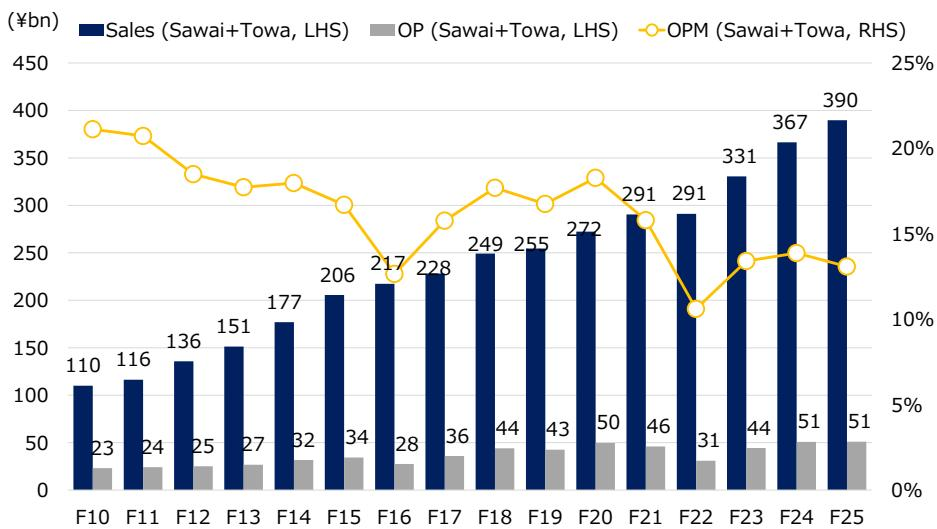

bar-line hybrid

| Year | Sales (Sawai+Towa, LHS) (¥bn) | OP (Sawai+Towa, LHS) (¥bn) | OPM (Sawai+Towa, RHS) (%) |
|---|---|---|---|
| F10 | 110 | 23 | 22 |
| F11 | 116 | 24 | 21.8 |
| F12 | 136 | 25 | 20.7 |
| F13 | 151 | 27 | 19.9 |
| F14 | 177 | 32 | 20.9 |
| F15 | 206 | 34 | 19.8 |
| F16 | 217 | 28 | 12.3 |
| F17 | 228 | 36 | 18.5 |
| F18 | 249 | 44 | 19.5 |
| F19 | 255 | 43 | 18.7 |
| F20 | 272 | 50 | 19.6 |
| F21 | 291 | 46 | 16.0 |
| F22 | 291 | 31 | 10.5 |
| F23 | 331 | 44 | 13.8 |
| F24 | 367 | 51 | 14.3 |
| F25 | 390 | 51 | 13.4 |

Source: Company data, MS, Note: Sawai is based on Core OP

Share in the generic market (2024)  
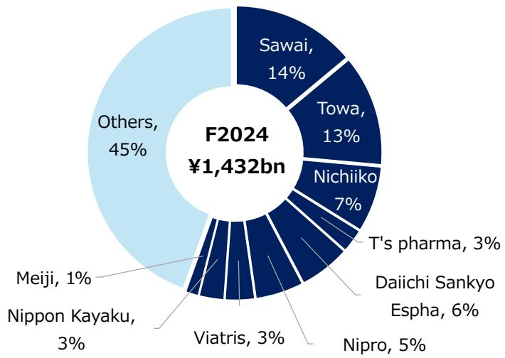

pie chart

F2024 ¥1,432bn
| Company | Share (%) |
| :--- | :--- |
| Sawai | 14 |
| Towa | 13 |
| Nichiiko | 7 |
| T's pharma | 3 |
| Daiichi Sankyo Espha | 6 |
| Nipro | 5 |
| Viatris | 3 |
| Meiji | 1 |
| Nippon Kayaku | 3 |
Others | 45 |

Fuji Keizai Generic Drug Industry in a Period of Transformation and Strategic Analysis of Key Companies (2025). MS, Note: based on Fuji Keizai data and our estimates

## Japan Generic Market (2)

Drug price revision trend for Sawai and Towa  
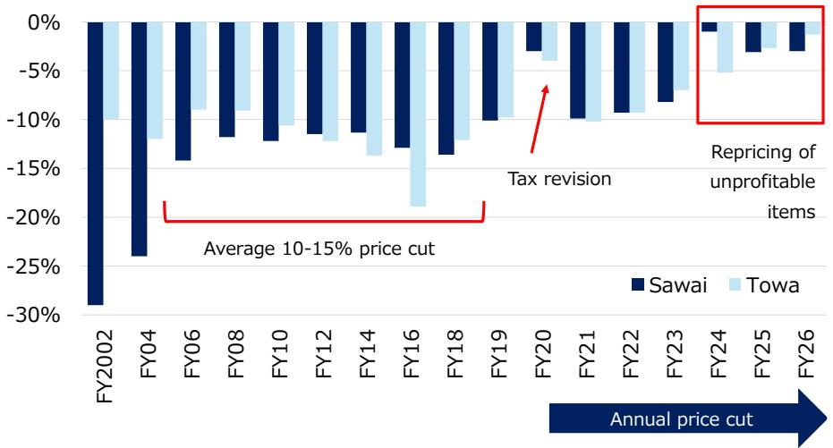

bar chart

| Fiscal Year | Sawai (%) | Towa (%) |
|---|---|---|
| FY2002 | -29.0 | -10.0 |
| FY04 | -24.0 | -11.0 |
| FY06 | -14.0 | -9.0 |
| FY08 | -11.0 | -9.0 |
| FY10 | -11.0 | -10.0 |
| FY12 | -11.0 | -12.0 |
| FY14 | -11.0 | -13.0 |
| FY16 | -13.0 | -19.0 |
| FY18 | -13.0 | -12.0 |
| FY19 | -10.0 | -9.0 |
| FY20 | -3.0 | -4.0 |
| FY21 | -9.0 | -9.0 |
| FY22 | -9.0 | -9.0 |
| FY23 | -7.0 | -6.0 |
| FY24 | -1.0 | -5.0 |
| FY25 | -3.0 | -4.0 |
| FY26 | -3.0 | -3.0 |
Average 10-15% price cut; Tax revision; Repricing of unprofitable items

Source: MHLW, Company data, MS

Volume/value share trends of generics  
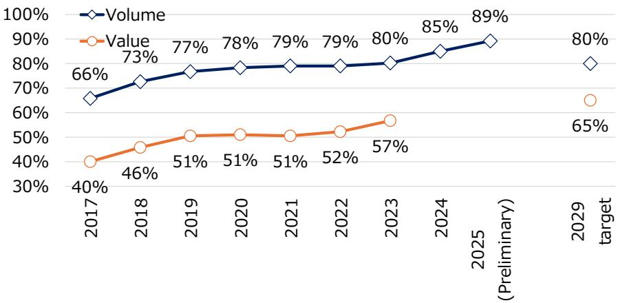

line chart

| Year | Volume (%) | Value (%) |
| :--- | :--- | :--- |
| 2017 | 66 | 40 |
| 2018 | 73 | 46 |
| 2019 | 77 | 51 |
| 2020 | 78 | 51 |
| 2021 | 79 | 51 |
| 2022 | 79 | 52 |
| 2023 | 80 | 57 |
| 2024 | 85 | - |
| 2025 (Preliminary) | 89 | - |
| 2029 target | - | 65 |
| Target | - | 80 |

Source: MHLW, MS, Note: 2029 target is Government's 2029 goals

Generic industry reorganization with 3 main groups

<table><tr><td>Independent</td><td>Consortium</td><td>And Pharma (fund JWP)</td></tr><tr><td>Sawai</td><td>Meiji Seika Pharma</td><td>Nichiiko</td></tr><tr><td>Towa</td><td>Daito</td><td>Kyowa Pharma</td></tr><tr><td></td><td>Tatsumi Kagaku</td><td>T&#x27;s Pharma</td></tr><tr><td></td><td>Nippon Chemiphar</td><td></td></tr></table>

Source: Company data, MS

Production capacity plans of Sawai and Towa  
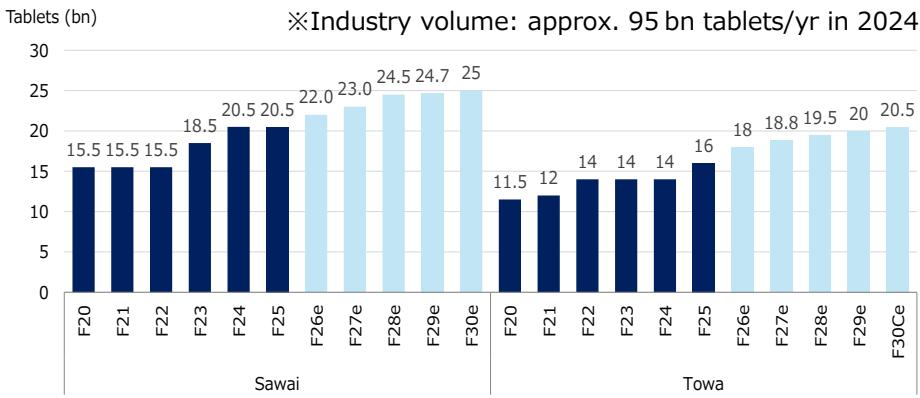

bar chart

| Region | Year | Tablets (bn) |
| :--- | :--- | :--- |
| Sawai | F20 | 15.5 |
| Sawai | F21 | 15.5 |
| Sawai | F22 | 15.5 |
| Sawai | F23 | 18.5 |
| Sawai | F24 | 20.5 |
| Sawai | F25 | 20.5 |
| Sawai | F26e | 22.0 |
| Sawai | F27e | 23.0 |
| Sawai | F28e | 24.5 |
| Sawai | F29e | 24.7 |
| Sawai | F30e | 25 |
| Towa | F20 | 11.5 |
| Towa | F21 | 12 |
| Towa | F22 | 14 |
| Towa | F23 | 14 |
| Towa | F24 | 14 |
| Towa | F25 | 16 |
| Towa | F26e | 18 |
| Towa | F27e | 18.8 |
| Towa | F28e | 19.5 |
| Towa | F29e | 20 |
| Towa | F30e | 20.5 |
Industry volume: approx. 95 bn tablets/yr in 2024

Source: Company data, MS; e=MS estimates, Ce=Company estimates

Next Quarter Earnings Estimates (Company vs Our est. vs Consensus)

<table><tr><td rowspan="2" colspan="3"></td><td colspan="3">Consensus</td><td colspan="7">Sales</td><td colspan="6">OP</td><td></td></tr><tr><td></td><td colspan="2"># of Est</td><td colspan="3">1Q</td><td colspan="4">F3/27</td><td colspan="3">1Q</td><td colspan="3">F3/27</td><td></td></tr><tr><td>Ticker</td><td>Company</td><td>OP basis</td><td>Source</td><td>1Q</td><td>F3/27</td><td>MSe</td><td>Cons</td><td>Gap</td><td>MSe</td><td>Cons</td><td>Gap</td><td>Ce</td><td>MSe</td><td>Cons</td><td>Gap</td><td>MSe</td><td>Cons</td><td>Gap</td><td>Ce</td></tr><tr><td>4502</td><td>Takeda</td><td>Core</td><td>Visible a</td><td>6</td><td>9</td><td>1,135.5</td><td>1,157.6</td><td>-1.9%</td><td>4,626.0</td><td>4,671.6</td><td>-1.0%</td><td>4,640.0</td><td>321.1</td><td>323.6</td><td>-0.8%</td><td>1,176.0</td><td>1,168.0</td><td>0.7%</td><td>1,160.0</td></tr><tr><td>4503</td><td>Astellas</td><td>Core</td><td>Visible a</td><td>6</td><td>7</td><td>541.5</td><td>553.4</td><td>-2.2%</td><td>2,291.0</td><td>2,255.1</td><td>1.6%</td><td>2,220.0</td><td>150.4</td><td>167.6</td><td>-10.3%</td><td>662.5</td><td>638.4</td><td>3.8%</td><td>620.0</td></tr><tr><td>4568</td><td>Daiichi Sankyo</td><td>Core</td><td>Visible a</td><td>5</td><td>8</td><td>523.2</td><td>537.1</td><td>-2.6%</td><td>2,304.0</td><td>2,314.5</td><td>-0.5%</td><td>2,280.0</td><td>102.6</td><td>90.2</td><td>13.7%</td><td>365.0</td><td>372.0</td><td>-1.9%</td><td>360.0</td></tr><tr><td>4523</td><td>Eisai</td><td>Reported</td><td>Visible a</td><td>8</td><td>9</td><td>215.0</td><td>214.8</td><td>0.1%</td><td>899.0</td><td>892.9</td><td>0.7%</td><td>883.5</td><td>19.4</td><td>19.5</td><td>-0.5%</td><td>70.3</td><td>73.4</td><td>-4.2%</td><td>70.0</td></tr><tr><td>4507</td><td>Shionogi</td><td>Core</td><td>Visible a</td><td>4</td><td>5</td><td>158.0</td><td>158.1</td><td>-0.1%</td><td>719.0</td><td>697.8</td><td>3.0%</td><td>700.0</td><td>52.7</td><td>52.7</td><td>0.0%</td><td>250.5</td><td>240.5</td><td>4.2%</td><td>220.0</td></tr><tr><td>4528</td><td>Ono</td><td>Core</td><td>Visible a</td><td>5</td><td>7</td><td>107.2</td><td>107.1</td><td>0.1%</td><td>451.0</td><td>452.6</td><td>-0.4%</td><td>455.0</td><td>30.0</td><td>24.9</td><td>20.5%</td><td>118.5</td><td>123.4</td><td>-4.0%</td><td>124.0</td></tr><tr><td>4506</td><td>Sumitomo Pharma</td><td>Core</td><td>Visible a</td><td>2</td><td>4</td><td>111.0</td><td>113.9</td><td>-2.5%</td><td>545.8</td><td>547.1</td><td>-0.2%</td><td>540.0</td><td>8.5</td><td>8.8</td><td>-3.4%</td><td>105.3</td><td>100.1</td><td>5.2%</td><td>91.0</td></tr><tr><td>4516</td><td>Nippon Shinyaku</td><td>Reported</td><td>Visible a</td><td>2</td><td>3</td><td>45.0</td><td>47.5</td><td>-5.3%</td><td>190.6</td><td>196.8</td><td>-3.2%</td><td>200.0</td><td>9.7</td><td>9.4</td><td>2.7%</td><td>37.6</td><td>39.3</td><td>-4.3%</td><td>38.0</td></tr><tr><td>4536</td><td>Santen</td><td>Core</td><td>Visible a</td><td>4</td><td>5</td><td>68.6</td><td>70.7</td><td>-3.0%</td><td>304.1</td><td>298.2</td><td>2.0%</td><td>311.0</td><td>12.3</td><td>12.1</td><td>1.7%</td><td>59.8</td><td>57.1</td><td>4.7%</td><td>59.0</td></tr><tr><td>4521</td><td>Kaken</td><td>Reported</td><td>IFIS</td><td>1</td><td>3</td><td>28.5</td><td>51.5</td><td>-44.7%</td><td>89.0</td><td>74.2</td><td>20.0%</td><td>89.9</td><td>8.5</td><td>8.1</td><td>4.8%</td><td>8.2</td><td>1.6</td><td>429.0%</td><td>7.9</td></tr><tr><td>4540</td><td>Tsumura</td><td>Reported</td><td>IFIS</td><td>3</td><td>3</td><td>50.8</td><td>50.2</td><td>1.2%</td><td>215.8</td><td>216.7</td><td>-0.4%</td><td>213.0</td><td>10.1</td><td>9.5</td><td>6.3%</td><td>40.0</td><td>39.3</td><td>1.8%</td><td>37.5</td></tr><tr><td>4552</td><td>JCR</td><td>Reported</td><td>Visible a</td><td>3</td><td>4</td><td>9.7</td><td>9.4</td><td>3.2%</td><td>46.0</td><td>43.5</td><td>5.7%</td><td>45.7</td><td>(0.1)</td><td>(0.9)</td><td>-88.9%</td><td>1.5</td><td>1.7</td><td>-11.8%</td><td>1.1</td></tr><tr><td>4887</td><td>Sawai GHD</td><td>Core</td><td>Visible a</td><td>5</td><td>6</td><td>50.5</td><td>51.1</td><td>-1.2%</td><td>208.6</td><td>209.7</td><td>-0.5%</td><td>208.4</td><td>7.1</td><td>7.3</td><td>-2.7%</td><td>28.9</td><td>30.6</td><td>-5.6%</td><td>29.6</td></tr><tr><td>4553</td><td>Towa</td><td>Reported</td><td>Visible a</td><td>4</td><td>5</td><td>72.3</td><td>72.2</td><td>0.1%</td><td>303.4</td><td>302.3</td><td>0.4%</td><td>304.0</td><td>6.3</td><td>5.8</td><td>7.8%</td><td>32.6</td><td>31.7</td><td>2.8%</td><td>32.0</td></tr><tr><td></td><td>YoY</td><td></td><td></td><td></td><td></td><td></td><td>YoY</td><td></td><td></td><td>YoY</td><td></td><td>YoY</td><td></td><td></td><td></td><td></td><td>YoY</td><td></td><td>YoY</td></tr><tr><td>4502</td><td>Takeda</td><td>Core</td><td>Visible a</td><td></td><td></td><td>2.6%</td><td>4.6%</td><td></td><td>2.7%</td><td>3.7%</td><td></td><td>3.0%</td><td>-0.2%</td><td>0.5%</td><td></td><td>0.3%</td><td>-0.4%</td><td></td><td>-1.1%</td></tr><tr><td>4503</td><td>Astellas</td><td>Core</td><td>Visible a</td><td></td><td></td><td>7.1%</td><td>9.4%</td><td></td><td>7.1%</td><td>5.4%</td><td></td><td>3.8%</td><td>5.7%</td><td>17.8%</td><td></td><td>19.2%</td><td>14.9%</td><td></td><td>11.6%</td></tr><tr><td>4568</td><td>Daiichi Sankyo</td><td>Core</td><td>Visible a</td><td></td><td></td><td>10.2%</td><td>13.2%</td><td></td><td>8.5%</td><td>9.0%</td><td></td><td>7.4%</td><td>6.5%</td><td>-6.3%</td><td></td><td>1.4%</td><td>3.3%</td><td></td><td>0.0%</td></tr><tr><td>4523</td><td>Eisai</td><td>Reported</td><td>Visible a</td><td></td><td></td><td>6.1%</td><td>6.0%</td><td></td><td>8.9%</td><td>8.2%</td><td></td><td>7.0%</td><td>-6.5%</td><td>-6.0%</td><td></td><td>59.3%</td><td>66.3%</td><td></td><td>58.6%</td></tr><tr><td>4507</td><td>Shionogi</td><td>Core</td><td>Visible a</td><td></td><td></td><td>58.3%</td><td>58.4%</td><td></td><td>43.9%</td><td>39.7%</td><td></td><td>40.1%</td><td>48.0%</td><td>48.0%</td><td></td><td>55.8%</td><td>49.6%</td><td></td><td>36.9%</td></tr><tr><td>4528</td><td>Ono</td><td>Core</td><td>Visible a</td><td></td><td></td><td>-15.9%</td><td>-16.0%</td><td></td><td>-12.6%</td><td>-12.3%</td><td></td><td>-11.8%</td><td>36.4%</td><td>13.2%</td><td></td><td>28.5%</td><td>33.8%</td><td></td><td>34.4%</td></tr><tr><td>4506</td><td>Sumitomo Pharma</td><td>Core</td><td>Visible a</td><td></td><td></td><td>2.8%</td><td>5.5%</td><td></td><td>20.4%</td><td>20.7%</td><td></td><td>19.1%</td><td>(11.9)</td><td>(11.6)</td><td></td><td>-0.7%</td><td>-5.6%</td><td></td><td>-14.1%</td></tr><tr><td>4516</td><td>Nippon Shinyaku</td><td>Reported</td><td>Visible a</td><td></td><td></td><td>13.8%</td><td>20.1%</td><td></td><td>11.6%</td><td>15.2%</td><td></td><td>17.1%</td><td>-4.3%</td><td>-6.8%</td><td></td><td>5.9%</td><td>10.7%</td><td></td><td>7.1%</td></tr><tr><td>4536</td><td>Santen</td><td>Core</td><td>Visible a</td><td></td><td></td><td>-0.2%</td><td>2.9%</td><td></td><td>4.3%</td><td>2.3%</td><td></td><td>6.6%</td><td>26.7%</td><td>24.7%</td><td></td><td>8.4%</td><td>3.5%</td><td></td><td>7.0%</td></tr><tr><td>4521</td><td>Kaken</td><td>Reported</td><td>IFIS</td><td></td><td></td><td>51.1%</td><td>173.0%</td><td></td><td>15.8%</td><td>-3.5%</td><td></td><td>16.9%</td><td>--</td><td>--</td><td></td><td>--</td><td>--</td><td></td><td>--</td></tr><tr><td>4540</td><td>Tsumura</td><td>Reported</td><td>Visible a</td><td></td><td></td><td>17.9%</td><td>16.5%</td><td></td><td>12.0%</td><td>12.5%</td><td></td><td>10.6%</td><td>30.8%</td><td>23.1%</td><td></td><td>13.6%</td><td>11.6%</td><td></td><td>6.5%</td></tr><tr><td>4552</td><td>JCR</td><td>Reported</td><td>Visible a</td><td></td><td></td><td>13.2%</td><td>9.7%</td><td></td><td>14.1%</td><td>7.9%</td><td></td><td>13.3%</td><td>-83.5%</td><td>48.5%</td><td></td><td>170.3%</td><td>206.3%</td><td></td><td>98.2%</td></tr><tr><td>4887</td><td>Sawai GHD</td><td>Core</td><td>Visible a</td><td></td><td></td><td>2.0%</td><td>3.2%</td><td></td><td>3.4%</td><td>4.0%</td><td></td><td>3.3%</td><td>-6.5%</td><td>-3.9%</td><td></td><td>81.8%</td><td>92.5%</td><td></td><td>86.2%</td></tr><tr><td>4553</td><td>Towa</td><td>Reported</td><td>Visible a</td><td></td><td></td><td>11.0%</td><td>10.8%</td><td></td><td>10.8%</td><td>10.4%</td><td></td><td>11.1%</td><td>20.0%</td><td>11.4%</td><td></td><td>41.1%</td><td>37.2%</td><td></td><td>38.5%</td></tr></table>

<table><tr><td rowspan="2" colspan="3"></td><td colspan="3">Consensus</td><td colspan="7">Sales</td><td colspan="6">OP</td><td></td></tr><tr><td></td><td colspan="2"># of Est</td><td colspan="3">1H</td><td colspan="4">F12/26</td><td colspan="3">1H</td><td colspan="3">F12/26</td><td></td></tr><tr><td>Ticker</td><td>Company</td><td>OP basis</td><td>Source</td><td>1H</td><td>F12/26</td><td>MSe</td><td>Cons</td><td>Gap</td><td>MSe</td><td>Cons</td><td>Gap</td><td>Ce</td><td>MSe</td><td>Cons</td><td>Gap</td><td>MSe</td><td>Cons</td><td>Gap</td><td>Ce</td></tr><tr><td>4151</td><td>Kyowa Kirin</td><td>Core</td><td>Visible a</td><td>7</td><td>8</td><td>247.0</td><td>247.3</td><td>-0.1%</td><td>520.0</td><td>523.4</td><td>-0.6%</td><td>520.0</td><td>41.0</td><td>49.1</td><td>-16.5%</td><td>128.5</td><td>130.6</td><td>-1.6%</td><td>130.0</td></tr><tr><td>4519</td><td>Chugai</td><td>Core</td><td>Visible a</td><td>8</td><td>10</td><td>637.0</td><td>663.2</td><td>-4.0%</td><td>1,376.5</td><td>1,384.5</td><td>-0.6%</td><td>1,345.0</td><td>308.4</td><td>341.7</td><td>-9.7%</td><td>702.0</td><td>701.5</td><td>0.1%</td><td>670.0</td></tr><tr><td>4578</td><td>Otsuka</td><td>Core</td><td>Visible a</td><td>5</td><td>8</td><td>1,242.0</td><td>1,255.2</td><td>-1.1%</td><td>2,598.0</td><td>2,605.0</td><td>-0.3%</td><td>2,520.0</td><td>209.2</td><td>213.8</td><td>-2.2%</td><td>426.0</td><td>423.6</td><td>0.6%</td><td>355.0</td></tr><tr><td></td><td>YoY</td><td></td><td></td><td></td><td></td><td></td><td></td><td></td><td></td><td></td><td></td><td></td><td></td><td></td><td></td><td></td><td></td><td></td><td></td></tr><tr><td>4151</td><td>Kyowa Kirin</td><td>Core</td><td>Visible a</td><td></td><td></td><td>7.1%</td><td>7.2%</td><td></td><td>4.7%</td><td>5.3%</td><td></td><td>4.7%</td><td>17.1%</td><td>40.2%</td><td></td><td>17.0%</td><td>18.9%</td><td></td><td>18.4%</td></tr><tr><td>4519</td><td>Chugai</td><td>Core</td><td>Visible a</td><td></td><td></td><td>10.1%</td><td>14.6%</td><td></td><td>9.4%</td><td>10.1%</td><td></td><td>6.9%</td><td>13.4%</td><td>25.6%</td><td></td><td>12.6%</td><td>12.6%</td><td></td><td>7.5%</td></tr><tr><td>4578</td><td>Otsuka</td><td>Core</td><td>Visible a</td><td></td><td></td><td>5.2%</td><td>6.3%</td><td></td><td>5.2%</td><td>5.5%</td><td></td><td>2.1%</td><td>-12.5%</td><td>-10.6%</td><td></td><td>-4.5%</td><td>-5.0%</td><td></td><td>-20.4%</td></tr></table>

Note: Consensus as of June 12, 2026, Sales and OP are in billion Yen, Source: Company Data, MS. Ce = Company estimates, e = MS estimates

## Daiichi Sankyo (4568, OW, PT ¥4,650)

## Key Points

- Attractive ADC new drugs & Stable dividend (>Y100/sh/yr)  
• Enhertu (HER2-ADC)  
- >\$12bn sales potential in 2030 (mainly in BC). Alliance with AZN  
• Her2 Low/Ultra-low BC (pre-chemo) approval in 1/2024 (DB06)  
• Datroway (TROP2-ADC/Dato)  
- Launch in 2025 for BC(HR+/HER2-) 2/3L & NSCLC(EGFRm) 2/3L  
• NSCLC 1L. AVANZAR result in 2026-2H. TL07/08 results in 2027  
• TNBC 1L. FDA approval in 5/2026 (TB02)  
• Merck alliance (max \$22bn value)  
• HER3: NSCLC (post-TKI). HL01. BLA withdrawn in 5/2025.  
• B7H3 (I-DXd): SCLC 2/3L (IDL01). PDUFA 10/2026  
• CDH6 (R-DXd): Ph2/3 (R-OV01, OvC 2L). Filing in 2026?

FV for each scenario

<table><tr><td></td><td>Enhertu</td><td>Datroway</td><td>R-DXd</td><td>I-DXd</td><td>Base Bz</td><td>Total</td></tr><tr><td>Bull</td><td>¥4,300</td><td>¥1,800</td><td>¥550</td><td>¥550</td><td>¥600</td><td>¥7,800</td></tr><tr><td>Base</td><td>¥3,200</td><td>¥600</td><td>¥150</td><td>¥200</td><td>¥500</td><td>¥4,650</td></tr><tr><td>Bear</td><td>¥1,900</td><td>¥200</td><td>¥0</td><td>¥0</td><td>¥350</td><td>¥2,450</td></tr></table>

<table><tr><td rowspan="2">($m)</td><td colspan="4">2030e(ww)</td><td colspan="4">Probability</td></tr><tr><td>Enhertu</td><td>Dato</td><td>R-DXd</td><td>I-DXd</td><td>Enhertu</td><td>Dato</td><td>R-DXd</td><td>I-DXd</td></tr><tr><td>Bull</td><td>17,100</td><td>5,600</td><td>950</td><td>1,130</td><td>100%</td><td>100%</td><td>100%</td><td>100%</td></tr><tr><td>Base</td><td>12,800</td><td>1,960</td><td>330</td><td>390</td><td>75%</td><td>35%</td><td>25%</td><td>35%</td></tr><tr><td>Bear</td><td>7,700</td><td>560</td><td>0</td><td>0</td><td>45%</td><td>10%</td><td>0%</td><td>0%</td></tr></table>

Source: MS, Note: all estimates are MS estimates

<table><tr><td>Timing</td><td>Catalyst</td></tr><tr><td>2026-2H</td><td>Dato-DXd: AVANZAR results (NSCLC 1L with Imfinzi, etc)</td></tr><tr><td>2027</td><td>Dato: Results for TL07 (TPS&lt;50%) and TL08 (TPS&gt;50%) for NSCLC 1L</td></tr><tr><td>2028</td><td>Competitor : sac-TMT. TroFuse-007 result (NSCLC 1L w Keytruda)</td></tr></table>

Source: Company data, MS

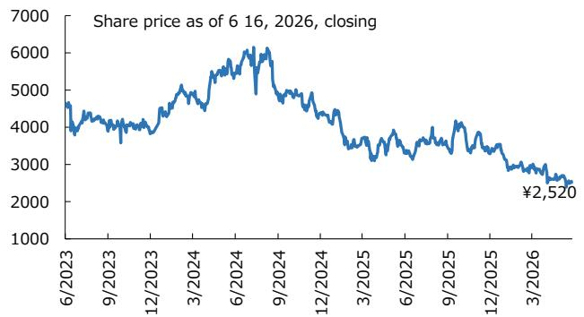

line chart

| Date       | Share Price |
| ---------- | ----------- |
| 3/2026     | ¥2,520      |

Source: FactSet, MS  
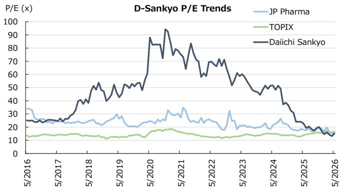

line chart

| Date   | JP Pharma | TOPIX | Daiichi Sankyo |
|--------|-----------|-------|----------------|
| 5/2016 | 30        | 15    | 25             |
| 5/2017 | 25        | 15    | 28             |
| 5/2018 | 28        | 15    | 45             |
| 5/2019 | 30        | 15    | 55             |
| 5/2020 | 25        | 15    | 90             |
| 5/2021 | 35        | 18    | 85             |
| 5/2022 | 25        | 15    | 70             |
| 5/2023 | 30        | 15    | 60             |
| 5/2024 | 25        | 15    | 50             |
| 5/2025 | 20        | 15    | 30             |
| 5/2026 | 15        | 15    | 15             |

Source: FactSet, MS, Note: JP Pharma P/E are weighted Avg of our coverage companies' P/E (based on our 1-1.5 year forward EPS estimates)

<table><tr><td>(Yn bn)</td><td>F3/26</td><td>F3/27e</td><td>F3/28e</td><td>F3/29e</td><td>F3/30e</td><td>F3/31e</td></tr><tr><td>Sales</td><td>2123.0</td><td>2304.0</td><td>2331.5</td><td>2614.5</td><td>2917.5</td><td>3273.5</td></tr><tr><td>YoY</td><td>12.6%</td><td>8.5%</td><td>1.2%</td><td>12.1%</td><td>11.6%</td><td>12.2%</td></tr><tr><td>OP</td><td>229.1</td><td>365.0</td><td>425.5</td><td>392.5</td><td>489.5</td><td>624.5</td></tr><tr><td>YoY</td><td>-31.0%</td><td>59.3%</td><td>16.6%</td><td>-7.8%</td><td>24.7%</td><td>27.6%</td></tr><tr><td>Core OP</td><td>360.0</td><td>365.0</td><td>275.5</td><td>392.5</td><td>489.5</td><td>624.5</td></tr><tr><td>YoY</td><td>-8.3%</td><td>1.4%</td><td>-24.5%</td><td>42.5%</td><td>24.7%</td><td>27.6%</td></tr></table>

Source: MS, Note: e=MS estimates

## Takeda (4502, OW, PT ¥6,300)

## Key Points

• Multiple new drugs to emerge in 2025-26  
- Oveporexton (narcolepsy, oral): Ph3 (NT1) success in 7/2025. CoE Peak sales \$2-3bn for NT1 only. Ph2 POC result for TAK-360 (NT2) in 2026. OPM 80% or more  
- Zasocitinib (oral TYK2): Launch planned in 2027 (PsO). Acquired for \$4bn. CoE Peak sales \$3-6bn for PsO/PsA. UC/CD Ph2 results in 1-3/2027  
- Rusfertide (PV): Ph3 success. Filing in end-2025 and launch in 2026. CoE. \$1-2bn peak sales  
• Mezagitamab (IgAN/ITP): CD38 MAb. Ph3 starts from 2025  
• TAK-999 (GalNAc-RNAi). AAT liver disease. Fazirsiran  
- Dividend: It started to raise dividend from 2023 for the first time in the last 15yrs. Stable dividend hike ongoing (Yn4-8/yr hike)  
- Share buyback: Y100bn in 11/2021- 4/2022 (first time in the last 13yr). Y100bn in 2-4/2025.  
• Limited downside until 2030-32  
• Patent expiries: Vyvanse in 2023. Entyvio in 2030-2032  
• Co targets Core OPM to raise to low-mid 30%

FV for each scenario

<table><tr><td></td><td>Bull</td><td>Base</td><td>Bear</td></tr><tr><td>Orexin</td><td>¥2,200</td><td>¥1,000</td><td>¥200</td></tr><tr><td>TYK2</td><td>¥2,800</td><td>¥1,400</td><td>¥400</td></tr><tr><td>Base biz</td><td>¥4,400</td><td>¥3,900</td><td>¥3,400</td></tr><tr><td>Total</td><td>¥9,400</td><td>¥6,300</td><td>¥4,000</td></tr></table>

<table><tr><td rowspan="2"></td><td colspan="2">2035 sales (w w )</td><td colspan="2">Success Rate</td></tr><tr><td>Orexin</td><td>TYK2</td><td>Orexin</td><td>TYK2</td></tr><tr><td>Bull</td><td>$5,700</td><td>$7,600</td><td>100%</td><td>100%</td></tr><tr><td>Base</td><td>$2,570</td><td>$3,800</td><td>45%</td><td>50%</td></tr><tr><td>Bear</td><td>$600</td><td>$800</td><td>10%</td><td>15%</td></tr></table>

Source: MS, Note: all estimates are MS estimates

<table><tr><td>Timing</td><td>Catalyst</td></tr><tr><td>8/2026</td><td>US approval for Oveporexton (NT1) on 8/10 &amp; Rusfertide (PV) on 8/29</td></tr><tr><td>2026</td><td>TAK-360 (narcolepsy) : Ph2 results (NT2)</td></tr><tr><td>1-3/2027</td><td>Zaso : Ph2 results for UC/CD</td></tr></table>

Source: Company data, MS

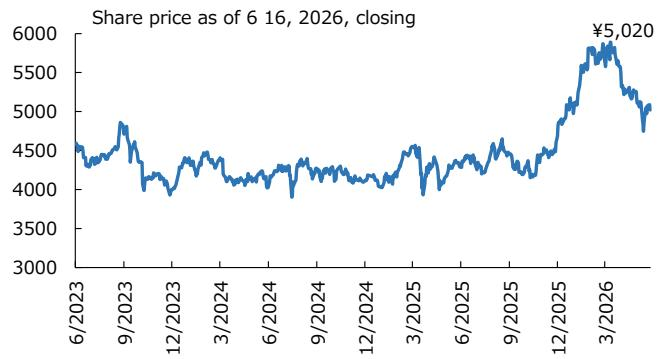

line chart

| Date       | Share Price |
| ---------- | ----------- |
| 6/2023     | ~4500       |
| 9/2023     | ~4800       |
| 12/2023    | ~4000       |
| 3/2024     | ~4200       |
| 6/2024     | ~4100       |
| 9/2024     | ~4300       |
| 12/2024    | ~4200       |
| 3/2025     | ~4500       |
| 6/2025     | ~4300       |
| 9/2025     | ~4500       |
| 12/2025    | ~5000       |
| 3/2026     | ¥5,020      |

Source: FactSet, MS  
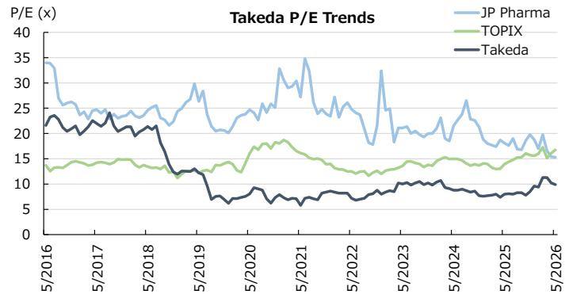

line chart

| Date   | JP Pharma | TOPIX | Takeda |
|--------|-----------|-------|--------|
| 5/2016 | 35        | 14    | 23     |
| 5/2017 | 25        | 14    | 22     |
| 5/2018 | 24        | 13    | 21     |
| 5/2019 | 28        | 13    | 12     |
| 5/2020 | 25        | 18    | 8      |
| 5/2021 | 35        | 17    | 7      |
| 5/2022 | 25        | 14    | 8      |
| 5/2023 | 33        | 14    | 9      |
| 5/2024 | 26        | 14    | 9      |
| 5/2025 | 20        | 15    | 9      |
| 5/2026 | 18        | 16    | 10     |

Source: FactSet, MS, Note: JP Pharma P/E are weighted Avg of our coverage companies' P/E (based on our 1-1.5 year forward EPS estimates), Takeda's PE are based on our EPS estimates

<table><tr><td>(Yn bn)</td><td>F3/26</td><td>F3/27e</td><td>F3/28e</td><td>F3/29e</td><td>F3/30e</td><td>F3/31e</td></tr><tr><td>Sales</td><td>4505.7</td><td>4626.0</td><td>4663.0</td><td>4846.0</td><td>4958.0</td><td>5003.0</td></tr><tr><td>YoY</td><td>-1.6%</td><td>2.7%</td><td>0.8%</td><td>3.9%</td><td>2.3%</td><td>0.9%</td></tr><tr><td>OP</td><td>408.8</td><td>486.5</td><td>591.5</td><td>774.5</td><td>890.5</td><td>967.5</td></tr><tr><td>YoY</td><td>19.3%</td><td>19.0%</td><td>21.6%</td><td>30.9%</td><td>15.0%</td><td>8.6%</td></tr><tr><td>Core OP</td><td>1172.4</td><td>1176.0</td><td>1186.0</td><td>1304.0</td><td>1365.0</td><td>1369.0</td></tr><tr><td>YoY</td><td>0.8%</td><td>0.3%</td><td>0.9%</td><td>9.9%</td><td>4.7%</td><td>0.3%</td></tr></table>

Source: MS, Note: e=MS estimates

## Otsuka Holdings (4578, OW, PT ¥14,100)

## Key Points

• New drugs & royalty revenue exceed LOE risks in 2025-29  
• LOE (US): Abilify Maintena in 10/2024, Jynarque in 4/2025. Rexulti in 6/2029. We estimate Maintena LOE in 2027-28  
• Royalty income: >Y300bn income in 2030  
- Kisqali (CDK4/6). Pluvicto (PSMA+Lu177). Truqap (AKTi)  
- KRAS G12C (calderasib) Ph3 ongoing by Merck (Astex/Otsuka collaboration)  
• Voyxact: IgAN. US approval 11/2025. \$390k/year. eGFR 2yr results in 10/2026  
- \$5.9bn in 2035 sales in Base case  
- \$300k/yr x 15% penetrate (of 150-180k pt in US) x POS 60%  
• Success in eGFR trial can boost the POS furthermore  
• Other pipeline wave is emerging  
- Zipalertinib (EGFRm NSCLC) : Oral. 2L approval in 2026. 1 L result in 2026  
- Ulotaront (MDD, GAD, etc) : Ph3 result for schizo in 2026  
• RDN (renal denervation) device : Change to Category I expected in >2028  
• Non-pharma business: Strong brand & solid growth

FV for each scenario

<table><tr><td></td><td>Bull</td><td>Base</td><td>Bear</td></tr><tr><td>Voyxact</td><td>¥7,800</td><td>¥5,100</td><td>¥1,600</td></tr><tr><td>Zipalertinib</td><td>¥600</td><td>¥200</td><td>¥100</td></tr><tr><td>Ulotaront</td><td>¥2,500</td><td>¥500</td><td>¥0</td></tr><tr><td>RDN</td><td>¥750</td><td>¥200</td><td>¥100</td></tr><tr><td>Base biz</td><td>¥9,600</td><td>¥8,100</td><td>¥6,300</td></tr><tr><td>Total</td><td>¥21,250</td><td>¥14,100</td><td>¥8,100</td></tr></table>

<table><tr><td></td><td colspan="3">2035 Sales forecast (WW)</td><td colspan="3">Success rate</td></tr><tr><td>($mn)</td><td>Bull</td><td>Base</td><td>Bear</td><td>Bull</td><td>Base</td><td>Bear</td></tr><tr><td>Voyxact</td><td>$9,100</td><td>$5,900</td><td>$1,800</td><td>100%</td><td>65%</td><td>20%</td></tr><tr><td>Zipalertinib</td><td>$1,150</td><td>$400</td><td>$200</td><td>100%</td><td>35%</td><td>20%</td></tr><tr><td>Ulotaront</td><td>$3,350</td><td>$700</td><td>$0</td><td>100%</td><td>20%</td><td>0%</td></tr><tr><td>RDN</td><td>$2,300</td><td>$500</td><td>$200</td><td>100%</td><td>20%</td><td>10%</td></tr></table>

Source: MS, Note: all estimates are MS estimates

<table><tr><td>Timing</td><td>Catalyst</td></tr><tr><td>10/2026</td><td>Voyxact : IgAN. eGFR 24 months result. Interim 12 months was promising</td></tr><tr><td>10/2026</td><td>Ulotaront : Additional Ph3 result for schizophrenia</td></tr><tr><td>2026</td><td>Zipalertinib :NSCLC (exon20) 2L approval in US. Oral treatment</td></tr><tr><td>2027</td><td>Repinatrabit (JNT-517) : Oral PKU. Ph3 result (150mg BID) and NDA</td></tr></table>

Source: Company data, MS

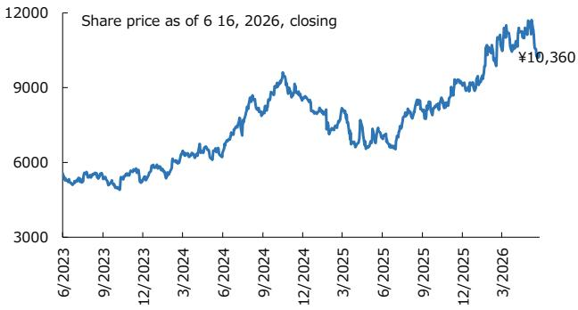

line chart

| Date     | Share Price |
| -------- | ----------- |
| 3/2026   | ¥10,360     |

Source: FactSet, MS  
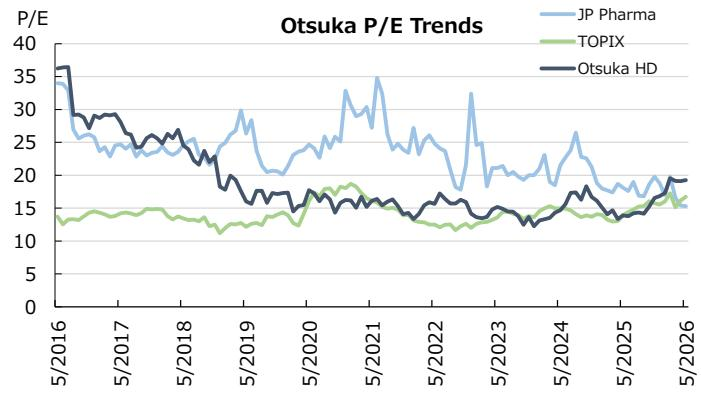

line chart

| Date   | JP Pharma | TOPIX | Otsuka HD |
|--------|-----------|-------|-----------|
| 5/2016 | 35        | 13    | 37        |
| 5/2017 | 25        | 14    | 28        |
| 5/2018 | 24        | 13    | 26        |
| 5/2019 | 28        | 14    | 22        |
| 5/2020 | 20        | 15    | 18        |
| 5/2021 | 35        | 18    | 17        |
| 5/2022 | 25        | 14    | 16        |
| 5/2023 | 33        | 13    | 15        |
| 5/2024 | 25        | 15    | 17        |
| 5/2025 | 18        | 14    | 16        |
| 5/2026 | 16        | 16    | 19        |

Source: FactSet, MS, Note: JP Pharma P/E are weighted Avg of our coverage companies' P/E (based on our 1-1.5 year forward EPS estimates)

<table><tr><td>(Yn bn)</td><td>F12/25</td><td>F12/26e</td><td>F12/27e</td><td>F12/28e</td><td>F12/29e</td><td>F12/30e</td></tr><tr><td>Sales</td><td>2468.9</td><td>2598.0</td><td>2752.0</td><td>2887.0</td><td>2842.0</td><td>2782.0</td></tr><tr><td>YoY</td><td>6.0%</td><td>5.2%</td><td>5.9%</td><td>4.9%</td><td>-1.6%</td><td>-2.1%</td></tr><tr><td>OP</td><td>479.4</td><td>426.0</td><td>488.0</td><td>541.0</td><td>601.0</td><td>441.0</td></tr><tr><td>YoY</td><td>48.2%</td><td>-11.1%</td><td>14.6%</td><td>10.9%</td><td>11.1%</td><td>-26.6%</td></tr><tr><td>Core OP</td><td>446.1</td><td>426.0</td><td>488.0</td><td>541.0</td><td>601.0</td><td>441.0</td></tr><tr><td>YoY</td><td>3.6%</td><td>-4.5%</td><td>14.6%</td><td>10.9%</td><td>11.1%</td><td>-26.6%</td></tr></table>

Source: MS, Note: e=MS estimates

## Chugai (4519, OW, PT ¥10,700)

## Key Points

- Rich pipeline (but limited events in 2026-27)  
- Oral GLP-1 (Foundayo/orforglipron). LLY partner. US launch in 4/2026, but slow start. Ph3 results for OSA and hypertension planned in 2026-27  
• GYM329 (emugrobart) : Obesity Ph2 results in 2H-2026  
- NXT007. Hemophilia A. $2^{\text{nd}}$ generation of Hemlibra Ph3 results in 2027-28.  
- Nemluvio (IL-31, atopic dermatitis). Galderma raised its peak sales expectation to \$4bn from \$2bn in 3/2026  
- $2^{\text{nd}}$ wave of pipeline  
- Enspryng for TED. Mixed Ph3 results. Co seeks filing in 2026  
• DONQ52. HLA-DQ2.5/Gluten peptide multi-Ab. Celiac disease. Ph1  
- Peptide drug discovery: Switch from LUNA18 to AUBE00 (pan-KRAS)  
- Biosimilar risk  
- Actemra: Biosimilar erosion begins gradually from 2024 (Biogen, Fresenius Kabi, etc)

FV for each scenario

<table><tr><td rowspan="2"></td><td colspan="3">Fair value / sh</td></tr><tr><td>Bull</td><td>Base</td><td>Bear</td></tr><tr><td>Piasky (PNH)</td><td>¥200</td><td>¥150</td><td>¥50</td></tr><tr><td>Nemluvio (Atopic)</td><td>¥1,700</td><td>¥1,200</td><td>¥350</td></tr><tr><td>Foundayo (Diabesity)</td><td>¥2,500</td><td>¥2,000</td><td>¥250</td></tr><tr><td>GYM329 (SMA, etc)</td><td>¥850</td><td>¥200</td><td>¥0</td></tr><tr><td>Enspryng (TED, etc)</td><td>¥900</td><td>¥250</td><td>¥0</td></tr><tr><td>Base Biz</td><td>¥8,000</td><td>¥6,900</td><td>¥6,300</td></tr><tr><td>Total</td><td>¥14,150</td><td>¥10,700</td><td>¥6,950</td></tr></table>

<table><tr><td rowspan="2"></td><td colspan="3">2035 ww sales assumpt. ($m/SFrm)</td></tr><tr><td>Bull</td><td>Base</td><td>Bear</td></tr><tr><td>Piasky</td><td>fr. 1,570</td><td>fr. 1,180</td><td>fr. 470</td></tr><tr><td>Nemluvio</td><td>fr. 5,900</td><td>fr. 4,130</td><td>fr. 1,180</td></tr><tr><td>Orforglipron</td><td>$38,000</td><td>$30,400</td><td>$3,800</td></tr><tr><td>GYM329</td><td>$3,400</td><td>$850</td><td>$0</td></tr><tr><td>Enspryng</td><td>fr. 3,250</td><td>fr. 980</td><td>fr. 0</td></tr></table>

Source: MS, Note: all estimates are MS estimates, PT=A weighted-average (Base case 60%, bull case 30%, bear case 10%) approach using probability rates for three scenarios

<table><tr><td>Timing</td><td>Catalyst</td></tr><tr><td>2026</td><td>GYM329: Ph2 result for obesity</td></tr><tr><td>2026</td><td>Orforglipron. Global launch. Competitors to come from &gt;2028</td></tr><tr><td>2026</td><td>PiaSky: Ph3 results for aHUS</td></tr><tr><td>2026</td><td>Enspryng (IL6R) : TED filing ?</td></tr></table>

Source: Company data, MS

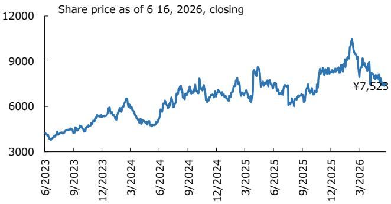

line chart

| Date       | Share Price |
| ---------- | ----------- |
| 3/2026     | ¥7,523      |

Source: FactSet, MS  
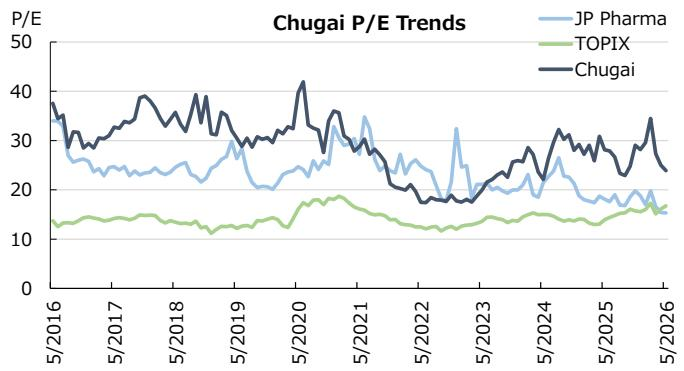

line chart

| Date   | JP Pharma | TOPIX | Chugai |
|--------|-----------|-------|--------|
| 5/2016 | ~25       | ~13   | ~35    |
| 5/2017 | ~23       | ~14   | ~38    |
| 5/2018 | ~24       | ~13   | ~39    |
| 5/2019 | ~26       | ~14   | ~37    |
| 5/2020 | ~28       | ~15   | ~42    |
| 5/2021 | ~30       | ~16   | ~35    |
| 5/2022 | ~25       | ~14   | ~20    |
| 5/2023 | ~20       | ~13   | ~18    |
| 5/2024 | ~18       | ~14   | ~28    |
| 5/2025 | ~16       | ~15   | ~30    |
| 5/2026 | ~18       | ~16   | ~25    |

Source: FactSet, MS, Note: JP Pharma P/E are weighted Avg of our coverage companies' P/E (based on our 1-1.5 year forward EPS estimates)

<table><tr><td>(Yn bn)</td><td>F12/25</td><td>F12/26e</td><td>F12/27e</td><td>F12/28e</td><td>F12/29e</td><td>F12/30e</td></tr><tr><td>Sales</td><td>1257.9</td><td>1376.5</td><td>1491.0</td><td>1604.0</td><td>1706.5</td><td>1875.5</td></tr><tr><td>YoY</td><td>7.5%</td><td>9.4%</td><td>8.3%</td><td>7.6%</td><td>6.4%</td><td>9.9%</td></tr><tr><td>OP</td><td>598.8</td><td>695.0</td><td>788.5</td><td>878.5</td><td>955.0</td><td>1092.0</td></tr><tr><td>YoY</td><td>10.5%</td><td>16.1%</td><td>13.5%</td><td>11.4%</td><td>8.7%</td><td>14.3%</td></tr><tr><td>Core OP</td><td>623.2</td><td>702.0</td><td>791.5</td><td>881.5</td><td>958.0</td><td>1095.0</td></tr><tr><td>YoY</td><td>12.1%</td><td>12.6%</td><td>12.7%</td><td>11.4%</td><td>8.7%</td><td>14.3%</td></tr></table>

Source: MS, Note: e=MS estimates

## Kaken (4521, OW, PT ¥5,300)

## Key Points

• 2 new drugs to offset the patent for Clenafin expiry  
- KP-001. Vascular Malformation. Ph3 (JP) successful in 11/2025 and US Ph3 underway.  
- Seladelpar. Primary Biliary Cholangitis. Ph3 (JP) readouts due out in end-2026. Gilead launched it in 2024 in US as Livdelzi  
- Envudeucitinib. Psoriais. Global Ph3 (includes JP) success in 1/2026.  
• JNJ has been a major shareholder with global expansion of its own pipeline  
- KP-723 (STAT6 inhibitor). Type 2 inflammatory diseases. Licensed to JNJ in 12/2024. Ph1 initiated from 4/2026.  
- KP-483 (EP4 inhibitor). Solid tumors. Ph1 completed. Co targets license out.  
- Clenafin: Kaken's mainstay. F3/24 sales Y17bn. AG launched in 9/2025.  
• Cash rich. 70% of market cap if combining value of real estate and net cash  
• Net cash Y42bn, equating to Y1,100 per share.  
• Real estate Y60bn, equating to Y1,200 per share.

FV for each scenario

<table><tr><td rowspan="2"></td><td colspan="3">Fair value</td></tr><tr><td>Bull</td><td>Base</td><td>Bear</td></tr><tr><td>KP-001 (VM, JP)</td><td>¥1,700</td><td>¥1,000</td><td>¥700</td></tr><tr><td>KP-001 (VM, US)</td><td>¥4,100</td><td>¥1,000</td><td>¥0</td></tr><tr><td>Seladelpar (PBC)</td><td>¥800</td><td>¥600</td><td>¥0</td></tr><tr><td>Cash</td><td>¥1,200</td><td>¥1,200</td><td>¥1,200</td></tr><tr><td>Real Estate Biz</td><td>¥1,700</td><td>¥1,300</td><td>¥1,300</td></tr><tr><td>Base Biz</td><td>¥300</td><td>¥200</td><td>¥200</td></tr><tr><td>Total</td><td>¥9,800</td><td>¥5,300</td><td>¥3,400</td></tr></table>

<table><tr><td rowspan="2"></td><td colspan="3">FY2035 sales est. (¥mn)</td></tr><tr><td>Bull</td><td>Base</td><td>Bear</td></tr><tr><td>KP-001 (JP)</td><td>19,100</td><td>11,500</td><td>7,600</td></tr><tr><td>KP-001 (US)</td><td>65,100</td><td>16,300</td><td>0</td></tr><tr><td>Seladelpar</td><td>11,400</td><td>9,100</td><td>0</td></tr></table>

Source: MS, Note: all estimates are MS estimates

<table><tr><td>Timing</td><td>Catalyst</td></tr><tr><td>7/2026</td><td>KP-001: Ph3 (JP) details in JSSVA conference</td></tr><tr><td>8/2026</td><td>1Q26: Strong start with OP of Y8.5bn vs. Co full year guidance OP of Y7.9bn</td></tr><tr><td>10-12/2026</td><td>Seladelpar(JP): Ph3 readouts for Primary Biliary Chologitis</td></tr><tr><td>~3/2027</td><td>KP-483 (EP4 inhibitor): Out-licensing/tie-ups</td></tr></table>

Source: Company, MS

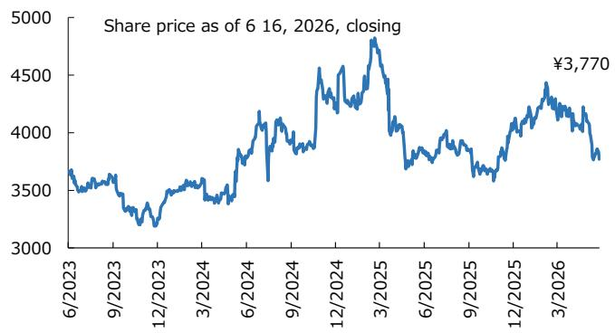

line chart

| Date       | Share Price |
| ---------- | ----------- |
| 6/2023     | ~3600       |
| 9/2023     | ~3400       |
| 12/2023    | ~3200       |
| 3/2024     | ~3500       |
| 6/2024     | ~3800       |
| 9/2024     | ~4100       |
| 12/2024    | ~4500       |
| 3/2025     | ~4800       |
| 6/2025     | ~4000       |
| 9/2025     | ~3800       |
| 12/2025    | ~4200       |
| 3/2026     | ~4500       |
| 6/2026     | ~4700       |
| 9/2026     | ~4300       |
| 12/2026    | ~4100       |
| 3/2027     | ~3700       |

Source: FactSet, MS  
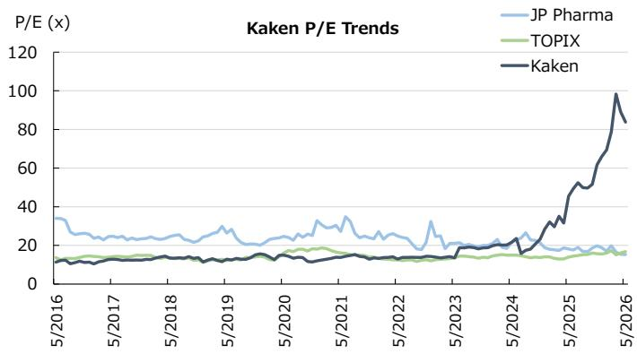

line chart

| Date   | JP Pharma | TOPIX | Kaken |
|--------|-----------|-------|-------|
| 5/2016 | 35        | 12    | 10    |
| 5/2017 | 28        | 13    | 11    |
| 5/2018 | 25        | 14    | 12    |
| 5/2019 | 27        | 15    | 13    |
| 5/2020 | 26        | 16    | 14    |
| 5/2021 | 30        | 17    | 15    |
| 5/2022 | 28        | 16    | 14    |
| 5/2023 | 25        | 15    | 13    |
| 5/2024 | 20        | 14    | 12    |
| 5/2025 | 18        | 13    | 10    |
| 5/2026 | 15        | 12    | 95    |

Source: FactSet, MS, Note: JP Pharma P/E are weighted Avg of our coverage companies' P/E (based on our 1-1.5 year forward EPS estimates

<table><tr><td>(Yn bn)</td><td>F3/26</td><td>F3/27e</td><td>F3/28e</td><td>F3/29e</td><td>F3/30e</td><td>F3/31e</td></tr><tr><td>Sales</td><td>76.9</td><td>89.0</td><td>93.2</td><td>82.9</td><td>89.3</td><td>96.7</td></tr><tr><td>YoY</td><td>-18.3%</td><td>15.8%</td><td>4.7%</td><td>-11.1%</td><td>7.7%</td><td>8.3%</td></tr><tr><td>OP</td><td>-0.9</td><td>8.2</td><td>10.6</td><td>3.3</td><td>7.6</td><td>13.1</td></tr><tr><td>YoY</td><td>-104.3%</td><td>-1012.1%</td><td>29.3%</td><td>-68.9%</td><td>130.3%</td><td>72.4%</td></tr></table>

Source: MS, Note: e=MS estimates

## Towa Pharmaceutical (4553, OW, PT ¥5,600)

## Generic Industry

• Gov shifts towards consolidation in response to prolonged supply shortages  
• Volume share already near 90%, leaving limited room for further expansion  
• Corporate evaluation to accelerate consolidation among top-tier makers  
- Key points for competitiveness in generics industry: 1) Supply capacity, 2) pricing strategy and 3) cost management

## Key Points

- Improving earnings visibility; shares remain undervalued  
- Collaboration (outsourcing) with Adragos Pharma and Sanwa Kagaku enhances visibility on volume growth.  
- Portfolio optimization is progressing, with profitability improving through legacy products and new product launches.  
- Up to Y20bn raised via third-party allotment of preferred shares, easing CAPEX constraints.  
• Obtained US/EU biz through Pensa acquisition in 2020;  
• Earnings contribution remains limited

FV for each scenario

<table><tr><td>Scenario</td><td>FV</td></tr><tr><td>Bull Case</td><td>¥7,200 (P/E 13.0x Bull Case F3/28 EPS estimates)</td></tr><tr><td>Base Case</td><td>¥5,600 (P/E 11.0x Base Case F3/28 EPS estimates)</td></tr><tr><td>Bear Case</td><td>¥3,600 (P/E 8.0x Bear Case F3/28 EPS estimates)</td></tr></table>

Source: MS, Note: all estimates are MS estimates

<table><tr><td>Timing</td><td>Catalyst</td></tr><tr><td>8/2026</td><td>1Q26 earnings</td></tr><tr><td>6-12/2026</td><td>Corporate evaluation by MHLW</td></tr><tr><td>2026-27</td><td>Update for volume strategy (outsourcing)</td></tr><tr><td>6/2027</td><td>Next mid-term business plan (F2027-29)</td></tr></table>

Source: Company data, MS

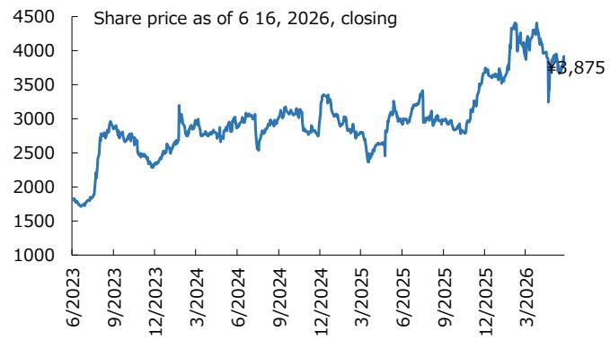

line chart

| Date       | Share Price |
| ---------- | ----------- |
| 3/2026     | ¥8,875      |

Source: FactSet, MS  
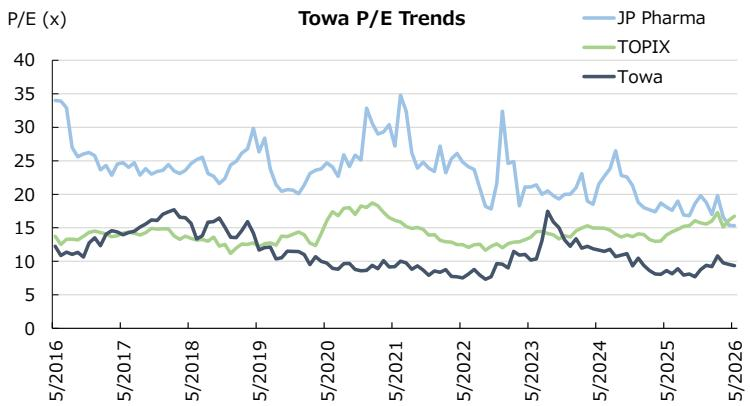

line chart

| Date   | JP Pharma | TOPIX | Towa |
|--------|-----------|-------|------|
| 5/2016 | 35        | 13    | 11   |
| 5/2017 | 25        | 14    | 14   |
| 5/2018 | 24        | 13    | 17   |
| 5/2019 | 28        | 14    | 15   |
| 5/2020 | 20        | 18    | 10   |
| 5/2021 | 35        | 17    | 9    |
| 5/2022 | 25        | 13    | 8    |
| 5/2023 | 32        | 14    | 17   |
| 5/2024 | 26        | 15    | 13   |
| 5/2025 | 18        | 14    | 9    |
| 5/2026 | 17        | 16    | 10   |

Source: FactSet, MS, Note: JP Pharma P/E are weighted Avg of our coverage companies' P/E (based on our 1-1.5 year forward EPS estimates)

<table><tr><td>(Yn bn)</td><td>F3/26</td><td>F3/27e</td><td>F3/28e</td><td>F3/29e</td><td>F3/30e</td><td>F3/31e</td></tr><tr><td>Sales</td><td>273.7</td><td>303.4</td><td>320.3</td><td>336.5</td><td>346.9</td><td>353.2</td></tr><tr><td>YoY</td><td>5.4%</td><td>10.8%</td><td>5.6%</td><td>5.1%</td><td>3.1%</td><td>1.8%</td></tr><tr><td>OP</td><td>23.1</td><td>32.6</td><td>33.1</td><td>36.1</td><td>38.1</td><td>39.3</td></tr><tr><td>YoY</td><td>-0.6%</td><td>41.1%</td><td>1.5%</td><td>9.1%</td><td>5.5%</td><td>3.1%</td></tr></table>

Source: MS, Note: all estimates are MS estimates

## Astellas (4503, EW, PT ¥2,050)

## Key Points

- Robust growth of current earnings vs. Xtandi cliff in 8/2027  
• Mid-term plan 26-30: Sales bottom in F3/30. F3/31 target (Coe OP Y600bn)  
• Xtandi: LOE in 8/2027. Part D redesign (1/2025-) boosts volume demand  
- Izervay for GA: Iveric Bio (\$5.9bn acquisition in 2023)  
- Slower than expected growth after the lift of 12-months restriction (2/2025)  
- Apellis' Syfovre (competitor): US approval in 2/2023. Safety concern  
- \$4bn intangible for US business. EU withdrawal in 11/2024  
- Padcev  
- Launched for 2/3L bladder cancer (mUC) in 2020  
• 1L mUC approval in 4/2023. MIBC success in 8/2025 (w Keytruda)  
• Vyloy (Claudin 18.2 Ab)  
• 2024 launch for GC 1L. Faster than expected initial ramp up  
- ASP3082 (KRAS G12D/setiderasib). PDAC 1L (Ph3, w chemo) interim result in F3/30. NSCLC 2L Ph3 (mono) result in F3/29. Competes with Dara of Revolution  
• ASP2138 (CLDN18.3 x CD3 BsAb). GC 1L Ph3 results in F3/30  
• AT845 (Pompe gene therapy), ASP7317 (Cell therapy for GA) in POC stage

FV for each scenario

<table><tr><td>Scenario</td><td>FV</td></tr><tr><td>Bull Case</td><td>¥2,800 (P/E 10.0x Bull Case F3/28 EPS estimates)</td></tr><tr><td>Base Case</td><td>¥2,050 (P/E 8.5x Base Case F3/28 EPS estimates)</td></tr><tr><td>Bear Case</td><td>¥1,650 (P/E 7.5x Bear Case F3/28 EPS estimates)</td></tr></table>

Source: MS, Note: all estimates are MS estimates

<table><tr><td>TimingG</td><td>Catalysts</td></tr><tr><td>2028</td><td>Setidrasib (KRAS G12D). NSCLC 2L+ Ph3 result (mono)</td></tr><tr><td>2029</td><td>Setiderasib. PDAC 1L Ph3 interim result (w chemo)</td></tr><tr><td>2029</td><td>ASP2138 (CLDNxCD3). GC 1L Ph3 result</td></tr></table>

Source: Company data, MS

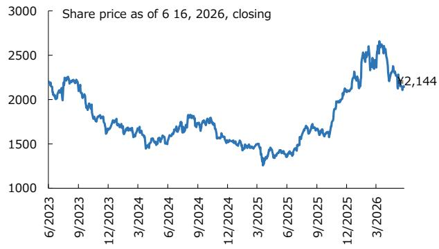

line chart

| Date     | Share Price |
| -------- | ----------- |
| 3/2026   | ¥2,144      |

Source: FactSet, MS  
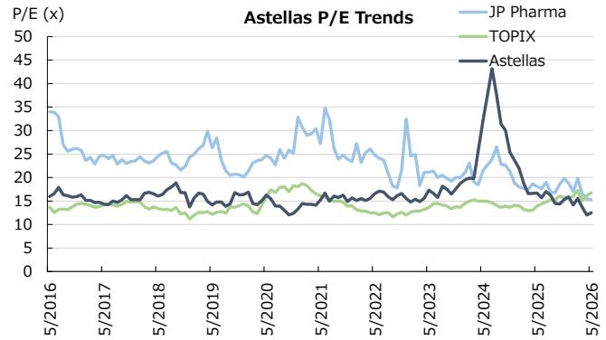

line chart

| Date     | JP Pharma | TOPIX | Astellas |
| -------- | --------- | ----- | -------- |
| 5/2016   | 35        | 13    | 17       |
| 5/2017   | 25        | 13    | 16       |
| 5/2018   | 24        | 13    | 17       |
| 5/2019   | 28        | 14    | 16       |
| 5/2020   | 22        | 15    | 15       |
| 5/2021   | 35        | 17    | 16       |
| 5/2022   | 25        | 14    | 16       |
| 5/2023   | 33        | 14    | 17       |
| 5/2024   | 20        | 15    | 43       |
| 5/2025   | 18        | 14    | 16       |
| 5/2026   | 17        | 16    | 13       |

Source: FactSet, MS, Note: JP Pharma P/E are weighted Avg of our coverage companies' P/E (based on our 1-1.5 year forward EPS estimates)

<table><tr><td>(Yn bn)</td><td>F3/26</td><td>F3/27e</td><td>F3/28e</td><td>F3/29e</td><td>F3/30e</td><td>F3/31e</td></tr><tr><td>Sales</td><td>2139.2</td><td>2291.0</td><td>2092.0</td><td>1941.0</td><td>1924.0</td><td>2010.0</td></tr><tr><td>YoY</td><td>11.9%</td><td>7.1%</td><td>-8.7%</td><td>-7.2%</td><td>-0.9%</td><td>4.5%</td></tr><tr><td>OP</td><td>382.6</td><td>437.5</td><td>358.0</td><td>249.5</td><td>237.0</td><td>297.5</td></tr><tr><td>YoY</td><td>832.4%</td><td>14.3%</td><td>-18.2%</td><td>-30.3%</td><td>-5.0%</td><td>25.5%</td></tr><tr><td>Core OP</td><td>555.7</td><td>662.5</td><td>583.0</td><td>454.5</td><td>442.0</td><td>502.5</td></tr><tr><td>YoY</td><td>41.6%</td><td>19.2%</td><td>-12.0%</td><td>-22.0%</td><td>-2.8%</td><td>13.7%</td></tr></table>

Source: MS, Note: e=MS estimates

## Eisai (4523, EW, PT ¥3,800)

## Key Points

• Leqembi (lecanemab)  
• 27% improvement in CDR-SB (0.45pt) – 3yr push back of progress. Q2W IV  
• Less than 10% frequency for ARIA-E  
• SC: QW 360mg. US launch in 10/2025 (maintenance). IV possible after 18 mths  
- Maintenance therapy: Q4W IV (\$13k/yr). QW for SC (\$19k/yr)  
- Initial therapy for SC : Approval expected in mid-2026 (500mg/wk)  
• PET installation number: 1700 in US, 600 in JP  
- Need to improve GPM. High 1 digit royalty pay to BioArctic  
- Lenvima's LOE  
- Generic lawsuit mostly subsided (LOE pushed back to 6/2030 actually in US)  
• Settled with Sun Pharma in 2024. Win against Shilpa in 5/2025  
- Kisunla (donanemab). US approval in 7/2024. \$32k/year/pt (\$26.5k Leqembi)  
- Trontinemab. Roche. Ph3 starts in 2025 and launch expected in 2028.  
• Etalanetug (MTBR Tau Ab). Ph2 results in 2027 (sporadic AD)  
• E2086 (narcolepsy). Eisau plans to file in 2028 for both NT1 and NT2

FV for each scenario

<table><tr><td rowspan="2"></td><td colspan="3">Fair Value / Share</td></tr><tr><td>Bull</td><td>Base</td><td>Bear</td></tr><tr><td>Leqembi</td><td>¥3,700</td><td>¥1,900</td><td>¥1,100</td></tr><tr><td>Lenvima</td><td>¥1,700</td><td>¥1,300</td><td>¥900</td></tr><tr><td>Other Biz</td><td>¥1,000</td><td>¥600</td><td>¥300</td></tr><tr><td>Total</td><td>¥6,400</td><td>¥3,800</td><td>¥2,300</td></tr></table>

<table><tr><td rowspan="2"></td><td colspan="3">2030 Global Sales ($m)</td></tr><tr><td>Bull</td><td>Base</td><td>Bear</td></tr><tr><td>Leqembi</td><td>$6,300</td><td>$3,200</td><td>$1,900</td></tr><tr><td>Lenvima</td><td>$1,800</td><td>$1,370</td><td>$900</td></tr></table>

Source: MS, Note: all estimates are MS estimates

<table><tr><td>Timing</td><td>Catalysts</td></tr><tr><td>8/2026</td><td>Leqembi SC: FDA approval for initial treatment (500mg QW)</td></tr><tr><td>2027-28</td><td>AD: Results for Etalanetug (Ph2, 2027) and Trontinemab (Ph3, 2028)</td></tr></table>

Source: Company data, MS, Note: AD=Alzheimer's Disease

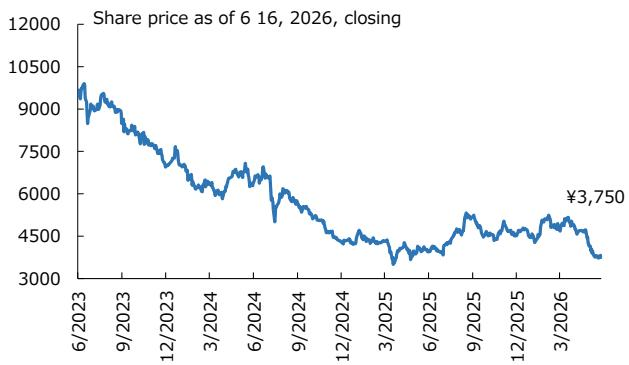

line chart

| Date     | Share Price |
| -------- | ----------- |
| 3/2026   | ¥3,750      |

Source: FactSet, MS  
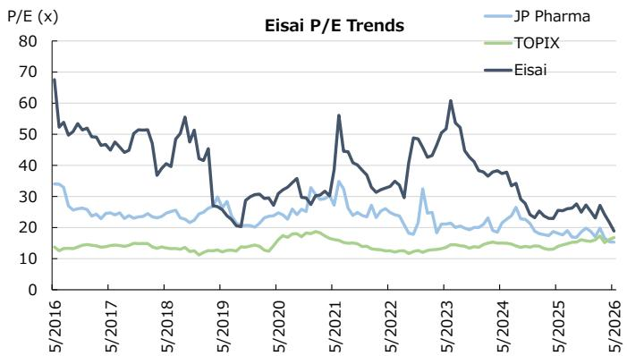

line chart

| Date   | JP Pharma | TOPIX | Eisai |
|--------|-----------|-------|-------|
| 5/2016 | 35        | 13    | 70    |
| 5/2017 | 25        | 14    | 50    |
| 5/2018 | 24        | 13    | 55    |
| 5/2019 | 28        | 12    | 25    |
| 5/2020 | 26        | 15    | 30    |
| 5/2021 | 35        | 18    | 55    |
| 5/2022 | 25        | 14    | 35    |
| 5/2023 | 30        | 15    | 60    |
| 5/2024 | 25        | 16    | 35    |
| 5/2025 | 20        | 17    | 25    |
| 5/2026 | 18        | 18    | 20    |

Source: FactSet, MS, Note: JP Pharma P/E are weighted Avg of our coverage companies' P/E (based on our 1-1.5 year forward EPS estimates)

<table><tr><td>(Yn bn)</td><td>F3/26</td><td>F3/27e</td><td>F3/28e</td><td>F3/29e</td><td>F3/30e</td><td>F3/31e</td></tr><tr><td>Sales</td><td>825.4</td><td>899.0</td><td>999.0</td><td>1030.0</td><td>1083.0</td><td>1039.0</td></tr><tr><td>YoY</td><td>4.6%</td><td>8.9%</td><td>11.1%</td><td>3.1%</td><td>5.1%</td><td>-4.1%</td></tr><tr><td>OP</td><td>44.1</td><td>70.3</td><td>95.5</td><td>97.3</td><td>99.7</td><td>89.4</td></tr><tr><td>YoY</td><td>-18.8%</td><td>59.3%</td><td>35.8%</td><td>1.9%</td><td>2.5%</td><td>-10.3%</td></tr></table>

Source: MS, Note: e=MS estimates

## Shionogi (4507, EW, PT ¥2,950)

## Key Points

- Asset acquisition  
• JT/Torii : Y30bn/yr royalty income (HIV, MEK). Cost synergy  
- Radicava: \$1bn sales. Y400bn invest. LOE \* 2029 for IV, 2039 for ORS  
• ViiV : Raise ownership from 10.0% to 21.7% (Y335bn invest)  
• COVID-19 oral drug (Xocova)  
• JP approval in 11/2022. Protease inhibitor (QD) w/o booster  
• US : FDA review ongoing for prevention use (PDUFA 6/16/2026)  
- HIV Franchise  
- CAB (injectable, Cabenuva, etc) shows solid growth.  
- Next gen LA injection S-365598 (Ph1, INI) expected to maintain HIV franchise until around 2040.  
• Gilead showed successful Ph3 for prevention (PrEP) studies  
- Next pipeline  
• S-337395 (oral RSV). Ph2a success in 1/2025. Ph2b begins in 2025  
• S-899216 (Next COVID). Ph2 in oral, Ph1 in inj. BARDA grant for LAI  
• Pipeline acquisition from outside

FV for each scenario

<table><tr><td>Scenario</td><td>FV</td></tr><tr><td>Bull</td><td>¥3,750 (P/E 10.0x Bull case F3/28 EPS estimates)</td></tr><tr><td>Base</td><td>¥2,950 (P/E 9.0x Base case F3/28 EPS estimates)</td></tr><tr><td>Bear</td><td>¥2,050 (P/E 7.0x Bear case F3/28 EPS estimates)</td></tr></table>

Source: MS, Note: all estimates are MS estimates

<table><tr><td>Timing</td><td>Catalyst</td></tr><tr><td>2026-27</td><td>S-337395: RSV (oral). Ph2b result</td></tr><tr><td>2028-29</td><td>LOE for Tivicay, Triumeq, Dovato, Radivaca (IV)</td></tr><tr><td>2028-30</td><td>VH184 (NTRI, Q6M). Plans to launch (as a combo injection)</td></tr></table>

Source: Company data, MS

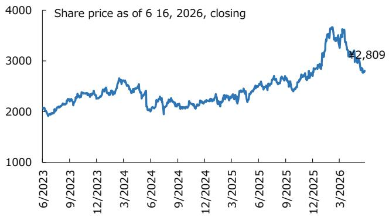

line chart

| Date       | Share Price |
| ---------- | ----------- |
| 3/2026     | 2,809       |

Source: FactSet, MS  
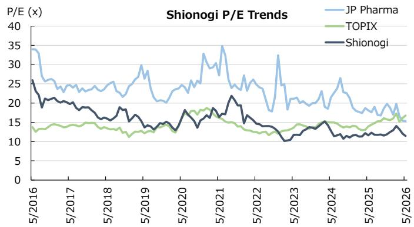

line chart

| Date   | JP Pharma | TOPIX | Shionogi |
|--------|-----------|-------|----------|
| 5/2016 | 35        | 14    | 25       |
| 5/2017 | 25        | 14    | 20       |
| 5/2018 | 28        | 13    | 18       |
| 5/2019 | 30        | 13    | 16       |
| 5/2020 | 25        | 14    | 15       |
| 5/2021 | 35        | 15    | 18       |
| 5/2022 | 25        | 14    | 16       |
| 5/2023 | 30        | 15    | 14       |
| 5/2024 | 25        | 16    | 13       |
| 5/2025 | 20        | 17    | 14       |
| 5/2026 | 18        | 18    | 12       |

Source: FactSet, MS, Note: JP Pharma P/E are weighted Avg of our coverage companies' P/E (based on our 1-1.5 year forward EPS estimates)

<table><tr><td>(Yn bn)</td><td>F3/26</td><td>F3/27e</td><td>F3/28e</td><td>F3/29e</td><td>F3/30e</td><td>F3/31e</td></tr><tr><td>Sales</td><td>499.7</td><td>719.0</td><td>766.0</td><td>783.0</td><td>757.5</td><td>718.5</td></tr><tr><td>YoY</td><td>14.0%</td><td>43.9%</td><td>6.5%</td><td>2.2%</td><td>-3.3%</td><td>-5.1%</td></tr><tr><td>OP</td><td>166.7</td><td>250.5</td><td>305.5</td><td>310.0</td><td>249.5</td><td>219.5</td></tr><tr><td>YoY</td><td>6.5%</td><td>50.2%</td><td>22.0%</td><td>1.5%</td><td>-19.5%</td><td>-12.0%</td></tr><tr><td>Core OP</td><td>160.8</td><td>250.5</td><td>305.5</td><td>310.0</td><td>249.5</td><td>219.5</td></tr><tr><td>YoY</td><td>1.5%</td><td>55.8%</td><td>22.0%</td><td>1.5%</td><td>-19.5%</td><td>-12.0%</td></tr></table>

Source: MS, Note: e=MS estimates

## Santen (4536, EW, PT ¥1,900)

## Key Points

- Hinges on success of myopia (Launched in 2025) & ptosis (Launched in 2026) in Japan  
• F29 Target: Sales Y400bn, Core OP Y80bn. Myopia Y30bn, Ptosis Y15bn.  
- Japan

- Ryjusea (Myopia) launched in 4/2025. 100% out of pocket scheme. Co expects peak sales of Y20bn in JP and Y60bn ww.  
- Upneeq (Ptosis) launched in 5/2026. $100\%$ out of pocket scheme. Co expects peak sales of Y15bn in JP and Y45bn ww.  
• LOE for Alesion (2021), Diquas (2023) and Tapros (2023) and Eylea (2023)

\- China

• VBP triggered unit sales decline

\- Keep watch 1) economic slowdown and 2) anti-collapse campaign impact

• Europe and Asia: Stable high single-double digit growth

• US: Withdrawal in 2023

\- Proactive shareholders' return policy (Annual ¥30-40bn buyback)

FV for each scenario

<table><tr><td>Scenario</td><td>FV</td></tr><tr><td>Bull Case</td><td>¥2,750 (P/E 17.0x Bull Case F3/28 EPS estimates)</td></tr><tr><td>Base Case</td><td>¥1,900 (P/E 12.5x Base Case F3/28 EPS estimates)</td></tr><tr><td>Bear Case</td><td>¥1,300 (P/E 11.0x Bear Case F3/28 EPS estimates)</td></tr></table>

Source: MS, Note: all estimates are MS estimates

<table><tr><td>Timing</td><td>Catalyst</td></tr><tr><td>2026-27</td><td>Quarterly sales performance for Ryjusea (Myopia) for Upneeq (Ptosis)</td></tr><tr><td>11/2026</td><td>Share buyback Y20-30bn</td></tr></table>

Source: Company data, MS

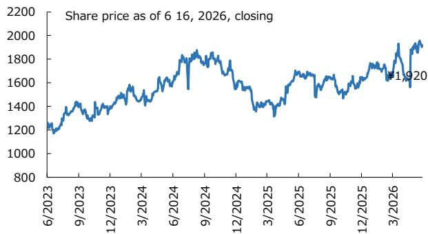

line chart

| Date     | Share Price |
| -------- | ----------- |
| 3/2026   | 1920        |

Source: FactSet, MS  
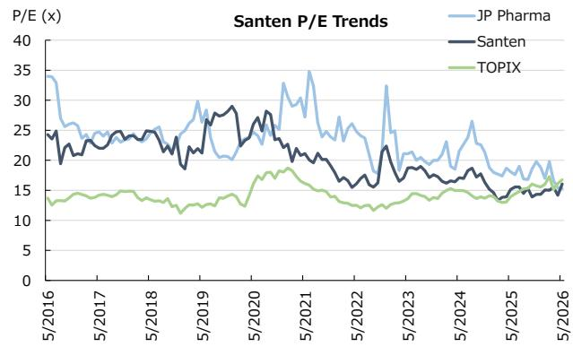

line chart

| Date   | JP Pharma | Santen | TOPIX |
|--------|-----------|--------|-------|
| 5/2016 | 35        | 25     | 13    |
| 5/2017 | 28        | 24     | 14    |
| 5/2018 | 26        | 23     | 13    |
| 5/2019 | 30        | 28     | 14    |
| 5/2020 | 25        | 26     | 17    |
| 5/2021 | 35        | 24     | 18    |
| 5/2022 | 28        | 20     | 15    |
| 5/2023 | 33        | 18     | 14    |
| 5/2024 | 25        | 17     | 15    |
| 5/2025 | 18        | 15     | 14    |
| 5/2026 | 16        | 14     | 15    |

Source: FactSet, MS, Note: JP Pharma P/E are weighted Avg of our coverage companies' P/E (based on our 1-1.5 year forward EPS estimates)

<table><tr><td>(Yn bn)</td><td>F3/26</td><td>F3/27e</td><td>F3/28e</td><td>F3/29e</td><td>F3/30e</td><td>F3/31e</td></tr><tr><td>Sales</td><td>291.6</td><td>304.1</td><td>312.0</td><td>325.4</td><td>338.9</td><td>356.6</td></tr><tr><td>YoY</td><td>-2.8%</td><td>4.3%</td><td>2.6%</td><td>4.3%</td><td>4.1%</td><td>5.2%</td></tr><tr><td>OP</td><td>47.8</td><td>50.9</td><td>56.9</td><td>64.5</td><td>72.4</td><td>84.5</td></tr><tr><td>YoY</td><td>2.0%</td><td>6.5%</td><td>11.8%</td><td>13.4%</td><td>12.2%</td><td>16.7%</td></tr><tr><td>Core OP</td><td>55.1</td><td>59.8</td><td>65.0</td><td>72.4</td><td>80.1</td><td>92.1</td></tr><tr><td>YoY</td><td>-7.1%</td><td>8.4%</td><td>8.7%</td><td>11.4%</td><td>10.6%</td><td>15.0%</td></tr></table>

Source: MS, Note: e=MS estimates

## Tsumura (4540, EW, PT ¥4,100)

## Key Points

- Profit growth plateau. Rising costs from efforts to build a solid supply structure has caused profit growth to plateau.  
- Japan: Could be earnings upside if the current strong growth ( $>+4\%YoY$ ). We estimates slow sales growth due to the limit shipments in 2022-25.  
- China: Significant earnings upside if China strategy including M&A progress in the future.  
- Current shares factor almost small expectations for China growth story  
• Acquired Tianjin China Medico (crude drug PF) in 2019 and Shanghai Hongqiao Traditional Chinese Medicine Yinpian in 2025.  
• Acquisition of Formulation PF will be in 2025-27.

\- China market: Traditional Chinese Medicinal (TCM) market is as large as ¥1.6trn in 2023. Market is growing with the demand increase for high quality TCM products

• CAPEX: Investment plan approx. Y150bn in 2025-27.

\- CoGS ratio: Expect Y7-8bn increase in costs (depreciation + labor) over the next 3 years.

FV for each scenario

<table><tr><td>Scenario</td><td>FV</td></tr><tr><td>Bull Case</td><td>¥5,600 (P/E 10.0x Bull Case F3/28 EPS estimates)</td></tr><tr><td>Base Case</td><td>¥4,100 (P/E 9.5x Base Case F3/28 EPS estimates)</td></tr><tr><td>Bear Case</td><td>¥3,500 (P/E 9.0x Bear Case F3/28 EPS estimates)</td></tr></table>

Source: MS, Note: all estimates are MS estimates

<table><tr><td>Timing</td><td>Catalyst</td></tr><tr><td>8/2026</td><td>1Q26 results</td></tr><tr><td>2026-28</td><td>M&amp;A in Formulation platform in China</td></tr></table>

Source: Company data, MS

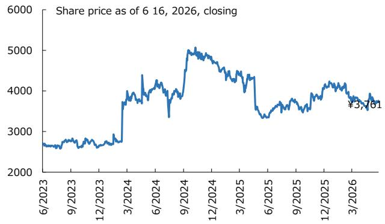

line chart

| Date     | Share Price |
| -------- | ----------- |
| 3/2026   | 3761        |

Source: FactSet, MS  
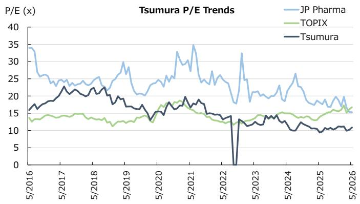

line chart

| Date   | JP Pharma | TOPIX | Tsumura |
|--------|-----------|-------|---------|
| 5/2016 | 34.0      | 13.0  | 17.0    |
| 5/2017 | 25.0      | 13.5  | 20.0    |
| 5/2018 | 24.0      | 13.0  | 21.0    |
| 5/2019 | 29.0      | 14.0  | 19.0    |
| 5/2020 | 25.0      | 15.0  | 17.0    |
| 5/2021 | 35.0      | 16.0  | 18.0    |
| 5/2022 | 18.0      | 14.0  | 13.0    |
| 5/2023 | 25.0      | 15.0  | 14.0    |
| 5/2024 | 27.0      | 14.5  | 13.5    |
| 5/2025 | 19.0      | 15.0  | 11.0    |
| 5/2026 | 17.0      | 16.0  | 11.5    |

Source: FactSet, MS, Note: JP Pharma P/E are weighted Avg of our coverage companies' P/E (based on our 1-1.5 year forward EPS estimates)

<table><tr><td>(Yn bn)</td><td>F3/26</td><td>F3/27e</td><td>F3/28e</td><td>F3/29e</td><td>F3/30e</td><td>F3/31e</td></tr><tr><td>Sales</td><td>192.6</td><td>215.8</td><td>228.6</td><td>238.2</td><td>248.7</td><td>259.9</td></tr><tr><td>YoY</td><td>6.4%</td><td>12.0%</td><td>5.9%</td><td>4.2%</td><td>4.4%</td><td>4.5%</td></tr><tr><td>OP</td><td>35.2</td><td>40.0</td><td>42.8</td><td>45.0</td><td>48.3</td><td>50.6</td></tr><tr><td>YoY</td><td>-12.2%</td><td>13.6%</td><td>7.0%</td><td>5.1%</td><td>7.3%</td><td>4.8%</td></tr></table>

Source: MS, Note: all estimates are MS estimates

## Sumitomo Pharma (4506, EW, PT ¥2,200)

## Key Points

• 3 Growth drivers  
- Orgovyx: Prostate cancer. Co-promotion with Pfizer (from 12/2020); we forecast peak sales of \$2.3bn  
- PFE sales milestone; \$100m at \$500m, \$325m at \$1bn sales. Total \$1,750m income at max (5 steps, up to \$2.5bn sales)  
• Gemtesa: OAB. Rebate cut ongoing. Myrbetriq launch in 4/2024  
• Myfembree: UF/EM. Slow penetration. Pfizer alliance terminated in 2024  
• 3 cancer drugs: Seeking partnering opportunities for Enzo and Nuvi  
- Enzomenib (AML, Ph1/2, Menin inhb), sales up to \$1.7bn potential  
- Nuvisertib (MF, Ph1/2, PIM inhb), sales up to \$0.8bn potential  
- SMP-3124 (Solid tumors, Ph2 initiate soon, CHK1 inhb)  
• LOEs  
- Orgovyx in 2029 (product) & 2037 (use). ANDA lawsuit vs. Cipla. IRA price negotiation risk in around 2030  
• Vibegron in 2034  
• Net Debt; Y200bn debt as of 3/2026 - PO ¥100bn in 4/2026  
- Sumitomo Chem: 43-44% ownership. Lifted debt guarantee for Sumi Pharm.

FV for each scenario

<table><tr><td>Scenario</td><td>FV</td></tr><tr><td>Bull Case</td><td>¥3,300 (P/E 13.0x Core EPS F3/28-29 average)</td></tr><tr><td>Base Case</td><td>¥2,200 (P/E 10.0x Core EPS F3/28-29 average)</td></tr><tr><td>Bear Case</td><td>¥1,500 (P/E 8.0x Core EPS F3/28-29 average)</td></tr></table>

Source: MS, Note: all estimates are MS estimates

<table><tr><td>Timing</td><td>Catalyst</td></tr><tr><td>Early-2027</td><td>Partnering: Enzomenib &amp; Nuvisertib</td></tr><tr><td>10/2026</td><td>2Q26: Dividend resumption</td></tr><tr><td>2026-27</td><td>Next medium-term Plan (Strategy for 2 new drugs, shareholder return)</td></tr><tr><td>2027-28</td><td>Co launch plan: Enzomenib (AML) in 2027, Nuvisertib (MF) in 2028</td></tr></table>

Source: Company data, MS

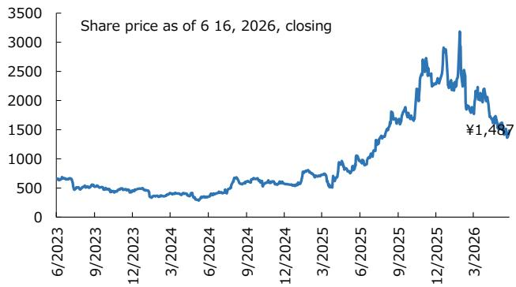

line chart

| Date       | Share Price |
| ---------- | ----------- |
| 3/2026     | ¥1,487      |

Source: FactSet, MS  
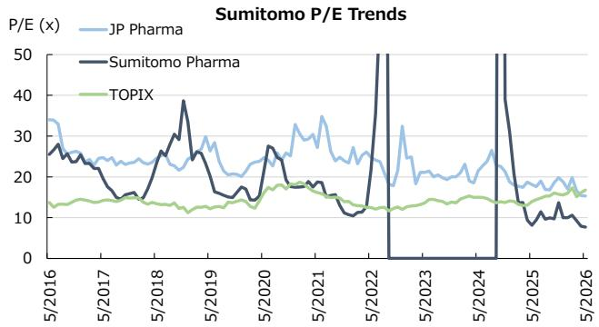

line chart

| Date   | JP Pharma | Sumitomo Pharma | TOPIX |
|--------|-----------|-----------------|-------|
| 5/2016 | 35        | 28              | 13    |
| 5/2017 | 25        | 22              | 14    |
| 5/2018 | 28        | 38              | 13    |
| 5/2019 | 26        | 18              | 14    |
| 5/2020 | 24        | 28              | 15    |
| 5/2021 | 30        | 18              | 16    |
| 5/2022 | 25        | 50              | 14    |
| 5/2023 | 20        | 0               | 15    |
| 5/2024 | 25        | 50              | 16    |
| 5/2025 | 18        | 10              | 17    |
| 5/2026 | 17        | 8               | 16    |

Source: FactSet, MS, Note: JP Pharma P/E are weighted Avg of our coverage companies' P/E (based on our 1-1.5 year forward EPS estimates)

<table><tr><td>(Yn bn)</td><td>F3/26</td><td>F3/27e</td><td>F3/28e</td><td>F3/29e</td><td>F3/30e</td><td>F3/31e</td></tr><tr><td>Sales</td><td>453.3</td><td>545.8</td><td>615.1</td><td>601.8</td><td>723.9</td><td>671.0</td></tr><tr><td>YoY</td><td>13.7%</td><td>20.4%</td><td>12.7%</td><td>-2.2%</td><td>20.3%</td><td>-7.3%</td></tr><tr><td>OP</td><td>107.3</td><td>104.3</td><td>140.6</td><td>93.9</td><td>188.4</td><td>120.7</td></tr><tr><td>YoY</td><td>272.6%</td><td>-3.0</td><td>34.8%</td><td>-33.2%</td><td>100.6%</td><td>-35.9%</td></tr><tr><td>Core OP</td><td>106.0</td><td>105.3</td><td>141.6</td><td>94.9</td><td>189.4</td><td>121.7</td></tr><tr><td>YoY</td><td>145.7%</td><td>-0.7</td><td>34.5%</td><td>-33.0%</td><td>99.6%</td><td>-35.7%</td></tr></table>

Source: MS, Note: e=MS estimates

## SanBio (4592, EW, PT ¥1,500)

## Key Points

• Akuugo/SB623 (TBI, Japan)  
- JP approval -7/2024 (filed in 3/2022). Commercial approval in 12/2025  
• Drug price Y72mil/patient. CoE peak sales Y2.8bn(39 patients)  
• Sales est (JP, 2035): Y30bn=Y40mil x 1.1-1.2k pts x 70% POS  
• TBI patients : 60k in JP. Akuugo eligible patients : about 4000  
- Our est includes two times price cut in next 10yr (15-20% each)  
- Akuugo (TBI, US)  
• Co plans to initiate US Ph3 in 2026-27 (FDA meeting completed)  
- Our model assume partnering in US (co to receive $35\%$ royalty)  
- SB623 (stroke)  
- Failed in US Ph2 in 2019. Sub-analysis identified favorable population  
• Co is seeking alliance partner (for both TBI and stroke in US)  
- Capital needs.  
- Y4bn capital raise in 12/2024 & 2/2025. Y5-6bn/yr running cost  
- SanBio expects to gain govt subsidies (grants) & partnering income

FV for each scenario

<table><tr><td rowspan="2"></td><td colspan="3">Fair value / sh</td><td colspan="3">Success Rate</td><td colspan="3">2035 sales est ($m, Ynbn)</td></tr><tr><td>Bull</td><td>Base</td><td>Bear</td><td>Bull</td><td>Base</td><td>Bear</td><td>Bull</td><td>Base</td><td>Bear</td></tr><tr><td>SB623 (TBI, JPN)</td><td>¥1,400</td><td>¥900</td><td>¥300</td><td>100%</td><td>65%</td><td>20%</td><td>¥46bn</td><td>¥30bn</td><td>¥9bn</td></tr><tr><td>SB623 (TBI, US)</td><td>¥3,800</td><td>¥600</td><td>¥0</td><td>100%</td><td>15%</td><td>0%</td><td>$1,310m</td><td>$200m</td><td>$0m</td></tr><tr><td>Total FV / share</td><td>¥5,200</td><td>¥1,500</td><td>¥300</td><td></td><td></td><td></td><td></td><td></td><td></td></tr></table>

Source: MS, Note: all estimates are MS estimates

<table><tr><td>Timing</td><td>Catalyst</td></tr><tr><td>5/2026</td><td>Drug pricing decision (Y72mil) for Akuugo (SB623)</td></tr><tr><td>2027-28 ?</td><td>US partnering for Akuugo ?</td></tr><tr><td>2027-28 ?</td><td>Next round of financing ?</td></tr></table>

Source: Company data, MS

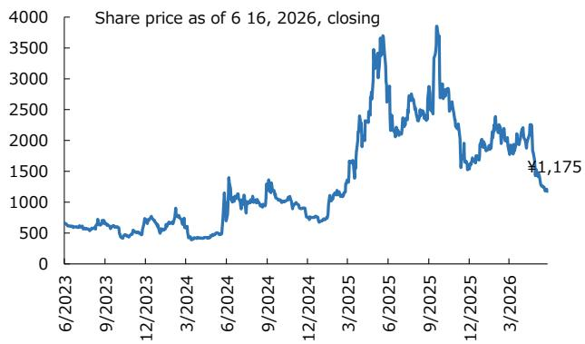

line chart

| Date       | Share Price |
| ---------- | ----------- |
| 3/2026     | 1,175       |

Source: FactSet, MS

US/JPN TBI Ph2 data: SB623(500m cell) vs PBO

<table><tr><td>Variable</td><td>Statistic</td><td>Pooled SB623 (n=46)</td><td>Control (n=15)</td><td>Difference in LS Means and 95% CI</td><td>p-value</td></tr><tr><td rowspan="3">Change from Baseline in FMMS Score at Week 24 among all patients (missing individual items at baseline imputed with 0)</td><td>n</td><td>15</td><td>15</td><td>-</td><td rowspan="3">0.0065</td></tr><tr><td>LS Mean (SE)</td><td>11.9 (2.3)</td><td>2.4 (2.3)</td><td>9.4 (3.2)</td></tr><tr><td>95% CI for LS Mean</td><td>(7.3, 16.5)</td><td>(-2.2, 7.1)</td><td>(2.9, 16.0)</td></tr></table>

Source: Company, MS

US/JPN TBI Ph2 data: SB623 vs PBO

<table><tr><td>Variable</td><td>Statistic</td><td>Pooled SB623 (n=46)</td><td>Control (n=15)</td><td>Difference in LS Means and 95% CI</td><td>p-value</td></tr><tr><td rowspan="3">Change from Baseline in FMMS Score at Week 24 among all patients (missing individual items at baseline imputed with 0)</td><td>n</td><td>46</td><td>15</td><td>-</td><td rowspan="3">0.0444</td></tr><tr><td>LS Mean (SE)</td><td>8.7 (1.5)</td><td>2.4 (2.3)</td><td>6.3 (3.1)</td></tr><tr><td>95% CI for LS Mean</td><td>(5.6, 11.7)</td><td>(-3.0, 7.7)</td><td>(0.2, 12.5)</td></tr></table>

Source: Company, MS

<table><tr><td>(Yn bn)</td><td>F1/26</td><td>F1/27e</td><td>F1/28e</td><td>F1/29e</td><td>F1/30e</td><td>F1/31e</td></tr><tr><td>Sales</td><td>0.0</td><td>0.6</td><td>2.5</td><td>7.7</td><td>11.7</td><td>19.9</td></tr><tr><td>YoY</td><td>-</td><td>-</td><td>-</td><td>-</td><td>-</td><td>70.1%</td></tr><tr><td>OP</td><td>-3.8</td><td>-5.0</td><td>-5.0</td><td>-1.4</td><td>0.3</td><td>6.2</td></tr><tr><td>YoY</td><td>-7.9%</td><td>-31.8%</td><td>0.0%</td><td>72.0%</td><td>121.4%</td><td>-1966.7%</td></tr></table>

Source: MS, Note: e=MS estimates

## JCR Pharma (4552, EW, PT ¥500)

## Key Points

• JBC new drugs: Improved enzyme replacement therapy (ERT) by JBC  
• Izcargo/JR-141 (Hunter/MPS II)

• Better than Elaprase. JP launch in 5/2021. Global Ph3 result in 2026-27  
• FDA requires Ph3 for review. Ph3 completion expected in 2026 spring  
- Competitor

• Avlayah: 3/2026 FDA approval. \$811k/yr/30kg BW.  
• RGX-121: CRL in 2/2026 (CBER) after 3 months push back of PDUFA  
obal alliance. Looking for the replacement of Takeda

• JR-171 (Hurler/ MPS I)

• JCR seeks partner before starting Ph3 (global)  
• Ph1/2 was successful in 2023 in cognitive function

• Other JBC new drugs:

- JR-441 (Sanfilippo A). Ph1/2 starts in 2023. 1yr result in 2025-2H  
• JR-446 (Sanfilippo B). Ph1/2 starts in 12/2024. Medipal alliance

• Alliance: Non (141&171), Medipal (446, 471), Alexion (JBC), etc  
• JBC-AAV: Gene therapy AAV vector to penetrate beyond BBB  
- Akuugo: Test manufacturing ongoing in 2025. Potential contract as CDMO

FV for each scenario

<table><tr><td>Scenario</td><td>FV</td></tr><tr><td>Bull Case</td><td>¥780 (P/B 2.0x Bull Case F3/26 BPS estimates)</td></tr><tr><td>Base Case</td><td>¥500 (P/B 1.3x Base Case F3/26 BPS estimates)</td></tr><tr><td>Bear Case</td><td>¥390 (P/B 1.0x Bear Case F3/26 BPS estimates)</td></tr></table>

Source: MS, Note: all estimates are MS estimates

<table><tr><td>Timing</td><td>Catalyst</td></tr><tr><td>F3/27</td><td>Alliance for JR-141 (MPS II, global Ph3) &amp; JR-171 (MPS I, Ph1/2 completed)</td></tr><tr><td>2026-27</td><td>Multiple JBC alliances. JBC tech &amp; JBC products (JR-141, 171, etc)</td></tr><tr><td>2027</td><td>JR-141 (Izcargo, Hunter); Global Ph3 result (n=80) &amp; US filing</td></tr></table>

Source: Company, MS

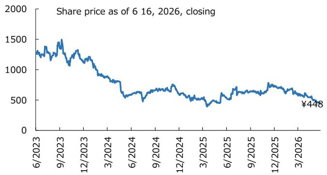

line chart

| Date     | Share Price |
| -------- | ----------- |
| 3/2026   | ¥448        |

Source: FactSet, MS  
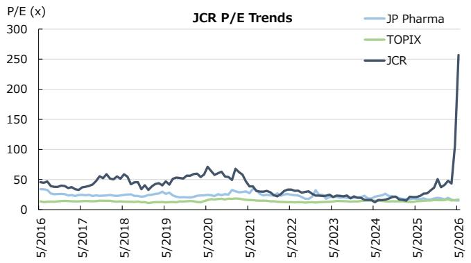

line chart

| Date   | JP Pharma | TOPIX | JCR  |
|--------|-----------|-------|------|
| 5/2016 | ~30       | ~10   | ~40  |
| 5/2017 | ~25       | ~10   | ~50  |
| 5/2018 | ~20       | ~10   | ~60  |
| 5/2019 | ~25       | ~10   | ~50  |
| 5/2020 | ~30       | ~10   | ~70  |
| 5/2021 | ~35       | ~10   | ~60  |
| 5/2022 | ~30       | ~10   | ~40  |
| 5/2023 | ~25       | ~10   | ~30  |
| 5/2024 | ~20       | ~10   | ~20  |
| 5/2025 | ~25       | ~10   | ~30  |
| 5/2026 | ~30       | ~10   | ~250 |

Source: FactSet, MS, Note: JP Pharma P/E are weighted Avg of our coverage companies' P/E (based on our 1-1.5 year forward EPS estimates)

<table><tr><td>(Yn bn)</td><td>F3/26</td><td>F3/27e</td><td>F3/28e</td><td>F3/29e</td><td>F3/30e</td><td>F3/31e</td></tr><tr><td>Sales</td><td>40.3</td><td>46.0</td><td>45.6</td><td>43.2</td><td>45.9</td><td>50.2</td></tr><tr><td>YoY</td><td>21.9%</td><td>14.1%</td><td>-0.9%</td><td>-5.3%</td><td>6.3%</td><td>9.4%</td></tr><tr><td>OP</td><td>0.6</td><td>1.5</td><td>2.8</td><td>1.4</td><td>3.6</td><td>5.5</td></tr><tr><td>YoY</td><td>-108.3%</td><td>170.3%</td><td>86.7%</td><td>-50.0%</td><td>157.1%</td><td>52.8%</td></tr></table>

Source: MS, Note: e=MS estimates

## Sawai Group Holdings (4887, EW, PT ¥2,000)

## Generic Industry

• Gov shifts towards consolidation in response to prolonged supply shortages  
• Volume share already near 90%, leaving limited room for further expansion  
• Corporate evaluation to accelerate consolidation among top-tier makers  
• Key points for competitiveness in generics industry: 1) Supply capacity, 2) pricing strategy and 3) cost management

## Key Points

• Mid-term growth potential intact, near-term earnings in a wait-and-see phase  
• Supply capacity: 20.5bn pills in 2025 and expand to 25bn pills by 2030  
- Pricing strategy from 2023 to mitigate price declines over the next 5yrs  
- Strict SG&A/R&D const control enhances earnings stability and attractiveness  
• We forecast core OP CAGR of +8% for F3/2026-31  
- Proven track record for only one or two products in the past (Edirol, Viviant, Tamiflu, etc)  
- Although entered in US biz, Sawai withdrew in 2024. Focusing on Japan biz now.

FV for each scenario

<table><tr><td>Scenario</td><td>FV</td></tr><tr><td>Bull Case</td><td>¥2,800 (P/E 15.0x Bull Case F3/28 EPS estimates)</td></tr><tr><td>Base Case</td><td>¥2,000 (P/E 12.5x Base Case F3/28 EPS estimates)</td></tr><tr><td>Bear Case</td><td>¥1,600 (P/E 11.0x Bear Case F3/28 EPS estimates)</td></tr></table>

Source: MS, Note: all estimates are MS estimates

<table><tr><td>Timing</td><td>Catalyst</td></tr><tr><td>8/2026</td><td>1Q26 earnings</td></tr><tr><td>6-12/2026</td><td>Corporate evaluation by MHLW</td></tr><tr><td>8/2026</td><td>1Q26 earnings</td></tr></table>

Source: Company data, MS

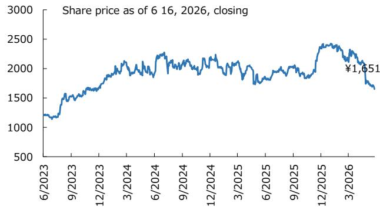

line chart

| Date     | Share Price |
| -------- | ----------- |
| 6/2023   | ~1200       |
| 9/2023   | ~1500       |
| 12/2023  | ~1800       |
| 3/2024   | ~2000       |
| 6/2024   | ~2200       |
| 9/2024   | ~2100       |
| 12/2024  | ~2300       |
| 3/2025   | ~2000       |
| 6/2025   | ~1900       |
| 9/2025   | ~2100       |
| 12/2025  | ~2400       |
| 3/2026   | ~1700       |
| 6/2026   | ¥1,651      |

Source: FactSet, MS

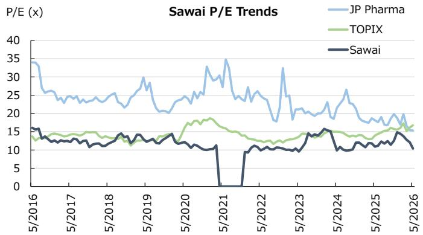

line chart

| Date   | JP Pharma | TOPIX | Sawai |
|--------|-----------|-------|-------|
| 5/2016 | 35        | 15    | 15    |
| 5/2017 | 25        | 15    | 13    |
| 5/2018 | 25        | 15    | 13    |
| 5/2019 | 30        | 15    | 13    |
| 5/2020 | 25        | 18    | 12    |
| 5/2021 | 35        | 15    | 0     |
| 5/2022 | 25        | 13    | 10    |
| 5/2023 | 30        | 15    | 12    |
| 5/2024 | 25        | 15    | 15    |
| 5/2025 | 20        | 15    | 13    |
| 5/2026 | 18        | 15    | 12    |

Source: FactSet, MS, Note: JP Pharma P/E are weighted Avg of our coverage companies' P/E (based on our 1-1.5 year forward EPS estimates)

<table><tr><td>(Yn bn)</td><td>F3/26</td><td>F3/27e</td><td>F3/28e</td><td>F3/29e</td><td>F3/30e</td><td>F3/31e</td></tr><tr><td>Sales</td><td>201.7</td><td>208.6</td><td>221.4</td><td>235.6</td><td>250.0</td><td>264.7</td></tr><tr><td>YoY</td><td>6.7%</td><td>3.4%</td><td>6.1%</td><td>6.4%</td><td>6.1%</td><td>5.9%</td></tr><tr><td>OP</td><td>15.9</td><td>24.7</td><td>26.3</td><td>28.7</td><td>30.5</td><td>32.5</td></tr><tr><td>YoY</td><td>292.4%</td><td>55.4%</td><td>6.5%</td><td>9.1%</td><td>6.3%</td><td>6.6%</td></tr><tr><td>Core OP</td><td>24.8</td><td>28.9</td><td>30.5</td><td>32.9</td><td>34.7</td><td>36.7</td></tr><tr><td>YoY</td><td>-3.6%</td><td>16.6%</td><td>5.5%</td><td>7.9%</td><td>5.5%</td><td>5.8%</td></tr></table>

Source: MS, Note: all estimates are MS estimates

## Ono (4528, UW, PT ¥1,950)

## Key Points

- Opdivo  
• LOE: JP (2031), US (2028), RoW (2028-30). SC approval in 12/2024 (US)  
• Opdivo SC: Same royalty rate with IV. Ono can receive 10yr post-launch  
• Opdualag: LAG3 combo. Ono can receive royalty even after 2028  
• Royalty for PD-1/PDL-1  
• Merck: 1.625% until 12/2023. 0.625% in 1/2024-12/2026. Zero in >2027  
• BMY: 4% in US, 15% in RoW. Ends in 2028-30  
• Other LOEs: Forxiga (2025-28 in JP), Glactiv (2026, JP)  
• Deciphera (\$2.4bn acquisition in 2024)  
• Qinlock. GIST 4L on the market in US. GIST 2L filing expected in 2026-27  
• Romvimza. TGCT. US approval in 2/2025 w/o Black Box Warning  
• Intangible: Y150bn for Qinlock, Y160bn for Romvimza  
• Next Pipeline (in US)  
• Velexbru: BTKi for PCNSL. US launch expected in 2026 (2L) and in 2028 (1L)  
• ONO-4685: PD1/CD3 Bispecific Ab. Ph1 result in 2025 (lymphoma)  
• ONO-1110: Cannabinoid mimic. Ph2 for pain/depression begins 2025  
• ONO-4578: EP4 inhibitor. GC Ph2 showed positive result

FV for each scenario

<table><tr><td>Scenario</td><td>FV</td></tr><tr><td>Bull Case</td><td>¥2,800 (P/E 16.0x Bull Case F3/28 EPS estimates)</td></tr><tr><td>Base Case</td><td>¥1,950 (P/E 13.0x Base Case F3/28 EPS estimates)</td></tr><tr><td>Bear Case</td><td>¥1,500 (P/E 11.0x Bear Case F3/28 EPS estimates)</td></tr></table>

Source: MS, Note: all estimates are MS estimates

<table><tr><td>Timing</td><td>Catalyst</td></tr><tr><td>2026</td><td>Velexbru (BTK): US filing based on US Ph2 result for PCNS 2L (2026L)</td></tr><tr><td>2026-27</td><td>Ph2 results for ONO-1110 (cannabinoid) &amp; ONO-2020</td></tr><tr><td>2027-28 ?</td><td>Alliance for in-house products ? (4578, 2808, 2020, 1110, etc)</td></tr><tr><td>2029-30 ?</td><td>Ph3 results for ONO-4578 (EP4, GC) &amp; ONO-2808 (S1P5, MSA-P)</td></tr></table>

Source: Company data, MS

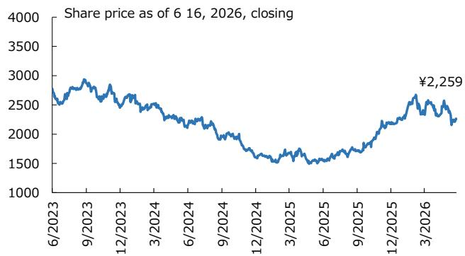

line chart

| Date       | Share Price |
| ---------- | ----------- |
| 6/2023     | ~2700       |
| 9/2023     | ~2900       |
| 12/2023    | ~2600       |
| 3/2024     | ~2400       |
| 6/2024     | ~2200       |
| 9/2024     | ~1900       |
| 12/2024    | ~1600       |
| 3/2025     | ~1500       |
| 6/2025     | ~1700       |
| 9/2025     | ~1900       |
| 12/2025    | ~2100       |
| 3/2026     | 2,259       |

Source: FactSet, MS

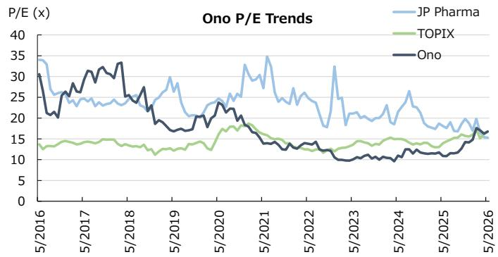

line chart

| Date   | JP Pharma | TOPIX | Ono  |
|--------|-----------|-------|------|
| 5/2016 | 35        | 14    | 30   |
| 5/2017 | 25        | 14    | 32   |
| 5/2018 | 28        | 14    | 34   |
| 5/2019 | 20        | 14    | 25   |
| 5/2020 | 25        | 18    | 20   |
| 5/2021 | 35        | 18    | 15   |
| 5/2022 | 25        | 14    | 14   |
| 5/2023 | 30        | 14    | 10   |
| 5/2024 | 25        | 14    | 10   |
| 5/2025 | 20        | 14    | 10   |
| 5/2026 | 18        | 16    | 16   |

Source: FactSet, MS, Note: JP Pharma P/E are weighted Avg of our coverage companies' P/E (based on our 1-1.5 year forward EPS estimates)

<table><tr><td>(Yn bn)</td><td>F3/26</td><td>F3/27e</td><td>F3/28e</td><td>F3/29e</td><td>F3/30e</td><td>F3/31e</td></tr><tr><td>Sales</td><td>515.8</td><td>451.0</td><td>429.5</td><td>457.0</td><td>463.5</td><td>465.0</td></tr><tr><td>YoY</td><td>5.9%</td><td>-12.6%</td><td>-4.8%</td><td>6.4%</td><td>1.4%</td><td>0.3%</td></tr><tr><td>OP</td><td>92.2</td><td>88.5</td><td>68.5</td><td>90.5</td><td>90.0</td><td>84.3</td></tr><tr><td>YoY</td><td>54.4%</td><td>-4.1%</td><td>-22.6%</td><td>32.1%</td><td>-0.6%</td><td>-6.3%</td></tr><tr><td>Core OP</td><td>-</td><td>118.5</td><td>93.5</td><td>113.5</td><td>113.0</td><td>106.3</td></tr><tr><td>YoY</td><td>-</td><td>-</td><td>-21.1%</td><td>21.4%</td><td>-0.4%</td><td>-5.9%</td></tr></table>

Source: MS, Note: e=MS estimates

## Nippon Shinyaku (4516, UW, PT ¥2,600)

## Key Points

• PAH: Uptravi. LOE in 4/2027 (US), 10/2027 (EU)  
• CAP-1002 (DMD cell therapy)  
• FDA issued CRL on 7/2025. DMD cardiomyopathy.  
- Company re-submitted sBLA and PDUFA date is 8/22/2026. HOPE-3 study success in 12/2025.  
- \$1bn potential (US 15k pt x 7-8% penetration x \$1m/yr cost)  
• Viltepso (exon 53, exon skip)  
• US launch in 2020. Failure in confirmatory Ph3 in 2024 to show motor function  
• Less likely to withdraw from US market. But need to monitor the growth  
• Additional clinical study needed to file in ex-JP/US. EU approval will be in 2027-28  
- Competitor  
- Sarepta's Elevidys: US full approval in 6/2024 (>4 ages, ambulant/non-ambulant). 2024 sales \$694m in US  
- Sarepta's 3 exon skipping drugs are accelerated approved, though Ph3 failed in 11/2025  
• NS-089 (DMD, exon 44), NS-050/051 (DMD, exon 50/51): US launch in 2027-29

FV for each scenario

<table><tr><td>Scenario</td><td>FV</td></tr><tr><td>Bull Case</td><td>¥7,300 (P/B 2.0x Bull Case F3/25 BPS)</td></tr><tr><td>Base Case</td><td>¥2,600 (P/B 0.7x Base Case F3/25 BPS)</td></tr><tr><td>Bear Case</td><td>¥1,800 (P/B 0.5x Bear Case F3/25 BPS)</td></tr></table>

Source: MS, Note: all estimates are MS estimates

<table><tr><td>Timing</td><td>Catalyst</td></tr><tr><td>8/22/2026</td><td>CAP-1002: FDA PDUFA date for DMD cardiomyopathy</td></tr><tr><td>2026</td><td>Viltepso: Review of Study 301 and pre-review of Study 303 by FDA</td></tr><tr><td>2026</td><td>RGX-121 (MPS II, Hunter) : FDA type A meeting</td></tr><tr><td>F3/2027</td><td>NS-089 (exon 44): Registration trial result in US (DMD)</td></tr></table>

Source: Company data, MS

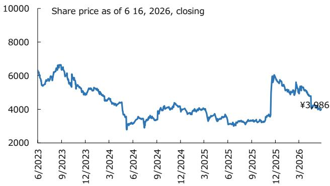

line chart

| Date     | Share Price |
| -------- | ----------- |
| 3/2026   | ¥3,986      |

Source: FactSet, MS  
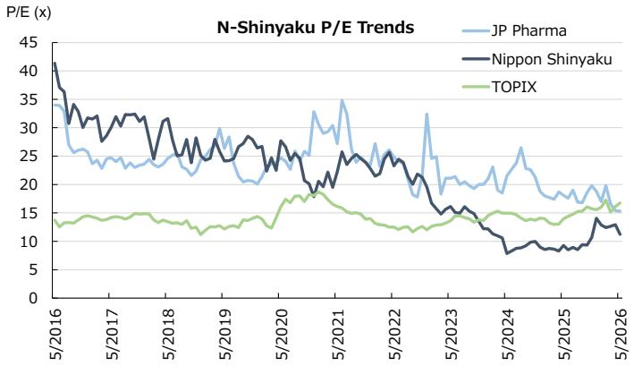

line chart

| Date   | JP Pharma | Nippon Shinyaku | TOPIX |
|--------|-----------|-----------------|-------|
| 5/2016 | 35        | 42              | 13    |
| 5/2017 | 25        | 30              | 14    |
| 5/2018 | 23        | 28              | 13    |
| 5/2019 | 20        | 25              | 12    |
| 5/2020 | 22        | 23              | 14    |
| 5/2021 | 35        | 20              | 18    |
| 5/2022 | 25        | 18              | 15    |
| 5/2023 | 20        | 15              | 14    |
| 5/2024 | 18        | 10              | 15    |
| 5/2025 | 15        | 8               | 14    |
| 5/2026 | 16        | 12              | 16    |

Source: FactSet, MS, Note: JP Pharma P/E are weighted Avg of our coverage companies' P/E (based on our 1-1.5 year forward EPS estimates)

<table><tr><td>(Yn bn)</td><td>F3/26</td><td>F3/27e</td><td>F3/28e</td><td>F3/29e</td><td>F3/30e</td><td>F3/31e</td></tr><tr><td>Sales</td><td>170.8</td><td>190.6</td><td>179.0</td><td>164.2</td><td>156.1</td><td>148.6</td></tr><tr><td>YoY</td><td>6.6%</td><td>11.6%</td><td>-6.1%</td><td>-8.3%</td><td>-4.9%</td><td>-4.8%</td></tr><tr><td>OP</td><td>35.5</td><td>37.6</td><td>22.1</td><td>4.0</td><td>4.7</td><td>4.7</td></tr><tr><td>YoY</td><td>0.1%</td><td>5.9%</td><td>-41.2%</td><td>-81.9%</td><td>17.5%</td><td>0.0%</td></tr></table>

Source: MS, Note: all estimates are MS estimates

## Kyowa Kirin (4151, UW, PT ¥1,800)

## Key Points

- Next new drugs  
- KHK4951: Ph2 results in 2026 for wet-AMD & DME (VEGF eye drop)  
• Ziftomenib: Kura tie up. AML 2/3L (mono). PDUFA in 11/30/2025  
• Solid growth for next 10yr driven by Crysvita, Poteligeo and Nourianz  
- Crysvita: 30,000 patients (US/EU). 1k/yr new patients start to be treated  
- Poteligeo: Hematology. Solid penetration  
- Nourianz: LOE in 2025 (5 years since its launch)  
• Potelligent royalty (ADCC technology)  
- Blenrep (BCMA, GSK) and Uplinza (CD19, Viela) are approved in 2020.  
• We assume 2-3% royalty rate  
• Bispecific antibody: KK2260 (EGFR-TfR1) & KK2269 (CD40-EpCAM) in Ph1  
• Orchard: Lenmeldy (MLD). US price \$4.3m/person  
• KK needs to add more mid-late stage new drugs  
• Kirin HD owns 54%

FV for each scenario

<table><tr><td>Scenario</td><td>FV</td></tr><tr><td>Bull</td><td>¥2,600 (P/E 11.5x Bull case F12/27 EPS estimates)</td></tr><tr><td>Base</td><td>¥1,800 (P/E 9.0x Base case F12/27 EPS estimates)</td></tr><tr><td>Bear</td><td>¥1,300 (P/E 7.0x Bear case F12/27 EPS estimates)</td></tr></table>

Source: MS, Note: all estimates are MS estimates

<table><tr><td>Timing</td><td>Catalyst</td></tr><tr><td>2026</td><td>Komzifti (ziftomenib): Initial uptake for AML 2/3L (mono). KOMET-001</td></tr><tr><td>2026</td><td>KHK4951 (VEGFR eye drop): Ph2 result for AMD</td></tr></table>

Source: Company data, MS

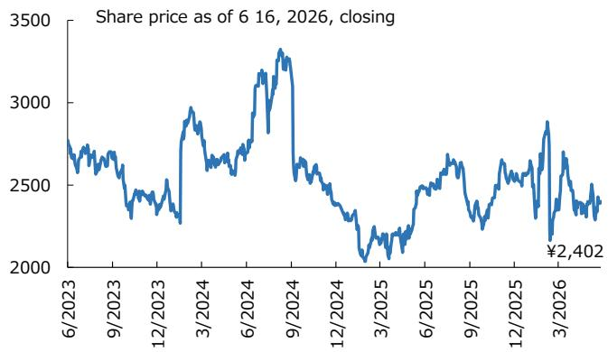

line chart

| Date     | Share Price |
| -------- | ----------- |
| 3/2026   | ¥2,402      |

Source: FactSet, MS  
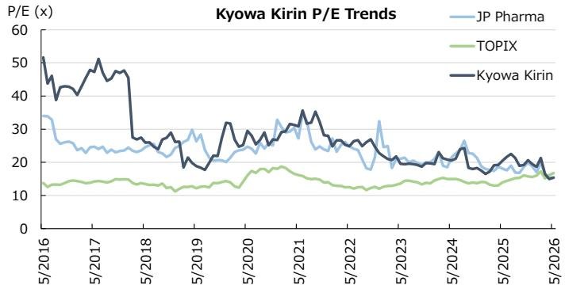

line chart

| Date   | JP Pharma | TOPIX | Kyowa Kirin |
|--------|-----------|-------|-------------|
| 5/2016 | 35        | 14    | 50          |
| 5/2017 | 28        | 14    | 48          |
| 5/2018 | 25        | 13    | 28          |
| 5/2019 | 27        | 13    | 25          |
| 5/2020 | 25        | 14    | 30          |
| 5/2021 | 30        | 16    | 35          |
| 5/2022 | 25        | 14    | 28          |
| 5/2023 | 30        | 14    | 25          |
| 5/2024 | 25        | 14    | 20          |
| 5/2025 | 20        | 14    | 18          |
| 5/2026 | 15        | 14    | 15          |

Source: FactSet, MS, Note: JP Pharma P/E are weighted Avg of our coverage companies' P/E (based on our 1-1.5 year forward EPS estimates)

<table><tr><td>(Yn bn)</td><td>F12/25</td><td>F12/26e</td><td>F12/27e</td><td>F12/28e</td><td>F12/29e</td><td>F12/30e</td></tr><tr><td>Sales</td><td>496.8</td><td>520.0</td><td>542.0</td><td>546.0</td><td>563.0</td><td>580.0</td></tr><tr><td>YoY</td><td>0.3%</td><td>4.7%</td><td>4.2%</td><td>5.0%</td><td>3.9%</td><td>6.2%</td></tr><tr><td>Core OP</td><td>109.8</td><td>128.5</td><td>134.0</td><td>117.5</td><td>116.5</td><td>116.5</td></tr><tr><td>YoY</td><td>15.1%</td><td>17.0%</td><td>4.3%</td><td>-8.6%</td><td>-13.1%</td><td>-0.9%</td></tr></table>

Source: MS, Note: e=MS estimates

## Disclosure Section

The information and opinions in MS were prepared by MS MUFG Securities Co., Ltd. and its affiliates (collectively, "MS").

For important disclosures, stock price charts and equity rating histories regarding companies that are the subject of this report, please see the MS Disclosure Website at www.morganstanley.com/eqr/disclosures/webapp/generalresearch, or contact your investment representative or MS at 1585 Broadway, (Attention: Research Management), New York, NY, 10036 USA.

For valuation methodology and risks associated with any recommendation, rating or price target referenced in this research report, please contact the Client Support Team as follows: US/Canada +1800 303-2495; Hong Kong +852 2848-5999; Latin America +1718 754-5444 (U.S.); London +44 (0)20-7425-8169; Singapore +65 6834-6860; Sydney +61(0)2-9770-1505; Tokyo +81(0)3-6836-9000. Alternatively you may contact your investment representative or MS at 1585 Broadway, (Attention: Research Management), New York, NY 10036 USA.

## Analyst Certification

The following analysts hereby certify that their views about the companies and their securities discussed in this report are accurately expressed and that they have not received and will not receive direct or indirect compensation in exchange for expressing specific recommendations or views in this report: Jaeheon Lee; Shinichiro Muraoka.

## Global Research Conflict Management Policy

MS has been published in accordance with our conflict management policy, which is available at www.morganstanley.com/institutional/research/conflictpolicies. A Portuguese version of the policy can be found at www.morganstanley.com.br

## Important Regulatory Disclosures on Subject Companies

As of May 29, 2026, MS beneficially owned 1% or more of a class of common equity securities of the following companies covered in MS: Daiichi Sankyo, Eisai, Kaken Pharmaceutical, Nippon Shinyaku, SanBio, Sumitomo Pharma.

Within the last 12 months, MS managed or co-managed a public offering (or 144A offering) of securities of Sawai Group Holdings, Sumitomo Pharma.

Within the last 12 months, MS has received compensation for investment banking services from Otsuka Holdings, Santen Pharmaceutical, Sawai Group Holdings, Sumitomo Pharma, Takeda Pharmaceutical, Tsumura.

In the next 3 months, MS expects to receive or intends to seek compensation for investment banking services from Astellas Pharma, Chugai Pharmaceutical, Daiichi Sankyo, Eisai, JCR Pharmaceuticals, Kaken Pharmaceutical, Kyowa Kirin, Nippon Shinyaku, Ono Pharmaceutical, Otsuka Holdings, SanBio, Santen Pharmaceutical, Sawai Group Holdings, Shionogi, Sumitomo Pharma, Takeda Pharmaceutical, Towa Pharmaceutical, Tsumura.

Within the last 12 months, MS has received compensation for products and services other than investment banking services from Takeda Pharmaceutical.

Within the last 12 months, MS has provided or is providing investment banking services to, or has an investment banking client relationship with, the following company: Astellas Pharma, Chugai Pharmaceutical, Daiichi Sankyo, Eisai, Kaken Pharmaceutical, Kyowa Kirin, Nippon Shinyaku, Ono Pharmaceutical, Otsuka Holdings, Santen Pharmaceutical, Shionogi, Sumitomo Pharma, Takeda Pharmaceutical.

Within the last 12 months, MS has either provided or is providing non-investment banking, securities-related services to and/or in the past has entered into an agreement to provide services or has a client relationship with the following company: Otsuka Holdings, Shionogi, Takeda Pharmaceutical.

The equity research analysts or strategists principally responsible for the preparation of MS have received compensation based upon various factors, including quality of research, investor client feedback, stock picking, competitive factors, firm revenues and overall investment banking revenues. Equity Research analysts' or strategists' compensation is not linked to investment banking or capital markets transactions performed by MS or the profitability or revenues of particular trading desks.

MS and its affiliates do business that relates to companies/instruments covered in MS, including market making, providing liquidity, fund management, commercial banking, extension of credit, investment services and investment banking. MS sells to and buys from customers the securities/instruments of companies covered in MS on a principal basis. MS may have a position in the debt of the Company or instruments discussed in this report. MS trades or may trade as principal in the debt securities (or in related derivatives) that are the subject of the debt research report.

Certain disclosures listed above are also for compliance with applicable regulations in non-US jurisdictions.

## STOCK RATINGS

MS uses a relative rating system using terms such as Overweight, Equal-weight, Not-Rated or Underweight (see definitions below). MS does not assign ratings of Buy, Hold or Sell to the stocks we cover. Overweight, Equal-weight, Not-Rated and Underweight are not the equivalent of buy, hold and sell. Investors should carefully read the definitions of all ratings used in MS. In addition, since MS contains more complete information concerning the analyst's views, investors should carefully read MS, in its entirety, and not infer the contents from the rating alone. In any case, ratings (or research) should not be used or relied upon as investment advice. An investor's decision to buy or sell a stock should depend on individual circumstances (such as the investor's existing holdings) and other considerations.

## Global Stock Ratings Distribution

(as of May 31, 2026)

The Stock Ratings described below apply to MS's Fundamental Equity Research and do not apply to Debt Research produced by the Firm.

For disclosure purposes only (in accordance with FINRA requirements), we include the category headings of Buy, Hold, and Sell alongside our ratings of Overweight, Equal-weight, Not-Rated and Underweight. MS does not assign ratings of Buy, Hold or Sell to the stocks we cover. Overweight, Equal-weight, Not-Rated and Underweight are not the equivalent of buy, hold, and sell but represent recommended relative weightings (see definitions below). To satisfy regulatory requirements, we correspond Overweight, our most positive stock rating, with a buy recommendation; we correspond Equal-weight and Not-Rated to hold and Underweight to sell recommendations, respectively.

<table><tr><td></td><td colspan="2">Coverage Universe</td><td colspan="3">Investment Banking Clients (IBC)</td><td colspan="2">Other Material Investment Services Clients (MISC)</td></tr><tr><td>Stock Rating Category</td><td>Count</td><td>% of Total</td><td>Count</td><td>% of Total IBC</td><td>% of Rating Category</td><td>Count</td><td>% of Total Other MISC</td></tr><tr><td>Overweight/Buy</td><td>1542</td><td>42%</td><td>465</td><td>51%</td><td>30%</td><td>707</td><td>43%</td></tr><tr><td>Equal-weight/Hold</td><td>1571</td><td>43%</td><td>369</td><td>40%</td><td>23%</td><td>723</td><td>44%</td></tr><tr><td>Not-Rated/Hold</td><td>3</td><td>0%</td><td>0</td><td>0%</td><td>0%</td><td>1</td><td>0%</td></tr><tr><td>Underweight/Sell</td><td>551</td><td>15%</td><td>86</td><td>9%</td><td>16%</td><td>201</td><td>12%</td></tr><tr><td>Total</td><td>3,667</td><td></td><td>920</td><td></td><td></td><td>1632</td><td></td></tr></table>

Data include common stock and ADRs currently assigned ratings. Investment Banking Clients are companies from whom MS received investment banking compensation in the last 12 months. Due to rounding off of decimals, the percentages provided in the "% of total" column may not add up to exactly 100 percent.

## Analyst Stock Ratings

Overweight (O). The stock's total return is expected to exceed the average total return of the analyst's industry (or industry team's) coverage universe, on a risk-adjusted basis, over the next 12-18 months.

Equal-weight (E). The stock's total return is expected to be in line with the average total return of the analyst's industry (or industry team's) coverage universe, on a risk-adjusted basis, over the next 12-18 months.

Not-Rated (NR). Currently the analyst does not have adequate conviction about the stock's total return relative to the average total return of the analyst's industry (or industry team's) coverage universe, on a risk-adjusted basis, over the next 12-18 months.

Underweight (U). The stock's total return is expected to be below the average total return of the analyst's industry (or industry team's) coverage universe, on a risk-adjusted basis, over the next 12-18 months.

Unless otherwise specified, the time frame for price targets included in MS is 12 to 18 months.

## Analyst Industry Views

Attractive (A): The analyst expects the performance of his or her industry coverage universe over the next 12-18 months to be attractive vs. the relevant broad market benchmark, as indicated below.

In-Line (I): The analyst expects the performance of his or her industry coverage universe over the next 12-18 months to be in line with the relevant broad market benchmark, as indicated below.

Cautious (C): The analyst views the performance of his or her industry coverage universe over the next 12-18 months with caution vs. the relevant broad market benchmark, as indicated below.

Benchmarks for each region are as follows: North America - S&P 500; Latin America - relevant MSCI country index or MSCI Latin America Index; Europe - MSCI Europe; Japan - TOPIX; Asia - relevant MSCI country index or MSCI sub-regional index or MSCI AC Asia Pacific ex Japan Index.

## Important Disclosures for MS Smith Barney LLC Customers

Important disclosures regarding any material conflict of interest that can reasonably be expected to have influenced MS Smith Barney LLC's choice of a third-party research provider or the subject company of a third-party research report, are available on the MS Wealth Management disclosure website at www.morganstanley.com/online/researchdisclosures. For MS specific disclosures, you may refer to https://www.morganstanley.com/eqr/disclosures/webapp/generalresearch.

Each MS report is reviewed and approved on behalf of MS Smith Barney LLC. This review and approval is conducted by the same person who reviews the research report on behalf of MS. This could create a conflict of interest.

## Other Important Disclosures

MS policy is to update research reports as and when the Research Analyst and Research Management deem appropriate, based on developments with the issuer, the sector, or the market that may have a material impact on the research views or opinions stated therein. In addition, certain Research publications are intended to be updated on a regular periodic basis (weekly/monthly/quarterly/annual) and will ordinarily be updated with that frequency, unless the Research Analyst and Research Management determine that a different publication schedule is appropriate based on current conditions.

MS is not acting as a municipal advisor and the opinions or views contained herein are not intended to be, and do not constitute, advice within the meaning of Section 975 of the Dodd-Frank Wall Street Reform and Consumer Protection Act. MS produces an equity research product called a "Tactical Idea." Views contained in a "Tactical Idea" on a particular stock may be contrary to the recommendations or views expressed in research on the same stock. This may be the result of differing time horizons, methodologies, market events, or other factors. For all research available on a particular stock, please contact your sales representative or go to Matrix at http://www.morganstanley.com/matrix.

MS is provided to our clients through our proprietary research portal on Matrix and also distributed electronically by MS to clients. Certain, but not all, MS products are also made available to clients through third-party vendors or redistributed to clients through alternate electronic means as a convenience. For access to all available MS, please contact your sales representative or go to Matrix at http://www.morganstanley.com/matrix.Any access and/or use of MS is subject to MS's Terms of Use (http://www.morganstanley.com/terms.html). By accessing and/or using MS, you are indicating that you have read and agree to be bound by our Terms of Use (http://www.morganstanley.com/terms.html). In addition you consent to MS processing your personal data and using cookies in accordance with our Privacy Policy and our Global Cookies Policy (http://www.morganstanley.com/privacy\_pledge.html), including for the purposes of setting your preferences and to collect readership data so that we can deliver better and more personalized service and products to you. To find out more information about how MS processes personal data, how we use cookies and how to reject cookies see our Privacy Policy and our Global Cookies Policy (http://www.morganstanley.com/privacy\_pledge.html). Please use the provided link to review the Terms and Conditions and Most Important Terms and Conditions for MS India Company Private Limited (https://www.morganstanley.com/assets/pdfs/about-us-global-offices/india/Terms\_and\_conditions.pdf) and the following link to review the audit report (https://ny.matrix.ms.com/eqr/research/webapp/researchdocs/MSICPL\_Morgan\_Stanley\_Research\_Audit\_Report.pdf).

If you do not agree to our Terms of Use and/or if you do not wish to provide your consent to MS processing your personal data or using cookies please do not access our research.

MS does not provide individually tailored investment advice. MS has been prepared without regard to the circumstances and objectives of those who receive it. MS recommends that investors independently evaluate particular investments and strategies, and encourages investors to seek the advice of a financial adviser. The appropriateness of an investment or strategy will depend on an investor's circumstances and objectives. The securities, instruments, or strategies discussed in MS may not be suitable for all investors, and certain investors may not be eligible to purchase or participate in some or all of them. MS is not an offer to buy or sell or the solicitation of an offer to buy or sell any security/instrument or to participate in any particular trading strategy. The value of and income from your investments may vary because of changes in interest rates, foreign exchange rates, default rates, prepayment rates, securities/instruments prices, market indexes, operational or financial conditions of companies or other factors. There may be time limitations on the exercise of options or other rights in securities/instruments transactions. Past performance is not necessarily a guide to future performance. Estimates of future performance are based on assumptions that may not be realized. If provided, and unless otherwise stated, the closing price on the cover page is that of the primary exchange for the subject company's securities/instruments.

The fixed income research analysts, strategists or economists principally responsible for the preparation of MS have received compensation based upon various factors, including quality, accuracy and value of research, firm profitability or revenues (which include fixed income trading and capital markets profitability or revenues), client feedback and competitive factors. Fixed Income Research analysts', strategists' or economists' compensation is not linked to investment banking or capital markets transactions performed by MS or the profitability or revenues of particular trading desks.

The "Important Regulatory Disclosures on Subject Companies" section in MS lists all companies mentioned where MS owns $1\%$ or more of a class of common equity securities of the companies. For all other companies mentioned in MS, MS may have an investment of less than $1\%$ in securities/instruments or derivatives of securities/instruments of companies and may trade them in ways different from those discussed in MS. Employees of MS not involved in the preparation of MS may have investments in securities/instruments or derivatives of securities/instruments of companies mentioned and may trade them in ways different from those discussed in MS. Derivatives may be issued by MS or associated persons.

With the exception of information regarding MS, MS is based on public information. MS makes every effort to use reliable, comprehensive information, but we make no representation that it is accurate or complete. We have no obligation to tell you when opinions or information in MS change apart from when we intend to discontinue equity research coverage of a subject company. Facts and views presented in MS have not been reviewed by, and may not reflect information known to, professionals in other MS business areas, including investment banking personnel.

MS personnel may participate in company events such as site visits and are generally prohibited from accepting payment by the company of associated expenses unless pre-approved by authorized members of Research management. MS may make investment decisions that are inconsistent with the recommendations or views in this report.

To our readers based in Taiwan or trading in Taiwan securities/instruments: Information on securities/instruments that trade in Taiwan is distributed by MS Taiwan Limited ("MSTL"). Such information is for your reference only. The reader should independently evaluate the investment risks and is solely responsible for their investment decisions. MS may not be distributed to the public media or quoted or used by the public media without the express written consent of MS. Any non-customer reader within the scope of Article 7-1 of the Taiwan Stock Exchange Recommendation Regulations accessing and/or receiving MS is not permitted to provide MS to any third party (including but not limited to related parties, affiliated companies and any other third parties) or engage in any activities regarding MS which may create or give the appearance of creating a conflict of interest. Information on securities/instruments that do not trade in Taiwan is for informational purposes only and is not to be construed as a recommendation or a solicitation to trade in such securities/instruments. MSTL may not execute transactions for clients in these securities/instruments.

MS is not incorporated under PRC law and the research in relation to this report is conducted outside the PRC. MS does not constitute an offer to sell or the solicitation of an offer to buy any securities in the PRC. PRC investors shall have the relevant qualifications to invest in such securities and shall be responsible for obtaining all relevant approvals, licenses, verifications and/or registrations from the relevant governmental authorities themselves. Neither this report nor any part of it is intended as, or shall constitute, provision of any consultancy or advisory service of securities investment as defined under PRC law. Such information is provided for your reference only.

MS is disseminated in Brazil by MS C.T.V.M. S.A. located at Av. Brigadeiro Faria Lima, 3600, 6th floor, São Paulo - SP, Brazil; and is regulated by the Comissão de Valores Mobiliários; in Mexico by MS México, Casa de Bolsa, S.A. de C.V which is regulated by Comision Nacional Bancaria y de Valores. Paseo de los Tamarindos 90, Torre 1, Col. Bosques de las Lomas Floor 29, 05120 Mexico City; in Japan by MS MUFG Securities Co., Ltd. and, for Commodities related research reports only, MS Capital Group Japan Co., Ltd; in Hong Kong by MS Asia Limited (which accepts responsibility for its contents) and by MS Bank Asia Limited; in Singapore by MS Asia (Singapore) Pte. (Registration number 199206298Z) and/or MS Asia (Singapore) Securities Pte Ltd (Registration number 200008434H), regulated by the Monetary Authority of Singapore (which accepts legal responsibility for its contents and should be contacted with respect to any matters arising from, or in connection with, MS) and by MS Bank Asia Limited, Singapore Branch (Registration number T14FC0118); in Australia to "wholesale clients" within the meaning of the Australian Corporations Act by MS Australia Limited A.B.N. 67 003 734 576, holder of Australian financial services license No. 23374-2, which accepts responsibility for its contents; in Australia to "wholesale clients" and "retail clients" within the meaning of the Australian Corporations Act by MS Wealth Management Australia Pty Ltd (A.B.N. 19 009 145 555, holder of Australian financial services license No. 240813, which accepts responsibility for its contents; in Korea by MS & Co International plc, Seoul Branch; in India by MS India Company Private Limited having Corporate Identification No (CIN) U22990MH1998PTC115305, regulated by the Securities and Exchange Board of India ("SEBI") and holder of licenses as a Research Analyst (SEBI Registration No. INH000001105); Stock Broker (SEBI Stock Broker Registration No. INZ000244438), Merchant Banker (SEBI Registration No. INM000011203), and depository participant with National Securities Depository Limited (SEBI Registration No. IN-DP-NSDL-567-2021) having registered office at Altimus, Level 39 & 40, Pandurang Budhkar Marg, Worli, Mumbai 400018, India; Telephone no. +91-22-61181000; Compliance Officer Details: Mr. Tejarshi Hardas, Tel. No.: +91-22-61181000 or Email: tejarshi.hardas@morganstanley.com; Grievance officer details: Mr. Tejarshi Hardas, Tel. No.: +91-22-61181000 or Email: msic-compliance@morganstanley.com. MS India Company Private Limited (MSICPL) may use AI tools in providing research services. All recommendations contained herein are made by the duly qualified research analysts; in Canada by MS Canada Limited; in Germany and the European Economic Area where required by MS Europe S.E., authorised and regulated by Bundesanstalt fuer Finanzdienstleistungsaufsicht (BaFin) under the reference number 149169; in the US by MS & Co. LLC, which accepts responsibility for its contents. MS & Co. International plc, authorized by the Prudential Regulation Authority and regulated by the Financial Conduct Authority and the Prudential Regulation Authority, disseminates in the UK research that it has prepared, and research which has been prepared by any of its affiliates, only to persons who (i) are investment professionals falling within Article 19(5) of the Financial Services and Markets Act 2000 (Financial Promotion) Order 2005 (as amended, the "Order"); (ii) are persons who are high net worth entities falling within Article 49(2)(a) to (d) of the Order; or (iii) are persons to whom an invitation or inducement to engage in investment activity (within the meaning of section 21 of the Financial Services and Markets Act 2000, as amended) may otherwise lawfully be communicated or caused to be communicated. RMB MS Proprietary Limited is a member of the JSE Limited and A2X (Pty) Ltd. RMB MS Proprietary Limited is a joint venture owned equally by MS International Holdings Inc. and RMB Investment Advisory (Proprietary) Limited, which is wholly owned by FirstRand Limited. The information in MS is being disseminated by MS Saudi Arabia, regulated by the Capital Market Authority in the Kingdom of Saudi Arabia, and is directed at Sophisticated investors only.

MS Hong Kong Securities Limited is the liquidity provider/market maker for securities of Otsuka Holdings listed on the Stock Exchange of Hong Kong Limited. An updated list can be found on HKEx website: http://www.hkex.com.hk.

The information in MS is being communicated by MS & Co. International plc (DIFC Branch), regulated by the Dubai Financial Services Authority (the DFSA) or by MS & Co. International plc (ADGM Branch), regulated by the Financial Services Regulatory Authority Abu Dhabi (the FSRA), and is directed at Professional Clients only, as defined by the DFSA or the FSRA, respectively. The financial products or financial services to which this research relates will only be made available to a customer who we are satisfied meets the regulatory criteria of a Professional Client. A distribution of the different MS Research ratings or recommendations, in percentage terms for Investments in each sector covered, is available upon request from your sales representative.

The information in MS is being communicated by MS & Co. International plc (QFC Branch), regulated by the Qatar Financial Centre Regulatory Authority (the QFCRA), and is directed at business customers and market counterparties only and is not intended for Retail Customers as defined by the QFCRA.

As required by the Capital Markets Board of Turkey, investment information, comments and recommendations stated here, are not within the scope of investment advisory activity. Investment advisory service is provided exclusively to persons based on their risk and income preferences by the authorized firms. Comments and recommendations stated here are general in nature. These opinions may not fit to your financial status, risk and return preferences. For this reason, to make an investment decision by relying solely to this information stated here may not bring about outcomes that fit your expectations.

The trademarks and service marks contained in MS are the property of their respective owners. Third-party data providers make no warranties or representations relating to the accuracy, completeness, or timeliness of the data they provide and shall not have liability for any damages relating to such data. The Global Industry Classification Standard (GICS) was developed by and is the exclusive property of MSCI and S&P.

MS, or any portion thereof may not be reprinted, sold or redistributed without the written consent of MS.

Indicators and trackers referenced in MS may not be used as, or treated as, a benchmark under Regulation EU 2016/1011, or any other similar framework.

The issuers and/or fixed income products recommended or discussed in certain fixed income research reports may not be continuously followed. Accordingly, investors should regard those fixed income research reports as providing stand-alone analysis and should not expect continuing analysis or additional reports relating to such issuers and/or individual fixed income products.

MS may hold, from time to time, material financial and commercial interests regarding the company subject to the Research report.

Registration granted by SEBI and certification from the National Institute of Securities Markets (NISM) in no way guarantee performance of the intermediary or provide any assurance of returns to investors. Investment in securities market are subject to market risks. Read all the related documents carefully before investing.

INDUSTRY COVERAGE: Pharmaceuticals

<table><tr><td>COMPANY (TICKER)</td><td>RATING (AS OF)</td><td>PRICE* (06/18/2026)</td></tr><tr><td>Jaeheon Lee</td><td></td><td></td></tr><tr><td>Kaken Pharmaceutical (4521.T)</td><td>O (11/18/2024)</td><td>¥3,800</td></tr><tr><td>Nippon Shinyaku (4516.T)</td><td>U (08/27/2025)</td><td>¥4,023</td></tr><tr><td>Santen Pharmaceutical (4536.T)</td><td>E (09/03/2025)</td><td>¥1,889</td></tr><tr><td>Sawai Group Holdings (4887.T)</td><td>E (06/12/2026)</td><td>¥1,653</td></tr><tr><td>Sumitomo Pharma (4506.T)</td><td>E (08/22/2025)</td><td>¥1,525</td></tr><tr><td>Towa Pharmaceutical (4553.T)</td><td>O (06/12/2026)</td><td>¥3,670</td></tr><tr><td>Tsumura (4540.T)</td><td>E (06/25/2025)</td><td>¥3,722</td></tr></table>

Shinichiro Muraoka

<table><tr><td>Astellas Pharma (4503.T)</td><td>E (03/06/2024)</td><td>¥2,175</td></tr><tr><td>Chugai Pharmaceutical (4519.T)</td><td>O (04/24/2023)</td><td>¥7,566</td></tr><tr><td>Daiichi Sankyo (4568.T)</td><td>O (03/30/2019)</td><td>¥2,706</td></tr><tr><td>Eisai (4523.T)</td><td>E (09/28/2022)</td><td>¥3,969</td></tr><tr><td>JCR Pharmaceuticals (4552.T)</td><td>E (06/06/2024)</td><td>¥475</td></tr><tr><td>Kyowa Kirin (4151.T)</td><td>U (03/06/2026)</td><td>¥2,505</td></tr><tr><td>Ono Pharmaceutical (4528.T)</td><td>U (02/22/2023)</td><td>¥2,277</td></tr><tr><td>Otsuka Holdings (4578.T)</td><td>O (01/23/2026)</td><td>¥10,830</td></tr><tr><td>SanBio (4592.T)</td><td>E (03/28/2024)</td><td>¥1,103</td></tr><tr><td>Shionogi (4507.T)</td><td>E (03/03/2016)</td><td>¥2,833</td></tr><tr><td>Takeda Pharmaceutical (4502.T)</td><td>O (01/13/2026)</td><td>¥5,037</td></tr></table>

Stock Ratings are subject to change. Please see latest research for each company.  
\* Historical prices are not split adjusted.

© 2026 MS MUFG