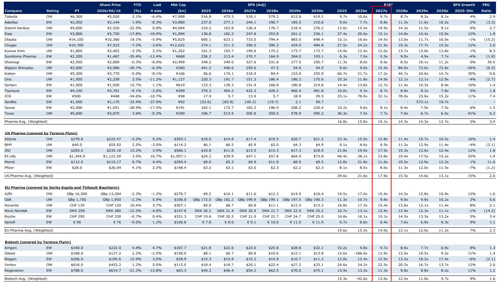
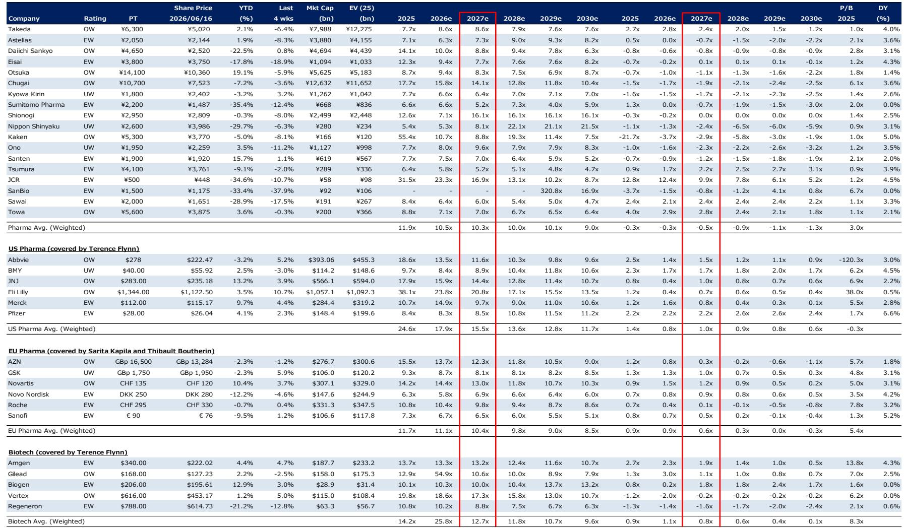
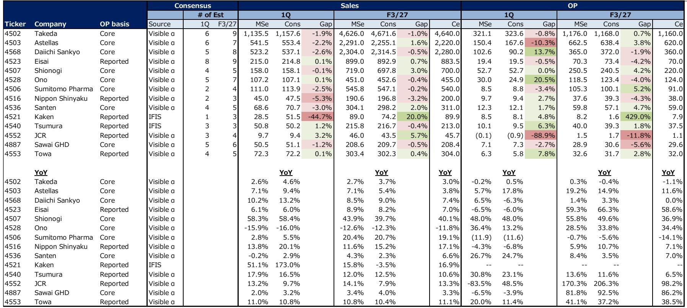

# Japan's Pharmaceutical Sector Is Not a Homogeneous Market: The Divergence Between Pipeline Value and Current Pricing Creates a Strategic Entry Window

The most striking feature of the current Japanese pharmaceutical landscape is not the aggregate valuation, but the extreme dispersion within it. A global investment bank report published in mid-2026 places an Overweight rating on Daiichi Sankyo with a price target implying 85% upside from its current level of ¥2,520, while simultaneously assigning an Underweight rating to Kyowa Kirin with 25% downside. This is not a sector moving in unison. It is a market where conviction is concentrated in a handful of names, and where the consensus view appears to be underestimating the asymmetry of outcomes.

The timing of this divergence is not accidental. The Japanese pharmaceutical industry is undergoing a structural transformation that separates companies with genuine global pipeline assets from those whose valuations are sustained by domestic inertia or legacy product cycles. The report identifies Daiichi Sankyo, Takeda, Otsuka Holdings, and Chugai as its top large-cap Overweight names, while also flagging Kaken and Towa as compelling mid-cap opportunities. Yet the market has already punished several of these names year-to-date. Daiichi Sankyo is down 25% in 2026. Chugai is down 8%. Kaken is down 5%. The question is whether this selloff reflects deteriorating fundamentals or a mispricing that will correct as pipeline milestones materialize.

The argument of this article is that the Japanese pharma sector is not cheap in aggregate, but it contains specific pockets of deep value that are mispriced relative to their proprietary science, global revenue exposure, and upcoming catalyst calendars. The key to navigating this market is to distinguish between companies whose earnings are driven by FX tailwinds and cost-cutting, and those whose earnings are driven by novel drug approvals and market share gains in oncology, neurology, and rare diseases. The report makes a clear case that the former category is largely priced in, while the latter is not.

---

## The Market Is Punishing Near-Term Earnings Disappointments While Ignoring Long-Term Pipeline Optionality

The valuation table in the report reveals a telling pattern. Daiichi Sankyo trades at 15.4x forward earnings for fiscal year 2026, which drops to 9.1x by fiscal year 2030 as its EPS is projected to grow from ¥163.8 to ¥276.2. This is a PEG ratio of 2.7, which is not optically cheap, but it masks a critical nuance: the EPS trajectory is back-end-loaded. The company's earnings actually decline through fiscal 2027 before inflecting sharply higher. The market, which tends to discount near-term visibility over long-term optionality, has sold the stock into this trough. The same pattern applies to Chugai, where EPS grows from ¥274.1 in fiscal 2025 to ¥484.8 by fiscal 2030, yet the stock is down 8% year-to-date.

This is the central tension in the report's recommendation framework. The investment bank is effectively arguing that the market is over-indexing on the near-term earnings trough and under-indexing on the pipeline-driven recovery. For Daiichi Sankyo, the inflection point is tied to its oncology franchise, particularly its antibody-drug conjugate platform, which has global commercial potential that extends well beyond Japan. For Chugai, the growth is driven by its partnership with Roche and its own proprietary pipeline in immunology and oncology.

The implication for investors is clear: if you accept the report's EPS estimates as reasonable, the current share prices for these Overweight names imply a margin of safety that is unusually wide for a sector that is generally considered defensive. The weighted average P/E for Japanese pharma is 15.8x for fiscal 2026, compared to 21.6x for US pharma and 15.3x for EU pharma. But within that average, the Overweight names are trading at a discount to their intrinsic value, while the Equal-Weight and Underweight names are trading at or above their fair value.

---

## The FX Sensitivity Framework Is Overrated: The Real Driver Is Global Revenue Exposure and Clinical Trial Execution

One section of the report is dedicated to FX sensitivity, which is a standard analytical lens for Japanese exporters. But a careful reading of the coverage suggests that currency effects are a secondary factor in the stock selection. The primary differentiator is whether a company's revenue base is domestically oriented or globally diversified. Takeda, for example, generates the vast majority of its revenue outside Japan and is rated Overweight with a 25% upside. Its EPS growth is modest at 4% CAGR through 2030, but its valuation is low at 9.7x fiscal 2025 earnings, and its deleveraging story post the Shire acquisition is providing a natural catalyst for multiple expansion.

Conversely, companies like Tsumura and Sawai Group, which are primarily domestic players in kampo and generics respectively, are rated Equal-Weight with limited upside. Their growth profiles are stable but unexciting, and their valuations already reflect this reality. The report's message is subtle but important: in a rising interest rate environment and with a potentially stronger yen, the market will reward companies that have pricing power in global markets over those that rely on domestic volume growth or government pricing negotiations.

The mid-cap names illustrate this point even more sharply. Kaken, rated Overweight with 41% upside, is a specialty pharmaceutical company with a focused pipeline in dermatology and orthopedics. Its EPS is projected to swing from ¥56.6 in fiscal 2025 to ¥255.9 by fiscal 2030, a 35% CAGR that is among the highest in the coverage universe. Towa, also Overweight with 45% upside, is a generic manufacturer that is undergoing a restructuring and margin improvement story. Its EPS jumps from ¥106.7 to ¥595.2 over the same period, a 41% CAGR. These are not steady-eddy compounders. They are turnaround or growth stories that require conviction and tolerance for volatility.

---

## The Report's Underweight Ratings Reveal Where the Market Is Complacent About Patent Cliffs and Competitive Erosion

Every sector report is only as useful as its sell recommendations, and this one does not shy away from them. Ono Pharmaceutical and Kyowa Kirin are both rated Underweight, and Nippon Shinyaku is also Underweight with a staggering 35% downside to its price target. The common thread across these names is that their current valuations are not supported by their earnings trajectories.

Nippon Shinyaku is the most extreme example. Its EPS is projected to collapse from ¥441.2 in fiscal 2025 to ¥47.5 by fiscal 2028, a decline of nearly 90%. The stock trades at 9.0x current earnings, which appears cheap, but the forward multiple balloons to 84.0x by fiscal 2028. This is a company facing a patent cliff on its core product, and the market has not fully priced in the magnitude of the earnings decline. The report is essentially saying that the current valuation is a value trap.

Kyowa Kirin, despite a 5% year-to-date decline, still trades at 12.4x fiscal 2026 earnings with a -1% EPS CAGR through 2030. The PEG ratio is 8.3, which is extraordinarily high for a company with no growth. The market appears to be giving Kyowa Kirin credit for pipeline optionality that the report believes is overstated. Ono Pharmaceutical, similarly, has a 4% negative EPS CAGR and trades at 11.8x forward earnings. These are not distressed companies, but they are fully valued relative to their prospects, and the report sees limited upside catalysts.

The analytical lesson here is that in a sector where many stocks appear cheap on a trailing basis, the real differentiation comes from understanding the sustainability of earnings. The Underweight names are not bad businesses, but they are bad investments at current prices because their growth profiles do not justify their multiples.

---

## What the Report Does Not Fully Answer: The Sustainability of the Japanese Biotech Ecosystem and the Role of M&A

For all its analytical rigor, the report leaves several meaningful questions unanswered. First, the coverage universe is heavily weighted toward large-cap and mid-cap pharmaceutical companies, but it includes only two small-cap biotech names: SanBio and JCR Pharmaceuticals. Both are rated Equal-Weight, and both have negative or minimal earnings. SanBio is projected to turn profitable only in fiscal 2029, and JCR has erratic earnings swings. The report does not provide a clear framework for valuing these names, and the price targets imply modest upside at best.

This raises a broader question about the Japanese biotech ecosystem. Unlike the US, where a vibrant VC-funded biotech sector feeds into public markets through IPOs and licensing deals, Japan's biotech landscape is dominated by established pharmaceutical companies. The report's coverage reflects this reality, but it does not address whether the Japanese market can support a standalone biotech sector, or whether the future of Japanese innovation will be driven by partnerships with global players rather than independent discovery.

Second, the report does not explicitly address the role of M&A. Takeda's deleveraging story is well-known, but there is no discussion of whether other Japanese pharma companies might become acquirers or targets. Daiichi Sankyo's ADCs are a natural acquisition target for a global player seeking oncology assets, and Chugai's relationship with Roche creates a unique governance structure that could evolve. The report's price targets appear to be based on discounted cash flow or sum-of-the-parts analysis, but they do not incorporate a control premium. For investors who believe that M&A will accelerate in Japanese pharma, the upside could be significantly higher than the report's targets.

---

## A Decision Framework for Investors: Three Questions to Distinguish Between Value and Value Traps

To translate the report's analysis into actionable decisions, investors should apply a three-part framework to each stock in the Japanese pharma universe.

First, ask whether the company's revenue growth is driven by volume, price, or new products. Volume-driven growth in Japan is constrained by an aging but shrinking population and government cost-containment measures. Price-driven growth is limited by the biennial NHI drug price revisions. The only sustainable growth driver is new product launches, either through internal R&D or in-licensing. Companies like Daiichi Sankyo and Chugai score high on this metric. Companies like Tsumura and Sawai score low.

Second, ask whether the company's earnings trajectory is back-end-loaded and whether the market is discounting that inflection. The report's Overweight names all have EPS that trough in the near term before inflecting higher. This creates a natural entry point for investors with a 12- to 24-month horizon. The Underweight names, by contrast, have earnings that are peaking now or declining steadily. The market may be slow to recognize the deterioration, but the report is betting that it will eventually catch up.

Third, ask whether the company's valuation is supported by its global revenue base or its domestic franchise. In a world where the yen is volatile and global interest rates are uncertain, companies with diversified geographic revenue are more resilient. Takeda and Otsuka score well here. Ono and Kyowa Kirin are more exposed to Japan-specific dynamics.

This framework does not guarantee correct stock selection, but it forces a disciplined approach to a sector where the difference between a 40% gain and a 30% loss is often a matter of whether the market is looking at the same data through a near-term or long-term lens.

---

## The Report's Most Important Insight Is About Time Horizon, Not Stock Picks

The report's top picks are not revolutionary. Daiichi Sankyo has been a consensus favorite for years. Takeda's restructuring story is well-covered. What is valuable is the report's insistence that the current selloff in several of these names is a function of time horizon mismatch, not fundamental deterioration. The market is focused on fiscal 2026 and 2027 earnings, which are depressed by R&D investment, generic competition, or one-time costs. The report is focused on fiscal 2029 and 2030, when those investments begin to pay off.

This is not a call for blind patience. It is a call for conviction based on specific pipeline milestones and revenue inflection points. For investors who can look through the near-term noise, the Japanese pharmaceutical sector offers a set of opportunities that are rare in a global market where most developed-market equities are fully priced. The key is to be selective, to understand the earnings drivers, and to have the discipline to avoid the value traps that the report has so clearly identified.

Join the community to read the full report and review the original charts.

*This article is for learning and discussion only and does not constitute investment advice.*

Personal reading notes and learning share only. Not investment advice.

