GLOBAL RATES TRADER

Dealing With Inflation

Inflation risks have subsided somewhat given the energy relief following the US-Iran deal, but in their place the market has repriced US front-end rates following the hawkish FOMC messaging. As markets adapt to a shift in Fed communication, we expect greater policy uncertainty to support vol and see scope for greater reactivity to individual datapoints and Fed communication. Our forecasts and longer-term valuations argue for a steepening bias in the US, but with hawkish risks boosting front-end yields and compressing long-end risk premium, we think positioning for belly outperformance on the curve offers the best near-term risk/reward for longs. Energy relief narrows the outcomes for European rates, favouring lower vol and EGB carry, but we think the prospects for much lower yields are limited. In contrast, we expect more macro relief for front-end UK rates as the BoE remains on hold and energy inflation subsides. We favour 2s10s GBP steepeners as fiscal risk premium remains elevated following the Makerfield by-election. With the BoJ having delivered a hike without more hawkish guidance on the path or end-point of the tightening cycle, fiscal policy is likely a near-term focal point. We expect the long-end to be more reactive to any developments, but continue to think that risk/reward is more favourable to shorts further in on the curve.

## United States and Canada

Risk premia rotation. Wednesday's FOMC injected new life into the possibility of a series of rate hikes for a market that had been consolidating around a less severe inflation outcome. Our economists see an increased risk of hikes later this year but have maintained their baseline that the FOMC will leave the policy rate unchanged through the course of the year. What had been previously diffuse hike pricing has shifted in, with the market pricing nearly two hikes to the Mar/Apr-27 meeting peak in the OIS curve. While that risk is now more front-loaded, the rates curve has not priced a significantly higher peak than the one seen on the heels of the May labor market report (Exhibit 1). As we have observed in other markets, to the extent that the policy reaction function is seen as sufficiently front-footed, greater right tail risk around the very front-end can keep a lid on risk premia further out the curve. This dynamic is visible in the flattening that alongside taking hike pricing to levels consistent with a plausible “insurance” amount has pushed longer-term forwards to levels that are now rich to fair. That hawkish front-end/rich long-end backdrop tilts towards a steepening bias, and

## George Cole

+44(20)7552-1214

george.cole@gs.com

GS International

## William Marshall

+1(212)357-0413

william.c.marshall@gs.com

GS & Co. LLC

## Simon Freycenet

+44(20)7774-5017

simon.freycenet@gs.com

GS Bank Europe SE - Paris

Branch

## Isabella Rosenberg

+1(212)357-7628

isabella.rosenberg@gs.com

GS & Co. LLC

## Friedrich Schaper

+1(917)343-3214

friedrich.schaper@gs.com

GS & Co. LLC

## Loic Mathys

+44(20)7051-1664

loic.mathys@gs.com

GS International

we think that a relaxation in hike risks ought to correspond to a steeper curve with long-end forwards stickier. But we think for now there is clearer scope for the reevaluated reaction function to support the belly of the curve. An undoing of the broader hawkish repricing (on more benign data, for example) can undo the recent underperformance of 5s versus 2s and 10s, whereas our prior analysis suggests 5s ought to outperform on the curve from front-loading of hike risk against stickier or declining forwards further out the curve (Exhibit 2, which we would expect on hotter labor market or inflation data).

Exhibit 1: Hike risk is more front-loaded, but the curve is not pricing a significantly higher peak  
3m SOFR futures curve  
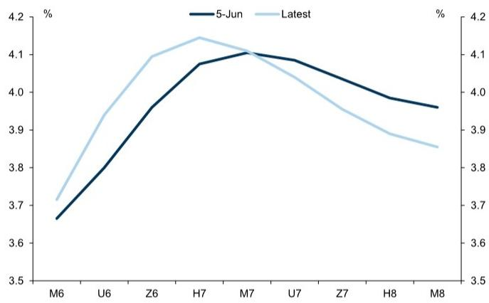

line chart

| Period | 5-Jun (%) | Latest (%) |
|---|---|---|
| M6 | 3.67 | 3.72 |
| U6 | 3.80 | 3.94 |
| Z6 | 3.97 | 4.10 |
| H7 | 4.08 | 4.14 |
| M7 | 4.10 | 4.11 |
| U7 | 4.09 | 4.05 |
| Z7 | 4.03 | 3.96 |
| H8 | 3.99 | 3.89 |
| M8 | 3.96 | 3.85 |

Source: Bloomberg, GS Global Investment Research

Exhibit 2: 5s should outperform on the curve from front-loading of hike risk against stickier or declining forwards further out the curve  
Shift in curve segments implied by changes in pace of hikes over next 6m, extent of hikes over next 2y, and changes in longer-run (5y5y) rate levels  
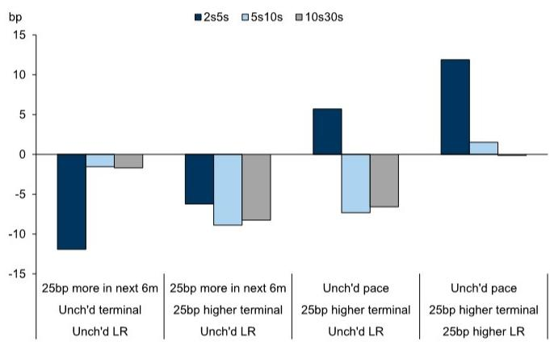

bar chart

| Category | 2s5s (bp) | 5s10s (bp) | 10s30s (bp) |
|---|---|---|---|
| Unch'd terminal Unch'd LR | -12.0 | -1.0 | -1.0 |
| Unch'd terminal 25bp higher terminal Unch'd LR | -6.0 | -8.0 | -8.0 |
| Unch'd pace 25bp higher terminal Unch'd LR | 5.5 | -7.0 | -6.0 |
| Unch'd pace 25bp higher terminal 25bp higher LR | 12.0 | 1.5 | -0.5 |

Source: GS FICC and Equities, GS Global Investment Research

Double trouble for traded inflation. The steep and steady decline in oil has reset front-end inflation pricing in alignment with our economists' latest headline CPI projections (Exhibit 3). While the energy picture has weighed on the forward curve as well, the reassessment of the Fed's reaction function corresponded to a sharp rise in real yields alongside a compression in inflation forwards. We highlighted a preference for beta-weighted real rate longs on the premise that a deeper rally would likely require a heavier lift from real rates and that it offered some insulation against the still-present geopolitical uncertainty. While we still think some elements of the former argument hold, as long as the recent hawkish shift proves somewhat durable, higher spot inflation is likely to be accompanied more reliably by higher real rate expectations rather than inflation risk further out the curve, narrowing the path to lower real rates (for example, benign scenarios where the Fed underdelivers versus what is priced without too much added disinflation). While our valuation framework puts longer term inflation forwards on the cheap side of fair, and our economists expect a more dovish reaction function than is priced, we close our long real rates on a beta recommendation at a small loss given the less favorable post-FOMC backdrop.

■ Shifting vol risks from macro to policy. The decline in energy prices and reduction in geopolitical uncertainty have weighed on implied volatility across the surface, but building clarity around the US-Iran conflict has given way to more uncertainty around the Fed's reaction function. We think this shift from macro to policy uncertainty should for now widen the distribution around the path for near-term rates, but greater vigilance against inflation can keep the long-end somewhat more stable. Consistent with this, our vol model suggests that the combination of a reduction in inflation survey dispersion and an increase in policy rate survey dispersion should typically be consistent with flatter tail curves (Exhibit 4). In the near-term, we expect greater sensitivity to communication from FOMC voters, as Chair Warsh offered little detail about the criteria for a rate hike or whether the news on the peace deal had been incorporated in FOMC members' dots, and continue to expect local volatility around FOMC meetings and minutes releases as markets adjust to a new communication regime.

Exhibit 3: Front-end inflation pricing aligns with our economists' forecasts  
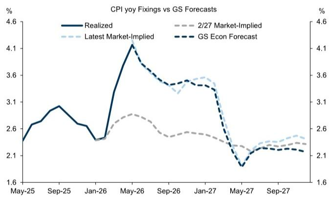

line chart

CPI yoy Fixings vs GS Forecasts
| Date | Realized (%) | 2/27 Market-Implied (%) | Latest Market-Implied (%) | GS Econ Forecast (%) |
|---|---|---|---|---|
| May-25 | 2.5 | 2.6 | 2.6 | 2.6 |
| Sep-25 | 3.1 | 2.8 | 3.1 | 3.1 |
| Jan-26 | 2.6 | 2.5 | 2.5 | 2.5 |
| May-26 | 4.1 | 2.9 | 3.1 | 4.1 |
| Sep-26 | 3.5 | 2.6 | 3.3 | 3.5 |
| Jan-27 | 3.6 | 2.5 | 3.6 | 3.5 |
| May-27 | 2.1 | 2.3 | 2.3 | 2.1 |
| Sep-27 | 2.1 | 2.4 | 2.5 | 2.3 |

Source: GS FICC and Equities, GS Global Investment Research

## Exhibit 4: Greater policy uncertainty flattens the volatility tail curve

1y3m US rate uncertainty (orthogonalized against inflation, growth) vs implied vol tail curve

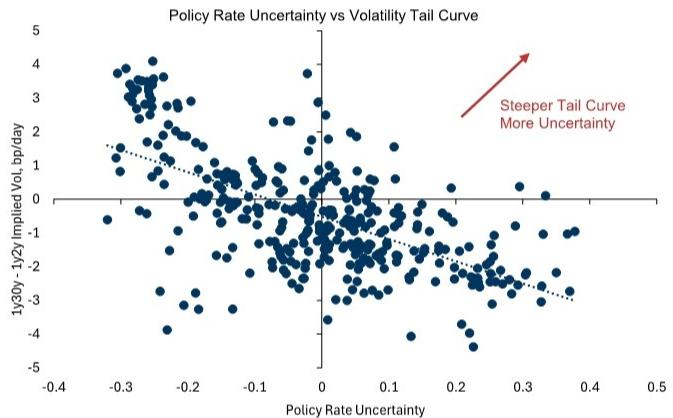

scatter plot

| Policy Rate Uncertainty | 1y30y - 1y2y Implied Vol. bp/day |
| ----------------------- | --------------------------------- |
| -0.4                    | -5                                |
| -0.3                    | 4                                 |
| -0.2                    | 3                                 |
| -0.1                    | 2                                 |
| 0                       | 1                                 |
| 0.1                     | 0                                 |
| 0.2                     | -1                                |
| 0.3                     | -2                                |
| 0.4                     | -3                                |
| 0.5                     | -4                                |

Source: GS Global Investment Research, GS FICC and Equities, Consensus Economics

\- Maintaining ample reserves, at least for now. The June FOMC statement added language on the balance sheet reaffirming the Fed’s “policy of maintaining ample reserves in the banking system.” We read this primarily as a statement of current policy, though it implicitly endorses the ample reserves framework, at least for now. Chair Warsh announced a task force to review the Fed’s balance sheet policy, and while other Fed officials have voiced support for the ample reserves framework in recent months, they have also acknowledged evidence that a reduction in reserve demand would warrant an adjustment in the supply of reserves. To that end, the implementation note was tweaked in a hawkish direction, adding “when appropriate” ahead of the directive to the New York Fed to increase the size of the SOMA portfolio to maintain ample reserves. While this still affords the NY Fed discretion on RMPs, it also points more clearly to periods when no growth in the SOMA portfolio might be deemed appropriate. Last week, the NY Fed decided to hold RMPs at \$10bn/month heading into June’s tax season. Although funding conditions tightened as mid-June corporate tax payments coincided with coupon settlements to start the week, the uptick in repo rates was shortlived against a still broadly stable backdrop. We continue to expect a \$5bn per month average in reserve management purchases over the coming quarters, which we think would be consistent with repo rates settling closer to IORB on average.

## Europe

\- Narrower range of outcomes, but relief well-priced in EUR rates. European duration rallied through the week as energy market relief extended. Front-end yields and inflation are slightly lagging the move in oil prices, but this is in part due to spillovers from the hawkish repricing of the US front-end. Given the price pressures already in train, our economists continue to expect the ECB to tighten policy once more in September, although the risk of no further hikes has risen. Markets price about 35bp of hikes over the next 12m, which suggests the market is still pricing somewhat hawkish risks relative to our modal view. This gap may decline should energy flows further reduce upside risks to commodity prices, but with the energy futures curve already below our revised oil and gas forecasts we think there is limited room for relief to extend. ECB surveys suggest $2.5\%$ is not seen as deeply restrictive, and the risk-neutral probability distribution priced into markets is only modestly hawkish to these surveyed expectations (Exhibit 5). This suggests that volatility is more likely to decline than yields (more below). Given the flattening that has already occurred in the EUR curve, and the outperformance of 10y, we close our long EUR 5y5y real rates recommendation for a potential gain of 11bp.

Exhibit 5: Markets are hawkish vs policy rate surveys ECB surveys of the policy rate vs market probabilities based on swaption pricing  
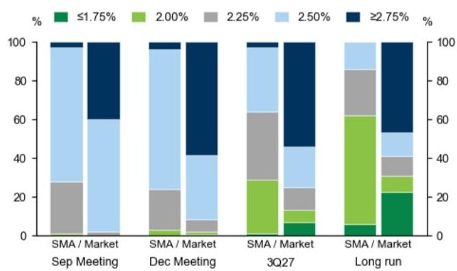

stacked bar chart

| Category | ≤1.75% (%) | 2.00% (%) | 2.25% (%) | 2.50% (%) | ≥2.75% (%) |
| :--- | :--- | :--- | :--- | :--- | :--- |
| SMA / Market Sep Meeting | 0 | 0 | 28 | 64 | 21 |
| SMA / Market Dec Meeting | 0 | 3 | 23 | 59 | 49 |
| SMA / Market 3Q27 | 8 | 29 | 34 | 24 | 56 |
| SMA / Market Long run | 6 | 61 | 24 | 14 | 51 |

Source: GS Global Investment Research, GS FICC and Equities, SMA

Exhibit 6: EU bid-ask spread has underperformed growth in the EU debt stock  
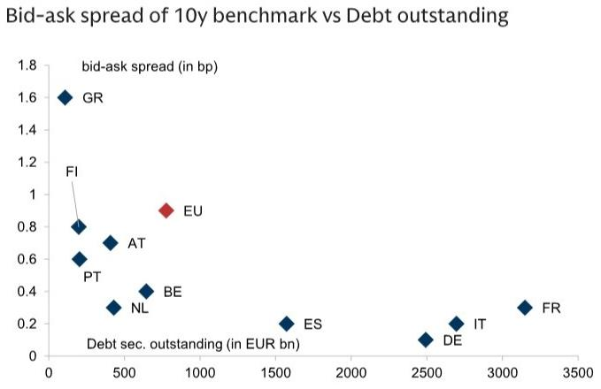

scatterplot

Bid-ask spread of 10y benchmark vs Debt outstanding
| Region | Bid-ask spread (in bp) | Debt sec. outstanding (in EUR bn) |
| :--- | :--- | :--- |
| GR | 1.6 | 150 |
| FI | 0.8 | 200 |
| PT | 0.6 | 300 |
| AT | 0.7 | 400 |
| EU | 0.9 | 800 |
| BE | 0.4 | 600 |
| NL | 0.3 | 450 |
| ES | 0.2 | 1600 |
| DE | 0.1 | 2500 |
| IT | 0.2 | 2700 |
| FR | 0.3 | 3150 |

Source: GS Global Investment Research, Bloomberg

\- Reduced risks improve outlook for sovereign spreads. The narrower range of outcomes for core rates and the ECB should continue to dampen rates volatility in Europe. This should provide ongoing support for EGB carry – we continue to recommend longs in 3y BTPs, OATs and Bonos vs OIS. Further out the curve, in our last update, we reiterated our expectation for modest sovereign spread widening for 10y spreads across countries into year-end. This view was premised on a sluggish Euro area growth outlook as well as the likely increase in political risk as 2027 drew nearer. We believe the US-Iran deal improves the outlook for sovereign spreads for three reasons. First, it allows rates volatility – which we see as a strong guide to sovereign credit risk – to come down further. Second, it limits the downside risks to growth. And third, it reduces the risks of increased fiscal support, widening deficits, and higher bond supply. To reflect this improvement in the outlook, we revise our end-2026 10y OAT-Bund, BTP-Bund, and Bonos-Bund forecasts to 70bp, 75bp and 45bp (from 75bp, 85bp, and 55bp respectively). This revision is larger in BTPs and Bonos than OATs, given Italy is more exposed sustained energy price pressure and historically sensitive to rates volatility. From current levels, we maintain a widening bias as we continue to think politics will be increasingly relevant throughout 2026 H2.

EU bonds set to outperform semi-core. The EU will announce its issuance target for the H2 2026 in coming weeks. We think the recent guidance of €180bn gross bond issuance for 2026 as a whole (or €70bn for H2) is still on target, although a modestly higher target is possible depending on mobilisation of funds under the NGEU. We showed in a recent report that EU bonds have broadly tracked aggregate Euro area fundamentals since 2022. This suggests to us that EU pricing is close to fair, but we see risks tilted towards outperformance vs semi-core. On the one hand, the ongoing underperformance vs its AAA-rating makes further cheapening unlikely. On the other, we think market deepening and various measures to improve liquidity taken in recent years could be better reflected in pricing. For instance, we have shown that EU bid-ask spreads have not compressed as much as the increase in the EU debt stock would imply (Exhibit 6). Given EU-Bund spreads' sensitivity to liquidity (as captured by bid-ask spreads), a catch-up with peers on this metric could be worth as much as 5bp on our analysis. We also note that while the stock of EU debt will continue to grow next year, it will likely do so at a slower pace. Although we do not see compelling evidence that bond supply has weighed on the EU specifically, more modest funding needs compared to recent years is a net positive.

Incoming news supports steeper GBP curve. We think the combination of weaker macro data and ongoing fiscal risks should combine to steepen the UK curve. Another inflation miss in May suggests that underlying inflation pressures are weak. And while the unemployment rate declined in April, our economists also think that the underlying trend is towards labour market loosening, consistent with the moderation in wage growth. Combined with the likely reopening of the Strait of Hormuz, we think this backdrop is consistent with an on-hold BoE. Given markets price about 45bp of hikes for the UK, we see UK front-end rates as among the most compelling in the G10 to position for a further relaxation of energy-related inflation risks. At the same time, the large margin of victory for Andy Burnham in the Makerfield by-election will keep fiscal policy in focus, and should limit the degree to which Gilt term premium can compress. With Gilts trading well on asset swaps, we think ebbs and flows in term premium point to concerns about the re-injection of macro-economic uncertainty into the Gilt curve rather than a sign of indigestion of bond supply. As a result, we continue to recommend 2s10s GBP steepeners, combining front-end relief with some protection against renewed political risk.

Patient holds in the Scandis and Switzerland. While Riksbank, Norges Bank and the SNB all left policy rates unchanged this week, different reaction functions and fundamentals point to further front-end divergence, in our view. The Riksbank has communicated more openness to tighten policy, but our economists think they will need to see more evidence of broadening price pressures to act, and still expect the first hike in December. In Norway, with more explicit guidance from Norges Bank and stronger fundamentals, our economists continue to forecast a September hike. In Switzerland, we think the case for policy tightening remains weak and so expect the SNB to comfortably stay put. Given this different backdrop for policy, we expect NOK-SEK rate differentials to remain wide at the very front-end of curve, but to tighten, say at 1y1y, as the NOK curve flattens on further hikes and the SEK curve steepens on delayed hikes. Elevated NOK rates from a historical perspective and the prospect of gradual reflation in Sweden should reinforce the convergence already visible in pricing further out the curve as well.

## Japan

Fiscal in focus. JGBs sold off following the BoJ's 25bp hike this week, reinforcing our view that near-term risks skew towards more cheapening in the belly of the curve on building risk premium in the absence of more hawkish guidance on the future path of policy or the neutral rate. Terminal rate pricing was largely unchanged after the meeting, but yields rose further out the curve, reflecting the market's continued assessment that a $1.5\%$ terminal may prove insufficient to contain broader risks. The balance sheet decision was mostly in line with expectations to stop tapering purchases beyond April 2027 but featured one hawkish dissent to continue the taper beyond then. Our economists still forecast the next hike in January to a terminal rate of $1.5\%$ but note that the timing will likely be influenced by the BoJ's progress in communication with the government and may depend on when conditions for a hike are in place from the government's perspective. Near-term, fiscal policy will be the key factor for JGB yields. Fiscal headlines picked up this week with an LDP proposal to lower the food consumption tax to $1\%$ from $8\%$ , and the next hurdle is the release of the Basic Policy in July. While volatility is likely to be higher in the belly and long-end around these announcements, we continue to think that risk/reward is more favorable to shorts in the 2-to-5y part of the curve, where additional fiscal support would likely reinforce a more sustained hiking path.

## Australia and New Zealand

Room for further AUD and NZD 1y/1y1y flattening. RBA kept rates on hold, keeping a tightening bias in the statement and press conference. While the characterization of risks was more balanced than previously, our economists still expect another hike in August under their baseline for likely uncomfortably high inflation for 2Q26. We view the bar as high for the incoming data on activity to sway either the committee, whose set of forecasts was conditioned on one further hike, or front-end pricing. Spillovers from the hawkish Fed pivot may incrementally push in that same direction, and with markets currently pricing 6bp we see good risk reward for paying August RBA meeting OIS. Further ahead, we think that markets will gain confidence in the policy transmission and thus expect any further front-end tightening to go hand-in-hand with lower forwards and continue to like front-end flatteners. Similarly, for RBNZ we think very front-end pricing can prove relatively immune to the relaxation in energy prices, given the strongly worded guidance and broad-based hawkish pivot at the May meeting; our economists continue to expect the MPC to deliver a mini tightening cycle in July and September. That said, we still view forwards beyond that as still too high, especially if excessive tightening exerts further pressure on the output gap.

## Latest Thematic Research:

Global Markets Analyst: Updating Our G10 Term Premium Estimates — Still High — 19 June 2026

Euro Area Sovereign Credit Monitor: EU Bonds — Still Deepening — 12 June 2026

Global Markets Analyst: Revisiting the Outlook for the Fed's Balance Sheet — 21 May 2026

Global Rates Notes: US Treasury Valuations and Requirements for a Yield Reversal — 20 May 2026

Global Markets Analyst: UK T-bills: Not A Magic Bullet For Gilts — 11 May 2026

## Latest Global Markets Dailies:

Fed Communication And Rates Volatility — 10 June 2026

The Hedge Value Of Rate Receivers — 28 May 2026

The Energy Shock Impact on Foreign Official Treasury Demand — 27 May 2026

Why Always Gilts? — 14 May 2026

A More Durable Risk Premium in JGBs — 8 May 2026

## Forecasts

G10 10y yield forecast

<table><tr><td colspan="14">G10 10-Year Yield Forecasts</td></tr><tr><td></td><td>USD</td><td>DEM</td><td>FRA</td><td>ITA</td><td>ESP</td><td>GBP</td><td>JPY</td><td>CAD</td><td>CHF</td><td>SEK</td><td>NOK</td><td>AUD</td><td>NZD</td></tr><tr><td>Spot</td><td>4.45</td><td>2.97</td><td>3.72</td><td>3.67</td><td>3.44</td><td>4.83</td><td>2.66</td><td>3.37</td><td>0.35</td><td>2.78</td><td>4.33</td><td>4.81</td><td>4.43</td></tr><tr><td>2Q26</td><td>4.50</td><td>2.90</td><td>3.55</td><td>3.60</td><td>3.30</td><td>4.75</td><td>2.50</td><td>3.45</td><td>0.30</td><td>3.15</td><td>4.10</td><td>4.85</td><td>4.50</td></tr><tr><td>3Q26</td><td>4.45</td><td>2.95</td><td>3.60</td><td>3.65</td><td>3.35</td><td>4.60</td><td>2.50</td><td>3.50</td><td>0.40</td><td>3.20</td><td>4.00</td><td>4.75</td><td>4.50</td></tr><tr><td>4Q26</td><td>4.40</td><td>3.00</td><td>3.70</td><td>3.75</td><td>3.45</td><td>4.50</td><td>2.50</td><td>3.50</td><td>0.50</td><td>3.25</td><td>4.00</td><td>4.70</td><td>4.50</td></tr><tr><td>1Q27</td><td>4.35</td><td>3.00</td><td>3.75</td><td>3.80</td><td>3.50</td><td>4.50</td><td>2.45</td><td>3.50</td><td>0.50</td><td>3.25</td><td>4.00</td><td>4.60</td><td>4.50</td></tr><tr><td>2Q27</td><td>4.30</td><td>3.00</td><td>3.75</td><td>3.85</td><td>3.55</td><td>4.40</td><td>2.40</td><td>3.50</td><td>0.50</td><td>3.25</td><td>4.00</td><td>4.50</td><td>4.50</td></tr><tr><td>3Q27</td><td>4.25</td><td>3.00</td><td>3.75</td><td>3.90</td><td>3.60</td><td>4.40</td><td>2.30</td><td>3.50</td><td>0.50</td><td>3.25</td><td>4.00</td><td>4.50</td><td>4.50</td></tr><tr><td>4Q27</td><td>4.25</td><td>3.00</td><td>3.75</td><td>3.90</td><td>3.60</td><td>4.35</td><td>2.25</td><td>3.50</td><td>0.50</td><td>3.25</td><td>4.00</td><td>4.50</td><td>4.50</td></tr></table>

<table><tr><td colspan="14">Deviation from Forwards</td></tr><tr><td></td><td>USD</td><td>DEM</td><td>FRA</td><td>ITA</td><td>ESP</td><td>GBP</td><td>JPY</td><td>CAD</td><td>CHF</td><td>SEK</td><td>NOK</td><td>AUD</td><td>NZD</td></tr><tr><td>2Q26</td><td>0.04</td><td>-0.08</td><td>-0.18</td><td>-0.09</td><td>-0.14</td><td>-0.09</td><td>-0.17</td><td>0.07</td><td>-0.04</td><td>0.38</td><td>-0.23</td><td>0.04</td><td>0.06</td></tr><tr><td>3Q26</td><td>-0.06</td><td>-0.10</td><td>-0.15</td><td>-0.14</td><td>-0.11</td><td>-0.35</td><td>-0.25</td><td>0.04</td><td>0.02</td><td>0.41</td><td>-0.31</td><td>-0.10</td><td>-0.01</td></tr><tr><td>4Q26</td><td>-0.15</td><td>-0.08</td><td>-0.10</td><td>-0.11</td><td>-0.07</td><td>-0.50</td><td>-0.32</td><td>0.00</td><td>0.10</td><td>0.43</td><td>-0.30</td><td>-0.17</td><td>-0.08</td></tr><tr><td>1Q27</td><td>-0.24</td><td>-0.12</td><td>-0.10</td><td>-0.11</td><td>-0.06</td><td>-0.54</td><td>-0.45</td><td>-0.03</td><td>0.08</td><td>0.40</td><td>-0.28</td><td>-0.29</td><td>-0.14</td></tr></table>

Source: GS Global Investment Research

G4 Curve Forecast  
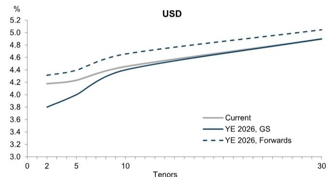

line chart

USD
| Tenors | Current (%) | YE 2026, GS (%) | YE 2026, Forwards (%) |
|---|---|---|---|
| 2 | 4.2 | 3.8 | 4.35 |
| 5 | 4.3 | 4.0 | 4.45 |
| 10 | 4.45 | 4.4 | 4.7 |
| 30 | 4.9 | 4.9 | 5.05 |

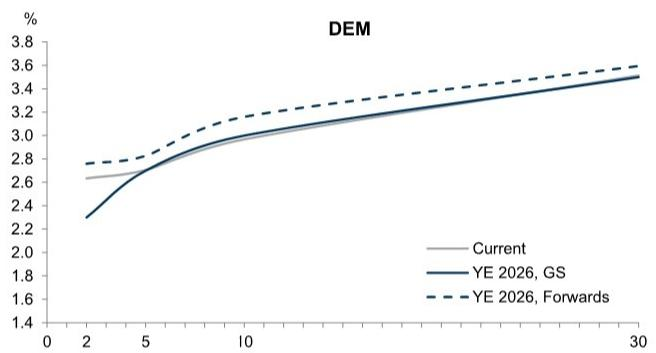

line chart

| x  | Current | YE 2026, GS | YE 2026, Forwards |
|----|---------|-------------|-------------------|
| 2  | 2.6     | 2.3         | 2.8               |
| 5  | 2.7     | 2.7         | 3.0               |
| 10 | 3.0     | 3.0         | 3.2               |
| 30 | 3.5     | 3.5         | 3.6               |

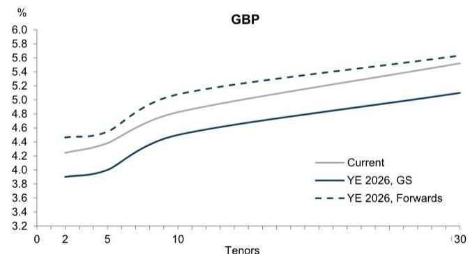

line chart

| Tenors | Current | YE 2026, GS | YE 2026, Forwards |
| ------ | ------- | ----------- | ----------------- |
| 0      | 4.2     | 3.9         | 4.5               |
| 2      | 4.3     | 3.9         | 4.5               |
| 5      | 4.4     | 4.0         | 4.6               |
| 10     | 4.8     | 4.5         | 5.1               |
| 30     | 5.5     | 5.1         | 5.6               |

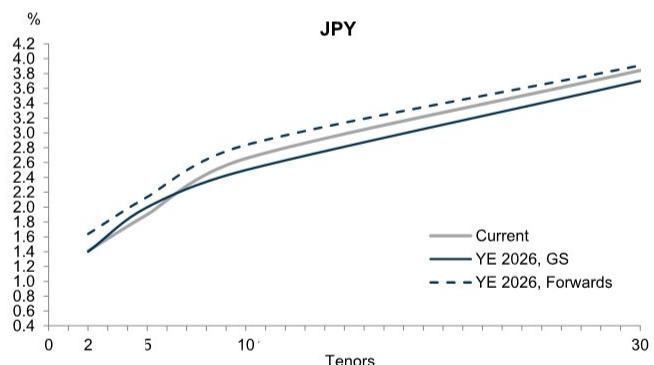

line chart

JPY
| Tenors | Current (%) | YE 2026, GS (%) | YE 2026, Forwards (%) |
|---|---|---|---|
| 2 | 1.4 | 1.3 | 1.6 |
| 5 | 2.0 | 2.1 | 2.3 |
| 10 | 2.6 | 2.5 | 2.8 |
| 30 | 3.8 | 3.7 | 3.9 |

Source: Bloomberg, GS Global Investment Research

Cumulative amount of hikes/cuts priced from today  
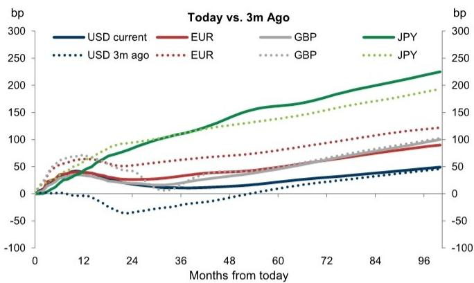

line chart

Today vs. 3m Ago
| Months from today | USD current (bp) | EUR (bp) | GBP (bp) | JPY (bp) | USD 3m ago (bp) | EUR (bp) | GBP (bp) | JPY (bp) |
|---|---|---|---|---|---|---|---|---|
| 0 | 0 | 0 | 0 | 0 | 0 | 0 | 0 | 0 |
| 12 | ~20 | ~40 | ~50 | ~60 | ~-20 | ~50 | ~70 | ~80 |
| 24 | ~10 | ~30 | ~40 | ~90 | ~-40 | ~50 | ~60 | ~100 |
| 36 | ~15 | ~35 | ~35 | ~110 | ~-30 | ~60 | ~55 | ~120 |
| 48 | ~20 | ~40 | ~45 | ~130 | ~-20 | ~70 | ~65 | ~140 |
| 60 | ~25 | ~45 | ~55 | ~150 | ~-10 | ~80 | ~75 | ~160 |
| 72 | ~30 | ~50 | ~65 | ~170 | ~0 | ~90 | ~85 | ~180 |
| 84 | ~35 | ~55 | ~75 | ~190 | ~+10 | ~100 | ~95 | ~200 |
| 96 | ~40 | ~60 | ~85 | ~220 | ~+20 | ~110 | ~105 | ~220 |

Source: GS Global Investment Research

Expected hikes by year, GS vs. Market  
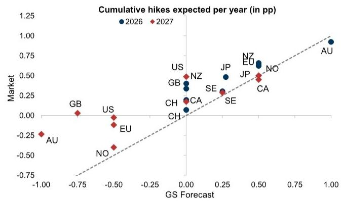

scatterplot

Cumulative hikes expected per year (in pp)
| Country/Region | 2026 (GS Forecast) | 2027 (GS Forecast) | Market (pp) |
| :--- | :--- | :--- | :--- |
| AU | 1.00 | -0.95 | 0.95 |
| GB | -0.75 | 0.05 | -0.15 |
| US | -0.50 | -0.10 | -0.15 |
| EU | -0.45 | -0.15 | -0.35 |
| CH | -0.05 | 0.10 | 0.15 |
| US | 0.00 | 0.45 | 0.45 |
| NZ | 0.00 | 0.45 | 0.45 |
| GB | 0.00 | 0.35 | 0.35 |
| CA | 0.00 | 0.20 | 0.20 |
| JP | 0.25 | 0.30 | 0.50 |
| SE | 0.25 | 0.35 | 0.35 |
| NZ | 0.50 | 0.45 | 0.65 |
| JP | 0.50 | 0.45 | 0.65 |
| NO | 0.55 | 0.45 | 0.65 |
| CA | 0.55 | 0.45 | 0.45 |
The dashed diagonal line indicates a forecasted or expected trend from 2026 to 2027. The chart displays the projected market values for each country in both years.

Source: GS Global Investment Research

Central bank ownership of sovereign bonds, current vs. 1y ago  
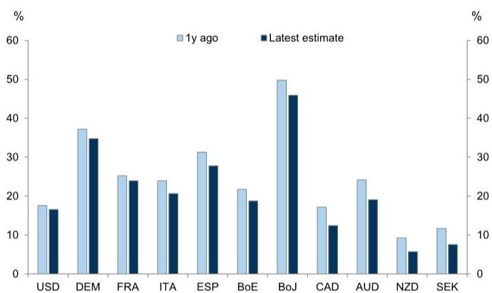

bar chart

| Currency | 1y ago (%) | Latest estimate (%) |
| :--- | :--- | :--- |
| USD | 17.5 | 16.5 |
| DEM | 37.0 | 34.5 |
| FRA | 25.0 | 23.5 |
| ITA | 23.5 | 20.5 |
| ESP | 31.0 | 27.5 |
| BoE | 21.5 | 18.5 |
| BoJ | 49.5 | 45.5 |
| CAD | 17.0 | 12.5 |
| AUD | 24.0 | 19.0 |
| NZD | 9.0 | 5.5 |
| SEK | 11.5 | 7.5 |

Source: Haver Analytics

Central bank assets as a share of GDP  
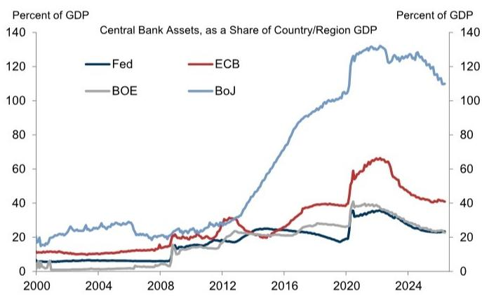

line chart

| Year | Fed  | ECB  | BOE  | BoJ  |
|------|------|------|------|------|
| 2000 | 5    | 10   | 5    | 20   |
| 2004 | 10   | 15   | 10   | 25   |
| 2008 | 15   | 20   | 15   | 30   |
| 2012 | 20   | 30   | 20   | 40   |
| 2016 | 25   | 40   | 25   | 70   |
| 2020 | 30   | 60   | 30   | 100  |
| 2024 | 25   | 40   | 25   | 110  |

Source: Haver Analytics

## Positioning and Flows Monitor

Option implied position indicator  
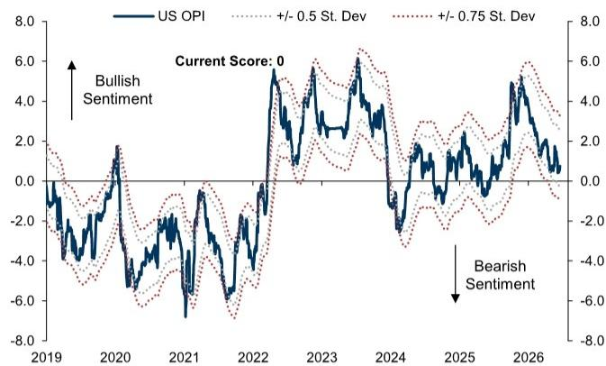

line chart

| Year | US OPI | +/- 0.5 St. Dev | +/- 0.75 St. Dev |
|------|--------|-----------------|------------------|
| 2019 | -1.0   | 1.5             | 1.0              |
| 2020 | -3.0   | 2.0             | 1.5              |
| 2021 | -5.0   | 1.0             | 0.5              |
| 2022 | -2.0   | 0.5             | 0.0              |
| 2023 | 6.0    | 4.0             | 3.0              |
| 2024 | -1.0   | 2.5             | 2.0              |
| 2025 | 3.0    | 3.5             | 3.0              |
| 2026 | 1.0    | 1.5             | 1.0              |

Source: GS Global Investment Research

GS Fund Positioning Indicator  
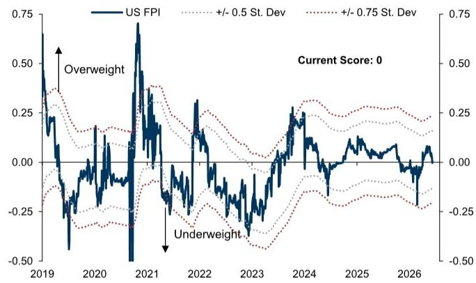

line chart

| Year | US FPI | +/- 0.5 St. Dev | +/- 0.75 St. Dev |
|------|--------|-----------------|------------------|
| 2019 | 0.75   | 0.30            | 0.25             |
| 2020 | -0.25  | -0.10           | -0.05            |
| 2021 | 0.75   | 0.30            | 0.25             |
| 2022 | -0.25  | -0.10           | -0.05            |
| 2023 | -0.50  | -0.25           | -0.10            |
| 2024 | 0.25   | 0.10            | 0.05             |
| 2025 | 0.10   | 0.05            | 0.00             |
| 2026 | -0.25  | -0.10           | -0.05            |

Source: GS Global Investment Research

US Data Response Indicator (DRI)  
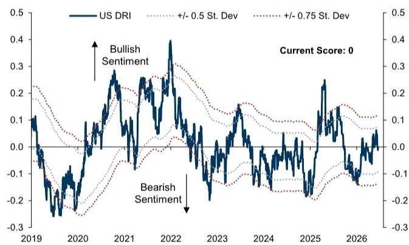

line chart

| Year | US DRI | +/- 0.5 St. Dev | +/- 0.75 St. Dev |
|------|--------|-----------------|------------------|
| 2019 | 0.1    | 0.2             | 0.2              |
| 2020 | -0.2   | -0.1            | -0.1             |
| 2021 | 0.3    | 0.1             | 0.1              |
| 2022 | 0.4    | 0.3             | 0.3              |
| 2023 | -0.1   | -0.1            | -0.1             |
| 2024 | 0.1    | 0.1             | 0.1              |
| 2025 | -0.2   | -0.1            | -0.1             |
| 2026 | 0.1    | 0.1             | 0.1              |

Source: GS Global Investment Research

## CFTC Commitment of Traders and Traders in Financial Futures

Duration-weighted net position by investor type

Duration-Weighted Positioning, by Contract

<table><tr><td>$mm/bp</td><td>SFR</td><td>TU</td><td>FV</td><td>TY</td><td>TN</td><td>US</td><td>WN</td></tr><tr><td>Spec Current</td><td>-74.1</td><td>-41.8</td><td>-53.9</td><td>-52.5</td><td>-10.2</td><td>-20.9</td><td>-55.5</td></tr><tr><td>Spec 1w Change</td><td>-7.4</td><td>4.7</td><td>2.6</td><td>-1.4</td><td>6.0</td><td>0.5</td><td>-4.9</td></tr><tr><td>LF Current</td><td>-65.6</td><td>-57.6</td><td>-90.8</td><td>-119.9</td><td>-22.3</td><td>-38.1</td><td>-162.8</td></tr><tr><td>LF 1w Change</td><td>-7.2</td><td>4.7</td><td>1.9</td><td>-0.5</td><td>2.5</td><td>0.7</td><td>-3.1</td></tr><tr><td>AM + Other Current</td><td>-6.7</td><td>69.7</td><td>119.9</td><td>147.7</td><td>52.6</td><td>62.2</td><td>200.4</td></tr><tr><td>AM + Other 1w Change</td><td>0.1</td><td>-2.7</td><td>-0.3</td><td>2.3</td><td>-1.8</td><td>-1.6</td><td>8.6</td></tr><tr><td>Dealer Current</td><td>72.3</td><td>-14.3</td><td>-29.4</td><td>-27.9</td><td>-20.7</td><td>-37.6</td><td>-37.2</td></tr><tr><td>Dealer 1w Change</td><td>5.6</td><td>-3.0</td><td>-1.1</td><td>-1.6</td><td>2.0</td><td>-0.2</td><td>-6.7</td></tr></table>

Source: CFTC, GS Global Investment Research

Net positions in Eurodollars  
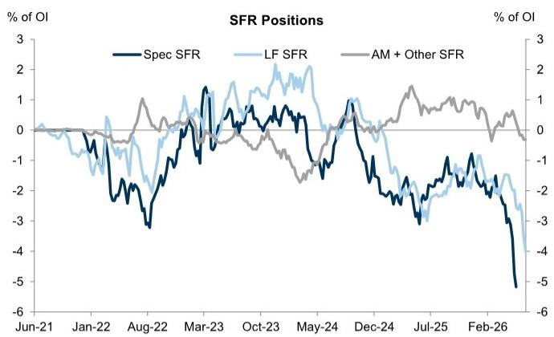

line chart

| Date    | Spec SFR | LF SFR | AM + Other SFR |
|---------|----------|--------|----------------|
| Jun-21  | 0        | 0      | 0              |
| Jan-22  | -1       | -1     | 0              |
| Aug-22  | -3       | -2     | 0              |
| Mar-23  | 1        | 1      | 0              |
| Oct-23  | 0        | 2      | 0              |
| May-24  | -1       | -1     | 0              |
| Dec-24  | -2       | -2     | 0              |
| Jul-25  | -3       | -3     | 0              |
| Feb-26  | -5       | -4     | 0              |

Note: Duration-weighted net position (long - short) as a % of duration-weighted gross exposure (long + short + spreading)  
Source: CFTC, GS Global Investment Research

Primary dealer transactions Net dealer position in US Treasuries  
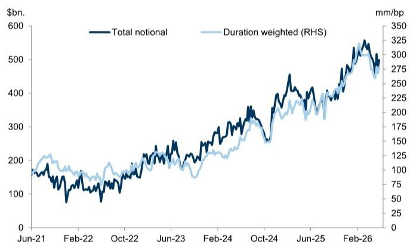

line chart

| Date   | Total notional ($bn) | Duration weighted (RHS) (mm/bp) |
|--------|------------------------|----------------------------------|
| Jun-21 | ~180                   | ~100                             |
| Feb-22 | ~100                   | ~75                              |
| Oct-22 | ~180                   | ~125                             |
| Jun-23 | ~250                   | ~150                             |
| Feb-24 | ~350                   | ~200                             |
| Oct-24 | ~450                   | ~250                             |
| Jun-25 | ~500                   | ~300                             |
| Feb-26 | ~550                   | ~325                             |

Source: Federal Reserve Bank of New York, GS Global Investment Research

Net positions in UST futures  
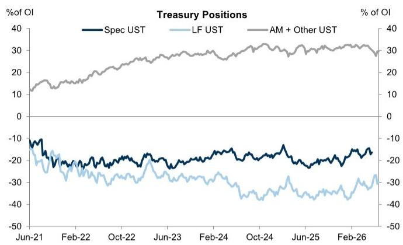

line chart

| Date   | Spec UST | LF UST | AM + Other UST |
|--------|----------|--------|----------------|
| Jun-21 | -10      | -20    | 15             |
| Feb-22 | -20      | -25    | 20             |
| Oct-22 | -15      | -28    | 25             |
| Jun-23 | -18      | -30    | 28             |
| Feb-24 | -15      | -32    | 30             |
| Oct-24 | -12      | -35    | 32             |
| Jun-25 | -18      | -38    | 33             |
| Feb-26 | -15      | -35    | 30             |

Note: Duration-weighted net position (long - short) as a % of duration-weighted gross exposure (long + short + spreading)  
Source: CFTC, GS Global Investment Research

## US Commercial Banks' Holdings of Treasury and Agency Securities

Total domestic and foreign holdings, all commercial banks

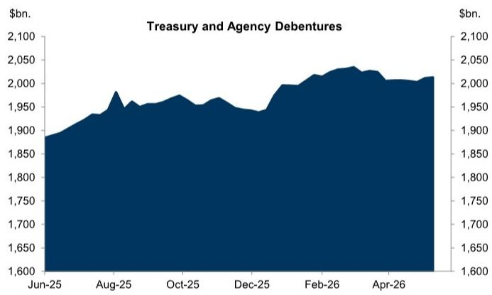

area chart

| Date   | Value ($bn) |
|--------|-------------|
| Jun-25 | 1,890       |
| Aug-25 | 1,980       |
| Oct-25 | 1,970       |
| Dec-25 | 1,950       |
| Feb-26 | 2,030       |
| Apr-26 | 2,010       |

Source: Federal Reserve Board

## NY Fed Custody Holdings

Marketable US Treasuries

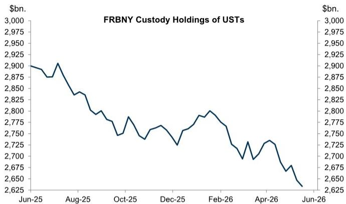

line chart

| Date   | Value ($bn) |
|--------|-------------|
| Jun-25 | 2,900       |
| Aug-25 | 2,850       |
| Oct-25 | 2,750       |
| Dec-25 | 2,725       |
| Feb-26 | 2,800       |
| Apr-26 | 2,700       |
| Jun-26 | 2,625       |

Source: Federal Reserve Bank of New York

Net monthly purchases of short- and long-term US Treasuries by Japanese investors  
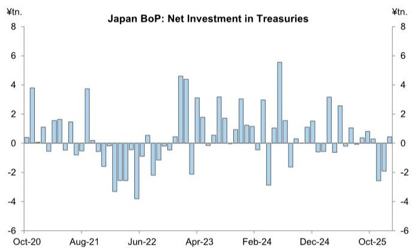

bar chart

Japan BoP: Net Investment in Treasuries
| Date | Net Investment (¥tn) |
|---|---|
| Oct-20 | 0.5 |
| Nov-20 | 3.8 |
| Dec-20 | 1.2 |
| Jan-21 | -0.5 |
| Feb-21 | 1.6 |
| Mar-21 | -0.8 |
| Apr-21 | 1.4 |
| May-21 | -0.7 |
| Jun-21 | 3.7 |
| Jul-21 | -0.3 |
| Aug-21 | 0.2 |
| Sep-21 | -1.5 |
| Oct-21 | -3.2 |
| Nov-21 | -2.8 |
| Dec-21 | -3.5 |
| Jan-22 | -0.9 |
| Feb-22 | 0.6 |
| Mar-22 | -2.3 |
| Apr-22 | 0.4 |
| May-22 | -0.3 |
| Jun-22 | -3.8 |
| Jul-22 | 0.5 |
| Aug-22 | -0.6 |
| Sep-22 | -1.9 |
| Oct-22 | -0.1 |
| Nov-22 | 0.3 |
| Dec-22 | 4.5 |
| Jan-23 | 4.3 |
| Feb-23 | -2.1 |
| Mar-23 | 3.1 |
| Apr-23 | 1.8 |
| May-23 | -0.1 |
| Jun-23 | 0.6 |
| Jul-23 | 3.1 |
| Aug-23 | 1.7 |
| Sep-23 | 0.9 |
| Oct-23 | 3.0 |
| Nov-23 | 1.1 |
| Dec-23 | 1.0 |
| Jan-24 | -0.1 |
| Feb-24 | 3.0 |
| Mar-24 | -3.0 |
| Apr-24 | 1.0 |
| May-24 | 5.6 |
| Jun-24 | 1.6 |
| Jul-24 | -1.7 |
| Aug-24 | 0.3 |
| Sep-24 | 0.1 |
| Oct-24 | 1.5 |
| Nov-24 | -0.5 |
| Dec-24 | 3.1 |
| Jan-25 | -0.7 |
| Feb-25 | 0.9 |
| Mar-25 | -0.4 |
| Apr-25 | -2.5 |
| May-25 | -1.8 |
| Jun-25 | 0.4 |
| Jul-25 | 0.5 |
YTD % change from prior year to next quarter (Oct-25). YTD % change from previous year to next quarter (Oct-24). YTD % change from previous year to next quarter (Oct-23). YTD % change from previous year to next quarter (Oct-22). YTD % change from previous year to next quarter (Oct-21). YTD % change from previous year to next quarter (Oct-20). YTD % change from previous year to next quarter (Oct-19). YTD % change from previous year to next quarter (Oct-18). YTD % change from previous year to next quarter (Oct-17). YTD % change from previous year to next quarter (Oct-16). YTD % change from previous year to next quarter (Oct-15). YTD % change from previous year to next quarter (Oct-14). YTD % change from previous year to next quarter (Oct-13). YTD % change from previous year to next quarter (Oct-12). YTD % change from previous year to next quarter (Oct-11). YTD % change from previous year to next quarter (Oct-10). YTD % change from previous year to next quarter (Oct-09). YTD % change from previous year to next quarter (Oct-08). YTD % change from previous year to next quarter (Oct-07). YTD % change from previous year to next quarter (Oct-06). YTD % change from previous year to next quarter (Oct-05). YTD % change from previous year to next quarter (Oct-04). YTD % change from previous year to next quarter (Oct-03). YTD % change from previous year to next quarter (Oct-02). YTD % change from previous year to next quarter (Oct-01). YTD % change from previous year to next quarter (Oct-00). YTD % change from previous year to next quarter (Oct-09). YTD % change from previous year to next quarter (Oct-08). YTD % change from previous year to next quarter (Oct-07). YTD % change from previous year to next quarter (Oct-06). YTD % change from previous year to next quarter (Oct-05). YTD % change from previous year to next quarter (Oct-04). Ytd % change from previous year to next quarter (Oct-03). Ytd % change from previous year to next quarter (Oct-02). Ytd % change from previous year to next quarter (Oct-01). Ytd % change from previous year to next quarter (Oct-00). Ytd % change from previous year to next quarter (Oct-09). Ytd % change from previous year to next quarter (Oct-08). Ytd % change from previous year to next quarter (Oct-07). Ytd % change from previous year to next quarter (Oct-06). Ytd % change from previous year to next quarter (Oct-05). Ytd % change from previous year to next quarter (Oct-04). Ytd % change from previous year to next quarter (Oct-03). Ytd % change from previous year to next quarter (Oct-02). Ytd % change from previous year to next quarter (Oct-01). Ytd % change from previous year to next quarter (Oct-00). Ytd % change from previous year to next quarter (Oct-09). Ytd % change from Previous Year to Next Quarter (Oct-08) and Next Quarter to Next Quarter (Oct-07) and Next Quarter to Next Quarter (Oct-06) and Next Quarter to Next Quarter (Oct-05) and Next Quarter to Next Quarter (Oct-04) and Next Quarter to Next Quarter (Oct-03) and Next Quarter to Next Quarter (Oct-02) and Next Quarter to Next Quarter (Oct-01) and Next Quarter to Next Quarter (Oct-00) and Next Quarter to Next Quarter (Oct-09) and Next Quarter to Next Quarter (Oct-08) and Next Quarter to Next Quarter (Oct-07) and Next Quarter to Next Quarter (Oct-06) and Next Quarter to Next Quarter (Oct-05) and Next Quarter to Next Quarter (Oct-04) and Next Quarter to Next Quarter (Oct-03) and Next Quarter to Next Quarter (Oct-02) and Next Quarter to Next Quarter (Oct-01) and Next Quarter to Next Quarter.

Source: Bank of Japan, Haver Analytics

## US TIC Treasury Flows

12m change in valuation-adjusted holdings of USTs, by holder of debt

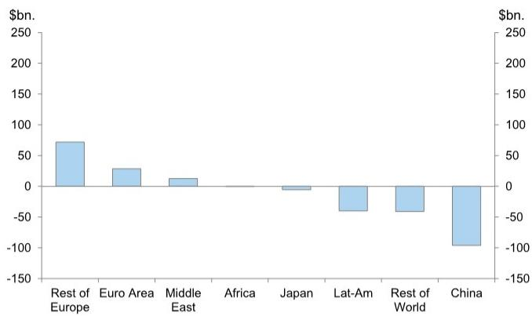

bar chart

| Region | Value ($bn) |
|---|---|
| Rest of Europe | 70 |
| Euro Area | 30 |
| Middle East | 15 |
| Africa | -5 |
| Japan | -10 |
| Lat-Am | -40 |
| Rest of World | -35 |
| China | -95 |

Source: US Treasury, GS Global Investment Research

Flow of Funds annual net purchases of US Treasuries, by sector  
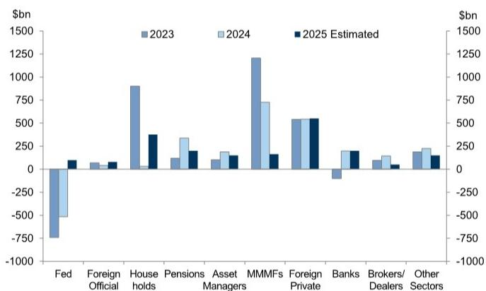

bar chart

| Category | 2023 ($bn) | 2024 ($bn) | 2025 Estimated ($bn) |
|---|---|---|---|
| Fed | -750 | -500 | 100 |
| Foreign Official | 50 | 50 | 50 |
| Households | 900 | 20 | 400 |
| Pensions | 100 | 350 | 200 |
| Asset Managers | 100 | 200 | 150 |
| MMMFs | 1200 | 700 | 150 |
| Foreign Private | 550 | 550 | 550 |
| Banks | -100 | 200 | 200 |
| Brokers/ Dealers | 100 | 150 | 50 |
| Other Sectors | 200 | 250 | 150 |

Source: Federal Reserve Board, GS Global Investment Research

## Outright Carry

Bar chart shows top two carry points by currency, with solid reflecting carry to a long position and striped carry to a short position. Scatter illustrates top 25 carry/vol points by currency, with top point by currency noted

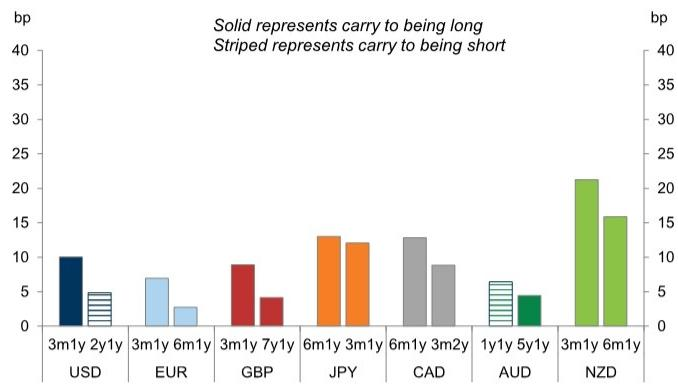

bar chart

Solid represents carry to being long Striped represents carry to being short
| Currency | Short Position (bp) | Long Position (bp) |
| :--- | :--- | :--- |
| USD | 5 | 10 |
| EUR | 3 | 7 |
| GBP | 4 | 9 |
| JPY | 12 | 13 |
| CAD | 9 | 13 |
| AUD | 4 | 6 |
| NZD | 16 | 21 |

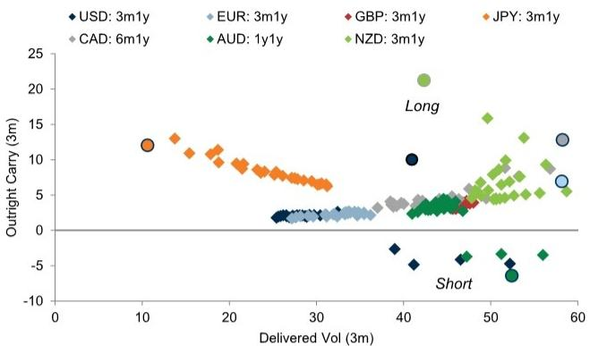

scatterplot

| Currency | Duration | Delivered Vol (3m) | Outright Carry (3m) |
| :--- | :--- | :--- | :--- |
| USD: 3m1y | Short | 40 | -5 |
| EUR: 3m1y | Short | 58 | 7 |
| GBP: 3m1y | Short | 48 | 4 |
| JPY: 3m1y | Short | 10 | 12 |
| CAD: 6m1y | Short | 32 | 3 |
| AUD: 1y1y | Short | 52 | -7 |
| NZD: 3m1y | Short | 42 | 21 |
The chart displays a scatter plot with color-coded markers representing different currencies. The x-axis represents Delivered Volume in millions, and the y-axis represents Outright Carry in millions. The data points are grouped by currency code, with labels indicating currency codes and maturity durations. The vertical axis is labeled 'Outright Carry (3m)'. The chart includes a horizontal line at zero for reference.

Source: GS Global Investment Research

## Curve Carry

Bar chart shows top two carry curves by currency, with solid reflecting carry to a steepening position and striped carry to a flattening position. Scatter illustrates top 5 carry/vol curves by currency, with top curve by currency noted

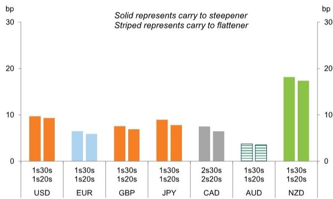

bar chart

Solid represents carry to steepener Striped represents carry to flattener
| Currency | Series 1 (1s30s 1s20s) | Series 2 (1s30s 1s20s) |
| :--- | :--- | :--- |
| USD | 9.5 | 9.2 |
| EUR | 6.2 | 5.8 |
| GBP | 7.5 | 6.8 |
| JPY | 8.8 | 7.6 |
| CAD | 7.4 | 6.3 |
| AUD | 3.5 | 3.4 |
| NZD | 18.2 | 17.1 |

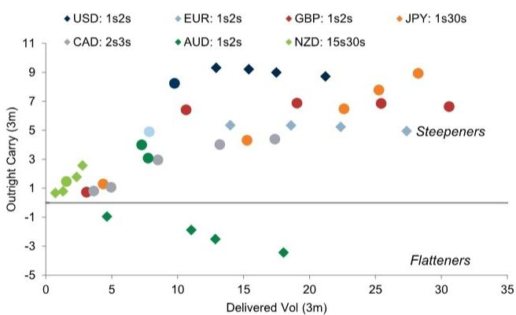

scatterplot

| Currency | Maturity | Delivered Vol (3m) | Outright Carry (3m) |
| :--- | :--- | :--- | :--- |
| USD | 1s2s | 9.5 | 8.0 |
| EUR | 1s2s | 8.5 | 5.0 |
| GBP | 1s2s | 10.5 | 6.5 |
| JPY | 1s30s | 27.5 | 7.5 |
| CAD | 2s3s | 4.5 | 1.0 |
| AUD | 1s2s | 7.0 | -1.0 |
| NZD | 15s30s | 2.5 | 2.0 |
| Steepeners | | 28.0 | 5.0 |
The chart is divided into two sections: 'Flatteners' at the bottom and 'Outright Carry' at the top. The data points are color-coded and labeled with currency codes and maturity terms such as USD, EUR, GBP, JPY, etc., indicating currency pairs or maturity periods.

Source: GS Global Investment Research

## Fly Carry

Bar chart shows top two carry flies by currency, with solid reflecting carry to a belly-richening fly and striped carry to a belly-cheapening fly. Scatter illustrates top 5 carry/vol flies by currency, with top fly by currency noted.

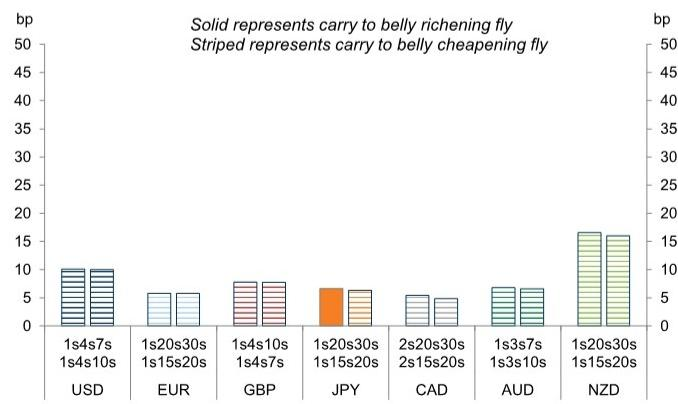

bar chart

Solid represents carry to belly richening fly
Striped represents carry to belly cheapening fly
| Currency | Striped (bp) | Solid (bp) |
| :--- | :--- | :--- |
| USD | 10 | 10 |
| EUR | 5 | 5 |
| GBP | 8 | 8 |
| JPY | 6 | 6 |
| CAD | 4 | 4 |
| AUD | 6 | 6 |
| NZD | 17 | 16 |

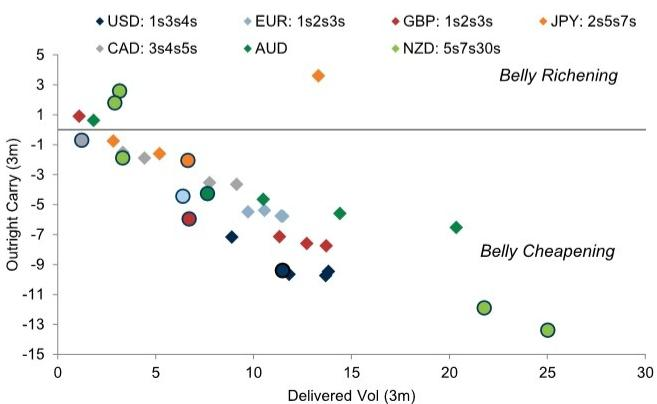

scatterplot

| Currency Pair | Delivered Vol (3m) | Outright Carry (3m) |
| :--- | :--- | :--- |
| USD: 1s3s4s | 12.0 | -9.5 |
| EUR: 1s2s3s | 6.0 | -5.0 |
| GBP: 1s2s3s | 11.0 | -7.0 |
| JPY: 2s5s7s | 3.0 | -0.5 |
| CAD: 3s4s5s | 4.0 | -2.5 |
| AUD | 8.0 | -4.0 |
| NZD: 5s7s30s | 14.0 | -5.0 |
| USD: 1s3s4s | 12.0 | -9.0 |
| EUR: 1s2s3s | 6.0 | -5.5 |
| GBP: 1s2s3s | 11.0 | -7.5 |
| JPY: 2s5s7s | 3.0 | -0.5 |
| AUD | 14.0 | -6.5 |
| NZD: 5s7s30s | 21.0 | -7.0 |
| USD: 1s3s4s | 25.0 | -13.0 |
Belly Richening

Source: GS Global Investment Research

Gross Treasury auction size estimates by year end, with GS projections

<table><tr><td colspan="12">Monthly Auction Amounts at End of Calendar Year ($ billions)</td></tr><tr><td></td><td>2y FRNs</td><td>2y</td><td>3y</td><td>5y</td><td>7y</td><td>10y</td><td>20y</td><td>30y</td><td>5y TIPS</td><td>10y TIPS</td><td>30y TIPS</td></tr><tr><td>YE-25 (CY)</td><td>30 / 28 (r)</td><td>69</td><td>58</td><td>70</td><td>44</td><td>42 / 39 (r)</td><td>16 / 13 (r)</td><td>25 / 22 (r)</td><td>26 / 24 (r)</td><td>21 / 19 (r)</td><td>9 / 8 (r)</td></tr><tr><td>YE-26 (CY, GS)</td><td>30 / 28 (r)</td><td>69</td><td>58</td><td>70</td><td>44</td><td>42 / 39 (r)</td><td>16 / 13 (r)</td><td>25 / 22 (r)</td><td>26 / 24 (r)</td><td>21 / 19 (r)</td><td>9 / 8 (r)</td></tr><tr><td>YE-27 (CY, GS)</td><td>33 / 30 (r)</td><td>83</td><td>72</td><td>84</td><td>58</td><td>42 / 39 (r)</td><td>16 / 13 (r)</td><td>25 / 22 (r)</td><td>28 / 26 (r)</td><td>21 / 19 (r)</td><td>9 / 8 (r)</td></tr></table>

\* Original Issue / Reopening listed for FRNs, 10s, 20s, 30s, and TIPS.

<table><tr><td colspan="7">US Treasury Net Issuance by Calendar Year ($ billions)</td></tr><tr><td></td><td>Net Coupons</td><td>Fed</td><td>Net of Fed</td><td>Net Bills</td><td>Fed</td><td>Net of Fed</td></tr><tr><td>CY 2024</td><td>1346</td><td>-475</td><td>1821</td><td>511</td><td>-23</td><td>534</td></tr><tr><td>CY 2025</td><td>1566</td><td>-115</td><td>1681</td><td>360</td><td>38</td><td>322</td></tr><tr><td>CY 2026, GS</td><td>1225</td><td>-1</td><td>1226</td><td>811</td><td>422</td><td>389</td></tr><tr><td>CY 2027, GS</td><td>1286</td><td>0</td><td>1286</td><td>927</td><td>449</td><td>478</td></tr></table>

<table><tr><td colspan="3">Duration supply ($bn 10y equiv)</td></tr><tr><td>Gross supply</td><td>Fed</td><td>Net of Fed</td></tr><tr><td>2765</td><td>0</td><td>2765</td></tr><tr><td>2797</td><td>0</td><td>2797</td></tr><tr><td>2796</td><td>0</td><td>2796</td></tr><tr><td>2929</td><td>0</td><td>2929</td></tr></table>

Source: GS Global Investment Research, US Department of the Treasury

Net issuance per quarter  
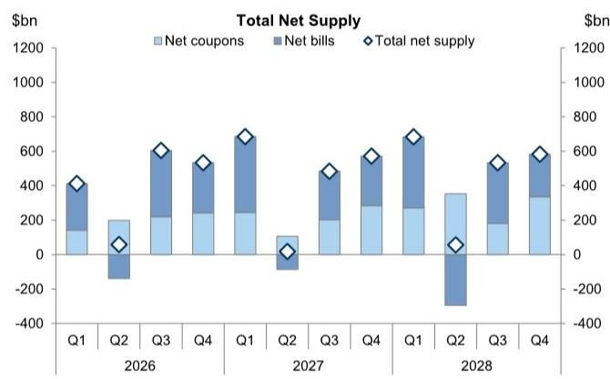

bar chart

| Year | Quarter | Net coupons ($bn) | Net bills ($bn) | Total net supply ($bn) |
|------|---------|-------------------|-----------------|------------------------|
| 2026 | Q1      | 150               | 300             | 400                    |
| 2026 | Q2      | 200               | -150            | 100                    |
| 2026 | Q3      | 200               | 400             | 600                    |
| 2026 | Q4      | 250               | 350             | 550                    |
| 2027 | Q1      | 250               | 450             | 700                    |
| 2027 | Q2      | -100              | -50             | -50                    |
| 2027 | Q3      | 200               | 350             | 500                    |
| 2027 | Q4      | 300               | 350             | 600                    |
| 2028 | Q1      | 250               | 450             | 700                    |
| 2028 | Q2      | 350               | -300            | 100                    |
| 2028 | Q3      | 150               | 350             | 550                    |
| 2028 | Q4      | 350               | 350             | 600                    |

Source: GS Global Investment Research, US Department of the Treasury

Average monthly UST issuance, gross and net of Fed purchases; \$bn 10y equivalents  

bar-line hybrid

| Quarter | Gross Issuance ($bn) | Fed Purchases ($bn) | Issuance net of Fed purchases ($bn) |
|---|---|---|---|
| Q4-22 | 180 | - | 185 |
| Q2-23 | 175 | - | 180 |
| Q4-23 | 200 | - | 205 |
| Q2-24 | 230 | - | 235 |
| Q4-24 | 235 | - | 235 |
| Q2-25 | 230 | - | 230 |
| Q4-25 | 230 | - | 230 |
| Q2-26 | 230 | - | 230 |
| Q4-26 | 230 | - | 230 |

Source: GS Global Investment Research, US Department of the Treasury

Free float (Treasuries outstanding less Fed and foreign official holdings) as % of GDP  
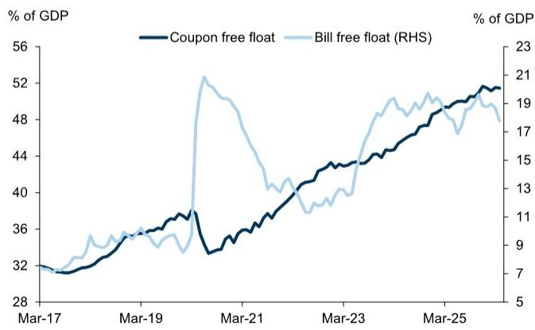

line chart

| Date   | Coupon free float | Bill free float (RHS) |
|--------|-------------------|------------------------|
| Mar-17 | 32                | 7                      |
| Mar-19 | 36                | 11                     |
| Mar-21 | 33                | 21                     |
| Mar-23 | 44                | 17                     |
| Mar-25 | 52                | 19                     |

Source: Haver Analytics, US Treasury, GS Global Investment Research

Bills as a share of Treasuries outstanding and GS forecast Gray shading denotes TBAC recommended 15-20% range  
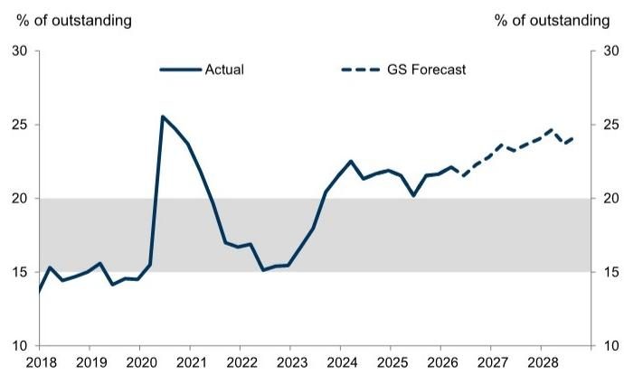

line chart

| Year | Actual | GS Forecast |
|------|--------|-------------|
| 2018 | 14.0   | -           |
| 2019 | 15.0   | -           |
| 2020 | 14.5   | -           |
| 2021 | 25.5   | -           |
| 2022 | 16.5   | -           |
| 2023 | 15.5   | -           |
| 2024 | 22.5   | -           |
| 2025 | 21.5   | -           |
| 2026 | 21.0   | -           |
| 2027 | -      | 23.0        |
| 2028 | -      | 24.5        |

Source: US Treasury, GS Global Investment Research

1y Range of G10 10y Yields, by Term Premium and Expectations Components  
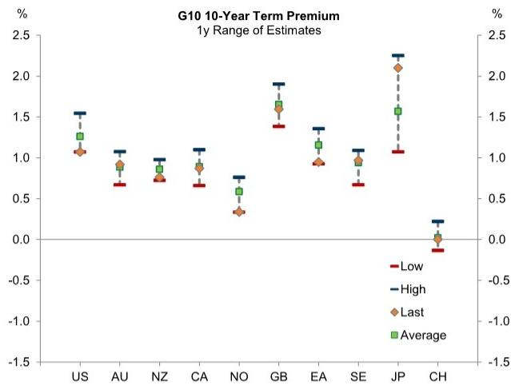

line chart with error bars

| Country | Low  | High | Last | Average |
|---------|------|------|------|---------|
| US      | 1.0  | 1.6  | 1.1  | 1.3     |
| AU      | 0.7  | 1.0  | 0.9  | 0.9     |
| NZ      | 0.7  | 1.0  | 0.8  | 0.9     |
| CA      | 0.6  | 1.1  | 0.9  | 0.8     |
| NO      | 0.3  | 0.8  | 0.4  | 0.6     |
| GB      | 1.4  | 1.9  | 1.7  | 1.6     |
| EA      | 0.9  | 1.3  | 1.0  | 1.2     |
| SE      | 0.7  | 1.1  | 0.9  | 1.0     |
| JP      | 1.1  | 2.2  | 2.1  | 1.6     |
| CH      | -0.1 | 0.2  | 0.1  | 0.0     |

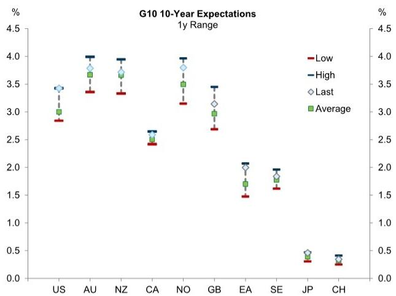

box plot

G10 10-Year Expectations
1y Range
| Country | Low (%) | High (%) | Last (%) | Average (%) |
|---|---|---|---|---|
| US | 2.8 | 3.0 | 3.4 | 3.0 |
| AU | 3.4 | 4.0 | 3.8 | 3.7 |
| NZ | 3.4 | 4.0 | 3.8 | 3.7 |
| CA | 2.4 | 2.6 | 2.6 | 2.5 |
| NO | 3.2 | 4.0 | 3.9 | 3.5 |
| GB | 2.7 | 3.5 | 3.2 | 3.0 |
| EA | 1.5 | 2.0 | 2.0 | 1.7 |
| SE | 1.6 | 1.9 | 1.9 | 1.8 |
| JP | 0.3 | 0.4 | 0.4 | 0.4 |
| CH | 0.3 | 0.4 | 0.4 | 0.4 |

Term Structure of Fitted Yields, by Component  
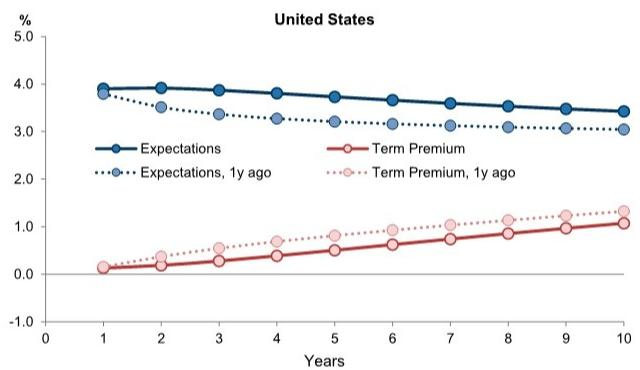

line chart

United States
| Years | Expectations (%) | Expectations, 1y ago (%) | Term Premium (%) | Term Premium, 1y ago (%) |
|---|---|---|---|---|
| 1 | 3.9 | 3.8 | 0.1 | 0.2 |
| 2 | 3.9 | 3.5 | 0.2 | 0.4 |
| 3 | 3.85 | 3.35 | 0.3 | 0.6 |
| 4 | 3.8 | 3.25 | 0.4 | 0.7 |
| 5 | 3.75 | 3.15 | 0.5 | 0.8 |
| 6 | 3.7 | 3.1 | 0.6 | 0.9 |
| 7 | 3.65 | 3.05 | 0.7 | 1.0 |
| 8 | 3.6 | 3.0 | 0.8 | 1.1 |
| 9 | 3.55 | 2.95 | 0.9 | 1.2 |
| 10 | 3.5 | 2.9 | 1.0 | 1.3 |

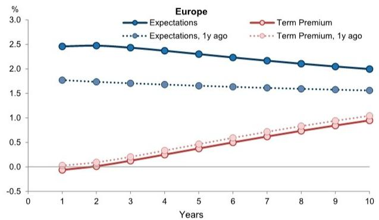

line chart

Europe
| Years | Expectations (%) | Term Premium (%) |
|---|---|---|
| 1 | 2.45 | -0.05 |
| 2 | 2.45 | 0.05 |
| 3 | 2.40 | 0.15 |
| 4 | 2.35 | 0.25 |
| 5 | 2.25 | 0.40 |
| 6 | 2.15 | 0.55 |
| 7 | 2.10 | 0.70 |
| 8 | 2.05 | 0.80 |
| 9 | 2.00 | 0.90 |
| 10 | 1.95 | 1.00 |

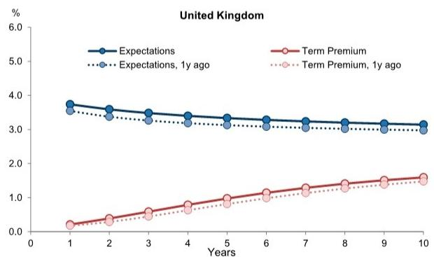

line chart

United Kingdom
| Years | Expectations (%) | Expectations, 1y ago (%) | Term Premium (%) | Term Premium, 1y ago (%) |
|---|---|---|---|---|
| 1 | 3.7 | 3.5 | 0.2 | 0.2 |
| 2 | 3.6 | 3.4 | 0.4 | 0.4 |
| 3 | 3.5 | 3.3 | 0.6 | 0.6 |
| 4 | 3.4 | 3.2 | 0.8 | 0.8 |
| 5 | 3.3 | 3.1 | 1.0 | 1.0 |
| 6 | 3.2 | 3.1 | 1.2 | 1.2 |
| 7 | 3.2 | 3.0 | 1.3 | 1.3 |
| 8 | 3.1 | 3.0 | 1.4 | 1.4 |
| 9 | 3.1 | 2.9 | 1.5 | 1.5 |
| 10 | 3.1 | 2.9 | 1.6 | 1.6 |

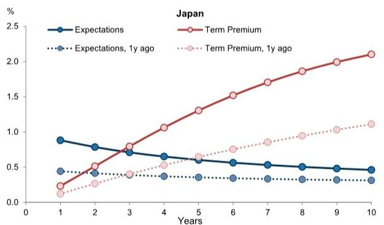

line chart

Japan
| Years | Expectations (%) | Term Premium (%) | Expectations, 1y ago (%) | Term Premium, 1y ago (%) |
|---|---|---|---|---|
| 1 | 0.9 | 0.2 | 0.45 | 0.1 |
| 2 | 0.8 | 0.5 | 0.45 | 0.3 |
| 3 | 0.75 | 0.8 | 0.4 | 0.4 |
| 4 | 0.65 | 1.1 | 0.35 | 0.55 |
| 5 | 0.6 | 1.35 | 0.35 | 0.65 |
| 6 | 0.55 | 1.55 | 0.35 | 0.75 |
| 7 | 0.5 | 1.75 | 0.35 | 0.85 |
| 8 | 0.48 | 1.85 | 0.35 | 0.95 |
| 9 | 0.45 | 2.0 | 0.35 | 1.05 |
| 10 | 0.45 | 2.1 | 0.35 | 1.15 |

Source: GS Global Investment Research

2026 Trade Recommendations

<table><tr><td colspan="7">GS Rates Trades</td></tr><tr><td>Active</td><td>Entry Date</td><td>Opened</td><td>Latest</td><td>Stop</td><td>Target</td><td>Performance</td></tr><tr><td>1. Long 3y France, Spain, Italy vs OIS (equally weighted)</td><td>10-Apr-26</td><td>0.33</td><td>0.29</td><td>0.32</td><td>0.23</td><td>+4 bps</td></tr><tr><td>2. Long 3y SOFR swap spread</td><td>17-Apr-26</td><td>-0.226</td><td>-0.195</td><td>-0.230</td><td>-0.180</td><td>+3 bps</td></tr><tr><td>3. 2s5s CAD steepeners</td><td>24-Apr-26</td><td>0.20</td><td>0.22</td><td>0.20</td><td>0.35</td><td>+2 bps</td></tr><tr><td>4. Long 5y Receivers on 3m 2s5s10s Receiver Fly (bp running)</td><td>08-May-26</td><td>0.01</td><td>-0.01</td><td>-0.05</td><td>0.10</td><td>-2 bps</td></tr><tr><td>5. 1y forward 2s10s GBP OIS steepeners</td><td>29-May-26</td><td>0.38</td><td>0.37</td><td>0.25</td><td>0.55</td><td>-1 bps</td></tr><tr><td>Closed</td><td>Entry Date</td><td>Closed</td><td>Performance</td><td></td><td></td><td></td></tr><tr><td>1. SFRZ6/Z7 steepeners</td><td>21-Nov-25</td><td>14-Jan-26</td><td>+6bps</td><td></td><td></td><td></td></tr><tr><td>2. Long 10y Gilts on ASW</td><td>21-Nov-25</td><td>30-Jan-26</td><td>+12 bps</td><td></td><td></td><td></td></tr><tr><td>3. Long USD 3m2y A-25 receiver vs short 3m10y A-25 receiver (return in bp running)</td><td>07-Nov-25</td><td>09-Feb-26</td><td>-2 bps</td><td></td><td></td><td></td></tr><tr><td>4. 2s5s CORRA steepener</td><td>16-Jan-26</td><td>13-Feb-26</td><td>+0 bps</td><td></td><td></td><td></td></tr><tr><td>5. Receive AUD 5y5y IRS vs pay NZD 5y5y</td><td>28-Nov-25</td><td>18-Feb-26</td><td>+0 bps</td><td></td><td></td><td></td></tr><tr><td>6. Long 20s on 10s20s30s weighted SOFR fly (weights 0.6x : 2x : 1.4x)</td><td>01-Aug-25</td><td>02-Mar-26</td><td>+6 bps</td><td></td><td></td><td></td></tr><tr><td>7. Long SFIU6</td><td>30-Jan-26</td><td>03-Mar-26</td><td>+7 bps</td><td></td><td></td><td></td></tr><tr><td>8. Long 10y Gilts vs Bunds</td><td>07-Nov-25</td><td>09-Mar-26</td><td>+4 bps</td><td></td><td></td><td></td></tr><tr><td>9. 3m10y A+5/A+20/A+27.5 payer ladders (bp running)</td><td>20-Feb-26</td><td>23-Mar-26</td><td>-5 bps</td><td></td><td></td><td></td></tr><tr><td>10. Long 10y NOK vs SEK</td><td>13-Feb-26</td><td>25-Mar-26</td><td>+20 bps</td><td></td><td></td><td></td></tr><tr><td>11. Long EU 30y on the fly against 30y Austria and Spain</td><td>27-Feb-26</td><td>10-Apr-26</td><td>-5 bps</td><td></td><td></td><td></td></tr><tr><td>12. Long USD 3m 2s10s A+10/A+25 curve cap spread (bp of notional)</td><td>23-Jan-26</td><td>15-Apr-26</td><td>-2 bps</td><td></td><td></td><td></td></tr><tr><td>13. USD 3m3y A-5/A-40 receiver spreads</td><td>13-Mar-26</td><td>30-Apr-26</td><td>-7 bps</td><td></td><td></td><td></td></tr><tr><td>14. Long 10y Inflation Swap vs 0.25x Receive 10y SOFR</td><td>27-Mar-26</td><td>07-May-26</td><td>+15 bps</td><td></td><td></td><td></td></tr><tr><td>15. Pay 10s on 5s10s30s SOFR fly</td><td>09-Jan-26</td><td>08-May-26</td><td>-1 bps</td><td></td><td></td><td></td></tr><tr><td>16. Long 10y Inflation Swap vs 0.25x Receive 10y SOFR</td><td>12-Jun-26</td><td>18-Jun-26</td><td>-1 bps</td><td></td><td></td><td></td></tr><tr><td>17. Long 5y5y EUR OIS - HICP</td><td>01-May-26</td><td>19-Jun-26</td><td>+11 bps</td><td></td><td></td><td></td></tr></table>

Note: Potential profit/loss estimates are given as per unit of duration risk, through yesterday's close.  
Source: GS Global Investment Research

## Global Interest Rates Strategy

## George Cole

+44(20)7552-1214

george.cole@gs.com

GS International

## William Marshall

+1(212)357-0413

william.c.marshall@gs.com

GS & Co. LLC

## Simon Freycenet

+44(20)7774-5017

simon.freycenet@gs.com

GS Bank Europe SE - Paris

Branch

## Isabella Rosenberg

+1(212)357-7628

isabella.rosenberg@gs.com

GS & Co. LLC

## Friedrich Schaper

+1(917)343-3214

friedrich.schaper@gs.com

GS & Co. LLC

## Loic Mathys

+44(20)7051-1664

loic.mathys@gs.com

GS International

## Disclosure Appendix

## Reg AC

We, George Cole, William Marshall, Simon Freycenet, Isabella Rosenberg, Friedrich Schaper and Loic Mathys, hereby certify that all of the views expressed in this report accurately reflect our personal views, which have not been influenced by considerations of the firm's business or client relationships.

Unless otherwise stated, the individuals listed on the cover page of this report are analysts in GS' Global Investment Research division.

Contributing Authors: George Cole GS International, William Marshall GS & Co. LLC, Simon Freycenet GS Bank Europe SE - Paris Branch, Isabella Rosenberg GS & Co. LLC, Friedrich Schaper GS & Co. LLC, Loic Mathys GS International.

Unless otherwise stated, the individuals listed in the Contributing Authors disclosure of this report are analysts in GS' Global Investment Research division.

## Disclosures

## Option Specific Disclosures

Price target methodology: Please refer to the analyst's previously published research for methodology and risks associated with equity price targets.

Pricing Disclosure: Option prices and volatility levels in this note are indicative only, and are based on our estimates of recent mid-market levels (unless otherwise noted). All prices and levels exclude transaction costs unless otherwise stated.

General Options Risks – The risks below and any other options risks mentioned in this research report pertain both to specific derivative trade recommendations mentioned and to discussion of general opportunities and advantages of derivative strategies. Unless otherwise noted, options strategies mentioned in this report may be a combination of the strategies below and therefore carry with them the risks of those strategies.

Buying Options – Investors who buy call (put) options risk loss of the entire premium paid if the underlying security finishes below (above) the strike price at expiration. Investors who buy call or put spreads also risk a maximum loss of the premium paid. The maximum gain on a long call or put spread is the difference between the strike prices, less the premium paid.

Selling Options – Investors who sell calls on securities they do not own risk unlimited loss of the security price less the strike price. Investors who sell covered calls (sell calls while owning the underlying security) risk having to deliver the underlying security or pay the difference between the security price and the strike price, depending on whether the option is settled by physical delivery or cash-settled. Investors who sell puts risk loss of the strike price less the premium received for selling the put. Investors who sell put or call spreads risk a maximum loss of the difference between the strikes less the premium received, while their maximum gain is the premium received.

For options settled by physical delivery, the above risks assume the options buyer or seller, buys or sells the resulting securities at the settlement price on expiry.

## Regulatory disclosures

## Disclosures required by United States laws and regulations

See company-specific regulatory disclosures above for any of the following disclosures required as to companies referred to in this report: manager or co-manager in a pending transaction; $1\%$ or other ownership; compensation for certain services; types of client relationships; managed/co-managed public offerings in prior periods; directorships; for equity securities, market making and/or specialist role. GS trades or may trade as a principal in debt securities (or in related derivatives) of issuers discussed in this report.

The following are additional required disclosures: Ownership and material conflicts of interest: GS policy prohibits its analysts, professionals reporting to analysts and members of their households from owning securities of any company in the analyst's area of coverage. Analyst compensation: Analysts are paid in part based on the profitability of GS, which includes investment banking revenues. Analyst as officer or director: GS policy generally prohibits its analysts, persons reporting to analysts or members of their households from serving as an officer, director or advisor of any company in the analyst's area of coverage. Non-U.S. Analysts: Non-U.S. analysts may not be associated persons of GS & Co. LLC and therefore may not be subject to FINRA Rule 2241 or FINRA Rule 2242 restrictions on communications with a subject company, public appearances and trading in securities covered by the analysts.

## Additional disclosures required under the laws and regulations of jurisdictions other than the United States

The following disclosures are those required by the jurisdiction indicated, except to the extent already made above pursuant to United States laws and regulations. Australia: GS Australia Pty Ltd and its affiliates are not authorised deposit-taking institutions (as that term is defined in the Banking Act 1959 (Cth)) in Australia and do not provide banking services, nor carry on a banking business, in Australia. This research, and any access to it, is intended only for “wholesale clients” within the meaning of the Australian Corporations Act, unless otherwise agreed by GS. In producing research reports, members of Global Investment Research of GS Australia may attend site visits and other meetings hosted by the companies and other entities which are the subject of its research reports. In some instances the costs of such site visits or meetings may be met in part or in whole by the issuers concerned if GS Australia considers it is appropriate and reasonable in the specific circumstances relating to the site visit or meeting. To the extent that the contents of this document contains any financial product advice, it is general advice only and has been prepared by GS without taking into account a client’s objectives, financial situation or needs. A client should, before acting on any such advice, consider the appropriateness of the advice having regard to the client’s own objectives, financial situation and needs. A copy of certain GS Australia and New Zealand disclosure of interests and a copy of GS’ Australian Sell-Side Research Independence Policy Statement are available at: https://www.goldmansachs.com/disclosures/australia-new-zealand/index.html. Brazil: Disclosure information in relation to CVM Resolution n. 20 is available at https://www.gs.com/worldwide/brazil/area/gir/index.html. Where applicable, the Brazil-registered analyst primarily responsible for the content of this research report, as defined in Article 20 of CVM Resolution n. 20, is the first author named at the beginning of this report, unless indicated otherwise at the end of the text. Canada: This information is being provided to you for information purposes only and is not, and under no circumstances should be construed as, an advertisement, offering or solicitation by GS & Co. LLC for purchasers of securities in Canada to trade in any Canadian security. GS & Co. LLC is not registered as a dealer in any jurisdiction in Canada under applicable Canadian securities laws and generally is not permitted to trade in Canadian securities and may be prohibited from selling certain securities and products in certain jurisdictions in Canada. If you wish to trade in any Canadian securities or other products in Canada please contact GS Canada Inc., an affiliate of The GS Group Inc., or another registered Canadian dealer. Hong Kong: Further information on the securities of covered companies referred to in this research may be obtained on request from GS (Asia) L.L.C. India: Further information on the subject company or companies referred to in this research may be obtained from GS (India) Securities Private Limited, Research Analyst – SEBI Registration Number INH000001493, 10th Floor, Ascent-Worli, Sudam Kalu Ahire Marg, Worli, Mumbai-400 025, India, Corporate Identity Number U74140MH2006FTC160634, Phone +91 22 6616 9000, Fax +91 22 6616 9001. GS may beneficially own 1% or more of the securities (as such term is defined in clause 2 (h) the Indian Securities Contracts (Regulation) Act, 1956) of the subject company or companies referred to in this research report. Investment in securities market are subject to market risks. Read all the related documents carefully before investing. Registration granted by SEBI and certification from NISM in no way guarantee performance of the intermediary or provide any assurance of returns to investors. GS (India) Securities Private Limited compliance officer and investor grievance contact details can be found at: https://www.goldmansachs.com/worldwide/india/documents/Grievance-Redressal-and-Escalation-Matrix.pdf, and a copy of the annual audit compliance report can be found at this link: https://publishing.gs.com/content/site/india-annual-compliance-report.html. Japan: See below. Korea: This research, and any access to it, is intended only for “professional investors” within the meaning of the Financial Services and Capital Markets Act, unless otherwise agreed by GS. Further information on the subject company or companies referred to in this research may be obtained from GS (Asia) L.L.C., Seoul Branch. New Zealand: GS New Zealand Limited and its affiliates are neither “registered banks” nor “deposit takers” (as defined in the Reserve Bank of New Zealand Act 1989) in New Zealand. This research, and any access to it, is intended for “wholesale clients” (as defined in the Financial Advisers Act 2008) unless otherwise agreed by GS. A copy of certain GS Australia and New Zealand disclosure of interests is available at: https://www.goldmansachs.com/disclosures/australia-new-zealand/index.html. Russia: Research reports distributed in the Russian Federation are not advertising as defined in the Russian legislation, but are information and analysis not having product promotion as their main purpose and do not provide appraisal within the meaning of the Russian legislation on appraisal activity. Research reports do not constitute a personalized investment recommendation as defined in Russian laws and regulations, are not addressed to a specific client, and are prepared without analyzing the financial circumstances, investment profiles or risk profiles of clients. GS assumes no responsibility for any investment decisions that may be taken by a client or any other person based on this research report. Singapore: GS (Singapore) Pte. (Company Number: 198602165W), which is regulated by the Monetary Authority of Singapore, accepts legal responsibility for this research, and should be contacted with respect to any matters arising from, or in connection with, this research. Taiwan: This material is for reference only and must not be reprinted without permission. Investors should carefully consider their own investment risk. Investment results are the responsibility of the individual investor. United Kingdom: Persons who would be categorized as retail clients in the United Kingdom, as such term is defined in the rules of the Financial Conduct Authority, should read this research in conjunction with prior GS on the covered companies referred to herein and should refer to the risk warnings that have been sent to them by GS International. A copy of these risks warnings, and a glossary of certain financial terms used in this report, are available from GS International on request.

European Union and United Kingdom: Disclosure information in relation to Article 6 (2) of the European Commission Delegated Regulation (EU) (2016/958) supplementing Regulation (EU) No 596/2014 of the European Parliament and of the Council (including as that Delegated Regulation is implemented into United Kingdom domestic law and regulation following the United Kingdom's departure from the European Union and the European Economic Area) with regard to regulatory technical standards for the technical arrangements for objective presentation of investment recommendations or other information recommending or suggesting an investment strategy and for disclosure of particular interests or indications of conflicts of interest is available at https://www.gs.com/disclosures/europeanpolicy.html which states the European Policy for Managing Conflicts of Interest in Connection with Investment Research.

Japan: GS Japan Co., Ltd. is a Financial Instrument Dealer registered with the Kanto Financial Bureau under registration number Kinsho 69, and a member of Japan Securities Dealers Association, Financial Futures Association of Japan Type II Financial Instruments Firms Association, and Investment Management Association of Japan. Sales and purchase of equities are subject to commission pre-determined with clients plus consumption tax. See company-specific disclosures as to any applicable disclosures required by Japanese stock exchanges, the Japanese Securities Dealers Association or the Japanese Securities Finance Company.

## Global product; distributing entities

GS Global Investment Research produces and distributes research products for clients of GS on a global basis. Analysts based in GS offices around the world produce research on industries and companies, and research on macroeconomics, currencies, commodities and portfolio strategy. This research is disseminated in Australia by GS Australia Pty Ltd (ABN 21 006 797 897); in Brazil by GS do Brasil Corretora de Títulos e Valores Mobiliários S.A.; Public Communication Channel GS Brazil: 0800 727 5764 and / or contatogoldmanbrasil@gs.com. Available Weekdays (except holidays), from 9am to 6pm. Canal de Comunicação com o Público GS Brasil: 0800 727 5764 e/ou contatogoldmanbrasil@gs.com. Horário de funcionamento: segunda-feira à sexta-feira (exceto feriados), das 9h às 18h; in Canada by GS & Co. LLC; in Hong Kong by GS (Asia) L.L.C.; in India by GS (India) Securities Private Ltd.; in Japan by GS Japan Co., Ltd.; in the Republic of Korea by GS (Asia) L.L.C., Seoul Branch; in New Zealand by GS New Zealand Limited; in Russia by OOO GS; in Singapore by GS (Singapore) Pte. (Company Number: 198602165W); and in the United States of America by GS & Co. LLC. GS International has approved this research in connection with its distribution in the United Kingdom.

GS International (“GSI”), authorised by the Prudential Regulation Authority (“PRA”) and regulated by the Financial Conduct Authority (“FCA”) and the PRA, has approved this research in connection with its distribution in the United Kingdom.

European Economic Area: GS Bank Europe SE (“GSBE”) is a credit institution incorporated in Germany and, within the Single Supervisory Mechanism, subject to direct prudential supervision by the European Central Bank and in other respects supervised by German Federal Financial Supervisory Authority (Bundesanstalt für Finanzdienstleistungsaufsicht, BaFin) and Deutsche Bundesbank and disseminates research within the European Economic Area.

## General disclosures

This research is for our clients only. Other than disclosures relating to GS, this research is based on current public information that we consider reliable, but we do not represent it is accurate or complete, and it should not be relied on as such. The information, opinions, estimates and forecasts contained herein are as of the date hereof and are subject to change without prior notification. We seek to update our research as appropriate, but various regulations may prevent us from doing so. Other than certain industry reports published on a periodic basis, the large majority of reports are published at irregular intervals as appropriate in the analyst's judgment.

GS conducts a global full-service, integrated investment banking, investment management, and brokerage business. We have investment banking and other business relationships with a substantial percentage of the companies covered by Global Investment Research. GS & Co. LLC, the United States broker dealer, is a member of SIPC (https://www.sipc.org).

Our salespeople, traders, and other professionals may provide oral or written market commentary or trading strategies to our clients and principal trading desks that reflect opinions that are contrary to the opinions expressed in this research. Our asset management area, principal trading desks and investing businesses may make investment decisions that are inconsistent with the recommendations or views expressed in this research.

We and our affiliates, officers, directors, and employees will from time to time have long or short positions in, act as principal in, and buy or sell, the securities or derivatives, if any, referred to in this research, unless otherwise prohibited by regulation or GS policy.

The views attributed to third party presenters at GS arranged conferences, including individuals from other parts of GS, do not

necessarily reflect those of Global Investment Research and are not an official view of GS.

Any third party referenced herein, including any salespeople, traders and other professionals or members of their household, may have positions in the products mentioned that are inconsistent with the views expressed by analysts named in this report.

This research is focused on investment themes across markets, industries and sectors. It does not attempt to distinguish between the prospects or performance of, or provide analysis of, individual companies within any industry or sector we describe.

Any trading recommendation in this research relating to an equity or credit security or securities within an industry or sector is reflective of the investment theme being discussed and is not a recommendation of any such security in isolation.

This research is not an offer to sell or the solicitation of an offer to buy any security in any jurisdiction where such an offer or solicitation would be illegal. It does not constitute a personal recommendation or take into account the particular investment objectives, financial situations, or needs of individual clients. Clients should consider whether any advice or recommendation in this research is suitable for their particular circumstances and, if appropriate, seek professional advice, including tax advice. The price and value of investments referred to in this research and the income from them may fluctuate. Past performance is not a guide to future performance, future returns are not guaranteed, and a loss of original capital may occur. Fluctuations in exchange rates could have adverse effects on the value or price of, or income derived from, certain investments.

Certain transactions, including those involving futures, options, and other derivatives, give rise to substantial risk and are not suitable for all investors. Investors should review current options and futures disclosure documents which are available from GS sales representatives or at https://www.theocc.com/about/publications/character-risks.jsp and https://www.goldmansachs.com/disclosures/cftc\_fcm\_disclosures. Transaction costs may be significant in option strategies calling for multiple purchase and sales of options such as spreads. Supporting documentation will be supplied upon request.

Differing Levels of Service provided by Global Investment Research: The level and types of services provided to you by GS Global Investment Research may vary as compared to that provided to internal and other external clients of GS, depending on various factors including your individual preferences as to the frequency and manner of receiving communication, your risk profile and investment focus and perspective (e.g., marketwide, sector specific, long term, short term), the size and scope of your overall client relationship with GS, and legal and regulatory constraints. As an example, certain clients may request to receive notifications when research on specific securities is published, and certain clients may request that specific data underlying analysts' fundamental analysis available on our internal client websites be delivered to them electronically through data feeds or otherwise. No change to an analyst's fundamental research views (e.g., ratings, price targets, or material changes to earnings estimates for equity securities), will be communicated to any client prior to inclusion of such information in a research report broadly disseminated through electronic publication to our internal client websites or through other means, as necessary, to all clients who are entitled to receive such reports.

All research reports are disseminated and available to all clients simultaneously through electronic publication to our internal client websites. Not all research content is redistributed to our clients or available to third-party aggregators, nor is GS responsible for the redistribution of our research by third party aggregators. For research, models or other data related to one or more securities, markets or asset classes (including related services) that may be available to you, please contact your GS representative or go to https://research.gs.com.

Disclosure information is also available at https://www.gs.com/research/hedge.html or from Research Compliance, 200 West Street, New York, NY 10282.

## © 2026 GS.

You are permitted to store, display, analyze, modify, reformat, and print the information made available to you via this service only for your own use. You may not resell or reverse engineer this information to calculate or develop any index for disclosure and/or marketing or create any other derivative works or commercial product(s), data or offering(s) without the express written consent of GS. You are not permitted to publish, transmit, or otherwise reproduce this information, in whole or in part, in any format to any third party without the express written consent of GS. This foregoing restriction includes, without limitation, using, extracting, downloading or retrieving this information, in whole or in part, to train or finetune a machine learning or artificial intelligence system, or to provide or reproduce this information, in whole or in part, as a prompt or input to any such system.