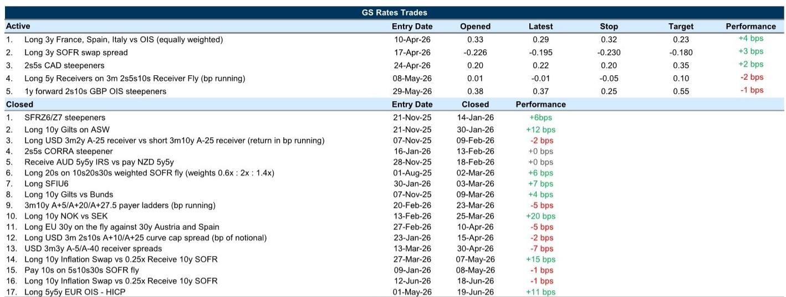
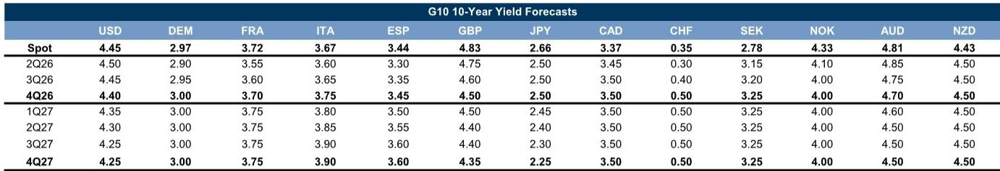
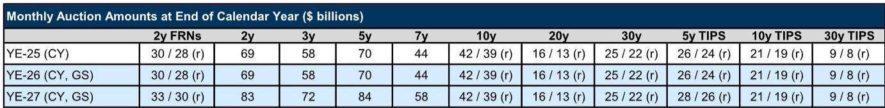

# The Fed Has Shifted the Risk Landscape: Why Curve Positioning Now Trumps Directional Duration Bets

The narrative driving global fixed income markets has undergone a structural shift. For much of the year, the dominant concern was the trajectory of inflation, fueled by energy price spikes and geopolitical disruption. That risk has materially receded following the US-Iran agreement, which has taken the edge off commodity prices. Yet the market has not simply pivoted to a benign, low-volatility regime. Instead, a new, more complex source of uncertainty has emerged: the Federal Reserve's reaction function itself.

The hawkish repricing following the June FOMC meeting has fundamentally altered the risk calculus. The market has moved from pricing a diffuse, distant risk of rate hikes to a more concentrated, front-loaded expectation of tightening. This is not a repeat of the 2022 tightening cycle. The peak rate expectations have not risen dramatically. What has changed is the *timing* and the *certainty* of the policy path. The front end of the curve now carries a premium for near-term insurance against a more aggressive Fed, while the long end, paradoxically, has become rich as the market assumes a more credible and preemptive central bank will cap the terminal rate.

The strategic implication is clear: the era of simple directional bets on duration is over. The new regime demands a more nuanced, curve-centric approach. The most attractive risk/reward is no longer in predicting whether yields go up or down, but in how different parts of the curve will react to the evolving policy uncertainty. For the serious investor, the question is not "where will the Fed funds rate be in 18 months," but "how will the relationship between the 2-year, 5-year, and 10-year yields change as the market digests a new communication regime?"

This report argues that the current landscape favors a tactical focus on the belly of the US curve, a selective steepening bias in the UK, and a nuanced view of European rates where volatility is set to decline more than yields. The key is to understand how the shift from macro uncertainty to policy uncertainty reshapes the distribution of outcomes across the curve.

## The Front-Loading of Hike Risk Creates a Window for Belly Outperformance in the US

The most immediate consequence of the hawkish FOMC messaging is the re-pricing of the front end. The market has consolidated its expectations for rate hikes into a more condensed timeframe, pricing nearly two hikes by early 2027. However, this re-pricing has not been accompanied by a commensurate increase in the terminal rate. The peak of the OIS curve remains anchored near levels seen after the May labor market report. This is a critical distinction.

When a central bank is perceived as sufficiently "front-footed" — willing to act preemptively to curb inflation — it can actually suppress long-term risk premia. The logic is self-reinforcing: if the market believes the Fed will hike early and decisively to prevent an overheating scenario, it reduces the need for a much higher terminal rate later. This dynamic is what the report identifies as a "flattening" force. As the front end reprices higher, the long end, priced off a more stable future, has become rich relative to fair value.

The "so what" for the curve is a steepening bias. If the hawkish front-end risks subside — for instance, on a benign inflation print — the long-end forwards, which are stickier, should not fall as much. Conversely, if data continues to support the hawkish repricing, the front end will bear the brunt. The most interesting opportunity, however, lies in the belly of the curve, specifically the 5-year sector.

The analysis suggests that the front-loading of hike risk creates a unique dynamic for the 5s part of the curve. In a scenario where the market prices a faster pace of hikes but a stable terminal rate, the 5-year yield is likely to outperform both the 2-year and the 10-year. This is because the 5-year is caught between two competing forces: it is close enough to the front end to be influenced by the near-term tightening path, but far enough out to benefit from the stability of long-run expectations. This makes 5s a "sweet spot" for positioning. The report's implied decision framework is clear: for investors who believe the current hawkish repricing is a tactical overreaction, shorting 5s versus 2s and 10s is a compelling way to express that view. For those who expect the hawkish pressure to persist, the belly still offers a more favorable risk/reward than a simple short-duration position. The open question is whether the current level of front-end pricing is an "insurance" amount that will be unwound, or the beginning of a new, structurally higher rate regime.

## The Shift from Macro to Policy Uncertainty Flattens the Volatility Surface and Demands a New Trading Playbook

The decline in energy prices and the resolution of the US-Iran geopolitical risk have calmed the macro-driven volatility that dominated markets earlier in the year. However, this relief has been replaced by a new source of uncertainty: the Fed's policy reaction function. The market is no longer asking "what will inflation be?" but "how will the Fed respond to the data?" This is a fundamentally different type of risk.

The report's analysis provides a crucial insight into how this shift affects the volatility surface. It demonstrates that a reduction in inflation survey dispersion, combined with an increase in policy rate survey dispersion, typically leads to a *flattening* of the implied volatility tail curve. In simpler terms, when the market is more uncertain about the Fed's next move but more certain about the long-run inflation destination, the gap between short-dated and long-dated volatility narrows. The front end of the vol curve becomes more reactive, while the long end remains anchored.

This has direct trading implications. The era of buying cheap long-dated tail hedges against a macro shock may be over for now. The most acute risk is now a "policy shock" — a single FOMC meeting or a speech by a key voter that reprices the front end. This argues for a strategy of focusing on local volatility around specific events. The market should expect greater sensitivity to communication from FOMC voters, especially given that the Chair offered little detail on the criteria for a rate hike.

The practical takeaway is that investors should be prepared for a regime of higher "event risk" volatility but lower "trend" volatility. This favors options strategies that are long gamma around known risk events (FOMC meetings, minutes, CPI releases) but short vega in the long-dated tail. The open question is whether this new regime of policy uncertainty is a transitory phase of adjustment or a more permanent feature of the post-pandemic world, where the Fed's credibility is constantly being re-tested. The report's vol model suggests that as long as policy survey dispersion remains elevated, the volatility curve will remain flat, making it difficult to profit from long-dated vol positions.

## European Rates Offer a Narrower Path to Gains: Volatility Will Decline More Than Yields

For European rates, the macro picture is more straightforward but offers less opportunity for large directional moves. The energy relief from the US-Iran deal has been a clear positive, narrowing the range of potential outcomes for the Euro area. This has already been priced in to a significant degree, with European duration rallying. However, the report’s analysis suggests the easy gains have been made.

The key insight is that the prospects for much lower yields are limited. While the ECB is expected to tighten once more in September, the market is already pricing a somewhat hawkish path relative to the central bank's own surveyed expectations. The energy futures curve is already below the report's revised oil and gas forecasts, suggesting that the room for further relief from this channel is constrained. The most important chart in this section (Exhibit 5) shows that the market's probability distribution for the ECB policy rate is only modestly hawkish compared to the ECB's own Survey of Monetary Analysts. This means the market is not pricing a deep recession or a dramatic easing cycle.

The strategic implication is that the primary source of return in European rates will not come from a sharp decline in yields, but from a decline in volatility and the carry offered by sovereign bonds. The report explicitly states that "volatility is more likely to decline than yields." This is a crucial distinction. For investors, this means that a strategy of simply being long duration may not pay. Instead, the focus should be on relative value and carry trades.

This is where the report's recommendation for EGB (European Government Bond) carry comes into play. The narrower range of outcomes for core rates should support sovereign spreads, particularly for higher-yielding bonds like BTPs, OATs, and Bonos. The energy deal reduces three key risks: it allows rates volatility to decline, limits downside growth risks, and reduces the risk of increased fiscal support and bond supply. The report has revised its end-2026 spread forecasts tighter, with a larger revision for BTPs and Bonos, which are more sensitive to energy prices and volatility. The open question for the European market is whether the political risk that will intensify as 2027 approaches will eventually overwhelm the positive technicals from lower volatility. The report maintains a widening bias into the second half of the year, suggesting that the current relief is a tactical opportunity rather than the start of a new, structurally tighter trend for sovereign spreads.

## A Decision Framework for the Current Regime

The analysis across geographies points to a consistent theme: the market has transitioned from a macro-driven regime to a policy-driven one. This requires a different decision-making framework. Below is a structured approach for applying the report's insights.

First, assess the source of uncertainty. Is the dominant risk a macro shock (e.g., a new energy crisis) or a policy shock (e.g., a surprise Fed hike)? The report argues we are firmly in the latter. If macro uncertainty returns, the playbook shifts back to long-duration and long-tail vol. If policy uncertainty persists, the focus should be on curve trades and event-driven vol strategies.

Second, evaluate the shape of the yield curve. In a policy-driven regime, the front end is the most reactive. The key metric is not the absolute level of the 10-year yield, but the spread between the 2-year and the 5-year, and the 5-year and the 10-year. If the market is front-loading hike risk without raising the terminal rate, the belly (5s) becomes the fulcrum. The decision is whether to position for a steepening (long 5s vs 2s and 10s) or a further flattening (short 2s, long 10s).

Third, calibrate volatility exposure. The report's vol model suggests that policy uncertainty flattens the vol tail curve. This means long-dated tail hedges are expensive and likely ineffective. The optimal strategy is to be short long-dated vol (e.g., sell long-dated swaptions) and to be long gamma around specific events (e.g., buy short-dated straddles before FOMC meetings). The decision point is whether the Fed's new communication regime will lead to a permanent increase in policy uncertainty, or whether the market will eventually adapt and the vol curve will re-steepen.

Finally, distinguish between yield and carry. In the US, the primary opportunity is in curve positioning, not outright duration. In Europe, the report suggests that carry is the primary source of return, as the scope for further yield declines is limited. In the UK, the combination of macro relief and fiscal risk creates a steepening opportunity. The framework forces a discipline: do not simply buy bonds because yields are high. Understand *why* the yield is high and which part of the curve is offering the most compelling risk/reward.

## The Unresolved Question: The Fed's New Credibility and the Fate of the Long End

The most profound question left open by this analysis is about the long end of the curve. The report's core thesis is that a credible, front-footed Fed can keep a lid on long-term risk premia. The current market pricing supports this: long-end forwards are rich to fair value. But is this a sustainable equilibrium?

The argument for a structurally lower term premium relies on the belief that the Fed will not allow an inflation spiral to take hold. If the Fed's credibility is maintained, long-term rates should remain anchored. However, the report also highlights that the current regime is one of "greater policy uncertainty." This is a tension. A credible Fed should reduce uncertainty, not increase it. The fact that policy uncertainty has risen suggests that the market is still testing the Fed's resolve.

The unresolved question is whether the current level of long-end rates accurately reflects the risk of a future fiscal expansion or a resurgence in productivity-driven demand. The report's analysis of the UK market explicitly ties term premium to fiscal risk. In the US, the same dynamic is at play, albeit more implicitly. The Fed's "ample reserves" framework and the ongoing review of balance sheet policy introduce another layer of complexity.

For the long end to remain rich, two conditions must hold: the Fed must remain credible in its inflation fight, and the market must not re-price a significant fiscal risk premium. A break in either of these conditions could lead to a violent steepening of the curve that would catch many investors off guard. The report's current recommendation to favor the belly is a tactical bet that these conditions will hold in the near term. The strategic bet, however, is on whether the long end is a source of value or a trap.

Join the community to read the full report and review the original charts.

*This article is for learning and discussion only and does not constitute investment advice.*

Personal reading notes and learning share only. Not investment advice.

