# GLOBAL MARKETS ANALYST

# Updating Our G10 Term Premium Estimates — Still High

We introduce new term premium estimates for G10 economies that utilize surveyed data on short rate expectations. These complement our existing estimates that are based purely on the yield curve.  
The new estimates that incorporate survey information typically show a lower and more stable term premium than those derived purely from market data. While both have value, we think the survey-based estimates likely better reflect the recent structural shift in rate expectations, and thus current levels of term premium in major bond markets.  
Japan is a clear illustration of the advantages of survey-based models. Yield curve-only estimates interpret almost the entirety of the yield curve steepening as a rise in term premium, whereas the inclusion of surveys better identifies the structural rise in policy rate expectations.  
Yield curve-only term premium estimates tend to be more volatile and better at gauging changes in real time. However, they also tend to be better predictors of future excess returns to owning duration over the medium term, which suggests that yield curve-only measures offer useful signals on future returns.  
We think understanding the variation and drivers of term premium is more important than the precise level for market participants. All our estimates show a rise in term premium in recent years, partially due to the combination of macro risks and bond supply.

## Loic Mathys

+44(20)7051-1664

loic.mathys@gs.com

GS International

## Friedrich Schaper

+1(917)343-3214

friedrich.schaper@gs.com

GS & Co. LLC

## George Cole

+44(20)7552-1214

george.cole@gs.com

GS International

## William Marshall

+1(212)357-0413

william.c.marshall@gs.com

GS & Co. LLC

## Updating Our G10 Term Premium Estimates — Still High

## Old Question, New Models

Rising global bond term premium has been a key feature of rates markets in recent years. To improve our analysis of term premium and its drivers, we introduce additional estimates to complement our current model. Our existing estimates are based purely on yield curve data, similar to the Adrian, Crump and Moench (ACM) model. Our new survey-based estimates are based on the Kim-Wright (KW) method, which uses survey information on short rate expectations to complement yield curve data. We roll out these estimates for each G10 curve, and will in future provide both survey-based and yield curve-only versions of the term premium estimates for each market. As we discuss below, we think that both models have value for market views, but that the new survey-based measures get a better grip on any structural shifts in rate expectations and as a result offer more economically intuitive measures for several markets.

Exhibit 1: Survey-based estimations currently sit below yield curve only term premium estimates ...  
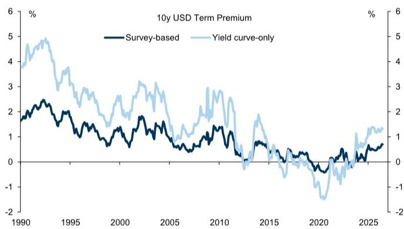

line chart

| Year | Survey-based | Yield curve-only |
|------|--------------|------------------|
| 1990 | ~1.8%        | ~4.5%            |
| 1995 | ~1.5%        | ~3.5%            |
| 2000 | ~1.2%        | ~2.5%            |
| 2005 | ~1.0%        | ~2.0%            |
| 2010 | ~0.8%        | ~1.5%            |
| 2015 | ~0.5%        | ~1.0%            |
| 2020 | ~-0.5%       | ~-1.5%           |
| 2025 | ~0.5%        | ~1.5%            |

Source: GS Global Investment Research, Consensus Economics, Haver Analytics, Federal Reserve Board

Exhibit 2: ... and also show relatively more stability  
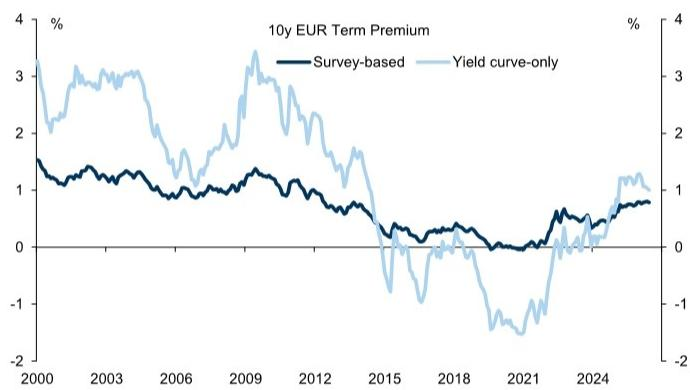

line chart

| Year | Survey-based | Yield curve-only |
|------|--------------|------------------|
| 2000 | ~1.5%        | ~3.5%            |
| 2003 | ~1.3%        | ~3.0%            |
| 2006 | ~1.2%        | ~2.5%            |
| 2009 | ~1.4%        | ~3.5%            |
| 2012 | ~1.0%        | ~2.0%            |
| 2015 | ~0.5%        | ~-1.0%           |
| 2018 | ~0.3%        | ~-1.5%           |
| 2021 | ~0.5%        | ~-1.8%           |
| 2024 | ~0.8%        | ~1.2%            |

Source: GS Global Investment Research, Consensus Economics, Haver Analytics, Bloomberg

The approach of these models is qualitatively similar. They use information from the current yield curve – and surveys in the case of the KW method – to project forward estimates of the short rate path. This then allows us to build a spot curve based on these projections, usually described as the risk neutral rate expectations path. Essentially, the difference between the observed yield curve and this path is the term premium estimate of the model. Our new estimates are shown in (Exhibit 1, Exhibit 2, Exhibit 3, and Exhibit 4) for G4, and Exhibit 5 for the smaller G10 markets, with full details on method, input data and estimates in the Appendix.

Exhibit 3: UK survey-based estimates are the lowest among the G4, indicating an important part comes from high rates expectations  
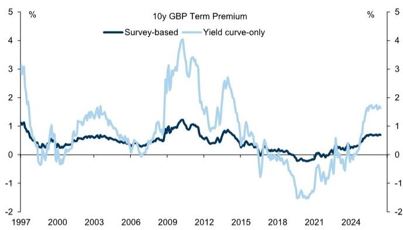

line chart

| Year | Survey-based | Yield curve-only |
|------|--------------|------------------|
| 1997 | ~1.0         | ~3.0             |
| 2000 | ~0.5         | ~0.0             |
| 2003 | ~0.8         | ~1.5             |
| 2006 | ~0.6         | ~0.5             |
| 2009 | ~1.2         | ~4.0             |
| 2012 | ~1.0         | ~3.5             |
| 2015 | ~0.8         | ~2.5             |
| 2018 | ~0.5         | ~-1.0            |
| 2021 | ~0.3         | ~-1.5            |
| 2024 | ~0.7         | ~1.8             |

Source: GS Global Investment Research, Consensus Economics, Haver Analytics, Bloomberg

Exhibit 4: Using surveys shows that the rise in JGBs is not only a term premium story  
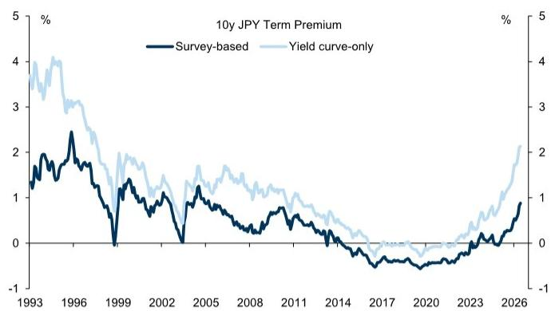

line chart

| Year | Survey-based | Yield curve-only |
|------|--------------|------------------|
| 1993 | ~1.5%        | ~4.0%            |
| 1996 | ~2.5%        | ~3.5%            |
| 1999 | ~0.0%        | ~2.0%            |
| 2002 | ~1.0%        | ~1.5%            |
| 2005 | ~1.5%        | ~1.8%            |
| 2008 | ~0.5%        | ~1.2%            |
| 2011 | ~0.8%        | ~1.0%            |
| 2014 | ~0.2%        | ~0.5%            |
| 2017 | ~-0.5%       | ~0.0%            |
| 2020 | ~-0.8%       | ~-0.2%           |
| 2023 | ~0.5%        | ~0.8%            |
| 2026 | ~1.0%        | ~2.0%            |

Source: GS Global Investment Research, Consensus Economics, Haver Analytics, Bloomberg

For most curves, our survey-based term premium estimates are lower and less volatile than the yield curve-only model. In the US, the survey-based approach estimates 10y term premium is 70bp, 40bp lower than the yield curve-only estimates. Similarly, in Europe the survey-based 10y term premium is around 15bp lower than yield curve-only estimates. The UK, which for most part of the last year had the highest term premium among the G4 (but has since been overtaken by Japan) by the yield curve-only estimates instead is showing the lowest level of term premium among peers on the survey-based estimates. The lower survey-based term premium therefore implies a higher rate expectation path for each market.

## Great Survey Expectations

In the yield-curve only estimates, expectations are inferred primarily from the information embedded in the yield curve itself. In the survey-based specification, survey data directly discipline the projections for the short rate. This matters because when surveys point to a lower-for-longer or a structural rise in the policy path, the survey-based model will attribute more of the shift in the level of long-dated yields to expected future short rates and less to term premium. The yield curve-only based estimates rely more heavily on the long-run mean as an anchor for rate expectations, making them considerably more sensitive to the estimation window. That results in less volatility in the survey-based term premium estimates versus the yield curve-only estimates (Exhibit 6).

Exhibit 5: Within some of the smaller G10 the level of term premium differs meaningfully depending on approach  
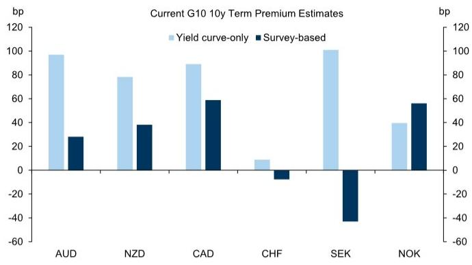

bar chart

Current G10 10y Term Premium Estimates
| Currency | Yield curve-only (bp) | Survey-based (bp) |
| :--- | :--- | :--- |
| AUD | 98 | 28 |
| NZD | 78 | 38 |
| CAD | 89 | 59 |
| CHF | 9 | -6 |
| SEK | 101 | -42 |
| NOK | 39 | 56 |

Source: GS Global Investment Research, Consensus Economics, Haver Analytics, Bloomberg

Exhibit 6: Our existing estimates of term premium are more volatile than survey-augmented estimates  
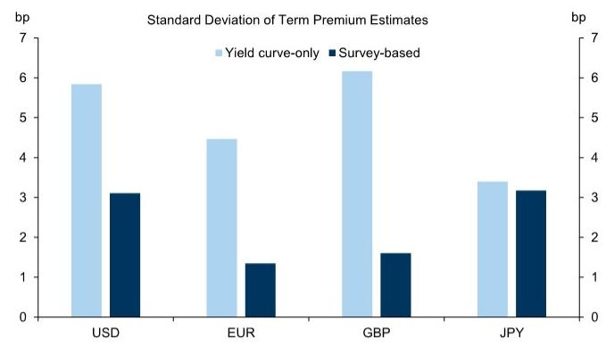

bar chart

Standard Deviation of Term Premium Estimates
| Currency Pair | Yield curve-only (bp) | Survey-based (bp) |
| :--- | :--- | :--- |
| USD | 5.8 | 3.1 |
| EUR | 4.4 | 1.4 |
| GBP | 6.1 | 1.6 |
| JPY | 3.4 | 3.2 |

Source: GS Global Investment Research

A recent illustration was the aftermath of the German debt brake reform in March 2025; the survey-based estimates reported a lower increase in term premium than the yield curve-only, as markets adjusted not just to higher bond supply, but also incorporated an upgraded growth outlook that justified a structurally higher path for real rates (Exhibit 7).

Exhibit 7: The debt brake removal might be a justification for higher real rates over time  
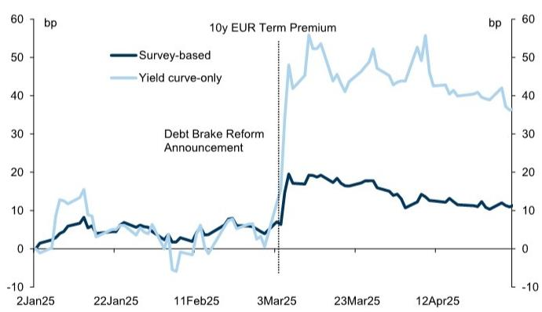

line chart

| Date     | Survey-based | Yield curve-only |
| -------- | ------------ | ---------------- |
| 2Jan25   | 0            | 0                |
| 22Jan25  | 5            | 15               |
| 11Feb25  | 5            | -5               |
| 3Mar25   | 10           | 40               |
| 23Mar25  | 15           | 50               |
| 12Apr25  | 10           | 40               |

Source: GS Global Investment Research

Exhibit 8: Including surveys suggests a larger role for rates expectations in the recent increase in JGB yields  

line chart

| Date    | Survey-based 10y JP rate expectations | Yield curve-only 10y JP rate expectations | Long-term survey JP short rate |
|---------|----------------------------------------|-------------------------------------------|--------------------------------|
| Dec-22  | -10                                    | 0                                         | 0                              |
| Jun-23  | -5                                     | 0                                         | -5                             |
| Dec-23  | 0                                      | 0                                         | 0                              |
| Jun-24  | 20                                     | 5                                         | 30                             |
| Dec-24  | 60                                     | 15                                        | 60                             |
| Jun-25  | 80                                     | 25                                        | 80                             |
| Dec-25  | 100                                    | 30                                        | 90                             |
| Jun-26  | 110                                    | 35                                        | 95                             |

Source: GS Global Investment Research, Consensus Economics

Another example of this is in Japan. Since 2023, surveyed policy rate projections have been rising alongside the convergence of longer-term inflation expectations towards $2\%$ . Market pricing of OIS swap rates have moved to similar or even higher levels on a two-to-five year horizon. At the same time, the JGB yield curve has steepened significantly alongside a shrinking BoJ balance sheet and the market repricing duration risk in Japan. The yield curve-only model attributes bear steepening to a rise in term premium—short rates are moving only gradually, and based on the prior history (especially in Japan) these models will usually not show a rise in future short rates without some clearer sign of rises in the near-term, too.

In contrast, our survey-based model shows a more substantial rise in rate expectations – and correspondingly a smaller rise in JGB term premium – given the surveyed expectations have risen substantially. (Exhibit 8).

## Survey-Based Estimates Capture Structural Shifts, but Yield Curve-Only Models Still Useful

The inclusion of surveys to estimate the expected short rate path is particularly helpful amid structural shifts in rate expectations that are less well picked up by yield curve models. We think that makes survey-augmented models more economically intuitive when judging the level of market expectations about future rates. At the same time, survey-based models can be slower to adjust to day-to-day changes in expectations given the lower frequency (usually monthly) of surveys – in the debt brake reform example above, that pickup in rate expectations became only visible once surveys for the month of March became available, with a notable delay.

We also find that the constraint imposed by the inclusion of surveys means that yield curve-only estimates tend to do a better job of predicting future excess returns to holding duration over the medium term (Exhibit 9 and Exhibit 10). This suggests that purely market-based term premium measures offer greater value for trading signals.

Exhibit 9: Term premium is typically a useful predictor of duration excess returns over medium horizons  
1y holding excess return of 10y UST vs term premium  
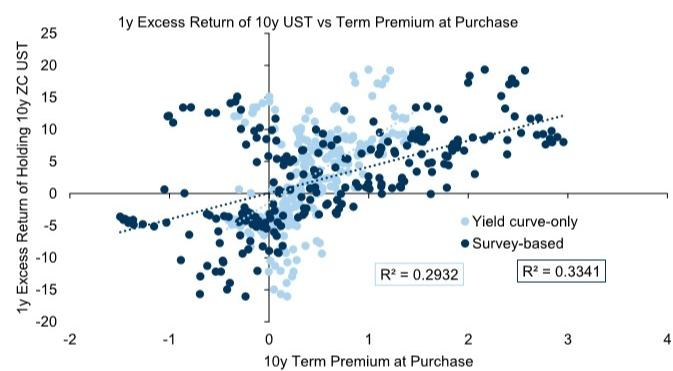

scatterplot

| 10y Term Premium at Purchase | 1y Excess Return of Holding 10y ZC UST |
| ---------------------------- | -------------------------------------- |
| -2                           | -5                                     |
| -1                           | 0                                      |
| 0                            | 5                                      |
| 1                            | 10                                     |
| 2                            | 15                                     |
| 3                            | 20                                     |
| 4                            | 25                                     |

Source: GS Global Investment Research, GS FICC and Equities

Exhibit 10: Yield curve-based (GS) approach better at predicting excess duration returns than survey-augmented estimates (KW)  
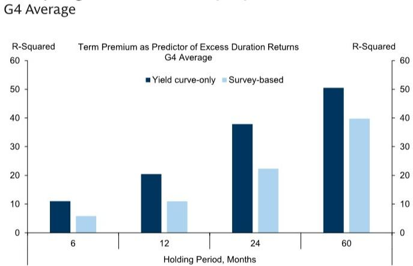

bar chart

G4 Average
| Holding Period, Months | Yield curve-only | Survey-based |
|---|---|---|
| 6 | 11 | 5 |
| 12 | 20 | 11 |
| 24 | 38 | 22 |
| 60 | 50 | 40 |
R-Squared Term Premium as Predictor of Excess Duration Returns G4 Average R-Squared

Source: GS Global Investment Research, GS FICC and Equities

The different approaches also show different responses to yield changes: for any given shock to the level of rates, the yield curve-only approach will result in a greater response in term premium than the survey-based estimates. The same holds true for a given steepening of the curve (Exhibit 11). Shifts in the curvature have no notable difference in impact on the different models. That helps to assess the relative behavior during rate shocks.

Exhibit 11: Yield curve models only show more responsiveness to shifts in level and slope Term premium sensitivity (in pp) to a 1-standard deviation change in PC1 and 2  
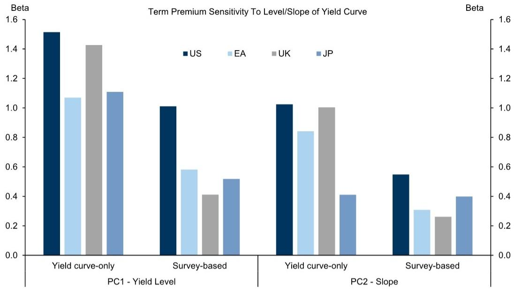

bar chart

| Scenario | Yield Curve Only | Survey-Based | Yield Curve Only | Survey-Based |
| --- | --- | --- | --- | --- |
| PC1 - Yield Level | 1.52 | 1.01 | 1.03 | 0.55 |
| PC2 - Slope | 1.43 | 1.11 | 1.03 | 0.31 |
| PC1 - Yield Level | 1.07 | 0.58 | 0.85 | 0.31 |
| PC2 - Slope | 1.43 | 0.52 | 1.01 | 0.27 |
| PC1 - Yield Level | 1.11 | 0.52 | 0.85 | 0.40 |
| PC2 - Slope | 1.11 | 0.52 | 0.85 | 0.40 |

Source: GS Global Investment Research

## Term Premium Still High Regardless of Estimate

Although there are key level differences between the survey-based and yield curve-only term premium estimates, we would not emphasise the precise level of either model's output. In our view, the value of these term premium estimates is to isolate drivers of movements in interest rates, and better understand the drivers of term premium. Currently, almost all models in all curves show that term premia have risen and sit near local highs, even as the precise levels vary. This implies only modest rises in rate expectations in most markets. The exceptions are Australia, the UK and Japan, which have seen sharper increases in rate expectations especially in the survey-based estimates.

However, the rise in G10 term premium in recent years does reflect changes in these key macro drivers over the same period, namely cyclical risk, the rise in inflation risk, the rise in the level and volatility of interest rates, high bond supply and a reversal of central bank balance sheet expansion (Exhibit 12 and Exhibit 13). While elevated bond supply may still be contributing to higher term premium, recent swap spread widening points to macro explanations around growth, inflation and fiscal risks rather than just bond-specific weakness. In recent years we have found that term premium has remained elevated despite a decline in rates volatility – this high premium, low volatility combination points to a structural rise in duration risk premium beyond (counter)cyclical fluctuations, which typically affect term premium variation. In upcoming research we will dive deeper into the drivers and valuation of G10 term premium, using and expanding our existing suite of valuation frameworks.

Exhibit 12: G4 term premium has risen alongside shrinking central bank balance sheets  
Average of yield curve-only and survey-based term premium across G4 (GDP weighted) and average central bank holdings (GDP weighted)  

line chart

| Year | Average G4 term premium (bp) | Average central bank holdings (%GDP) |
|------|------------------------------|----------------------------------------|
| 2006 | ~110                         | ~18                                    |
| 2008 | ~180                         | ~19                                    |
| 2010 | ~200                         | ~18                                    |
| 2012 | ~150                         | ~15                                    |
| 2014 | ~130                         | ~12                                    |
| 2016 | ~-30                         | ~8                                     |
| 2018 | ~-50                         | ~5                                     |
| 2020 | ~-80                         | ~35                                    |
| 2022 | ~-50                         | ~35                                    |
| 2024 | ~70                          | ~45                                    |
| 2026 | ~100                         | ~55                                    |

Source: GS Global Investment Research, Haver Analytics

Exhibit 13: The recent decline in implied volatility has not yet been reflected in lower term premium  
Average of yield curve-only and survey-based term premium across G4 (GDP weighted) and average implied vol (GDP weighted)  
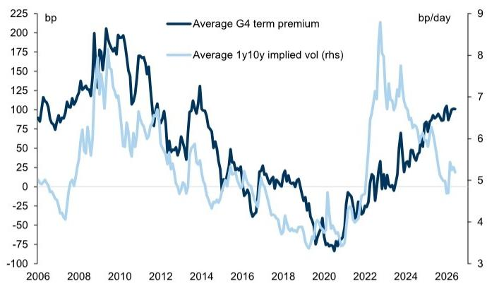

line chart

| Year | Average G4 term premium (bp) | Average 1y10y implied vol (rhs) |
|------|------------------------------|----------------------------------|
| 2006 | ~100                         | ~5                               |
| 2008 | ~150                         | ~7                               |
| 2010 | ~200                         | ~6                               |
| 2012 | ~100                         | ~5                               |
| 2014 | ~150                         | ~4                               |
| 2016 | ~50                          | ~3                               |
| 2018 | ~0                           | ~4                               |
| 2020 | ~-75                         | ~3                               |
| 2022 | ~-50                         | ~7                               |
| 2024 | ~75                          | ~6                               |
| 2026 | ~100                         | ~5                               |

Source: GS Global Investment Research, GS FICC and Equities

## Appendix

We complement our current yield curve-only term premium model with a Kim-Wright-style model with surveys. Both models sit within the Gaussian affine class but differ on how the expectations component of long-dated yields is identified.

## JSZ & ACM yield curve-only models

Our existing model is a no-arbitrage affine term structure model estimated from the cross-section of zero-coupon yields, based on the Joslin, Singleton and Zhu (JZS) method. A set of three latent yield-curve factors is used to fit the curve and to model the evolution of expected short rates, allowing long-dated yields to be decomposed into an expectations component and a residual term premium.

Rather than estimating by maximum likelihood from the cross-section of yields as per our baseline model, the ACM model identifies the price of duration risk directly from realised excess bond returns. As these returns are generated from the yield curve itself, the information set remains the same, and so despite the different economic presentation, the results between our baseline and ACM models are very similar.

## Kim-Wright survey-based model (KW)

The Kim-Wright-style model is also an affine term structure model but adds survey information to help identify the expected path of short rates. Survey forecasts provide additional, less noisy information about the expected path of short rates and help discipline this part of the model.

The model uses a Gaussian affine term structure model with three unobserved latent factors $X_{t}$ which follow a VAR (1) under the physical measure:

$$
X _ {t + 1} = \mu + \Phi X _ {t} + \Sigma \varepsilon_ {t + 1}
$$

The corresponding risk-neutral dynamics are governed by $(\mu^{\mathrm{o}},\Phi^{\mathrm{o}})$ and the short rate is

affine in the factors like the ACM and the baseline model:

$$
r _ {t} = \delta_ {0} + \delta_ {1} ^ {\prime} X _ {t}
$$

Model implied zero-coupon yields are obtained from the standard affine no-arbitrage recursion, where the loadings are functions of the risk-neutral dynamics, the shock covariance matrix and the short rate parameters $(\mu^{\mathrm{Q}},\Phi^{\mathrm{Q}},\Sigma ,\delta_{0},\delta_{1})$ . Relative to the baseline, where the only observation equations link the latent factors to the observed yield curve, Kim-Wright augments the observation vector with survey forecasts of the short rate.

$$
\binom{y _ {t} ^ {(n)}}{s _ {t} ^ {(h)}} = \binom{O b s e r v e d y i e l d s _ {t}}{S u r v e y s _ {t}} = \binom{A _ {n} + B _ {n} ^ {\prime} X _ {t} + \eta_ {t} ^ {(n)}}{E _ {t} ^ {p} [ r _ {t + h} ] + \eta_ {t} ^ {(h)}}
$$

The survey row comes from treating a survey forecast of the 3-month rate h-months ahead as a noisy observation of the model-implied expected short rate at that horizon:

$$
E _ {t} ^ {P} [ r _ {t + h} ] = \delta_ {0} + \delta_ {1} ^ {\prime} E _ {t} ^ {P} [ X _ {t + h} ]
$$

Because the state follows a VAR (1) under the physical measure, the expected future state is:

$$
E _ {t} ^ {p} \left[ X _ {t + h} \right] = \Phi^ {h} X _ {t} + \sum_ {j = 0} ^ {h - 1} \Phi^ {j} \mu
$$

Combining these two expressions gives the survey-observation equation:

$$
s _ {t} ^ {(h)} = \delta_ {0} + \delta_ {1} ^ {\prime} \left(\Phi^ {h} X _ {t} + \sum_ {j = 0} ^ {h - 1} \Phi^ {j} \mu\right) + \eta_ {t} ^ {(h)}
$$

The yield rows are affine pricing equations, while the survey rows are noisy observations of expected future short rates under the physical dynamics. For the long-horizon survey, the model maps the expected average 3-month rate over the relevant window into the survey observation. In practice, this anchors the persistent component of expected short rates while allowing for survey measurement error.

In our G10 implementation, the yield panel uses fitted monthly zero-coupon yields from 3M to 10Y. Survey inputs are Consensus Economics forecasts of the 3-month rate at short horizons (3m ahead and 1y ahead), plus the quarterly 6–10y average of long-horizon 3-month-rate forecasts where available. Surveys are included only when observed.

Estimation is carried out by maximum likelihood with a Kalman filter on the joint observation vector of yields and available survey forecasts. Once the parameters are estimated, the decomposition is the same as in the baseline model. The fitted yield is generated from the risk-neutral affine recursion, while the expectations component is the average expected future short rate under the physical dynamics:

$$
T P _ {t} ^ {(n)} = y _ {t} ^ {(n)} - \frac {1}{n} \sum_ {j = 0} ^ {n - 1} E _ {t} ^ {p} [ r _ {t + j} ]
$$

Daily estimates are obtained by extracting daily factors from daily yields using the estimated affine loadings and then applying the estimated model parameters to those daily factors.

## Global Interest Rate Strategy

## George Cole

+44(20)7552-1214

george.cole@gs.com

GS International

## William Marshall

+1(212)357-0413

william.c.marshall@gs.com

GS & Co. LLC

## Simon Freycenet

+44(20)7774-5017

simon.freycenet@gs.com

GS Bank Europe SE - Paris

Branch

## Isabella Rosenberg

+1(212)357-7628

isabella.rosenberg@gs.com

GS & Co. LLC

## Friedrich Schaper

+1(917)343-3214

friedrich.schaper@gs.com

GS & Co. LLC

## Loic Mathys

+44(20)7051-1664

loic.mathys@gs.com

GS International

## Disclosure Appendix

## Reg AC

We, Loic Mathys, Friedrich Schaper, George Cole and William Marshall, hereby certify that all of the views expressed in this report accurately reflect our personal views, which have not been influenced by considerations of the firm's business or client relationships.

Unless otherwise stated, the individuals listed on the cover page of this report are analysts in GS' Global Investment Research division.

Contributing Authors: Loic Mathys GS International, Friedrich Schaper GS & Co. LLC, George Cole GS International, William Marshall GS & Co. LLC.

Unless otherwise stated, the individuals listed in the Contributing Authors disclosure of this report are analysts in GS' Global Investment Research division.

## Disclosures

## Regulatory disclosures

## Disclosures required by United States laws and regulations

See company-specific regulatory disclosures above for any of the following disclosures required as to companies referred to in this report: manager or co-manager in a pending transaction; $1\%$ or other ownership; compensation for certain services; types of client relationships; managed/co-managed public offerings in prior periods; directorships; for equity securities, market making and/or specialist role. GS trades or may trade as a principal in debt securities (or in related derivatives) of issuers discussed in this report.

The following are additional required disclosures: Ownership and material conflicts of interest: GS policy prohibits its analysts, professionals reporting to analysts and members of their households from owning securities of any company in the analyst's area of coverage. Analyst compensation: Analysts are paid in part based on the profitability of GS, which includes investment banking revenues. Analyst as officer or director: GS policy generally prohibits its analysts, persons reporting to analysts or members of their households from serving as an officer, director or advisor of any company in the analyst's area of coverage. Non-U.S. Analysts: Non-U.S. analysts may not be associated persons of GS & Co. LLC and therefore may not be subject to FINRA Rule 2241 or FINRA Rule 2242 restrictions on communications with a subject company, public appearances and trading in securities covered by the analysts.

## Additional disclosures required under the laws and regulations of jurisdictions other than the United States

The following disclosures are those required by the jurisdiction indicated, except to the extent already made above pursuant to United States laws and regulations. Australia: GS Australia Pty Ltd and its affiliates are not authorised deposit-taking institutions (as that term is defined in the Banking Act 1959 (Cth)) in Australia and do not provide banking services, nor carry on a banking business, in Australia. This research, and any access to it, is intended only for “wholesale clients” within the meaning of the Australian Corporations Act, unless otherwise agreed by GS. In producing research reports, members of Global Investment Research of GS Australia may attend site visits and other meetings hosted by the companies and other entities which are the subject of its research reports. In some instances the costs of such site visits or meetings may be met in part or in whole by the issuers concerned if GS Australia considers it is appropriate and reasonable in the specific circumstances relating to the site visit or meeting. To the extent that the contents of this document contains any financial product advice, it is general advice only and has been prepared by GS without taking into account a client’s objectives, financial situation or needs. A client should, before acting on any such advice, consider the appropriateness of the advice having regard to the client’s own objectives, financial situation and needs. A copy of certain GS Australia and New Zealand disclosure of interests and a copy of GS’ Australian Sell-Side Research Independence Policy Statement are available at: https://www.goldmansachs.com/disclosures/australia-new-zealand/index.html. Brazil: Disclosure information in relation to CVM Resolution n. 20 is available at https://www.gs.com/worldwide/brazil/area/gir/index.html. Where applicable, the Brazil-registered analyst primarily responsible for the content of this research report, as defined in Article 20 of CVM Resolution n. 20, is the first author named at the beginning of this report, unless indicated otherwise at the end of the text. Canada: This information is being provided to you for information purposes only and is not, and under no circumstances should be construed as, an advertisement, offering or solicitation by GS & Co. LLC for purchasers of securities in Canada to trade in any Canadian security. GS & Co. LLC is not registered as a dealer in any jurisdiction in Canada under applicable Canadian securities laws and generally is not permitted to trade in Canadian securities and may be prohibited from selling certain securities and products in certain jurisdictions in Canada. If you wish to trade in any Canadian securities or other products in Canada please contact GS Canada Inc., an affiliate of The GS Group Inc., or another registered Canadian dealer. Hong Kong: Further information on the securities of covered companies referred to in this research may be obtained on request from GS (Asia) L.L.C. India: Further information on the subject company or companies referred to in this research may be obtained from GS (India) Securities Private Limited, Research Analyst - SEBI Registration Number INH000001493, 10th Floor, Ascent-Worli, Sudam Kalu Ahire Marg, Worli, Mumbai-400 025, India, Corporate Identity Number U74140MH2006FTC160634, Phone +91 22 6616 9000, Fax +91 22 6616 9001. GS may beneficially own 1% or more of the securities (as such term is defined in clause 2 (h) the Indian Securities Contracts (Regulation) Act, 1956) of the subject company or companies referred to in this research report. Investment in securities market are subject to market risks. Read all the related documents carefully before investing. Registration granted by SEBI and certification from NISM in no way guarantee performance of the intermediary or provide any assurance of returns to investors. GS (India) Securities Private Limited compliance officer and investor grievance contact details can be found at: https://www.goldmansachs.com/worldwide/india/documents/Grievance-Redressal-and-Escalation-Matrix.pdf, and a copy of the annual audit compliance report can be found at this link: https://publishing.gs.com/content/site/india-annual-compliance-report.html. Japan: See below. Korea: This research, and any access to it, is intended only for “professional investors” within the meaning of the Financial Services and Capital Markets Act, unless otherwise agreed by GS. Further information on the subject company or companies referred to in this research may be obtained from GS (Asia) L.L.C., Seoul Branch. New Zealand: GS New Zealand Limited and its affiliates are neither “registered banks” nor “deposit takers” (as defined in the Reserve Bank of New Zealand Act 1989) in New Zealand. This research, and any access to it, is intended for “wholesale clients” (as defined in the Financial Advisers Act 2008) unless otherwise agreed by GS. A copy of certain GS Australia and New Zealand disclosure of interests is available at: https://www.goldmansachs.com/disclosures/australia-new-zealand/index.html. Russia: Research reports distributed in the Russian Federation are not advertising as defined in the Russian legislation, but are information and analysis not having product promotion as their main purpose and do not provide appraisal within the meaning of the Russian legislation on appraisal activity. Research reports do not constitute a personalized investment recommendation as defined in Russian laws and regulations, are not addressed to a specific client, and are prepared without analyzing the financial circumstances, investment profiles or risk profiles of clients. GS assumes no responsibility for any investment decisions that may be taken by a client or any other person based on this research report. Singapore: GS (Singapore) Pte. (Company Number: 198602165W), which is regulated by the Monetary Authority of Singapore, accepts legal responsibility for this research, and should be contacted with respect to any matters arising from, or in connection with, this research. Taiwan: This material is for reference only and must not be reprinted without permission. Investors should carefully consider their own investment risk. Investment results are the responsibility of the individual investor. United Kingdom: Persons who would be categorized as retail clients in the United Kingdom, as such term is

defined in the rules of the Financial Conduct Authority, should read this research in conjunction with prior GS on the covered companies referred to herein and should refer to the risk warnings that have been sent to them by GS International. A copy of these risks warnings, and a glossary of certain financial terms used in this report, are available from GS International on request.

European Union and United Kingdom: Disclosure information in relation to Article 6 (2) of the European Commission Delegated Regulation (EU) (2016/958) supplementing Regulation (EU) No 596/2014 of the European Parliament and of the Council (including as that Delegated Regulation is implemented into United Kingdom domestic law and regulation following the United Kingdom's departure from the European Union and the European Economic Area) with regard to regulatory technical standards for the technical arrangements for objective presentation of investment recommendations or other information recommending or suggesting an investment strategy and for disclosure of particular interests or indications of conflicts of interest is available at https://www.gs.com/disclosures/europeanpolicy.html which states the European Policy for Managing Conflicts of Interest in Connection with Investment Research.

Japan: GS Japan Co., Ltd. is a Financial Instrument Dealer registered with the Kanto Financial Bureau under registration number Kinsho 69, and a member of Japan Securities Dealers Association, Financial Futures Association of Japan Type II Financial Instruments Firms Association, and Investment Management Association of Japan. Sales and purchase of equities are subject to commission pre-determined with clients plus consumption tax. See company-specific disclosures as to any applicable disclosures required by Japanese stock exchanges, the Japanese Securities Dealers Association or the Japanese Securities Finance Company.

## Global product; distributing entities

GS Global Investment Research produces and distributes research products for clients of GS on a global basis. Analysts based in GS offices around the world produce research on industries and companies, and research on macroeconomics, currencies, commodities and portfolio strategy. This research is disseminated in Australia by GS Australia Pty Ltd (ABN 21 006 797 897); in Brazil by GS do Brasil Corretora de Títulos e Valores Mobiliários S.A.; Public Communication Channel GS Brazil: 0800 727 5764 and / or contatogoldmanbrasil@gs.com. Available Weekdays (except holidays), from 9am to 6pm. Canal de Comunicação com o Público GS Brasil: 0800 727 5764 e/ou contatogoldmanbrasil@gs.com. Horário de funcionamento: segunda-feira à sexta-feira (exceto feriados), das 9h às 18h; in Canada by GS & Co. LLC; in Hong Kong by GS (Asia) L.L.C.; in India by GS (India) Securities Private Ltd.; in Japan by GS Japan Co., Ltd.; in the Republic of Korea by GS (Asia) L.L.C., Seoul Branch; in New Zealand by GS New Zealand Limited; in Russia by OOO GS; in Singapore by GS (Singapore) Pte. (Company Number: 198602165W); and in the United States of America by GS & Co. LLC. GS International has approved this research in connection with its distribution in the United Kingdom.

GS International ("GSI"), authorised by the Prudential Regulation Authority ("PRA") and regulated by the Financial Conduct Authority ("FCA") and the PRA, has approved this research in connection with its distribution in the United Kingdom.

European Economic Area: GS Bank Europe SE ("GSBE") is a credit institution incorporated in Germany and, within the Single Supervisory Mechanism, subject to direct prudential supervision by the European Central Bank and in other respects supervised by German Federal Financial Supervisory Authority (Bundesanstalt für Finanzdienstleistungsaufsicht, BaFin) and Deutsche Bundesbank and disseminates research within the European Economic Area.

## General disclosures

This research is for our clients only. Other than disclosures relating to GS, this research is based on current public information that we consider reliable, but we do not represent it is accurate or complete, and it should not be relied on as such. The information, opinions, estimates and forecasts contained herein are as of the date hereof and are subject to change without prior notification. We seek to update our research as appropriate, but various regulations may prevent us from doing so. Other than certain industry reports published on a periodic basis, the large majority of reports are published at irregular intervals as appropriate in the analyst's judgment.

GS conducts a global full-service, integrated investment banking, investment management, and brokerage business. We have investment banking and other business relationships with a substantial percentage of the companies covered by Global Investment Research. GS & Co. LLC, the United States broker dealer, is a member of SIPC (https://www.sipc.org).

Our salespeople, traders, and other professionals may provide oral or written market commentary or trading strategies to our clients and principal trading desks that reflect opinions that are contrary to the opinions expressed in this research. Our asset management area, principal trading desks and investing businesses may make investment decisions that are inconsistent with the recommendations or views expressed in this research.

We and our affiliates, officers, directors, and employees will from time to time have long or short positions in, act as principal in, and buy or sell, the securities or derivatives, if any, referred to in this research, unless otherwise prohibited by regulation or GS policy.

The views attributed to third party presenters at GS arranged conferences, including individuals from other parts of GS, do not necessarily reflect those of Global Investment Research and are not an official view of GS.

Any third party referenced herein, including any salespeople, traders and other professionals or members of their household, may have positions in the products mentioned that are inconsistent with the views expressed by analysts named in this report.

This research is focused on investment themes across markets, industries and sectors. It does not attempt to distinguish between the prospects or performance of, or provide analysis of, individual companies within any industry or sector we describe.

Any trading recommendation in this research relating to an equity or credit security or securities within an industry or sector is reflective of the investment theme being discussed and is not a recommendation of any such security in isolation.

This research is not an offer to sell or the solicitation of an offer to buy any security in any jurisdiction where such an offer or solicitation would be illegal. It does not constitute a personal recommendation or take into account the particular investment objectives, financial situations, or needs of individual clients. Clients should consider whether any advice or recommendation in this research is suitable for their particular circumstances and, if appropriate, seek professional advice, including tax advice. The price and value of investments referred to in this research and the income from them may fluctuate. Past performance is not a guide to future performance, future returns are not guaranteed, and a loss of original capital may occur. Fluctuations in exchange rates could have adverse effects on the value or price of, or income derived from, certain investments.

Certain transactions, including those involving futures, options, and other derivatives, give rise to substantial risk and are not suitable for all investors. Investors should review current options and futures disclosure documents which are available from GS sales representatives or at https://www.theocc.com/about/publications/character-risks.jsp and https://www.goldmansachs.com/disclosures/cftc\_fcm\_disclosures. Transaction costs may be significant in option strategies calling for multiple purchase and sales of options such as spreads. Supporting documentation will be supplied upon request.

Differing Levels of Service provided by Global Investment Research: The level and types of services provided to you by GS Global Investment Research may vary as compared to that provided to internal and other external clients of GS, depending on various factors including your individual preferences as to the frequency and manner of receiving communication, your risk profile and investment focus and perspective (e.g., marketwide, sector specific, long term, short term), the size and scope of your overall client relationship with GS, and legal and regulatory constraints. As an example, certain clients may request to receive notifications when research on specific securities is published, and certain clients may request that specific data underlying analysts' fundamental analysis available on our internal client websites be delivered to them electronically through data feeds or otherwise. No change to an analyst's fundamental research views (e.g., ratings, price targets, or material changes to earnings estimates for equity securities), will be communicated to any client prior to inclusion of such information in a research report broadly disseminated through electronic publication to our internal client websites or through other means, as necessary, to all clients who are entitled to receive such reports.

All research reports are disseminated and available to all clients simultaneously through electronic publication to our internal client websites. Not all research content is redistributed to our clients or available to third-party aggregators, nor is GS responsible for the redistribution of our research by third party aggregators. For research, models or other data related to one or more securities, markets or asset classes (including related services) that may be available to you, please contact your GS representative or go to https://research.gs.com.

Disclosure information is also available at https://www.gs.com/research/hedge.html or from Research Compliance, 200 West Street, New York, NY 10282.

## © 2026 GS.

You are permitted to store, display, analyze, modify, reformat, and print the information made available to you via this service only for your own use. You may not resell or reverse engineer this information to calculate or develop any index for disclosure and/or marketing or create any other derivative works or commercial product(s), data or offering(s) without the express written consent of GS. You are not permitted to publish, transmit, or otherwise reproduce this information, in whole or in part, in any format to any third party without the express written consent of GS. This foregoing restriction includes, without limitation, using, extracting, downloading or retrieving this information, in whole or in part, to train or finetune a machine learning or artificial intelligence system, or to provide or reproduce this information, in whole or in part, as a prompt or input to any such system.