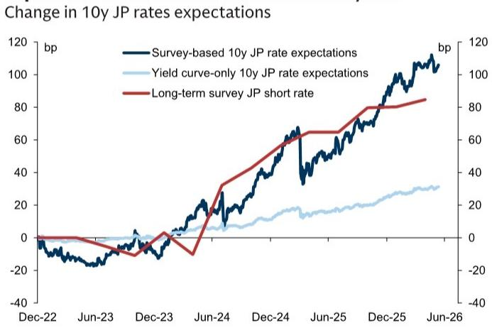
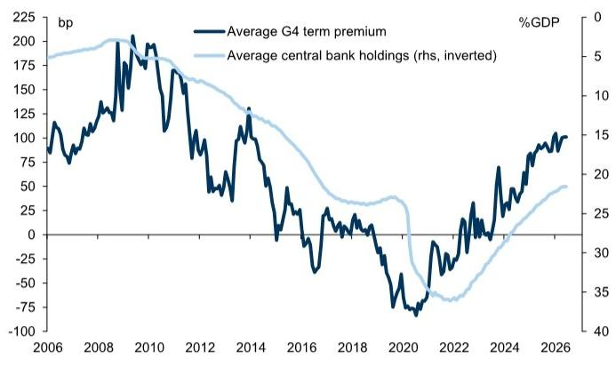

# GS：市场真正低估的不是期限溢价的水平，而是它为何不再回落

过去两年，全球债券市场一直在争论一个核心问题：长端利率的抬升，究竟是因为市场预期未来短期利率会结构性走高，还是因为投资者要求更高的“期限溢价”来补偿持有长期债券的风险？这不仅仅是学术争论。它直接决定了你的组合应该配置长债还是短债、是押注利率下行还是接受一个更高的中性利率环境。

GS在最新发布的G10期限溢价更新报告中，给出了一个比以往更锐利的分析框架。报告的核心判断不是“期限溢价现在有多高”，而是：**传统基于收益率曲线推算的期限溢价模型，可能正在系统性高估当前实际期限溢价水平，因为它没能区分“结构性利率预期上移”和“周期性风险定价”**。

这份报告的意义在于，它提供了一个更精确的“拆解工具”，帮助投资者判断当前债券市场定价中，哪些是可持续的结构性变化，哪些是可能均值回归的周期性溢价。对于任何管理利率风险的决策者来说，这可能是今年最重要的分析框架更新之一。

## 1. 两种模型，两种世界观：一个高估风险，一个低估趋势

GS此次的核心贡献，是同时发布了两种期限溢价估算结果，并系统对比了它们的差异。

第一种是传统的“纯收益率曲线模型”（类似经典的ACM模型）。它只利用当前收益率曲线的形状来推断市场对未来短期利率的预期，然后将剩余部分归为期限溢价。这种模型的优点是实时性强、对市场情绪变化敏感，但缺点也很明显：它高度依赖历史均值作为长期利率预期的锚点。当经济发生结构性转变时，比如央行政策框架变化或通胀中枢上移，这种模型会倾向于把大部分收益率曲线陡峭化解释为期限溢价上升，而不是利率预期的结构性调整。

第二种是“基于调查的模型”（类似Kim-Wright方法）。它引入经济学家和交易员的短期利率预期调查数据，直接约束模型对未来利率路径的推算。这种模型的优势在于，当调查显示市场预期政策利率将结构性走高时，模型会自然地将更多长端收益率上升归因于利率预期变化，而非期限溢价。

两种模型在全球主要市场的估算结果差异显著。以美国为例，纯收益率曲线模型估算的10年期期限溢价约为110个基点，而调查模型给出的数字仅为70个基点，相差40个基点。在欧洲，这一差距约为15个基点。英国的情况更为极端：纯收益率曲线模型曾一度显示G4国家中最高的期限溢价，但调查模型却将其评为G4中最低的水平。

这意味着什么？**如果调查模型更接近现实，那么当前债券市场实际上是在定价一个比传统模型所显示的要高得多的未来利率路径，而不是在定价一个异常高的风险补偿。** 这对于判断长端收益率是否“超调”以及未来是否均值回归，有着根本性的不同含义。

## 2. 日本案例：一个几乎完美的“模型分岔”实验

日本市场是理解两种模型差异的最佳实验室，也是这份报告最有力的论据之一。

自2023年以来，日本调查数据中的政策利率预测持续上升，同时长期通胀预期向2%收敛。日本国债收益率曲线显著陡峭化，伴随着日本央行资产负债表收缩和市场对久期风险的重新定价。传统收益率曲线模型会如何解读？它认为短期利率变动缓慢，基于日本长期低利率的历史锚点，模型很难在没有近期加息明确信号的情况下推高远期利率预期。因此，它把大部分收益率曲线陡峭化归因为期限溢价上升。

但调查模型给出了完全不同的答案。调查数据显示，市场参与者对日本未来2-5年的政策利率预期已经大幅上修。调查模型因此将JGB收益率上升的更大部分归因于利率预期的结构性抬升，而期限溢价的上升幅度则小得多。

GS的报告明确指出，日本是“调查模型优势的清晰例证”。**如果投资者仅依赖纯收益率曲线模型，他们可能会错误地认为日本债券市场正在为“风险”定价，而实际上市场正在为“利率正常化”定价。** 这两种解读对应的交易策略截然相反：前者可能建议做空长端JGB以对冲风险溢价回归，后者则可能建议做陡曲线以押注利率路径进一步上修。

这个案例对所有关注日本市场的投资者都有直接含义：日本央行退出宽松后的债券市场定价，可能并没有看起来那么“贵”，因为其中很大一部分是利率预期在追赶现实。

## 3. 两种模型各有用处：一个是更好的“温度计”，一个是更好的“指南针”

GS并没有简单地宣称调查模型优于纯收益率模型。相反，报告严谨地指出了两者各自的优势场景，这恰恰是顶级研究机构的价值所在。

调查模型的优势在于识别结构性转变。当经济经历体制变革时，比如财政政策框架调整（如德国债务刹车改革）、央行目标体系变化（如日本通胀目标的可信度提升），调查数据能更及时地捕捉到市场参与者预期的系统性调整。GS以2025年3月德国债务刹车改革为例：改革后，调查模型显示的期限溢价上升幅度远小于纯收益率曲线模型，因为市场不仅调整了对债券供给的预期，还纳入了增长前景改善带来的实际利率结构性上移。

但纯收益率曲线模型并非没有价值。报告发现，在预测未来中长期持有久期的超额回报方面，纯收益率曲线模型表现更好。这意味着，**如果投资者的目标是交易信号和短期择时，纯收益率曲线模型提供的期限溢价估计更有用；如果目标是理解市场定价的长期结构和经济含义，调查模型更可靠。**

两种模型对收益率冲击的敏感性也不同。对于给定的利率水平冲击或曲线陡峭化冲击，纯收益率曲线模型的期限溢价反应幅度更大，而调查模型的反应更温和。这有助于投资者在利率波动加剧时，判断市场定价中有多少是“情绪”的过度反应，有多少是“基本面”的合理调整。

## 4. 一个尚未被充分回答的问题：期限溢价为何在波动率下降后仍然高企？

尽管两种模型在具体水平上存在分歧，但它们在一个关键判断上达成一致：无论用哪种方法衡量，G10国家的期限溢价在过去几年都显著上升，并处于历史区间的较高位置。

GS指出，这种上升与几个宏观驱动因素同步发生：周期性风险上升、通胀风险加剧、利率水平和波动率提高、债券供给增加以及央行资产负债表收缩。但报告也揭示了一个值得深思的现象：**近年来，期限溢价在利率波动率下降后仍然保持高位。** 这种“高溢价、低波动”的组合，暗示着可能存在一种超越周期性波动的结构性期限溢价上升。

传统上，期限溢价具有很强的周期性：经济衰退时，避险需求推低期限溢价甚至使其转负；经济扩张时，风险偏好上升推高期限溢价。但当前的情况似乎不同：即使波动率回落，投资者仍然要求更高的补偿来持有长期债券。GS将此归因于“结构性久期风险溢价”的上升，但报告并未完全解释这种结构性变化的来源。

这引出了一个关键问题：这种结构性溢价是否会持续？如果它主要源于财政可持续性担忧和央行不再充当“最后买家”，那么它可能不会轻易消退。但如果它只是对过去几年极端低利率环境的滞后修正，那么随着市场适应新常态，溢价可能逐步回落。GS表示将在后续研究中深入探讨这一主题，这恰恰是当前框架未能完全回答的问题。

## 5. 投资者的观察框架：如何利用这份报告校准你的利率观点

基于GS提供的分析框架，投资者可以建立一个三层观察体系来评估当前债券市场的定价合理性。

第一层是“水平比较”。不要只看单一模型的期限溢价绝对值。同时查看纯收益率曲线模型和调查模型的结果。如果两者差距显著扩大，通常意味着市场正在经历利率预期的结构性转变，而非单纯的风险定价变化。当前，美国、欧洲和英国的两模型差距均处于历史较高水平，提示投资者应更关注利率路径本身而非期限溢价。

第二层是“驱动因素拆解”。当长端收益率出现大幅波动时，利用两种模型的反向计算，可以分解出多少来自利率预期变化、多少来自期限溢价变化。例如，如果收益率上升但调查模型显示的期限溢价变化很小，那么这种上升更可能是可持续的利率预期上修。反之，如果纯收益率曲线模型显示出期限溢价大幅飙升，而调查模型相对稳定，那么这可能是一个短期交易机会——期限溢价可能在未来均值回归。

第三层是“交叉验证宏观叙事”。将两种模型的输出与宏观基本面进行对照。如果调查模型显示利率预期上升，但经济增长和通胀数据并未支持，那么调查数据可能存在系统性偏差。反之，如果纯收益率曲线模型显示期限溢价高企，但财政风险和供给压力并未恶化，那么模型可能过度依赖历史锚点。

## 6. 报告没有完全回答的问题：结构性溢价何时会均值回归？

GS这份报告最大的价值，是提供了一个更精确的“诊断工具”，但它并没有给出“治疗方案”。报告承认，当前期限溢价高企与多个宏观因素相关，但并未量化每个因素的贡献权重，也没有给出期限溢价未来路径的预测。

具体而言，以下几个问题仍待解答：

第一，结构性期限溢价的驱动因素中，哪些是可逆的？央行缩表的影响是暂时的，但财政赤字的结构性扩大可能是长期的。这两种因素对期限溢价的影响路径和持续时间截然不同。

第二，调查数据本身是否存在偏差？调查预期往往滞后于市场定价，且在经济转折点可能系统性低估变化幅度。如果调查数据也未能完全捕捉到利率预期的上移，那么调查模型可能仍然低估了真实的利率预期，从而高估了期限溢价。

第三，不同国家的期限溢价差异意味着什么？报告显示，澳大利亚和新西兰的纯收益率曲线模型期限溢价远高于调查模型，而瑞典和挪威的情况则相反。这些差异是否反映了各国央行信誉、财政状况或经济结构的根本不同？目前尚不清楚。

这些问题恰恰是深入理解当前债券市场定价的关键。GS表示将在后续研究中进一步探讨期限溢价的驱动因素和估值，但现有的框架已经为投资者提供了一个远胜于“单模型盲测”的分析起点。

---

期限溢价不是一个静态的数字，而是一个不断变化的定价信号。GS这份报告提醒我们，当市场发生结构性转变时，依赖单一模型的投资者可能会得出错误的结论。真正的洞察，往往来自于对模型假设和局限性的深刻理解，而非对模型输出的盲目信任。

如果你对上述未解问题感兴趣，欢迎来星球微信群里继续讨论。我们会在群内分享完整报告的原始图表和数据，并持续跟踪GS后续关于期限溢价驱动因素的深度研究。

Personal reading notes and learning share only. Not investment advice.

