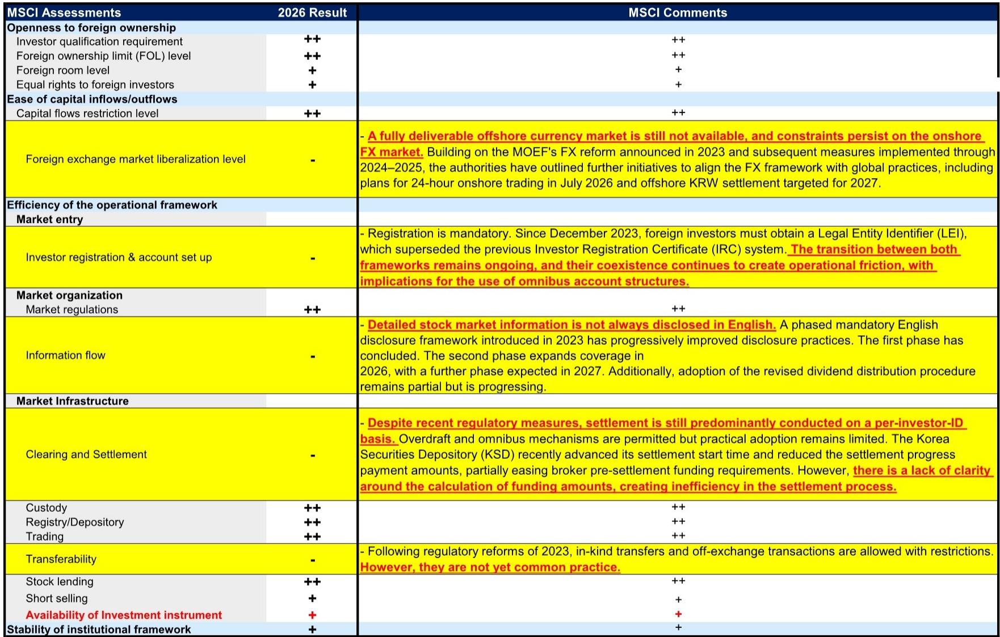
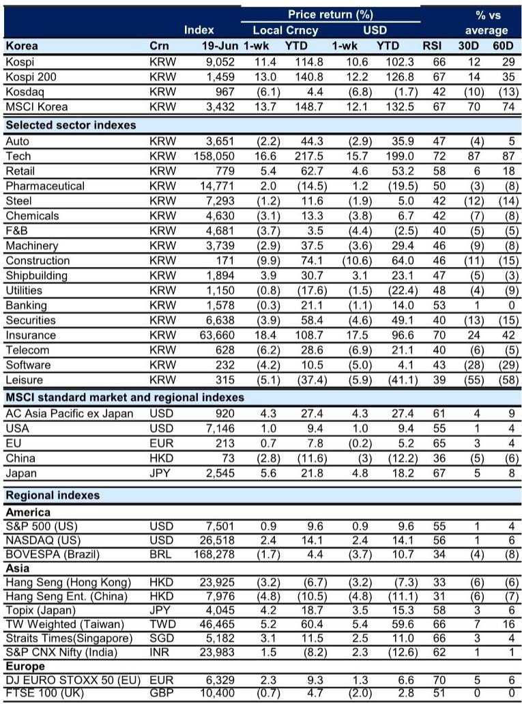
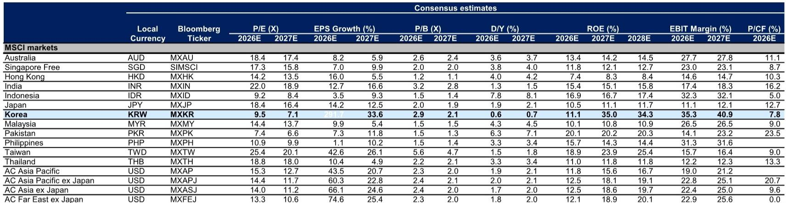

# GS：韩国市场上涨背后的结构性分歧，比指数本身更值得关注

KOSPI一周暴涨11%，突破9000点，科技股领涨，外资回流。这是本周韩国市场的直观画面。

但如果只看这个数字，可能会错过这份GS周报真正想传递的信号。指数上涨的同时，资金流向、基金仓位和MSCI评估这三个维度，正在指向一个更微妙、也更需要警惕的结论：韩国市场正在经历一轮“有选择的上涨”，而非系统性重估。上涨的广度、可持续性以及背后的结构性障碍，仍然存在明显分歧。

这份报告的数据点很多，但最值得提炼的判断只有一个：**韩国市场的短期动能来自事件驱动和外资回补，但中期结构性折价的修复，仍取决于MSCI评估中那些尚未解决的制度性障碍能否真正落地。** 市场目前定价的是前者，而后者才是决定估值能否系统性扩张的关键变量。

## 1. 外资流入看似强劲，但基金仓位数据揭示的却是持续减持

本周外资净买入KOSPI市场2.5万亿韩元，推动指数大涨。单看这一数据，很容易得出“外资重新看好韩国”的结论。

但GS援引的EPFR初步数据（覆盖约46%的AUM）给出了另一幅图景。截至2026年5月，亚洲基金和新兴市场基金对韩国股票的配置，相对于基准指数，仍然是显著低配的。亚洲基金低配195个基点，新兴市场基金低配285个基点。更关键的是，在过去一个月和过去三个月中，这两类基金都在持续削减对韩国的敞口。亚洲基金过去一个月减持105个基点，过去三个月累计减持140个基点；新兴市场基金则分别减持165和195个基点。

这意味着什么？本周的外资净买入，更可能来自交易型资金或被动型资金的短期回补，而非主动管理型基金的战略性加仓。主动基金的真实仓位仍在下降，这与指数上涨形成了方向性背离。这种背离本身就是一个需要警惕的信号：短期资金推动的上涨，如果得不到主动基金的跟进，持续性存疑。

对投资者的含义是：在跟踪韩国市场时，不能只看总量资金流向，更要区分主动与被动、交易型与配置型。当前的市场动能可能更多来自空头回补和事件驱动的投机性买盘，而非基本面逻辑驱动的系统性配置。

## 2. 科技硬件与半导体是外资加仓的焦点，但基金已开始减仓这一板块

本周表现最好的板块是保险（+18.4%）、科技（+16.6%）和零售（+5.4%）。科技板块的盈利上调幅度也最大。这看起来是一个清晰的信号：市场在押注韩国科技股的盈利修复。

然而，GS提供的基金仓位变化数据揭示了一个更复杂的图景。在亚洲和新兴市场基金中，韩国科技硬件和半导体板块目前仍然是相对超配的（超配15个基点），但在过去三个月中，这些基金削减最多的恰恰就是科技硬件板块，减仓幅度高达60个基点。与此同时，工业板块成为过去三个月加仓最多的领域，加仓40个基点。

这组数据传达的信息是：基金正在从最拥挤、涨幅最大的科技硬件板块中撤出，转向工业等前期相对冷门的领域。这是一种典型的“轮动”而非“加仓”。科技板块本周的强劲表现，可能更多是动量交易和短期情绪推动的结果，而非机构资金的系统性增配。

对于关注韩国科技股的投资者来说，需要区分“盈利上调”和“资金流入”之间的时滞。盈利预期上调是基本面信号，但资金流向反映的是机构投资者的当前偏好。两者背离时，往往意味着市场对盈利修复的定价已经比较充分，后续上涨需要更超预期的催化剂。

## 3. MSCI评估的“五个减号”才是理解韩国折价的核心框架

这份报告最值得细读的部分，不是涨跌幅和资金流，而是MSCI市场可及性评估的详细结果。

GS明确指出，MSCI在2026年的评估中，将“投资工具可用性”从“-”上调至“+”，原因是韩国指数衍生品在国际交易所上市。这是一个积极信号，但MSCI同时保留了五个“-”的评估项：外汇自由化（缺乏完全可交割的离岸韩元）、投资者注册（IRC与LEI并存制约综合账户采用）、信息流（英文信息披露有效性待2027年全面落地）、清算与结算（仍按投资者ID结算，资金计算不透明）、以及可转移性。MSCI特别强调，其关注的是“国际机构投资者体验的实际改善”，而非宣布的改革计划。

GS的判断是明确的：韩国仍不会在6月23日的年度市场分类评估中被纳入发达市场观察名单。这意味着，市场此前对“韩国入富”或“MSCI升级”的预期，至少在短期内不会兑现。

这五个“减号”不是技术细节，而是理解韩国股市长期折价的核心框架。韩国股市相对于全球和亚太同行的估值折价，根源于制度性摩擦带来的资本流动成本。只要这些障碍没有实质性的、可验证的改善，外资的配置意愿就会受到制约。本周指数大涨，但估值折价并未系统性收窄，恰恰说明市场在短期内可以忽略这些结构性问题，但长期投资者不会。

对于资产定价的含义是：韩国市场的估值修复，不能仅仅依赖盈利增长或短期资金流入，还需要MSCI评估中那些“减号”项的真实改善。当前的市场上涨，更多是对短期事件的定价，而非对结构性折价修复的定价。

## 4. 报告尚未完全回答的关键问题：资金流入能否转化为持续配置

这份报告提供了丰富的数据，但有一个关键问题尚未完全回答：本周的外资净买入，到底是趋势反转的开始，还是昙花一现的脉冲？

GS的数据指向了两种可能性。乐观的一面是，韩国股市的12个月前瞻EPS本周上调了1.5%，科技板块上调幅度最大，基本面在改善。悲观的一面是，主动基金仍在减仓，MSCI评估没有给出超预期的积极信号，韩元对美元还在贬值（本周贬值0.8%）。

真正需要进一步验证的是：外资流入的驱动因素是什么？是美伊协议带来的风险偏好回升？是对鹰派FOMC的过度反应后的纠偏？还是韩国自身基本面改善带来的独立行情？如果是前者，那么流入的可持续性存疑；如果是后者，则需要看到更广泛的盈利上调和更持续的资金流入。

此外，GS提到的韩国股票风险晴雨表（GSSRKERB）目前为0.2，回到风险中性区域。这意味着市场情绪既不过度乐观，也不过度悲观。在这种状态下，市场对正面和负面消息都比较敏感，方向选择往往取决于下一个催化剂。

## 5. 投资者的观察框架：三个信号判断上涨成色

基于这份报告，可以建立一个简洁的观察框架，用来判断韩国市场上涨的成色和可持续性。

第一个信号：主动基金仓位变化。本周外资净买入后，需要跟踪下一期EPFR数据中主动基金的韩国配置是否出现方向性逆转。如果主动基金从减持转为增持，说明机构投资者开始认可这轮上涨的基本面逻辑。如果仍然减持，则说明上涨主要来自交易型资金，后续动力不足。

第二个信号：MSCI改革的时间表兑现。GS提到，韩国政府计划在2026年7月推出24小时外汇市场，2026年下半年启动离岸韩元试点。这些时间节点是关键验证点。如果如期落地，特别是在外汇自由化方面取得实质进展，将直接改善MSCI评估中的“减号”项，打开估值修复的空间。如果再次推迟，市场对改革的信任度将进一步下降。

第三个信号：科技股盈利上修的广度。本周科技板块盈利上调最强，但需要观察这种上调是集中在少数头部公司，还是扩散到整个板块。如果是前者，上涨可能只是局部行情；如果是后者，才意味着更大的结构性机会。

这三个信号，本质上是在回答同一个问题：市场是在交易事件，还是在交易结构。目前的证据更倾向于前者，但变化可能很快发生。

---

这份GS周报提供了丰富的图表和数据，但最核心的洞察其实隐藏在那些看似枯燥的表格和注释中：韩国市场的短期动能和长期结构性障碍之间，存在一条清晰的分界线。上涨是真实的，但能否跨越这条分界线，取决于未来几个月那些尚未落地的改革能否真正兑现。

关于MSCI评估中五个“减号”的具体细节、基金板块仓位变化的完整图表、以及GS对韩国市场估值折价的量化分析，这些内容在本文中无法一一展开。如果你希望看到完整的原始图表和更深入的解读，欢迎来我们的星球微信群里继续讨论。那里有更完整的报告原文和更细致的拆解。

Personal reading notes and learning share only. Not investment advice.

