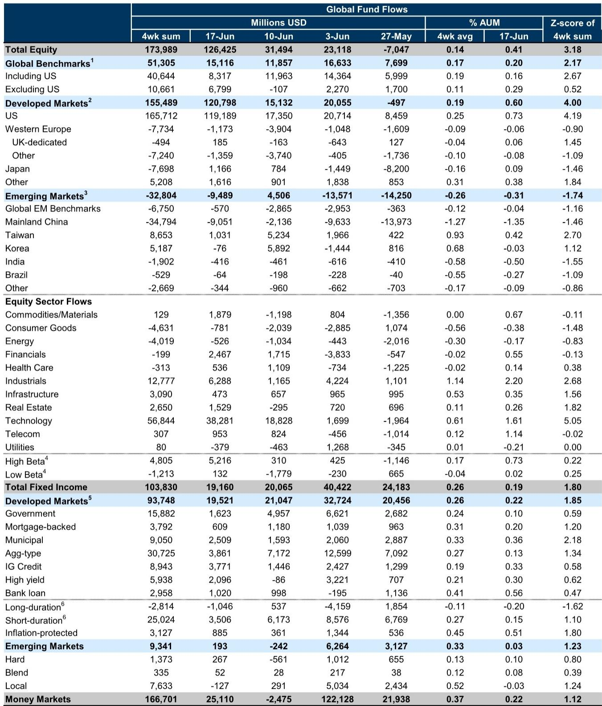
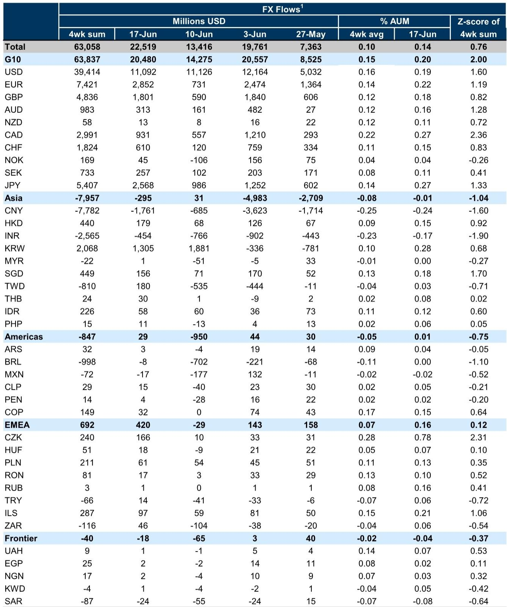
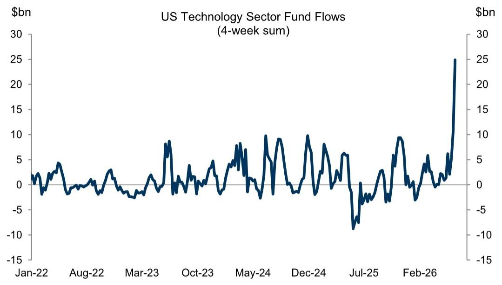

# GS：资金流向正在重塑全球资产定价的底层逻辑

全球资金正在经历一次结构性的再配置。这不是一次简单的板块轮动，而是一个可能影响未来12至18个月资产定价的核心变量。

GS最新一期全球资金流向周报（截至6月17日）揭示了一个清晰的信号：资金正在从分散的试探性布局，转向有明确主题的集中押注。当周全球股票基金净流入达到1260亿美元，远超此前一周的310亿美元。这一数字本身已经足够引人注目，但真正值得深入拆解的，是资金流入的结构——科技板块的吸金能力正在加速，工业板块紧随其后，而中国内地股票基金则持续面临净流出。

这份报告的核心判断是什么？不是“资金回来了”，而是“资金正在为新的宏观叙事定价”。

## 1. 科技板块的资金虹吸效应正在从美国向外扩散

GS的图表清晰地展示了美国科技板块基金在最近几周的强劲净流入。这并非孤立现象。报告指出，科技基金和工业基金在全球范围内都录得了最大的净流入。但美国科技板块的流入尤为突出，其背后是AI驱动的需求增长。

这里有一个关键的分析层次。GS在报告中点明了一个经常被市场忽视的传导机制：强劲的AI需求不仅推高了增长预期，还通过推高通胀和中性利率预期，强化了美元的强势。换句话说，资金流入科技板块，表面上是在押注技术突破，实际上是在对整个宏观组合——更高的增长、更高的利率、更强的美元——进行系统性下注。

这意味着，科技板块的涨跌不再仅仅是行业基本面问题。它已经成为全球宏观资产定价的一个核心锚点。如果后续科技板块的资金流入出现逆转，其影响将远不止于纳斯达克，而是会通过美元、利率和新兴市场资金流向产生连锁反应。

## 2. 中国内地股票基金的持续失血暴露了更深层的结构性问题

在中国内地股票基金方面，GS的数据并不乐观。无论是来自中国内地本土的资金，还是来自全球其他地区的资金，都在近期出现了净流出。从累积数据看，中国内地股票基金年初至今的净流出规模在所有主要区域中排名靠前。

报告没有展开分析原因，但数据本身已经提供了足够的信息。当全球资金在科技和工业板块积极布局时，中国内地基金却持续失血，这反映出国际投资者对中国资产的风险偏好仍然偏低。值得注意的是，台湾股票基金在同一时期却录得了净流入。这种分化说明，问题不在于“中国资产”这个标签本身，而在于投资者对特定区域增长引擎和制度环境的差异化定价。

对于关注中国市场的读者而言，这里有一个需要持续跟踪的问题：中国内地基金的资金流出何时会触底？GS的数据显示，流出趋势在近几周有所加速，但尚未出现反转信号。这一趋势的逆转，可能需要更明确的宏观催化剂——无论是政策面的变化，还是企业盈利的实质性改善。

## 3. 固定收益市场的资金流向在讲述一个不同的故事

与股票市场的乐观情绪不同，固定收益市场呈现出更加谨慎的配置格局。GS报告显示，全球固定收益基金继续获得资金支持，但资金偏好明显偏向短期。短久期债券基金和通胀保护债券基金持续获得净流入。

这是一个经典的“防御性配置”信号。当投资者同时买入股票（尤其是科技股）和短久期债券时，他们实际上是在表达一个矛盾的预期：一方面看好AI驱动的增长前景，另一方面又对利率路径和通胀前景感到不确定。这种“股债双买”的格局，在历史上往往出现在宏观叙事切换的过渡期。

报告还提到，新兴市场硬通货债券基金获得净流入，而本币债券基金则遭遇净流出。这进一步印证了投资者对新兴市场货币的谨慎态度——他们愿意承担信用风险，但不愿意承担汇率风险。这和GS在报告中提到的美元净需求强劲、人民币净流出最大的趋势完全一致。

## 4. 报告尚未完全回答的关键问题：资金流入的可持续性

GS这份周报提供了丰富的流量数据，但有一个关键问题没有完全回答：这些资金流入的可持续性如何？

从历史经验看，科技板块的集中流入往往伴随着较高的波动风险。一旦AI相关企业的盈利预期出现修正，或者宏观数据出现意外波动，这些资金可能会迅速撤离。GS的图表显示，美国科技板块的流入在最近几周确实很强劲，但类似的集中流入在历史上并非没有出现过，而后续往往伴随着资金流向的剧烈反转。

另一个未解问题是：欧洲资金的流入是否可持续？报告中提到，欧元区股票基金在近期也出现了显著的净流入，但这些资金的来源和持续性仍需验证。欧洲经济的基本面与美国存在差异，欧洲的资金流入更多是“补涨”逻辑还是“结构性重配”逻辑，目前尚不清晰。

## 5. 投资者需要建立新的观察框架：从“流向”到“定价”

基于GS的这份报告，我们认为投资者需要调整自己的观察框架。传统的资金流向分析往往停留在“谁在买、谁在卖”的层面，但当前的环境要求我们更进一步：理解资金流向如何改变资产的定价逻辑。

具体来说，有三个维度值得持续跟踪：

第一，科技板块的资金流入是否开始影响其他板块的估值。GS的数据显示，工业板块的资金流入也在加速。如果科技和工业双双走强，这可能意味着AI的投资逻辑正在从“软件和芯片”向“硬件和应用”扩散。这种扩散一旦确认，将改变整个周期性板块的定价框架。

第二，美元强势与新兴市场资金流向的负反馈循环。GS的报告明确指出，AI驱动的需求推高了美国的中性利率，进而强化了美元。而美元的强势又导致新兴市场（尤其是中国）的资本外流。这个循环何时会自我修正？只有当美国经济数据出现明显放缓，或者新兴市场的增长预期出现实质性改善时，这个循环才有可能被打破。

第三，固定收益市场的短久期偏好何时转向。如果投资者开始从短久期债券转向长久期债券，那将是一个重要的信号——意味着市场对利率路径的信心开始恢复。GS的数据目前还没有显示这种转向，但这是一个需要持续监控的指标。

## 6. 这些数据背后，还有一张更大的图景没有被充分讨论

GS的周报提供了丰富的流量数据，但受到周报格式的限制，很多重要的二阶效应并没有被充分展开。例如，资金流入科技板块对中小盘科技股的溢出效应如何？中国内地基金流出的同时，中国债券市场的资金流向又是怎样的？跨境资金流动对汇率定价的短期冲击有多大？

这些都是我们在完整研报解读中会详细讨论的问题。GS的原始报告包含了更多的图表和细分数据，尤其是分国家、分行业的累积流量数据，对于理解资金流向的中长期趋势非常有价值。但周报的篇幅决定了它只能提供“快照”，而无法深入分析“背后的故事”。

如果你希望进一步探讨这些未解问题——比如科技板块资金流入的可持续性、中国资产何时能够迎来资金回流、固定收益市场的配置拐点在哪里——欢迎来我们的星球微信群里继续讨论。我们会在群内分享更详细的图表解读，并定期组织对GS、MS等头部机构最新研报的深度拆解。

Personal reading notes and learning share only. Not investment advice.

