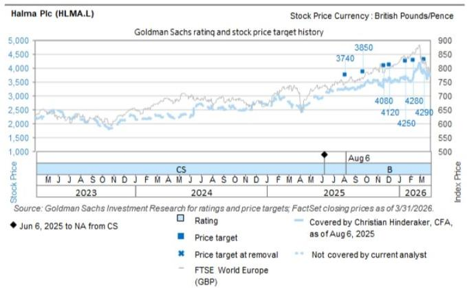
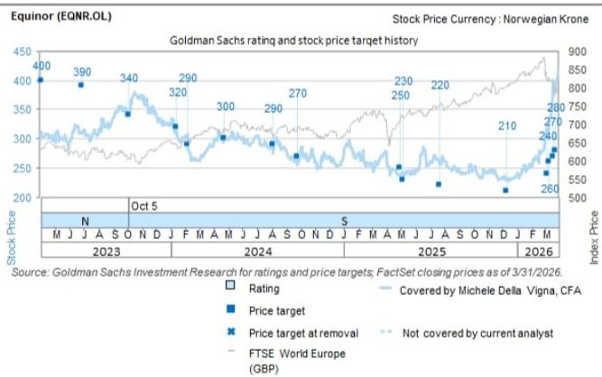
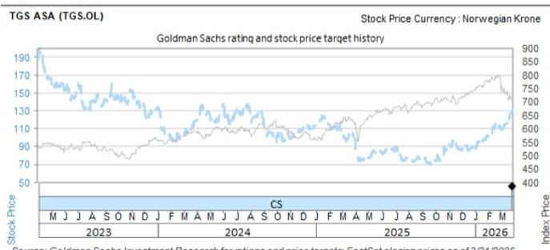

## CONNECTING THE DOTS

# Capex Boom, Frontier exploration, AI orchestration, Halma, BSTL and Banks plus key research

Navigating the Capex Boom. Peter Oppenheimer's must read on Capex here, including why he expects more scope for alpha generation. We are hosting a call with him on Monday (sign up) along with some of the analysts from sectors which benefit from the investment (e.g., Hardware, Utilities, Cap Goods). One of these sectors — Utilities — looks very different to history given this growth, so we are also doing a Back to Basics with Alberto Gandolfi to understand his new framework within which we should view the sector (as well as covering some of the basics which haven't changed) – on Monday (sign up).

Frontier exploration is back even with a lower oil price. Amidst Iran and US MoU headlines, oil has eased off to c\$80/bbl, and despite feedback in the past few weeks that clients were looking to buy the dip, energy equities have been weak. We would revisit oil services names as a play on oil capex picking up. This week we saw more evidence of this return to exploration and particularly frontier exploration, with the list of areas IOCs and NOCs are willing to go growing according to feedback from the EAGE seismic industry conference last week (via Viridien ex CGG) and Equinor increasing capex by \$1bn for 2027 and enhancing its focus on frontier exploration at its CMD. We sat down with Michele Della Vigna and Anastasia Shalaeva to discuss these takeaways in a c10 min episode of On the Road, listen here. The biggest pushback to buying oil services is the aforementioned Brent weakness, and Michele makes the point that these projects make sense in an oil price world of \$60/bbl (vs. current c\$80 spot) so you need to be a lot more bearish on oil to de-rail this. Buy TGS in seismic.

## As a reminder, this isn't just because of recent Middle East events, it's more

sustainable. The focus on oil capex from majors was starting to come back before the recent conflict as investors started to reward spending on exploration rather than just buybacks given reserve life is down 60% over the last 10 years and the source of that underinvestment (US Shale creating an overhang on the oil price) is finally maturing. Energy security only adds to this pressure.

AI and orchestration. One snippet from an expert call hosted in the US by Matthew Martino: “autonomous software development creates a new operational requirement around validating, diagnosing, and responding to changes in production with far less human intervention than before. Management described a potential “dark factory” model in which coding agents ship code, SRE agents evaluate production behavior, diagnose

## Sahar Islam

+44(20)7051-4935

sahar.islam@gs.com

GS International

issues, and feed that information back into the development loop, creating a tighter connection between software creation and software operation."

Baskets vs. bottom up stories: Halma. Halma is a high quality name which has very high growth, but saw a c15% sell off last week post results as it was viewed as a play on one ‘theme’ where the market found Photonics guidance disappointing vs. elevated expectations. The name has historically been a compounder with a well proven growth algorithm, including M&A, where the pushback has typically been a lack of upside / valuation. Christian Hinderaker is Buy rated and now has 25%+ PT upside given the Photonics pull back, so we sat down with him on our Going Against the Grain episode, listen here as this is a name worth coming back to on weakness. We do discuss Photonics to address the obvious points (he thinks guidance is conservative and is ahead of it) but listen from 10 minutes onwards to refresh views beyond Photonics for the part where there is less focus but where growth trends are healthy and in defensive end markets.

BSTL conference feedback – positive for both DSV (positive on cyclical backdrop and structural AI benefits) and IHG (NUG momentum building, US RevPAR strong), which are both on the CL.

Bank themes for generalists. Post a week of strength across banks, we are revisiting our recent On the Road episode with feedback from our Financials Conference to refresh the key themes we should be focused on from macro and regulation to AI and more, listen here. Chris Hallam gives an overview (1.54 to 7:29) if you want the highlights.

## GS Research from the week

We filter this week's research through the merchandising lens to highlight actionable ideas and pull out some themes / key messages which we think are important - click into the reports for more!

AI, Data Centres and CAPEX

On the need to spend

Global Strategy Paper: The Post Modern Cycle – Navigating the Capex Boom – Peter Oppenheimer looks at this phase of capital intensive growth with drivers of returns more likely from EPS than valuation resulting in cross-sectional dispersion, increasing scope for alpha generation.

Multi-Industry Capex Tracker: Medium-term capex expectations continue to improve - Daniela Costa highlights Capex continues to improve with 2026E capex up 2pp since March largely by Tech (Data Centers) and Utilities. Buy: Schneider on CL, VAT for Semis and Prysmian and Nexans for Power Grids

Powering up Europe: Booming Datacenter pipeline and AI spending boom - the pivotal role of energy - Alberto Gandolfi estimates the data center pipeline is now nearly 500GW (1.5x current EU power demand) which is a $70 \%$ increase since his last update 6 months ago. Alberto and our US Utilities team discuss the impact of rising power demand on the Renewables outlook in a recent podcast, listen here.

US Strategy: The impact of the AI capex boom on S&P 500 return on equity – Ben Snider notes the AI capex boom has lifted semiconductor profitability but will be an increasing headwind to mega-cap tech ROE going forward.

Digital Infrastructure: AI Infrastructure from the Field: Takeaways from 2nd Annual Denver trip - Michael Ng notes hyperscaler AI infrastructure demand remains strong, with continued strengthening of data center pricing power.

Supply chain

Taiwan Technology: US marketing feedback: AI ASIC remains the preferred theme with focus on CPU and next supply chain bottlenecks

BE Semiconductor Industries (BESI.AS): Investor Day highlights expanding AI-driven packaging opportunity and HB adoption; Buy - Alex Duval highlights expanding AI-driven packaging opportunity and HB adoption.

Nexans (NEXS.PA): Electra visit and CEO/CFO takeaways, reiterate Buy - Daniela Costa came away more constructive on the stock, noting high renewables, T&D exposure and a potential increase in exposure to data centers, especially given home market (France) builds more.

IT impact

Americas Technology: Software: Expert Network Series: Dash0 on Observability in the Agentic Age - Expert call highlights “autonomous software development creates a new operational requirement around validating, diagnosing, and responding to changes in production with far less human intervention than before. Management described a potential “dark factory” model in which coding agents ship code, SRE agents evaluate production behavior, diagnose issues, and feed that information back into the development loop, creating a tighter connection between software creation and software operation.”

Americas Technology: IT Spending Survey: AI momentum continues to build against a more muted broader outlook - Gabriela Borges highlights $88\%$ of CIOs (vs $93\%$ prior) expect AI to account for $< 10\%$ of IT budgets, reflecting an ongoing testing and refinement phase (weighted average of $5\%$ ). Over 3 years, $42\%$ (vs $35\%$ prior) anticipate GenAI to exceed $10\%$ of their IT budgets, with a weighted average of $10\%$ .

Accenture Plc (ACN): Tepid quarter and outlook reflects near-term macro headwinds - The stock was down significantly on results which James Schneider notes reflects AI concerns and outlook reflecting broader macro headwinds.

Jobs impact

GS SUSTAIN Insights: The Future of Work - Labor Shortages, Automation & AI - Evan Tylenda's feedback from the expert call with Randstad includes manufacturing labour shortages in Europe and the US have resulted in a $400 \%$ increase in electrical trade enrolments, however it can take 8 years to develop a worker.

## Strait of Hormuz Re-Opening

Oil Analyst: Reducing Our Price Forecast on Deal to Reopen Hormuz - Dan Struyven reduces his price forecasts on a deal to reopen Hormuz to \$80 by 4Q26 (from \$90) and to \$75 (vs \$80) for '27.

Natural Gas Analyst: US-Iran Agreement Paves Way For European Storage Refill - Samantha Dart leaves her forecasts largely unchanged on the back of SoH normalization, higher ex Qatar supply and lower market target for European storage. She sees long-term oversupply with risk that a pick-up in coal and renewables adds pressure.

Oil Tracker: 70% of Pre-War Hormuz Flows Might Become the New 100% - Yulia Zhestkova Grigsby notes 70% of SoH flows might become the new 100% and her tracker shows the redirections number is high with some constraint in shipowners unclear on guidelines.

Big Oils: Oil price implied in EU Big Oils and sensitivities on a potential Hormuz re-opening

Europe Transportation: Airports: What to do in the sector & who would benefit most from geopolitical “Reopening”

China Transportation: Assessing a Hormuz reopening scenario; Prefer Tankers, Airlines and Shipbuilders

We have two replays on Strait of Hormuz reopening 1) on Iran Markets Post Hormuz Reopening hosted by Adam Crook including Jan Hatzius, listen here and 2) discussing our updated energy outlook with our commodities team research and trading (GBM), listen here.

## Oil Capex

Equinor (EQNR.OL): CMD: \$1bn capex step-up to accelerate prod gr, and Buyback upgrade. Remains Sell on negative long-term TTF view, Sell

Energy: Oil Services: Key takeaways from call with Viridien post EAGE conference: "Frontier Exploration is back" – Michele Della Vigna highlights the Viridien CFO was bullish on the EAGE conference last week, noting "frontier exploration is back" with record EAGE attendance (proxy for interest in exploration) screening positive for TGS.

We have a new edition of our European On the Road with GS podcast including Michele discussing what we learned on oil capex and why frontier exploration is back, listen here.

## Rates

USA: June FOMC Recap: Hikes Look More Likely but Are Still Not Our Base Case – David Mericle notes a hawkish surprise and raises risk of interest rate hikes later this year but his base case is still unchanged for this year. If SoH trade resumes, he notes some of the views might be stale; Fed noted that 5 taskforces are to be created to rethink communications.

European Daily: BoE Recap—Content with Holding - James Moberly notes the MPC held rates at the recent meeting and continues to expect the BoE to remain on hold through the year and then lowering rates in 2027.

Moderating Near-Term Gold Price Upside on No Fed Cuts This Year - Lina Thomas highlights moderating near-term price upside on no Fed cuts this year, and cuts her forecast to \$4,900/toz by Dec (vs \$5,400 prior), remaining tactically cautious.

UK Home Builders: Post deep-dive feedback: Investors on Sidelines, Focus Shifts to Execution - Rebecca Parker highlights low interest with the sector treated as homogenous but affordability differences mean divergence should occur. Rebecca would avoid southern market exposure (Sell Berkeley) and Buy Persimmon and Barratt Redrow.

## Aluminium (Norsk Hydro is on the CL)

China Base Metals: China aluminum sector – accelerating pace of supply additions; downgrade Chalco-H/A to Sell/Sell, maintain Hongqiao at Neutral – Trina Chen’s recent discussions suggest acceleration in aluminum supply additions in both China and ex-China, prompted by strong industry profits

Base Metals Analyst: Aluminium: A Tale of Two Supply Shocks - Lavinia Forcellese sees Middle East outages as keeping the aluminum market tighter for longer, even if the strait re-opens. She nudges her Q3 2026/average 2027 LME aluminium price forecasts to \$3,300/\$2,950/t from \$3,200/\$2,750/t previously.

## Capital Markets Activity

Three notes from Oliver Carruthers:

European Capital Markets: Key themes shaping Capital Markets; downgrading AJ Bell and DWS to Sell, Aberdeen to Neutral - Oliver sees an improving market backdrop for private markets, highlighting Buy-rated CL CVC as a name with attractive risk-reward and flatexDEGIRO with continued growth and efficiency. However, he downgrades DWS and AJ Bell to Sell, as while both have done well, DWS is showing early moderation of core drivers and AJ Bell is likely to face more competition.  
CVC Capital Partners (CVC.AS): Secondaries deep-dive session key takeaways; Buy (on CL) - Emphasises structural tailwinds and differentiated offering.  
- Partners Group (PGHN.S): FAQs on the Evergreen Business Part II; Neutral - Discusses the key questions surrounding the weak flows, drivers of performance and implications on consensus estimates, including the potential for lower performance fees in FY26 which he expects may impact dividend coverage and therefore cuts his estimates.

Global Markets Daily: US Credit Card and Auto Delinquency Rates: Less Bad Than They Look - Arun Monohar notes the share of credit card and auto loans that are 90 days or more past due on their payments has reached $13.1\%$ and $5.6\%$ , respectively, as of Q1 2026, back in line with the Global Financial Crisis peak. This is a widely followed indicator for evaluating the health of the US consumer.

Global Credit Trader: Credit Spread Dispersion: A Tale of Two Markets - Amanda Lynam highlights that beneath the surface there is divergence with IG dispersion unusually low, while HY dispersion is elevated.

Americas Brokers & Asset Managers: Solid May monthly metrics include robust engagement, cash, and NNA

Business Services, Transport, Leisure, Infra & Building Materials Conference

Business Services, Transport, Leisure, Infra & Building Materials Conference hosted by Patrick Creuset and his team in London with 40+ companies. See all takeaway notes here some highlights:

- Transportrest t and Logistics - Still expects a stronger 2Q for DSV (Buy, on CL), with the DBS integration on track and the ability to restart the buyback before reaching 2x leverage (Patrick expects it to restart from Q3). As well as DSV, K+N (Buy) is also well placed within freight and on AI-related productivity benefits.  
- Europe Leisure Day 1 and 2 - IHG'S NUG momentum is building, US RevPAR is strong and World Cup tailwinds are on track.

## Ratings Changes & Initiations

AJ Bell (AJBA.L) and DWS (DWSG.DE) Down to Sell - See details in Capital Markets Activity bucket above.

Public Power Corp. (DEHr.AT): Reinstate at Buy - Mafalfa Pombeiro reinstates PPC at Buy given the equity raise completion allowing investment ramp. Even assuming partial delivery relative to guidance gives 18% upside to her PT and her full execution scenario implies c30%+ upside to the share price (with more upside from rerating).

GEA Group (G1AG.DE): Initiate at Neutral - Daniela Costa believes GEA is high quality but valuation is fair.

Zegna (ZGN): Down to Neutral - Adrien Duverger downgrades Zegna following strong share performance. Illustrative SOTP analysis is new.

## Reiterate Buy

Siemens Energy (ENR1n.DE): Restructuring to bring greater focus & higher margins?; Buy (on CL) - Ajay Patel notes Siemens Energy is considering spinning off Transformation & Industry segment. A disposal, if confirmed, would focus the portfolio and improve margins. The stock is on CL and Ajay expects consensus upgrades with MT guidance at FY.

Vonovia (VNAn.DE): Supportive underlying data points, rates correlation broken; reiterate Buy (on CL) – Jonathan Kownator highlights supportive operating trends and is c4% ahead of consensus on 2027 earnings driven by non-rental growth and deleveraging. The stock is currently down YTD but in his view this creates a good entry point. See also: Debate about Berlin housing nationalisation now rising to the Federal level

SEGRO Plc (SGRO.L): Reiterate Buy on stronger demand led by Amazon & Asian retailers - Jonathan also reiterates his Buy rating on Segro given Chinese ecommerce is driving rising UK logistics demand complementing Amazon's existing strength, as well as data centre exposure.

Halma Plc (HLMA.L): CFO & Safety CEO webcast takeaways and Sell-Side Management Lunch Takeaways - Christian Hinderaker notes investors are still focused on Photonics guidance but continues to believe the guide was conservative. Listen to Christian in our Going Against the Grain podcast here.

## Sector Updates

Europe Consumer Products: Fragrance's next growth wave: back to blockbusters - Aron Adamski and Olivier Nicolai highlight demand is shaped by new offers and blockblusters with Puig and Interparfums having good runways on launches with durable growth. They reiterate their Buy ratings on L'Oreal, Interparfumes and Puig (CMD 28 Oct).

European Pulp & Paper: Shutdowns and the impact for EU pulp players – Gabriel Simoes highlights the announced shut downs are a step in right direction for the weak pulp market, especially softwood, but more is needed. Gabriel prefers downstream to upstream (Buy SW and SIG) and will discuss the broader market at Global Pulp & Paper week on 23-25th June, more here.

Europe: Construction: Heavyside Materials: CO2 costs aren't passing through to European Cement prices (yet) - Ben Rada Martin notes Europe cement has become a profit engine but not because of CO2 pass through, more about market consolidation, supply, demand and CBAM. He sees +LSD pricing increases and still likes Buy-rated Heidelberg and Holcim.

## Tracking the data

Europe Retail: Retail Matters: On and Adidas maintain their outperformance in sportswear; in apparel Chinese Aggregator growth turns negative in Europe while Vinted continues to outperform

Europe Branded Consumer Goods: Luxury Goods: Watches round-up May 2026: Swiss Watch Exports +0.4% y/y; latest industry news wrap

Europe Multi-Industry: What US and EU PPI tell us about Multi-Industry – Daniela Costa notes given the Middle East conflict, in May Capital Goods PPI in the US accelerated sequentially and remains well above median levels (+3.0 pp) and European PPI for April shows a sequential acceleration and is above the median (+1.3 pp). See also: Datamap in Pictures: June 2026 [Presentation]

Europe Food: EU Nielsen: Broad-based volume improvement at Nestlé and Danone, while Lindt volumes continue to lag the market

Europe Beverages: CCH and Carlsberg outperform subdued soft drinks market in May

Europe Beverages: Europe Nielsen: Soft European beer off-trade in April/May, Heineken outperforms

Europe Tissue: Prices continued to ease in May; Essity outperforms strong incontinence market

## Previews

Knorr Bremse (KBX.DE): 2Q26 Barometer and mid-term targets preview; Reiterate Buy - At 2Q results on 30 July, Daniela Costa expects new mid-term targets, positive truck data and increased CVS order intake. She is c7% ahead of consensus on FY29E EBIT.

Adyen NV (ADYEN.AS): 1H26 Preview: 2Q Acceleration Expected on Easier Comps; Modest Margin Refinement; Reiterate Buy - Mo Moawalla expects acceleration at 2Q and continues to forecast growth of $21.5\%$ yoy ex FX as APAC headwinds annualise.

Argenx SE (ARGX.BR): Myositis preview ahead of R&D event and ALKIVIA readout, Buy (on CL) – Rajan Sharma previews the R&D day on 23 June and the upcoming catalysts

including Ph3 ALKIVIA readout (Vyvgart in 3 subtypes). He also increases his revenue estimates by c2% for myositis which looks credible but need to watch efficacy.

## Events including M&A

Siemens Energy (ENR1n.DE): Restructuring to bring greater focus & higher margins?; Buy (on CL) - Ajay Patel notes Siemens Energy is considering spinning off Transformation & Industry segment. If the disposal is confirmed would focus portfolio and be +ve margins, on CL and expect cons upgrades with MT guidance at FY.

BARC Plc (BARC.L): Announces acquisition of GoHenry; Buy

Bankinter (BKT.MC): Announces acquisition of 100% of Tulp Hypotheken; Sell

Birkenstock (BIRK): Further \$500mn share buyback announced; remain Buy

Galderma (GALD.S): Nemluvio Navigator: Prescription trends continue to look encouraging; Buy

## Earnings & CMDs

## Commodities & Industrials

BMW (BMWG.DE): BMW materially lowers FY26 guidance on China weakness and Europe restructuring; capital return policy unchanged - Christian Frenes notes BMW profit warned overnight, given an acceleration China/APAC deterioration, cost inflation related to Middle East events and one offs from efficiency measures. This is a material downgrade to consensus and Christian lowers his numbers.

Equinor (EQNR.OL): CMD: \$1bn capex step-up to accelerate prod gr, and Buyback upgrade. Remains Sell on negative long-term TTF view, Sell - Michele Della Vigna highlights incremental capex on acceleration of projects on the back of discoveries since '23, fast tracking major developments and a focus on frontier exploration.

Lundin Mining Corp. (LUN.TO): 2026 CMD: Sustaining Operational Consistency to Underpin Growth Execution; Buy

## TMT

Auto1 Group (AG1G.DE): CMD First Take: Long-term units growth targets well ahead of consensus with greater disclosure on segment EBITDA; Buy

Informa (INF.L): 5M trading update broadly in line with our expectations; 2026 guidance reiterated; Buy

## Healthcare

Elekta AB (EKTAb.ST): FY27 guidance detail and new mid-term targets imply consensus EBIT upside in FY29; Sell

Straumann AG (STMN.S): Raising FY26 profitability guidance implies +MSD consensus EBIT upgrades; Neutral

## BSTL

Securitas AB (SECUb.ST): CMD '26: New strategy and financial targets announced; Sell

Saint-Gobain (SGOB.PA): First Take: Announced divestment of Nordic Distribution business for €1.2bn proceeds

Whitbread (WTB.L): 1Q27: Slightly stronger growth relative to prior current trading commentary; Neutral

## Consumer

Tesco (TSCO.L): EBIT growth expectation unchanged despite a slower start to the year (demanding 1Q comparative); PT to 515p, Buy

Douglas AG (DOUn.DE): First Take: 3Q-to-date underperformance leads to updated FY26 adj. EBITDA guidance 7% below consensus; Neutral

## Other Macro

Global Economics: Spending Headwinds Still to Come on Both Sides of the Pond - Megan Peters estimates that each $1\%$ pullback in real cash flow from an energy shock results in a $0.6\%$ decline in consumer spending after two quarters.

GOAL: Risk Appetite Reversal - dissecting cross-asset moves in the June roundtrip

Global Rates Trader: Leadership Transitions

Global FX Trader: Dollar in a Collar

## Other Global

Americas Utilities: Initiate on PJM IPPs: Structural supply/demand tightness favors Talen; Buy TLN, Neutral on CEG

Americas Chemicals: OLN and HUN announce all-stock merger of equals creating a leading North American chemical company, OlinHuntsman

Tesla Inc. (TSLA): 2Q26 deliveries likely tracking ahead of consensus - raising our estimate

Fujikura (5803.T): Guidance raise: Return to high growth as impacts from hydrogen/fiber sourcing fade; positive on optical products exposure, investment strength; raise TP, Buy

Americas Retail: Specialty Hardlines: Analyzing the impact of Best Buy and Meta's partnership on eyewear retailers

China Industrial Indicators: Partial recovery amid still-weak macro, divergence remains

Americas Technology: Software: Expert Network Series: Dash0 on Observability in the Agentic Age

China Consumer Connection: Online Brand Tracker: May-26: Divergent 618 performance across most sectors; Cosmetics led, IMF/White Goods lag

Navigating China Internet: eCommerce tracker: May industry online retail GMV +3%; 618 trends; Alibaba debates

## Disclosure Appendix

## Reg AC

I, Sahar Islam, hereby certify that all of the views expressed in this report accurately reflect my personal views about the subject company or companies and its or their securities. I also certify that no part of my compensation was, is or will be, directly or indirectly, related to the specific recommendations or views expressed in this report.

Unless otherwise stated, the individuals listed on the cover page of this report are analysts in GS' Global Investment Research division.

Contributing Authors: Sahar Islam GS International.

Unless otherwise stated, the individuals listed in the Contributing Authors disclosure of this report are analysts in GS' Global Investment Research division.

## GS Factor Profile

The GS Factor Profile provides investment context for a stock by comparing key attributes to the market (i.e. our universe of rated stocks) and its sector peers. The four key attributes depicted are: Growth, Financial Returns, Multiple (e.g. valuation) and Integrated (a composite of Growth, Financial Returns and Multiple). Growth, Financial Returns and Multiple are calculated by using normalized ranks for specific metrics for each stock. The normalized ranks for the metrics are then averaged and converted into percentiles for the relevant attribute. The precise calculation of each metric may vary depending on the fiscal year, industry and region, but the standard approach is as follows:

Growth is based on a stock's forward-looking sales growth, EBITDA growth and EPS growth (for financial stocks, only EPS and sales growth), with a higher percentile indicating a higher growth company. Financial Returns is based on a stock's forward-looking ROE, ROCE and CROCI (for financial stocks, only ROE), with a higher percentile indicating a company with higher financial returns. Multiple is based on a stock's forward-looking P/E, P/B, price/dividend (P/D), EV/EBITDA, EV/FCF and EV/Debt Adjusted Cash Flow (DACF) (for financial stocks, only P/E, P/B and P/D), with a higher percentile indicating a stock trading at a higher multiple. The Integrated percentile is calculated as the average of the Growth percentile, Financial Returns percentile and (100% - Multiple percentile).

Financial Returns and Multiple use the GS analyst forecasts at the fiscal year-end at least three quarters in the future. Growth uses inputs for the fiscal year at least seven quarters in the future compared with the year at least three quarters in the future (on a per-share basis for all metrics).

For a more detailed description of how we calculate the GS Factor Profile, please contact your GS representative.

## M&A Rank

Across our global coverage, we examine stocks using an M&A framework, considering both qualitative factors and quantitative factors (which may vary across sectors and regions) to incorporate the potential that certain companies could be acquired. We then assign a M&A rank as a means of scoring companies under our rated coverage from 1 to 3, with 1 representing high (30%-50%) probability of the company becoming an acquisition target, 2 representing medium (15%-30%) probability and 3 representing low (0%-15%) probability. For companies ranked 1 or 2, in line with our standard departmental guidelines we incorporate an M&A component into our target price. M&A rank of 3 is considered immaterial and therefore does not factor into our price target, and may or may not be discussed in research.

## Quantum

Quantum is GS' proprietary database providing access to detailed financial statement histories, forecasts and ratios. It can be used for in-depth analysis of a single company, or to make comparisons between companies in different sectors and markets.

## Disclosures

## Pricing Information

AJ Bell (609.5p), Aberdeen Group (232.4p), Accenture Plc (\$127.98), Adyen NV (€903.80), Aluminum Corp. of China (A) (Rmb9.38), Aluminum Corp. of China (H) (HK\$8.55), Argenx SE (€762.80), Argenx SE (\$877.72), Auto1 Group (€25.74), BE Semiconductor Industries (€317.80), BMW (€59.74), Bankinter (€14.99), BARC Plc (500.6p), Barratt Redrow (263.8p), Berkeley Group (3,542p), Birkenstock (\$46.11), CVC Capital Partners (€13.04), China Hongqiao Group (HK\$22.74), Constellation Energy Corp. (\$274.06), DSV A/S (Dkr1,525.00), DWS Group (€61.50), Elekta AB (Skr48.54), Equinor (Nkr312.20), Fujikura (¥4,461), GEA Group (€59.55), Galderma (SFr172.60), Halma Plc (3,958p), Heidelberg Materials (€186.65), Holcim (SFr77.44), Informa (863.6p), InterContinental Hotels Group (\$171.20), Interparfums Inc (\$99.09), Interparfums SA (€26.16), Knorr Bremse (€104.40), Kuehne & Nagel (SFr182.70), L'Oreal (€387.50), Lundin Mining Corp. (C\$37.49), Lundin Mining Corp. (Skr258.30), Nexans (€154.40), Partners Group (SFr699.60), Persimmon (1,050p), Prysmian (€147.75), Public Power Corp. (€22.88), Puig Brands S.A. (€16.08), SEGRO Plc (744.2p), SIG Group (SFr12.36), Saint-Gobain (€79.76), Schneider Electric (€291.00), Securitas AB (Skr151.80), Siemens Energy (€169.34), Smurfit Westrock (\$44.20), Straumann AG (SFr106.05), TGS ASA (Nkr135.50), Talen Energy Corp. (\$436.29), Tesco (452.4p), Tesla Inc. (\$400.49), UCB (€249.20), VAT Group (SFr687.80), Vonovia (€20.53), Whitbread (2,412p), Zegna (\$13.87) and flatexDEGIRO SE (€37.86)

The rating(s) for Equinor and TGS ASA is/are relative to the other companies in its/their coverage universe: Aker BP ASA, BP Plc, Ceres Power, ENI, Equinor, GTT, Galp, Harbour Energy, HelleniQ Energy, ITM Power, Industrie De Nora SpA, Ithaca Energy, Motor Oil, Nel, Neste OYJ, OMV, Repsol, Saudi Aramco, Shell Plc, TGS ASA, Technip Energies, Tenaris, Thyssenkrupp Nucera, TotalEnergies SE, Vallourec, Var Energi ASA

The rating(s) for Halma Plc is/are relative to the other companies in its/their coverage universe: ABB Ltd., Accelleron Industries Ltd., Addtech AB, Alfa Laval, Alstom, Ariston Holding, Assa Abloy B, Atlas Copco, CNH Industrial, Carel Industries SpA, Daimler Truck Holding, Electrolux AB, Epiroc, FLSmidth & Co., GEA Group, GVS, Geberit Holding, Halma Plc, IMI Plc, Indutrade AB, Knorr Bremse, Konecranes, Legrand, Lifco AB, Metso, NIBE Industrier AB, NKT A/S, Nexans, Prysmian, Rational AG, Rexel S.A., SEB SA, SKF, Sandvik, Schindler Holding, Schneider Electric, Siemens AG, Signify NV, Traton, Trelleborg AB, VAT Group, Volvo Group, Wartsila, Weir Group

## Company-specific regulatory disclosures

The following disclosures relate to relationships between The GS Group, Inc. (with its affiliates, “GS”) and companies covered by GS Global Investment Research and referred to in this research.

GS beneficially owned $1\%$ or more of common equity (excluding positions managed by affiliates and business units not required to be aggregated under US securities law) as of the month end preceding this report: TGS ASA (Nkr135.50)

GS has received compensation for investment banking services in the past 12 months: Equinor (Nkr312.20) and Equinor ASA (ADR) (\$32.38)

GS expects to receive or intends to seek compensation for investment banking services in the next 3 months: Equinor (Nkr312.20), Equinor ASA (ADR) (\$32.38) and Halma Plc (3,958p)

GS has received compensation for non-investment banking services during the past 12 months: Equinor (Nkr312.20) and Equinor ASA (ADR) (\$32.38)

GS had an investment banking services client relationship during the past 12 months with: Equinor (Nkr312.20), Equinor ASA (ADR) (\$32.38) and Halma Plc (3,958p)

GS had a non-investment banking securities-related services client relationship during the past 12 months with: Equinor (Nkr312.20) and Equinor ASA (ADR) (\$32.38)

GS had a non-securities services client relationship during the past 12 months with: Equinor (Nkr312.20) and Equinor ASA (ADR) (\$32.38)

GS makes a market in the securities or derivatives thereof: Equinor (Nkr312.20) and Equinor ASA (ADR) (\$32.38)

GS holds a position greater than U.S. \$15 million (or equivalent) in the debt or debt instruments of: Equinor (Nkr312.20) and Equinor ASA (ADR) (\$32.38)

## Distribution of ratings/investment banking relationships

GS Investment Research global Equity coverage universe

<table><tr><td rowspan="2"></td><td colspan="3">Rating Distribution</td></tr><tr><td>Buy</td><td>Hold</td><td>Sell</td></tr><tr><td>Global</td><td>50%</td><td>34%</td><td>16%</td></tr></table>

<table><tr><td colspan="3">Investment Banking Relationships</td></tr><tr><td>Buy</td><td>Hold</td><td>Sell</td></tr><tr><td>65%</td><td>60%</td><td>45%</td></tr></table>

As of April 1, 2026, GS Global Investment Research had investment ratings on 3,074 equity securities. GS assigns stocks as Buys and Sells on various regional Investment Lists; stocks not so assigned are deemed Neutral. Such assignments equate to Buy, Hold and Sell for the purposes of the above disclosure required by the FINRA Rules. See ‘Ratings, Coverage universe and related definitions’ below. The Investment Banking Relationships chart reflects the percentage of subject companies within each rating category for whom GS has provided investment banking services within the previous twelve months.

Price target and rating history chart(s)  
  
Source: GS Investment Research for ratings and price targets; FactSet closing prices as of 3/31/2026.  
◆ Jun 6, 2025 to NA from CS
Rating
■ Price target
\* Price target at removal
FTSE World Europe (GBP)
Covered by Christian Hinderaker, CFA, as of Aug 6, 2025
Not covered by current analyst  
The price targets shown should be considered in the context of all prior published GS, which may or may not have included price targets, as well as developments relating to the company, its industry and financial markets.

line chart

| Date | Rating | Price target | Price target at removal | FTSE World Europe (GBP) |
| --- | --- | --- | --- | --- |
| Oct 5 | N |  |  |  |
| 2023 |  | 400 |  |  |
| 2023 |  | 390 |  |  |
| 2023 |  | 340 |  |  |
| 2023 |  | 320 |  |  |
| 2023 |  | 290 |  |  |
| 2023 |  | 300 |  |  |
| 2023 |  | 290 |  |  |
| 2023 |  | 270 |  |  |
| 2023 |  | 250 |  |  |
| 2023 |  | 230 |  |  |
| 2023 |  | 250 |  |  |
| 2023 |  | 220 |  |  |
| 2023 |  | 210 |  |  |
| 2023 |  | 210 |  |  |
| 2023 |  | 210 |  |  |
| 2023 |  | 210 |  |  |
| 2023 |  | 210 |  |  |
| 2023 |  | 260 |  |  |
| 2023 |  | 260 |  |  |
| 2023 |  | 260 |  |  |
| 2023 |  | 260 |  |  |
| 2023 |  | 260 |  |  |
| 2023 |  | 270 |  |  |
| 2023 |  | 280 |  |  |
| 2023 |  | 270 |  |  |
| 2023 |  | 260 |  |  |
| Oct 5 |  |  |  |  |
| Oct 5 |  |  |  |  |
| Oct 5 |  |  |  |  |
| Oct 5 |  |  |  |  |
| Oct 5 |  |  |  |  |
| Oct 5 |  |  |  |  |
| Oct 5 |  |  |  |  |
| Oct 5 |  |  | nan |  |
| Oct 5 |  |  | nan |  |
| Oct 5 |  |  | nan |  |
| Oct 5 |  |  | nan |  |
| Oct 5 |  |  | nan |  |
| Oct 5 |  |  | nan |  |
| Oct 5 |  |  | nan |  |

The price targets shown should be considered in the context of all prior published GS, which may or may not have included price targets, as well as developments relating to the company, its industry and financial markets.

line chart

| Date | Stock Price | Index Price |
| --- | --- | --- |
| 2023 M | ~190 | ~90 |
| 2023 J | ~170 | ~85 |
| 2023 J | ~150 | ~80 |
| 2023 A | ~130 | ~75 |
| 2023 S | ~110 | ~70 |
| 2023 O | ~90 | ~65 |
| 2023 N | ~70 | ~60 |
| 2023 D | ~50 | ~55 |
| 2024 M | ~70 | ~60 |
| 2024 J | ~90 | ~65 |
| 2024 A | ~110 | ~70 |
| 2024 S | ~130 | ~75 |
| 2024 O | ~150 | ~80 |
| 2024 N | ~170 | ~85 |
| 2024 D | ~190 | ~90 |
| 2025 F | ~170 | ~85 |
| 2025 M | ~150 | ~80 |
| 2025 J | ~130 | ~75 |
| 2025 J | ~110 | ~70 |
| 2025 A | ~90 | ~65 |
| 2025 S | ~70 | ~60 |
| 2025 O | ~50 | ~55 |
| 2025 N | ~70 | ~60 |
| 2025 D | ~90 | ~65 |
| 2026 F | ~110 | ~70 |
| 2026 M | ~130 | ~75 |
| 2026 J | ~150 | ~80 |
| 2026 J | ~170 | ~85 |
| 2026 S | ~190 | ~90 |
| 2026 O | ~170 | ~85 |
| 2026 N | ~150 | ~80 |
| 2026 D | ~130 | ~75 |
| 2026 M | ~110 | ~70 |
| 2026 J | ~90 | ~65 |
| 2026 J | ~70 | ~60 |
| 2026 A | ~50 | ~55 |
| 2026 S | ~70 | ~60 |
| 2026 O | ~90 | ~65 |
| 2026 N | ~110 | ~70 |
| 2026 D | ~130 | ~75 |
| 2026 M | ~150 | ~80 |
| 2026 J | ~170 | ~85 |
| 2026 J | ~190 | ~90 |
| 2026 S | ~170 | ~85 |
| 2026 O | ~150 | ~80 |
| 2026 N | ~130 | ~75 |
| 2026 D | ~110 | ~70 |
| 2026 M | ~90 | ~65 |
| 2026 J | ~70 | ~60 |
| 2026 J | ~50 | ~55 |
| 2026 S | ~70 | ~60 |
| 2026 O | ~90 | ~65 |
| 2026 N | ~110 | ~70 |
| 2026 D | ~130 | ~75 |
| 2026 M | (~150) | ~80 |
| 2026 J | (~170) | ~85 |
| 2026 J | (~190) | ~90 |
| 2026 S | (~170) | ~85 |
| 2026 O | (~150) | ~80 |
| 2026 N | (~130) | ~75 |
| 2026 D | (~110) | ~70 |
| 2026 M | (~90) | ~65 |
| 2026 J | (~70) | ~60 |
| 2026 J | (~50) | ~55 |
| 2026 S | (~70) | ~60 |
| 2026 O | (~90) | ~65 |
| 2026 N | (~110) | ~70 |
| 2026 D | (~130) | ~75 |
| 2026 M | (~150) | ~80 |
| 2026 J | (~170) | ~85 |
| 2026 J | (~190) | ~90 |

Source: GS Investment Research for ratings and price targets; FactSet closing prices as of 3/31/2026.
◆ Mar 24, 2026 to NA from CS
□ Rating
■ Price target
× Price target at removal
FTSE World Europe (USD)
Covered by current analyst
Not covered by current analyst  
The price targets shown should be considered in the context of all prior published GS, which may or may not have included price targets, as well as developments relating to the company, its industry and financial markets.

Target price history table(s)

<table><tr><td colspan="3">TGS ASA (TGS.OL)</td><td colspan="3">Halma Plc (HLMA.L)</td></tr><tr><td>Date of report</td><td>Target price (Nkr)</td><td>Closing price (Nkr)</td><td>Date of report</td><td>Target price (£)</td><td>Closing price (£)</td></tr><tr><td>01-May-26</td><td>180.00</td><td>150.50</td><td>11-Jun-26</td><td>5,010</td><td>3,928</td></tr><tr><td>20-Apr-26</td><td>170.00</td><td>137.80</td><td>01-Jun-26</td><td>5,060</td><td>4,732</td></tr><tr><td></td><td></td><td></td><td>13-Mar-26</td><td>4,290</td><td>3,878</td></tr><tr><td></td><td></td><td></td><td>12-Feb-26</td><td>4,280</td><td>3,742</td></tr><tr><td></td><td></td><td></td><td>21-Jan-26</td><td>4,250</td><td>3,710</td></tr><tr><td></td><td></td><td></td><td>08-Dec-25</td><td>4,120</td><td>3,652</td></tr><tr><td></td><td></td><td></td><td>21-Nov-25</td><td>4,080</td><td>3,540</td></tr><tr><td></td><td></td><td></td><td>25-Sep-25</td><td>3,850</td><td>3,372</td></tr><tr><td></td><td></td><td></td><td>06-Aug-25</td><td>3,740</td><td>3,232</td></tr></table>

Equinor (EQNR.OL)

<table><tr><td>Date of report</td><td>Target price (Nkr)</td><td>Closing price (Nkr)</td></tr><tr><td>06-May-26</td><td>300.00</td><td>349.90</td></tr><tr><td>26-Mar-26</td><td>280.00</td><td>397.50</td></tr><tr><td>19-Mar-26</td><td>270.00</td><td>398.60</td></tr><tr><td>12-Mar-26</td><td>260.00</td><td>332.50</td></tr><tr><td>09-Mar-26</td><td>240.00</td><td>325.40</td></tr><tr><td>12-Dec-25</td><td>210.00</td><td>232.70</td></tr><tr><td>23-Jul-25</td><td>220.00</td><td>256.10</td></tr><tr><td>07-May-25</td><td>230.00</td><td>236.40</td></tr><tr><td>30-Apr-25</td><td>250.00</td><td>237.90</td></tr><tr><td>25-Sep-24</td><td>270.00</td><td>262.50</td></tr><tr><td>05-Aug-24</td><td>290.00</td><td>276.95</td></tr><tr><td>25-Apr-24</td><td>300.00</td><td>305.00</td></tr><tr><td>07-Feb-24</td><td>290.00</td><td>284.60</td></tr><tr><td>15-Jan-24</td><td>320.00</td><td>306.25</td></tr><tr><td>05-Oct-23</td><td>340.00</td><td>341.00</td></tr><tr><td>30-Jun-23</td><td>390.00</td><td>312.10</td></tr></table>

Price targets shown in table(s) are unadjusted for corporate actions.

## Regulatory disclosures

## Disclosures required by United States laws and regulations

See company-specific regulatory disclosures above for any of the following disclosures required as to companies referred to in this report: manager or co-manager in a pending transaction; $1\%$ or other ownership; compensation for certain services; types of client relationships; managed/co-managed public offerings in prior periods; directorships; for equity securities, market making and/or specialist role. GS trades or may trade as a principal in debt securities (or in related derivatives) of issuers discussed in this report.

The following are additional required disclosures: Ownership and material conflicts of interest: GS policy prohibits its analysts, professionals reporting to analysts and members of their households from owning securities of any company in the analyst's area of coverage. Analyst compensation: Analysts are paid in part based on the profitability of GS, which includes investment banking revenues. Analyst as officer or director: GS policy generally prohibits its analysts, persons reporting to analysts or members of their households from serving as an officer, director or advisor of any company in the analyst's area of coverage. Non-U.S. Analysts: Non-U.S. analysts may not be associated persons of GS & Co. LLC and therefore may not be subject to FINRA Rule 2241 or FINRA Rule 2242 restrictions on communications with a subject company, public appearances and trading in securities covered by the analysts.

Distribution of ratings: See the distribution of ratings disclosure above. Price chart: See the price chart, with changes of ratings and price targets in prior periods, above, or, if electronic format or if with respect to multiple companies which are the subject of this report, on the GS website at https://www.gs.com/research/hedge.html.

## Additional disclosures required under the laws and regulations of jurisdictions other than the United States

The following disclosures are those required by the jurisdiction indicated, except to the extent already made above pursuant to United States laws and regulations. Australia: GS Australia Pty Ltd and its affiliates are not authorised deposit-taking institutions (as that term is defined in the Banking Act 1959 (Cth)) in Australia and do not provide banking services, nor carry on a banking business, in Australia. This research, and any access to it, is intended only for “wholesale clients” within the meaning of the Australian Corporations Act, unless otherwise agreed by GS. In producing research reports, members of Global Investment Research of GS Australia may attend site visits and other meetings hosted by the companies and other entities which are the subject of its research reports. In some instances the costs of such site visits or meetings may be met in part or in whole by the issuers concerned if GS Australia considers it is appropriate and reasonable in the specific circumstances relating to the site visit or meeting. To the extent that the contents of this document contains any financial product advice, it is general advice only and has been prepared by GS without taking into account a client’s objectives, financial situation or needs. A client should, before acting on any such advice, consider the appropriateness of the advice having regard to the client’s own objectives, financial situation and needs. A copy of certain GS Australia and New Zealand disclosure of interests and a copy of GS’ Australian Sell-Side Research Independence Policy Statement are available at: https://www.goldmansachs.com/disclosures/australia-new-zealand/index.html. Brazil: Disclosure information in relation to CVM Resolution n. 20 is available at https://www.gs.com/worldwide/brazil/area/gir/index.html. Where applicable, the Brazil-registered analyst primarily responsible for the content of this research report, as defined in Article 20 of CVM Resolution n. 20, is the first author named at the beginning of this report, unless indicated otherwise at the end of the text. Canada: This information is being provided to you for information purposes only and is not, and under no circumstances should be construed as, an advertisement, offering or solicitation by GS & Co. LLC for purchasers of securities in Canada to trade in any Canadian security. GS & Co. LLC is not registered as a dealer in any jurisdiction in Canada under applicable Canadian securities laws and generally is not permitted to trade in Canadian securities and may be prohibited from selling certain securities and products in certain jurisdictions in Canada. If you wish to trade in any Canadian securities or other products in Canada please contact GS Canada Inc., an affiliate of The GS Group Inc., or another registered Canadian dealer. Hong Kong: Further information on the securities of covered companies referred to in this research may be obtained on request from GS (Asia) L.L.C. India: Further information on the subject company or companies referred to in this research may be obtained from GS (India) Securities Private Limited, Research Analyst - SEBI Registration Number INH000001493, 10th Floor, Ascent-Worli, Sudam Kalu Ahire Marg, Worli, Mumbai-400 025, India, Corporate Identity Number U74140MH2006FTC160634, Phone +91 22 6616 9000, Fax +91 22 6616 9001. GS may beneficially own 1% or more of the securities (as such term is defined in clause 2 (h) the Indian Securities Contracts (Regulation) Act, 1956) of the subject company or companies referred to in this research report. Investment in securities market are subject to market risks. Read all the related documents carefully before investing. Registration granted by SEBI and certification from NISM in no way guarantee performance of the intermediary or provide any assurance of returns to investors. GS (India) Securities Private Limited compliance officer and investor grievance contact details can be found at: https://www.goldmansachs.com/worldwide/india/documents/Grievance-Redressal-and-Escalation-Matrix.pdf, and a copy of the annual audit compliance report can be found at this link: https://publishing.gs.com/content/site/india-annual-compliance-report.html. Japan: See below. Korea: This research, and any access to it, is intended only for “professional investors” within the meaning of the Financial Services and Capital Markets Act, unless otherwise agreed by GS. Further information on the subject company or companies referred to in this research may be obtained from GS (Asia) L.L.C., Seoul Branch. New Zealand: GS New Zealand Limited and its affiliates are neither “registered banks” nor “deposit takers” (as defined in the Reserve Bank of New Zealand Act 1989) in New Zealand. This research, and any access to it, is intended for “wholesale clients” (as defined in the Financial Advisers Act 2008) unless otherwise agreed by GS. A copy of certain GS Australia and New Zealand disclosure of interests is available at: https://www.goldmansachs.com/disclosures/australia-new-zealand/index.html. Russia: Research reports distributed in the Russian Federation are not advertising as defined in the Russian legislation, but are information and analysis not having product promotion as their main purpose and do not provide appraisal within the meaning of the Russian legislation on appraisal activity. Research reports do not constitute a personalized investment recommendation as defined in Russian laws and regulations, are not addressed to a specific client, and are prepared without analyzing the financial circumstances, investment profiles or risk profiles of clients. GS assumes no responsibility for any investment decisions that may be taken by a client or any other person based on this research report. Singapore: GS (Singapore) Pte. (Company Number: 198602165W), which is regulated by the Monetary Authority of Singapore, accepts legal responsibility for this research, and should be contacted with respect to any matters arising from, or in connection with, this research. Taiwan: This material is for reference only and must not be reprinted without permission. Investors should carefully consider their own investment risk. Investment results are the responsibility of the individual investor. United Kingdom: Persons who would be categorized as retail clients in the United Kingdom, as such term is defined in the rules of the Financial Conduct Authority, should read this research in conjunction with prior GS on the covered companies referred to herein and should refer to the risk warnings that have been sent to them by GS International. A copy of these risks warnings, and a glossary of certain financial terms used in this report, are available from GS International on request.

European Union and United Kingdom: Disclosure information in relation to Article 6 (2) of the European Commission Delegated Regulation (EU) (2016/958) supplementing Regulation (EU) No 596/2014 of the European Parliament and of the Council (including as that Delegated Regulation is implemented into United Kingdom domestic law and regulation following the United Kingdom's departure from the European Union and the European Economic Area) with regard to regulatory technical standards for the technical arrangements for objective presentation of investment recommendations or other information recommending or suggesting an investment strategy and for disclosure of particular interests or indications of conflicts of interest is available at https://www.gs.com/disclosures/europeanpolicy.html which states the European Policy for Managing Conflicts of Interest in Connection with Investment Research.

Japan: GS Japan Co., Ltd. is a Financial Instrument Dealer registered with the Kanto Financial Bureau under registration number Kinsho 69, and a member of Japan Securities Dealers Association, Financial Futures Association of Japan Type II Financial Instruments Firms Association, and Investment Management Association of Japan. Sales and purchase of equities are subject to commission pre-determined with clients plus consumption tax. See company-specific disclosures as to any applicable disclosures required by Japanese stock exchanges, the Japanese Securities Dealers Association or the Japanese Securities Finance Company.

## Ratings, coverage universe and related definitions

Buy (B), Neutral (N), Sell (S) Analysts recommend stocks as Buys or Sells for inclusion on various regional Investment Lists. Being assigned a Buy or Sell on an Investment List is determined by a stock's total return potential relative to its coverage universe. Any stock not assigned as a Buy or a Sell on an Investment List with an active rating (i.e., a stock that is not Rating Suspended, Not Rated, Early-Stage Biotech, Coverage Suspended or Not Covered), is deemed Neutral. Each region manages Regional Conviction Lists, which are selected from Buy rated stocks on the respective region's Investment Lists and represent investment recommendations focused on the size of the total return potential and/or the likelihood of the realization of the return across their respective areas of coverage. The addition or removal of stocks from such Conviction Lists are managed by the Investment Review Committee or other designated committee in each respective region and do not represent a change in the analysts' investment rating for such stocks.

Total return potential represents the upside or downside differential between the current share price and the price target, including all paid or anticipated dividends, expected during the time horizon associated with the price target. Price targets are required for all covered stocks. The total return potential, price target and associated time horizon are stated in each report adding or reiterating an Investment List membership.

Coverage Universe: A list of all stocks in each coverage universe is available by primary analyst, stock and coverage universe at https://www.gs.com/research/hedge.html.

Not Rated (NR). The investment rating, target price and earnings estimates (where relevant) are removed pursuant to GS policy when GS is acting in an advisory capacity in a merger or in a strategic transaction involving this company, when there are legal, regulatory or policy constraints due to GS' involvement in a transaction, and in certain other circumstances. Early-Stage Biotech (ES). An investment rating and a target price are not assigned pursuant to GS policy when this company has neither a drug, treatment or medical device that has passed a Phase II clinical trial nor a license to distribute a post-Phase II drug, treatment or medical device. Rating Suspended (RS). GS has suspended the investment rating and price target for this stock, because there is not a sufficient fundamental basis for determining an investment rating or target price. The previous investment rating and target price, if any, are no longer in effect for this stock and should not be relied upon. Coverage Suspended (CS). GS has suspended coverage of this company. Not Covered (NC). GS does not cover this company.

## Global product; distributing entities

GS Global Investment Research produces and distributes research products for clients of GS on a global basis. Analysts based in GS offices around the world produce research on industries and companies, and research on macroeconomics, currencies, commodities and portfolio strategy. This research is disseminated in Australia by GS Australia Pty Ltd (ABN 21 006 797 897); in Brazil by GS do Brasil Corretora de Títulos e Valores Mobiliários S.A.; Public Communication Channel GS Brazil: 0800 727 5764 and / or contatogoldmanbrasil@gs.com. Available Weekdays (except holidays), from 9am to 6pm. Canal de Comunicação com o Público GS Brasil:

0800 727 5764 e/ou contatogoldmanbrasil@gs.com. Horário de funcionamento: segunda-feira à sexta-feira (exceto feriados), das 9h às 18h; in Canada by GS & Co. LLC; in Hong Kong by GS (Asia) L.L.C.; in India by GS (India) Securities Private Ltd.; in Japan by GS Japan Co., Ltd.; in the Republic of Korea by GS (Asia) L.L.C., Seoul Branch; in New Zealand by GS New Zealand Limited; in Russia by OOO GS; in Singapore by GS (Singapore) Pte. (Company Number: 198602165W); and in the United States of America by GS & Co. LLC. GS International has approved this research in connection with its distribution in the United Kingdom.

GS International (“GSI”), authorised by the Prudential Regulation Authority (“PRA”) and regulated by the Financial Conduct Authority (“FCA”) and the PRA, has approved this research in connection with its distribution in the United Kingdom.

European Economic Area: GS Bank Europe SE (“GSBE”) is a credit institution incorporated in Germany and, within the Single Supervisory Mechanism, subject to direct prudential supervision by the European Central Bank and in other respects supervised by German Federal Financial Supervisory Authority (Bundesanstalt für Finanzdienstleistungsaufsicht, BaFin) and Deutsche Bundesbank and disseminates research within the European Economic Area.

## General disclosures

This research is for our clients only. Other than disclosures relating to GS, this research is based on current public information that we consider reliable, but we do not represent it is accurate or complete, and it should not be relied on as such. The information, opinions, estimates and forecasts contained herein are as of the date hereof and are subject to change without prior notification. We seek to update our research as appropriate, but various regulations may prevent us from doing so. Other than certain industry reports published on a periodic basis, the large majority of reports are published at irregular intervals as appropriate in the analyst's judgment.

GS conducts a global full-service, integrated investment banking, investment management, and brokerage business. We have investment banking and other business relationships with a substantial percentage of the companies covered by Global Investment Research. GS & Co. LLC, the United States broker dealer, is a member of SIPC (https://www.sipc.org).

Our salespeople, traders, and other professionals may provide oral or written market commentary or trading strategies to our clients and principal trading desks that reflect opinions that are contrary to the opinions expressed in this research. Our asset management area, principal trading desks and investing businesses may make investment decisions that are inconsistent with the recommendations or views expressed in this research.

The analysts named in this report may have from time to time discussed with our clients, including GS salespersons and traders, or may discuss in this report, trading strategies that reference catalysts or events that may have a near-term impact on the market price of the equity securities discussed in this report, which impact may be directionally counter to the analyst's published price target expectations for such stocks. Any such trading strategies are distinct from and do not affect the analyst's fundamental equity rating for such stocks, which rating reflects a stock's return potential relative to its coverage universe as described herein.

We and our affiliates, officers, directors, and employees will from time to time have long or short positions in, act as principal in, and buy or sell, the securities or derivatives, if any, referred to in this research, unless otherwise prohibited by regulation or GS policy.

The views attributed to third party presenters at GS arranged conferences, including individuals from other parts of GS, do not necessarily reflect those of Global Investment Research and are not an official view of GS.

Any third party referenced herein, including any salespeople, traders and other professionals or members of their household, may have positions in the products mentioned that are inconsistent with the views expressed by analysts named in this report.

This research is not an offer to sell or the solicitation of an offer to buy any security in any jurisdiction where such an offer or solicitation would be illegal. It does not constitute a personal recommendation or take into account the particular investment objectives, financial situations, or needs of individual clients. Clients should consider whether any advice or recommendation in this research is suitable for their particular circumstances and, if appropriate, seek professional advice, including tax advice. The price and value of investments referred to in this research and the income from them may fluctuate. Past performance is not a guide to future performance, future returns are not guaranteed, and a loss of original capital may occur. Fluctuations in exchange rates could have adverse effects on the value or price of, or income derived from, certain investments.

Certain transactions, including those involving futures, options, and other derivatives, give rise to substantial risk and are not suitable for all investors. Investors should review current options and futures disclosure documents which are available from GS sales representatives or at https://www.theocc.com/about/publications/character-risks.jsp and https://www.goldmansachs.com/disclosures/cftc\_fcm\_disclosures. Transaction costs may be significant in option strategies calling for multiple purchase and sales of options such as spreads. Supporting documentation will be supplied upon request.

Differing Levels of Service provided by Global Investment Research: The level and types of services provided to you by GS Global Investment Research may vary as compared to that provided to internal and other external clients of GS, depending on various factors including your individual preferences as to the frequency and manner of receiving communication, your risk profile and investment focus and perspective (e.g., marketwide, sector specific, long term, short term), the size and scope of your overall client relationship with GS, and legal and regulatory constraints. As an example, certain clients may request to receive notifications when research on specific securities is published, and certain clients may request that specific data underlying analysts' fundamental analysis available on our internal client websites be delivered to them electronically through data feeds or otherwise. No change to an analyst's fundamental research views (e.g., ratings, price targets, or material changes to earnings estimates for equity securities), will be communicated to any client prior to inclusion of such information in a research report broadly disseminated through electronic publication to our internal client websites or through other means, as necessary, to all clients who are entitled to receive such reports.

All research reports are disseminated and available to all clients simultaneously through electronic publication to our internal client websites. Not all research content is redistributed to our clients or available to third-party aggregators, nor is GS responsible for the redistribution of our research by third party aggregators. For research, models or other data related to one or more securities, markets or asset classes (including related services) that may be available to you, please contact your GS representative or go to https://research.gs.com.

Disclosure information is also available at https://www.gs.com/research/hedge.html or from Research Compliance, 200 West Street, New York, NY 10282.

## © 2026 GS.

You are permitted to store, display, analyze, modify, reformat, and print the information made available to you via this service only for your own use. You may not resell or reverse engineer this information to calculate or develop any index for disclosure and/or marketing or create any other derivative works or commercial product(s), data or offering(s) without the express written consent of GS. You are not permitted to publish, transmit, or otherwise reproduce this information, in whole or in part, in any format to any third party without the express written consent of GS. This foregoing restriction includes, without limitation, using, extracting, downloading or retrieving this information, in whole or in part, to train or finetune a machine learning or artificial intelligence system, or to provide or reproduce this information, in whole or in part, as a prompt or input to any such system.