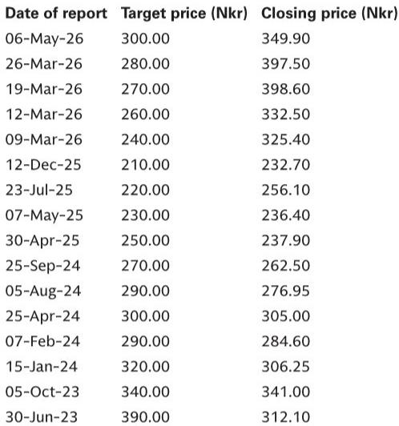

# GS：市场低估的不是资本开支本身，而是资本开支正在重塑行业竞争格局

这份GS研报传递了一个核心信号：全球正在进入一个由资本开支驱动的“后现代周期”，但市场对它的理解仍然停留在“谁在花钱”的层面，而忽略了“钱花在哪里、谁有能力花、花完之后谁受益”这三个更深层的结构性变化。

研报覆盖了从AI数据中心、油气勘探到电力基础设施的广泛领域，但将这些分散的线索串联起来，你会发现一个共同的主线：资本开支的回报逻辑正在从“规模扩张”转向“议价权重构”。那些能够将资本投入转化为行业准入壁垒、技术标准定义权或稀缺资源控制权的企业，才是这个周期真正的赢家。

以下是我们从这份报告中提炼出的五个关键洞察，以及一个尚未被充分讨论的隐忧。

## 1. 资本开支周期的本质不是“花钱”，而是“重新划定谁有资格进场”

GS全球策略师Peter Oppenheimer在研报中提出了一个关键判断：当前资本开支周期与以往不同，其回报更多来自每股盈利增长而非估值扩张，这意味着个股之间的分化将显著加大，主动选股的空间正在打开。

这个判断的潜台词是：市场正在从“水涨船高”的阶段进入“优胜劣汰”的阶段。过去几年，低利率环境下，几乎所有企业都能轻松融资、扩大投资，资本开支的回报差异被流动性掩盖。而现在，随着利率维持高位、融资成本上升，资本开支的“准入门槛”正在提高——只有那些拥有稳定现金流、明确战略方向和技术壁垒的企业，才能持续投入并看到回报。

以数据中心为例。GS欧洲公用事业分析师Alberto Gandolfi的最新估算显示，欧洲数据中心管道已接近500GW，相当于当前欧盟电力需求的1.5倍，六个月前这个数字还只有约300GW。这意味着，谁能在未来几年获得稳定的电力供应、谁能在电网接入和土地审批上占据先机，谁就掌握了AI基础设施的“入场券”。这不是简单的“花钱建数据中心”的问题，而是“谁有资格建、建在哪里、能否持续运营”的竞争。

同样的逻辑也适用于油气勘探。GS能源团队注意到，即使布伦特油价回落至80美元/桶附近，国际石油公司和国有石油公司仍在加大前沿勘探投入。原因很简单：过去十年，全球油气储采比下降了60%，而美国页岩油这个曾经压制油价的“供应缓冲器”正在成熟。在能源安全和储量焦虑的双重压力下，勘探投入不再是可选项，而是必选项。但能够承担这种长期、高风险资本开支的，只有那些资产负债表稳健、技术能力领先的头部企业。

所以，资本开支周期的核心不是“花多少钱”，而是“谁在花，以及花完之后他们能获得什么样的竞争位置”。

## 2. AI资本开支的“暗工厂”效应：软件行业的成本结构正在被重写

研报中一个常被忽视的细节来自GS美国科技团队组织的一场专家电话会。专家描述了一个“暗工厂”模型：编码代理自动编写代码并部署到生产环境，站点可靠性工程代理评估生产行为、诊断问题，并将信息反馈回开发循环，从而在软件创建和软件运营之间建立更紧密的闭环。

这个描述的意义远远超出了“AI提高效率”的泛泛之谈。它指向的是一个更根本的变化：软件行业的成本结构正在从“人力密集型”转向“资本密集型”。过去，软件公司的核心资产是工程师的脑力和时间，资本开支主要集中在服务器和办公空间。而“暗工厂”模型意味着，软件开发和运维的绝大部分环节可以被自动化，企业的竞争优势将从“谁能雇到更多更好的工程师”转向“谁能构建出更高效、更可靠的自动化系统”。

这对软件公司的商业模式意味着什么？GSIT支出调查显示，目前88%的CIO预计AI支出占IT预算的比例不到10%，但三年后，42%的CIO预计生成式AI支出将超过10%。这组数据说明，企业仍在测试和验证AI的实际价值，但一旦验证通过，资本开支将加速涌入。那些能够提供“AI原生基础设施”的企业——无论是芯片、服务器、数据中心还是自动化运维平台——将获得持续的定价权。

这也是为什么GS分析师Michael Ng在丹佛数据中心实地调研后指出，超大规模云服务商的AI基础设施需求依然强劲，数据中心定价权持续增强。资本开支正在从“成本项”变成“定价权护城河”。

## 3. 油气勘探的回归不是周期性的，而是结构性的——但市场可能低估了其持续性

研报中有一个值得反复咀嚼的细节：在EAGE（欧洲地球科学与工程联合会）地震行业会议上，参会人数创下历史新高。GS分析师Michele Della Vigna与Viridien（前CGG）CFO的交流中得到的反馈是：“前沿勘探回来了。”

这不仅仅是地缘政治事件的短期反应。研报明确指出，油气巨头对勘探投入的关注在近期中东冲突之前就已经开始回升。原因在于，投资者开始奖励勘探支出而非仅仅回购股票，因为储采比在过去十年下降了60%，而美国页岩油这个曾经压制油价的供应来源正在成熟。能源安全只是加剧了这一趋势。

GS预计，这些勘探项目在60美元/桶的油价环境下就能实现盈利，而当前布伦特油价仍在80美元/桶附近。这意味着，即使油价出现较大幅度的回落，这些项目的经济性仍然成立。因此，看空油价需要非常极端的假设才能推翻这一投资逻辑。

但市场对此的定价可能仍不充分。油气服务板块在油价回落后表现疲弱，投资者似乎仍在用“油价决定一切”的旧框架来评估这些公司。然而，如果勘探支出的结构性增长成立，那么油气服务公司的收入来源将从“跟随油价波动”转向“受益于资本开支的长期上行”，其估值逻辑需要重新审视。

GS建议关注TGS（地震数据服务商）和更广泛的油气服务板块，这背后的判断是：勘探增加意味着对地震数据、钻井设备、工程服务等上游服务的需求将持续增长，而这些服务的定价权正在向供应商倾斜。

## 4. 电力基础设施的瓶颈正在从“发电能力”转向“电网容量”，这改变了公用事业的估值框架

GS欧洲公用事业分析师Alberto Gandolfi提出的一个新框架值得关注：数据中心管道的爆发式增长正在改变公用事业行业的估值逻辑。过去，公用事业被视为防御性资产，其增长与GDP挂钩，估值主要看股息收益率和监管回报率。但现在，电力需求的结构性增长正在将公用事业重新定义为“增长型基础设施”。

关键变化在于瓶颈的转移。过去十年，可再生能源的扩张主要受制于发电成本和技术进步，电网容量虽然紧张但并非核心矛盾。而现在，数据中心的电力需求预计将增长70%（六个月内从约300GW增至近500GW），电网的承载能力成为了真正的瓶颈。这意味着，拥有成熟电网资产、能够快速接入新电源的公用事业公司，将在未来几年获得显著的竞争优势。

GS对Schneider Electric、Prysmian和Nexans的买入评级正是基于这一逻辑。这些公司的共同特点是：它们提供的不是发电设备，而是电力传输、分配和管理的“基础设施”。在电网扩容成为刚性需求的背景下，这些公司的订单能见度和定价能力都在提升。

但这里有一个尚未被充分讨论的问题：电网扩容的时间周期远长于数据中心建设周期。一个大型输电项目从规划到投产通常需要5-10年，而数据中心从动工到投运只需2-3年。这意味着，未来几年可能出现“数据中心等电”的局面，电力供应将成为AI基础设施扩张的真正瓶颈。那些提前布局电网投资、拥有政府关系和监管优势的企业，将在这个错配中获得超额回报。

## 5. 报告尚未完全回答的关键问题：资本开支的融资成本上升如何影响回报率

GS美国策略师Ben Snider在研报中提出了一个值得警惕的观点：AI资本开支的激增正在提高半导体行业的盈利能力，但将日益成为大型科技公司净资产收益率的拖累。

这个判断触及了当前资本开支周期的一个核心矛盾：资本开支的回报率能否覆盖融资成本？在利率处于高位、融资环境收紧的背景下，这个问题变得尤为关键。

以超大规模云服务商为例，它们每年在AI基础设施上的资本开支高达数百亿美元。这些投资能否在未来转化为足够的收入增长和利润，取决于三个因素：AI应用的商业化速度、竞争格局的变化，以及融资成本的变化。如果AI应用的收入增长低于预期，或者竞争对手同时加大投入导致价格战，那么这些资本开支的回报率可能低于融资成本，从而拖累整体ROE。

GS对此的立场是谨慎乐观的：研报认为AI需求依然强劲，数据中心的定价权在增强。但报告并未完全量化融资成本上升对资本开支回报率的影响。这是一个值得投资者密切跟踪的关键变量。

此外，研报提到的另一个潜在风险是：资本开支的“拥挤效应”。当所有行业都在加大投资时，优质资产（如稀缺的土地、电力接入权、技术人才）的价格将被推高，从而压缩新进入者的回报空间。那些在行业景气高点大举投资的“跟随者”，可能面临投资回报率低于预期的风险。

## 结语：顺着这些未解问题，继续深读

这份GS研报的价值在于，它不仅告诉了我们“谁在花钱、花在哪里”，更重要的是，它提供了一个分析框架，让我们理解这些资本开支将如何重塑不同行业的竞争格局。但正如我们上面讨论的，这个框架中仍有一些关键变量尚未完全解开：融资成本上升对回报率的影响、电网扩容的时间错配、以及AI应用商业化的节奏。

这些未解问题，恰恰是投资者需要持续跟踪和讨论的核心。欢迎来我们的知识星球微信群里，继续探讨这些话题。我们会定期分享对GS、MS、UBS等头部投行研报的深度解读，以及对这些未解问题的跟踪分析。

Personal reading notes and learning share only. Not investment advice.

