# Asia-Pacific Inflation Monitor: Oil Past the Peak

This publication summarizes regional and economy-specific inflation data across the Asia-Pacific economies we cover. The latest CPI/PPI data points are generally for May 2026, with some energy price data through mid-June.  
- Our commodity strategists have lowered their energy price forecasts somewhat (to \$80/bbl for Brent in Q4, from \$90/bbl previously) reflecting increased prospects for a re-opening of the Strait of Hormuz and much lower global oil prices in recent weeks. Import prices and producer prices rose sharply across Asia since early 2026 (though implicit or explicit subsidies have moderated or capped retail fuel prices in some countries), but are set to ease materially in the next monthly update.  
■ Pre-war, CPI inflation was broadly in line with or below central bank targets in most countries. Now, headline and core CPI inflation are generally in line with targets or above.  
Inflation pressures have been particularly acute in lower-income economies with more limited subsidies—the pace of seasonally-adjusted CPI inflation over the past three months in Philippines and Thailand remains over 10% annualized. But these economies have also seen much lower month-on-month headline CPI inflation in May.  
CPI inflation forecasts (both ours and the consensus) moved higher across the region since the onset of the Iran war, closure of the Strait of Hormuz, and consequent reduction in energy supply to Asia. But with energy prices well off the peak for some time, forecasts have converged somewhat, and we now see risks skewed to the downside.  
Wage inflation has been mixed across Asia-Pacific, but stable or lower in most of the region. One theme is notable softness in higher-income economies (Japan is one exception).

## Andrew Tilton

+852-2978-1802

andrew.tilton@gs.com

GS (Asia) L.L.C.

## Andrew Boak, CFA

+61(2)9321-8576

andrew.boak@gs.com

GS Australia Pty Ltd

## Akira Otani

+81(3)4587-9960 | akira.otani@gs.com

GS Japan Co., Ltd.

## Goohoon Kwon, CFA

+852-2978-0048

goohoon.kwon@gs.com

GS (Asia) L.L.C.

## Hui Shan

+852-2978-6634 | hui.shan@gs.com

GS (Asia) L.L.C.

## Santanu Sengupta

+91(22)6616-9042

santanu.sengupta@gs.com

GS India SPL

## Xinquan Chen

+852-2978-2418

xinquan.chen@gs.com

GS (Asia) L.L.C.

## Irene Choi

+82(2)3788-1722 | irene.choi@gs.com

GS (Asia) L.L.C., Seoul

Branch

## Will Maher

+61(2)9320-1013 | will.maher@gs.com

GS Australia Pty Ltd

## Tomohiro Ota

+81(3)4587-9984

tomohiro.ota@gs.com

GS Japan Co., Ltd.

## Yuriko Tanaka

+81(3)4587-9964

yuriko.tanaka@gs.com

GS Japan Co., Ltd.

## Lisheng Wang

+852-3966-4004

lisheng.wang@gs.com

GS (Asia) L.L.C.

## Chris Poh

+65-6889-3454 | chris.poh@gs.com

GS (Singapore) Pte

## Oscar To

+61(2)9320-1367 | oscar.to@gs.com

GS Australia Pty Ltd

## Yuting Yang

+852-2978-7283

yuting.y.yang@gs.com

GS (Asia) L.L.C.

## The Energy Price Shock

Exhibit 1: Energy flows through the Strait of Hormuz have yet to revive...  
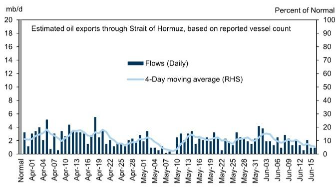

bar-line hybrid

Estimated oil exports through Strait of Hormuz, based on reported vessel count
| Date | Flows (Daily) (mb/d) | 4-Day moving average (RHS) |
|---|---|---|
| Normal | 3.0 | 10 |
| Apr-01 | 3.5 | 12 |
| Apr-04 | 5.0 | 18 |
| Apr-07 | 3.0 | 15 |
| Apr-10 | 4.0 | 20 |
| Apr-13 | 3.5 | 22 |
| Apr-16 | 5.5 | 25 |
| Apr-19 | 3.0 | 20 |
| Apr-22 | 3.5 | 18 |
| Apr-25 | 2.0 | 12 |
| Apr-28 | 2.5 | 10 |
| May-01 | 3.0 | 8 |
| May-04 | 1.0 | 5 |
| May-07 | 0.5 | 3 |
| May-10 | 3.0 | 10 |
| May-13 | 3.5 | 15 |
| May-16 | 3.0 | 18 |
| May-19 | 3.5 | 20 |
| May-22 | 3.0 | 18 |
| May-25 | 3.5 | 20 |
| May-28 | 3.0 | 18 |
| May-31 | 4.0 | 22 |
| Jun-03 | 3.5 | 20 |
| Jun-06 | 3.0 | 18 |
| Jun-09 | 2.5 | 15 |
| Jun-12 | 2.0 | 12 |
| Jun-15 | 1.5 | 10 |

Source: S&P Global Commodities at Sea, Kpler, GS Global Investment Research

Exhibit 2: ...though some Asian economies have secured imports from other sources  
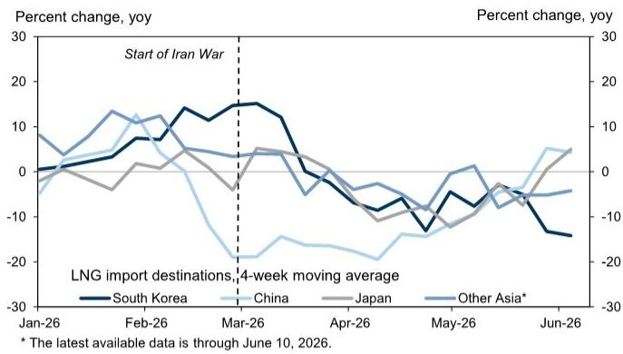

line chart

| Date | South Korea (Percent change, yoy) | China (Percent change, yoy) | Japan (Percent change, yoy) | Other Asia* (Percent change, yoy) |
|---|---|---|---|---|
| Jan-26 | ~1 | ~-5 | ~-3 | ~8 |
| Feb-26 | ~8 | ~12 | ~-5 | ~13 |
| Mar-26 | ~15 | ~-20 | ~-5 | ~5 |
| Apr-26 | ~-5 | ~-15 | ~-10 | ~-5 |
| May-26 | ~-10 | ~-15 | ~-10 | ~0 |
| Jun-26 | ~-15 | ~5 | ~5 | ~-5 |

Source: GS Global Investment Research

Exhibit 3: Oil prices are down sharply over the past month  
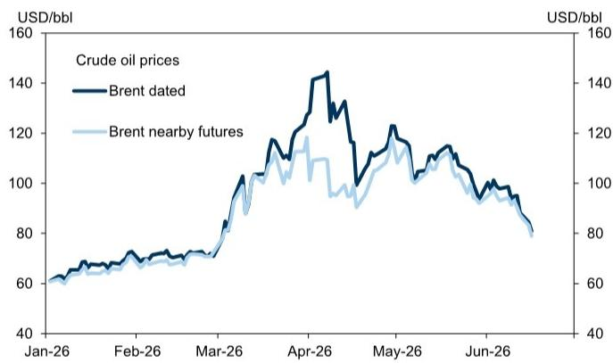

line chart

| Date   | Brent dated (USD/bbl) | Brent nearby futures (USD/bbl) |
|--------|------------------------|---------------------------------|
| Jan-26 | ~60                    | ~60                             |
| Feb-26 | ~70                    | ~65                             |
| Mar-26 | ~100                   | ~90                             |
| Apr-26 | ~140                   | ~110                            |
| May-26 | ~120                   | ~100                            |
| Jun-26 | ~80                    | ~70                             |

Source: Bloomberg, GS Global Investment Research

Exhibit 4: Refined product prices are also down, though they remain notably above pre-war levels  
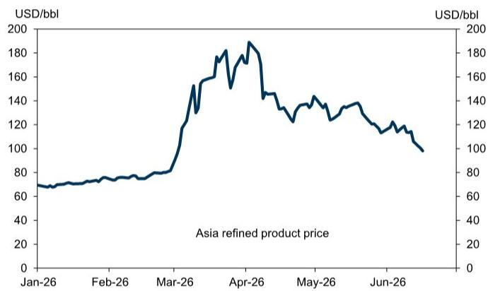

line chart

| Date | USD/bbl |
|---|---|
| Jan-26 | 70 |
| Feb-26 | 75 |
| Mar-26 | 80 |
| Apr-26 | 190 |
| May-26 | 130 |
| Jun-26 | 100 |

Source: GS Global Investment Research

Exhibit 5: Our base case oil forecast now has Brent at \$80/bbl in Q4  
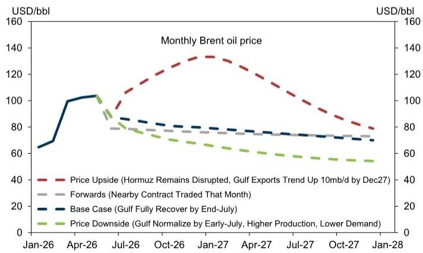

line chart

Monthly Brent oil price
| Date | Price Upside (Hormuz Remains Disrupted, Gulf Exports Trend Up 10mb/d by Dec27) (USD/bbl) | Forwards (Nearby Contract Traded That Month) (USD/bbl) | Base Case (Gulf Fully Recover by End-July) (USD/bbl) | Price Downside (Gulf Normalize by Early-July, Higher Production, Lower Demand) (USD/bbl) |
|---|---|---|---|---|
| Jan-26 | 65 | 75 | 65 | 60 |
| Apr-26 | 100 | 80 | 100 | 70 |
| Jul-26 | 105 | 78 | 85 | 65 |
| Oct-26 | 130 | 77 | 82 | 60 |
| Jan-27 | 135 | 76 | 80 | 58 |
| Apr-27 | 125 | 75 | 78 | 55 |
| Jul-27 | 115 | 74 | 76 | 53 |
| Oct-27 | 95 | 73 | 74 | 52 |
| Jan-28 | 80 | 72 | 72 | 50 |

Prices correspond to nearby futures contract traded that month.  
Source: ICE, GS Global Investment Research

## Regional inflation summary

This section provides an overview of regional trends; core inflation measures are economy-specific definitions. $^{1}$

Exhibit 6: Median headline CPI inflation up to 3% regionally  
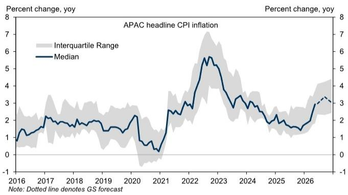

line chart

| Year | Median | Interquartile Range (Lower) | Interquartile Range (Upper) |
|------|--------|-----------------------------|-----------------------------|
| 2016 | 1.0    | 0.5                         | 2.5                         |
| 2017 | 1.5    | 0.8                         | 3.0                         |
| 2018 | 1.8    | 1.0                         | 3.5                         |
| 2019 | 1.6    | 0.7                         | 3.2                         |
| 2020 | 2.0    | 1.0                         | 3.8                         |
| 2021 | 0.5    | -0.5                        | 1.5                         |
| 2022 | 3.0    | 2.0                         | 4.5                         |
| 2023 | 5.5    | 4.0                         | 7.0                         |
| 2024 | 3.5    | 2.5                         | 4.5                         |
| 2025 | 2.5    | 1.5                         | 3.5                         |
| 2026 | 3.0    | 2.0                         | 4.0                         |
| 2027 | 3.5    | 2.5                         | 4.5                         |

Source: Haver Analytics, GS Global Investment Research

Exhibit 7: Core inflation generally has been well-behaved so far  
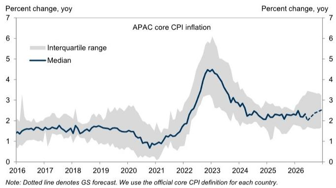

line chart

| Year | Median | Interquartile range (Lower) | Interquartile range (Upper) |
|------|--------|-----------------------------|-----------------------------|
| 2016 | 1.5    | 0.8                         | 3.0                         |
| 2017 | 1.6    | 0.9                         | 3.1                         |
| 2018 | 1.7    | 1.0                         | 3.2                         |
| 2019 | 1.8    | 1.1                         | 3.3                         |
| 2020 | 1.9    | 1.2                         | 3.4                         |
| 2021 | 0.8    | 0.5                         | 2.5                         |
| 2022 | 2.0    | 1.5                         | 4.0                         |
| 2023 | 4.5    | 3.0                         | 6.0                         |
| 2024 | 3.0    | 2.0                         | 4.5                         |
| 2025 | 2.5    | 1.5                         | 3.5                         |
| 2026 | 2.8    | 1.8                         | 3.8                         |
| 2027 | 3.0    | 2.0                         | 4.0                         |

Source: Haver Analytics, GS Global Investment Research

Exhibit 8: Inflation has been high since the onset of the war, but eased in May in a few economies

<table><tr><td rowspan="2" colspan="2"></td><td rowspan="2">As of</td><td rowspan="2">year-over-year</td><td rowspan="2">3m annl. Change, sa**</td><td rowspan="2">Monthly annl. Change, sa</td><td rowspan="2" colspan="14">2023</td><td colspan="101">2024</td><td></td><td></td><td></td><td></td><td></td><td></td><td></td><td></td><td></td><td></td><td></td><td></td><td></td><td></td><td></td><td></td><td></td><td></td><td></td><td></td><td></td><td></td><td></td><td></td><td></td><td></td><td></td><td></td><td></td><td></td><td></td><td></td><td></td><td></td><td></td><td></td><td></td><td></td><td></td><td></td><td></td><td></td><td></td><td></td><td></td><td></td><td></td><td></td><td></td><td></td><td></td><td></td><td></td><td></td><td></td><td></td><td></td><td></td><td></td><td></td><td></td><td></td><td></td><td></td><td></td><td></td><td></td><td></td><td></td><td></td><td></td><td></td><td></td><td></td><td></td><td></td><td></td><td></td><td></td><td></td><td></td><td></td><td></td><td></td><td></td><td></td><td></td><td></td><td></td><td></td><td></td><td></td><td></td><td></td><td></td><td></td><td></td><td></td><td></td><td></td><td></td><td></td><td></td><td></td><td></td><td></td><td></td><td></td><td></td><td></td><td></td><td></td><td></td><td></td><td></td><td></td><td></td><td></td><td></td><td></td><td></td><td></td><td></td><td></td><td></td><td></td><td></td><td></td><td></td><td></td><td></td><td></td><td></td><td></td><td></td><td></td><td></td><td></td><td></td><td></td><td></td><td></td><td></td><td></td><td></td><td></td><td></td><td></td><td></td><td></td><td></td><td></td><td></td><td></td><td></td><td></td><td></td><td></td><td></td><td></td><td></td><td></td><td></td><td></td><td></td><td></td><td></td><td></td><td></td><td></td><td></td><td></td><td></td><td></td><td></td><td></td><td></td><td></td><td></td><td></td><td></td><td></td><td></td><td></td><td></td><td></td><td></td><td></td><td></td><td></td><td></td><td></td><td></td><td></td><td></td><td></td><td></td><td></td><td></td><td></td><td></td><td></td><td></td><td></td><td></td><td></td><td></td><td></td><td></td><td></td><td></td><td></td><td></td><td></td><td></td><td></td><td></td><td></td><td></td><td></td><td></td><td></td><td></td><td></td><td></td><td></td><td></td><td></td><td></td><td></td><td></td><td></td><td></td><td></td><td></td><td></td><td></td><td></td><td></td><td></td><td></td><td></td><td></td><td></td><td></td><td></td><td></td><td></td><td></td><td></td><td></td><td></td><td></td><td></td><td></td><td></td><td></td><td></td><td></td><td></td><td></td><td></td><td></td><td></td><td></td><td></td><td></td><td></td><td></td><td></td><td></td><td></td><td></td><td></td><td></td><td></td><td></td><td></td><td></td><td></td><td></td><td></td><td></td><td></td><td></td><td></td><td></td><td></td><td></td><td></td><td></td><td></td><td></td><td></td><td></td><td></td><td></td><td></td><td></td><td></td><td></td><td></td><td></td><td></td><td></td><td></td><td></td><td></td><td></td><td></td><td></td><td></td><td></td><td></td><td></td><td></td><td></td><td></td><td></td><td></td><td></td><td></td><td></td><td></td><td></td><td></td><td></td><td></td><td></td><td></td><td></td><td></td><td></td><td></td><td></td><td></td><td></td><td></td><td></td><td></td><td></td><td></td><td></td><td></td><td></td><td></td><td></td><td></td><td></td><td></td><td></td><td></td><td></td><td></td><td></td><td></td><td></td><td></td><td></td><td></td><td></td><td></td><td></td><td></td><td></td><td></td><td></td><td></td><td></td><td></td><td></td><td></td><td></td><td></td><td></td><td></td><td></td><td></td><td></td><td></td><td></td><td></td><td></td><td></td><td></td><td></td><td></td><td></td><td></td><td></td><td></td><td></td><td></td><td></td><td></td><td></td><td></td><td></td><td></td><td></td><td></td><td></td><td></td><td></td><td></td><td></td><td></td><td></td><td></td><td></td><td></td><td></td><td></td><td></td><td></td><td></td><td></td><td></td><td></td><td></td><td></td><td></td><td></td><td></td><td></td><td></td><td></td><td></td><td></td><td></td><td></td><td></td><td></td><td></td><td></td><td></td><td></td><td></td><td></td><td></td><td></td><td></td><td></td><td></td><td></td><td></td><td></td><td></td><td></td><td></td><td></td><td></td><td></td><td></td><td></td><td></td><td></td><td></td><td></td><td></td><td></td><td></td><td></td><td></td><td></td><td></td><td></td><td></td><td></td><td></td><td></td><td></td></tr><tr><td>J</td><td>J</td><td>A</td><td>S</td><td>O</td><td>N</td><td>D</td><td>J</td><td>F</td><td>M</td><td>A</td><td>M</td><td>J</td><td>J</td><td>A</td><td>S</td><td>O</td><td>N</td><td>D</td><td>J</td><td>F</td><td>M</td><td>A</td><td>M</td><td>J</td><td>J</td><td>A</td><td>S</td><td>O</td><td>N</td><td>D</td><td>J</td><td>F</td><td>M</td><td>A</td><td>M</td><td>J</td><td>J</td><td>A</td><td>S</td><td>O</td><td>N</td><td>D</td><td>J</td><td>F</td><td>M</td><td>A</td><td>M</td><td>J</td><td>J</td><td>A</td><td>S</td><td>O</td><td>N</td><td>D</td><td>J</td><td>F</td><td>M</td><td>A</td><td>M</td><td>J</td><td>A</td><td>S</td><td>O</td><td>N</td><td>D</td><td>J</td><td>F</td><td>M</td><td>A</td><td>M</td><td>J</td><td>J</td><td>A</td><td>S</td><td>O</td><td>N</td><td>D</td><td>J</td><td>F</td><td>M</td><td>A</td><td>M</td><td>J</td><td>J</td><td>A</td><td>S</td><td>O</td><td>N</td><td>D</td><td>J</td><td>F</td><td>M</td><td>A</td><td>M</td><td>J</td><td>J</td><td>A</td><td>S</td><td>O</td><td>N</td><td>D</td><td>J</td><td>F</td><td>M</td><td>A</td><td>M</td><td>J</td><td>J</td><td>B</td><td>C</td><td>D</td><td>J</td><td>F</td><td>M</td><td>A</td><td>M</td><td>J</td><td>J</td><td>A</td><td>S</td><td>O</td><td>N</td><td>D</td><td>J</td><td>F</td><td>M</td><td>A</td><td>M</td><td>J</td><td>J</td><td>A</td><td>S</td><td>O</td><td>N</td><td>D</td><td>J</td><td>F</td><td>M</td><td>A</td><td>M</td><td>J</td><td>J</td><td>A</td><td>S</td><td>O</td><td>N</td><td>D</td><td>J</td><td>F</td><td>M</td><td>A</td><td>M</td><td>J</td><td>J</td><td>A</td><td>S</td><td>O</td><td>N</td><td>D</td><td colspan="100">2026</td><td></td><td></td><td></td><td></td><td></td><td></td><td></td><td></td><td></td><td></td><td></td><td></td><td></td><td></td><td></td><td></td><td></td><td></td><td></td><td></td><td></td><td></td><td></td><td></td><td></td><td></td><td></td><td></td><td></td><td></td><td></td><td></td><td></td><td></td><td></td><td></td><td></td><td></td><td></td><td></td><td></td><td></td><td></td><td></td><td></td><td></td><td></td><td></td><td></td><td></td><td></td><td></td><td></td><td></td><td></td><td></td><td></td><td></td><td></td><td></td><td></td><td></td><td></td><td></td><td></td><td></td><td></td><td></td><td></td><td></td><td></td><td></td><td></td><td></td><td></td><td></td><td></td><td></td><td></td><td></td><td></td><td></td><td></td><td></td><td></td><td></td><td></td><td></td><td></td><td></td><td></td><td></td><td></td><td></td><td></td><td></td><td></td><td></td><td></td><td></td><td></td><td></td><td></td><td></td><td></td><td></td><td></td><td></td><td></td><td></td><td></td><td></td><td></td><td></td><td></td><td></td><td></td><td></td><td></td><td></td><td></td><td></td><td></td><td></td><td></td><td></td><td></td><td></td><td></td><td></td><td></td><td></td><td></td><td></td><td></td><td></td><td></td><td></td><td></td><td></td><td></td><td></td><td></td><td></td><td></td><td></td><td></td><td></td><td></td><td></td><td></td><td></td><td></td><td></td><td></td><td></td><td></td><td></td><td></td><td></td><td></td><td></td><td></td><td></td><td></td><td></td><td></td><td></td><td></td><td></td><td></td><td></td><td></td><td></td><td></td><td></td><td></td><td></td><td></td><td></td><td></td><td></td><td></td><td></td><td></td><td></td><td></td><td></td><td></td><td></td><td></td><td></td><td></td><td></td><td></td><td></td><td></td><td></td><td></td><td></td><td></td><td></td><td></td><td></td><td></td><td></td><td></td><td></td><td></td><td></td><td></td><td></td><td></td><td></td><td></td><td></td><td></td><td></td><td></td><td></td><td></td><td></td><td></td><td></td><td></td><td></td><td></td><td></td><td></td><td></td><td></td><td></td><td></td><td></td><td></td><td></td><td></td><td></td><td></td><td></td><td></td><td></td><td></td><td></td><td></td><td></td><td></td><td></td><td></td><td></td><td></td><td></td><td></td><td></td><td></td><td></td><td></td><td></td><td></td><td></td><td></td><td></td><td></td><td></td><td></td><td></td><td></td><td></td><td></td><td></td><td></td><td></td><td></td><td></td><td></td><td></td><td></td><td></td><td></td><td></td><td></td><td></td><td></td><td></td><td></td><td></td><td></td><td></td><td></td><td></td><td></td><td></td><td></td><td></td><td></td><td></td><td></td><td></td><td></td><td></td><td></td><td></td><td></td><td></td><td></td><td></td><td></td><td></td><td></td><td></td><td></td><td></td><td></td><td></td><td></td><td></td><td></td><td></td><td></td><td></td><td></td><td></td><td></td><td></td><td></td><td></td></tr><tr><td rowspan="3">Total CPI inflation</td><td>China</td><td>May-26</td><td>1.2</td><td>2.6</td><td>0.7</td><td></td><td></td><td></td><td></td><td></td><td></td><td></td><td></td><td></td><td></td><td></td><td></td><td></td><td></td><td></td><td></td><td></td><td></td><td></td><td></td><td></td><td></td><td></td><td></td><td></td><td></td><td></td><td></td><td></td><td></td><td></td><td></td><td></td><td></td><td></td><td></td><td></td><td></td><td></td><td></td><td></td><td></td><td></td><td></td><td></td><td></td><td></td><td></td><td></td><td></td><td></td><td></td><td></td><td></td><td></td><td></td><td></td><td></td><td></td><td></td><td></td><td></td><td></td><td></td><td></td><td></td><td></td><td></td><td></td><td></td><td></td><td></td><td></td><td></td><td></td><td></td><td></td><td></td><td></td><td></td><td></td><td></td><td></td><td></td><td></td><td></td><td></td><td></td><td></td><td></td><td></td><td></td><td></td><td></td><td></td><td></td><td></td><td></td><td></td><td rowspan="2" colspan="95">2026</td><td rowspan="2"></td><td rowspan="2"></td><td rowspan="2"></td><td rowspan="2"></td><td rowspan="2"></td><td></td><td></td><td></td><td></td><td></td><td></td><td></td><td></td><td></td><td></td><td></td><td></td><td></td><td></td><td></td><td></td><td></td><td></td><td></td><td></td><td></td><td></td><td></td><td></td><td></td><td></td><td></td><td></td><td></td><td></td><td></td><td></td><td></td><td></td><td></td><td></td><td></td><td></td><td></td><td></td><td></td><td></td><td></td><td></td><td></td><td></td><td></td><td></td><td></td><td></td><td></td><td></td><td></td><td></td><td></td><td></td><td></td><td></td><td></td><td></td><td></td><td></td><td></td><td></td><td></td><td></td><td></td><td></td><td></td><td></td><td></td><td></td><td></td><td></td><td></td><td></td><td></td><td></td><td></td><td></td><td></td><td></td><td></td><td></td><td></td><td></td><td></td><td></td><td></td><td></td><td></td><td></td><td></td><td></td><td></td><td></td><td></td><td></td><td></td><td></td><td rowspan="2"></td><td rowspan="2"></td><td rowspan="2"></td><td rowspan="2"></td><td rowspan="2"></td><td rowspan="2"></td><td rowspan="2"></td><td rowspan="2"></td><td rowspan="2"></td><td rowspan="2"></td><td rowspan="2"></td><td rowspan="2"></td><td rowspan="2"></td><td rowspan="2"></td><td rowspan="2"></td><td rowspan="2"></td><td rowspan="2"></td><td rowspan="2"></td><td rowspan="2"></td><td rowspan="2"></td><td rowspan="2"></td><td rowspan="2"></td><td rowspan="2"></td><td rowspan="2"></td><td rowspan="2"></td><td rowspan="2"></td><td rowspan="2"></td><td rowspan="2"></td><td rowspan="2"></td><td rowspan="2"></td><td rowspan="2"></td><td rowspan="2"></td><td rowspan="2"></td><td rowspan="2"></td><td rowspan="2"></td><td rowspan="2"></td><td rowspan="2"></td><td rowspan="2"></td><td rowspan="2"></td><td rowspan="2"></td><td rowspan="2"></td><td rowspan="2"></td><td rowspan="2"></td><td rowspan="2"></td><td rowspan="2"></td><td rowspan="2"></td><td rowspan="2"></td><td rowspan="2"></td><td rowspan="2"></td><td rowspan="2"></td><td rowspan="2"></td><td rowspan="2"></td><td rowspan="2"></td><td rowspan="2"></td><td rowspan="2"></td><td rowspan="2"></td><td rowspan="2"></td><td rowspan="2"></td><td rowspan="2"></td><td rowspan="2"></td><td rowspan="2"></td><td rowspan="2"></td><td rowspan="2"></td><td rowspan="2"></td><td rowspan="2"></td><td rowspan="2"></td><td rowspan="2"></td><td rowspan="2"></td><td rowspan="2"></td><td rowspan="2"></td><td rowspan="2"></td><td rowspan="2"></td><td rowspan="2"></td><td rowspan="2"></td><td rowspan="2"></td><td rowspan="2"></td><td rowspan="2"></td><td rowspan="2"></td><td rowspan="2"></td><td rowspan="2"></td><td rowspan="2"></td><td rowspan="2"></td><td rowspan="2"></td><td rowspan="2"></td><td rowspan="2"></td><td rowspan="2"></td><td rowspan="2"></td><td rowspan="2"></td><td rowspan="2"></td><td rowspan="2"></td><td rowspan="2"></td><td rowspan="2"></td><td rowspan="2"></td><td rowspan="2"></td><td></td><td></td><td></td><td></td><td></td><td></td><td></td><td></td><td></td><td></td><td></td><td></td><td></td><td></td><td></td><td></td><td></td><td></td><td></td><td></td><td></td><td></td><td></td><td></td><td></td><td></td><td></td><td></td><td></td><td></td><td></td><td></td><td></td><td></td><td></td><td></td><td></td><td></td><td></td><td></td><td></td><td></td><td></td><td></td><td></td><td></td><td></td><td></td><td></td><td></td><td></td><td></td><td></td><td></td><td></td><td></td><td></td><td></td><td></td><td></td><td></td><td></td><td></td><td></td><td></td><td></td><td></td><td></td><td></td><td></td><td></td><td></td><td></td><td></td><td></td><td></td><td></td><td></td><td></td><td></td><td></td><td></td><td></td><td></td><td></td><td></td><td></td><td></td><td></td><td></td><td></td><td></td><td></td><td></td><td></td><td></td><td></td><td></td><td></td><td></td><td></td><td></td><td></td><td></td><td></td><td></td><td></td><td></td><td></td><td></td><td></td><td></td><td></td><td></td><td></td><td></td><td></td><td></td><td></td><td></td><td></td><td></td><td></td><td></td><td></td><td></td><td></td><td></td><td></td><td></td><td></td><td></td><td></td><td></td><td></td><td></td><td></td><td></td><td></td><td></td><td></td><td></td><td></td><td></td><td></td><td></td><td></td><td></td><td></td><td></td><td></td><td></td><td></td><td></td><td></td><td></td><td></td><td></td><td></td><td></td><td></td><td></td><td></td><td></td><td></td><td></td><td></td><td></td><td></td><td></td><td></td><td></td><td></td><td></td><td></td><td></td><td></td><td></td><td></td><td></td><td></td><td></td><td></td><td></td><td></td><td></td><td></td><td></td><td></td><td></td><td></td><td></td><td></td><td></td></tr><tr><td>South Korea</td><td>May-26</td><td>3.1</td><td>4.4</td><td>6.8</td><td></td><td></td><td></td><td></td><td></td><td></td><td></td><td></td><td></td><td></td><td></td><td></td><td></td><td></td><td></td><td></td><td></td><td></td><td></td><td></td><td></td><td></td><td></td><td></td><td></td><td></td><td></td><td></td><td></td><td></td><td></td><td></td><td></td><td></td><td></td><td></td><td></td><td></td><td></td><td></td><td></td><td></td><td></td><td></td><td></td><td></td><td></td><td></td><td></td><td></td><td></td><td></td><td></td><td></td><td></td><td></td><td></td><td></td><td></td><td></td><td></td><td></td><td></td><td></td><td></td><td></td><td></td><td></td><td></td><td></td><td></td><td></td><td></td><td></td><td></td><td></td><td></td><td></td><td></td><td></td><td></td><td></td><td></td><td></td><td></td><td></td><td></td><td></td><td></td><td></td><td></td><td></td><td></td><td></td><td></td><td></td><td></td><td></td><td></td><td colspan="95">2026</td><td></td><td></td><td></td><td></td><td></td><td colspan="100">2026*</td><td colspan="94">2026*</td></tr><tr><td>Taiwan</td><td>May-26</td><td>2.2</td><td>2.9</td><td>3.1</td><td></td><td></td><td></td><td></td><td></td><td></td><td></td><td></td><td></td><td></td><td></td><td></td><td></td><td></td><td></td><td></td><td></td><td></td><td></td><td></td><td></td><td></td><td></td><td></td><td></td><td></td><td></td><td></td><td></td><td></td><td></td><td></td><td></td><td></td><td></td><td></td><td></td><td></td><td></td><td></td><td></td><td></td><td></td><td></td><td></td><td></td><td></td><td></td><td></td><td></td><td></td><td></td><td></td><td></td><td></td><td></td><td></td><td></td><td></td><td></td><td></td><td></td><td></td><td></td><td></td><td></td><td></td><td></td><td></td><td></td><td></td><td></td><td></td><td></td><td></td><td></td><td></td><td></td><td></td><td></td><td></td><td></td><td></td><td></td><td></td><td></td><td></td><td></td><td></td><td></td><td></td><td></td><td></td><td></td><td></td><td></td><td></td><td></td><td></td><td></td><td></td><td></td><td></td><td></td><td></td><td></td><td></td><td></td><td></td><td></td><td></td><td></td><td></td><td></td><td></td><td></td><td></td><td></td><td></td><td></td><td></td><td></td><td></td><td></td><td></td><td></td><td></td><td></td><td></td><td></td><td></td><td></td><td></td><td></td><td></td><td></td><td></td><td></td><td></td><td></td><td></td><td></td><td></td><td></td><td></td><td></td><td></td><td></td><td></td><td></td><td></td><td></td><td></td><td></td><td></td><td></td><td></td><td></td><td></td><td></td><td></td><td></td><td></td><td></td><td></td><td></td><td></td><td></td><td></td><td></td><td></td><td></td><td></td><td></td><td></td><td></td><td></td><td></td><td></td><td></td><td></td><td></td><td></td><td></td><td></td><td></td><td></td><td></td><td></td><td></td><td></td><td></td><td></td><td></td><td></td><td></td><td></td><td></td><td></td><td></td><td></td><td></td><td></td><td></td><td></td><td></td><td></td><td></td><td></td><td></td><td></td><td></td><td></td><td></td><td></td><td></td><td></td><td></td><td></td><td></td><td></td><td></td><td></td><td></td><td></td><td></td><td></td><td></td><td></td><td></td><td></td><td></td><td></td><td></td><td></td><td></td><td></td><td></td><td></td><td></td><td></td><td></td><td></td><td></td><td></td><td></td><td></td><td></td><td></td><td></td><td></td><td></td><td></td><td></td><td></td><td></td><td></td><td></td><td></td><td></td><td></td><td></td><td></td><td></td><td></td><td></td><td></td><td></td><td></td><td></td><td></td><td></td><td></td><td></td><td></td><td></td><td></td><td></td><td></td><td></td><td></td><td></td><td></td><td></td><td></td><td></td><td></td><td></td><td></td><td></td><td></td><td></td><td></td><td></td><td></td><td></td><td></td><td></td><td></td><td></td><td></td><td></td><td></td><td></td><td></td><td></td><td></td><td></td><td></td><td></td><td></td><td></td><td></td><td></td><td></td><td></td><td></td><td></td><td></td><td></td><td></td><td></td><td></td><td></td><td></td><td></td><td></td><td></td><td></td><td></td><td></td><td></td><td></td><td></td><td></td><td></td><td></td><td></td><td></td><td></td><td></td><td></td><td></td><td></td><td></td><td></td><td></td><td></td><td></td><td></td><td></td><td></td><td></td><td></td><td></td><td></td><td></td><td></td><td></td><td></td><td></td><td></td><td></td><td></td><td></td><td></td><td></td><td></td><td></td><td></td><td></td><td></td><td></td><td></td><td></td><td></td><td></td><td></td><td></td><td></td><td></td><td></td><td></td><td></td><td></td><td></td><td></td><td></td><td></td><td></td><td></td><td></td><td></td><td></td><td></td><td></td><td></td><td></td><td></td><td></td><td></td><td></td><td></td><td></td><td></td><td></td><td></td><td></td><td></td><td></td><td></td><td></td><td></td><td></td><td></td><td></td><td></td><td></td><td></td><td></td><td></td><td></td><td></td><td></td><td></td><td></td><td></td><td></td><td></td><td></td><td></td><td></td><td></td><td></td><td></td><td></td><td></td><td></td><td></td><td></td><td></td><td></td><td></td><td></td><td></td><td></td><td></td><td></td><td></td><td></td><td></td><td></td><td></td><td></td><td></td><td></td><td></td><td></td><td></td><td></td><td></td><td></td><td></td><td></td><td></td><td></td><td></td><td></td><td></td><td></td><td></td><td></td><td></td><td></td><td></td><td></td><td></td><td></td><td></td><td></td><td></td><td></td><td></td><td></td><td></td><td></td><td></td><td></td><td></td><td></td><td></td><td></td><td></td><td></td><td></td><td></td><td></td><td></td><td></td><td></td><td></td><td></td><td></td><td></td><td></td><td></td><td></td><td></td><td></td><td></td><td></td><td></td><td></td><td></td><td></td><td></td><td></td><td></td><td></td><td></td><td></td><td></td><td></td><td></td><td></td><td></td><td></td><td></td><td></td><td></td><td></td><td></td><td></td><td></td><td></td><td></td><td></td><td></td><td></td><td></td><td></td><td></td><td></td><td></td><td></td><td></td><td></td><td></td><td></td><td></td><td></td><td></td><td></td><td></td><td></td><td></td><td></td><td></td><td></td><td></td><td></td><td></td><td></td><td></td><td></td><td></td><td></td><td></td><td></td><td></td><td></td><td></td><td></td><td></td><td></td><td></td><td></td><td></td><td></td><td></td><td></td><td></td><td></td><td></td><td></td><td></td><td></td></tr></table>

\* New Zealand headline CPI, Australia core CPI and New Zealand core CPI are released quarterly. \*\*qoq figures are reported for New Zealand headline CPI, Australia core CPI and New Zealand core CPI.  
\* The grey line area indicates unreleased data.  
Source: Haver Analytics, GS Global Investment Research

Exhibit 9: Inflation is generally in line with, or above, policy targets across the region  
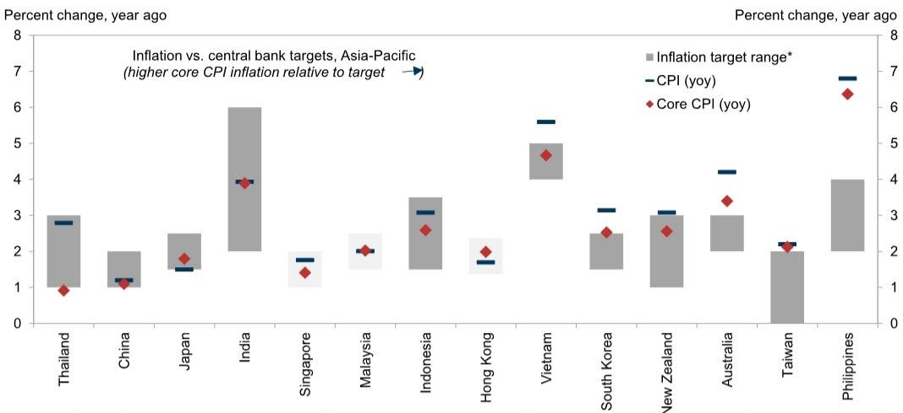

bar-line hybrid

Inflation vs. central bank targets, Asia-Pacific (higher core CPI inflation relative to target)
| Country | Inflation target range* (Percent change, year ago) | Core CPI (yoy) (Percent change, year ago) |
| :--- | :--- | :--- |
| Thailand | 3.0 | 1.0 |
| China | 2.0 | 1.2 |
| Japan | 2.5 | 1.8 |
| India | 6.0 | 4.0 |
| Singapore | 1.8 | 1.5 |
| Malaysia | 2.5 | 2.0 |
| Indonesia | 3.5 | 2.7 |
| Hong Kong | 2.3 | 2.0 |
| Vietnam | 4.2 | 4.8 |
| South Korea | 2.5 | 2.6 |
| New Zealand | 3.0 | 2.7 |
| Australia | 3.0 | 3.5 |
| Taiwan | 2.0 | 2.2 |
| Philippines | 4.0 | 6.5 |
Percent change, year ago

\* For Hong Kong and Malaysia, we use avg. annualized CPI in 5 years prior to the pandemic; for Singapore 1% -2% (all light shading). For point targets, a +0.5/-  
0.5 range is displayed for clarity. We treat China's target as a ceiling.  
\* The latest CPI releases were April for Hong Kong, Singapore, and Australia, and March for New Zealand.

Source: Haver Analytics, CEIC, GS Global Investment Research

Exhibit 10: Inflation forecasts have largely converged as oil prices have come off the peaks  
Consumer Prices (year-over-year)

<table><tr><td rowspan="2"></td><td rowspan="2">2025</td><td colspan="2">2026</td><td colspan="2">2027</td><td rowspan="2">Inflation Target/ Range</td></tr><tr><td>GS</td><td>Consensus</td><td>GS</td><td>Consensus</td></tr><tr><td>Asia ex-Japan</td><td>0.7</td><td>1.9</td><td>1.9</td><td>1.7</td><td>1.8</td><td></td></tr><tr><td>China</td><td>0.0</td><td>1.0</td><td>1.1</td><td>1.0</td><td>1.1</td><td>2.0^</td></tr><tr><td>India</td><td>2.2</td><td>4.6</td><td>4.5</td><td>5.1</td><td>4.9</td><td>2.0-6.0</td></tr><tr><td>South Korea</td><td>2.1</td><td>2.6</td><td>2.7</td><td>2.2</td><td>2.1</td><td>2.0</td></tr><tr><td>Hong Kong</td><td>1.4</td><td>2.1</td><td>2.1</td><td>2.0</td><td>2.0</td><td>-</td></tr><tr><td>Taiwan</td><td>1.7</td><td>1.9</td><td>2.0</td><td>1.5</td><td>1.8</td><td>0.0-2.0</td></tr><tr><td>ASEAN</td><td>1.6</td><td>3.6</td><td>3.3</td><td>2.4</td><td>2.6</td><td></td></tr><tr><td>Singapore</td><td>0.9</td><td>2.3</td><td>2.2</td><td>2.0</td><td>2.0</td><td>-</td></tr><tr><td>Malaysia</td><td>1.4</td><td>2.3</td><td>2.1</td><td>2.1</td><td>2.0</td><td>-</td></tr><tr><td>Thailand</td><td>-0.1</td><td>2.6</td><td>2.6</td><td>2.1</td><td>1.6</td><td>1.0-3.0</td></tr><tr><td>Indonesia</td><td>1.9</td><td>3.8</td><td>3.2</td><td>2.2</td><td>2.8</td><td>1.5-3.5</td></tr><tr><td>Philippines</td><td>1.7</td><td>5.7</td><td>6.1</td><td>2.9</td><td>4.0</td><td>2.0-4.0</td></tr><tr><td>Vietnam</td><td>3.3</td><td>5.0</td><td>4.4</td><td>3.5</td><td>3.6</td><td>4.5</td></tr><tr><td>Japan</td><td>3.2</td><td>2.0</td><td>2.0</td><td>2.3</td><td>2.1</td><td>2.0</td></tr><tr><td>Australia</td><td>2.8</td><td>4.4</td><td>4.3</td><td>2.8</td><td>2.9</td><td>2.0-3.0</td></tr><tr><td>New Zealand</td><td>2.8</td><td>3.6</td><td>3.6</td><td>2.1</td><td>2.2</td><td>1.0-3.0</td></tr><tr><td>USA</td><td>2.7</td><td>3.6</td><td>3.5</td><td>2.6</td><td>2.4</td><td>2.0</td></tr><tr><td>Euro area</td><td>2.1</td><td>2.9</td><td>2.9</td><td>2.4</td><td>2.3</td><td>2.0</td></tr></table>

^We see the "target" as the upper bound of the desirable range.  
Note: All forecasts are calculated on calendar year basis; Bloomberg FY forecasts used for India consensus  
when quarterly figure not available. Regional inflation figures are GDP-weighted averages.

Source: Central Banks, Bloomberg, GS Global Investment Research

## Mainland China

Exhibit 11: China CPI inflation  
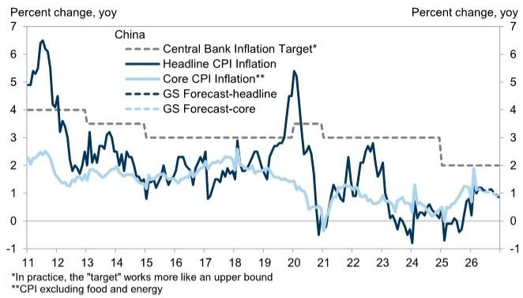

line chart

| Year | Central Bank Inflation Target* | Headline CPI Inflation | Core CPI Inflation** | GS Forecast-headline | GS Forecast-core |
|------|----------------------------------|------------------------|----------------------|----------------------|-----------------|
| 11   | 4.0                              | 5.0                    | 2.5                  | 3.0                  | 2.0             |
| 12   | 4.0                              | 6.0                    | 2.0                  | 3.5                  | 1.5             |
| 13   | 4.0                              | 4.0                    | 1.5                  | 3.0                  | 1.0             |
| 14   | 4.0                              | 3.0                    | 1.0                  | 2.5                  | 0.5             |
| 15   | 4.0                              | 2.0                    | 0.5                  | 2.0                  | 0.0             |
| 16   | 4.0                              | 2.5                    | 1.0                  | 2.5                  | 0.5             |
| 17   | 4.0                              | 3.0                    | 1.5                  | 3.0                  | 1.0             |
| 18   | 4.0                              | 2.0                    | 2.0                  | 3.5                  | 1.5             |
| 19   | 4.0                              | 3.0                    | 2.5                  | 4.0                  | 2.0             |
| 20   | 4.0                              | 5.5                    | 3.0                  | 4.5                  | 2.5             |
| 21   | 4.0                              | -1.0                   | -1.5                 | -2.0                 | -1.0            |
| 22   | 4.0                              | 2.5                    | 1.0                  | 3.0                  | 1.5             |
| 23   | 4.0                              | 3.0                    | 1.5                  | 3.5                  | 2.0             |
| 24   | 4.0                              | -1.0                   | -1.5                 | -2.0                 | -1.0            |
| 25   | 4.0                              | -1.5                   | -2.0                 | -2.5                 | -1.5            |
| 26   | 4.0                              | 1.5                    | -1.5                 | -3.0                 | -2.0            |

Source: Haver Analytics, GS Global Investment Research

Exhibit 12: China CPI momentum  
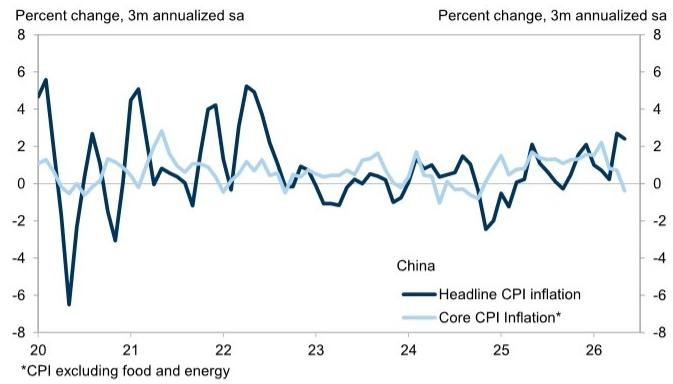

line chart

| Year | Headline CPI inflation | Core CPI Inflation* |
|------|------------------------|---------------------|
| 20   | 5.0                    | 1.0                 |
| 21   | -3.0                   | 2.0                 |
| 22   | 4.0                    | 1.0                 |
| 23   | -1.0                   | 0.0                 |
| 24   | 1.0                    | 1.5                 |
| 25   | -2.0                   | 0.0                 |
| 26   | 2.0                    | 1.0                 |

Source: Haver Analytics, GS Global Investment Research

Exhibit 13: China CPI contribution breakdown  
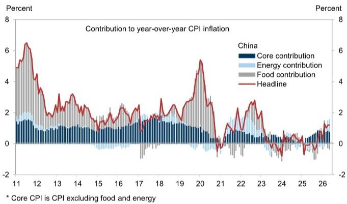

line chart

| Year | Core contribution | Energy contribution | Food contribution | Headline |
|------|-------------------|---------------------|-------------------|----------|
| 11   | ~1.5%             | ~1.0%               | ~6.5%             | ~7.0%    |
| 12   | ~1.0%             | ~0.5%               | ~4.0%             | ~5.5%    |
| 13   | ~0.8%             | ~0.3%               | ~2.5%             | ~3.0%    |
| 14   | ~0.7%             | ~0.2%               | ~2.0%             | ~2.5%    |
| 15   | ~0.6%             | ~0.1%               | ~1.5%             | ~2.0%    |
| 16   | ~0.5%             | ~0.0%               | ~1.0%             | ~1.5%    |
| 17   | ~0.4%             | ~-0.1%              | ~0.5%             | ~1.0%    |
| 18   | ~0.3%             | ~-0.2%              | ~0.0%             | ~0.5%    |
| 19   | ~0.2%             | ~-0.3%              | ~-0.5%            | ~0.0%    |
| 20   | ~0.1%             | ~-0.4%              | ~-1.0%            | ~-0.5%   |
| 21   | ~0.0%             | ~-0.5%              | ~-1.5%            | ~-1.0%   |
| 22   | ~0.1%             | ~-0.6%              | ~-1.0%            | ~-0.5%   |
| 23   | ~0.2%             | ~-0.7%              | ~-0.5%            | ~-0.2%   |
| 24   | ~0.3%             | ~-0.8%              | ~-0.2%            | ~-0.1%   |
| 25   | ~0.4%             | ~-0.9%              | ~0.0%             | ~0.0%    |
| 26   | ~0.5%             | ~-1.0%              | ~0.5%             | ~0.5%    |

Source: NBS, GS Global Investment Research

Exhibit 14: China PPI and Import Price Index  
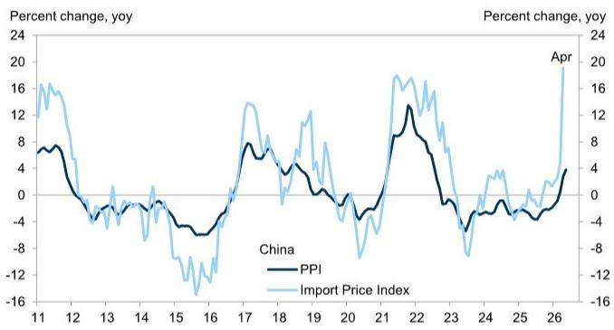

line chart

| Year | PPI   | Import Price Index |
|------|-------|--------------------|
| 2026 | 4.0   | 20.0               |

Source: Haver Analytics, GS Global Investment Research

Exhibit 15: China wage growth  
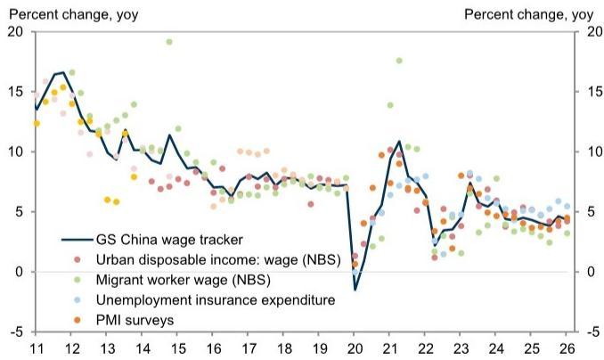

line chart

| Year | GS China wage tracker | Urban disposable income: wage (NBS) | Migrant worker wage (NBS) | Unemployment insurance expenditure | PMI surveys |
|------|------------------------|-------------------------------------|---------------------------|------------------------------------|-------------|
| 11   | 14.0                   | 13.0                                | 15.0                      | 14.0                               | 13.0        |
| 12   | 16.0                   | 14.0                                | 17.0                      | 15.0                               | 14.0        |
| 13   | 12.0                   | 11.0                                | 13.0                      | 12.0                               | 11.0        |
| 14   | 10.0                   | 9.0                                 | 11.0                      | 10.0                               | 9.0         |
| 15   | 8.0                    | 7.0                                 | 9.0                       | 8.0                                | 7.0         |
| 16   | 6.0                    | 5.0                                 | 7.0                       | 6.0                                | 5.0         |
| 17   | 7.0                    | 6.0                                 | 8.0                       | 7.0                                | 6.0         |
| 18   | 8.0                    | 7.0                                 | 9.0                       | 8.0                                | 7.0         |
| 19   | 7.0                    | 6.0                                 | 8.0                       | 7.0                                | 6.0         |
| 20   | -2.0                   | -3.0                                | -1.0                      | -2.0                               | -3.0        |
| 21   | 11.0                   | 10.0                                | 17.0                      | 12.0                               | 11.0        |
| 22   | 6.0                    | 5.0                                 | 8.0                       | 6.0                                | 5.0         |
| 23   | 5.0                    | 4.0                                 | 6.0                       | 5.0                                | 4.0         |
| 24   | 4.0                    | 3.0                                 | 5.0                       | 4.0                                | 3.0         |
| 25   | 3.0                    | 2.0                                 | 4.0                       | 3.0                                | 2.0         |
| 26   | 4.0                    | 3.0                                 | 5.0                       | 4.0                                | 3.0         |

Source: CEIC, NBS, Federal Reserve Bank of Atlanta Center for Quantitative Economic Research, GS Global Investment Research

Exhibit 16: China retail energy prices  
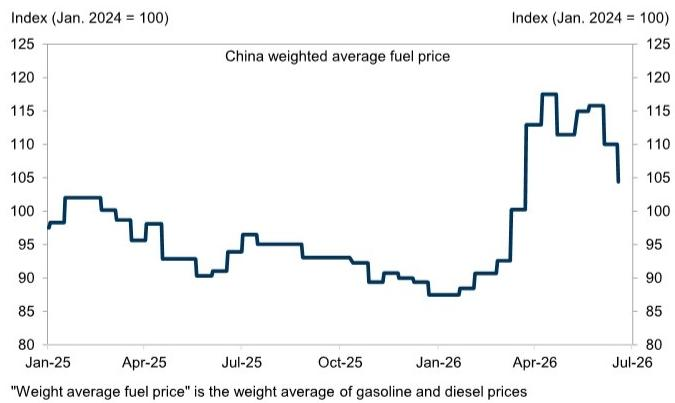

line chart

China weighted average fuel price
| Date | Weight average fuel price |
|---|---|
| Jan-25 | 98 |
| Feb-25 | 103 |
| Mar-25 | 101 |
| Apr-25 | 97 |
| May-25 | 93 |
| Jun-25 | 91 |
| Jul-25 | 96 |
| Aug-25 | 95 |
| Sep-25 | 94 |
| Oct-25 | 93 |
| Nov-25 | 91 |
| Dec-25 | 89 |
| Jan-26 | 87 |
| Feb-26 | 88 |
| Mar-26 | 90 |
| Apr-26 | 113 |
| May-26 | 118 |
| Jun-26 | 115 |
| Jul-26 | 105 |

Source: GS Global Investment Research

## South Korea

Exhibit 17: Korea CPI inflation  
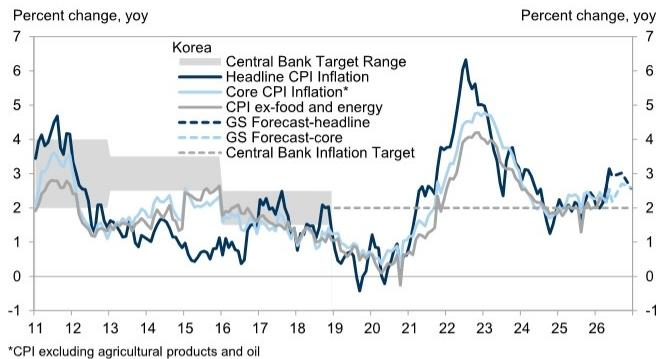

line chart

| Year | Central Bank Target Range | Headline CPI Inflation | Core CPI Inflation* | CPI ex-food and energy | GS Forecast-headline | GS Forecast-core | Central Bank Inflation Target |
|------|---------------------------|------------------------|---------------------|------------------------|----------------------|------------------|-------------------------------|
| 11   | ~2.5                      | ~4.5                   | ~3.5                | ~3.0                   | ~2.0                 | ~2.0             | ~2.0                          |
| 12   | ~2.5                      | ~4.0                   | ~3.0                | ~2.5                   | ~2.0                 | ~2.0             | ~2.0                          |
| 13   | ~2.5                      | ~3.5                   | ~2.5                | ~2.0                   | ~1.5                 | ~1.5             | ~2.0                          |
| 14   | ~2.5                      | ~3.0                   | ~2.0                | ~1.5                   | ~1.0                 | ~1.0             | ~2.0                          |
| 15   | ~2.5                      | ~2.5                   | ~1.5                | ~1.0                   | ~0.5                 | ~0.5             | ~2.0                          |
| 16   | ~2.5                      | ~2.0                   | ~1.0                | ~0.5                   | ~0.0                 | ~0.0             | ~2.0                          |
| 17   | ~2.5                      | ~2.5                   | ~1.5                | ~1.0                   | ~0.5                 | ~0.5             | ~2.0                          |
| 18   | ~2.5                      | ~2.0                   | ~1.0                | ~0.5                   | ~0.0                 | ~0.0             | ~2.0                          |
| 19   | ~2.5                      | ~1.5                   | ~0.5                | ~0.0                   | -0.5                 | -0.5             | ~2.0                          |
| 20   | ~2.5                      | ~-1.0                  | ~-0.5               | ~-0.5                  | -1.0                 | -1.0             | ~2.0                          |
| 21   | ~2.5                      | ~3.0                   | ~2.0                | ~1.5                   | ~1.0                 | ~1.0             | ~2.0                          |
| 22   | ~3.0                      | ~6.5                   | ~4.5                | ~4.0                   | ~3.5                 | ~3.5             | ~2.0                          |
| 23   | ~3.5                      | ~6.0                   | ~4.0                | ~3.5                   | ~4.0                 | ~4.0             | ~2.0                          |
| 24   | ~3.5                      | ~4.5                   | ~3.5                | ~3.0                   | ~3.5                 | ~3.5             | ~2.0                          |
| 25   | ~3.5                      | ~3.5                   | ~3.0                | ~2.5                   | ~3.0                 | ~3.0             | ~2.0                          |
| 26   | ~3.5                      | ~3.0                   | ~2.5                | ~2.0                   | ~2.5                 | ~2.5             | ~2.0                          |
* CPI excluding agricultural products and oil

Source: Haver Analytics, GS Global Investment Research

Exhibit 18: Korea CPI momentum  
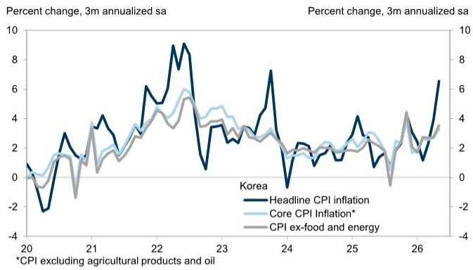

line chart

| Month | Headline CPI inflation | Core CPI Inflation* | CPI ex-food and energy |
|-------|------------------------|---------------------|------------------------|
| 20    | 0.5                    | 0.3                 | 0.2                    |
| 21    | 4.0                    | 3.5                 | 3.0                    |
| 22    | 9.0                    | 6.0                 | 5.0                    |
| 23    | 3.0                    | 4.5                 | 3.5                    |
| 24    | -1.0                   | 2.0                 | 1.5                    |
| 25    | 4.0                    | 3.0                 | 2.5                    |
| 26    | 7.0                    | 5.0                 | 4.0                    |

Source: Haver Analytics, GS Global Investment Research

Exhibit 19: Korea CPI contribution breakdown  
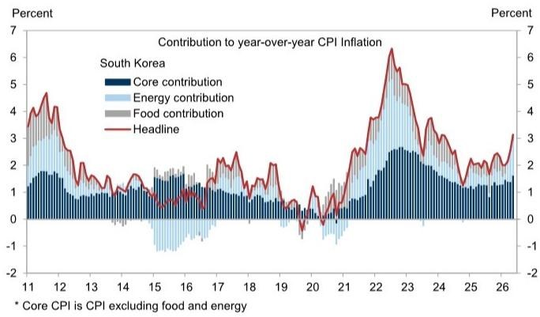

line and bar chart

| Year | Core contribution | Energy contribution | Food contribution | Headline |
|------|-------------------|---------------------|-------------------|----------|
| 11   | 1.5               | 0.8                 | 1.2               | 4.0      |
| 12   | 1.8               | 0.9                 | 1.3               | 4.5      |
| 13   | 1.6               | 0.7                 | 1.1               | 3.5      |
| 14   | 1.4               | 0.6                 | 1.0               | 3.0      |
| 15   | 1.3               | 0.5                 | 0.9               | 2.5      |
| 16   | 1.2               | 0.4                 | 0.8               | 2.0      |
| 17   | 1.1               | 0.3                 | 0.7               | 1.5      |
| 18   | 1.0               | 0.2                 | 0.6               | 1.0      |
| 19   | 0.9               | 0.1                 | 0.5               | 0.5      |
| 20   | 0.8               | 0.0                 | 0.4               | 0.0      |
| 21   | 0.7               | -0.1                | 0.3               | -0.5     |
| 22   | 0.6               | -0.2                | 0.2               | -1.0     |
| 23   | 0.5               | -0.3                | 0.1               | -1.5     |
| 24   | 0.4               | -0.4                | 0.0               | -2.0     |
| 25   | 0.3               | -0.5                | -0.1              | -2.5     |
| 26   | 0.2               | -0.6                | -0.2              | -3.0     |

Source: Haver Analytics, GS Global Investment Research

Exhibit 20: Korea PPI and Import Price Index  
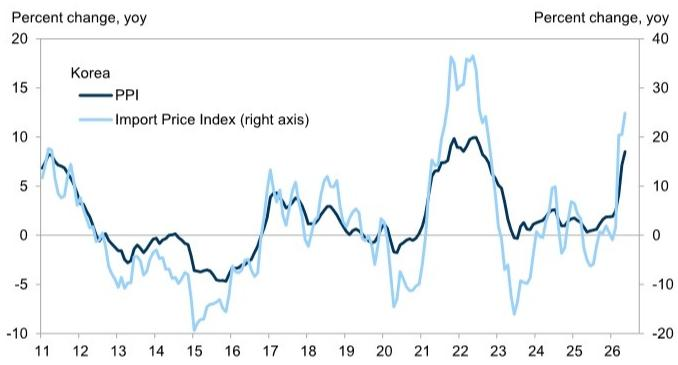

line chart

| Year | PPI   | Import Price Index (right axis) |
|------|-------|---------------------------------|
| 11   | ~8%   | ~9%                             |
| 12   | ~5%   | ~7%                             |
| 13   | ~-2%  | ~-5%                            |
| 14   | ~-3%  | ~-4%                            |
| 15   | ~-5%  | ~-10%                           |
| 16   | ~-4%  | ~-3%                            |
| 17   | ~3%   | ~6%                             |
| 18   | ~4%   | ~5%                             |
| 19   | ~2%   | ~3%                             |
| 20   | ~-1%  | ~-5%                            |
| 21   | ~5%   | ~10%                            |
| 22   | ~10%  | ~35%                            |
| 23   | ~5%   | ~-10%                           |
| 24   | ~2%   | ~5%                             |
| 25   | ~3%   | ~3%                             |
| 26   | ~8%   | ~15%                            |

Source: Haver Analytics, GS Global Investment Research

Exhibit 21: Korea wage growth  
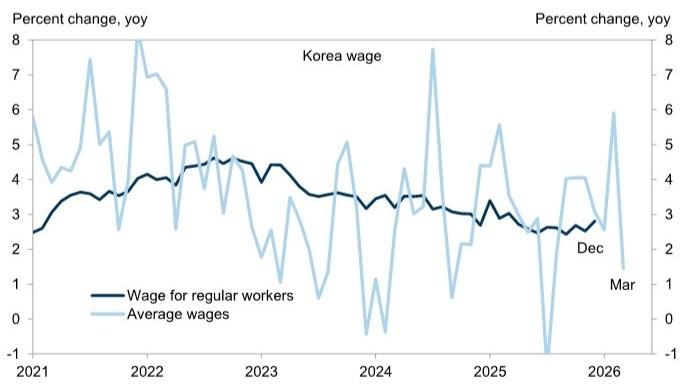

line chart

| Year | Wage for regular workers | Average wages |
|------|--------------------------|---------------|
| 2021 | ~3.5%                    | ~5.5%         |
| 2022 | ~4.0%                    | ~8.0%         |
| 2023 | ~4.5%                    | ~5.0%         |
| 2024 | ~3.5%                    | ~-1.0%        |
| 2025 | ~3.0%                    | ~5.5%         |
| Dec  | ~2.5%                    | ~-1.0%        |
| Mar  | ~2.5%                    | ~6.0%         |

Source: CEIC, GS Global Investment Research

Exhibit 22: Korea retail energy prices  
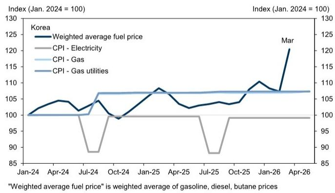

line chart

| Date | Weighted average fuel price | CPI - Electricity | CPI - Gas | CPI - Gas utilities |
|---|---|---|---|---|
| Jan-24 | 100 | 100 | 100 | 100 |
| Apr-24 | 105 | 100 | 100 | 100 |
| Jul-24 | 102 | 88 | 107 | 100 |
| Oct-24 | 99 | 100 | 107 | 100 |
| Jan-25 | 108 | 100 | 107 | 100 |
| Apr-25 | 103 | 100 | 107 | 100 |
| Jul-25 | 104 | 88 | 107 | 100 |
| Oct-25 | 105 | 100 | 107 | 100 |
| Jan-26 | 111 | 100 | 107 | 100 |
| Apr-26 | 122 | 100 | 107 | 100 |
Note: The chart displays a secondary axis labeled 'Index (Jan. 2024 = 100)' but contains two additional data points for the series.

Source: Haver Analytics, GS Global Investment Research

## Taiwan

Exhibit 23: Taiwan CPI inflation  
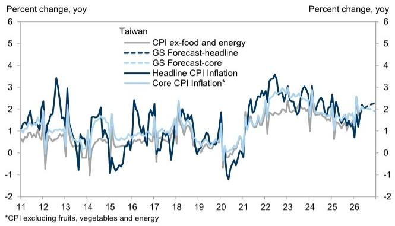

line chart

| Year | CPI ex-food and energy | GS Forecast-headline | GS Forecast-core | Headline CPI Inflation | Core CPI Inflation* |
|------|------------------------|----------------------|------------------|------------------------|---------------------|
| 11   | ~0.5                   | ~1.0                 | ~1.0             | ~1.0                   | ~1.0                |
| 12   | ~0.8                   | ~1.5                 | ~1.5             | ~1.5                   | ~1.5                |
| 13   | ~1.0                   | ~2.0                 | ~2.0             | ~2.0                   | ~2.0                |
| 14   | ~0.5                   | ~1.0                 | ~1.0             | ~1.0                   | ~1.0                |
| 15   | ~0.0                   | ~0.5                 | ~0.5             | ~0.5                   | ~0.5                |
| 16   | ~0.5                   | ~1.0                 | ~1.0             | ~1.0                   | ~1.0                |
| 17   | ~1.0                   | ~1.5                 | ~1.5             | ~1.5                   | ~1.5                |
| 18   | ~1.5                   | ~2.0                 | ~2.0             | ~2.0                   | ~2.0                |
| 19   | ~1.0                   | ~1.5                 | ~1.5             | ~1.5                   | ~1.5                |
| 20   | ~0.5                   | ~1.0                 | ~1.0             | ~1.0                   | ~1.0                |
| 21   | ~1.0                   | ~1.5                 | ~1.5             | ~1.5                   | ~1.5                |
| 22   | ~1.5                   | ~2.0                 | ~2.0             | ~2.0                   | ~2.0                |
| 23   | ~2.0                   | ~2.5                 | ~2.5             | ~2.5                   | ~2.5                |
| 24   | ~1.5                   | ~2.0                 | ~2.0             | ~2.0                   | ~2.0                |
| 25   | ~1.0                   | ~1.5                 | ~1.5             | ~1.5                   | ~1.5                |
| 26   | ~0.5                   | ~1.0                 | ~1.0             | ~1.0                   | ~1.0                |

Source: Haver Analytics, GS Global Investment Research

Exhibit 24: Taiwan CPI momentum  
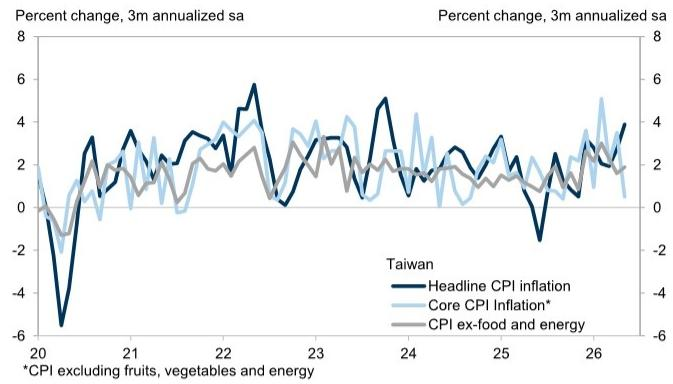

line chart

| Year | Headline CPI inflation | Core CPI Inflation* | CPI ex-food and energy |
|------|------------------------|---------------------|------------------------|
| 20   | -5.0                   | -2.0                | 0.0                    |
| 21   | 3.0                    | 2.0                 | 1.0                    |
| 22   | 6.0                    | 4.0                 | 2.0                    |
| 23   | 3.0                    | 3.0                 | 2.0                    |
| 24   | 5.0                    | 4.0                 | 2.0                    |
| 25   | -2.0                   | 1.0                 | 1.0                    |
| 26   | 4.0                    | 5.0                 | 2.0                    |

Source: Haver Analytics, GS Global Investment Research

Exhibit 25: Taiwan CPI contribution breakdown  
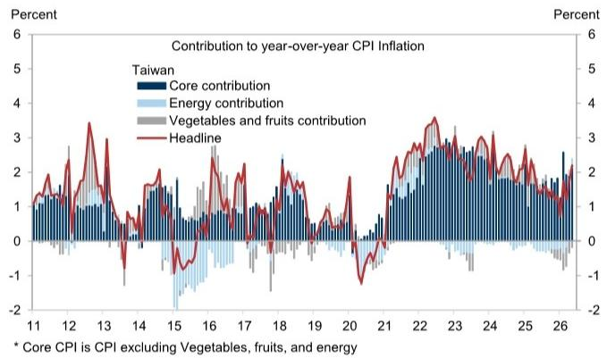

line chart

| Year | Core contribution | Energy contribution | Vegetables and fruits contribution | Headline |
|------|-------------------|---------------------|--------------------------------------|----------|
| 11   | ~1.0              | ~0.5                | ~0.0                                 | ~1.0     |
| 12   | ~1.5              | ~0.5                | ~0.0                                 | ~2.0     |
| 13   | ~1.0              | ~0.5                | ~0.0                                 | ~3.0     |
| 14   | ~1.5              | ~0.5                | ~0.0                                 | ~1.0     |
| 15   | ~1.0              | ~-1.0               | ~-1.0                                | ~-1.0    |
| 16   | ~1.5              | ~0.5                | ~0.0                                 | ~2.0     |
| 17   | ~1.0              | ~0.5                | ~0.0                                 | ~1.0     |
| 18   | ~1.5              | ~0.5                | ~0.0                                 | ~2.0     |
| 19   | ~1.0              | ~0.5                | ~0.0                                 | ~1.0     |
| 20   | ~1.5              | ~0.5                | ~0.0                                 | ~2.0     |
| 21   | ~2.0              | ~0.5                | ~0.0                                 | ~3.0     |
| 22   | ~2.5              | ~0.5                | ~0.0                                 | ~3.5     |
| 23   | ~2.5              | ~0.5                | ~0.0                                 | ~3.0     |
| 24   | ~2.0              | ~0.5                | ~0.0                                 | ~2.5     |
| 25   | ~1.5              | ~0.5                | ~0.0                                 | ~2.0     |
| 26   | ~2.5              | ~0.5                | ~0.0                                 | ~2.5     |

Source: Haver Analytics, GS Global Investment Research

Exhibit 26: Taiwan PPI and Import Price Index  
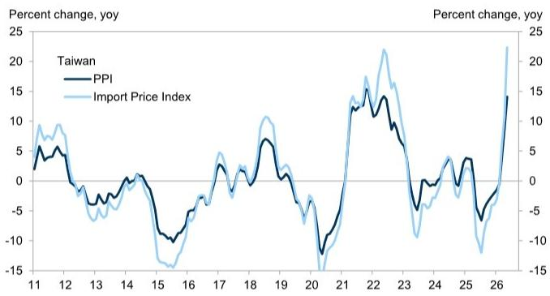

line chart

| Year | PPI   | Import Price Index |
|------|-------|--------------------|
| 11   | ~5    | ~8                 |
| 12   | ~-2   | ~-5                |
| 13   | ~-3   | ~-7                |
| 14   | ~-1   | ~-4                |
| 15   | ~-8   | ~-12               |
| 16   | ~-5   | ~-10               |
| 17   | ~3    | ~5                 |
| 18   | ~7    | ~10                |
| 19   | ~5    | ~8                 |
| 20   | ~-10  | ~-15               |
| 21   | ~15   | ~18                |
| 22   | ~10   | ~20                |
| 23   | ~-5   | ~-10               |
| 24   | ~3    | ~5                 |
| 25   | ~-5   | ~-10               |
| 26   | ~15   | ~20                |

Source: Haver Analytics, GS Global Investment Research

Exhibit 27: Taiwan wage growth  
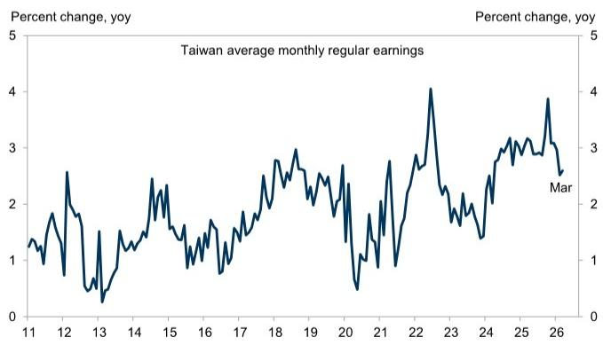

line chart

| Month | Percent change, yoy |
|-------|---------------------|
| Mar   | 3.0                 |

Source: CEIC, GS Global Investment Research

Exhibit 28: Taiwan retail energy prices  
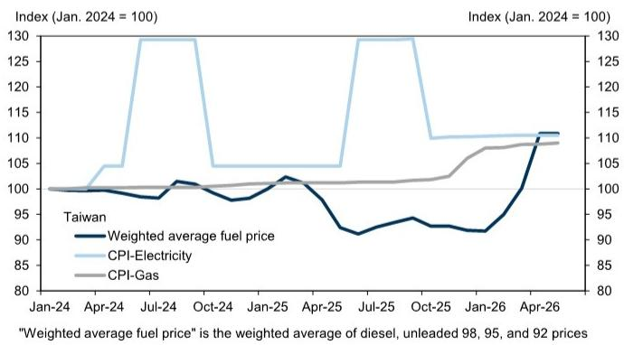

line chart

| Date | Weighted average fuel price (Index Jan. 2024 = 100) | CPI-Electricity (Index Jan. 2024 = 100) | CPI-Gas (Index Jan. 2024 = 100) |
|---|---|---|---|
| Jan-24 | 100 | 100 | 100 |
| Apr-24 | 99 | 105 | 100 |
| Jul-24 | 98 | 130 | 100 |
| Oct-24 | 101 | 130 | 100 |
| Jan-25 | 98 | 105 | 100 |
| Apr-25 | 102 | 105 | 100 |
| Jul-25 | 91 | 130 | 100 |
| Oct-25 | 94 | 130 | 100 |
| Jan-26 | 92 | 110 | 105 |
| Apr-26 | 111 | 110 | 110 |
The chart displays a line graph with two distinct lines: 'Weighted average fuel price' (dark blue) and 'CPI-Electricity' (light blue). The right axis is labeled 'Index (Jan. 2024 = 100)' in the top right corner. The left axis is labeled 'Taiwan'. The data series are annotated with the same axes and the legend indicating 'Taiwan'. The chart is saved as a PNG image. The text below notes that this is weighted average of diesel, unleaded 98, 95, and 92 prices.

Source: Haver Analytics, GS Global Investment Research

## India

Exhibit 29: India CPI inflation  
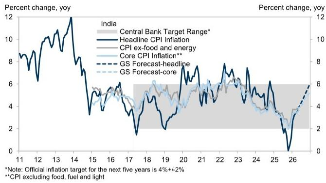

line chart

| Year | India Central Bank Target Range* | Headline CPI Inflation | CPI ex-food and energy | Core CPI Inflation** | GS Forecast-headline | GS Forecast-core |
|------|-----------------------------------|------------------------|------------------------|----------------------|----------------------|------------------|
| 11   | -                                 | -                      | -                      | -                    | -                    | -                |
| 12   | -                                 | -                      | -                      | -                    | -                    | -                |
| 13   | -                                 | -                      | -                      | -                    | -                    | -                |
| 14   | -                                 | 12                     | -                      | -                    | -                    | -                |
| 15   | -                                 | -                      | -                      | -                    | -                    | -                |
| 16   | -                                 | -                      | -                      | -                    | -                    | -                |
| 17   | -                                 | -                      | -                      | -                    | -                    | -                |
| 18   | -                                 | -                      | -                      | -                    | -                    | -                |
| 19   | -                                 | -                      | -                      | -                    | -                    | -                |
| 20   | -                                 | -                      | -                      | -                    | -                    | -                |
| 21   | -                                 | -                      | -                      | -                    | -                    | -                |
| 22   | -                                 | -                      | -                      | -                    | -                    | -                |
| 23   | -                                 | -                      | -                      | -                    | -                    | -                |
| 24   | -                                 | -                      | -                      | -                    | -                    | -                |
| 25   | -                                 | -                      | -                      | -                    | -                    | -                |
| 26   | -                                 | 0                      | 0                      | 0                    | 0                    | 0                |
| 27   | -                                 | 6                      | 6                      | 6                    | 6                    | 6                |

Source: Haver Analytics, GS Global Investment Research

Exhibit 30: India CPI momentum  
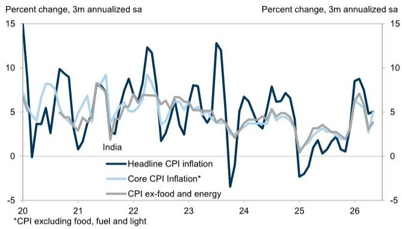

line chart

| Year | Headline CPI inflation | Core CPI Inflation* | CPI ex-food and energy |
|------|------------------------|---------------------|------------------------|
| 20   | 15.0                   | 7.0                 | 6.0                    |
| 21   | 10.0                   | 8.0                 | 5.0                    |
| 22   | 12.0                   | 9.0                 | 6.0                    |
| 23   | 8.0                    | 6.0                 | 5.0                    |
| 24   | -5.0                   | 4.0                 | 3.0                    |
| 25   | -2.0                   | 3.0                 | 2.0                    |
| 26   | 9.0                    | 6.0                 | 5.0                    |

Source: Haver Analytics, GS Global Investment Research

Exhibit 31: India CPI contribution breakdown  
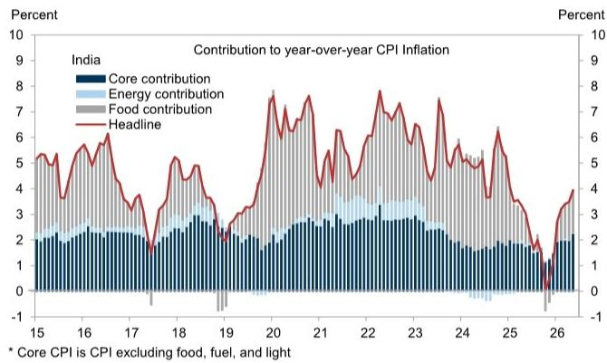

line and bar chart

| Year | Core contribution | Energy contribution | Food contribution | Headline |
|------|-------------------|---------------------|-------------------|----------|
| 15   | 2.0               | 1.5                 | 3.0               | 5.0      |
| 16   | 2.2               | 1.6                 | 3.2               | 5.5      |
| 17   | 2.1               | 1.4                 | 3.1               | 5.2      |
| 18   | 2.3               | 1.7                 | 3.3               | 5.8      |
| 19   | 2.0               | 1.3                 | 3.0               | 5.0      |
| 20   | 2.5               | 1.8                 | 3.5               | 7.0      |
| 21   | 2.7               | 2.0                 | 3.8               | 7.5      |
| 22   | 2.6               | 2.2                 | 4.0               | 8.0      |
| 23   | 2.4               | 2.1                 | 3.9               | 7.8      |
| 24   | 2.2               | 1.9                 | 3.7               | 7.2      |
| 25   | 2.0               | 1.7                 | 3.5               | 6.5      |
| 26   | 1.8               | 1.5                 | 3.3               | 4.0      |

Source: Haver Analytics, GS Global Investment Research

Exhibit 32: India Wholesale Price Index  
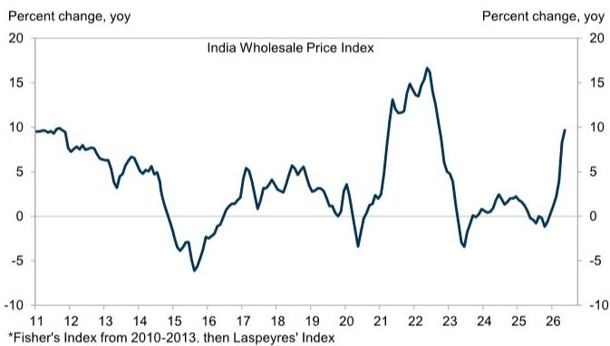

line chart

Percent change, yoy
| Year | Percent change, yoy (%) |
|---|---|
| 11 | 9.5 |
| 12 | 8.8 |
| 13 | 7.2 |
| 14 | 6.5 |
| 15 | -4.0 |
| 16 | -6.5 |
| 17 | 5.0 |
| 18 | 5.5 |
| 19 | 3.0 |
| 20 | -3.5 |
| 21 | 12.0 |
| 22 | 16.5 |
| 23 | -4.0 |
| 24 | 1.0 |
| 25 | 2.0 |
| 26 | 9.5 |
*Fisher's Index from 2010-2013, then Laspeyres' Index

Source: Haver Analytics, GS Global Investment Research

Exhibit 33: India retail energy prices  
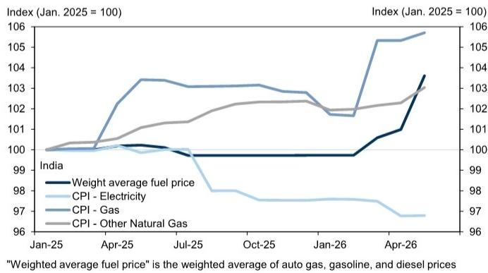

line chart

| Date | Weighted average fuel price (Index Jan. 2025 = 100) | CPI - Electricity (Index Jan. 2025 = 100) | CPI - Gas (Index Jan. 2025 = 100) | CPI - Other Natural Gas (Index Jan. 2025 = 100) |
|---|---|---|---|---|
| Jan-25 | 100 | 100 | 100 | 100 |
| Apr-25 | 100 | 99.8 | 103.4 | 101.1 |
| Jul-25 | 99.8 | 97.9 | 103.2 | 101.6 |
| Oct-25 | 99.8 | 97.6 | 103.1 | 102.3 |
| Jan-26 | 99.8 | 97.6 | 101.7 | 102.1 |
| Apr-26 | 103.4 | 96.8 | 105.4 | 103.1 |
The chart displays a line graph with two distinct lines: one for the weighted average fuel price and one for CPI - Gas and CPI - Other Natural Gas. The data is extracted from the beginning of the timeline.

Source: Haver Analytics, GS Global Investment Research

## Indonesia

Exhibit 34: Indonesia CPI inflation  
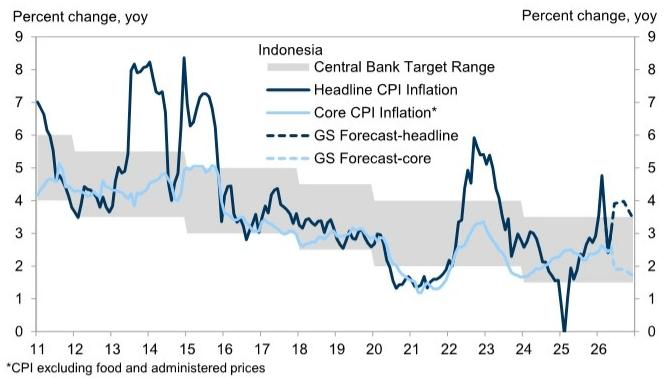

line chart

| Year | Central Bank Target Range | Headline CPI Inflation | Core CPI Inflation* | GS Forecast-headline | GS Forecast-core |
|------|---------------------------|------------------------|---------------------|----------------------|------------------|
| 11   | ~4.5                      | ~7.0                   | ~5.0                | -                    | -                |
| 12   | ~4.5                      | ~4.0                   | ~4.5                | -                    | -                |
| 13   | ~4.5                      | ~8.0                   | ~4.5                | -                    | -                |
| 14   | ~4.5                      | ~8.5                   | ~5.0                | -                    | -                |
| 15   | ~4.5                      | ~8.0                   | ~5.0                | -                    | -                |
| 16   | ~4.5                      | ~7.0                   | ~4.5                | -                    | -                |
| 17   | ~4.5                      | ~4.0                   | ~3.5                | -                    | -                |
| 18   | ~4.5                      | ~3.5                   | ~3.0                | -                    | -                |
| 19   | ~4.5                      | ~3.0                   | ~2.5                | -                    | -                |
| 20   | ~4.5                      | ~2.5                   | ~2.0                | -                    | -                |
| 21   | ~4.5                      | ~1.5                   | ~1.5                | -                    | -                |
| 22   | ~4.5                      | ~3.0                   | ~2.0                | -                    | -                |
| 23   | ~4.5                      | ~6.0                   | ~3.0                | -                    | -                |
| 24   | ~4.5                      | ~3.0                   | ~2.0                | -                    | -                |
| 25   | ~4.5                      | ~0.0                   | ~1.5                | -                    | -                |
| 26   | ~4.5                      | ~4.5                   | ~3.5                | -                    | -                |

Source: Haver Analytics, GS Global Investment Research

Exhibit 35: Indonesia CPI momentum  
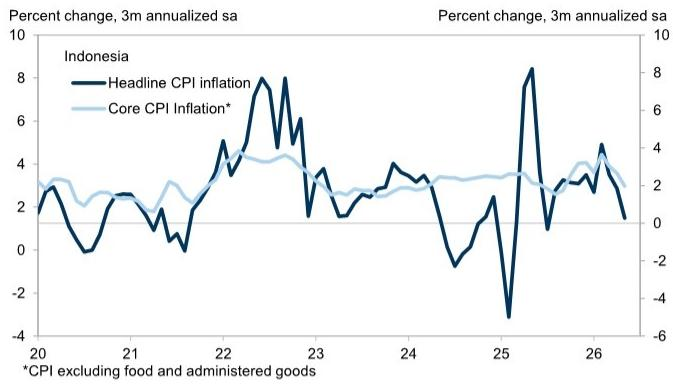

line chart

| Year | Headline CPI inflation (%) | Core CPI Inflation (%) |
|---|---|---|
| 20 | 2.5 | 3.0 |
| 21 | 2.0 | 2.5 |
| 22 | 4.5 | 3.5 |
| 23 | 8.0 | 4.0 |
| 24 | 3.0 | 2.5 |
| 25 | -4.0 | 3.0 |
| 26 | 5.0 | 4.0 |

Source: Haver Analytics, GS Global Investment Research

Exhibit 36: Indonesia CPI contribution breakdown  
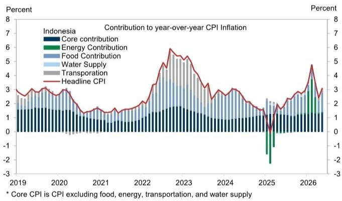

bar-line hybrid

Contribution to year-over-year CPI Inflation
| Year | Core Contribution (%) | Energy Contribution (%) | Food Contribution (%) | Water Supply (%) | Transportation (%) | Headline CPI (%) |
|---|---|---|---|---|---|---|
| 2019 | 1.5 | -0.5 | 0.8 | 0.3 | 0.4 | 3.0 |
| 2020 | 1.4 | -0.6 | 0.7 | 0.3 | 0.4 | 3.1 |
| 2021 | 1.3 | -0.7 | 0.6 | 0.3 | 0.4 | 2.9 |
| 2022 | 1.4 | -0.8 | 0.7 | 0.4 | 0.5 | 3.2 |
| 2023 | 1.5 | -0.9 | 0.8 | 0.5 | 0.6 | 5.8 |
| 2024 | 1.3 | -1.0 | 0.7 | 0.4 | 0.5 | 3.1 |
| 2025 | -1.8 | -2.5 | -0.5 | 2.3 | -0.3 | -1.8 |
| 2026 | 1.4 | -1.1 | 0.8 | 0.4 | 0.5 | 4.8 |
* Core CPI is CPI excluding food, energy, transportation, and water supply

Source: Haver Analytics, GS Global Investment Research

Exhibit 37: Indonesia PPI and Import Price Index  
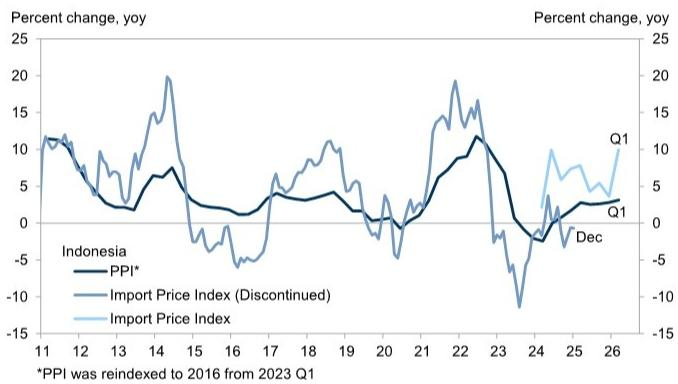

line chart

| Year | PPI* | Import Price Index (Discontinued) | Import Price Index |
|------|------|-----------------------------------|--------------------|
| 2016 | -    | -                                 | -                  |
| 2017 | 5    | -                                 | -                  |
| 2018 | 5    | -                                 | -                  |
| 2019 | 5    | -                                 | -                  |
| 2020 | 0    | -                                 | -                  |
| 2021 | 5    | -                                 | -                  |
| 2022 | 10   | -                                 | -                  |
| 2023 | 15   | -                                 | -                  |
| 2024 | -5   | -10                               | -                  |
| 2025 | 5    | -5                                | -                  |
| 2026 | 5    | 10                                | 10                 |

Source: Haver Analytics, GS Global Investment Research

Exhibit 38: Indonesia wage growth  
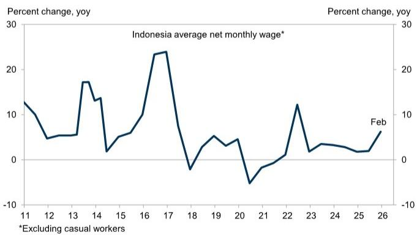

line chart

Indonesia average net monthly wage*
| Year | Percent change, yoy (%) |
|---|---|
| 11 | 12.5 |
| 12 | 4.8 |
| 13 | 5.2 |
| 14 | 17.5 |
| 15 | 2.0 |
| 16 | 6.5 |
| 17 | 23.5 |
| 18 | -2.0 |
| 19 | 5.0 |
| 20 | 4.0 |
| 21 | -4.0 |
| 22 | 12.0 |
| 23 | 2.0 |
| 24 | 3.0 |
| 25 | 1.5 |
| 26 | 6.0 |

Source: Haver Analytics, GS Global Investment Research

Exhibit 39: Indonesia retail energy prices  
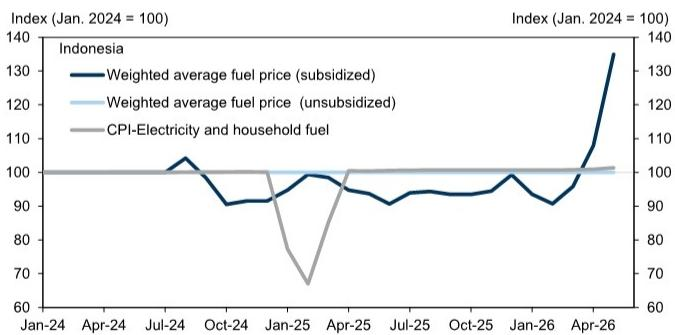

line chart

| Date | Weighted average fuel price (subsidized) | Weighted average fuel price (unsubsidized) | CPI-Electricity and household fuel |
|---|---|---|---|
| Jan-24 | 100 | 100 | 100 |
| Apr-24 | 100 | 100 | 100 |
| Jul-24 | 105 | 100 | 100 |
| Oct-24 | 90 | 100 | 100 |
| Jan-25 | 95 | 100 | 70 |
| Apr-25 | 98 | 100 | 100 |
| Jul-25 | 93 | 100 | 100 |
| Oct-25 | 95 | 100 | 100 |
| Jan-26 | 98 | 100 | 100 |
| Apr-26 | 135 | 100 | 100 |
Index (Jan. 2024 = 100)
Indonesia

"Weighted average fuel price (unsubsidized)" is the weighted average of Pertamax and Solar prices while "Weighted average fuel price (subsidized)" is the weighted average of Pertamax, Dexlite, and DEX prices.  
Source: Haver Analytics, GS Global Investment Research

## Malaysia

Exhibit 40: Malaysia CPI inflation  
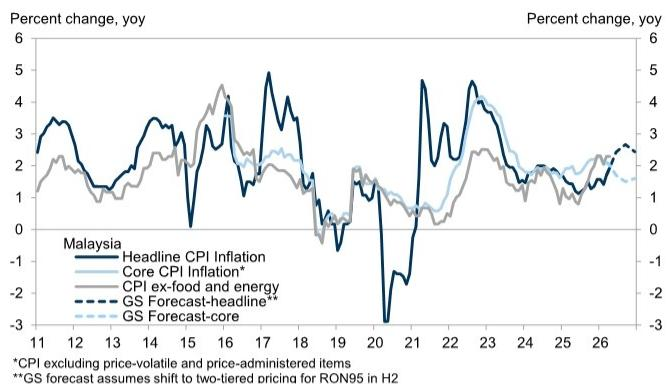

line chart

| Year | Headline CPI Inflation | Core CPI Inflation* | CPI ex-food and energy | GS Forecast-headline** | GS Forecast-core |
|------|------------------------|---------------------|------------------------|------------------------|-----------------|
| 11   | ~3.5                   | ~2.5                | ~1.5                   | ~2.0                   | ~1.8            |
| 12   | ~3.0                   | ~2.0                | ~1.0                   | ~1.5                   | ~1.2            |
| 13   | ~2.5                   | ~1.5                | ~0.5                   | ~1.0                   | ~0.8            |
| 14   | ~3.0                   | ~2.0                | ~1.0                   | ~1.5                   | ~1.2            |
| 15   | ~3.5                   | ~2.5                | ~1.5                   | ~2.0                   | ~1.8            |
| 16   | ~4.0                   | ~3.0                | ~2.0                   | ~2.5                   | ~2.2            |
| 17   | ~5.0                   | ~4.0                | ~3.0                   | ~3.5                   | ~3.2            |
| 18   | ~4.5                   | ~3.5                | ~2.5                   | ~3.0                   | ~2.8            |
| 19   | ~3.0                   | ~2.0                | ~1.0                   | ~1.5                   | ~1.2            |
| 20   | ~-3.0                  | ~-2.0               | ~-1.0                  | ~-1.5                  | ~-1.2           |
| 21   | ~4.5                   | ~3.5                | ~2.0                   | ~2.5                   | ~2.2            |
| 22   | ~5.0                   | ~4.0                | ~2.5                   | ~3.0                   | ~2.8            |
| 23   | ~4.5                   | ~3.5                | ~2.0                   | ~2.5                   | ~2.2            |
| 24   | ~3.0                   | ~2.0                | ~1.0                   | ~1.5                   | ~1.2            |
| 25   | ~2.5                   | ~1.5                | ~0.5                   | ~1.0                   | ~0.8            |
| 26   | ~3.0                   | ~2.0                | ~1.0                   | ~1.5                   | ~1.2            |

Source: Haver Analytics, GS Global Investment Research

Exhibit 41: Malaysia CPI momentum  
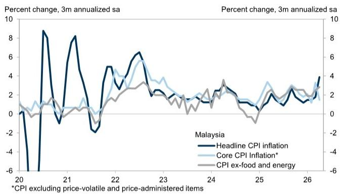

line chart

| Year | Headline CPI inflation | Core CPI Inflation* | CPI ex-food and energy |
|------|------------------------|---------------------|------------------------|
| 20   | -6                     | 1                   | 0                      |
| 21   | 8                      | 1                   | 0                      |
| 22   | 5                      | 4                   | 2                      |
| 23   | 3                      | 3                   | 2                      |
| 24   | 2                      | 2                   | 2                      |
| 25   | 1                      | 1                   | -2                     |
| 26   | 4                      | 3                   | 2                      |

Source: Haver Analytics, GS Global Investment Research

Exhibit 42: Malaysia PPI and Import Price Index  
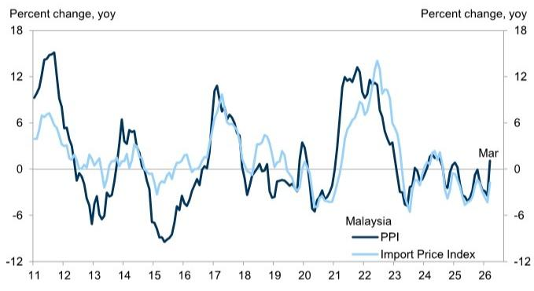

line chart

| Year | Malaysia | Import Price Index |
|------|----------|---------------------|
| 11   | 14       | 6                   |
| 12   | 13       | 5                   |
| 13   | 0        | 0                   |
| 14   | 6        | 0                   |
| 15   | -10      | -2                  |
| 16   | -5       | -3                  |
| 17   | 12       | 0                   |
| 18   | 0        | 0                   |
| 19   | -2       | -1                  |
| 20   | -5       | -3                  |
| 21   | 0        | 0                   |
| 22   | 12       | 6                   |
| 23   | 0        | 0                   |
| 24   | -5       | -3                  |
| 25   | 0        | 0                   |
| 26   | 0        | 0                   |

Source: Haver Analytics, GS Global Investment Research

Exhibit 43: Malaysia wage growth  
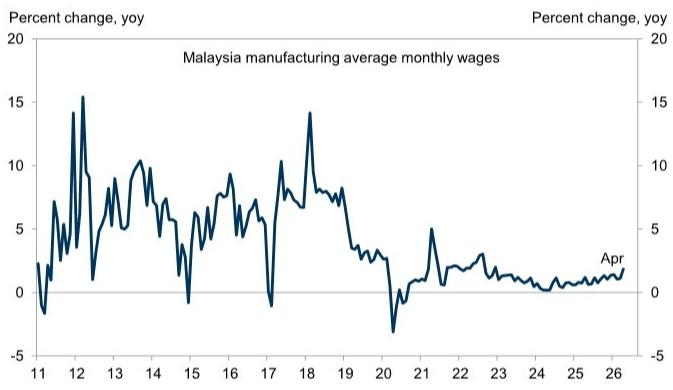

line chart

| Year | Percent change, yoy |
| ---- | ------------------- |
| 11   | -3.0                |
| 12   | 15.0                |
| 13   | 10.0                |
| 14   | 8.0                 |
| 15   | 6.0                 |
| 16   | 9.0                 |
| 17   | 10.0                |
| 18   | 14.0                |
| 19   | 8.0                 |
| 20   | -3.0                |
| 21   | 5.0                 |
| 22   | 3.0                 |
| 23   | 2.0                 |
| 24   | 1.0                 |
| 25   | 0.5                 |
| 26   | 0.0                 |

Source: Haver Analytics, GS Global Investment Research

Exhibit 44: Malaysia retail energy prices  
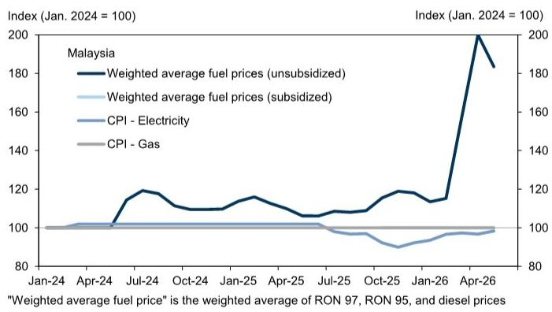

line chart

| Date    | Weighted average fuel prices (unsubsidized) | Weighted average fuel prices (subsidized) | CPI - Electricity | CPI - Gas |
|---------|---------------------------------------------|-------------------------------------------|-------------------|---------|
| Jan-24  | 100                                         | 100                                       | 100               | 100     |
| Apr-24  | 100                                         | 100                                       | 100               | 100     |
| Jul-24  | 120                                         | 100                                       | 100               | 100     |
| Oct-24  | 110                                         | 100                                       | 100               | 100     |
| Jan-25  | 115                                         | 100                                       | 100               | 100     |
| Apr-25  | 110                                         | 100                                       | 100               | 100     |
| Jul-25  | 105                                         | 95                                        | 95                | 95      |
| Oct-25  | 115                                         | 95                                        | 95                | 95      |
| Jan-26  | 115                                         | 95                                        | 95                | 95      |
| Apr-26  | 200                                         | 100                                       | 100               | 100     |

Source: Haver Analytics, GS Global Investment Research

## Philippines

Exhibit 45: Philippines CPI inflation  
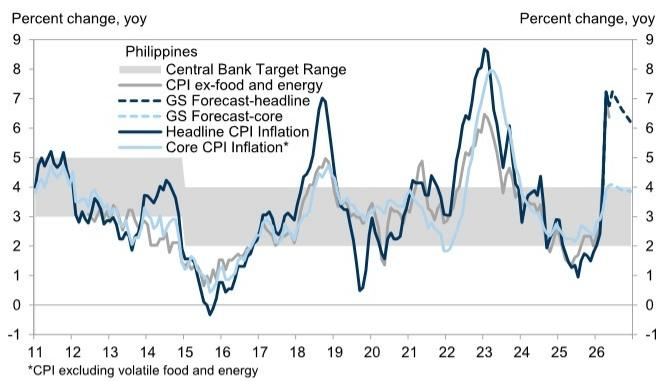

line chart

| Year | Central Bank Target Range | CPI ex-food and energy | GS Forecast-headline | GS Forecast-core | Headline CPI Inflation | Core CPI Inflation* |
|------|---------------------------|------------------------|----------------------|------------------|------------------------|---------------------|
| 11   | ~4.5                      | ~4.5                   | ~4.5                 | ~4.5             | ~4.5                   | ~4.5                |
| 12   | ~4.0                      | ~4.0                   | ~4.0                 | ~4.0             | ~4.0                   | ~4.0                |
| 13   | ~3.5                      | ~3.5                   | ~3.5                 | ~3.5             | ~3.5                   | ~3.5                |
| 14   | ~3.0                      | ~3.0                   | ~3.0                 | ~3.0             | ~3.0                   | ~3.0                |
| 15   | ~2.5                      | ~2.5                   | ~2.5                 | ~2.5             | ~2.5                   | ~2.5                |
| 16   | ~2.0                      | ~2.0                   | ~2.0                 | ~2.0             | ~2.0                   | ~2.0                |
| 17   | ~2.5                      | ~2.5                   | ~2.5                 | ~2.5             | ~2.5                   | ~2.5                |
| 18   | ~3.0                      | ~3.0                   | ~3.0                 | ~3.0             | ~3.0                   | ~3.0                |
| 19   | ~4.0                      | ~4.0                   | ~4.0                 | ~4.0             | ~4.0                   | ~4.0                |
| 20   | ~3.0                      | ~3.0                   | ~3.0                 | ~3.0             | ~3.0                   | ~3.0                |
| 21   | ~3.5                      | ~3.5                   | ~3.5                 | ~3.5             | ~3.5                   | ~3.5                |
| 22   | ~4.0                      | ~4.0                   | ~4.0                 | ~4.0             | ~4.0                   | ~4.0                |
| 23   | ~7.0                      | ~7.0                   | ~7.0                 | ~7.0             | ~7.0                   | ~7.0                |
| 24   | ~4.0                      | ~4.0                   | ~4.0                 | ~4.0             | ~4.0                   | ~4.0                |
| 25   | ~3.0                      | ~3.0                   | ~3.0                 | ~3.0             | ~3.0                   | ~3.0                |
| 26   | ~7.0                      | ~7.0                   | ~7.0                 | ~7.0             | ~7.0                   | ~7.0                |
| 27   | ~6.0                      | ~6.0                   | ~6.0                 | ~6.0             | ~6.0                   | ~6.0                |
*CPI excluding volatile food and energy

Source: Haver Analytics, GS Global Investment Research

Exhibit 46: Philippines CPI momentum  
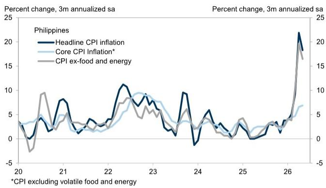

line chart

| Year | Headline CPI inflation (%) | Core CPI Inflation* (%) | CPI ex-food and energy (%) |
| --- | --- | --- | --- |
| 20 | -1.5 | 3.0 | -2.5 |
| 21 | 8.0 | 4.0 | 9.5 |
| 22 | 11.0 | 7.0 | 8.0 |
| 23 | 9.0 | 9.0 | 6.0 |
| 24 | -1.0 | 3.0 | 5.0 |
| 25 | 3.0 | 2.0 | 4.0 |
| 26 | 22.0 | 7.0 | 18.0 |

Source: Haver Analytics, GS Global Investment Research

Exhibit 47: Philippines CPI contribution breakdown  
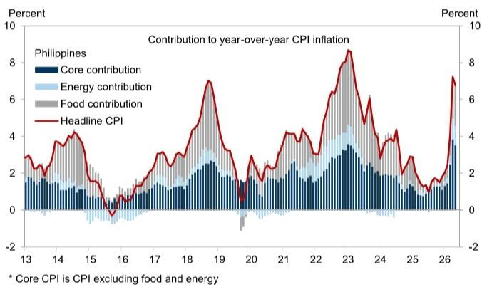

line and bar chart

| Year | Core contribution | Energy contribution | Food contribution | Headline CPI |
|------|-------------------|---------------------|-------------------|--------------|
| 13   | ~1.5              | ~0.5                | ~0.5              | ~3.0         |
| 14   | ~1.5              | ~0.5                | ~0.5              | ~4.0         |
| 15   | ~1.5              | ~0.5                | ~0.5              | ~4.5         |
| 16   | ~1.5              | ~0.5                | ~0.5              | ~3.0         |
| 17   | ~1.5              | ~0.5                | ~0.5              | ~3.5         |
| 18   | ~2.0              | ~1.0                | ~1.0              | ~5.0         |
| 19   | ~2.5              | ~1.5                | ~1.5              | ~7.0         |
| 20   | ~1.5              | ~0.5                | ~0.5              | ~3.0         |
| 21   | ~2.0              | ~1.0                | ~1.0              | ~4.0         |
| 22   | ~2.5              | ~1.5                | ~1.5              | ~6.0         |
| 23   | ~3.0              | ~2.0                | ~2.0              | ~8.5         |
| 24   | ~2.5              | ~1.5                | ~1.5              | ~6.0         |
| 25   | ~2.0              | ~1.0                | ~1.0              | ~4.0         |
| 26   | ~3.5              | ~2.0                | ~2.0              | ~7.0         |

Source: Haver Analytics, GS Global Investment Research

Exhibit 48: Philippines Manufacturing PPI and Import Price Index  
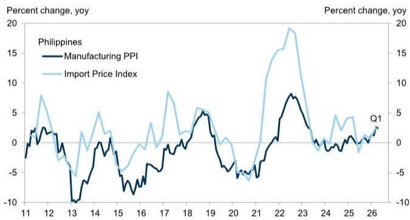

line chart

| Year | Manufacturing PPI | Import Price Index |
|------|---------------------|---------------------|
| 11   | ~0                  | ~0                  |
| 12   | ~2                  | ~8                  |
| 13   | ~-10                | ~-5                 |
| 14   | ~-5                 | ~5                  |
| 15   | ~-7                 | ~0                  |
| 16   | ~-5                 | ~5                  |
| 17   | ~-2                 | ~8                  |
| 18   | ~0                  | ~5                  |
| 19   | ~5                  | ~5                  |
| 20   | ~-5                 | ~0                  |
| 21   | ~-7                 | ~10                 |
| 22   | ~8                  | ~18                 |
| 23   | ~5                  | ~5                  |
| 24   | ~0                  | ~0                  |
| 25   | ~0                  | ~5                  |
| 26   | ~0                  | ~0                  |

Source: Haver Analytics, GS Global Investment Research

Exhibit 49: Philippines retail energy prices  
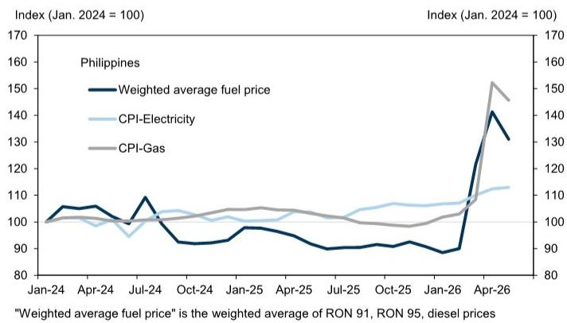

line chart

| Date | Weighted average fuel price | CPI-Electricity | CPI-Gas |
|---|---|---|---|
| Jan-24 | 100 | 100 | 100 |
| Apr-24 | 105 | 98 | 101 |
| Jul-24 | 110 | 95 | 102 |
| Oct-24 | 93 | 105 | 103 |
| Jan-25 | 97 | 102 | 104 |
| Apr-25 | 95 | 103 | 103 |
| Jul-25 | 90 | 105 | 102 |
| Oct-25 | 92 | 107 | 101 |
| Jan-26 | 88 | 108 | 100 |
| Apr-26 | 140 | 112 | 152 |
Index (Jan. 2024 = 100) - Weighted average fuel price; Index (Jan. 2024 = 100); Index (Jan. 2024 = 100); CPI-Electricity; Index (Jan. 2024 = 100); CPI-Gas.

Source: Haver Analytics, CEIC, GS Global Investment Research

## Thailand

Exhibit 50: Thailand CPI inflation  
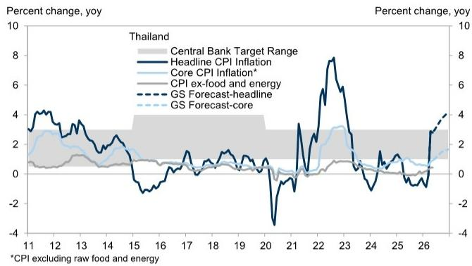

line chart

| Year | Central Bank Target Range | Headline CPI Inflation | Core CPI Inflation* | CPI ex-food and energy | GS Forecast-headline | GS Forecast-core |
|------|---------------------------|------------------------|---------------------|------------------------|----------------------|------------------|
| 11   | ~1.5                      | ~4.0                   | ~2.5                | ~1.0                   | ~3.0                 | ~1.5             |
| 12   | ~1.5                      | ~4.5                   | ~3.0                | ~1.0                   | ~3.5                 | ~1.5             |
| 13   | ~1.5                      | ~4.0                   | ~2.5                | ~1.0                   | ~3.0                 | ~1.5             |
| 14   | ~1.5                      | ~3.5                   | ~2.0                | ~1.0                   | ~2.5                 | ~1.5             |
| 15   | ~1.5                      | ~2.0                   | ~1.5                | ~1.0                   | ~2.0                 | ~1.5             |
| 16   | ~1.5                      | ~1.0                   | ~1.0                | ~1.0                   | ~1.5                 | ~1.5             |
| 17   | ~1.5                      | ~0.5                   | ~0.5                | ~1.0                   | ~1.0                 | ~1.5             |
| 18   | ~1.5                      | ~0.0                   | ~0.0                | ~1.0                   | ~0.5                 | ~1.5             |
| 19   | ~1.5                      | ~0.5                   | ~0.5                | ~1.0                   | ~0.0                 | ~1.5             |
| 20   | ~1.5                      | -4.0                   | -2.0                | -1.0                   | -3.0                 | -2.0             |
| 21   | ~1.5                      | ~3.0                   | ~2.0                | ~1.0                   | ~3.5                 | ~2.0             |
| 22   | ~1.5                      | ~8.0                   | ~3.0                | ~2.0                   | ~8.0                 | ~3.0             |
| 23   | ~1.5                      | ~6.0                   | ~3.5                | ~2.5                   | ~7.0                 | ~3.5             |
| 24   | ~1.5                      | ~2.0                   | ~2.0                | ~1.0                   | ~3.0                 | ~2.0             |
| 25   | ~1.5                      | ~1.0                   | ~1.5                | ~1.0                   | ~2.0                 | ~1.5             |
| 26   | ~1.5                      | ~4.0                   | ~3.0                | ~2.0                   | ~4.0                 | ~3.0             |
| 27   | ~1.5                      | ~4.5                   | ~3.5                | ~2.5                   | ~4.5                 | ~3.5             |
* CPI excluding raw food and energy

Source: Haver Analytics, GS Global Investment Research

Exhibit 51: Thailand CPI momentum  
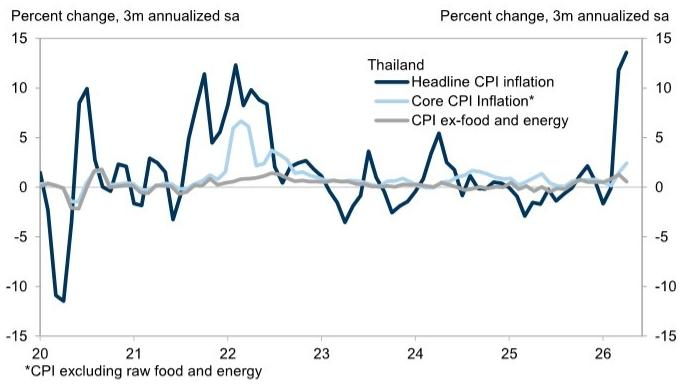

line chart

| Year | Headline CPI inflation (%) | Core CPI Inflation* (%) | CPI ex-food and energy (%) |
|---|---|---|---|
| 20 | -12.5 | -1.5 | 0.5 |
| 21 | 3.0 | 0.8 | 0.7 |
| 22 | 12.0 | 6.5 | 0.9 |
| 23 | -4.0 | 1.2 | 0.6 |
| 24 | 5.5 | 0.9 | 0.8 |
| 25 | -2.5 | 0.7 | 0.5 |
| 26 | 14.0 | 2.5 | 1.0 |

Source: Haver Analytics, GS Global Investment Research

Exhibit 52: Thailand CPI contribution breakdown  
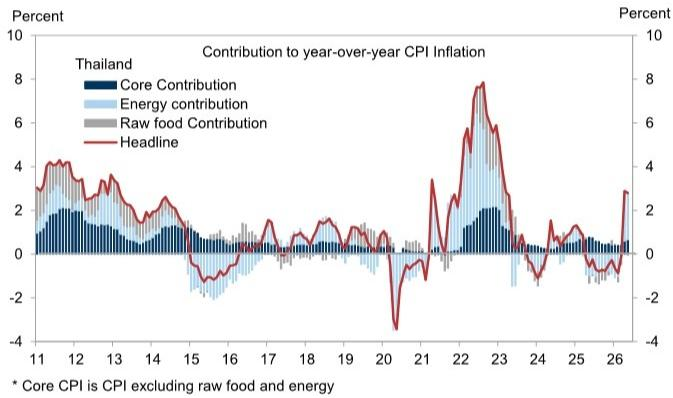

line chart

| Year | Core Contribution | Energy contribution | Raw food Contribution | Headline |
|------|-------------------|---------------------|------------------------|----------|
| 11   | ~1.5              | ~1.0                | ~0.5                   | ~3.0     |
| 12   | ~1.8              | ~1.2                | ~0.6                   | ~4.0     |
| 13   | ~1.6              | ~1.1                | ~0.7                   | ~3.5     |
| 14   | ~1.4              | ~0.9                | ~0.8                   | ~2.5     |
| 15   | ~1.2              | ~0.7                | ~0.9                   | ~2.0     |
| 16   | ~1.0              | ~0.5                | ~1.0                   | ~1.5     |
| 17   | ~0.8              | ~0.3                | ~1.1                   | ~1.0     |
| 18   | ~0.6              | ~0.2                | ~1.2                   | ~0.8     |
| 19   | ~0.4              | ~0.1                | ~1.3                   | ~0.6     |
| 20   | ~0.2              | ~0.0                | ~1.4                   | ~-4.0    |
| 21   | ~0.0              | ~-0.5               | ~1.5                   | ~3.0     |
| 22   | ~0.5              | ~1.0                | ~2.0                   | ~8.0     |
| 23   | ~1.0              | ~1.5                | ~2.5                   | ~7.5     |
| 24   | ~0.8              | ~1.2                | ~2.0                   | ~6.0     |
| 25   | ~0.6              | ~1.0                | ~1.8                   | ~5.5     |
| 26   | ~0.4              | ~0.8                | ~1.6                   | ~3.0     |

Source: Haver Analytics, GS Global Investment Research

Exhibit 53: Thailand PPI and Import Price Index  
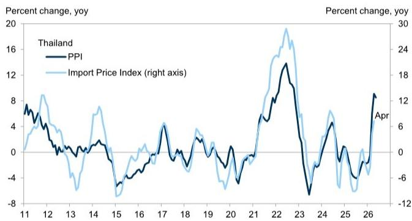

line chart

| Year | PPI   | Import Price Index (right axis) |
|------|-------|---------------------------------|
| 11   | 8.0   | 6.0                             |
| 12   | 6.0   | 8.0                             |
| 13   | 4.0   | 4.0                             |
| 14   | 2.0   | 6.0                             |
| 15   | -4.0  | -8.0                            |
| 16   | -2.0  | -4.0                            |
| 17   | 4.0   | 2.0                             |
| 18   | 2.0   | 4.0                             |
| 19   | 0.0   | 2.0                             |
| 20   | -4.0  | -6.0                            |
| 21   | 6.0   | 12.0                            |
| 22   | 14.0  | 24.0                            |
| 23   | -8.0  | -6.0                            |
| 24   | 4.0   | 6.0                             |
| 25   | 2.0   | 4.0                             |
| 26   | 8.0   | 12.0                            |

Source: Haver Analytics, GS Global Investment Research

Exhibit 54: Thailand wage growth  
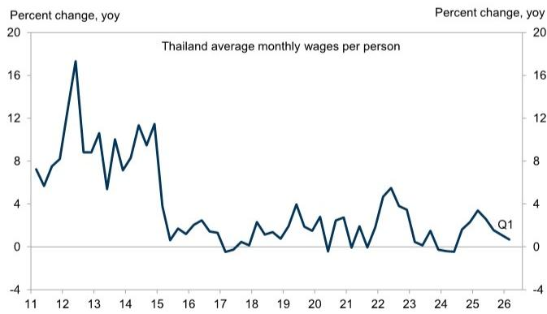

line chart

Thailand average monthly wages per person
| Year | Percent change, yoy (%) |
|---|---|
| 11 | 7.5 |
| 12 | 8.5 |
| 13 | 17.0 |
| 14 | 8.0 |
| 15 | 11.5 |
| 16 | 0.5 |
| 17 | -0.5 |
| 18 | 0.5 |
| 19 | 3.0 |
| 20 | 0.0 |
| 21 | 3.0 |
| 22 | 6.0 |
| 23 | 3.0 |
| 24 | -0.5 |
| 25 | 3.5 |
| 26 | 0.5 |

Source: Haver Analytics, GS Global Investment Research

Exhibit 55: Thailand retail energy prices  
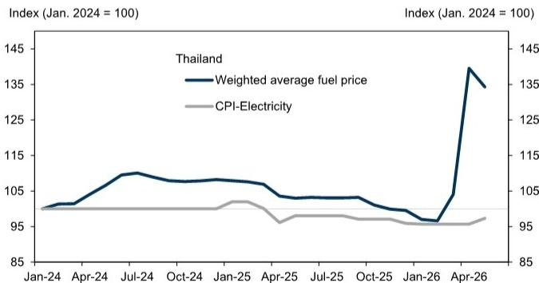

line chart

| Date | Weighted average fuel price | CPI-Electricity |
|---|---|---|
| Jan-24 | 97 | 97 |
| Apr-24 | 105 | 97 |
| Jul-24 | 110 | 97 |
| Oct-24 | 108 | 97 |
| Jan-25 | 108 | 98 |
| Apr-25 | 103 | 95 |
| Jul-25 | 103 | 96 |
| Oct-25 | 103 | 96 |
| Jan-26 | 96 | 95 |
| Apr-26 | 138 | 96 |
Index (Jan. 2024 = 100) |
Index (Jan. 2024 = 100)

"Weighted average fuel price" is the weighted average of Gasohol 91, Gasohol 95, and diesel prices  
Source: Haver Analytics, CEIC, GS Global Investment Research

## Vietnam

Exhibit 56: Vietnam CPI inflation  
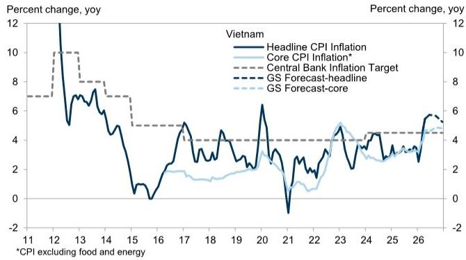

line chart

| Year | Headline CPI Inflation | Core CPI Inflation* | Central Bank Inflation Target | GS Forecast-headline | GS Forecast-core |
| --- | --- | --- | --- | --- | --- |
| 11 |  |  |  |  |  |
| 12 |  |  |  |  |  |
| 13 |  |  |  |  |  |
| 14 |  |  |  |  |  |
| 15 |  |  |  |  |  |
| 16 |  |  |  |  |  |
| 17 |  |  |  |  |  |
| 18 |  |  |  |  |  |
| 19 |  |  |  |  |  |
| 20 |  |  |  |  |  |
| 21 |  |  |  |  |  |
| 22 |  |  |  |  |  |
| 23 |  |  |  |  |  |
| 24 |  |  |  |  |  |
| 25 |  |  |  |  |  |
| 26 |  |  |  |  |  |
| 27 |  |  |  |  |  |
| 28 |  |  |  |  |  |
| 29 |  |  |  |  |  |
| 30 |  |  |  |  |  |
| 31 |  |  |  |  |  |
| 32 |  |  |  |  |  |
| 33 |  |  |  |  |  |
| 34 |  |  |  |  |  |
| 35 |  |  |  |  |  |
| 36 |  |  |  |  |  |
| 37 |  |  |  |  |  |
| 38 |  |  |  |  |  |
| 39 |  |  |  |  |  |
| 40 |  |  |  |  |  |
| 41 |  |  |  |  |  |
| 42 |  |  |  |  |  |
| 43 |  |  |  |  |  |
| 44 |  |  |  |  |  |
| 45 |  |  |  |  |  |
| 46 |  |  |  |  |  |
| 47 |  |  |  |  |  |
| 48 |  |  |  |  |  |
| 49 |  |  |  |  |  |
| 50 |  |  |  |  |  |
| 51 |  |  |  |  |  |
| 52 |  |  |  |  |  |
| 53 |  |  |  |  |  |
| 54 |  |  |  |  |  |
| 55 |  |  |  |  |  |
| 56 |  |  |  |  |  |
| 57 |  |  |  |  |  |
| 58 |  |  |  |  |  |
| 59 |  |  |  |  |  |
| 60 |  |  |  |  |  |
| 61 |  |  |  |  |  |
| 62 |  |  |  |  |  |
| 63 |  |  |  |  |  |
| 64 |  |  |  |  |  |
| 65 |  |  |  |  |  |
| 66 |  |  |  |  |  |
| 67 |  |  |  |  |  |
| 68 |  |  |  |  |  |
| 69 |  |  |  |  |  |
| 70 |  |  |  |  |  |
| 71 |  |  |  |  |  |
| 72 |  |  |  |  |  |
| 73 |  |  |  |  |  |
| 74 |  |  |  |  |  |
| 75 |  |  |  |  |  |
| 76 |  |  |  |  |  |
| 77 |  |  |  |  |  |
| 78 |  |  |  |  |  |
| 79 |  |  |  |  |  |
| 80 |  |  |  |  |  |

Source: Haver Analytics, GS Global Investment Research

Exhibit 57: Vietnam CPI momentum  
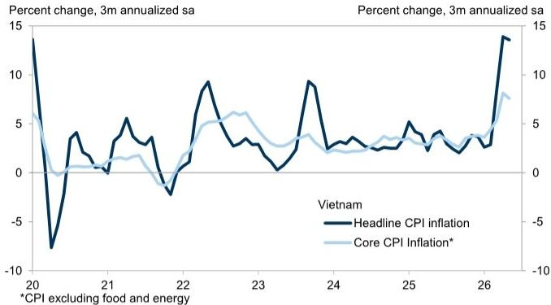

line chart

| Year | Headline CPI inflation (%) | Core CPI Inflation (%) |
|---|---|---|
| 20 | 14.0 | 6.0 |
| 21 | 0.5 | 1.0 |
| 22 | -3.0 | -2.0 |
| 23 | 9.0 | 5.0 |
| 24 | 3.0 | 3.0 |
| 25 | 5.0 | 3.0 |
| 26 | 14.0 | 8.0 |
*CPI excluding food and energy
Percent change, 3m annualized sa
Vietnam

Source: Haver Analytics, GS Global Investment Research

Exhibit 58: Vietnam PPI and Import Price Index  
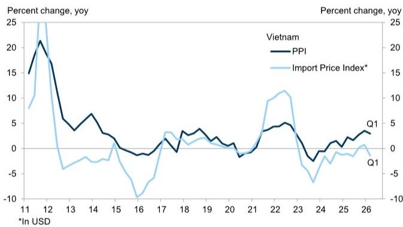

line chart

| Year | PPI (Percent change, yoy) | Import Price Index* (Percent change, yoy) |
|---|---|---|
| 11 | 15 | 8 |
| 12 | 21 | 25 |
| 13 | 4 | -4 |
| 14 | 7 | -2 |
| 15 | 2 | -1 |
| 16 | -1 | -10 |
| 17 | 3 | 3 |
| 18 | 4 | 2 |
| 19 | 3 | 1 |
| 20 | 0 | 0 |
| 21 | -2 | -1 |
| 22 | 5 | 11 |
| 23 | 4 | -6 |
| 24 | -2 | -3 |
| 25 | 2 | -1 |
| 26 | 3 | 0 |
*In USD
Vietnam
Q1

Source: Haver Analytics, GS Global Investment Research

Exhibit 59: Vietnam wage growth  
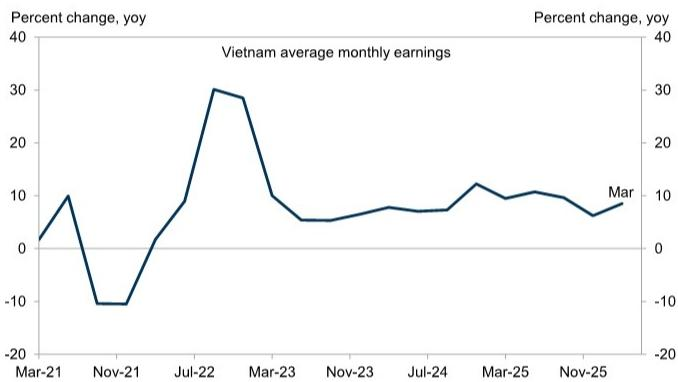

line chart

Vietnam average monthly earnings
| Month | Percent change, yoy (%) |
|---|---|
| Mar-21 | 1.5 |
| Nov-21 | -10.5 |
| Jul-22 | 30.5 |
| Mar-23 | 10.0 |
| Nov-23 | 5.0 |
| Jul-24 | 7.0 |
| Mar-25 | 12.0 |
| Nov-25 | 6.0 |

Source: Haver Analytics, GS Global Investment Research

Exhibit 60: Vietnam retail energy prices  
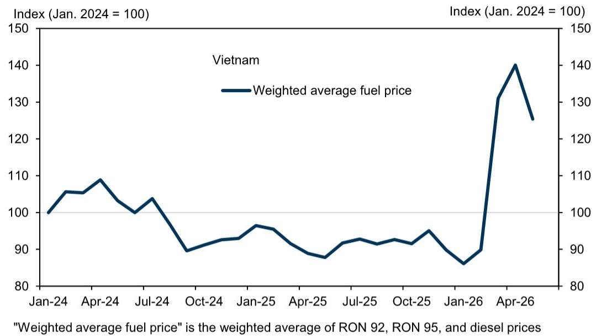

line chart

| Date    | Weighted average fuel price |
|---------|-----------------------------|
| Jan-24  | 100                         |
| Apr-24  | 110                         |
| Jul-24  | 105                         |
| Oct-24  | 90                          |
| Jan-25  | 95                          |
| Apr-25  | 88                          |
| Jul-25  | 92                          |
| Oct-25  | 93                          |
| Jan-26  | 87                          |
| Apr-26  | 140                         |

Source: Haver Analytics, GS Global Investment Research

Exhibit 61: Japan CPI inflation  
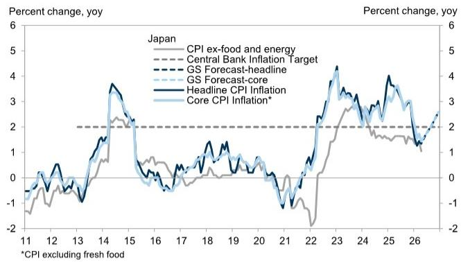

line chart

| Year | Japan CPI ex-food and energy (%) | Japan Central Bank Inflation Target (%) | Japan GS Forecast-headline (%) | Japan GS Forecast-core (%) | Japan Headline CPI Inflation (%) | Japan Core CPI Inflation* (%) |
|---|---|---|---|---|---|---|
| 11 | -1.5 | -0.8 | -0.5 | -0.3 | -0.7 | -0.9 |
| 12 | -0.8 | -0.4 | -0.2 | -0.1 | -0.5 | -0.6 |
| 13 | -0.5 | -0.2 | 0.1 | 0.3 | -0.3 | -0.4 |
| 14 | 2.2 | 2.1 | 2.3 | 2.4 | 3.7 | 3.8 |
| 15 | 2.5 | 2.4 | 2.6 | 2.7 | 3.8 | 3.9 |
| 16 | 0.5 | 0.3 | 0.4 | 0.6 | -0.5 | -0.6 |
| 17 | 0.3 | 0.2 | 0.3 | 0.4 | -0.3 | -0.4 |
| 18 | 0.8 | 0.7 | 0.9 | 1.0 | 1.5 | 1.6 |
| 19 | 1.2 | 1.1 | 1.3 | 1.4 | 1.8 | 1.9 |
| 20 | 0.9 | 0.8 | 1.0 | 1.1 | 1.4 | 1.5 |
| 21 | -0.5 | -0.3 | -0.2 | -0.1 | -0.8 | -0.9 |
| 22 | -2.0 | -1.8 | -1.9 | -2.1 | -1.5 | -1.6 |
| 23 | 2.8 | 2.7 | 3.0 | 3.2 | 4.5 | 4.6 |
| 24 | 2.5 | 2.4 | 2.6 | 2.8 | 3.8 | 3.9 |
| 25 | 2.3 | 2.2 | 2.4 | 2.6 | 4.0 | 4.1 |
| 26 | 1.8 | 1.7 | 1.9 | 2.1 | 3.5 | 3.6 |
*CPI excluding fresh food

Source: Haver Analytics, GS Global Investment Research

Exhibit 62: Japan CPI momentum  
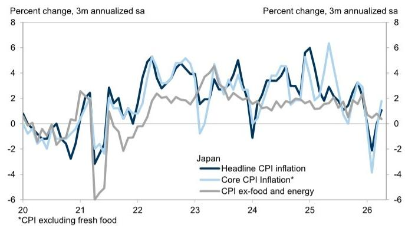

line chart

| Year | Headline CPI inflation (%) | Core CPI Inflation* (%) | CPI ex-food and energy (%) |
|---|---|---|---|
| 20 | -1.5 | -1.8 | -1.2 |
| 21 | -3.0 | -2.5 | -5.5 |
| 22 | 5.0 | 4.8 | 2.0 |
| 23 | 4.5 | 4.2 | 3.5 |
| 24 | -1.0 | -0.5 | 1.5 |
| 25 | 6.0 | 6.5 | 1.8 |
| 26 | -2.5 | -3.5 | 0.5 |

Source: Haver Analytics, GS Global Investment Research

Exhibit 63: Japan PPI and Import Price Index  
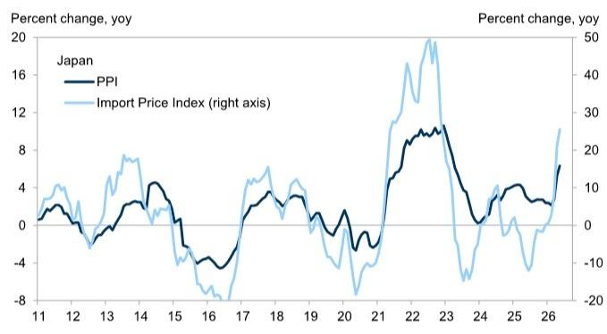

line chart

| Year | PPI   | Import Price Index (right axis) |
|------|-------|---------------------------------|
| 11   | ~0    | ~0                              |
| 12   | ~2    | ~4                              |
| 13   | ~0    | ~8                              |
| 14   | ~4    | ~6                              |
| 15   | ~0    | ~0                              |
| 16   | ~-4   | ~-8                             |
| 17   | ~2    | ~6                              |
| 18   | ~4    | ~4                              |
| 19   | ~2    | ~0                              |
| 20   | ~0    | ~-8                             |
| 21   | ~4    | ~10                             |
| 22   | ~10   | ~40                             |
| 23   | ~12   | ~50                             |
| 24   | ~0    | ~-8                             |
| 25   | ~4    | ~0                              |
| 26   | ~6    | ~10                             |

Source: Haver Analytics, GS Global Investment Research

Exhibit 64: Japan wage growth  
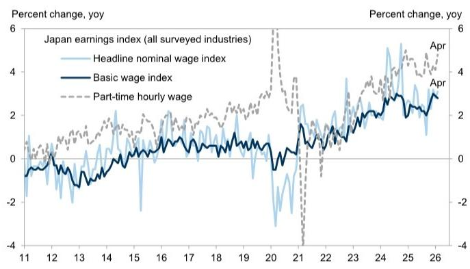

line chart

| Year | Headline nominal wage index | Basic wage index | Part-time hourly wage |
|------|-----------------------------|------------------|------------------------|
| 2021 | -3.0                        | 0.5              | -4.0                   |
| 2026 | 3.0                         | 3.0              | 4.0                    |

Source: Haver Analytics, GS Global Investment Research

Exhibit 65: Japan shunto wage agreements  
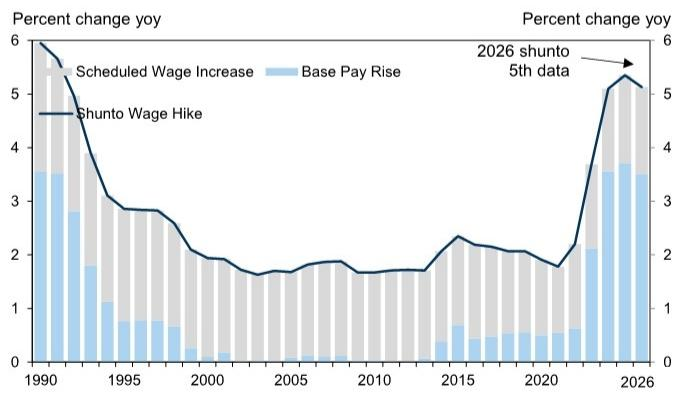

bar-line hybrid

| Year | Scheduled Wage Increase (yoy) | Base Pay Rise (yoy) | Shunto Wage Hike (yoy) |
| --- | --- | --- | --- |
| 1990 | 5.8 | 3.5 | 4.7 |
| 1991 | 5.5 | 3.2 | 4.7 |
| 1992 | 5.2 | 2.8 | 4.7 |
| 1993 | 4.8 | 2.5 | 4.7 |
| 1994 | 4.5 | 2.2 | 4.7 |
| 1995 | 4.3 | 1.8 | 4.7 |
| 1996 | 4.2 | 1.6 | 4.7 |
| 1997 | 4.1 | 1.5 | 4.7 |
| 1998 | 4.0 | 1.4 | 4.7 |
| 1999 | 3.8 | 1.2 | 4.7 |
| 2000 | 3.6 | 1.0 | 4.7 |
| 2001 | 3.5 | 0.9 | 4.7 |
| 2002 | 3.4 | 0.8 | 4.7 |
| 2003 | 3.3 | 0.7 | 4.7 |
| 2004 | 3.2 | 0.6 | 4.7 |
| 2005 | 3.1 | 0.5 | 4.7 |
| 2006 | 3.0 | 0.4 | 4.7 |
| 2007 | 2.9 | 0.3 | 4.7 |
| 2008 | 2.8 | 0.2 | 4.7 |
| 2009 | 2.7 | 0.1 | 4.7 |
| 2010 | 2.6 | 0.0 | 4.7 |
| 2011 | 2.5 | -0.1 | 4.7 |
| 2012 | 2.4 | -0.2 | 4.7 |
| 2013 | 2.3 | -0.3 | 4.7 |
| 2014 | 2.2 | -0.4 | 4.7 |
| 2015 | 2.1 | -0.5 | 4.7 |
| 2016 | 2.0 | -0.6 | 4.7 |
| 2017 | 1.9 | -0.7 | 4.7 |
| 2018 | 1.8 | -0.8 | 4.7 |
| 2019 | 1.7 | -0.9 | 4.7 |
| 2020 | 1.6 | -1.0 | 4.7 |
| 2021 | 1.5 | -1.1 | 4.7 |
| 2022 | 1.4 | -1.2 | 4.7 |

Source: JTUC-Rengo, Keidanren, Data compiled by GS Global Investment Research

Exhibit 66: Japan retail energy prices  
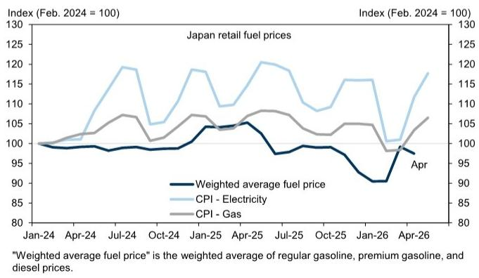

line chart

| Date    | Weighted average fuel price | CPI - Electricity | CPI - Gas |
|---------|-----------------------------|-------------------|-----------|
| Apr-26  | 98                          | 118               | 107       |

Source: Haver Analytics, GS Global Investment Research

Exhibit 67: Hong Kong CPI inflation  
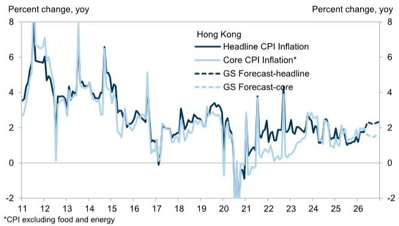

line chart

| Year | Headline CPI Inflation (%) | Core CPI Inflation* (%) | GS Forecast-headline (%) | GS Forecast-core (%) |
|---|---|---|---|---|
| 11 | 3.5 | 2.8 | 3.2 | 2.9 |
| 12 | 6.0 | 5.5 | 4.8 | 5.2 |
| 13 | 3.8 | 3.5 | 3.7 | 3.6 |
| 14 | 4.2 | 4.0 | 4.5 | 4.3 |
| 15 | 6.5 | 6.0 | 6.2 | 6.1 |
| 16 | 2.8 | 2.5 | 2.7 | 2.6 |
| 17 | 0.5 | 0.3 | 0.4 | 0.3 |
| 18 | 2.5 | 2.2 | 2.4 | 2.3 |
| 19 | 3.0 | 2.8 | 3.1 | 3.0 |
| 20 | 3.2 | 3.0 | 3.3 | 3.2 |
| 21 | -0.5 | -0.8 | -0.3 | -0.6 |
| 22 | 1.5 | 1.2 | 1.4 | 1.3 |
| 23 | 2.0 | 1.8 | 2.1 | 2.0 |
| 24 | 2.5 | 2.3 | 2.6 | 2.5 |
| 25 | 1.8 | 1.6 | 1.9 | 1.8 |
| 26 | 2.0 | 1.8 | 2.1 | 2.0 |

Source: Haver Analytics, GS Global Investment Research

Exhibit 68: Hong Kong CPI momentum  
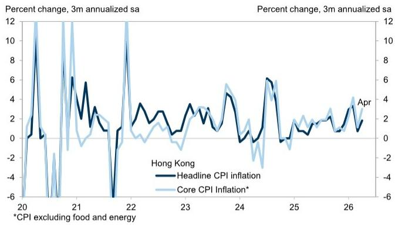

line chart

| Year | Headline CPI inflation | Core CPI Inflation* |
|------|------------------------|---------------------|
| 20   | ~0                     | ~0                  |
| 21   | ~6                     | ~12                 |
| 22   | ~1                     | ~12                 |
| 23   | ~3                     | ~4                  |
| 24   | ~5                     | ~6                  |
| 25   | ~1                     | ~2                  |
| 26   | ~3                     | ~4                  |

Source: Haver Analytics, GS Global Investment Research

Exhibit 69: Hong Kong PPI and Import Price Index  
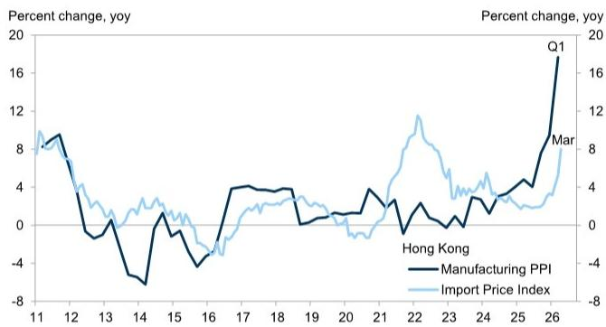

line chart

| Date | Manufacturing PPI (yoy) | Import Price Index (yoy) |
|---|---|---|
| 11 | 8.5 | 9.0 |
| 12 | 10.0 | 7.0 |
| 13 | -1.0 | 2.0 |
| 14 | -7.0 | 3.0 |
| 15 | 1.0 | 1.0 |
| 16 | -4.0 | -3.0 |
| 17 | 4.0 | 2.0 |
| 18 | 4.0 | 3.0 |
| 19 | 3.0 | 2.0 |
| 20 | 2.0 | -1.0 |
| 21 | 4.0 | 1.0 |
| 22 | 2.0 | 12.0 |
| 23 | 1.0 | 3.0 |
| 24 | 3.0 | 4.0 |
| 25 | 4.0 | 3.0 |
| 26 | 17.0 | 8.0 |
Q1 Mar
Percent change, yoy

Source: Haver Analytics, GS Global Investment Research

Exhibit 70: Hong Kong wage growth  
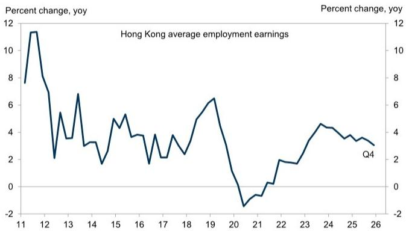

line chart

Hong Kong average employment earnings
| Year | Percent change, yoy (%) |
|---|---|
| 11 | 7.5 |
| 12 | 11.5 |
| 13 | 2.2 |
| 14 | 6.8 |
| 15 | 3.2 |
| 16 | 4.0 |
| 17 | 2.0 |
| 18 | 3.8 |
| 19 | 6.5 |
| 20 | -1.5 |
| 21 | -0.5 |
| 22 | 2.0 |
| 23 | 3.5 |
| 24 | 4.5 |
| 25 | 3.8 |
| 26 | 3.0 |
Q4

Source: Haver Analytics, GS Global Investment Research

Exhibit 71: Hong Kong retail energy prices  
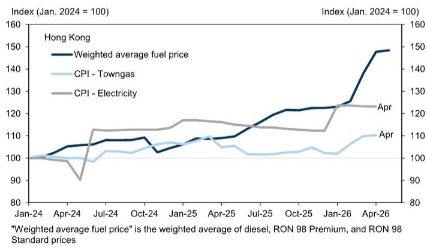

line chart

| Date | Weighted average fuel price | CPI - Towngas | CPI - Electricity |
| --- | --- | --- | --- |
| Jan-24 | ~99.5% | ~99.5% | ~99.5% |
| Apr-24 | ~99.5% | ~99.5% | ~99.5% |
| Jul-24 | ~99.5% | ~99.5% | ~99.5% |
| Oct-24 | ~99.5% | ~99.5% | ~99.5% |
| Jan-25 | ~99.5% | ~99.5% | ~99.5% |
| Apr-25 | ~99.5% | ~99.5% | ~99.5% |
| Jul-25 | ~99.5% | ~99.5% | ~99.5% |
| Oct-25 | ~99.5% | ~99.5% | ~99.5% |
| Jan-26 | ~99.5% | ~99.5% | ~99.5% |
| Apr-26 | ~99.5% | ~99.5% | ~99.5% |

Source: Haver Analytics, GS Global Investment Research

## Singapore

Exhibit 72: Singapore CPI inflation  
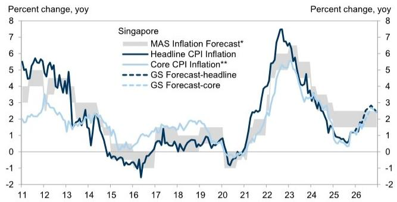  
\*The forecast is for headline CPI inflation  
\*\*CPI excluding accommodation and private road transportation costs  
Source: Haver Analytics, GS Global Investment Research

Exhibit 74: Singapore PPI and Import Price Index  
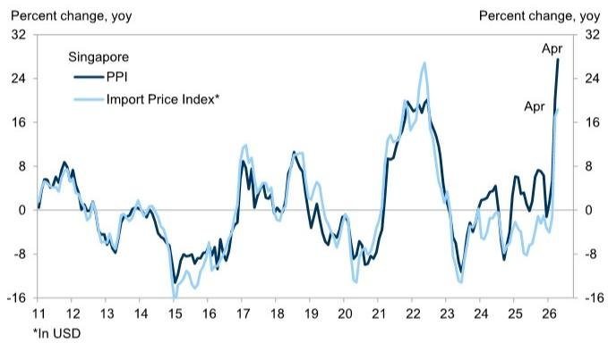

line chart

| Year | PPI (Percent change, yoy) | Import Price Index* (Percent change, yoy) |
|------|---------------------------|------------------------------------------|
| 2026 | 28                        | 24                                       |

Source: Haver Analytics, GS Global Investment Research

Exhibit 76: Singapore retail energy prices  
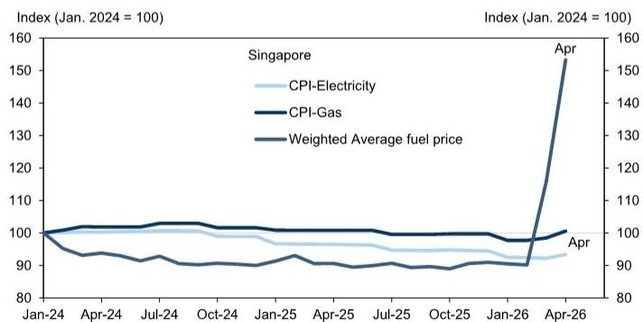

line chart

| Date | CPI-Electricity | CPI-Gas | Weighted Average fuel price |
|---|---|---|---|
| Jan-24 | 100 | 100 | 100 |
| Apr-24 | 98 | 101 | 95 |
| Jul-24 | 97 | 103 | 92 |
| Oct-24 | 96 | 103 | 91 |
| Jan-25 | 95 | 102 | 90 |
| Apr-25 | 94 | 101 | 89 |
| Jul-25 | 93 | 100 | 88 |
| Oct-25 | 92 | 100 | 87 |
| Jan-26 | 91 | 99 | 86 |
| Apr-26 | 90 | 101 | 155 |
Index (Jan. 2024 = 100) — April Apr

"Weighted average fuel price" is the weighted average of RON 98, RON 95, RON 92, and diesel prices  
Source: Haver Analytics, GS Global Investment Research

Exhibit 73: Singapore CPI momentum  
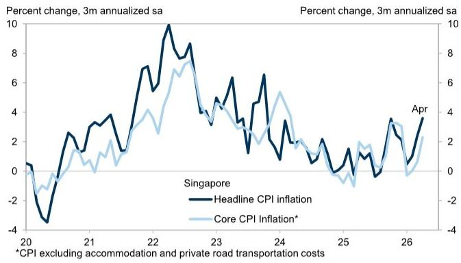

line chart

| Year | Headline CPI inflation | Core CPI Inflation* |
|------|------------------------|---------------------|
| 20   | -4                     | -2                  |
| 21   | 3                      | 1                   |
| 22   | 10                     | 6                   |
| 23   | 6                      | 4                   |
| 24   | 3                      | 2                   |
| 25   | 1                      | 0                   |
| 26   | 4                      | 3                   |
| Apr  | 4                      | 4                   |

Source: Haver Analytics, GS Global Investment Research

Exhibit 75: Singapore wage growth  
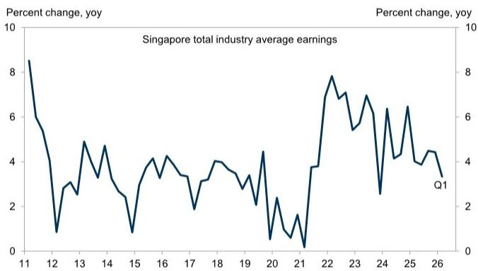

line chart

| Year | Percent change, yoy |
| ---- | ------------------- |
| 11   | 8.5                 |
| 12   | 1.0                 |
| 13   | 3.0                 |
| 14   | 4.5                 |
| 15   | 1.0                 |
| 16   | 4.0                 |
| 17   | 3.5                 |
| 18   | 4.0                 |
| 19   | 3.0                 |
| 20   | 4.5                 |
| 21   | 0.5                 |
| 22   | 8.0                 |
| 23   | 7.0                 |
| 24   | 6.0                 |
| 25   | 4.0                 |
| 26   | 3.5                 |

Source: Haver Analytics, GS Global Investment Research

## Australia

Exhibit 77: Australia CPI inflation  
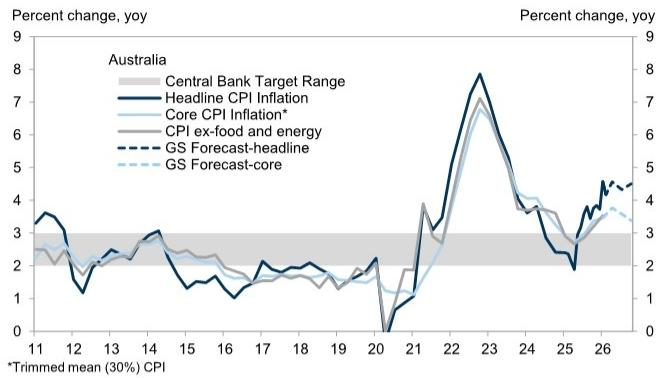

line chart

| Year | Central Bank Target Range | Headline CPI Inflation | Core CPI Inflation* | CPI ex-food and energy | GS Forecast-headline | GS Forecast-core |
|------|---------------------------|------------------------|---------------------|------------------------|----------------------|------------------|
| 11   | ~2.5                      | ~3.5                   | ~2.5                | ~2.5                   | ~2.5                 | ~2.5             |
| 12   | ~2.0                      | ~1.5                   | ~2.0                | ~2.0                   | ~2.0                 | ~2.0             |
| 13   | ~2.5                      | ~2.0                   | ~2.5                | ~2.5                   | ~2.5                 | ~2.5             |
| 14   | ~2.0                      | ~3.0                   | ~2.0                | ~2.0                   | ~2.0                 | ~2.0             |
| 15   | ~1.5                      | ~1.5                   | ~1.5                | ~1.5                   | ~1.5                 | ~1.5             |
| 16   | ~1.0                      | ~1.0                   | ~1.0                | ~1.0                   | ~1.0                 | ~1.0             |
| 17   | ~1.5                      | ~1.5                   | ~1.5                | ~1.5                   | ~1.5                 | ~1.5             |
| 18   | ~1.5                      | ~1.5                   | ~1.5                | ~1.5                   | ~1.5                 | ~1.5             |
| 19   | ~1.5                      | ~1.5                   | ~1.5                | ~1.5                   | ~1.5                 | ~1.5             |
| 20   | ~0                        | ~0                     | ~0                  | ~0                     | ~0                   | ~0               |
| 21   | ~3.0                      | ~3.0                   | ~3.0                | ~3.0                   | ~3.0                 | ~3.0             |
| 22   | ~7.0                      | ~7.0                   | ~7.0                | ~7.0                   | ~7.0                 | ~7.0             |
| 23   | ~7.0                      | ~8.0                   | ~7.0                | ~7.0                   | ~7.0                 | ~7.0             |
| 24   | ~4.0                      | ~4.0                   | ~4.0                | ~4.0                   | ~4.0                 | ~4.0             |
| 25   | ~3.0                      | ~3.0                   | ~3.0                | ~3.0                   | ~3.0                 | ~3.0             |
| 26   | ~4.5                      | ~4.5                   | ~4.5                | ~4.5                   | ~4.5                 | ~4.5             |
| 27   | ~4.5                      | ~4.5                   | ~4.5                | ~4.5                   | ~4.5                 | ~4.5             |
*Trimmed mean (30%) CPI

Source: Haver Analytics, GS Global Investment Research

Exhibit 78: Australia CPI momentum  
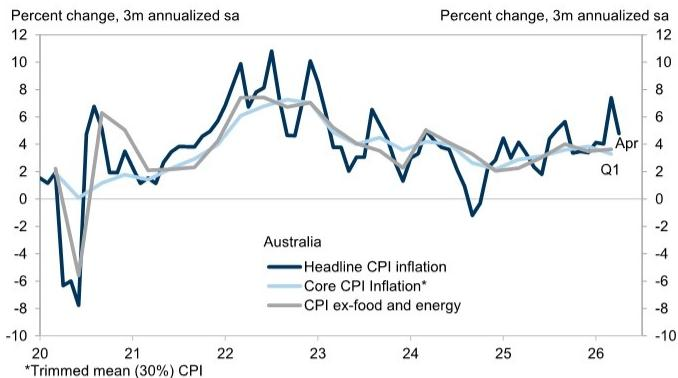

line chart

| Month | Headline CPI inflation (%) | Core CPI Inflation* (%) | CPI ex-food and energy (%) |
|---|---|---|---|
| 20 | 1.5 | 1.8 | 2.0 |
| 21 | 6.5 | 1.2 | 5.5 |
| 22 | 10.0 | 6.0 | 7.5 |
| 23 | 10.5 | 6.5 | 7.0 |
| 24 | 4.0 | 3.5 | 5.0 |
| 25 | -1.0 | 2.5 | 2.0 |
| 26 | 7.5 | 4.0 | 4.0 |
Apr Q1
Percent change, 3m annualized sa
Australia

Source: Haver Analytics, GS Global Investment Research

Exhibit 79: Australia Finished Goods PPI and Import Price Index  
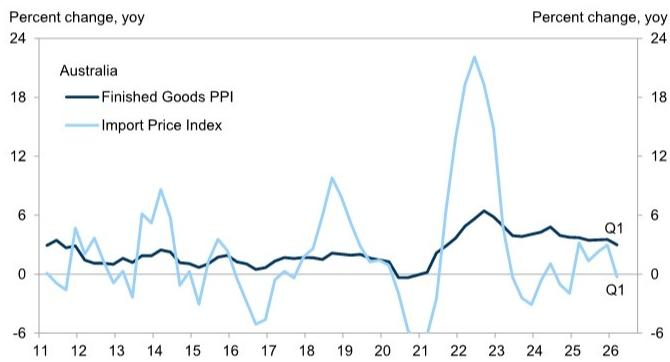

line chart

| Year | Finished Goods PPI | Import Price Index |
|------|---------------------|---------------------|
| 2026 | Q1                  | Q1                  |

Source: Haver Analytics, GS Global Investment Research

Exhibit 80: Australia wage growth  
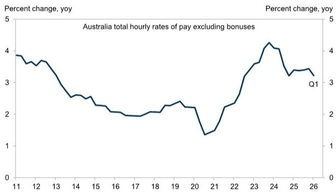

line chart

| Year | Percent change, yoy |
| ---- | ------------------- |
| 11   | 4.0                 |
| 12   | 3.8                 |
| 13   | 3.6                 |
| 14   | 3.0                 |
| 15   | 2.7                 |
| 16   | 2.5                 |
| 17   | 2.3                 |
| 18   | 2.2                 |
| 19   | 2.4                 |
| 20   | 2.3                 |
| 21   | 1.5                 |
| 22   | 2.5                 |
| 23   | 3.5                 |
| 24   | 4.2                 |
| 25   | 3.3                 |
| 26   | 3.5                 |

Source: Haver Analytics, GS Global Investment Research

Exhibit 81: Australia retail energy prices  
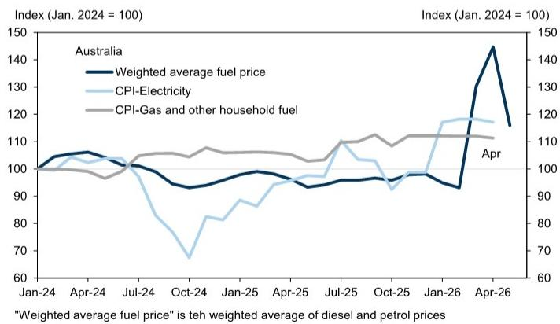

line chart

| Date | Weighted average fuel price | CPI-Electricity | CPI-Gas and other household fuel |
|---|---|---|---|
| Jan-24 | 100 | 100 | 100 |
| Apr-24 | 108 | 105 | 98 |
| Jul-24 | 103 | 102 | 105 |
| Oct-24 | 93 | 68 | 107 |
| Jan-25 | 99 | 85 | 107 |
| Apr-25 | 93 | 95 | 105 |
| Jul-25 | 96 | 108 | 110 |
| Oct-25 | 97 | 92 | 112 |
| Jan-26 | 98 | 100 | 113 |
| Apr-26 | 145 | 118 | 111 |
Index (Jan. 2024 = 100) 
| Value Label | Weighted average fuel price | CPI-Electricity | CPI-Gas and other household fuel |
|---|---|---|---|
| Jan-24 | 100 | 100 | 100 |
| Apr-24 | 107 | 105 | 99 |
| Jul-24 | 103 | 103 | 105 |
| Oct-24 | 93 | 68 | 107 |
| Jan-25 | 99 | 85 | 107 |
| Apr-25 | 93 | 95 | 105 |
| Jul-25 | 96 | 108 | 110 |
| Oct-25 | 97 | 92 | 108 |
| Jan-26 | 93 | 100 | 112 |
| Apr-26 | 145 | 118 | 111 |
Index (Jan. 2024 = 100)

Source: Haver Analytics, GS Global Investment Research

Exhibit 82: New Zealand CPI inflation  
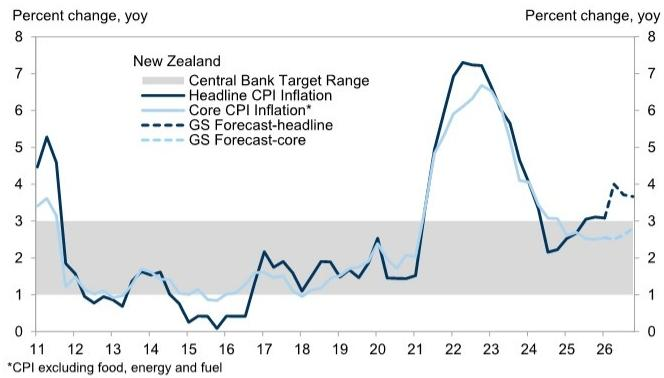

line chart

| Year | Headline CPI Inflation | Core CPI Inflation* | GS Forecast-headline | GS Forecast-core |
|------|------------------------|---------------------|----------------------|------------------|
| 11   | 5.5                    | 3.5                 | -                    | -                |
| 12   | 1.5                    | 1.0                 | -                    | -                |
| 13   | 0.5                    | 1.0                 | -                    | -                |
| 14   | 1.0                    | 1.5                 | -                    | -                |
| 15   | 0.5                    | 1.0                 | -                    | -                |
| 16   | 0.5                    | 1.0                 | -                    | -                |
| 17   | 2.0                    | 1.5                 | -                    | -                |
| 18   | 1.5                    | 1.0                 | -                    | -                |
| 19   | 2.0                    | 1.5                 | -                    | -                |
| 20   | 2.5                    | 2.0                 | -                    | -                |
| 21   | 1.5                    | 1.0                 | -                    | -                |
| 22   | 7.0                    | 6.0                 | -                    | -                |
| 23   | 7.0                    | 6.5                 | -                    | -                |
| 24   | 4.0                    | 3.0                 | -                    | -                |
| 25   | 2.0                    | 2.5                 | -                    | -                |
| 26   | 3.0                    | 3.5                 | 4.0                  | 3.0              |

Source: Haver Analytics, GS Global Investment Research

Exhibit 83: New Zealand CPI momentum  
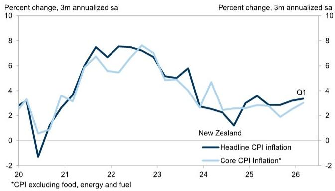

line chart

| Quarter | Headline CPI inflation (%) | Core CPI Inflation* (%) |
|---|---|---|
| 20 | 2.8 | 3.2 |
| 21 | 3.5 | 3.7 |
| 22 | 7.5 | 5.5 |
| 23 | 7.0 | 7.8 |
| 24 | 2.5 | 4.8 |
| 25 | 3.5 | 2.8 |
| 26 | 3.3 | 3.0 |
New Zealand

Source: Haver Analytics, GS Global Investment Research

Exhibit 84: New Zealand Output Prices PPI and Import Price Index  
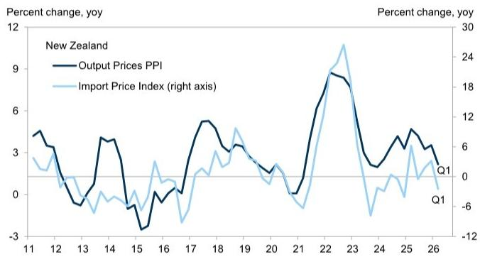

line chart

| Year | Output Prices PPI | Import Price Index (right axis) |
|------|-------------------|----------------------------------|
| 11   | 5.0               | 1.0                              |
| 12   | 3.0               | 0.5                              |
| 13   | -1.0              | -1.5                             |
| 14   | 4.0               | -0.5                             |
| 15   | -2.0              | -1.0                             |
| 16   | 0.0               | 0.5                              |
| 17   | 5.5               | 1.0                              |
| 18   | 3.0               | 2.0                              |
| 19   | 2.0               | 3.0                              |
| 20   | 1.0               | 1.5                              |
| 21   | 0.0               | -1.0                             |
| 22   | 9.0               | 24.0                             |
| 23   | 8.0               | 18.0                             |
| 24   | 3.0               | -6.0                             |
| 25   | 5.0               | 3.0                              |
| 26   | 3.0               | 1.0                              |

Source: Haver Analytics, GS Global Investment Research

Exhibit 85: New Zealand wage growth  
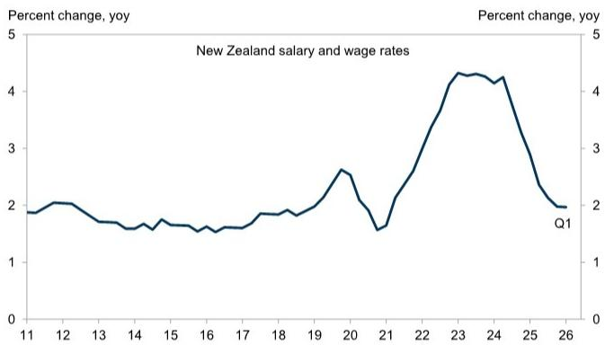

line chart

New Zealand salary and wage rates
| Year | Percent change, yoy (%) |
|---|---|
| 11 | 1.9 |
| 12 | 2.0 |
| 13 | 1.8 |
| 14 | 1.7 |
| 15 | 1.6 |
| 16 | 1.6 |
| 17 | 1.7 |
| 18 | 1.8 |
| 19 | 2.0 |
| 20 | 2.6 |
| 21 | 1.6 |
| 22 | 3.0 |
| 23 | 4.3 |
| 24 | 4.2 |
| 25 | 2.5 |
| 26 | 2.0 |

Source: Haver Analytics, GS Global Investment Research

Exhibit 86: New Zealand retail energy prices  
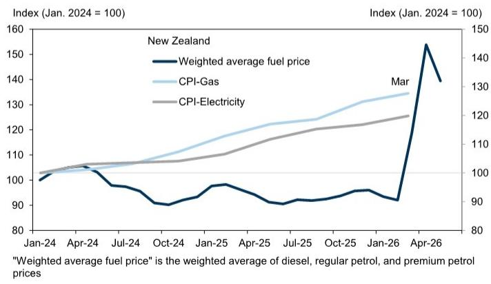

line chart

| Date | Weighted average fuel price | CPI-Gas | CPI-Electricity |
|---|---|---|---|
| Jan-24 | 100 | 100 | 100 |
| Apr-24 | 105 | 103 | 105 |
| Jul-24 | 98 | 107 | 106 |
| Oct-24 | 90 | 110 | 107 |
| Jan-25 | 98 | 115 | 109 |
| Apr-25 | 95 | 120 | 112 |
| Jul-25 | 92 | 123 | 115 |
| Oct-25 | 95 | 126 | 118 |
| Jan-26 | 93 | 130 | 120 |
| Apr-26 | 155 | 135 | 125 |
Index (Jan. 2024 = 100) 
| Month | Weighted average fuel price | CPI-Gas | CPI-Electricity |
| :--- | :---: | :---: | :---: |
| Jan-24 | 100 | 100 | 100 |
| Apr-24 | 105 | 103 | 105 |
| Jul-24 | 98 | 107 | 106 |
| Oct-24 | 90 | 110 | 107 |
| Jan-25 | 98 | 115 | 110 |
| Apr-25 | 95 | 120 | 113 |
| Jul-25 | 92 | 123 | 116 |
| Oct-25 | 95 | 126 | 118 |
| Jan-26 | 93 | 130 | 120 |
| Apr-26 | 155 | 135 | 125 |
Index (Jan. 2024 = 100)

Source: Haver Analytics, GS Global Investment Research

## Disclosure Appendix

## Reg AC

I, Andrew Tilton, hereby certify that all of the views expressed in this report accurately reflect my personal views, which have not been influenced by considerations of the firm's business or client relationships.

Unless otherwise stated, the individuals listed on the cover page of this report are analysts in GS' Global Investment Research division.

Contributing Authors: Andrew Tilton GS (Asia) L.L.C., Andrew Boak, CFA GS Australia Pty Ltd, Akira Otani GS Japan Co., Ltd., Goohoon Kwon, CFA GS (Asia) L.L.C., Hui Shan GS (Asia) L.L.C., Santanu Sengupta GS India SPL, Xinquan Chen GS (Asia) L.L.C., Irene Choi GS (Asia) L.L.C., Seoul Branch, Will Maher GS Australia Pty Ltd, Tomohiro Ota GS Japan Co., Ltd., Yuriko Tanaka GS Japan Co., Ltd., Lisheng Wang GS (Asia) L.L.C., Chris Poh GS (Singapore) Pte, Oscar To GS Australia Pty Ltd, Yuting Yang GS (Asia) L.L.C..

Unless otherwise stated, the individuals listed in the Contributing Authors disclosure of this report are analysts in GS' Global Investment Research division.

## Disclosures

## Regulatory disclosures

## Disclosures required by United States laws and regulations

See company-specific regulatory disclosures above for any of the following disclosures required as to companies referred to in this report: manager or co-manager in a pending transaction; $1\%$ or other ownership; compensation for certain services; types of client relationships; managed/co-managed public offerings in prior periods; directorships; for equity securities, market making and/or specialist role. GS trades or may trade as a principal in debt securities (or in related derivatives) of issuers discussed in this report.

The following are additional required disclosures: Ownership and material conflicts of interest: GS policy prohibits its analysts, professionals reporting to analysts and members of their households from owning securities of any company in the analyst's area of coverage. Analyst compensation: Analysts are paid in part based on the profitability of GS, which includes investment banking revenues. Analyst as officer or director: GS policy generally prohibits its analysts, persons reporting to analysts or members of their households from serving as an officer, director or advisor of any company in the analyst's area of coverage. Non-U.S. Analysts: Non-U.S. analysts may not be associated persons of GS & Co. LLC and therefore may not be subject to FINRA Rule 2241 or FINRA Rule 2242 restrictions on communications with a subject company, public appearances and trading in securities covered by the analysts.

## Additional disclosures required under the laws and regulations of jurisdictions other than the United States

The following disclosures are those required by the jurisdiction indicated, except to the extent already made above pursuant to United States laws and regulations. Australia: GS Australia Pty Ltd and its affiliates are not authorised deposit-taking institutions (as that term is defined in the Banking Act 1959 (Cth)) in Australia and do not provide banking services, nor carry on a banking business, in Australia. This research, and any access to it, is intended only for “wholesale clients” within the meaning of the Australian Corporations Act, unless otherwise agreed by GS. In producing research reports, members of Global Investment Research of GS Australia may attend site visits and other meetings hosted by the companies and other entities which are the subject of its research reports. In some instances the costs of such site visits or meetings may be met in part or in whole by the issuers concerned if GS Australia considers it is appropriate and reasonable in the specific circumstances relating to the site visit or meeting. To the extent that the contents of this document contains any financial product advice, it is general advice only and has been prepared by GS without taking into account a client’s objectives, financial situation or needs. A client should, before acting on any such advice, consider the appropriateness of the advice having regard to the client’s own objectives, financial situation and needs. A copy of certain GS Australia and New Zealand disclosure of interests and a copy of GS’ Australian Sell-Side Research Independence Policy Statement are available at: https://www.goldmansachs.com/disclosures/australia-new-zealand/index.html. Brazil: Disclosure information in relation to CVM Resolution n. 20 is available at https://www.gs.com/worldwide/brazil/area/gir/index.html. Where applicable, the Brazil-registered analyst primarily responsible for the content of this research report, as defined in Article 20 of CVM Resolution n. 20, is the first author named at the beginning of this report, unless indicated otherwise at the end of the text. Canada: This information is being provided to you for information purposes only and is not, and under no circumstances should be construed as, an advertisement, offering or solicitation by GS & Co. LLC for purchasers of securities in Canada to trade in any Canadian security. GS & Co. LLC is not registered as a dealer in any jurisdiction in Canada under applicable Canadian securities laws and generally is not permitted to trade in Canadian securities and may be prohibited from selling certain securities and products in certain jurisdictions in Canada. If you wish to trade in any Canadian securities or other products in Canada please contact GS Canada Inc., an affiliate of The GS Group Inc., or another registered Canadian dealer. Hong Kong: Further information on the securities of covered companies referred to in this research may be obtained on request from GS (Asia) L.L.C. India: Further information on the subject company or companies referred to in this research may be obtained from GS (India) Securities Private Limited, Research Analyst - SEBI Registration Number INH000001493, 10th Floor, Ascent-Worli, Sudam Kalu Ahire Marg, Worli, Mumbai-400 025, India, Corporate Identity Number U74140MH2006FTC160634, Phone +91 22 6616 9000, Fax +91 22 6616 9001. GS may beneficially own 1% or more of the securities (as such term is defined in clause 2 (h) the Indian Securities Contracts (Regulation) Act, 1956) of the subject company or companies referred to in this research report. Investment in securities market are subject to market risks. Read all the related documents carefully before investing. Registration granted by SEBI and certification from NISM in no way guarantee performance of the intermediary or provide any assurance of returns to investors. GS (India) Securities Private Limited compliance officer and investor grievance contact details can be found at: https://www.goldmansachs.com/worldwide/india/documents/Grievance-Redressal-and-Escalation-Matrix.pdf, and a copy of the annual audit compliance report can be found at this link: https://publishing.gs.com/content/site/india-annual-compliance-report.html. Japan: See below. Korea: This research, and any access to it, is intended only for “professional investors” within the meaning of the Financial Services and Capital Markets Act, unless otherwise agreed by GS. Further information on the subject company or companies referred to in this research may be obtained from GS (Asia) L.L.C., Seoul Branch. New Zealand: GS New Zealand Limited and its affiliates are neither “registered banks” nor “deposit takers” (as defined in the Reserve Bank of New Zealand Act 1989) in New Zealand. This research, and any access to it, is intended for “wholesale clients” (as defined in the Financial Advisers Act 2008) unless otherwise agreed by GS. A copy of certain GS Australia and New Zealand disclosure of interests is available at: https://www.goldmansachs.com/disclosures/australia-new-zealand/index.html. Russia: Research reports distributed in the Russian Federation are not advertising as defined in the Russian legislation, but are information and analysis not having product promotion as their main purpose and do not provide appraisal within the meaning of the Russian legislation on appraisal activity. Research reports do not constitute a personalized investment recommendation as defined in Russian laws and regulations, are not addressed to a specific client, and are prepared without analyzing the financial circumstances, investment profiles or risk profiles of clients. GS assumes no responsibility for any investment decisions that may be taken by a client or any other person based on this research report. Singapore: GS (Singapore) Pte. (Company Number: 198602165W), which is regulated by the Monetary Authority of Singapore, accepts legal responsibility for this

research, and should be contacted with respect to any matters arising from, or in connection with, this research. Taiwan: This material is for reference only and must not be reprinted without permission. Investors should carefully consider their own investment risk. Investment results are the responsibility of the individual investor. United Kingdom: Persons who would be categorized as retail clients in the United Kingdom, as such term is defined in the rules of the Financial Conduct Authority, should read this research in conjunction with prior GS on the covered companies referred to herein and should refer to the risk warnings that have been sent to them by GS International. A copy of these risks warnings, and a glossary of certain financial terms used in this report, are available from GS International on request.

European Union and United Kingdom: Disclosure information in relation to Article 6 (2) of the European Commission Delegated Regulation (EU) (2016/958) supplementing Regulation (EU) No 596/2014 of the European Parliament and of the Council (including as that Delegated Regulation is implemented into United Kingdom domestic law and regulation following the United Kingdom's departure from the European Union and the European Economic Area) with regard to regulatory technical standards for the technical arrangements for objective presentation of investment recommendations or other information recommending or suggesting an investment strategy and for disclosure of particular interests or indications of conflicts of interest is available at https://www.gs.com/disclosures/europeanpolicy.html which states the European Policy for Managing Conflicts of Interest in Connection with Investment Research.

Japan: GS Japan Co., Ltd. is a Financial Instrument Dealer registered with the Kanto Financial Bureau under registration number Kinsho 69, and a member of Japan Securities Dealers Association, Financial Futures Association of Japan Type II Financial Instruments Firms Association, and Investment Management Association of Japan. Sales and purchase of equities are subject to commission pre-determined with clients plus consumption tax. See company-specific disclosures as to any applicable disclosures required by Japanese stock exchanges, the Japanese Securities Dealers Association or the Japanese Securities Finance Company.

## Global product; distributing entities

GS Global Investment Research produces and distributes research products for clients of GS on a global basis. Analysts based in GS offices around the world produce research on industries and companies, and research on macroeconomics, currencies, commodities and portfolio strategy. This research is disseminated in Australia by GS Australia Pty Ltd (ABN 21 006 797 897); in Brazil by GS do Brasil Corretora de Títulos e Valores Mobiliários S.A.; Public Communication Channel GS Brazil: 0800 727 5764 and / or contatogoldmanbrasil@gs.com. Available Weekdays (except holidays), from 9am to 6pm. Canal de Comunicação com o Público GS Brasil: 0800 727 5764 e/ou contatogoldmanbrasil@gs.com. Horário de funcionamento: segunda-feira à sexta-feira (exceto feriados), das 9h às 18h; in Canada by GS & Co. LLC; in Hong Kong by GS (Asia) L.L.C.; in India by GS (India) Securities Private Ltd.; in Japan by GS Japan Co., Ltd.; in the Republic of Korea by GS (Asia) L.L.C., Seoul Branch; in New Zealand by GS New Zealand Limited; in Russia by OOO GS; in Singapore by GS (Singapore) Pte. (Company Number: 198602165W); and in the United States of America by GS & Co. LLC. GS International has approved this research in connection with its distribution in the United Kingdom.

GS International ("GSI"), authorised by the Prudential Regulation Authority ("PRA") and regulated by the Financial Conduct Authority ("FCA") and the PRA, has approved this research in connection with its distribution in the United Kingdom.

European Economic Area: GS Bank Europe SE ("GSBE") is a credit institution incorporated in Germany and, within the Single Supervisory Mechanism, subject to direct prudential supervision by the European Central Bank and in other respects supervised by German Federal Financial Supervisory Authority (Bundesanstalt für Finanzdienstleistungsaufsicht, BaFin) and Deutsche Bundesbank and disseminates research within the European Economic Area.

## General disclosures

This research is for our clients only. Other than disclosures relating to GS, this research is based on current public information that we consider reliable, but we do not represent it is accurate or complete, and it should not be relied on as such. The information, opinions, estimates and forecasts contained herein are as of the date hereof and are subject to change without prior notification. We seek to update our research as appropriate, but various regulations may prevent us from doing so. Other than certain industry reports published on a periodic basis, the large majority of reports are published at irregular intervals as appropriate in the analyst's judgment.

GS conducts a global full-service, integrated investment banking, investment management, and brokerage business. We have investment banking and other business relationships with a substantial percentage of the companies covered by Global Investment Research. GS & Co. LLC, the United States broker dealer, is a member of SIPC (https://www.sipc.org).

Our salespeople, traders, and other professionals may provide oral or written market commentary or trading strategies to our clients and principal trading desks that reflect opinions that are contrary to the opinions expressed in this research. Our asset management area, principal trading desks and investing businesses may make investment decisions that are inconsistent with the recommendations or views expressed in this research.

We and our affiliates, officers, directors, and employees will from time to time have long or short positions in, act as principal in, and buy or sell, the securities or derivatives, if any, referred to in this research, unless otherwise prohibited by regulation or GS policy.

The views attributed to third party presenters at GS arranged conferences, including individuals from other parts of GS, do not necessarily reflect those of Global Investment Research and are not an official view of GS.

Any third party referenced herein, including any salespeople, traders and other professionals or members of their household, may have positions in the products mentioned that are inconsistent with the views expressed by analysts named in this report.

This research is focused on investment themes across markets, industries and sectors. It does not attempt to distinguish between the prospects or performance of, or provide analysis of, individual companies within any industry or sector we describe.

Any trading recommendation in this research relating to an equity or credit security or securities within an industry or sector is reflective of the investment theme being discussed and is not a recommendation of any such security in isolation.

This research is not an offer to sell or the solicitation of an offer to buy any security in any jurisdiction where such an offer or solicitation would be illegal. It does not constitute a personal recommendation or take into account the particular investment objectives, financial situations, or needs of individual clients. Clients should consider whether any advice or recommendation in this research is suitable for their particular circumstances and, if appropriate, seek professional advice, including tax advice. The price and value of investments referred to in this research and the income from them may fluctuate. Past performance is not a guide to future performance, future returns are not guaranteed, and a loss of original capital may occur. Fluctuations in exchange rates could have adverse effects on the value or price of, or income derived from, certain investments.

Certain transactions, including those involving futures, options, and other derivatives, give rise to substantial risk and are not suitable for all investors. Investors should review current options and futures disclosure documents which are available from GS sales representatives or at https://www.theocc.com/about/publications/character-risks.jsp and https://www.goldmansachs.com/disclosures/cftc\_fcm\_disclosures. Transaction costs may be significant in option strategies calling for multiple purchase and sales of options such as spreads. Supporting documentation will be

supplied upon request.

Differing Levels of Service provided by Global Investment Research: The level and types of services provided to you by GS Global Investment Research may vary as compared to that provided to internal and other external clients of GS, depending on various factors including your individual preferences as to the frequency and manner of receiving communication, your risk profile and investment focus and perspective (e.g., marketwide, sector specific, long term, short term), the size and scope of your overall client relationship with GS, and legal and regulatory constraints. As an example, certain clients may request to receive notifications when research on specific securities is published, and certain clients may request that specific data underlying analysts' fundamental analysis available on our internal client websites be delivered to them electronically through data feeds or otherwise. No change to an analyst's fundamental research views (e.g., ratings, price targets, or material changes to earnings estimates for equity securities), will be communicated to any client prior to inclusion of such information in a research report broadly disseminated through electronic publication to our internal client websites or through other means, as necessary, to all clients who are entitled to receive such reports.

All research reports are disseminated and available to all clients simultaneously through electronic publication to our internal client websites. Not all research content is redistributed to our clients or available to third-party aggregators, nor is GS responsible for the redistribution of our research by third party aggregators. For research, models or other data related to one or more securities, markets or asset classes (including related services) that may be available to you, please contact your GS representative or go to https://research.gs.com.

Disclosure information is also available at https://www.gs.com/research/hedge.html or from Research Compliance, 200 West Street, New York, NY 10282.

## © 2026 GS.

You are permitted to store, display, analyze, modify, reformat, and print the information made available to you via this service only for your own use. You may not resell or reverse engineer this information to calculate or develop any index for disclosure and/or marketing or create any other derivative works or commercial product(s), data or offering(s) without the express written consent of GS. You are not permitted to publish, transmit, or otherwise reproduce this information, in whole or in part, in any format to any third party without the express written consent of GS. This foregoing restriction includes, without limitation, using, extracting, downloading or retrieving this information, in whole or in part, to train or finetune a machine learning or artificial intelligence system, or to provide or reproduce this information, in whole or in part, as a prompt or input to any such system.