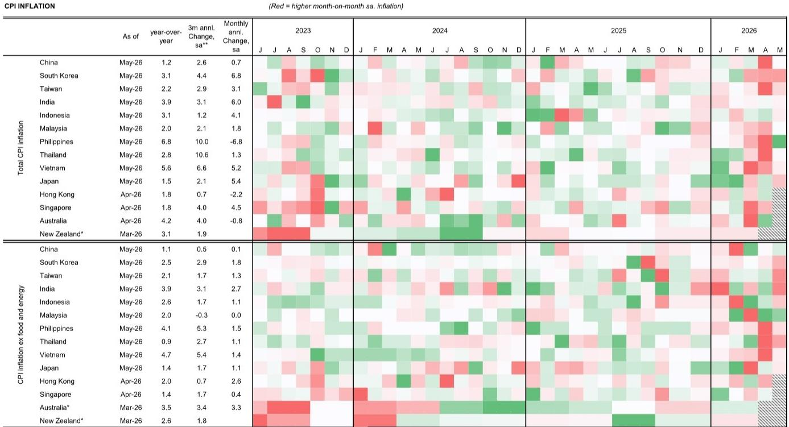
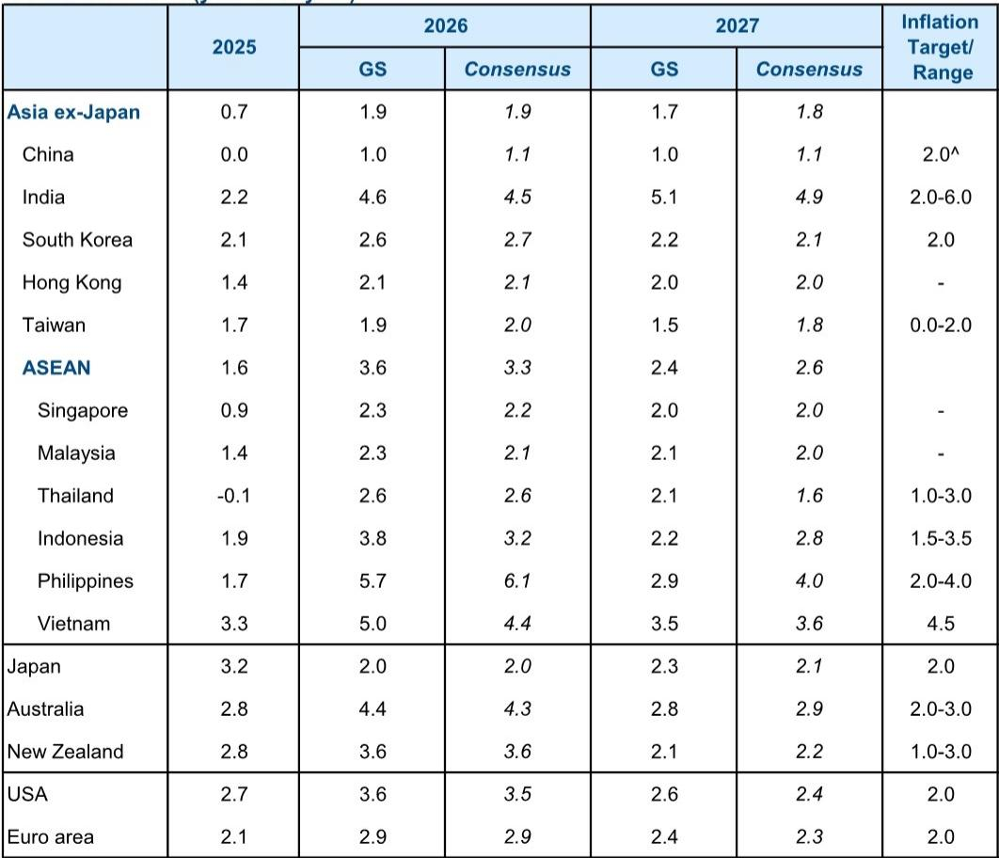

# GS：亚洲通胀最猛烈的阶段已经过去，但结构性分化才刚刚开始

当能源价格从峰值回落、供应链瓶颈逐步疏通，市场对亚洲通胀的焦虑正在快速降温。但GS最新发布的《亚太通胀监测》报告揭示了一个更微妙的图景：通胀压力整体见顶，并不意味着所有经济体都将同步回归平静。真正值得关注的，不是通胀是否回落，而是回落之后，各经济体的价格粘性、政策空间和结构韧性将如何重新定义资产定价和投资逻辑。

这份发布于2026年6月的报告，基于截至5月的CPI/PPI数据以及6月中旬的能源价格走势，给出了一个清晰的主判断：亚洲通胀的能源冲击阶段已经过去，但核心通胀的路径分化、工资传导的不对称性，以及政策退出的节奏差异，将成为未来6至12个月市场定价的核心变量。GS同时下调了布伦特原油Q4预测至80美元/桶，这一调整本身就在释放一个信号——供给侧的尾部风险正在收窄，但需求侧的韧性尚未被充分定价。

## 1. 能源价格冲击正在退潮，但输入型通胀的滞后效应仍未被完全消化

GS大宗商品团队将布伦特原油Q4预测从90美元/桶下调至80美元/桶，直接原因是霍尔木兹海峡恢复通航的前景改善。报告中的图表清晰显示，原油价格已从4月超过140美元/桶的峰值大幅回落，6月布伦特现货价格已降至约80美元/桶。这是一个重要的拐点信号。

但真正需要推敲的是传导链条的时滞。亚洲经济体在2026年初经历了剧烈的进口价格和生产者价格飙升，尽管部分国家通过隐性或显性补贴缓冲了零售燃料价格的上行，但企业端的成本压力并未完全消除。GS的数据显示，韩国、中国、日本及其他亚洲经济体的进口价格同比变化在3月至4月间出现剧烈波动，部分经济体在5月仍处于负值区间。这意味着，能源价格的回落尚未完全反映到终端消费品价格中。

对投资者而言，这一滞后效应意味着两个层面的含义。其一，短期内核心通胀可能仍有一定惯性，尤其是那些补贴力度较小、价格传导更直接的低收入经济体。其二，一旦滞后效应释放完毕，通胀下行的速度可能快于市场预期。GS在报告中明确表示，通胀预测的风险已转向下行，这正是基于能源价格持续低于峰值的假设。

## 2. 低收入经济体的通胀压力最为尖锐，但5月数据已出现缓和信号

报告中最值得关注的细节之一，是不同收入水平经济体之间的通胀分化。GS指出，菲律宾和泰国等补贴能力有限的经济体，在过去三个月经季节性调整后的CPI年化通胀率仍超过10%。这是非常高的水平，反映出这些经济体在面对能源供给冲击时的脆弱性。

但5月的环比数据已经释放出缓和信号。GS特别提到，这些经济体的5月环比通胀率已明显下降。这意味着，最糟糕的阶段可能已经过去。然而，问题在于这些经济体的核心通胀是否也会同步回落。低收入经济体通常食品和能源在CPI篮子中的权重更高，能源价格回落对整体通胀的拉低效果会更直接，但工资传导和本币贬值的压力可能使核心通胀更具粘性。

这一分化对资产配置的意义在于，投资者需要区分“周期性通胀回落”和“结构性通胀中枢上移”。对于菲律宾、泰国等经济体，通胀回落更多是周期性的，但若工资增长或本币贬值形成新的上行压力，央行政策退出的节奏就会更加谨慎。这直接影响到这些市场的利率敏感型资产和汇率预期。

## 3. 工资通胀整体温和，但日本是一个值得警惕的例外

GS在报告中给出了一个容易被忽视的观察：亚太地区的工资通胀整体表现分化，但多数经济体的工资增长稳定甚至偏弱。一个突出的例外是日本。报告明确指出，日本是较高收入经济体中工资偏软的例外——实际上，日本工资通胀表现相对较强。

这一判断与市场对日本央行退出超宽松政策的预期高度相关。如果日本的工资增长持续高于其他发达经济体，日本央行将更有信心实现通胀目标的可持续性，从而加速政策正常化。但GS的报告并未就此展开详细论证，这恰恰是一个值得深入追问的伏笔：日本的工资-通胀螺旋是否已经形成？如果形成，对日本国债收益率曲线和日元汇率的影响将如何传导至亚洲其他市场？

从投资框架的角度看，日本的工资数据将成为未来6个月亚洲宏观交易最重要的观测指标之一。如果工资增长持续超预期，日本央行可能在2026年下半年进一步调整YCC政策，这将通过利差和风险偏好渠道影响整个亚洲的资本流动。

## 4. 核心通胀的“行为良好”背后，隐藏着结构性因素尚未被充分定价的风险

GS在报告中用“well-behaved”来形容当前的核心通胀表现。从图表7可以看出，亚太地区的核心通胀中位数在2026年约为2.8%，低于2023年的峰值，也低于市场此前的担忧。这一判断与能源价格的回落趋势一致，但报告并未完全回答一个关键问题：核心通胀的“良好表现”是否可持续？

这里存在两个尚未被充分讨论的风险。第一，服务价格的粘性。能源价格回落主要影响商品价格，但服务业通胀通常更受工资和租金驱动，调整速度更慢。如果工资增长开始加速，服务价格可能接力能源成为新的通胀推手。第二，供应链重构带来的结构性成本上升。亚洲经济体在过去两年经历了显著的供应链调整，从“效率优先”转向“安全优先”，这种转变往往伴随着更高的生产成本，最终可能以更高的核心通胀中枢形式体现。

GS的报告并未否认这些风险，但也没有给出明确的量化判断。这意味着，投资者在参考这份报告时，需要自行构建对核心通胀路径的情景分析。如果核心通胀在2026年下半年仍维持在3%以上，亚洲央行的政策转向可能比市场预期的更慢。

## 5. 报告尚未完全回答的关键问题：通胀回落的斜率将如何影响央行政策路径

GS的报告提供了丰富的通胀数据和趋势判断，但有一个关键问题并未充分展开：通胀回落的斜率是否足以让亚洲央行在2026年下半年转向宽松？

从报告中的数据看，能源价格回落的速度很快，但核心通胀的下降速度可能更慢。这意味着央行面临一个两难局面：如果过早转向宽松，可能重新点燃通胀预期；如果过晚转向，可能抑制经济复苏。不同经济体的政策空间差异很大。高收入经济体如澳大利亚、韩国可能有更大的政策灵活性，而低收入经济体如菲律宾、印度则面临更严峻的权衡。

这个问题之所以重要，是因为它直接决定了亚洲债券和外汇市场的定价逻辑。如果市场开始定价央行降息，短端利率将下行，但长端利率可能因通胀粘性而保持高位，收益率曲线将趋于陡峭。这为利率交易提供了明确的方向性机会，但也要求投资者对不同经济体的政策路径有更精细的判断。

## 6. 投资者的观察框架：从“通胀是否见顶”转向“通胀回落的路径与分化”

基于GS这份报告的推导，投资者需要将分析框架从“通胀是否见顶”升级为“通胀回落的路径与分化”。具体而言，三个维度值得持续跟踪。

第一，能源价格与核心通胀的脱钩程度。如果能源价格持续回落但核心通胀降速缓慢，说明供给侧冲击正在转化为需求侧压力，这将对央行政策形成更持久的约束。第二，工资-通胀传导的国别差异。日本的工资数据是亚洲的领先指标，如果日本的工资增长开始放缓，其他经济体的工资压力也可能随之缓解。第三，补贴政策的可持续性。低收入经济体的财政空间有限，如果能源价格再次上涨，这些经济体可能被迫减少补贴，从而引发新一轮通胀冲击。

GS的报告为这些分析提供了坚实的数据基础，但真正的投资判断需要超越报告本身，结合对政策动态和市场定价的持续跟踪。这正是研报的价值所在——它提供了一个分析框架，而不是一个投资结论。

---

这份GS报告的核心价值在于，它用数据确认了亚洲通胀的能源冲击阶段已经结束，但同时揭示了结构性分化的复杂性。通胀见顶是确定的，但通胀回落的路径、速度和分化程度，将决定未来6至12个月亚洲市场的投资机会。报告中没有完全展开的工资传导、政策退出节奏和供应链重构成本，恰恰是投资者需要深入研究的领域。

欢迎来星球微信群里继续讨论：日本的工资数据是否真的意味着日本央行即将加速正常化？菲律宾和泰国的通胀回落是否可持续？以及，如果核心通胀在3%附近粘住，亚洲债券市场的收益率曲线会如何重新定价？这些问题的答案，可能就藏在报告图表背后的二阶影响中。

Personal reading notes and learning share only. Not investment advice.

