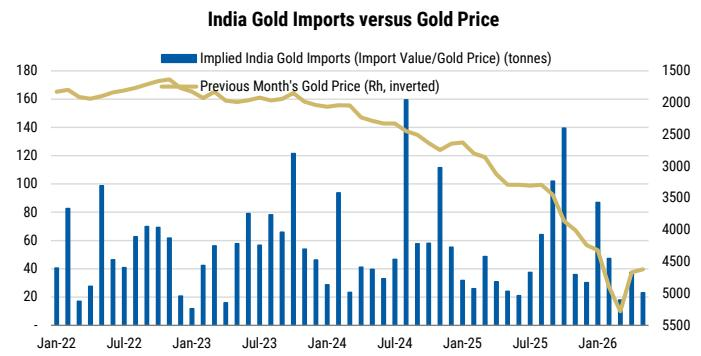
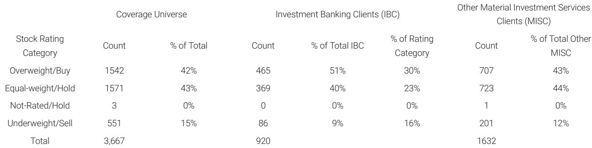

# 摩根斯坦利：黄金的下一段行情，关键不在央行，而在ETF能否重新入场

当前市场对黄金的讨论，大多集中在央行购金、地缘冲突和通胀对冲这三个传统叙事上。但摩根斯坦利在最新发布的这份报告中，提出了一个更值得推敲的判断：黄金的结构性支撑仍然坚实，但短期内推动价格从当前水平走向每盎司5200美元的关键变量，已经不是央行，而是ETF资金流的重新激活。报告明确指出，如果没有ETF需求的配合，他们的目标价将变得难以实现。

这份报告的价值不在于重申“黄金长期看多”这一共识，而在于它精准地拆解了当前黄金定价中三个相互拉扯的力量：地缘缓和的正面效应、美联储鹰派立场的压制、以及央行结构性买盘的托底。这三个力量叠加的结果，不是简单的多空判断，而是一个需要特定触发条件才能兑现的价格路径。

报告的核心主张可以概括为一句话：黄金的上行风险仍在，但通往5200美元的道路已经变窄，而这条道路能否走通，取决于一个尚未被满足的条件——ETF买家是否愿意重新进场。

## 1. 中东缓和对黄金是利好，但路径与传统避险逻辑正好相反

很多人直觉上认为，中东冲突缓和会削弱黄金的避险需求，从而打压金价。但摩根斯坦利的分析得出了一个反直觉的结论：冲突缓和反而对黄金构成支撑。原因在于，本轮中东冲突中，黄金并没有扮演传统的避险角色。

报告提供了一个关键的分析框架：供给冲击比需求冲击更难对冲。中东冲突本质上是一个供给侧的冲击——它推高油价、抬高债券收益率、并对油气进口国的财政平衡造成压力。在这种环境下，黄金的避险功能反而受到抑制。报告特别指出，土耳其等国家在压力下甚至不得不卖出黄金。数据显示，冲突升级期间黄金的平均日表现为负值，而缓和期间反而录得正回报。

这意味着，地缘缓和对黄金的正面效应，不是通过“避险需求下降”这个渠道，而是通过“缓解油价-通胀-利率”这个间接链条实现的。摩根斯坦利的石油策略师已经下调了油价预期，这将减轻央行的通胀压力，进而降低它们卖出黄金或收紧货币政策的必要性。从这个角度看，中东缓和是黄金的一个结构性利好，而非利空。

这一层分析对投资者的含义是：不要用传统的“地缘风险=买黄金”的框架来理解当前阶段。黄金与地缘的关系已经发生了结构性变化，其定价权重正在向利率和实际收益率倾斜。

## 2. 央行购金是黄金最坚固的支撑，但边际增量可能已经放缓

在黄金的所有需求来源中，官方部门的购金行为是最具结构性的力量。世界黄金协会的最新调查显示，45%的受访央行预计未来12个月将增加黄金储备，这一比例创下历史新高。中国央行已经明显加快了购金步伐——报告数据显示，3月至5月期间中国央行购买了23吨黄金，而此前12个月的总购买量仅为19吨。

但这里需要区分两个概念：央行购金的“存量支撑”和“边际推动力”。央行购金为金价提供了一个坚实的地板，但要让金价从当前水平继续大幅上行，需要的是边际上的增量买家。而央行的购金行为虽然稳定，但其节奏受到外汇储备管理、本币汇率稳定等多重因素制约，很难在短期内出现爆发式增长。

报告也暗示了这一点：尽管央行需求是结构性支撑，但仅凭央行一家之力，难以推动金价突破5200美元。印度的情况提供了另一个视角——印度在5月上调了黄金进口关税以抑制购买，这表明一些新兴市场国家正在主动管理黄金的流入速度。

对于投资者而言，央行购金是一个“持仓不动”的理由，但不是“加仓追高”的依据。真正决定下一阶段金价弹性的，是另一类资金。

## 3. 美联储是黄金近端最大的约束，而ETF是这一约束的传导载体

摩根斯坦利对美国经济团队的判断非常明确：最新的FOMC声明、点阵图和新闻发布会都偏鹰派，且声明中没有提及劳动力市场的下行风险。这直接推高了市场对加息的预期，并压低了金价。报告中的数据显示，市场定价的加息次数从5月底的0.5次迅速攀升至6月中旬的1.6次。

美联储的鹰派立场对黄金的压制，主要通过一个渠道传导：机会成本。当利率上升时，持有不生息的黄金的机会成本随之增加。但报告进一步指出，这种机会成本对不同类型投资者的影响是不对称的。央行购金可能对利率变化相对不敏感，但ETF资金流对利率预期的变化非常敏感。

这正是理解当前黄金定价的关键所在。报告中的图表清晰地展示了ETF持仓与美联储利率周期的关系：ETF的净买入主要集中在降息周期，而在利率持稳或上升阶段，ETF往往出现净流出。5月和6月的数据已经显示出ETF持仓的波动——在美联储鹰派表态后，ETF出现了明显的减持。

这意味着，只要美联储维持当前的鹰派立场，ETF资金就很难大规模回流。而没有ETF的参与，黄金的上涨动能将被显著削弱。

## 4. 历史数据显示，黄金在加息后并非必然下跌，但这次的条件不同

报告提供了一个值得注意的历史数据：在25个基点的加息后，黄金一个月平均上涨0.84%。这个数据本身并不支持“加息必然利空黄金”的简单结论。报告还引用了世界黄金协会的几个历史案例——2006年6月、2017年3月、2018年12月、2022年11月和2023年3月——在这些案例中，加息后黄金都出现了不同程度的上涨。

但这些历史案例的共性是什么？每一次黄金在加息后上涨，都不是因为加息本身，而是因为市场将加息解读为“政策即将见顶”或“政策失误”。2018年12月的加息被市场视为错误，美联储随后在2019年转为降息；2023年3月的加息发生在银行业危机背景下，市场预期政策将很快转向宽松。

而当前的环境与这些历史案例存在一个根本差异：市场并不认为美联储即将转向。摩根斯坦利的经济学家预计，美联储将维持利率不变直至2026年。这意味着，黄金无法从“预期宽松”这个渠道获得支撑。历史案例提供的乐观信号，在当前条件下可能并不适用。

这引出了一个更深刻的问题：黄金定价的核心驱动力，已经从“利率水平”转向了“利率路径的预期”。只要市场认为利率将长期维持高位，ETF资金就不会回流，黄金的上涨空间就会被压制。

## 5. 报告尚未完全回答的关键问题：全球流动性环境是否正在发生更根本的变化？

摩根斯坦利的分析框架主要围绕三个变量展开：地缘、政策、央行行为。但这份报告没有充分展开一个可能更根本的问题：全球流动性的结构性变化。

当前全球正经历一个去美元化的长期趋势，各国央行增持黄金正是这一趋势的体现。但去美元化不仅仅体现在央行储备层面，还体现在跨境支付体系、贸易结算货币、以及国际资本流动模式上。如果全球流动性环境正在发生更根本的重塑，那么黄金的定价框架可能需要重新校准。

报告提到了一个值得注意的细节：摩根斯坦利的经济学家认为，经济预期摘要中隐含的通胀路径可能没有充分反映学校重新开放带来的反通胀力量。这意味着，美联储的实际政策路径可能比点阵图所暗示的更加鸽派。如果这一判断成立，那么ETF资金回流的条件可能比市场预期的更早成熟。

但报告没有深入探讨的是：如果全球贸易体系进一步碎片化，供应链重构带来的成本压力是否会永久性抬升通胀中枢？如果通胀中枢上移，美联储的长期利率水平也将随之上升，这对黄金的长期定价意味着什么？

这些问题超出了这份报告的覆盖范围，但恰恰是决定黄金长期投资逻辑的关键变量。

## 6. 投资者的观察框架：黄金定价的“三阶段”模型

基于摩根斯坦利的分析，我们可以提炼出一个更清晰的观察框架，帮助投资者跟踪黄金定价的关键节点。

第一阶段是“央行托底”阶段。在这一阶段，金价的底部由央行购金决定。只要央行的购买行为不出现逆转，金价就很难出现大幅下跌。当前正处于这一阶段，但仅靠这一力量，金价难以突破当前区间。

第二阶段是“ETF回流”阶段。这是金价从当前水平走向5200美元的必要条件。触发这一阶段的关键信号是美联储政策路径的明确转向——要么是降息周期的开启，要么是市场对长期利率预期的重新定价。投资者需要密切关注ETF持仓数据，以及实际收益率和美元指数的变化。

第三阶段是“流动性重塑”阶段。这是一个更长期的变量，涉及全球货币体系、贸易格局和储备货币地位的变化。这一阶段如果兑现，将从根本上改变黄金的定价中枢。但目前仍处于早期观察阶段，需要更多证据来验证。

这三个阶段的切换，不是线性的，而是依赖于特定触发条件的出现。当前最重要的问题是：第二阶段的条件何时成熟？这取决于美联储的政策路径，以及市场对这一路径的预期是否会发生实质性变化。

---

黄金的故事远未结束。摩根斯坦利的这份报告为我们提供了一个清晰的框架，但同时也留下了几个值得继续探讨的问题：ETF资金回流的条件是否比市场预期的更早成熟？全球流动性环境的结构性变化是否已经在发生？如果美联储的鹰派立场被证明是暂时的，黄金的定价逻辑将如何重构？

这些问题，正是我们在知识星球和微信群里持续讨论的内容。如果你对黄金的定价逻辑有更深入的兴趣，欢迎加入我们的讨论。我们会在社群中分享这份报告的完整图表和更多数据细节，也会持续跟踪ETF资金流、央行购金节奏和美联储政策路径的变化。

Personal reading notes and learning share only. Not investment advice.

