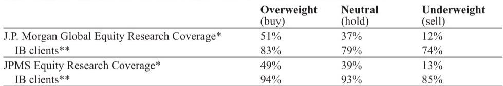

# JPM：中东局势缓和，日本日化与造纸股迎来结构性成本重估

地缘政治风险从来不只是新闻标题。当美国与伊朗在6月17日签署谅解备忘录、暂时结束敌对状态的消息传出，全球资本市场的第一反应是油价回落。但JPM日本股票研究团队在最新发布的一份跨行业报告中提出了一个更值得深思的问题：中东局势改善对不同行业、不同公司的利润影响，是否被市场以同一把尺子衡量？答案是否定的。这份报告的核心判断是，市场低估了成本端改善对日本个人护理公司的利润弹性，高估了造纸企业的定价权风险，而对化妆品公司的传导链条则完全看错了方向。

这不是一则简单的“油价跌了，成本降了”的故事。真正需要拆解的是，成本下降的时滞、传导机制、以及不同行业在面对成本改善时截然不同的议价能力。这些变量，决定了哪一类公司能从地缘政治红利中真正获益。

## 1. 个人护理公司拥有最清晰的成本弹性，但市场可能忽略了4-6个月的传导时滞

JPM分析师Akiko Kuwahara在报告中给出了一个非常具体的测算：原油价格每变动1美元/桶（按年计算），对Unicharm和花王的营业利润影响约为5-6亿日元，对狮王的影响约为1-2亿日元。这个数字本身并不惊人，但关键变量在于传导时滞——报告明确指出，原材料价格波动需要4-6个月才能反映到这些公司的损益表中。

这意味着什么？假设当前油价下跌趋势能够维持，那么对2027财年（日本财年通常从4月开始）的成本压力缓解将是实质性的。但市场往往只关注即期的油价变动，而忽略了利润表反映的滞后性。这恰恰为投资者提供了一个时间窗口：在油价下行趋势确立后，个人护理公司的盈利预期存在上修空间，而这个上修尚未被充分定价。

更重要的是，Unicharm在中东地区有直接业务敞口。局势缓和不仅降低其原材料成本，还消除了其区域销售环境的不确定性。这是一种双重利好：成本端和收入端同时改善。但报告也提醒，2026财年下半年存在一个不可忽视的风险——家庭因恐慌而囤货的需求可能回落，同时前期高价采购的原材料库存成本尚未消化完毕。这意味着，短期利润可能先承压，中期才迎来真正的改善。

## 2. 造纸企业的成本利好被价格谈判风险对冲，市场对此定价不足

造纸行业的情况要复杂得多。从表面看，油价下跌对纸浆和包装材料的成本压力同样构成利好。JPM测算，原油价格每变动1美元/桶对王子控股和日本制纸的营业利润影响约为3亿日元，大王制纸约1亿日元，连合包装仅约1000万日元。这些弹性数字并不小。

但报告揭示了一个被市场忽视的反向风险：日本主要造纸厂商原计划在7-8月对印刷纸等产品提价。油价突然大幅下跌，反而可能削弱它们在价格谈判中的筹码。客户会问：你的成本都降了，为什么还要涨价？这一逻辑一旦成立，不仅提价计划可能受阻，甚至连已经建立的固定成本转嫁机制都可能被延迟。

这是典型的“成本利好被收入端恶化对冲”的案例。市场如果只看到成本下降就买入造纸股，很可能忽略了价格谈判环境恶化带来的隐性损失。造纸企业的股价反弹，需要等待成本改善真正转化为利润，而不是被价格竞争所吞噬。

## 3. 化妆品公司的受益路径完全不同于市场直觉

化妆品行业是这份报告中最容易被误读的板块。直觉上，中东局势改善对化妆品公司的影响似乎最小——因为包装材料和部分原料的采购成本占比本来就不高，市场此前对这一风险的担忧也相对有限。JPM对此的判断是：直接成本影响确实有限。

但真正的故事不在成本端，而在需求端。报告指出，消费者信心回升和旅游人数增加，才是化妆品公司受益的主要路径。这意味着，这是一条更慢、更间接、但可能更持久的传导链条。化妆品公司不会因为油价跌了一个月就立刻利润大增，但如果中东稳定能够持续提振全球消费者信心、推动国际旅游复苏，那么高端化妆品和旅游零售渠道的销售弹性将逐步显现。

市场目前对化妆品板块的定价，可能仍然停留在“成本影响有限因此无甚影响”的线性思维上，而低估了地缘政治改善对消费场景修复的催化作用。

## 4. 报告尚未完全回答的关键问题：成本转嫁能力的行业差异如何量化

JPM这份报告提供了非常清晰的弹性测算，但它也留下了一个值得深挖的问题：为什么同样面对成本改善，不同行业、不同公司的利润转化效率存在巨大差异？答案的核心在于“成本转嫁能力”——或者说，企业在面对上下游时的议价权。

个人护理公司之所以受益最直接，是因为它们的产品品牌力强、消费者对价格敏感度相对较低，成本下降可以更多地转化为利润。造纸企业之所以受益被对冲，是因为它们面对的大型客户（如出版社、包装用户）议价能力强，成本下降反而削弱了提价理由。化妆品公司之所以走另一条路，是因为其成本结构中原料占比低，但需求对宏观环境敏感。

这个框架本身是清晰的，但报告没有给出一个系统的量化模型来评估不同公司的“成本转嫁系数”。例如，Unicharm和花王之间的转嫁能力是否存在差异？狮王的宠物护理业务是否比其个人护理业务更具定价权？这些细分层面的分析，可能需要投资者结合公司自身的品牌组合、渠道结构、客户集中度等变量进一步拆解。

## 5. 投资者的观察框架：从“油价方向”转向“利润传导效率”

基于以上分析，我们可以提炼出一个三层观察框架，用来判断哪类公司能从地缘政治改善中真正受益：

第一层，看成本弹性。JPM的测算已经提供了基础数据，但投资者需要关注的是弹性是否被重复定价。如果一家公司的成本弹性已经被市场充分计入股价，那么后续的上涨空间就有限。

第二层，看传导时滞。4-6个月的时间差意味着，当前油价下跌对利润的提振最早也要到2026年第四季度才能体现。市场情绪可能在短期内推动股价上涨，但真正的业绩验证需要时间。投资者需要区分“预期驱动”和“业绩驱动”的上涨阶段。

第三层，看议价权。这是最容易被忽略的维度。一家公司如果同时在享受成本下降和维持提价能力，那就是最优组合。如果成本下降反而导致提价受阻，那就是最差情形。造纸行业目前正处于后者的风险中，而个人护理公司相对更有能力维持定价。

这个框架的价值在于，它把地缘政治事件从一个“涨或跌”的二元命题，转化为一个“谁受益、何时受益、受益多少”的结构性问题。

## 6. 一个尚未被市场充分讨论的衍生风险：囤货需求的正常化

报告在分析个人护理公司时提到一个关键风险：2026财年下半年，家庭囤货需求可能回落，同时前期高价库存尚未消化。这个风险点值得单独拎出来讨论，因为它可能成为短期利润的最大扰动因素。

中东局势恶化期间，消费者出于恐慌可能会增加日用品囤货，这实际上是一种“需求前置”。一旦局势缓和，这部分需求就会消失，甚至可能出现去库存。更麻烦的是，公司在油价高位时采购的原材料库存，成本已经锁定在较高水平。这两股力量叠加，可能导致2026财年下半年的利润低于市场预期。

这是一个典型的“好消息中的坏消息”：中东局势改善对中长期利润是利好，但对短期利润反而可能构成压力。市场是否已经充分消化了这一节奏差异？从当前股价表现来看，很可能还没有。

---

这份JPM报告的价值，不在于给出了一个简单的“买什么、卖什么”的结论，而在于它提供了一个拆解地缘政治影响的分析框架。它告诉我们，同样的外部冲击，对不同行业的传导路径、时滞和转化效率完全不同。真正重要的不是油价会跌多少，而是谁能在成本下降的同时保持定价权，谁能在需求改善的浪潮中率先受益。

报告中对Unicharm、花王、狮王等公司的具体弹性测算，以及对造纸行业提价风险的警示，都值得深入阅读原始图表和数据。这些细节在本文中无法全部展开，但对于判断具体公司的投资价值至关重要。

如果你对日本日化与造纸板块的个股估值、成本弹性模型的详细假设、以及分析师对每只股票的具体评级和价格目标感兴趣，欢迎来我们的知识星球微信群继续讨论。在那里，我们会分享完整的研报解读、原始图表，以及更深入的行业交叉分析。

Personal reading notes and learning share only. Not investment advice.

