## Pharmaceutical Sector Weekly

June 15-19: Sector likely to remain weak, but look for share prices to rise in 2H 2026

The pharmaceutical sector rose 0.8% WoW in the week of June 15-19, underperforming TOPIX (+4.2%). Monetary policy events happened in both Japan and the US during the week, but the Nikkei Stock Average closed at an all-time high on June 19 after the market shifted to a risk-on attitude as the Middle East outlook improved. However, buying was still concentrated in AI and semiconductor stocks, with the pharmaceutical sector lagging notably. Within the sector, Sumitomo Pharma and Kyowa Kirin outperformed TOPIX. In particular, Kyowa Kirin was the sector's best performer over the past month. Despite the uncertain medium- to long-term outlook after rocatinlimab development was halted, we believe the bad news has run its course in the near term, and this might be having a positive impact. For Kyowa Kirin, our focus is on Phase 2 study results for KHK4951 (wet age-related macular degeneration, diabetic macular edema). We think data might be presented at an academic conference in October, and thus will look to confirm this at 2Q (April-June) results. We expect the overall pharmaceutical sector to remain weak for some time, but will look for April-June results and the catalysts and events expected in 2H 2026 (Figures 7-10) to cause share prices to rise.

- Nippon Shinyaku: There was an update on June 17 regarding the lawsuit filed by Capricor Therapeutics against Nippon Shinyaku concerning deramiocel. See our report here.  
- Chugai Pharmaceutical: Chugai hosted a briefing on Elevidys, Japan's first gene therapy for Duchenne muscular dystrophy (DMD), on June 17 at 13:00. See our report here.  
- FUJIFILM Holdings: CEO Goto hosted a dinner meeting with sell-side analysts on June 18. See our report here.  
- Sumitomo Pharma: The company presented the latest data on nuvisertib and enzomenib on June 16 at the European Hematology Association (EHA) 2026 Congress. See its press release here.  
- Chugai Pharmaceutical: Chugai announced on June 19 that it had filed for domestic manufacturing and marketing approval for sparsentan (IgA nephropathy). See its press release here.  
- Santen Pharmaceutical: Santen announced on June 19 that it had obtained manufacturing and marketing approval in Japan for Rhopressa ophthalmic solution $0.02\%$ for glaucoma and ocular hypertension. See its press release here.  
- Sumitomo Pharma: The company announced on June 19 that co-promotor Novo Nordisk Pharma had received approval for Wegovy subcutaneous injection for metabolic dysfunction-associated steatohepatitis (MASH). See its press release here.

Japan Equity Research

Biotechnology & Pharmaceuticals/Medical Technologies & Services

Seiji Wakao, Ph.D. AC

(81-3) 6736-8612

seiji.wakao@JPM.com

Yugo R. Kamimura, Ph.D.

(81-3) 6736-8635

yugo.kamimura@JPM.com

Naoko Saito

(81-3) 6736-8693

naoko.saito@JPM.com

JPM Securities Japan Co., Ltd.

Figure 1: Domestic Pharmaceutical Sector Share Price Performance

<table><tr><td colspan="2">1 week</td></tr><tr><td>Sumitomo Pharma</td><td>6.9%</td></tr><tr><td>Kyowa Kirin</td><td>5.7%</td></tr><tr><td>TOPIX</td><td>4.2%</td></tr><tr><td>Eisai</td><td>3.2%</td></tr><tr><td>Otsuka Holdings</td><td>3.1%</td></tr><tr><td>JCR Pharmaceuticals</td><td>1.8%</td></tr><tr><td>Ono Pharmaceutical</td><td>1.6%</td></tr><tr><td>Daiichi Sankyo</td><td>1.6%</td></tr><tr><td>Chugai Pharmaceutical</td><td>1.3%</td></tr><tr><td>Pharmaceutical Sector</td><td>0.8%</td></tr><tr><td>Nippon Shinyaku</td><td>0.7%</td></tr><tr><td>Astellas Pharma</td><td>0.3%</td></tr><tr><td>Shionogi &amp; Co.</td><td>0.2%</td></tr><tr><td>Santen Pharmaceutical</td><td>-2.6%</td></tr><tr><td>Takeda Pharmaceutical</td><td>-2.9%</td></tr></table>

<table><tr><td colspan="2">1 month</td></tr><tr><td>Kyowa Kirin</td><td>6.5%</td></tr><tr><td>TOPIX</td><td>5.0%</td></tr><tr><td>Santen Pharmaceutical</td><td>-1.0%</td></tr><tr><td>Daiichi Sankyo</td><td>-3.6%</td></tr><tr><td>Chugai Pharmaceutical</td><td>-4.9%</td></tr><tr><td>Otsuka Holdings</td><td>-5.5%</td></tr><tr><td>Pharmaceutical Sector</td><td>-5.6%</td></tr><tr><td>Sumitomo Pharma</td><td>-5.6%</td></tr><tr><td>Takeda Pharmaceutical</td><td>-6.1%</td></tr><tr><td>Nippon Shinyaku</td><td>-6.3%</td></tr><tr><td>Ono Pharmaceutical</td><td>-7.3%</td></tr><tr><td>Astellas Pharma</td><td>-7.4%</td></tr><tr><td>Shionogi &amp; Co.</td><td>-8.2%</td></tr><tr><td>JCR Pharmaceuticals</td><td>-8.8%</td></tr><tr><td>Eisai</td><td>-12.6%</td></tr></table>

<table><tr><td colspan="2">3 months</td></tr><tr><td>TOPIX</td><td>12.1%</td></tr><tr><td>Santen Pharmaceutical</td><td>11.1%</td></tr><tr><td>Kyowa Kirin</td><td>8.1%</td></tr><tr><td>Otsuka Holdings</td><td>-1.9%</td></tr><tr><td>Ono Pharmaceutical</td><td>-4.3%</td></tr><tr><td>Astellas Pharma</td><td>-9.9%</td></tr><tr><td>Pharmaceutical Sector</td><td>-11.1%</td></tr><tr><td>Daiichi Sankyo</td><td>-12.5%</td></tr><tr><td>Chugai Pharmaceutical</td><td>-12.7%</td></tr><tr><td>Takeda Pharmaceutical</td><td>-14.5%</td></tr><tr><td>Shionogi &amp; Co.</td><td>-17.4%</td></tr><tr><td>Eisai</td><td>-18.1%</td></tr><tr><td>Sumitomo Pharma</td><td>-20.8%</td></tr><tr><td>Nippon Shinyaku</td><td>-20.8%</td></tr><tr><td>JCR Pharmaceuticals</td><td>-23.5%</td></tr></table>

<table><tr><td colspan="2">6 months</td></tr><tr><td>TOPIX</td><td>19.5%</td></tr><tr><td>Santen Pharmaceutical</td><td>14.4%</td></tr><tr><td>Otsuka Holdings</td><td>14.0%</td></tr><tr><td>Takeda Pharmaceutical</td><td>7.2%</td></tr><tr><td>Ono Pharmaceutical</td><td>3.6%</td></tr><tr><td>Shionogi &amp; Co.</td><td>2.4%</td></tr><tr><td>Astellas Pharma</td><td>2.2%</td></tr><tr><td>Kyowa Kirin</td><td>0.1%</td></tr><tr><td>Pharmaceutical Sector</td><td>-4.2%</td></tr><tr><td>Chugai Pharmaceutical</td><td>-8.9%</td></tr><tr><td>Eisai</td><td>-13.4%</td></tr><tr><td>Daiichi Sankyo</td><td>-23.0%</td></tr><tr><td>Nippon Shinyaku</td><td>-33.7%</td></tr><tr><td>Sumitomo Pharma</td><td>-35.9%</td></tr><tr><td>JCR Pharmaceuticals</td><td>-36.6%</td></tr></table>

<table><tr><td colspan="2">YTD</td></tr><tr><td>TOPIX</td><td>18.7%</td></tr><tr><td>Otsuka Holdings</td><td>18.5%</td></tr><tr><td>Santen Pharmaceutical</td><td>15.3%</td></tr><tr><td>Ono Pharmaceutical</td><td>3.5%</td></tr><tr><td>Astellas Pharma</td><td>2.5%</td></tr><tr><td>Takeda Pharmaceutical</td><td>2.0%</td></tr><tr><td>Kyowa Kirin</td><td>0.4%</td></tr><tr><td>Shionogi &amp; Co.</td><td>-2.1%</td></tr><tr><td>Pharmaceutical Sector</td><td>-4.9%</td></tr><tr><td>Chugai Pharmaceutical</td><td>-8.4%</td></tr><tr><td>Eisai</td><td>-16.3%</td></tr><tr><td>Daiichi Sankyo</td><td>-24.1%</td></tr><tr><td>Nippon Shinyaku</td><td>-29.7%</td></tr><tr><td>JCR Pharmaceuticals</td><td>-35.8%</td></tr><tr><td>Sumitomo Pharma</td><td>-36.6%</td></tr></table>

Note: Share price as of 2026/06/19  
Source: Bloomberg Finance L.P., JPM

Figure 2: Domestic Share Price Performance by Sector

<table><tr><td colspan="2">1 week</td></tr><tr><td>Nonferrous Metals</td><td>19.1%</td></tr><tr><td>Electric Appliances</td><td>11.0%</td></tr><tr><td>Glass &amp; Ceramics Products</td><td>9.0%</td></tr><tr><td>Machinery</td><td>7.8%</td></tr><tr><td>Metal Products</td><td>7.2%</td></tr><tr><td>Construction</td><td>5.9%</td></tr><tr><td>Air Transportation</td><td>5.0%</td></tr><tr><td>TOPIX</td><td>4.2%</td></tr><tr><td>Chemicals</td><td>3.4%</td></tr><tr><td>Rubber Products</td><td>3.3%</td></tr><tr><td>Precision Instruments</td><td>2.8%</td></tr><tr><td>Information &amp; Communication</td><td>2.4%</td></tr><tr><td>Other Financing Business</td><td>2.1%</td></tr><tr><td>Banks</td><td>2.1%</td></tr><tr><td>Securities &amp; Commodity</td><td>2.0%</td></tr><tr><td>Iron &amp; Steel</td><td>2.0%</td></tr><tr><td>Foods</td><td>1.5%</td></tr><tr><td>Pulp &amp; Paper</td><td>1.3%</td></tr><tr><td>Transportation Equipment</td><td>1.1%</td></tr><tr><td>Oil &amp; Coal Products</td><td>1.1%</td></tr><tr><td>Textiles &amp; Apparels</td><td>0.9%</td></tr><tr><td>Pharmaceutical</td><td>0.8%</td></tr><tr><td>Insurance</td><td>0.4%</td></tr><tr><td>Services</td><td>-0.1%</td></tr><tr><td>Warehouse &amp; Harbor Transp.</td><td>-0.3%</td></tr><tr><td>Other Products</td><td>-0.3%</td></tr><tr><td>Retail Trade</td><td>-0.9%</td></tr><tr><td>Electric Power &amp; Gas</td><td>-1.0%</td></tr><tr><td>Wholesale Trade</td><td>-1.1%</td></tr><tr><td>Land Transportation</td><td>-1.2%</td></tr><tr><td>Mining</td><td>-1.3%</td></tr><tr><td>Real Estate</td><td>-1.5%</td></tr><tr><td>Fishery Agric. &amp; Forestry</td><td>-1.6%</td></tr><tr><td>MedTech</td><td>-1.7%</td></tr><tr><td>Marine Transportation</td><td>-7.8%</td></tr></table>

<table><tr><td colspan="2">1 month</td></tr><tr><td>Electric Appliances</td><td>20.8%</td></tr><tr><td>Glass &amp; Ceramics Products</td><td>16.3%</td></tr><tr><td>Metal Products</td><td>15.4%</td></tr><tr><td>Nonferrous Metals</td><td>11.6%</td></tr><tr><td>Air Transportation</td><td>8.1%</td></tr><tr><td>Banks</td><td>6.9%</td></tr><tr><td>Machinery</td><td>6.3%</td></tr><tr><td>Rubber Products</td><td>6.1%</td></tr><tr><td>Chemicals</td><td>5.5%</td></tr><tr><td>Other Financing Business</td><td>5.4%</td></tr><tr><td>TOPIX</td><td>5.0%</td></tr><tr><td>Information &amp; Communication</td><td>5.0%</td></tr><tr><td>Services</td><td>4.5%</td></tr><tr><td>Securities &amp; Commodity</td><td>4.3%</td></tr><tr><td>Iron &amp; Steel</td><td>2.2%</td></tr><tr><td>Textiles &amp; Apparels</td><td>1.8%</td></tr><tr><td>Retail Trade</td><td>1.5%</td></tr><tr><td>Precision Instruments</td><td>1.5%</td></tr><tr><td>Construction</td><td>0.6%</td></tr><tr><td>Foods</td><td>-0.2%</td></tr><tr><td>Pulp &amp; Paper</td><td>-1.4%</td></tr><tr><td>Insurance</td><td>-1.8%</td></tr><tr><td>Real Estate</td><td>-2.3%</td></tr><tr><td>Transportation Equipment</td><td>-2.3%</td></tr><tr><td>Warehouse &amp; Harbor Transp.</td><td>-2.8%</td></tr><tr><td>Other Products</td><td>-3.5%</td></tr><tr><td>Electric Power &amp; Gas</td><td>-4.5%</td></tr><tr><td>MedTech</td><td>-4.8%</td></tr><tr><td>Fishery Agric. &amp; Forestry</td><td>-5.0%</td></tr><tr><td>Pharmaceutical</td><td>-5.6%</td></tr><tr><td>Land Transportation</td><td>-5.7%</td></tr><tr><td>Oil &amp; Coal Products</td><td>-6.7%</td></tr><tr><td>Marine Transportation</td><td>-8.0%</td></tr><tr><td>Mining</td><td>-11.9%</td></tr><tr><td>Wholesale Trade</td><td>-12.3%</td></tr></table>

<table><tr><td colspan="2">3 months</td></tr><tr><td>Electric Appliances</td><td>44.0%</td></tr><tr><td>Glass &amp; Ceramics Products</td><td>38.7%</td></tr><tr><td>Metal Products</td><td>31.7%</td></tr><tr><td>Nonferrous Metals</td><td>28.0%</td></tr><tr><td>Services</td><td>24.4%</td></tr><tr><td>Banks</td><td>22.2%</td></tr><tr><td>Information &amp; Communication</td><td>18.9%</td></tr><tr><td>Other Financing Business</td><td>17.3%</td></tr><tr><td>Insurance</td><td>17.0%</td></tr><tr><td>Chemicals</td><td>14.5%</td></tr><tr><td>TOPIX</td><td>12.1%</td></tr><tr><td>Rubber Products</td><td>8.8%</td></tr><tr><td>MedTech</td><td>8.6%</td></tr><tr><td>Securities &amp; Commodity</td><td>6.4%</td></tr><tr><td>Precision Instruments</td><td>6.0%</td></tr><tr><td>Foods</td><td>5.8%</td></tr><tr><td>Machinery</td><td>4.6%</td></tr><tr><td>Air Transportation</td><td>4.2%</td></tr><tr><td>Textiles &amp; Apparels</td><td>2.9%</td></tr><tr><td>Retail Trade</td><td>0.7%</td></tr><tr><td>Pulp &amp; Paper</td><td>-1.8%</td></tr><tr><td>Iron &amp; Steel</td><td>-4.0%</td></tr><tr><td>Construction</td><td>-5.0%</td></tr><tr><td>Warehouse &amp; Harbor Transp.</td><td>-5.4%</td></tr><tr><td>Land Transportation</td><td>-6.6%</td></tr><tr><td>Transportation Equipment</td><td>-8.9%</td></tr><tr><td>Fishery Agric. &amp; Forestry</td><td>-9.5%</td></tr><tr><td>Electric Power &amp; Gas</td><td>-9.9%</td></tr><tr><td>Oil &amp; Coal Products</td><td>-10.0%</td></tr><tr><td>Wholesale Trade</td><td>-10.7%</td></tr><tr><td>Pharmaceutical</td><td>-11.1%</td></tr><tr><td>Real Estate</td><td>-13.6%</td></tr><tr><td>Other Products</td><td>-15.1%</td></tr><tr><td>Marine Transportation</td><td>-18.5%</td></tr><tr><td>Mining</td><td>-26.0%</td></tr></table>

<table><tr><td colspan="2">6 months</td></tr><tr><td>Nonferrous Metals</td><td>110.3%</td></tr><tr><td>Glass &amp; Ceramics Products</td><td>60.5%</td></tr><tr><td>Electric Appliances</td><td>52.0%</td></tr><tr><td>Banks</td><td>34.4%</td></tr><tr><td>Metal Products</td><td>32.8%</td></tr><tr><td>Machinery</td><td>27.2%</td></tr><tr><td>Chemicals</td><td>26.8%</td></tr><tr><td>Other Financing Business</td><td>23.4%</td></tr><tr><td>Insurance</td><td>22.4%</td></tr><tr><td>TOPIX</td><td>19.5%</td></tr><tr><td>Oil &amp; Coal Products</td><td>12.0%</td></tr><tr><td>Precision Instruments</td><td>11.8%</td></tr><tr><td>Marine Transportation</td><td>11.7%</td></tr><tr><td>Foods</td><td>11.1%</td></tr><tr><td>Mining</td><td>11.1%</td></tr><tr><td>Wholesale Trade</td><td>10.4%</td></tr><tr><td>Textiles &amp; Apparels</td><td>8.9%</td></tr><tr><td>Services</td><td>7.1%</td></tr><tr><td>Information &amp; Communication</td><td>6.6%</td></tr><tr><td>Securities &amp; Commodity</td><td>5.9%</td></tr><tr><td>Warehouse &amp; Harbor Transp.</td><td>4.1%</td></tr><tr><td>Pulp &amp; Paper</td><td>3.5%</td></tr><tr><td>Construction</td><td>2.0%</td></tr><tr><td>Fishery Agric. &amp; Forestry</td><td>0.5%</td></tr><tr><td>Rubber Products</td><td>-1.1%</td></tr><tr><td>Electric Power &amp; Gas</td><td>-1.3%</td></tr><tr><td>Retail Trade</td><td>-1.5%</td></tr><tr><td>Iron &amp; Steel</td><td>-3.4%</td></tr><tr><td>MedTech</td><td>-4.2%</td></tr><tr><td>Air Transportation</td><td>-4.2%</td></tr><tr><td>Pharmaceutical</td><td>-4.2%</td></tr><tr><td>Real Estate</td><td>-4.8%</td></tr><tr><td>Land Transportation</td><td>-9.3%</td></tr><tr><td>Transportation Equipment</td><td>-13.1%</td></tr><tr><td>Other Products</td><td>-16.9%</td></tr></table>

<table><tr><td colspan="2">YTD</td></tr><tr><td>Nonferrous Metals</td><td>101.0%</td></tr><tr><td>Glass &amp; Ceramics Products</td><td>58.6%</td></tr><tr><td>Electric Appliances</td><td>48.5%</td></tr><tr><td>Banks</td><td>33.0%</td></tr><tr><td>Metal Products</td><td>30.8%</td></tr><tr><td>Chemicals</td><td>25.9%</td></tr><tr><td>Machinery</td><td>25.8%</td></tr><tr><td>Insurance</td><td>23.4%</td></tr><tr><td>Other Financing Business</td><td>22.0%</td></tr><tr><td>TOPIX</td><td>18.7%</td></tr><tr><td>Precision Instruments</td><td>12.6%</td></tr><tr><td>Foods</td><td>12.4%</td></tr><tr><td>Mining</td><td>11.2%</td></tr><tr><td>Oil &amp; Coal Products</td><td>9.8%</td></tr><tr><td>Textiles &amp; Apparels</td><td>9.5%</td></tr><tr><td>Wholesale Trade</td><td>9.0%</td></tr><tr><td>Marine Transportation</td><td>7.5%</td></tr><tr><td>Services</td><td>6.7%</td></tr><tr><td>Information &amp; Communication</td><td>6.3%</td></tr><tr><td>Warehouse &amp; Harbor Transp.</td><td>4.5%</td></tr><tr><td>Securities &amp; Commodity</td><td>3.5%</td></tr><tr><td>Construction</td><td>1.9%</td></tr><tr><td>Pulp &amp; Paper</td><td>1.6%</td></tr><tr><td>Rubber Products</td><td>1.3%</td></tr><tr><td>Fishery Agric. &amp; Forestry</td><td>1.3%</td></tr><tr><td>Retail Trade</td><td>-1.0%</td></tr><tr><td>Electric Power &amp; Gas</td><td>-1.3%</td></tr><tr><td>Air Transportation</td><td>-2.3%</td></tr><tr><td>MedTech</td><td>-2.8%</td></tr><tr><td>Real Estate</td><td>-4.8%</td></tr><tr><td>Pharmaceutical</td><td>-4.9%</td></tr><tr><td>Iron &amp; Steel</td><td>-6.9%</td></tr><tr><td>Land Transportation</td><td>-8.9%</td></tr><tr><td>Transportation Equipment</td><td>-11.9%</td></tr><tr><td>Other Products</td><td>-16.5%</td></tr></table>

Note: Share price as of 2026/06/19  
Source: Bloomberg Finance L.P., JPM

Figure 3: Japan Pharmaceutical Sector Valuations

<table><tr><td rowspan="2" colspan="2"></td><td rowspan="2">JPM Rating</td><td rowspan="2">Price 19-Jun-26(¥)</td><td rowspan="2">JPM Price Target(¥)</td><td rowspan="2">Implied Return</td><td rowspan="2">Mcap 19-Jun-26(¥bn)</td><td colspan="2">P/E(x)</td><td colspan="2">P/B(x)</td><td colspan="2">EV/EBITDA(x)</td><td colspan="2">ROE(%)</td></tr><tr><td>FY26E</td><td>FY27E</td><td>FY26E</td><td>FY27E</td><td>FY26E</td><td>FY27E</td><td>FY26E</td><td>FY27E</td></tr><tr><td>4151</td><td>Kyowa Kirin</td><td>UW</td><td>2,538</td><td>1,800</td><td>-29.1%</td><td>1,334</td><td>17.5</td><td>13.9</td><td>1.4</td><td>1.3</td><td>6.8</td><td>6.8</td><td>8.3</td><td>10.0</td></tr><tr><td>4502</td><td>Takeda Pharmaceutical</td><td>N</td><td>4,934</td><td>4,900</td><td>-0.7%</td><td>7,851</td><td>10.1</td><td>11.1</td><td>1.2</td><td>1.2</td><td>11.8</td><td>11.3</td><td>3.9</td><td>4.7</td></tr><tr><td>4503</td><td>Astellas Pharma</td><td>N</td><td>2,146</td><td>2,500</td><td>16.5%</td><td>3,883</td><td>9.9</td><td>10.2</td><td>2.0</td><td>1.8</td><td>6.2</td><td>6.4</td><td>22.0</td><td>18.8</td></tr><tr><td>4506</td><td>Sumitomo Pharma</td><td>OW</td><td>1,470</td><td>2,300</td><td>56.5%</td><td>660</td><td>6.7</td><td>6.9</td><td>1.4</td><td>1.2</td><td>6.4</td><td>5.3</td><td>25.2</td><td>18.2</td></tr><tr><td>4507</td><td>Shionogi &amp; Co.</td><td>N</td><td>2,780</td><td>3,100</td><td>11.5%</td><td>2,473</td><td>12.0</td><td>10.8</td><td>1.4</td><td>1.3</td><td>5.6</td><td>4.9</td><td>12.5</td><td>12.7</td></tr><tr><td>4516</td><td>Nippon Shinyaku</td><td>N</td><td>3,972</td><td>4,000</td><td>0.7%</td><td>279</td><td>10.4</td><td>28.2</td><td>0.9</td><td>0.9</td><td>5.1</td><td>10.7</td><td>9.4</td><td>3.4</td></tr><tr><td>4519</td><td>Chugai Pharmaceutical</td><td>OW</td><td>7,550</td><td>11,000</td><td>45.7%</td><td>12,677</td><td>24.2</td><td>18.5</td><td>5.4</td><td>4.7</td><td>15.8</td><td>12.2</td><td>23.6</td><td>26.9</td></tr><tr><td>4523</td><td>Eisai</td><td>N</td><td>3,902</td><td>5,100</td><td>30.7%</td><td>1,138</td><td>17.5</td><td>21.3</td><td>1.3</td><td>1.3</td><td>9.6</td><td>10.9</td><td>7.4</td><td>6.0</td></tr><tr><td>4528</td><td>Ono Pharmaceutical</td><td>UW</td><td>2,249</td><td>1,800</td><td>-20.0%</td><td>1,122</td><td>15.2</td><td>17.2</td><td>1.2</td><td>1.2</td><td>7.8</td><td>8.4</td><td>8.3</td><td>7.1</td></tr><tr><td>4536</td><td>Santen Pharmaceutical</td><td>OW</td><td>1,874</td><td>2,600</td><td>38.7%</td><td>604</td><td>15.3</td><td>12.5</td><td>2.0</td><td>1.8</td><td>8.3</td><td>7.3</td><td>12.7</td><td>15.1</td></tr><tr><td>4552</td><td>JCR Pharmaceuticals (*NC)</td><td>NC</td><td>457</td><td>-</td><td>-</td><td>59</td><td>74.8</td><td>65.8</td><td>1.2</td><td>1.2</td><td>26.0</td><td>31.7</td><td>4.6</td><td>1.7</td></tr><tr><td>4568</td><td>Daiichi Sankyo</td><td>N</td><td>2,542</td><td>2,750</td><td>8.2%</td><td>4,735</td><td>17.0</td><td>12.3</td><td>2.6</td><td>2.4</td><td>11.1</td><td>8.3</td><td>15.9</td><td>20.5</td></tr><tr><td>4578</td><td>Otsuka Holdings</td><td>OW</td><td>10,515</td><td>14,000</td><td>33.1%</td><td>5,710</td><td>15.7</td><td>14.8</td><td>1.7</td><td>1.6</td><td>9.4</td><td>9.0</td><td>11.2</td><td>10.9</td></tr><tr><td></td><td>Average</td><td></td><td></td><td></td><td>16.0%</td><td></td><td>18.9</td><td>18.7</td><td>1.8</td><td>1.7</td><td>10.0</td><td>10.2</td><td>12.7</td><td>12.0</td></tr><tr><td></td><td>Weighted Average</td><td></td><td></td><td></td><td></td><td></td><td>16.6</td><td>14.5</td><td>2.8</td><td>2.5</td><td>11.3</td><td>9.7</td><td></td><td></td></tr></table>

Source: Bloomberg Finance L.P. consensus estimates (not covered (NC) stocks), JPM estimates (covered stocks).

Figure 4: Japan Pharmaceutical Sector Valuations (Continued)

<table><tr><td rowspan="2" colspan="2"></td><td colspan="2">EBITDA CAGR(%)</td><td colspan="2">EPS CAGR(%)</td><td colspan="2">PEG ratio</td><td colspan="2">OP CAGR(%)</td><td colspan="2">Div. yield (%)</td><td colspan="2">FCF yield (%)</td><td rowspan="2">Foreign Ownership(%)</td></tr><tr><td>FY27-30</td><td>FY27-36</td><td>FY27-30</td><td>FY27-36</td><td>FY27-30</td><td>FY27-36</td><td>FY27-30</td><td>FY27-36</td><td>FY26E</td><td>FY27E</td><td>FY26E</td><td>FY27E</td></tr><tr><td>4151</td><td>Kyowa Kirin</td><td>-4.6</td><td>-10.0</td><td>-6.4</td><td>-17.2</td><td>-</td><td>-</td><td>-5.8</td><td>-13.9</td><td>2.8</td><td>2.9</td><td>2.7</td><td>6.3</td><td>18.6</td></tr><tr><td>4502</td><td>Takeda Pharmaceutical</td><td>5.4</td><td>-3.2</td><td>7.5</td><td>-2.8</td><td>1.5</td><td>-</td><td>10.4</td><td>-7.2</td><td>4.1</td><td>4.1</td><td>8.5</td><td>9.3</td><td>42.0</td></tr><tr><td>4503</td><td>Astellas Pharma</td><td>-8.1</td><td>-6.7</td><td>-11.4</td><td>-5.2</td><td>-</td><td>-</td><td>-11.7</td><td>-5.3</td><td>3.7</td><td>3.8</td><td>12.5</td><td>14.4</td><td>43.0</td></tr><tr><td>4506</td><td>Sumitomo Pharma</td><td>-18.2</td><td>-3.8</td><td>-21.6</td><td>-4.5</td><td>-</td><td>-</td><td>-22.0</td><td>-4.6</td><td>0.7</td><td>1.2</td><td>12.6</td><td>12.7</td><td>13.6</td></tr><tr><td>4507</td><td>Shionogi &amp; Co.</td><td>-7.9</td><td>-14.8</td><td>-4.4</td><td>-10.0</td><td>-</td><td>-</td><td>-5.5</td><td>-10.8</td><td>2.4</td><td>2.5</td><td>-15.5</td><td>13.4</td><td>39.4</td></tr><tr><td>4516</td><td>Nippon Shinyaku</td><td>34.9</td><td>4.6</td><td>44.3</td><td>-2.5</td><td>0.6</td><td>-</td><td>40.3</td><td>-2.2</td><td>3.1</td><td>3.1</td><td>7.7</td><td>3.1</td><td>28.6</td></tr><tr><td>4519</td><td>Chugai Pharmaceutical</td><td>11.1</td><td>4.1</td><td>11.5</td><td>4.2</td><td>1.6</td><td>4.4</td><td>11.5</td><td>4.2</td><td>1.7</td><td>2.7</td><td>2.7</td><td>3.9</td><td>77.9</td></tr><tr><td>4523</td><td>Eisai</td><td>18.4</td><td>1.1</td><td>27.6</td><td>2.3</td><td>0.8</td><td>9.4</td><td>27.3</td><td>2.3</td><td>4.1</td><td>4.6</td><td>8.4</td><td>3.1</td><td>32.4</td></tr><tr><td>4528</td><td>Ono Pharmaceutical</td><td>-10.9</td><td>-13.7</td><td>-13.6</td><td>-21.8</td><td>-</td><td>-</td><td>-13.7</td><td>-22.8</td><td>3.6</td><td>3.6</td><td>10.6</td><td>8.3</td><td>27.5</td></tr><tr><td>4536</td><td>Santen Pharmaceutical</td><td>10.0</td><td>5.4</td><td>12.5</td><td>6.9</td><td>1.0</td><td>1.8</td><td>12.4</td><td>6.9</td><td>2.1</td><td>3.2</td><td>2.6</td><td>6.3</td><td>50.2</td></tr><tr><td>4552</td><td>JCR Pharmaceuticals (*NC)</td><td>37.2</td><td>-</td><td>60.8</td><td>-</td><td>1.1</td><td>-</td><td>47.2</td><td>-</td><td>4.4</td><td>4.4</td><td>-19.5</td><td>-19.5</td><td>9.7</td></tr><tr><td>4568</td><td>Daiichi Sankyo</td><td>-3.1</td><td>-1.7</td><td>-3.7</td><td>-1.6</td><td>-</td><td>-</td><td>-3.7</td><td>-1.6</td><td>3.9</td><td>4.3</td><td>-1.4</td><td>7.9</td><td>46.1</td></tr><tr><td>4578</td><td>Otsuka Holdings</td><td>10.2</td><td>2.1</td><td>12.6</td><td>2.6</td><td>1.2</td><td>5.7</td><td>12.4</td><td>2.6</td><td>1.3</td><td>1.3</td><td>1.7</td><td>5.1</td><td>29.1</td></tr><tr><td></td><td>Average</td><td>5.7</td><td>-3.0</td><td>8.9</td><td>-4.1</td><td>1.1</td><td>5.3</td><td>7.6</td><td>-4.4</td><td>2.9</td><td>3.2</td><td>2.6</td><td>5.7</td><td>35.2</td></tr><tr><td></td><td>Weighted Average</td><td></td><td></td><td></td><td></td><td></td><td></td><td></td><td></td><td></td><td></td><td></td><td></td><td></td></tr></table>

Source: Bloomberg Finance L.P. consensus estimates (NC stocks), JPM estimates (non-NC stocks).  
Note: CAGRs, PEG ratio, Div. yield, FCF yield are calculated by JPM based on Bloomberg Finance L.P. consensus estimates (NC stocks) or JPM estimates (covered stocks). Foreign Ownership is as of the same date as the share price.

Figure 5: Overseas Pharmaceutical Sector Valuations

<table><tr><td rowspan="2" colspan="2"></td><td rowspan="2">JPM Rating</td><td rowspan="2">Price 17-Jun-26 (lc)</td><td rowspan="2">JPM Price Target (lc)</td><td rowspan="2">Mcap 17-Jun-26 (lc bn)</td><td colspan="2">P/E(x)</td><td colspan="2">P/B(x)</td><td colspan="2">EV/EBITDA(x)</td><td colspan="2">ROE(%)</td></tr><tr><td>FY26E</td><td>FY27E</td><td>FY26E</td><td>FY27E</td><td>FY26E</td><td>FY27E</td><td>FY26E</td><td>FY27E</td></tr><tr><td>ABBV</td><td>AbbVie</td><td>OW</td><td>221</td><td>260</td><td>391</td><td>15.2</td><td>13.6</td><td>-</td><td>-</td><td>12.2</td><td>11.0</td><td>-906.2</td><td>112.5</td></tr><tr><td>AMGN</td><td>Amgen</td><td>N</td><td>342</td><td>300</td><td>184</td><td>15.1</td><td>14.4</td><td>16.7</td><td>13.7</td><td>11.2</td><td>11.0</td><td>113.1</td><td>93.8</td></tr><tr><td>AZN</td><td>AstraZeneca</td><td>OW</td><td>13,472</td><td>16,000</td><td>209</td><td>16.8</td><td>15.2</td><td>4.9</td><td>4.3</td><td>13.0</td><td>11.8</td><td>26.1</td><td>26.2</td></tr><tr><td>BIIB</td><td>Biogen</td><td>N</td><td>199</td><td>185</td><td>29</td><td>13.6</td><td>12.1</td><td>1.5</td><td>1.3</td><td>9.9</td><td>9.1</td><td>12.0</td><td>12.7</td></tr><tr><td>BMY</td><td>Bristol-Myers Squibb</td><td>OW</td><td>55</td><td>67</td><td>113</td><td>8.6</td><td>8.8</td><td>4.7</td><td>4.0</td><td>7.6</td><td>7.7</td><td>56.0</td><td>46.6</td></tr><tr><td>CSL</td><td>CSL</td><td>NC</td><td>107</td><td>-</td><td>51</td><td>12.7</td><td>11.9</td><td>2.4</td><td>2.2</td><td>9.6</td><td>9.4</td><td>17.3</td><td>18.2</td></tr><tr><td>GILD</td><td>Gilead Sciences</td><td>OW</td><td>125</td><td>160</td><td>156</td><td>-</td><td>12.9</td><td>7.0</td><td>5.3</td><td>25.0</td><td>9.9</td><td>1.9</td><td>45.4</td></tr><tr><td>GRF</td><td>Grifols</td><td>N</td><td>9</td><td>12</td><td>6</td><td>10.2</td><td>8.0</td><td>1.0</td><td>0.9</td><td>8.8</td><td>8.0</td><td>9.9</td><td>11.8</td></tr><tr><td>GSK</td><td>GlaxoSmithKline</td><td>UW</td><td>1,973</td><td>1,700</td><td>80</td><td>10.7</td><td>10.0</td><td>4.1</td><td>3.5</td><td>8.0</td><td>7.6</td><td>40.2</td><td>38.2</td></tr><tr><td>JNJ</td><td>Johnson &amp; Johnson</td><td>N</td><td>234</td><td>260</td><td>564</td><td>19.7</td><td>18.0</td><td>6.2</td><td>5.5</td><td>15.1</td><td>14.0</td><td>33.3</td><td>33.8</td></tr><tr><td>LLY</td><td>Eli Lilly &amp; Co</td><td>OW</td><td>1,112</td><td>1,300</td><td>1,047</td><td>30.2</td><td>24.7</td><td>19.5</td><td>12.7</td><td>25.2</td><td>20.4</td><td>84.3</td><td>65.0</td></tr><tr><td>MRK</td><td>Merck &amp; Co. Inc.</td><td>OW</td><td>115</td><td>135</td><td>285</td><td>22.2</td><td>11.8</td><td>5.6</td><td>4.6</td><td>16.1</td><td>9.9</td><td>22.4</td><td>42.1</td></tr><tr><td>NOVN</td><td>Novartis</td><td>OW</td><td>121</td><td>135</td><td>246</td><td>16.7</td><td>15.0</td><td>6.0</td><td>5.4</td><td>14.6</td><td>13.7</td><td>33.4</td><td>35.2</td></tr><tr><td>NOVOB</td><td>Novo Nordisk</td><td>N</td><td>286</td><td>250</td><td>1,275</td><td>12.8</td><td>13.1</td><td>5.3</td><td>4.8</td><td>9.7</td><td>9.9</td><td>46.9</td><td>38.2</td></tr><tr><td>PFE</td><td>Pfizer Inc</td><td>N</td><td>26</td><td>30</td><td>148</td><td>8.5</td><td>8.9</td><td>1.6</td><td>1.6</td><td>8.6</td><td>8.5</td><td>18.5</td><td>17.8</td></tr><tr><td>REGN</td><td>Regeneron Pharmaceuticals</td><td>OW</td><td>608</td><td>850</td><td>64</td><td>13.2</td><td>11.4</td><td>1.8</td><td>1.6</td><td>9.0</td><td>7.7</td><td>13.9</td><td>14.8</td></tr><tr><td>ROG</td><td>Roche Holding</td><td>NC</td><td>322</td><td>-</td><td>262</td><td>-</td><td>-</td><td>-</td><td>-</td><td>11.2</td><td>10.6</td><td>40.6</td><td>35.4</td></tr><tr><td>SAN</td><td>Sanofi</td><td>N</td><td>75</td><td>95</td><td>91</td><td>8.6</td><td>8.1</td><td>1.2</td><td>1.2</td><td>7.2</td><td>6.6</td><td>13.2</td><td>13.3</td></tr><tr><td></td><td>Average</td><td></td><td></td><td></td><td></td><td>14.7</td><td>12.8</td><td>5.6</td><td>4.5</td><td>12.3</td><td>10.4</td><td>-18.0</td><td>38.9</td></tr><tr><td></td><td>Weighted Average</td><td></td><td></td><td></td><td></td><td>19.7</td><td>16.6</td><td>9.8</td><td>7.2</td><td>15.8</td><td>13.3</td><td></td><td></td></tr></table>

Source: Bloomberg Finance L.P. consensus estimates, JPM  
Note: Ratings, Price Targets are all JPM estimates, Valuation and ROE are all Bloomberg Finance L.P. consensus estimates.

Figure 6: Overseas Pharmaceutical Sector Valuations (Continued)

<table><tr><td rowspan="2" colspan="2"></td><td colspan="2">EBITDA CAGR(%)</td><td colspan="2">EPS CAGR(%)</td><td colspan="2">PEG ratio</td><td colspan="2">OP CAGR(%)</td><td colspan="2">Div. yield (%)</td><td colspan="2">FCF yield (%)</td><td rowspan="2">Foreign Ownership(%)</td></tr><tr><td>FY27-30</td><td>FY27-36</td><td>FY27-30</td><td>FY27-36</td><td>FY27-30</td><td>FY27-36</td><td>FY27-30</td><td>FY27-36</td><td>FY26E</td><td>FY27E</td><td>FY26E</td><td>FY27E</td></tr><tr><td>ABBV</td><td>AbbVie</td><td>6.0</td><td>-0.3</td><td>6.8</td><td>-0.4</td><td>2.0</td><td>-</td><td>6.4</td><td>-</td><td>3.1</td><td>3.3</td><td>5.0</td><td>5.6</td><td>-</td></tr><tr><td>AMGN</td><td>Amgen</td><td>2.9</td><td>0.8</td><td>5.3</td><td>2.2</td><td>2.7</td><td>6.5</td><td>3.6</td><td>-</td><td>3.0</td><td>3.1</td><td>4.1</td><td>5.0</td><td>-</td></tr><tr><td>AZN</td><td>AstraZeneca</td><td>10.5</td><td>1.5</td><td>12.5</td><td>3.5</td><td>1.2</td><td>4.3</td><td>11.7</td><td>-</td><td>0.0</td><td>0.0</td><td>5.1</td><td>6.3</td><td>-</td></tr><tr><td>BIIB</td><td>Biogen</td><td>9.3</td><td>7.1</td><td>7.1</td><td>4.8</td><td>1.7</td><td>2.5</td><td>3.5</td><td>-</td><td>-</td><td>-</td><td>6.7</td><td>9.4</td><td>-</td></tr><tr><td>BMY</td><td>Bristol-Myers Squibb</td><td>-8.3</td><td>-3.7</td><td>-7.5</td><td>-2.3</td><td>-</td><td>-</td><td>-8.4</td><td>-</td><td>4.6</td><td>4.8</td><td>11.3</td><td>11.8</td><td>-</td></tr><tr><td>CSL</td><td>CSL</td><td>4.5</td><td>-</td><td>4.2</td><td>-</td><td>2.9</td><td>-</td><td>3.2</td><td>-</td><td>2.8</td><td>2.9</td><td>5.2</td><td>5.5</td><td>-</td></tr><tr><td>GILD</td><td>Gilead Sciences</td><td>9.4</td><td>1.5</td><td>9.3</td><td>5.3</td><td>1.4</td><td>2.4</td><td>8.8</td><td>-</td><td>2.6</td><td>2.8</td><td>6.7</td><td>0.2</td><td>-</td></tr><tr><td>GRF</td><td>Grifols</td><td>8.2</td><td>5.7</td><td>15.1</td><td>11.4</td><td>0.5</td><td>0.7</td><td>9.1</td><td>-</td><td>2.5</td><td>3.4</td><td>8.0</td><td>12.6</td><td>-</td></tr><tr><td>GSK</td><td>GlaxoSmithKline</td><td>-0.4</td><td>-0.8</td><td>3.2</td><td>5.1</td><td>3.1</td><td>1.9</td><td>1.7</td><td>-</td><td>0.0</td><td>0.0</td><td>6.2</td><td>8.7</td><td>-</td></tr><tr><td>JNJ</td><td>Johnson &amp; Johnson</td><td>10.7</td><td>3.9</td><td>11.7</td><td>6.8</td><td>1.5</td><td>2.6</td><td>10.9</td><td>-</td><td>2.3</td><td>2.4</td><td>3.9</td><td>4.5</td><td>-</td></tr><tr><td>LLY</td><td>Eli Lilly &amp; Co</td><td>11.9</td><td>5.4</td><td>13.0</td><td>6.9</td><td>1.9</td><td>3.6</td><td>12.2</td><td>-</td><td>0.6</td><td>0.7</td><td>1.2</td><td>2.4</td><td>-</td></tr><tr><td>MRK</td><td>Merck &amp; Co. Inc.</td><td>0.2</td><td>-2.1</td><td>2.2</td><td>-0.1</td><td>5.3</td><td>-</td><td>1.1</td><td>-</td><td>2.9</td><td>3.0</td><td>6.7</td><td>5.2</td><td>-</td></tr><tr><td>NOVN</td><td>Novartis</td><td>6.5</td><td>0.3</td><td>7.9</td><td>0.0</td><td>1.9</td><td>-</td><td>6.2</td><td>-</td><td>3.6</td><td>3.8</td><td>6.1</td><td>5.8</td><td>-</td></tr><tr><td>NOVOB</td><td>Novo Nordisk</td><td>6.1</td><td>2.8</td><td>9.2</td><td>3.3</td><td>1.4</td><td>4.0</td><td>7.6</td><td>-</td><td>4.1</td><td>4.0</td><td>3.9</td><td>4.0</td><td>-</td></tr><tr><td>PFE</td><td>Pfizer Inc</td><td>-7.4</td><td>-0.8</td><td>-5.0</td><td>2.2</td><td>-</td><td>4.0</td><td>-5.9</td><td>-</td><td>6.7</td><td>6.7</td><td>10.4</td><td>10.7</td><td>-</td></tr><tr><td>REGN</td><td>Regeneron Pharmaceuticals</td><td>13.9</td><td>3.0</td><td>11.1</td><td>4.6</td><td>1.0</td><td>2.5</td><td>11.2</td><td>-</td><td>0.6</td><td>0.7</td><td>7.9</td><td>6.7</td><td>-</td></tr><tr><td>ROG</td><td>Roche Holding</td><td>6.1</td><td>2.7</td><td>-</td><td>-</td><td>-</td><td>-</td><td>8.0</td><td>-</td><td>3.1</td><td>3.2</td><td>4.6</td><td>-</td><td>-</td></tr><tr><td>SAN</td><td>Sanofi</td><td>7.6</td><td>-1.0</td><td>9.1</td><td>1.6</td><td>0.9</td><td>5.2</td><td>7.3</td><td>-</td><td>5.7</td><td>6.0</td><td>7.7</td><td>8.8</td><td>-</td></tr><tr><td></td><td>Average</td><td>5.4</td><td>1.5</td><td>6.8</td><td>3.4</td><td>2.0</td><td>3.4</td><td>5.5</td><td>-</td><td>2.8</td><td>3.0</td><td>6.2</td><td>6.7</td><td></td></tr><tr><td></td><td>Weighted Average</td><td></td><td></td><td></td><td></td><td></td><td></td><td></td><td></td><td></td><td></td><td></td><td></td><td></td></tr></table>

Source: Bloomberg Finance L.P. consensus estimates, JPM  
Note: CAGRs, ratio, and yields are all calculated by JPM based on the Bloomberg Finance L.P. consensus.

## Events and Catalysts

Figure 7: Japan Pharmaceutical Sector Event Calendar

<table><tr><td colspan="2">Date (JST)</td><td>Company</td><td>Event</td></tr><tr><td>2026/08/17 (Mon)</td><td>TBD</td><td>Daiichi Sankyo</td><td>Tour/visit of the Shinagawa Research Institute and a networking/social gathering with R&amp;D members</td></tr><tr><td>2026/08/25 (Tue)</td><td>21:00-22:00</td><td>Daiichi Sankyo</td><td>Dialogue/discussion session with John Tsai, Global Head of Research &amp; Development</td></tr><tr><td>2H2026</td><td>TBD</td><td>Takeda Pharmaceutical</td><td>Capital Markets Day</td></tr></table>

Source: Company data, JPM  
Note: Updated events are highlighted in blue.

Figure 8: Catalyst Calendar (Large-Cap Pharma)

<table><tr><td></td><td>Jun</td><td>Jul</td><td>Aug</td><td>Sep</td><td>Oct</td><td>Nov</td><td>Dec 2026</td></tr><tr><td>Takeda</td><td>√ zasocitinib (TAK-279, Psoriasis): Filing, FY2026√ TAK928 (IBI363, PD-1/IL-2α-bias bispecific antibody fusion protein, solid tumors (incl sq NSCLC, non-sq NSCLC, MSS CRC): US Ph2</td><td>√ oveporexton (Narcolepsy Type 1): US approval decision, PDUFA date Aug 10√ rusfertide (polycythemia vera): US approval decision, PDUFA data Aug 29√ TAK-360 (Idiopathic hypersomnia, Narcolepsy Type 2): Possible Ph2 POC data presentation, around fall</td><td></td><td></td><td></td><td>√ zasocitinib (TAK-279, Crohn&#x27;s, UC): Ph2b data readout, FY2026 (Primary Completion: Sep 18/Sep 30)√ Capital Markets Day, planned in 2H2026</td><td></td></tr><tr><td>Astellas Pharma</td><td>trial data readout√ ASP845 (Pompe disease): POC decision, FY26 H1√ Veozah (VMS associated with menopause): Ph3 STARLIGHT 3 trial data readout, Q1</td><td>√ setidegrasib (KRAS C12D degradation, solid cancer): additional data presentation, FY26√ ASP2138 (CLDN18.2/CD3, GI cancer): additional data presentation, FY26√ Padcev (MIBC, cisplatin eligible): US approval decision PDUFA date: Aug 17, 2026</td><td></td><td></td><td></td><td></td><td></td></tr><tr><td>Chugai Pharmaceutical</td><td></td><td></td><td></td><td></td><td>√ GYM329: Ph2(Obesity, Incretin combination)data readout, 2026</td><td></td><td></td></tr><tr><td>Eisai</td><td>√ E7386(CBP/β catenine inhibitor): 102 trial(Ph1b/2, solid tumour, +Lenvima): Topline results, FY2026√ Leqembi: Approval decision of SC-AI initiation, PDUFA date: Aug 24, 2026</td><td></td><td></td><td></td><td></td><td>√ Leqembi: SC-AI launch (Japan), in 2026</td><td></td></tr><tr><td>Daiichi Sankyo</td><td>√ Enhertu (DL-04: HER2mut, 1L) Topline results, FY2026 1H√ Dato-DXd: AVANZAR (Ph3, QCS positive NSCLC (without actionable genomic alteration), 1L, +Imifinzi)topline results, 2026H2</td><td></td><td></td><td></td><td>√ I-DXd (IL-02, ES-SCLC, 2L+): US approval decision, PDUFA date: Oct 10, 2026√ Dato-DXd: TROPION-Breast05 (Ph3, PD-L1 High TNBC, +durvalumab) Topline results, 2026(Primary Completion: 31 Oct 2026)</td><td></td><td></td></tr><tr><td>Otsuka HD</td><td>√ sibeprenlimab: Ph3 eGFR topline results, Jun-Aug 2026√ Voyxact competitor atacicept: US approval decision, PDUFA date: Jul 7, 2026√ Voyxact competitor atacicept: Ph3 eGFR data,√ Gchtanafadine (ADHD): US approval decision, PDUFA date√ Urotaront (Schizophrenia): Ph3 completion, Oct 2026Jul 24, 2026</td><td>√ zipalertinib (NSCLC): Ph3 completion, Aug 2026√ sibeprenlimab: ASN 2026(Oct 21-25): expect Ph3 eGFR data details presentation√ Urotaront (Schizophrenia): Ph3 completion, Oct 2026</td><td></td><td></td><td></td><td>√ Voyxact competitor povetacicept: US approval decision, expect at the end of 2026√ sibeprenlimab: Filing of sBLA for eGFR data + autoinjector, 2H2026</td><td></td></tr></table>

Source: Company data, JPM

Figure 9: Catalyst Calendar (Mid-Cap Pharma, Others)

<table><tr><td></td><td>Jun</td><td>Jul</td><td>Aug</td><td>Sep</td><td>Oct</td><td>Nov</td><td>Dec 2026</td></tr><tr><td rowspan="2">Kyowa Kirin</td><td rowspan="2"></td><td rowspan="2">√ Komzifti (ziftomenib): KOMET-008 (Ph3, R/R NPM1m/FLT3m AML, + gilteritinib)</td><td rowspan="2" colspan="4">pleriminary data acquisition, 2H2026</td><td></td></tr><tr><td>√ KHK4951 (Exudative Age-related Macular Degeneration, diabetic macular edema) possible topline results update, around the end of 2026 (expect presentation around Oct)</td></tr><tr><td>Sumitomo Pharma</td><td></td><td></td><td></td><td></td><td colspan="2">√ enzomenib: Ph2(R/R KMT2Am AML) interim analysis result, expect in Q3FY26√ nuvisertib: recommended Ph3 dose decision, Q3FY26</td><td>√ enzomenib: Ph2 interim analysis, expect presentation at ASH 2026 (Dec 12-15)</td></tr><tr><td>Shionogi</td><td></td><td></td><td></td><td></td><td></td><td></td><td></td></tr><tr><td>Nippon Shinyaku</td><td colspan="2">√ Deadline for submission of written objection regarding motion for preliminary injunction for deramiocel, June 26</td><td colspan="2">√ deramiocel: US approval decision, PDUFA date: Aug 22</td><td colspan="3">√ Viltepso: Completion of FDA review of 301 Trial, 2026√ NS-229 (Eosinophilic Granulomatosis with Polyangiitis): Ph2 Completion, FY26√ NS-089 (Duchenne muscular dystrophy): Ph2 Trial(Japan, US) Completion, FY26</td></tr><tr><td>Ono Pharmaceutical</td><td colspan="4">√ DCC-3116 (+ripretinib, malignant tumour) Ph1/2 data readout; ONO-2020 (Alzheimer&#x27;s disease) Ph2 data readou; ONO-1110 (Endocannabinoid Modulatory Effect) Ph2 data readout; ONO-4685 (T-cell lymphoma): Ph1 data readout, FY2026√ Qinlock (GIST: Gastrointestinal Stromal Tumor, 2L, KIT Exon 11+17/18 mut): Ph3 data readout, FY26</td><td colspan="2"></td><td>√ Velexbru (PCNSL, 2L+): US approval decision, PDUFA date: Dec 18, 2026</td></tr><tr><td>Santen Pharmaceutical</td><td colspan="2">√ Latanoprost(Glaucoma): Asia approval, FY26√ Eybelis Mini(Glaucoma): China Ph3 completion, FY26√ STN&#x27;138 (Ptosis): Europe Ph3 completion, FY26√ STN&#x27;114(Allergic Conjunctivitis): China (Eye drop) approval, FY26√ Ryjusea (Myopia): ChinaPh2/3 completion, FY26√ STN&#x27;138 (Ptosis): ChinaPh3 completion, Asia Filing, FY26</td><td colspan="2">√ Ryjusea (Myopia): Asia Approval, FY26√ STN&#x27;138 (Ptosis): Europe Ph3 completion, FY26</td><td colspan="2"></td><td></td></tr><tr><td>Fujifilm HD</td><td></td><td></td><td></td><td></td><td></td><td></td><td></td></tr></table>

Source: Company data, JPM

Figure 10: Catalyst Calendar (Biotech)

<table><tr><td></td><td>Jun</td><td>Jul</td><td>Aug</td><td>Sep</td><td>Oct</td><td>Nov</td><td>Dec 2026</td></tr><tr><td rowspan="3">Nxera Pharma</td><td colspan="4">√ NXE&#x27;149 (GPR52 agonist, schizophrenia), NXE&#x27;744 (EP4 agonist, IBD): possibility of out-licencing, 2026</td><td></td><td></td><td></td></tr><tr><td></td><td colspan="2">√ 1 in-licencing (company target), in 2026</td><td></td><td></td><td></td><td></td></tr><tr><td></td><td colspan="2">√ Vamorolone: Japan Ph3 trial waiver decision, around Q2</td><td></td><td></td><td></td><td></td></tr></table>

Source: Company data, JPM

Figure 11: Academic Conference Calendar

<table><tr><td rowspan="2">Name</td><td rowspan="2">Details</td><td rowspan="2">Area</td><td rowspan="2">Related</td><td colspan="2">Date (local time)</td><td colspan="4">Release (local time)</td><td rowspan="2">Location</td></tr><tr><td>Start</td><td>End</td><td colspan="2">Oral Abstract</td><td>Oral LBA abstract</td><td>Time zone</td></tr><tr><td>ESMO GI</td><td>ESMO Gastrointestinal Cancers Congress</td><td>Oncology</td><td>4503: ASP3082, 21384523: ONO-4578</td><td>1-Jul-2026</td><td>4-Jul-2026</td><td>TBD</td><td></td><td></td><td>CET</td><td>Munich, DE</td></tr><tr><td>ISTH</td><td>International Society on Thrombosis and</td><td>Thrombosis/Haemostasis</td><td>4519: Hemlibra, NXT007</td><td>11-Jul-2026</td><td>15-Jul-2026</td><td>9:00 (EST)</td><td>26-Jun-2026</td><td>at LBA session</td><td>CET</td><td>Paris, FR</td></tr><tr><td>AAIC</td><td>Alzheimer&#x27;s Association International Conference</td><td>Neurology</td><td>4523: Leqembi</td><td>12-Jul-2026</td><td>16-Jul-2026</td><td></td><td></td><td></td><td>BST</td><td>London, UK</td></tr><tr><td>WCLC</td><td>World Conference on Lung Cancer</td><td>Oncology</td><td></td><td>12-Sep-2026</td><td>15-Sep-2026</td><td>10:00</td><td>19-Aug-2026</td><td></td><td>MT</td><td>Seoul, KR</td></tr><tr><td>EASD</td><td>European Association for the Study of Diabetes</td><td>Diabetes</td><td>4519: Foundayo</td><td>28-Sep-2026</td><td>2-Oct-2026</td><td></td><td></td><td></td><td>CET</td><td>Milan, IT</td></tr><tr><td>EADV Congress</td><td>European Academy of Dermatology &amp; Venereology</td><td>Dermatology/Venereology</td><td></td><td>30-Sep-2026</td><td>3-Oct-2026</td><td>7:00</td><td>30-Sep-2026</td><td></td><td>CET</td><td>Vienna, Austria</td></tr><tr><td>AAO</td><td>American Academy of Ophthalmology</td><td>Ophthalmology</td><td>4151: KHK4951</td><td>10-Oct-2026</td><td>12-Oct-2026</td><td></td><td>1-Sep-2026</td><td></td><td>CT</td><td>New Orleans, LA, USA</td></tr><tr><td>ASN Kidney Week</td><td>American Society of Nephrology</td><td>Nephrology</td><td>4502: mezagitamab4528: povetacicept4578: Vovxact</td><td>21-Oct-2026</td><td>25-Oct-2026</td><td></td><td></td><td></td><td>CT</td><td>Denver, CO, USA</td></tr><tr><td>ESMO</td><td>European Society for Medical Oncology</td><td>Oncology</td><td></td><td>23-Oct-2026</td><td>27-Oct-2026</td><td></td><td></td><td></td><td>CET</td><td>Madrig, ES</td></tr><tr><td>CTAD</td><td>Clinical Trials on Alzheimer&#x27;s Disease</td><td>Neurology</td><td>4523: Leqembi</td><td>16-Nov-2026</td><td>19-Nov-2026</td><td></td><td></td><td></td><td>ET</td><td>Boston, MA, USA</td></tr><tr><td>AACR-NCI-EORTC</td><td>International Conference on Molecular Targets and Cancer Therapeutics</td><td>Oncology</td><td>4503: ASP3082</td><td>18-Nov-2026</td><td>20-Nov-2026</td><td></td><td></td><td></td><td>CET</td><td>Barcelona, Spain</td></tr><tr><td>ESMO Asia</td><td>ESMO Asia Congress</td><td>Oncology</td><td></td><td>4-Dec-2026</td><td>6-Dec-2026</td><td></td><td></td><td></td><td>SGT</td><td>Singapore</td></tr><tr><td>ASH</td><td>American Society of Hematology</td><td>Hematology</td><td>4151: ziftomenib4502: rusfertide4506: nuvisertib,enzomenib</td><td>12-Dec-2026</td><td>15-Dec-2026</td><td></td><td></td><td></td><td>CT</td><td>New Orleans, LA, USA</td></tr></table>

Source: Official webpage of each conference, JPM

## New Cases of COVID-19 & Influenza in Japan

Figure 12: New Cases of COVID-19 in Japan (Fixed Point Observation)  
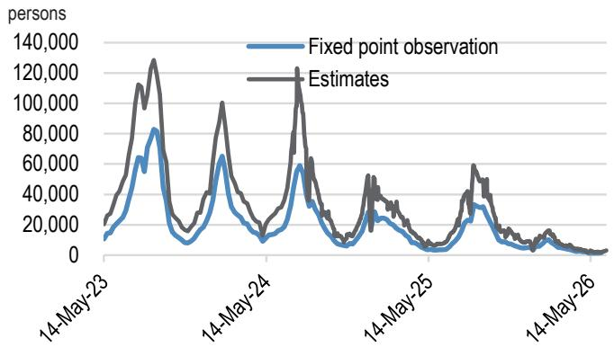

line chart

| Date       | Fixed point observation | Estimates |
| ---------- | ------------------------ | --------- |
| 14-May-23  | ~10,000                  | ~20,000   |
| 14-May-24  | ~80,000                  | ~120,000  |
| 14-May-25  | ~20,000                  | ~40,000   |
| 14-May-26  | ~5,000                   | ~10,000   |

Source: MHLW, JAMDAS estimates, JPM

Figure 13: Cases of Influenza in Japan (Fixed Point Observation)  
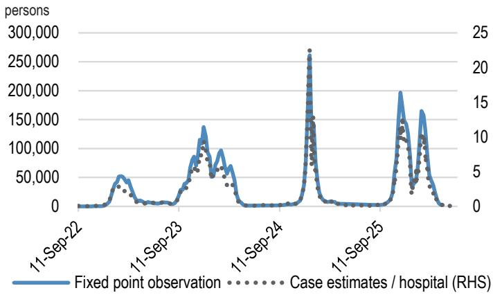

line chart

| Date       | Fixed point observation | Case estimates / hospital (RHS) |
| ---------- | ------------------------ | -------------------------------- |
| 11-Sep-22  | ~0                       | ~0                               |
| 11-Sep-23  | ~50,000                  | ~5,000                           |
| 11-Sep-24  | ~100,000                 | ~10,000                          |
| 11-Sep-25  | ~200,000                 | ~15,000                          |

Source: MHLW, JAMDAS estimates, JPM

## US Prescription TRx of Each Company's Major Drugs

Figure 14: List of TRx

<table><tr><td colspan="3">US Prescription TRx of Each Company’s Major Drugs (latest IQVIA data for the week ending Jun 12 2026)</td></tr><tr><td>Ticker</td><td>Company</td><td>Product</td></tr><tr><td>4151</td><td>Kyowa Kirin</td><td>FASENRA, KOMZIFTI (+competitor)</td></tr><tr><td>4502</td><td>Takeda Pharmaceutical</td><td>ENTYVIO, TAKHZYRO, VYVANSE (+GE)</td></tr><tr><td>4503</td><td>Astellas Pharma</td><td>XTANDI (+competitor), MYRBETRIQ (+GE), VEOZAH (+competitor), IZERVAY (+competitor)</td></tr><tr><td>4506</td><td>Sumitomo Pharma</td><td>MYFEMBRE (+competitor), ORGOVYX, GEMTESA, LATUDA (+competitor)</td></tr><tr><td>4507</td><td>Shionogi &amp; Co.</td><td>JULUCA, DOVATO, TRIUMEQ, TIVICAY, CABENUVA, BIKTARVY, APRETUDE, XOFLUZA</td></tr><tr><td>4516</td><td>Nippon Shinyaku</td><td>UPTRAVI</td></tr><tr><td>4519</td><td>Chugai Pharmaceutical</td><td>ACTEMRA (+GE), NEMLUVIO (+competitor), HEMLIBRA (+competitor), Foundayo (+competitor (GLP-1 drugs))</td></tr><tr><td>4523</td><td>Eisai</td><td>LENVIMA</td></tr><tr><td>4568</td><td>Daiichi Sankyo</td><td>INJECTAFER, VENOFER</td></tr><tr><td>4578</td><td>Otsuka Holdings</td><td>ABILIFY MAINTENA/ASIMTFII (+competitor), REXULTI (+competitor), KISQALI (+competitor), Tolvaptan GE, VOYXACT</td></tr><tr><td>-</td><td>Others</td><td>Psoriasis drugs</td></tr></table>

Source: IQVIA, JPM

Figure 15: Takeda Pharmaceutical (4502) Entyvio IV Number of US Prescriptions (TRx)  
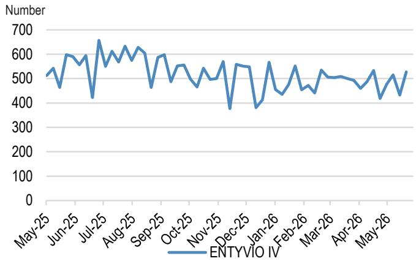

line chart

| Month   | Number |
|---------|--------|
| May-25  | 500    |
| Jun-25  | 550    |
| Jul-25  | 400    |
| Aug-25  | 600    |
| Sep-25  | 500    |
| Oct-25  | 550    |
| Nov-25  | 500    |
| Dec-25  | 350    |
| Jan-26  | 400    |
| Feb-26  | 500    |
| Mar-26  | 500    |
| Apr-26  | 450    |
| May-26  | 500    |

Source: IQVIA, JPM  
Note: Data up to one week before other data.

Figure 16: Takeda Pharmaceutical (4502) Entyvio Pen Number of US Prescriptions (TRx)  
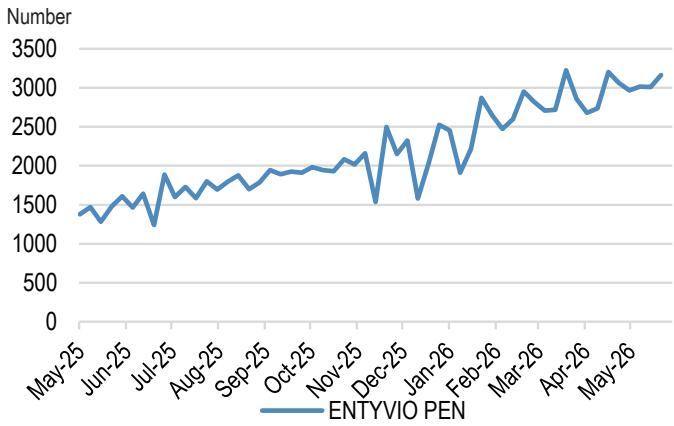

line chart

| Month    | Number |
| -------- | ------ |
| May-25   | 1400   |
| Jun-25   | 1300   |
| Jul-25   | 1800   |
| Aug-25   | 1700   |
| Sep-25   | 1900   |
| Oct-25   | 1950   |
| Nov-25   | 2000   |
| Dec-25   | 1500   |
| Jan-26   | 2500   |
| Feb-26   | 2800   |
| Mar-26   | 2900   |
| Apr-26   | 3200   |
| May-26   | 3100   |

Source: IQVIA, JPM  
Note: Data up to one week before other data.

Figure 17: Takeda Pharmaceutical (4502) TAKHZYRO Number of US Prescriptions (TRx)  
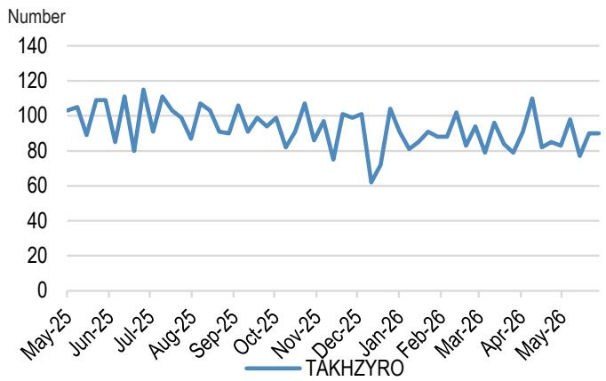

line chart

| Month   | TAKHZYRO |
|---------|----------|
| May-25  | 100      |
| Jun-25  | 105      |
| Jul-25  | 80       |
| Aug-25  | 110      |
| Sep-25  | 90       |
| Oct-25  | 100      |
| Nov-25  | 95       |
| Dec-25  | 75       |
| Jan-26  | 60       |
| Feb-26  | 85       |
| Mar-26  | 90       |
| Apr-26  | 80       |
| May-26  | 90       |

Source: IQVIA, JPM

Figure 19: Astellas Pharma (4503) XTANDI and Competitors' Number of US Prescriptions (TRx)  
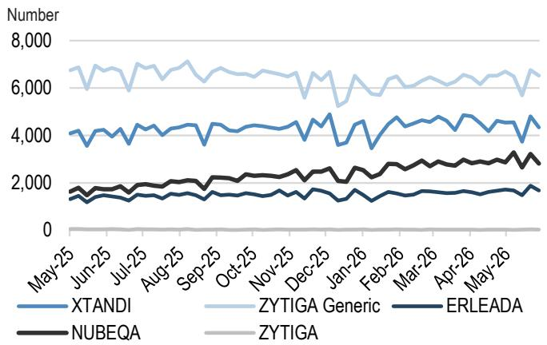

line chart

| Date   | XTANDI | ZYTIGA Generic | ERLEADA | NUBEQA | ZYTIGA |
|--------|--------|----------------|---------|--------|--------|
| May-25 | 4,000  | 7,000          | 1,500   | 1,500  | 1,500  |
| Jun-25 | 4,500  | 7,500          | 1,500   | 1,500  | 1,500  |
| Jul-25 | 4,500  | 7,500          | 1,500   | 1,500  | 1,500  |
| Aug-25 | 4,500  | 7,500          | 1,500   | 1,500  | 1,500  |
| Sep-25 | 4,500  | 7,500          | 1,500   | 1,500  | 1,500  |
| Oct-25 | 4,500  | 7,500          | 1,500   | 1,500  | 1,500  |
| Nov-25 | 4,500  | 7,500          | 1,500   | 1,500  | 1,500  |
| Dec-25 | 4,500  | 7,500          | 1,500   | 1,500  | 1,500  |
| Jan-26 | 4,500  | 7,500          | 1,500   | 1,500  | 1,500  |
| Feb-26 | 4,500  | 7,500          | 1,500   | 1,500  | 1,500  |
| Mar-26 | 4,500  | 7,500          | 1,500   | 1,500  | 1,500  |
| Apr-26 | 4,500  | 7,500          | 1,500   | 1,500  | 1,500  |
| May-26 | 4,500  | 7,500          | 1,500   | 1,500  | 1,500  |

Source: IQVIA, JPM

Figure 21: Astellas Pharma (4503) Competitor of VEOZAH Number of US Prescriptions (TRx)  
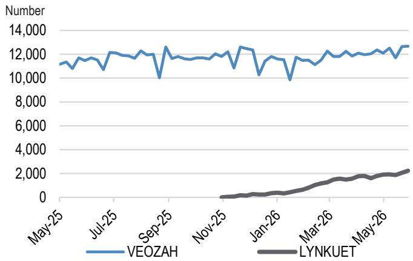

line chart

| Date   | VEOZAH | LYNKUET |
|--------|--------|---------|
| May-25 | 11,500 | 0       |
| Jul-25 | 12,000 | 0       |
| Sep-25 | 10,000 | 0       |
| Nov-25 | 12,000 | 0       |
| Jan-26 | 11,500 | 500     |
| Mar-26 | 12,000 | 1,500   |
| May-26 | 12,500 | 2,000   |

Source: IQVIA, JPM

Figure 18: Takeda Pharmaceutical (4502) VYVANSE Number of US Prescriptions (TRx)  
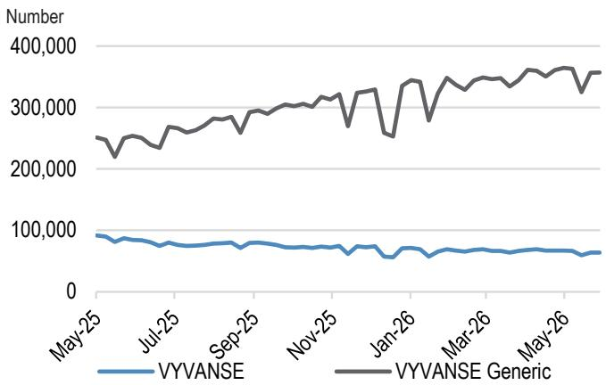

line chart

| Date   | VYVANSE | VYVANSE Generic |
|--------|---------|-----------------|
| May-25 | ~80,000 | ~250,000        |
| Jul-25 | ~75,000 | ~270,000        |
| Sep-25 | ~70,000 | ~290,000        |
| Nov-25 | ~65,000 | ~310,000        |
| Jan-26 | ~60,000 | ~330,000        |
| Mar-26 | ~65,000 | ~350,000        |
| May-26 | ~60,000 | ~360,000        |

Source: IQVIA, JPM

Figure 20: Astellas Pharma (4503) Myrbetriq and Sumitomo Pharma (4506) Gemtesa Number of US Prescriptions (TRx)  
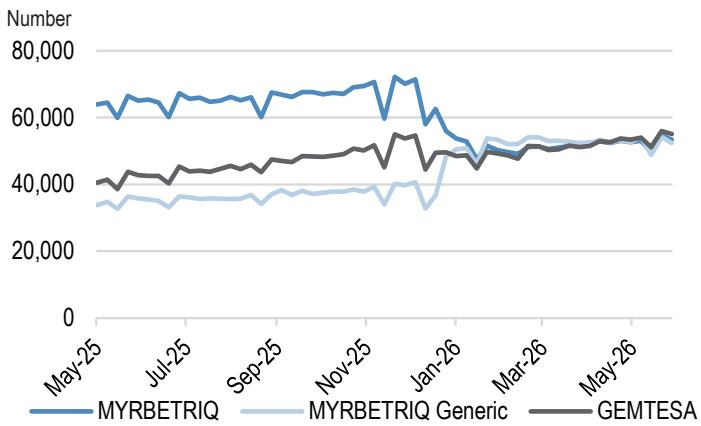

line chart

| Date   | MYRBETRIQ | MYRBETRIQ Generic | GEMTESA |
|--------|-----------|-------------------|---------|
| May-25 | ~65,000   | ~35,000           | ~40,000 |
| Jul-25 | ~68,000   | ~36,000           | ~42,000 |
| Sep-25 | ~67,000   | ~37,000           | ~45,000 |
| Nov-25 | ~70,000   | ~38,000           | ~48,000 |
| Jan-26 | ~72,000   | ~39,000           | ~50,000 |
| Mar-26 | ~55,000   | ~52,000           | ~52,000 |
| May-26 | ~53,000   | ~51,000           | ~54,000 |

Source: IQVIA, JPM

Figure 22: Astellas Pharma (4503) Competitor of IZERVAY Number of US Prescriptions (TRx)  
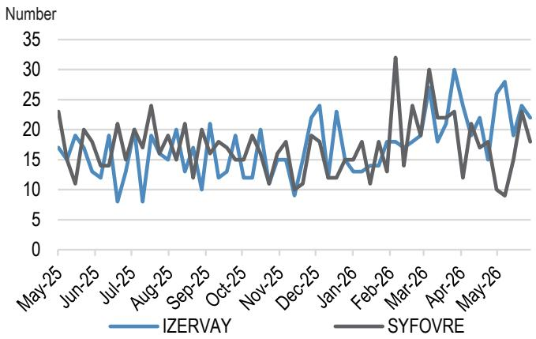

line chart

| Month   | IZERVAY | SYFOVRE |
|---------|---------|---------|
| May-25  | 17      | 23      |
| Jun-25  | 18      | 19      |
| Jul-25  | 8       | 18      |
| Aug-25  | 19      | 24      |
| Sep-25  | 17      | 19      |
| Oct-25  | 19      | 18      |
| Nov-25  | 17      | 19      |
| Dec-25  | 10      | 18      |
| Jan-26  | 14      | 17      |
| Feb-26  | 18      | 32      |
| Mar-26  | 20      | 30      |
| Apr-26  | 30      | 23      |
| May-26  | 28      | 10      |

Source: IQVIA, JPM

Figure 23: Chugai Pharmaceutical (4519) Competitor of Actemra SC Number of US Prescriptions (TRx)  
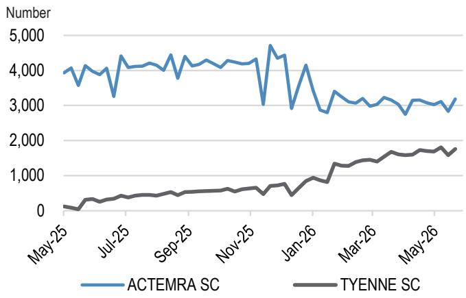

line chart

| Date   | ACTEMRA SC | TYENNE SC |
|--------|------------|-----------|
| May-25 | 4000       | 100       |
| Jul-25 | 3500       | 300       |
| Sep-25 | 4200       | 400       |
| Nov-25 | 4100       | 500       |
| Jan-26 | 4800       | 800       |
| Mar-26 | 3500       | 1300      |
| May-26 | 3200       | 1700      |

Source: IQVIA, JPM  
Note: Data up to one week before other data.

Figure 25: Chugai Pharmaceutical (4519) Nemluvio and Its Competitors Number of US Prescriptions (TRx)  
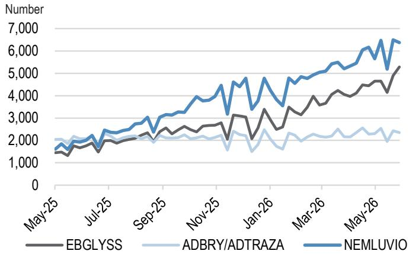

line chart

| Date   | EBGLYSS | ADBRY/ADTRAZA | NEMLUVIO |
|--------|---------|---------------|----------|
| May-25 | 1,500   | 1,800         | 1,700    |
| Jul-25 | 1,800   | 2,000         | 2,200    |
| Sep-25 | 2,200   | 2,300         | 2,800    |
| Nov-25 | 2,500   | 2,400         | 3,500    |
| Jan-26 | 3,000   | 2,500         | 4,500    |
| Mar-26 | 3,800   | 2,600         | 5,200    |
| May-26 | 4,500   | 2,700         | 6,500    |

Source: IQVIA, JPM

Figure 27: Chugai Pharmaceutical (4519) Hemlibra and Its Competitor Number of US Prescriptions (TRx)  
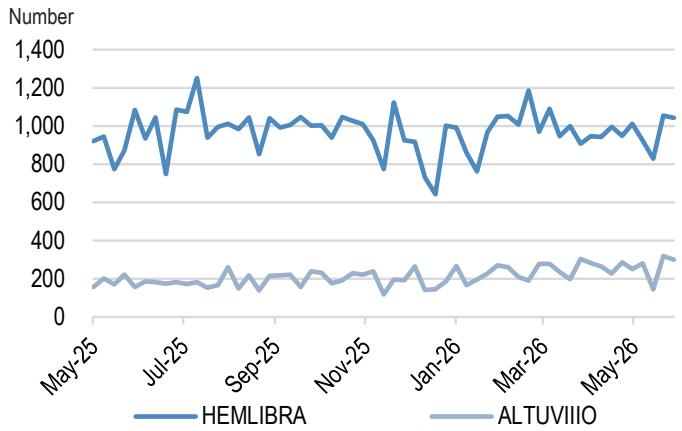

line chart

| Date   | HEMLIBRA | ALTUVIIIO |
|--------|----------|-----------|
| May-25 | 900      | 150       |
| Jul-25 | 750      | 180       |
| Sep-25 | 1000     | 200       |
| Nov-25 | 1050     | 180       |
| Jan-26 | 650      | 150       |
| Mar-26 | 1000     | 250       |
| May-26 | 1050     | 300       |

Source: IQVIA, JPM

Figure 24: Chugai Pharmaceutical (4519) Competitor of Actemra IV Number of US Prescriptions (TRx)  
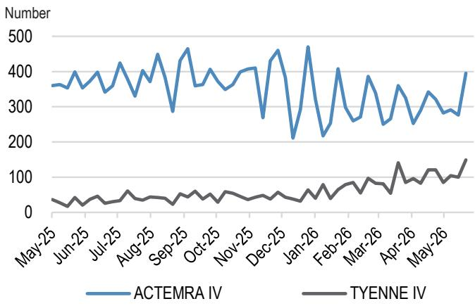

line chart

| Month   | ACTEMRA IV | TYENNE IV |
|---------|------------|-----------|
| May-25  | 370        | 30        |
| Jun-25  | 380        | 40        |
| Jul-25  | 390        | 50        |
| Aug-25  | 400        | 60        |
| Sep-25  | 450        | 70        |
| Oct-25  | 380        | 50        |
| Nov-25  | 400        | 60        |
| Dec-25  | 450        | 70        |
| Jan-26  | 210        | 50        |
| Feb-26  | 400        | 70        |
| Mar-26  | 380        | 80        |
| Apr-26  | 350        | 130       |
| May-26  | 390        | 150       |

Source: IQVIA, JPM  
Note: Data up to one week before other data.

Figure 26: Competitor of Nemluvio, Dupixent Number of US Prescriptions (TRx)  
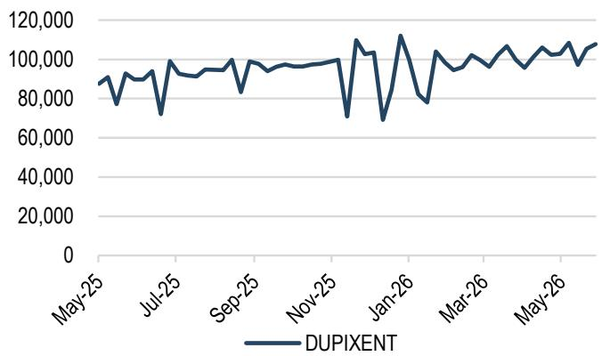

line chart

| Date   | DUPIXENT |
|--------|----------|
| May-25 | 85,000   |
| Jul-25 | 75,000   |
| Sep-25 | 95,000   |
| Nov-25 | 98,000   |
| Jan-26 | 70,000   |
| Mar-26 | 105,000  |
| May-26 | 110,000  |

Source: IQVIA, JPM

Figure 28: Chugai Pharmaceutical (4519) Foundayo and Its Competitor Number of US Prescriptions (TRx) (1)  
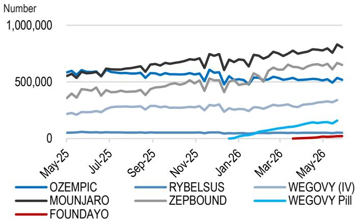

line chart

| Date   | OZEMPIC | MOUNJARO | RYBELSUS | ZEPBOUND | WEGOVY (IV) | WEGOVY Pill | FOUNDAYO |
|--------|---------|----------|----------|----------|-------------|-------------|----------|
| May-25 | ~550,000| ~550,000 | ~250,000 | ~350,000 | ~250,000    | ~150,000    | ~50,000  |
| Jul-25 | ~550,000| ~550,000 | ~250,000 | ~350,000 | ~250,000    | ~150,000    | ~50,000  |
| Sep-25 | ~550,000| ~550,000 | ~250,000 | ~350,000 | ~250,000    | ~150,000    | ~50,000  |
| Nov-25 | ~550,000| ~550,000 | ~250,000 | ~350,000 | ~250,000    | ~150,000    | ~50,000  |
| Jan-26 | ~550,000| ~550,000 | ~250,000 | ~350,000 | ~250,000    | ~150,000    | ~5,000   |
| Mar-26 | ~550,000| ~550,000 | ~250,000 | ~350,000 | ~250,000    | ~150,000    | ~5,000   |
| May-26 | ~550,000| ~750,000 | ~350,000 | ~650,000 | ~350,000    | ~15,000     | ~5,000   |

Source: IQVIA, JPM  
Note: Wegovy pill: data up to one week before other data.

Figure 29: Chugai Pharmaceutical (4519) Foundayo and Its Competitor Number of US Prescriptions (TRx) (2)  
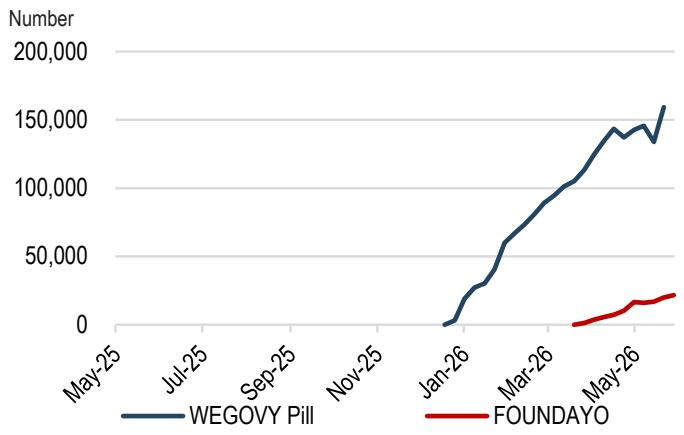

line chart

| Date   | WEGOVY Pill | FOUNDAYO |
|--------|-------------|----------|
| May-25 |             |          |
| Jul-25 |             |          |
| Sep-25 |             |          |
| Nov-25 |             |          |
| Jan-26 | ~10,000     |          |
| Mar-26 | ~100,000    | ~5,000   |
| May-26 | ~150,000    | ~15,000  |

Source: IQVIA, JPM  
Note: Wegovy pill: data up to one week before other data.

Figure 31: Daiichi Sankyo (4568) American Regent Number of US Prescriptions (TRx)  
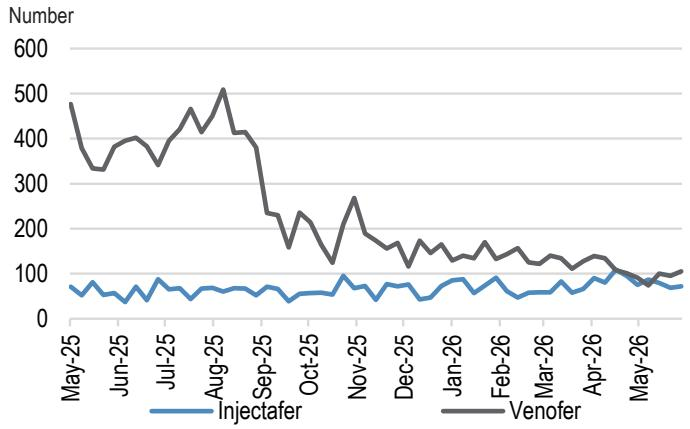

line chart

| Month   | Injectafer | Venofer |
|---------|------------|---------|
| May-25  | ~70        | ~480    |
| Jun-25  | ~60        | ~330    |
| Jul-25  | ~70        | ~400    |
| Aug-25  | ~60        | ~510    |
| Sep-25  | ~50        | ~400    |
| Oct-25  | ~60        | ~150    |
| Nov-25  | ~70        | ~270    |
| Dec-25  | ~60        | ~130    |
| Jan-26  | ~70        | ~150    |
| Feb-26  | ~60        | ~140    |
| Mar-26  | ~70        | ~130    |
| Apr-26  | ~80        | ~120    |
| May-26  | ~70        | ~100    |

Source: IQVIA, JPM

Figure 30: Eisai (4523) Lenvima Number of US Prescriptions (TRx)  
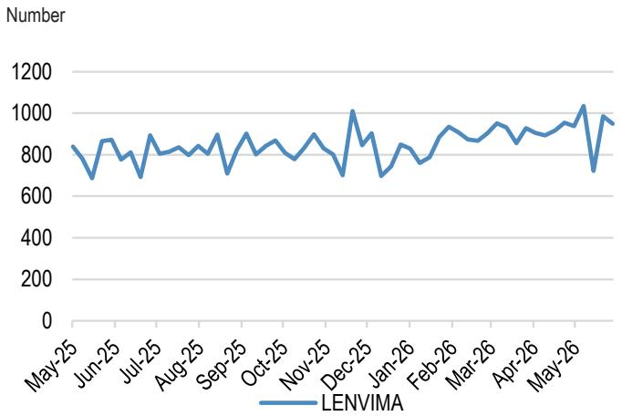

line chart

| Month    | LENVIMA |
| -------- | ------- |
| May-25   | 800     |
| Jun-25   | 700     |
| Jul-25   | 850     |
| Aug-25   | 800     |
| Sep-25   | 850     |
| Oct-25   | 800     |
| Nov-25   | 850     |
| Dec-25   | 1000    |
| Jan-26   | 700     |
| Feb-26   | 850     |
| Mar-26   | 900     |
| Apr-26   | 850     |
| May-26   | 1000    |

Source: IQVIA, JPM

Figure 32: Otsuka Holdings (4578) Long-Acting Injections and Competitors Number of US Prescriptions (TRx)  
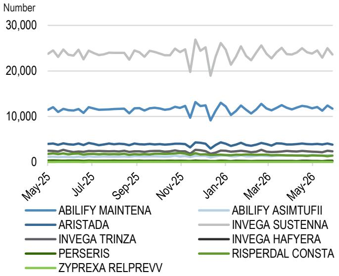

line chart

| Date   | ABILIFY MAINTENA | ARISTADA | INVEGA SUSTENNA | INVEGA TRINZA | INVEGA HAFYERA | PERSERIS | RISPERDAL CONSTA | ZYPREXA RELPREVV |
|--------|------------------|----------|-----------------|---------------|----------------|----------|------------------|------------------|
| May-25 | ~11,000          | ~3,000   | ~24,000         | ~2,000        | ~1,500         | ~1,000   | ~500             | ~500             |
| Jul-25 | ~11,500          | ~3,500   | ~24,500         | ~2,500        | ~1,750         | ~1,250   | ~600             | ~600             |
| Sep-25 | ~11,750          | ~3,750   | ~24,750         | ~2,750        | ~1,900         | ~1,375   | ~700             | ~700             |
| Nov-25 | ~12,000          | ~3,900   | ~25,000         | ~2,900        | ~2,050         | ~1,450   | ~800             | ~800             |
| Jan-26 | ~9,500           | ~3,500   | ~19,500         | ~2,500        | ~1,750         | ~1,375   | ~750             | ~750             |
| Mar-26 | ~11,500          | ~3,750   | ~24,500         | ~2,750        | ~1,950         | ~1,450   | ~850             | ~850             |
| May-26 | ~11,750          | ~3,900   | ~24,750         | ~2,900        | ~2,100         | ~1,475   | ~900             | ~900             |

Source: IQVIA, JPM

Figure 33: Otsuka Holdings (4578) and Sumitomo Pharma (4506) Main Atypical Antipsychotics Number of US Prescriptions (TRx)  
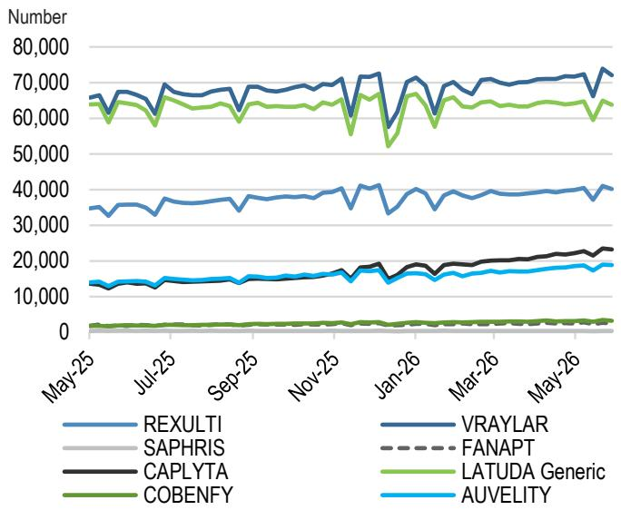

line chart

| Month   | REXULTI | SAPHRS | CAPLYTA | COBENFY | VRAYLAR | FANAPT | LATUDA Generic | AUVELITY |
|---------|---------|--------|---------|---------|---------|--------|----------------|----------|
| May-25  | ~35,000 | ~15,000| ~15,000 | ~15,000 | ~65,000 | ~65,000| ~65,000        | ~15,000  |
| Jul-25  | ~35,000 | ~15,000| ~15,000 | ~15,000 | ~65,000 | ~65,000| ~65,000        | ~15,000  |
| Sep-25  | ~35,000 | ~15,000| ~15,000 | ~15,000 | ~65,000 | ~65,000| ~65,000        | ~15,000  |
| Nov-25  | ~35,000 | ~15,000| ~15,000 | ~15,000 | ~65,000 | ~65,000| ~65,000        | ~15,000  |
| Jan-26  | ~35,000 | ~15,000| ~15,000 | ~15,000 | ~65,000 | ~65,000| ~65,000        | ~15,000  |
| Mar-26  | ~35,000 | ~15,000| ~15,000 | ~15,000 | ~65,000 | ~65,000| ~65,000        | ~15,000  |
| May-26  | ~35,000 | ~15,000| ~15,000 | ~15,000 | ~65,000 | ~65,000| ~65,000        | ~15,000  |

Source: IQVIA, JPM

Figure 35: Otsuka Holdings (4578) Samsca/Jynarque Generic Number of US Prescriptions (TRx)  
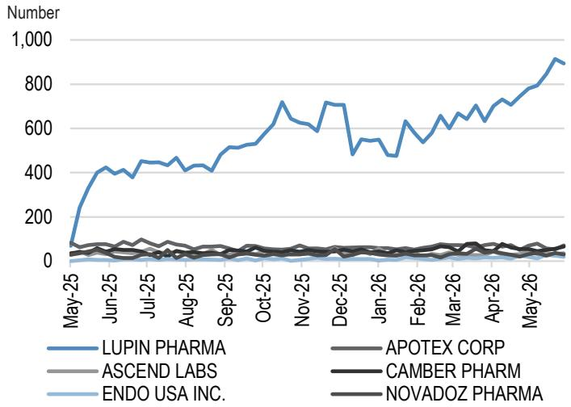

line chart

| Month | LUPIN PHARMA | ASCEND LABS | ENDO USA INC. | APOTEX CORP | CAMBER PHARM | NOVADOZ PHARMA |
| --- | --- | --- | --- | --- | --- | --- |
| May-25 | ~100 | ~50 | ~20 | ~30 | ~40 | ~50 |
| Jun-25 | ~400 | ~60 | ~30 | ~40 | ~50 | ~60 |
| Jul-25 | ~450 | ~70 | ~40 | ~50 | ~60 | ~70 |
| Aug-25 | ~480 | ~80 | ~50 | ~60 | ~70 | ~80 |
| Sep-25 | ~500 | ~90 | ~60 | ~70 | ~80 | ~90 |
| Oct-25 | ~600 | ~100 | ~70 | ~80 | ~90 | ~100 |
| Nov-25 | ~700 | ~110 | ~80 | ~90 | ~100 | ~110 |
| Dec-25 | ~500 | ~120 | ~90 | ~100 | ~110 | ~120 |
| Jan-26 | ~550 | ~130 | ~100 | ~110 | ~120 | ~130 |
| Feb-26 | ~650 | ~140 | ~110 | ~120 | ~130 | ~140 |
| Mar-26 | ~700 | ~150 | ~120 | ~130 | ~140 | ~150 |
| Apr-26 | ~750 | ~160 | ~130 | ~140 | ~150 | ~160 |
| May-26 | ~850 | ~170 | ~140 | ~150 | ~160 | ~170 |
| Jun-26 | ~950 | ~180 | ~150 | ~160 | ~170 | ~180 |
| Jul-26 | ~980 | ~190 | ~160 | ~170 | ~180 | ~190 |
| Aug-26 | ~990 | ~200 | ~170 | ~180 | ~190 | ~200 |
| Sep-26 | ~995 | ~210 | ~180 | ~190 | ~200 | ~210 |
| Oct-26 | ~998 | ~220 | ~190 | ~200 | ~210 | ~220 |
| Nov-26 | ~999 | ~230 | ~200 | ~210 | ~220 | ~230 |
| Dec-26 | ~999 | ~240 | ~210 | ~220 | ~230 | ~240 |
| Jan-27 | ~999 | ~250 | ~220 | ~230 | ~240 | ~250 |
| Feb-27 | ~999 | ~260 | ~230 | ~240 | ~250 | ~260 |
| Mar-27 | ~999 | ~270 | ~240 | ~250 | ~260 | ~270 |
| Apr-27 | ~999 | ~280 | ~250 | ~260 | ~270 | ~280 |
| May-27 | ~999 | ~290 | ~260 | ~270 | ~280 | ~290 |
| Jun-27 | ~999 | ~300 | ~270 | ~280 | ~290 | ~300 |
| Jul-27 | ~999 | ~310 | ~280 | ~290 | ~300 | ~310 |
| Aug-27 | ~999 | ~320 | ~290 | ~300 | ~310 | ~320 |
| Sep-27 | ~999 | ~330 | ~300 | ~310 | ~320 | ~330 |
| Oct-27 | ~999 | ~340 | ~310 | ~320 | ~330 | ~340 |
| Nov-27 | ~999 | ~350 | ~320 | ~330 | ~340 | ~350 |
| Dec-27 | ~999 | ~360 | ~330 | ~340 | ~350 | ~360 |
| Jan-28 | ~999 | ~370 | ~340 | ~350 | ~360 | ~370 |
| Feb-28 | ~999 | ~380 | ~350 | ~360 | ~370 | ~380 |
| Mar-28 | ~999 | ~390 | ~360 | ~370 | ~380 | ~390 |
| Apr-28 | ~999 | ~400 | ~370 | ~380 | ~390 | ~400 |
| May-28 | ~999 | ~410 | ~380 | ~390 | ~400 | ~410 |
| Jun-28 | >999 | >420 | >390 | >400 | >410 | >420 |
| Jul-28 | >999 | >430 | >400 | >410 | >420 | >430 |
| Aug-28 | >999 | >440 | >410 | >420 | >430 | >440 |
| Sep-28 | >999 | >450 | >420 | >430 | >440 | >450 |
| Oct-28 | >999 | >460 | >430 | >440 | >450 | >460 |
| Nov-28 | >999 | >470 | >440 | >450 | >460 | >470 |
| Dec-28 | >999 | >480 | >450 | >460 | >470 | >480 |
| Jan-29 | >999 | >490 | >460 | >470 | >480 | >490 |
| Feb-29 | >999 | >500 | >470 | >480 | >490 | >500 |
| Mar-29 | >999 | >510 | >480 | >490 | >500 | >510 |
| Apr-29 | >999 | >520 | >490 | >500 | >510 | >520 |
| May-29 | >999 | >530 | >500 | >510 | >520 | >530 |
| Jun-29 | >999 | >540 | >510 | >520 | >530 | >540 |
| Jul-29 | >999 | >550 | >520 | >530 | >54� | >55₀ |
| Aug-29 | >999 | >56₀ | >53₀ | >54₀ | >55₀ | >56₀ |
| Sep-29 | >999 | >57₀ | >54₀ | >55₀ | >56₀ | >57₀ |
| Oct-29 | >999 | >58₀ | >55₀ | >56₀ | >57₀ | >58₀ |
| Nov-29 | >999 | >59₀ | >56₀ | >57₀ | >58₀ | >59₀ |
| Dec-29 | >999 | >6₀ | >57₀ | >58₀ | >59₀ | >6₀ |
| Jan-3 | <1 <1 > | <1 <1 > | <1 <1 > | <1 <1 > | <1 <1 > | <1 <1 |
| Feb-3 | <1 <1 > | <1 <1 > | <1 <1 > | <1 <1 > | <1 <1 > | <1 <1 |
| Mar-3 | <1 <1 > | <1 <1 > | <1 <1 > | <1 <1 | <1 <1 | <1 <1 |
| Apr-3 | <1 <1 > | <1 <1 > | <1 <1 | <1 <1 | <1 <1 | <1 <1 |
| May-3 | <1 <1 > | <1 <1 | <1 <1 | <1 <1 | <1 <1 | <1 <1 |
| Jun-3 | <1 <1 > | <1 <1 | <1 <1 | <1 <1 | <1 <1 | <1 <1 |
| Jul-3 | <1 <1 > | <1 <1 | <1 <1 | <1 <1 | <1 <1 | <1 <1 |
| Aug-3 | <1 <1 > | <1 <1 | <1 <1 | <1 <1 | <1 <1 | <1 <1 |
| Sep-3 | <1 <1 > | <1 <1 | <1 <1 | <1 <1 | <1 <1 | <1 <1 |
| Oct-3 | <1 <1 > | <1 <1 | <1 <1 | <1 <1 | <1 <1 | <1 <1 |
| Nov-3 | <1 <1 > | <1 <1 | <1 <1 | <1 <1 | <1 <1 | <1 <1 |
| Dec-3 | <1 <1 > | <1 <1 | <1 <1 | <1 <1 | <1 <1 | <1 <1 |
| Jan-3 | <1 <1 > | <1 <1 | <1 <1 | <1 <1 | <1 <1 | <1 <1 |
| Feb-3 | <1 <1 > | <1 <1 | <1 <1 | <1 <1 | <1 <1 | <1 <1 |
| Mar-3 | <1 <1 > | <1 <1 | <1 <1 | <1 <1 | <1 <1 | <1 <1 |
| Apr-3 | <1 <1 > | <1 <1 | <1 <1 | <1 <1 | <1 <1 | < <nl> |

Source: IQVIA, JPM

Figure 34: Otsuka Holdings (4578) CDK4/6 Inhibitor and Competitors Number of US Prescriptions (TRx)  
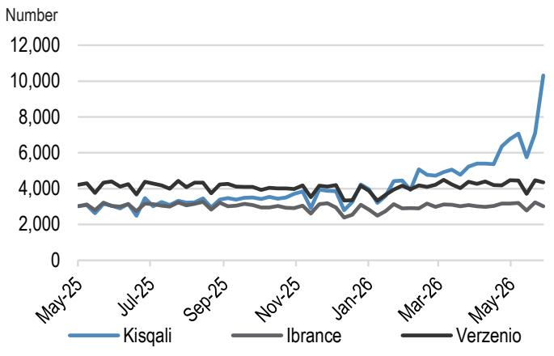

line chart

| Month   | Kisqali | Ibrance | Verzenio |
|---------|---------|---------|----------|
| May-25  |         |         |          |
| Jul-25  |         |         |          |
| Sep-25  |         |         |          |
| Nov-25  |         |         |          |
| Jan-26  |         |         |          |
| Mar-26  |         |         |          |
| May-26  |         |         |          |
| May-27  | 10,000  | 3,000   | 4,000    |

Source: IQVIA, JPM

Figure 36: Otsuka Holdings (4578) Voyxact Number of US Prescriptions (TRx)  
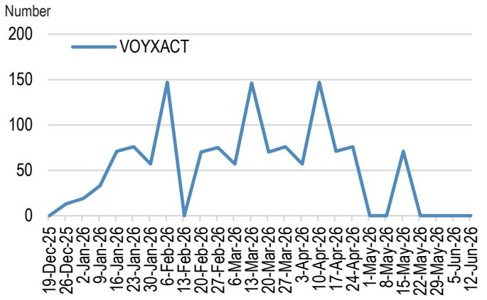

line chart

| Date       | Number |
| ---------- | ------ |
| 19-Dec-25  | 0      |
| 26-Dec-25  | 10     |
| 2-Jan-26   | 20     |
| 9-Jan-26   | 30     |
| 16-Jan-26  | 70     |
| 23-Jan-26  | 80     |
| 30-Jan-26  | 50     |
| 6-Feb-26   | 150    |
| 13-Feb-26  | 0      |
| 20-Feb-26  | 70     |
| 27-Feb-26  | 80     |
| 6-Mar-26   | 50     |
| 13-Mar-26  | 150    |
| 20-Mar-26  | 70     |
| 27-Mar-26  | 80     |
| 3-Apr-26   | 50     |
| 10-Apr-26  | 150    |
| 17-Apr-26  | 70     |
| 24-Apr-26  | 80     |
| 1-May-26   | 0      |
| 8-May-26   | 0      |
| 15-May-26  | 70     |
| 22-May-26  | 0      |
| 29-May-26  | 0      |
| 5-Jun-26   | 0      |
| 12-Jun-26  | 0      |

Source: IQVIA, JPM

Figure 37: Otsuka Holdings (4578) Voyxact Accumulated Number of US Prescriptions  
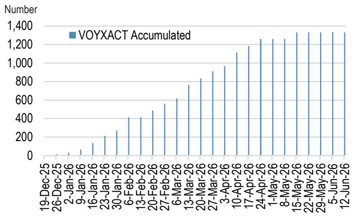

bar chart

| Date       | Number |
| ---------- | ------ |
| 19-Dec-25  | 0      |
| 26-Dec-25  | 0      |
| 2-Jan-26   | 0      |
| 9-Jan-26   | 0      |
| 16-Jan-26  | 100    |
| 23-Jan-26  | 200    |
| 30-Jan-26  | 300    |
| 6-Feb-26   | 400    |
| 13-Feb-26  | 400    |
| 20-Feb-26  | 500    |
| 27-Feb-26  | 600    |
| 6-Mar-26   | 750    |
| 13-Mar-26  | 800    |
| 20-Mar-26  | 900    |
| 27-Mar-26  | 1,000  |
| 3-Apr-26   | 1,100  |
| 10-Apr-26  | 1,200  |
| 17-Apr-26  | 1,300  |
| 24-Apr-26  | 1,350  |
| 1-May-26   | 1,350  |
| 8-May-26   | 1,350  |
| 15-May-26  | 1,350  |
| 22-May-26  | 1,350  |
| 29-May-26  | 1,350  |
| 5-Jun-26   | 1,350  |
| 12-Jun-26   | 1,350  |

Source: IQVIA, JPM

Figure 39: Kyowa Kirin (4151) Komzifti and Competitor's Number of US Prescriptions (TRx)  
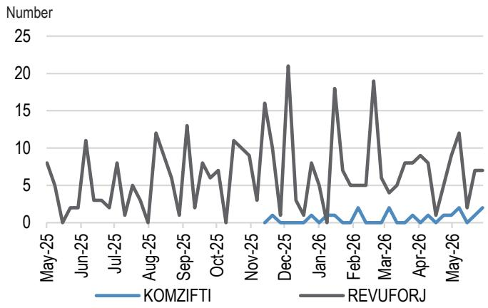

line chart

| Month   | KOMZIFTI | REVUFORJ |
|---------|----------|----------|
| May-25  | 0        | 8        |
| Jun-25  | 0        | 11       |
| Jul-25  | 0        | 8        |
| Aug-25  | 0        | 12       |
| Sep-25  | 0        | 13       |
| Oct-25  | 0        | 7        |
| Nov-25  | 0        | 16       |
| Dec-25  | 0        | 21       |
| Jan-26  | 0        | 8        |
| Feb-26  | 0        | 18       |
| Mar-26  | 0        | 19       |
| Apr-26  | 0        | 9        |
| May-26  | 0        | 12       |

Source: IQVIA, JPM

Figure 41: Sumitomo Pharma (4506) ORGOVYX Number of US Prescriptions (TRx)  
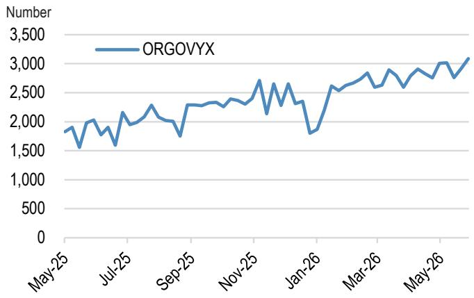

line chart

| Date   | ORGOVYX |
|--------|---------|
| May-25 | 1800    |
| Jul-25 | 2000    |
| Sep-25 | 1900    |
| Nov-25 | 2400    |
| Jan-26 | 1800    |
| Mar-26 | 2700    |
| May-26 | 3100    |

Source: Symphony Health, IQVIA, JPM

Figure 38: Kyowa Kirin (4151) FASENRA Number of US Prescriptions (TRx)  
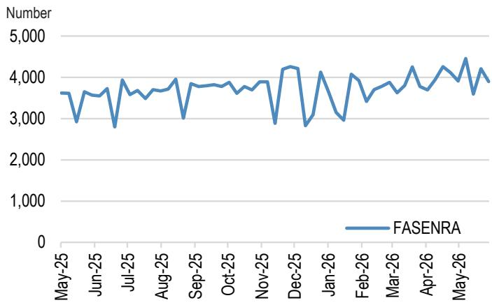

line chart

| Month    | FASENRA |
| -------- | ------- |
| May-25   | 3,700   |
| Jun-25   | 3,600   |
| Jul-25   | 3,800   |
| Aug-25   | 3,700   |
| Sep-25   | 3,900   |
| Oct-25   | 3,800   |
| Nov-25   | 3,900   |
| Dec-25   | 4,200   |
| Jan-26   | 3,900   |
| Feb-26   | 3,800   |
| Mar-26   | 3,900   |
| Apr-26   | 4,100   |
| May-26   | 4,300   |

Source: IQVIA, JPM

Figure 40: Sumitomo Pharma (4506) Myfembree and Competitors' Number of US Prescriptions (TRx)  
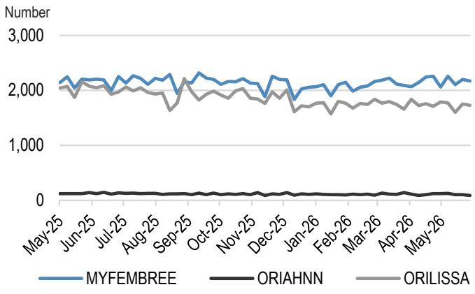

line chart

| Month   | MYFEMBREE | ORIAHNN | ORILISSA |
|---------|-----------|---------|----------|
| May-25  | 2200      | 0       | 2000     |
| Jun-25  | 2100      | 0       | 1900     |
| Jul-25  | 2150      | 0       | 1950     |
| Aug-25  | 2100      | 0       | 1850     |
| Sep-25  | 2300      | 0       | 2100     |
| Oct-25  | 2200      | 0       | 1900     |
| Nov-25  | 2150      | 0       | 1850     |
| Dec-25  | 2250      | 0       | 1950     |
| Jan-26  | 2100      | 0       | 1700     |
| Feb-26  | 2150      | 0       | 1800     |
| Mar-26  | 2100      | 0       | 1750     |
| Apr-26  | 2150      | 0       | 1700     |
| May-26  | 2100      | 0       | 1750     |

Source: IQVIA, JPM

Figure 42: Shionogi & Co. (4507) Xofluza Number of US Prescriptions (TRx)  
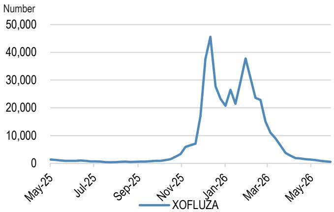

line chart

| Month   | Number |
| ------- | ------ |
| May-25  | 1000   |
| Jul-25  | 1000   |
| Sep-25  | 1000   |
| Nov-25  | 5000   |
| Jan-26  | 45000  |
| Mar-26  | 38000  |
| May-26  | 1000   |

Source: IQVIA, JPM

Figure 43: Shionogi & Co. (4507) HIV Drugs (1) Number of US Prescriptions (TRx)  
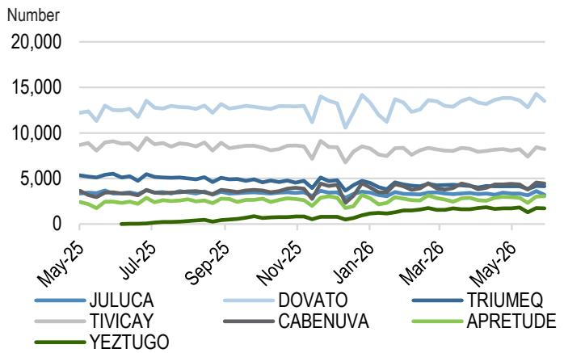

line chart

| Month   | JULUCA | TIVICAY | DOVATO | CABENUVA | TRIUMEQ | APRET UDE | YE ZTUGO |
|---------|--------|---------|--------|----------|---------|-----------|----------|
| May-25  | ~3,000 | ~8,000  | ~12,000| ~4,000   | ~5,000  | ~2,000    | ~1,000   |
| Jul-25  | ~3,500 | ~8,500  | ~12,500| ~4,500   | ~5,500  | ~2,500    | ~1,500   |
| Sep-25  | ~3,500 | ~8,500  | ~12,500| ~4,500   | ~5,500  | ~2,500    | ~1,500   |
| Nov-25  | ~3,500 | ~8,500  | ~12,500| ~4,500   | ~5,500  | ~2,500    | ~1,500   |
| Jan-26  | ~3,500 | ~8,500  | ~12,500| ~4,500   | ~5,500  | ~2,500    | ~1,500   |
| Mar-26  | ~3,500 | ~8,500  | ~12,500| ~4,500   | ~5,500  | ~2,500    | ~1,500   |
| May-26  | ~3,500 | ~8,500  | ~12,500| ~4,500   | ~5,500  | ~2,500    | ~1,500   |

Source: IQVIA, JPM

Figure 45: Nippon Shinyaku (4516) Uptravi Number of US Prescriptions (TRx)  
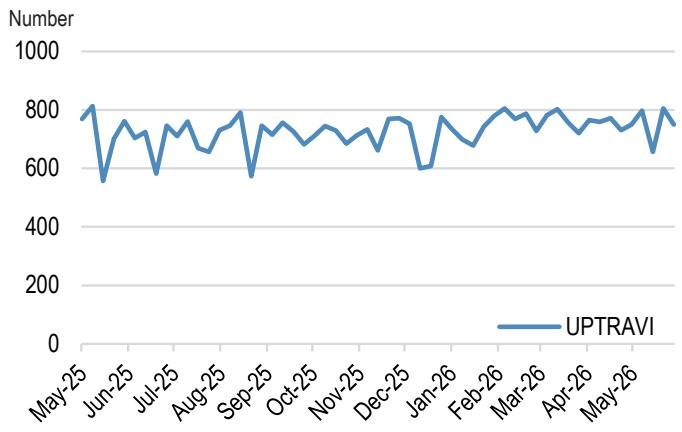

line chart

| Month    | Number |
| -------- | ------ |
| May-25   | 800    |
| Jun-25   | 700    |
| Jul-25   | 600    |
| Aug-25   | 700    |
| Sep-25   | 600    |
| Oct-25   | 700    |
| Nov-25   | 700    |
| Dec-25   | 600    |
| Jan-26   | 700    |
| Feb-26   | 800    |
| Mar-26   | 700    |
| Apr-26   | 700    |
| May-26   | 800    |

Source: IQVIA, JPM

Figure 44: Shionogi & Co. (4507) HIV Drugs (2) Number of US Prescriptions (TRx)  
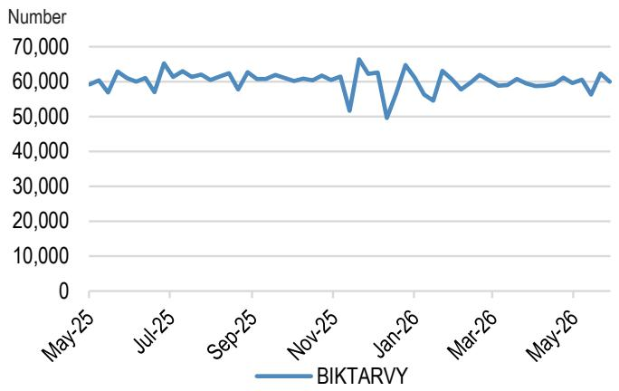

line chart

| Date   | Number |
|--------|--------|
| May-25 | 60000  |
| Jul-25 | 65000  |
| Sep-25 | 60000  |
| Nov-25 | 60000  |
| Jan-26 | 50000  |
| Mar-26 | 60000  |
| May-26 | 60000  |

Source: IQVIA, JPM

Figure 46: Psoriasis Treatment Number of US Prescriptions (TRx)  
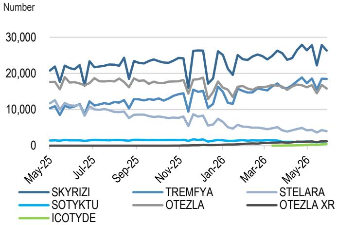

line chart

| Month   | SKYRIZI | TREMFYA | STELARA | SOTYKTU | OTEZLA | OTEZLA XR | ICOTYDE |
|---------|---------|---------|---------|---------|--------|-----------|---------|
| May-25  | ~22,000 | ~10,000 | ~12,000 | ~1,000  | ~18,000| ~1,000    | ~1,000  |
| Jul-25  | ~24,000 | ~11,000 | ~11,000 | ~1,000  | ~17,000| ~1,000    | ~1,000  |
| Sep-25  | ~23,000 | ~12,000 | ~9,000  | ~1,000  | ~17,000| ~1,000    | ~1,000  |
| Nov-25  | ~24,000 | ~13,000 | ~8,000  | ~1,000  | ~18,000| ~1,000    | ~1,000  |
| Jan-26  | ~27,000 | ~14,000 | ~7,000  | ~1,000  | ~17,000| ~1,000    | ~1,000  |
| Mar-26  | ~25,000 | ~15,000 | ~6,000  | ~1,000  | ~16,000| ~1,000    | ~1,000  |
| May-26  | ~28,000 | ~18,000 | ~4,000  | ~1,000  | ~15,000| ~1,000    | ~1,000  |

Source: IQVIA, JPM

Figure 47: FX sensitivity

<table><tr><td rowspan="2">Ticker</td><td rowspan="2">Company</td><td colspan="6">Sales impact (1 yen depreciation)</td><td rowspan="2">Sales CoE(¥mn)</td><td colspan="6">OP impact (1 yen depreciation)</td><td rowspan="2">OP CoE(¥mn)</td><td colspan="3">FX CoE (FY)</td><td rowspan="2">Note</td></tr><tr><td>USD(¥mn)</td><td>vs CoE (%)</td><td>EUR(¥mn)</td><td>vs CoE (%)</td><td>Others(¥mn)</td><td>vs CoE (%)</td><td>USD(¥mn)</td><td>vs CoE (%)</td><td>EUR(¥mn)</td><td>vs CoE (%)</td><td>Others(¥mn)</td><td>vs CoE (%)</td><td>USD(¥)</td><td>EUR(¥)</td><td>Others(¥)</td></tr><tr><td>4151</td><td>Kyowa Kirin</td><td>1,800</td><td>0.35%</td><td>400</td><td>0.08%</td><td>GBP 100</td><td>0.02%</td><td>520,000</td><td>600</td><td>0.46%</td><td>-100</td><td>-0.08%</td><td>GBP -100</td><td>-0.08%</td><td>130,000</td><td>150</td><td>180</td><td>GBP 205</td><td>Core OP impact vs May 7, 2026 Revised CoE (As of May 7, 2026)</td></tr><tr><td>4502</td><td>Takeda Pharmaceutical</td><td>13,210</td><td>0.28%</td><td>3,800</td><td>0.08%</td><td>-</td><td>-</td><td>4,640,000</td><td>270</td><td>0.06%</td><td>-1,560</td><td>-0.37%</td><td>-</td><td>-</td><td>420,000</td><td>156</td><td>182</td><td>RUB 2 CNY 22.4 BRL 29.5</td><td>vs May 13, 2026 CoE (As of May 13, 2026)</td></tr><tr><td>4503</td><td>Astellas Pharma</td><td>8,100</td><td>0.36%</td><td>3,800</td><td>0.17%</td><td>-</td><td>-</td><td>2,220,000</td><td>2,300</td><td>0.37%</td><td>1,700</td><td>0.27%</td><td>-</td><td>-</td><td></td><td>150</td><td>180</td><td>-</td><td>Core OP impact vs Apr 27, 2026 CoE (As of Apr 27, 2026)</td></tr><tr><td>4506</td><td>Sumitomo Pharma</td><td>2,800</td><td>0.52%</td><td>-</td><td>-</td><td>CNY 0</td><td>0.00%</td><td>540,000</td><td>600</td><td>0.66%</td><td>-</td><td>-</td><td>CNY 0</td><td>0.00%</td><td>91,000</td><td>155</td><td>-</td><td>CNY 0</td><td>Core OP impact vs May 13, 2026 CoE (As of May 13, 2026)</td></tr><tr><td>4507</td><td>Shionogi &amp; Co.</td><td>-</td><td>-</td><td>-</td><td>-</td><td>-</td><td>-</td><td>700,000</td><td>-</td><td>-</td><td>-</td><td>-</td><td>-</td><td>-</td><td>220,000</td><td>153</td><td>184</td><td>GBP 0</td><td>(As of May 12, 2026)</td></tr><tr><td>4516</td><td>Nippon Shinyaku</td><td>550</td><td>0.28%</td><td>-</td><td>-</td><td>-</td><td>-</td><td>200,000</td><td>410</td><td>1.08%</td><td>-</td><td>-</td><td>-</td><td>-</td><td>38,000</td><td>150</td><td>-</td><td>-</td><td>vs May 15, 2026 CoE (As of May 15, 2026)</td></tr><tr><td>4519</td><td>Chugai Pharmaceutical</td><td>-</td><td>-</td><td>-</td><td>-</td><td>-</td><td>-</td><td>1,345,000</td><td>-</td><td>-</td><td>-</td><td>-</td><td>-</td><td>-</td><td>670,000</td><td>151</td><td>179</td><td>CHF 184</td><td>(As of Apr 24, 2026)</td></tr><tr><td>4523</td><td>Eisai</td><td>1,960</td><td>0.22%</td><td>270</td><td>0.03%</td><td>GBP 60 CNY 5,960</td><td>0.01% 0.67%</td><td>883,500</td><td>-520</td><td>-0.74%</td><td>30</td><td>0.04%</td><td>GBP -80 CNY 3,460</td><td>-0.11% 4.94%</td><td>70,000</td><td>153</td><td>180</td><td>GBP 205 CNY 22.5</td><td>vs May 15, 2026 CoE (As of May 15, 2026)</td></tr><tr><td>4528</td><td>Ono Pharmaceutical</td><td>1,500</td><td>0.33%</td><td>-</td><td>-</td><td>-</td><td>-</td><td>455,000</td><td>500</td><td>0.53%</td><td>-</td><td>-</td><td>-</td><td>-</td><td>94,000</td><td>155</td><td>-</td><td>-</td><td>vs May 8, 2026 CoE (As of May 8, 2026)</td></tr><tr><td>4536</td><td>Santen Pharmaceutical</td><td>19</td><td>0.01%</td><td>450</td><td>0.14%</td><td>CNY 1,565</td><td>0.50%</td><td>311,000</td><td>-39</td><td>-0.08%</td><td>56</td><td>0.11%</td><td>CNY 348</td><td>0.70%</td><td>49,500</td><td>155</td><td>180</td><td>CNY 23</td><td>vs May 12, 2026 CoE (As of May 12, 2026)</td></tr><tr><td>4565</td><td>Nxera Pharma</td><td>-</td><td>-</td><td>-</td><td>-</td><td>-</td><td>-</td><td>-</td><td>-</td><td>-</td><td>-</td><td>-</td><td>-</td><td>-</td><td>-</td><td>152</td><td>-</td><td>GBP 200</td><td>(As of May 1, 2026)</td></tr><tr><td>4568</td><td>Daiichi Sankyo</td><td>6,500</td><td>0.29%</td><td>2,600</td><td>0.11%</td><td>-</td><td>-</td><td>2,280,000</td><td>-200</td><td>-0.06%</td><td>700</td><td>0.22%</td><td>-</td><td>-</td><td>315,000</td><td>150</td><td>180</td><td>-</td><td>vs May 11, 2026 CoE (As of May 11, 2026)</td></tr><tr><td>4578</td><td>Otsuka Holdings</td><td>8,600</td><td>0.34%</td><td>800</td><td>0.03%</td><td>-</td><td>-</td><td>2,520,000</td><td>1,600</td><td>0.45%</td><td>200</td><td>0.06%</td><td>-</td><td>-</td><td>355,000</td><td>150</td><td>175</td><td>-</td><td>Business Profit impact vs Feb 12, 2026 CoE (As of Apr 28, 2026)</td></tr><tr><td>4901</td><td>Fujifilm Holdings</td><td>5,000</td><td>0.14%</td><td>1,500</td><td>0.04%</td><td>-</td><td>-</td><td>3,470,000</td><td>1,000</td><td>0.27%</td><td>800</td><td>0.22%</td><td>-</td><td>-</td><td>365,000</td><td>150</td><td>175</td><td>-</td><td>Annual impact vs May 12, 2026 CoE (As of May 12, 2026)</td></tr><tr><td>6523</td><td>PHC Holdings</td><td>470</td><td>0.13%</td><td>375</td><td>0.10%</td><td>-</td><td>-</td><td>359,700</td><td>25</td><td>0.09%</td><td>50</td><td>0.19%</td><td>-</td><td>-</td><td>27,000</td><td>151</td><td>175</td><td>-</td><td>May 13, 2026 CoE (As of May 13, 2026)</td></tr></table>

Source: Company data, JPM  
Note: Kyowa Kirin, Chugai Pharmaceutical, Nxera Pharma, and Otsuka Holdings have a December fiscal year-end, while the others have a March fiscal year-end. Core OP impact for Kyowa Kirin, Astellas Pharma, Sumitomo Pharma. Business profit impact for Otsuka Holdings. For Santen Pharmaceutical, each 1% impact is converted into a ¥1 impact.

Analyst Certification: The Research Analyst(s) denoted by an “AC” on the cover of this report certifies (or, where multiple Research Analysts are primarily responsible for this report, the Research Analyst denoted by an “AC” on the cover or within the document individually certifies, with respect to each security or issuer that the Research Analyst covers in this research) that: (1) all of the views expressed in this report accurately reflect the Research Analyst’s personal views about any and all of the subject securities or issuers; and (2) no part of any of the Research Analyst's compensation was, is, or will be directly or indirectly related to the specific recommendations or views expressed by the Research Analyst(s) in this report. For all Korea-based Research Analysts listed on the front cover, if applicable, they also certify, as per KOFIA requirements, that the Research Analyst’s analysis was made in good faith and that the views reflect the Research Analyst’s own opinion, without undue influence or intervention.

All authors named within this report are Research Analysts who produce independent research unless otherwise specified. In Europe, Sector Specialists (Sales and Trading) may be shown on this report as contacts but are not authors of the report or part of the Research Department.

## Important Disclosures

Company-Specific Disclosures: JPM does and seeks to do business with companies covered in its research reports. As a result, investors should be aware that the firm may have a conflict of interest that could affect the objectivity of this report. Investors should consider this report as only a single factor in making their investment decision. Important disclosures, including price charts and credit opinion history tables (if applicable), are available for compendium reports and all JPM-covered companies, and certain non-covered companies, by visiting https://www.jpmm.com/research/disclosures, calling 1-800-477-0406, or e-mailing research.disclosure.inquiries@JPM.com with your request.

## Explanation of Equity Research Ratings, Designations and Analyst(s) Coverage Universe:

JPM uses the following rating system: Overweight (over the duration of the price target indicated in this report, we expect this stock will outperform the average total return of the stocks in the Research Analyst's, or the Research Analyst's team's, coverage universe); Neutral (over the duration of the price target indicated in this report, we expect this stock will perform in line with the average total return of the stocks in the Research Analyst's, or the Research Analyst's team's, coverage universe); and Underweight (over the duration of the price target indicated in this report, we expect this stock will underperform the average total return of the stocks in the Research Analyst's, or the Research Analyst's team's, coverage universe. NR is Not Rated. In this case, JPM has removed the rating and, if applicable, the price target, for this stock because of either a lack of a sufficient fundamental basis or for legal, regulatory or policy reasons. The previous rating and, if applicable, the price target, no longer should be relied upon. An NR designation is not a recommendation or a rating. Some stocks under coverage have a rating but no price target; in these cases, we expect the stock will outperform/perform in line/underperform the average total return of the stocks in the Research Analyst's, or the Research Analyst's team's, coverage universe of the relevant duration of the region. In our Asia (ex-Australia and ex-India) and U.K. small- and mid-cap Equity Research, each stock's expected total return is compared to the expected total return of a benchmark country market index, not to those Research Analysts' coverage universe. If it does not appear in the Important Disclosures section of this report, the certifying Research Analyst's coverage universe can be found on JPM's Research website, https://www.JPMmarkets.com.

Coverage Universe: Wakao, Seiji : Astellas Pharma (4503) (4503.T), Chugai Pharmaceutical (4519) (4519.T), Daiichi Sankyo (4568) (4568.T), Eisai (4523) (4523.T), FUJIFILM Holdings (4901) (4901.T), Kyowa Kirin (4151) (4151.T), Nippon Shinyaku (4516) (4516.T), Nxera Pharma (4565) (4565.T), Ono Pharmaceutical (4528) (4528.T), Otsuka Holdings (4578) (4578.T), PHC Holdings (6523) (6523.T), Santen Pharmaceutical (4536) (4536.T), Shionogi (4507) (4507.T), Sumitomo Pharma (4506) (4506.T), Takeda Pharmaceutical (4502) (4502.T)

JPM Equity Research Ratings Distribution, as of April 04, 2026

<table><tr><td></td><td>Overweight (buy)</td><td>Neutral (hold)</td><td>Underweight (sell)</td></tr><tr><td>JPM Global Equity Research Coverage*</td><td>51%</td><td>37%</td><td>12%</td></tr><tr><td>IB clients**</td><td>83%</td><td>79%</td><td>74%</td></tr><tr><td>JPMS Equity Research Coverage*</td><td>49%</td><td>39%</td><td>13%</td></tr><tr><td>IB clients**</td><td>94%</td><td>93%</td><td>85%</td></tr></table>

\*Please note that the percentages may not add to 100% because of rounding.  
\*\*Percentage of subject companies within each of the "buy," "hold" and "sell" categories for which JPM has provided investment banking services within the previous 12 months.  
For purposes of FINRA ratings distribution rules only, our Overweight rating falls into a buy rating category; our Neutral rating falls into a hold rating category; and our Underweight rating falls into a sell rating category. Please note that stocks with an NR designation are not included in the table above. This information is current as of the end of the most recent calendar quarter.

Equity Valuation and Risks: For valuation methodology and risks associated with covered companies or price targets for covered companies, please see the most recent company-specific research report at http://www.JPMmarkets.com, contact the primary analyst or your JPM representative, or email research.disclosure.inquiries@JPM.com. For material information about the proprietary models used, please see the Summary of Financials in company-specific research reports and the Company Tearsheets, which are available to download on the company pages of our client website, http://www.JPMmarkets.com. This report also sets out within it the material underlying assumptions used.

## History of Investment Recommendations:

A history of JPM investment recommendations disseminated during the preceding 12 months can be accessed on the Research & Commentary page of http://www.JPMmarkets.com where you can also search by analyst name, sector or financial instrument.

Analysts' Compensation: The research analysts responsible for the preparation of this report receive compensation based upon various factors, including the quality and accuracy of research, client feedback, competitive factors, and overall firm revenues.

Registration of non-US Analysts: Unless otherwise noted, the non-US analysts listed on the front of this report are employees of non-US affiliates of JPM Securities LLC, may not be registered as research analysts under FINRA rules, may not be associated persons of JPM Securities LLC, and may not be subject to FINRA Rule 2241 or 2242 restrictions on communications with covered companies, public appearances, and trading securities held by a research analyst account.

## Other Disclosures

JPM is a marketing name for investment banking businesses of JPM Chase & Co. and its subsidiaries and affiliates worldwide.

UK MIFID FICC research unbundling exemption: UK clients should refer to UK MIFID Research Unbundling exemption for details of JPM's implementation of the FICC research exemption and guidance on relevant FICC research categorisation.

All research material made available to clients are simultaneously available on our client website, JPM Markets, unless specifically permitted by relevant laws. Not all research content is redistributed, e-mailed or made available to third-party aggregators. For all research material available on a particular stock, please contact your sales representative.

Any long form nomenclature for references to China; Hong Kong; Taiwan; and Macau within this research material are Mainland China; Hong Kong SAR (China); Taiwan (China); and Macau SAR (China).

JPM may, from time to time, write on issuers or securities targeted by economic or financial sanctions imposed or administered by the governmental authorities of the U.S., EU, UK or other relevant jurisdictions (Sanctioned Securities). Nothing in this report is intended to be read or construed as encouraging, facilitating, promoting or otherwise approving investment or dealing in such Sanctioned Securities. Clients should be aware of their own legal and compliance obligations when making investment decisions.

Any digital or crypto assets discussed in this research report are subject to a rapidly changing regulatory landscape. For relevant regulatory advisories on crypto assets, including bitcoin and ether, please see https://www.JPM.com/disclosures/cryptoasset-disclosure.

The author(s) of this research report may not be licensed to carry on regulated activities in your jurisdiction and, if not licensed, do not hold themselves out as being able to do so.

Exchange-Traded Funds (ETFs): JPM Securities LLC (“JPMS”) acts as authorized participant for substantially all U.S.-listed ETFs. To the extent that any ETFs are mentioned in this report, JPMS may earn commissions and transaction-based compensation in connection with the distribution of those ETF shares and may earn fees for performing other trade-related services, such as securities lending to short sellers of the ETF shares. JPMS may also perform services for the ETFs themselves, including acting as a broker or dealer to the ETFs. In addition, affiliates of JPMS may perform services for the ETFs, including trust, custodial, administration, lending, index calculation and/or maintenance and other services.

Options and Futures related research: If the information contained herein regards options- or futures-related research, such information is available only to persons who have received the proper options or futures risk disclosure documents. Please contact your JPM Representative or visit https://www.theocc.com/components/docs/riskstoc.pdf for a copy of the Option Clearing Corporation's Characteristics and Risks of Standardized Options or https://www.finra.org/sites/default/files/2020-08/Security\_Futures\_Risk\_Disclosure\_Statement\_2020.pdf for a copy of the Security Futures Risk Disclosure Statement.

Changes to Interbank Offered Rates (IBORs) and other benchmark rates: Certain interest rate benchmarks are, or may in the future become, subject to ongoing international, national and other regulatory guidance, reform and proposals for reform. For more information, please consult: https://www.JPM.com/global/disclosures/interbank\_offered\_rates

Notification for Credit Ratings: If this material includes credit ratings, such credit ratings provided by Japan Credit Rating Agency, Ltd. (JCR) and Rating and Investment Information, Inc. (R&I), are credit ratings provided by Registered Credit Rating Agencies (credit rating agencies registered under the Financial Instruments and Exchange Law of Japan (FIEL)). With respect to credit ratings that are provided by credit rating agencies other than JCR and R&I and have no stipulation that such credit ratings are provided by Registered Credit Rating Agencies, this means that such credit ratings are Non Registered Ratings (credit ratings provided by credit rating agencies not registered under the FIEL). Among the Non Registered Ratings, with respect to those credit ratings provided by S&P Global Ratings (S&P), Moody's Investors Service (Moody's), or Fitch Ratings (Fitch), prior to making investment decision based on such Non Registered Ratings, please carefully read the “Explanation Letter regarding Non Registered Ratings” for the corresponding credit rating agency, which we separately have sent or will send.

Private Bank Clients: Where you are receiving research as a client of the private banking businesses offered by JPM Chase & Co. and its subsidiaries (“JPM Private Bank”), research is provided to you by JPM Private Bank and not by any other division of JPM, including, but not limited to, the JPM Corporate and Investment Bank and its Global Research division.

Legal entity responsible for the production and distribution of research: The legal entity identified below the name of the Reg AC Research Analyst who authored this material is the legal entity responsible for the production of this research. Where multiple Reg AC Research Analysts authored this material with different legal entities identified below their names, these legal entities are jointly responsible for the production of this research. Where more than one legal entity is listed under an analyst's name, the first legal entity is responsible for the production unless stated otherwise. Research Analysts from various JPM affiliates may have contributed to the production of this material but may not be licensed to carry out regulated activities in your jurisdiction (and do not hold themselves out as being able to do so). Unless otherwise stated below in the legal entity disclosures, this material has been distributed by the legal entity responsible for production, or where more than one legal entity is listed under the analyst's name, the first legal entity will be responsible for distribution. If you have any queries, please contact the relevant Research Analyst in your jurisdiction or the entity in your jurisdiction that has distributed this research material.

## Legal Entities Disclosures and Country-/Region-Specific Disclosures:

Argentina: JPM Chase Bank N.A Sucursal Buenos Aires is regulated by Banco Central de la República Argentina (“BCRA”- Central Bank of Argentina) and Comisión Nacional de Valores (“CNV”- Argentinian Securities Commission - ALYC y AN Integral N°51).

Australia: JPM Securities Australia Limited (“JPMSAL”) (ABN 61 003 245 234/AFS Licence No: 238066) is regulated by the Australian Securities and Investments Commission and is a Market Participant of ASX Limited, a Clearing and Settlement Participant of ASX Clear Pty Limited and a Clearing Participant of ASX Clear (Futures) Pty Limited. This material is issued and distributed in Australia by or on behalf of JPMSAL only to "wholesale clients" (as defined in section 761G of the Corporations Act 2001). A list of all financial products covered can be found by visiting https://www.jpmm.com/research/disclosures. JPM seeks to cover companies of relevance to the domestic and international investor base across all Global Industry Classification Standard (GICS) sectors, as well as across a range of market capitalisation sizes. If applicable, in the course of conducting public side due diligence on the subject company(ies), the Research Analyst team may at times perform such diligence through corporate engagements such as site visits, discussions with company representatives, management presentations, etc. Research issued by JPMSAL has been prepared in accordance with JPM Australia’s Research Independence Policy which can be found at the following link: JPM Australia - Research Independence Policy.

Brazil: Banco JPM S.A. is regulated by the Comissao de Valores Mobiliarios (CVM) and by the Central Bank of Brazil. Ombudsman JPM: 0800-7700847 / 0800-7700810 (For Hearing Impaired) / ouvidoria.jp.morgan@jpmchase.com.

Canada: JPM Securities Canada Inc. is a registered investment dealer, regulated by the Canadian Investment Regulatory Organization and the Ontario Securities Commission and is the participating member on Canadian exchanges. This material is distributed in Canada by or on behalf of JPM Securities Canada Inc.

Chile: Inversiones JPM Limitada is an unregulated entity incorporated in Chile.

China: JPM Securities (China) Company Limited has been approved by CSRC to conduct the securities investment consultancy business.

Colombia: Banco JPM Colombia S.A. is supervised by the Superintendencia Financiera de Colombia (SFC). Any reference in this material to products or services offered abroad by entities other than the Bank in Colombia is included exclusively for descriptive purposes. Such references do not constitute, and should not be construed as, promotional activity or the provision of financial products or services within Colombian territory, as defined under applicable Colombian regulation.

Dubai International Financial Centre (DIFC): JPM Chase Bank, N.A., Dubai Branch is regulated by the Dubai Financial Services Authority (DFSA) and its registered address is Dubai International Financial Centre - The Gate, West Wing, Level 3 and 9 PO Box 506551, Dubai, UAE. This material has been distributed by JPM Chase Bank, N.A., Dubai Branch to persons regarded as professional clients or market counterparties as defined under the DFSA rules.

European Economic Area (EEA): Unless specified to the contrary, research is distributed in the EEA by JPM SE (“JPM SE”), which is authorised as a credit institution by the Federal Financial Supervisory Authority (Bundesanstalt für Finanzdienstleistungsaufsicht, BaFin) and jointly supervised by the BaFin, the German Central Bank (Deutsche Bundesbank) and the European Central Bank (ECB). JPM SE is a company headquartered in Frankfurt with registered address at TaunusTurm, Taunustor 1, Frankfurt am Main, 60310, Germany. The material has been distributed in the EEA to persons regarded as professional investors (or equivalent) pursuant to Art. 4 para. 1 no. 10 and Annex II of MiFID II and its respective implementation in their home jurisdictions (“EEA professional investors”). This material must not be acted on or relied on by persons who are not EEA professional investors. Any investment or investment activity to which this material relates is only available to EEA relevant persons and will be engaged in only with EEA relevant persons.

Hong Kong: JPM Securities (Asia Pacific) Limited (CE number AAJ321) is regulated by the Hong Kong Monetary Authority and the Securities and Futures Commission in Hong Kong, and JPM Broking (Hong Kong) Limited (CE number AAB027) is regulated by the Securities and Futures Commission in Hong Kong. JPM Chase Bank, N.A., Hong Kong Branch (CE Number AAL996) is regulated by the Hong Kong Monetary Authority and the Securities and Futures Commission, is organized under the laws of the United States with limited liability. Where the distribution of this material is a regulated activity in Hong Kong, the material is distributed in Hong Kong by or through JPM Securities (Asia Pacific) Limited and/or JPM Broking (Hong Kong) Limited.

India: JPM India Private Limited (Corporate Identity Number - U67120MH1992FTC068724), having its registered office at JPM Tower, Off. C.S.T. Road, Kalina, Santacruz - East, Mumbai – 400098, is registered with the Securities and Exchange Board of India (SEBI) as a 'Research Analyst' having registration number INH000001873. JPM India Private Limited is also registered with SEBI as a member of the National Stock Exchange of India Limited and the Bombay Stock Exchange Limited (SEBI Registration Number – INZ000239730) and as a Merchant Banker (SEBI Registration Number - MB/INM000002970). Telephone: 91-22-6157 3000, Facsimile: 91-22-6157 3990 and Website: http://www.jpmipl.com. JPM Chase Bank, N.A. - Mumbai Branch is licensed by the Reserve Bank of India (RBI) (Licence No. 53/Licence No. BY.4/94; SEBI - IN/CUS/014/ CDSL : IN-DP-CDSL-444-2008/ IN-DP-NSDL-285-2008/ INBI00000984/ INE231311239) as a Scheduled Commercial Bank in India, which is its primary license allowing it to carry on Banking business in India and other activities, which a Bank branch in India are permitted to undertake. For non-local research material, this material is not distributed in India by JPM India Private Limited. Compliance Officer: Ashutosh Sharma; ashutosh.j.sharma@jpmchase.com; +912261575002. Grievance Officer: Ramprasadh K, jpmipl.research.feedback@JPM.com; +912261573000. Registration granted by SEBI and certification from NISM in no way guarantee performance of the intermediary or provide any assurance of returns to investors. Please visit Terms and Conditions and Most Important Terms and Conditions (MITC). The annual Compliance audit report is available at http://www.jpmipl.com/#research.

Indonesia: PT JPM Sekuritas Indonesia is a member of the Indonesia Stock Exchange and is registered and supervised by the Otoritas Jasa Keuangan (OJK).

Korea: JPM Securities (Far East) Limited, Seoul Branch, is a member of the Korea Exchange (KRX). JPM Chase Bank, N.A., Seoul Branch, is licensed as a branch office of foreign bank (JPM Chase Bank, N.A.) in Korea. Both entities are regulated by the Financial Services Commission (FSC) and the Financial Supervisory Service (FSS). For non-macro research material, the material is distributed in Korea by or through JPM Securities (Far East) Limited, Seoul Branch.

Japan: JPM Securities Japan Co., Ltd. and JPM Chase Bank, N.A., Tokyo Branch are regulated by the Financial Services Agency in Japan.

Malaysia: This material is issued and distributed in Malaysia by JPM Securities (Malaysia) Sdn Bhd (18146-X), which is a Participating Organization of Bursa Malaysia Berhad and holds a Capital Markets Services License issued by the Securities Commission in Malaysia.

Mexico: JPM Casa de Bolsa, S.A. de C.V., JPM Grupo Financiero is member of the Mexican Stock Exchange (“Bolsa Mexicana de Valores”) and the Institutional Stock Exchange (“Bolsa Institucional de Valores”), and it is authorized to act as a broker dealer by the National Banking and Securities Exchange Commission (“Comisión Nacional Bancaria y de Valores”).

New Zealand: This material is issued and distributed by JPMSAL in New Zealand only to "wholesale clients" (as defined in the Financial Markets Conduct Act 2013). JPMSAL is registered as a Financial Service Provider under the Financial Service providers (Registration and Dispute Resolution) Act of 2008.

Philippines: JPM Securities Philippines Inc. is a Trading Participant of the Philippine Stock Exchange and a member of the Securities Clearing Corporation of the Philippines and the Securities Investor Protection Fund. It is regulated by the Securities and Exchange Commission.

Singapore: This material is issued and distributed in Singapore by or through JPM Securities Singapore Private Limited (JPMSS) [MDDI (P) 057/08/2025 and Co. Reg. No.: 199405335R], which is a member of the Singapore Exchange Securities Trading Limited, and/or JPM Chase Bank, N.A., Singapore branch (JPMCB Singapore), both of which are regulated by the Monetary Authority of Singapore. This material is issued and distributed in Singapore only to accredited investors, expert investors and institutional investors, as defined in Section 4A of the Securities and Futures Act, Cap. 289 (SFA). This material is not intended to be issued or distributed to any retail investors or any other investors that do not fall into the classes of “accredited investors,” “expert investors” or “institutional investors,” as defined under Section 4A of the SFA. Recipients of this material in Singapore are to contact JPMSS or JPMCB Singapore in respect of any matters arising from, or in connection with, the material.

South Africa: JPM Equities South Africa Proprietary Limited and JPM Chase Bank, N.A., Johannesburg Branch are members of the Johannesburg Securities Exchange and are regulated by the Financial Services Conduct Authority (FSCA).

Taiwan: JPM Securities (Taiwan) Limited is a participant of the Taiwan Stock Exchange (company-type) and regulated by the Taiwan Securities and Futures Bureau. Material relating to equity securities is issued and distributed in Taiwan by JPM Securities (Taiwan) Limited, subject to the license scope and the applicable laws and the regulations in Taiwan. To the extent that JPM Securities (Taiwan) Limited produces research materials on securities not listed on the Taiwan Stock Exchange or Taipei Exchange (“Non-Taiwan Listed Securities”), these materials shall not constitute securities recommendations for the purpose of applicable Taiwan regulations, and, for the avoidance of doubt, JPM Securities (Taiwan) Limited does not act as broker for Non-Taiwan Listed Securities. According to Paragraph 2, Article 7-1 of Operational Regulations Governing Securities Firms Recommending Trades in Securities to Customers (as amended or supplemented) and/or other applicable laws or regulations, please note that the recipient of this material is not permitted to engage in any activities in connection with the material that may give rise to conflicts of interests, unless otherwise disclosed in the “Important Disclosures” in this material.

Thailand: This material is issued and distributed in Thailand by JPM Securities (Thailand) Ltd., which is a member of the Stock Exchange of Thailand and is regulated by the Ministry of Finance and the Securities and Exchange Commission. The registered address is 548 One City Center Building, 50th Floor, Ploenchit Road, Lymphini, Pathum Wan, Bangkok 10330.

UK: Research is produced in the UK by JPM Securities plc (“JPMS plc”) which is a member of the London Stock Exchange and is authorised by the Prudential Regulation Authority and regulated by the Financial Conduct Authority and the Prudential Regulation Authority or JPM Markets Limited (“JPMML Ltd”) which is authorised and regulated by the Financial Conduct Authority. Unless specified to the

contrary, this material is distributed in the UK by JPMS plc and is directed in the UK only to: (a) persons having professional experience in matters relating to investments falling within article 19(5) of the Financial Services and Markets Act 2000 (Financial Promotion) (Order) 2005 (“the FPO”); (b) persons outlined in article 49 of the FPO (high net worth companies, unincorporated associations or partnerships, the trustees of high value trusts, etc.); or (c) any persons to whom this communication may otherwise lawfully be made; all such persons being referred to as "UK relevant persons". This material must not be acted on or relied on by persons who are not UK relevant persons. Any investment or investment activity to which this material relates is only available to UK relevant persons and will be engaged in only with UK relevant persons. A description of JPM EMEA’s policy for prevention and avoidance of conflicts of interest related to the production of Research can be found at the following link: JPM EMEA - Research Independence Policy.

U.S.: JPM Securities LLC (“JPMS”) is a member of the NYSE, FINRA, SIPC, and the NFA. JPM Chase Bank, N.A. is a member of the FDIC. Material published by non-U.S. affiliates is distributed in the U.S. by JPMS who accepts responsibility for its content.

General: Additional information is available upon request. The information in this material has been obtained from sources believed to be reliable. While all reasonable care has been taken to ensure that the facts stated in this material are accurate and that the forecasts, opinions and expectations contained herein are fair and reasonable, JPM Chase & Co. or its affiliates and/or subsidiaries (collectively JPM) make no representations or warranties whatsoever to the completeness or accuracy of the material provided, except with respect to any disclosures relative to JPM and the Research Analyst's involvement with the issuer that is the subject of the material. Accordingly, no reliance should be placed on the accuracy, fairness or completeness of the information contained in this material. There may be certain discrepancies with data and/or limited content in this material as a result of calculations, adjustments, translations to different languages, and/or local regulatory restrictions, as applicable. These discrepancies should not impact the overall investment analysis, views and/or recommendations of the subject company(ies) that may be discussed in the material. Artificial intelligence tools may have been used in the preparation of this material, including assisting in data analysis, pattern recognition, and content drafting for research material. JPM accepts no liability whatsoever for any loss arising from any use of this material or its contents, and neither JPM nor any of its respective directors, officers or employees, shall be in any way responsible for the contents hereof, apart from the liabilities and responsibilities that may be imposed on them by the relevant regulatory authority in the jurisdiction in question, or the regulatory regime thereunder. Opinions, forecasts or projections contained in this material represent JPM's current opinions or judgment as of the date of the material only and are therefore subject to change without notice. Periodic updates may be provided on companies/industries based on company-specific developments or announcements, market conditions or any other publicly available information. There can be no assurance that future results or events will be consistent with any such opinions, forecasts or projections, which represent only one possible outcome. Furthermore, such opinions, forecasts or projections are subject to certain risks, uncertainties and assumptions that have not been verified, and future actual results or events could differ materially. The value of, or income from, any investments referred to in this material may fluctuate and/or be affected by changes in exchange rates. All pricing is indicative as of the close of market for the securities discussed, unless otherwise stated. Past performance is not indicative of future results. Accordingly, investors may receive back less than originally invested. This material is not intended as an offer or solicitation for the purchase or sale of any financial instrument. The opinions and recommendations herein do not take into account individual client circumstances, objectives, or needs and are not intended as recommendations of particular securities, financial instruments or strategies to particular clients. This material may include views on structured securities, options, futures and other derivatives. These are complex instruments, may involve a high degree of risk and may be appropriate investments only for sophisticated investors who are capable of understanding and assuming the risks involved. The recipients of this material must make their own independent decisions regarding any securities or financial instruments mentioned herein and should seek advice from such independent financial, legal, tax or other adviser as they deem necessary. JPM may trade as a principal on the basis of the Research Analysts' views and research, and it may also engage in transactions for its own account or for its clients' accounts in a manner inconsistent with the views taken in this material, and JPM is under no obligation to ensure that such other communication is brought to the attention of any recipient of this material. Others within JPM, including Strategists, Sales staff and other Research Analysts, may take views that are inconsistent with those taken in this material. Employees of JPM not involved in the preparation of this material may have investments in the securities (or derivatives of such securities) mentioned in this material and may trade them in ways different from those discussed in this material. This material is not an advertisement for or marketing of any issuer, its products or services, or its securities in any jurisdiction.

Confidentiality and Security Notice: This transmission may contain information that is privileged, confidential, legally privileged, and/or exempt from disclosure under applicable law. If you are not the intended recipient, you are hereby notified that any disclosure, copying, distribution, or use of the information contained herein (including any reliance thereon) is STRICTLY PROHIBITED. Although this transmission and any attachments are believed to be free of any virus or other defect that might affect any computer system into which it is received and opened, it is the responsibility of the recipient to ensure that it is virus free and no responsibility is accepted by JPM Chase & Co., its subsidiaries and affiliates, as applicable, for any loss or damage arising in any way from its use. If you received this transmission in error, please immediately contact the sender and destroy the material in its entirety, whether in electronic or hard copy format. This message is subject to electronic monitoring: https://www.JPM.com/disclosures/email

MSCI: Certain information herein (“Information”) is reproduced by permission of MSCI Inc., its affiliates and information providers (“MSCI”) ©2026. No reproduction or dissemination of the Information is permitted without an appropriate license. MSCI MAKES NO EXPRESS OR IMPLIED WARRANTIES (INCLUDING MERCHANTABILITY OR FITNESS) AS TO THE INFORMATION AND DISCLAIMS ALL LIABILITY TO THE EXTENT PERMITTED BY LAW. No Information constitutes investment advice, except for any applicable Information from MSCI ESG Research. Subject also to msci.com/disclaimer

Sustainalytics: Certain information, data, analyses and opinions contained herein are reproduced by permission of Sustainalytics and: (1) includes the proprietary information of Sustainalytics; (2) may not be copied or redistributed except as specifically authorized; (3) do not constitute investment advice nor an endorsement of any product or project; (4) are provided solely for informational purposes; and (5) are not warranted to be complete, accurate or timely. Sustainalytics is not responsible for any trading decisions, damages or other losses related to it or its use. The use of the data is subject to conditions available at https://www.sustainalytics.com/legal-disclaimers. ©2026 Sustainalytics. All Rights Reserved.

"Other Disclosures" last revised May 16, 2026.

Copyright 2026 JPM Chase & Co. All rights reserved. This material or any portion hereof may not be reprinted, sold or redistributed without the written consent of JPM. It is strictly prohibited to use or share without prior written consent from JPM any research material received from JPM or an authorized third-party (“JPM Data”) in any third-party artificial intelligence (“AI”) systems or models when such JPM Data is accessible by a third-party.

Completed 20 Jun 2026 01:22 AM JST

Disseminated 20 Jun 2026 01:23 AM JST