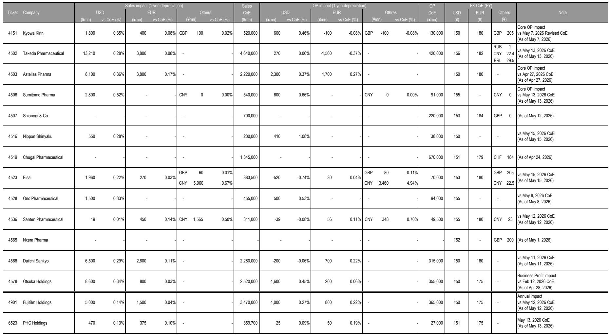
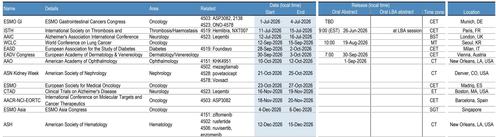
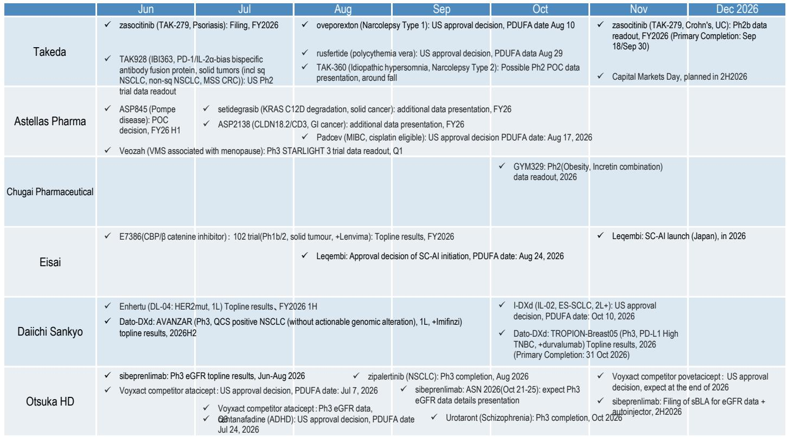

# Japan Pharma Is Not Broken—It Is Being Repriced, and the Inflection Point Arrives in Late 2026

The Japanese pharmaceutical sector rose a negligible 0.8% in the week of June 15-19, while the TOPIX surged 4.2%. That divergence is not noise; it is a structural signal. Over three months, the sector has fallen 11.1% against a TOPIX gain of 12.1%. Over six months, the gap is even starker: pharma down 4.2%, the broad market up 19.5%. This is not a cyclical dip. It is a sustained capital rotation out of defensive, yield-oriented healthcare and into AI, semiconductors, and the broader risk-on trade that has defined Japanese equities since early 2025.

Yet the same data that reveals the sector's weakness also contains the seeds of its recovery. The report's central thesis is contrarian but defensible: the sector will likely remain weak for the near term, but a meaningful upward move in share prices should emerge in the second half of 2026, driven by catalysts that are already visible. The question for institutional investors is not whether to ignore pharma, but how to position ahead of the turn.

The argument rests on three pillars. First, the sector's underperformance is largely a function of macro rotation, not fundamental deterioration. Second, a dense calendar of data readouts, regulatory decisions, and earnings events in the second half of 2026 provides a series of potential re-rating triggers. Third, several names are trading at valuations that already discount significant bad news, creating asymmetric upside for those willing to look past the current narrative.

None of this means the sector is a simple buy. The dispersion across names is extreme, and the distinction between companies with genuine catalysts and those facing structural headwinds will be the difference between alpha and continued underperformance.

## The Current Underperformance Is a Macro Rotation, Not a Sector Collapse, and That Matters for Timing

Let us be precise about what the data shows. In the week of June 15-19, the pharmaceutical sector was the 23rd best performer out of 33 TOPIX sectors. Over one month, it ranked 32nd. Over three months, 31st. Over six months, 31st. Year-to-date, 32nd. This is not a brief stumble; it is a persistent, multi-month pattern of capital being systematically withdrawn from the sector.

The proximate cause is clear. Japanese equities have been driven by a risk-on rally concentrated in AI and semiconductor stocks. The Nonferrous Metals sector gained 101% year-to-date. Electric Appliances gained 48.5%. Banks gained 33%. The TOPIX itself returned 18.7%. Against this backdrop, pharma's -4.9% year-to-date return is not a failure of the companies; it is a failure of the sector to fit the current market narrative.

This is critical for the strategic argument because it means the sector's weakness is largely exogenous. If the underperformance were driven by a wave of patent cliffs, pipeline failures, or pricing pressure, the recovery would depend on fundamental fixes that take years. But the current weakness is a function of capital allocation decisions by global and domestic investors who are chasing momentum. When the macro narrative shifts—and it will—capital will rotate back into sectors that offer relative value, earnings visibility, and defensive characteristics. Pharma checks all three boxes.

The report's own data supports this interpretation. Within the sector, the dispersion is wide. Sumitomo Pharma gained 6.9% in the week, Kyowa Kirin gained 5.7%. These are not random moves. They are tied to specific catalysts: data presentations at the European Hematology Association Congress for Sumitomo, and the possibility that bad news on rocatinlimab has been fully priced for Kyowa Kirin. The market is discriminating between names, which is exactly what one would expect in a sector that is being repriced rather than abandoned.

The strategic implication is that investors should not fight the macro headwind in the near term, but they should be building positions ahead of the catalyst calendar. The report's view that the sector will remain weak "for some time" is realistic. The second half of 2026 is the target window, and the events that will drive that recovery are already scheduled.

## The Second-Half 2026 Catalyst Calendar Is Dense, and It Is Not Priced In

The report identifies a series of specific events in the second half of 2026 that are expected to drive share prices higher. These are not vague hopes; they are concrete, dateable catalysts that can be tracked and traded.

For Kyowa Kirin, the focus is on Phase 2 study results for KHK4951, a treatment for wet age-related macular degeneration and diabetic macular edema. The report expects data to be presented at an academic conference in October, with confirmation expected at the April-June quarterly results. This is a binary event with significant upside potential. The stock has already shown relative strength, gaining 6.5% over the past month despite the sector's decline. If the data is positive, the re-rating could be substantial.

For Sumitomo Pharma, the recent data presentations at EHA 2026 on nuvisertib and enzomenib provide a foundation for investor confidence. The stock's 6.9% weekly gain reflects this. But the more important catalyst may be the approval of Wegovy for MASH, announced on June 19 through the co-promotion agreement with Novo Nordisk. This opens a new therapeutic category for Sumitomo and provides a revenue stream that is not yet reflected in current valuations.

Chugai Pharmaceutical presents a different kind of catalyst. The company filed for domestic manufacturing and marketing approval for sparsentan in IgA nephropathy on June 19. This is a large, underserved market with no approved therapies in Japan. If approved, sparsentan could become a significant growth driver. Chugai also hosted a briefing on Elevidys, Japan's first gene therapy for Duchenne muscular dystrophy. Gene therapy represents a new revenue category for the company, and the initial reception from the medical community will be closely watched.

Santen Pharmaceutical received manufacturing and marketing approval for Rhopressa, a glaucoma treatment, on June 19. This is a commercial-stage catalyst that adds to Santen's already strong ophthalmology franchise. The stock has been one of the sector's best performers over six months, gaining 14.4%.

The pattern across these events is clear. The second half of 2026 is not a random collection of earnings reports; it is a concentrated period of data readouts, regulatory decisions, and product launches that have the potential to change the earnings trajectory for multiple companies simultaneously. The report's figures 7-10, referenced but not reproduced here, are said to map these catalysts explicitly.

The strategic question is whether the market is pricing any of this. The valuation data suggests it is not. The sector's P/E multiples are compressed relative to history. Chugai trades at 24.2x FY26E earnings, but that drops to 18.5x in FY27E, implying that the market is not yet giving credit for the earnings growth that these catalysts could deliver. Sumitomo Pharma trades at just 6.7x FY26E, a multiple that embeds significant skepticism about the pipeline. If even one of the late-stage programs succeeds, the multiple expansion could be dramatic.

## Valuation Dispersion Creates a Clear Decision Framework: Buy the Catalysts, Not the Sector

The report's valuation table reveals a sector that is not monolithic. The range of implied returns from current prices to JPM price targets is enormous: from -29.1% for Kyowa Kirin to +56.5% for Sumitomo Pharma. This is not a sector where a single trade works. It is a stock-picker's environment.

The decision framework that emerges from the data has three dimensions.

First, identify companies with near-term catalysts that are independent of the macro environment. Sumitomo Pharma, Chugai, and Santen all have regulatory or data events in the second half of 2026 that do not depend on interest rates, risk appetite, or AI sentiment. These are idiosyncratic drivers that can generate alpha regardless of what the TOPIX does.

Second, assess whether the bad news is already in the price. Kyowa Kirin is the clearest example. The rocatinlimab development halt was a significant negative, but the stock has stabilized and even outperformed. The report's view is that "the bad news has run its course in the near term." If that is correct, the risk/reward for Kyowa Kirin is asymmetric to the upside, even if the official price target implies downside. The Phase 2 KHK4951 data is the swing factor.

Third, evaluate the earnings trajectory independently of the stock price. Chugai's FY26E P/E of 24.2x looks expensive until one sees the FY27E estimate of 18.5x. That compression implies earnings growth of roughly 30%. If the sparsentan approval and Elevidys launch deliver on expectations, the FY27E multiple could prove conservative. Conversely, Nippon Shinyaku's P/E jumps from 10.4x in FY26E to 28.2x in FY27E, suggesting that the market expects a sharp earnings decline. The Capricor Therapeutics lawsuit adds legal uncertainty.

The framework is simple: buy companies where the catalyst calendar is dense, the bad news is priced, and the earnings trajectory is improving. Avoid companies where the opposite holds. The sector as a whole may remain weak, but individual names can deliver significant returns.

## What the Report Does Not Fully Answer: The Sustainability of the Rotation and the Risk of Delayed Catalysts

For all its analytical rigor, the report leaves several critical questions open. These are not weaknesses; they are the natural boundaries of a research report that focuses on a specific time window. But for investors trying to position for the second half of 2026, these unanswered questions are precisely where the risk lies.

First, what happens if the macro rotation does not reverse? The report assumes that the current concentration in AI and semiconductors will eventually fade, allowing capital to flow back into pharma. But this is an assumption, not a forecast. If the AI trade continues to dominate through 2026 and into 2027, the sector could remain in the penalty box for much longer than the report anticipates. The second-half 2026 catalyst window could arrive and pass without a meaningful re-rating if the macro headwind persists.

Second, how much of the catalyst calendar is already discounted? The report treats events like the KHK4951 data readout and the sparsentan filing as potential re-rating triggers. But if the market has already priced in positive outcomes, the actual data could be a sell-the-news event. The report does not provide a probability-weighted analysis of each catalyst, leaving investors to make their own judgments about what is already in the price.

Third, what is the downside scenario if key catalysts fail? The report focuses on the upside potential but does not fully explore the consequences of negative data. For Kyowa Kirin, a poor KHK4951 result would likely erase the recent relative strength and push the stock toward the price target of 1,800 yen. For Sumitomo Pharma, a setback in the nuvisertib or enzomenib programs would undermine the bullish thesis. The report acknowledges these risks implicitly by maintaining underweight ratings on some names, but a more explicit scenario analysis would strengthen the decision framework.

Fourth, the report does not address the structural challenges facing Japanese pharma: pricing pressure from the government's drug price revision system, competition from biosimilars, and the difficulty of achieving global scale. These are long-term headwinds that could cap the sector's upside even if the second-half 2026 catalysts deliver. The report's focus on near-term catalysts is appropriate for a weekly update, but investors should be aware that the sector's structural issues remain unresolved.

These open questions are not reasons to avoid the sector. They are reasons to be selective, to size positions appropriately, and to have a clear exit strategy if the catalysts do not materialize as expected.

## How to Build a Portfolio Around the Second-Half 2026 Thesis

The report's analysis translates into a concrete decision framework for institutional investors. It is not a sector-level buy; it is a set of conditional trades that depend on specific catalysts.

The first step is to separate the sector into three buckets. Bucket one contains names with high-conviction catalysts in the second half of 2026 and valuations that do not reflect those catalysts. Chugai Pharmaceutical fits here, with the sparsentan filing and Elevidys launch providing upside that is not in the FY26E P/E of 24.2x. Bucket two contains names where the bad news is priced and the risk/reward is asymmetric, even if the catalyst is less certain. Kyowa Kirin fits here, with the KHK4951 data as the swing factor. Bucket three contains names that are expensive or face structural headwinds, regardless of near-term catalysts. These should be avoided or underweighted.

The second step is to size positions based on the probability of catalyst success. For high-probability catalysts like regulatory approvals, positions can be larger. For binary events like Phase 2 data, positions should be smaller and structured to capture upside while limiting downside. The report does not provide probability estimates, so investors must make their own judgments.

The third step is to manage the timing. The report expects the sector to remain weak in the near term, which means there is no urgency to build full positions immediately. A phased approach, adding to positions on weakness and ahead of specific catalyst dates, is appropriate. The April-June results will be the first major checkpoint, providing updates on the catalyst calendar for the second half of 2026.

The fourth step is to define the exit criteria. If the second-half 2026 catalysts deliver and the sector re-rates, the question becomes when to take profits. If the catalysts fail, the question is how much downside to accept before cutting losses. The report does not provide explicit exit guidance, but the price targets in the valuation table offer a reference point.

This framework is not a recommendation to buy the sector. It is a method for identifying the specific names and events that can generate alpha in a sector that is broadly out of favor. The report's data and analysis provide the raw material; the investor's judgment determines the final portfolio.

## The Full Report Contains the Charts That Map the Path

The analysis above is based on the report's text and data, but the full report contains several figures that are essential for implementation. Figures 7 through 10, referenced but not reproduced here, are said to provide a visual map of the catalysts and events expected in the second half of 2026. These charts are the operational tool for timing entry and exit points around specific data readouts, regulatory decisions, and earnings announcements.

The valuation table in Figure 3 provides the raw data for the decision framework, but the full report includes the analyst commentary that explains the rationale behind each rating and price target. Understanding why Kyowa Kirin is rated Underweight despite its recent outperformance, or why Sumitomo Pharma is rated Overweight despite its YTD decline of 36.6%, requires the full context that only the complete report provides.

Join the community to read the full report and review the original charts.

*This article is for learning and discussion only and does not constitute investment advice.*

Personal reading notes and learning share only. Not investment advice.

