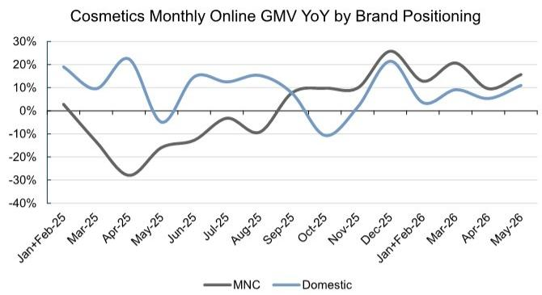
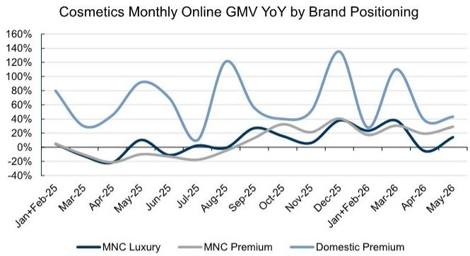
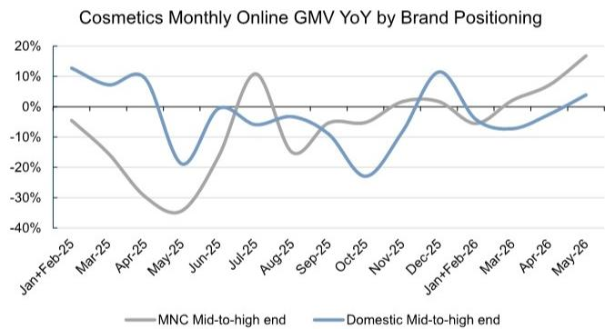
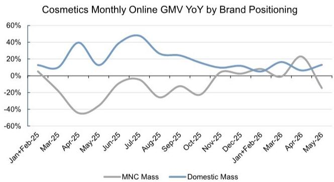

# China Cosmetics: 618 pulse check: performance in Douyin: MNCs/higher-end led; MGP rebound to $50\%+$ yoy

The 618 shopping festival in 2026 concluded on 18 Jun for Douyin and will be concluded on 21 Jun for Tmall. We summarize below key early color and data points and key takeaways for Douyin:

The top 500 cosmetics brands in Douyin grew by mid-30s yoy in May to Jun-18 with Jun-to date GMV yoy moderated vs May yoy, but still faster than 1Q26; we see consolidation trend with top 50 outgrowing at c.40% yoy while brands below 100 underperformed at high-20s yoy.

Performance by MNCs & locals/pricing segment (refer to Exhibit 3 for our definition for different pricing segment): Within top 500 brands, we see global brands tracking above local brands, in majority of the pricing segment except for premium as MGP managed to deliver $54\%$ yoy during the May to Jun-to-date; Overall luxury/premium brands recorded solid result, set to accelerate from mid-20s/high-20s yoy in May to high-30s/high-50s yoy in June to date, while mid-high end/mass market brands moderated from 40s yoy in May to high-teens to 20s yoy in June to date;

Brand performance in Douyin (refer to Exhibit 1 for Douyin tracker): For full period (May 15 - Jun 18), we saw western brands have c.140% completion rate vs local brands' 110% on average, while Japanese brands are on par to prior year:

1) Local brands: We saw strong performance across our covered local brands led by higher-end brands (i.e. Forest Cabin & Mao Geping). Forest Cabin is the leader with 188% yoy growth in Douyin for 2026 5.1-6.18 and highest full-period completion rate at 356%; Mao Geping achieved 54% yoy in 5.1-6.18 and full period completion of 150%, thanks to strong Jun performance (1-18) at 91% yoy, while Giant GMV was better than expected with 15% yoy growth for 2026 5.1-6.18 and Jun performance catching up at 44% yoy, leading to a 120% full period completion rate. Shanghai Jahwa and Botanee also delivered encouraging yoy growth with 137%/130% full period completion. Proya achieved 24% yoy for 5.1-6.18 and 121% full 618 completion despite Jun weakened at 5% yoy decline. On the other hand, Bloomage and Chicmax remained under pressure at 77%/63% full period completion.

2) Western brands: Premium brands continued to be the drivers for Western brands. Estee Lauder Group led with $56\%$ yoy growth in Douyin for 2026 5.1-6.18 and further accelerated to $75\%$ yoy in 6.1-6.18, with the highest full-period completion rate at $155\%$ , where we see strength in higher-end brands (Estee

Valerie Zhou

+852-2978-0820 | valerie.zhou@gs.com
GS (Asia) L.L.C.

Lauder/Lamer at 167%/154% full period completion); L'Oréal Group also achieved 33% yoy in 5.1-6.18 and full period completion of 130%, thanks to strong performance in higher-end brands (Skinceuticals/YSL reached 190%/176% full period completion rates), though mass-market brands were behind. Beiersdorf also delivered encouraging growth with 146% full period completion thanks to strong performance of La Prairie at 168% completion.

3) Japanese brands: we note a slowdown of growth in Jun across Japanese names; Shiseido Group declined at 21% in Jun 1-18, still delivering 113% full period completion thanks to outperformance of higher-end brands CPB/NARS at 166%/151% full period completion. Decorte (under Kose) / SK-II (under P&G) saw weakness at 40%/83% full period completion.

We reiterate our top-pick Buy (on CL) on Mao Geping for the strong full 618 period results in Douyin despite the softer sales in May, which we attribute to Company's deliberate pacing and online competitive strategy, a pattern previously observed during major events like Double 11 and Company managed to deliver solid and healthy results set in topline growth and margin profile. We are going to host a cosmetics expert call at 10am on 22 Jun (Monday), focusing more on Tmall and comprehensive operational metrics including discounts/platform and governments subsidies/product returns etc, more to follow.

More reads:

China Cosmetics: Monthly tracker: May-26: accelerating versus 1Q; local brands rebound likely on subsidies; MNCs continue to be strong June to date

China Cosmetics: 618 pulse check: Beauty GMV tracking well with likely improving ROI; Proya led, MGP accelerating and Giant better than feared; MNCs continue outperforming

China Cosmetics: 618 pulse check: Top tier KOL Day 1 livestreaming better than Women's day though not overly exciting; Mao Geping continues to lead

Exhibit 1: Douyin: For full period (May 15 - Jun 18) vs 618 last year, Forest Cabin led with $300\%+$ completion rate, partly due to an easier base, followed by MGP/Shanghai Jahwa/Botanee/Proya/Giant at $150\%/137\%/130\%/121\%/120\%$ . We note strong performances for MNC leaders as well, with Estee Lauder Group/Beiersdorf/Loreal Group/Shiseido Group at $155\%/146\%/130\%/113\%$

<table><tr><td>Douyin GMV</td><td>2026 5.1-6.18 yoy growth</td><td>2026 6.1-6.18 yoy growth</td><td>2026 5.15-6.18 as of 2025 5.13-6.18 (Full period Completion Rate)</td></tr><tr><td colspan="4">Local brands</td></tr><tr><td>Proya</td><td>24%</td><td>-5%</td><td>121%</td></tr><tr><td>Proya</td><td>31%</td><td>-13%</td><td>128%</td></tr><tr><td>TIMAGE</td><td>-25%</td><td>33%</td><td>72%</td></tr><tr><td>Off &amp; Relax</td><td>51%</td><td>84%</td><td>150%</td></tr><tr><td>Giant</td><td>15%</td><td>44%</td><td>120%</td></tr><tr><td>Comfy</td><td>7%</td><td>37%</td><td>109%</td></tr><tr><td>Collgene</td><td>52%</td><td>66%</td><td>170%</td></tr><tr><td>Botanee</td><td>31%</td><td>13%</td><td>130%</td></tr><tr><td>Winona</td><td>29%</td><td>10%</td><td>128%</td></tr><tr><td>Bloomage</td><td>-17%</td><td>-42%</td><td>77%</td></tr><tr><td>QuadHA</td><td>-35%</td><td>-71%</td><td>50%</td></tr><tr><td>Biohyalux</td><td>-15%</td><td>-33%</td><td>92%</td></tr><tr><td>Medrepair</td><td>54%</td><td>43%</td><td>159%</td></tr><tr><td>Shanghai Jahwa</td><td>68%</td><td>-16%</td><td>137%</td></tr><tr><td>Herborist</td><td>24%</td><td>-67%</td><td>67%</td></tr><tr><td>Dr. Yu</td><td>90%</td><td>78%</td><td>196%</td></tr><tr><td>Liushen</td><td>128%</td><td>73%</td><td>224%</td></tr><tr><td>Shanghai Chicmax</td><td>-21%</td><td>-55%</td><td>63%</td></tr><tr><td>KANS</td><td>-24%</td><td>-57%</td><td>59%</td></tr><tr><td>New Page</td><td>152%</td><td>51%</td><td>206%</td></tr><tr><td>ARMIYO</td><td>97%</td><td>58%</td><td>194%</td></tr><tr><td>MGP</td><td>54%</td><td>91%</td><td>150%</td></tr><tr><td>MAOEPING</td><td>54%</td><td>91%</td><td>150%</td></tr><tr><td>Forest Cabin</td><td>188%</td><td>162%</td><td>356%</td></tr><tr><td colspan="4">MNC</td></tr><tr><td>L&#x27;Oreal</td><td>33%</td><td>13%</td><td>130%</td></tr><tr><td>L&#x27;Oreal Paris</td><td>7%</td><td>-22%</td><td>101%</td></tr><tr><td>Lancome</td><td>29%</td><td>51%</td><td>124%</td></tr><tr><td>Maybelline</td><td>-7%</td><td>-21%</td><td>85%</td></tr><tr><td>HR</td><td>24%</td><td>9%</td><td>121%</td></tr><tr><td>Skinceuticals</td><td>89%</td><td>57%</td><td>190%</td></tr><tr><td>La Roche Posay</td><td>25%</td><td>-13%</td><td>111%</td></tr><tr><td>3CE</td><td>64%</td><td>23%</td><td>142%</td></tr><tr><td>Kiehl&#x27;s</td><td>91%</td><td>45%</td><td>185%</td></tr><tr><td>Armani</td><td>40%</td><td>7%</td><td>133%</td></tr><tr><td>YSL</td><td>74%</td><td>36%</td><td>176%</td></tr><tr><td>Estee Lauder</td><td>56%</td><td>75%</td><td>155%</td></tr><tr><td>Estee Lauder</td><td>65%</td><td>115%</td><td>167%</td></tr><tr><td>La Mer</td><td>54%</td><td>79%</td><td>154%</td></tr><tr><td>Clinique</td><td>10%</td><td>27%</td><td>107%</td></tr><tr><td>Origins</td><td>22%</td><td>37%</td><td>118%</td></tr><tr><td>Bobbi Brown</td><td>54%</td><td>35%</td><td>149%</td></tr><tr><td>M.A.C.</td><td>49%</td><td>-16%</td><td>134%</td></tr><tr><td>Jo Malone London</td><td>-17%</td><td>11%</td><td>92%</td></tr><tr><td colspan="4">LG H&amp;H</td></tr><tr><td>Whoo</td><td>-32%</td><td>-1%</td><td>67%</td></tr><tr><td>Shiseido</td><td>14%</td><td>-21%</td><td>113%</td></tr><tr><td>Shiseido</td><td>-38%</td><td>-56%</td><td>61%</td></tr><tr><td>CPB</td><td>63%</td><td>40%</td><td>166%</td></tr><tr><td>Nars</td><td>31%</td><td>50%</td><td>151%</td></tr><tr><td>ANESSA</td><td>35%</td><td>-41%</td><td>118%</td></tr><tr><td>The Ginza</td><td>532%</td><td>n.m.</td><td>n.m.</td></tr><tr><td>Elixir</td><td>252%</td><td>234%</td><td>319%</td></tr><tr><td>IPSA</td><td>188%</td><td>81%</td><td>292%</td></tr><tr><td>Amore</td><td>-42%</td><td>-63%</td><td>53%</td></tr><tr><td>Sulwhasoo</td><td>-54%</td><td>-76%</td><td>42%</td></tr><tr><td>Laneige</td><td>-7%</td><td>4%</td><td>90%</td></tr><tr><td>Innisfree</td><td>-36%</td><td>-52%</td><td>60%</td></tr><tr><td colspan="4">Kose</td></tr><tr><td>Decorte</td><td>-54%</td><td>-46%</td><td>40%</td></tr><tr><td>Beiersdorf</td><td>50%</td><td>17%</td><td>146%</td></tr><tr><td>NIVEA</td><td>82%</td><td>127%</td><td>176%</td></tr><tr><td>Eucerin</td><td>19%</td><td>-28%</td><td>117%</td></tr><tr><td>La Prairie</td><td>73%</td><td>38%</td><td>168%</td></tr><tr><td colspan="4">P&amp;G</td></tr><tr><td>Sk II</td><td>-15%</td><td>-27%</td><td>83%</td></tr></table>

Source: Chanmama, Data compiled by GS Global Investment Research

Tmall+Douyin+JD, latest in May:

Exhibit 2: Tmall+Douyin+JD: Growth of MNC brands has outperformed local brands since 4Q25  
Cosmetics Monthly Online GMV YoY by Brand Positioning  

line chart

| Month     | MNC   | Domestic |
| --------- | ----- | -------- |
| Jan-Feb-25 | 0%    | 18%      |
| Mar-25    | -30%  | 10%      |
| Apr-25    | -30%  | 22%      |
| May-25    | -20%  | -5%      |
| Jun-25    | -15%  | 15%      |
| Jul-25    | -5%   | 12%      |
| Aug-25    | -10%  | 10%      |
| Sep-25    | 5%    | 5%       |
| Oct-25    | 10%   | -10%     |
| Nov-25    | 10%   | -10%     |
| Dec-25    | 25%   | 20%      |
| Jan-Feb-26 | 10%   | 5%       |
| Mar-26    | 15%   | 10%      |
| Apr-26    | 10%   | 5%       |
| May-26    | 15%   | 10%      |

Source: Chanmama, Moojing, Data compiled by GS Global Investment Research

Exhibit 3: Tmall+Douyin+JD: Growth of Domestic Premium brands (i.e. Mao Geping) has outperformed MNC peers  
Cosmetics Monthly Online GMV YoY by Brand Positioning  

line chart

| Month     | MNC Luxury | MNC Premium | Domestic Premium |
|-----------|------------|-------------|------------------|
| Jan-Feb-25 | -          | -           | 80%              |
| Mar-25    | -          | -           | 30%              |
| Apr-25    | -          | -           | 50%              |
| May-25    | 10%        | -           | 90%              |
| Jun-25    | -          | -           | 70%              |
| Jul-25    | -          | -           | 10%              |
| Aug-25    | -          | -           | 120%             |
| Sep-25    | 20%        | -           | 50%              |
| Oct-25    | 10%        | 30%         | 40%              |
| Nov-25    | 10%        | 30%         | 40%              |
| Dec-25    | 30%        | 40%         | 130%             |
| Jan-Feb-26 | 30%        | 30%         | 20%              |
| Mar-26    | 40%        | 20%         | 110%             |
| Apr-26    | -          | 20%         | 40%              |
| May-26    | 10%        | 30%         | 40%              |

Classification of brand positioning (by core SKU retail price on Tmall flagship store): Luxury: Skincare > Rmb 730, Colour Cosmetics > Rmb 400; Premium: Skincare Rmb 490-730, Colour Cosmetics Rmb 260-400 (also include professional color cosmetics brands). Exception: Sisley, Guerlain, Tom Ford in luxury; Clarins, SK-II, Shu Uemure, Charlotte Tibury, Nars in premium.  
Source: Chanmama, Moojing, Data compiled by GS Global Investment Research

Exhibit 4: Tmall+Douyin+JD: Growth of MNC Mid-to-high end brands has outperformed local peers in 2026  
Cosmetics Monthly Online GMV YoY by Brand Positioning  

line chart

| Month     | MNC Mid-to-high end | Domestic Mid-to-high end |
| --------- | -------------------- | ------------------------- |
| Jan-Feb-25 | -5%                  | 12%                       |
| Mar-25    | -10%                 | 8%                        |
| Apr-25    | -20%                 | 10%                       |
| May-25    | -35%                 | -20%                      |
| Jun-25    | -10%                 | -5%                       |
| Jul-25    | 10%                  | -5%                       |
| Aug-25    | -15%                 | -5%                       |
| Sep-25    | -10%                 | -10%                      |
| Oct-25    | -5%                  | -25%                      |
| Nov-25    | 0%                   | -10%                      |
| Dec-25    | 5%                   | 10%                       |
| Jan-Feb-26 | 0%                   | -5%                       |
| Mar-26    | 5%                   | -10%                      |
| Apr-26    | 10%                  | -5%                       |
| May-26    | 15%                  | 5%                        |

Classification of brand positioning (by core SKU retail price on Tmall flagship store): Mid-to-high end: Skincare Rmb 150-490, Colour Cosmetics Rmb 170-260. Exception: La Roche-Posay in mid-to-high end.  
Source: Chanmama, Moojing, Data compiled by GS Global Investment Research

Exhibit 5: Tmall+Douyin+JD: In mass brands, local has outperformed MNC growth  
Cosmetics Monthly Online GMV YoY by Brand Positioning  

line chart

Cosmetics Monthly Online GMV YoY by Brand Positioning
| Month | MNC Mass (%) | Domestic Mass (%) |
|---|---|---|
| Jan-Feb-25 | 5 | 15 |
| Mar-25 | -20 | 10 |
| Apr-25 | -45 | 40 |
| May-25 | -35 | 15 |
| Jun-25 | -10 | 35 |
| Jul-25 | -5 | 48 |
| Aug-25 | -25 | 25 |
| Sep-25 | -15 | 22 |
| Oct-25 | -25 | 18 |
| Nov-25 | 5 | 10 |
| Dec-25 | 10 | 12 |
| Jan-Feb-26 | 5 | 8 |
| Mar-26 | -5 | 18 |
| Apr-26 | 20 | 8 |
| May-26 | -18 | 12 |

Classification of brand positioning (by core SKU retail price on Tmall flagship store): Mass: Skincare <Rmb 150, Colour Cosmetics <Rmb 170.  
Source: Chanmama, Moojing, Data compiled by GS Global Investment Research

Exhibit 6: 618 (May+ Jun) contributed around close to $75\%$ of 2Q online GMV (incl. Taobao/Tmall/JD), or $21\%$ of full year GMV distribution by month over 2020-2025 (Tmall+Taobao+JD)

<table><tr><td colspan="13">GMV contribuion</td></tr><tr><td></td><td></td><td>Jan/Feb</td><td>Mar (3.08)</td><td>Apr</td><td>May (6.18)</td><td>Jun (6.18)</td><td>Jul</td><td>Aug</td><td>Sept</td><td>Oct (11.11)</td><td>Nov (11.11)</td><td>Dec</td></tr><tr><td rowspan="6">Cosmetics</td><td>2020</td><td>10%</td><td>8%</td><td>7%</td><td>8%</td><td>9%</td><td>6%</td><td>8%</td><td>7%</td><td>8%</td><td>21%</td><td>8%</td></tr><tr><td>2021</td><td>13%</td><td>9%</td><td>6%</td><td>7%</td><td>12%</td><td>6%</td><td>7%</td><td>7%</td><td>7%</td><td>20%</td><td>7%</td></tr><tr><td>2022</td><td>15%</td><td>8%</td><td>6%</td><td>6%</td><td>13%</td><td>5%</td><td>7%</td><td>7%</td><td>7%</td><td>19%</td><td>6%</td></tr><tr><td>2023</td><td>15%</td><td>10%</td><td>8%</td><td>6%</td><td>12%</td><td>6%</td><td>7%</td><td>6%</td><td>7%</td><td>17%</td><td>6%</td></tr><tr><td>2024</td><td>14%</td><td>9%</td><td>7%</td><td>13%</td><td>7%</td><td>5%</td><td>6%</td><td>7%</td><td>15%</td><td>10%</td><td>6%</td></tr><tr><td>2025</td><td>15%</td><td>9%</td><td>7%</td><td>12%</td><td>9%</td><td>5%</td><td>6%</td><td>6%</td><td>14%</td><td>9%</td><td>6%</td></tr></table>

Source: Moojing, Data compiled by GS Global Investment Research

Exhibit 7: We saw shorter period for 618 with later start for Tmall/Douyin Time period of 618 promotion events (2026 vs. 2025)

<table><tr><td>Platform</td><td>Pre-sale period</td><td>Official sales period</td></tr><tr><td colspan="3">2026</td></tr><tr><td>Tmall</td><td>May 21 20:00 - May 26</td><td>First Round: May 27 - May 30Second Round: May 31 - Jun 3Third Round: Jun 4 - Jun 21</td></tr><tr><td>JD</td><td>-</td><td>Mothers&#x27; Day Festival: May 6 - May 10618 First Round: May 11 - May 30618 Second round: May 31 - Jun 20</td></tr><tr><td>Douyin</td><td>-</td><td>May 15 00:00 - Jun 18 23:59</td></tr><tr><td colspan="3">2025</td></tr><tr><td>Tmall</td><td>First Round: May 13 20:00 - May 16 17:59Second Round: Jun 12 10:00 - Jun 14 22:59</td><td>First round: May 16 20:00 - May 26 23:59Secound round: Jun 15 00:00 - Jun 20 23:59</td></tr><tr><td>JD</td><td>-</td><td>First round: May 13 20:00 - May 28 23:59Second round: May 31 20:00 - Jun 20 23:59</td></tr><tr><td>Douyin</td><td>-</td><td>May 13 00:00 - Jun 18 23:59</td></tr></table>

Source: Tmall, JD, Douyin, Data compiled by GS Global Investment Research

Exhibit 8: JD/Douyin offering smaller discounts vs. last year's 618 Discount level across major online platform of cosmetics

<table><tr><td rowspan="2">Platform</td><td colspan="2">2026</td><td colspan="3">2025</td><td colspan="3">2024</td><td colspan="3">2023</td></tr><tr><td>618</td><td>38 Women&#x27;s day</td><td>Double 11</td><td>618</td><td>38 Women&#x27;s day</td><td>Double 11</td><td>618</td><td>38 Women&#x27;s day</td><td>Double 11</td><td>618</td><td>38 Women&#x27;s day</td></tr><tr><td>Tmall</td><td>From 15% off</td><td>Taobao: from 12% off Tmall: from 12% off</td><td>Taobao: from 15% off Tmall: from 15% off</td><td>15% off (up to 50% off)</td><td>30 off 200+ (up to 15% off)</td><td>Taobao: 30 off 200+ (up to 15% off) Tmall: 50 off 300+ (up to 17% off)</td><td>50 off 300+ (up to 17% off)</td><td>40 off 300+ (up to 13% off)</td><td>50 off 300+ (up to 17% off)</td><td>50 off 300+ (up to 17% off)</td><td>From 10% off</td></tr><tr><td>JD</td><td>10 off 100+/ 20 off 200+/ 300 off 5,000+/80 off for any (up to 10% off)</td><td>20 off 200+ (up to 10% off)</td><td>From 15% off/50 off 300 (up to 17% off)</td><td>20 off 200+/ 50 off 299+</td><td>30 off 200+ (up to 15% off)</td><td>50 off 299+ (up to 17% off)</td><td>50 off 299+ (up to 17% off)</td><td>40 off 300+ (up to 13% off)</td><td>50 off 299+ (up to 17% off)</td><td>50 off 299+ (up to 17% off)</td><td>20 off 200+ (up to 10% off)</td></tr><tr><td>Douyin</td><td>40 off 300+/ 80 off 600+/ 180 off 1,500+/ 420 off 3,000+/780 off 6,000+ (up to 13% off)</td><td>75 off 500+ (up to 15% off) 210 off 1500+ (up to 14% off)</td><td>From 15% off</td><td>From 15% off</td><td>From 15% off</td><td>30 off 200+ (up to 15% off)</td><td>Instant discount (From 15% off)</td><td>From 15% off</td><td>30 off 200+ (up to 15% off)</td><td>25 off 150+ (up to 17% off)</td><td>20 off 150+ (up to 13% off)</td></tr></table>

The "up to $50\%$ off" discount only applies to specific products in Tmall.  
Source: Tmall, Douyin, JD, Data compiled by GS Global Investment Research

## Price Target Risks and Methodology - Giant Biogene Holding

Valuation methodology: We are Buy rated on Giant Biogene. Our 12-month target price of HK\$46 is based on a 22x 2027E P/E discounted back to end-2026E using a 9.6% COE. Our target exit multiple of 22x is based on 50%/50% blended cosmetics/medical devices P/E, after applying a 20% A-H share discount. The cosmetics multiple is derived in-line with our industry base multiple of 27x, to reflect the company's improving sales/NP profile into 2027E; and the medical devices multiple is derived at 27x in-line with peers.

Key risks: 1) Slower-than-expected growth/intensified competition in the professional skin treatment market; 2) inability to develop successful products; 3) regulatory risk.

## Price Target Risks and Methodology - Proya Cosmetics

Valuation methodology: We are Neutral rated on Proya Cosmetics. Our 12-month target price of Rmb69 is based on a 19x 2027E P/E discounted back to end-2026E using an $8.9\%$ COE. Our target exit multiple of 19x is derived using a $30\%$ discount to our industry base multiple of 27x, to reflect moderating growth, operational uncertainty following recent management changes, and potential dilution from its H-share listing.

Key risks: 1) New product development for the core Proya brand; 2) More/less intensified-than-expected competition; 3) Faster-/slower-than-expected sales ramp-up for new brands; 4) Better/worse-than-expected operating margins from lower-/higher-than-expected selling expenses.

## Price Target Risks and Methodology - Mao Geping Cosmetics Co.

Valuation methodology: We are Buy rated on Mao Geping. Our 12-month TP of HK\$106 is based on a 28x 2027E P/E discounted back to end-2026E using an 8.9% COE. Our target exit multiple of 28x is derived using a 30% premium to our industry base multiple of 27x after applying a 20% A-H discount to reflect the company's high growth profile (23% 2025E-27E sales CAGR vs. 12% average for our China Cosmetics coverage).

Key risks: 1) Slower-than-expected category expansion into skincare; 2)

Slower-than-expected penetration for mid-to-high price beauty products in China; 3) Greater selling and marketing costs for marketing new star SKUs and new categories; 4) Tougher-than-expected competition with overseas premium brands.

## Price Target Risks and Methodology - Bloomage Biotechnology

Valuation methodology: We are Sell rated on Bloomage. Our 12-month target price of Rmb30 is based on a 27x 2027E P/E discounted back to end-2026E using a $9.6\%$ COE. Our target exit multiple of 27x is based on $10\% / 80\% / 10\%$ blended cosmetics/medical devices/raw materials P/E. To reflect moderating growth, a $20\%$ discount is applied to our industry base multiple of 27x.

Key risks: 1) Faster-than-expected recovery of the skincare business; 2)

stronger-than-expected cosmetics demand growth; 3) less intense market competition; 4) faster-than-expected selling expense ratio decline.

## Price Target Risks and Methodology - Botanee Biotech

Valuation methodology: We are Neutral rated on Botanee. Our 12-month TP of Rmb42.2 is based on 27x 2027E P/E discounted back to end-2026 using an $8.9\%$ COE.

Our target exit multiple of 27x is derived in line with our industry base multiple of 27x, to reflect the company's improving sales/NP profile into 2027E.

Key risks: 1) Higher-/lower-than-expected penetration rate of dermocosmetics; 2) Faster-/slower-than-expected market share gains; 3) Higher-than-expected revenue contribution from non-skincare categories; 4) Higher-/lower-than-expected revenue contribution from new brands; 5) Higher-/lower-than expected A&P spending.

## Price Target Risks and Methodology - Shanghai Jahwa United

Valuation methodology: We are Buy rated on Shanghai Jahwa. Our 12-month TP of Rmb25 is based on a 30x 2027E P/E discounted back to end-2026E using an $8.9\%$ COE. Our target exit multiple of 30x is derived using a $10\%$ premium to our industry base multiple of 27x, to reflect the company's improving sales/NP profile into 2027E.

Key risks: 1) Impairment loss from overseas business, which is still struggling with shrinking demand and competition; 2) More Herborist store closures if offline continues to incur loss amidst sluggish sales; 3) Lower-than-expected sales growth outlook for Dr. Yu/VIVE; 4) Lower-than-expected execution in the online channel; 5) Impact of management transition.

## Price Target Risks and Methodology - Shanghai Forest Cabin Cosmetics

Our 12-month target price of HK\$104 is based on a 2027E PE of 22x, discounted backed to 2026E with a CoE of 9.6%. Our exit multiple is based on the industry base of 27x and an A-H discount of 20%.

Key risks: 1) slower-than-expected penetration of anti-aging products in China; 2) lower-than-expected adoption of oil essence products in China; 3) margin dilution from increasing online exposure; 4) higher-than-expected competition/promotions; 5) Over-concentration in essence oil.

## Disclosure Appendix

## Reg AC

I, Valerie Zhou, hereby certify that all of the views expressed in this report accurately reflect my personal views about the subject company or companies and its or their securities. I also certify that no part of my compensation was, is or will be, directly or indirectly, related to the specific recommendations or views expressed in this report.

Unless otherwise stated, the individuals listed on the cover page of this report are analysts in GS' Global Investment Research division.

Contributing Authors: Valerie Zhou GS (Asia) L.L.C..

Unless otherwise stated, the individuals listed in the Contributing Authors disclosure of this report are analysts in GS' Global Investment Research division.

## GS Factor Profile

The GS Factor Profile provides investment context for a stock by comparing key attributes to the market (i.e. our universe of rated stocks) and its sector peers. The four key attributes depicted are: Growth, Financial Returns, Multiple (e.g. valuation) and Integrated (a composite of Growth, Financial Returns and Multiple). Growth, Financial Returns and Multiple are calculated by using normalized ranks for specific metrics for each stock. The normalized ranks for the metrics are then averaged and converted into percentiles for the relevant attribute. The precise calculation of each metric may vary depending on the fiscal year, industry and region, but the standard approach is as follows:

Growth is based on a stock's forward-looking sales growth, EBITDA growth and EPS growth (for financial stocks, only EPS and sales growth), with a higher percentile indicating a higher growth company. Financial Returns is based on a stock's forward-looking ROE, ROCE and CROCI (for financial stocks, only ROE), with a higher percentile indicating a company with higher financial returns. Multiple is based on a stock's forward-looking P/E, P/B, price/dividend (P/D), EV/EBITDA, EV/FCF and EV/Debt Adjusted Cash Flow (DACF) (for financial stocks, only P/E, P/B and P/D), with a higher percentile indicating a stock trading at a higher multiple. The Integrated percentile is calculated as the average of the Growth percentile, Financial Returns percentile and (100% - Multiple percentile).

Financial Returns and Multiple use the GS analyst forecasts at the fiscal year-end at least three quarters in the future. Growth uses inputs for the fiscal year at least seven quarters in the future compared with the year at least three quarters in the future (on a per-share basis for all metrics).

For a more detailed description of how we calculate the GS Factor Profile, please contact your GS representative.

## M&A Rank

Across our global coverage, we examine stocks using an M&A framework, considering both qualitative factors and quantitative factors (which may vary across sectors and regions) to incorporate the potential that certain companies could be acquired. We then assign a M&A rank as a means of scoring companies under our rated coverage from 1 to 3, with 1 representing high (30%-50%) probability of the company becoming an acquisition target, 2 representing medium (15%-30%) probability and 3 representing low (0%-15%) probability. For companies ranked 1 or 2, in line with our standard departmental guidelines we incorporate an M&A component into our target price. M&A rank of 3 is considered immaterial and therefore does not factor into our price target, and may or may not be discussed in research.

## Quantum

Quantum is GS' proprietary database providing access to detailed financial statement histories, forecasts and ratios. It can be used for in-depth analysis of a single company, or to make comparisons between companies in different sectors and markets.

## Disclosures

## Rating and pricing information

Bloomage Biotechnology Corp. (Sell, Rmb35.45), Botanee Biotech (Neutral, Rmb33.28), Forest Cabin (Buy, HK\$28.60), Giant Biogene Holding (Buy, HK\$25.52), Mao Geping Cosmetics Co. (Buy, HK\$56.50), Proya Cosmetics (Neutral, Rmb64.64) and Shanghai Jahwa United (Buy, Rmb17.59). Mao Geping: HK\$56.50)

Pricing as of 18 Jun 2026 closing.

The rating(s) for Bloomage Biotechnology Corp., Botanee Biotech, Giant Biogene Holding, Mao Geping Cosmetics Co., Proya Cosmetics, Shanghai Forest Cabin Cosmetics and Shanghai Jahwa United is/are relative to the other companies in its/their coverage universe: Angel Yeast, Anjoy Foods Group (A), Anjoy Foods Group (H), Bloomage Biotechnology Corp., Botanee Biotech, Chacha Food Co., China Pet Foods, Gambol Pet Group Co., Giant Biogene Holding, Henan Shuanghui Ltd., Ligao Foods, Mao Geping Cosmetics Co., Petpal Pet Nutrition Technology, Proya Cosmetics, Qianweiyangchu, Sanquan Foods, Shanghai Forest Cabin Cosmetics, Shanghai Jahwa United, Three Squirrels, WH Group, Want Want China, Weilong Delicious Global Holdings, Yankershop Food

## Company-specific regulatory disclosures

Compendium report: please see disclosures at https://www.gs.com/research/hedge.html. Disclosures applicable to the companies included in this compendium can be found in the latest relevant published research

## Distribution of ratings/investment banking relationships

GS Investment Research global Equity coverage universe

<table><tr><td rowspan="2"></td><td colspan="3">Rating Distribution</td><td colspan="3">Investment Banking Relationships</td></tr><tr><td>Buy</td><td>Hold</td><td>Sell</td><td>Buy</td><td>Hold</td><td>Sell</td></tr><tr><td>Global</td><td>50%</td><td>34%</td><td>16%</td><td>65%</td><td>60%</td><td>45%</td></tr></table>

As of April 1, 2026, GS Global Investment Research had investment ratings on 3,074 equity securities. GS assigns stocks as Buys and Sells on various regional Investment Lists; stocks not so assigned are deemed Neutral. Such assignments equate to Buy, Hold and Sell for the purposes of the above disclosure required by the FINRA Rules. See ‘Ratings, Coverage universe and related definitions’ below. The Investment Banking Relationships chart reflects the percentage of subject companies within each rating category for whom GS has provided investment

banking services within the previous twelve months.

## Price target and rating history chart(s)

Compendium report: please see disclosures at https://www.gs.com/research/hedge.html. Disclosures applicable to the companies included in this compendium can be found in the latest relevant published research

Target price history table(s)  
Shanghai Jahwa United (600315.SS)

<table><tr><td>Date of report</td><td>Target price (Rmb)</td><td>Closing price (Rmb)</td></tr><tr><td>29-Mar-26</td><td>25.00</td><td>20.59</td></tr><tr><td>07-Jan-26</td><td>28.00</td><td>23.11</td></tr><tr><td>14-Sep-25</td><td>31.00</td><td>27.36</td></tr><tr><td>27-Apr-25</td><td>27.00</td><td>22.80</td></tr><tr><td>10-Apr-25</td><td>24.00</td><td>20.01</td></tr><tr><td>16-Jan-25</td><td>14.00</td><td>16.09</td></tr><tr><td>06-Nov-24</td><td>15.00</td><td>16.98</td></tr><tr><td>22-Aug-24</td><td>15.40</td><td>15.01</td></tr><tr><td>06-May-24</td><td>18.00</td><td>21.68</td></tr><tr><td>17-Mar-24</td><td>17.00</td><td>19.24</td></tr><tr><td>31-Jan-24</td><td>18.00</td><td>17.90</td></tr><tr><td>02-Nov-23</td><td>20.00</td><td>22.96</td></tr><tr><td>03-Sep-23</td><td>25.00</td><td>26.47</td></tr><tr><td>29-Jun-23</td><td>28.00</td><td>29.14</td></tr></table>

Mao Geping Cosmetics Co. (1318.HK)

<table><tr><td>Date of report</td><td>Target price (HK$)</td><td>Closing price (HK$)</td></tr><tr><td>26-Mar-26</td><td>106.00</td><td>69.65</td></tr><tr><td>07-Jan-26</td><td>105.00</td><td>87.95</td></tr><tr><td>28-Aug-25</td><td>89.00</td><td>94.05</td></tr><tr><td>07-May-25</td><td>86.00</td><td>107.70</td></tr><tr><td>25-Feb-25</td><td>75.00</td><td>70.80</td></tr></table>

Botanee Biotech (300957.SZ)

<table><tr><td>Date of report</td><td>Target price (Rmb)</td><td>Closing price (Rmb)</td></tr><tr><td>11-May-26</td><td>42.20</td><td>41.40</td></tr><tr><td>07-Jan-26</td><td>38.00</td><td>40.24</td></tr><tr><td>14-Sep-25</td><td>43.00</td><td>48.90</td></tr><tr><td>07-May-25</td><td>38.00</td><td>41.64</td></tr><tr><td>16-Jan-25</td><td>44.00</td><td>41.32</td></tr><tr><td>06-Nov-24</td><td>46.00</td><td>54.27</td></tr><tr><td>02-Sep-24</td><td>47.00</td><td>40.65</td></tr><tr><td>28-Apr-24</td><td>62.00</td><td>55.35</td></tr><tr><td>31-Jan-24</td><td>72.00</td><td>56.30</td></tr><tr><td>02-Nov-23</td><td>92.00</td><td>75.79</td></tr><tr><td>03-Sep-23</td><td>116.00</td><td>105.32</td></tr></table>

Proya Cosmetics (603605.SS)

<table><tr><td>Date of report</td><td>Target price (Rmb)</td><td>Closing price (Rmb)</td></tr><tr><td>21-Apr-26</td><td>69.00</td><td>60.35</td></tr><tr><td>07-Jan-26</td><td>74.00</td><td>68.78</td></tr><tr><td>31-Oct-25</td><td>79.00</td><td>73.84</td></tr><tr><td>26-Aug-25</td><td>90.00</td><td>91.99</td></tr><tr><td>28-Apr-25</td><td>94.00</td><td>93.18</td></tr><tr><td>25-Feb-25</td><td>88.00</td><td>83.92</td></tr><tr><td>16-Jan-25</td><td>101.00</td><td>83.58</td></tr><tr><td>24-Oct-24</td><td>107.50</td><td>99.00</td></tr><tr><td>25-Jun-24</td><td>109.00</td><td>110.68</td></tr><tr><td>11-Mar-24</td><td>103.00</td><td>97.60</td></tr><tr><td>31-Jan-24</td><td>113.00</td><td>82.39</td></tr><tr><td>02-Nov-23</td><td>125.00</td><td>105.22</td></tr><tr><td>03-Sep-23</td><td>144.00</td><td>111.12</td></tr></table>

Shanghai Forest Cabin Cosmetics (2657.HK)

<table><tr><td>Date of report</td><td>Target price (HK$)</td><td>Closing price (HK$)</td></tr><tr><td>25-Mar-26</td><td>104.00</td><td>68.65</td></tr><tr><td>25-Feb-26</td><td>103.00</td><td>73.50</td></tr></table>

Bloomage Biotechnology Corp. (688363.SS)

<table><tr><td>Date of report</td><td>Target price (Rmb)</td><td>Closing price (Rmb)</td></tr><tr><td>11-May-26</td><td>30.00</td><td>41.90</td></tr><tr><td>07-Jan-26</td><td>34.00</td><td>44.61</td></tr><tr><td>07-May-25</td><td>38.00</td><td>48.19</td></tr><tr><td>16-Jan-25</td><td>43.00</td><td>50.30</td></tr><tr><td>25-Aug-24</td><td>50.00</td><td>52.86</td></tr><tr><td>30-Jun-24</td><td>54.00</td><td>56.57</td></tr><tr><td>31-Jan-24</td><td>55.00</td><td>55.85</td></tr><tr><td>02-Nov-23</td><td>75.00</td><td>74.71</td></tr><tr><td>03-Sep-23</td><td>92.00</td><td>92.87</td></tr></table>

Giant Biogene Holding (2367.HK)

<table><tr><td>Date of report</td><td>Target price (HK$)</td><td>Closing price (HK$)</td></tr><tr><td>07-Jan-26</td><td>46.00</td><td>34.68</td></tr><tr><td>10-Jun-25</td><td>71.00</td><td>60.60</td></tr><tr><td>07-May-25</td><td>82.60</td><td>78.80</td></tr><tr><td>26-Mar-25</td><td>72.00</td><td>68.00</td></tr><tr><td>16-Jan-25</td><td>64.00</td><td>53.30</td></tr><tr><td>20-Aug-24</td><td>56.00</td><td>40.75</td></tr><tr><td>06-May-24</td><td>55.00</td><td>52.00</td></tr></table>

Date of report Target price (HK\$) Closing price (HK\$)

<table><tr><td>26-Mar-24</td><td>48.00</td><td>42.50</td></tr><tr><td>31-Jan-24</td><td>44.00</td><td>31.65</td></tr><tr><td>02-Nov-23</td><td>43.00</td><td>33.55</td></tr></table>

Price targets shown in table(s) are unadjusted for corporate actions.

## Regulatory disclosures

## Disclosures required by United States laws and regulations

See company-specific regulatory disclosures above for any of the following disclosures required as to companies referred to in this report: manager or co-manager in a pending transaction; $1\%$ or other ownership; compensation for certain services; types of client relationships; managed/co-managed public offerings in prior periods; directorships; for equity securities, market making and/or specialist role. GS trades or may trade as a principal in debt securities (or in related derivatives) of issuers discussed in this report.

The following are additional required disclosures: Ownership and material conflicts of interest: GS policy prohibits its analysts, professionals reporting to analysts and members of their households from owning securities of any company in the analyst's area of coverage. Analyst compensation: Analysts are paid in part based on the profitability of GS, which includes investment banking revenues. Analyst as officer or director: GS policy generally prohibits its analysts, persons reporting to analysts or members of their households from serving as an officer, director or advisor of any company in the analyst's area of coverage. Non-U.S. Analysts: Non-U.S. analysts may not be associated persons of GS & Co. LLC and therefore may not be subject to FINRA Rule 2241 or FINRA Rule 2242 restrictions on communications with a subject company, public appearances and trading in securities covered by the analysts.

Distribution of ratings: See the distribution of ratings disclosure above. Price chart: See the price chart, with changes of ratings and price targets in prior periods, above, or, if electronic format or if with respect to multiple companies which are the subject of this report, on the GS website at https://www.gs.com/research/hedge.html.

## Additional disclosures required under the laws and regulations of jurisdictions other than the United States

The following disclosures are those required by the jurisdiction indicated, except to the extent already made above pursuant to United States laws and regulations. Australia: GS Australia Pty Ltd and its affiliates are not authorised deposit-taking institutions (as that term is defined in the Banking Act 1959 (Cth)) in Australia and do not provide banking services, nor carry on a banking business, in Australia. This research, and any access to it, is intended only for “wholesale clients” within the meaning of the Australian Corporations Act, unless otherwise agreed by GS. In producing research reports, members of Global Investment Research of GS Australia may attend site visits and other meetings hosted by the companies and other entities which are the subject of its research reports. In some instances the costs of such site visits or meetings may be met in part or in whole by the issuers concerned if GS Australia considers it is appropriate and reasonable in the specific circumstances relating to the site visit or meeting. To the extent that the contents of this document contains any financial product advice, it is general advice only and has been prepared by GS without taking into account a client’s objectives, financial situation or needs. A client should, before acting on any such advice, consider the appropriateness of the advice having regard to the client’s own objectives, financial situation and needs. A copy of certain GS Australia and New Zealand disclosure of interests and a copy of GS’ Australian Sell-Side Research Independence Policy Statement are available at: https://www.goldmansachs.com/disclosures/australia-new-zealand/index.html. Brazil: Disclosure information in relation to CVM Resolution n. 20 is available at https://www.gs.com/worldwide/brazil/area/gir/index.html. Where applicable, the Brazil-registered analyst primarily responsible for the content of this research report, as defined in Article 20 of CVM Resolution n. 20, is the first author named at the beginning of this report, unless indicated otherwise at the end of the text. Canada: This information is being provided to you for information purposes only and is not, and under no circumstances should be construed as, an advertisement, offering or solicitation by GS & Co. LLC for purchasers of securities in Canada to trade in any Canadian security. GS & Co. LLC is not registered as a dealer in any jurisdiction in Canada under applicable Canadian securities laws and generally is not permitted to trade in Canadian securities and may be prohibited from selling certain securities and products in certain jurisdictions in Canada. If you wish to trade in any Canadian securities or other products in Canada please contact GS Canada Inc., an affiliate of The GS Group Inc., or another registered Canadian dealer. Hong Kong: Further information on the securities of covered companies referred to in this research may be obtained on request from GS (Asia) L.L.C. India: Further information on the subject company or companies referred to in this research may be obtained from GS (India) Securities Private Limited, Research Analyst - SEBI Registration Number INH000001493, 10th Floor, Ascent-Worli, Sudam Kalu Ahire Marg, Worli, Mumbai-400 025, India, Corporate Identity Number U74140MH2006FTC160634, Phone +91 22 6616 9000, Fax +91 22 6616 9001. GS may beneficially own 1% or more of the securities (as such term is defined in clause 2 (h) the Indian Securities Contracts (Regulation) Act, 1956) of the subject company or companies referred to in this research report. Investment in securities market are subject to market risks. Read all the related documents carefully before investing. Registration granted by SEBI and certification from NISM in no way guarantee performance of the intermediary or provide any assurance of returns to investors. GS (India) Securities Private Limited compliance officer and investor grievance contact details can be found at: https://www.goldmansachs.com/worldwide/india/documents/Grievance-Redressal-and-Escalation-Matrix.pdf, and a copy of the annual audit compliance report can be found at this link: https://publishing.gs.com/content/site/india-annual-compliance-report.html. Japan: See below. Korea: This research, and any access to it, is intended only for “professional investors” within the meaning of the Financial Services and Capital Markets Act, unless otherwise agreed by GS. Further information on the subject company or companies referred to in this research may be obtained from GS (Asia) L.L.C., Seoul Branch. New Zealand: GS New Zealand Limited and its affiliates are neither “registered banks” nor “deposit takers” (as defined in the Reserve Bank of New Zealand Act 1989) in New Zealand. This research, and any access to it, is intended for “wholesale clients” (as defined in the Financial Advisers Act 2008) unless otherwise agreed by GS. A copy of certain GS Australia and New Zealand disclosure of interests is available at: https://www.goldmansachs.com/disclosures/australia-new-zealand/index.html. Russia: Research reports distributed in the Russian Federation are not advertising as defined in the Russian legislation, but are information and analysis not having product promotion as their main purpose and do not provide appraisal within the meaning of the Russian legislation on appraisal activity. Research reports do not constitute a personalized investment recommendation as defined in Russian laws and regulations, are not addressed to a specific client, and are prepared without analyzing the financial circumstances, investment profiles or risk profiles of clients. GS assumes no responsibility for any investment decisions that may be taken by a client or any other person based on this research report. Singapore: GS (Singapore) Pte. (Company Number: 198602165W), which is regulated by the Monetary Authority of Singapore, accepts legal responsibility for this research, and should be contacted with respect to any matters arising from, or in connection with, this research. Taiwan: This material is for reference only and must not be reprinted without permission. Investors should carefully consider their own investment risk. Investment results are the responsibility of the individual investor. United Kingdom: Persons who would be categorized as retail clients in the United Kingdom, as such term is defined in the rules of the Financial Conduct Authority, should read this research in conjunction with prior GS on the covered companies referred to herein and should refer to the risk warnings that have been sent to them by GS International. A copy of these risks warnings, and a glossary of certain financial terms used in this report, are available from GS International on request.

European Union and United Kingdom: Disclosure information in relation to Article 6 (2) of the European Commission Delegated Regulation (EU) (2016/958) supplementing Regulation (EU) No 596/2014 of the European Parliament and of the Council (including as that Delegated Regulation is implemented into United Kingdom domestic law and regulation following the United Kingdom's departure from the European Union and the European Economic Area) with regard to regulatory technical standards for the technical arrangements for objective presentation of investment recommendations or other information recommending or suggesting an investment strategy and for disclosure of particular interests or indications of conflicts of interest is available at https://www.gs.com/disclosures/europeanpolicy.html which states the European Policy for Managing Conflicts of Interest in Connection with Investment Research.

Japan: GS Japan Co., Ltd. is a Financial Instrument Dealer registered with the Kanto Financial Bureau under registration number Kinsho 69, and a member of Japan Securities Dealers Association, Financial Futures Association of Japan Type II Financial Instruments Firms Association, and Investment Management Association of Japan. Sales and purchase of equities are subject to commission pre-determined with clients plus consumption tax. See company-specific disclosures as to any applicable disclosures required by Japanese stock exchanges, the Japanese Securities Dealers Association or the Japanese Securities Finance Company.

## Ratings, coverage universe and related definitions

Buy (B), Neutral (N), Sell (S) Analysts recommend stocks as Buys or Sells for inclusion on various regional Investment Lists. Being assigned a Buy or Sell on an Investment List is determined by a stock's total return potential relative to its coverage universe. Any stock not assigned as a Buy or a Sell on an Investment List with an active rating (i.e., a stock that is not Rating Suspended, Not Rated, Early-Stage Biotech, Coverage Suspended or Not Covered), is deemed Neutral. Each region manages Regional Conviction Lists, which are selected from Buy rated stocks on the respective region's Investment Lists and represent investment recommendations focused on the size of the total return potential and/or the likelihood of the realization of the return across their respective areas of coverage. The addition or removal of stocks from such Conviction Lists are managed by the Investment Review Committee or other designated committee in each respective region and do not represent a change in the analysts' investment rating for such stocks.

Total return potential represents the upside or downside differential between the current share price and the price target, including all paid or anticipated dividends, expected during the time horizon associated with the price target. Price targets are required for all covered stocks. The total return potential, price target and associated time horizon are stated in each report adding or reiterating an Investment List membership.

Coverage Universe: A list of all stocks in each coverage universe is available by primary analyst, stock and coverage universe at https://www.gs.com/research/hedge.html.

Not Rated (NR). The investment rating, target price and earnings estimates (where relevant) are removed pursuant to GS policy when GS is acting in an advisory capacity in a merger or in a strategic transaction involving this company, when there are legal, regulatory or policy constraints due to GS' involvement in a transaction, and in certain other circumstances. Early-Stage Biotech (ES). An investment rating and a target price are not assigned pursuant to GS policy when this company has neither a drug, treatment or medical device that has passed a Phase II clinical trial nor a license to distribute a post-Phase II drug, treatment or medical device. Rating Suspended (RS). GS has suspended the investment rating and price target for this stock, because there is not a sufficient fundamental basis for determining an investment rating or target price. The previous investment rating and target price, if any, are no longer in effect for this stock and should not be relied upon. Coverage Suspended (CS). GS has suspended coverage of this company. Not Covered (NC). GS does not cover this company.

## Global product; distributing entities

GS Global Investment Research produces and distributes research products for clients of GS on a global basis. Analysts based in GS offices around the world produce research on industries and companies, and research on macroeconomics, currencies, commodities and portfolio strategy. This research is disseminated in Australia by GS Australia Pty Ltd (ABN 21 006 797 897); in Brazil by GS do Brasil Corretora de Títulos e Valores Mobiliários S.A.; Public Communication Channel GS Brazil: 0800 727 5764 and / or contatogoldmanbrasil@gs.com. Available Weekdays (except holidays), from 9am to 6pm. Canal de Comunicação com o Público GS Brasil: 0800 727 5764 e/ou contatogoldmanbrasil@gs.com. Horário de funcionamento: segunda-feira à sexta-feira (exceto feriados), das 9h às 18h; in Canada by GS & Co. LLC; in Hong Kong by GS (Asia) L.L.C.; in India by GS (India) Securities Private Ltd.; in Japan by GS Japan Co., Ltd.; in the Republic of Korea by GS (Asia) L.L.C., Seoul Branch; in New Zealand by GS New Zealand Limited; in Russia by OOO GS; in Singapore by GS (Singapore) Pte. (Company Number: 198602165W); and in the United States of America by GS & Co. LLC. GS International has approved this research in connection with its distribution in the United Kingdom.

GS International ("GSI"), authorised by the Prudential Regulation Authority ("PRA") and regulated by the Financial Conduct Authority ("FCA") and the PRA, has approved this research in connection with its distribution in the United Kingdom.

European Economic Area: GS Bank Europe SE ("GSBE") is a credit institution incorporated in Germany and, within the Single Supervisory Mechanism, subject to direct prudential supervision by the European Central Bank and in other respects supervised by German Federal Financial Supervisory Authority (Bundesanstalt für Finanzdienstleistungsaufsicht, BaFin) and Deutsche Bundesbank and disseminates research within the European Economic Area.

## General disclosures

This research is for our clients only. Other than disclosures relating to GS, this research is based on current public information that we consider reliable, but we do not represent it is accurate or complete, and it should not be relied on as such. The information, opinions, estimates and forecasts contained herein are as of the date hereof and are subject to change without prior notification. We seek to update our research as appropriate, but various regulations may prevent us from doing so. Other than certain industry reports published on a periodic basis, the large majority of reports are published at irregular intervals as appropriate in the analyst's judgment.

GS conducts a global full-service, integrated investment banking, investment management, and brokerage business. We have investment banking and other business relationships with a substantial percentage of the companies covered by Global Investment Research. GS & Co. LLC, the United States broker dealer, is a member of SIPC (https://www.sipc.org).

Our salespeople, traders, and other professionals may provide oral or written market commentary or trading strategies to our clients and principal trading desks that reflect opinions that are contrary to the opinions expressed in this research. Our asset management area, principal trading desks and investing businesses may make investment decisions that are inconsistent with the recommendations or views expressed in this research.

The analysts named in this report may have from time to time discussed with our clients, including GS salespersons and traders, or may discuss in this report, trading strategies that reference catalysts or events that may have a near-term impact on the market price of the equity securities discussed in this report, which impact may be directionally counter to the analyst's published price target expectations for such stocks. Any such trading strategies are distinct from and do not affect the analyst's fundamental equity rating for such stocks, which rating reflects a stock's return potential relative to its coverage universe as described herein.

We and our affiliates, officers, directors, and employees will from time to time have long or short positions in, act as principal in, and buy or sell, the securities or derivatives, if any, referred to in this research, unless otherwise prohibited by regulation or GS policy.

The views attributed to third party presenters at GS arranged conferences, including individuals from other parts of GS, do not necessarily reflect those of Global Investment Research and are not an official view of GS.

Any third party referenced herein, including any salespeople, traders and other professionals or members of their household, may have positions in the products mentioned that are inconsistent with the views expressed by analysts named in this report.

This research is not an offer to sell or the solicitation of an offer to buy any security in any jurisdiction where such an offer or solicitation would be illegal. It does not constitute a personal recommendation or take into account the particular investment objectives, financial situations, or needs of individual clients. Clients should consider whether any advice or recommendation in this research is suitable for their particular circumstances and, if appropriate, seek professional advice, including tax advice. The price and value of investments referred to in this research and the income from them may fluctuate. Past performance is not a guide to future performance, future returns are not guaranteed, and a loss of original capital may occur. Fluctuations in exchange rates could have adverse effects on the value or price of, or income derived from, certain investments.

Certain transactions, including those involving futures, options, and other derivatives, give rise to substantial risk and are not suitable for all investors. Investors should review current options and futures disclosure documents which are available from GS sales representatives or at https://www.theocc.com/about/publications/character-risks.jsp and https://www.goldmansachs.com/disclosures/cftc\_fcm\_disclosures. Transaction costs may be significant in option strategies calling for multiple purchase and sales of options such as spreads. Supporting documentation will be supplied upon request.

Differing Levels of Service provided by Global Investment Research: The level and types of services provided to you by GS Global Investment Research may vary as compared to that provided to internal and other external clients of GS, depending on various factors including your individual preferences as to the frequency and manner of receiving communication, your risk profile and investment focus and perspective (e.g., marketwide, sector specific, long term, short term), the size and scope of your overall client relationship with GS, and legal and regulatory constraints. As an example, certain clients may request to receive notifications when research on specific securities is published, and certain clients may request that specific data underlying analysts' fundamental analysis available on our internal client websites be delivered to them electronically through data feeds or otherwise. No change to an analyst's fundamental research views (e.g., ratings, price targets, or material changes to earnings estimates for equity securities), will be communicated to any client prior to inclusion of such information in a research report broadly disseminated through electronic publication to our internal client websites or through other means, as necessary, to all clients who are entitled to receive such reports.

All research reports are disseminated and available to all clients simultaneously through electronic publication to our internal client websites. Not all research content is redistributed to our clients or available to third-party aggregators, nor is GS responsible for the redistribution of our research by third party aggregators. For research, models or other data related to one or more securities, markets or asset classes (including related services) that may be available to you, please contact your GS representative or go to https://research.gs.com.

Disclosure information is also available at https://www.gs.com/research/hedge.html or from Research Compliance, 200 West Street, New York, NY 10282.

## © 2026 GS.

You are permitted to store, display, analyze, modify, reformat, and print the information made available to you via this service only for your own use. You may not resell or reverse engineer this information to calculate or develop any index for disclosure and/or marketing or create any other derivative works or commercial product(s), data or offering(s) without the express written consent of GS. You are not permitted to publish, transmit, or otherwise reproduce this information, in whole or in part, in any format to any third party without the express written consent of GS. This foregoing restriction includes, without limitation, using, extracting, downloading or retrieving this information, in whole or in part, to train or finetune a machine learning or artificial intelligence system, or to provide or reproduce this information, in whole or in part, as a prompt or input to any such system.