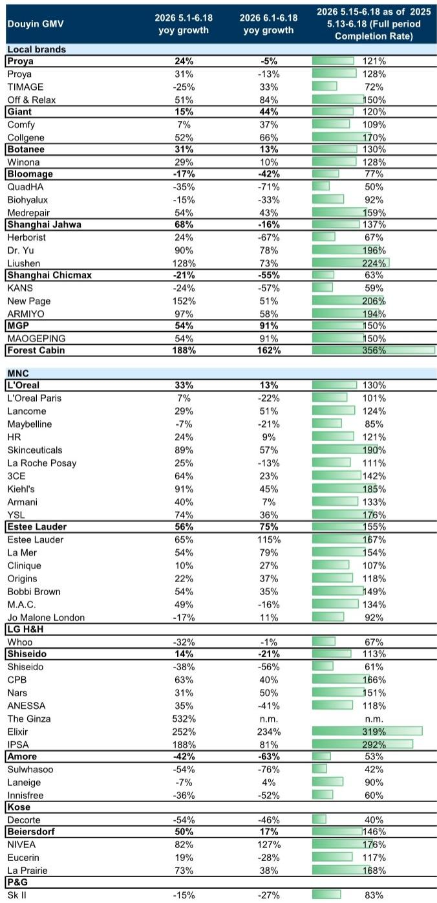
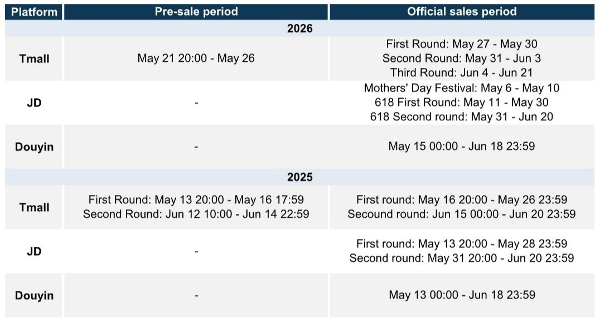
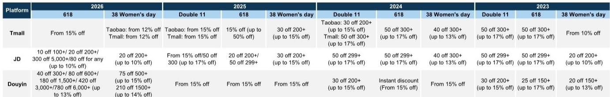

# GS：618大促揭示中国美妆市场真正的分水岭，不是国货与外资，而是高端与大众

市场对2026年618美妆大促的普遍解读，往往落入“国货崛起”或“外资反攻”的二元叙事。但GS这份最新发布的618抖音渠道脉冲检查报告，揭示了一个更深层、也更值得产业决策者关注的信号：真正的分水岭不在于品牌国籍，而在于价格带。高端化正在从趋势变为结构性力量，而这一力量的受益者，并非所有高端品牌。

这份报告的数据窗口覆盖2026年5月1日至6月18日，聚焦抖音平台。抖音作为当前中国美妆线上增长最快的渠道，其表现往往领先于天猫和京东，成为品牌战略调整的先行指标。GS的追踪数据显示，抖音美妆Top 500品牌整体GMV同比增长约35%，但这一数字背后，是极度分化的格局：头部50个品牌增速高达约40%，而排名100名之后的品牌增速已回落至20%左右。市场正在加速集中，而集中的方向，是高端。

## 1. 外资高端品牌在抖音的“反攻”并非全面胜利，而是集团内部资源向高利润线集中

GS数据显示，在抖音Top 500品牌中，外资品牌在各个价格带的完成率普遍高于国产品牌，平均完成率约140%，而国产品牌约110%。但“外资”这个标签过于笼统。真正驱动外资整体表现的，是雅诗兰黛集团和欧莱雅集团旗下高端线的强势。

雅诗兰黛集团在抖音的2026年5月1日至6月18日GMV同比增长56%，其中雅诗兰黛主品牌增长65%，海蓝之谜增长54%，两者完成率分别高达167%和154%。欧莱雅集团整体增长33%，但驱动来自修丽可（增长89%，完成率190%）和YSL（增长74%，完成率176%），而大众品牌巴黎欧莱雅仅增长7%，美宝莲甚至下滑7%。

这意味着什么？外资巨头在抖音的增长，并非“全线复苏”，而是集团战略性地将资源、流量和折扣向高利润、高客单价的品牌倾斜。大众线在抖音的衰退，是集团主动选择的结果，而非被动失利。对于投资者而言，判断一家外资美妆集团在中国的前景，不应看其整体增速，而应拆解其高端线占比的变化趋势。高端线占比持续提升的公司，其盈利能力和品牌护城河才是真正在加强的。

## 2. 毛戈平是本次618最大的结构性赢家，但它的成功逻辑并非简单的“国货替代”

在所有覆盖的国产品牌中，毛戈平（MGP）的表现最为亮眼：抖音全周期GMV同比增长54%，6月1日至18日增速更是高达91%，完成率达到150%。GS在报告中明确将毛戈平列为首选买入标的，并指出其5月销售偏弱是公司主动的节奏控制，与双十一等大促期间的表现模式一致。

毛戈平的成功，不能简单地归因于“国货替代”或“情绪消费”。它的定价处于中高端价格带，核心单品售价在260-400元区间，直接与外资中高端品牌竞争。在抖音这个以低价和冲动消费闻名的渠道，毛戈平能够实现90%以上的6月增速，说明它已经建立起超越渠道特性的品牌认知和用户粘性。

更值得关注的是，在GS的分类中，国产高端品牌（如毛戈平）的线上增速，在2026年已经持续跑赢外资高端品牌。Exhibit 3的数据显示，国产高端品牌在2026年3月至5月的线上GMV增速分别为110%、40%和40%，而外资高端品牌同期仅为20%、20%和30%。这意味着，在高端化这条赛道上，中国品牌终于出现了具备结构性竞争力的玩家，而不再是仅仅依靠性价比在低端市场厮杀。

## 3. 大众市场正在经历“无声的失血”，国产品牌的规模优势正在被侵蚀

与高端市场的繁荣形成鲜明对比的，是大众市场的困境。GS的数据显示，在抖音Top 500品牌中，排名100名之后的品牌增速已降至20%左右，显著低于头部品牌。而具体到国产品牌，珀莱雅在5月1日至6月18日期间抖音GMV同比增长24%，但6月1日至18日已经转为下滑5%，完成率121%。上海家化虽然整体增长68%，但6月1日至18日下滑16%。上美股份（韩束）增长15%，但6月增速44%明显低于5月。

更严峻的信号来自华熙生物和上美集团。华熙生物旗下品牌整体下滑17%，其中夸迪下滑35%，润百颜下滑15%，完成率仅50%至92%。上美集团（一叶子等）下滑21%，完成率仅63%。这些曾经在直播电商时代凭借高性价比和流量打法快速崛起的品牌，正在失去增长动能。

大众市场的失血，本质上是因为抖音的流量成本持续上升，而大众品牌的客单价无法支撑更高的获客成本。当折扣力度和平台补贴趋于理性（GS报告指出，2026年618抖音和京东的折扣力度均小于去年），依赖低价和流量投喂的增长模式便难以为继。对于产业决策者而言，这意味着过去几年“所有品牌都能在抖音增长”的窗口期已经关闭。大众品牌如果不能快速向中高端迁移，或者找到极致的成本效率优势，将面临持续的份额流失。

## 4. 报告尚未完全回答的关键问题：天猫渠道的表现和补贴的真实影响

GS这份报告聚焦于抖音渠道，但明确指出，618大促中天猫和京东渠道同样重要。报告提到，618期间（5月+6月）的GMV约占二季度线上GMV的75%，占全年GMV的21%。抖音只是其中一个战场，天猫仍然是美妆品牌最大的线上阵地。

报告没有完全展开的几个关键问题包括：第一，天猫渠道的表现是否与抖音一致？尤其是毛戈平在抖音的高增长，是否以牺牲天猫渠道为代价？第二，报告提到“平台和政府的补贴”可能影响品牌的实际收入和利润率，但抖音数据无法反映折扣深度和退货率。第三，抖音的“完成率”指标是基于2025年同期数据，而2025年618的基数效应可能因疫情等因素存在扭曲，这一点需要进一步验证。

GS在报告末尾特别提到，将于6月22日举办一场化妆品专家电话会，重点讨论天猫渠道以及更全面的运营指标，包括折扣、平台和政府补贴、产品退货率等。这些信息对于判断品牌的实际盈利质量和增长可持续性至关重要。

## 5. 投资者和产业决策者应建立的新观察框架

基于这份报告，我们建议读者从以下三个维度重新审视中国美妆市场的竞争格局：

第一，从“国别标签”转向“价格带定位”。国货与外资的二元叙事已经过时。真正重要的是品牌处于哪个价格带。高端价格带（核心单品售价490元以上）正在成为增长和利润的核心来源，而大众价格带（150元以下）正在经历结构性压力。品牌是否具备向上升级的可能性，是判断其长期价值的首要标准。

第二，从“整体增速”转向“节奏控制能力”。毛戈平在5月销售偏弱、6月爆发，这种节奏控制能力是品牌运营成熟度的体现。相比那些在大促期间依赖一次性折扣冲量的品牌，能够主动管理销售节奏、平衡日常销售与大促表现的品牌，往往拥有更强的定价权和用户忠诚度。

第三，从“单一渠道”转向“跨渠道协同”。抖音的高增长能否转化为天猫和线下的长期品牌资产？如果品牌在抖音的增量主要来自低价促销和冲动消费，那么这种增长可能是“虚假繁荣”。真正的品牌建设，需要跨渠道的一致定价、产品体验和用户运营。

这份GS报告的价值，不仅在于提供了618大促的即时数据，更在于它揭示了中国美妆市场正在经历的一个结构性拐点：高端化不再是口号，而是正在通过渠道数据被量化的现实。而那些能够在这一趋势中建立差异化定位的品牌，无论是外资还是国货，都将获得超越周期的增长。

当然，抖音数据只是拼图的一部分。天猫的表现、补贴的实际影响、以及618过后日常销售的持续性，都是需要继续追踪的关键变量。GS在报告中提到的专家电话会，以及后续对天猫渠道的深入分析，将是验证这些判断的重要节点。

欢迎来星球微信群里继续讨论：抖音数据之外，天猫渠道的竞争格局如何？补贴退坡后哪些品牌会最先承压？我们会在社群中分享完整的研报原始图表和专家电话会的核心纪要。

Personal reading notes and learning share only. Not investment advice.

