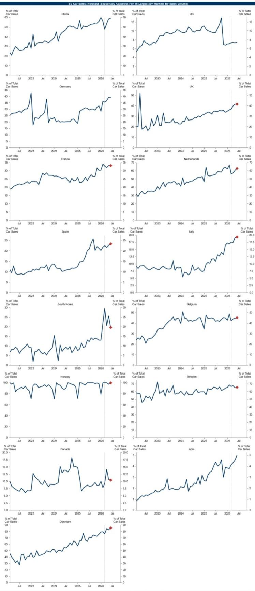
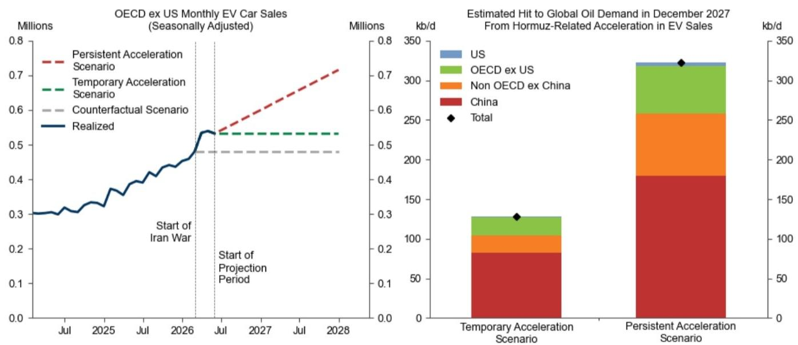
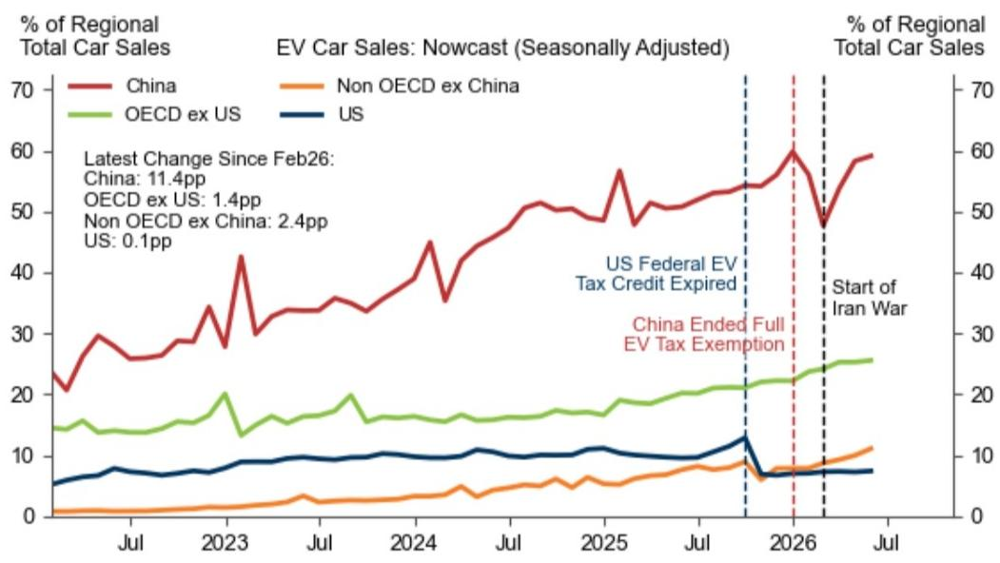

# The Hormuz Shock Is Reshaping Oil Demand Faster Than Models Predicted — And EVs Are the Mechanism

The conventional wisdom has long held that oil demand responds slowly to price shocks, constrained by infrastructure, consumer habits, and the glacial pace of fleet turnover. That wisdom is being tested — and may be breaking down. A global investment bank's latest nowcast reveals that since the onset of the Hormuz Strait supply disruption, EV car sales penetration has surged by 3.4 percentage points, reaching an all-time high of 26.1 percent. This is not a marginal uptick. It is a structural acceleration occurring across 12 of the 15 largest EV markets, led by China's extraordinary 11.4 percentage point gain. The implication is direct and consequential: the oil demand destruction from this single channel could reach 0.13 to 0.32 million barrels per day by December 2027, depending on whether the acceleration persists. But these headline numbers, while striking, understate the strategic risk. The report's framework captures only the flow of new passenger car sales, omitting the stock substitution already underway and the massive two- and three-wheeler EV fleets in Asia. The true demand hit is likely larger, and the analytical question is not whether oil demand will be lower, but how much lower and for how long.

This matters now because the Hormuz shock has created a rare natural experiment. For the first time in a decade, a supply-driven price spike is colliding with a rapidly maturing EV ecosystem. Previous oil price surges — 2008, 2011-2014 — occurred when EVs were negligible. Today, the technology is viable, the supply chains are scaled, and consumer adoption is accelerating not in spite of high fuel prices, but because of them. The report's data shows this is not a China-only story. The OECD and non-OECD ex-China regions contributed 21 percent and 19 percent respectively to the global penetration increase. The pattern is broad-based, and that breadth suggests a regime shift, not a temporary blip.

The strategic challenge for investors, policymakers, and energy executives is that existing demand models were calibrated in a world without a credible EV alternative. They systematically underestimate the elasticity of demand substitution during a supply crisis. The report provides a rigorous starting point, but its scenarios raise deeper questions about how quickly behavioral change can compound into structural demand loss.

## The Acceleration Is Real, Broad, and Concentrated in the Markets That Matter Most for Oil Demand Growth

The nowcast methodology reveals a clean and compelling pattern. Since February 2026, global EV car sales penetration has risen from approximately 22.7 percent to 26.1 percent. This is not a seasonal artifact or a statistical quirk. The report explicitly excludes the September 2025 US surge driven by tax credit expiry, ensuring the current acceleration is measured against a clean baseline. The 3.4 percentage point gain in roughly four months represents a pace of adoption that most forecast models did not anticipate until 2028 or later.

China is the gravitational center of this shift, with penetration rising by 11.4 percentage points. This is not merely a function of China's large auto market. It reflects a specific policy and behavioral response: Chinese consumers, facing elevated fuel costs and a mature charging infrastructure, are substituting at a rate that has surprised even bullish observers. The report notes that China's gasoline and related products sales volumes have dropped just over 20 percent year-over-year, while EV charging volumes have surged. This is not a forward-looking signal; it is realized demand destruction happening now.

Equally important is the breadth of the acceleration. Of the 15 largest EV markets, 12 recorded higher penetration. South Korea's February surge was policy-driven, but the consistency across Europe, North America, and Asia suggests a common driver: high oil prices are accelerating a transition that was already underway. The report's decomposition shows China driving 61 percent of the global increase, with OECD and non-OECD ex-China splitting the remainder. This distribution matters because it means the demand risk is not concentrated in a single vulnerable market. It is systemic.

## The Demand Impact Is Meaningful Today, But the Stock Effect Will Compound Over Time

The report's central estimate — a 0.13 to 0.32 mb/d hit to global oil demand by December 2027 — is derived from a rule-of-thumb: every 1 million shift in sales from internal combustion engine to EV cars lowers road oil demand by 30 kb/d in the US and 20 kb/d elsewhere. Under the "Temporary Acceleration" scenario, where penetration rates flatten at May 2026 levels, the hit is 0.13 mb/d. Under the "Persistent Acceleration" scenario, where current trends continue, it reaches 0.32 mb/d.

These numbers are analytically sound, but they are also conservative. The report explicitly acknowledges two critical omissions. First, it only measures additions to the stock of passenger cars. It does not capture substitution within the existing stock, where high fuel prices are driving consumers to drive less, use public transit, or scrap older ICE vehicles earlier than planned. The 20 percent year-over-year drop in China's gasoline sales volumes is evidence that stock substitution is already material. Second, the report excludes non-passenger car EVs — the two- and three-wheelers that dominate markets like India (92 percent of EV sales), Vietnam (80 percent), and China (35 percent). Each two- or three-wheeler displaces one-third to one-half of the fuel that a passenger car EV displaces. In aggregate, this is a large and growing source of demand erosion that the report's framework does not capture.

The strategic implication is that the 0.13-0.32 mb/d range should be viewed as a floor, not a central estimate. If stock substitution and non-passenger EVs are included, the total demand hit could be 50 to 100 percent larger. For an oil market already facing a 1.5 mb/d persistent loss in the downside scenario, even an additional 0.5 mb/d from EVs would be sufficient to push Brent into the mid-$50s per barrel, as the report's downside scenario suggests.

## The Report's Scenarios Are Useful, But They Leave a Critical Analytical Gap

The report constructs two scenarios: Temporary Acceleration and Persistent Acceleration. The former assumes regional penetration rates flatline at May 2026 levels. The latter assumes linear growth along recent trends, with a gradual slowdown for China after August 2026 but continued growth for the rest of the world through December 2027. Both scenarios assume total passenger car sales remain flat at the February-May 2026 average.

These are reasonable modeling choices, but they leave an important question unanswered: what determines persistence? The report does not model the feedback loop between oil prices, EV adoption, and oil demand. If the Hormuz disruption persists and oil prices remain elevated, EV penetration could accelerate further as consumers and fleet operators make irreversible purchase decisions. Conversely, if the disruption resolves quickly and prices fall, the acceleration could stall. But the report does not specify the oil price threshold at which the acceleration would reverse, nor does it account for the fact that once a consumer buys an EV, that demand is lost for the vehicle's lifetime, regardless of future oil prices.

This gap is not a weakness of the report; it is a frontier for further analysis. The report provides the data and the methodology. What it does not provide is a dynamic model linking oil prices to EV adoption rates over time. For investors trying to position for 2027-2030, this is the missing piece. The report's downside scenario assumes a 1.5 mb/d persistent loss from Hormuz, with EVs as one channel. But if the EV channel is itself endogenous to the oil price, the actual demand loss could be larger or smaller depending on how the supply shock evolves.

## A Decision Framework for Navigating the EV-Oil Demand Nexus

For strategists and portfolio managers, the report's insights can be translated into a three-part decision framework.

First, monitor the EV penetration nowcast as a leading indicator for oil demand. The report demonstrates that EV sales data is available at a high frequency and can be nowcasted in near real-time. This is more actionable than waiting for quarterly oil demand statistics. Investors should track the monthly EV penetration rate, particularly in China and the top 15 markets. If the current trend continues for another three to six months, the Persistent Acceleration scenario becomes the base case, and the downside oil price scenario becomes more probable.

Second, reassess the elasticity of oil demand to price shocks. The report's data suggests that the short-run price elasticity of oil demand is higher than most models assume, because consumers now have a viable substitution technology. This has implications for long-term oil price forecasts, refinery margins, and the valuation of upstream assets. If the demand response to a supply shock is larger and faster than historically, the risk premium on oil prices should be lower in the long run, all else equal.

Third, distinguish between the flow effect and the stock effect. The report focuses on flow — new car sales. But the stock effect — the cumulative impact of millions of EVs on the road — will compound over time. Even if the acceleration proves temporary, the EVs sold in 2026 will displace oil demand for a decade or more. The report's 0.13 mb/d Temporary Acceleration estimate is a flow impact; the cumulative stock impact by 2030 could be two to three times larger. Investors should model both.

## The Unanswered Questions That Make the Full Report Essential

The report provides a rigorous and timely analysis, but it deliberately leaves several questions open. How would the EV acceleration change if the Hormuz disruption escalates further? What is the oil price threshold at which the acceleration would reverse? How large is the non-passenger car EV effect in India and Southeast Asia? What is the policy response in oil-exporting countries that may accelerate their own EV adoption as a hedge? These are not gaps in the report; they are invitations to deeper analysis.

The report's framework is a starting point, not a conclusion. The data is clear: EV adoption is accelerating in response to the Hormuz shock, and this will reduce oil demand. The magnitude of that reduction depends on persistence, which depends on oil prices, which depend on geopolitics, which depend on demand. The circularity is the analytical challenge. The report provides the tools to address it.

Join the community to read the full report and review the original charts.

*This article is for learning and discussion only and does not constitute investment advice.*

Personal reading notes and learning share only. Not investment advice.

