Global Video Gaming

# Global Video Gaming: The State of Play, 2026 - a deep dive on global industry trends

Robin Zhu

+852 2123 2659

robin.zhu@bernsteinsg.com

Charles Gou

+852 2123 2618

charles.gou@bernsteinsg.com

Min-Joo Kang

+852 2123 2644

minjoo.kang@bernsteinsg.com

Hyrum Caesar

+81 3 6777 6979

hyrum.caesar@bernsteinsg.com

We estimate \$220bn of industry revenue in 2026. This note represents our annual deep dive on global video gaming industry revenues. While we typically argue video gaming assets are best analysed bottom-up, there is value in maintaining some top-down perspective. We also zoom in on some key industry debates.

The back half of the capital cycle. Our global video gaming industry model incorporates top-down estimates by platform and region, and our quarterly tracker of revenue trends across 28 listed video gaming companies. For 2025, we estimated \$218bn of industry revenue, 4.8% higher year on year. We've modelled 0.7% growth in 2026, followed by 3.3% growth in 2027. But the bigger story is consolidation across the industry, with the listed cohort expected to grow c. 7-8% this year, and a growing number of (overdue) Western studio closures thinning the competitive landscape.

Could GTA VI be a clearing event for the industry? Our main takeaway from summer showcase season was simply the extent to which the industry's desire to avoid competing with GTA VI had forced everyone into a logjam of new game releases in September. The crowding raises the risk of near-term sales disappointments, especially for games not backed by strong developer or IP credibility. But with investor expectations for GTA VI seemingly now ranging from bullish to biblical, we increasingly think November could be a turning point for sentiment and investor positioning elsewhere.

The argument for continued PC strength. The Chinese PC gaming market grew 15% in 2025, after Black Myth Wukong introduced gamers to experiences on larger screens. We think similar growth acceleration is likely across the broader industry, as GPU VRAM inside “typical” home PCs come to support PS4/PS5-era games, and as console and mobile developers embrace multi-platform launches. The memory headwind for console hardware persists - the hope for Nintendo is that a stronger 2027 slate (Pokemon, Xenoblade, Mario...?) will make price increases more palatable, should the need arise again.

Mobile platform fee cuts and broader questions. On March 4, 2026, Google announced it would cut Android platform fees from 30% to 20% over an 18-month period. On March 13, 2026, Apple announced it would cut iOS platform fees to 25%. Looking ahead, with these platforms maturing in terms of traffic growth and lawsuits ongoing in several jurisdictions, we think the direction of platform fees remains lower—to the benefit of content creators. Our base case is publishing and second-party relationships do not see meaningful change in the foreseeable future.

AI disruption fears are still misguided. It's clear the industry is starting to find ways to leverage AI to accelerate development. Meanwhile, the fact IP strength and community visibility represent key drivers of engagement for new launches probably represents the best argument against AI disruption ...in addition to the complexity of game development beyond creating 3D worlds, and the creative nature of original storytelling. While the number of new games released on Steam rose from 8,100 in 2019 to 21,400 in 2025, the number of titles with over 5k reviews went from 73 to... 72.

## BERNSTEIN TICKER TABLE

<table><tr><td rowspan="3">Ticker</td><td rowspan="3">Rating</td><td colspan="4">18 Jun 2026</td><td rowspan="2">TTMRel.</td><td colspan="4">Reported EPS</td><td colspan="3">Reported P/E (x)</td></tr><tr><td></td><td rowspan="2">ClosingPrice</td><td rowspan="2">PriceTarget</td><td rowspan="2">Perf.</td><td></td><td></td><td></td><td></td><td></td><td></td><td></td></tr><tr><td>Cur</td><td>Cur</td><td>2025A</td><td>2026E</td><td>2027E</td><td>2025A</td><td>2026E</td><td>2027E</td><td></td></tr><tr><td>7832.JP (Bandai Namco)</td><td>M</td><td>JPY</td><td>3,631.00</td><td>4,700.00</td><td>(76.3)%</td><td>JPY</td><td>217.49</td><td>206.36</td><td>223.90</td><td>16.7</td><td>17.6</td><td>16.2</td><td></td></tr><tr><td>9697.JP (Capcom)</td><td>O</td><td>JPY</td><td>2,838.50</td><td>4,600.00</td><td>(91.0)%</td><td>JPY</td><td>115.85</td><td>130.50</td><td>153.47</td><td>24.5</td><td>21.8</td><td>18.5</td><td></td></tr><tr><td>9766.JP (Konami)</td><td>O</td><td>JPY</td><td>17,375</td><td>26,800</td><td>(71.4)%</td><td>JPY</td><td>551.00</td><td>737.79</td><td>896.16</td><td>31.5</td><td>23.5</td><td>19.4</td><td></td></tr><tr><td>3659.JP (Nexon)</td><td>O</td><td>JPY</td><td>2,223.50</td><td>3,000.00</td><td>(71.8)%</td><td>JPY</td><td>160.90</td><td>114.12</td><td>156.63</td><td>13.8</td><td>19.5</td><td>14.2</td><td></td></tr><tr><td>7974.JP (Nintendo)</td><td>O</td><td>JPY</td><td>7,166.00</td><td>10,300</td><td>(96.5)%</td><td>JPY</td><td>364.51</td><td>350.74</td><td>423.85</td><td>19.7</td><td>20.4</td><td>16.9</td><td></td></tr><tr><td>9684.JP (Square Enix)</td><td>M</td><td>JPY</td><td>2,465.50</td><td>2,550.00</td><td>(80.0)%</td><td>JPY</td><td>82.08</td><td>106.81</td><td>121.75</td><td>30.0</td><td>23.1</td><td>20.3</td><td></td></tr><tr><td>6758.JP (Sony)</td><td>M</td><td>JPY</td><td>3,250.00</td><td>3,500.00</td><td>(59.3)%</td><td>JPY</td><td>171.30</td><td>198.75</td><td>207.66</td><td>19.0</td><td>16.4</td><td>15.7</td><td></td></tr><tr><td>700.HK (Tencent)</td><td>O</td><td>HKD</td><td>440.20</td><td>780.00</td><td>(58.6)%</td><td>CNY</td><td>28.09</td><td>30.00</td><td>34.91</td><td>13.5</td><td>12.7</td><td>10.9</td><td></td></tr><tr><td>NTES (NetEase)</td><td>O</td><td>USD</td><td>121.33</td><td>150.00</td><td>(31.4)%</td><td>CNY</td><td>58.02</td><td>62.29</td><td>66.77</td><td>14.2</td><td>13.2</td><td>12.3</td><td></td></tr><tr><td>9999.HK (NetEase)</td><td>O</td><td>HKD</td><td>190.50</td><td>235.00</td><td>(53.3)%</td><td>HKD</td><td>12.59</td><td>14.24</td><td>15.33</td><td>15.1</td><td>13.4</td><td>12.4</td><td></td></tr><tr><td>JPL</td><td></td><td></td><td>2,676.74</td><td></td><td></td><td></td><td></td><td></td><td></td><td></td><td></td><td></td><td></td></tr><tr><td>ASIAX</td><td></td><td></td><td>2,048.07</td><td></td><td></td><td></td><td></td><td></td><td></td><td></td><td></td><td></td><td></td></tr><tr><td>SPX</td><td></td><td></td><td>7,500.58</td><td></td><td></td><td></td><td></td><td></td><td></td><td></td><td></td><td></td><td></td></tr></table>

O - Outperform, M - Market-Perform, U - Underperform, NR - Not Rated, CS - Coverage Suspended  
700.HK, NTES, 9999.HK estimate is Adjusted EPS; 700.HK, NTES, 9999.HK valuation is Adjusted P/E (x); 7832.JP, 7974.JP, 9684.JP base year is 2026; 3659.JP base year is 2024;  
Source: Bloomberg, Bernstein estimates and analysis.

## INVESTMENT IMPLICATIONS

This note represents our annual top-down look at global video gaming industry growth. We estimated \$218bn of total video gaming industry revenue in 2025, 4.8% higher year on year. For 2026, we've modelled 0.7% growth, with PC replacing console as the fastest growing segment within the industry. Within this, the listed cohort of companies should do better, though cannibalisation during a busy September and subsequently over the GTA VI launch will be worth watching. For 2027 we've modelled industry revenue to rise 3.3% year on year.

At the industry level, the bigger story is arguably market share consolidation, long overdue studio closures in Western markets contributing to what should be a more favourable part of the capital cycle. The fact that home PCs are becoming increasingly gaming-ready (e.g. with 8-12Gb of VRAM, or better) should continue to drive adoption growth in new markets. Capcom was an early mover identifying the growth potential of the PC market, and we expect other companies with competitive catalog game libraries to benefit too (see also Square Enix launching its back catalog on the Switch 2). Console, on the other hand, continues to face memory cost headwinds. Global mobile gaming revenues grew 0.1% year on year in Q1 2026, and we model another year of low single-digit growth this year. 2027 should be a year of faster top-down growth across the global video gaming industry, as GTA VI vacates the launch runway.

Competitively, we remain attracted to the idea that the availability and lower cost of skilled labour in Asia means the top developers in Japan, Korea, and China can continue to take share from large, listed Western peers. Pragmatic AI views help too - the extent to which Japanese video gaming developers have taken to AI adoption was one of the more notable takeaways from recent travels in Japan. For all the talk of AI disrupting gaming, we'd expect ownership of tier-one IP and live service franchises to remain the key to achieving visibility in a crowded market. Even as the supply of new game launches in the industry has exploded, the number of games on Steam which generated more than 5k reviews went from 73 in 2019 to... 72 in 2026.

## VALUATION COMPS TABLE

EXHIBIT 1: Japan Video Gaming: global valuation summary

<table><tr><td rowspan="2"></td><td rowspan="2">Rating</td><td rowspan="2">Price target</td><td rowspan="2">Last price</td><td rowspan="2">Crncy</td><td rowspan="2">Market cap (US$mn)</td><td colspan="3">PE</td><td colspan="3">EV/sales</td></tr><tr><td>FY3/27E</td><td>FY3/28E</td><td>FY3/29E</td><td>FY3/27E</td><td>FY3/28E</td><td>FY3/29E</td></tr><tr><td colspan="12">Japan Video Gaming</td></tr><tr><td>Nintendo</td><td>O</td><td>10,300</td><td>7,166</td><td>JPY</td><td>57,313</td><td>19.5x</td><td>16.1x</td><td>14.3x</td><td>2.4x</td><td>2.1x</td><td>2.0x</td></tr><tr><td>Capcom</td><td>O</td><td>4,600</td><td>2,839</td><td>JPY</td><td>9,400</td><td>19.5x</td><td>17.3x</td><td>15.7x</td><td>5.1x</td><td>4.6x</td><td>4.2x</td></tr><tr><td>Bandai Namco</td><td>M</td><td>4,700</td><td>3,631</td><td>JPY</td><td>14,551</td><td>18.2x</td><td>16.8x</td><td>15.8x</td><td>1.6x</td><td>1.4x</td><td>1.4x</td></tr><tr><td>Konami</td><td>O</td><td>26,800</td><td>17,375</td><td>JPY</td><td>15,491</td><td>22.1x</td><td>19.2x</td><td>17.3x</td><td>4.3x</td><td>3.9x</td><td>3.6x</td></tr><tr><td>Square Enix</td><td>M</td><td>2,550</td><td>2,466</td><td>JPY</td><td>5,631</td><td>24.1x</td><td>21.1x</td><td>19.0x</td><td>2.1x</td><td>1.9x</td><td>1.7x</td></tr><tr><td>Sony</td><td>M</td><td>3,500</td><td>3,250</td><td>JPY</td><td>120,455</td><td>16.4x</td><td>15.6x</td><td>14.0x</td><td>1.5x</td><td>1.4x</td><td>1.3x</td></tr><tr><td>Nexon</td><td>O</td><td>3,000</td><td>2,224</td><td>JPY</td><td>10,954</td><td>14.6x</td><td>15.7x</td><td>15.7x</td><td>2.0x</td><td>1.8x</td><td>1.7x</td></tr><tr><td>Koei Tecmo</td><td></td><td></td><td>1,433</td><td>JPY</td><td>2,991</td><td>13.8x</td><td>13.2x</td><td>12.4x</td><td>4.9x</td><td>4.7x</td><td>4.5x</td></tr><tr><td>Sega Sammy</td><td></td><td></td><td>2,130</td><td>JPY</td><td>2,826</td><td>11.4x</td><td>9.8x</td><td>9.3x</td><td>0.9x</td><td>0.8x</td><td>0.8x</td></tr><tr><td>Kadokawa</td><td></td><td></td><td>3,184</td><td>JPY</td><td>2,947</td><td>50.0x</td><td>29.3x</td><td>28.2x</td><td>1.3x</td><td>1.2x</td><td>1.2x</td></tr><tr><td colspan="12">China Video Gaming</td></tr><tr><td>Tencent</td><td>O</td><td>780</td><td>440.20</td><td>HKD</td><td>511,570</td><td>12.8x</td><td>11.0x</td><td>9.5x</td><td>4.2x</td><td>3.6x</td><td>3.2x</td></tr><tr><td>NetEase</td><td>O</td><td>150</td><td>120.90</td><td>USD</td><td>77,150</td><td>13.3x</td><td>12.4x</td><td>11.7x</td><td>3.1x</td><td>2.8x</td><td>2.7x</td></tr><tr><td colspan="12">Global Video Gaming</td></tr><tr><td>EA</td><td></td><td></td><td>203.02</td><td>USD</td><td>50,908</td><td>23.5x</td><td>22.8x</td><td>21.1x</td><td>6.2x</td><td>6.1x</td><td>5.8x</td></tr><tr><td>Take Two</td><td></td><td></td><td>228.03</td><td>USD</td><td>42,338</td><td>58.3x</td><td>34.8x</td><td>23.1x</td><td>6.5x</td><td>5.1x</td><td>4.7x</td></tr><tr><td>Unity</td><td></td><td></td><td>26.47</td><td>USD</td><td>11,555</td><td>25.6x</td><td>19.7x</td><td>16.0x</td><td>5.6x</td><td>4.9x</td><td>4.3x</td></tr><tr><td>Roblox</td><td></td><td></td><td>48.02</td><td>USD</td><td>34,510</td><td>n.a.</td><td>n.a.</td><td>n.a.</td><td>5.4x</td><td>4.4x</td><td>3.7x</td></tr><tr><td>Ubisoft</td><td></td><td></td><td>4.89</td><td>EUR</td><td>761</td><td>n.a.</td><td>n.a.</td><td>n.a.</td><td>0.7x</td><td>0.7x</td><td>0.6x</td></tr><tr><td>Paradox</td><td></td><td></td><td>124.50</td><td>SEK</td><td>1,371</td><td>20.7x</td><td>18.6x</td><td>16.8x</td><td>5.4x</td><td>5.2x</td><td>4.9x</td></tr><tr><td>Embracer</td><td></td><td></td><td>59.00</td><td>SEK</td><td>1,408</td><td>17.3x</td><td>10.4x</td><td>7.9x</td><td>0.6x</td><td>0.6x</td><td>0.6x</td></tr><tr><td>CD Projekt</td><td></td><td></td><td>221.50</td><td>PLN</td><td>5,953</td><td>56.1x</td><td>17.3x</td><td>14.1x</td><td>25.3x</td><td>8.0x</td><td>7.1x</td></tr></table>

Source: Corporate reports, Bloomberg, Bernstein estimates and analysis.

## DETAILS

## THE STATE OF VIDEO GAMING, 2026

Our analysis of the global video gaming industry predominantly focuses on bottom-up drivers like new game launch success rather than top-down factors. The stocks we cover trade (at least over shorter time horizons) around growth visibility and changes in product pipeline outlook. But equally, we think it's worth maintaining some perspective of the top-down state of the industry, especially when analysing the larger players in the space where growth rates are somewhat beholden to total video gaming engagement. In this note, we present the latest edition of our bottom-up model of global video gaming industry revenues, updated for December 2025 quarter reporting.

The 2024 and 2025 editions of this report can be found HERE and HERE.

## We estimate \$218bn of global video gaming revenue in 2025

A variety of third-party estimates exist for global video gaming revenues, notably including Newzoo and IDC. Circana publishes estimates for the US, which we've referred to in our coverage of the Japan video gaming sector. The purpose of building our own model (other than as proof of work, and a way to improve our understanding of how the numbers come about) has been to maintain estimates of industry breakdowns, for example: revenues by platform (mobile, console, PC), then by region, and by region by platform.

Globally, we estimate total industry revenues reached US\$218bn in 2025, which was 4.8% higher versus US\$208bn in 2024 (the latter is marginally higher than our estimate a year ago, partly reflecting mobile billings data changes post Sensor Tower acquiring Data.ai, and minor changes to our Xbox estimates). Looking back, this was slightly higher than the 4.7% growth we'd modelled a year ago... with mobile (+0.3% versus +2% expected) and console (+9.8% versus +11.4%) growth coming in slightly lower than we'd modelled, but PC surprising meaningfully to the upside (we've assumed +8.4% growth, compared with our previous modelling for +3%).

In hindsight, 2025 still feels like the first year after the sector fully cycled the post-Covid period of surging then normalising engagement. We had reasoned on the back of the Black Myth Wukong success in 2024 that the PC market would see accelerated growth in China. The subsequent evidence has exceeded our expectations both in China and more broadly in the global video gaming market. 2025 was also the year of the Switch 2, which created a high comp the industry continues to cycle through - especially as high memory prices have put pressure on console hardware sales. But we're inclined to believe 2027 will be a better year top-down.

Our global video gaming industry revenues model is available on request.

## Bottom-up estimates by platform and region

Exhibit 2 and Exhibit 3 show our estimates of global industry revenues by platform, and by region. Referring primarily to Sensor Tower data, \$105bn of mobile revenue in 2025 was c. 48% of our total industry estimate, and was 0.3% higher year on year. We estimated \$71.9bn of total console gaming revenue last year, triangulating reporting from Nintendo, Sony, and Microsoft. The 9.8% growth this implied was led by the Switch 2 launch. PC is the hardest part of the industry to estimate bottom-up: here we've estimated US\$41.9bn of global revenue in 2025, just under 20% of the global total.

Exhibit 4 and Exhibit 5 show our estimates for industry revenue growth by platform and region. Exhibit 6 and Exhibit 7 show percentage breakdowns of global industry revenues by platform and by region. These breakdowns tend to change only modestly year to date—Asia is very mobile-centric (although the recent surge in PC growth in China has been notable), while PC and console represent the majority of US and European revenues.

EXHIBIT 2: We estimate global video gaming revenue reached US\$218bn in 2025, +4.8% year on year  
2017-2025: Global gaming market revenue by platform  
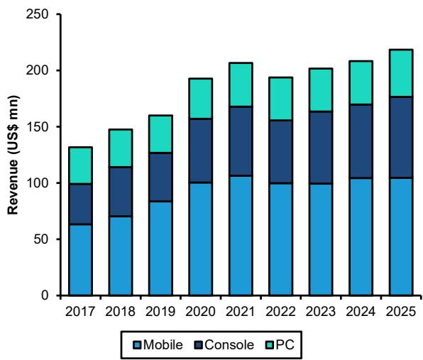  
Source: Corporate reports, IDC, Sensor Tower, VGChartz, Bernstein estimates and analysis.

EXHIBIT 3: Our video gaming model breaks down the global revenue pool by platform and by region  
2017-2025: Global gaming market revenue by region  
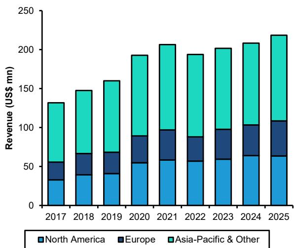  
Source: Corporate reports, IDC, Sensor Tower, VGChartz, Bernstein estimates and analysis.

EXHIBIT 4: 2025 was a strong year for console, helped by the Switch 2 launch  
2017-2025: Global gaming revenue growth by platform  
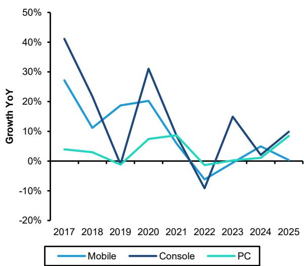  
Source: Corporate reports, IDC, Sensor Tower, VGChartz, Bernstein estimates and analysis.

EXHIBIT 5: North American growth stayed muted in 2025, while other regions rebounded  
2017-2025: Global gaming revenue growth by region  
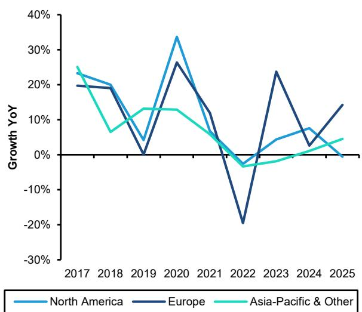  
Source: Corporate reports, IDC, Sensor Tower, VGChartz, Bernstein estimates and analysis.

2025: Global gaming market revenue by region

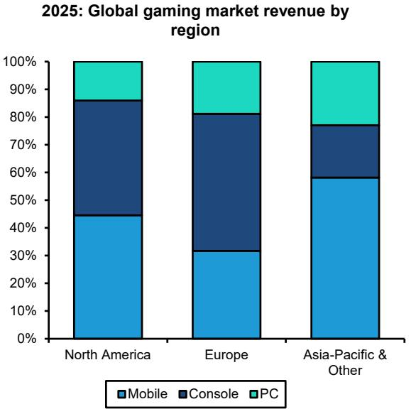  
Source: IDC, Sensor Tower, Data.ai, VGChartz, Bernstein estimates and analysis.

EXHIBIT 6: Asia-Pacific is mobile dominated, while console leads elsewhere  
EXHIBIT 7: Console is biggest in Europe and North America, while Asia dominates mobile and PC  
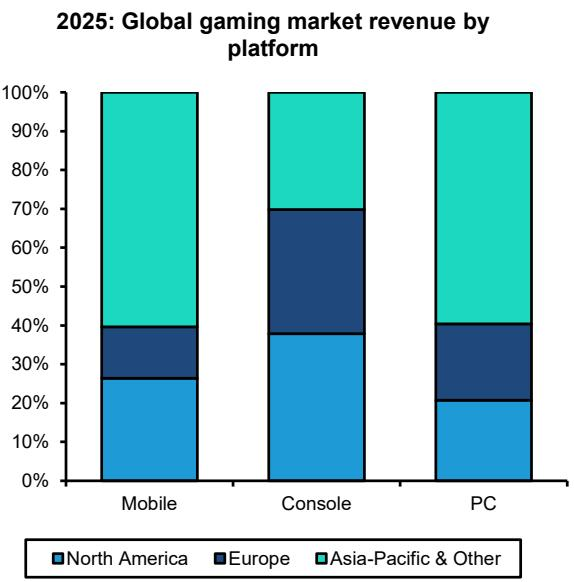  
Source: IDC, Sensor Tower, Data.ai, VGChartz, Bernstein estimates and analysis.

## WINNERS AND LOSERS IN 2025

Company-level growth in the industry continues to look highly bifurcated. We maintain a tracker of 28 listed video gaming companies (higher year on year due to the Embracer break-up), and compare their reported revenues both on an aggregated basis and compared with each other (see Exhibit 8 and Exhibit 9). As a group, the listed cohort of companies typically generates around 75-80% of our aforementioned estimate for total industry revenues. Within the group, the biggest drivers of incremental industry revenue in the 2025 calendar year included Tencent (Delta Force, broader evergreen growth), Nintendo (Switch 2 launch), followed by Roblox, Take-Two, and NetEase. Beyond the industry giants, Capcom (revenue +46.3%), Konami (+12.1%), Nexon (+7.7%), and CD Projekt (+8.6% excluding the GOG sale) had solid years... while the relative losers included a group of long-time stragglers (Square Enix, Embracer, NCSoft), or companies lapping high year on year comps (Bandai Namco post Nightreign).

Analytically, we expect the global video gaming industry to continue to be one where bottom-up analysis of new launch cycles and broader market share shifts (e.g. see the competitive shifts in the shooter genre last year) are more useful than top-down trends alone.

EXHIBIT 8: Tencent, Nintendo, and Roblox led incremental revenue growth in 2025 versus the prior year  
2025 vs. 2024: Global video gaming companies incremental revenue  
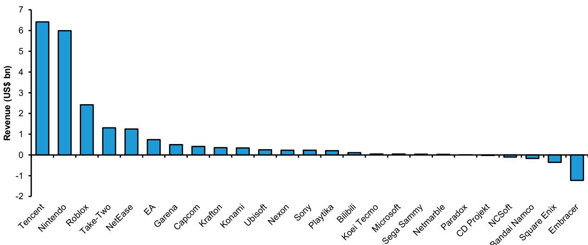  
Source: Corporate reports and Bernstein analysis.  
2025 vs. 2024: Global video gaming companies revenue growth

EXHIBIT 9: Nintendo, Roblox, and Capcom reported the fastest percentage growth last year, while Square Enix and Embracer were the worst performers in both absolute and percentage terms

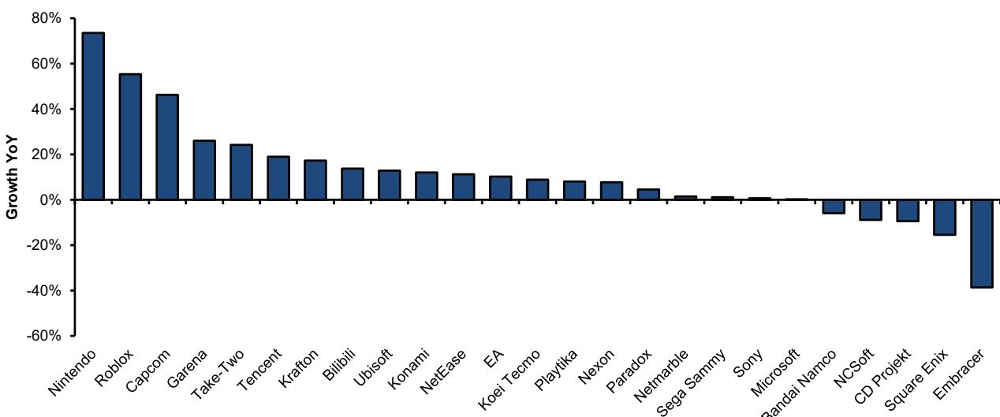  
Source: Corporate reports and Bernstein analysis.

## R&D cost and productivity, IP strength remain our north stars for success

Exhibit 10 and Exhibit 11 remain key influences on our outlook of competition in the global video gaming industry, with various East Asian developers enjoying significant labour cost and productivity advantages over Western peers. Meanwhile, the existence of tier-one IP and pre-existing fandom represents an important overlay when it comes to gauging the success of individual game launches. Exhibit 12 shows the latest tally of the 15 bestselling video game franchises globally measured by units sold, while Exhibit 13 shows the top 15 live service games by mean and median monthly concurrent users in 2025 (with an important caveat being that Fortnite is not accessible via Steam).

Bottom-up, Tencent and Konami in our coverage benefit the most from the self-reinforcing nature of competitive PVP games. Crimson Desert from Pearl Abyss was a recent example in which Asian developers (presumably working around the clock after a rough launch...) were able to iterate rapidly in response to gamer feedback, and achieve subsequent success. Neverness to Everness felt like the latest demonstration of the scale and scope that Chinese developers have been able to achieve in live service games, which we expect many Western peers to struggle to match.

Happily for investors, the wave of video gaming studio shutdowns in the Western industry (reflecting both uncompetitive labour costs and broader sociopolitical issues) reflects the industry gradually moving to what should be a more favourable part of the capital cycle after a flood of investment into the cycle in the post-Covid years (see Exhibit 14).

EXHIBIT 10: We’ve updated our tally of R&D expenses per employee across the global video gaming industry...

2025: Global video game companies R&D expenses per employee

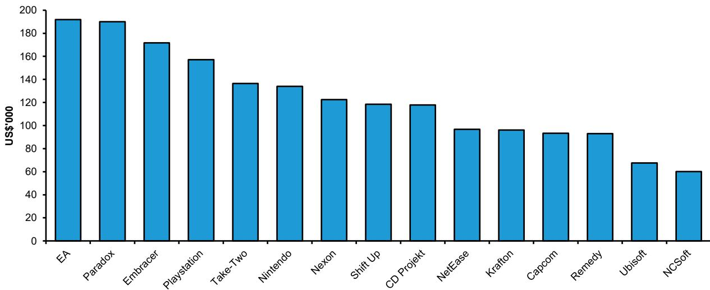  
Source: Corporate reports, Bernstein estimates and analysis.

EXHIBIT 11: ...the fact Asian developers have a fraction of the unit R&D costs of Western peers continues to influence our views on competitive outcomes in the coming years

2025: Global video gaming companies estimated R&D expenses per hour

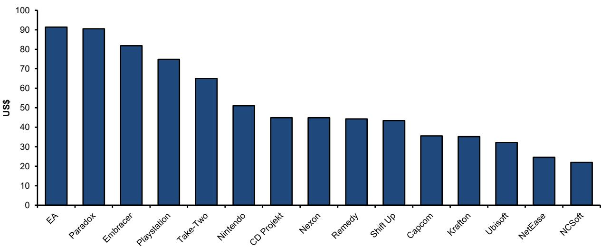  
Source: Corporate reports, Bernstein estimates and analysis.

EXHIBIT 12: The companies we cover own some of the world's top IPs, an important input into video game sales success  
Top 15 bestselling game franchises on VGChartz  
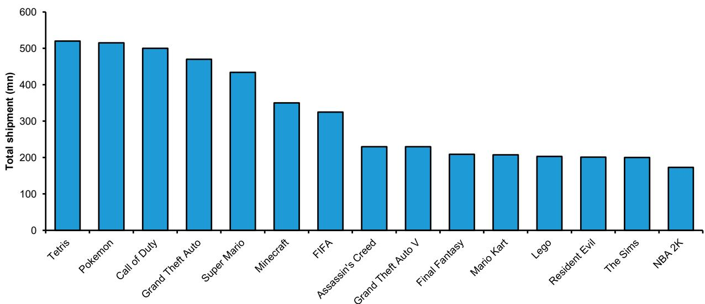  
Source: VGChartz and Bernstein analysis.

EXHIBIT 13: The live service game scene is dominated by a collection of shooter franchises  
2025: Top 15 live service games on Steam — mean vs median monthly CCU  
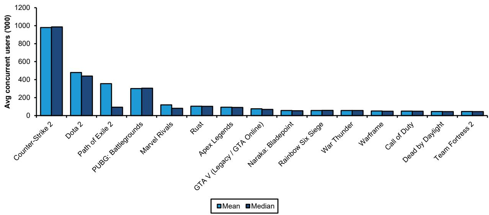  
Source: Steam DB and Bernstein analysis.

EXHIBIT 14: The ongoing wave of video gaming studio shutdowns in Western markets was overdue in our view, and should help to move the industry to a more favourable part of the capital cycle

<table><tr><td>Studio</td><td>Parent company</td><td>Notable games</td></tr><tr><td>Ballistic Moon</td><td>Ballistic Moon</td><td>Until Dawn remake</td></tr><tr><td>Coffee Stain Malmö</td><td>Coffee Stain</td><td>Valheim, Goat Simulator</td></tr><tr><td>Cliffhanger Games</td><td>Electronic Arts</td><td>Black Panther</td></tr><tr><td>Eidos Montreal</td><td>Embracer</td><td>Tomb Raider, Deus Ex, Marvel&#x27;s Guardians of the Galaxy</td></tr><tr><td>Toadman Interactive</td><td>Enad Global 7</td><td>Immortal: Unchained</td></tr><tr><td>Atomic Arcade</td><td>Hasbro</td><td></td></tr><tr><td>Counterplay Games</td><td>Independent</td><td>Godfall, Duelyst</td></tr><tr><td>Freejam</td><td>Independent</td><td>Robocraft, CardLife, Techblox</td></tr><tr><td>Intrepid Studios</td><td>Intrepid Studios</td><td>Ashes of Creation</td></tr><tr><td>Makea Games</td><td>Makea Games</td><td>Supermoves</td></tr><tr><td>Armature Studio</td><td>Meta</td><td>ReCore, Resident Evil 4 VR</td></tr><tr><td>Sanzaru Games</td><td>Meta</td><td>Sly Cooper: Thieves in Time, Asgard&#x27;s Wrath, Sonic Boom: Shattered Crystal</td></tr><tr><td>Twisted Pixel Games</td><td>Meta</td><td>Splosion Man, Comic Jumper, LocoCycle, The Gunstringer</td></tr><tr><td>Arkane Austin</td><td>Microsoft</td><td>Redfall</td></tr><tr><td>Compulsion Games</td><td>Microsoft</td><td>South of Midnight</td></tr><tr><td>Double Fine</td><td>Microsoft</td><td>Psychonauts</td></tr><tr><td>Ninja Theory</td><td>Microsoft</td><td>Senua Saga</td></tr><tr><td>Tango Gameworks</td><td>Microsoft</td><td>Hi-Fi- Rush</td></tr><tr><td>The Initiative</td><td>Microsoft</td><td>Perfect Dark</td></tr><tr><td>Spiders</td><td>Nacon</td><td>GreedFall, Steelrising, The Technomancer, Bound by Flame</td></tr><tr><td>Compass</td><td>nDreams</td><td></td></tr><tr><td>Near Light</td><td>nDreams</td><td>Shooty Fruity</td></tr><tr><td>Bad Brain Game Studios</td><td>NetEase</td><td>Unannounced AAA action title</td></tr><tr><td>Fantastic Pixel</td><td>NetEase</td><td></td></tr><tr><td>Nagoshi Studios</td><td>NetEase</td><td>Gang of Dragon</td></tr><tr><td>T-Minus Zero Entertainment</td><td>NetEase</td><td>Unannounced MMO</td></tr><tr><td>Bluepoint Games</td><td>Sony Interactive Entertainment</td><td>Demon&#x27;s Souls, Shadow of the Colossus</td></tr><tr><td>Dark Outlaw Games</td><td>Sony Interactive Entertainment</td><td>Internal studio</td></tr><tr><td>Firewalk Studios</td><td>Sony Interactive Entertainment</td><td>Concord</td></tr><tr><td>London Studio</td><td>Sony Interactive Entertainment</td><td></td></tr><tr><td>Studio Camelia</td><td>Studio Camelia</td><td>ALZARA: Radiant Echoes</td></tr><tr><td>Don&#x27;t Nod</td><td>Tencent</td><td></td></tr><tr><td>TiMi Montreal</td><td>Tencent</td><td></td></tr><tr><td>Wildlight Entertainment</td><td>Tencent</td><td>Highguard</td></tr><tr><td>The Outsiders</td><td>Tencent / Funcom</td><td>Metal: Hellsinger</td></tr><tr><td>Hypixel Studios</td><td>Tencent / Riot Games</td><td>Hytale</td></tr><tr><td>Ubisoft Halifax</td><td>Ubisoft</td><td>Assassin&#x27;s Creed Rebellion, Rainbow Six Mobile</td></tr><tr><td>Ubisoft Leamington</td><td>Ubisoft</td><td>DJ Hero, DJ Hero 2, Guitar Hero Live, Tom Clancy&#x27;s The Division series</td></tr><tr><td>Monolith Productions</td><td>Warner Bros.</td><td>Middle-earth: Shadow of Mordor, Middle-earth: Shadow of War, F.E.A.R.</td></tr><tr><td>Player First Games</td><td>Warner Bros.</td><td>MultiVersus</td></tr><tr><td>WB Games San Diego</td><td>Warner Bros.</td><td></td></tr><tr><td>Echtra Games</td><td>Zynga</td><td>Torchlight III</td></tr></table>

Source: Corporate reports and Bernstein analysis.

## WE MODEL 0.7% INDUSTRY GROWTH IN 2026, BETTER IN 2027

For 2026 we’ve modelled 0.7% industry growth, to a large extent reflecting console declines (see Exhibit 15 and Exhibit 16). We’ve modelled 1% mobile revenue growth this year, compared with 0.6% growth in Sensor Tower net billings in Q1 2026. The decline in mobile App Store platform fees represents a meaningful positive for mobile game developers, but is neutral from the perspective of industry revenues, which we present on a gross basis. Our console projections are driven chiefly by our own modelling for Nintendo and Playstation, and a slight haircut to street consensus for Microsoft’s gaming businesses. We’ve been consistently more bearish on Xbox’s prospects than the street, and maintain this view for 2026… though some of Xbox’s more recent moves like bringing back exclusivity do intrigue us. For PC, we’ve assumed 5% growth in 2026, which is admittedly somewhat hand-wavy. But the directional view that PC will grow faster than mobile and console should be uncontroversial.

## Industry market share is consolidating, enabling faster growth across the listed cohort

Exhibit 17 shows the latest data in our bottom-up tracker of reported revenues across 25 global listed video gaming companies. For 2025, aggregate revenues across the group reached \$174bn, c. 80% of our estimate of aggregate industry revenue. On a quarterly basis, the fastest growth came in the middle of the year, reflecting low 2024 comps, and the Switch 2 launch. For 2026, street consensus estimates point to expectations for 7.6% aggregate revenue growth. This strikes us as sensible for the most part, though clearly what happens with the GTA VI launch (hopefully on time in November) will represent a large swing factor. Exhibit 18 compares reported and projected revenue growth across our group of companies against 2018 and 2019 baselines. We’ve found this useful perspective as a measure of long-term growth rates, either side of Covid-era engagement. On this basis, 2025 and 2026 growth has continued to track either side of mid-single-digit annualised growth… with an uptick towards the end of 2026 likely reflecting GTA VI modelling.

## Could GTA VI be a clearing event for the rest of the industry?

For 2027 we model 3.3% industry growth. Lower comps aside, the expectation for faster growth next year reflects our view that console will look better with a larger Switch 2 installed base, but also that the industry will have a somewhat more “normal” year in terms of new release cadence, less likely to cause pockets of greater localised competition like in September this year. Exhibit 19 shows our count of the AAA game releases now lined up for September, reflecting the industry’s desire to avoid competing with the GTA VI release. Sony explicitly calls out the likelihood of the risk that GTA VI engagement will crowd out other games into year-end. Look further ahead though, and we expect 2027 to be a more “normal” year. The rebalancing of investor capital away from Take-Two after the GTA VI launch feels likely too, and may come to represent a tailwind for our coverage.

Exhibit 20 shows our updated tracking of new game releases across our Japan Video Gaming coverage.

EXHIBIT 15: We model 0.7% aggregate industry revenue growth in 2026, slower year on year to reflect Playstation hardware declines, and a higher base for Nintendo

2017-2027E: Global gaming industry revenue  
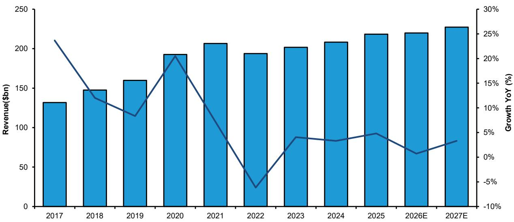  
Source: Corporate reports, Bloomberg, Bernstein estimates and analysis.

EXHIBIT 16: We model faster PC growth continuing in 2026, low-single digit growth mobile growth, and lower console revenue growth than in 2025

2017-2027E: Global gaming revenue growth by platform  
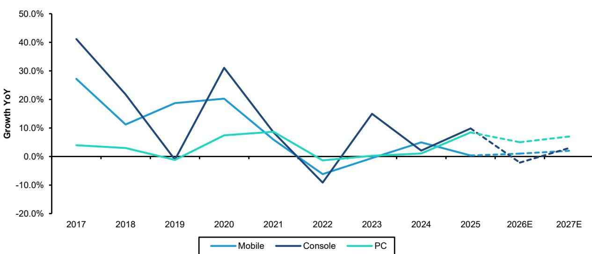  
Source: Corporate reports, IDC, Sensor Tower, VGChartz, Bernstein estimates and analysis.

EXHIBIT 17: Consensus forecasts point to slower growth in the next few quarters, followed by faster growth into year-end, partly reflecting the GTA VI launch

2020-2027E: Global listed video game companies aggregate revenue & growth

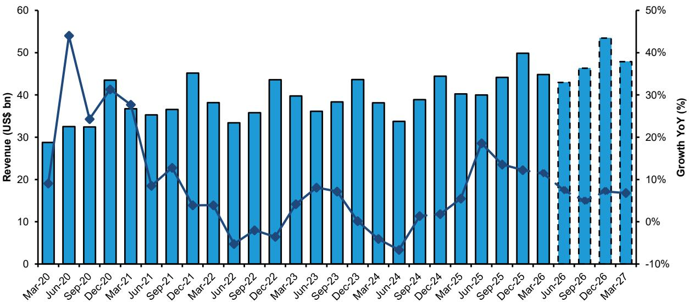  
Source: Bloomberg, corporate reports, Bernstein estimates and analysis.

EXHIBIT 18: In hindsight, mid-2024 was the trough of the post-Covid down cycle for video gaming industry revenue

2020-2027E: Global listed video game companies aggregate revenue CAGR  
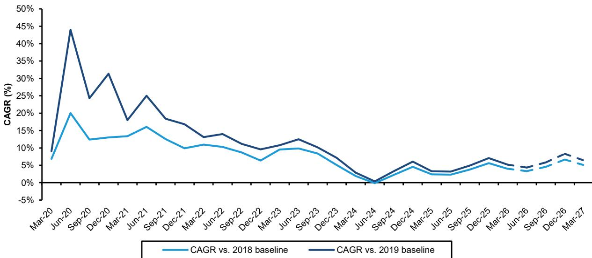  
Source: Bloomberg, corporate reports, Bernstein estimates and analysis.

EXHIBIT 19: The industry's desire to avoid competing with the GTA VI launch has contributed to a logjam of new games due for release in September

<table><tr><td rowspan="2">Game title</td><td rowspan="2">Developer</td><td colspan="4">Platform</td><td rowspan="2">Launch</td></tr><tr><td>PS5</td><td>Xbox</td><td>Switch</td><td>PC</td></tr><tr><td>The Blood of Dawnwalker</td><td>Rebel Wolves</td><td>√</td><td>√</td><td></td><td>√</td><td>Sep 3, 2026</td></tr><tr><td>Orbitals</td><td>Shapefarm</td><td></td><td></td><td>√</td><td></td><td>Sep 3, 2026</td></tr><tr><td>Halloween: The Game</td><td>III Fonic</td><td>√</td><td>√</td><td></td><td>√</td><td>Sep 8, 2026</td></tr><tr><td>Phantom Blade Zero</td><td>S-GAME</td><td>√</td><td></td><td></td><td>√</td><td>Sep 9, 2026</td></tr><tr><td>Takeover 2</td><td>Pelikan13</td><td></td><td></td><td></td><td>√</td><td>Sep 10, 2026</td></tr><tr><td>Marvel&#x27;s Wolverine</td><td>Insomniac Games</td><td>√</td><td></td><td></td><td></td><td>Sep 15, 2026</td></tr><tr><td>RuneScape Dragonwilds</td><td>Jagex</td><td>√</td><td>√</td><td>√</td><td>√</td><td>Sep 15, 2026</td></tr><tr><td>BloomKeeper</td><td>Resonance Interactive</td><td></td><td></td><td></td><td>√</td><td>Sep 16, 2026</td></tr><tr><td>Fire Emblem: Fortune&#x27;s Weave</td><td>Intelligent Systems</td><td></td><td></td><td>√</td><td></td><td>Sep 17, 2026</td></tr><tr><td>Another Eden Begins</td><td>Wright Flyer Studios</td><td></td><td></td><td>√</td><td>√</td><td>Sep 17, 2026</td></tr><tr><td>Trails in the Sky 2nd Chapter</td><td>Nihon Falcon</td><td>√</td><td></td><td>√</td><td>√</td><td>Sep 17, 2026</td></tr><tr><td>Warhammer 40,000: Dawn of War IV</td><td>King Art Games</td><td></td><td></td><td></td><td>√</td><td>Sep 17, 2026</td></tr><tr><td>Silent Hill: Townfall</td><td>Screen Burn</td><td>√</td><td></td><td></td><td>√</td><td>Sep 24, 2026</td></tr><tr><td>Control Resonant</td><td>Remedy Entertainment</td><td>√</td><td>√</td><td></td><td>√</td><td>Sep 24, 2026</td></tr><tr><td>Derby Stallion 2</td><td>Game Addict</td><td></td><td></td><td>√</td><td></td><td>Sep 24, 2026</td></tr><tr><td>Valor Mortis</td><td>One More Level</td><td>√</td><td>√</td><td></td><td>√</td><td>Sep 24, 2026</td></tr><tr><td>Onimusha: Way of the Sword</td><td>Capcom</td><td>√</td><td>√</td><td></td><td>√</td><td>Sep 25, 2026</td></tr><tr><td>Ace Combat 8: Wings of Theve</td><td>Bandai Namco</td><td>√</td><td>√</td><td></td><td>√</td><td>Sep 29, 2026</td></tr><tr><td>Minecraft Dungeons II</td><td>Mojang Studios</td><td>√</td><td>√</td><td>√</td><td>√</td><td>Sep 29, 2026</td></tr><tr><td>Archon Soul</td><td>PolyGryph</td><td></td><td></td><td></td><td>√</td><td>Sep 30, 2026</td></tr><tr><td>Rogue Reigns</td><td>Venn Studios</td><td>√</td><td>√</td><td>√</td><td>√</td><td>Sep, 2026</td></tr></table>

Source: Corporate reports, industry media, Bernstein estimates and analysis.

EXHIBIT 20: We've updated our tracking of new releases across our coverage, to reflect the summer showcases just gone

<table><tr><td rowspan="2">Game title</td><td rowspan="2">Developer</td><td colspan="5">Platform</td><td rowspan="2">Launch</td></tr><tr><td>PS5</td><td>Xbox</td><td>Switch</td><td>PC</td><td>Mobile</td></tr><tr><td colspan="8">NINTENDO</td></tr><tr><td>Star Fox</td><td>Nintendo</td><td></td><td></td><td>√</td><td></td><td></td><td>Jun 25, 2026</td></tr><tr><td>Rhythm Heaven Groove</td><td>Nintendo</td><td></td><td></td><td>√</td><td></td><td></td><td>Jul 2, 2026</td></tr><tr><td>Splatoon Raiders</td><td>Nintendo</td><td></td><td></td><td>√</td><td></td><td></td><td>Jul 23, 2026</td></tr><tr><td>Fire Emblem: Fortune&#x27;s Weave</td><td>Intelligent Systems</td><td></td><td></td><td>√</td><td></td><td></td><td>Sep 17, 2026</td></tr><tr><td>Nintendo Switch Sports: Resort</td><td>Nintendo</td><td></td><td></td><td>√</td><td></td><td></td><td>Oct 22, 2026</td></tr><tr><td>Zelda: Ocarina of Time (remake)</td><td>Nintendo</td><td></td><td></td><td>√</td><td></td><td></td><td>2026</td></tr><tr><td>Xenoblade Genesis</td><td>Monolith Soft</td><td></td><td></td><td>√</td><td></td><td></td><td>2027</td></tr><tr><td>Pokemon Winds &amp; Waves</td><td>Game Freak</td><td></td><td></td><td>√</td><td></td><td></td><td>2027</td></tr><tr><td colspan="8">CAPCOM</td></tr><tr><td>Onimusha: Way of the Sword</td><td>Capcom</td><td>√</td><td>√</td><td></td><td>√</td><td></td><td>Sep 25, 2026</td></tr><tr><td>Megaman: Dual Override</td><td>Capcom</td><td>√</td><td>√</td><td>√</td><td>√</td><td></td><td>2027</td></tr><tr><td>Resident Evil Veronica</td><td>Capcom</td><td>√</td><td>√</td><td>√</td><td>√</td><td></td><td>2027</td></tr><tr><td>Monster Hunter Wilds: Ascendance</td><td>Capcom</td><td>√</td><td>√</td><td></td><td>√</td><td></td><td>2027</td></tr><tr><td>Monster Hunter Outlanders</td><td>Capcom</td><td></td><td></td><td></td><td></td><td>√</td><td>TBD</td></tr><tr><td>Okami 2</td><td>Capcom</td><td></td><td></td><td></td><td></td><td></td><td>TBD</td></tr><tr><td colspan="8">BANDAI NAMCO</td></tr><tr><td>Bleach Mirrors High</td><td>Bandai Namco</td><td></td><td></td><td></td><td></td><td>√</td><td>Summer 2026</td></tr><tr><td>Captain Tsubasa 2: World Fighters</td><td>Tamsoft Corporation</td><td>√</td><td>√</td><td></td><td>√</td><td></td><td>Aug 27, 2026</td></tr><tr><td>The Blood of Dawnwalker</td><td>Rebel Wolves</td><td>√</td><td>√</td><td></td><td>√</td><td></td><td>Sep 3, 2026</td></tr><tr><td>Ace Combat 8: Wings of Theve</td><td>Bandai Namco</td><td>√</td><td>√</td><td></td><td>√</td><td></td><td>Sep 29, 2026</td></tr><tr><td>One Piece: Grand Gourmet</td><td>Bandai Namco</td><td></td><td></td><td>√</td><td>√</td><td>√</td><td>Oct 23,2026</td></tr><tr><td>Gundam Rogue Orbit</td><td>Bandai Namco</td><td>√</td><td>√</td><td></td><td>√</td><td></td><td>2027</td></tr><tr><td>Dragon Ball: Xenoverse 3</td><td>Bandai Namco</td><td>√</td><td>√</td><td></td><td>√</td><td></td><td>2027</td></tr><tr><td>Fate/Extra Record</td><td>Typemoon</td><td>√</td><td>√</td><td>√</td><td>√</td><td></td><td>TBD</td></tr><tr><td colspan="8">KONAMI</td></tr><tr><td>eFootball Kick Off</td><td>Konami</td><td></td><td></td><td>√</td><td></td><td></td><td>Jun 3, 2026</td></tr><tr><td>Power Pros 2026-2027</td><td>Konami</td><td>√</td><td></td><td>√</td><td></td><td></td><td>Jun 11, 2026</td></tr><tr><td>Goemon&#x27;s Great Gathering</td><td>Konami</td><td>√</td><td></td><td>√</td><td>√</td><td></td><td>Jul 2, 2026</td></tr><tr><td>The Price of Tennis Remasters</td><td>Konami</td><td></td><td></td><td>√</td><td>√</td><td></td><td>Jul 30, 2026</td></tr><tr><td>Metal Gear Solid: Master Collection Vol. 2</td><td>Konami</td><td>√</td><td>√</td><td>√</td><td>√</td><td></td><td>Aug 27, 2026</td></tr><tr><td>Silent Hill: Townfall</td><td>Screen Burn</td><td>√</td><td></td><td></td><td>√</td><td></td><td>Sep 24, 2026</td></tr><tr><td>Castlevania: Belmont&#x27;s Curse</td><td>Konami</td><td>√</td><td>√</td><td>√</td><td>√</td><td></td><td>2026</td></tr><tr><td colspan="8">SQUARE ENIX</td></tr><tr><td>The Adventures of Elliot: The Millennium Tales</td><td>Square Enix</td><td>√</td><td>√</td><td>√</td><td>√</td><td></td><td>Jun 19, 2026</td></tr><tr><td>Final Fantasy Resonance</td><td>Square Enix</td><td>√</td><td>√</td><td>√</td><td>√</td><td></td><td>Oct 22, 2026</td></tr><tr><td>Final Fantasy VII Revelation</td><td>Square Enix</td><td>√</td><td>√</td><td>√</td><td>√</td><td></td><td>Spring 2027</td></tr><tr><td>Dragon Quest XII: Beyond Dreams</td><td>Square Enix</td><td>√</td><td>√</td><td>√</td><td>√</td><td></td><td>TBD</td></tr><tr><td>Kingdom Hearts 4</td><td>Square Enix</td><td>√</td><td>√</td><td>√</td><td>√</td><td></td><td>TBD</td></tr><tr><td colspan="8">NEXON</td></tr><tr><td>DNF: Idle RPG</td><td>Nexon</td><td></td><td></td><td></td><td></td><td>√</td><td>2026</td></tr><tr><td>DNF Classic</td><td>Nexon</td><td></td><td></td><td></td><td>√</td><td></td><td>2027</td></tr><tr><td>Nakwon: Last Paradise</td><td>Nexon</td><td>√</td><td>√</td><td></td><td>√</td><td></td><td>2027</td></tr><tr><td>Woochi the Wayfarer</td><td>Nexon /Lore Vault</td><td>√</td><td>√</td><td></td><td>√</td><td></td><td>2027</td></tr><tr><td colspan="8">SONY FIRST PARTY</td></tr><tr><td>Marvel&#x27;s Wolverine</td><td>Insomniac Games</td><td>√</td><td></td><td></td><td></td><td></td><td>Sep 15, 2026</td></tr><tr><td>God of War Laufey</td><td>Santa Monica Studio</td><td>√</td><td></td><td></td><td></td><td></td><td>TBD</td></tr></table>

Source: Corporate reports, industry media, Bernstein estimates and analysis.

## SOME THOUGHTS ON THE INDUSTRY'S "ATTENTION WAR" PROBLEM

We're periodically asked by investors about the engagement problem the video gaming industry is perceived to suffer from. On some level, our instinct has been to point to the likes of Tencent, Konami, and Capcom, and argue that the companies doing a good job are doing fine. Zooming out, we'd argue the idea that video gaming is losing attention share to short-form video and other media formats has become a somewhat backward-looking perspective. Matt Ball's State of Video Gaming report (contradicting Ball's own messaging) showed aggregate US social media engagement time spent failing to grow in 2025 versus 2024, while both Tiktok and Douyin (in China) have seen their growth slow to the single-digit percentages, compared against very large denominators. Said differently, large parts of the world potentially now watch about as much short-form video content

as is practical.

Elsewhere, Netflix is periodically accused of having its own engagement growth problem. The possibility that AI companionship becomes a lot more compelling and turns into a new competitive threat bears watching (experimenting with agentic AI setups has consumed a fair bit of our time of late...). But so far the evidence across the broader population has been mixed. In the meantime, high-frequency data on video gaming share of mobile time spent has looked mostly stable in China and globally... while both Sony and Nintendo have reported solid user engagement (the latter during a natural changeover period early in the Switch 2 cycle) - see Exhibit 21 to Exhibit 22.

## Does Roblox growth now depend on hit success too?

One of the more interesting observations we've had recently has been the extent to which Roblox has gone from perceived secular winner to a significant laggard share-price-wise. Our monitoring of Roblox engagement suggests the malaise this year was mostly an inevitable normalisation after a massive spike last year driven by games like Grow a Garden (see Exhibit 25). Even the latest data points to Roblox engagement remaining somewhat higher than the pre-2025 trendline.

Strategically, our instinct is that Roblox's decision to segregate its user base by age (which diminishes the network effects on Roblox's platform) and pivot more in favour of more adult-oriented games (effectively betting the current cohort of Roblox devs can make the jump, or that a new crop of successful devs will appear) will take time to fully resolve. Our longer-term base case is the company will resume growth once this adjustment period is worked through... eventually. The Roblox ecosystem of gamers and devs remains a powerful asset, and we expect the company's investments in AI tools to mean the games look more sophisticated than Grow a Garden and Steal a Brainrot. But the implication of Roblox becoming just as exposed to hit launch cycles as industry peers is interesting to ponder both from the perspective of industry growth.

## The industry's transmedia efforts have been interesting to follow

Our bias is that the engagement picture looks a lot better outside a cohort of US and European studios facing R&D cost and productivity headwinds, and where time wasted pandering to social justice agendas has detracted from the quality of creative output. See Resident Evil Requiem sales comfortably exceeded those of its main-line predecessors, and Crimson Desert joins a growing list of Asian studios which have achieved newfound AAA game success. Resident Evil Veronica being wishlisted at 1.5 times the speed of Requiem feels testament to the momentum Resident Evil enjoys at the moment.

Taking a step back, the growing cohort of video gaming IPs pursuing transmedia growth has continued to intrigue us. The combination of very low critic scores, very high audience scores, and \$1bn of billings for the second Mario movie success felt validating of our priors. Resident Evil has built up something of a track record on the big screen (for the most part somewhat independently of the games), and the next movie releases in September 2026. Other upcoming transmedia productions we're tracking include the next Street Fighter movie (October), the Zelda movie (2027), the Elden Ring movie (2028), and whatever Ghost of Tsushima turns into...

EXHIBIT 21: We think engagement concerns in video gaming are partly backward looking...  
2021-2026: Gaming time as % of total Internet time  
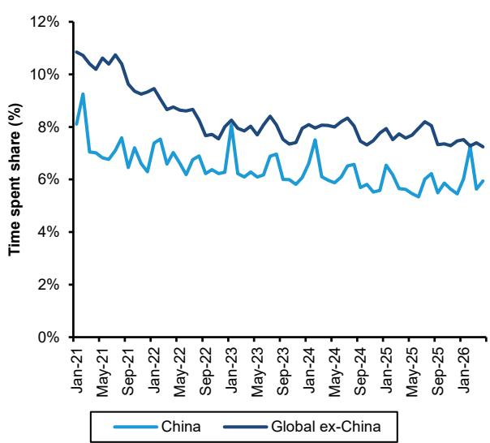  
Source: QuestMobile, Sensor Tower, and Bernstein analysis.

EXHIBIT 22: ...with absolute engagement hours remaining stable in recent years  
2021-2026: Gaming time spent  
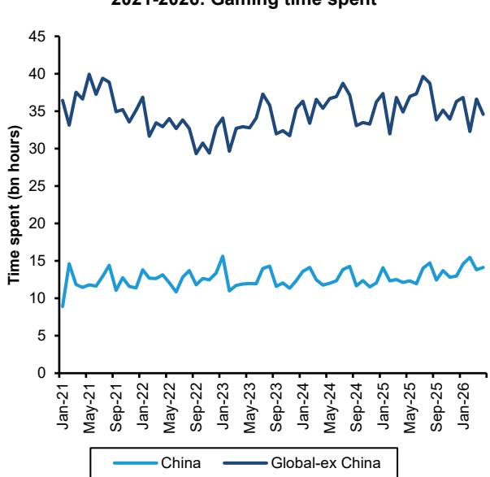  
Source: QuestMobile, Sensor Tower, and Bernstein analysis.

EXHIBIT 23: PSN engagement has remained resilient into the end of the current console cycle  
Sony GNS - PSN MAUs  
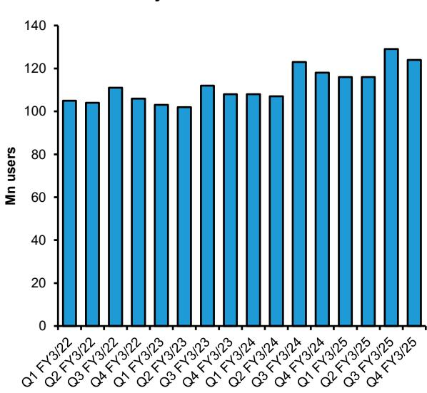  
Source: Corporate reports and Bernstein analysis.  
EXHIBIT 24: ...while the same has been true for Switch engagement into the end of the last console cycle  
Nintendo Switch LTM active players

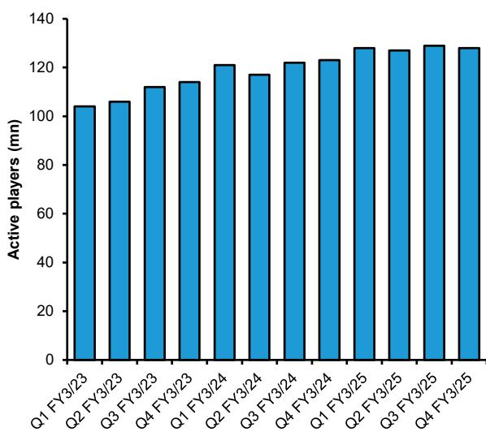  
Source: Corporate reports and Bernstein analysis.

EXHIBIT 25: The normalisation of Roblox engagement back near the pre-2025 trend-line has been interesting to observe, and puts claims around Roblox disrupting the industry into perspective

2020-2026: Roblox average weekly CCUs  
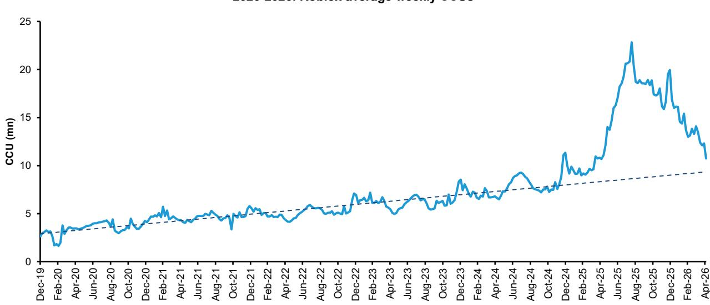  
Source: RoMonitor and Bernstein analysis.

## THE BULL CASE FOR PC GAMING GROWTH

Assembling accurate estimates for PC gaming industry revenue is tricky. For the purposes of building our model, we’ve referred to third-party estimates like Newzoo and IDC. For 2025, IDC estimated US\$38.6bn and US\$38.1bn of industry revenue in 2024 and 2025, while the latest Newzoo estimates pointed to US\$38.5bn and US\$43bn in the same years (see Exhibit 26). Our own modelling has been closer to the latter, reflecting both reported financials across the listed companies, our subjective observations of gaming engagement, and commentary from companies like Capcom. Within PC gaming, the Steam ecosystem continues to show stronger growth measured on the basis of peak concurrent users (see Exhibit 27).

Looking ahead, we do wonder if PC gaming growth may be entering a sustained period of stronger growth. Before 2025, the PC gaming market was typified by low-single digit overall revenue growth, while Steam as the dominant platform has grown in the double-digit percentages (and most of Roblox's engagement has come on PC). A few things stand out to us as potential drivers of stronger growth, including (1) market expansion, as “typical” household PCs in emerging markets become capable of some kinds of gaming; (2) as the supply of interesting PC games expands, with more video gaming developers pursuing multi-platform launches as standard; and (3) as AAA-grade mobile games increasingly become available on PC. According to Steam's monthly hardware survey, PCs with 8Gb of VRAM or more (equivalent to PS4) accounted for 67% of users on the platform at the end of 2025, while the proportions of users with 12Gb and 16Gb (the latter equivalent to PS5) or more accounted for 31% and 12% of users (see Exhibit 28). As these percentages continue to rise we'd expect more gamers to take advantage of more powerful hardware to engage with modern gaming experiences.

CNG data pointed to China's PC gaming market growing $15\%$ year on year in 2025, after years of stagnation (see Exhibit 29). The increasing variety of mobile-PC multi-platform games also helps to cross-pollinate engagement between the two platforms, as gamers play on mobile on the go, but on PC at home. Top-down, we'd expect overall PC gaming growth to benefit as a cohort of gamers discover that gaming on larger screens with audio output from surround speakers makes for a more compelling experience than on smartphones... but also as game developers incentivise gamers to engage on the PC version of games - where in-game monetisation circumvents mobile platform fees. Looking across our coverage, Capcom was one of the first developers to embrace the PC market, and has driven considerable catalog sales growth in recent years (see Exhibit 30). Konami's eFootball has seen Steam concurrent users continue to grow steadily over time, and the company cites PC/console growth matching mobile levels (see Exhibit 31).

EXHIBIT 26: Our views on PC growth last year align more with Newzoo's modelling of revenue acceleration  
2017-2025: Global PC game revenue  
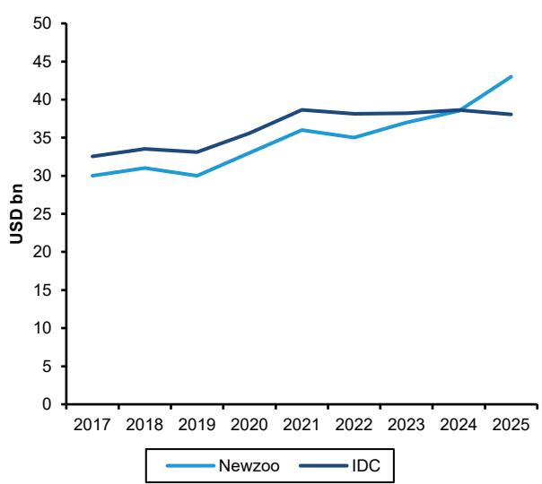  
Source: IDC, Newzoo, and Bernstein analysis.

EXHIBIT 27: Steam continues to grow faster than the aggregate PC market  
2021-2025: Steam monthly peak concurrent users & growth  
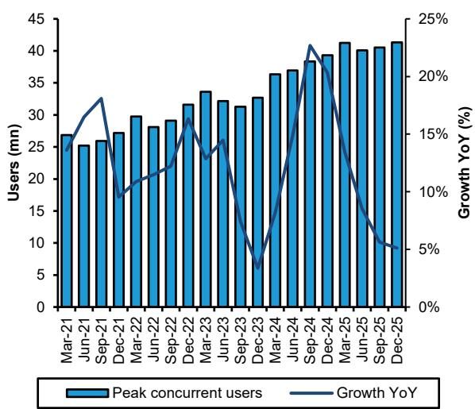  
Source: SteamDB and Bernstein analysis.

EXHIBIT 28: A majority of PCs on Steam can now play at PS4 era games... we expect ongoing upgrade cycle to mean more gamers can and will play more modern games  
2019-2025: Steam Hardware Survey - distribution of GPU VRAM  
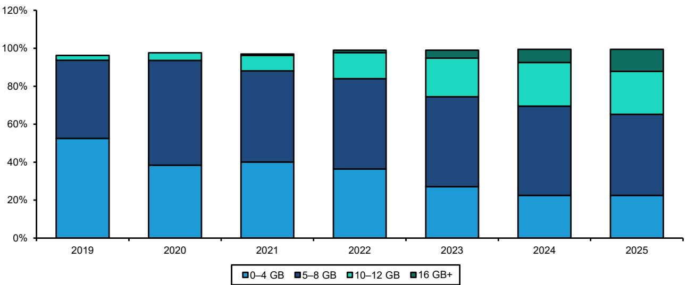  
Source: Steam DB and Bernstein analysis.

EXHIBIT 29: The PC market in China saw a significant acceleration in growth following the Black Myth Wukong success... we think other markets are due to follow in the coming years  
2023-2025: CNG domestic PC vs. mobile gaming industry growth  
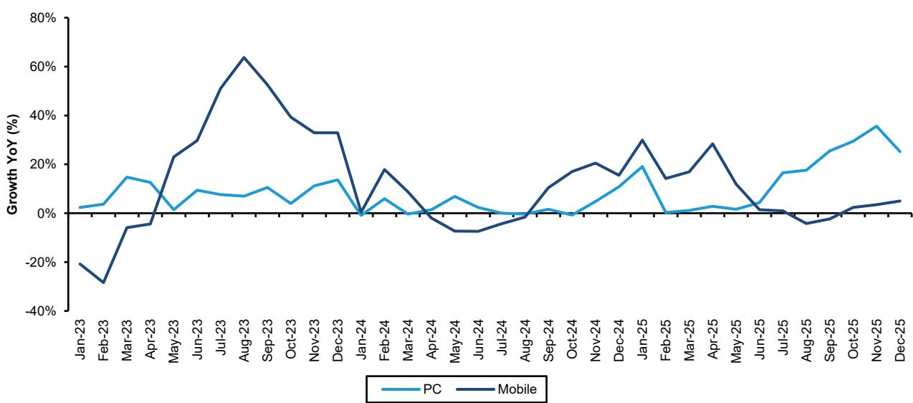  
Source: CNG, Bernstein estimates and analysis.  
FY3/21-FY3/25: Capcom unit sales by region

EXHIBIT 30: Capcom's success has partly been driven by expansion on PC, and in emerging markets

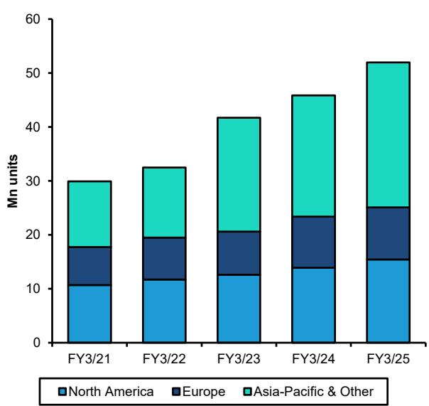  
Source: Corporate reports and Bernstein analysis.  
EXHIBIT 31: eFootball has also seen Steam CCUs ramp considerably in recent years  
2023-2026: eFootball monthly average concurrent users

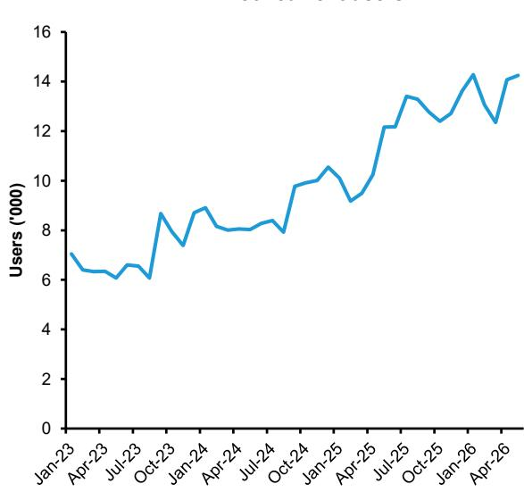  
Source: Steam and Bernstein analysis.

## WE USE SENSOR TOWER TO TRACK MOBILE GAMING BILLINGS

We use Sensor Tower data to monitor the state of mobile gaming growth at the industry level, as well as for high-frequency tracking of individual games that matter to our coverage companies. In 2025, Sensor Tower data pointed to US\$104.6bn of global gross mobile billings, 0.3% higher versus US\$104.2bn in 2024 (Sensor Tower's acquisition of Data.ai led to some data changes which have affected both years). In Q1 2026, aggregate industry gross billings grew 0.1% year on year to US\$26.4bn (see Exhibit 32). Compared with Sensor Tower data only measuring iOS billings in China, we've assumed that iOS occupies c.

35-40% of total industry billings, based on comparisons with reported billings at Tencent and NetEase.

Looking ahead, we model low-to-mid single-digit mobile gaming revenue growth at the industry level, reflecting slowing growth in the installed base, but also some migration of engagement to PC via multi-platform titles. For individual companies though we expect higher smartphone specs to mean more sophisticated games have an opportunity to expand into emerging markets. In our coverage Konami has remained a notable example where market expansion has driven growth.

## The tailwind from lower platform fees

Since the 2025 edition of our State of Play report, the movement towards lower platform fees has gathered steam globally, with Apple cutting EU and then China platform fees to $20\%$ and $25\%$ . Japan's Mobile Software Competition Act drove a reduction of iOS platform fees in Japan from $30\%$ to $26\%$ . Also in December, Google announced that Google Play platform fees would be reduced from $30\%$ to $20\%$ over an 18-month period, staggered across geographies (see Exhibit 33 and Exhibit 34).

At the time of writing, lawsuits focused on lowering mobile app store platform fees remain ongoing in several countries. As such we remain of the view that the direction of aggregate platform fees most likely remains lower in the medium term. In China, we'd expect lower Apple platform fees will strengthen the case for Tencent and NetEase (and various other smaller developers) when negotiating distribution deals with the country's long tail of Android app stores.

The way we represent mobile game revenues on a gross basis means aggregate industry revenue (app store fees inclusive) actually isn't impacted much by these changes. But of course these developments are a positive for video gaming companies as opposed to Apple or Google. Some of the companies we cover like Konami are going a step further and encouraging gamers to purchase in-game items directly via website links - we expect these efforts to continue.

## Game publishing is not the same as app store distribution

We're sometimes asked if ongoing developments in the mobile space might impact revenue sharing agreements in other parts of the video gaming industry, most notably on the console platform fee that Nintendo, Playstation, and Xbox earn from video game developers. Directionally, the example of GTA VI suggests this is plausible, even if the game is probably a category of one. But we'd argue there are also differences between console platform distribution arrangements and mobile app store platform fees.

To raise one example, Playstation signs a lot of second-party publishing agreements, which often incorporate console or outright exclusivity periods in exchange for co-marketing deals at launch, and sometimes an outright stake in the financial outcome of the game (e.g. Stellar Blade last year). We expect these deals to continue to feature prominently, and it's been interesting to see Nintendo get in on the console exclusivity game with The Duskbloods. In addition to marketing deals, we'd note that Playstation also does a fair amount to help developers (especially those making their debuts on console, like Shift Up a year ago) on game development and optimisation.

More broadly, we'd note that the role of a game publisher involves a lot more than simply distribution, and will routinely include, for example, up-front funding of the development, aspects of development like quality assurance and localisation, business development, in addition to the marketing and distribution of a game. Similar to the above, we'd expect existing norms around game publisher-developer relationships to remain mostly unaffected by what's going on with mobile platform fees... and chiefly driven by the relative bargaining power of developer and publisher.

Global ex-China China iOS Estimated China Android

EXHIBIT 32: We've modelled 1% global mobile game billings growth in 2026  
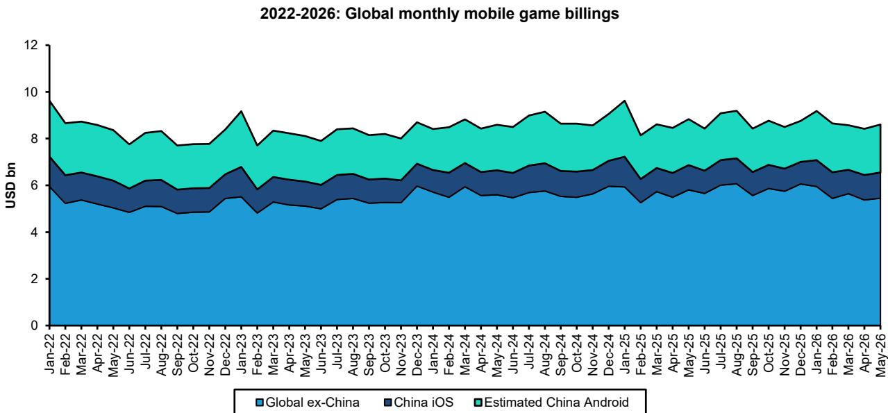  
Source: Sensor Tower, Bernstein estimates and analysis.

EXHIBIT 33: Google's announcement of lower platform fees will represent an earnings tailwind for mobile developers  
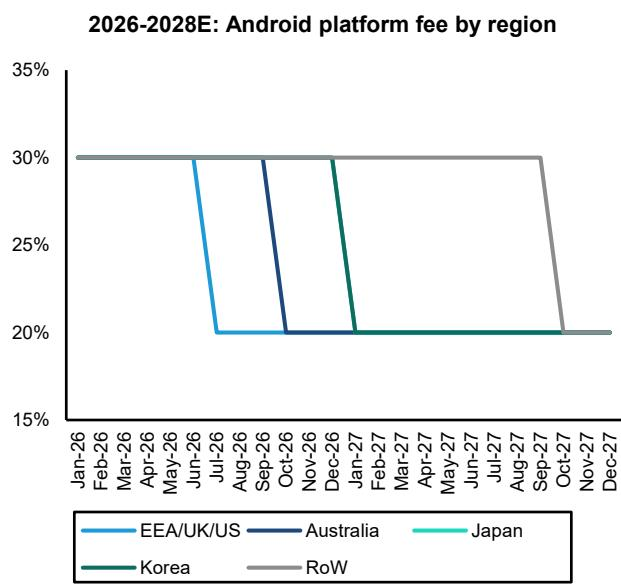  
Source: Corporate reports and Bernstein analysis.

EXHIBIT 34: iOS platform fees were recently cut in Europe and China, which helps too  
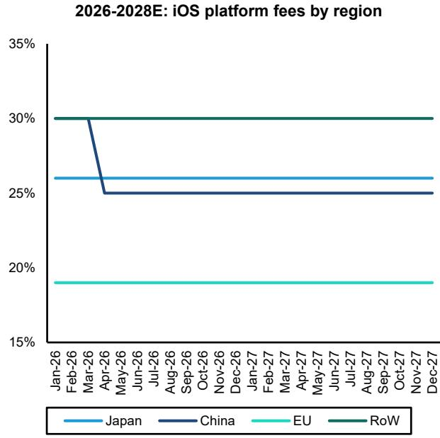  
Source: Corporate reports and Bernstein analysis.

## WE MODEL CONSOLE BOTTOM-UP

Our estimates for the console market are built chiefly using our estimates for Nintendo and Sony's GNS segment, and estimates of Xbox trends with reference to consensus estimates (see Exhibit 35 and Exhibit 36). While Microsoft only discloses high-level financials for Xbox, the company does sometimes give our US software colleagues additional colour on Xbox trends. To arrive at the total size of the console industry, we've grossed up third-party software sales where appropriate by a c. $30\%$ platform fee, to estimate total gross billings from these games. While Nintendo books all third-party game revenues on a net basis (i.e. only the platform fee as revenue), Sony only books physical third-party game sales on a net basis — while digital third-party games

are booked on a gross basis.

On aggregate, we estimate that the console gaming industry reached US\$72bn of total revenue in 2025, 9.8% higher compared with US\$65bn in 2024. Exhibit 37 shows our estimate for console platform revenues broken down by hardware, video game software, and subscriptions. Exhibit 38 shows our estimate for billings, with third-party revenues grossed up.

## The memory price risk to console hardware growth

The risk that high memory prices pose to console and, to a lesser extent, PC gaming growth has become much discussed among investors, and we've cut both Nintendo and Sony estimates year to date. But the latest projections from our semis colleagues - as well as third-party sources like TrendForce - continue to point to price increases through the remainder of 2026 (see Exhibit 39 and Exhibit 40). On the margin, supply chain disruptions driven by war and broader geopolitical omnishambles (e.g. helium, energy) have the potential to make supply chain disruptions worse. Sony has already resolved to let PS5 hardware shipments fall by roughly half... before a PS6 debut which also sounds contingent on clarity on memory prices. Both Nintendo and Sony secured memory pricing deals for FY3/27E that were more favourable than we and the street had modelled. But another step up is likely for FY3/28E. The hope for Nintendo is that a stronger first-party game pipeline can make further price increases more palatable, should the need arise.

EXHIBIT 35: Our console modelling is based to a large extent on our projections for Sony and Nintendo

FY3/08-FY3/28E: Console hardware sales volume

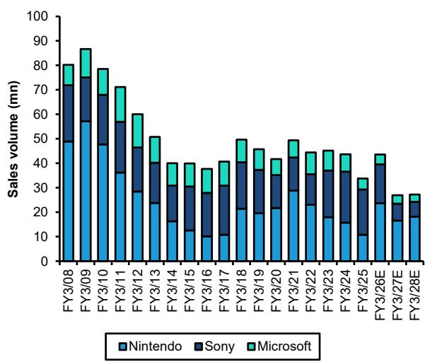  
Source: Corporate reports, Bernstein estimates and analysis.  
EXHIBIT 36: This drives our estimate of the respective console installed bases  
FY3/08-FY3/28E: Console hardware install base

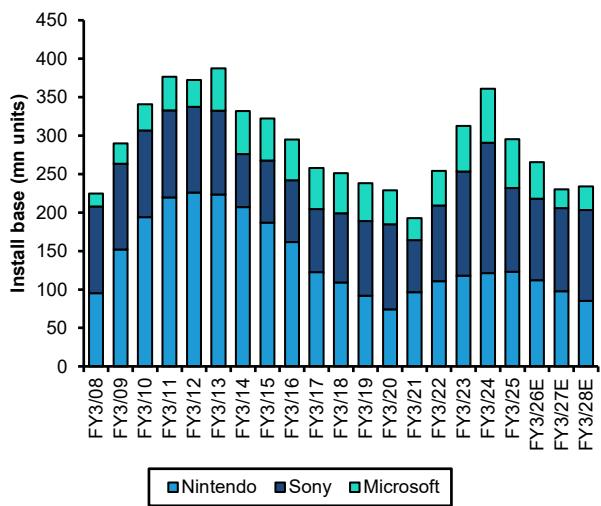  
Source: Corporate reports, Bernstein estimates and analysis.

EXHIBIT 37: Software sales revenue outweighs hardware sales for console platforms  
2025: Sony and Nintendo game revenue breakdown  
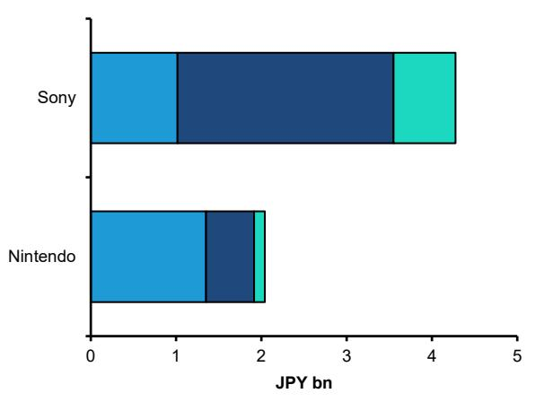  
Hardware revenue Software revenue Subscription revenue  
Source: Corporate reports and Bernstein analysis.

EXHIBIT 38: We model both Sony and Nintendo on the basis of billings, grossing up third-party games  
2025: Sony and Nintendo game billing breakdown  
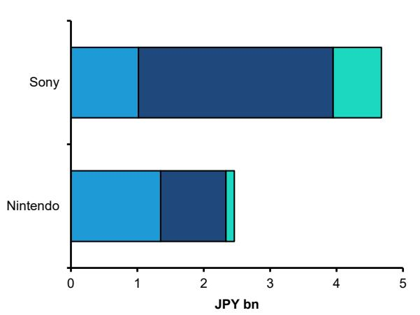  
Hardware billings Software billings Subscription billings  
Source: Corporate reports and Bernstein analysis.

EXHIBIT 39: High memory prices represent an obvious headwind for both in 2026 and onwards  
Q2 2026 vs. Q2 2025: DRAM+SSD share of bill of materials cost  
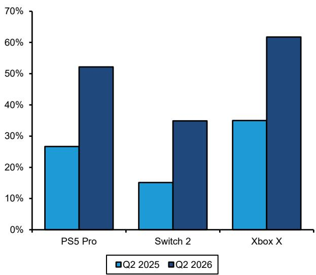  
Source: Corporate reports and Bernstein analysis.

EXHIBIT 40: Current contract pricing implies further downside to hardware margins  
2024-2026E: Discrete LPDDR5 16GB contract price projections  
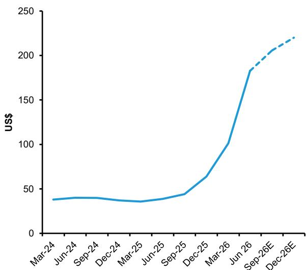  
Source: Corporate reports, Bernstein estimates and analysis.

## AI ADOPTION UPDATE: JAPAN NOW ON BOARD

Amid jittery markets already fearful of AI disruption, Google's Project Genie announcement at the end of January drove a wave of selling across global video gaming assets, including most of our coverage. Since then, our discussions with investors have pointed to some normalisation of sentiment, in part as (1) investors re-examined what the technology actually does—and more importantly, does not do; and (2) as geopolitical upheaval forced investors to prioritise nearer-term realities over what might happen in 2030. Take-Two CEO Strauss Zelnick notably called the notion that AI might make games like GTA VI “laughable”, while Tencent management on their recent Q4 call made a strong case for human creativity as an essential ingredient during the game development process. But at a high level our sense is the sector remains a funding source for AI winners.

In research earlier this year (LINK) we argued that generative AI models were probabilistic in nature, and were ill-suited for the creation of video games as highly structured and deterministic systems. A racing track that changes every time you turn a corner would fly in the face of how gamers learn to play such games. The run-backs to boss rooms are already debated among gamers... without AI changing the layout every time the player respawns. For investors who don't play, we'd point to the fact 20k new games were launched on Steam last year... of which only 130 or so games received more than 10k reviews (see Exhibit 41 to Exhibit 43). While AI can shortcut the development process to some degree, we doubt that the star power of tier-one IP can be replicated anytime. AI causing the number of new long-tail releases to rise from 20k to 200k to 2mn a year most likely only has a limited impact on the handful of industry leading franchises that actually matter for listed company earnings.

## The possibility of alternate entertainment media is worth monitoring... but this isn't just a gaming issue

One area where we've been more open-minded in the context of exponential AI growth has been the possible emergence of new entertainment formats which are able to win some user engagement share. For example, we can imagine the new tech being used as a sort of interactive environment explorer, where users can look around 3D rendered environments - sort of like the Discovery Tour mode in Assassin's Creed Origins. But just as the AI chatbot experience is highly dependent on users' ability to steer a conversation (or give an OpenClaw agent work that's of comparable value to the tokens being consumed), we'd imagine such experiences are most compelling when anchored off worlds based on popular IP (e.g. Night City from Cyberpunk 2077, or Nintendo's Hyrule, the Caribbean islands in Assassin's Creed Black Flag, Raccoon City from Resident Evil Requiem...) rather than empty landscapes one can walk around in but do little else besides.

## AI development in video gaming

One can debate whether small teams of start-ups or large multi-studio organisations are better at being agile and experimenting with new tech like generative AI, but the latter unquestionably have access to libraries of existing IP, far greater development resources, and meaningful distribution advantages which we expect will represent important advantages.

All things considered, instead of video gaming getting disrupted by AI, our best guess is video gaming developers adept at leveraging AI for content creation will gain share on the margin from those that fail or refuse to do so. The Western industry aversion to anything AI-related remains bewildering to us, though despite ground-level animosity it's clear AI use has become increasingly pervasive in video game development.

Exhibit 44 and Exhibit 45 summarise where we think AI adoption has already started to influence video gaming development - for the most part in a positive manner.

2019-2025: Steam game releases per annum  
EXHIBIT 41: AI has already led to a jump in the number of new games launching on Steam, but...  
2019-2025: Steam game releases per annum  
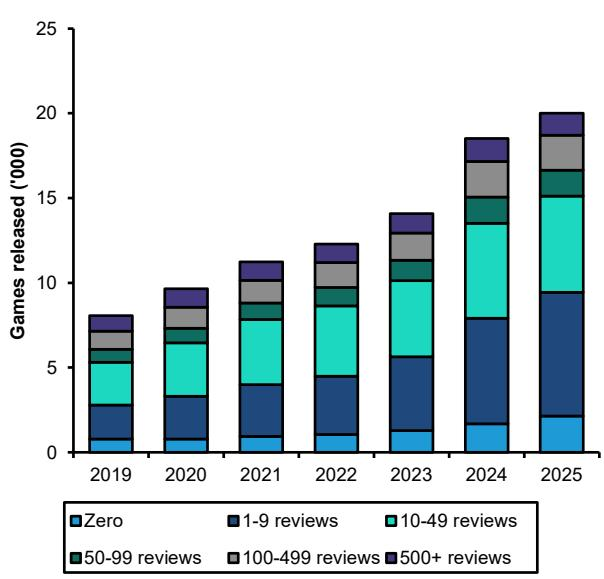  
Source: SteamDB and Bernstein analysis.

EXHIBIT 42: It's not clear to us that this increase has had much impact on the games that really matter  
2025: Steam games launched review counts  
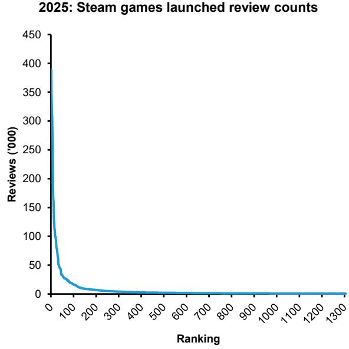  
Source: SteamDB and Bernstein analysis.

EXHIBIT 43: AI doesn't solve for visibility, IP and name recognition do... the number of truly popular games launched each year has remained roughly constant over time  
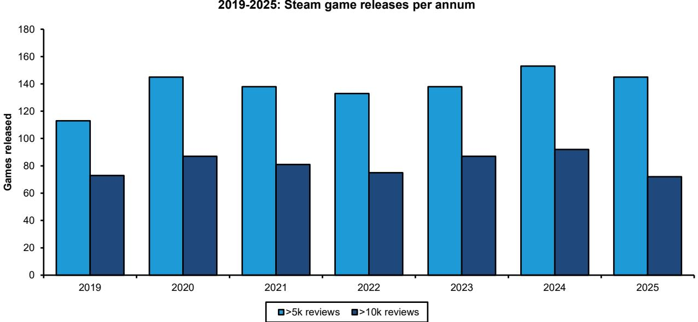  
Source: Corporate reports and Bernstein analysis.

EXHIBIT 44: The video gaming industry has increasingly found ways to integrate AI into development workflows...

<table><tr><td>Development stage</td><td>Work stream</td><td>Potential AI impact, state of the art</td></tr><tr><td rowspan="3">Concept</td><td>· Idea generation</td><td>· LLMs have shown an ability to help originate high-level concepts, settings, and branching narrative ideas, especially during early· Generative AI can be used to explore &quot;what if&quot; variants on existing IP (alternative timelines, side stories) that designers then curate</td></tr><tr><td>· Storyboarding &amp; prototyping</td><td>· Generative AI can assist art teams in exploring variations on defined style guides, then refining promising directions· Generative AI can help to review and debug code, or even generate new code for game prototypes</td></tr><tr><td>· Art style development</td><td>· Generative AI can help to create concept art based on existing IP and art libraries, or create new renderings· Several AAA publishers indicate current use is &quot;co-pilot&quot; for ideation, not final asset generation, due to quality and fan backlash concerns</td></tr><tr><td rowspan="6">Production</td><td>· Vertical slice</td><td>· Faster creation of playable sections/prototypes, by reusing AI-assisted code snippets and auto-generated placeholder art and UI· Some studios report using internal code assistants to stand up prototype gameplay systems and tools pipelines weeks faster vs prior cycles</td></tr><tr><td>· In-game asset production, e.g. 2D art, 3D models, textures,</td><td>· Generative AI tools are already embedded in major 3D modeling/DCC suites (e.g. texture upscaling, material variation, background fills)· Research and early tools focus on automating rigging and retargeting for 3D meshes and textures to skeletons; adoption is still limited at scale· Generative AI has shown promise in the generation of sounds and sound effects</td></tr><tr><td>· Programming of in-game AI, physics and other gameplay</td><td>· Code assistants can suggest boilerplate or refactoring for gameplay and tools code, improving development productivity</td></tr><tr><td>· Quality assurance and bug fixes</td><td>· Capcom and Google describe &quot;visual inspection agents&quot; and &quot;predictive agents&quot; that autonomously explore builds, identify bugs, and focus testing on high-risk areas, 30,000+ hours of autonomous playtesting per month</td></tr><tr><td>· Game optimisation</td><td>· AI can assist with performance tuning by surfacing asset and code-level bottlenecks (e.g. heavy materials, inefficient scripts), and by summarizing profiling logs for engineers· Capcom&#x27;s &quot;data inefficiency agents&quot; use Gemini to mine technical logs and optimize game performance</td></tr><tr><td>· Integration of in-game assets with game environment</td><td>Generative tools can help organize assets, propose placements consistent with level design rules, and check for collisions or visibility</td></tr></table>

Source: Corporate reports and Bernstein analysis.

EXHIBIT 45: ...as well as post launch, for example in marketing, community management, data analytics, and the development of derivative content

<table><tr><td>Development stage</td><td>Work stream</td><td>Potential AI impact, state of the art</td></tr><tr><td rowspan="4">Post-production</td><td>Alpha/beta</td><td>As games become feature complete, AI agents can pressure-test builds to uncover edge-case bugs and balance issuesCapcom&#x27;s Gemini-based playtesting platform runs tens of thousands of automated play hours monthly pre-launch</td></tr><tr><td>Marketing &amp; promotion</td><td>Models trained on game IP and in-game assets can be used to accelerate creation and localization of marketing creatives (trailers, key Commentary from several publishers points to use of gen AI for copy, segmentation, and A/B creative testing</td></tr><tr><td>Localisation</td><td>LLMs have demonstrated strong multilingual performance and can provide a &quot;first pass&quot; for localization, cut-scene scripts, and store</td></tr><tr><td>Certification and submission to platform owners, gold</td><td>AI can help auto-generate compliance checklists, flag missing requirements in TRCs/TCRs, and summarize crash logs</td></tr><tr><td rowspan="3">Launch</td><td>Further bug fixes and patches</td><td>Continuous AI-driven telemetry analysis can flag new crash signatures and balancing issues in live builds, suggesting candidate fixes or test</td></tr><tr><td>Live ops and community engagement</td><td>LLMs can support search within fan communities (forums, support sites) and generate responses to FAQs, reducing support burden</td></tr><tr><td>Creation of incremental content e.g. DLCs, in-game</td><td>Generative AI can accelerate production of cosmetic content (e.g. early concepts for skins, weapons, in-game environments)AI-driven analytics can segment player cohorts and surface content preferences, helping teams prioritize content pipelines</td></tr></table>

Source: Corporate reports and Bernstein analysis.

## I. REQUIRED DISCLOSURES

References to "Bernstein" or the "Firm" in these disclosures relate to the following entities: Bernstein Institutional Services LLC (April 1, 2024 onwards), Bernstein & Co., LLC (pre April 1, 2024), Bernstein Autonomous LLP, BSG France S.A. (April 1, 2024 onwards), Bernstein (Hong Kong) Limited 盛博香港有限公司, Bernstein (Canada) Limited, Bernstein (India) Private Limited (SEBI registration no. INH000006378), Bernstein (Singapore) Private Limited, Bernstein Japan KK (サンフォード・C・バーンスタイン株式会社) and analysts employed by SG Africa Technologies & Services to produce Bernstein under a Global Services Agreement in place between Bernstein and SG.

Bernstein is part of a joint venture between SG (SG) and AllianceBernstein, L.P. (AB). Unless specifically noted otherwise, for purposes of these disclosures, references to Bernstein's “affiliates” relate to both SG and AB and their respective affiliates.

## VALUATION METHODOLOGY

This research publication covers six or more companies. For valuation methodology and other company disclosures: Please visit: https://bernstein-autonomous.bluematrix.com/sellside/Disclosures.action.

Or, you can also write to the Director of Compliance, Bernstein Institutional Services LLC, 245 Park Avenue, New York, NY 10167.

## RISKS

This research publication covers six or more companies. For risks and other company disclosures:

Please visit: https://bernstein-autonomous.bluematrix.com/sellside/Disclosures.action.

Or, you can also write to the Director of Compliance, Bernstein Institutional Services LLC, 245 Park Avenue, New York, NY 10167.

RATINGS DEFINITIONS, BENCHMARKS AND DISTRIBUTION

## EQUITY RATINGS DEFINITIONS

## Bernstein brand

The Bernstein brand rates stocks based on forecasts of relative performance for the next 12 months versus the S&P 500 for stocks listed on the U.S. and Canadian exchanges, versus the Bloomberg Europe Developed Markets Large and Mid Cap Price Return Index EUR (EDME) for stocks listed on the European exchanges and emerging markets exchanges outside of the Asia Pacific region, versus the Bloomberg Japan Large and Mid Cap Price Return Index USD (JPL) for stocks listed on the Japanese exchanges, and versus the Bloomberg Asia ex-Japan Large and Mid Cap Price Return Index (ASIAX) for stocks listed on the Asian (ex-Japan) exchanges -unless otherwise specified.

The Bernstein brand has three categories of ratings:

\- Outperform: Stock will outpace the market index by more than 15 pp

• Market-Perform: Stock will perform in line with the market index to within +/-15 pp

• Underperform: Stock will trail the performance of the market index by more than 15 pp

Coverage Suspended: Coverage of a company under the Bernstein brand has been suspended. Ratings and price targets are suspended temporarily, are no longer current, and should therefore not be relied upon.

Not Rated: A rating assigned when the stock cannot be accurately valued, or the performance of the company accurately predicted, at the present time. The covering analyst may continue to publish research reports on the company to update investors on events and developments.

Not Covered (NC) denotes companies that are not under coverage.

Bernstein brand stock ratings are based on a 12-month time horizon.

Autonomous brand – common stocks

The Autonomous brand rates common stocks as indicated below. As our benchmarks we use the Bloomberg Europe 500 Banks And Financial Services Index (BEBANKS) and Bloomberg Europe Dev Mkt Financials Large and Mid Cap Price Ret Index EUR (EDMFI) index for developed European banks and Payments, the Bloomberg Europe 500 Insurance Index (BEINSUR) for European insurers, the S&P 500 and S&P Financials for US banks and Payments coverage, S5LIFE for US Insurance, the S&P Insurance Select Industry (SPSIINS) for US Non-Life Insurers coverage, and the Bloomberg Emerging Markets Financials Large, Mid and Small Cap Price Return Index (EMLSF) for emerging market banks and insurers and Payments. Ratings are stated relative to the sector (not the market).

The Autonomous brand has three categories of common stock ratings:

\- Outperform (OP): Stock will outpace the relevant index by more than 10 pp

\- Neutral (N): Stock will perform in line with the market index to within +/-10 pp

\- Underperform (UP): Stock will trail the performance of the relevant index by more than 10 pp

Coverage Suspended: Coverage of a company under the Autonomous research brand has been suspended. Ratings and price targets are suspended temporarily, are no longer current, and should therefore not be relied upon.

Not Rated: A rating assigned when the stock cannot be accurately valued, or the performance of the company accurately predicted, at the present time. The covering analyst may continue to publish research reports on the company to update investors on events and developments.

Those denoted as ‘Feature’ (e.g., Feature Outperform FOP, Feature Under Outperform FUP) are our core ideas.

Not Covered (NC) denotes companies that are not under coverage.

Autonomous brand common stock ratings are based on a 12-month time horizon.

## Autonomous brand – preferred stocks

The Autonomous brand has three categories of preferred stock ratings:

\- Outperform (OP): The total return of the preferred instrument is expected to outperform preferred securities of other issuers operating in similar sectors or rating categories over the next six months.

\- Neutral (N): The total return of the preferred instrument is expected to perform in line with preferred securities of other issuers operating in similar sectors or rating categories over the next six months.

\- Underperform (UP): The total return of the preferred instrument is expected to underperform preferred securities of other issuers operating in similar sectors or rating categories over the next six months.

Autonomous preferred stock ratings are based on a 6-month time horizon.

## AUTONOMOUS CREDIT RESEARCH

Where this report contains investment recommendations for credit instruments, as defined in article 3(1)(35) of the Market Abuse Regulation, the information below is presented to comply with its disclosure requirements.

The report may also include reference(s) to published opinions by other Autonomous or Bernstein analysts covering the equity securities of the issuer(s) referenced herein. Please note an investment recommendation for credit instruments published by the author(s) of this report may differ from the published view of the analyst covering equity securities for the issuer(s) contained in this report and vice versa.

## CREDIT RATINGS DEFINITIONS

The Autonomous brand has three categories of credit ratings:

\- Credit Outperform (C-OP): The total return of the Reference Credit Instrument is expected to outperform the credit spread of bonds of other issuers operating in similar sectors or rating categories over the next six months.

\- Credit Neutral (C-N): The total return of the Reference Credit Instrument is expected to perform in line with the credit spread of bonds of other issuers operating in similar sectors or rating categories over the next six months.

\- Credit Underperform (C-UP): The total return of the Reference Credit Instrument is expected to underperform the credit spread of bonds of other issuers operating in similar sectors or rating categories over the next six months.

Autonomous credit ratings are based on a 6-month time horizon.

A list of all investment recommendations produced by the author(s) of this report alongside credit ratings history are available upon request.

It is at the sole discretion of the Firm as to when to initiate, update and cease research coverage. The Firm has established, maintains and relies on information barriers to control the flow of information contained in one or more areas (i.e. the private side) within the Firm, and into other areas, units, groups or affiliates (i.e. public side) of the Firm

DISTRIBUTION OF EQUITY RATINGS/INVESTMENT BANKING SERVICES

<table><tr><td>Equity Rating</td><td>Market Abuse Regulation (MAR) and FINRA Rating Category</td><td>Global Rating Distribution</td><td>Investment Banking Relationships*</td></tr><tr><td>Outperform</td><td>BUY</td><td>51.1%</td><td>16.5%</td></tr><tr><td>Market-Perform (Bernstein Brand) Neutral (Autonomous Brand)</td><td>HOLD</td><td>36.3%</td><td>17.8%</td></tr><tr><td>Underperform</td><td>SELL</td><td>12.6%</td><td>14.9%</td></tr></table>

\* These figures represent the percentage of companies within each equity rating category for which affiliates of Bernstein have provided investment banking services within the previous 12 months.
As of March 31, 2026. All figures are updated quarterly.

## PRICE CHARTS/ RATINGS AND PRICE TARGET HISTORY

This research publication covers six or more companies. For price chart and other company disclosures, please visit https://bernstein-autonomous.bluematrix.com/sellside/Disclosures.action or you can write to the Director of Compliance, Bernstein Institutional Services LLC, 245 Park Avenue, New York, NY 10167.

## CONFLICTS OF INTEREST

SG and/or its affiliates beneficially own 1% or more of a class of common equity securities of the following company: Square Enix Holdings Co Ltd..

Bernstein and/or affiliates have received compensation for non-investment banking securities-related products or services in the previous twelve months from the following clients: Sony Group Corp and Tencent Holdings Ltd.

Bernstein has received compensation for non-investment banking securities-related products or services in the previous twelve months from the following clients: Tencent Holdings Ltd.

An affiliate of Bernstein has received compensation for non-investment banking securities-related products or services in the previous twelve months from the following clients: Tencent Holdings Ltd.

Certain affiliates of Bernstein act as market maker or liquidity provider in the debt securities of: Tencent Holdings Ltd.

## OTHER MATTERS

The legal entity(ies) employing the analyst(s) listed in this report, and their location, can be determined by the country code of their phone number, as follows:

+1 Bernstein Institutional Services LLC; New York, New York, USA

+44 Bernstein Autonomous LLP; London UK

+212 SG Africa Technologies & Services; Casablanca, Morocco

+33 BSG France S.A.; Paris, France

+34 BSG France S.A.; Madrid, Spain

+41 Bernstein Autonomous LLP; Geneva, Switzerland

+49 BSG France S.A.; Frankfurt, Germany

+91 Bernstein (India) Private Limited; Mumbai, India

+852 Bernstein (Hong Kong) Limited 盛博香港有限公司; Hong Kong, China

+65 Bernstein (Singapore) Private Limited; Singapore

+81 Bernstein Japan KK; Tokyo, Japan

Where this report has been prepared by research analyst(s) employed by a non-US affiliate, such analyst(s), is/are (unless otherwise expressly noted below) not registered as associated persons of Bernstein Institutional Services LLC or any other SEC-registered broker-dealer and are not licensed or qualified as research analysts with FINRA. Accordingly, such analyst(s) may not be subject to FINRA's restrictions regarding (among other things) communications by research analysts with a subject company, interactions between research analysts and investment banking personnel, participation by research analysts in solicitation and marketing activities relating to investment banking transactions, public appearances by research analysts, and trading securities held by a research analyst account.

Where this report has been prepared by research analyst(s) employed by SG Africa Technologies & Services (part of the SG group of companies), it has been prepared on behalf of a Bernstein company under a Global Services Agreement in place between Bernstein and SG.

## CERTIFICATION

Each research analyst listed in this report, who is primarily responsible for the preparation of the content of this report, certifies that all of the views expressed in this publication accurately reflect that analyst's personal views about any and all of the subject securities or issuers and that no part of that analyst's compensation was, is, or will be, directly or indirectly, related to the specific recommendations or views in this publication.

## II. ADDITIONAL GLOBAL CONFLICT DISCLOSURES

It is at the sole discretion of the Firm as to when to initiate, update and cease research coverage. The Firm has established, maintains and relies on information barriers to control the flow of information contained in one or more areas (i.e., the private side) within the Firm, and into other areas, units, groups or affiliates (i.e., public side) of the Firm.

## III. OTHER IMPORTANT INFORMATION AND DISCLOSURES

Separate branding is maintained for “Bernstein” and “Autonomous” research products.

\- Bernstein produces a number of different types of research products including, among others, fundamental analysis and quantitative analysis under both the “Autonomous” and “Bernstein” brands. Recommendations contained within one type of research product may differ from recommendations contained within other types of research products, whether as a result of differing time horizons, methodologies or otherwise. Furthermore, views or recommendations within a research product issued under one brand may differ from views or recommendations under the same type of research product issued under the other brand. The Research Ratings System for the two brands and other information related to those Rating Systems are included in the previous section.

\- Autonomous operates as a separate business unit within the following entities: Bernstein Institutional Services LLC, Bernstein Autonomous LLP, Bernstein (Hong Kong) Limited 盛博香港有限公司 and Bernstein (India) Private Limited. For information relating to “Autonomous” branded products (including certain Sales materials) please visit: www.autonomous.com. For information relating to Bernstein branded products please visit: www.bernsteinresearch.com.

Analysts are compensated based on aggregate contributions to the research franchise as measured by account penetration, productivity and proactivity of investment ideas. No analysts are compensated based on performance in, or contributions to, generating investment banking revenues.

This report has been produced by an independent analyst as defined in Article 3 (1)(34)(i) of EU 596/2014 Market Abuse Regulation (“MAR”) and the same article of MAR as it forms part of United Kingdom domestic law by virtue of the European Union (Withdrawal) Act 2018.

To our readers in the United States: Bernstein Institutional Services LLC, a broker-dealer registered with the U.S. Securities and Exchange Commission (“SEC”) and a member of the U.S. Financial Industry Regulatory Authority, Inc. (“FINRA”) is distributing this publication in the United States and accepts responsibility for its contents. Where this material contains an analysis of debt product(s), such material is intended only for institutional investors and is not subject to the US independence and disclosure standards applicable to debt research prepared for retail investors.

Bernstein Institutional Services LLC may act as principal for its own account or as agent for another person (including an affiliate) in sales or purchases of any security which is a subject of this report. This report does not purport to meet the objectives or needs of any specific individuals, entities or accounts.

To our readers in Canada: If this publication pertains to a Canadian domiciled company, it is being distributed in Canada by Bernstein (Canada) Limited, which is licensed and regulated by the Canadian Investment Regulatory Organization. If the publication pertains to a non-Canadian domiciled company, it is being distributed by Bernstein Institutional Services LLC, which is licensed and regulated by both the SEC and FINRA, into Canada under the International Dealers Exemption.

This document may not be passed onto any person in Canada unless that person qualifies as "permitted client" as defined in Section 1.1 of NI 31-103.

To our readers in Brazil: This report has been prepared by Bernstein Institutional Services LLC, and Banco BTG Pactual S.A. ("BTG") is responsible for the distribution of this report in Brazil.

To readers in the United Kingdom: This publication has been issued or approved for issue in the United Kingdom by Bernstein Autonomous LLP, authorised and regulated by the Financial Conduct Authority and located at 60 London Wall, London EC2M 5SH, +44 (0)20-7170-5000. Registered in England & Wales No OC343985.

This document is for distribution only to persons who (i) have professional experience in matters relating to investments falling within Article 19(5) of the Financial Services and Markets Act 2000 (Financial Promotion) Order 2005 (as amended, the “Financial Promotion Order”), (ii) are persons falling within Article 49(2)(a) to (d) (“high net worth companies, unincorporated associations, etc.”) of the Financial Promotion Order, (iii) are outside the United Kingdom, or (iv) are persons to whom an invitation or inducement to engage in investment activity (within the meaning of section 21 of the FSMA) in connection with the issue or sale of any securities may otherwise lawfully be communicated or caused to be communicated (all such persons together being referred to as “relevant persons”). This document is directed only at relevant persons and must not be acted on or relied on by persons who are not relevant persons. Any investment or investment activity to which this document relates is available only to relevant persons and will be engaged in only with relevant persons.

To our readers in the member states of the EEA: This publication is being distributed by BSG France SA, which is authorised and regulated by the Autorité de Contrôle Prudentiel et de Résolution (ACPR) and Autorité des Marchés Financiers (AMF).

To our readers in Hong Kong: This publication is being distributed in Hong Kong by Bernstein (Hong Kong) Limited 盛博香港有限公司, which is licensed and regulated by the Hong Kong Securities and Futures Commission (Central Entity No. AXC846) to carry out Type 4 (Advising on Securities) regulated activities and subject to the licensing conditions mentioned in the SFC Public Register (https://www.sfc.hk/publicregWeb/corp/AXC846/details)). This publication is solely for professional investors, as defined in the Securities and Futures Ordinance (Cap. 571). The purpose of this report is solely to provide an analysis of the issuers referred to in this report and is not intended for any purpose contrary to the laws of Hong Kong.

To our readers in Singapore: This publication is being distributed in Singapore by Bernstein (Singapore) Private Limited, only to accredited investors or institutional investors, as defined in the Securities and Futures Act 2001 of Singapore ("SFA"). Recipients in Singapore should contact Bernstein (Singapore) Private Limited in respect of matters arising from, or in connection with, this publication. Bernstein (Singapore) Private Limited is regulated by the Monetary Authority of Singapore and licensed under the SFA as a capital markets services licence holder for dealing in capital markets products that are securities and collective investment schemes and an exempt financial adviser for advising on, issuing and promulgating analyses and reports on securities. Bernstein (Singapore) Private Limited is registered in Singapore with Company Registration No. 20213710W and located at 8 Marina Boulevard, #12-01, Marina Bay Financial Centre, Singapore 018981, +65-6326-7000.

To our readers in the People's Republic of China: The securities referred to in this document are not being offered or sold and may not be offered or sold, directly or indirectly, in the People's Republic of China (for such purposes, not including the Hong Kong and Macau Special Administrative Regions or Taiwan, the "PRC") in contravention of any applicable laws of the PRC.

This document does not constitute an offer to sell or the solicitation of an offer to buy any securities in the PRC to any person to whom it is unlawful to make the offer or solicitation in the PRC.

We do not represent that this document may be lawfully distributed, or that any securities may be lawfully offered, in compliance with any applicable registration or other requirements in the PRC, or pursuant to an exemption available thereunder, or assume any responsibility for facilitating any such distribution or offering. In particular, no action has been taken by us which would permit a public offering of any securities or distribution of this document in the PRC. Accordingly, the securities are not being offered or sold within the PRC by means of this document or any other document. Neither this document nor any advertisement or other offering material may be distributed or published in the PRC, except under circumstances that will result in compliance with any applicable laws and regulations.

To our readers in Japan: This publication is being distributed in Japan by Bernstein Japan KK (サンフォード・C・バーンスタイン株式会社), which is registered in Japan as a Financial Instruments Business Operator with the Kanto Local Finance Bureau (registration number: The Director-General of Kanto Local Finance Bureau (FIBO) No.3387) and regulated by the Financial Services Agency. It is also a member of Investment Management Association of Japan. This publication is solely for qualified institutional investors in Japan only, as defined in Article 2, paragraph (3), items (i) of the Financial Instruments and Exchange Act.

For the institutional client readers in Japan who have been granted access to the Bernstein website by Daiwa Group Inc. ("Daiwa"), your access to this document should not be construed as meaning that Bernstein is providing you with investment advice for any purposes. Whilst Bernstein has prepared this document, your relationship is, and will remain with, Daiwa, and Bernstein has neither any contractual relationship with you nor any obligations towards you.

To our readers in Australia: Bernstein (Hong Kong) Limited 盛博香港有限公司 is responsible for distributing research in Australia. It is regulated by the Securities and Exchange Commission under U.S. laws, by the Financial Conduct Authority under U.K. laws, which differs from Australian laws. Bernstein (Hong Kong) Limited 盛博香港有限公司 is exempt from the requirement to hold an Australian financial services license under the Corporations Act 2001 in respect of the provision of the following financial services to wholesale clients:

• providing financial product advice;

• dealing in a financial product;

\- making a market for a financial product; and

• providing a custodial or depository service.

To our readers in India: This publication is being distributed in India by Bernstein (India) Private Limited (SCB India) which is licensed and regulated by Securities and Exchange Board of India ("SEBI") as a research analyst entity under the SEBI (Research Analyst) Regulations, 2014, having registration no. INH000006378 and as a stock broker having registration no. INZ000213537. SCB India is currently engaged in the business of providing research and stock broking services. Please refer to www.bernsteinresearch.in for more information.

\- SCB India is a Private limited company incorporated under the Companies Act, 2013, on April 12, 2017 bearing corporate identification number U65999MH2017FTC293762, and registered office at Level 3A, 4th Floor, First International Financial Centre, Plot Nos C-54 and C-55, G Block, Near CBI Office, Bandra Kurla Complex, Bandra (East), Mumbai 400098, Maharashtra, India (Phone No: +91-22-68421401).

\- For details of Associates (i.e., affiliates/group companies) of SCB India, kindly email MUM-BERNSTEIN-InCompliance@bernsteinsg.com.

• SCB India does not have any disciplinary history as on the date of this report.

\- Except as noted above, SCB India and/or its Associates (i.e., affiliates/group companies), the Research Analysts authoring this report, and their relatives

• do not have any financial interest in the subject company

• do not have actual/beneficial ownership of one percent or more in securities of the subject company;

\- is not engaged in any investment banking activities for Indian companies, as such;

• have not managed or co-managed a public offering in the past twelve months for any Indian companies;

\- have not received any compensation for investment banking services or merchant banking services from the subject company in the past 12 months;

• have not received compensation for brokerage services from the subject company in the past twelve months;

\- have not received any compensation or other benefits from the subject company or third party related to the specific recommendations or views in this report; and

\- do not currently, but may in the future, act as a market maker in the financial instruments of the companies covered in the report.

\- do not have any conflict of interest in the subject company as of the date of this report.

\- Except as noted above, the subject company has not been a client of SCB India during twelve months preceding the date of distribution of this research report. Neither SCB India nor its Associates (i.e., affiliates/group companies) have received compensation for products or services other than investment banking, merchant banking or brokerage services from the subject company in the past twelve months.

\- The principal research analyst(s) who prepared this report, members of the analysts' team, and members of their households are not an officer, director, employee or advisory board member of the companies covered in the report.

\- Our Compliance officer / Grievance officer is Ms. Rupal Talati, who can be reached at +91-22-68421451, or MUM-BERNSTEIN-InCompliance@bernsteinsg.com / Scbin-investorgrievance@bernsteinsg.com

\- The Research investor charter and Terms & Conditions of SCB India are available on its website and may be accessed at Bernstein (India) Private Limited (https://bernsteinresearch.in/) for your reference.

\- Disclaimer: Registration granted by SEBI, and certification from NISM, is in no way a guarantee of performance of the intermediary or provide any assurance of returns to investors. Investments in securities market are subject to market risks. Read all the related documents carefully before investing.

To our readers in Switzerland: This document is provided in Switzerland by or through Bernstein Autonomous LLP, and is provided only to qualified investors as defined in article 10 of the Swiss Collective Investment Scheme Act (“CISA”) and related provisions of the Collective Investment Scheme Ordinance and in strict compliance with applicable Swiss law and regulations. The products mentioned in this document may not be suitable for all types of investors. This document is based on the Directives on the Independence of Financial Research issued by the Swiss Bankers Association (SBA) in January 2008.

To our readers in the Middle East: Bernstein Autonomous LLP, DIFC branch has its principal office at Gate Village 06, DIFC, Dubai, UAE. Bernstein Autonomous LLP, DIFC branch is regulated by the Dubai Financial Services Authority (DFSA) with the registration number CL10040 and is provisioned for Arranging Deals in Investments and Advising on Financial Products. All communications and services are directed at Professional Clients and Market Counterparties only (as defined in the DFSA rulebook). Persons other than Professional Clients and Market Counterparties, such as Retail Clients, are not the intended recipients of our communications or services.

## LEGAL

All research publications are disseminated to our clients through posting on the firm's password protected websites, bernsteinresearch.com and autonomous.com. Certain, but not all, research publications are also made available to clients through third-party vendors or redistributed to clients through alternate electronic means as a convenience.

This publication has been published and distributed in accordance with the Firm's policy for management of conflicts of interest in investment research, a copy of which is available from Bernstein Institutional Services LLC, Director of Compliance, 245 Park Avenue, New York, NY 10167. Additional disclosures and information regarding Bernstein's business are available on our website

## www.bernsteinresearch.com.

The securities described herein may not be eligible for sale in all jurisdictions or to certain categories of investors where that permission profile is not consistent with the licenses held by the entities noted herein. This document is for distribution only as may be permitted by law. This publication is not directed to, or intended for distribution to or use by, any person or entity who is a citizen or resident of, or located in any locality, state, country or other jurisdiction where such distribution, publication, availability or use would be contrary to law or regulation or which would subject any of the entities referenced herein or any of their subsidiaries or affiliates to any registration or licensing requirement within such jurisdiction. This publication is based upon public sources we believe to be reliable, but no representation is made by us that the publication is accurate or complete. We do not undertake to advise you of any change in the reported information or in the opinions herein. This publication was prepared and issued by entity referred to herein for distribution to eligible counterparties or professional clients. This publication is not an offer to buy or sell any security, and it does not constitute investment, legal or tax advice. The investments referred to herein may not be suitable for you. Investors must make their own investment decisions in consultation with their professional advisors in light of their specific circumstances. The value of investments may fluctuate, and investments that are denominated in foreign currencies may fluctuate in value as a result of exposure to exchange rate movements. Information about past performance of an investment is not necessarily a guide to, indicator of, or assurance of, future performance.

This report is directed to and intended only for our clients who are “eligible counterparties”, “professional clients”, “institutional investors” and/or “professional investors” as defined by the aforementioned regulators, and must not be redistributed to retail clients as defined by the aforementioned regulators. Retail clients who receive this report should note that the services of the entities noted herein are not available to them and should not rely on the material herein to make an investment decision. The result of such act will not hold the entities noted herein liable for any loss thus incurred as the entities noted herein are not registered/authorised/licensed to deal with retail clients and will not enter into any contractual agreement/arrangement with retail clients. This report is provided subject to the terms and conditions of any agreement that the clients may have entered into with the entities noted herein. All research reports are disseminated on a simultaneous basis to eligible clients through electronic publication to our client portal.

The information in this report was prepared by Bernstein solely for the internal business use of our clients. Clients may store, display, analyze, reformat and print the information in this report for this limited use only. Clients may not copy, alter, create derivative works, resell, reverse engineer, commercially exploit, share or distribute any part of the information contained herein for any purpose without Bernstein's express written consent. These restrictions include extracting data or using the content to develop indices or other products. Further, you may not use this report, or any portion of this report, to train or finetune any third-party machine learning or artificial intelligence system, or as a prompt or input into any such system. You also may not, without Bernstein's express written consent, do any of the foregoing in connection with your own internal machine learning or artificial intelligence system.

Bernstein may use artificial intelligence tools in the preparation of its materials. Any such materials are reviewed by Bernstein's research analysts prior to publication.

This report has been prepared for information purposes only and is based on current public information that we consider reliable, but the entities noted herein do not warrant or represent (express or implied) as to the sources of information or data contained herein are accurate, complete, not misleading or as to its fitness for the purpose intended even though the entities noted herein rely on reputable or trustworthy data providers, it should not be relied upon as such. Opinions expressed are the author(s)' current opinions as of the date appearing on the material only and we do not undertake to advise you of any change in the reported information or in the opinions herein.

Any references to SG herein are purely factual, based upon publicly available information, and included for comparative purposes only. They do not constitute an opinion or recommendation with respect to the securities of SG.

This publication was prepared and issued by the entity referred to herein for distribution to eligible counterparties or professional clients. The information in this report is intended for general circulation and does not constitute an offer to buy or sell any security, investment, legal or tax advice nor a personal recommendation, as defined by any of the aforementioned regulators. It does not take into account the particular investment objectives, financial situations, or needs of individual investors. The report has not been reviewed by any of the aforementioned regulators and does not represent any official recommendation from the aforementioned regulators. The investments referred to herein may not be suitable for you. Investors must make their own investment decisions in consultation with advice sought from a financial adviser regarding the suitability of the investment product, taking into account the specific investment objectives, financial situation or particular needs of any recipient of the recommendation, before the recipient makes a commitment to purchase the investment product.

The analysis contained herein is based on numerous assumptions. Different assumptions could result in materially different results. The information in this report does not constitute, or form part of, any offer to sell or issue, or any offer to purchase or subscribe for shares, or to induce engagement in any other investment activity. The value of any securities or financial instruments mentioned in this report may fluctuate subject to market conditions. Information about past performance of an investment is not necessarily a guide to, indicative of, or assurance of future performance. Estimates of future performance mentioned by the research analyst in this report are based on assumptions that may not be realized due to unforeseen factors like market volatility/fluctuation. In relation to securities or financial instruments denominated in a foreign currency other than the clients' home currency, movements in exchange rates will have an effect on the value, either favorable or unfavorable. Before acting on any recommendations in this report, recipients should consider the appropriateness of investing in the subject securities or financial instruments mentioned in this report and, if necessary, seek independent professional advice.

The securities described herein may not be eligible for sale in all jurisdictions or to certain categories of investors where that permission profile is not consistent with the licenses held by the entities noted herein. This document is for distribution only as may be permitted by law. It is not directed to, or intended for distribution to or use by, any person or entity who is a citizen or resident of or located in any locality, state, country or other jurisdiction where such distribution, publication, availability or use would be contrary to law or regulation or would subject the entities noted herein to any regulation or licensing requirement within such jurisdiction.

Source: Bloomberg Index Services Limited. BLOOMBERG® is a trademark and service mark of Bloomberg Finance L.P. and its affiliates (collectively “Bloomberg”). Bloomberg or Bloomberg’s licensors own all proprietary rights in the Bloomberg Indices. Neither Bloomberg nor Bloomberg’s licensors approves or endorses this material, or guarantees the accuracy or completeness of any information herein, or makes any warranty, express or implied, as to the results to be obtained therefrom and, to the maximum extent allowed by law, neither shall have any liability or responsibility for injury or damages arising in connection therewith.

No part of this material may be reproduced, distributed or transmitted or otherwise made available without prior consent of the entities noted herein. Copyright Bernstein Institutional Services LLC Bernstein Autonomous LLP, BSG France S.A., Bernstein (Hong Kong) Limited 盛博香港有限公司, Bernstein (Canada) Limited, Bernstein (India) Private Limited (SEBI registration no. INH000006378), Bernstein (Singapore) Private Limited and Bernstein Japan KK (サンフォード・C・バーンスタイン株式会社). All rights reserved. The trademarks and service marks contained herein are the property of their respective owners. Any unauthorized use or disclosure is strictly prohibited. The entities noted herein may pursue legal action if the unauthorized use results in any defamation and/or reputational risk to the entities noted herein and research published under the Bernstein and Autonomous brands.