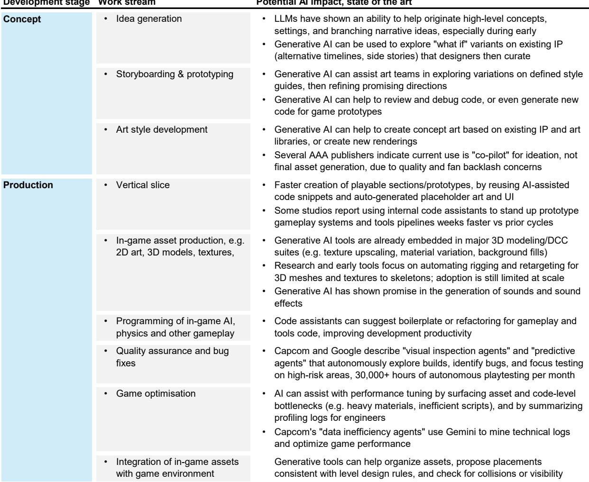
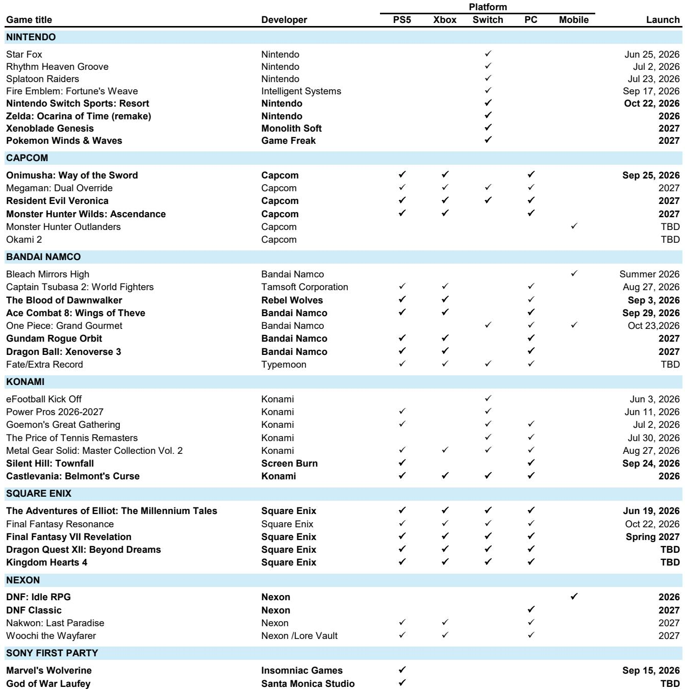
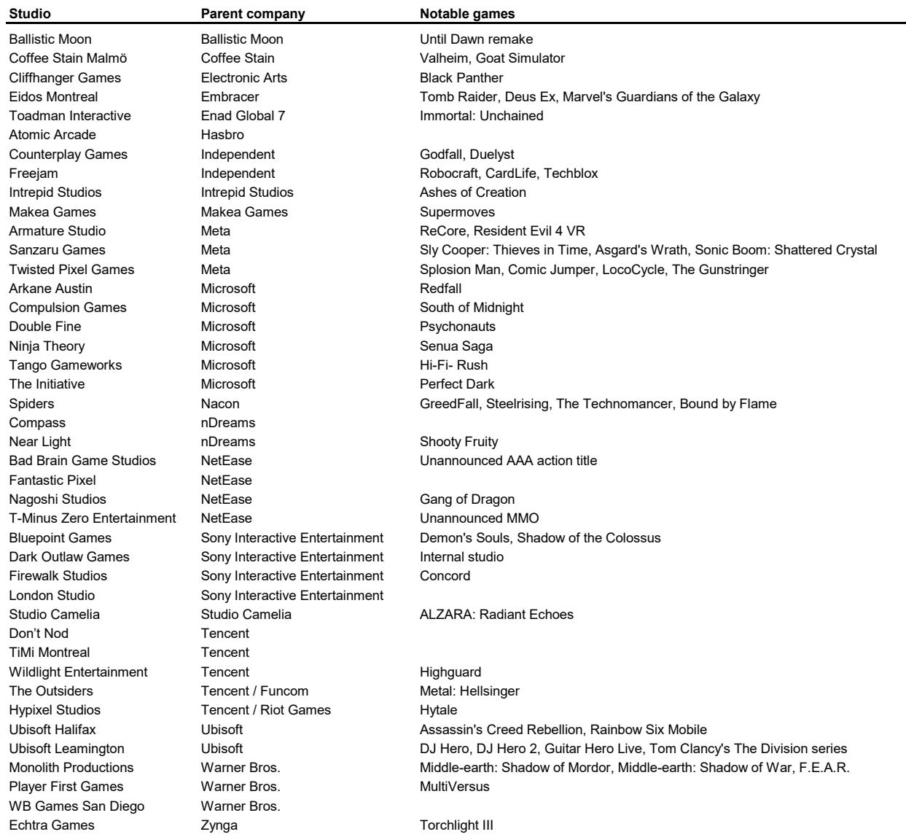

# The Video Gaming Industry Is Not Growing — It Is Restructuring, And The Winners Are Already Clear

The global video gaming industry generated an estimated $218 billion in revenue in 2025, up 4.8% year on year. For 2026, the number is projected at $220 billion — growth of just 0.7%. A top-down observer might conclude the industry has matured into a low-growth, commoditized market. That conclusion would be wrong.

The real story is not about aggregate revenue expansion. It is about a fundamental reallocation of market share, driven by three structural forces that are reshaping competitive advantage: the migration of development talent and capital toward Asia, the thinning of the Western studio base through overdue closures, and the emergence of PC as the primary growth platform at the expense of console. The industry is in the back half of a capital cycle, and the companies that own tier-one intellectual property, operate live-service franchises, and sit on disciplined cost bases are the ones that will emerge stronger.

This matters now because the next twelve months contain a potential inflection point. The launch of Grand Theft Auto VI in November 2026 is widely expected to be the largest entertainment release in history. That event will not only reset investor sentiment and positioning across the sector — it will also serve as a clearing mechanism, revealing which publishers have genuine franchise power and which have been hiding behind a rising tide. The post-GTA VI landscape will look materially different from the one we see today.

The following analysis draws on a detailed bottom-up model of global video gaming revenues by platform, region, and company. It is not a summary of the data. It is an argument about where value is being created and destroyed, and what strategic decisions will separate the winners from the rest.

## The Industry Is Consolidating Around Asian Developers, And Western Studio Closures Are Accelerating That Shift

The headline growth numbers obscure a powerful concentration dynamic. While overall industry revenue is expected to grow at a compound rate of roughly 3% between 2025 and 2027, the listed cohort of companies is forecast to grow at 7% to 8% in 2025 alone. That delta is not noise. It reflects a market in which smaller, less competitive developers are being driven out, and the remaining public companies are capturing an increasing share of wallet.

This is particularly evident in the Western markets. A growing number of studio closures — long overdue, in the view of the report's authors — are thinning the competitive landscape. The capital cycle that inflated during the pandemic, when cheap money funded an explosion of new game development, is now contracting. The result is a supply-side cleansing that benefits incumbents with established pipelines, recognizable franchises, and the financial resilience to weather a period of lower investment.

The beneficiaries of this consolidation are disproportionately Asian. Japan, Korea, and China now possess a structural cost advantage in skilled labor that their Western competitors cannot easily replicate. The top developers in these markets are not only cheaper to staff; they are increasingly producing games that compete on quality and global appeal. The success of Black Myth: Wukong in 2024 was not an anomaly. It was a signal that Chinese PC gaming can generate global hits, and that the talent base in Asia is now deep enough to sustain a pipeline of such titles.

The implication for investors is straightforward: the market share shift toward Asian developers is not a cyclical trade. It is a structural re-rating of where the industry's center of gravity lies. Companies like Tencent, NetEase, Capcom, and Konami are positioned to benefit from this trend in ways that their Western peers, burdened by higher cost structures and thinner pipelines, are not.

## PC Gaming Is Becoming The Structural Growth Engine, While Console Faces A Memory Cost Trap

The most important platform-level insight in the report is the re-emergence of PC as the fastest-growing segment within the industry. After years of being treated as a secondary market by many publishers, PC gaming is now benefiting from a confluence of technological and behavioral tailwinds that are likely to persist.

The hardware story is simple but powerful. The typical home PC now ships with 8 to 12 gigabytes of VRAM — enough to run games that were previously the exclusive domain of PlayStation 4 and PlayStation 5. This is not a niche enthusiast phenomenon. It is a mass-market upgrade cycle that is making millions of existing computers gaming-capable without any additional consumer spending on dedicated hardware. As a result, the addressable market for PC games is expanding rapidly, particularly in regions like China, where the PC gaming market grew 15% in 2025 alone.

The software side reinforces the hardware trend. Console and mobile developers are increasingly embracing multi-platform launches, recognizing that the PC audience is too large to ignore. The report highlights Capcom as an early mover in identifying the growth potential of the PC market, and it expects other companies with competitive catalog game libraries to follow suit. Square Enix's decision to launch its back catalog on the Switch 2 is another example of this logic in action.

Console, by contrast, faces a persistent headwind: memory cost. The price of the high-bandwidth memory required for next-generation consoles has not declined as quickly as the industry hoped, putting pressure on hardware margins and limiting the pace of the installed base expansion. The Nintendo Switch 2 launch in 2025 created a high comparison that the industry is still cycling through, and while a stronger 2027 slate — potentially including new entries in the Pokemon, Xenoblade, and Mario franchises — could make price increases more palatable, the structural pressure on console hardware remains.

The strategic takeaway is that platform strategy must now account for the fact that PC is no longer a complementary market. It is the primary growth vector. Publishers that fail to optimize for PC-first development and distribution are leaving revenue on the table.

## Mobile Platform Fee Reductions Are A Real But Incremental Tailwind For Content Creators

In March 2026, Google announced a reduction in Android platform fees from 30% to 20%, to be implemented over 18 months. Apple followed a week later with a reduction to 25%. These moves have been widely interpreted as a victory for developers, and in a narrow sense they are. Every percentage point of fee reduction flows directly to the bottom line of mobile game publishers.

But the strategic significance of these changes is more nuanced. The report argues that the direction of platform fees is likely to remain lower, driven by two forces: the maturation of mobile platforms in terms of traffic growth, and ongoing legal and regulatory pressure in multiple jurisdictions. This is not a one-off concession; it is the beginning of a structural repricing of the value that Apple and Google capture from their app store ecosystems.

For content creators, the implications are positive but not transformative in the near term. The fee reductions improve margins at the margin, but they do not change the fundamental economics of mobile game development, which remains a hit-driven business with high customer acquisition costs and intense competition. The report's base case is that publishing and second-party relationships will not see meaningful change in the foreseeable future, meaning that the distribution power of the platform holders remains largely intact.

The open question is whether these fee reductions accelerate the shift of high-quality content to mobile, or whether they simply pad the profits of existing developers. The answer will depend on how the savings are reinvested — into better games, more marketing, or simply returned to shareholders. Investors should watch this dynamic closely, because it will determine whether the fee cuts become a catalyst for mobile market growth or just a transfer payment.

## The AI Disruption Thesis Is Overblown, And The Data Proves It

There is no shortage of commentary suggesting that generative AI will fundamentally disrupt the video gaming industry, reducing the cost and time required to create games, and potentially democratizing development to the point where anyone can produce a commercial title. The report's authors are skeptical, and the data supports their skepticism.

Consider this: the number of new games released on Steam rose from 8,100 in 2019 to 21,400 in 2025 — an increase of 164%. Over the same period, the number of titles that generated more than 5,000 user reviews went from 73 to 72. The supply of games has exploded, but the number of commercially meaningful titles has not changed. The implication is clear: the barrier to entry in game development is not technical capability. It is the ability to create something that people want to play, and that requires IP strength, community visibility, and creative storytelling — capabilities that AI, in its current form, does not provide.

The report notes that the industry is starting to find ways to leverage AI to accelerate development, particularly in areas like asset generation and testing. But the complexity of game development extends far beyond creating 3D worlds. It involves narrative design, systems balancing, user interface optimization, and the iterative process of playtesting and refinement. These are deeply human activities that resist automation.

The most telling observation is that Japanese developers, often portrayed as laggards in technology adoption, have taken to AI tools with notable enthusiasm. The report's authors describe this as one of the more notable takeaways from recent travels in Japan. If the most traditional segment of the industry is embracing AI, it is not because AI is about to replace developers. It is because AI is becoming a useful tool for developers who already have strong IP and proven creative processes.

The strategic implication is that ownership of tier-one IP and live-service franchises will remain the key to achieving visibility in a crowded market. The AI disruption thesis confuses an improvement in productivity with a change in competitive dynamics. They are not the same thing.

## What The Report Does Not Fully Answer: The Post-GTA VI Demand Landscape

The report projects 3.3% industry growth in 2027, driven in part by the assumption that GTA VI will "vacate the launch runway" and allow other titles to capture consumer attention. This is a reasonable base case, but it leaves several important questions unanswered.

First, what is the consumer demand elasticity for a $70 to $80 game in a high-inflation environment? GTA VI will sell tens of millions of copies regardless of the macro backdrop, but the same cannot be said for the rest of the industry's slate. If GTA VI absorbs a disproportionate share of consumer entertainment spending in its launch window, the recovery in 2027 may be slower and shallower than the model assumes.

Second, will the GTA VI launch permanently alter consumer expectations for production value and scope? The report notes that investor expectations for GTA VI range from "bullish to biblical." If the game sets a new standard for what a blockbuster title looks like, it could raise the cost of competing for every other publisher in the industry, compressing margins even as revenues grow.

Third, how will the platform landscape evolve in response to GTA VI's success? Take-Two Interactive owns the IP, but the revenue-sharing arrangements with Sony, Microsoft, and Nintendo will determine how the financial benefits are distributed. A game of this magnitude could shift negotiating power between publishers and platform holders in ways that are not yet visible.

These are not criticisms of the report's analysis. They are the natural limits of any forward-looking model. The report provides a framework for thinking about these questions, but the answers will only become clear in the months following the launch.

## A Decision Framework For Investors: Three Questions To Ask About Any Gaming Company

The report's bottom-up analysis is valuable, but it can be synthesized into a simple decision framework that investors can apply to any company in the sector. Three questions separate the winners from the also-rans.

First, does the company own tier-one IP? The data on Steam reviews is unambiguous: the number of commercially successful games has not increased despite a tripling of supply. The scarce resource in gaming is not development capacity. It is intellectual property that consumers recognize and trust. Companies with established franchises — Nintendo's Pokemon, Capcom's Resident Evil, Konami's eFootball, Tencent's Honor of Kings — have a structural advantage that no amount of AI-powered development can replicate.

Second, does the company have a credible multi-platform strategy? The PC market is growing, mobile is stabilizing, and console faces headwinds. Publishers that are locked into a single platform, or that treat PC as an afterthought, are losing market share. The report highlights Capcom and Square Enix as examples of companies that have recognized this shift and are acting on it. Investors should look for similar evidence of platform flexibility.

Third, is the company's cost base competitive? The shift of market share toward Asia is not just about talent quality. It is about cost. Western developers with high overheads and thin pipelines will struggle to compete against Asian studios that can produce comparable quality at lower cost. The studio closures in the West are not a temporary phenomenon. They are the market correcting a structural imbalance.

Companies that can answer yes to all three questions — Tencent, Capcom, Nintendo, Konami — are likely to outperform. Companies that cannot — particularly those with weak IP, platform lock-in, or high cost bases — face an increasingly difficult competitive environment.

## Why This Analysis Matters Now, And How To Go Deeper

The video gaming industry is at a turning point. The GTA VI launch will reset expectations, reveal competitive strengths and weaknesses, and accelerate the structural trends that have been building for years. The companies that own strong IP, operate efficiently, and have positioned themselves for a multi-platform world will emerge stronger. The rest will face consolidation or decline.

The report from which this analysis is drawn contains the full bottom-up revenue model by platform and region, detailed valuation comparisons across 16 publicly traded gaming companies, and the authors' specific ratings and price targets. It also includes the quarterly revenue tracker for 28 listed companies, which provides a real-time window into the market share shifts that are reshaping the industry.

Join the community to read the full report and review the original charts.

*This article is for learning and discussion only and does not constitute investment advice.*

Personal reading notes and learning share only. Not investment advice.

