# Global Software, US and China Internet, & US Communications Infrastructure Cloud in the Quarter: How did the hyperscalers do in 1Q26?

Mark L. Moerdler, Ph.D.
+1 917 344 8506
mark.moerdler@bernsteinsg.com

Mark Shmulik
+1 917 344 8508
mark.shmulik@bernsteinsg.com

Robin Zhu
+852 2123 2659
robin.zhu@bernsteinsg.com

Madison Rezaei
+1 917 344 8622
madison.rezaei@bernsteinsg.com

Firoz Valliji, CFA
+1 917 344 8316
firoz.valliji@bernsteinsg.com

Shelly Tang, CFA
+1 917 344 8342
shelly.tang@bernsteinsg.com

Deeksha Pandey
+1 917 344 8447
deeksha.pandey@bernsteinsg.com

Wenhuan Chang
+1 917 344 8546
wenhuan.chang@bernsteinsg.com

Charles Gou
+852 2123 2618
charles.gou@bernsteinsg.com

Nancy Wu
+1 917 344 8545
nancy.wu@bernsteinsg.com

The hyperscale market has become a picks & shovels basket to support the Generative AI wave even though it was predominantly a CPU driven business. Investors remain concerned about the CAPEX growth and the associated margins / returns of AI infrastructure investment as AI becomes a more meaningful contributor to revenues. Suddenly, the laggard in hyperscale appears the leader in AI cloud with Google's vertically integrated solution now neck-and-neck with Microsoft for incremental cloud dollars added Q/Q.

Even with CAPEX stepping up, CSPs all point to capacity constraints, before it was GPU availability, but that seems to have shifted to physical powered up datacenter capacity. All this ushers in a slew of new investor questions: Are Microsoft and Amazon going to see a return on CAPEX? Is speed and cost to bring capacity online the new basis of competition? Do the model wars determine winners and losers? What are the economics of Oracle's AI build-out, and can they rely on their OpenAI commitments? Are NVIDIA and OpenAI losers to Google or kingmakers? When will AI drive increased cloud IT budgets? Bernstein's Cloud in the Quarter note, which focuses on the largest hyperscale Cloud providers, should help investors get a better picture of the secular issues and why results may differ between providers. This quarter we added another perspective and neocloud data.

The hyperscale market is the largest tangible market opportunity in Software / Cloud / Internet (\$1.3-1.5T — see Diving into the Cloud TAM) and possibly the largest in all of tech. Bernstein's Global Hyperscale Cloud Team (Global Software, U.S. Internet, and China Internet and now US Comm. Infrastructure) supplies this quarterly note to help pull all the data together in one place for Amazon, Microsoft, Google, Alibaba Oracle and now a neocloud - CoreWeave.

Updating our data through this quarter, today's note looks at the metrics each of the companies supply as well as our estimates through Q1 CY2026. The note also supplies our updated thoughts on the different companies' hyperscale businesses, where we are on AI, and how the markets and companies are progressing on what we believe is going to be a very long and valuable journey. This is the 21 $^{st}$ note in our series comparing and contrasting the hyperscale vendors. This many years of historical perspective should help investors better understand the trends and the opportunities.

To further help understand the long-term opportunities, we've published notes diving into the historical trends in IaaS and PaaS in the U.S. and globally. We give our thoughts on the progression of the industry (see Link). We would also call attention to our notes that looks at the capital intensity of IaaS/PaaS based on our proprietary work on capital intensity at Azure and AWS — What does it really cost to offer IaaS / PaaS? as well as the impact of AI driven CAPEX in Why Azure CAPEX will slow and revenue accelerate, Microsoft Azure AI margins, Oracle: The story is better than we thought

On the Generative AI opportunity we have published numerous notes including: Can GPU intensive AI compute be a profitable business for hyperscalers?, Generative AI 101 Primer, Gen AI 201 — Inferencing, Generative AI 301 — Reasoning models, Generative AI 401: Agents, AI Infrastructure: The build-out is huge. Bonanza or bubble?, Shifting from Training to Inferencing impact on datacenters and 5 Takeaways on datacenter build-out.

## BERNSTEIN TICKER TABLE

<table><tr><td rowspan="2">Ticker</td><td rowspan="2">Rating</td><td colspan="3">18 Jun 2026</td><td rowspan="2">TTMRel.</td><td colspan="4">Adjusted EPS</td><td colspan="3">Adjusted P/E (x)</td></tr><tr><td>Cur</td><td>Closing Price</td><td>Price Target</td><td>Cur</td><td>2025A</td><td>2026E</td><td>2027E</td><td>2025A</td><td>2026E</td><td>2027E</td></tr><tr><td>GOOGL (Alphabet)</td><td>M</td><td>USD</td><td>368.03</td><td>390.00</td><td>86.7%</td><td>USD</td><td>10.81</td><td>14.47</td><td>14.32</td><td>34.1</td><td>25.4</td><td>25.7</td></tr><tr><td>AMZN (Amazon)</td><td>O</td><td>USD</td><td>244.39</td><td>315.00</td><td>(10.7)%</td><td>USD</td><td>7.17</td><td>8.78</td><td>11.12</td><td>34.1</td><td>27.8</td><td>22.0</td></tr><tr><td>MSFT (Microsoft)</td><td>O</td><td>USD</td><td>379.40</td><td>646.00</td><td>(46.7)%</td><td>USD</td><td>13.64</td><td>16.85</td><td>19.16</td><td>27.8</td><td>22.5</td><td>19.8</td></tr><tr><td>ORCL (Oracle)</td><td>O</td><td>USD</td><td>184.29</td><td>325.00</td><td>(38.3)%</td><td>USD</td><td>7.63</td><td>8.57</td><td>12.86</td><td>24.2</td><td>21.5</td><td>14.3</td></tr><tr><td>BABA (Alibaba )</td><td>O</td><td>USD</td><td>107.10</td><td>180.00</td><td>(31.3)%</td><td>CNY</td><td>65.41</td><td>26.82</td><td>46.57</td><td>11.1</td><td>27.0</td><td>15.6</td></tr><tr><td>9988.HK (Alibaba)</td><td>O</td><td>HKD</td><td>104.90</td><td>176.00</td><td>(53.1)%</td><td>HKD</td><td>8.82</td><td>3.69</td><td>6.68</td><td>10.3</td><td>24.6</td><td>13.6</td></tr><tr><td>700.HK (Tencent)</td><td>O</td><td>HKD</td><td>440.20</td><td>780.00</td><td>(58.6)%</td><td>CNY</td><td>28.09</td><td>30.00</td><td>34.91</td><td>13.5</td><td>12.7</td><td>10.9</td></tr><tr><td>CRWV (CoreWeave)</td><td>U</td><td>USD</td><td>117.95</td><td>67.00</td><td>(56.3)%</td><td>USD</td><td>(1.20)</td><td>(4.20)</td><td>(2.41)</td><td>39.9</td><td>15.6</td><td>8.3</td></tr><tr><td>SPX</td><td></td><td></td><td>7,500.58</td><td></td><td></td><td></td><td></td><td></td><td></td><td></td><td></td><td></td></tr><tr><td>ASIAX</td><td></td><td></td><td>2,048.07</td><td></td><td></td><td></td><td></td><td></td><td></td><td></td><td></td><td></td></tr></table>

O - Outperform, M - Market-Perform, U - Underperform, NR - Not Rated, CS - Coverage Suspended  
GOOGL, AMZN estimate is Reported EPS; GOOGL, AMZN valuation is Reported P/E (x); CRWV valuation is EV/EBITDA (x); ORCL base year is 2026; Source: Bloomberg, Bernstein estimates and analysis.

## INVESTMENT IMPLICATIONS

Microsoft (MSFT, TP \$646, Outperform): Microsoft made a big bet on Azure, investing aggressively in a global footprint and technology innovation. Starting in \~CY2019 they doubled down on their existing AI investment as they prepared for and added Gen AI capabilities, built AI datacenters and invested in their own chips. With AI ARR reaching \$37B last quarter, AI has become a meaningful contributor to top line growth and not a headwind. We also believe Microsoft is strongly positioned in the case of an AI bubble because their first-party usage of capacity is ramping thanks to their diversified app base, along with third-party contracts which comes from not only OpenAI but a diversified large enterprise customer base, and contract duration is well aligned with useful life of the equipment. While most of software is slowing, Azure is stable and will, we believe, accelerate supporting Microsoft's strong double-digit revenue growth and GAAP margins in the mid 40s. We like the setup and see the current valuation as an attractive entry point. In addition, we are now starting to see substantial seat growth at Office 365 Copilot and usage at GitHub which both show that AI will over time drive not just GPU be increased CPU usage.

Oracle (ORCL, TP \$325, Outperform): The Oracle story has shifted quickly from a potential Cloud and hyperscaler story to a major hyperscaler and AI training / inferencing provider. Oracle has \$638B in Remaining Performance Obligations (RPO) and exceptional OCI growth (\$166B in OCI revenue guidance for FY30), driven by multiple multi-billion dollar deals led by \~\$300B in RPO from OpenAI. Based on the work we have done on understanding the value of this transition (Oracle: The story is better than we thought, with better upside potential), we believe it would be highly value accretive. While near term this might impact margins and cash, it will likely drive very substantial earnings and FCF growth over the next 5–10 years. The stock has taken a beating over the last 9+ months due to various concerns, but we see the overhangs getting gradually clearer as Oracle is securing its most, if not all the financing it will need for current demand by the end of FY27, sentiment around OpenAI continues to improve, and OCI growth demonstrates strong execution as seen this past quarter.

Amazon (AMZN, TP \$315, Outperform): In light of the tightening compute supply environment marked by rising BOM costs, Amazon continues to demonstrate why it has earned its reputation as the leading infrastructure player and is expected to lead hyperscalers in getting compute online with BOM advantages. AI revenue is tracking in the right direction, supported by a renewed appreciation of data gravity as enterprises increasingly choose to run AI workloads where their data already resides. The chips business is a key highlight, with Trainium seeing \~\$225B in revenue commitments and Graviton advantages coming into sharper focus amid constrained CPU supply. Core non-AI workloads should continue their strength into Q2 although more recently, it seems like hyperscalers are running into capacity constraints with incremental compute heavily allocated toward frontier AI labs (see our latest SSO tracker/work). While operating margins may fluctuate as AI workloads scale, they are expected to remain healthy in the low to mid 30% range, supported by continued efficiency gains and disciplined cost control.

Google (GOOGL, TP \$390, Market-Perform): Google Cloud's outlook remains particularly strong, anchored by exceptional backlog growth and emerging new growth vectors (such as third-party TPU sales). Backlog nearly doubled Q/Q to \~\$462B with over 50% expected to convert to revenue over the next 24 months, providing a solid foundation for continued growth. Importantly, the inclusion of third party TPU hardware sales introduces a potentially meaningful incremental driver, as Google begins supplying its custom AI chips directly into customer data centers. While revenue from these deals is expected to be back end loaded in 2026 and more material in 2027, they significantly enhance long term revenue visibility and strategic positioning. Combined with strong ongoing momentum in AI workloads and core GCP, this positions Google Cloud for durable, multi year growth. Margins have also inflected sharply, reaching \~33% in 1Q26 (vs \~30% in 4Q25 and \~17.8% in 1Q25), though this remains an area to watch with headwinds from higher depreciation and a low single digit impact from the Wiz acquisition in 2026, even as Google focuses on efficiency gains to help offset these pressures.

Alibaba (BABA, TP US\$180/HK\$176, Outperform): Alicloud's revenue growth accelerated to 38.2% year-on-year in the March 2026 quarter, while the adjusted EBITA margin improved slightly to 9.1% from 9.0% in the previous quarter. AI-related cloud products continued to deliver triple-digit growth for the eleventh consecutive quarter, accounting for 30% of external cloud revenues. Management indicated that external revenue growth is expected to continue accelerating beyond 40% in the coming quarters, with adjusted EBITA margins projected to reach low-teens levels. MaaS revenue was guided to triple from RMB9bn in the March quarter to RMB30bn by the end of FY3/27E.

Coreweave (CRWV, TP \$67, Underperform): While CRWV has shown impressive growth, successfully standing up a neocloud to monetize its power assets, it is much smaller than any of the other cloud providers listed here. We do not believe the company has a structural advantage of right to win in the cloud market (GPUs or otherwise), and in fact believe it is at a disadvantage to hyperscalers over the long-term. While we believe the company may sign more deals in the next \~12 months, on a long-term fundamental basis, we have concerns about the viability of the business model and CRWV's role in the infrastructure ecosystem. We are Underperform with a price target of \$67.

## DETAILS

The hyperscaler story has changed significantly over the last 2 years as AI has become the big driver of sentiment. The biggest debate to date, arguably, is how long can this build-out continue, and when will we have the proof of ROI?.

Over the past few years, we have seen massive CAPEX ramp (Exhibit 1), and that race does not seem to stop: cash CAPEX across the 4 hyperscalers reached roughly \$130B in 1Q26, and with the guidances these companies have given, Bernstein is modeling \$623B cash Capex across the 4 hyperscalers for 2026 (plus Meta it would be close to \$760B). Meanwhile, we estimate cash flow from operations across the 4 this year to be around the same level at \$635B, ignoring buybacks and dividends. Assuming CAPEX will continue to grow strongly in 2027 and CFO growth lags as it has been (Exhibit 5), this implies that most, if not all (Microsoft still has a little more room), of the hypersclaers needs funding from the capital markets for their buildout next year (and certainly in 2028 if the game continues). Recently we have seen these fundraising activities from Amazon, Google and Oracle.

On the other hand, investors in not only the cloud providers but also infrastructure names are looking for signs to prove or disprove the sustainability and rationality of this investment cycle. Depending on the metric they look at, the message is so far mixed. In terms of revenue, while growth began to accelerate in the last few quarters (Exhibit 2) it is still early to justify the ROI on all these investments - revenue growth needs to accelerate more in the upcoming quarters. For those that focus on backlog, recently, we have witnessed a significant pickup in backlog growth (Exhibit 3), which is an encouraging sign. Although this ignores certain confounding factors like contract duration and high customer concentration. For those that are more bearish on the build out, an earnings-like metric such as CFO growth (Exhibit 4) would fit their narrative as it is bouncing around and has yet to see a definitive strong acceleration.

To put a broader perspective, especially on the conversation of CAPEX / Cloud capacity we have added our recently launched US Communications Infrastructure team lead by Madison Rezaei to this series. We recommend you read their work which focuses on data center capacity and the neoclouds.

Finally, at the same time as investors are worried about an AI bubble, they are also concerned on whether AI is going to eat enterprise software. With the quantity, level and frequency of information flow in the space, who is an AI winner and who is a loser is changing quite frequently across tech and this can be seen even across the hyperscalers.

EXHIBIT 1: Hyperscaler Capex has grown significantly and is expected to continue to grow

Hyperscaler quarterly capex (\$B)  
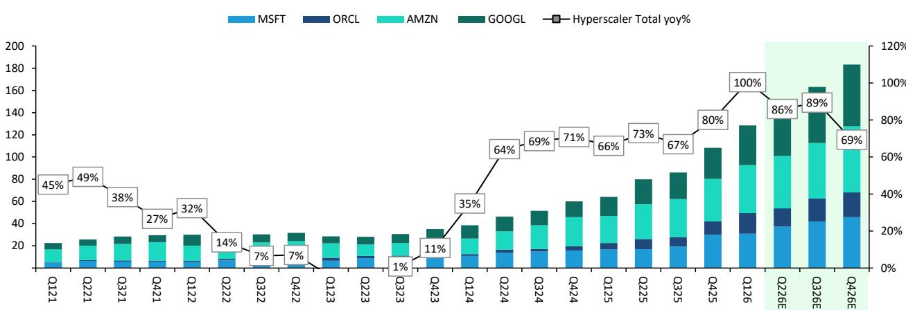  
Based on calendar quarters (Calendar Q1 = Microsoft and Oracle FQ3). Forward estimates based on Bernstein estimates
Source: Company disclosures, Bernstein analysis and estimates

EXHIBIT 2: While cloud revenue growth has accelerated in the recent quarters, it needs to continue accelerating to keep up with the pace of capex growth

Quarterly Cloud Revenue: AWS+Azure+GCP+OCI  
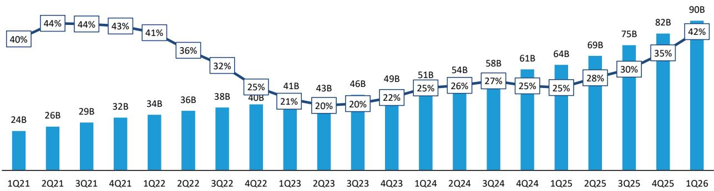  
Based on calendar quarters (Calendar Q1 = Microsoft and Oracle FQ3). Azure revenue based on Bernstein estimates
Source: Company disclosures, Bernstein analysis and estimates

EXHIBIT 3: On the other hand, ignoring contract duration, total backlog (RPO) growth has accelerated significantly across all hypersclaers in recent quarters, totaling \$2T as of 1Q26

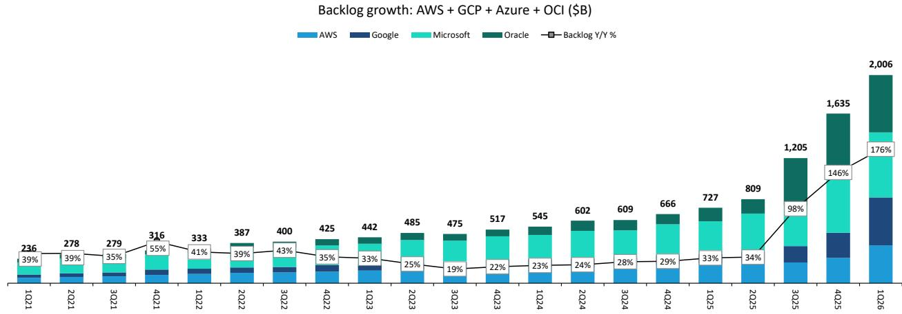  
Based on calendar quarters (Calendar Q1 = Microsoft and Oracle FQ3). Source: Company disclosures, Bernstein analysis

EXHIBIT 4: So, which tale would you rather believe?  
Y/Y Growth%: Revenue vs. Capex vs. CFO vs. Backlog  
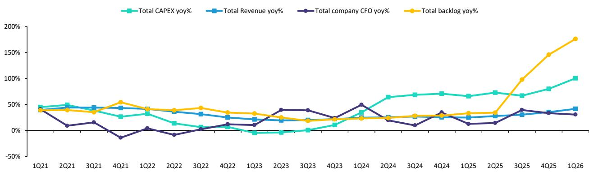  
Source: Company disclosures, Bernstein analysis and estimates

EXHIBIT 5: Meanwhile, as hyperscalers are running out of internal funding, to increase Capex further they likely need to (and have been) raise capital, through either debt or equity

Hyperscaler Cash Flow vs. Capex, CY 26E  
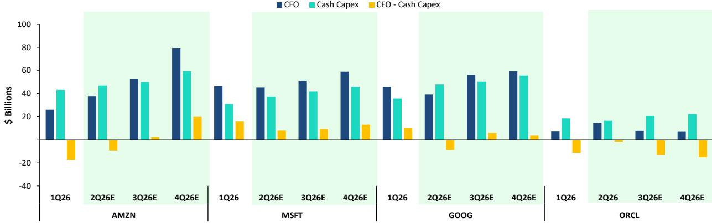

Based on calendar quarters (Calendar Q1 = Microsoft and Oracle FQ3). Forward estimates based on Bernstein estimates
Source: Company disclosures, Bernstein analysis and estimates

## DETAILS FROM LAST QUARTER'S RESULTS

Azure grew 39% in CC (40% reported) in 3FQ26, beating guidance of 37-38% CC. Management is guiding to 39-40% CC growth for next quarter, as well as “modest acceleration” in 2H CY26 as compared to first half. Management continues to take the long view in a supply constrained world, prioritizing 1st party applications and R&D while balancing strong customer demand for Azure. AI ARR, which includes Azure AI and SaaS Copilot revenues, surpassed \$37B this quarter. CAPEX including finance leases in 3FQ26 was \$31.9B with two-thirds spent on short-lived assets (predominantly hardware). FQ4 CAPEX is guided to >\$40B including \$5B higher pricing adjustment, while CY26 CAPEX is guided to \$190B including \$25B higher pricing adjustment. Microsoft’s capacity constraints can be seen in the recent announcement that Microsoft is going to rent capacity from Amazon AWS to meet the surging demands of GitHub (Quick Take on Microsoft: Capacity constraints are causing strange bedfellows) For a better understanding of the drivers of all of Microsoft’s CAPEX we recommend reading Microsoft: Could the bear case in fact be the bull case?

AWS delivered a strong quarter with 28% Y/Y growth to a \~\$150B run-rate, accelerating \~400 bps Q/Q, supported by robust backlog expansion up \~50% to \$364B (which notably does not include the \$100B+ deal signed with Anthropic). Momentum is underpinned by triple-digit Y/Y AI growth, rapid capacity buildout, and strong growth in core non-AI services, alongside a booming custom silicon business - with Trainium commitments reaching \~\$225B, chips revenue now exceeding \$20B ARR, and growing demand for Graviton (Amazon's CPU chip) to run agentic workloads. Margins remain resilient, with operating margins of \~38% margins up \~270 bps Q/Q even as infrastructure and depreciation costs rise. While near-term pressure is expected from elevated CapEx, custom chips can provide a key offset through efficiency gains.

Google Cloud delivered a standout 1Q26, with revenue surging 63% Y/Y to over \$20B and outpacing AWS in net new revenue, driven by strong demand for AI solutions alongside continued strength in core GCP and Workspace. Growth was reinforced by exceptional AI momentum, including rapidly scaling Gemini Enterprise adoption (paid MAUs up 40% Q/Q), \~800% Y/Y growth in revenue from products built on GenAI models, and first-party models now processing over 16B tokens per minute (vs 10B last quarter). Backlog nearly doubled Q/Q to \~\$462B, supported by robust enterprise AI demand and newly introduced TPU hardware sales (direct deployment of Google's custom AI chips into customer data centers expected to begin in 2H26 with the vast majority of revenues to be realized in 2027). Operating income tripled Y/Y to \$6.6B and margins expanded to \~33% (up an impressive \~300 bps Q/Q from \~30% in 4Q25 and from 17.8% in 1Q25), and while higher depreciation from ongoing data center CapEx is a headwind, there is a lot of focus on balancing this headwind with efficiency gains.

Alibaba cloud revenue is reported on a gross basis inclusive of intra-Alibaba transfers. On this basis, revenue grew 38.2% year-on-year in the March quarter, while EBITA margin improved slightly to 9.1%. External revenues achieved c. 40% growth year-on-year, faster than 36% in the December quarter, while internal revenues saw growth moderating sequentially to 33%. AI-related product revenue grew in triple-digits year-over-year growth for the eleventh consecutive quarter, and contributed a sequentially higher proportion, now at 30%, of external revenues. RMB26.9bn of capex this quarter was on the low side versus

the RMB30bn a quarter run-rate we'd modeled.

Oracle OCI continues to grow far faster than its larger peers and is still accelerating. In 4FQ26, OCI revenue reached \$5.8 billion, up 93% (92% in CC). Total RPO increased \$85B to \$638B this quarter up 363% Y/Y. Most of the sequential RPO increase last and this quarter was driven by prepaid/bring-your-own-hardware AI contracts, which requires minimal cash outlay from Oracle. cRPO grew 68% Y/Y. CAPEX for FY26 came in at \$55.7B, including \$4.6B from customer prepayments and a \$3.3B short-term financing term benefits, resulting in \$47.7B net cash outlay. For FY27 company is guiding to 90-95B CAPEX, which includes \$20-25B in customer prepayments, resulting in a guidance of a \$70B net cash outlay. This past quarter, Oracle announced an additional \$20B capital to be raised in FY27, which could be debt or equity. Next quarter Oracle expects to add \~1GW of datacenter capacity and over the next 3 years, Oracle expects to bring 10GW of data center capacity online. We recently updated our 5-10 year Oracle scenario (Link) and expect minimum to no further funding needs after this raise.

Coreweave continues to see exceptional demand-driven growth but remains constrained by scaling-related margin pressure. In 1Q26, revenue reached \$2.1B (+112% Y/Y, +32% QoQ) with backlog expanding to \$99.4B (\~4x Y/Y) on over \$40B of new bookings, highlighting strong visibility and continued AI infrastructure demand. However, profitability lags meaningfully, with adjusted operating income of just \$21M (0.5% margin) as the company incurs lease, power, and depreciation costs ahead of revenue recognition during the 1–2 month deployment cycle. Management maintained FY26 revenue guidance at \$12–\$13B despite the beat and raised CapEx to \$31–\$35B, reinforcing the capital-intensive nature of the model, while guiding to 2Q revenue of \$2.45–\$2.6B and adjusted operating income of \$30–\$90M, implying only modest near-term margin improvement; we discuss the feasibility of CRWV's FY26 AOI guide here.

EXHIBIT 6: The five hyperscale providers report Cloud revenue, which includes not only IaaS/PaaS but also other revenues  
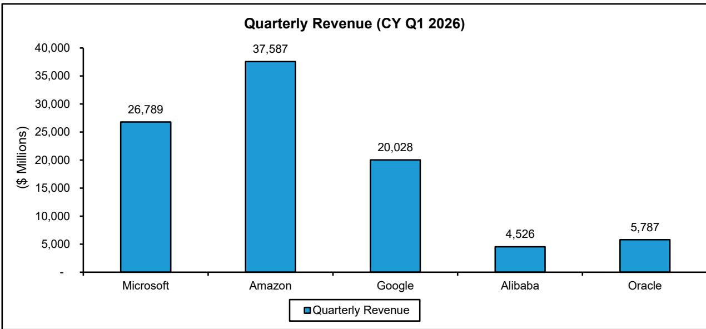  
Google includes Workspace. Microsoft Azure revenue is based on our estimates.

Please note that Alibaba no longer provides cloud revenue excluding internal transfers. Our revenue number is an estimate based on historical data. Source: Company reports, Bernstein estimates and analysis

EXHIBIT 7: In Q1 CY26, Microsoft Azure grew 40% Y/Y, Amazon's AWS grew 28% Y/Y, Google's Cloud grew 63% Y/Y, Alibaba grew 38% Y/Y, and Oracle grew 93%  
  
Please note that 1) Alibaba no longer provides cloud revenue excluding internal transfers. Our revenue number is an estimate based on historical data. 2) Microsoft Azure numbers are based on estimates and the new segmenting in FY25
Source: Company reports, Bernstein analysis and estimates

EXHIBIT 8: On a Q/Q basis, AWS added \$2.0B vs Azure at \$2.5B vs Google Cloud at \$2.4B vs Oracle at \$0.9B  
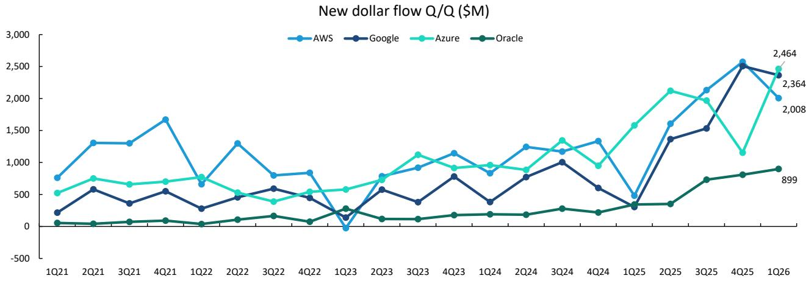  
Source: Company reports, Bernstein estimates and analysis

EXHIBIT 9: Of the incremental dollars added Q/Q by the hyperscale Cloud providers (excluding BABA), Google and Oracle have gained incremental shares this quarter.  
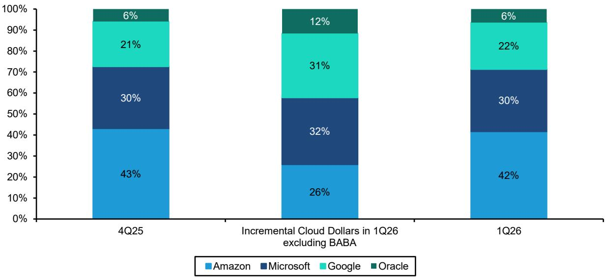  
Microsoft Azure numbers are based on estimates  
Source: Company reports, Bernstein analysis and estimates

EXHIBIT 10: Q over Q, incremental share gained by each hyperscaler (excluding Alibaba)  
  
All quarters represent calendar quarters, Google's cloud revenues include both GCP and Workspace.  
Microsoft Azure numbers are based on estimates.  
Source: Company reports, Bernstein estimates and analysis

With that context in mind, we provide some highlights from each of the five companies' results last quarter.

## HIGHLIGHTS FROM THE QUARTER

## Amazon AWS

\- Strong and steady performance against a high bar. AWS grew 28% Y/Y to a \~\$150B annual run-rate, marking \~400 bps of Q/Q acceleration from 24% in 4Q25 and the fastest growth in 15 quarters. Revenue increased by roughly \$2B Q/Q, representing the largest Q4-to-Q1 step-up in AWS history. That said, while top-line momentum remained impressive, the rising bogey encroaching 3-handle growth tempered some of the shine on an otherwise strong 28% Y/Y print.

\- Backlog grew to \$364B up \~50% from the \$244B announced in 4Q25. Notably, the \$364B backlog does not include the recent \$100B+ deal signed with Anthropic, and when excluding frontier lab contribution also points to the largest sequential step up in backlog commits.

\- Chips business grew 40% Q/Q in Q1, hitting a \$20B+ ARR, and growing triple-digit percentages Y/Y.

\- \$225B in revenue commitments for Trainium. Trainium2 has about 30% better price performance than comparable GPUs and is largely sold out. Trainium3, which just started shipping at the start of 2026, and is 30% to 40% more price performance than Trainium2, is nearly fully subscribed. Much of Trainium4, which is still about 18 months from broad availability, has already been reserved. Amazon Bedrock used expansively by over 125k customers runs most of its inference on Trainium.

\- Is CPU the new GPU? AI is commonly seen as a GPU story, but the rise of agentic workloads, real time reasoning, code generation, reinforcement learning, and multi-step task orchestration is driving massive CPU demand, putting a brighter spotlight on Graviton (Amazon's industry-leading CPU chip which delivers up to 40% better price performance than any other x86 processors). Recently, Meta signed an agreement for “tens of millions of Graviton cores” to power agentic AI.

\- AI revenue growing triple digits Y/Y supported by rapid pace of AI capability build. SageMaker is cutting training time by up to 40%, while Bedrock is driving surging demand, with 170% QoQ spend growth and Q1 token usage exceeding all prior years combined. OpenAI models are now available within Bedrock, and Amazon has introduced a preview of Bedrock Managed Agents powered by OpenAI. This introduces a stateful runtime environment that enables organizations to build and deploy generative AI applications and agents at production scale. As enterprises shift toward agentic workflows, most AI-driven value is expected to come from these intelligent, stateful systems. OpenAI has noted unprecedented demand for these agent frameworks, and Amazon is seeing similarly high customer interest.

\- Evidence of tractions across a suite of products. Strands can be used to build agents with proprietary data, and downloads exceeded 25 million / tripled QoQ, while AgentCore is enabling production-scale deployments with agents launched as frequently as every 10 seconds. Turnkey tools like Kiro, Transform, and Quick are also gaining momentum - Kiro usage more than doubled, enterprise adoption rose nearly 10x, Transform has saved over 1.5 million hours, and Quick customers grew more than 4x QoQ - highlighting broad-based demand across the portfolio.

\- Strong correlation between AI spend and core growth. Amazon continues to see customers seeking the full benefit of AI are accelerating their transition to the cloud. As customers scale AI workloads, they increasingly rely on adjacent non-AI offerings across compute, storage, databases, analytics, and security. AWS's breadth and depth across these core services reinforces its position, with AI acting as a catalyst for broader platform consumption.

\- Data gravity. Amazon emphasized that as customers scale AI, they prefer to run inference close to where their data and applications already reside. Given AWS holds a larger share of enterprise data than any other platform, this creates a natural advantage, reinforcing customer choice and deepening platform adoption.

\- Reiterated confidence on long-term AWS CapEx. AWS deploys capital about 6-24 months before it can start billing customers, but these investments fund long-lived assets such as data centers lasting $30+$ years and hardware (chips, servers, networking gear) lasting 5 to 6 years. It's worth nothing: in times of very high growth, like now, when the CapEx growth meaningfully outpaces the revenue growth, the early years free cash flow can end up being challenged.

EXHIBIT 11: AWS Backlog grew to \$364B up \~50% from the \$244B announced in 4Q25  
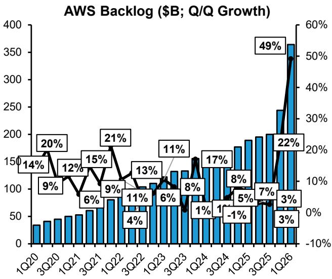  
Source: Company reports, Bernstein analysis  
EXHIBIT 12: AWS average contract life rose Q/Q to 5.5 years in 1Q26  
AWS Weighted average contract life (Yrs.)

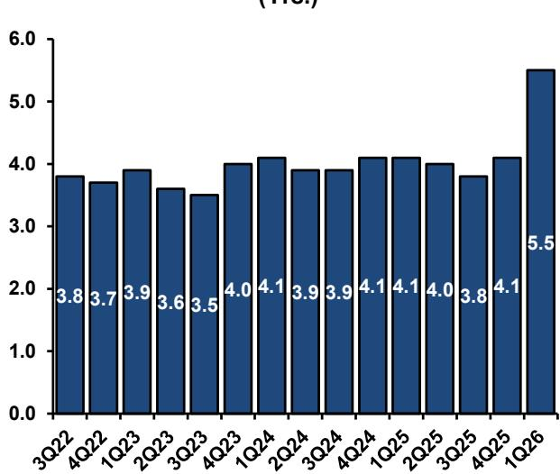  
Source: Company reports, Bernstein analysis

## Microsoft Azure

\- Microsoft Azure (Exhibit 13), now predominantly PaaS/IaaS, grew 39% in CC (40% reported) this quarter, beating guidance and slightly ahead of consensus. Management is guiding to 39%-40% CC growth for next quarter, as well as “modest acceleration” in 2H CY26 as compared to first half. Management continues to take the long view in a supply constrained world, prioritizing 1 $^{st}$ party applications (Copilots) and R&D while balancing strong customer demand for Azure.

\- AI ARR surpassed \$37B ARR. Microsoft AI ARR, which includes Azure AI and SaaS Copilot revenues, surpassed \$37B this quarter (3FQ26), growing 123% YoY. We believe that the majority of SaaS AI ARR (which we estimate to be \$6-7B) comes from M365 Copilots, which have 20M paid seats this quarter and seat addition is accelerating. What this AI ARR means is that This means that AI is a driver of growth for Microsoft, not a headwind: > 11% of Microsoft's total revenue is growing triple digits, which means AI is contributing meaningfully to Microsoft's top line growth.

\- Note that Microsoft Office 365 paid seats grew 33% QoQ to 20M and is expected to add more than 5M seats next quarter and more seats in the $2^{nd}$ half of CY26 than in the $1^{st}$ half. This strong demand is taking capacity that otherwise could have been applied to Azure growth. In addition, we recently learned (Quick Take on Microsoft: Capacity constraints are causing strange bedfellows) that GitHub usage increased from 1B code commits (saving of code changes) to a run rate of at least 14B as of April 2026. While the increased coding is believed to be driven by AI coding tools the capacity demand is impacting traditional CPU based datacenter capacity. The combination of these two show the strong demand Microsoft is seeing on their $1^{st}$ party apps which are impacting the growth rate of Azure. Note that Microsoft it would seem is going to use AWS for the increased GitHub CPU based capacity demand rather than take capacity away from the Azure demand side.

\- Commercial RPO reached \$627B this quarter, growing 26% excluding OpenAI and 99% including the OpenAI's \$250B + commitment. Weighted average contract duration is 2.5 years. Roughly 25% will be recognized over the next 12 months, growing 39%. The remainder is recognized > 12 months and grew 138%. Within the RPO AI contracts are typically longer duration (6 years and in some cases longer), but we note management is not including all the committed revenue especially in outer years for risk management purposes ("net of reserves").

\- What's driving Azure growth: We believe the demand is very broad and no longer purely on AI side as seen by the GitHub demand discussion above. In addition, there is increased AI demand for inferencing, training, and tuning as well as the

movement of on-premise apps and databases to the Cloud facilitates and streamlines building AI and this could be one of the reasons for the strong growth.

\- Note that if you move your on-premise app and databases into Azure you are most likely to use Azure AI and less likely to use 3rd party Cloud offerings which creates another revenue stream for Microsoft. Moreover, as enterprise developed AI moves from development to testing (which is still very early days) the amount of non-GPU usage could increase (as just seen with AI coding tools increasing GitHub code commits). Almost all enterprise AI apps will query corporate data (driving database usage) and are wrapped by application code that runs on CPUs. In other words, the shift to inferencing should have a meaningful positive impact on Azure non-AI growth. In addition, a good portion of Agentic AI is run on traditional non-GPU hardware which, we believe, will increase non-GPU usage as Agentic becomes more prevalent (Generative AI 401: Agents Primer).

\- CAPEX (Exhibit 14) including finance leases this quarter was \$31.9B, up 75% Y/Y. Cash paid for PP&E was \$30.9B. Roughly two-thirds of CAPEX was spent on short-lived assets including GPUs and CPUs. Management expects FQ4 total CAPEX to increase to >\$40B, which includes roughly \$5B from higher component pricing and impact from finance leases. Management also guided to \$190B Capex for CY26, which includes approx. \$25B from the impact of higher component pricing. Note that if one excludes the higher component pricing (mostly memory) then CAPEX growth is slowing, and we believe will be growing slower over time than Azure.

\- Note that higher CAPEX is going to translate into increasing D&A which will incrementally impact margins. However, we continue to believe that the Cloud revenue strength and Microsoft's tight cost control will help offset at least part of this and with CAPEX growth slowing the headwind will likely abate. We deep dived into Azure margins here: Microsoft: Azure AI margins, and its implications for next 5 years

\- CAPEX spending has shifted over the last few quarters from 60% Land, Buildings and Improvements to 2/3 spending on servers. We see this as a good sign that the rebuilding of datacenters for mixed use (CPU and GPU) is likely decreasing and datacenter spending is now more focused on increasing demand. We note that the company is also leveraging datacenter leasing and shorter term Neocloud contracts to bring capacity on-line quicker. We also believe that as the shift continues from long life assets to shorter term assets (6 years), CAPEX will likely grow much more inline with Cloud revenue growth and then slower than revenue.

## EXHIBIT 13: Microsoft Azure constant currency growth

Azure Revenue growth (CC)  
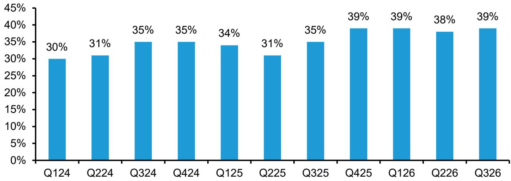  
Source: Company disclosures, Bernstein analysis

EXHIBIT 14: CAPEX has gone up as Microsoft continues to invest in AI to meet demand

Microsoft Total Capex (Cash + Financial Lease), in \$B

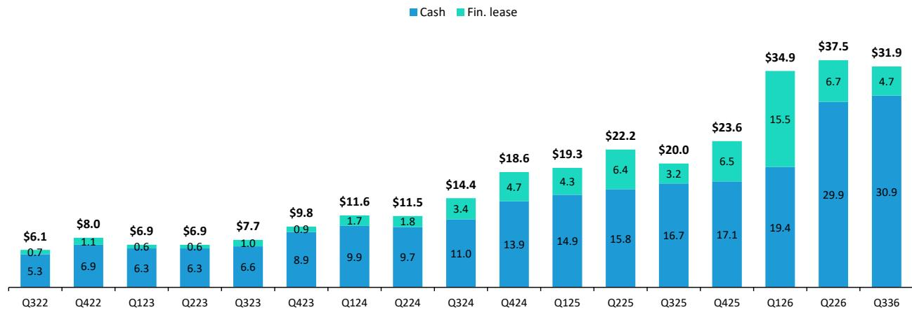  
Source: Company reports, Bernstein analysis

## Google Cloud

\- Google Cloud is gaining solid ground, with revenue surging 63% Y/Y to exceed \$20B for the first time - an acceleration of \~15 ppts from 48% Y/Y growth in 4Q25. After running nearly neck-and-neck with AWS last quarter on net new revenue (AWS \~\$2.6B vs Google \~\$2.5B), Google pulled ahead this quarter, adding \~\$2.4B Q/Q versus AWS at \~\$2B. The largest contributor to Cloud's growth this quarter was AI Solutions, driven by strong demand for industry-leading models including Gemini 3.

\- Core GCP continues to be a sizable contributor, driven by demand for infrastructure and other services such as cybersecurity and data analytics. Workspace again delivered strong double-digit revenue growth, driven by an increase in the number of seats and the average revenue per seat.

\- Honorable mentions for the Q: Backlog nearly doubled Q/Q to \~\$462B driven by strong enterprise AI demand and the inclusion of newly announced third-party TPU hardware sales.

\- Third-party TPU sales. Google will start delivering TPU hardware directly into select customers' data centers. Revenue recognition from these agreements will be back-ended for 2026 with only a small contribution expected later this year and the bulk materializing in 2027. Given the hardware nature of these deals, revenue will likely be inherently lumpy and dependent on shipment timing, leading to quarter-to-quarter variability.

\- While TPU deals are now part of the backlog, the mix remains predominantly core GCP contracts. Google expects just over 50% of the total backlog to convert into revenue over the next 24 months.

\- Continued innovation on TPUs. At Cloud Next, Google introduced its eighth-generation TPUs, purpose-built for both training and inference to support demanding agentic AI workloads. TPU 8t delivers roughly 3x higher training processing power and 2x performance versus the prior generation, while TPU 8i focuses on efficient inference with \~80% better performance per dollar.

\- Strong traction for Gemini Enterprise with paid monthly active users growing 40% Q/Q and revenue from products built on GenAI models surging nearly 800% Y/Y. Customer momentum remains robust, with new customer acquisition doubling Y/Y, a sharp increase in large deals (including a doubling of the number of \$100M to \$1B contracts Y/Y) and customers outpacing their initial commitments by 45%. This is being reinforced by the introduction of the Gemini Enterprise agent platform, enabling enterprises to build and govern agentic workflows at scale. At the same time, as evidence of a rapidly expanding partner ecosystem - there was a 9x Y/Y growth both in seats sold with partners and in the number of partners

adopting it for internal use. Over the past 12 months, 330 Google Cloud customers each processed over 1T tokens, and 35 reached the 10T token milestone.

\- AI model momentum. First-party models now process more than 16B tokens per minute via direct API use by customers, up from 10B last quarter.

\- Rapid progress continues across AI models led by Gemini 3.1 Pro, which is pushing the frontier in reasoning, multimodal capabilities, and cost efficiency. The broader Gemini 3.1 family - including Gemini Flash models - expand developer choice with more cost efficient models. Momentum extends to generative media, where Lyria 3 (music), Nano Banana 2 (images), and Veo 3.1 Lite (video) are seeing strong adoption, while Gemma 4 is driving significant traction in open models. At the same time, advancements like Antigravity signal a shift toward fully agentic workflows, enabling autonomous digital task orchestration and accelerating development velocity.

\- Shout out to Wiz exceeding expectations. Accelerating AI-driven cyber threats are fueling strong demand for Google's agentic defense offerings, with its combined AI and cybersecurity expertise resonating with customers. The Wiz acquisition (closed in March) stands out as a highlight - performing ahead of expectations and proving to be a strong strategic fit. Customer interest in the combined security portfolio has been robust, and with Wiz integrated alongside Google's threat intelligence, security operations, and AI models, the company is meaningfully enhancing its ability to help organizations detect, prevent, and respond to evolving threats.

EXHIBIT 15: Google cloud's backlog of \$460B nearly doubled Q/Q

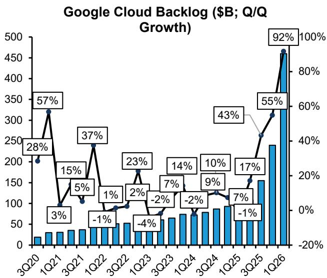  
Source: Company reports, Bernstein analysis  
EXHIBIT 16: Revenue/backlog ratio significantly increased sequentially for Google Cloud

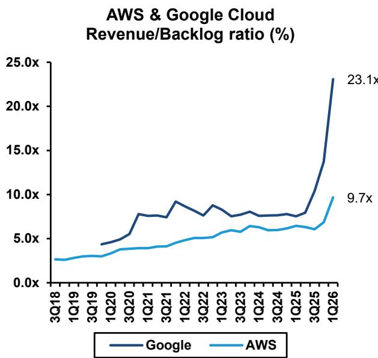  
Source: Company reports, Bernstein analysis

## Alibaba

\- Alibaba's cloud revenue is reported on a gross basis inclusive of intra-Alibaba transfers, and grew $38.2\%$ year on year to RMB41.6bn (Q4 FY3/25: RMB30.1bn) in the March quarter. Adjusted EBITA margin improved to $9.1\%$ , and was 110bps higher than $8.0\%$ a year earlier. Accordingly, RMB3.8bn of Alicloud EBITA was $56.9\%$ higher year on year.

\- Public cloud revenues continued to drive growth. Alicloud revenues as reported reflect a c. 28% contribution from internal workloads. According to Alibaba, AI-related revenues grew the triple-digit percentages for the eleventh consecutive quarter, and contributed c. 30% of external cloud revenues.

\- ARR of AI-related product revenue reached RMB36bn. Alibaba disclosed, for the first time, an ARR figure for its AI-related product revenue, noting that its AI and cloud commercialization has reached an inflection point. The company expects this segment to account for more than 50% of external cloud revenues by the end of this fiscal year. Within this total, ARR from MaaS and AI-native software subscriptions is projected to exceed RMB10bn in the June quarter and further scale to over RMB30bn by the end of FY3/27E.

\- Incremental cash margins still in the 30-40% range. Adding back the group-level delta in depreciation and amortization to Cloud EBITA this year and last implies an incremental cloud EBITDA margin of close to 40%. Speaking around the quarter, the company noted that recent price increases have been well received by customers, as demand continues to exceed supply. Meanwhile, MaaS revenue growth is expected to be margin accretive to the business, leading the company to explicitly guide for low-teens Cloud EBITA margins in the June and September quarters.

\- Capex. Alibaba reported RMB26.9bn of capex at the group level in the March quarter, lower than the RMB30bn or so run rate implied by the company's prior guidance for RMB380bn of capex in three years. We expect quarter to quarter lumpiness to persist in Alibaba's quarterly capex, reflecting tightness in the supply of GPUs. Addressing a question on the capex required to reach \$100bn external cloud revenues, the company pointed to a ten-fold increase in server capacity versus 2022 levels.

\- Alibaba Token Hub. Since establishing the new business unit in March, Alibaba has continued to roll out new products. In May, Qwen was fully integrated into the Alibaba e-commerce ecosystem, including the integration of Taobao e-commerce services into the Qwen app and the launch of the Qwen Shopping Assistant within the Taobao app. In June, the company announced a major upgrade to the Alipay app, redesigning it around AI capabilities.

## Oracle

\- Oracle OCI continues to grow far faster than its larger peers and is still accelerating. In 4FQ26, OCI revenue reached \$5.8 billion, up 93% (92% in CC).

\- To get a full view of the impact of the AI datacenter build out on Oracle's financials we have created a 5-10 year view which we updated after Oracle's last earnings (Oracle: The story is better than we thought, with better upside potential). We recommend that anyone trying to understand the long term value creation of AI IaaS/PaaS should read this and our associated notes.

\- RPO growth with no additional CAPEX: Total RPO increased \$85B to \$638B this quarter, up 363% Y/Y. Most of the increase in RPO in FQ3 and FQ4 were driven by customer-prepaid or bring-your-own-hardware AI contracts and requires minimal to no additional funding needs from the company. Management stated that the customer-prepaid or bring-your-own-hardware AI contracts

\- cRPO grew 68% Y/Y and represents approx. 12% of RPO. Moreover, company confirmed that the margin profile on prepaid / bring your own hardware contracts are similar to the regular AI contracts.

\- CAPEX: To support this level of OCI revenue growth requires CAPEX. CAPEX in 4FQ26 was \$7.4B, of which \$4.6B is from customer prepayments. Total FY26 CAPEX ended at \$55.7B, including \$4.6B from customer prepayments and \$3.3B short-term financing term benefits, resulting in \$47.7B net cash outlay. For FY27 company is guiding to 90-95B CAPEX, which includes \$20-25B customer prepayments, resulting in a guidance of \$70B net cash outlay.

\- Oracle does not build datacenters and the CAPEX will be mostly from hardware. The multiple ways to finance include 1) debt, while maintaining IG rating; 2) equity; 2) vendor financing 3) customers bringing their own hardware.

\- Oracle started to present the net cash outlay metric this quarter (4QF26) to help illustrate cash use from the company's perspective and address some investor concern on the size of the funding needs.

\- Margin impact of component cost increases: Management stated on the earnings call and reiterated with more details on the call back that for projects that management has clarity and line-of-sight to pricing, Oracle has fixed priced contracts (for OCI these are the contracts going live shortly) but for contracts with longer time durations or where the pricing could vary, Oracle has conditions in their contracts that allow them to pass along those costs. In other words, Oracle's gross profit dollars will not be meaningfully impacted by price increases.

\- The new CFO, who started this quarter, is focusing investors on the question of Return on Invested Capital (ROIC) which she explained will be in the 20s for OCI AI datacenters

\- \$20B more capital raise in FY27: Oracle raised \$43B in debt and \$5B in equity financing in FY26. In FY27 the company expects to raise \$40B which comprises the remaining \$20B equity financing previously disclosed plus an additional \~\$20B which could be a mix of debt and equity (no details yet). No additional debt will be raised in FY27.

\- AI datacenter capacity: Oracle has 1.2GW of capacity and expects to add almost 1 GW of capacity in next quarter (1FQ27). Oracle has secured more than 10GW of data center capacity (SQ FT plus power) that will likely come online over the next three years, with a vast majority of the capacity already contracted out.

\- Cloud Database: Oracle's OCI revenue includes the Oracle Cloud database which is a fast-growing business Cloud database. Cloud database grew 29% YoY to \$0.8B in 4FQ26 with Multicloud Database revenue up 404% Y/Y.

\- Multi-cloud partnerships are very important to Oracle: from a revenue standpoint, the multi-cloud agreements enable customers to run the Oracle database in their preferred cloud and the majority of the database revenue would come to Oracle. From a margin perspective, Oracle is expected to achieve high margins (potentially SaaS level margins) on the database as Azure/GCP/AWS are covering the cost of power, electricity and real estate. This business model also incurs no marketing and very little sales cost to Oracle and Oracle has the sole power to set pricing and quote customers.

\- Oracle has previously guided database cloud to be \~\$20B in FY30 vs. \$2.4B In FY25, implying 53% CAGR.

\- OCI Gen 2 is technologically different from AWS, Azure and GCP and that difference is allowing Oracle to win in sub-sets of the market that are not well served by their bigger competitors. We discuss the differences at length in our recent notes (see Key takeaways from OCI expert call, Key takeaways from visiting an OCI datacenter and meeting OCI management).

EXHIBIT 17: OCI revenue guidance through FY30 (CY29-30) EXHIBIT 18: Oracle RPO and CRPO

OCI 5Y Revenue Guidance (FY26-30)

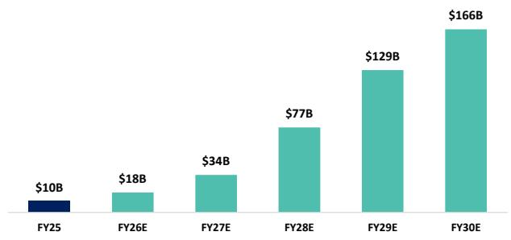  
Source: Company reports, Bernstein analysis

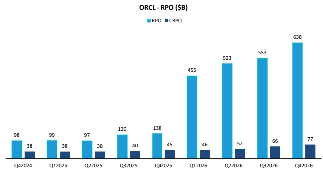  
Source: Company disclosures, Bernstein analysis

## WHAT ABOUT MARGINS?

AI, we believe, is going to be a drag on gross margins at least during the build-out phase and possibly much longer for IaaS/PaaS. Frontier lab consumption (training and inferencing) is a form of IaaS while enterprise inferencing is effectively PaaS. Thus, the mix of customer type and workloads will influence margins, but near term this is a scale game creating headwinds to overall margins. Meanwhile, 2 questions overhang the buildout of AI capacity in general:

\- Supply / demand questions for AI capacity. If there is an overbuilding occurring then pricing for rental of bare metal (or low software) capacity could be hit.

\- What is the real useful life for GPUs? For the last few years, the change in the useful life of servers and related hardware has created a mixed impact to margins for Amazon, Microsoft and Google, but that may be changing: AI workloads are wearing out servers faster than Amazon had expected. We saw in 2025 that Amazon lowered the useful life of a subset of their servers from 6 to 5 years, likely due to the shorter life of GPU servers. On the other hand, Microsoft increased the useful life of servers and networking equipment to 6 years in 4Q22. The change comes about from improvements in their hardware, software and data center designs, which is feasible, but it is unclear how many additional efficiencies can be gained.

• We try and answer some of these questions in the note: AI Value Chain: Can you really run a GPU for 6 years?

\- For investors looking over a longer horizon on this topic comparing to CPU-centric workloads, we wrote Global Software Long View: Cloud CAPEX - what does it really cost to offer IaaS / PaaS?.

\- Microsoft is now talking about AI margins be similar to non-AI margins (Global Software: Why you want to own Microsoft - Key takeaways from meetings & marketing with management) which is very different from the way many on the street is currently interpreting the long term value of AI and especially AI IaaS/PaaS.

\- One interesting takeaway from recent earnings is how the companies are treating the recent increases in component costs. Oracle specifically explained that where they have clarity and line-of-sight to pricing, Oracle has fixed priced contracts (for OCI these are the contracts going live shortly) but for contracts with longer time durations or where the pricing could vary, Oracle has conditions in their contracts that allow them to pass along those costs. In other words, Oracle's gross profit dollars will not be meaningfully impacted by price increases. We do not yet know if how the other hyperscalers will, if at all, pass along to customers the cost of component price increases.

## Based on company results and our estimates:

\- AWS operating income was \$14.2B, and margins landed at \~38% (up 270bps bps Q/Q from 35% in 4Q25). We expect margin compression ahead as AWS faces their annual SBC issuance in 2Q followed by expected higher infrastructure and depreciation related costs. That said, note that management's commentary on custom ASICs driving tens of billions in CAPEX savings and hundreds of bps of margin improvement may offer an offset. In 2025, Amazon delivered 4x improvements in Trainium2's token throughput. Since the majority of Bedrock's workloads run on Trainium, these efficiency gains also directly translate into more capacity to serve customers.

\- Microsoft does not report Azure margins. We estimate the Azure gross margins (GAAP) to be 56.4% in 3FQ26, down YoY where we estimated it to be 61.5%. Microsoft Cloud margins were 66%, a 3pp decrease Y/Y driven by scaling their AI infrastructure and growing AI product usage which the company is managing to offset through managing OPEX.

\- Microsoft is managing margins. While AI has been an incremental headwind, Microsoft will likely offset this near term via managing OPEX. Management is guiding to flat operating margin in FY26 Y/Y. We have written over the years how successful Microsoft has been at driving operation leverage. This has been visible in the fact that GAAP margins improved as the company shifted to the Cloud (a feat few have accomplished).

\- We recently did extensive work on Azure AI and non-AI margins (Microsoft: Azure AI margins, and its implications for next 5 years). Based on our estimate of gross margin for total Azure and AI revenue, we estimate that core Azure (non-AI) revenue has a gross margin of \~65%, which is roughly inline with historical trends but lower than the maximum gross margins of \~70%. To understand the decrease in peak margins we recommend you read the note.

\- Microsoft has started recently to talk about how AI margins will not be dissimilar to non-AI margins across the business (Global Software: Why you want to own Microsoft - Key takeaways from meetings & marketing with management).

\- Google Cloud operating income hit \$6.6B, tripling Y/Y, with operating margin up once again to \~33% (up an impressive \~300 bps Q/Q from \~30% in 4Q25 and from 17.8% in 1Q25). Margin expansion is being driven primarily by strong top-line growth, which creates operating leverage complemented by improved cost discipline and operational efficiency. While higher depreciation from ongoing data center CapEx is a headwind, there is a lot of focus on balancing this headwind with efficiency gains. Note that Google expects an LSD% headwind to Cloud's operating margin for the remainder of 2026 related to the Wiz acquisition.

\- Alibaba reports an adjusted EBITA margin for its Cloud segment, inclusive of internal workloads that are now recognized as revenue. In the March quarter, Alibaba Cloud's adjusted EBITA margin improved slightly to $9.1\%$ sequentially, or up 110bps year on year.

\- One of the key debates we’ve had with investors has been the impact of Alibaba’s massive new investment plan and whether incremental contribution margins can offset the higher depreciation burden from increased capex. Speaking around the quarter, management reiterated its long-term EBITA margin target of 20%, supported by a shift toward higher-margin business models—moving from selling compute to selling intelligence—as well as potential efficiency gains from its in-house T-Head chips.

\- In the near term, the company explicitly guided for Cloud EBITA margins to increase to low-teens in upcoming quarters, supported by customers' willingness to absorb price increases. However, elevated losses in the All Other segment remain an overhang on investor sentiment.

\- Oracle is entering a massive investment phase as they build out AI Cloud capacity. This will weigh on gross margins, but the company is driving operating efficiency and operating leverage to offset the impact of all the CAPEX. We detailed how all of Oracle's key financial metrics will be impacted by the step-up in investment in Oracle: The story is better than we thought, with better upside potential. This note is based on Oracle's latest financial results and guidance and should be used, we recommend, to understand the shape and direction of key metrics as the company invests in the build out and beyond.

\- Oracle supplied at their recent Financial Analyst Meetings (Oracle: Placing in perspective recent news articles and what to expect from the Financial Analyst Day) guidance on the margins of the different parts of their OCI business:

\- OCI AI infrastructure segment is expected to have non-GAAP gross marinas of 30-40%. The margin range is driven by the fact that Oracle is delivering a different product mix to each customer (e.g. training, inferencing, use of Oracle infrastructure software etc.) and by location driven by datacenter costs including power.

\- OCI distributed Cloud offering will have non-GAAP gross margins in the range of 40-60%. Again the margin range depends on the services used by the customers.

\- Cloud native customers will also have non-GAAP gross margins in the range of 40-60%

## COMPARING THE 5 GLOBAL HYPERSCALE CLOUD PROVIDERS

Most of the 5 hyperscalers (Amazon, Microsoft, Google, Oracle and Alibaba) report some form of Cloud revenue. Based on reported data and our estimates, Amazon AWS continues to be the largest (see Exhibit 6) but many of the others are attempting to catch up, growing faster off a smaller base.

Please note that most of the four include revenue other than IaaS/PaaS revenue within their Cloud business. For example:

• Amazon includes within AWS 3 $^{rd}$ party software, professional services, and other services (e.g. Alexa services).

\- Microsoft does not report Azure revenue, but we estimate.

\- Following the recent resegment, Microsoft moved most of the SaaS components out of Azure (EMS and Power BI, most of Nuance) and the new Azure now is a predominantly PaaS/IaaS business. See more details here: Microsoft: The periodic game of Musical Chairs with revenue

\- Please note that Microsoft reports Commercial Cloud revenue but that includes Azure, Office 365, Dynamics 365, and LinkedIn.

\- Google includes Google Workspace (formerly known as G-Suite) within the Google Cloud.

• Alibaba includes $3^{rd}$ party software and enterprise services, cloud desktop, etc. within the Alibaba cloud marketplace.

\- Oracle OCI includes the company's old hosting business, which is now de minimus as well as Cloud @ Customer and Multi-Cloud database (Oracle database at Microsoft, Amazon and Google). The Multi-Cloud database

\- What is very interesting and informative is the appearance this year of Anthropic (private) and OpenAI (private) in CY25 Gartner PaaS data with OpenAI passing

While each of the four global hyperscale Cloud providers supply some data or metrics on their Cloud businesses, the information is not complete (e.g., margins are not always supplied) nor easily comparable. Exhibit 19 shows the limited data that the five largest IaaS/PaaS vendors supply. Adding to the complexity of comparing the businesses, revenue (when disclosed) is not pure IaaS / PaaS revenue, and therefore not comparable since it includes other revenues (e.g. SaaS, professional services, $3^{\text{rd}}$ party sales, other products).

EXHIBIT 19: Each of the IaaS/PaaS vendors supply limited data on the size and economics of their IaaS/PaaS businesses

<table><tr><td></td><td>IaaS / PaaS revenue</td><td>IaaS / PaaS margins</td></tr><tr><td>Amazon</td><td>Revenue supplied</td><td>GAAP EBIT</td></tr><tr><td>Microsoft</td><td>Size of Commercial Cloud but no direct data on Azure revenue</td><td>Limited margin commentary but no data</td></tr><tr><td>Google</td><td>Revenue supplied for Google Cloud (which includes Workspace)</td><td>GAAP EBIT supplied (which includes Workspace)</td></tr><tr><td>Alibaba</td><td>Alibaba Cloud Revenue supplied</td><td>Adjusted EBITDA margin supplied</td></tr><tr><td>Oracle</td><td>OCI Revenue supplied</td><td>Not Supplied</td></tr></table>

Source: Company reports, Bernstein analysis

## WHAT DATA INVESTORS ARE LOOKING FOR AND WHERE TO FIND SOME HELP ANSWERING THESE QUESTIONS

We believe that investors want to compare and contrast the different vendors (especially using the US vendors as a proxy for the Chinese hyperscale providers and the new entrants into the market) and understand the trajectory of each company's revenue and margins given that disclosures are often incomplete and different companies report at different times.

We believe that the six (formerly 4) main client questions are:

\- IaaS/PaaS revenue

• Current and long-term stable margins

• Competitive capabilities

• How much revenue could each vendor capture?

• How much of revenue is AI?

• What are the margins / ROIC of AI?

To help clients better understand these complex businesses the Global Software team published a series of notes looking at the Total Addressable Market (TAM) for IaaS/PaaS and estimated Microsoft Azure's long-term revenue opportunity. We pulled many of our Cloud and especially IaaS/PaaS notes into a Blackbook: Cloudification of Tech: The Sky's the Limit. We then wrote a note looking at how long it could take for Cloud saturation and whether everything moves to the Cloud (see Weekend Tech Byte: Can everything move to the Cloud overnight?) — for investors trying to get a perspective on how long this march to the Cloud is going to be accretive to revenue, we recommend this note.

We also published a note exploring the question: "how should one think about long-term capital intensity and COGs for IaaS/PaaS?" in Global Software Long View: Cloud CAPEX - what does it really cost to offer IaaS / PaaS?. This note helps explain the drivers of COGS. We recommend this note for anyone interested in IaaS/PaaS and wanting to understand long-term margins, and capital intensity.

Additionally, we looked at how the shift to the Cloud is impacting the rest of the tech stack — given the expectations that the shift to Cloud would negatively impact IT hardware. In our note Global Software: If software / Cloud wins in the shift to the Cloud then who loses?, we discussed our surprising results that to date at least, spending on IT hardware and related datacenter costs is not being negatively impacted. Instead, we believe that the margins generated by Cloud are coming from internal and external IT services. A thought-provoking note and one worth reading — if you have thoughts on how/ where we could be wrong, we would appreciate the feedback.

The Bernstein Tech team also published a note Global Tech: Big Tech's big spending... big returns? ) looking at CAPEX spending and how it related to revenue generation as well as how the large CAPEX spend will impact the leading tech companies.

Please note that some of the companies report results off calendar.

## HOW DOES GPU AS-A-SERVICE COMPARE TO TRADITIONAL CLOUD?

This quarter, we expand our scope to include CoreWeave, whose rapid emergence as a GPU-first neocloud highlights the increasing importance of specialized infrastructure providers in alleviating capacity constraints and reshaping the competitive dynamics of hyperscale AI deployment. Per our CRWV initiation, our view of CoreWeave's business model is that it serves as an interim capacity provider to hyperscalers and large AI customers—benefiting from near-term power and GPU scarcity, but facing longer-term sustainability challenges given a concentrated customer base, evolving buyer insourcing incentives, and structurally constrained returns relative to scaled cloud incumbents.

## Some highlights from the quarter:

\- Coreweave delivered strong top-line growth in 1Q26, with revenue reaching \$2.1B (+112% Y/Y, +32% Q/Q), driven by rapid conversion of contracted capacity into live deployments via its GPUaaS model. Demand remains strong, with CRWV's backlog expanding to \$99.4B (\~4x Y/Y and +50% sequential) following a record \$40B+ bookings quarter.

\- The company reported more diversification of its customer base particularly among the enterprise segment, specifically beyond foundation labs into verticals such as financial services and emerging AI applications, with multiple customers committing at scale ( $>$ 1B).

\- Coreweave continues to scale rapidly, surpassing 1GW of active power and reaching >3.5GW of contracted power, with over 400MW added in the quarter. Coreweave now operates across \~50 data centers and continues to expand through a mix of leasing and self-build strategies, with the majority of contracted capacity expected to come online by the end of 2027.

\- Workloads are increasingly shifting towards inference and production use cases, with inference now representing $>50\%$ of compute usage. Demand remains strong across GPU generations, with high utilization and pricing support as workloads evolve from training to inference and agentic applications.

\- 1Q adj. CapEx came in at \$6.8B in 1Q (vs \$1.9B in 1Q25 and \$8.2B in 4Q26), and FY26 guidance increased to \$31-35B (lower-end up from \$30-35B given in 4Q25), mainly reflecting increases in component pricing. To fund its capital expenditures, Coreweave has largely used debt collateralized by its GPU hardware and customer contracts (current total debt load stacks up at >\$25B), raising a succession of 5 delayed-draw term loans (DDTLs) since 2023.

\- In the quarter, Coreweave inked the \$8.5B DDTL 4.0, its first IG-rated financing, backed by its take-or-pay contract with Meta, with an effective interest rate of \~7%. We note that while Coreweave's marginal cost of debt has seemingly improved over DDTL 1.0 (issued July 2023, effective interest rate \~15%) as well as DDTL 2.0, 2.1, and 3.0 (issued May 2024, September 2025, and July 2025, respectively, all at 9-11%), DDTL 4.0 only has credit exposure to Meta, making it highly bespoke and potentially difficult to replicate—after all, there is a very finite number of Aa2+ hyperscalers in existence. As follows, we view DDTL 4.0 as a proof of concept for lower-cost, IG-level financing, rather than a repeatable baseline for Coreweave's broader funding strategy.

EXHIBIT 20: Software Moat Overview

<table><tr><td>CRWV Product / Capability</td><td>Function</td><td>CRWV</td><td>NBIS</td><td>Hyper-scalers</td><td>Replicability</td></tr><tr><td>Bare-Metal GPU (no hypervisor)</td><td>Software translator between a job + hardware, CRWV skips and runs workloads directly on raw hardware</td><td>√</td><td>√</td><td>√</td><td>Medium - OCI offers today; hyperscalers require architectural shift, but can get there</td></tr><tr><td>Node Lifecycle Controller (NLC)</td><td>24/7 robot inspector for each server; NLC immediately pulls out any irregular machine and replaces with a healthy one (virtually)</td><td>√</td><td>√</td><td>√</td><td>2-3 years: replicable concept, but requires GPU history of failure patterns; lead erodes with hyperscaler AI infra builds</td></tr><tr><td>Fleet Lifecycle Controller (FLC)</td><td>Similar to NLC, but watches entire fleet over time, catching flagging chips and identifying for replacement</td><td>√</td><td>√</td><td>×</td><td>2-3 years: replicable with investment, but hyperscalers lack singular focus today. CRWV&#x27;s most defensible moat, not irreplicable.</td></tr><tr><td>Nimbus / DPU Offload</td><td>Each CRWV server has a small secondary chip (BlueField DPU) for admin-type tasks</td><td>√</td><td>√</td><td>√</td><td>AWS Nitro is parallel concept and arguably more mature for cloud</td></tr><tr><td>Weights &amp; Biases Platform</td><td>Tool AI developers use to keep track of experiments; CRWV bought to augment platform</td><td>√</td><td>×</td><td>√</td><td>Hard to replicate, but W&amp;B runs on any cloud; not a true moat for CRWV today</td></tr><tr><td>Tensorizer</td><td>Fast model loading by streaming serialized models directly into GPU</td><td>√</td><td>×</td><td>√</td><td>Easy to replicate, open-source. Hyperscalers have their own options.</td></tr><tr><td>SUNK — Slurm on Kubernetes</td><td>Run HPC-style jobs alongside cloud-native jobs in one system</td><td>√</td><td>√</td><td>√</td><td>Largely open-source tooling; more of table stakes for serious AI cloud, not a moat</td></tr><tr><td>Observe+ Telemetry Relay</td><td>Shows customers the same hardware-level telemetry data the CRWV ops team sees</td><td>√</td><td>√</td><td>×</td><td>Tools are open-source, edge is GPU-specific dashboard and philosophy. Hyperscalers do not want to do this, it&#x27;s not a software moat</td></tr><tr><td>AI Object Storage + Zero Egress</td><td>Hyperscalers charge clients every time data leaves their network; CRWV does not, also has a protocol (LOTA) to feed training data to GPUs faster</td><td>√</td><td>√</td><td>×</td><td>Commercial advantage, not a technical advantage - hyperscalers could change course if they wanted to</td></tr><tr><td>ServerlessRL + ManagedRL Pipeline</td><td>Managed service to handle reinforcement learning plumbing so teams can just run experiments</td><td>√</td><td>×</td><td>×</td><td>Medium - early-mover advantage, but hyperscalers have the talent to build (potentially promising but not durable moat today)</td></tr><tr><td>Mission Control Agent</td><td>AI chatbot connected to live cluster telemetry to answer questions in plain English and fix in real time</td><td>√</td><td>×</td><td>×</td><td>Medium: requires GPU-specific domain knowledge and telemetry quality; hyperscalers reproduce with time</td></tr><tr><td>Proprietary SDK/ Abstraction Layer</td><td>CRWV has not built proprietary interfaces to make switching painful - leaving is technically straightforward</td><td>×</td><td>√</td><td>√</td><td>All four hyperscalers have years-deep proprietary platforms, unclear whether CRWV will attempt to build</td></tr></table>

Source: Company filings, AWS, Microsoft, Google, Seeking Alpha, Network World, Bernstein Analysis

EXHIBIT 21: GPU Cloud Landscape (Scale v. Sophistication)  
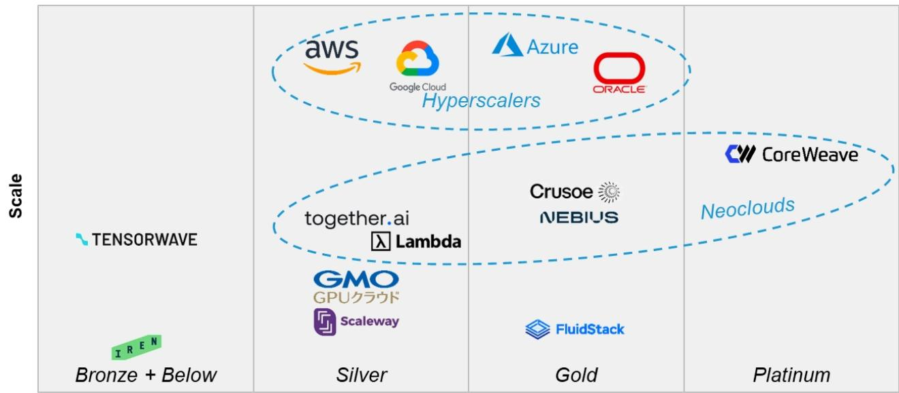  
Sophistication / (SemiAnalysis ClusterMAX 2.0)  
Source: SemiAnalysis ClusterMAX 2.0, Company fillings, U.S. Department of Energy Solstice announcements, Top500 / Green500, PitchBook, Bloomberg, Reuters, Financial Times, The Information, Bernstein Analysis & Estimates

EXHIBIT 22: CRWV Revenue Growth

CRWV Revenue Growth

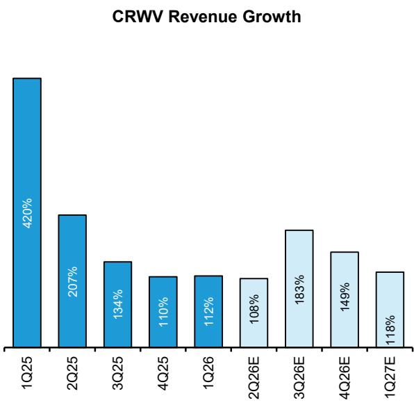  
Source: Company filings, Bernstein Analysis and Estimates  
EXHIBIT 23: CRWV Debt Overview (Times, %)  
CRWV Debt Overview

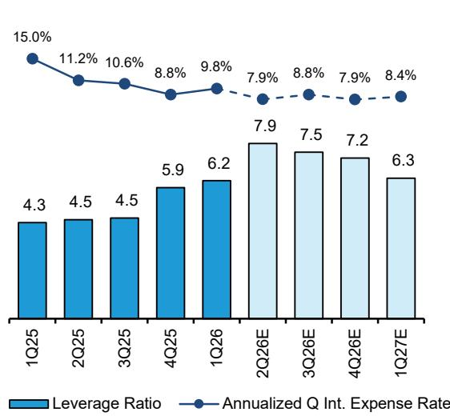  
Leverage calculated as LTM Adj. EBITDA over net debt
Source: Company filings, Bernstein Analysis and Estimates

EXHIBIT 24: CRWV CAPEX Expense (\$B, %)  
CRWV CAPEX Expense  
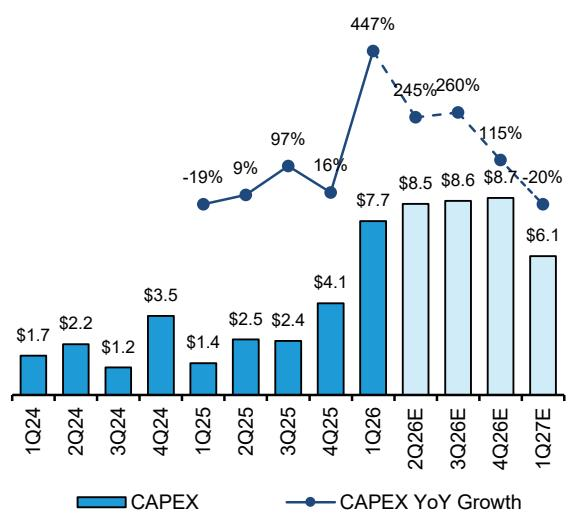  
EXHIBIT 25: CRWV Capital Intensity (Times)  
CRWV Capital Intensity

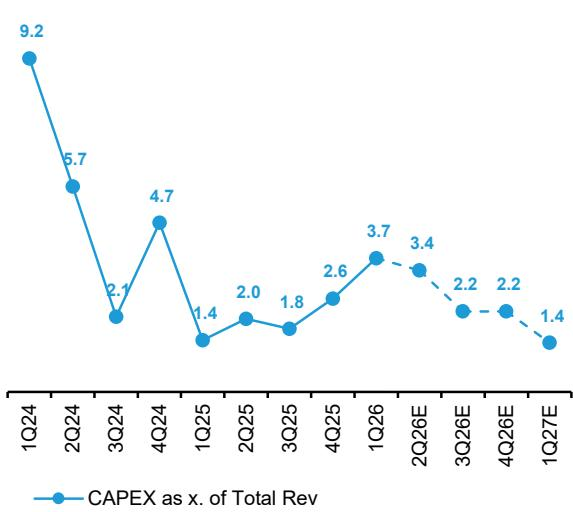  
Source: Company filings, Bernstein Analysis and Estimates  
Source: Company filings, Bernstein Analysis and Estimates

\- CoreWeave's margin profile is currently depressed by a structural OpEx–revenue lag. The company begins incurring lease expense, power costs, and depreciation on data center infrastructure as soon as a powered shell is delivered, but revenue is only recognized \~6–8 weeks later after fit-out, installation, and testing. This creates a recurring period where new capacity is a drag on profitability, especially given the pace at which facilities are being brought online. Management frames this as a timing issue that normalizes within one to two months, but at current growth rates—with capacity continuously ramping—this lag may become a persistent headwind. The key variables that will shape Coreweave's margin trajectory are:

\- Fit-out duration: longer deployment cycles extend the pre-revenue cost period and materially reduce reported margins. The company estimates a \~6-week lag on average.

\- Steady-state margin level: reflects normalized utilization and pricing, but remains uncertain given mix and cost variability. The company expects a steady-state margin of 25-30%.

\- Revenue growth: higher capacity additions increase the absolute dollar impact of the OpEx-revenue lag, delaying margin realization.

\- As a result, current margins are at FY26 trough levels, with 1Q26 adjusted operating margin at just \~0.5%, reflecting elevated pre-revenue costs and rapid deployment cadence. The company expects a ramp through the year (from low-single-digit toward the teens exiting 2026), but this relies heavily on execution and the assumption that scale will offset ongoing deployment drag.

\- Overall, while CoreWeave's long-term margin potential (allegedly mid-20s) appears structurally attractive, the company is currently in a phase where reported margins materially understate underlying economics due to scaling friction. Unlike more mature cloud platforms, where investment cycles and utilization are more balanced, CoreWeave's hypergrowth profile means margins will likely remain volatile and below steady-state levels for an extended period—introducing both execution risk and uncertainty around the timing of margin inflection. See more on our thoughts on the feasibility of CRWV's FY26 AOI guide here.

EXHIBIT 26: CRWV Adj. Operating Income (\$M)

CRWV Adj. Operating Income

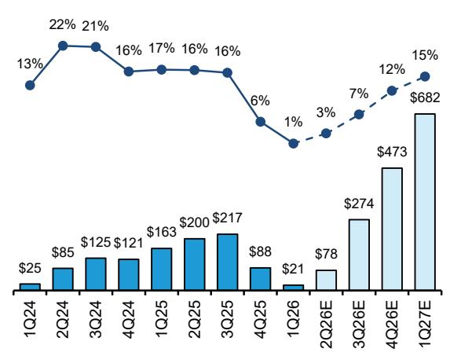  
Adj. Operating Income — Adj. Operating Income Margin  
Source: Company filings, Bernstein Analysis and Estimates  
EXHIBIT 27: CRWV Adj. EBITDA (\$M)

CRWV Adj. EBITDA  
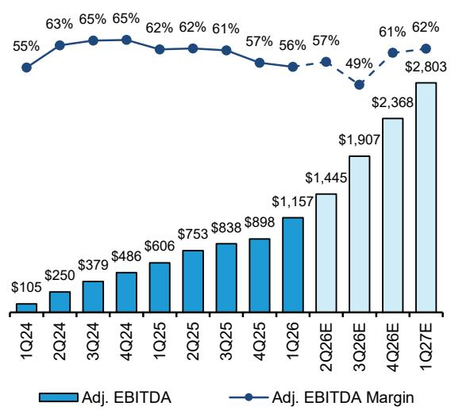  
Source: Company filings, Bernstein Analysis and Estimates

EXHIBIT 28: CRWV Diluted EPS (\$) CRWV Diluted EPS  
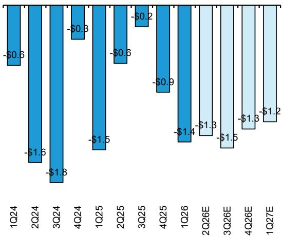  
Source: Company filings, Bernstein Analysis and Estimates

## I. REQUIRED DISCLOSURES

References to "Bernstein" or the "Firm" in these disclosures relate to the following entities: Bernstein Institutional Services LLC (April 1, 2024 onwards), Bernstein & Co., LLC (pre April 1, 2024), Bernstein Autonomous LLP, BSG France S.A. (April 1, 2024 onwards), Bernstein (Hong Kong) Limited 盛博香港有限公司, Bernstein (Canada) Limited, Bernstein (India) Private Limited (SEBI registration no. INH000006378), Bernstein (Singapore) Private Limited, Bernstein Japan KK (サンフォード・C・バーンスタイン株式会社) and analysts employed by SG Africa Technologies & Services to produce Bernstein under a Global Services Agreement in place between Bernstein and SG.

Bernstein is part of a joint venture between SG (SG) and AllianceBernstein, L.P. (AB). Unless specifically noted otherwise, for purposes of these disclosures, references to Bernstein's “affiliates” relate to both SG and AB and their respective affiliates.

## VALUATION METHODOLOGY

This research publication covers six or more companies. For valuation methodology and other company disclosures: Please visit: https://bernstein-autonomous.bluematrix.com/sellside/Disclosures.action.

Or, you can also write to the Director of Compliance, Bernstein Institutional Services LLC, 245 Park Avenue, New York, NY 10167.

## RISKS

This research publication covers six or more companies. For risks and other company disclosures:

Please visit: https://bernstein-autonomous.bluematrix.com/sellside/Disclosures.action.

Or, you can also write to the Director of Compliance, Bernstein Institutional Services LLC, 245 Park Avenue, New York, NY 10167.

An associate contributing to this report has a financial interest in the equity or debt securities of Alphabet Inc.

An associate contributing to this report has a financial interest in the equity or debt securities of Amazon.Com Inc.

RATINGS DEFINITIONS, BENCHMARKS AND DISTRIBUTION

## EQUITY RATINGS DEFINITIONS

## Bernstein brand

The Bernstein brand rates stocks based on forecasts of relative performance for the next 12 months versus the S&P 500 for stocks listed on the U.S. and Canadian exchanges, versus the Bloomberg Europe Developed Markets Large and Mid Cap Price Return Index EUR (EDME) for stocks listed on the European exchanges and emerging markets exchanges outside of the Asia Pacific region, versus the Bloomberg Japan Large and Mid Cap Price Return Index USD (JPL) for stocks listed on the Japanese exchanges, and versus the Bloomberg Asia ex-Japan Large and Mid Cap Price Return Index (ASIAX) for stocks listed on the Asian (ex-Japan) exchanges -unless otherwise specified.

The Bernstein brand has three categories of ratings:

\- Outperform: Stock will outpace the market index by more than 15 pp

• Market-Perform: Stock will perform in line with the market index to within +/-15 pp

• Underperform: Stock will trail the performance of the market index by more than 15 pp

Coverage Suspended: Coverage of a company under the Bernstein brand has been suspended. Ratings and price targets are suspended temporarily, are no longer current, and should therefore not be relied upon.

Not Rated: A rating assigned when the stock cannot be accurately valued, or the performance of the company accurately predicted, at the present time. The covering analyst may continue to publish research reports on the company to update investors on events and developments.

Not Covered (NC) denotes companies that are not under coverage.

Bernstein brand stock ratings are based on a 12-month time horizon.

## Autonomous brand – common stocks

The Autonomous brand rates common stocks as indicated below. As our benchmarks we use the Bloomberg Europe 500 Banks And Financial Services Index (BEBANKS) and Bloomberg Europe Dev Mkt Financials Large and Mid Cap Price Ret Index EUR (EDMFI) index for developed European banks and Payments, the Bloomberg Europe 500 Insurance Index (BEINSUR) for European insurers, the S&P 500 and S&P Financials for US banks and Payments coverage, S5LIFE for US Insurance, the S&P Insurance Select Industry (SPSIINS) for US Non-Life Insurers coverage, and the Bloomberg Emerging Markets Financials Large, Mid and Small Cap Price Return Index (EMLSF) for emerging market banks and insurers and Payments. Ratings are stated relative to the sector (not the market).

The Autonomous brand has three categories of common stock ratings:

\- Outperform (OP): Stock will outpace the relevant index by more than 10 pp

\- Neutral (N): Stock will perform in line with the market index to within +/-10 pp

\- Underperform (UP): Stock will trail the performance of the relevant index by more than 10 pp

Coverage Suspended: Coverage of a company under the Autonomous research brand has been suspended. Ratings and price targets are suspended temporarily, are no longer current, and should therefore not be relied upon.

Not Rated: A rating assigned when the stock cannot be accurately valued, or the performance of the company accurately predicted, at the present time. The covering analyst may continue to publish research reports on the company to update investors on events and developments.

Those denoted as ‘Feature’ (e.g., Feature Outperform FOP, Feature Under Outperform FUP) are our core ideas.

Not Covered (NC) denotes companies that are not under coverage.

Autonomous brand common stock ratings are based on a 12-month time horizon.

## Autonomous brand – preferred stocks

The Autonomous brand has three categories of preferred stock ratings:

\- Outperform (OP): The total return of the preferred instrument is expected to outperform preferred securities of other issuers operating in similar sectors or rating categories over the next six months.

\- Neutral (N): The total return of the preferred instrument is expected to perform in line with preferred securities of other issuers operating in similar sectors or rating categories over the next six months.

\- Underperform (UP): The total return of the preferred instrument is expected to underperform preferred securities of other issuers operating in similar sectors or rating categories over the next six months.

Autonomous preferred stock ratings are based on a 6-month time horizon.

## AUTONOMOUS CREDIT RESEARCH

Where this report contains investment recommendations for credit instruments, as defined in article 3(1)(35) of the Market Abuse Regulation, the information below is presented to comply with its disclosure requirements.

The report may also include reference(s) to published opinions by other Autonomous or Bernstein analysts covering the equity securities of the issuer(s) referenced herein. Please note an investment recommendation for credit instruments published by the author(s) of this report may differ from the published view of the analyst covering equity securities for the issuer(s) contained in this report and vice versa.

## CREDIT RATINGS DEFINITIONS

The Autonomous brand has three categories of credit ratings:

\- Credit Outperform (C-OP): The total return of the Reference Credit Instrument is expected to outperform the credit spread of bonds of other issuers operating in similar sectors or rating categories over the next six months.

\- Credit Neutral (C-N): The total return of the Reference Credit Instrument is expected to perform in line with the credit spread of bonds of other issuers operating in similar sectors or rating categories over the next six months.

\- Credit Underperform (C-UP): The total return of the Reference Credit Instrument is expected to underperform the credit spread of bonds of other issuers operating in similar sectors or rating categories over the next six months.

Autonomous credit ratings are based on a 6-month time horizon.

A list of all investment recommendations produced by the author(s) of this report alongside credit ratings history are available upon request.

It is at the sole discretion of the Firm as to when to initiate, update and cease research coverage. The Firm has established, maintains and relies on information barriers to control the flow of information contained in one or more areas (i.e. the private side) within the Firm, and into other areas, units, groups or affiliates (i.e. public side) of the Firm

## DISTRIBUTION OF EQUITY RATINGS/INVESTMENT BANKING SERVICES

<table><tr><td>Equity Rating</td><td>Market Abuse Regulation (MAR) and FINRA Rating Category</td><td>Global Rating Distribution</td><td>Investment Banking Relationships*</td></tr><tr><td>Outperform</td><td>BUY</td><td>51.1%</td><td>16.5%</td></tr><tr><td>Market-Perform (Bernstein Brand) Neutral (Autonomous Brand)</td><td>HOLD</td><td>36.3%</td><td>17.8%</td></tr><tr><td>Underperform</td><td>SELL</td><td>12.6%</td><td>14.9%</td></tr></table>

\* These figures represent the percentage of companies within each equity rating category for which affiliates of Bernstein have provided investment banking services within the previous 12 months.
As of March 31, 2026. All figures are updated quarterly.

Prior to April 1, 2024, Bernstein & Co., LLC. issued the ratings and price target information in the graph(s) below for the following companies: Alphabet Inc, Amazon.Com Inc, Microsoft Corp and Oracle Corp.

## PRICE CHARTS/ RATINGS AND PRICE TARGET HISTORY

This research publication covers six or more companies. For price chart and other company disclosures, please visit https://bernstein-autonomous.bluematrix.com/sellside/Disclosures.action or you can write to the Director of Compliance, Bernstein Institutional Services LLC, 245 Park Avenue, New York, NY 10167.

## CONFLICTS OF INTEREST

SG and/or its affiliate.s is acting as Joint Bookrunner for Alphabet Inc's bond issue (EUR, 3, 6, 9, 13, 19, 39Y).

Bernstein Autonomous LLP or BSG France SA, beneficially, has either a net long or short position of 0.5% or more of the total issued share capital of a class of common equity securities of the following MiFID eligible securities: Alphabet Inc.

Bernstein and/or affiliates have received compensation for investment banking services in the past twelve months from Alphabet Inc, Amazon.Com Inc, Microsoft Corp and CoreWeave, Inc..

Bernstein and/or affiliates have received compensation for non-investment banking securities-related products or services in the previous twelve months from the following clients: Alphabet Inc, Amazon.Com Inc, Microsoft Corp, Tencent Holdings Ltd and CoreWeave, Inc..

Bernstein has received compensation for non-investment banking securities-related products or services in the previous twelve months from the following clients: Microsoft Corp and Tencent Holdings Ltd.

An affiliate of Bernstein has received compensation for non-investment banking securities-related products or services in the previous twelve months from the following clients: Microsoft Corp, Tencent Holdings Ltd and CoreWeave, Inc..

Bernstein and/or affiliates expect to receive or intend to seek compensation for investment banking services in the next three months from Alphabet Inc, Amazon.Com Inc and CoreWeave, Inc..

Certain affiliates of Bernstein act as market maker or liquidity provider in the debt securities of: Alphabet Inc, Amazon.Com Inc, Oracle Corp, Alibaba Group Holding Ltd and Tencent Holdings Ltd.

Bernstein and/or affiliates had an investment banking client relationship during the past twelve months with Alphabet Inc, Amazon.Com Inc, Microsoft Corp and CoreWeave, Inc..

Affiliates of Bernstein managed or co-managed in the past twelve months a public offering of securities of Alphabet Inc, Amazon.Com Inc and CoreWeave, Inc..

Certain affiliates of Bernstein act as market maker or liquidity provider in the equities securities of: Alphabet Inc, Amazon.Com Inc, Microsoft Corp and Oracle Corp.

Shelly Tang has a financial interest in the equity or debt securities of Microsoft Corp (MSFT).

## OTHER MATTERS

The legal entity(ies) employing the analyst(s) listed in this report, and their location, can be determined by the country code of their phone number, as follows:

+1 Bernstein Institutional Services LLC; New York, New York, USA

+44 Bernstein Autonomous LLP; London UK

+212 SG Africa Technologies & Services; Casablanca, Morocco

+33 BSG France S.A.; Paris, France

+34 BSG France S.A.; Madrid, Spain

+41 Bernstein Autonomous LLP; Geneva, Switzerland

+49 BSG France S.A.; Frankfurt, Germany

+91 Bernstein (India) Private Limited; Mumbai, India

+852 Bernstein (Hong Kong) Limited 盛博香港有限公司; Hong Kong, China

+65 Bernstein (Singapore) Private Limited; Singapore

+81 Bernstein Japan KK; Tokyo, Japan

Where this report has been prepared by research analyst(s) employed by a non-US affiliate, such analyst(s), is/are (unless otherwise expressly noted below) not registered as associated persons of Bernstein Institutional Services LLC or any other SEC-registered broker-dealer and are not licensed or qualified as research analysts with FINRA. Accordingly, such analyst(s) may not be subject to FINRA's restrictions regarding (among other things) communications by research analysts with a subject company, interactions between research analysts and investment banking personnel, participation by research analysts in solicitation and marketing activities relating to investment banking transactions, public appearances by research analysts, and trading securities held by a research analyst account.

Where this report has been prepared by research analyst(s) employed by SG Africa Technologies & Services (part of the SG group of companies), it has been prepared on behalf of a Bernstein company under a Global Services Agreement in place between Bernstein and SG.

## CERTIFICATION

Each research analyst listed in this report, who is primarily responsible for the preparation of the content of this report, certifies that all of the views expressed in this publication accurately reflect that analyst's personal views about any and all of the subject securities or issuers and that no part of that analyst's compensation was, is, or will be, directly or indirectly, related to the specific recommendations or views in this publication.

## II. ADDITIONAL GLOBAL CONFLICT DISCLOSURES

It is at the sole discretion of the Firm as to when to initiate, update and cease research coverage. The Firm has established, maintains and relies on information barriers to control the flow of information contained in one or more areas (i.e., the private side) within the Firm, and into other areas, units, groups or affiliates (i.e., public side) of the Firm.

## III. OTHER IMPORTANT INFORMATION AND DISCLOSURES

Separate branding is maintained for “Bernstein” and “Autonomous” research products.

\- Bernstein produces a number of different types of research products including, among others, fundamental analysis and quantitative analysis under both the “Autonomous” and “Bernstein” brands. Recommendations contained within one type of research product may differ from recommendations contained within other types of research products, whether as a result of differing time horizons, methodologies or otherwise. Furthermore, views or recommendations within a research product issued under one brand may differ from views or recommendations under the same type of research product issued under the other brand. The Research Ratings System for the two brands and other information related to those Rating Systems are included in the previous section.

\- Autonomous operates as a separate business unit within the following entities: Bernstein Institutional Services LLC, Bernstein Autonomous LLP, Bernstein (Hong Kong) Limited 盛博香港有限公司 and Bernstein (India) Private Limited. For information relating to “Autonomous” branded products (including certain Sales materials) please visit: www.autonomous.com. For information relating to Bernstein branded products please visit: www.bernsteinresearch.com.

Analysts are compensated based on aggregate contributions to the research franchise as measured by account penetration, productivity and proactivity of investment ideas. No analysts are compensated based on performance in, or contributions to, generating investment banking revenues.

This report has been produced by an independent analyst as defined in Article 3 (1)(34)(i) of EU 596/2014 Market Abuse Regulation (“MAR”) and the same article of MAR as it forms part of United Kingdom domestic law by virtue of the European Union (Withdrawal) Act 2018.

To our readers in the United States: Bernstein Institutional Services LLC, a broker-dealer registered with the U.S. Securities and Exchange Commission (“SEC”) and a member of the U.S. Financial Industry Regulatory Authority, Inc. (“FINRA”) is distributing this publication in the United States and accepts responsibility for its contents. Where this material contains an analysis of debt product(s), such material is intended only for institutional investors and is not subject to the US independence and disclosure standards applicable to debt research prepared for retail investors.

Bernstein Institutional Services LLC may act as principal for its own account or as agent for another person (including an affiliate) in sales or purchases of any security which is a subject of this report. This report does not purport to meet the objectives or needs of any specific individuals, entities or accounts.

To our readers in Canada: If this publication pertains to a Canadian domiciled company, it is being distributed in Canada by Bernstein (Canada) Limited, which is licensed and regulated by the Canadian Investment Regulatory Organization. If the publication pertains to a non-Canadian domiciled company, it is being distributed by Bernstein Institutional Services LLC, which is licensed and regulated by both the SEC and FINRA, into Canada under the International Dealers Exemption.

This document may not be passed onto any person in Canada unless that person qualifies as "permitted client" as defined in Section 1.1 of NI 31-103.

To our readers in Brazil: This report has been prepared by Bernstein Institutional Services LLC, and Banco BTG Pactual S.A. ("BTG") is responsible for the distribution of this report in Brazil.

To readers in the United Kingdom: This publication has been issued or approved for issue in the United Kingdom by Bernstein Autonomous LLP, authorised and regulated by the Financial Conduct Authority and located at 60 London Wall, London EC2M 5SH, +44 (0)20-7170-5000. Registered in England & Wales No OC343985.

This document is for distribution only to persons who (i) have professional experience in matters relating to investments falling within Article 19(5) of the Financial Services and Markets Act 2000 (Financial Promotion) Order 2005 (as amended, the “Financial Promotion Order”), (ii) are persons falling within Article 49(2)(a) to (d) (“high net worth companies, unincorporated associations, etc.") of the Financial Promotion Order, (iii) are outside the United Kingdom, or (iv) are persons to whom an invitation or inducement to engage in investment activity (within the meaning of section 21 of the FSMA) in connection with the issue or sale of any securities may otherwise lawfully be communicated or caused to be communicated (all such persons together being referred to as “relevant persons”). This document is directed only at relevant persons and must not be acted on or relied on by persons who are not relevant persons. Any investment or investment activity to which this document relates is available only to relevant persons and will be engaged in only with relevant persons.

To our readers in the member states of the EEA: This publication is being distributed by BSG France SA, which is authorised and regulated by the Autorité de Contrôle Prudentiel et de Résolution (ACPR) and Autorité des Marchés Financiers (AMF).

To our readers in Hong Kong: This publication is being distributed in Hong Kong by Bernstein (Hong Kong) Limited 盛博香港有限公司, which is licensed and regulated by the Hong Kong Securities and Futures Commission (Central Entity No. AXC846) to carry out Type 4 (Advising on Securities) regulated activities and subject to the licensing conditions mentioned in the SFC Public Register (https://www.sfc.hk/publicregWeb/corp/AXC846/details)). This publication is solely for professional investors, as defined in the Securities and Futures Ordinance (Cap. 571). The purpose of this report is solely to provide an analysis of the issuers referred to in this report and is not intended for any purpose contrary to the laws of Hong Kong.

To our readers in Singapore: This publication is being distributed in Singapore by Bernstein (Singapore) Private Limited, only to accredited investors or institutional investors, as defined in the Securities and Futures Act 2001 of Singapore ("SFA"). Recipients in Singapore should contact Bernstein (Singapore) Private Limited in respect of matters arising from, or in connection with, this publication. Bernstein (Singapore) Private Limited is regulated by the Monetary Authority of Singapore and licensed under the SFA as a capital markets services licence holder for dealing in capital markets products that are securities and collective investment schemes and an exempt financial adviser for advising on, issuing and promulgating analyses and reports on securities. Bernstein (Singapore) Private Limited is registered in Singapore with Company Registration No. 20213710W and located at 8 Marina Boulevard, #12-01, Marina Bay Financial Centre, Singapore 018981, +65-6326-7000.

To our readers in the People's Republic of China: The securities referred to in this document are not being offered or sold and may not be offered or sold, directly or indirectly, in the People's Republic of China (for such purposes, not including the Hong Kong and Macau Special Administrative Regions or Taiwan, the "PRC") in contravention of any applicable laws of the PRC.

This document does not constitute an offer to sell or the solicitation of an offer to buy any securities in the PRC to any person to whom it is unlawful to make the offer or solicitation in the PRC.

We do not represent that this document may be lawfully distributed, or that any securities may be lawfully offered, in compliance with any applicable registration or other requirements in the PRC, or pursuant to an exemption available thereunder, or assume any responsibility for facilitating any such distribution or offering. In particular, no action has been taken by us which would permit a public offering of any securities or distribution of this document in the PRC. Accordingly, the securities are not being offered or sold within the PRC by means of this document or any other document. Neither this document nor any advertisement or other offering material may be distributed or published in the PRC, except under circumstances that will result in compliance with any applicable laws and regulations.

To our readers in Japan: This publication is being distributed in Japan by Bernstein Japan KK (サンフォード・C・バーンスタイン株式会社), which is registered in Japan as a Financial Instruments Business Operator with the Kanto Local Finance Bureau (registration number: The Director-General of Kanto Local Finance Bureau (FIBO) No.3387) and regulated by the Financial Services Agency. It is also a member of Investment Management Association of Japan. This publication is solely for qualified institutional investors in Japan only, as defined in Article 2, paragraph (3), items (i) of the Financial Instruments and Exchange Act.

For the institutional client readers in Japan who have been granted access to the Bernstein website by Daiwa Group Inc. ("Daiwa"), your access to this document should not be construed as meaning that Bernstein is providing you with investment advice for any purposes. Whilst Bernstein has prepared this document, your relationship is, and will remain with, Daiwa, and Bernstein has neither any contractual relationship with you nor any obligations towards you.

To our readers in Australia: Bernstein (Hong Kong) Limited 盛博香港有限公司 is responsible for distributing research in Australia. It is regulated by the Securities and Exchange Commission under U.S. laws, by the Financial Conduct Authority under U.K. laws, which differs from Australian laws. Bernstein (Hong Kong) Limited 盛博香港有限公司 is exempt from the requirement to hold an Australian financial services license under the Corporations Act 2001 in respect of the provision of the following financial services to wholesale clients:

• providing financial product advice;

• dealing in a financial product;

\- making a market for a financial product; and

• providing a custodial or depository service.

To our readers in India: This publication is being distributed in India by Bernstein (India) Private Limited (SCB India) which is licensed and regulated by Securities and Exchange Board of India ("SEBI") as a research analyst entity under the SEBI (Research Analyst) Regulations, 2014, having registration no. INH000006378 and as a stock broker having registration no. INZ000213537. SCB India is currently engaged in the business of providing research and stock broking services. Please refer to www.bernsteinresearch.in for more information.

\- SCB India is a Private limited company incorporated under the Companies Act, 2013, on April 12, 2017 bearing corporate identification number U65999MH2017FTC293762, and registered office at Level 3A, 4th Floor, First International Financial Centre, Plot Nos C-54 and C-55, G Block, Near CBI Office, Bandra Kurla Complex, Bandra (East), Mumbai 400098, Maharashtra, India (Phone No: +91-22-68421401).

\- For details of Associates (i.e., affiliates/group companies) of SCB India, kindly email MUM-BERNSTEIN-InCompliance@bernsteinsg.com.

• SCB India does not have any disciplinary history as on the date of this report.

\- Except as noted above, SCB India and/or its Associates (i.e., affiliates/group companies), the Research Analysts authoring this report, and their relatives

• do not have any financial interest in the subject company

• do not have actual/beneficial ownership of one percent or more in securities of the subject company;

\- is not engaged in any investment banking activities for Indian companies, as such;

• have not managed or co-managed a public offering in the past twelve months for any Indian companies;

\- have not received any compensation for investment banking services or merchant banking services from the subject company in the past 12 months;

• have not received compensation for brokerage services from the subject company in the past twelve months;

\- have not received any compensation or other benefits from the subject company or third party related to the specific recommendations or views in this report; and

\- do not currently, but may in the future, act as a market maker in the financial instruments of the companies covered in the report.

\- do not have any conflict of interest in the subject company as of the date of this report.

\- Except as noted above, the subject company has not been a client of SCB India during twelve months preceding the date of distribution of this research report. Neither SCB India nor its Associates (i.e., affiliates/group companies) have received compensation for products or services other than investment banking, merchant banking or brokerage services from the subject company in the past twelve months.

\- The principal research analyst(s) who prepared this report, members of the analysts' team, and members of their households are not an officer, director, employee or advisory board member of the companies covered in the report.

\- Our Compliance officer / Grievance officer is Ms. Rupal Talati, who can be reached at +91-22-68421451, or MUM-BERNSTEIN-InCompliance@bernsteinsg.com / Scbin-investorgrievance@bernsteinsg.com

\- The Research investor charter and Terms & Conditions of SCB India are available on its website and may be accessed at Bernstein (India) Private Limited (https://bernsteinresearch.in/) for your reference.

\- Disclaimer: Registration granted by SEBI, and certification from NISM, is in no way a guarantee of performance of the intermediary or provide any assurance of returns to investors. Investments in securities market are subject to market risks. Read

all the related documents carefully before investing.

To our readers in Switzerland: This document is provided in Switzerland by or through Bernstein Autonomous LLP, and is provided only to qualified investors as defined in article 10 of the Swiss Collective Investment Scheme Act (“CISA”) and related provisions of the Collective Investment Scheme Ordinance and in strict compliance with applicable Swiss law and regulations. The products mentioned in this document may not be suitable for all types of investors. This document is based on the Directives on the Independence of Financial Research issued by the Swiss Bankers Association (SBA) in January 2008.

To our readers in the Middle East: Bernstein Autonomous LLP, DIFC branch has its principal office at Gate Village 06, DIFC, Dubai, UAE. Bernstein Autonomous LLP, DIFC branch is regulated by the Dubai Financial Services Authority (DFSA) with the registration number CL10040 and is provisioned for Arranging Deals in Investments and Advising on Financial Products. All communications and services are directed at Professional Clients and Market Counterparties only (as defined in the DFSA rulebook). Persons other than Professional Clients and Market Counterparties, such as Retail Clients, are not the intended recipients of our communications or services.

## LEGAL

All research publications are disseminated to our clients through posting on the firm's password protected websites, bernsteinresearch.com and autonomous.com. Certain, but not all, research publications are also made available to clients through third-party vendors or redistributed to clients through alternate electronic means as a convenience.

This publication has been published and distributed in accordance with the Firm's policy for management of conflicts of interest in investment research, a copy of which is available from Bernstein Institutional Services LLC, Director of Compliance, 245 Park Avenue, New York, NY 10167. Additional disclosures and information regarding Bernstein's business are available on our website www.bernsteinresearch.com.

The securities described herein may not be eligible for sale in all jurisdictions or to certain categories of investors where that permission profile is not consistent with the licenses held by the entities noted herein. This document is for distribution only as may be permitted by law. This publication is not directed to, or intended for distribution to or use by, any person or entity who is a citizen or resident of, or located in any locality, state, country or other jurisdiction where such distribution, publication, availability or use would be contrary to law or regulation or which would subject any of the entities referenced herein or any of their subsidiaries or affiliates to any registration or licensing requirement within such jurisdiction. This publication is based upon public sources we believe to be reliable, but no representation is made by us that the publication is accurate or complete. We do not undertake to advise you of any change in the reported information or in the opinions herein. This publication was prepared and issued by entity referred to herein for distribution to eligible counterparties or professional clients. This publication is not an offer to buy or sell any security, and it does not constitute investment, legal or tax advice. The investments referred to herein may not be suitable for you. Investors must make their own investment decisions in consultation with their professional advisors in light of their specific circumstances. The value of investments may fluctuate, and investments that are denominated in foreign currencies may fluctuate in value as a result of exposure to exchange rate movements. Information about past performance of an investment is not necessarily a guide to, indicator of, or assurance of, future performance.

This report is directed to and intended only for our clients who are “eligible counterparties”, “professional clients”, “institutional investors” and/or “professional investors” as defined by the aforementioned regulators, and must not be redistributed to retail clients as defined by the aforementioned regulators. Retail clients who receive this report should note that the services of the entities noted herein are not available to them and should not rely on the material herein to make an investment decision. The result of such act will not hold the entities noted herein liable for any loss thus incurred as the entities noted herein are not registered/authorised/licensed to deal with retail clients and will not enter into any contractual agreement/arrangement with retail clients. This report is provided subject to the terms and conditions of any agreement that the clients may have entered into with the entities noted herein. All research reports are disseminated on a simultaneous basis to eligible clients through electronic publication to our client portal.

The information in this report was prepared by Bernstein solely for the internal business use of our clients. Clients may store, display, analyze, reformat and print the information in this report for this limited use only. Clients may not copy, alter, create derivative works, resell, reverse engineer, commercially exploit, share or distribute any part of the information contained herein for any purpose without Bernstein's express written consent. These restrictions include extracting data or using the content to develop indices or other products. Further, you may not use this report, or any portion of this report, to train or finetune any third-party machine learning or artificial intelligence system, or as a prompt or input into any such system. You also may not, without Bernstein's express written consent, do any of the foregoing in connection with your own internal machine learning or artificial intelligence system.

Bernstein may use artificial intelligence tools in the preparation of its materials. Any such materials are reviewed by Bernstein's research analysts prior to publication.

This report has been prepared for information purposes only and is based on current public information that we consider reliable, but the entities noted herein do not warrant or represent (express or implied) as to the sources of information or data contained herein are accurate, complete, not misleading or as to its fitness for the purpose intended even though the entities noted herein rely on reputable or trustworthy data providers, it should not be relied upon as such. Opinions expressed are the author(s)' current opinions as of the date appearing on the material only and we do not undertake to advise you of any change in the reported information or in the opinions herein.

Any references to SG herein are purely factual, based upon publicly available information, and included for comparative purposes only. They do not constitute an opinion or recommendation with respect to the securities of SG.

This publication was prepared and issued by the entity referred to herein for distribution to eligible counterparties or professional clients. The information in this report is intended for general circulation and does not constitute an offer to buy or sell any security, investment, legal or tax advice nor a personal recommendation, as defined by any of the aforementioned regulators. It does not take into account the particular investment objectives, financial situations, or needs of individual investors. The report has not been reviewed by any of the aforementioned regulators and does not represent any official recommendation from the aforementioned regulators. The investments referred to herein may not be suitable for you. Investors must make their own investment decisions in consultation with advice sought from a financial adviser regarding the suitability of the investment product, taking into account the specific investment objectives, financial situation or particular needs of any recipient of the recommendation, before the recipient makes a commitment to purchase the investment product.

The analysis contained herein is based on numerous assumptions. Different assumptions could result in materially different results. The information in this report does not constitute, or form part of, any offer to sell or issue, or any offer to purchase or subscribe for shares, or to induce engagement in any other investment activity. The value of any securities or financial instruments mentioned in this report may fluctuate subject to market conditions. Information about past performance of an investment is not necessarily a guide to, indicative of, or assurance of future performance. Estimates of future performance mentioned by the research analyst in this report are based on assumptions that may not be realized due to unforeseen factors like market volatility/fluctuation. In relation to securities or financial instruments denominated in a foreign currency other than the clients' home currency, movements in exchange rates will have an effect on the value, either favorable or unfavorable. Before acting on any recommendations in this report, recipients should consider the appropriateness of investing in the subject securities or financial instruments mentioned in this report and, if necessary, seek independent professional advice.

The securities described herein may not be eligible for sale in all jurisdictions or to certain categories of investors where that permission profile is not consistent with the licenses held by the entities noted herein. This document is for distribution only as may be permitted by law. It is not directed to, or intended for distribution to or use by, any person or entity who is a citizen or resident of or located in any locality, state, country or other jurisdiction where such distribution, publication, availability or use would be contrary to law or regulation or would subject the entities noted herein to any regulation or licensing requirement within such jurisdiction.

Source: Bloomberg Index Services Limited. BLOOMBERG® is a trademark and service mark of Bloomberg Finance L.P. and its affiliates (collectively “Bloomberg”). Bloomberg or Bloomberg’s licensors own all proprietary rights in the Bloomberg Indices. Neither Bloomberg nor Bloomberg’s licensors approves or endorses this material, or guarantees the accuracy or completeness of any information herein, or makes any warranty, express or implied, as to the results to be obtained therefrom and, to the maximum extent allowed by law, neither shall have any liability or responsibility for injury or damages arising in connection therewith.

No part of this material may be reproduced, distributed or transmitted or otherwise made available without prior consent of the entities noted herein. Copyright Bernstein Institutional Services LLC Bernstein Autonomous LLP, BSG France S.A., Bernstein (Hong Kong) Limited 盛博香港有限公司, Bernstein (Canada) Limited, Bernstein (India) Private Limited (SEBI registration no. INH000006378), Bernstein (Singapore) Private Limited and Bernstein Japan KK (サンフォード・C・バーンスタイン株式会社). All rights reserved. The trademarks and service marks contained herein are the property of their respective owners. Any unauthorized use or disclosure is strictly prohibited. The entities noted herein may pursue legal action if the unauthorized use results in any defamation and/or reputational risk to the entities noted herein and research published under the Bernstein and Autonomous brands.