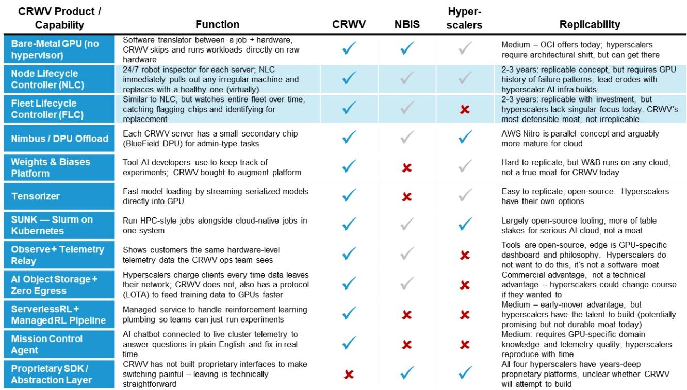
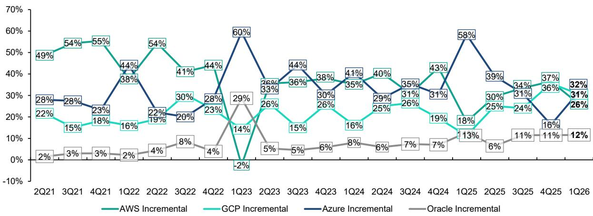
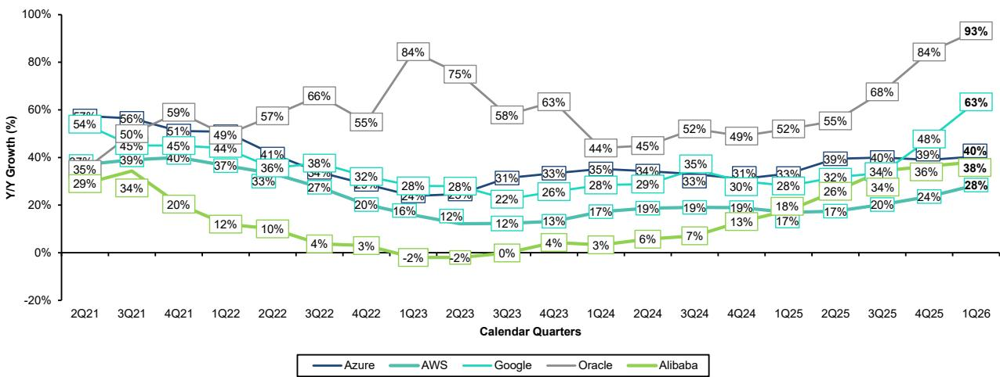

# Bernstein：云巨头正在从“算力军备竞赛”转向“资本效率竞赛”

市场对AI基础设施投资的焦虑从未停止。每一季度云巨头的资本支出数字都在刷新纪录，而关于“何时能看到回报”的质疑声浪也随之升高。但Bernstein最新发布的这份涵盖全球软件、美国和中国互联网以及通信基础设施的季度云报告，给出了一个值得深思的信号：真正决定未来几年赢家的，可能不再是谁能建起最大的GPU集群，而是谁能以最高的资本效率将算力转化为可交付的云收入。

这份由Bernstein全球云团队联合撰写的报告，追踪了亚马逊AWS、微软Azure、谷歌云、甲骨文OCI、阿里云以及新纳入的“Neocloud”代表CoreWeave的季度表现。报告覆盖的周期已延伸至2026年第一季度，并基于长达21个季度的历史数据，构建了一个观察超大规模云市场结构性变化的参照系。其核心判断是：市场正在从单纯的“建设能力”竞争，转向“运营效率”与“资本结构”的复合博弈。

## 1. 资本支出与运营现金流的剪刀差扩大，融资能力成为新护城河

报告中最具冲击力的数字之一，是四大云巨头（亚马逊、微软、谷歌、甲骨文）在2026年第一季度的现金资本支出总和已接近1300亿美元。Bernstein模型显示，2026年全年这一数字将达到约6230亿美元，若加上Meta，则逼近7600亿美元。与此同时，这四家公司全年的经营活动现金流估计约为6350亿美元。

这组数据揭示了一个关键矛盾：资本支出的增长速度正在持续超过运营现金流的增长。报告中的图表清晰展示了这一趋势——当资本支出曲线陡峭上行时，现金流增长曲线却呈现波动盘整。这意味着，云巨头们仅靠内部造血已难以支撑其扩张速度。事实上，亚马逊、谷歌和甲骨文近期已陆续进入资本市场进行融资。

这一变化的含义是深远的。在上一轮云基础设施周期中，现金充裕的巨头几乎不需要外部融资。但现在，能否以合理成本获取长期资本，将直接影响企业的扩张速度和投资回报率。对于投资者而言，观察重点不应仅仅是资本支出的绝对规模，更应关注其融资结构、债务成本以及自由现金流的覆盖倍数。

## 2. 收入增长仍需加速，但合同积压数据提供了乐观的先行指标

对于“回报在哪里”的追问，Bernstein给出了两个维度的回答。第一个维度是实际收入增长。报告显示，AWS、Azure、GCP和OCI的合计云收入增速在最近几个季度确实有所加快，但报告明确指出，这一增速“仍需继续提升”，才能与资本支出的增速相匹配。

第二个维度是合同积压，即剩余履约义务。这一指标在最近几个季度出现了显著跃升，截至2026年第一季度，四大云巨头的合计RPO已突破2万亿美元。谷歌云的RPO更是接近环比翻倍，达到约4620亿美元，其中超过50%预计将在未来24个月内转化为收入。甲骨文的RPO则高达6380亿美元，其中约3000亿美元来自OpenAI的合同。

RPO的高速增长是一个强烈的乐观信号，因为它代表了未来收入的可见性。但报告也提醒，这一指标存在两个“混杂因素”：合同期限的延长和客户集中度。如果大客户签署的是多年期大额合同，RPO的增长可能夸大了短期收入的爆发力。因此，投资者需要进一步拆解RPO的期限结构、客户集中度以及收入确认节奏，才能判断其真正的含金量。

## 3. 微软的“双轮驱动”模式正在验证AI投资的商业逻辑

在各大云厂商中，Bernstein对微软的定位最为清晰。报告指出，微软的AI业务年化收入已超过370亿美元，AI已成为“有意义的收入贡献者，而非负担”。更关键的是，微软拥有一个独特的“双轮驱动”结构：一方面，其自有的第一方应用（如Office 365 Copilot、GitHub Copilot）正在快速消耗算力；另一方面，其第三方客户合同（不仅限于OpenAI，还包括大量企业客户）提供了多元化的收入来源。

这种结构的战略价值在于：如果AI投资真的出现泡沫破裂，微软可以通过调整第一方应用的算力分配来保持利用率，同时其合同期限与设备使用寿命的匹配也降低了资产减值风险。报告还特别指出，微软正在看到“从GPU到CPU的溢出效应”——随着AI应用深化，不仅GPU需求增长，CPU的用量也在提升，这为Azure的长期收入增长提供了额外支撑。

## 4. 谷歌云的“垂直整合”意外成为差异化武器，但竞争格局仍存变数

报告中最具反转意味的判断，是关于谷歌云的重新定位。长期以来，谷歌云被视为云市场的“第三名”，但在AI时代，其垂直整合的解决方案——从自研TPU芯片到AI模型再到云服务——正在使其与微软在新增云收入季度环比增长上“并驾齐驱”。

Bernstein特别强调了谷歌云一个容易被忽视的增长引擎：向客户直接销售TPU芯片。这种“硬件即服务”的模式，允许谷歌将其定制AI芯片部署到客户自己的数据中心，从而开辟了一条新的收入路径。虽然这部分收入预计在2026年后期才开始体现，2027年才会更加显著，但它显著提升了谷歌云的长期收入可见性。

不过，谷歌云的市场评级仅为“市场表现”，目标价390美元，低于亚马逊和微软的“跑赢大盘”评级。报告隐含的判断是：谷歌云的利润率改善（1Q26达到约33%，同比提升超过15个百分点）虽然令人瞩目，但折旧增加和Wiz收购的拖累将在2026年形成压力，其盈利质量仍需持续验证。

## 5. 报告尚未完全回答的关键问题：资本效率的“临界点”何时到来？

尽管报告提供了丰富的分析框架，但有一个核心问题并未完全展开：资本效率的“临界点”在哪里？换言之，资本支出增速需要放缓到何种水平，或者收入增速需要加速到何种程度，才能让自由现金流开始显著改善？

报告中的图表显示，如果资本支出在2027年继续强劲增长，而现金流增长继续滞后，云巨头将不得不更加依赖资本市场。但报告没有给出明确的“拐点”判断。这取决于几个尚未充分讨论的变量：第一，AI推理需求的爆发速度是否真能消化当前建设的训练算力；第二，Neocloud（如CoreWeave）的商业模式是否会对传统云厂商形成价格压力；第三，甲骨文依赖OpenAI的单一客户集中度风险是否会被市场重新定价。

Bernstein对CoreWeave的“跑输大盘”评级（目标价67美元）暗示，市场可能低估了Neocloud的竞争劣势——它们没有云厂商的规模效应、数据引力或多元化客户基础。但这一判断的前提是，传统云厂商能够持续保持资本获取和运营效率的优势。如果融资环境收紧或技术路线发生转变，这一格局可能被打破。

## 6. 投资者应建立“三位一体”的观察框架，而非仅盯资本支出

基于这份报告，投资者需要建立一套更立体的云厂商评估框架。单看资本支出规模容易陷入“军备竞赛”的叙事陷阱，而单看收入增速又可能忽略未来的收入可见性。

第一个维度是资本效率：计算单位资本支出带来的增量云收入，以及自由现金流的覆盖倍数。亚马逊在BOM成本上的优势、微软的合同期限匹配能力、谷歌的垂直整合效率，都是这一维度的具体体现。

第二个维度是客户结构：RPO的客户集中度、合同期限分布、以及第一方与第三方收入的比例。微软的“双轮驱动”和甲骨文的“OpenAI依赖”形成鲜明对比，投资者需要判断哪种结构在不确定性环境下更有韧性。

第三个维度是技术路线选择：自研芯片（谷歌的TPU、亚马逊的Trainium）与依赖第三方GPU（英伟达）之间的权衡。报告显示，亚马逊的Trainium已获得约2250亿美元的收入承诺，而谷歌开始向外部销售TPU，这表明自研芯片正在从“成本节约工具”升级为“收入创造引擎”。

**这份报告的真正价值，不在于给出一个简单的“买或卖”结论，而在于为投资者提供了一个区分“增长质量”的分析框架。** 当所有云巨头都在谈论AI时，真正决定回报差异的，将是那些无法从季度财报中直接读出的结构性变量。

欢迎来知识星球微信群继续讨论。我们会在社群中分享Bernstein这份完整报告的原始图表、关键假设的敏感性分析，以及我们对“资本效率临界点”的进一步测算。通过这些未在公开报告中展开的细节，我们可以更深入地理解：哪些云厂商的扩张是可持续的，哪些可能正在透支未来的回报。

Personal reading notes and learning share only. Not investment advice.

