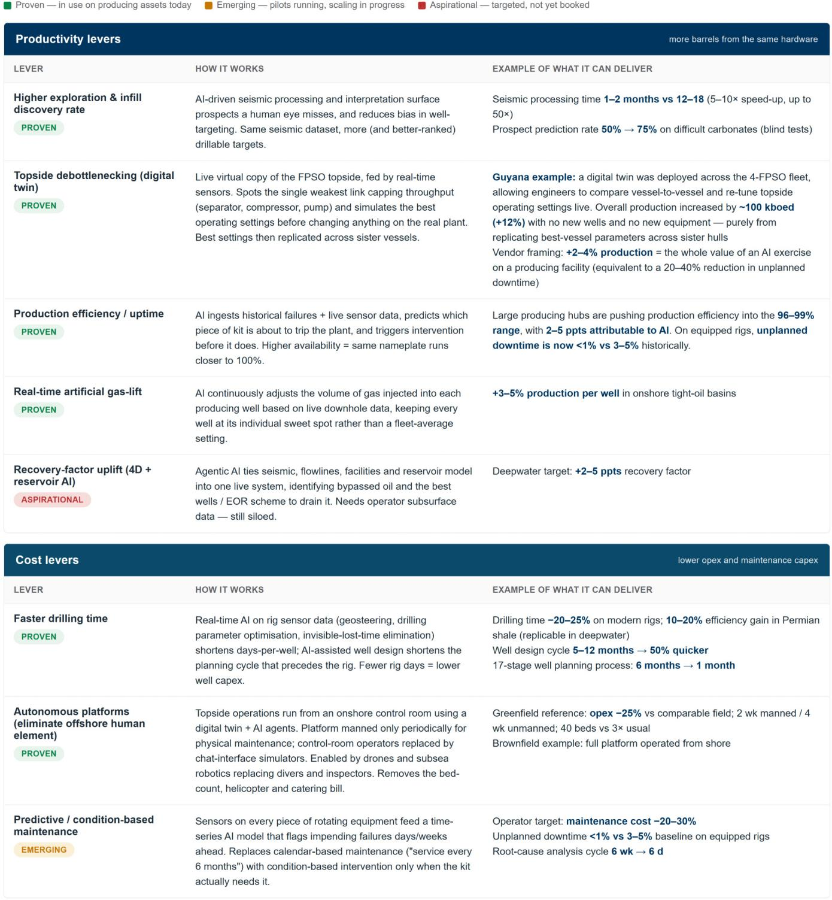
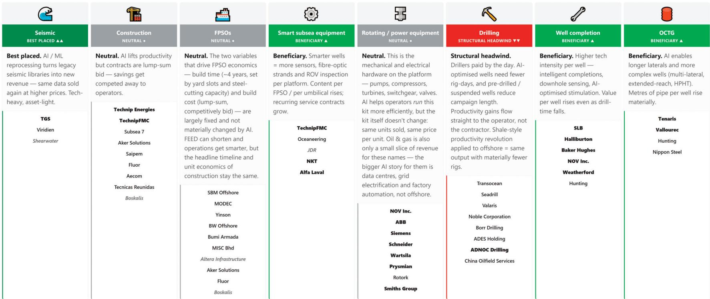
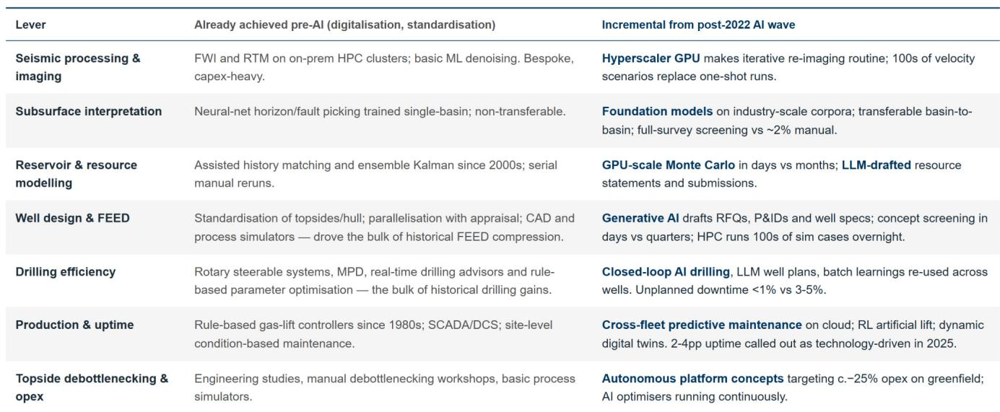

# AI Is Reshaping Upstream Oil Economics Faster Than the Industry Anticipates

The oil and gas industry is approaching a structural inflection point that has little to do with the price of crude and everything to do with how projects are conceived, engineered, and operated. For decades, deepwater development has followed a predictable rhythm: a decade-long cycle from discovery to first oil, with capital budgets locked in years before any revenue flows. That rhythm is now being disrupted by artificial intelligence and digitalization in ways that fundamentally alter the investment calculus for upstream projects.

The core argument is straightforward. AI and digital technologies, combined with standardization and simplification, can compress the full greenfield deepwater cycle from approximately 12 years to roughly 7 years, a reduction of nearly 40 percent. More importantly, the economic impact is material enough to shift the cost curve of global oil supply. Our analysis indicates that a typical greenfield project's internal rate of return could improve by 3.5 percentage points, from 15.5 percent to 19.0 percent, while breakeven prices could fall by approximately 15 percent. These are not marginal gains. They represent a structural improvement in the viability of new oil developments at a time when the industry faces declining reserve life and increasingly complex geology.

Why now matters is that the technology is already delivering measurable results. This is not a speculative forecast about future capabilities. Operators are reporting seismic interpretation speeds five to ten times faster than conventional methods. Drilling times are compressing by 20 to 25 percent on modern rigs. Digital twins are enabling production uplifts of 12 percent on existing floating production systems without a single new well. The question is no longer whether AI will change upstream economics, but how quickly the benefits will compound across the project lifecycle and which parts of the value chain will capture the value.

## The Pre-FID Phase Captures 90 Percent of the Time Compression, While Post-FID Remains Structurally Constrained

The most striking finding from our analysis is the asymmetry of AI's impact across the project lifecycle. The gains are overwhelmingly concentrated in the pre-final investment decision phase, where digital workflows can fundamentally reshape the pace of subsurface and engineering work. Exploration time can be reduced by 55 percent, appraisal by 40 to 50 percent, and front-end engineering and design by a similar margin. These are not aspirational targets; they reflect what companies are already achieving with AI-driven seismic processing, automated interpretation, and generative engineering workflows.

The mechanism is straightforward. Seismic processing that once required 12 to 18 months can now be completed in one to two months. Prospect prediction success rates in challenging geological settings are moving from approximately 50 percent to 75 percent in blind tests. Well design cycles that took five to twelve months are being cut by half. The compounding effect of these improvements across the pre-FID phase is what enables the total cycle compression from 12 years to 7 years.

Post-FID, however, the picture changes dramatically. The bottleneck shifts from information processing to physical fabrication. Construction time compresses by only 5 to 10 percent, and FPSO fabrication remains effectively fixed at approximately four years, governed by yard capacity, steel availability, and long-lead equipment. These physical constraints are not meaningfully addressable by digital technologies in the near term. This distinction is critical for investors because it means that the companies exposed to pre-FID workflows are structurally better positioned to benefit from AI adoption than those tied to physical construction.

The strategic implication is that the value creation from AI in upstream oil is front-loaded and concentrated in the subsurface and engineering domains. Companies that own proprietary subsurface data, provide digital tools for seismic interpretation, or offer engineering software that accelerates FEED are the primary beneficiaries. Conversely, FPSO contractors and pure subsea construction firms face a more neutral outlook, as their core economics are determined by physical capacity constraints rather than digital workflow improvements.

## Four Economic Levers Drive a 3.5 Percentage Point IRR Uplift, with Capex and Time to Market Dominating

The economic impact of AI on a typical greenfield deepwater project can be decomposed into four distinct levers, each with a measurable contribution to the internal rate of return. The largest contributor is capital expenditure reduction, which adds approximately 1.9 percentage points to IRR. This comes from faster well design and execution, with operators reporting 20 to 25 percent reductions in drilling time and engineering cycles compressed from months to weeks. The mechanism is not simply doing the same work faster, but doing fundamentally less work by eliminating iterations, reducing data processing time, and improving first-pass accuracy.

The second largest contributor is time to market, adding approximately 0.8 percentage points to IRR. Compressing the subsurface-to-FID phase by three months has a direct financial impact because it accelerates the start of cash flows. In a capital-intensive industry where projects require billions of dollars of upfront investment, even a three-month acceleration in first oil translates into meaningful value creation through improved net present value and reduced discounting effects.

Production uplift contributes approximately 0.5 percentage points to IRR, driven by AI-enabled optimization of field performance. Digital twins that identify bottlenecks in real time, predictive maintenance that reduces unplanned downtime, and automated gas-lift optimization that keeps each well at its individual sweet spot collectively increase output from the same asset base. Large producing hubs are pushing production efficiency into the 96 to 99 percent range, with two to five percentage points attributable to AI.

Operating expenditure reduction is the smallest contributor at approximately 0.3 percentage points, but it is the most visible operationally. Autonomous platform concepts are targeting approximately 25 percent reductions in platform opex, while predictive maintenance aims at 20 to 30 percent reductions in maintenance costs. The cumulative effect of these four levers is a total IRR uplift from 15.5 percent to 19.0 percent, and a breakeven reduction of approximately 15 percent.

## The Bankability of AI Levers Varies Significantly, Creating a Clear Hierarchy of Investment Certainty

Not all AI-driven improvements are equally proven or equally reliable as inputs to investment decisions. Our analysis categorizes the levers into three distinct buckets that reflect their current maturity and track record. This hierarchy is essential for investors trying to assess which claims are bankable and which remain aspirational.

Proven levers include faster drilling, seismic acceleration, production efficiency improvements, topside debottlenecking, and gas-lift optimization. These are already delivering measurable results across multiple operators and multiple basins. The evidence base is robust enough that these improvements can be incorporated into project economics with reasonable confidence. They underpin the bulk of the IRR uplift in our analysis and represent the most reliable source of value creation from AI in the near term.

Emerging levers include predictive maintenance and autonomous platforms. These have credible pilot programs and vendor evidence, but they lack the at-scale track record needed for full confidence. Operators are targeting maintenance cost reductions of 20 to 30 percent and unplanned downtime below 1 percent, but these targets have not yet been demonstrated across a full fleet of assets over multiple years. We include these in our analysis but with a lower weight of evidence.

Aspirational levers include step-change improvements in recovery factors through agentic AI that ties seismic, flowlines, facilities, and reservoir models into a single live system. The potential is significant, with targets of two to five percentage points improvement in recovery factors for deepwater fields. However, this remains a five to ten year story because it requires operators to break down subsurface data silos and integrate workflows that have historically been managed in isolation. We do not reflect these aspirational levers in our economic analysis.

The distinction between proven, emerging, and aspirational is not academic. It has direct implications for which companies are positioned to benefit and which investment theses are supportable today versus those that require patience. Investors should be skeptical of claims that assume full realization of aspirational levers within the next three to five years.

## What the Report Does Not Fully Answer: The Distribution of Value Between Operators and Service Companies

Our analysis quantifies the aggregate economic improvement from AI adoption, but it leaves an important question unresolved: how will the value be distributed between oil producers and oil service companies? The answer is not obvious and depends on competitive dynamics, contracting structures, and the pace of technology diffusion.

On one hand, operators are the direct beneficiaries of lower costs, faster project cycles, and higher production. The IRR improvements and breakeven reductions accrue to them. On the other hand, the service companies that enable these improvements have the potential to capture value through higher-margin digital offerings, recurring data monetization, and premium product demand. The net outcome depends on whether the benefits of AI become commoditized and competed away, or whether they create durable competitive advantages for the enablers.

The seismic sector provides a clear example of the tension. AI-driven reprocessing of legacy seismic libraries can turn existing data into new revenue streams at high margins. The company that controls the largest multi-client library is uniquely positioned to monetize this trend. But if multiple seismic providers develop similar AI capabilities, the pricing power may erode over time.

Similarly, the drilling sector faces a structural headwind. As AI improves drilling efficiency and reduces the number of rig days required per well, the total addressable market for drilling services could shrink even as individual operators benefit from lower costs. The companies that provide high-specification tubular products for technically demanding wells may benefit from increased demand for premium products, but the broader drilling services segment may face volume pressure.

The report does not fully resolve these distributional questions, which is why the stock implications require careful differentiation. The enablers and structural beneficiaries of AI adoption stand out from the broader services universe, but investors need to assess each subsector's competitive dynamics independently.

## A Decision Framework for Investors: Mapping AI Exposure Across the Oil Services Value Chain

For investors seeking to position for the AI-driven transformation of upstream oil, a structured framework is essential. The value chain can be mapped along two dimensions: the degree of AI exposure and the direction of impact. This creates a clear taxonomy for identifying which subsectors are best positioned and which face headwinds.

Seismic providers are best positioned, with strong positive exposure to AI adoption. The technology enables reprocessing of legacy data into new revenue streams, improves interpretation accuracy, and creates recurring monetization opportunities for proprietary data libraries. This subsector is asset-light and technology-heavy, with high barriers to entry based on data ownership.

Well completion and OCTG providers are clear beneficiaries. As AI improves subsurface imaging and well placement, operators are unlocking deeper, higher pressure, and more technically demanding reservoirs. This structurally reinforces demand for premium connections, corrosion-resistant alloys, and integrated tubular solutions. The companies that specialize in harsh-environment applications are leveraged beneficiaries of upstream digitalization.

Smart subsea equipment providers also benefit, as smarter wells require more sensors, fiber-optic strands, and inspection capabilities per platform. Content per FPSO and per umbilical rises, and recurring service contracts grow.

Drilling services face a structural headwind. AI reduces the number of rig days required per well, which compresses the total addressable market. Even if activity levels remain stable, the revenue per well declines as efficiency improves.

FPSO contractors and construction firms are broadly neutral. Their core economics are determined by physical fabrication capacity, yard slots, and lump-sum bidding dynamics. AI can improve FEED and operations, but the headline timeline and unit economics of construction remain largely unchanged.

This framework translates into a clear investment approach. Focus on the enablers that own proprietary data or domain-specific AI capabilities. Focus on the structural beneficiaries whose product demand increases as AI enables more technically demanding wells. Avoid the subsectors where AI primarily reduces the volume of work required.

## Join the Community to Read the Full Report and Review the Original Charts

The analysis presented here draws on extensive discussions with digital departments of integrated majors, upstream independents, oilfield services companies, seismic providers, and digital vendors, combined with proprietary Top Projects analysis. The full report includes detailed cost curve modeling, subsector-level impact assessments, and specific company analyses that go beyond the scope of this article.

The original exhibits showing the time compression across project phases, the cost curve shifts under the AI scenario, and the decomposition of IRR improvements provide the quantitative foundation for the arguments made here. They also reveal important nuances about the sensitivity of results to different assumptions about technology adoption rates and competitive dynamics.

Join the community to read the full report and review the original charts.

*This article is for learning and discussion only and does not constitute investment advice.*

Personal reading notes and learning share only. Not investment advice.

