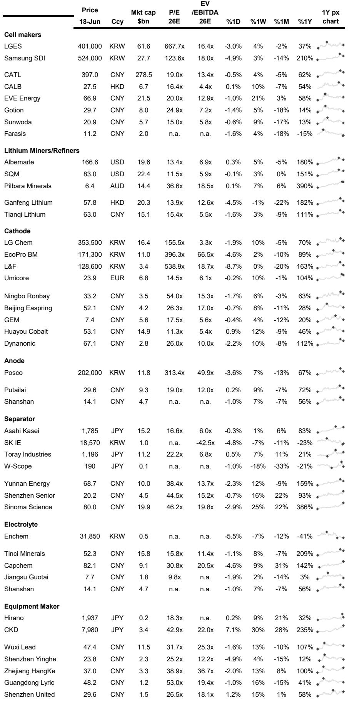
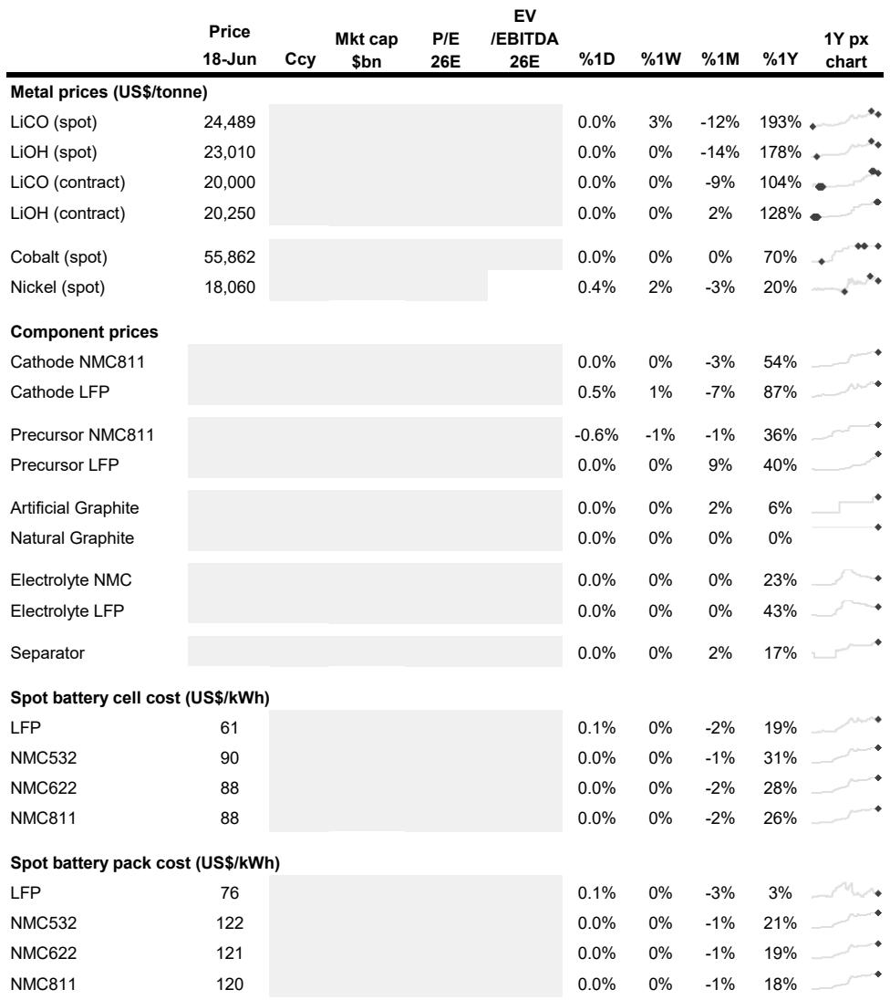
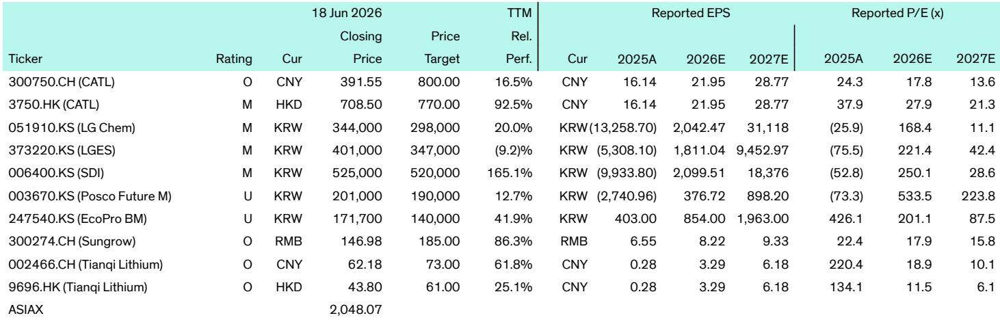

# Energy Storage Is No Longer a Battery Story: The Industry Is Being Reshaped by Policy, AI Demand, and a Quiet Chemistry Revolution

The global energy storage industry has reached an inflection point that most market observers are misreading. For years, the narrative has been simple: battery costs fall, deployments rise, and the future is linear. That story is now obsolete. What is emerging is a far more complex landscape where the winning companies will not be those with the cheapest cells, but those that can navigate three simultaneous transformations: the shift from policy-driven to compliance-driven markets, the emergence of AI data centers as a new demand anchor, and a quiet but strategic rethinking of battery chemistry that is fragmenting the technology roadmap.

The evidence is accumulating rapidly. In China, a battery maker forecasts first-half profit will more than double, lithium carbonate futures snap a month-long decline on AI and storage demand, and new regulations are set to fundamentally alter how storage is valued and deployed. In North America, a wave of Korean equipment and component orders signals that localized manufacturing is accelerating faster than most models predict. In Europe, a 288 MWh project goes online in Hungary, and a UK prime minister announces over a billion pounds in new battery storage investment. These are not isolated data points. They are signals of a structural shift.

The core thesis is this: the energy storage industry is transitioning from a volume game to a value game. The next phase of growth will be driven not by how many gigawatt-hours are deployed, but by how storage is integrated into grids, data centers, and industrial systems, and by the ability to meet increasingly stringent compliance, safety, and performance standards. The companies that understand this will capture disproportionate value. Those that continue to compete on cell cost alone will find themselves squeezed.

## The North American Supply Chain Is Being Built Faster Than the Market Realizes

The most underappreciated development in global energy storage is the speed at which a localized North American battery supply chain is taking shape. The recent news flow is remarkable not for any single order, but for the pattern they collectively reveal. A South Korean equipment supplier wins a 95 billion won order for battery pack assembly equipment in North America, with the contract value increasing nearly fivefold as the customer expanded its U.S. production plans through 2028. Another Korean firm is expanding shipments of precision notching presses and cutter sets for prismatic battery production lines used in North American ESS manufacturing. A battery module partnership between a Korean battery giant and a lithium battery manufacturer is expected to generate cumulative orders worth 1.8 trillion won by 2028.

What does this pattern mean? It means that the North American energy storage supply chain is being built from the ground up, and it is being built primarily by Korean companies leveraging their manufacturing expertise. This is not about Chinese companies setting up factories in the U.S. to avoid tariffs, though that is happening too. This is about a deliberate, capital-intensive effort to create a non-China supply chain that meets U.S. Foreign Entity of Concern (FEOC) requirements. The scale of investment suggests that major battery manufacturers are making long-term commitments to North American production, not just assembly.

The strategic implication is significant. A localized supply chain will change the competitive dynamics of the North American market. Companies that can source batteries from compliant, local suppliers will have a structural advantage in winning utility and grid-scale projects, where procurement requirements increasingly favor domestic content. This is not a near-term trend; it is a permanent restructuring of the industry's geography.

## The Battery Chemistry Roadmap Is Fragmenting, and That Creates Both Opportunity and Risk

For much of the past decade, the battery industry appeared to be converging on two dominant chemistries: NMC for high performance and LFP for low cost. That consensus is now breaking down. The evidence comes from multiple directions. A major automaker is reconsidering its EV battery roadmap and may prioritize lithium manganese-rich (LMR) batteries over LFP for future vehicles, claiming similar costs but 33% higher energy density. Another automaker has begun real-world testing of a semi-solid-state battery with 375 Wh/kg energy density, developed with a U.S. startup. A defense agency has launched a program targeting 5-10 times higher energy density for military applications. Meanwhile, a leading battery manufacturer tempers near-term expectations for solid-state batteries, saying large-scale commercialization is still unlikely before 2030.

The pattern here is not confusion; it is strategic fragmentation. Different applications are pulling battery chemistry in different directions. Grid-scale storage, which prioritizes cost and cycle life, will continue to favor LFP and its variants. Premium EVs, which prioritize energy density and fast charging, are pushing toward advanced NMC, LMR, and semi-solid-state technologies. Defense and aerospace applications, which prioritize extreme performance, are driving fundamental research into entirely new architectures.

The so-what for investors and strategists is clear: the days of a one-size-fits-all battery technology are ending. Companies that specialize in a single chemistry face the risk of being disrupted by alternatives that better serve specific segments. Conversely, companies with a diversified technology portfolio or the ability to adapt their manufacturing processes to multiple chemistries will be better positioned to capture value across the entire market. The fragmentation also means that the traditional cost curve, which assumes continuous improvement along a single trajectory, may no longer be a reliable forecasting tool.

## AI Data Centers Are Emerging as a New Demand Anchor That Changes the Industry's Growth Calculus

The relationship between energy storage and artificial intelligence is not theoretical; it is becoming a tangible driver of demand. The evidence is building. A battery maker has begun installation of a 5 MWh solar-plus-storage project in Silicon Valley, explicitly targeting the AI data center energy storage market. In China, lithium carbonate futures rebounded on strong demand growth from ESS, EVs, and AI data center infrastructure, with analysts noting that the lithium market is shifting from being driven mainly by EVs to a broader demand base that includes AI computing power. A UK prime minister announced over a billion pounds in investment commitments at the G7 summit, including a major allocation for battery storage and energy projects linked to the AI ecosystem.

What is happening here is a structural shift in the demand profile for energy storage. Data centers, particularly those powering AI workloads, have massive, round-the-clock electricity consumption that is highly sensitive to reliability and power quality. They also face growing pressure to meet sustainability targets. Energy storage is uniquely positioned to address these needs: it can provide backup power, smooth intermittent renewable generation, reduce peak demand charges, and participate in grid services.

The strategic implication is profound. The energy storage industry has long been driven by two primary demand sources: utility-scale renewable integration and behind-the-meter commercial and industrial applications. AI data centers represent a third leg of the demand stool, one that is growing rapidly and has very different performance requirements. This diversification of demand reduces the industry's dependence on any single end market and provides a buffer against policy-driven slowdowns in any one region. It also means that companies with products specifically designed for the data center market, including high-reliability systems with advanced energy management software, may capture premium pricing and faster growth.

## New Regulations in China Are About to Separate the Winners from the Also-Rans

The most consequential development for the global energy storage industry in the second half of 2026 may not be a technology breakthrough or a new factory announcement. It will be a set of regulatory changes in China that are designed to fundamentally alter how the market operates. The industry is facing three major policy shifts: Document No. 114, Order No. 41, and the new DL/T 2041-2025 grid connection standard. Together, these regulations introduce capacity-based payments, stricter safety and grid compliance requirements, and new rules that increasingly make storage essential for distributed renewable integration.

What does this mean in practice? The Chinese energy storage market has been characterized by intense price competition, with many companies selling storage systems at or below cost in pursuit of market share. The new regulations will shift the market away from policy-driven installations toward a more market- and compliance-focused model. This means that storage systems will be judged not just on their upfront cost, but on their ability to meet grid interconnection requirements, maintain safety standards, and deliver reliable performance over their lifetime.

The consequence is industry consolidation. Companies with strong capabilities in grid integration, compliance, energy management software, and asset operation will thrive. Low-cost hardware-focused players, particularly those that have cut corners on safety and software, may struggle or exit the market. This is a classic pattern in maturing industries: the initial phase of rapid growth is followed by a shakeout that separates sustainable leaders from transient participants. The Chinese market, which accounts for a significant share of global energy storage deployments, is about to enter that shakeout phase.

The broader lesson for global investors is that regulatory evolution is a powerful competitive filter. Companies that anticipate and prepare for stricter standards will have a durable advantage. Those that compete solely on price will find themselves trapped in a race to the bottom that becomes increasingly unviable.

## What the Report Does Not Fully Answer: The Unresolved Questions That Will Define the Next Five Years

Despite the wealth of data and analysis in the underlying research, several critical questions remain unresolved. These are not gaps in the analysis; they are the open questions that will define the industry's trajectory over the next five years.

First, how will the trade-off between localized supply chains and cost competitiveness resolve? The push for localized manufacturing in North America and Europe will inevitably increase battery costs in the near term, as new factories have higher capital costs and less mature supply chains. The question is whether these higher costs will be offset by policy incentives, customer willingness to pay a premium for domestic content, or eventual learning-curve improvements. The answer will determine the pace of deployment outside of China.

Second, will the fragmentation of battery chemistries accelerate or consolidate? The industry is currently exploring multiple pathways: LFP, NMC, LMR, semi-solid-state, solid-state, and others. Some of these will prove to be dead ends. Others will find their niches. The key question is whether a single chemistry will emerge as dominant for a given application, or whether the market will remain fragmented, with different technologies serving different segments. This has profound implications for manufacturing scale, supply chain investment, and the competitive positioning of individual companies.

Third, can the energy storage industry scale fast enough to meet the demands of AI data centers without creating new bottlenecks? Data center electricity demand is growing at an extraordinary rate, and the infrastructure required to support it, including energy storage, is massive. The question is whether the industry can ramp up production capacity, develop the necessary project development expertise, and secure the required financing quickly enough to avoid a supply-demand mismatch that could slow AI deployment.

## A Decision Framework for Navigating the New Energy Storage Landscape

For readers trying to make sense of this rapidly evolving industry, a structured decision framework is essential. The following questions can help evaluate opportunities and risks.

First, assess the regulatory environment in the target market. Is the market moving from a volume-driven model to a value-driven model? Markets that are introducing stricter grid connection standards, safety requirements, or compliance mandates will favor companies with strong technical and software capabilities over those competing solely on cost.

Second, evaluate the supply chain exposure. Does the company or project rely on a single source for batteries or components? Given the accelerating localization of supply chains in North America and Europe, companies with diversified, compliant supply sources will have a structural advantage. Those overly dependent on a single supplier or region face significant regulatory and geopolitical risk.

Third, analyze the technology positioning. Is the company betting on a single chemistry or maintaining a diversified portfolio? In a fragmented technology landscape, a single-chemistry bet carries higher risk but potentially higher reward if that chemistry wins. A diversified approach reduces risk but may limit upside in any one segment.

Fourth, consider the end-market exposure. Is the company focused on utility-scale storage, behind-the-meter commercial and industrial, or the emerging data center market? Each segment has different growth rates, competitive dynamics, and regulatory exposures. The data center segment, in particular, offers a new and rapidly growing demand source that may be less correlated with traditional utility and policy cycles.

Finally, evaluate the software and integration capabilities. In a value-driven market, the ability to manage energy storage assets through advanced software, participate in grid services, and meet compliance requirements will be a key differentiator. Companies that are purely hardware plays may find their margins squeezed as the market matures.

## Join the community to read the full report and review the original charts

The energy storage industry is entering a period of structural change that will create both extraordinary opportunities and significant risks. The patterns are visible in the data, but the full picture requires a deeper dive into the original research, including the detailed commodity price performance charts, the project-level analysis, and the regional breakdowns that underpin the conclusions. For readers who want to move beyond the headlines and develop a truly informed perspective, the full report provides the analytical foundation.

Join the community to read the full report and review the original charts.

*This article is for learning and discussion only and does not constitute investment advice.*

Personal reading notes and learning share only. Not investment advice.

