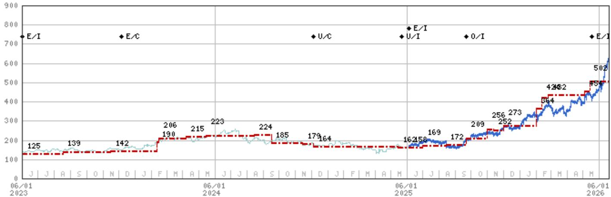
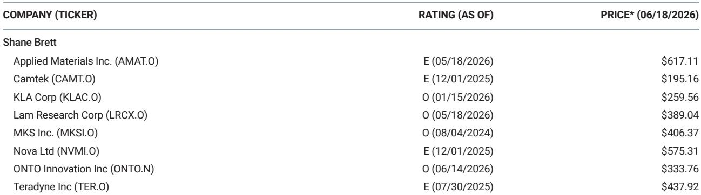
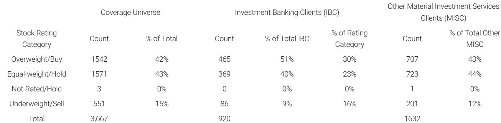

# DRAM Is Pulling Semiconductor Equipment Spending Forward, But the Real Prize in 2027 Belongs to NAND

The semiconductor capital equipment cycle is not a single wave but two distinct, overlapping surges, and the market is currently mispricing the sequence. A recent revision to wafer fabrication equipment (WFE) forecasts makes this clear: DRAM spending is being pulled forward aggressively, with 2026 estimates raised from $44.6 billion to $48.6 billion and 2027 from $57.1 billion to $62.5 billion. This is not a gradual uptick. It is a deliberate acceleration driven by customers doing everything in their power to secure tool capacity earlier than planned. Yet the most strategically significant insight from this analysis is not the DRAM upgrade itself. It is what happens next. While DRAM WFE growth decelerates to 29% in 2027, NAND WFE is forecast to surge 53% in the same year. The market's current focus on near-term DRAM strength risks obscuring a larger structural rotation that will redefine equipment supplier exposure and investor positioning over the next 18 months.

The timing of this revision matters. We are in a period where memory manufacturers are signaling confidence not just in current demand but in the durability of the AI-driven compute buildout. HBM (high-bandwidth memory) is consuming an increasing share of DRAM output, with approximately 27% of 2028 bits projected to be "lost bits" due to the trade ratio penalty of HBM manufacturing. This means that even as wafer starts rise, the effective bit output available for traditional markets is constrained. The pull-forward in DRAM tool spending is therefore a rational response to a structural supply squeeze, not a speculative overbuild. But the second-order implication is that NAND, which has lagged in the AI narrative, is poised for a catch-up cycle that will be far more violent in its capital intensity.

## The DRAM Pull-Forward Is Real and Has Immediate Supplier Implications

The upward revision to DRAM WFE is concentrated in brownfield upgrades rather than greenfield expansion. Greenfield additions were revised only marginally from 258kwpm to 268kwpm in 2026, while the 2027 figure remained unchanged at 395kwpm. The real delta came from assumptions about more aggressive upgrades across both years. This is a subtle but critical distinction. Brownfield spending is typically less visible, faster to execute, and more directly tied to yield improvement and process node transitions. It does not require new fab construction, permitting, or the long lead times associated with greenfield projects. The fact that the revision is driven by brownfield activity suggests that manufacturers are not betting on a demand explosion that requires entirely new facilities. They are optimizing existing capacity to extract more output from assets already in place.

For equipment suppliers, this favors companies with broad installed bases and strong service and upgrade revenue streams. The report explicitly notes that higher DRAM WFE in 2026 will inevitably benefit Applied Materials the most, and that a recent downgrade to Equal-weight may have been slightly early in hindsight. This is a candid acknowledgment that near-term earnings momentum from DRAM is likely to be stronger than previously modeled. However, the analytical challenge is that this DRAM strength is transitory in relative terms. The report maintains a relative preference for Lam Research over Applied Materials, grounded in the view that NAND WFE growth in 2027 will far outpace DRAM. The question for investors is whether to trade the near-term DRAM tailwind or position for the NAND rotation.

## NAND Is Not Yet Accelerating, But the Structural Case Is Inevitable

The NAND forecast tells a more cautious near-term story but a more explosive medium-term one. 2026 NAND WFE was fine-tuned slightly downward from $15.9 billion to $15.7 billion, while 2027 was nudged up from $24.0 billion to $24.1 billion. The headline numbers appear flat. But the bit supply revision tells a different story. Bit supply growth was raised from 21% to 24% in 2026 and from 32% to 31% in 2027. The mechanism is revealing: wafer starts changed only marginally, but yield assumptions were revised significantly higher. This means that the near-term NAND story is about manufacturing efficiency, not capacity expansion. Manufacturers are learning to produce more bits from the same installed base, which is a positive signal for technology maturity but a neutral one for equipment spending.

The inflection point comes in 2027. The report models NAND WFE growth of 53% year-over-year, compared to DRAM growth of 29%. This divergence is not arbitrary. It reflects a fundamental asymmetry in the memory cycle. DRAM has been the primary beneficiary of AI-driven demand through HBM, and its capital spending has already been pulled forward. NAND, by contrast, is only now beginning to see the demand signals that will justify a capacity expansion cycle. The key driver is enterprise SSD (eSSD), which the report models to grow at a three-year CAGR of 66% from 2025 to 2028, with mix increasing from 29% to 67% of total NAND output. This is not a marginal trend. It is a structural shift in the composition of NAND demand, and it will require entirely new wafer capacity to satisfy.

## The HBM "Lost Bits" Problem Creates a Structural Supply Constraint That Redefines the Cycle

One of the most analytically powerful concepts in this report is the notion of "lost bits" from HBM manufacturing. HBM requires a significant trade ratio penalty because the stacking process consumes more wafers per usable bit than conventional DRAM. The report estimates that approximately 27% of 2028 DRAM bits will be lost to this penalty. This means that even as wafer starts increase, the effective supply available for non-HBM applications grows more slowly than the headline bit supply numbers suggest.

This has two critical implications. First, it explains why DRAM manufacturers are pulling tool spending forward. They need to compensate for the inefficiency of HBM production by adding more capacity than would otherwise be necessary. Second, it creates a persistent tightness in the non-HBM DRAM market, which supports pricing and margins for the portion of output that is not consumed by AI accelerators. The adjusted bit output metric in the report shows that when the HBM trade ratio is accounted for, effective bit growth in 2027 and 2028 is 37%, versus real bit output of 33% and 32% respectively. This divergence is a source of potential upside to equipment demand that is not captured in simple wafer start forecasts.

## What the Report Does Not Fully Answer: The China Variable and the Timing of the NAND Inflection

For all its analytical rigor, this analysis leaves several critical questions unresolved. The most important is the role of China in the NAND equipment cycle. The report notes that non-China players are expected to be meaningful contributors to NAND wafer adds in 2027-2028, but it does not model the full range of outcomes for Chinese equipment demand. Given the ongoing geopolitical restrictions on advanced tool shipments to China, there is a scenario where Chinese manufacturers are forced to accelerate domestic equipment development or shift their capacity plans entirely. This could create either a demand void or a parallel equipment ecosystem that operates outside the traditional supply chain. The report's WFE forecasts implicitly assume a baseline of normalized China demand, but the range of outcomes is wider than the point estimates suggest.

A second unresolved question is the exact trigger for the NAND WFE acceleration. The report states that early signs of NAND acceleration are emerging but that the thesis will not be realized in the near term. What specific demand signal or capacity utilization threshold would catalyze the 2027 inflection? Is it eSSD adoption reaching a critical mass among hyperscalers? Is it a pricing recovery that restores NAND manufacturer margins to levels that justify greenfield investment? The report provides the destination but not the precise roadmap. Investors who want to position for the NAND rotation need to monitor leading indicators that the report does not fully specify.

## A Decision Framework for Positioning Across the Memory Equipment Cycle

For readers who need to translate this analysis into actionable positioning, a structured decision framework is essential. The first dimension is time horizon. Over the next 6 to 12 months, DRAM equipment suppliers, particularly those with strong brownfield upgrade exposure, are likely to see earnings momentum that exceeds current expectations. The pull-forward is real, and it is happening now. The risk is that this creates a peak in relative performance that fades as the NAND cycle takes over.

The second dimension is supplier exposure. The report's relative preference for Lam Research over Applied Materials is based on the expectation that NAND WFE growth will outpace DRAM in 2027. But this is a relative call, not an absolute one. Applied Materials will benefit from the DRAM pull-forward in 2026, and its absolute revenue trajectory may remain strong even as its relative growth rate slows. The decision is whether to prioritize the company with the highest near-term DRAM exposure or the one with the highest leverage to the NAND rotation.

The third dimension is the HBM supply constraint. Investors should evaluate equipment suppliers not just on total WFE exposure but on their ability to serve the specific process steps that are most constrained by the HBM trade ratio. The "lost bits" problem creates demand for equipment that improves yield, reduces defect density, and enables higher stack counts. Suppliers with differentiated technology in these areas may see demand that is less cyclical than the broader WFE market.

The fourth dimension is the China risk. Any positioning in semiconductor equipment must account for the possibility of further restrictions on shipments to China. The report does not model a severe China disruption scenario, but the risk is real and asymmetric. Suppliers with higher China revenue exposure face greater downside if restrictions widen, while those with more diversified geographic exposure offer a cleaner play on the memory cycle.

## The Full Picture Requires a Deeper Dive into the Charts and Data

The analysis presented here is based on a rich set of charts and data that cannot be fully reproduced in summary form. The trajectory of wafer starts, the breakdown between HBM and non-HBM capacity, the evolution of eSSD mix, and the yield assumptions that drive the bit supply revisions are all essential for forming a complete view. The report's exhibits show the precise path from current capacity to the 2028 endpoint, and they reveal the assumptions that could prove too optimistic or too conservative. For example, the NAND wafer starts forecast does not surpass the prior peak of 1,762kwpm from Q3 2022 within the forecast horizon. This is a conservative assumption that could be broken if the eSSD ramp accelerates faster than modeled.

Investors who rely only on the summary numbers will miss the nuance of how the HBM trade ratio distorts the relationship between wafer starts and bit supply, or how the brownfield versus greenfield composition of DRAM spending affects different equipment suppliers. The full report provides the granularity needed to stress-test the base case and identify the scenarios where the upside or downside is largest.

Join the community to read the full report and review the original charts.

*This article is for learning and discussion only and does not constitute investment advice.*

Personal reading notes and learning share only. Not investment advice.

