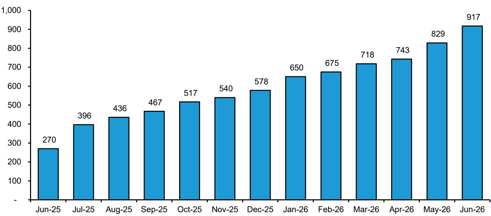

# Bernstein：代币化的真正战场不在资产发行，而在交易基础设施的重新定价

## 1. 市场正在用脚投票，但大部分投资者看错了方向

截至2026年6月，代币化现实世界资产的市场总值已突破510亿美元，年初至今增长40%。同一时期，更广泛的加密市场下跌约20%。这个数字本身就包含一个反直觉的判断：代币化并非加密行情的附属品，它正在走出一条独立的增长曲线。

但更值得关注的不是总量，而是结构。私人信贷以47%的占比主导代币化资产类别，美国国债占30%，商品占9%。代币化股票虽然仅占不到3%，但年初至今增长了130%，从7亿美元跃升至16亿美元。Bernstein这份报告的核心判断是：代币化正在从“发行试验”进入“基础设施竞争”阶段，而真正决定胜负的，不是谁能发行更多资产，而是谁能构建合规、高效、可规模化的交易和结算层。

这不是一个关于“区块链能否替代传统金融”的宏大叙事。这是一个关于“在现有监管框架下，谁有能力重新定义证券的清算、交易和持有方式”的具体商业问题。

## 2. 当前代币化股票的核心缺陷：所有权与收益权的分离

理解这一轮基础设施竞争的关键，在于看清当前主流代币化股票模型的根本局限。

目前，Robinhood等平台向非美国投资者提供的代币化股票，采用的是第三方赞助商模式。赞助商购买底层股票、托管在受监管账户中，然后发行一个区块链代币。投资者可以24x7交易这些代币，实现实时结算，平台赚取交易佣金。

但这些代币只运行在区块链上，与实际的股东登记簿没有任何对账机制。代币持有者不是股东登记簿上的注册所有人，赞助商才是。这意味着，代币持有者不享有股息、投票权等与股票所有权相关的权利。

这个模型的问题不在于技术，而在于法律结构。它提供的是“股票的价格敞口”，而不是“股票的完整所有权”。从投资角度看，这相当于一个合成工具。从监管角度看，它只能在现有豁免框架下运营，且对大多数美国投资者关闭。

Bernstein报告指出，市场真正等待的是一种“创新豁免”，允许代币化美国股票在岸交易。但在这之前，行业玩家已经开始布局更彻底的方案。

## 3. 发行方赞助模型正在重塑证券基础设施的本质

与第三方赞助商模型形成对比的是发行方赞助模型。在这个框架下，区块链作为公司实际发行股票的结算层。股东获得与传统交易所上市股票相同的所有权和保护权利，同时享受更快的结算周期和更高的资本效率。

Figure、Bullish和Securitize正在构建这个受监管的基础设施层。它们使用SEC注册的过户代理、受监管的ATS、经纪交易商和托管解决方案。

Figure已经在其OPEN平台上推出了自己的代币化股票，并且还有一只股票正在排队上市。Bullish通过收购Equiniti，获得了运营传统证券和代币化证券统一账本的能力，同时提供代币设计和流动性相关服务。Securitize则与纽交所合作开发后者的代币化证券平台，与Computershare合作推动美国发行人的代币化股票，与Jump Trading合作推出去中心化交易所式的代币化股票链上交易。

这些动作的共同特征是：它们不是在传统金融体系之外另建一套系统，而是在传统金融体系的合规框架内，用区块链重新定义清算和结算的效率边界。

## 4. Coinbase的“一切交易所”战略正在改写竞争边界

Coinbase是这份报告中值得单独讨论的变量。它正在尝试一种与上述基础设施玩家不同的路径：多资产单一交易所。

过去几周，Coinbase为非美国投资者推出了代币化股票、股票永续合约、Pre-IPO永续合约，以及面向美国投资者的受监管加密衍生品市场。其代币化股票由底层股票1:1支持，具备自动股息分配和链上经济的可编程效用。

更关键的是，Coinbase的全球永续合约产品现在覆盖股票、ETF和加密资产，强化了其“一切交易所”的定位。2026年3月，Coinbase推出了面向美国以外零售和机构投资者的24x7 USDC结算股票永续市场，随后又推出了Pre-IPO永续合约。

这里有一个值得深挖的洞察：Coinbase已经成为唯一一家获得CFTC监管的FCM，能够为美国投资者提供全球加密衍生品访问。这意味着，Coinbase正在同时覆盖传统资产和加密资产的交易需求，而它的竞争对象不再只是Binance，而是Robinhood、Charles Schwab，甚至纽交所本身。

Bernstein报告对Coinbase给出了Outperform评级，目标价330美元，基于25倍2027年预期市盈率。但报告也明确指出风险：来自国际交易所和传统经纪商的竞争压力，以及美国监管框架的不确定性。

## 5. 报告尚未完全回答的关键问题：谁将持有真正的所有权

这份报告最具价值的部分，在于它清晰地划分了两种商业模式：中立基础设施定位和交易模型。但它没有完全回答一个根本性问题——在发行方赞助模型中，代币持有者的法律地位究竟如何界定？

目前，Figure和Securitize的模型虽然声称提供完整的股东权利，但这一权利在破产清算、公司治理争议等极端情况下的实际可执行性，尚未经过充分的法律检验。SEC虽然通过无异议函和交易所规则批准释放了积极信号，但距离一个完整的、具有先例效力的监管框架还有距离。

另一个未被充分展开的问题是：代币化是否会改变上市公司的股东沟通和治理方式。如果代币化股票可以编程，那么股息分配、投票权委托、甚至公司行动的通知和执行，都可能实现自动化。但这同时也意味着，传统的中介角色——过户代理、投票顾问、托管银行——可能面临结构性替代。

Bernstein报告提到了“创新豁免”的可能性，但没有深入讨论这一豁免的具体形态和时间表。这恰恰是投资决策中最不确定的变量。

## 6. 投资者应该建立的观察框架

基于这份报告，我们认为投资者可以从以下三个维度建立对代币化基础设施竞争的分析框架：

第一，合规能力的差异化。在监管尚未完全明确的阶段，能够同时获得SEC、CFTC和州级牌照的公司具有先发优势。Coinbase的CFTC监管FCM地位、Bullish的纽约DFS牌照申请、Figure的SEC注册过户代理资质，都是需要持续跟踪的关键节点。

第二，资产类别的扩展路径。私人信贷目前是代币化资产的最大类别，但其流动性远低于公开市场证券。代币化股票的增长速度虽然快，但基数小。真正的基础设施价值，取决于平台能否同时覆盖高流动性的公开市场证券和高收益的私人信贷，形成跨资产类别的网络效应。

第三，收入模式的可持续性。当前代币化平台的主要收入来源是交易佣金和借贷利差。但长期来看，结算费用、代币设计服务、流动性提供、数据和分析服务可能成为更稳定的收入来源。Bullish的订阅服务收入和Figure的贷款平台费用，代表了两种不同的变现路径。

## 7. 这些未解问题，正是继续深入讨论的起点

代币化正在从概念验证走向商业落地，但关于所有权法律界定、监管豁免时间表、跨资产类别的协同效应，以及现有金融中介的角色重构，报告中还有大量值得进一步拆解的细节。

例如，Bernstein报告中的图表演示了代币化RWA资产持有者已超过90万，年初至今增长约60%。但这一增长有多少来自机构投资者，多少来自零售用户？不同类型的投资者对代币化资产的需求逻辑是否相同？这些数据背后的结构性问题，报告没有完全展开。

再比如，报告提到Figure的消费者贷款量数据，但代币化信贷的违约率和回收率与传统私人信贷有何差异？代币化是否改善了信贷市场的风险定价效率？这些问题对于评估Figure等平台的资产质量至关重要。

这些正是我们在星球微信群中持续讨论的话题。我们每周会基于Bernstein、GS、MS等机构的原始报告，拆解图表背后的二阶影响，讨论关键假设的验证节点，以及不同商业模式的竞争壁垒。如果你对代币化的基础设施竞争有进一步的研究兴趣，欢迎来星球微信群里继续讨论。

Personal reading notes and learning share only. Not investment advice.

