Global Memory

# Global Memory: Memory becoming a burden of AI too?

Mark Li

+852 2123 2645

mark.li@bernsteinsg.com

Edward Hou, CFA

+852 2123 2623

edward.hou@bernsteinsg.com

Yipin Cai, CFA

+852 2123 2669

yipin.cai@bernsteinsg.com

We update our memory & industry models (models for HBM, DRAM, NAND, Samsung, SK hynix, Micron & KIOXIA) & maintain Outperform ratings on Samsung, SK hynix & Micron & Underperform on KIOXIA.

HBM price needs to go higher to narrow the profitability gap vs. conventional DRAM. From 3QCY25 to 2QCY26, conventional DRAM price has risen c. 4.5x, but HBM price is locked by annual contracts and hasn't moved. As the result, we estimate in CY26 deploying capacity to conventional DRAM will generate over 2x revenue & nearly 3x gross profit dollar per wafer capacity vs. HBM. This is why memory suppliers and GPU/XPU companies are negotiating CY27 HBM price now to narrow the gap.

The possible “markup” of GPU/XPU suppliers will amplify the cost burden on hyperscalers. Unlike conventional DRAM & NAND that hyperscalers can source directly from memory suppliers, HBM is packaged in GPUs/XPUs and is part of the COGS of, for example, NVIDIA. NVIDIA needs to mark up the HBM price hike 4x if NVIDIA has 75% gross margin & wants to keep 75% unchanged, despite the HBM price hike. This will make the HBM price hike even a heavier burden for hyperscalers.

inevitable and may squeeze weaker suppliers. Using Vera Rubin (VR, NVL72) rack as an example, hyperscalers will find their capex higher by 30% if they deploy a data center with this rack and with the same memory capacity installed in the rack, because of higher conventional DRAM & NAND cost, higher HBM cost & the markup charged by NVIDIA. With funding availability and competitive pressure, we think hyperscalers will still invest in AI, but may try to “re-calibrate” their costs across different component suppliers (& possibly even token prices across different customers too?).

To reflect higher HBM price, a notable earnings revision is coming to support the stock prices of Samsung, SK hynix Micron but not KIOXIA. We raise HBM price 2-2.5x, not as much as the size of conventional DRAM price hike, as we assume memory suppliers recognize the strategic value of HBM and choose to price less aggressively. We update our forecast & find our FY27 EPS 25-40% above consensus as the result. As HBM negotiation gradually concludes in the next few months, we expect consensus to move upward and to provide an upward support to the stock of Samsung, SK hynix and Micron, but not KIOXIA as KIOXIA has only NAND & does not have HBM. Please note this also means higher HBM exposure will result lower profitability for memory suppliers.

MediaTek may benefit if hyperscalers prefer to source HBM directly to avoid the possible markup. The stock went up c. 130% in the past 2 months but we reiterate Outperform.

Reiterate Outperform on Samsung, SK hynix and Micron too. We raise target price to KRW440,000 for Samsung (6.2x 1-year forward P/E), KRW3,300,00 for SK hynix (6.2x 1-year forward P/E), and US\$1,300 for Micron (7.7x 1-year forward P/E). Maintain Underperform on KIOXIA (see KIOXIA: All parties come to an end - Underperform).

## BERNSTEIN TICKER TABLE

<table><tr><td rowspan="2">Ticker</td><td rowspan="2">Rating</td><td colspan="3">19 Jun 2026</td><td rowspan="2">TTMRel.</td><td colspan="4">Reported EPS</td><td colspan="3">Reported P/E (x)</td></tr><tr><td>Cur</td><td>Closing Price</td><td>Price Target</td><td>Cur</td><td>2025A</td><td>2026E</td><td>2027E</td><td>2025A</td><td>2026E</td><td>2027E</td></tr><tr><td>005930.KS (SEC- Samsung)</td><td>O</td><td>KRW</td><td>350,500</td><td>440,000</td><td>442.0%</td><td>KRW</td><td>6,611.53</td><td>48,393</td><td>77,273</td><td>53.0</td><td>7.2</td><td>4.5</td></tr><tr><td>OLD</td><td></td><td></td><td></td><td>225,000</td><td></td><td></td><td></td><td>35,740</td><td>49,548</td><td></td><td></td><td></td></tr><tr><td>005935.KS (SEC-Pref - Samsung)</td><td>O</td><td>KRW</td><td>222,000</td><td>374,000</td><td>308.8%</td><td>KRW</td><td>6,611.53</td><td>48,393</td><td>77,273</td><td>33.6</td><td>4.6</td><td>2.9</td></tr><tr><td>OLD</td><td></td><td></td><td></td><td>191,250</td><td></td><td></td><td></td><td>35,740</td><td>49,548</td><td></td><td></td><td></td></tr><tr><td>SMSN.LI (Samsung)</td><td>O</td><td>USD</td><td>5,710.00</td><td>7,350.00</td><td>387.0%</td><td>USD</td><td>116.15</td><td>812.39</td><td>1,290.80</td><td>49.2</td><td>7.0</td><td>4.4</td></tr><tr><td>OLD</td><td></td><td></td><td></td><td>3,888.00</td><td></td><td></td><td></td><td>617.62</td><td>856.24</td><td></td><td></td><td></td></tr><tr><td>000660.KS (SK hynix)</td><td>O</td><td>KRW</td><td>2,755,000</td><td>3,300,000</td><td>925.0%</td><td>KRW</td><td>60,341</td><td>395,677</td><td>568,862</td><td>45.7</td><td>7.0</td><td>4.8</td></tr><tr><td>OLD</td><td></td><td></td><td></td><td>1,150,000</td><td></td><td></td><td></td><td>286,732</td><td>385,594</td><td></td><td></td><td></td></tr><tr><td>MU (Micron)</td><td>O</td><td>USD</td><td>1,133.99</td><td>1,300.00</td><td>805.2%</td><td>USD</td><td>8.29</td><td>67.39</td><td>158.99</td><td>136.9</td><td>16.8</td><td>7.1</td></tr><tr><td>OLD</td><td></td><td></td><td></td><td>510.00</td><td></td><td></td><td></td><td>62.53</td><td>121.03</td><td></td><td></td><td></td></tr><tr><td>285A.JP (KIOXIA)</td><td>U</td><td>JPY</td><td>108,600</td><td>40,000</td><td>4607.8%</td><td>JPY</td><td>1,014.00</td><td>10,013</td><td>9,656.84</td><td>107.1</td><td>10.8</td><td>11.2</td></tr><tr><td>2454.TT (MediaTek)</td><td>O</td><td>TWD</td><td>4,390.00</td><td>4,380.00</td><td>204.2%</td><td>TWD</td><td>66.17</td><td>69.52</td><td>170.50</td><td>66.3</td><td>63.1</td><td>25.7</td></tr><tr><td>ASIAX</td><td></td><td></td><td>2,048.07</td><td></td><td></td><td></td><td></td><td></td><td></td><td></td><td></td><td></td></tr><tr><td>EM</td><td></td><td></td><td>1,898.05</td><td></td><td></td><td></td><td></td><td></td><td></td><td></td><td></td><td></td></tr><tr><td>SPX</td><td></td><td></td><td>7,500.58</td><td></td><td></td><td></td><td></td><td></td><td></td><td></td><td></td><td></td></tr></table>

PRICE TARGET CHANGE / ESTIMATE CHANGE IN BOLD

O - Outperform, M - Market-Perform, U - Underperform, NR - Not Rated, CS - Coverage Suspended MU estimate is Adjusted EPS; MU valuation is Adjusted P/E (x);
Source: Bloomberg, Bernstein estimates and analysis.

## INVESTMENT IMPLICATIONS

Samsung, SK hynix, Micron: We maintain Outperform on Samsung, SK hynix and Micron and raise price targets to KRW440,000 (vs 225,000), KRW3,300,000 (vs 1,150,000) and US\$1,300 (vs 510) respectively, driven by increased forecasts of conventional memory pricing as well as HBM pricing going forward. We now value them using 1-year forward P/E and target 6.2x for Samsung, 6.2x for SK hynix and 7.7x for Micron.

## DETAILS

Please feel free to download our industry (DRAM, NAND, CoWoW/HBM) and company models (Samsung, SK hynix, Micron & KIOXIA).

We think HBM price will be higher. And added with the "markup" on HBM, the increase will make AI feel the burden of memory price hike too. A "re-calibration" to share the cost burden is probably inevitable.

\- As a result of the DRAM supply shortage, and skyrocketing conventional DRAM prices, we think HBM price is also bound to go up next year, by 2-2.5x vs this year (Exhibit 1 - Exhibit 2), and will exert a heavy pressure on server rack cost and also hyperscaler capex. The cost pressure possibly won't be limited to just the higher purchase cost of HBM stacks paid to memory suppliers. Take NVIDIA as an example. HBM is packaged inside NVIDIA's GPUs, and the HBM cost paid memory suppliers is part of NVIDIA's COGS. Simply passing through this HBM cost increase to NVIDIA's customers will dilute NVIDIA's gross margin. Assume NVIDIA earns $75\%$ gross margin on the VR200 racks, NVIDIA will need to increase its rack price by 4x the cost increase of HBM in order to maintain margin at $75\%$ .

\- We estimate before the HBM price increase HBM was 5% of VR200 price that NVIDIA charges. With the HBM price increase alone, the selling price of VR200 needs to be higher by 6% price increase. If NVIDIA marks up by 4x to keep gross margin at 75%, the rack price can go up by 24%. For a hyperscaler deploying VR200 racks, its total data center capex (including out-of-rack capex) needs to go up by 4% if only HBM cost is passed on, or 15% if all markup is included. Additionally, conventional DRAM and NAND prices have both gone up substantially too, and contribute another 14% increase to the total data center capex (Exhibit 3). All together with 2-2.5x HBM price increase+markup, and conventional DRAM & NAND price increase (& no markup), we find hyperscalers' AI capex needs to be higher by 30% just to cover higher memory costs. Should they build their ROI analysis based on the original budget of VR200, they likely now need to redo the analysis with "I" (investment) 30% higher than original.

\- In summary, the burden of memory price hike is now propagating from consumer applications to AI too. Hyperscalers need to redo their ROI analysis, as memory is now making the investment requirement bigger. Given the competitive pressure and funding availability, we don't think this will make hyperscalers slow down AI investments. A "re-calibration" is however inevitable, so that hyperscalers, supply chain & maybe even token price together make adjustments to cope with the burden. Weaker suppliers may be squeezed in this "re-calibration" but companies in our coverage are well positioned and some may emerge as a beneficiary of this "re-calibration".

\- Please note that the analysis here isn't perfect and the estimate is simply a ballpark one. First it is very possible that hyperscalers will mix VR200 servers with those with other accelerators and/or with CPUs only for different computation and agentic needs. Further some conventional DRAM and NAND will be pre-installed in the servers shipped by NVIDIA and hence may be subject to markups. The analysis above however for simplistic sake assumes no markups - essentially assuming NVIDIA allows customers to weigh trier computation needs against memory cost and all conventional DRAM & NAND are installed by customers. Finally, GPU & accelerator providers may argue the existence of the markups on HBM. They will highlight HBM being an integral part of the entire system, and the integration of HBM with logic dies, package, and other components in the rack & software. They may hence argue that they charge no markups on HBM, & treat HBM just as “pass-through” revenue but deserve high margin on the rest of the system. In any case, it is true the HBM is part of the COGS of these GPUs/accelerators and the gross margin % of these GPU/accelerators suppliers will contract if they simply pass the higher HBM cost downward without a markup. They will be tempted to charge a markup if they would like to defend the gross margin %, but that as discussed above resulting in an amplified capex burden on hyperscalers.

EXHIBIT 1: We forecast 2-2.5x increase in HBM prices YoY next year so that the profitability of HBM & conventional DRAM can narrow.  
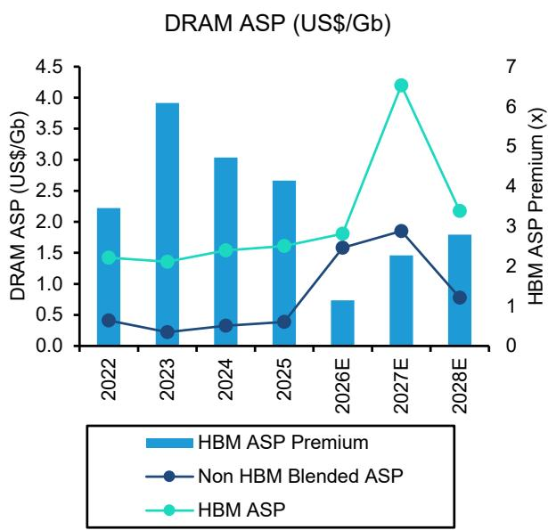  
Source: Company reports, TrendForce, Bernstein estimates and analysis

EXHIBIT 2: We expect the price increase to take place at all generations of HBM.  
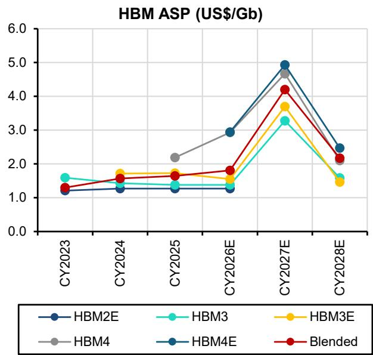  
Source: Company reports, TrendForce, Bernstein estimates and analysis

EXHIBIT 3: We estimate HBM price increase, its cost markup, and also DRAM & NAND price increase together require nearly 30% increase in AI data center capex.  
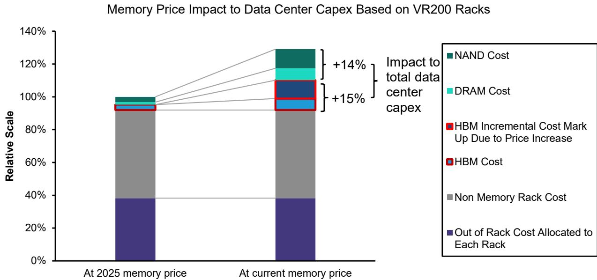  
Source: Expert conversations, company reports, TrendForce, Bernstein estiates and analysis

The profitability of HBM may stay below that of conventional memory next year should suppliers recognize the strategic value of HBM and price HBM less aggressively.

\- Conventional DRAM price is expected to have moved up by \~4.5x by 2QCY26 compared to 3QCY25, and we think prices can possibly rise by another turn in CY27 (or another \~25% from 2QCY26) before peaking (Exhibit 4-Exhibit 5). As a result of that, conventional DRAM now enjoys similar if not higher ASP per bit than HBM. And given its higher bit density and yield, conventional DRAM, we estimate, will generate 2x revenue per wafer capacity vs. HBM this year (Exhibit 6), and command a notably higher margins too (Exhibit 7). Both Samsung and Micron clearly said non-HBM DRAM margin was already ahead of HBM margin in their 1QCY26 earnings calls, as conventional DRAM price keeps climbing, the margin gap between the two keeps widening.

\- Given conventional DRAM price may rise further next year, we think memory suppliers will demand a significant increase in HBM prices to balance the profitability between the two. Samsung in its earnings call also mentioned that it expects the margin differential to be “significantly reduced in 2027”, implying raising HBM prices. We estimate 3x increase in HBM price is needed for HBM revenue per wafer capacity to catch up with conventional DRAM. Some, on the other hand, may argue HBM is a vital part of AI and is critical to the entire AI infrastructure build out. We think suppliers may recognize this and understand that high HBM cost can be unhealthy for overall AI ecosystem development and ultimately to memory demand as well. SK hynix indeed also stressed that it will try to achieve “optimal allocation between HBM and general DRAM”, and will not try to maximize revenue. We hence model 2-2.5x increase in HBM price next year on account of the above considerations (Exhibit 1-Exhibit 2). HBM profitability hence will remain below that of conventional DRAM next year, but the gap should be much smaller than this year.

\- Across different HBM suppliers, Samsung we believe now leads in HBM4 technology. Our latest Korea memory export tracker (report link) did find a meaningful increase in export value per weight from Samsung in May, which can be due to HBM4 starting shipment (Exhibit 8). We think this can enable Samsung to grow its HBM market share this year and next year (Exhibit 9-Exhibit 10). However, as mentioned above, more HBM exposure may likely mean less profit for memory suppliers. And we do get the impression that Samsung is more focused on achieving higher profit margins, and hence may choose to deploy more capacity for conventional memory, even with Samsung's technological lead in HBM4.

EXHIBIT 4: Conventional DRAM price has gone up by 4.5x and we see another 25% increase before reaching the peak.  
Conventional DRAM ASP (US\$/Gb)  
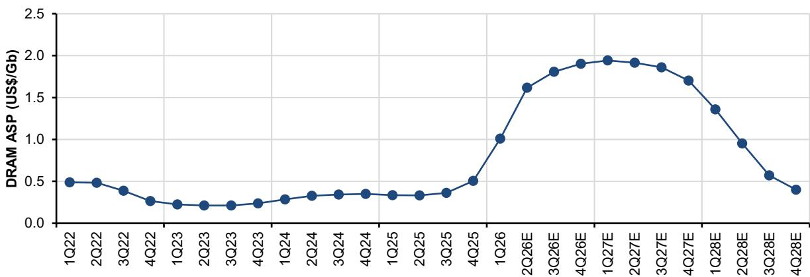  
Source: Company reports, Bernstein estimates and analysis

EXHIBIT 5: We forecast DRAM price to continue rising after 2QCY26 though at a slower rate and reach peak in CY27.  
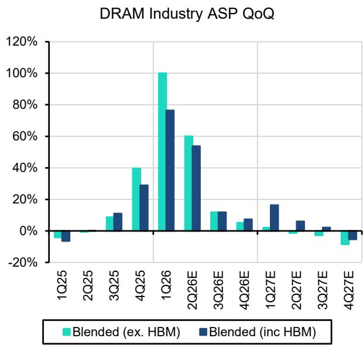  
Source: Company reports, Bernstein estimates and analysis

EXHIBIT 6: Conventional DRAM now generates considerably more revenue per wafer capacity than HBM, and we project an HBM price hike next year to narrow that gap.  
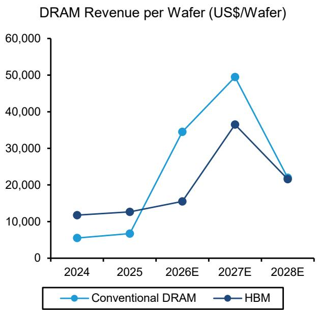  
Source: Company reports, Bernstein estimates and analysis

EXHIBIT 7: We believe the margin gap between HBM and conventional DRAM to narrow next year.  
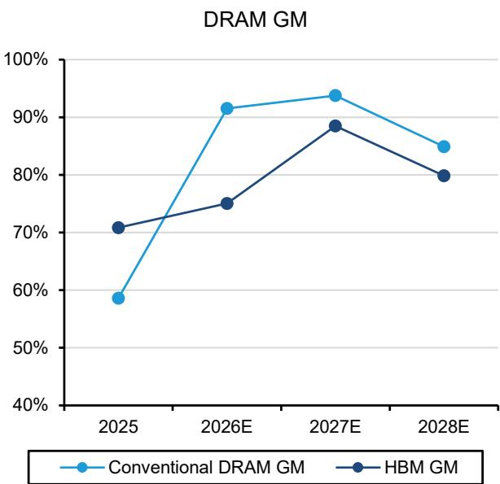  
Source: Company reports, Bernstein estimates and analysis

S. Chungcheong Export N. Chungcheong Export + Icheon Export Other Provinces

EXHIBIT 8: Value per weight remained largely in the same range though the export value per weight for Samsung rose notably & suggested HBM4 shipment in May.  
Korea Multichip Memory Export Value per Weight to TW+MY  
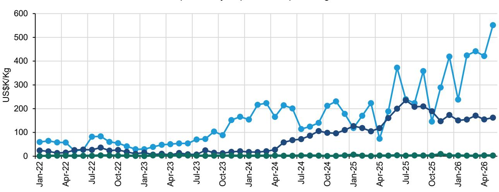  
Source: Korea Custom Service, KITA and Bernstein analysis  
EXHIBIT 9: We see Samsung to gain share in HBM on better HBM4 performance & more capacity, but also see uncertainty as Samsung may choose to allocate more capacity to conventional DRAM for better profitability.  
HBM Market Share by Bit Shipment

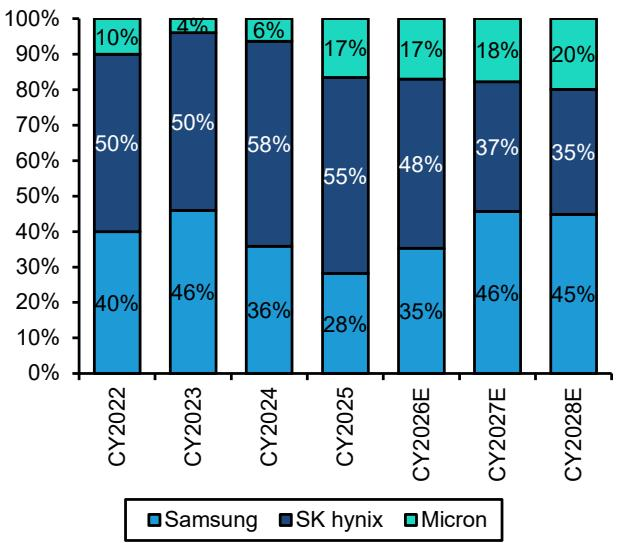  
EXHIBIT 10: With the expected HBM price increase, we forecast HBM's revenue mix in DRAM to rebound next year.  
HBM Contribution to DRAM Revenue

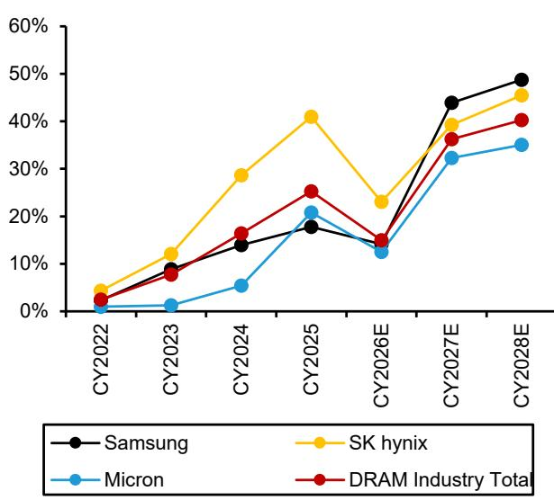  
Source: TrendForce, company reports, Bernstein estimates and analysis  
Source: TrendForce, Bernstein estimates and analysis

## DRAM stocks will benefit from a rapid upward earnings revision in the near term.

\- We believe negotiation of HBM supply for next year is still ongoing and we should hear more news on that in the coming months. And we also don't think this HBM price increase has been fully reflected in the sell-side consensus on Bloomberg. We will elaborate our model revision below, but we're above consensus in CY2027 meaningfully as we incorporate HBM price hike in this revision. We expect other sell-side forecasts to follow and hence a notable upward change to CY2027

consensus soon, which in turn support stock prices to move upward in the near term.

\- Please note this HBM revision will only benefit Samsung, SK hynix and Micron. Pure NAND suppliers, such as KIOXIA, do not have HBM and hence will not benefit from this revision.

## MediaTek may benefit if hyperscalers demand to source HBM directly to avoid the markup.

\- Though we expect NVIDIA & other AI accelerator suppliers to emphasize the importance of integrating HBM with the rest of their offerings and hence continuing having HBM as part of their revenue, many hyperscalers, we believe, will negotiate and try to source HBM directly to avoid the chance of HBM markup. We believe this trend to favor Asian ASIC service providers as their business model allows hyperscalers to do so now.

\- MediaTek thus can benefit from this trend. The execution on its first and second TPU project is also solid. Our recent supply chain checks also suggest an upside risk to our 2028 projection. The stock went up \~130% in the past 2 months, but we still see upside and reiterate Outperform.

We raise our projections on stronger conventional DRAM prices and also higher HBM pricing. Based on 6.2-7.7x 1 year forward P/E, we raise target price for Samsung, SK hynix and Micron and see another 15-26% upside. Maintain Outperform.

\- We raise forecasts for Samsung, SK hynix and Micron to reflect stronger-than-expected price increase in the near term, but more importantly our CY2027 projections as a result of higher HBM ASP as discussed above. And we are now also notably above consensus in FY27 EPS by 25-38% (Exhibit 11-Exhibit 13). Earnings are forecast to rise almost vertically this year and into next year as well (Exhibit 14-Exhibit 16), and that will keep the stock prices strong.

\- We generally see the DRAM shortage to be more acute and remain for longer than we previously expected. We see DRAM prices can remain strong likely for most of CY27. That said we do still believe with more clean rooms coming online, prices will likely soften in CY28. And we hence still model revenue to decline YoY in FY28 for all three companies, that puts us below consensus, which apparently assumes very limited decrease in pricing. Please note that our forecast still has DRAM industry gross margin at 70% exiting CY28, higher than peak margins in all past upcycles only except for CY18 (Exhibit 17).

\- Valuing memory companies using P/B is tricky now as margins and return on equity will be reaching unprecedented levels (Exhibit 18). Hence we cannot reference history to identify the right P/B multiple. We also note that cash position will also reach an unprecedented level, also making it complicated to value based on book value (Exhibit 19-Exhibit 24). We hence switch to P/E based valuation, and we believe investors are also increasingly basing their valuation on earnings. We set our target P/E close to historical trough levels to value peak cycle earnings. We raise target price to KRW440,000 for Samsung, at 6.2x 1 year forward P/E, representing 26% upside. SK hynix target price is raised to KRW 3,300,000 at 6.2x forward P/E as well, representing 20% upside. Micron target price is set at US\$1,300, at 7.7x P/E, representing 15% upside. We reiterate Outperform ratings on Samsung, SK hynix and Micron.

EXHIBIT 11: For Samsung, our EPS is 26% above consensus for 2027.

<table><tr><td rowspan="3">Samsung</td><td colspan="5">2026E</td><td colspan="5">2027E</td><td colspan="5">2028E</td></tr><tr><td colspan="5">Bernstein</td><td colspan="5">Bernstein</td><td colspan="5">Bernstein</td></tr><tr><td>New</td><td>Old</td><td>% Chg</td><td>Consensus</td><td>% Diff</td><td>New</td><td>Old</td><td>% Chg</td><td>Consensus</td><td>% Diff</td><td>New</td><td>Old</td><td>% Chg</td><td>Consensus</td><td>% Diff</td></tr><tr><td>Revenue (KRW B)</td><td>678,209</td><td>571,178</td><td>18.7%</td><td>684,036</td><td>-0.9%</td><td>920,481</td><td>686,889</td><td>34.0%</td><td>862,952</td><td>6.7%</td><td>591,825</td><td>446,595</td><td>32.5%</td><td>917,793</td><td>-35.5%</td></tr><tr><td>YoY</td><td>103.3%</td><td>71.2%</td><td></td><td>105.0%</td><td></td><td>35.7%</td><td>20.3%</td><td></td><td>26.2%</td><td></td><td>-35.7%</td><td>-35.0%</td><td></td><td>6.4%</td><td></td></tr><tr><td>Gross Margin</td><td>77.8%</td><td>81.2%</td><td>-3.4%</td><td>69.4%</td><td>8.4%</td><td>88.6%</td><td>87.3%</td><td>1.2%</td><td>73.3%</td><td>15.2%</td><td>66.9%</td><td>52.9%</td><td>14.0%</td><td>68.2%</td><td>-1.3%</td></tr><tr><td>Operating Margin</td><td>64.1%</td><td>57.2%</td><td>6.8%</td><td>51.2%</td><td>12.9%</td><td>76.1%</td><td>65.4%</td><td>10.7%</td><td>56.0%</td><td>20.1%</td><td>45.4%</td><td>32.9%</td><td>12.4%</td><td>54.2%</td><td>-8.8%</td></tr><tr><td>EPS (KRW)</td><td>48,393</td><td>35,740</td><td>35.4%</td><td>44,557</td><td>8.6%</td><td>77,273</td><td>49,548</td><td>56.0%</td><td>61,510</td><td>25.6%</td><td>31,054</td><td>17,340</td><td>79.1%</td><td>63,146</td><td>-50.8%</td></tr><tr><td>YoY</td><td>632.0%</td><td>440.6%</td><td></td><td>573.9%</td><td></td><td>59.7%</td><td>38.6%</td><td></td><td>38.0%</td><td></td><td>-59.8%</td><td>-65.0%</td><td></td><td>2.7%</td><td></td></tr></table>

Source: Bloomberg, Bernstein estimates and analysis

EXHIBIT 12: We raise estimates for hynix and see 30%+ upside to consensus for both 2026 and 2027.

<table><tr><td rowspan="2">SK hynix</td><td colspan="5">2026E</td><td colspan="5">2027E</td><td colspan="5">2028E</td></tr><tr><td>Bernstein New</td><td>Old</td><td>% Chg</td><td>Consensu</td><td>% Diff</td><td>Bernstein New</td><td>Old</td><td>% Chg</td><td>Consensu</td><td>% Diff</td><td>Bernstein New</td><td>Old</td><td>% Chg</td><td>Consensu</td><td>% Diff</td></tr><tr><td>Revenue (KRW Bn)</td><td>369,627</td><td>307,701</td><td>20.1%</td><td>339,075</td><td>9.0%</td><td>582,611</td><td>406,986</td><td>43.2%</td><td>491,637</td><td>18.5%</td><td>319,374</td><td>182,106</td><td>75.4%</td><td>542,332</td><td>-41.1%</td></tr><tr><td>YoY</td><td>280.5%</td><td>216.7%</td><td></td><td>249.0%</td><td></td><td>57.6%</td><td>32.3%</td><td></td><td>45.0%</td><td></td><td>-45.2%</td><td>-55.3%</td><td></td><td>10.3%</td><td></td></tr><tr><td>Gross Margin</td><td>87.9%</td><td>87.0%</td><td>0.9%</td><td>83.5%</td><td>4.4%</td><td>91.7%</td><td>88.4%</td><td>3.3%</td><td>82.6%</td><td>9.1%</td><td>81.2%</td><td>70.7%</td><td>10.6%</td><td>79.4%</td><td>1.8%</td></tr><tr><td>Operating Margin</td><td>83.1%</td><td>81.1%</td><td>2.0%</td><td>76.7%</td><td>6.3%</td><td>84.8%</td><td>82.4%</td><td>2.4%</td><td>77.7%</td><td>7.0%</td><td>64.0%</td><td>59.5%</td><td>4.5%</td><td>74.9%</td><td>-10.9%</td></tr><tr><td>Diluted EPS (KRW)</td><td>395,677</td><td>286,732</td><td>38.0%</td><td>300,629</td><td>31.6%</td><td>568,862</td><td>385,594</td><td>47.5%</td><td>429,536</td><td>32.4%</td><td>235,417</td><td>124,299</td><td>89.4%</td><td>466,745</td><td>-49.6%</td></tr><tr><td>YoY</td><td>555.7%</td><td>375.2%</td><td></td><td>398.2%</td><td></td><td>43.8%</td><td>34.5%</td><td></td><td>42.9%</td><td></td><td>-58.6%</td><td>-67.8%</td><td></td><td>8.7%</td><td></td></tr></table>

Source: Bloomberg, Bernstein estimates and analysis

EXHIBIT 13: Our Micron FY27 EPS forecast is 38% above consensus too.

<table><tr><td rowspan="2">Micron</td><td colspan="5">FY2026E</td><td colspan="5">FY2027E</td><td colspan="5">FY2028E</td></tr><tr><td>Bernstein New</td><td>Old</td><td>% Chg</td><td colspan="2">Consensus % Diff</td><td>Bernstein New</td><td>Old</td><td>% Chg</td><td colspan="2">Consensus % Diff</td><td>Bernstein New</td><td>Old</td><td>% Chg</td><td colspan="2">Consensus % Diff</td></tr><tr><td>GAAP</td><td></td><td></td><td></td><td></td><td></td><td></td><td></td><td></td><td></td><td></td><td></td><td></td><td></td><td></td><td></td></tr><tr><td>Revenue (US$B)</td><td>122.6</td><td>116.9</td><td>4.8%</td><td>114.1</td><td>7.5%</td><td>253.8</td><td>199.8</td><td>27.0%</td><td>196.0</td><td>29.5%</td><td>207.1</td><td>110.9</td><td>86.8%</td><td>205.5</td><td>0.8%</td></tr><tr><td>YoY</td><td>228.0%</td><td>212.8%</td><td></td><td>205.1%</td><td></td><td>107.0%</td><td>70.9%</td><td></td><td>71.8%</td><td></td><td>-18.4%</td><td>-44.5%</td><td></td><td>4.9%</td><td></td></tr><tr><td>Gross Margin</td><td>78.9%</td><td>78.0%</td><td>1.0%</td><td>77.6%</td><td>1.4%</td><td>87.8%</td><td>85.5%</td><td>2.3%</td><td>81.8%</td><td>5.9%</td><td>82.7%</td><td>70.3%</td><td>12.4%</td><td>78.7%</td><td>4.1%</td></tr><tr><td>Operating Margin</td><td>73.6%</td><td>71.9%</td><td>1.7%</td><td>71.9%</td><td>1.7%</td><td>84.2%</td><td>80.7%</td><td>3.4%</td><td>80.1%</td><td>4.1%</td><td>77.8%</td><td>61.5%</td><td>16.3%</td><td>76.3%</td><td>1.5%</td></tr><tr><td>Diluted EPS (US$)</td><td>66.99</td><td>62.27</td><td>7.6%</td><td>61.28</td><td>9.3%</td><td>158.96</td><td>121.31</td><td>31.0%</td><td>112.35</td><td>41.5%</td><td>121.42</td><td>52.54</td><td>131.1%</td><td>119.25</td><td>1.8%</td></tr><tr><td>YoY</td><td>782.7%</td><td>720.6%</td><td></td><td>707.6%</td><td></td><td>137.3%</td><td>94.8%</td><td></td><td>83.3%</td><td></td><td>-23.6%</td><td>-56.7%</td><td></td><td>6.1%</td><td></td></tr><tr><td>Non-GAAP</td><td></td><td></td><td></td><td></td><td></td><td></td><td></td><td></td><td></td><td></td><td></td><td></td><td></td><td></td><td></td></tr><tr><td>Diluted EPS (US$)</td><td>67.39</td><td>62.53</td><td>7.8%</td><td>61.82</td><td>9.0%</td><td>158.99</td><td>121.03</td><td>31.4%</td><td>115.19</td><td>38.0%</td><td>121.40</td><td>52.75</td><td>130.1%</td><td>117.02</td><td>3.7%</td></tr><tr><td>YoY</td><td>713.3%</td><td>654.6%</td><td></td><td>646.1%</td><td></td><td>135.9%</td><td>93.6%</td><td></td><td>86.3%</td><td></td><td>-23.6%</td><td>-56.4%</td><td></td><td>1.6%</td><td></td></tr></table>

Source: Bloomberg, Bernstein estimates and analysis

EXHIBIT 14: We expect EPS to grow exponentially going forward.  
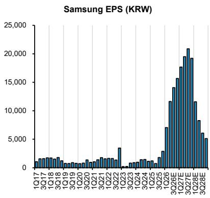  
Source: Company reports, Bernstein estimates and analysis

EXHIBIT 15: We model earnings to reach peak in 2HCY27...  
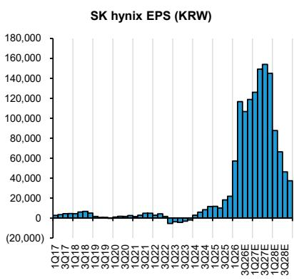  
Source: Company reports, Bernstein estimates and analysis

EXHIBIT 16: ... and then gradually decline in CY28 as prices normalize.  
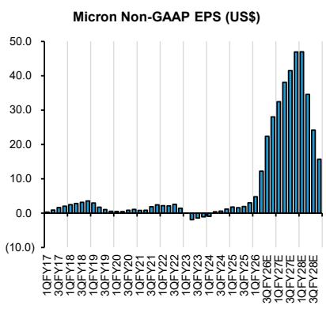  
Source: Company reports, Bernstein estimates and analysis

EXHIBIT 17: We forecast DRAM prices to fall in CY28 but GM remain at 70% exiting CY28, higher than peak margins in most of past upcycles.

DRAM Gross Margin  
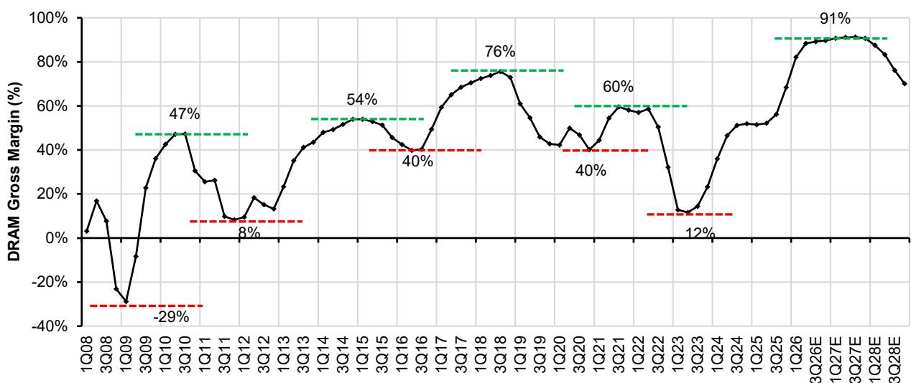  
Source: Company reports, DRAMeXchange, Bernstein estimates and analysis  
EXHIBIT 18: ROE will rise to unprecedented levels.

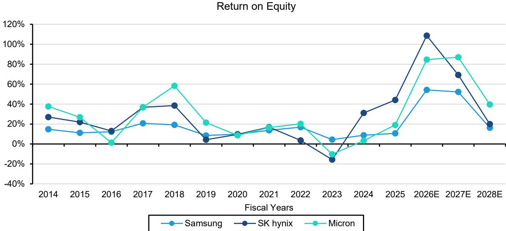  
Source: Compay reports, Bernstein estimates and analysis

EXHIBIT 19: Samsung BVPS can grow by nearly 2x in both 2026 and 2027.  
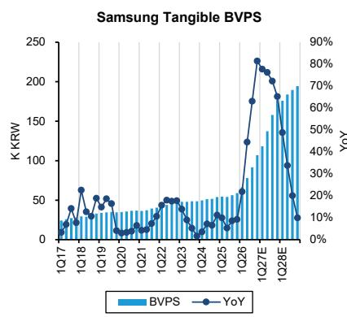  
Source: Company reports, Bernstein estimates and analysis

EXHIBIT 20: SK hynix can see even steeper accretion in BVPS.  
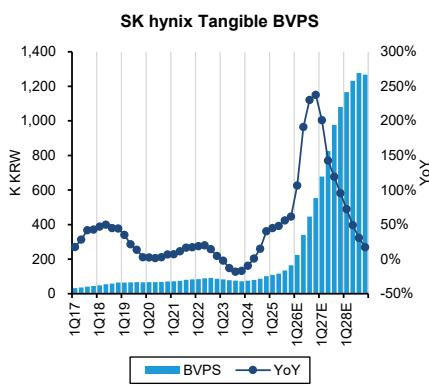  
Source: Company reports, Bernstein estimates and analysis

EXHIBIT 21: We see 4x increase in Micron BVPS from now to end of FY27.  
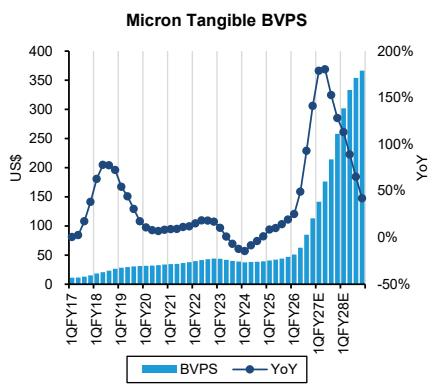  
Source: Company reports, Bernstein estimates and analysis

EXHIBIT 22: Cash will accumulate at unprecedented pace as well.  
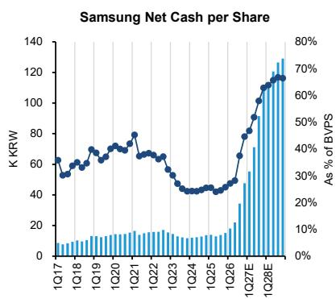  
Source: Company reports, Bernstein estimates and analysis

EXHIBIT 23: We forecast cash to reach 70-80% of book value...  
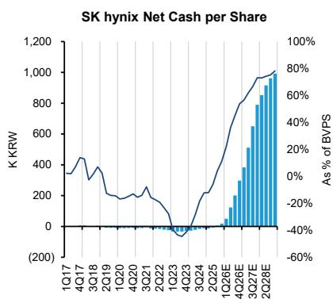  
Source: Company reports, Bernstein estimates and analysis

EXHIBIT 24: ... unless company meaningful increase payout or use it for M&A.  
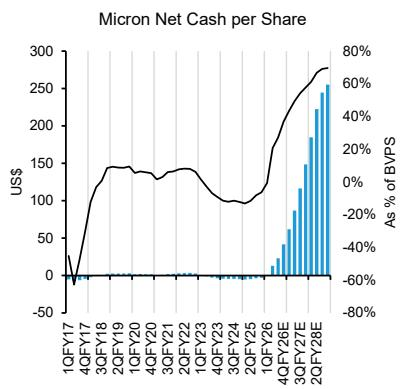  
Source: Company reports, Bernstein estimates and analysis

EXHIBIT 25: We now target 6.2x 1 year P/E to value Samsung.  
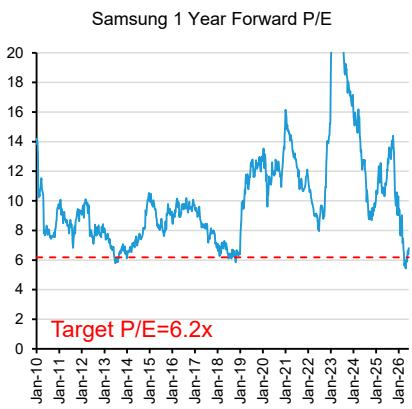  
Source: Bloomberg and Bernstein analysis

EXHIBIT 26: We also use 6.2x P/E for hynix.  
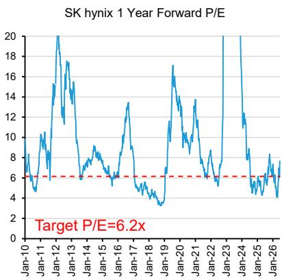  
Source: Bloomberg and Bernstein analysis

EXHIBIT 27: Micron target P/E is 7.7x, still close to past trough levels.  
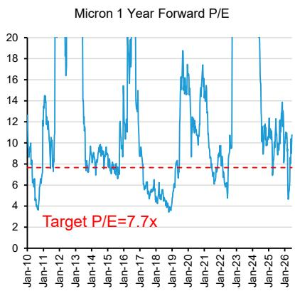  
Source: Bloomberg and Bernstein analysis

## APPENDIX - FINANCIAL FORECASTS

## EXHIBIT 28: Samsung Income Statement

Figures in KRW B Unless Otherwise Stated

<table><tr><td>Income Statement</td><td>2025</td><td>2026E</td><td>2027E</td><td>2028E</td></tr><tr><td>Revenue</td><td>333,606</td><td>678,209</td><td>920,481</td><td>591,825</td></tr><tr><td>COGS</td><td>202,236</td><td>150,586</td><td>105,386</td><td>195,676</td></tr><tr><td>Gross Profit</td><td>131,370</td><td>527,623</td><td>815,095</td><td>396,149</td></tr><tr><td>R&amp;D</td><td>37,740</td><td>40,168</td><td>46,024</td><td>41,428</td></tr><tr><td>SG&amp;A</td><td>50,029</td><td>53,062</td><td>68,808</td><td>86,151</td></tr><tr><td>Operating Profit</td><td>43,601</td><td>434,393</td><td>700,262</td><td>268,570</td></tr><tr><td>Other non-operating Income/(Expenses)</td><td>-</td><td>-</td><td>-</td><td>-</td></tr><tr><td>Equity-Method Investments</td><td>671</td><td>638</td><td>706</td><td>745</td></tr><tr><td>Net interest (expense)/gain</td><td>4,550</td><td>3,773</td><td>9,283</td><td>16,540</td></tr><tr><td>Income Before Taxes</td><td>48,823</td><td>438,804</td><td>710,251</td><td>285,855</td></tr><tr><td>Income Taxes</td><td>4,275</td><td>116,164</td><td>195,319</td><td>78,610</td></tr><tr><td>Net Income (before minority interest)</td><td>44,548</td><td>322,640</td><td>514,932</td><td>207,245</td></tr><tr><td>Minority Interest</td><td>287</td><td>245</td><td>480</td><td>500</td></tr><tr><td>Net Income (after minority interest)</td><td>44,261</td><td>322,395</td><td>514,452</td><td>206,745</td></tr><tr><td>EPS After Minority (KRW per share)</td><td>6,612</td><td>48,393</td><td>77,273</td><td>31,054</td></tr><tr><td>Total Shares Out</td><td>6,695</td><td>6,662</td><td>6,658</td><td>6,658</td></tr><tr><td>EBITDA</td><td>88,008</td><td>482,161</td><td>757,985</td><td>336,392</td></tr><tr><td>Margins %</td><td></td><td></td><td></td><td></td></tr><tr><td>Gross Margin</td><td>39.4%</td><td>77.8%</td><td>88.6%</td><td>66.9%</td></tr><tr><td>Operating Margin</td><td>13.1%</td><td>64.1%</td><td>76.1%</td><td>45.4%</td></tr><tr><td>NI before MI Margin</td><td>13.4%</td><td>47.6%</td><td>55.9%</td><td>35.0%</td></tr><tr><td>NI after MI Margin</td><td>13.3%</td><td>47.5%</td><td>55.9%</td><td>34.9%</td></tr><tr><td>EBITDA Margin</td><td>26.4%</td><td>71.1%</td><td>82.3%</td><td>56.8%</td></tr><tr><td>ROE %</td><td>10.6%</td><td>54.2%</td><td>52.1%</td><td>16.2%</td></tr><tr><td>Growth %</td><td></td><td></td><td></td><td></td></tr><tr><td>Revenue Growth</td><td>10.9%</td><td>103.3%</td><td>35.7%</td><td>(35.7%)</td></tr><tr><td>Operating Profit Growth</td><td>33.2%</td><td>896.3%</td><td>61.2%</td><td>(61.6%)</td></tr><tr><td>EPS Growth</td><td>33.6%</td><td>632.0%</td><td>59.7%</td><td>(59.8%)</td></tr></table>

<table><tr><td>Semiconductor</td><td>2025</td><td>2026E</td><td>2027E</td><td>2028E</td></tr><tr><td>Total Revenue</td><td>130,123</td><td>542,942</td><td>858,436</td><td>443,457</td></tr><tr><td>DRAM</td><td>72,143</td><td>360,236</td><td>622,242</td><td>328,287</td></tr><tr><td>NAND</td><td>31,871</td><td>153,560</td><td>202,715</td><td>76,708</td></tr><tr><td>Total Memory</td><td>104,100</td><td>513,856</td><td>825,017</td><td>405,055</td></tr><tr><td>System LSI</td><td>25,823</td><td>28,886</td><td>33,219</td><td>38,202</td></tr><tr><td>Operating Profit</td><td>24,847</td><td>420,139</td><td>685,688</td><td>246,129</td></tr><tr><td>OP margin %</td><td>19.1%</td><td>77.4%</td><td>79.9%</td><td>55.5%</td></tr><tr><td>Display Panel</td><td>2025</td><td>2026E</td><td>2027E</td><td>2028E</td></tr><tr><td>Total Revenue</td><td>29,848</td><td>30,707</td><td>32,625</td><td>31,903</td></tr><tr><td>LCD</td><td>1,913</td><td>2,287</td><td>2,328</td><td>2,371</td></tr><tr><td>AMOLED</td><td>27,935</td><td>28,420</td><td>30,297</td><td>29,532</td></tr><tr><td>Operating Profit</td><td>4,160</td><td>3,495</td><td>4,062</td><td>4,233</td></tr><tr><td>OP margin %</td><td>13.9%</td><td>11.4%</td><td>12.5%</td><td>13.3%</td></tr><tr><td>IT &amp; Mobile</td><td>2025</td><td>2026E</td><td>2027E</td><td>2028E</td></tr><tr><td>Total Revenue</td><td>129,600</td><td>132,554</td><td>132,076</td><td>133,444</td></tr><tr><td>Mobile (handsets + tablets)</td><td>104,882</td><td>107,681</td><td>107,958</td><td>109,327</td></tr><tr><td>Other (PCs, smartwatches, VR etc.)</td><td>21,618</td><td>21,618</td><td>20,537</td><td>20,537</td></tr><tr><td>Networking</td><td>3,100</td><td>3,255</td><td>3,581</td><td>3,581</td></tr><tr><td>Operating Profit</td><td>12,900</td><td>9,111</td><td>9,194</td><td>15,545</td></tr><tr><td>OP margin %</td><td>10.0%</td><td>6.9%</td><td>7.0%</td><td>11.6%</td></tr><tr><td>Consumer Electronics</td><td>2025</td><td>2026E</td><td>2027E</td><td>2028E</td></tr><tr><td>Total Revenue</td><td>57,300</td><td>56,410</td><td>53,983</td><td>53,303</td></tr><tr><td>Visual Display</td><td>30,900</td><td>31,308</td><td>30,136</td><td>30,649</td></tr><tr><td>Appliance</td><td>26,400</td><td>25,102</td><td>23,847</td><td>22,655</td></tr><tr><td>Operating Profit</td><td>(200)</td><td>339</td><td>(130)</td><td>938</td></tr><tr><td>OP Margin %</td><td>(0.3%)</td><td>0.6%</td><td>(0.2%)</td><td>1.8%</td></tr><tr><td>Harman</td><td>2025</td><td>2026E</td><td>2027E</td><td>2028E</td></tr><tr><td>Total Revenue</td><td>15,157</td><td>16,711</td><td>18,382</td><td>20,220</td></tr><tr><td>Operating Profit</td><td>1,511</td><td>1,376</td><td>1,448</td><td>1,725</td></tr><tr><td>OP Margin %</td><td>10.0%</td><td>8.2%</td><td>7.9%</td><td>8.5%</td></tr></table>

<table><tr><td>1Q25</td><td>2Q25</td><td>3Q25</td><td>4Q25</td><td>1Q26</td><td>2Q26E</td><td>3Q26E</td><td>4Q26E</td></tr><tr><td>79,141</td><td>74,566</td><td>86,062</td><td>93,837</td><td>133,873</td><td>161,466</td><td>185,767</td><td>197,102</td></tr><tr><td>51,010</td><td>49,070</td><td>52,570</td><td>49,586</td><td>51,960</td><td>32,727</td><td>35,122</td><td>30,776</td></tr><tr><td>28,131</td><td>25,497</td><td>33,492</td><td>44,251</td><td>81,913</td><td>128,739</td><td>150,645</td><td>166,326</td></tr><tr><td>9,033</td><td>9,019</td><td>8,824</td><td>10,864</td><td>11,337</td><td>9,688</td><td>9,288</td><td>9,855</td></tr><tr><td>12,413</td><td>11,801</td><td>12,502</td><td>13,313</td><td>13,344</td><td>12,917</td><td>13,004</td><td>13,797</td></tr><tr><td>6,685</td><td>4,676</td><td>12,166</td><td>20,074</td><td>57,233</td><td>106,134</td><td>128,353</td><td>142,674</td></tr><tr><td>865</td><td>18</td><td>(124)</td><td>(101)</td><td>245</td><td>-</td><td>-</td><td>-</td></tr><tr><td>119</td><td>159</td><td>304</td><td>90</td><td>121</td><td>175</td><td>172</td><td>171</td></tr><tr><td>1,483</td><td>903</td><td>1,200</td><td>965</td><td>1,230</td><td>613</td><td>747</td><td>1,183</td></tr><tr><td>9,152</td><td>5,756</td><td>13,546</td><td>21,028</td><td>58,828</td><td>106,921</td><td>129,272</td><td>144,028</td></tr><tr><td>929</td><td>640</td><td>1,320</td><td>1,387</td><td>11,603</td><td>29,403</td><td>35,550</td><td>39,608</td></tr><tr><td>8,223</td><td>5,116</td><td>12,226</td><td>19,642</td><td>47,225</td><td>77,518</td><td>93,722</td><td>104,420</td></tr><tr><td>194</td><td>182</td><td>219</td><td>350</td><td>124</td><td>66</td><td>144</td><td>156</td></tr><tr><td>8,028</td><td>4,934</td><td>12,007</td><td>19,292</td><td>47,101</td><td>77,452</td><td>93,578</td><td>104,264</td></tr><tr><td>1,192</td><td>737</td><td>1,801</td><td>2,886</td><td>7,056</td><td>11,634</td><td>14,056</td><td>15,661</td></tr><tr><td>6,737</td><td>6,692</td><td>6,665</td><td>6,684</td><td>6,675</td><td>6,658</td><td>6,658</td><td>6,658</td></tr><tr><td>17,415</td><td>16,033</td><td>23,126</td><td>31,434</td><td>68,713</td><td>117,747</td><td>140,457</td><td>155,244</td></tr><tr><td>35.5%</td><td>34.2%</td><td>38.9%</td><td>47.2%</td><td>61.2%</td><td>79.7%</td><td>81.1%</td><td>84.4%</td></tr><tr><td>8.4%</td><td>6.3%</td><td>14.1%</td><td>21.4%</td><td>42.8%</td><td>65.7%</td><td>69.1%</td><td>72.4%</td></tr><tr><td>10.4%</td><td>6.9%</td><td>14.2%</td><td>20.9%</td><td>35.3%</td><td>48.0%</td><td>50.5%</td><td>53.0%</td></tr><tr><td>10.1%</td><td>6.6%</td><td>14.0%</td><td>20.6%</td><td>35.2%</td><td>48.0%</td><td>50.4%</td><td>52.9%</td></tr><tr><td>22.0%</td><td>21.5%</td><td>26.9%</td><td>33.5%</td><td>51.3%</td><td>72.9%</td><td>75.6%</td><td>78.8%</td></tr><tr><td>8.1%</td><td>5.1%</td><td>12.0%</td><td>18.5%</td><td>40.9%</td><td>59.2%</td><td>61.7%</td><td>59.3%</td></tr><tr><td>4.4%</td><td>(5.8%)</td><td>15.4%</td><td>9.0%</td><td>42.7%</td><td>20.6%</td><td>15.1%</td><td>6.1%</td></tr><tr><td>3.0%</td><td>(30.1%)</td><td>160.2%</td><td>65.0%</td><td>185.1%</td><td>85.4%</td><td>20.9%</td><td>11.2%</td></tr><tr><td>6.8%</td><td>(38.1%)</td><td>144.3%</td><td>60.2%</td><td>144.5%</td><td>64.9%</td><td>20.8%</td><td>11.4%</td></tr></table>

Source: Company reports, Bernstein estimates and analysis

<table><tr><td>1Q25</td><td>2Q25</td><td>3Q25</td><td>4Q25</td><td>1Q26</td><td>2Q26E</td><td>3Q26E</td><td>4Q26E</td></tr><tr><td>25,131</td><td>27,875</td><td>33,117</td><td>44,000</td><td>81,700</td><td>133,040</td><td>155,527</td><td>172,675</td></tr><tr><td>12,814</td><td>13,813</td><td>18,210</td><td>27,306</td><td>54,571</td><td>90,735</td><td>103,086</td><td>111,844</td></tr><tr><td>6,261</td><td>7,362</td><td>8,466</td><td>9,782</td><td>20,214</td><td>35,085</td><td>45,372</td><td>52,889</td></tr><tr><td>19,100</td><td>21,200</td><td>26,700</td><td>37,100</td><td>74,800</td><td>125,835</td><td>148,474</td><td>164,747</td></tr><tr><td>5,981</td><td>6,625</td><td>6,367</td><td>6,850</td><td>6,850</td><td>7,155</td><td>7,003</td><td>7,878</td></tr><tr><td>1,106</td><td>350</td><td>6,991</td><td>16,400</td><td>53,700</td><td>103,159</td><td>124,292</td><td>138,989</td></tr><tr><td>4.4%</td><td>1.3%</td><td>21.1%</td><td>37.3%</td><td>65.7%</td><td>77.5%</td><td>79.9%</td><td>80.5%</td></tr><tr><td>1Q25</td><td>2Q25</td><td>3Q25</td><td>4Q25</td><td>1Q26</td><td>2Q26E</td><td>3Q26E</td><td>4Q26E</td></tr><tr><td>5,867</td><td>6,380</td><td>8,102</td><td>9,500</td><td>6,700</td><td>6,970</td><td>8,260</td><td>8,777</td></tr><tr><td>411</td><td>447</td><td>486</td><td>570</td><td>536</td><td>536</td><td>604</td><td>611</td></tr><tr><td>5,456</td><td>5,933</td><td>7,615</td><td>8,930</td><td>6,164</td><td>6,434</td><td>7,657</td><td>8,166</td></tr><tr><td>462</td><td>473</td><td>1,225</td><td>2,000</td><td>400</td><td>558</td><td>1,219</td><td>1,319</td></tr><tr><td>7.9%</td><td>7.4%</td><td>15.1%</td><td>21.1%</td><td>6.0%</td><td>8.0%</td><td>14.8%</td><td>15.0%</td></tr><tr><td>1Q25</td><td>2Q25</td><td>3Q25</td><td>4Q25</td><td>1Q26</td><td>2Q26E</td><td>3Q26E</td><td>4Q26E</td></tr><tr><td>37,000</td><td>29,200</td><td>34,100</td><td>29,300</td><td>38,100</td><td>31,118</td><td>33,643</td><td>29,692</td></tr><tr><td>30,754</td><td>23,735</td><td>27,496</td><td>22,897</td><td>31,124</td><td>24,221</td><td>27,916</td><td>24,420</td></tr><tr><td>5,446</td><td>4,765</td><td>6,004</td><td>5,403</td><td>6,376</td><td>6,057</td><td>4,846</td><td>4,339</td></tr><tr><td>800</td><td>700</td><td>600</td><td>1,000</td><td>600</td><td>840</td><td>882</td><td>933</td></tr><tr><td>4,300</td><td>3,100</td><td>3,600</td><td>1,900</td><td>2,800</td><td>2,047</td><td>2,343</td><td>1,920</td></tr><tr><td>11.6%</td><td>10.6%</td><td>10.6%</td><td>6.5%</td><td>7.3%</td><td>6.6%</td><td>7.0%</td><td>6.5%</td></tr><tr><td>1Q25</td><td>2Q25</td><td>3Q25</td><td>4Q25</td><td>1Q26</td><td>2Q26E</td><td>3Q26E</td><td>4Q26E</td></tr><tr><td>14,500</td><td>14,100</td><td>13,900</td><td>14,800</td><td>14,300</td><td>14,012</td><td>13,827</td><td>14,271</td></tr><tr><td>7,800</td><td>7,000</td><td>7,300</td><td>8,800</td><td>7,700</td><td>7,480</td><td>7,557</td><td>8,571</td></tr><tr><td>6,700</td><td>7,100</td><td>6,600</td><td>6,000</td><td>6,600</td><td>6,532</td><td>6,270</td><td>5,700</td></tr><tr><td>300</td><td>200</td><td>(100)</td><td>(600)</td><td>200</td><td>70</td><td>69</td><td>-</td></tr><tr><td>2.1%</td><td>1.4%</td><td>(0.7%)</td><td>(4.1%)</td><td>1.4%</td><td>0.5%</td><td>0.5%</td><td>-</td></tr><tr><td>1Q25</td><td>2Q25</td><td>3Q25</td><td>4Q25</td><td>1Q26</td><td>2Q26E</td><td>3Q26E</td><td>4Q26E</td></tr><tr><td>3,419</td><td>3,830</td><td>3,954</td><td>3,954</td><td>3,800</td><td>4,213</td><td>4,349</td><td>4,349</td></tr><tr><td>307</td><td>484</td><td>421</td><td>300</td><td>200</td><td>300</td><td>429</td><td>446</td></tr><tr><td>9.0%</td><td>12.6%</td><td>10.6%</td><td>7.6%</td><td>5.3%</td><td>7.1%</td><td>9.9%</td><td>10.3%</td></tr></table>

EXHIBIT 29: Samsung Operating Metrics

<table><tr><td colspan="5">Division Operating Metrics</td></tr><tr><td>Semiconductor</td><td>2025</td><td>2026E</td><td>2027E</td><td>2028E</td></tr><tr><td>DRAM ASP ($/Gb)</td><td>0.46</td><td>1.84</td><td>2.76</td><td>1.17</td></tr><tr><td>% change</td><td>20.9%</td><td>297.5%</td><td>49.7%</td><td>(57.5%)</td></tr><tr><td>NAND ASP ($/GB)</td><td>0.07</td><td>0.27</td><td>0.30</td><td>0.09</td></tr><tr><td>% change</td><td>(7.0%)</td><td>289.1%</td><td>8.8%</td><td>(68.7%)</td></tr><tr><td>DRAM Bits Shipped (Gb)</td><td>109,195</td><td>131,034</td><td>150,689</td><td>186,854</td></tr><tr><td>% change</td><td>9.7%</td><td>20.0%</td><td>15.0%</td><td>24.0%</td></tr><tr><td>NAND Bits Shipped (GB)</td><td>321,027</td><td>378,812</td><td>458,363</td><td>554,619</td></tr><tr><td>% change</td><td>1.8%</td><td>18.0%</td><td>21.0%</td><td>21.0%</td></tr><tr><td>DRAM Cost/Gb</td><td>0.19</td><td>0.20</td><td>0.25</td><td>0.22</td></tr><tr><td>% change</td><td>6.6%</td><td>4.9%</td><td>22.3%</td><td>(10.0%)</td></tr><tr><td>NAND Cost/GB</td><td>0.05</td><td>0.05</td><td>0.04</td><td>0.04</td></tr><tr><td>% change</td><td>(2.8%)</td><td>(7.8%)</td><td>(13.4%)</td><td>(11.4%)</td></tr><tr><td>NAND gross margins</td><td>25.8%</td><td>82.4%</td><td>86.0%</td><td>60.3%</td></tr><tr><td>DRAM gross margins</td><td>58.5%</td><td>89.1%</td><td>91.0%</td><td>81.1%</td></tr></table>

<table><tr><td>Display Panel</td><td>2025</td><td>2026E</td><td>2027E</td><td>2028E</td></tr><tr><td>LCD Panel Units (mn)</td><td>1.8</td><td>2.0</td><td>2.2</td><td>2.4</td></tr><tr><td>% change</td><td>25.0%</td><td>10.0%</td><td>10.0%</td><td>10.0%</td></tr><tr><td>AMOLED Panel Units (mn)</td><td>351.2</td><td>328.9</td><td>345.9</td><td>381.1</td></tr><tr><td>% change</td><td>2.4%</td><td>(6.3%)</td><td>5.2%</td><td>10.2%</td></tr><tr><td>LCD Panel ASP (USD)</td><td>748.2</td><td>776.9</td><td>715.5</td><td>662.3</td></tr><tr><td>% change</td><td>17.4%</td><td>3.8%</td><td>(7.9%)</td><td>(7.4%)</td></tr><tr><td>AMOLED ASP (USD)</td><td>55.9</td><td>58.0</td><td>58.5</td><td>51.8</td></tr><tr><td>% change</td><td>(6.4%)</td><td>3.8%</td><td>0.9%</td><td>(11.5%)</td></tr></table>

<table><tr><td>IT &amp; Mobile</td><td>2025</td><td>2026E</td><td>2027E</td><td>2028E</td></tr><tr><td>Smartphone Units (mn)</td><td>240</td><td>213</td><td>212</td><td>232</td></tr><tr><td>% change</td><td>7.1%</td><td>(11.4%)</td><td>(0.5%)</td><td>9.4%</td></tr><tr><td>Featurephone Units (mn)</td><td>15</td><td>15</td><td>15</td><td>15</td></tr><tr><td>% change</td><td>-</td><td>-</td><td>-</td><td>-</td></tr><tr><td>Total Handset Units (mn)</td><td>255</td><td>228</td><td>227</td><td>247</td></tr><tr><td>% change</td><td>6.7%</td><td>(10.7%)</td><td>(0.4%)</td><td>8.8%</td></tr><tr><td>Total Tablet Units (mn)</td><td>27</td><td>27</td><td>27</td><td>28</td></tr><tr><td>% change</td><td>(3.3%)</td><td>0.6%</td><td>1.0%</td><td>1.0%</td></tr><tr><td>Smartphone ASP (USD)</td><td>286.3</td><td>316.2</td><td>316.8</td><td>293.4</td></tr><tr><td>% change</td><td>(2.3%)</td><td>10.4%</td><td>0.2%</td><td>(7.4%)</td></tr><tr><td>Featurephone ASP (USD)</td><td>43.3</td><td>45.2</td><td>43.5</td><td>41.7</td></tr><tr><td>% change</td><td>(2.9%)</td><td>4.4%</td><td>(3.9%)</td><td>(3.9%)</td></tr><tr><td>Total Handset ASP (USD)</td><td>271.9</td><td>298.1</td><td>298.5</td><td>277.9</td></tr><tr><td>% change</td><td>(2.0%)</td><td>9.7%</td><td>0.1%</td><td>(6.9%)</td></tr><tr><td>Total Tablet ASP (USD)</td><td>159.7</td><td>159.8</td><td>159.8</td><td>159.8</td></tr><tr><td>% change</td><td>(0.1%)</td><td>0.1%</td><td>0.0%</td><td>-</td></tr></table>

<table><tr><td>1Q25</td><td>2Q25</td><td>3Q25</td><td>4Q25</td><td>1Q26</td><td>2Q26E</td><td>3Q26E</td><td>4Q26E</td></tr><tr><td>0.38(19.0%)</td><td>0.38(0.2%)</td><td>0.4415.8%</td><td>0.6240.0%</td><td>1.1992.6%</td><td>1.8656.7%</td><td>2.0610.3%</td><td>2.217.7%</td></tr><tr><td>0.07(16.0%)</td><td>0.06(4.0%)</td><td>0.075.6%</td><td>0.0824.0%</td><td>0.1688.5%</td><td>0.2666.0%</td><td>0.3222.0%</td><td>0.347.0%</td></tr><tr><td>23,1072.2%</td><td>25,88012.0%</td><td>29,76215.0%</td><td>30,4462.3%</td><td>31,2682.7%</td><td>32,5194.0%</td><td>33,4953.0%</td><td>33,7520.8%</td></tr><tr><td>65,378(11.0%)</td><td>83,03027.0%</td><td>91,33310.0%</td><td>81,286(11.0%)</td><td>88,1968.5%</td><td>90,4012.5%</td><td>95,8256.0%</td><td>104,3918.9%</td></tr><tr><td>0.19(11.3%)</td><td>0.19(1.5%)</td><td>0.205.1%</td><td>0.20(0.7%)</td><td>0.19(5.0%)</td><td>0.192.9%</td><td>0.218.0%</td><td>0.228.0%</td></tr><tr><td>0.064.1%</td><td>0.06(2.5%)</td><td>0.05(10.1%)</td><td>0.05(5.4%)</td><td>0.051.9%</td><td>0.05(0.0%)</td><td>0.051.0%</td><td>0.05(3.0%)</td></tr><tr><td>14.0%</td><td>12.6%</td><td>25.6%</td><td>43.3%</td><td>69.3%</td><td>81.5%</td><td>84.7%</td><td>86.1%</td></tr><tr><td>50.2%</td><td>50.9%</td><td>55.4%</td><td>68.4%</td><td>84.4%</td><td>89.8%</td><td>90.0%</td><td>89.9%</td></tr></table>

<table><tr><td>Consumer Electronics</td><td>2025</td><td>2026E</td><td>2027E</td><td>2028E</td></tr><tr><td>TV Unit Shipments (K)</td><td>41,341</td><td>39,354</td><td>37,106</td><td>37,279</td></tr><tr><td>% change</td><td>(0.0%)</td><td>(4.8%)</td><td>(5.7%)</td><td>0.5%</td></tr><tr><td>TV ASP (USD)</td><td>498</td><td>506</td><td>511</td><td>516</td></tr><tr><td>% change</td><td>(4.4%)</td><td>1.6%</td><td>1.0%</td><td>1.0%</td></tr></table>

Source: Company reports, Bernstein estimates and analysis

<table><tr><td>1Q25</td><td>2Q25</td><td>3Q25</td><td>4Q25</td><td>1Q26</td><td>2Q26E</td><td>3Q26E</td><td>4Q26E</td></tr><tr><td>0.4(10.0%)</td><td>0.45.0%</td><td>0.57.0%</td><td>0.510.8%</td><td>0.5(10.0%)</td><td>0.5–</td><td>0.515.0%</td><td>0.53.3%</td></tr><tr><td>71.1(26.9%)</td><td>83.016.7%</td><td>94.113.3%</td><td>103.09.4%</td><td>79.6(22.7%)</td><td>79.80.3%</td><td>83.34.4%</td><td>86.33.5%</td></tr><tr><td>695.27.7%</td><td>746.67.4%</td><td>767.12.8%</td><td>775.31.1%</td><td>801.73.4%</td><td>785.7(2.0%)</td><td>770.0(2.0%)</td><td>754.6(2.0%)</td></tr><tr><td>52.8(7.3%)</td><td>51.0(3.4%)</td><td>58.414.4%</td><td>59.72.4%</td><td>52.8(11.6%)</td><td>53.92.0%</td><td>61.414.0%</td><td>63.33.0%</td></tr></table>

<table><tr><td>1Q25</td><td>2Q25</td><td>3Q25</td><td>4Q25</td><td>1Q26</td><td>2Q26E</td><td>3Q26E</td><td>4Q26E</td></tr><tr><td>61</td><td>58</td><td>61</td><td>60</td><td>57</td><td>51</td><td>54</td><td>50</td></tr><tr><td>17.3%</td><td>(4.9%)</td><td>5.2%</td><td>(1.6%)</td><td>(5.0%)</td><td>(10.0%)</td><td>6.0%</td><td>(7.9%)</td></tr><tr><td>4</td><td>4</td><td>4</td><td>4</td><td>4</td><td>4</td><td>4</td><td>4</td></tr><tr><td>-</td><td>-</td><td>-</td><td>-</td><td>-</td><td>-</td><td>-</td><td>-</td></tr><tr><td>65</td><td>62</td><td>65</td><td>64</td><td>61</td><td>55</td><td>58</td><td>54</td></tr><tr><td>16.1%</td><td>(4.6%)</td><td>4.9%</td><td>(1.5%)</td><td>(4.7%)</td><td>(9.4%)</td><td>5.6%</td><td>(7.4%)</td></tr><tr><td>7</td><td>7</td><td>7</td><td>6</td><td>7</td><td>7</td><td>7</td><td>6</td></tr><tr><td>0.5%</td><td>(0.5%)</td><td>-</td><td>(14.3%)</td><td>16.7%</td><td>1.0%</td><td>-</td><td>(14.3%)</td></tr><tr><td>326.0</td><td>270.0</td><td>304.0</td><td>244.0</td><td>349.5</td><td>290.1</td><td>319.1</td><td>303.1</td></tr><tr><td>25.4%</td><td>(17.2%)</td><td>12.6%</td><td>(19.7%)</td><td>43.2%</td><td>(17.0%)</td><td>10.0%</td><td>(5.0%)</td></tr><tr><td>42.5</td><td>43.1</td><td>42.9</td><td>44.7</td><td>45.9</td><td>45.5</td><td>45.0</td><td>44.6</td></tr><tr><td>(3.9%)</td><td>1.2%</td><td>(0.4%)</td><td>4.2%</td><td>2.7%</td><td>(1.0%)</td><td>(1.0%)</td><td>(1.0%)</td></tr><tr><td>309.4</td><td>256.0</td><td>288.7</td><td>232.1</td><td>330.5</td><td>273.2</td><td>301.2</td><td>284.9</td></tr><tr><td>26.1%</td><td>(17.2%)</td><td>12.7%</td><td>(19.6%)</td><td>42.4%</td><td>(17.3%)</td><td>10.2%</td><td>(5.4%)</td></tr><tr><td>159.8</td><td>159.8</td><td>159.8</td><td>159.8</td><td>159.8</td><td>159.8</td><td>159.8</td><td>159.8</td></tr><tr><td>-</td><td>-</td><td>-</td><td>-</td><td>-</td><td>-</td><td>-</td><td>-</td></tr></table>

<table><tr><td>1Q25</td><td>2Q25</td><td>3Q25</td><td>4Q25</td><td>1Q26</td><td>2Q26E</td><td>3Q26E</td><td>4Q26E</td></tr><tr><td>10,142(13.0%)</td><td>9,331(8.0%)</td><td>10,0778.0%</td><td>11,79117.0%</td><td>9,904(16.0%)</td><td>9,409(5.0%)</td><td>9,409-</td><td>10,63213.0%</td></tr><tr><td>5030.7%</td><td>5060.5%</td><td>494(2.3%)</td><td>491(0.7%)</td><td>5022.3%</td><td>502-</td><td>5071.0%</td><td>5121.0%</td></tr></table>

EXHIBIT 30: Samsung Balance Sheet and Cash Flow Statement  
Figures in KRW B Unless Otherwise Stated

<table><tr><td>Balance Sheet</td><td>2025</td><td>2026E</td><td>2027E</td><td>2028E</td></tr><tr><td>Cash &amp; Cash Equivalents</td><td>125,847</td><td>340,909</td><td>759,221</td><td>878,584</td></tr><tr><td>Accounts Receivable</td><td>51,128</td><td>113,679</td><td>140,106</td><td>76,548</td></tr><tr><td>Inventory</td><td>48,030</td><td>37,031</td><td>24,610</td><td>53,809</td></tr><tr><td>Other Current Assets</td><td>22,680</td><td>23,009</td><td>25,773</td><td>12,944</td></tr><tr><td>Total Current Assets</td><td>247,685</td><td>514,629</td><td>949,710</td><td>1,021,884</td></tr><tr><td>Net PP&amp;E</td><td>215,305</td><td>253,537</td><td>297,152</td><td>350,292</td></tr><tr><td>Intangibles</td><td>29,481</td><td>29,644</td><td>29,644</td><td>29,644</td></tr><tr><td>Investments</td><td>48,030</td><td>55,137</td><td>55,842</td><td>56,587</td></tr><tr><td>Other Non-Current Assets</td><td>26,442</td><td>36,868</td><td>43,908</td><td>23,447</td></tr><tr><td>Total Non-Current Assets</td><td>319,258</td><td>375,186</td><td>426,546</td><td>459,970</td></tr><tr><td>Total Assets</td><td>566,942</td><td>889,815</td><td>1,376,257</td><td>1,481,854</td></tr><tr><td>Accounts Payable</td><td>67,113</td><td>37,850</td><td>39,287</td><td>65,371</td></tr><tr><td>Total Debt</td><td>25,239</td><td>28,139</td><td>28,139</td><td>28,139</td></tr><tr><td>Other Liabilities</td><td>38,270</td><td>68,883</td><td>88,756</td><td>50,825</td></tr><tr><td>Total Liabilities</td><td>130,622</td><td>134,872</td><td>156,182</td><td>144,334</td></tr><tr><td>Shareholders&#x27; Equity</td><td>436,320</td><td>754,943</td><td>1,220,075</td><td>1,337,520</td></tr><tr><td>Total Liabilities &amp; Equity</td><td>566,942</td><td>889,815</td><td>1,376,257</td><td>1,481,854</td></tr></table>

<table><tr><td>Cash Flow Statement</td><td>2025</td><td>2026E</td><td>2027E</td><td>2028E</td></tr><tr><td>Net Income</td><td>45,207</td><td>322,885</td><td>514,932</td><td>207,245</td></tr><tr><td>Depreciation &amp; Amortization</td><td>46,062</td><td>49,423</td><td>59,378</td><td>69,477</td></tr><tr><td>Changes in Net Working Capital &amp; Other</td><td>(5,909)</td><td>(54,149)</td><td>(3,205)</td><td>55,058</td></tr><tr><td>Cash Flow From Operations</td><td>85,360</td><td>318,159</td><td>571,105</td><td>331,780</td></tr><tr><td>Capex</td><td>(47,525)</td><td>(89,140)</td><td>(101,338)</td><td>(120,961)</td></tr><tr><td>Other</td><td>(15,687)</td><td>(1,342)</td><td>(1,655)</td><td>(1,655)</td></tr><tr><td>Cash Flow From Investing</td><td>(63,212)</td><td>(90,482)</td><td>(102,993)</td><td>(122,617)</td></tr><tr><td>Cash Flow From Financing</td><td>(13,477)</td><td>(16,567)</td><td>(49,800)</td><td>(89,800)</td></tr><tr><td>Free Cash Flow</td><td>37,835</td><td>229,019</td><td>469,767</td><td>210,818</td></tr><tr><td>BVPS</td><td>58,952</td><td>106,942</td><td>176,734</td><td>194,300</td></tr></table>

Source: Company reports, Bernstein estimates and analysis

<table><tr><td>1Q25</td><td>2Q25</td><td>3Q25</td><td>4Q25</td><td>1Q26</td><td>2Q26E</td><td>3Q26E</td><td>4Q26E</td></tr><tr><td>105,134</td><td>100,728</td><td>108,464</td><td>125,847</td><td>147,378</td><td>176,196</td><td>256,904</td><td>340,909</td></tr><tr><td>44,867</td><td>43,551</td><td>50,539</td><td>51,128</td><td>82,285</td><td>97,192</td><td>110,945</td><td>113,679</td></tr><tr><td>53,220</td><td>51,037</td><td>50,332</td><td>48,030</td><td>58,278</td><td>50,911</td><td>43,850</td><td>37,031</td></tr><tr><td>19,465</td><td>16,845</td><td>20,106</td><td>22,680</td><td>18,279</td><td>22,046</td><td>22,828</td><td>23,009</td></tr><tr><td>222,686</td><td>212,161</td><td>229,441</td><td>247,685</td><td>306,220</td><td>346,345</td><td>434,527</td><td>514,629</td></tr><tr><td>207,386</td><td>205,026</td><td>204,861</td><td>215,305</td><td>217,815</td><td>227,016</td><td>235,739</td><td>253,537</td></tr><tr><td>26,695</td><td>25,998</td><td>26,469</td><td>29,481</td><td>29,644</td><td>29,644</td><td>29,644</td><td>29,644</td></tr><tr><td>33,489</td><td>33,240</td><td>38,345</td><td>48,030</td><td>54,620</td><td>54,794</td><td>54,966</td><td>55,137</td></tr><tr><td>26,121</td><td>28,451</td><td>24,543</td><td>26,442</td><td>25,041</td><td>30,203</td><td>34,748</td><td>36,868</td></tr><tr><td>293,691</td><td>292,715</td><td>294,219</td><td>319,258</td><td>327,120</td><td>341,656</td><td>355,097</td><td>375,186</td></tr><tr><td>516,377</td><td>504,875</td><td>523,660</td><td>566,942</td><td>633,340</td><td>688,002</td><td>789,624</td><td>889,815</td></tr><tr><td>63,433</td><td>55,598</td><td>57,731</td><td>67,113</td><td>67,825</td><td>39,269</td><td>39,726</td><td>37,850</td></tr><tr><td>11,144</td><td>14,030</td><td>16,672</td><td>25,239</td><td>28,139</td><td>28,139</td><td>28,139</td><td>28,139</td></tr><tr><td>35,186</td><td>35,686</td><td>35,755</td><td>38,270</td><td>50,740</td><td>58,893</td><td>68,786</td><td>68,883</td></tr><tr><td>109,762</td><td>105,313</td><td>110,158</td><td>130,622</td><td>146,704</td><td>126,301</td><td>136,651</td><td>134,872</td></tr><tr><td>406,614</td><td>399,562</td><td>413,502</td><td>436,320</td><td>486,636</td><td>561,701</td><td>652,973</td><td>754,943</td></tr><tr><td>516,377</td><td>504,875</td><td>523,660</td><td>566,942</td><td>633,340</td><td>688,002</td><td>789,624</td><td>889,815</td></tr></table>

<table><tr><td>1Q25</td><td>2Q25</td><td>3Q25</td><td>4Q25</td><td>1Q26</td><td>2Q26E</td><td>3Q26E</td><td>4Q26E</td></tr><tr><td>8,223</td><td>5,116</td><td>12,226</td><td>19,642</td><td>47,225</td><td>77,518</td><td>93,722</td><td>104,420</td></tr><tr><td>11,144</td><td>11,771</td><td>11,374</td><td>11,774</td><td>11,894</td><td>12,028</td><td>12,518</td><td>12,983</td></tr><tr><td>(2,787)</td><td>473</td><td>(980)</td><td>(2,616)</td><td>(18,849)</td><td>(33,292)</td><td>(1,840)</td><td>(167)</td></tr><tr><td>16,580</td><td>17,360</td><td>22,620</td><td>28,800</td><td>40,270</td><td>56,253</td><td>104,400</td><td>117,236</td></tr><tr><td>(12,130)</td><td>(13,035)</td><td>(10,810)</td><td>(11,550)</td><td>(17,130)</td><td>(20,815)</td><td>(20,828)</td><td>(30,367)</td></tr><tr><td>(1,440)</td><td>(4,707)</td><td>(2,231)</td><td>(7,310)</td><td>(100)</td><td>(414)</td><td>(414)</td><td>(414)</td></tr><tr><td>(13,570)</td><td>(17,742)</td><td>(13,040)</td><td>(18,860)</td><td>(17,230)</td><td>(21,228)</td><td>(21,242)</td><td>(30,781)</td></tr><tr><td>(11,340)</td><td>(3,407)</td><td>(4,190)</td><td>5,460</td><td>(5,460)</td><td>(6,207)</td><td>(2,450)</td><td>(2,450)</td></tr><tr><td>4,450</td><td>4,325</td><td>11,811</td><td>17,250</td><td>23,140</td><td>35,439</td><td>83,572</td><td>86,869</td></tr><tr><td>54,600</td><td>53,988</td><td>56,197</td><td>58,952</td><td>66,523</td><td>77,961</td><td>91,649</td><td>106,942</td></tr></table>

EXHIBIT 31: SK hynix Income Statement  
Figures in KRW B Unless Otherwise Stated

<table><tr><td>Income Statement</td><td>2025</td><td>2026E</td><td>2027E</td><td>2028E</td></tr><tr><td>Revenue</td><td>97,147</td><td>369,627</td><td>582,611</td><td>319,374</td></tr><tr><td>COGS</td><td>38,457</td><td>44,749</td><td>48,497</td><td>59,921</td></tr><tr><td>Gross Profit</td><td>58,690</td><td>324,878</td><td>534,114</td><td>259,452</td></tr><tr><td>SG&amp;A</td><td>5,585</td><td>10,060</td><td>30,389</td><td>45,268</td></tr><tr><td>R&amp;D</td><td>5,899</td><td>7,786</td><td>9,733</td><td>9,733</td></tr><tr><td>Other Operating Exp. (Inc.)</td><td>(1)</td><td>(0)</td><td>0</td><td>-</td></tr><tr><td>Operating Income</td><td>47,207</td><td>307,032</td><td>493,993</td><td>204,451</td></tr><tr><td>Net Interest Expense</td><td>(430)</td><td>(38)</td><td>(54)</td><td>(40)</td></tr><tr><td>Other Inc/(Exp)</td><td>3,688</td><td>38,985</td><td>-</td><td>-</td></tr><tr><td>Earnings Before Tax</td><td>50,465</td><td>345,978</td><td>493,939</td><td>204,411</td></tr><tr><td>Income Tax/(Benefit)</td><td>7,517</td><td>64,256</td><td>88,909</td><td>36,794</td></tr><tr><td>Net Income</td><td>42,948</td><td>281,722</td><td>405,030</td><td>167,617</td></tr><tr><td>Basic EPS (KRW)</td><td>62,108</td><td>399,606</td><td>574,511</td><td>237,755</td></tr><tr><td>Diluted EPS (KRW)</td><td>60,341</td><td>395,677</td><td>568,862</td><td>235,417</td></tr><tr><td>Dividend per share (KRW)</td><td>3,000</td><td>11,500</td><td>41,633</td><td>48,647</td></tr><tr><td>Basic WASO</td><td>692</td><td>705</td><td>705</td><td>705</td></tr><tr><td>Diluted WASO</td><td>712</td><td>712</td><td>712</td><td>712</td></tr><tr><td>EBITDA</td><td>61,138</td><td>322,871</td><td>515,519</td><td>231,574</td></tr><tr><td>Margins</td><td></td><td></td><td></td><td></td></tr><tr><td>Gross Margin</td><td>60.4%</td><td>87.9%</td><td>91.7%</td><td>81.2%</td></tr><tr><td>EBITDA Margin</td><td>62.9%</td><td>87.4%</td><td>88.5%</td><td>72.5%</td></tr><tr><td>Operating Margin</td><td>48.6%</td><td>83.1%</td><td>84.8%</td><td>64.0%</td></tr><tr><td>Net Income Margin</td><td>44.2%</td><td>76.2%</td><td>69.5%</td><td>52.5%</td></tr><tr><td>ROE</td><td>44.1%</td><td>108.7%</td><td>69.1%</td><td>19.9%</td></tr><tr><td>Growth</td><td></td><td></td><td></td><td></td></tr><tr><td>Revenue Growth</td><td>46.8%</td><td>280.5%</td><td>57.6%</td><td>(45.2%)</td></tr><tr><td>Operating Profit Growth</td><td>101.2%</td><td>550.4%</td><td>60.9%</td><td>(58.6%)</td></tr><tr><td>EPS Growth</td><td>116.1%</td><td>543.4%</td><td>43.8%</td><td>(58.6%)</td></tr></table>

<table><tr><td>1Q25</td><td>2Q25</td><td>3Q25</td><td>4Q25</td><td>1Q26</td><td>2Q26E</td><td>3Q26E</td><td>4Q26E</td></tr><tr><td>17,639</td><td>22,232</td><td>24,449</td><td>32,827</td><td>52,576</td><td>90,679</td><td>107,699</td><td>118,672</td></tr><tr><td>7,537</td><td>10,249</td><td>10,420</td><td>10,251</td><td>10,897</td><td>11,138</td><td>11,268</td><td>11,446</td></tr><tr><td>10,102</td><td>11,983</td><td>14,029</td><td>22,576</td><td>41,679</td><td>79,541</td><td>96,431</td><td>107,227</td></tr><tr><td>1,189</td><td>1,294</td><td>1,170</td><td>1,931</td><td>2,593</td><td>2,267</td><td>2,585</td><td>2,615</td></tr><tr><td>1,472</td><td>1,476</td><td>1,476</td><td>1,476</td><td>1,476</td><td>1,900</td><td>2,000</td><td>2,411</td></tr><tr><td>-</td><td>-</td><td>-</td><td>(1)</td><td>-</td><td>-</td><td>-</td><td>-</td></tr><tr><td>7,441</td><td>9,213</td><td>11,383</td><td>19,170</td><td>37,610</td><td>75,374</td><td>91,846</td><td>102,201</td></tr><tr><td>(152)</td><td>(129)</td><td>(103)</td><td>(46)</td><td>22</td><td>(21)</td><td>(20)</td><td>(19)</td></tr><tr><td>2,010</td><td>(361)</td><td>3,510</td><td>(1,471)</td><td>13,985</td><td>25,000</td><td>-</td><td>-</td></tr><tr><td>9,299</td><td>8,723</td><td>14,790</td><td>17,653</td><td>51,617</td><td>100,353</td><td>91,826</td><td>102,182</td></tr><tr><td>1,191</td><td>1,726</td><td>2,193</td><td>2,407</td><td>11,271</td><td>18,064</td><td>16,529</td><td>18,393</td></tr><tr><td>8,108</td><td>6,997</td><td>12,597</td><td>15,246</td><td>40,346</td><td>82,290</td><td>75,298</td><td>83,789</td></tr><tr><td>11,756</td><td>10,135</td><td>18,242</td><td>21,852</td><td>57,175</td><td>116,723</td><td>106,805</td><td>118,850</td></tr><tr><td>11,411</td><td>9,572</td><td>17,850</td><td>21,522</td><td>56,670</td><td>115,575</td><td>105,755</td><td>117,681</td></tr><tr><td>375</td><td>375</td><td>375</td><td>1,875</td><td>375</td><td>375</td><td>375</td><td>10,375</td></tr><tr><td>690</td><td>690</td><td>690</td><td>696</td><td>705</td><td>705</td><td>705</td><td>705</td></tr><tr><td>711</td><td>712</td><td>712</td><td>712</td><td>712</td><td>712</td><td>712</td><td>712</td></tr><tr><td>10,787</td><td>12,667</td><td>14,943</td><td>22,741</td><td>41,339</td><td>79,149</td><td>95,959</td><td>106,424</td></tr><tr><td>57.3%</td><td>53.9%</td><td>57.4%</td><td>68.8%</td><td>79.3%</td><td>87.7%</td><td>89.5%</td><td>90.4%</td></tr><tr><td>61.2%</td><td>57.0%</td><td>61.1%</td><td>69.3%</td><td>78.6%</td><td>87.3%</td><td>89.1%</td><td>89.7%</td></tr><tr><td>42.2%</td><td>41.4%</td><td>46.6%</td><td>58.4%</td><td>71.5%</td><td>83.1%</td><td>85.3%</td><td>86.1%</td></tr><tr><td>46.0%</td><td>31.5%</td><td>51.5%</td><td>46.4%</td><td>76.7%</td><td>90.7%</td><td>69.9%</td><td>70.6%</td></tr><tr><td>41.8%</td><td>33.2%</td><td>53.8%</td><td>55.3%</td><td>113.2%</td><td>160.3%</td><td>106.1%</td><td>93.2%</td></tr><tr><td>(10.8%)</td><td>26.0%</td><td>10.0%</td><td>34.3%</td><td>60.2%</td><td>72.5%</td><td>18.8%</td><td>10.2%</td></tr><tr><td>(7.9%)</td><td>23.8%</td><td>23.6%</td><td>68.4%</td><td>96.2%</td><td>100.4%</td><td>21.9%</td><td>11.3%</td></tr><tr><td>1.2%</td><td>(13.8%)</td><td>80.0%</td><td>19.8%</td><td>161.6%</td><td>104.2%</td><td>(8.5%)</td><td>11.3%</td></tr></table>

<table><tr><td>Key Operating Metrics</td><td>2025</td><td>2026E</td><td>2027E</td><td>2028E</td></tr><tr><td>Total Revenue</td><td>97,147</td><td>369,627</td><td>582,611</td><td>319,374</td></tr><tr><td>DRAM Revenue (KRW B)</td><td>75,496</td><td>273,776</td><td>456,206</td><td>270,975</td></tr><tr><td>Gb Shipped (M Gb)</td><td>98,961</td><td>117,763</td><td>136,605</td><td>172,122</td></tr><tr><td>ASP ($/Gb)</td><td>0.54</td><td>1.56</td><td>2.23</td><td>1.05</td></tr><tr><td>Cost ($/Gb)</td><td>0.16</td><td>0.14</td><td>0.13</td><td>0.14</td></tr><tr><td>Gb Shipped Change</td><td>22.9%</td><td>19.0%</td><td>16.0%</td><td>26.0%</td></tr><tr><td>ASP Change</td><td>31.1%</td><td>190.7%</td><td>43.2%</td><td>(52.9)%</td></tr><tr><td>Cost Change</td><td>(7.7)%</td><td>(10.6)%</td><td>(6.1)%</td><td>6.3%</td></tr><tr><td>DRAM Gross Margin</td><td>70.2%</td><td>90.8%</td><td>94.0%</td><td>86.4%</td></tr><tr><td>MU DRAM GM</td><td></td><td></td><td></td><td></td></tr><tr><td>NAND Revenue (KRW B)</td><td>20,536</td><td>94,751</td><td>125,360</td><td>47,287</td></tr><tr><td>GB Shipped (M GB)</td><td>174,408</td><td>214,522</td><td>263,862</td><td>319,273</td></tr><tr><td>ASP ($/GB)</td><td>0.08</td><td>0.30</td><td>0.32</td><td>0.10</td></tr><tr><td>Cost ($/GB)</td><td>0.06</td><td>0.06</td><td>0.05</td><td>0.05</td></tr><tr><td>GB Shipped Change</td><td>9.9%</td><td>23.0%</td><td>23.0%</td><td>21.0%</td></tr><tr><td>ASP Change</td><td>(5.8)%</td><td>257.7%</td><td>7.3%</td><td>(68.8)%</td></tr><tr><td>Cost Change</td><td>(11.5)%</td><td>(3.7)%</td><td>(13.1)%</td><td>(9.0)%</td></tr><tr><td>NAND Gross Margin</td><td>25.1%</td><td>79.8%</td><td>83.7%</td><td>52.3%</td></tr><tr><td>Operating Profit (KRW B)</td><td>47,207</td><td>307,032</td><td>493,993</td><td>204,451</td></tr></table>

Source: Company reports, Bernstein estimates and analysis

<table><tr><td>1Q25</td><td>2Q25</td><td>3Q25</td><td>4Q25</td><td>1Q26</td><td>2Q26E</td><td>3Q26E</td><td>4Q26E</td></tr><tr><td>17,639</td><td>22,232</td><td>24,449</td><td>32,827</td><td>52,576</td><td>90,679</td><td>107,699</td><td>118,672</td></tr><tr><td>14,041</td><td>17,208</td><td>19,168</td><td>25,080</td><td>41,220</td><td>68,419</td><td>79,026</td><td>85,111</td></tr><tr><td>20,062</td><td>24,877</td><td>26,743</td><td>27,278</td><td>27,142</td><td>29,313</td><td>30,485</td><td>30,823</td></tr><tr><td>0.48</td><td>0.49</td><td>0.52</td><td>0.63</td><td>1.04</td><td>1.56</td><td>1.73</td><td>1.85</td></tr><tr><td>0.16</td><td>0.17</td><td>0.17</td><td>0.15</td><td>0.16</td><td>0.14</td><td>0.14</td><td>0.14</td></tr><tr><td>(7.0)%</td><td>24.0%</td><td>7.5%</td><td>2.0%</td><td>(0.5)%</td><td>8.0%</td><td>4.0%</td><td>1.1%</td></tr><tr><td>0.0%</td><td>2.5%</td><td>4.7%</td><td>22.5%</td><td>63.5%</td><td>50.7%</td><td>11.1%</td><td>6.5%</td></tr><tr><td>(9.5)%</td><td>5.0%</td><td>(1.0)%</td><td>(12.0)%</td><td>8.0%</td><td>(10.0)%</td><td>(3.0)%</td><td>(2.0)%</td></tr><tr><td>66.8%</td><td>66.0%</td><td>67.9%</td><td>76.9%</td><td>84.8%</td><td>90.9%</td><td>92.0%</td><td>92.7%</td></tr><tr><td>3,175</td><td>4,758</td><td>4,988</td><td>7,616</td><td>11,251</td><td>21,911</td><td>28,335</td><td>33,254</td></tr><tr><td>28,730</td><td>48,984</td><td>46,045</td><td>50,650</td><td>45,585</td><td>52,422</td><td>55,568</td><td>60,948</td></tr><tr><td>0.08</td><td>0.07</td><td>0.08</td><td>0.10</td><td>0.17</td><td>0.28</td><td>0.34</td><td>0.36</td></tr><tr><td>0.06</td><td>0.06</td><td>0.06</td><td>0.06</td><td>0.07</td><td>0.06</td><td>0.06</td><td>0.06</td></tr><tr><td>(18.0)%</td><td>70.5%</td><td>(6.0)%</td><td>10.0%</td><td>(10.0)%</td><td>15.0%</td><td>6.0%</td><td>9.7%</td></tr><tr><td>(20.0)%</td><td>(8.9)%</td><td>12.7%</td><td>32.6%</td><td>62.5%</td><td>66.0%</td><td>22.0%</td><td>7.0%</td></tr><tr><td>(14.0)%</td><td>(1.8)%</td><td>3.5%</td><td>(6.8)%</td><td>14.1%</td><td>(12.0)%</td><td>(4.0)%</td><td>(4.0)%</td></tr><tr><td>17.3%</td><td>10.9%</td><td>18.1%</td><td>42.5%</td><td>59.6%</td><td>78.6%</td><td>83.1%</td><td>84.9%</td></tr><tr><td>7,441</td><td>9,213</td><td>11,383</td><td>19,170</td><td>37,610</td><td>75,374</td><td>91,846</td><td>102,201</td></tr></table>

<table><tr><td>Cash Flow Statement</td><td>2025</td><td>2026E</td><td>2027E</td><td>2028E</td></tr><tr><td>Net Income</td><td>42,948</td><td>281,722</td><td>405,030</td><td>167,617</td></tr><tr><td>Depreciation &amp; Amortization</td><td>13,931</td><td>15,839</td><td>21,527</td><td>27,123</td></tr><tr><td>Other</td><td>(3,289)</td><td>(57,110)</td><td>(12,772)</td><td>46,828</td></tr><tr><td>CF From Operations</td><td>53,590</td><td>240,452</td><td>413,785</td><td>241,568</td></tr><tr><td>Capex</td><td>(27,520)</td><td>(44,528)</td><td>(58,667)</td><td>(69,891)</td></tr><tr><td>Other</td><td>(3,691)</td><td>423</td><td>(23)</td><td>(35)</td></tr><tr><td>CF From Investing</td><td>(31,211)</td><td>(44,104)</td><td>(58,690)</td><td>(69,926)</td></tr><tr><td>CF From Financing</td><td>(1,445)</td><td>(7,599)</td><td>(16,108)</td><td>(29,352)</td></tr><tr><td>Cash at Beginning of Period</td><td>14,156</td><td>34,942</td><td>226,828</td><td>565,815</td></tr><tr><td>Net Cash Flow</td><td>20,786</td><td>191,887</td><td>338,987</td><td>142,291</td></tr><tr><td>Adjustments</td><td>-</td><td>(1)</td><td>-</td><td>-</td></tr><tr><td>Cash at End of Period</td><td>34,942</td><td>226,828</td><td>565,815</td><td>708,105</td></tr><tr><td>Free Cash Flow</td><td>26,070</td><td>195,924</td><td>355,118</td><td>171,677</td></tr></table>

EXHIBIT 32: SK hynix Balance Sheet and Cash Flow Statement  
Figures in KRW B Unless Otherwise Stated

<table><tr><td>Balance Sheet</td><td>2025</td><td>2026E</td><td>2027E</td><td>2028E</td></tr><tr><td>Cash &amp; Cash Equivalents</td><td>34,942</td><td>226,828</td><td>565,815</td><td>708,105</td></tr><tr><td>Accounts Receivable</td><td>18,199</td><td>75,885</td><td>88,649</td><td>35,965</td></tr><tr><td>Inventories</td><td>14,289</td><td>14,656</td><td>15,083</td><td>21,945</td></tr><tr><td>Other Current Assets</td><td>2,028</td><td>2,394</td><td>2,394</td><td>2,394</td></tr><tr><td>Total Current Assets</td><td>69,458</td><td>319,762</td><td>671,941</td><td>768,410</td></tr><tr><td>PP&amp;E</td><td>77,503</td><td>106,812</td><td>143,952</td><td>186,720</td></tr><tr><td>Other Non-Current Assets</td><td>29,147</td><td>34,277</td><td>34,300</td><td>34,335</td></tr><tr><td>Non-Current Assets</td><td>106,650</td><td>141,089</td><td>178,252</td><td>221,055</td></tr><tr><td>Total Assets</td><td>176,108</td><td>460,851</td><td>850,194</td><td>989,465</td></tr><tr><td>Debt</td><td>22,248</td><td>16,768</td><td>8,768</td><td>8,768</td></tr><tr><td>Accounts Payable</td><td>2,848</td><td>2,787</td><td>3,207</td><td>4,213</td></tr><tr><td>Other Liabilities</td><td>30,345</td><td>43,383</td><td>64,627</td><td>69,572</td></tr><tr><td>Total Liabilities</td><td>55,441</td><td>62,938</td><td>76,602</td><td>82,553</td></tr><tr><td>Minority Interest/Other</td><td>-</td><td>-</td><td>-</td><td>-</td></tr><tr><td>Shareholder&#x27;s Equity</td><td>120,667</td><td>397,913</td><td>773,592</td><td>906,913</td></tr><tr><td>Total Liabilities &amp; Equity</td><td>176,108</td><td>460,851</td><td>850,194</td><td>989,465</td></tr><tr><td>Tangible BVPS</td><td>163,847</td><td>553,169</td><td>1,080,775</td><td>1,267,974</td></tr></table>

<table><tr><td>1Q25</td><td>2Q25</td><td>3Q25</td><td>4Q25</td><td>1Q26</td><td>2Q26E</td><td>3Q26E</td><td>4Q26E</td></tr><tr><td>14,311</td><td>16,962</td><td>27,854</td><td>34,942</td><td>54,330</td><td>105,616</td><td>159,596</td><td>226,828</td></tr><tr><td>10,629</td><td>13,125</td><td>14,312</td><td>18,199</td><td>33,808</td><td>57,165</td><td>71,079</td><td>75,885</td></tr><tr><td>14,551</td><td>13,408</td><td>13,156</td><td>14,289</td><td>15,974</td><td>15,498</td><td>15,015</td><td>14,656</td></tr><tr><td>1,737</td><td>1,708</td><td>1,818</td><td>2,028</td><td>2,394</td><td>2,394</td><td>2,394</td><td>2,394</td></tr><tr><td>41,228</td><td>45,203</td><td>57,140</td><td>69,458</td><td>106,506</td><td>180,673</td><td>248,084</td><td>319,762</td></tr><tr><td>63,015</td><td>64,473</td><td>68,145</td><td>77,503</td><td>82,052</td><td>89,410</td><td>95,983</td><td>106,812</td></tr><tr><td>19,742</td><td>19,412</td><td>23,150</td><td>29,147</td><td>34,271</td><td>34,273</td><td>34,275</td><td>34,277</td></tr><tr><td>82,757</td><td>83,885</td><td>91,295</td><td>106,650</td><td>116,323</td><td>123,682</td><td>130,258</td><td>141,089</td></tr><tr><td>123,985</td><td>129,088</td><td>148,435</td><td>176,108</td><td>222,829</td><td>304,355</td><td>378,342</td><td>460,851</td></tr><tr><td>23,333</td><td>21,841</td><td>24,079</td><td>22,248</td><td>19,318</td><td>18,468</td><td>17,618</td><td>16,768</td></tr><tr><td>1,875</td><td>1,806</td><td>2,270</td><td>2,848</td><td>2,798</td><td>3,149</td><td>2,953</td><td>2,787</td></tr><tr><td>17,339</td><td>18,298</td><td>22,080</td><td>30,345</td><td>36,333</td><td>36,333</td><td>36,333</td><td>43,383</td></tr><tr><td>42,547</td><td>41,945</td><td>48,429</td><td>55,441</td><td>58,449</td><td>57,950</td><td>56,904</td><td>62,938</td></tr><tr><td>-</td><td>-</td><td>-</td><td>-</td><td>-</td><td>-</td><td>-</td><td>-</td></tr><tr><td>81,439</td><td>87,142</td><td>100,006</td><td>120,667</td><td>164,380</td><td>246,405</td><td>321,438</td><td>397,913</td></tr><tr><td>123,986</td><td>129,087</td><td>148,435</td><td>176,108</td><td>222,829</td><td>304,355</td><td>378,342</td><td>460,851</td></tr><tr><td>108,968</td><td>116,850</td><td>134,904</td><td>163,789</td><td>225,181</td><td>340,383</td><td>445,764</td><td>553,169</td></tr></table>

Source: Company reports, Bernstein estimates and analysis

<table><tr><td>1Q25</td><td>2Q25</td><td>3Q25</td><td>4Q25</td><td>1Q26</td><td>2Q26E</td><td>3Q26E</td><td>4Q26E</td></tr><tr><td>8,108</td><td>6,997</td><td>12,597</td><td>15,246</td><td>40,346</td><td>82,290</td><td>75,298</td><td>83,789</td></tr><tr><td>3,346</td><td>3,454</td><td>3,560</td><td>3,571</td><td>3,729</td><td>3,774</td><td>4,113</td><td>4,223</td></tr><tr><td>(2,379)</td><td>(1,243)</td><td>(1,789)</td><td>2,122</td><td>(17,645)</td><td>(21,226)</td><td>(13,627)</td><td>(4,612)</td></tr><tr><td>9,075</td><td>9,208</td><td>14,368</td><td>20,939</td><td>26,430</td><td>64,839</td><td>65,784</td><td>83,400</td></tr><tr><td>(6,284)</td><td>(4,332)</td><td>(5,033)</td><td>(11,871)</td><td>(7,657)</td><td>(11,132)</td><td>(10,687)</td><td>(15,052)</td></tr><tr><td>(3,186)</td><td>3</td><td>(121)</td><td>(387)</td><td>429</td><td>(2)</td><td>(2)</td><td>(2)</td></tr><tr><td>(9,470)</td><td>(4,329)</td><td>(5,154)</td><td>(12,258)</td><td>(7,228)</td><td>(11,134)</td><td>(10,689)</td><td>(15,054)</td></tr></table>

<table><tr><td>509</td><td>(1,780)</td><td>1,375</td><td>(1,549)</td><td>(2,951)</td><td>(2,419)</td><td>(1,114)</td><td>(1,114)</td></tr><tr><td>14,156</td><td>14,311</td><td>16,962</td><td>27,854</td><td>34,942</td><td>54,330</td><td>105,616</td><td>159,596</td></tr><tr><td>155</td><td>2,652</td><td>10,892</td><td>7,087</td><td>19,389</td><td>51,286</td><td>53,981</td><td>67,231</td></tr><tr><td>-</td><td>(1)</td><td>-</td><td>1</td><td>(1)</td><td>-</td><td>-</td><td>-</td></tr><tr><td>14,311</td><td>16,962</td><td>27,854</td><td>34,942</td><td>54,330</td><td>105,616</td><td>159,596</td><td>226,828</td></tr><tr><td>2,791</td><td>4,876</td><td>9,335</td><td>9,068</td><td>18,773</td><td>53,707</td><td>55,097</td><td>68,348</td></tr></table>

Figures in USD M Unless Otherwise Stated; Fiscal Year ends August 30

EXHIBIT 33: Micron Income Statement

<table><tr><td>Income Statement (GAAP)</td><td>FY2025</td><td>FY2026E</td><td>FY2027E</td><td>FY2028E</td><td>1QFY26</td><td>2QFY26</td><td>3QFY26E</td><td>4QFY26E</td><td>1QFY27E</td><td>2QFY27E</td><td>3QFY27E</td><td>4QFY27E</td></tr><tr><td>Revenue</td><td>37,378</td><td>122,598</td><td>253,776</td><td>207,112</td><td>13,643</td><td>23,860</td><td>38,183</td><td>46,911</td><td>53,529</td><td>61,154</td><td>65,829</td><td>73,264</td></tr><tr><td>COGS</td><td>22,505</td><td>25,829</td><td>31,079</td><td>35,730</td><td>5,997</td><td>6,105</td><td>6,620</td><td>7,107</td><td>7,450</td><td>7,526</td><td>7,864</td><td>8,239</td></tr><tr><td>Gross Profit</td><td>14,873</td><td>96,769</td><td>222,696</td><td>171,381</td><td>7,646</td><td>17,755</td><td>31,563</td><td>39,804</td><td>46,079</td><td>53,627</td><td>57,965</td><td>65,025</td></tr><tr><td>SG&amp;A</td><td>1,205</td><td>1,567</td><td>2,663</td><td>2,530</td><td>337</td><td>344</td><td>382</td><td>504</td><td>589</td><td>673</td><td>658</td><td>743</td></tr><tr><td>R&amp;D</td><td>3,798</td><td>4,937</td><td>6,419</td><td>7,702</td><td>1,171</td><td>1,250</td><td>1,234</td><td>1,282</td><td>1,605</td><td>1,605</td><td>1,605</td><td>1,605</td></tr><tr><td>Operating Profit (excl. restruct. &amp; Other)</td><td>9,870</td><td>90,265</td><td>213,614</td><td>161,149</td><td>6,138</td><td>16,161</td><td>29,947</td><td>38,019</td><td>43,885</td><td>51,350</td><td>55,702</td><td>62,677</td></tr><tr><td>Net Interest Expense</td><td>19</td><td>290</td><td>858</td><td>2,205</td><td>65</td><td>123</td><td>37</td><td>65</td><td>118</td><td>173</td><td>243</td><td>324</td></tr><tr><td>Other Non-Operating/Operating Income</td><td>(235)</td><td>(266)</td><td>-</td><td>-</td><td>(142)</td><td>(124)</td><td>-</td><td>-</td><td>-</td><td>-</td><td>-</td><td>-</td></tr><tr><td>Earnings Before Tax</td><td>9,654</td><td>90,288</td><td>214,472</td><td>163,354</td><td>6,061</td><td>16,160</td><td>29,984</td><td>38,084</td><td>44,003</td><td>51,523</td><td>55,945</td><td>63,001</td></tr><tr><td>Income Tax</td><td>1,124</td><td>13,821</td><td>34,316</td><td>27,770</td><td>829</td><td>2,371</td><td>4,528</td><td>6,093</td><td>7,040</td><td>8,244</td><td>8,951</td><td>10,080</td></tr><tr><td>Equity Method Gains/(Losses)</td><td>9</td><td>4</td><td>1</td><td>5</td><td>8</td><td>(4)</td><td>(1)</td><td>1</td><td>1</td><td>(0)</td><td>-</td><td>-</td></tr><tr><td>Minority Interest</td><td>-</td><td>-</td><td>-</td><td>-</td><td>-</td><td>-</td><td>-</td><td>-</td><td>-</td><td>-</td><td>-</td><td>-</td></tr><tr><td>Net Income (GAAP)</td><td>8,539</td><td>76,471</td><td>180,157</td><td>135,589</td><td>5,240</td><td>13,785</td><td>25,455</td><td>31,991</td><td>36,963</td><td>43,279</td><td>46,993</td><td>52,921</td></tr><tr><td>Non-GAAP adjustments</td><td>931</td><td>1,015</td><td>1,033</td><td>1,022</td><td>242</td><td>236</td><td>290</td><td>248</td><td>255</td><td>260</td><td>262</td><td>256</td></tr><tr><td>Net Income (Non-GAAP)</td><td>9,470</td><td>77,487</td><td>181,190</td><td>136,610</td><td>5,482</td><td>14,021</td><td>25,745</td><td>32,239</td><td>37,218</td><td>43,539</td><td>47,256</td><td>53,177</td></tr><tr><td>Basic EPS (USD)</td><td>7.65</td><td>67.89</td><td>161.24</td><td>123.18</td><td>4.66</td><td>12.24</td><td>22.58</td><td>28.39</td><td>32.87</td><td>38.66</td><td>42.15</td><td>47.66</td></tr><tr><td>Diluted GAAP EPS (USD)</td><td>7.59</td><td>66.99</td><td>158.96</td><td>121.42</td><td>4.60</td><td>12.07</td><td>22.26</td><td>27.99</td><td>32.41</td><td>38.11</td><td>41.55</td><td>46.98</td></tr><tr><td>Diluted Non-GAAP EPS (USD)</td><td>8.29</td><td>67.39</td><td>158.99</td><td>121.40</td><td>4.78</td><td>12.20</td><td>22.38</td><td>28.04</td><td>32.44</td><td>38.11</td><td>41.53</td><td>46.91</td></tr><tr><td>Tangible BVPS (US$)</td><td>47.9</td><td>114.0</td><td>259.0</td><td>367.4</td><td>50.8</td><td>62.8</td><td>84.8</td><td>113.0</td><td>141.7</td><td>176.2</td><td>214.3</td><td>258.0</td></tr><tr><td>Weighted Average Basic Shares (M)</td><td>1,116</td><td>1,126</td><td>1,117</td><td>1,101</td><td>1,125</td><td>1,126</td><td>1,127</td><td>1,127</td><td>1,124</td><td>1,120</td><td>1,115</td><td>1,110</td></tr><tr><td>GAAP Diluted Shares Out (M)</td><td>1,125</td><td>1,142</td><td>1,133</td><td>1,117</td><td>1,138</td><td>1,142</td><td>1,143</td><td>1,143</td><td>1,140</td><td>1,136</td><td>1,131</td><td>1,126</td></tr><tr><td>Non-GAAP Diluted Shares Out (M)</td><td>1,143</td><td>1,149</td><td>1,140</td><td>1,124</td><td>1,148</td><td>1,149</td><td>1,150</td><td>1,150</td><td>1,147</td><td>1,143</td><td>1,138</td><td>1,133</td></tr><tr><td>EBITDA</td><td>18,222</td><td>100,020</td><td>226,977</td><td>179,738</td><td>8,350</td><td>18,447</td><td>32,448</td><td>40,775</td><td>46,836</td><td>54,503</td><td>59,160</td><td>66,478</td></tr><tr><td>Margins %</td><td></td><td></td><td></td><td></td><td></td><td></td><td></td><td></td><td></td><td></td><td></td><td></td></tr><tr><td>GAAP Gross Margin</td><td>39.8%</td><td>78.9%</td><td>87.8%</td><td>82.7%</td><td>56.0%</td><td>74.4%</td><td>82.7%</td><td>84.9%</td><td>86.1%</td><td>87.7%</td><td>88.1%</td><td>88.8%</td></tr><tr><td>GAAP EBITDA Margin (excl. restruct. &amp; Other)</td><td>48.8%</td><td>81.6%</td><td>89.4%</td><td>86.8%</td><td>61.2%</td><td>77.3%</td><td>85.0%</td><td>86.9%</td><td>87.5%</td><td>89.1%</td><td>89.9%</td><td>90.7%</td></tr><tr><td>GAAP Operating Margin (excl. restruct. &amp; Other)</td><td>26.4%</td><td>73.6%</td><td>84.2%</td><td>77.8%</td><td>45.0%</td><td>67.7%</td><td>78.4%</td><td>81.0%</td><td>82.0%</td><td>84.0%</td><td>84.6%</td><td>85.5%</td></tr><tr><td>GAAP Net Income Margin</td><td>22.8%</td><td>62.4%</td><td>71.0%</td><td>65.5%</td><td>38.4%</td><td>57.8%</td><td>66.7%</td><td>68.2%</td><td>69.1%</td><td>70.8%</td><td>71.4%</td><td>72.2%</td></tr><tr><td>GAAP ROE %</td><td>17.2%</td><td>83.5%</td><td>86.5%</td><td>39.3%</td><td>37.1%</td><td>84.0%</td><td>120.1%</td><td>113.2%</td><td>102.1%</td><td>96.5%</td><td>85.7%</td><td>80.2%</td></tr><tr><td>Growth %</td><td></td><td></td><td></td><td></td><td></td><td></td><td></td><td></td><td></td><td></td><td></td><td></td></tr><tr><td>Revenue Growth</td><td>48.9%</td><td>228.0%</td><td>107.0%</td><td>(18.4%)</td><td>20.6%</td><td>74.9%</td><td>60.0%</td><td>22.9%</td><td>14.1%</td><td>14.2%</td><td>7.6%</td><td>11.3%</td></tr><tr><td>Operating Profit Growth</td><td>836.4%</td><td>814.5%</td><td>136.7%</td><td>(24.6%)</td><td>66.2%</td><td>163.3%</td><td>85.3%</td><td>27.0%</td><td>15.4%</td><td>17.0%</td><td>8.5%</td><td>12.5%</td></tr></table>

<table><tr><td>Key Operating Metrics</td><td>FY2025</td><td>FY2026E</td><td>FY2027E</td><td>FY2028E</td><td>1QFY26</td><td>2QFY26</td><td>3QFY26E</td><td>4QFY26E</td><td>1QFY27E</td><td>2QFY27E</td><td>3QFY27E</td><td>4QFY27E</td></tr><tr><td>Total Revenue</td><td>37,378</td><td>122,598</td><td>253,776</td><td>207,112</td><td>13,643</td><td>23,860</td><td>38,183</td><td>46,911</td><td>53,529</td><td>61,154</td><td>65,829</td><td>73,264</td></tr><tr><td>DRAM Revenue</td><td>28,578</td><td>93,815</td><td>198,616</td><td>178,769</td><td>10,812</td><td>18,768</td><td>29,349</td><td>34,886</td><td>40,018</td><td>46,827</td><td>51,515</td><td>60,255</td></tr><tr><td>Gb Shipped</td><td>68,444</td><td>85,714</td><td>98,974</td><td>123,583</td><td>20,059</td><td>21,103</td><td>21,947</td><td>22,605</td><td>23,419</td><td>23,887</td><td>25,082</td><td>26,587</td></tr><tr><td>ASP ($/Gb)</td><td>0.42</td><td>1.09</td><td>2.01</td><td>1.45</td><td>0.54</td><td>0.89</td><td>1.34</td><td>1.54</td><td>1.71</td><td>1.96</td><td>2.05</td><td>2.27</td></tr><tr><td>Actual Cost ($/Gb)</td><td>0.22</td><td>0.20</td><td>0.22</td><td>0.21</td><td>0.20</td><td>0.19</td><td>0.20</td><td>0.21</td><td>0.22</td><td>0.22</td><td>0.22</td><td>0.22</td></tr><tr><td>NAND Revenue</td><td>8,502</td><td>28,410</td><td>54,780</td><td>27,963</td><td>2,743</td><td>4,997</td><td>8,740</td><td>11,930</td><td>13,416</td><td>14,231</td><td>14,219</td><td>12,914</td></tr><tr><td>GB Shipped — Trade</td><td>120,664</td><td>147,298</td><td>175,868</td><td>210,921</td><td>34,680</td><td>35,493</td><td>37,622</td><td>39,503</td><td>41,518</td><td>43,179</td><td>44,474</td><td>46,698</td></tr><tr><td>ASP ($/GB) — Total</td><td>0.07</td><td>0.19</td><td>0.31</td><td>0.13</td><td>0.08</td><td>0.14</td><td>0.23</td><td>0.30</td><td>0.32</td><td>0.33</td><td>0.32</td><td>0.28</td></tr><tr><td>ASP ($/GB) — Trade</td><td>0.07</td><td>0.19</td><td>0.31</td><td>0.13</td><td>0.08</td><td>0.14</td><td>0.23</td><td>0.30</td><td>0.32</td><td>0.33</td><td>0.32</td><td>0.28</td></tr><tr><td>Actual Cost ($/GB) — Trade</td><td>0.06</td><td>0.06</td><td>0.05</td><td>0.04</td><td>0.06</td><td>0.06</td><td>0.06</td><td>0.06</td><td>0.05</td><td>0.05</td><td>0.05</td><td>0.05</td></tr><tr><td>NOR Revenue</td><td>200</td><td>200</td><td>200</td><td>200</td><td>50</td><td>50</td><td>50</td><td>50</td><td>50</td><td>50</td><td>50</td><td>50</td></tr><tr><td>Other Revenue</td><td>98</td><td>173</td><td>180</td><td>180</td><td>38</td><td>45</td><td>45</td><td>45</td><td>45</td><td>45</td><td>45</td><td>45</td></tr><tr><td>Operating Profit (excl. restruct. &amp; Other)</td><td>9,870</td><td>90,265</td><td>213,614</td><td>161,149</td><td>6,138</td><td>16,161</td><td>29,947</td><td>38,019</td><td>43,885</td><td>51,350</td><td>55,702</td><td>62,677</td></tr><tr><td>Tangible BVPS</td><td>47.9</td><td>114.0</td><td>259.0</td><td>367.4</td><td>50.8</td><td>62.8</td><td>84.8</td><td>113.0</td><td>141.7</td><td>176.2</td><td>214.3</td><td>258.0</td></tr><tr><td>Company gross margins</td><td>39.8%</td><td>78.9%</td><td>87.8%</td><td>82.7%</td><td>56.0%</td><td>74.4%</td><td>82.7%</td><td>84.9%</td><td>86.1%</td><td>87.7%</td><td>88.1%</td><td>88.8%</td></tr><tr><td>DRAM gross margins</td><td>47.5%</td><td>81.8%</td><td>89.0%</td><td>85.5%</td><td>63.6%</td><td>79.1%</td><td>85.1%</td><td>86.2%</td><td>87.1%</td><td>88.8%</td><td>89.2%</td><td>90.2%</td></tr><tr><td>Total NAND gross margins</td><td>15.8%</td><td>70.4%</td><td>83.8%</td><td>66.3%</td><td>28.7%</td><td>58.0%</td><td>75.3%</td><td>81.6%</td><td>83.5%</td><td>84.6%</td><td>84.4%</td><td>82.5%</td></tr><tr><td>Trade NAND gross margins</td><td>15.8%</td><td>70.4%</td><td>83.8%</td><td>66.3%</td><td>28.7%</td><td>58.0%</td><td>75.3%</td><td>81.6%</td><td>83.5%</td><td>84.6%</td><td>84.4%</td><td>82.5%</td></tr></table>

Source: Company reports, Bernstein estimates and analysis

EXHIBIT 34: Micron Balance Sheet and Cash Flow Statement

<table><tr><td>Balance Sheet</td><td>FY2025</td><td>FY2026E</td><td>FY2027E</td><td>FY2028E</td><td>1QFY26</td><td>2QFY26</td><td>3QFY26E</td><td>4QFY26E</td><td>1QFY27E</td><td>2QFY27E</td><td>3QFY27E</td><td>4QFY27E</td></tr><tr><td>Cash and equivalents</td><td>9,642</td><td>45,516</td><td>162,986</td><td>277,128</td><td>9,731</td><td>13,908</td><td>24,785</td><td>45,516</td><td>67,508</td><td>95,284</td><td>127,666</td><td>162,986</td></tr><tr><td>Restricted Cash</td><td>-</td><td>-</td><td>-</td><td>-</td><td>-</td><td>-</td><td>-</td><td>-</td><td>-</td><td>-</td><td>-</td><td>-</td></tr><tr><td>Receivables</td><td>9,265</td><td>34,041</td><td>53,164</td><td>23,276</td><td>10,184</td><td>17,314</td><td>27,112</td><td>34,041</td><td>39,275</td><td>44,376</td><td>46,741</td><td>53,164</td></tr><tr><td>Inventories</td><td>8,355</td><td>7,978</td><td>8,490</td><td>11,525</td><td>8,205</td><td>8,267</td><td>8,123</td><td>7,978</td><td>8,005</td><td>8,001</td><td>8,181</td><td>8,490</td></tr><tr><td>Other Current Assets</td><td>1,579</td><td>1,924</td><td>1,924</td><td>1,924</td><td>1,545</td><td>1,924</td><td>1,924</td><td>1,924</td><td>1,924</td><td>1,924</td><td>1,924</td><td>1,924</td></tr><tr><td>Total Current Assets</td><td>28,841</td><td>89,459</td><td>226,564</td><td>313,853</td><td>29,665</td><td>41,413</td><td>61,943</td><td>89,459</td><td>116,712</td><td>149,586</td><td>184,512</td><td>226,564</td></tr><tr><td>Property, Plant &amp; Equipment</td><td>46,590</td><td>60,875</td><td>86,513</td><td>115,924</td><td>48,477</td><td>51,408</td><td>56,327</td><td>60,875</td><td>65,724</td><td>72,711</td><td>79,003</td><td>86,513</td></tr><tr><td>Intangible Assets &amp; Goodwill</td><td>5,738</td><td>6,650</td><td>6,650</td><td>6,650</td><td>6,132</td><td>6,650</td><td>6,650</td><td>6,650</td><td>6,650</td><td>6,650</td><td>6,650</td><td>6,650</td></tr><tr><td>Long-Term marketable investments</td><td>1,629</td><td>2,038</td><td>2,039</td><td>2,043</td><td>1,697</td><td>2,038</td><td>2,037</td><td>2,038</td><td>2,039</td><td>2,039</td><td>2,039</td><td>2,039</td></tr><tr><td>Equity Method Investments</td><td>-</td><td>-</td><td>-</td><td>-</td><td>-</td><td>-</td><td>-</td><td>-</td><td>-</td><td>-</td><td>-</td><td>-</td></tr><tr><td>Other Non-Current Assets</td><td>-</td><td>-</td><td>-</td><td>-</td><td>-</td><td>-</td><td>-</td><td>-</td><td>-</td><td>-</td><td>-</td><td>-</td></tr><tr><td>Total Non-Current Assets</td><td>53,957</td><td>69,563</td><td>95,201</td><td>124,617</td><td>56,306</td><td>60,096</td><td>65,014</td><td>69,563</td><td>74,413</td><td>81,400</td><td>87,691</td><td>95,201</td></tr><tr><td>Total Assets</td><td>82,798</td><td>159,022</td><td>321,765</td><td>438,469</td><td>85,971</td><td>101,509</td><td>126,958</td><td>159,022</td><td>191,125</td><td>230,986</td><td>272,203</td><td>321,765</td></tr><tr><td>Accounts Payable</td><td>9,649</td><td>12,686</td><td>17,210</td><td>19,260</td><td>9,796</td><td>10,997</td><td>12,094</td><td>12,686</td><td>13,574</td><td>15,552</td><td>15,173</td><td>17,210</td></tr><tr><td>Debt</td><td>14,577</td><td>541</td><td>191</td><td>191</td><td>11,756</td><td>1,241</td><td>891</td><td>541</td><td>191</td><td>191</td><td>191</td><td>191</td></tr><tr><td>Other Liabilities</td><td>4,407</td><td>16,812</td><td>16,812</td><td>16,812</td><td>5,613</td><td>16,812</td><td>16,812</td><td>16,812</td><td>16,812</td><td>16,812</td><td>16,812</td><td>16,812</td></tr><tr><td>Total Liabilities</td><td>28,633</td><td>30,039</td><td>34,213</td><td>36,263</td><td>27,165</td><td>29,050</td><td>29,797</td><td>30,039</td><td>30,577</td><td>32,555</td><td>32,176</td><td>34,213</td></tr><tr><td>Minority Interest</td><td>-</td><td>-</td><td>-</td><td>-</td><td>-</td><td>-</td><td>-</td><td>-</td><td>-</td><td>-</td><td>-</td><td>-</td></tr><tr><td>Shareholder&#x27;s Equity</td><td>54,165</td><td>128,983</td><td>287,553</td><td>402,206</td><td>58,806</td><td>72,459</td><td>97,161</td><td>128,983</td><td>160,548</td><td>198,431</td><td>240,028</td><td>287,553</td></tr><tr><td>Total Liabilities &amp; Equity</td><td>82,798</td><td>159,022</td><td>321,765</td><td>438,469</td><td>85,971</td><td>101,509</td><td>126,958</td><td>159,022</td><td>191,125</td><td>230,986</td><td>272,203</td><td>321,765</td></tr><tr><td>Tangible BVPS</td><td>47.9</td><td>114.0</td><td>259.0</td><td>367.4</td><td>50.8</td><td>62.8</td><td>84.8</td><td>113.0</td><td>141.7</td><td>176.2</td><td>214.3</td><td>258.0</td></tr></table>

<table><tr><td>Cash Flow Statement</td><td>FY2025</td><td>FY2026E</td><td>FY2027E</td><td>FY2028E</td><td>1QFY26</td><td>2QFY26</td><td>3QFY26E</td><td>4QFY26E</td><td>1QFY27E</td><td>2QFY27E</td><td>3QFY27E</td><td>4QFY27E</td></tr><tr><td>Net Income</td><td>8,539</td><td>76,471</td><td>180,157</td><td>135,589</td><td>5,240</td><td>13,785</td><td>25,455</td><td>31,991</td><td>36,963</td><td>43,279</td><td>46,993</td><td>52,921</td></tr><tr><td>Depreciation &amp; Amortization</td><td>8,352</td><td>9,755</td><td>13,362</td><td>18,589</td><td>2,212</td><td>2,286</td><td>2,501</td><td>2,757</td><td>2,951</td><td>3,153</td><td>3,459</td><td>3,800</td></tr><tr><td>Other</td><td>634</td><td>(17,958)</td><td>(15,113)</td><td>28,900</td><td>959</td><td>(4,168)</td><td>(8,555)</td><td>(6,193)</td><td>(4,374)</td><td>(3,119)</td><td>(2,924)</td><td>(4,695)</td></tr><tr><td>CF from Operations</td><td>17,525</td><td>68,269</td><td>178,406</td><td>183,077</td><td>8,411</td><td>11,903</td><td>19,400</td><td>28,555</td><td>35,540</td><td>43,313</td><td>47,528</td><td>52,026</td></tr><tr><td>Capex</td><td>(15,857)</td><td>(26,500)</td><td>(39,000)</td><td>(48,000)</td><td>(5,389)</td><td>(6,387)</td><td>(7,420)</td><td>(7,304)</td><td>(7,800)</td><td>(10,140)</td><td>(9,750)</td><td>(11,310)</td></tr><tr><td>Other</td><td>1,770</td><td>1,657</td><td>-</td><td>-</td><td>795</td><td>862</td><td>-</td><td>-</td><td>-</td><td>-</td><td>-</td><td>-</td></tr><tr><td>CF from Investing</td><td>(14,087)</td><td>(24,843)</td><td>(39,000)</td><td>(48,000)</td><td>(4,594)</td><td>(5,525)</td><td>(7,420)</td><td>(7,304)</td><td>(7,800)</td><td>(10,140)</td><td>(9,750)</td><td>(11,310)</td></tr><tr><td>CF from Financing</td><td>(850)</td><td>(7,535)</td><td>(21,937)</td><td>(20,935)</td><td>(3,745)</td><td>(2,167)</td><td>(1,104)</td><td>(519)</td><td>(5,748)</td><td>(5,397)</td><td>(5,396)</td><td>(5,396)</td></tr><tr><td>Beginning Cash</td><td>7,041</td><td>9,642</td><td>45,516</td><td>162,986</td><td>9,642</td><td>9,731</td><td>13,908</td><td>24,785</td><td>45,516</td><td>67,508</td><td>95,284</td><td>127,666</td></tr><tr><td>Net Cash Flow</td><td>2,601</td><td>35,874</td><td>117,470</td><td>114,142</td><td>89</td><td>4,177</td><td>10,877</td><td>20,731</td><td>21,992</td><td>27,776</td><td>32,381</td><td>35,320</td></tr><tr><td>Adjustments</td><td>-</td><td>-</td><td>-</td><td>-</td><td>-</td><td>-</td><td>-</td><td>-</td><td>-</td><td>-</td><td>-</td><td>-</td></tr><tr><td>Ending Cash</td><td>9,642</td><td>45,516</td><td>162,986</td><td>277,128</td><td>9,731</td><td>13,908</td><td>24,785</td><td>45,516</td><td>67,508</td><td>95,284</td><td>127,666</td><td>162,986</td></tr><tr><td>Free Cash Flow</td><td>1,668</td><td>41,769</td><td>139,406</td><td>135,077</td><td>3,022</td><td>5,516</td><td>11,980</td><td>21,251</td><td>27,740</td><td>33,173</td><td>37,778</td><td>40,716</td></tr></table>

Source: Company reports, Bernstein estimates and analysis

## I. REQUIRED DISCLOSURES

References to "Bernstein" or the "Firm" in these disclosures relate to the following entities: Bernstein Institutional Services LLC (April 1, 2024 onwards), Bernstein & Co., LLC (pre April 1, 2024), Bernstein Autonomous LLP, BSG France S.A. (April 1, 2024 onwards), Bernstein (Hong Kong) Limited 盛博香港有限公司, Bernstein (Canada) Limited, Bernstein (India) Private Limited (SEBI registration no. INH000006378), Bernstein (Singapore) Private Limited, Bernstein Japan KK (サンフォード・C・バーンスタイン株式会社) and analysts employed by SG Africa Technologies & Services to produce Bernstein under a Global Services Agreement in place between Bernstein and SG.

Bernstein is part of a joint venture between SG (SG) and AllianceBernstein, L.P. (AB). Unless specifically noted otherwise, for purposes of these disclosures, references to Bernstein's “affiliates” relate to both SG and AB and their respective affiliates.

## VALUATION METHODOLOGY

## Samsung Electronics Co Ltd

We value Samsung Electronics with 6.2x of forward 5Q-8Q EPS of KRW71,172 and arrive at price target of KRW 440,000 for its common shares, KRW374,000 for preferred shares, and US\$7,350 for GDR.

## SK Hynix Inc

We value SK hynix with 6.2x of forward 5Q-8Q EPS of KRW536,158 and arrive at price target of KRW3,300,000.

## Micron Technology Inc

We value Micron with 7.7x of forward 5Q-8Q EPS of US\$169.8 and arrive at price target of US\$1,300.

## KIOXIA Holdings Corp

We value KIOXIA with 4.1x of 1-year forward EPS of ¥9,810 and arrive at price target of ¥40,000

## MediaTek Inc

We set a NT\$4,380 1-year price target using a P/E multiple of 22x against our forward Q5-Q8 EPS estimate of NT\$199.

## RISKS

## Samsung Electronics Co Ltd

The biggest downside risk to our target price is an earlier end of favorable pricing environment, which can be a result of weaker demand or higher supply. Investor sentiment and hence the valuation rewarded by investors is also a risk. China's progress in memory, especially in NAND, is a downside risk too.

## SK Hynix Inc

The biggest downside risk to our target price is an earlier end of favorable pricing environment, which can be a result of weaker demand or higher supply. Investor sentiment and hence the valuation rewarded by investors is also a risk. China's progress in memory, especially in NAND, is a downside risk too.

## Micron Technology Inc

The biggest downside risk to our target price is an earlier end of favorable pricing environment, which can be a result of weaker demand or higher supply. Investor sentiment and hence the valuation rewarded by investors is also a risk. China's progress in memory, especially in NAND, is a downside risk too.

## KIOXIA Holdings Corp

Upside risk to our target price include 1) stronger than expected NAND demand growth, which likely would lead to better NAND pricing and hence company earnings, 2) favorable policy support from Japanese government such as capex subsidies, and 3) better than expected cost reduction

## MediaTek Inc

There are a number of downside risks to our MediaTek price target: (1) Stronger competitive pressure from Qualcomm in 5G market (2) Slower 5G adoption increase, especially in China (3) Weaker smartphone demand globally (4) Slower diversification beyond smartphone (5) Downcycle in the broad semiconductor market

## RATINGS DEFINITIONS, BENCHMARKS AND DISTRIBUTION

## EQUITY RATINGS DEFINITIONS

## Bernstein brand

The Bernstein brand rates stocks based on forecasts of relative performance for the next 12 months versus the S&P 500 for stocks listed on the U.S. and Canadian exchanges, versus the Bloomberg Europe Developed Markets Large and Mid Cap Price Return Index EUR (EDME) for stocks listed on the European exchanges and emerging markets exchanges outside of the Asia Pacific region, versus the Bloomberg Japan Large and Mid Cap Price Return Index USD (JPL) for stocks listed on the Japanese exchanges, and versus the Bloomberg Asia ex-Japan Large and Mid Cap Price Return Index (ASIAX) for stocks listed on the Asian (ex-Japan) exchanges -unless otherwise specified.

The Bernstein brand has three categories of ratings:

\- Outperform: Stock will outpace the market index by more than 15 pp

• Market-Perform: Stock will perform in line with the market index to within +/-15 pp

• Underperform: Stock will trail the performance of the market index by more than 15 pp

Coverage Suspended: Coverage of a company under the Bernstein brand has been suspended. Ratings and price targets are suspended temporarily, are no longer current, and should therefore not be relied upon.

Not Rated: A rating assigned when the stock cannot be accurately valued, or the performance of the company accurately predicted, at the present time. The covering analyst may continue to publish research reports on the company to update investors on events and developments.

Not Covered (NC) denotes companies that are not under coverage.

Bernstein brand stock ratings are based on a 12-month time horizon.

## Autonomous brand – common stocks

The Autonomous brand rates common stocks as indicated below. As our benchmarks we use the Bloomberg Europe 500 Banks And Financial Services Index (BEBANKS) and Bloomberg Europe Dev Mkt Financials Large and Mid Cap Price Ret Index EUR (EDMFI) index for developed European banks and Payments, the Bloomberg Europe 500 Insurance Index (BEINSUR) for European insurers, the S&P 500 and S&P Financials for US banks and Payments coverage, S5LIFE for US Insurance, the S&P Insurance Select Industry (SPSIINS) for US Non-Life Insurers coverage, and the Bloomberg Emerging Markets Financials Large, Mid and Small Cap Price Return Index (EMLSF) for emerging market banks and insurers and Payments. Ratings are stated relative to the sector (not the market).

The Autonomous brand has three categories of common stock ratings:

\- Outperform (OP): Stock will outpace the relevant index by more than 10 pp

\- Neutral (N): Stock will perform in line with the market index to within +/-10 pp

\- Underperform (UP): Stock will trail the performance of the relevant index by more than 10 pp

Coverage Suspended: Coverage of a company under the Autonomous research brand has been suspended. Ratings and price targets are suspended temporarily, are no longer current, and should therefore not be relied upon.

Not Rated: A rating assigned when the stock cannot be accurately valued, or the performance of the company accurately predicted, at the present time. The covering analyst may continue to publish research reports on the company to update investors on events and developments.

Those denoted as ‘Feature’ (e.g., Feature Outperform FOP, Feature Under Outperform FUP) are our core ideas.

Not Covered (NC) denotes companies that are not under coverage.

Autonomous brand common stock ratings are based on a 12-month time horizon.

## Autonomous brand – preferred stocks

The Autonomous brand has three categories of preferred stock ratings:

\- Outperform (OP): The total return of the preferred instrument is expected to outperform preferred securities of other issuers operating in similar sectors or rating categories over the next six months.

\- Neutral (N): The total return of the preferred instrument is expected to perform in line with preferred securities of other issuers operating in similar sectors or rating categories over the next six months.

\- Underperform (UP): The total return of the preferred instrument is expected to underperform preferred securities of other issuers operating in similar sectors or rating categories over the next six months.

Autonomous preferred stock ratings are based on a 6-month time horizon.

## AUTONOMOUS CREDIT RESEARCH

Where this report contains investment recommendations for credit instruments, as defined in article 3(1)(35) of the Market Abuse Regulation, the information below is presented to comply with its disclosure requirements.

The report may also include reference(s) to published opinions by other Autonomous or Bernstein analysts covering the equity securities of the issuer(s) referenced herein. Please note an investment recommendation for credit instruments published by the author(s) of this report may differ from the published view of the analyst covering equity securities for the issuer(s) contained in this report and vice versa.

## CREDIT RATINGS DEFINITIONS

The Autonomous brand has three categories of credit ratings:

\- Credit Outperform (C-OP): The total return of the Reference Credit Instrument is expected to outperform the credit spread of bonds of other issuers operating in similar sectors or rating categories over the next six months.

\- Credit Neutral (C-N): The total return of the Reference Credit Instrument is expected to perform in line with the credit spread of bonds of other issuers operating in similar sectors or rating categories over the next six months.

\- Credit Underperform (C-UP): The total return of the Reference Credit Instrument is expected to underperform the credit spread of bonds of other issuers operating in similar sectors or rating categories over the next six months.

Autonomous credit ratings are based on a 6-month time horizon.

A list of all investment recommendations produced by the author(s) of this report alongside credit ratings history are available upon request.

It is at the sole discretion of the Firm as to when to initiate, update and cease research coverage. The Firm has established, maintains and relies on information barriers to control the flow of information contained in one or more areas (i.e. the private side) within the Firm, and into other areas, units, groups or affiliates (i.e. public side) of the Firm

## DISTRIBUTION OF EQUITY RATINGS/INVESTMENT BANKING SERVICES

<table><tr><td>Equity Rating</td><td>Market Abuse Regulation (MAR) and FINRA Rating Category</td><td>Global Rating Distribution</td><td>Investment Banking Relationships*</td></tr><tr><td>Outperform</td><td>BUY</td><td>51.1%</td><td>16.5%</td></tr><tr><td>Market-Perform (Bernstein Brand) Neutral (Autonomous Brand)</td><td>HOLD</td><td>36.3%</td><td>17.8%</td></tr><tr><td>Underperform</td><td>SELL</td><td>12.6%</td><td>14.9%</td></tr></table>

\* These figures represent the percentage of companies within each equity rating category for which affiliates of Bernstein have provided investment banking services within the previous 12 months.
As of March 31, 2026. All figures are updated quarterly.

## PRICE CHARTS / RATINGS AND PRICE TARGET HISTORY

Samsung Electronics Co Ltd (005930.KS) Rating History for Bernstein as of 06/19/2026  
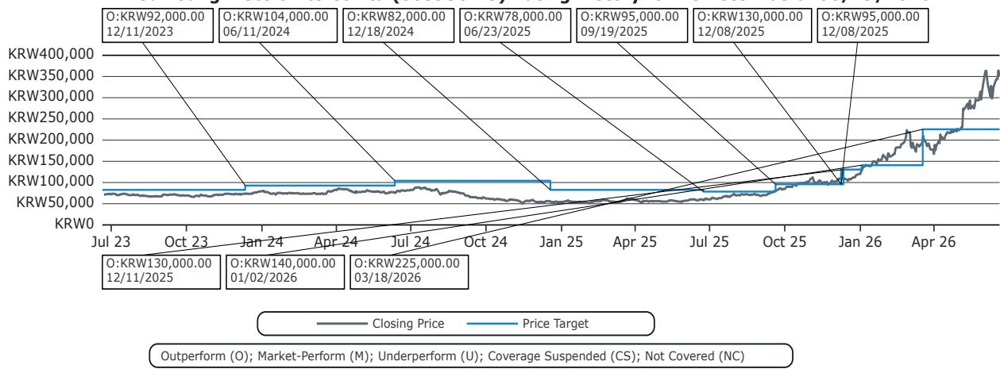

Samsung Electronics Co Ltd (005935.KS) Rating History for Bernstein as of 06/19/2026  
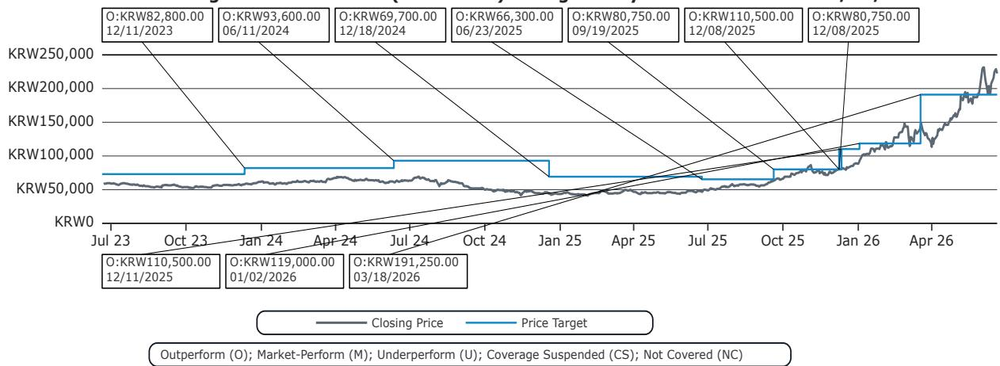

Samsung Electronics Co Ltd (SMSN.LI) Rating History for Bernstein as of 06/19/2026  
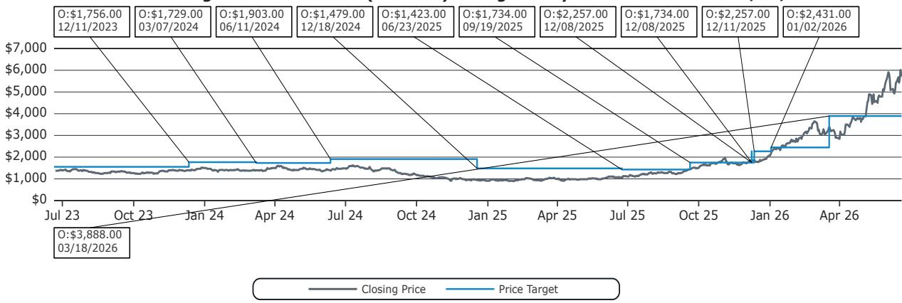  
Outperform (O); Market-Perform (M); Underperform (U); Coverage Suspended (CS); Not Covered (NC)

SK Hynix Inc (000660.KS) Rating History for Bernstein as of 06/19/2026  
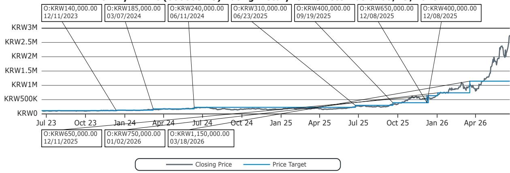  
Outperform (O); Market-Perform (M); Underperform (U); Coverage Suspended (CS); Not Covered (NC)

Micron Technology Inc (MU) Rating History for Bernstein as of 06/19/2026  
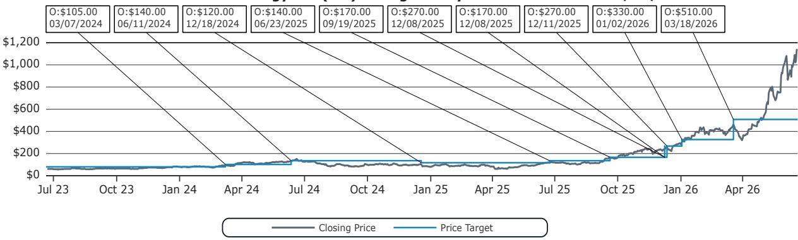  
Outperform (O); Market-Perform (M); Underperform (U); Coverage Suspended (CS); Not Covered (NC)

KIOXIA Holdings Corp (285A.JP) Rating History for Bernstein as of 06/19/2026  
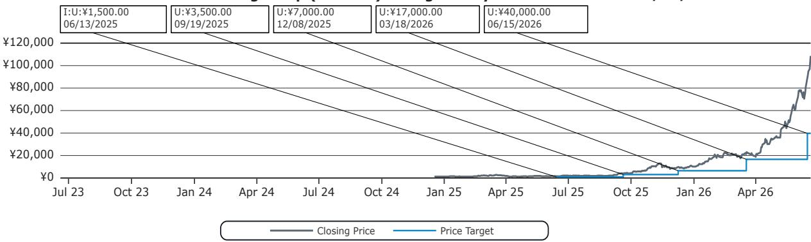  
Outperform (O); Market-Perform (M); Underperform (U); Coverage Suspended (CS); Not Covered (NC)

MediaTek Inc (2454.TT) Rating History for Bernstein as of 06/19/2026  
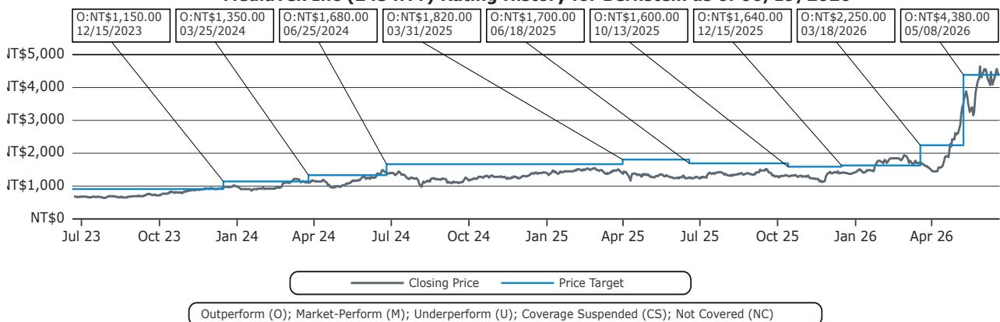  
All price target and closing price data in the chart(s) above are denominated in the currency noted in the Ticker Table of this report.

## CONFLICTS OF INTEREST

SG and/or its affiliates beneficially own 0.5% or more of [the total issued share capital/any class of common equity securities] with a net [long/short] position of: Micron Technology Inc.

SG and/or its affiliates beneficially own 1% or more of a class of common equity securities of the following company: KIOXIA Holdings Corp.

Bernstein has received compensation for non-investment banking securities-related products or services in the previous twelve months from the following clients: Samsung Electronics Co Ltd.

Bernstein and/or affiliates have received compensation for non-investment banking securities-related products or services in the previous twelve months from the following clients: Samsung Electronics Co Ltd, SK Hynix Inc and KIOXIA Holdings Corp.

Certain affiliates of Bernstein act as market maker or liquidity provider in the debt securities of: SK Hynix Inc and KIOXIA Holdings Corp.

Certain affiliates of Bernstein act as market maker or liquidity provider in the equities securities of: Micron Technology Inc.

## OTHER MATTERS

The legal entity(ies) employing the analyst(s) listed in this report, and their location, can be determined by the country code of their phone number, as follows:

+1 Bernstein Institutional Services LLC; New York, New York, USA

+44 Bernstein Autonomous LLP; London UK

+212 SG Africa Technologies & Services; Casablanca, Morocco

+33 BSG France S.A.; Paris, France

+34 BSG France S.A.; Madrid, Spain

+41 Bernstein Autonomous LLP; Geneva, Switzerland

+49 BSG France S.A.; Frankfurt, Germany

+91 Bernstein (India) Private Limited; Mumbai, India

+852 Bernstein (Hong Kong) Limited 盛博香港有限公司; Hong Kong, China

+65 Bernstein (Singapore) Private Limited; Singapore

+81 Bernstein Japan KK; Tokyo, Japan

Where this report has been prepared by research analyst(s) employed by a non-US affiliate, such analyst(s), is/are (unless otherwise expressly noted below) not registered as associated persons of Bernstein Institutional Services LLC or any other SEC-registered broker-dealer and are not licensed or qualified as research analysts with FINRA. Accordingly, such analyst(s) may not be subject to FINRA's restrictions regarding (among other things) communications by research analysts with a subject company, interactions between research analysts and investment banking personnel, participation by research analysts in solicitation and marketing activities relating to investment banking transactions, public appearances by research analysts, and trading securities held by a research analyst account.

Where this report has been prepared by research analyst(s) employed by SG Africa Technologies & Services (part of the SG group of companies), it has been prepared on behalf of a Bernstein company under a Global Services Agreement in place between Bernstein and SG.

## CERTIFICATION

Each research analyst listed in this report, who is primarily responsible for the preparation of the content of this report, certifies that all of the views expressed in this publication accurately reflect that analyst's personal views about any and all of the subject securities or issuers and that no part of that analyst's compensation was, is, or will be, directly or indirectly, related to the specific recommendations or views in this publication.

## II. ADDITIONAL GLOBAL CONFLICT DISCLOSURES

It is at the sole discretion of the Firm as to when to initiate, update and cease research coverage. The Firm has established, maintains and relies on information barriers to control the flow of information contained in one or more areas (i.e., the private side) within the Firm, and into other areas, units, groups or affiliates (i.e., public side) of the Firm.

## III. OTHER IMPORTANT INFORMATION AND DISCLOSURES

Separate branding is maintained for “Bernstein” and “Autonomous” research products.

\- Bernstein produces a number of different types of research products including, among others, fundamental analysis and quantitative analysis under both the “Autonomous” and “Bernstein” brands. Recommendations contained within one type of research product may differ from recommendations contained within other types of research products, whether as a result of differing time horizons, methodologies or otherwise. Furthermore, views or recommendations within a research product issued under one brand may differ from views or recommendations under the same type of research product issued under the other brand. The Research Ratings System for the two brands and other information related to those Rating Systems are included in the previous section.

\- Autonomous operates as a separate business unit within the following entities: Bernstein Institutional Services LLC, Bernstein Autonomous LLP, Bernstein (Hong Kong) Limited 盛博香港有限公司 and Bernstein (India) Private Limited. For information relating to “Autonomous” branded products (including certain Sales materials) please visit:

www.autonomous.com. For information relating to Bernstein branded products please visit: www.bernsteinresearch.com.

Analysts are compensated based on aggregate contributions to the research franchise as measured by account penetration, productivity and proactivity of investment ideas. No analysts are compensated based on performance in, or contributions to, generating investment banking revenues.

This report has been produced by an independent analyst as defined in Article 3 (1)(34)(i) of EU 596/2014 Market Abuse Regulation (“MAR”) and the same article of MAR as it forms part of United Kingdom domestic law by virtue of the European Union (Withdrawal) Act 2018.

To our readers in the United States: Bernstein Institutional Services LLC, a broker-dealer registered with the U.S. Securities and Exchange Commission (“SEC”) and a member of the U.S. Financial Industry Regulatory Authority, Inc. (“FINRA”) is distributing this publication in the United States and accepts responsibility for its contents. Where this material contains an analysis of debt product(s), such material is intended only for institutional investors and is not subject to the US independence and disclosure standards applicable to debt research prepared for retail investors.

Bernstein Institutional Services LLC may act as principal for its own account or as agent for another person (including an affiliate) in sales or purchases of any security which is a subject of this report. This report does not purport to meet the objectives or needs of any specific individuals, entities or accounts.

To our readers in Canada: If this publication pertains to a Canadian domiciled company, it is being distributed in Canada by Bernstein (Canada) Limited, which is licensed and regulated by the Canadian Investment Regulatory Organization. If the publication pertains to a non-Canadian domiciled company, it is being distributed by Bernstein Institutional Services LLC, which is licensed and regulated by both the SEC and FINRA, into Canada under the International Dealers Exemption.

This document may not be passed onto any person in Canada unless that person qualifies as "permitted client" as defined in Section 1.1 of NI 31-103.

To our readers in Brazil: This report has been prepared by Bernstein Institutional Services LLC, and Banco BTG Pactual S.A. ("BTG") is responsible for the distribution of this report in Brazil.

To readers in the United Kingdom: This publication has been issued or approved for issue in the United Kingdom by Bernstein Autonomous LLP, authorised and regulated by the Financial Conduct Authority and located at 60 London Wall, London EC2M 5SH, +44 (0)20-7170-5000. Registered in England & Wales No OC343985.

This document is for distribution only to persons who (i) have professional experience in matters relating to investments falling within Article 19(5) of the Financial Services and Markets Act 2000 (Financial Promotion) Order 2005 (as amended, the “Financial Promotion Order”), (ii) are persons falling within Article 49(2)(a) to (d) (“high net worth companies, unincorporated associations, etc.”) of the Financial Promotion Order, (iii) are outside the United Kingdom, or (iv) are persons to whom an invitation or inducement to engage in investment activity (within the meaning of section 21 of the FSMA) in connection with the issue or sale of any securities may otherwise lawfully be communicated or caused to be communicated (all such persons together being referred to as “relevant persons”). This document is directed only at relevant persons and must not be acted on or relied on by persons who are not relevant persons. Any investment or investment activity to which this document relates is available only to relevant persons and will be engaged in only with relevant persons.

To our readers in the member states of the EEA: This publication is being distributed by BSG France SA, which is authorised and regulated by the Autorité de Contrôle Prudentiel et de Résolution (ACPR) and Autorité des Marchés Financiers (AMF).

To our readers in Hong Kong: This publication is being distributed in Hong Kong by Bernstein (Hong Kong) Limited 盛博香港有限公司, which is licensed and regulated by the Hong Kong Securities and Futures Commission (Central Entity No. AXC846) to carry out Type 4 (Advising on Securities) regulated activities and subject to the licensing conditions mentioned in the SFC Public Register (https://www.sfc.hk/publicregWeb/corp/AXC846/details)). This publication is solely for professional investors, as defined in the Securities and Futures Ordinance (Cap. 571). The purpose of this report is solely to provide an analysis of the issuers referred to in this report and is not intended for any purpose contrary to the laws of Hong Kong.

To our readers in Singapore: This publication is being distributed in Singapore by Bernstein (Singapore) Private Limited, only to accredited investors or institutional investors, as defined in the Securities and Futures Act 2001 of Singapore ("SFA"). Recipients in Singapore should contact Bernstein (Singapore) Private Limited in respect of matters arising from, or in connection with, this publication. Bernstein (Singapore) Private Limited is regulated by the Monetary Authority of Singapore and licensed under the SFA as a capital markets services licence holder for dealing in capital markets products that are securities and collective investment schemes and an exempt financial adviser for advising on, issuing and promulgating analyses and reports on securities. Bernstein (Singapore) Private Limited is registered in Singapore with Company Registration

No. 20213710W and located at 8 Marina Boulevard, #12-01, Marina Bay Financial Centre, Singapore 018981, +65-6326-7000.

To our readers in the People's Republic of China: The securities referred to in this document are not being offered or sold and may not be offered or sold, directly or indirectly, in the People's Republic of China (for such purposes, not including the Hong Kong and Macau Special Administrative Regions or Taiwan, the "PRC") in contravention of any applicable laws of the PRC.

This document does not constitute an offer to sell or the solicitation of an offer to buy any securities in the PRC to any person to whom it is unlawful to make the offer or solicitation in the PRC.

We do not represent that this document may be lawfully distributed, or that any securities may be lawfully offered, in compliance with any applicable registration or other requirements in the PRC, or pursuant to an exemption available thereunder, or assume any responsibility for facilitating any such distribution or offering. In particular, no action has been taken by us which would permit a public offering of any securities or distribution of this document in the PRC. Accordingly, the securities are not being offered or sold within the PRC by means of this document or any other document. Neither this document nor any advertisement or other offering material may be distributed or published in the PRC, except under circumstances that will result in compliance with any applicable laws and regulations.

To our readers in Japan: This publication is being distributed in Japan by Bernstein Japan KK (サンフォード・C・バーンスタイン株式会社), which is registered in Japan as a Financial Instruments Business Operator with the Kanto Local Finance Bureau (registration number: The Director-General of Kanto Local Finance Bureau (FIBO) No.3387) and regulated by the Financial Services Agency. It is also a member of Investment Management Association of Japan. This publication is solely for qualified institutional investors in Japan only, as defined in Article 2, paragraph (3), items (i) of the Financial Instruments and Exchange Act.

For the institutional client readers in Japan who have been granted access to the Bernstein website by Daiwa Group Inc. ("Daiwa"), your access to this document should not be construed as meaning that Bernstein is providing you with investment advice for any purposes. Whilst Bernstein has prepared this document, your relationship is, and will remain with, Daiwa, and Bernstein has neither any contractual relationship with you nor any obligations towards you.

To our readers in Australia: Bernstein (Hong Kong) Limited 盛博香港有限公司 is responsible for distributing research in Australia. It is regulated by the Securities and Exchange Commission under U.S. laws, by the Financial Conduct Authority under U.K. laws, which differs from Australian laws. Bernstein (Hong Kong) Limited 盛博香港有限公司 is exempt from the requirement to hold an Australian financial services license under the Corporations Act 2001 in respect of the provision of the following financial services to wholesale clients:

• providing financial product advice;

• dealing in a financial product;

\- making a market for a financial product; and

• providing a custodial or depository service.

To our readers in India: This publication is being distributed in India by Bernstein (India) Private Limited (SCB India) which is licensed and regulated by Securities and Exchange Board of India ("SEBI") as a research analyst entity under the SEBI (Research Analyst) Regulations, 2014, having registration no. INH000006378 and as a stock broker having registration no. INZ000213537. SCB India is currently engaged in the business of providing research and stock broking services. Please refer to www.bernsteinresearch.in for more information.

\- SCB India is a Private limited company incorporated under the Companies Act, 2013, on April 12, 2017 bearing corporate identification number U65999MH2017FTC293762, and registered office at Level 3A, 4th Floor, First International Financial Centre, Plot Nos C-54 and C-55, G Block, Near CBI Office, Bandra Kurla Complex, Bandra (East), Mumbai 400098, Maharashtra, India (Phone No: +91-22-68421401).

\- For details of Associates (i.e., affiliates/group companies) of SCB India, kindly email MUM-BERNSTEIN-InCompliance@bernsteinsg.com.

• SCB India does not have any disciplinary history as on the date of this report.

\- Except as noted above, SCB India and/or its Associates (i.e., affiliates/group companies), the Research Analysts authoring this report, and their relatives

• do not have any financial interest in the subject company

• do not have actual/beneficial ownership of one percent or more in securities of the subject company;

\- is not engaged in any investment banking activities for Indian companies, as such;

• have not managed or co-managed a public offering in the past twelve months for any Indian companies;

\- have not received any compensation for investment banking services or merchant banking services from the subject company in the past 12 months;

• have not received compensation for brokerage services from the subject company in the past twelve months;

\- have not received any compensation or other benefits from the subject company or third party related to the specific recommendations or views in this report; and

\- do not currently, but may in the future, act as a market maker in the financial instruments of the companies covered in the report.

\- do not have any conflict of interest in the subject company as of the date of this report.

\- Except as noted above, the subject company has not been a client of SCB India during twelve months preceding the date of distribution of this research report. Neither SCB India nor its Associates (i.e., affiliates/group companies) have received compensation for products or services other than investment banking, merchant banking or brokerage services from the subject company in the past twelve months.

\- The principal research analyst(s) who prepared this report, members of the analysts' team, and members of their households are not an officer, director, employee or advisory board member of the companies covered in the report.

\- Our Compliance officer / Grievance officer is Ms. Rupal Talati, who can be reached at +91-22-68421451, or MUM-BERNSTEIN-InCompliance@bernsteinsg.com / Scbin-investorgrievance@bernsteinsg.com

\- The Research investor charter and Terms & Conditions of SCB India are available on its website and may be accessed at Bernstein (India) Private Limited (https://bernsteinresearch.in/) for your reference.

\- Disclaimer: Registration granted by SEBI, and certification from NISM, is in no way a guarantee of performance of the intermediary or provide any assurance of returns to investors. Investments in securities market are subject to market risks. Read all the related documents carefully before investing.

To our readers in Switzerland: This document is provided in Switzerland by or through Bernstein Autonomous LLP, and is provided only to qualified investors as defined in article 10 of the Swiss Collective Investment Scheme Act (“CISA”) and related provisions of the Collective Investment Scheme Ordinance and in strict compliance with applicable Swiss law and regulations. The products mentioned in this document may not be suitable for all types of investors. This document is based on the Directives on the Independence of Financial Research issued by the Swiss Bankers Association (SBA) in January 2008.

To our readers in the Middle East: Bernstein Autonomous LLP, DIFC branch has its principal office at Gate Village 06, DIFC, Dubai, UAE. Bernstein Autonomous LLP, DIFC branch is regulated by the Dubai Financial Services Authority (DFSA) with the registration number CL10040 and is provisioned for Arranging Deals in Investments and Advising on Financial Products. All communications and services are directed at Professional Clients and Market Counterparties only (as defined in the DFSA rulebook). Persons other than Professional Clients and Market Counterparties, such as Retail Clients, are not the intended recipients of our communications or services.

## LEGAL

All research publications are disseminated to our clients through posting on the firm's password protected websites, bernsteinresearch.com and autonomous.com. Certain, but not all, research publications are also made available to clients through third-party vendors or redistributed to clients through alternate electronic means as a convenience.

This publication has been published and distributed in accordance with the Firm's policy for management of conflicts of interest in investment research, a copy of which is available from Bernstein Institutional Services LLC, Director of Compliance, 245 Park

Avenue, New York, NY 10167. Additional disclosures and information regarding Bernstein's business are available on our website www.bernsteinresearch.com.

The securities described herein may not be eligible for sale in all jurisdictions or to certain categories of investors where that permission profile is not consistent with the licenses held by the entities noted herein. This document is for distribution only as may be permitted by law. This publication is not directed to, or intended for distribution to or use by, any person or entity who is a citizen or resident of, or located in any locality, state, country or other jurisdiction where such distribution, publication, availability or use would be contrary to law or regulation or which would subject any of the entities referenced herein or any of their subsidiaries or affiliates to any registration or licensing requirement within such jurisdiction. This publication is based upon public sources we believe to be reliable, but no representation is made by us that the publication is accurate or complete. We do not undertake to advise you of any change in the reported information or in the opinions herein. This publication was prepared and issued by entity referred to herein for distribution to eligible counterparties or professional clients. This publication is not an offer to buy or sell any security, and it does not constitute investment, legal or tax advice. The investments referred to herein may not be suitable for you. Investors must make their own investment decisions in consultation with their professional advisors in light of their specific circumstances. The value of investments may fluctuate, and investments that are denominated in foreign currencies may fluctuate in value as a result of exposure to exchange rate movements. Information about past performance of an investment is not necessarily a guide to, indicator of, or assurance of, future performance.

This report is directed to and intended only for our clients who are “eligible counterparties”, “professional clients”, “institutional investors” and/or “professional investors” as defined by the aforementioned regulators, and must not be redistributed to retail clients as defined by the aforementioned regulators. Retail clients who receive this report should note that the services of the entities noted herein are not available to them and should not rely on the material herein to make an investment decision. The result of such act will not hold the entities noted herein liable for any loss thus incurred as the entities noted herein are not registered/authorised/licensed to deal with retail clients and will not enter into any contractual agreement/arrangement with retail clients. This report is provided subject to the terms and conditions of any agreement that the clients may have entered into with the entities noted herein. All research reports are disseminated on a simultaneous basis to eligible clients through electronic publication to our client portal.

The information in this report was prepared by Bernstein solely for the internal business use of our clients. Clients may store, display, analyze, reformat and print the information in this report for this limited use only. Clients may not copy, alter, create derivative works, resell, reverse engineer, commercially exploit, share or distribute any part of the information contained herein for any purpose without Bernstein's express written consent. These restrictions include extracting data or using the content to develop indices or other products. Further, you may not use this report, or any portion of this report, to train or finetune any third-party machine learning or artificial intelligence system, or as a prompt or input into any such system. You also may not, without Bernstein's express written consent, do any of the foregoing in connection with your own internal machine learning or artificial intelligence system.

Bernstein may use artificial intelligence tools in the preparation of its materials. Any such materials are reviewed by Bernstein's research analysts prior to publication.

This report has been prepared for information purposes only and is based on current public information that we consider reliable, but the entities noted herein do not warrant or represent (express or implied) as to the sources of information or data contained herein are accurate, complete, not misleading or as to its fitness for the purpose intended even though the entities noted herein rely on reputable or trustworthy data providers, it should not be relied upon as such. Opinions expressed are the author(s)' current opinions as of the date appearing on the material only and we do not undertake to advise you of any change in the reported information or in the opinions herein.

Any references to SG herein are purely factual, based upon publicly available information, and included for comparative purposes only. They do not constitute an opinion or recommendation with respect to the securities of SG.

This publication was prepared and issued by the entity referred to herein for distribution to eligible counterparties or professional clients. The information in this report is intended for general circulation and does not constitute an offer to buy or sell any security, investment, legal or tax advice nor a personal recommendation, as defined by any of the aforementioned regulators. It does not take into account the particular investment objectives, financial situations, or needs of individual investors. The report has not been reviewed by any of the aforementioned regulators and does not represent any official recommendation from the aforementioned regulators. The investments referred to herein may not be suitable for you. Investors must make their own investment decisions in consultation with advice sought from a financial adviser regarding the suitability of the investment product, taking into account the specific investment objectives, financial situation or particular needs of any recipient of the recommendation, before the recipient makes a commitment to purchase the investment product.

The analysis contained herein is based on numerous assumptions. Different assumptions could result in materially different results. The information in this report does not constitute, or form part of, any offer to sell or issue, or any offer to purchase or subscribe for shares, or to induce engagement in any other investment activity. The value of any securities or financial instruments mentioned in this report may fluctuate subject to market conditions. Information about past performance of an investment is not necessarily a guide to, indicative of, or assurance of future performance. Estimates of future performance mentioned by the research analyst in this report are based on assumptions that may not be realized due to unforeseen factors like market volatility/fluctuation. In relation to securities or financial instruments denominated in a foreign currency other than the clients' home currency, movements in exchange rates will have an effect on the value, either favorable or unfavorable. Before acting on any recommendations in this report, recipients should consider the appropriateness of investing in the subject securities or financial instruments mentioned in this report and, if necessary, seek independent professional advice.

The securities described herein may not be eligible for sale in all jurisdictions or to certain categories of investors where that permission profile is not consistent with the licenses held by the entities noted herein. This document is for distribution only as may be permitted by law. It is not directed to, or intended for distribution to or use by, any person or entity who is a citizen or resident of or located in any locality, state, country or other jurisdiction where such distribution, publication, availability or use would be contrary to law or regulation or would subject the entities noted herein to any regulation or licensing requirement within such jurisdiction.

Source: Bloomberg Index Services Limited. BLOOMBERG® is a trademark and service mark of Bloomberg Finance L.P. and its affiliates (collectively “Bloomberg”). Bloomberg or Bloomberg’s licensors own all proprietary rights in the Bloomberg Indices. Neither Bloomberg nor Bloomberg’s licensors approves or endorses this material, or guarantees the accuracy or completeness of any information herein, or makes any warranty, express or implied, as to the results to be obtained therefrom and, to the maximum extent allowed by law, neither shall have any liability or responsibility for injury or damages arising in connection therewith.

No part of this material may be reproduced, distributed or transmitted or otherwise made available without prior consent of the entities noted herein. Copyright Bernstein Institutional Services LLC Bernstein Autonomous LLP, BSG France S.A., Bernstein (Hong Kong) Limited 盛博香港有限公司, Bernstein (Canada) Limited, Bernstein (India) Private Limited (SEBI registration no. INH000006378), Bernstein (Singapore) Private Limited and Bernstein Japan KK (サンフォード・C・バーンスタイン株式会社). All rights reserved. The trademarks and service marks contained herein are the property of their respective owners. Any unauthorized use or disclosure is strictly prohibited. The entities noted herein may pursue legal action if the unauthorized use results in any defamation and/or reputational risk to the entities noted herein and research published under the Bernstein and Autonomous brands.