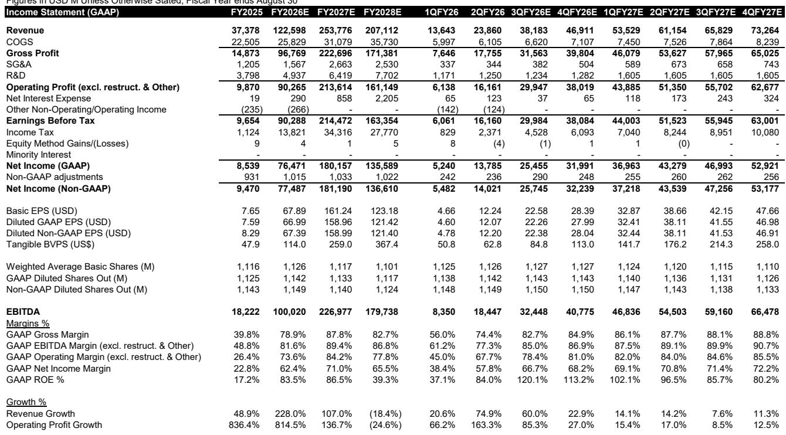
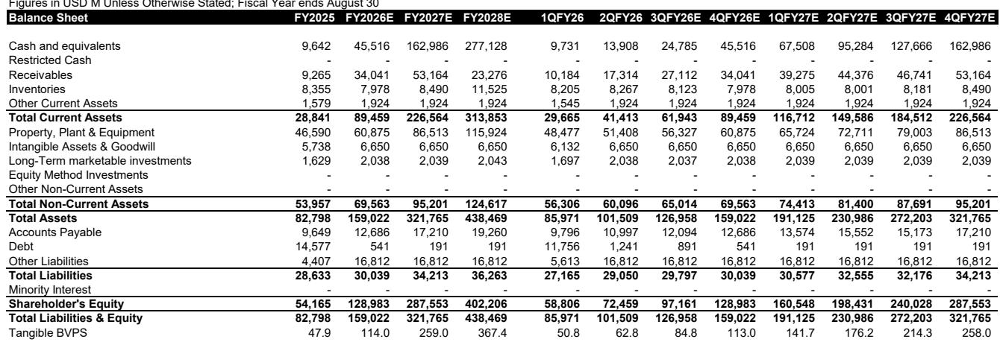
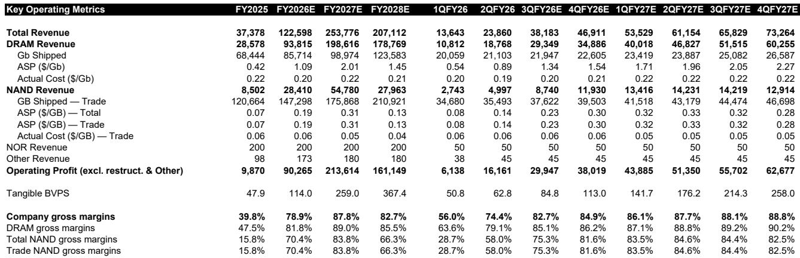

# Bernstein：AI正被内存成本压到喘不过气，一场供应链“再校准”不可避免

当所有人都在关注GPU算力瓶颈时，内存正在悄然成为AI基础设施中最被低估的成本变量。这份Bernstein研报揭示了一个反直觉的判断：市场真正低估的不是需求，而是供给侧定价权转移带来的成本结构重塑。HBM价格即将迎来2-2.5倍的跳升，而经过NVIDIA等GPU供应商的“加价”传导后，超大规模云厂商的AI资本开支可能被迫上调30%。这不是一个边际变化，而是一个需要重新审视整个AI投资回报模型的系统性冲击。

报告的核心信号是：内存价格压力正在从消费电子蔓延至AI领域。过去三年，HBM作为AI算力的“伴生品”，其定价一直被长期合同锁定，与暴涨的常规DRAM价格形成了巨大背离。这种背离正在扭曲内存供应商的产能分配决策，也将倒逼整个供应链进行一次痛苦的“再校准”。

## 1. 常规DRAM价格暴涨4.5倍，HBM定价扭曲已到极限

Bernstein的分析显示，从2025年第三季度到2026年第二季度，常规DRAM价格已经上涨了约4.5倍。而HBM由于采用年度合同定价，价格几乎没有变动。这种定价机制带来的结果是：同样一片晶圆产能，投入常规DRAM产生的收入是HBM的2倍以上，毛利润更是接近3倍。三星和美光在2026年第一季度财报电话会议上均已明确表示，非HBM的DRAM利润率已经领先于HBM，且随着常规DRAM价格继续攀升，这一差距还在扩大。

这里的关键洞察不在于价格差异本身，而在于这个差异对供应行为的扭曲。当内存供应商发现生产常规DRAM比生产HBM更赚钱时，他们会有强烈的动机将产能从HBM转向常规DRAM。而HBM恰恰是当前AI算力最紧缺的组件。这种供给侧的“理性选择”正在制造一个结构性矛盾：AI需求最旺盛的环节，反而面临最严重的供给抑制。

Bernstein估算，要使HBM每片晶圆收入赶上常规DRAM，HBM价格需要上涨约3倍。但报告也指出，内存供应商可能不会采取如此激进的定价策略，因为他们意识到过高的HBM成本会损害整个AI生态的健康发展。SK海力士在财报中也强调，将努力实现“HBM与通用DRAM之间的最优分配”，而非追求收入最大化。因此，Bernstein假设HBM价格在2027年上涨2-2.5倍，即便如此，HBM的盈利能力仍将低于常规DRAM，只是差距会大幅收窄。

## 2. GPU供应商的“加价”效应，将使成本压力放大4倍

这是整份报告中最容易被忽视、但影响最为深远的洞察。HBM并非由超大规模云厂商直接采购，而是被封装在NVIDIA等GPU供应商的加速器内部，成为其销售成本的一部分。当HBM价格上涨时，GPU供应商面临一个两难选择：要么让利压缩自身毛利率，要么通过加价将成本转嫁给下游。

以NVIDIA的Vera Rubin（VR200）机架为例，Bernstein假设NVIDIA的毛利率为75%。如果HBM成本上升，NVIDIA若要保持毛利率不变，其对机架的提价幅度将是HBM成本涨幅的4倍。具体而言，假设HBM原本占VR200售价的5%，HBM价格上涨2-2.5倍后，仅HBM成本本身就会推动VR200售价上涨6%。但经过NVIDIA的4倍加价后，机架价格将上涨24%。

这个“加价”机制的意义远超数字本身。它意味着HBM的价格波动被GPU供应商的财务结构放大了。对于超大规模云厂商而言，他们面对的不仅是内存供应商的涨价，还有一个被杠杆放大的系统级涨价。Bernstein测算，如果仅将HBM成本直接传导，数据中心总资本开支增加4%；但如果包含NVIDIA的加价，增幅将扩大到15%。再加上常规DRAM和NAND价格的大幅上涨，总资本开支增幅将达到约30%。

## 3. 超大规模云厂商的ROI模型需要重算，但投资不会减速

30%的资本开支增幅意味着什么？对于正在建设AI数据中心的超大规模云厂商而言，这意味着他们基于原有预算做的投资回报分析需要全部重算。投资项（I）比预期高出30%，在收入预期不变的情况下，ROI将显著下降。

但Bernstein的判断是，这不会导致AI投资减速。竞争压力和资金可得性决定了超大规模云厂商仍将继续投入。真正会发生的是“再校准”——成本负担将在超大规模云厂商、供应链各环节，甚至可能包括Token价格之间重新分配。报告特别提出一个值得追踪的问题：超大规模云厂商是否会通过调整不同客户的Token定价来转嫁成本压力？

这个“再校准”过程将不可避免地挤压弱势供应商。那些缺乏议价能力、技术路线单一或规模不足的企业可能面临被淘汰的风险。但Bernstein覆盖的标的——三星、SK海力士、美光——均处于有利位置，甚至可能成为受益者。

## 4. 三星HBM4技术领先，但“更多HBM”可能意味着更少利润

报告中的一个重要技术判断是：三星在HBM4技术上已取得领先。Bernstein的韩国内存出口追踪数据显示，5月份三星的多芯片内存出口单位价值出现显著提升，这很可能与HBM4开始出货有关。基于此，Bernstein预计三星的HBM市场份额将在今明两年增长。

然而，这里存在一个反直觉的结论：更高的HBM市场份额可能意味着更低的利润率。如前所述，HBM的盈利能力目前低于常规DRAM，且即使价格上涨后，差距仍将存在。三星在财报中表现出对利润率的强烈关注，因此Bernstein认为，即便三星拥有HBM4的技术优势，它也可能选择将更多产能分配给盈利能力更强的常规DRAM。

这意味着HBM市场的份额竞争可能不会像市场预期的那样激烈。技术领先者未必会全力抢占份额，因为这样做会牺牲短期利润。这个判断对于理解HBM供给格局至关重要：供给不会因为技术突破就自动增加，利润考量才是真正的决定因素。

## 5. 联发科可能成为“直接采购”趋势的意外受益者

报告提出一个尚未被市场充分定价的投资逻辑：如果超大规模云厂商能够直接采购HBM以规避GPU供应商的加价，那么拥有ASIC服务能力的公司将成为受益者。联发科正是这一逻辑下的潜在标的。

Bernstein认为，尽管NVIDIA等加速器供应商会强调HBM与系统集成的价值，并试图将HBM保留在自己的收入结构中，但超大规模云厂商有强烈的动机进行谈判，争取直接采购HBM。联发科的业务模式允许超大规模云厂商实现这一点。报告还提到，联发科在第一个和第二个TPU项目上的执行情况良好，最近的供应链检查显示其2028年预测存在上行风险。虽然过去两个月股价已上涨约130%，但Bernstein仍维持“跑赢大盘”评级。

这个逻辑链条值得深入拆解：直接采购HBM不仅能规避加价，还能让超大规模云厂商在定价谈判中拥有更多主动权。但这也意味着，NVIDIA等公司的收入结构可能面临变化——HBM从“系统收入”的一部分变成纯粹的“过手成本”，这对其毛利率的影响需要重新评估。

## 6. 盈利修正正在路上，但HBM敞口越大，利润反而越低

Bernstein预计，随着HBM价格谈判在未来几个月逐步落地，卖方共识将出现显著上修。报告将HBM价格假设上调2-2.5倍，并据此更新盈利预测，发现2027年每股收益预期比市场共识高出25-40%。这意味着三星、SK海力士和美光的股价在近期将获得盈利修正的支撑。

但这里有一个关键伏笔：更高的HBM敞口将导致内存供应商的利润率下降。这意味着盈利增长主要来自收入规模的扩张，而非利润率的改善。对于投资者而言，需要区分“盈利增长”和“盈利能力提升”这两个概念。Bernstein对三星、SK海力士和美光的目标价分别设定为44万韩元、330万韩元和1300美元，对应2027年预期市盈率分别为4.5倍、4.8倍和7.1倍。估值水平并不高，但背后的盈利质量需要审慎评估。

报告尚未完全回答的一个关键问题是：HBM定价谈判最终会以怎样的折衷方案结束？内存供应商希望缩小与常规DRAM的利润率差距，GPU供应商希望维持自身毛利率，超大规模云厂商希望控制资本开支。三方博弈的结果将决定未来2-3年整个AI供应链的利润分配格局。Bernstein的2-2.5倍涨幅假设是一个中间情景，但实际结果可能偏离这个区间。

## 7. 一个尚未被回答的关键问题：GPU供应商的“加价”能持续吗？

报告承认其分析存在局限性。首先，超大规模云厂商很可能混合部署VR200服务器与其他加速器或纯CPU服务器，实际成本结构会更复杂。其次，部分常规DRAM和NAND可能预装在NVIDIA的服务器中，因此也可能面临加价，而报告为简化分析假设没有加价。

最值得关注的是GPU供应商对“加价”行为的辩护逻辑。他们可能会强调，HBM是整个系统的有机组成部分，其价值体现在与逻辑芯片、封装、软件的整体集成中，因此不应被视为独立组件进行定价。他们可能声称HBM只是“过手收入”，而高毛利率来自系统其他部分的价值创造。这个论点是否成立，取决于客户是否认可系统集成的溢价。

如果超大规模云厂商接受这一逻辑，那么HBM成本将完全由GPU供应商的定价策略决定，内存供应商的议价空间反而被压缩。如果客户不接受，直接采购HBM的趋势将加速，联发科等ASIC服务商的受益逻辑将更加坚实。这个问题的答案将在未来6-12个月逐步清晰。

---

以上讨论触及了供应链博弈、定价权转移和盈利质量等核心议题，但报告中的完整数据模型、不同情景下的敏感性分析以及各公司具体的产能分配策略，无法在一篇文章中穷尽。如果你希望深入理解HBM定价谈判的博弈细节、三星HBM4的技术领先究竟意味着什么，以及联发科在ASIC领域的真正潜力，欢迎来星球微信群里继续讨论。我们将基于Bernstein的完整模型，结合最新的供应链数据，持续追踪这场“再校准”的每一个关键节点。

Personal reading notes and learning share only. Not investment advice.

